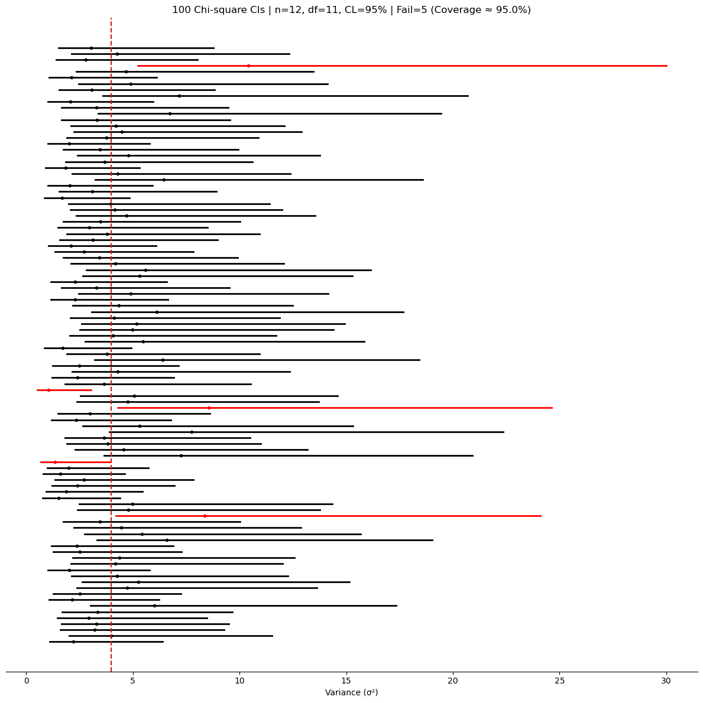

# σ²의 신뢰구간

## 모분산의 신뢰구간

모집단의 변동성을 추정하는 것이 목표일 때는 모분산 $\sigma^2$(동등하게 모표준편차 $\sigma$)의 신뢰구간을 구성한다.

### 공식

$$
\left[\frac{(n-1)s^2}{\chi^2_{\alpha/2,\,n-1}},\;\frac{(n-1)s^2}{\chi^2_{1-\alpha/2,\,n-1}}\right]
$$

여기서

- $s^2$은 표본분산(Bessel 수정, $\text{ddof}=1$),
- $n - 1$은 자유도,
- $\chi^2_{\alpha/2, n-1}$과 $\chi^2_{1-\alpha/2, n-1}$은 카이제곱분포의 아래쪽·위쪽 임계값이다.

### 표본분포

추축량은

$$
\frac{(n-1)s^2}{\sigma^2} \sim \chi^2_{n-1}
$$

이 결과는 모집단이 정규분포를 따를 때 **정확히** 성립한다.

### 타당성 조건

$$
\sigma^2 \text{에 대한 카이제곱 신뢰구간}
\quad\text{if}\quad
\begin{cases}
\text{모집단 분포가 정규이다, 그래서 표본분포를 정확히 안다} \\
n \le 0.1N \text{ (i.i.d. 근사)}
\end{cases}
$$

!!! warning "결정적인 정규성 가정"
    이 신뢰구간은 **정규 자료에서만 정확하다**. 추축 결과 $(n-1)S^2/\sigma^2 \sim \chi^2_{n-1}$은 모집단이 정규일 **때에만** 성립한다. 모집단이 치우쳐 있거나 꼬리가 두꺼우면 이 관계가 깨지고, $n$이 커도 카이제곱 신뢰구간의 포함확률이 명목값보다 낮거나 높아질 수 있다. 평균에 도움을 주는 중심극한정리가 이 분산 신뢰구간을 구해 주지는 **못한다**.

### 언제 쓰는가

- 자료가 **정규모집단**에서 나왔다고 볼 만할 때(히스토그램이나 Q-Q 그림으로 확인하라. 대칭성과 얇은 꼬리를 보라).
- 정규 잡음으로 잘 모형화되는 측정오차나 공정 자료.
- 정규성 아래에서 정확한 소표본 추론을 가르치거나 시연할 때.

### 언제 조심해야 하는가

- **치우치거나 꼬리가 두꺼운** 자료, 또는 눈에 띄는 이상점 → 카이제곱 신뢰구간의 포함확률이 어긋날 수 있다. $\sigma$나 $\sigma^2$에 대한 붓스트랩 신뢰구간(백분위수 또는 BCa)을 고려하거나, 로버스트 척도추정량(예: MAD)과 붓스트랩을 함께 쓰라.
- **변환**(예: 로그)으로 정규화할 수 있지만, 그러면 신뢰구간은 변환된 척도에서의 분산에 대한 것이 된다.
- 두 분산을 비교할 때 쓰는 F-구간에도 같은 정규성 요구가 있다.

### Python 코드

```python
import numpy as np
from scipy.stats import chi2

n = 12
sigma = 2.0        # 참 모표준편차 (모의실험용이므로 답을 알고 있다)
alpha = 0.05

rng = np.random.default_rng(42)
x = rng.normal(loc=0, scale=sigma, size=n)

# ddof=1이 필수다. 베셀 보정을 빼면 s²이 아래로 편향되어
# 구간 전체가 왼쪽으로 밀린다.
s2 = x.var(ddof=1)
df = n - 1

chi2_lo = chi2(df=df).ppf(alpha / 2.0)
chi2_hi = chi2(df=df).ppf(1 - alpha / 2.0)

# 큰 임계값이 아래끝의 분모로 간다.
# (n-1)s²/σ² 이 두 임계값 사이에 있다는 부등식을 σ²에 대해 풀면
# σ²이 분모로 내려가 대소가 뒤집히기 때문이다.
ci_lower = df * s2 / chi2_hi
ci_upper = df * s2 / chi2_lo

print(f"95% CI for σ²: ({ci_lower:.4f}, {ci_upper:.4f})")
print(f"95% CI for σ:  ({np.sqrt(ci_lower):.4f}, {np.sqrt(ci_upper):.4f})")
```

출력:

```
95% CI for σ²: (1.8443, 10.5947)
95% CI for σ:  (1.3580, 3.2549)
```

참값 $\sigma^2 = 4$가 구간 안에 있지만 구간이 대단히 넓다. 위끝이 아래끝의 5.7배이며, $s^2 = 3.68$을 중심으로 대칭도 아니다. 카이제곱분포가 오른쪽으로 늘어져 있는 탓이다. $\sigma$의 척도에서는 제곱근을 취한 만큼 비대칭이 완화되어 $(1.36, 3.25)$가 된다.

$n = 12$로 분산을 추정한다는 것이 이 정도로 막연한 일이다. 같은 표본크기에서 평균의 구간은 이보다 훨씬 단단하다.

---

## 모의실험: 분산 신뢰구간의 포함확률

다음 스크립트는 정규모집단에서 표본을 여러 번 뽑아 $\sigma^2$에 대한 카이제곱 신뢰구간을 만들고, 그중 몇 개가 참 분산을 잡아내는지 추적한다.

```python
#!/usr/bin/env python3
"""
Variance CI via Chi-square simulation.
"""

import numpy as np
import matplotlib.pyplot as plt
from scipy.stats import chi2

rng_seed = 42        # 아래 그림을 재현하려면 고정한다
n_simulations = 100
n_samples = 12
mu = 0.0
sigma = 2.0
alpha = 0.05
report_sigma_not_sigma2 = False  # True로 두면 σ² 대신 σ의 구간을 그린다


def main():
    if rng_seed is not None:
        np.random.seed(rng_seed)

    true_var = sigma**2
    lowers = np.empty(n_simulations)
    uppers = np.empty(n_simulations)
    centers = np.empty(n_simulations)

    df = n_samples - 1
    chi2_lo = chi2(df=df).ppf(alpha / 2.0)
    chi2_hi = chi2(df=df).ppf(1 - alpha / 2.0)

    for i in range(n_simulations):
        x = np.random.normal(loc=mu, scale=sigma, size=n_samples)
        s2 = x.var(ddof=1)
        lowers[i] = df * s2 / chi2_hi
        uppers[i] = df * s2 / chi2_lo
        centers[i] = s2

    covered = (lowers <= true_var) & (true_var <= uppers)
    n_fail = int((~covered).sum())
    coverage_pct = 100.0 * covered.mean()

    if report_sigma_not_sigma2:
        lowers, uppers, centers = np.sqrt(lowers), np.sqrt(uppers), np.sqrt(centers)
        true_ref = np.sqrt(true_var)
        x_label = "Standard Deviation (σ)"
    else:
        true_ref = true_var
        x_label = "Variance (σ²)"

    fig, ax = plt.subplots(figsize=(12, 12))
    for i in range(n_simulations):
        color = "k" if covered[i] else "r"
        ax.plot([lowers[i], uppers[i]], [i, i], lw=2, color=color)
        ax.plot(centers[i], i, marker="o", ms=3, color=color)

    ax.axvline(true_ref, linestyle="--", linewidth=1.5, color="r")
    ax.set_title(
        f"{n_simulations} Chi-square CIs | n={n_samples}, df={df}, "
        f"CL={int((1 - alpha) * 100)}% | Fail={n_fail} (Coverage ≈ {coverage_pct:.1f}%)")
    ax.set_yticks([])
    for sp in ["left", "right", "top"]:
        ax.spines[sp].set_visible(False)
    ax.set_xlabel(x_label)
    plt.tight_layout()
    plt.show()


if __name__ == "__main__":
    main()
```



포함확률은 95.0%로 명목값과 정확히 맞는다. 근사가 아니라 정확한 분포 결과이므로 정규자료에서는 $n$이 작아도 어긋나지 않는다.

그림에서 눈여겨볼 것은 구간의 **모양**이다. 점(=$s^2$)이 구간 한가운데가 아니라 왼쪽으로 치우쳐 있고, 오른쪽 꼬리가 길다. 실패한 다섯 중 셋은 구간이 통째로 참값 오른쪽에 있고 둘은 왼쪽에 있는데, 오른쪽으로 빠진 구간들은 길이가 20을 넘도록 길다. $s^2$이 우연히 크게 나오면 구간의 아래끝도 함께 밀려 올라가면서 폭까지 커지기 때문이다.

## 연습문제

<div class="drillbox" markdown>

**연습문제 1.** <span class="diff easy" title="쉬움"></span>
볼베어링에서 $n = 15$, $s^2 = 0.0025$ mm²이다. (a) $\sigma^2$의 95% 신뢰구간. (b) $\sigma$의 95% 신뢰구간.

</div>

??? success "풀이"
    (a) $\chi^2_{14, 0.025} = 5.629$, $\chi^2_{14, 0.975} = 26.119$.

    $\sigma^2$의 신뢰구간: $(14 \cdot 0.0025/26.119, 14 \cdot 0.0025/5.629) = (0.00134, 0.00622)$.

    (b) $\sigma$의 신뢰구간 = $(\sqrt{0.00134}, \sqrt{0.00622}) = (0.0366, 0.0789)$ mm.

    유의: $\sigma^2$의 신뢰구간에 단조변환을 적용하면 $\sigma$에 대한 타당한 신뢰구간이 된다 — 포함확률이 같다.

<div class="drillbox" markdown>

**연습문제 2.** <span class="diff med" title="중간"></span>
**추축량.** 정규성 아래에서 $(n-1)S^2/\sigma^2 \sim \chi^2_{n-1}$이 추축량임을 보여라.

</div>

??? success "풀이"
    **추축량**은 미지의 모수에 의존하지 않는 알려진 분포를 갖는다.

    $(n-1)S^2/\sigma^2 \sim \chi^2_{n-1}$ — 이 카이제곱분포는 $\sigma^2$이나 $\mu$가 아니라 오직 $n$에만 의존한다.

    따라서 $P(\chi^2_{n-1, \alpha/2} \le (n-1)S^2/\sigma^2 \le \chi^2_{n-1, 1-\alpha/2}) = 1 - \alpha$라고 쓸 수 있다.

    $\sigma^2$에 대해 뒤집으면 신뢰구간을 얻는다.

    다른 추축량: 정규성 아래 평균의 신뢰구간에 쓰는 $(\bar X - \mu)/(s/\sqrt n) \sim t_{n-1}$.

<div class="drillbox" markdown>

**연습문제 3.** <span class="diff med" title="중간"></span>
**비대칭 신뢰구간.** $\sigma^2$의 신뢰구간이 $S^2$을 중심으로 비대칭인 이유는?

</div>

??? success "풀이"
    카이제곱분포는 **오른쪽으로 치우쳐** 있어 평균을 중심으로 분위수가 비대칭이다.

    $\chi^2_{14}$(연습문제 1)에서 하위 2.5% 분위수는 5.629, 상위 97.5% 분위수는 26.119이다. 평균은 14이다.

    평균에서 아래쪽까지의 거리: $14 - 5.6 \approx 8.4$. 평균에서 위쪽까지의 거리: $26 - 14 = 12$. 위쪽 꼬리가 더 멀리 뻗는다.

    $\sigma^2$의 신뢰구간으로 뒤집으면 하한은 $S^2$에 더 가깝고(더 큰 분모를 쓴다) 상한은 더 멀다(더 작은 분모를 쓴다).

    $n$이 크면 카이제곱이 정규에 가까워져 비대칭성이 줄어든다. $n = 100$쯤이면 신뢰구간이 거의 대칭이다.

<div class="drillbox" markdown>

**연습문제 4.** <span class="diff med" title="중간"></span>
**분산 신뢰구간을 위한 표본크기.** $\sigma$의 신뢰구간의 반너비가 $\sigma$의 $10\%$ 이하가 되려면 $n$은 얼마여야 하는가?

</div>

??? success "풀이"
    큰 $n$에서 델타 방법을 쓰면 $S/\sigma \approx N(1, 1/(2(n-1)))$이며, 따라서 $\mathrm{SE}(\log S) \approx 1/\sqrt{2(n-1)}$이다.

    $\sigma$의 95% 신뢰구간의 상대 반너비는 $\approx 1.96/\sqrt{2(n-1)}$이다. 이를 0.10으로 놓으면:

    $\sqrt{2(n-1)} = 19.6 \Rightarrow n - 1 \approx 192 \Rightarrow n \approx 193$.

    즉 상대 반너비 10%를 위해 대략 $n = 200$이 필요하다. 분산추정에는 놀랄 만큼 큰 표본이 필요하다 — 평균추정보다 훨씬 크다.

<div class="drillbox" markdown>

**연습문제 5.** <span class="diff med" title="중간"></span>
**정규가 아닌 자료와 $\sigma^2$의 신뢰구간.** 카이제곱 기반 신뢰구간이 비정규성에 취약한 이유는?

</div>

??? success "풀이"
    추축량 $(n-1)S^2/\sigma^2 \sim \chi^2_{n-1}$은 바탕 자료의 **정규성**에 의존한다. 정규가 아닌 자료에서는 $n$이 커도 이것이 성립하지 않는다.

    구체적으로 $S^2$의 표본분포는 모집단의 **4차 적률**(첨도)에 의존한다. 꼬리가 두꺼운 모집단에서는 $S^2$이 카이제곱 공식이 시사하는 것보다 훨씬 크게 변동한다.

    **결과:** 정규가 아닌 자료에서 명목 95% 신뢰구간의 실제 포함확률이 70–80%일 수 있다. 꼬리가 두꺼운 자료가 특히 영향을 받는다.

    **로버스트한 대안:**

    - **$\sigma^2$에 대한 붓스트랩 신뢰구간:** 재표본추출이 실제 표본분포를 포착한다.
    - **중앙값 절대편차(MAD):** 로버스트한 척도추정량. 붓스트랩으로 신뢰구간을 얻는다.
    - **절사 표준편차:** 극단 관측값에 로버스트하다.

    분산에 카이제곱 신뢰구간을 쓰기 전에 항상 정규성을 확인하라(Q-Q 그림). 의심스러우면 붓스트랩을 쓰라.

<div class="drillbox" markdown>

**연습문제 6.** <span class="diff med" title="중간"></span>
**$\sigma$의 신뢰구간과 $\sigma^2$의 신뢰구간.** $\sigma = \sqrt{\sigma^2}$인데도 두 구간이 다른 이유는?

</div>

??? success "풀이"
    두 가지로 답할 수 있다.

    **(a) 단조변환:** $\sqrt{\cdot}$가 단조이므로 $\sigma^2$ 신뢰구간의 끝점에 적용하면 (포함확률이 같은) $\sigma$의 타당한 신뢰구간이 된다. 그런 의미에서 하나가 다른 하나에서 얻어지므로 사실상 같다.

    **(b) $S$로 직접 구성:** 대안으로 $S$에 직접 기반해 추론할 수도 있다. 그러나 $S$의 정확한 분포는 더 복잡하고(Chi 분포), $S^2$은 깔끔한 카이제곱분포를 갖는다. 그래서 표준적인 방법은 $\sigma^2$의 신뢰구간을 만들고 제곱근을 취해 $\sigma$의 신뢰구간을 얻는 것이다.

    **대칭성:** $\sigma$의 신뢰구간은 $\sigma^2$의 신뢰구간보다 *더* 대칭적이다(제곱근이 비대칭성을 줄인다). 그래도 여전히 비대칭이다.

    **편향:** $S$는 (Jensen 부등식에 의해) $\sigma$의 편향추정량이다. $S^2$은 $\sigma^2$에 대해 불편이다. $\sigma$에 대해서는 $c_4$ 같은 편향 보정인자가 있지만 흔히 쓰이지는 않는다.

---

## 정리하며

분산의 구간은 카이제곱 추축량에서 나오며, **좌우가 대칭이 아니다.**

$$
\left[\frac{(n-1)s^2}{\chi^2_{\alpha/2,\,n-1}},\;\frac{(n-1)s^2}{\chi^2_{1-\alpha/2,\,n-1}}\right]
$$

- **추축량이 $(n-1)s^2/\sigma^2\sim\chi^2_{n-1}$ 이다.** 이 양의 분포가 $\sigma^2$ 에 의존하지 않기 때문에 구간을 만들 수 있다.
- **분모의 아래위 임계값이 뒤바뀐다.** 큰 분위수가 하한에, 작은 분위수가 상한에 들어간다. 부등식을 뒤집어 $\sigma^2$ 에 대해 풀면 그렇게 되며, 부호를 헷갈리기 쉬운 대목이다.
- **비대칭이라 점추정값이 구간의 가운데가 아니다.** 위쪽으로 더 길게 늘어지며, $n$ 이 작을수록 심하다.
- **$\sigma$ 의 구간은 제곱근을 취하면 된다.** 변환이 단조이므로 포함확률이 보존된다. **점추정에서는 성립하지 않던 성질**이 구간에서는 성립한다.
- **정규성이 본질적이다.** 카이제곱 관계는 정규모집단에서만 성립하며, 4장 연습문제에서 보았듯 로그정규 자료에서 명목 $95\%$ 의 실제 포함률이 $42\%$ 까지 떨어진다. **$t$ 구간과 달리 강건하지 않고, 표본을 늘려도 나아지지 않는다.**

다음 절부터 세 구간의 포함확률을 **모의실험으로 직접 재어 본다.**
