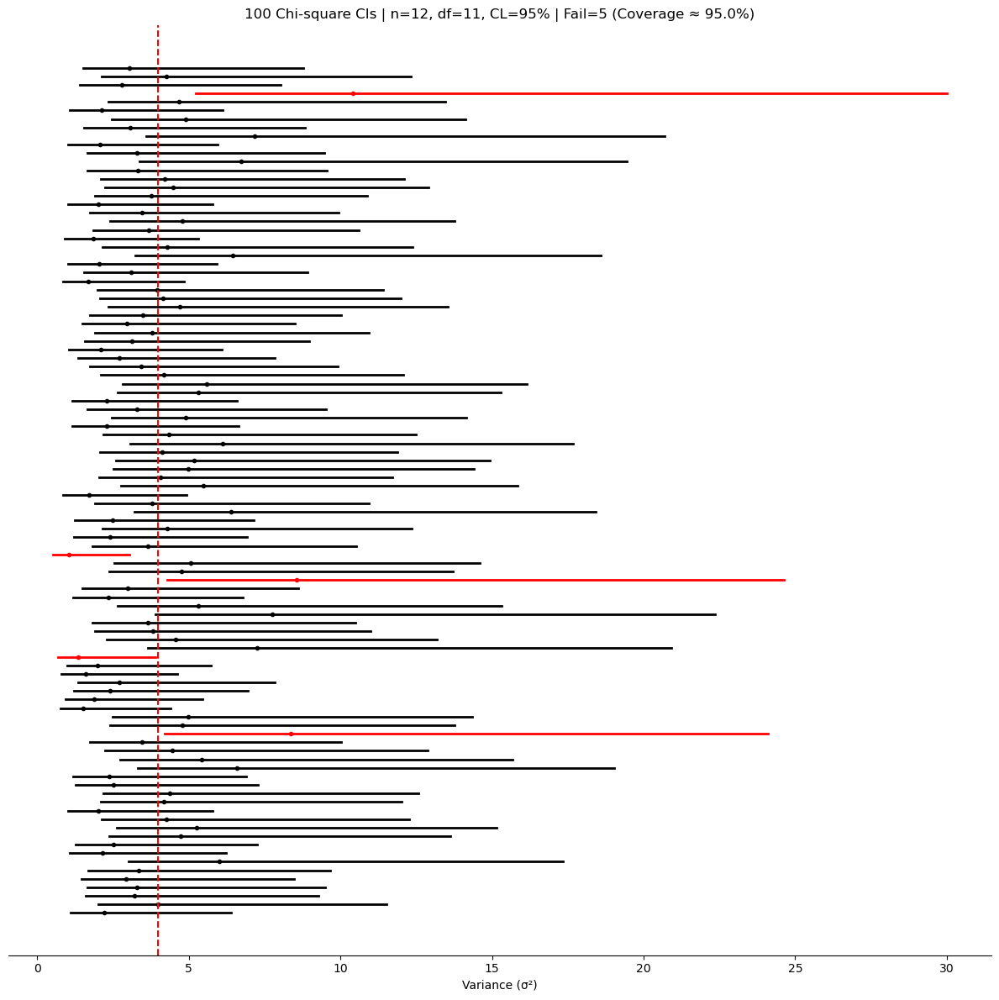

# σ²의 신뢰구간

## 모분산의 신뢰구간

모집단의 변동성을 추정하는 것이 목표일 때는 모분산 $\sigma^2$(동등하게 모표준편차 $\sigma$)의 신뢰구간을 구성한다.

### 공식

$$
\left[\frac{(n-1)s^2}{\chi^2_{\alpha/2,\,n-1}},\;\frac{(n-1)s^2}{\chi^2_{1-\alpha/2,\,n-1}}\right]
$$

여기서

- $s^2$은 표본분산(Bessel 수정, $\text{ddof}=1$),
- $n - 1$은 자유도,
- $\chi^2_{\alpha/2, n-1}$과 $\chi^2_{1-\alpha/2, n-1}$은 카이제곱분포의 아래쪽·위쪽 임계값이다.

### 표본분포

추축량은

$$
\frac{(n-1)s^2}{\sigma^2} \sim \chi^2_{n-1}
$$

이 결과는 모집단이 정규분포를 따를 때 **정확히** 성립한다.

### 타당성 조건

$$
\sigma^2 \text{에 대한 카이제곱 신뢰구간}
\quad\text{if}\quad
\begin{cases}
\text{모집단 분포가 정규이다, 그래서 표본분포를 정확히 안다} \\
n \le 0.1N \text{ (i.i.d. 근사)}
\end{cases}
$$

!!! warning "결정적인 정규성 가정"
    이 신뢰구간은 **정규 자료에서만 정확하다**. 추축 결과 $(n-1)S^2/\sigma^2 \sim \chi^2_{n-1}$은 모집단이 정규일 **때에만** 성립한다. 모집단이 치우쳐 있거나 꼬리가 두꺼우면 이 관계가 깨지고, $n$이 커도 카이제곱 신뢰구간의 포함확률이 명목값보다 낮거나 높아질 수 있다. 평균에 도움을 주는 중심극한정리가 이 분산 신뢰구간을 구해 주지는 **못한다**.

### 언제 쓰는가

- 자료가 **정규모집단**에서 나왔다고 볼 만할 때(히스토그램이나 Q-Q 그림으로 확인하라. 대칭성과 얇은 꼬리를 보라).
- 정규 잡음으로 잘 모형화되는 측정오차나 공정 자료.
- 정규성 아래에서 정확한 소표본 추론을 가르치거나 시연할 때.

### 언제 조심해야 하는가

- **치우치거나 꼬리가 두꺼운** 자료, 또는 눈에 띄는 이상점 → 카이제곱 신뢰구간의 포함확률이 어긋날 수 있다. $\sigma$나 $\sigma^2$에 대한 붓스트랩 신뢰구간(백분위수 또는 BCa)을 고려하거나, 로버스트 척도추정량(예: MAD)과 붓스트랩을 함께 쓰라.
- **변환**(예: 로그)으로 정규화할 수 있지만, 그러면 신뢰구간은 변환된 척도에서의 분산에 대한 것이 된다.
- 두 분산을 비교할 때 쓰는 F-구간에도 같은 정규성 요구가 있다.

<div class="exbox" markdown>

**보기 1.** <span class="diff easy" title="쉬움"></span> 분산의 신뢰구간 계산. 정규모집단에서 크기 $n = 12$인 표본을 뽑아 $s^2$을 얻었다.

**(1)** 추축량에서 $\sigma^2$의 $95\%$ 신뢰구간을 유도하시오. **큰** 임계값이 아래끝의 분모로 가는 까닭을 밝히고, 상한과 하한의 **비**가 자료와 무관한 상수임을 보이시오.

**(2)** 참 $\sigma = 2$인 모집단에서 표본 하나를 뽑아 구간을 만들고 (1)의 비를 확인하시오. $\sigma$의 구간은 어떻게 얻는가.

</div>

??? success "풀이"

    **(1) 추축량을 뒤집는다.** 정규표본에서

    $$
    W = \frac{(n-1)S^2}{\sigma^2} \sim \chi^2_{n-1}
    $$

    이고 이 분포는 $\mu$에도 $\sigma$에도 의존하지 않는다. 자유도 $n-1 = 11$의 하위·상위 $2.5\%$ 임계값을 $\ell = \chi^2_{0.025,\,11}$, $u = \chi^2_{0.975,\,11}$ 이라 하면

    $$
    P\!\left(\ell \le \frac{(n-1)S^2}{\sigma^2} \le u\right) = 0.95
    $$

    이다. 안쪽을 $\sigma^2$에 대해 푼다. 세 양이 모두 양수이므로 역수를 취할 수 있고, **역수를 취하면 부등호가 뒤집힌다.**

    $$
    \frac{\ell}{(n-1)S^2} \le \frac{1}{\sigma^2} \le \frac{u}{(n-1)S^2}
    \;\Longrightarrow\;
    \frac{(n-1)S^2}{u} \le \sigma^2 \le \frac{(n-1)S^2}{\ell}
    $$

    **그래서 큰 임계값 $u$가 아래끝의 분모로 간다.** $\sigma^2$이 추축량의 **분모**에 있다는 것이 유일한 이유이며, 평균의 구간과 모양이 달라지는 지점이 바로 여기다.

    **비가 상수다.** 상한을 하한으로 나누면 $S^2$이 통째로 약분된다.

    $$
    \frac{\text{상한}}{\text{하한}}
    = \frac{(n-1)s^2/\ell}{(n-1)s^2/u}
    = \frac{u}{\ell}
    $$

    $n = 12$에서 $u/\ell = 21.92005/3.81575 = 5.74463$ 이다. **자료를 보기도 전에 정해지는 값**이며 $n$에만 달렸다. 평균의 $t$-구간은 $\bar x$를 가운데 두고 **차**가 $s$에 비례했는데, 분산의 구간은 $s^2$에 **곱해지는** 구조라 비가 고정된다. 폭 자체는 $(n-1)s^2(1/\ell - 1/u)$ 로 $s^2$에 정비례한다.

    **(2) 표본 하나.**

    ```python
    import numpy as np
    from scipy.stats import chi2

    n = 12
    sigma = 2.0        # 참 모표준편차 (모의실험용이므로 답을 알고 있다)
    alpha = 0.05

    rng = np.random.default_rng(42)
    x = rng.normal(loc=0, scale=sigma, size=n)

    # ddof=1이 필수다. 베셀 보정을 빼면 s²이 아래로 편향되어
    # 구간 전체가 왼쪽으로 밀린다.
    s2 = x.var(ddof=1)
    df = n - 1

    chi2_lo = chi2(df=df).ppf(alpha / 2.0)
    chi2_hi = chi2(df=df).ppf(1 - alpha / 2.0)

    # 큰 임계값이 아래끝의 분모로 간다.
    # (n-1)s²/σ² 이 두 임계값 사이에 있다는 부등식을 σ²에 대해 풀면
    # σ²이 분모로 내려가 대소가 뒤집히기 때문이다.
    ci_lower = df * s2 / chi2_hi
    ci_upper = df * s2 / chi2_lo

    print(f"s2 = {s2:.4f},  chi2_lo = {chi2_lo:.5f},  chi2_hi = {chi2_hi:.5f}")
    print(f"95% CI for σ²: ({ci_lower:.4f}, {ci_upper:.4f})")
    print(f"95% CI for σ:  ({np.sqrt(ci_lower):.4f}, {np.sqrt(ci_upper):.4f})")

    # (1) 상한/하한의 비는 s2 와 무관하게 chi2_hi / chi2_lo 다.
    print(f"\n구간의 비 = {ci_upper / ci_lower:.5f}   chi2_hi/chi2_lo = {chi2_hi / chi2_lo:.5f}")
    print(f"σ 척도에서의 비 = {np.sqrt(ci_upper / ci_lower):.5f}")
    ```

    출력:

    ```
    s2 = 3.6752,  chi2_lo = 3.81575,  chi2_hi = 21.92005
    95% CI for σ²: (1.8443, 10.5947)
    95% CI for σ:  (1.3580, 3.2549)

    구간의 비 = 5.74463   chi2_hi/chi2_lo = 5.74463
    σ 척도에서의 비 = 2.39680
    ```

    **(1)의 비가 그대로 나온다.** 구간의 상한/하한 $10.5947/1.8443 = 5.74463$ 이 $u/\ell = 21.92005/3.81575 = 5.74463$ 과 소수 다섯째 자리까지 같다. $s^2 = 3.6752$ 가 무엇이든 이 비는 바뀌지 않는다.

    **참값 $\sigma^2 = 4$가 구간 안에 있다.** 다만 구간 $(1.8443,\ 10.5947)$ 이 $s^2 = 3.6752$ 를 가운데 두지 않는다. 왼쪽으로 $1.83$, 오른쪽으로 $6.92$ 다. 카이제곱분포가 오른쪽으로 늘어져 있으므로 $S^2$이 참값보다 **크게** 나오는 쪽의 여지를 더 많이 남겨야 하기 때문이다.

    **$\sigma$의 구간은 제곱근을 취하면 된다.** $\sigma > 0$에서 $\sigma \mapsto \sigma^2$ 이 **순증가**이므로

    $$
    \sigma^2 \in [L,\ U] \iff \sigma \in [\sqrt L,\ \sqrt U]
    $$

    로 두 사건이 **같다.** 사건이 같으니 확률도 같고, 따라서 $(\sqrt{1.8443},\ \sqrt{10.5947}) = (1.3580,\ 3.2549)$ 가 $\sigma$의 $95\%$ 구간이다. 비는 $\sqrt{5.74463} = 2.3968$ 로 줄어든다. **단조변환은 신뢰구간을 그대로 옮긴다.** 평균의 구간에서 보았던 아핀변환 불변성과 같은 이치이고, 거기서와 달리 여기서는 변환이 비선형이라 구간의 모양(비대칭의 정도)이 달라진다.

참값 $\sigma^2 = 4$가 구간 안에 있지만 구간이 대단히 넓다. 위끝이 아래끝의 5.7배이며, $s^2 = 3.68$을 중심으로 대칭도 아니다. 카이제곱분포가 오른쪽으로 늘어져 있는 탓이다. $\sigma$의 척도에서는 제곱근을 취한 만큼 비대칭이 완화되어 $(1.36, 3.25)$가 된다.

$n = 12$로 분산을 추정한다는 것이 이 정도로 막연한 일이다. 같은 표본크기에서 평균의 구간은 이보다 훨씬 단단하다.

---

## 모의실험: 분산 신뢰구간의 포함확률

다음 스크립트는 정규모집단에서 표본을 여러 번 뽑아 $\sigma^2$에 대한 카이제곱 신뢰구간을 만들고, 그중 몇 개가 참 분산을 잡아내는지 추적한다.

<div class="exbox" markdown>

**보기 2.** <span class="diff easy" title="쉬움"></span> 분산 신뢰구간의 포함확률. $n = 12$, $\sigma = 2$인 **정규**모집단에서 $\sigma^2$의 $95\%$ 카이제곱 구간을 $100$개 만든다.

**(1)** 이 구간의 포함확률을 구하시오. 근사인가 정확인가. $n$에 의존하는가.

**(2)** $100$개를 그리고, 실패한 구간들의 **모양**에서 무엇이 읽히는지 수와 함께 말하시오.

**(3)** 모집단이 정규가 아니면 포함률이 얼마가 되는가. 표본을 키우면 나아지는가.

</div>

??? success "풀이"

    **(1) 정규모집단에서는 정확히 $0.95$다.** 구간이 $\sigma^2$을 담는 사건은 앞 보기의 유도에 의해

    $$
    \frac{(n-1)S^2}{u} \le \sigma^2 \le \frac{(n-1)S^2}{\ell}
    \iff \ell \le W \le u,
    \qquad W = \frac{(n-1)S^2}{\sigma^2} \sim \chi^2_{n-1}
    $$

    과 **같은 사건**이다. $\ell$과 $u$가 $\chi^2_{n-1}$의 $2.5$·$97.5$ 백분위수이므로

    $$
    P(\ell \le W \le u) = 0.975 - 0.025 = 0.95
    $$

    이다. **근사가 아니라 정확한 값**이고, $n \ge 2$인 모든 $n$과 모든 $\mu$, $\sigma$에서 그렇다. $W$가 추축량이라서다. 평균의 $t$-구간과 같은 구조이며, 중심극한정리가 들어설 자리가 없다.

    **(2) 그림.**

    ```python
    #!/usr/bin/env python3
    """분산 신뢰구간을 100번 만들어 참 분산을 몇 번이나 담는지 센다.

    (n-1)S^2/sigma^2 이 카이제곱을 따른다는 사실에서 구간이 나온다. 평균의
    구간과 달리 좌우가 대칭이 아니므로 양쪽 기각값을 따로 구해야 한다.
    """

    import numpy as np
    import matplotlib.pyplot as plt
    from scipy.stats import chi2

    plt.rcParams["font.sans-serif"] = ["NanumGothic", "Apple SD Gothic Neo", "Malgun Gothic"]
    plt.rcParams["font.family"] = "sans-serif"
    plt.rcParams["axes.unicode_minus"] = False

    rng_seed = 42        # 아래 그림을 재현하려면 고정한다
    n_simulations = 100
    n_samples = 12
    mu = 0.0
    sigma = 2.0
    alpha = 0.05
    report_sigma_not_sigma2 = False  # True로 두면 σ² 대신 σ의 구간을 그린다


    def main():
        if rng_seed is not None:
            np.random.seed(rng_seed)

        true_var = sigma**2
        lowers = np.empty(n_simulations)
        uppers = np.empty(n_simulations)
        centers = np.empty(n_simulations)

        df = n_samples - 1
        chi2_lo = chi2(df=df).ppf(alpha / 2.0)
        chi2_hi = chi2(df=df).ppf(1 - alpha / 2.0)

        for i in range(n_simulations):
            x = np.random.normal(loc=mu, scale=sigma, size=n_samples)
            s2 = x.var(ddof=1)
            lowers[i] = df * s2 / chi2_hi
            uppers[i] = df * s2 / chi2_lo
            centers[i] = s2

        covered = (lowers <= true_var) & (true_var <= uppers)
        n_fail = int((~covered).sum())
        coverage_pct = 100.0 * covered.mean()

        if report_sigma_not_sigma2:
            lowers, uppers, centers = np.sqrt(lowers), np.sqrt(uppers), np.sqrt(centers)
            true_ref = np.sqrt(true_var)
            x_label = "Standard Deviation (σ)"
        else:
            true_ref = true_var
            x_label = "Variance (σ²)"

        fig, ax = plt.subplots(figsize=(12, 12))
        for i in range(n_simulations):
            color = "k" if covered[i] else "r"
            ax.plot([lowers[i], uppers[i]], [i, i], lw=2, color=color)
            ax.plot(centers[i], i, marker="o", ms=3, color=color)

        ax.axvline(true_ref, linestyle="--", linewidth=1.5, color="r")
        ax.set_title(
            f"{n_simulations} Chi-square CIs | n={n_samples}, df={df}, "
            f"CL={int((1 - alpha) * 100)}% | Fail={n_fail} (Coverage ≈ {coverage_pct:.1f}%)")
        ax.set_yticks([])
        for sp in ["left", "right", "top"]:
            ax.spines[sp].set_visible(False)
        ax.set_xlabel(x_label)
        plt.tight_layout()
        plt.show()


    if __name__ == "__main__":
        main()
    ```

    

    **$100$개 가운데 $95$개가 담았다.** (1)의 $0.95$와 맞는다. 되풀이 $100$회의 표준오차가 $0.0218$이므로 이 일치는 **운이 좋은 것**이고, $93$개나 $97$개가 나왔더라도 똑같이 (1)과 맞는다고 보아야 한다.

    **읽히는 것 하나 — 점이 가운데에 없다.** 각 선의 점이 $s^2$인데, 구간의 왼쪽에 치우쳐 있다. 앞 보기에서 본 대로 하한까지가 $(n-1)s^2(1/u)$ 만큼, 상한까지가 $(n-1)s^2(1/\ell)$ 만큼이라 오른쪽이 $u/\ell = 5.74$ 배 멀다.

    **읽히는 것 둘 — 실패가 양쪽으로 갈리되 모양이 다르다.** 실패한 다섯 중 **셋은 구간이 통째로 참값 오른쪽**(하한 $> 4$)에 있고 **둘은 왼쪽**(상한 $< 4$)에 있다. 그런데 오른쪽으로 빠진 세 구간의 폭이

    $$
    19.90, \quad 20.34, \quad 24.78
    $$

    로, $100$개 전체의 폭 중앙값 $9.01$의 두 배를 넘는다(가장 좁은 구간은 $2.51$이다). 폭이 $s^2$에 **정비례**하므로 $s^2$이 우연히 크게 나오면 구간이 오른쪽으로 밀리는 **동시에** 길어진다. 왼쪽으로 빠진 구간은 반대로 짧다.

    **이것이 분산 구간의 고유한 성질이다.** 평균의 $t$-구간에서는 중심과 폭이 **독립**이었다($\bar X \perp S$). 분산 구간에서는 중심 노릇을 하는 $s^2$이 폭도 함께 정하므로 둘이 완전히 묶여 있다. 그래서 "크게 틀린 구간은 길고, 작게 틀린 구간은 짧다"는 비대칭이 생긴다.

    **(3) 정규성이 무너지면 포함률도 무너진다.** 구간이 쓰는 유일한 사실은 $W = (n-1)S^2/\sigma^2$이 $\chi^2_{n-1}$을 따른다는 것인데, 이것은 정규모집단에서만 참이다. 비정규 모집단에서 $S^2$의 흔들림을 재는 양은 모집단의 **첨도** $\beta_2$이고, 5장에서 유도한 대로

    $$
    \operatorname{Var}(S^2) \approx \frac{(\beta_2 - 1)\sigma^4}{n},
    \qquad
    r = \frac{\beta_2 - 1}{2}
    $$

    이다. $r$는 "카이제곱 모형이 예측하는 분산"에 대한 실제 분산의 **배율**이고, $n \to \infty$에서 명목 $95\%$ 구간의 포함률은

    $$
    2\Phi\!\left(\frac{1.95996}{\sqrt r}\right) - 1
    $$

    로 수렴한다. 유도와 수치 확인은 [분산의 표본분포 — 균등모집단](../../ch05/applications/s2_uniform.md)의 보기 2에 있으므로 여기서는 결과만 쓴다.

    | 모집단 | $\beta_2$ | $r$ | 극한 포함률 |
    |---|---|---|---|
    | 균등 | $1.8$ | $0.4$ | $0.9981$ |
    | **정규** | $3$ | $1$ | $\mathbf{0.95}$ |
    | 라플라스 | $6$ | $2.5$ | $0.7849$ |
    | 지수 | $9$ | $4$ | $0.6729$ |
    | $t_5$ | $9$ | $4$ | $0.6729$ |

    **표본을 키워도 낫지 않는다.** 이 값들은 $n \to \infty$의 **극한**이다. 되풀이 $5$만 회로 확인하면 지수모집단에서 $n = 25,\ 200,\ 2000$의 포함률이 $0.724,\ 0.686,\ 0.675$ 로 $0.673$ 쪽으로 **내려가고**, 균등모집단에서는 $0.997,\ 0.998,\ 0.998$ 로 $0.998$에 붙어 있다. 꼬리가 두꺼울수록 $r$가 커져 구간이 **실제보다 좁아지고**, 꼬리가 가벼우면 반대로 지나치게 넓어진다.

    $t_5$는 수렴이 특히 느리다. 같은 모의에서 $n = 2000$일 때가 아직 $0.724$다. $t_5$의 $4$차 적률은 유한하지만 $8$차 적률이 발산해 $S^2$의 흔들림 자체가 잘 안정되지 않기 때문이다. **극한값이 $0.673$이라는 것과 그 값에 $n = 2000$에서도 닿지 못한다는 것이 둘 다 참이다.**

    **평균의 구간과 결정적으로 다른 점이 여기다.** $\bar X$는 중심극한정리가 모집단 모양을 지워 주므로 $n$을 키우면 $t$-구간이 어떤 모집단에서든 $0.95$로 간다. $S^2$에는 그런 보호가 없다. $S^2$의 분포 **모양**은 $n$이 커지면 정규로 가지만 그 **폭**은 끝까지 첨도에 매여 있다. 그래서 비정규가 의심되면 카이제곱 구간을 버리고 붓스트랩이나 보넷 구간을 써야 한다(연습문제 7).

포함확률은 95.0%로 명목값과 정확히 맞는다. 근사가 아니라 정확한 분포 결과이므로 정규자료에서는 $n$이 작아도 어긋나지 않는다.

그림에서 눈여겨볼 것은 구간의 **모양**이다. 점(=$s^2$)이 구간 한가운데가 아니라 왼쪽으로 치우쳐 있고, 오른쪽 꼬리가 길다. 실패한 다섯 중 셋은 구간이 통째로 참값 오른쪽에 있고 둘은 왼쪽에 있는데, 오른쪽으로 빠진 구간들은 길이가 20을 넘도록 길다. $s^2$이 우연히 크게 나오면 구간의 아래끝도 함께 밀려 올라가면서 폭까지 커지기 때문이다.

## 연습문제

<div class="drillbox" markdown>

**연습문제 1.** <span class="diff easy" title="쉬움"></span>
볼베어링에서 $n = 15$, $s^2 = 0.0025$ mm²이다. (a) $\sigma^2$의 95% 신뢰구간. (b) $\sigma$의 95% 신뢰구간.

</div>

??? success "풀이"
    (a) $\chi^2_{14, 0.025} = 5.629$, $\chi^2_{14, 0.975} = 26.119$.

    $\sigma^2$의 신뢰구간: $(14 \cdot 0.0025/26.119, 14 \cdot 0.0025/5.629) = (0.00134, 0.00622)$.

    (b) $\sigma$의 신뢰구간 = $(\sqrt{0.00134}, \sqrt{0.00622}) = (0.0366, 0.0789)$ mm.

    유의: $\sigma^2$의 신뢰구간에 단조변환을 적용하면 $\sigma$에 대한 타당한 신뢰구간이 된다 — 포함확률이 같다.

<div class="drillbox" markdown>

**연습문제 2.** <span class="diff med" title="중간"></span>
**추축량.** 정규성 아래에서 $(n-1)S^2/\sigma^2 \sim \chi^2_{n-1}$이 추축량임을 보여라.

</div>

??? success "풀이"
    **추축량**은 미지의 모수에 의존하지 않는 알려진 분포를 갖는다.

    $(n-1)S^2/\sigma^2 \sim \chi^2_{n-1}$ — 이 카이제곱분포는 $\sigma^2$이나 $\mu$가 아니라 오직 $n$에만 의존한다.

    따라서 $P(\chi^2_{n-1, \alpha/2} \le (n-1)S^2/\sigma^2 \le \chi^2_{n-1, 1-\alpha/2}) = 1 - \alpha$라고 쓸 수 있다.

    $\sigma^2$에 대해 뒤집으면 신뢰구간을 얻는다.

    다른 추축량: 정규성 아래 평균의 신뢰구간에 쓰는 $(\bar X - \mu)/(s/\sqrt n) \sim t_{n-1}$.

<div class="drillbox" markdown>

**연습문제 3.** <span class="diff med" title="중간"></span>
**비대칭 신뢰구간.** $\sigma^2$의 신뢰구간이 $S^2$을 중심으로 비대칭인 이유는?

</div>

??? success "풀이"
    카이제곱분포는 **오른쪽으로 치우쳐** 있어 평균을 중심으로 분위수가 비대칭이다.

    $\chi^2_{14}$(연습문제 1)에서 하위 2.5% 분위수는 5.629, 상위 97.5% 분위수는 26.119이다. 평균은 14이다.

    평균에서 아래쪽까지의 거리: $14 - 5.6 \approx 8.4$. 평균에서 위쪽까지의 거리: $26 - 14 = 12$. 위쪽 꼬리가 더 멀리 뻗는다.

    $\sigma^2$의 신뢰구간으로 뒤집으면 하한은 $S^2$에 더 가깝고(더 큰 분모를 쓴다) 상한은 더 멀다(더 작은 분모를 쓴다).

    $n$이 크면 카이제곱이 정규에 가까워져 비대칭성이 줄어든다. $n = 100$쯤이면 신뢰구간이 거의 대칭이다.

<div class="drillbox" markdown>

**연습문제 4.** <span class="diff med" title="중간"></span>
**분산 신뢰구간을 위한 표본크기.** $\sigma$의 신뢰구간의 반너비가 $\sigma$의 $10\%$ 이하가 되려면 $n$은 얼마여야 하는가?

</div>

??? success "풀이"
    큰 $n$에서 델타 방법을 쓰면 $S/\sigma \approx N(1, 1/(2(n-1)))$이며, 따라서 $\mathrm{SE}(\log S) \approx 1/\sqrt{2(n-1)}$이다.

    $\sigma$의 95% 신뢰구간의 상대 반너비는 $\approx 1.96/\sqrt{2(n-1)}$이다. 이를 0.10으로 놓으면:

    $\sqrt{2(n-1)} = 19.6 \Rightarrow n - 1 \approx 192 \Rightarrow n \approx 193$.

    즉 상대 반너비 10%를 위해 대략 $n = 200$이 필요하다. 분산추정에는 놀랄 만큼 큰 표본이 필요하다 — 평균추정보다 훨씬 크다.

<div class="drillbox" markdown>

**연습문제 5.** <span class="diff med" title="중간"></span>
**정규가 아닌 자료와 $\sigma^2$의 신뢰구간.** 카이제곱 기반 신뢰구간이 비정규성에 취약한 이유는?

</div>

??? success "풀이"
    추축량 $(n-1)S^2/\sigma^2 \sim \chi^2_{n-1}$은 바탕 자료의 **정규성**에 의존한다. 정규가 아닌 자료에서는 $n$이 커도 이것이 성립하지 않는다.

    구체적으로 $S^2$의 표본분포는 모집단의 **4차 적률**(첨도)에 의존한다. 꼬리가 두꺼운 모집단에서는 $S^2$이 카이제곱 공식이 시사하는 것보다 훨씬 크게 변동한다.

    **결과:** 정규가 아닌 자료에서 명목 95% 신뢰구간의 실제 포함확률이 70–80%일 수 있다. 꼬리가 두꺼운 자료가 특히 영향을 받는다.

    **로버스트한 대안:**

    - **$\sigma^2$에 대한 붓스트랩 신뢰구간:** 재표본추출이 실제 표본분포를 포착한다.
    - **중앙값 절대편차(MAD):** 로버스트한 척도추정량. 붓스트랩으로 신뢰구간을 얻는다.
    - **절사 표준편차:** 극단 관측값에 로버스트하다.

    분산에 카이제곱 신뢰구간을 쓰기 전에 항상 정규성을 확인하라(Q-Q 그림). 의심스러우면 붓스트랩을 쓰라.

<div class="drillbox" markdown>

**연습문제 6.** <span class="diff med" title="중간"></span>
**$\sigma$의 신뢰구간과 $\sigma^2$의 신뢰구간.** $\sigma = \sqrt{\sigma^2}$인데도 두 구간이 다른 이유는?

</div>

??? success "풀이"
    두 가지로 답할 수 있다.

    **(a) 단조변환:** $\sqrt{\cdot}$가 단조이므로 $\sigma^2$ 신뢰구간의 끝점에 적용하면 (포함확률이 같은) $\sigma$의 타당한 신뢰구간이 된다. 그런 의미에서 하나가 다른 하나에서 얻어지므로 사실상 같다.

    **(b) $S$로 직접 구성:** 대안으로 $S$에 직접 기반해 추론할 수도 있다. 그러나 $S$의 정확한 분포는 더 복잡하고(Chi 분포), $S^2$은 깔끔한 카이제곱분포를 갖는다. 그래서 표준적인 방법은 $\sigma^2$의 신뢰구간을 만들고 제곱근을 취해 $\sigma$의 신뢰구간을 얻는 것이다.

    **대칭성:** $\sigma$의 신뢰구간은 $\sigma^2$의 신뢰구간보다 *더* 대칭적이다(제곱근이 비대칭성을 줄인다). 그래도 여전히 비대칭이다.

    **편향:** $S$는 (Jensen 부등식에 의해) $\sigma$의 편향추정량이다. $S^2$은 $\sigma^2$에 대해 불편이다. $\sigma$에 대해서는 $c_4$ 같은 편향 보정인자가 있지만 흔히 쓰이지는 않는다.

<div class="drillbox" markdown>

**연습문제 7.** <span class="diff hard" title="어려움"></span>
**보넷의 구간**을 구현하여 카이제곱 구간과 포함확률을 비교하라. 정규·지수·$t_5$ 세 모집단에서 $n=25$로 확인한다.

</div>

??? success "풀이"
    **동기.** 앞서 보았듯 카이제곱 구간은 정규성 위배에 취약하다. $S^2$의 점근분산이

    $$
    \operatorname{Var}(S^2)\approx\frac{\sigma^4(\gamma_2+2)}{n}
    $$

    로 초과첨도 $\gamma_2$에 의존하는데, 카이제곱 구간은 $\gamma_2=0$을 가정하기 때문이다.

    **보넷의 방법.** 첨도를 자료에서 추정해 넣고, **로그 척도**에서 구간을 만든 뒤 되돌린다. 첨도 추정에는 이상치의 영향을 줄이려고 **절사평균을 중심으로 한** 4차 적률을 쓴다.

    $$
    \hat\gamma_4=\frac{n\sum_i(x_i-m)^4}{\left\{\sum_i(x_i-\bar x)^2\right\}^2},\qquad
    \widehat{\operatorname{se}}=\sqrt{\frac{\hat\gamma_4-(n-3)/n}{n-1}}
    $$

    $$
    \left(c\,s^2e^{-z\widehat{\operatorname{se}}},\ \ c\,s^2e^{z\widehat{\operatorname{se}}}\right),
    \qquad c=\frac{n}{n-z_{1-\alpha/2}}
    $$

    ```python
    import numpy as np
    from scipy import stats

    def bonett(x, alpha=0.05):
        n = len(x)
        z = stats.norm.ppf(1 - alpha / 2)
        trim = 1 / (2 * np.sqrt(max(n - 4, 1)))       # 절사 비율
        m = stats.trim_mean(x, min(trim, 0.49))       # 절사평균
        xb = x.mean()
        g4 = n * np.sum((x - m)**4) / np.sum((x - xb)**2)**2
        se = np.sqrt((g4 - (n - 3) / n) / (n - 1))
        c = n / (n - z)                               # 소표본 보정
        s2 = x.var(ddof=1)
        return c * s2 * np.exp(-z * se), c * s2 * np.exp(z * se)

    rng = np.random.default_rng(3)
    n, M = 25, 20_000
    cases = [("정규", lambda: rng.normal(0, 1, n), 1.0),
             ("지수", lambda: rng.exponential(1.0, n), 1.0),
             ("t(5)", lambda: rng.standard_t(5, n), 5 / 3)]
    for name, gen, var in cases:
        hc = hb = 0
        wc = wb = 0.0
        for _ in range(M):
            x = gen()
            s2 = x.var(ddof=1)
            lo = (n - 1) * s2 / stats.chi2.ppf(0.975, n - 1)
            hi = (n - 1) * s2 / stats.chi2.ppf(0.025, n - 1)
            hc += (lo <= var <= hi)
            wc += hi - lo
            lb, hb_ = bonett(x)
            hb += (lb <= var <= hb_)
            wb += hb_ - lb
        print(f"{name}: 카이제곱 {hc / M:.4f}/{wc / M:.3f}   "
              f"보넷 {hb / M:.4f}/{wb / M:.3f}")
    ```

    ```text
    정규: 카이제곱 0.9516/1.327   보넷 0.9232/1.266
    지수: 카이제곱 0.7208/1.321   보넷 0.8482/2.384
    t(5): 카이제곱 0.8286/2.215   보넷 0.8813/3.071
    ```

    **읽기.**

    | 모집단 | 카이제곱 | 보넷 |
    |---|---|---|
    | 정규 | **0.952** / 1.33 | 0.923 / 1.27 |
    | 지수 | 0.721 / 1.32 | **0.848** / 2.38 |
    | $t_5$ | 0.829 / 2.22 | **0.881** / 3.07 |

    **비정규에서 크게 개선된다.** 지수분포에서 0.721 → 0.848, $t_5$에서 0.829 → 0.881.

    **정규에서 약간 손해다.** 0.952 → 0.923. 첨도를 추정하느라 생긴 추가 변동의 대가다. **모형을 덜 가정하는 대가는 항상 있다.**

    **폭을 보라.** 지수분포에서 카이제곱 구간의 폭이 1.32로 정규일 때와 같다. **자료가 두꺼운 꼬리를 가졌는데도 구간이 넓어지지 않았다** — 그것이 포함확률이 무너진 이유다. 보넷은 2.38로 넓혀 잡는다. 정직한 구간은 넓어야 한다.

    **여전히 부족한 이유.** $\hat\gamma_4$의 추정오차가 크다. 4차 적률을 안정적으로 추정하려면 8차 적률이 존재하고 $n$이 커야 하는데, $n=25$에서는 무리다.

    **더 나은 대안.**

    - **부트스트랩 BCa.** 첨도를 명시적으로 추정하지 않고 자료가 말하게 한다.
    - **분포를 바꾼다.** 자료가 지수분포처럼 보이면 지수분포의 모수를 추정하는 편이 훨씬 효율적이다.
    - **분산이 정말 필요한가.** 치우친 자료에서 분산은 해석하기 어려운 양이다. 사분위범위나 MAD가 나을 수 있다.

<div class="drillbox" markdown>

**연습문제 8.** <span class="diff med" title="중간"></span>
**변동계수** $\text{CV}=\sigma/\mu$의 신뢰구간을 구하는 세 가지 방법을 비교하고, $n=30$, $\bar x=50$, $s=8$에서 계산하라.

</div>

??? success "풀이"
    **왜 필요한가.** CV는 **단위가 없는 산포 측도**라 척도가 다른 집단을 비교할 수 있다. 측정기기의 정밀도, 실험의 재현성, 자산의 위험도 평가에 쓰인다.

    **방법 1 — 델타법.** $\hat c=S/\bar X$에 델타법을 적용하면 정규모집단에서

    $$
    \operatorname{Var}(\hat c)\approx\frac{c^2}{n}\left(\frac12+c^2\right)
    $$

    **방법 2 — 로그 척도 델타법.** $\log\hat c$의 분산이 $\left(\frac12+c^2\right)/n$이므로 로그 척도에서 대칭 구간을 만들고 지수를 취한다. **하한이 음수가 되는 일이 없다.**

    **방법 3 — 맥케이 근사.** 카이제곱 분포를 이용한 고전적 방법이다.

    $$
    \frac{\hat c}{\sqrt{\left(\frac{q+2}{n}-1\right)\hat c^2+\frac{q}{n-1}}},
    \qquad q=\chi^2_{n-1,1-\alpha/2}\ \text{또는}\ \chi^2_{n-1,\alpha/2}
    $$

    ```python
    import numpy as np
    from scipy import stats

    n, xbar, s = 30, 50.0, 8.0
    c = s / xbar
    z = stats.norm.ppf(0.975)
    nu = n - 1
    print(f"CV 추정 {c:.4f}")

    se = c * np.sqrt((0.5 + c**2) / n)                        # 델타법
    print(f"델타법     ({c - z * se:.4f}, {c + z * se:.4f})   SE {se:.5f}")

    se_log = np.sqrt((0.5 + c**2) / n)                        # 로그 척도
    print(f"로그 델타  ({c * np.exp(-z * se_log):.4f}, {c * np.exp(z * se_log):.4f})")

    def mckay(cv, n, q):
        return cv / np.sqrt(((q + 2) / n - 1) * cv**2 + q / (n - 1))

    lo_m = mckay(c, n, stats.chi2.ppf(0.975, nu))
    hi_m = mckay(c, n, stats.chi2.ppf(0.025, nu))
    print(f"맥케이     ({lo_m:.4f}, {hi_m:.4f})")

    # 정규모집단에서 세 방법의 포함확률
    rng = np.random.default_rng(9)
    M = 20_000
    x = rng.normal(50, 8, (M, n))
    ch = x.std(1, ddof=1) / x.mean(1)
    d = ch * np.sqrt((0.5 + ch**2) / n)
    dl = np.sqrt((0.5 + ch**2) / n)
    lo_mm = mckay(ch, n, stats.chi2.ppf(0.975, nu))
    hi_mm = mckay(ch, n, stats.chi2.ppf(0.025, nu))
    print()
    print(f"델타법 포함확률   {np.mean((ch - z * d <= 0.16) & (0.16 <= ch + z * d)):.4f}")
    print(f"로그 델타 포함확률 "
          f"{np.mean((ch * np.exp(-z * dl) <= 0.16) & (0.16 <= ch * np.exp(z * dl))):.4f}")
    print(f"맥케이 포함확률   {np.mean((lo_mm <= 0.16) & (0.16 <= hi_mm)):.4f}")
    ```

    ```text
    CV 추정 0.1600
    델타법     (0.1185, 0.2015)   SE 0.02118
    로그 델타  (0.1234, 0.2074)
    맥케이     (0.1268, 0.2171)

    델타법 포함확률   0.9303
    로그 델타 포함확률 0.9421
    맥케이 포함확률   0.9531
    ```

    **맥케이가 가장 낫다.** 포함확률 0.953으로 명목에 가장 가깝고, 구간도 오른쪽으로 더 뻗어 CV 표집분포의 비대칭을 반영한다. 델타법은 0.930으로 부족하다.

    **주의할 점.**

    1. **$\mu$가 0 근처면 쓸 수 없다.** $\hat c=S/\bar X$의 분모가 0에 가까우면 발산한다. **CV는 비율척도(참 영점이 있고 값이 양수인) 자료에만 의미가 있다.** 섭씨 온도의 CV는 무의미하다 — 화씨로 바꾸면 값이 달라진다.

    2. **$c$가 크면 근사가 나쁘다.** $c>0.33$($\mu<3\sigma$)이면 $\bar X$가 음수가 될 확률이 무시할 수 없어, 위 공식들이 모두 무너진다. 부트스트랩을 쓴다.

    3. **비정규성.** 위 공식은 모두 정규를 가정한다. 로그정규라면 $c=\sqrt{e^{\sigma_{\log}^2}-1}$이라는 정확한 관계가 있어 훨씬 나은 구간을 만들 수 있다.

    **실무 지침.** 측정 정밀도를 CV로 보고하는 관행이 임상검사실 표준에 있다. 이때 $c$가 작고($<0.2$) $n$이 충분하므로 맥케이 근사로 충분하다.

<div class="drillbox" markdown>

**연습문제 9.** <span class="diff med" title="중간"></span>
분산 구간을 검정으로 역전하면 무엇을 얻는가? $n=15$, $s^2=0.0025$인 자료에서 구간과 검정이 일치함을 확인하라.

</div>

??? success "풀이"
    **역전의 원리.** 카이제곱 검정통계량

    $$
    \chi^2=\frac{(n-1)S^2}{\sigma_0^2}
    $$

    이 $[\chi^2_{\nu,\alpha/2},\ \chi^2_{\nu,1-\alpha/2}]$ 안에 있으면 $H_0:\sigma^2=\sigma_0^2$을 기각하지 않는다. **기각되지 않는 $\sigma_0^2$의 집합**이 곧 신뢰구간이다.

    $$
    \chi^2_{\nu,\alpha/2}\le\frac{(n-1)s^2}{\sigma_0^2}\le\chi^2_{\nu,1-\alpha/2}
    \iff
    \frac{(n-1)s^2}{\chi^2_{\nu,1-\alpha/2}}\le\sigma_0^2\le\frac{(n-1)s^2}{\chi^2_{\nu,\alpha/2}}
    $$

    **부등식을 뒤집을 때 방향이 바뀐다**는 점이 비대칭의 근원이다. 상위 분위수가 **하한**을 만든다.

    ```python
    import numpy as np
    from scipy import stats

    n, s2 = 15, 0.0025
    nu = n - 1
    lo = nu * s2 / stats.chi2.ppf(0.975, nu)
    hi = nu * s2 / stats.chi2.ppf(0.025, nu)
    print(f"95% 구간 ({lo:.6f}, {hi:.6f})")
    print(f"σ의 구간 ({np.sqrt(lo):.5f}, {np.sqrt(hi):.5f})")

    print()
    print("검정으로 확인")
    for s0sq in [0.00130, 0.00140, 0.00250, 0.00615, 0.00630]:
        chi = nu * s2 / s0sq
        pv = 2 * min(stats.chi2.cdf(chi, nu), stats.chi2.sf(chi, nu))
        inside = lo <= s0sq <= hi
        print(f"  σ0² = {s0sq:.5f}  χ² = {chi:7.3f}  p = {pv:.4f}  "
              f"구간 {'안' if inside else '밖'}  {'기각 안 함' if pv > 0.05 else '기각'}")
    ```

    ```text
    95% 구간 (0.001340, 0.006218)
    σ의 구간 (0.03661, 0.07885)

    검정으로 확인
      σ0² = 0.00130  χ² =  26.923  p = 0.0394  구간 밖  기각
      σ0² = 0.00140  χ² =  25.000  p = 0.0691  구간 안  기각 안 함
      σ0² = 0.00250  χ² =  14.000  p = 0.8994  구간 안  기각 안 함
      σ0² = 0.00615  χ² =   5.691  p = 0.0526  구간 안  기각 안 함
      σ0² = 0.00630  χ² =   5.556  p = 0.0470  구간 밖  기각
    ```

    **완벽히 일치한다.** 구간 안의 값은 모두 $p>0.05$, 밖의 값은 모두 $p<0.05$다. 구간의 경계에서 $p$-값이 정확히 0.05를 지난다.

    **역전이 주는 것.**

    1. **일관성.** 구간과 검정이 같은 결론을 준다. 서로 다른 근사를 쓰면 어긋나는데, 역전으로 만들면 그런 일이 없다.

    2. **일반성.** 검정만 있으면 구간을 만들 수 있다. 분산에 대한 정확한 추축량이 없는 상황(비정규, 혼합모형의 분산성분)에서도 우도비 검정을 역전할 수 있다.

    3. **비대칭의 자동 처리.** 위 예에서 하한까지 거리 $0.0025-0.00134=0.00116$, 상한까지 $0.00622-0.0025=0.00372$로 **상한 쪽이 3배 멀다.** $S^2$을 중심으로 대칭인 구간을 만들면 잘못이다.

    **주의.** 이 일치는 **동등꼬리 검정**을 역전했을 때다. 최단 구간이나 우도비 구간을 만들면 다른 검정에 대응하며, 그것도 각각 타당하다.

<div class="drillbox" markdown>

**연습문제 10.** <span class="diff med" title="중간"></span>
분산의 신뢰구간을 실무에서 **어떻게 보고하고 해석해야 하는지** 정리하라. 흔한 오용은 무엇인가?

</div>

??? success "풀이"
    **보고할 것.**

    1. **$\sigma$ 척도로.** 분산은 단위가 제곱($\text{mm}^2$)이라 직관적이지 않다. **표준편차로 바꿔 보고**하는 것이 낫다. 구간의 양끝에 제곱근을 취하면 되며, 단조변환이라 신뢰수준이 보존된다.

    2. **정규성 확인 결과.** 카이제곱 구간을 썼다면 Q-Q 그림이나 첨도 추정값을 함께 제시한다. **정규성이 의심되면 그 구간을 보고하면 안 된다.**

    3. **표본크기.** 분산 구간은 $n$에 매우 민감하다.

    4. **비대칭 그대로.** "$s^2\pm$"로 적지 않는다. 양끝을 그대로 적는다.

    **폭의 감각.**

    ```python
    import numpy as np
    from scipy import stats

    print(f"{'n':>5s} {'하한/s²':>9s} {'상한/s²':>9s} {'상한/하한':>10s}")
    for n in [5, 10, 20, 30, 50, 100, 500]:
        nu = n - 1
        lo = nu / stats.chi2.ppf(0.975, nu)
        hi = nu / stats.chi2.ppf(0.025, nu)
        print(f"{n:5d} {lo:9.4f} {hi:9.4f} {hi / lo:10.2f}")
    ```

    ```text
        n     하한/s²     상한/s²      상한/하한
        5    0.3590    8.2573      23.00
       10    0.4731    3.3329       7.04
       20    0.5783    2.1333       3.69
       30    0.6343    1.8072       2.85
       50    0.6978    1.5528       2.23
      100    0.7709    1.3495       1.75
      500    0.8867    1.1367       1.28
    ```

    **$n=10$이면 상한이 하한의 7배다.** 분산을 정밀하게 추정하려면 평균보다 훨씬 큰 표본이 필요하다. $n=500$에서야 비로소 1.3배로 좁아진다.

    **흔한 오용.**

    1. **평균 구간과 같은 감각으로 읽기.** "분산이 4.2에서 18.5 사이"를 보고 "대략 10쯤"이라고 생각하기 쉽지만, 로그 척도에서 중심은 $\sqrt{4.2\times18.5}=8.81$이다. **기하평균이 맞는 중심**이다.

    2. **비정규 자료에 카이제곱 구간 쓰기.** 가장 흔하고 가장 심각한 잘못이다. 앞서 보았듯 포함확률이 72%까지 떨어진다.

    3. **두 분산의 비교를 각각의 구간 겹침으로 판단.** 평균에서와 같은 오류다. **분산비 $F$ 구간**을 따로 계산해야 한다.

    4. **분산을 비교하려는 것이 아닌데 분산 구간을 쓰기.** 공정능력지수($C_p$)나 측정 불확실성이 목적이라면 그 양에 대한 구간을 직접 만드는 것이 낫다.

    5. **표본표준편차의 편향과 혼동하기.** $E[S]<\sigma$이지만, **구간 자체는 $S$의 편향과 무관하게 타당**하다. 점추정에 $c_4$ 보정을 쓰더라도 구간에는 적용하지 않는다.

    **좋은 보고의 예.**

    > 15개 볼베어링의 지름 표준편차는 0.050 mm였다(95% 신뢰구간 0.037~0.079 mm, 카이제곱 방법). 샤피로-윌크 검정에서 정규성 위배의 증거는 없었다($p=0.62$). 구간이 비대칭이며, 상한이 규격 한계 0.06 mm를 넘으므로 공정 개선이 필요할 수 있다.

---

## 정리하며

분산의 구간은 카이제곱 추축량에서 나오며, **좌우가 대칭이 아니다.**

$$
\left[\frac{(n-1)s^2}{\chi^2_{\alpha/2,\,n-1}},\;\frac{(n-1)s^2}{\chi^2_{1-\alpha/2,\,n-1}}\right]
$$

- **추축량이 $(n-1)s^2/\sigma^2\sim\chi^2_{n-1}$ 이다.** 이 양의 분포가 $\sigma^2$ 에 의존하지 않기 때문에 구간을 만들 수 있다.
- **분모의 아래위 임계값이 뒤바뀐다.** 큰 분위수가 하한에, 작은 분위수가 상한에 들어간다. 부등식을 뒤집어 $\sigma^2$ 에 대해 풀면 그렇게 되며, 부호를 헷갈리기 쉬운 대목이다.
- **비대칭이라 점추정값이 구간의 가운데가 아니다.** 위쪽으로 더 길게 늘어지며, $n$ 이 작을수록 심하다.
- **$\sigma$ 의 구간은 제곱근을 취하면 된다.** 변환이 단조이므로 포함확률이 보존된다. **점추정에서는 성립하지 않던 성질**이 구간에서는 성립한다.
- **정규성이 본질적이다.** 카이제곱 관계는 정규모집단에서만 성립하며, 4장 연습문제에서 보았듯 로그정규 자료에서 명목 $95\%$ 의 실제 포함률이 $42\%$ 까지 떨어진다. **$t$ 구간과 달리 강건하지 않고, 표본을 늘려도 나아지지 않는다.**

다음 절부터 세 구간의 포함확률을 **모의실험으로 직접 재어 본다.**
