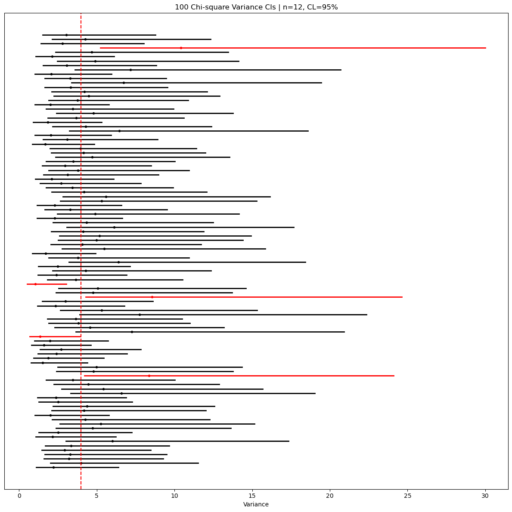

# 분산 신뢰구간의 포함확률 모의실험

## 개요

이 페이지에서는 모분산 $\sigma^2$에 대한 카이제곱 신뢰구간을 시연하고 모의실험으로 그 포함확률을 평가한다. 카이제곱 분산 구간은 정규성 아래에서 정확하지만 바탕 모집단이 치우쳐 있거나 꼬리가 두꺼우면 실패할 수 있다. 모의실험은 정규 자료에서 명목 포함확률이 달성됨을 확인하고 정규성 가정에 대한 민감성을 부각한다.

## 분산에 대한 카이제곱 신뢰구간

### 추축량

$X_1, \ldots, X_n \overset{\text{iid}}{\sim} N(\mu, \sigma^2)$이면 통계량

$$
\frac{(n-1)S^2}{\sigma^2} \sim \chi^2_{n-1}
$$

이며, 여기서 $S^2 = \frac{1}{n-1}\sum_{i=1}^n (X_i - \bar{X})^2$은 불편 표본분산이다.

### 신뢰구간

추축량을 뒤집으면 $\sigma^2$의 $(1-\alpha)100\%$ 신뢰구간을 얻는다:

$$
\left(\frac{(n-1)S^2}{\chi^2_{1-\alpha/2,\,n-1}},\;\;
      \frac{(n-1)S^2}{\chi^2_{\alpha/2,\,n-1}}\right)
$$

**더 큰** 카이제곱 분위수가 **아래쪽** 끝점에 나타나는데, 큰 수로 나누면 결과가 작아지기 때문이다.

$\sigma$의 신뢰구간은 제곱근을 취해 얻는다:

$$
\left(\sqrt{\frac{(n-1)S^2}{\chi^2_{1-\alpha/2,\,n-1}}},\;\;
      \sqrt{\frac{(n-1)S^2}{\chi^2_{\alpha/2,\,n-1}}}\right)
$$

### 결정적인 정규성 가정

이 구간은 **자료가 정규분포를 따를 때에만 정확하다**. (중심극한정리의 도움을 받는) 평균의 신뢰구간과 달리, 카이제곱 분산 구간은 $n$이 커져도 비정규성에 로버스트해지지 않는다. 치우치거나 꼬리가 두꺼운 자료에는 $\sigma^2$에 대한 붓스트랩 신뢰구간을 고려하라.

## Python 코드

```python
import numpy as np
import matplotlib.pyplot as plt
from scipy.stats import chi2

np.random.seed(42)          # 아래 출력과 그림을 재현하려면 고정한다

n_simulations = 100
n_samples = 12
mu, sigma = 0.0, 2.0
alpha = 0.05

true_var = sigma**2
df = n_samples - 1
# 임계값은 표본과 무관하므로 반복문 밖에서 한 번만 구한다.
# 자유도만으로 정해지는 값이기 때문이다.
chi2_lo = chi2.ppf(alpha / 2, df=df)
chi2_hi = chi2.ppf(1 - alpha / 2, df=df)

lowers = np.empty(n_simulations)
uppers = np.empty(n_simulations)
centers = np.empty(n_simulations)

for i in range(n_simulations):
    x = np.random.normal(loc=mu, scale=sigma, size=n_samples)
    s2 = x.var(ddof=1)
    lowers[i] = df * s2 / chi2_hi
    uppers[i] = df * s2 / chi2_lo
    centers[i] = s2

covered = (lowers <= true_var) & (true_var <= uppers)
n_fail = int((~covered).sum())
coverage_pct = 100.0 * covered.mean()
print(f"Coverage: {coverage_pct:.1f}%, Failures: {n_fail}")
```

출력:

```
Coverage: 95.0%, Failures: 5
```

$n = 12$밖에 안 되지만 포함확률이 명목값과 정확히 맞는다. 근사가 아니라 정확한 분포 결과이기 때문이다. 단, 이것은 자료가 **정규**일 때의 이야기다(연습문제 3 참조).

### 구간의 시각화

```python
fig, ax = plt.subplots(figsize=(12, 12))
for i in range(n_simulations):
    color = "k" if covered[i] else "r"
    ax.plot([lowers[i], uppers[i]], [i, i], lw=2, color=color)
    ax.plot(centers[i], i, marker="o", ms=3, color=color)

ax.axvline(true_var, linestyle="--", linewidth=1.5, color="r")
ax.set_title(f"{n_simulations} Chi-square Variance CIs | n={n_samples}, CL=95%")
ax.set_yticks([])
ax.set_xlabel("Variance")
plt.tight_layout()
plt.show()
```



각 구간의 점이 $s^2$이다. 점이 구간 한가운데가 아니라 왼쪽에 치우쳐 있다는 것이 이 구간의 특징이다. 평균의 $t$-구간에서는 점이 언제나 정확히 가운데였다.

## 해석

- 자료가 실제로 정규분포에서 나오면 카이제곱 구간은 명시한 포함 수준을 달성한다. 모의실험에서 $n = 12$일 때 경험적 포함확률이 95%에 가까움이 확인된다.
- 카이제곱분포가 오른쪽으로 치우쳐 있으므로 구간은 **비대칭**이다. 상한이 하한보다 $S^2$에서 더 멀어지는 경향이 있다.
- 모집단이 정규가 아니면(예: 지수, 자유도가 작은 $t$, log-normal) 카이제곱 신뢰구간의 포함확률이 크게 부족하거나 과할 수 있다. $\sigma^2$에 대한 붓스트랩 백분위수나 BCa 구간이 더 로버스트한 대안이다.
- 양 끝점에 제곱근을 취해 표준편차 척도로 보고할 수도 있다.

## 연습문제

<div class="drillbox" markdown>

**연습문제 1.** 정규모집단에서 뽑은 크기 $n = 20$인 표본에서 $s^2 = 16$을 얻었다. $\sigma^2$과 $\sigma$의 95% 신뢰구간을 구성하라.

</div>

??? success "풀이"

    $\text{df} = 19$, $\alpha = 0.05$일 때:

    $$
    \chi^2_{0.025,\,19} = 8.907, \quad \chi^2_{0.975,\,19} = 32.852
    $$

    $\sigma^2$의 95% 신뢰구간은

    $$
    \left(\frac{19 \times 16}{32.852},\; \frac{19 \times 16}{8.907}\right) = \left(\frac{304}{32.852},\; \frac{304}{8.907}\right) = (9.25,\; 34.13)
    $$

    제곱근을 취하면 $\sigma$의 95% 신뢰구간은

    $$
    (\sqrt{9.25},\; \sqrt{34.13}) = (3.04,\; 5.84)
    $$

    $\square$

<div class="drillbox" markdown>

**연습문제 2.** $X_1, \ldots, X_n \overset{\text{iid}}{\sim} N(\mu, \sigma^2)$일 때 $(n-1)S^2/\sigma^2 \sim \chi^2_{n-1}$임을 증명하라.

</div>

??? success "풀이"

    $Z_i = (X_i - \mu)/\sigma$라 하면 $Z_i \overset{\text{iid}}{\sim} N(0,1)$이다. 그러면

    $$
    \sum_{i=1}^n Z_i^2 = \sum_{i=1}^n \frac{(X_i - \mu)^2}{\sigma^2} \sim \chi^2_n
    $$

    항등식 $X_i - \mu = (X_i - \bar{X}) + (\bar{X} - \mu)$로 분해하면:

    $$
    \sum_{i=1}^n (X_i - \mu)^2 = \sum_{i=1}^n (X_i - \bar{X})^2 + n(\bar{X} - \mu)^2
    $$

    $\sigma^2$으로 나누면:

    $$
    \chi^2_n = \frac{(n-1)S^2}{\sigma^2} + \frac{(\bar{X}-\mu)^2}{\sigma^2/n}
    $$

    둘째 항은 $Z = (\bar{X}-\mu)/(\sigma/\sqrt{n}) \sim N(0,1)$인 $Z^2$이므로 $\chi^2_1$을 따른다. (정규성 아래 $\bar{X}$와 $S^2$의 독립성, 즉 Cochran 정리에 의해) 두 항은 독립이다. 따라서 독립인 카이제곱 확률변수의 가법성에 의해

    $$
    \frac{(n-1)S^2}{\sigma^2} = \chi^2_n - \chi^2_1 \sim \chi^2_{n-1}
    $$

    이다. $\square$

<div class="drillbox" markdown>

**연습문제 3.** 모의실험을 고쳐서 $\lambda = 1$인 지수분포(따라서 $\sigma^2 = 1$)와 $n = 20$으로 자료를 뽑아라. 경험적 포함확률을 보고하라. 카이제곱 구간이 실패하는 이유는?

</div>

??? success "풀이"

    ```python
    from scipy.stats import chi2
    np.random.seed(0)
    n, n_sim, true_var = 20, 10_000, 1.0
    df = n - 1
    chi2_lo = chi2.ppf(0.025, df)
    chi2_hi = chi2.ppf(0.975, df)
    covers = 0
    for _ in range(n_sim):
        x = np.random.exponential(1.0, size=n)
        s2 = x.var(ddof=1)
        lo = df * s2 / chi2_hi
        hi = df * s2 / chi2_lo
        if lo <= true_var <= hi:
            covers += 1
    print(f"Coverage: {100 * covers / n_sim:.1f}%")
    ```

    출력:

    ```
    Coverage: 72.7%
    ```

    95%를 훨씬 밑돈다. 스무 번에 한 번 놓치리라 믿었는데 네 번에 한 번 놓친다. 지수분포는 오른쪽으로 치우쳐 있고 초과첨도가 6이므로 $(n-1)S^2/\sigma^2$이 $\chi^2_{n-1}$을 따르지 않는다.

    앞 페이지의 평균 신뢰구간과 비교해 보라. 같은 지수자료, 비슷한 표본크기에서 $t$-구간의 포함확률은 90% 근처였고 $n$을 키우면 95%로 올라왔다. 여기서는 그렇지 않다. 이 코드에서 $n$만 바꿔 보면

    | $n$ | 20 | 100 | 1000 |
    |---|---|---|---|
    | 포함확률 | 72.7% | 68.4% | 67.2% |

    로 **오히려 나빠지면서** 67% 근처로 수렴한다.

    이유는 분명하다. 평균의 구간은 중심극한정리가 받쳐 주므로 $n$이 커지면 어떤 분포에서든 맞아 들어간다. 반면 카이제곱 추축량은 정규성 자체에 의존하며, 표본을 아무리 늘려도 모집단이 정규가 되지는 않는다. $\text{Var}(S^2)$은 첨도에 따라 달라지는데 카이제곱 구간은 정규분포의 첨도를 가정해 너비를 정하므로, 첨도가 큰 자료에서는 구간이 처음부터 너무 좁다. $n$을 키우면 그 "너무 좁음"이 더 또렷해질 뿐이다. **비정규 자료의 분산 구간에는 붓스트랩을 쓰라.** $\square$

<div class="drillbox" markdown>

**연습문제 4.** $\sigma^2$의 카이제곱 신뢰구간이 $S^2$을 중심으로 대칭이 아님을 보이고, 그 이유를 기하적으로 설명하라.

</div>

??? success "풀이"

    하한은 $L = (n-1)S^2 / \chi^2_{1-\alpha/2}$이고 상한은 $U = (n-1)S^2 / \chi^2_{\alpha/2}$이다. $S^2$으로부터의 거리는:

    $$
    S^2 - L = S^2\!\left(1 - \frac{n-1}{\chi^2_{1-\alpha/2}}\right), \quad U - S^2 = S^2\!\left(\frac{n-1}{\chi^2_{\alpha/2}} - 1\right)
    $$

    $\chi^2_{n-1}$ 분포가 오른쪽으로 치우쳐 있으므로 $\chi^2_{\alpha/2} < n-1 < \chi^2_{1-\alpha/2}$이다($\chi^2_{n-1}$의 평균 $n-1$이 위쪽 분위수에 더 가깝다). 따라서 $(n-1)/\chi^2_{\alpha/2} > 1$이고 $(n-1)/\chi^2_{1-\alpha/2} < 1$인데, 전자가 1을 넘는 양이 후자가 1에 못 미치는 양보다 커서 $U - S^2 > S^2 - L$이 된다. 예컨대 $\text{df} = 19$에서는 $19/8.907 - 1 = 1.13$ 대 $1 - 19/32.852 = 0.42$이다. 카이제곱분포의 오른쪽 꼬리가 길어 분모의 작은 카이제곱 값이 큰 $\sigma^2$ 값을 만들기 때문에 신뢰구간의 위쪽 꼬리가 더 멀리 뻗는다. $\square$

<div class="drillbox" markdown>

**연습문제 5.** $\sigma^2$의 95% 신뢰구간이 $(9.25, 34.13)$이라면 모표준편차가 6보다 작다고 주장할 수 있는가? 답을 정당화하라.

</div>

??? success "풀이"

    $\sigma$의 95% 신뢰구간은 $(\sqrt{9.25}, \sqrt{34.13}) = (3.04, 5.84)$이다. 구간 전체가 6보다 아래이므로 95% 신뢰수준에서 자료는 $\sigma < 6$과 부합한다. 동등하게, 값 $\sigma = 6$(즉 $\sigma^2 = 36$)은 $\sigma^2$의 95% 신뢰구간 $(9.25, 34.13)$ 밖에 있다. 따라서 5% 유의수준에서 $\sigma < 6$이라고 결론지을 충분한 증거가 있다. $\square$
