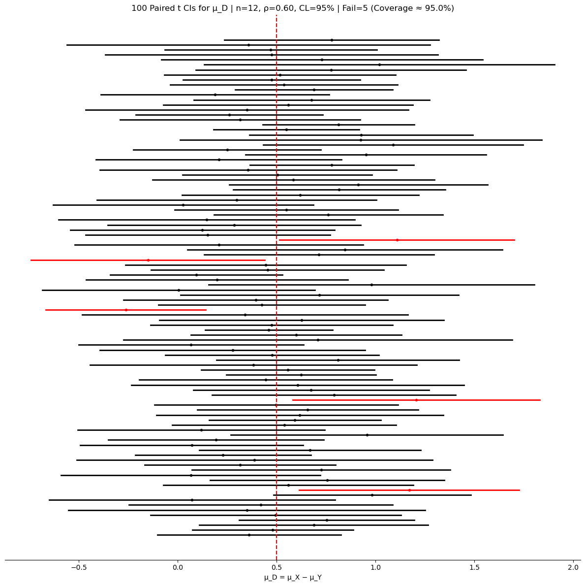

# μ_D (차이의 평균)의 신뢰구간

## 대응표본 신뢰구간

사전 점수와 사후 점수, 또는 처리 전후 측정처럼 같은 피험자에게서 관련된 두 측정값을 얻는 경우에는 대응 자료로 두 측정값의 차이를 분석한다. 대응 차이 신뢰구간은 이 두 관련 측정값의 평균 차이 $\mu_d$를 추정한다.

### 공식

$i$번째 피험자의 두 측정값의 차이를 $d_i = X_{i,1} - X_{i,2}$라 하자. 대응 차이의 평균에 대한 신뢰구간은

$$
\bar{d} \pm t_{\alpha/2, \, n-1} \times \frac{s_d}{\sqrt{n}}
$$

여기서

- $\bar{d}$는 대응 차이의 평균,
- $s_d$는 대응 차이의 표준편차,
- $n$은 대응 관측값의 개수,
- $\alpha$는 유의수준($\text{유의수준} = 1 - \text{신뢰수준}$),
- $t_{\alpha/2, \, n-1}$은 자유도 $n-1$인 $t$-분포의 임계값이다.

이 공식은 단일 평균의 신뢰구간과 본질적으로 같으며, 다만 측정값 쌍의 차이에 적용된다.

### 타당성 조건

$$
\bar{x}_d \pm t_{\alpha/2,n-1}\frac{s_d}{\sqrt{n}}
\quad\text{if}\quad
\begin{cases}
n < 30 \text{ (중심극한정리가 적용되지 않음)} \\
\text{차이의 모집단이 정규이다} \\
n \le 0.1N \text{ (i.i.d.)}
\end{cases}
$$

$n$이 크면($\ge 30$) 중심극한정리 덕분에 정규성 조건이 덜 엄격해진다. z-구간 변형도 마찬가지로 적용된다:

$$
\bar{x}_d \pm z_{\alpha/2}\frac{\sigma_d}{\sqrt{n}} \quad (\sigma_d \text{를 알고 } n \text{이 큰 경우})
\qquad\text{또는}\qquad
\bar{x}_d \pm z_{\alpha/2}\frac{s_d}{\sqrt{n}} \quad (s_d \text{를 대입, } n \text{이 큰 경우})
$$

<div class="codebox" markdown>

#### 예제 1. 대응표본 평균 차이의 신뢰구간 { .eg }

```python
import numpy as np
import scipy.stats as stats

# 대응자료는 짝마다 차이를 먼저 만들고 나면
# 그 뒤로는 **일표본** 문제와 완전히 같아진다.
# 두 집단의 분산이나 상관을 따로 다룰 필요가 없다.
differences = np.array([5, 3, 4, -2, 0, 6, -1, 2, 3, 4])
n = len(differences)          # 관측값 20개가 아니라 짝 10개다
confidence_level = 0.95

mean_diff = np.mean(differences)
std_diff = np.std(differences, ddof=1)
standard_error = std_diff / np.sqrt(n)

t_critical = stats.t.ppf(1 - (1 - confidence_level) / 2, n - 1)   # df = 짝의 개수 - 1
margin_of_error = t_critical * standard_error

confidence_interval = (mean_diff - margin_of_error, mean_diff + margin_of_error)
print(f"{confidence_interval = }")
```

출력:

```
confidence_interval = (0.5163777394551403, 4.28362226054486)
```

구간이 0을 담지 않으므로 치료 전후에 차이가 있다는 증거가 된다.

</div>

---

## 보기

<div class="exbox" markdown>

**보기 1.** <span class="diff easy" title="쉬움"></span> 치료 전후의 혈압. 한 연구자가 환자 10명의 혈압을 치료 전후로 측정했다. 차이(치료 전 빼기 치료 후)는 다음과 같다:

</div>

??? success "풀이"
    $$
    d = [5, 3, 4, -2, 0, 6, -1, 2, 3, 4]
    $$

    혈압의 평균 차이에 대한 95% 신뢰구간을 구성하라.

**풀이.**

$$
\bar{d} = \frac{5+3+4+(-2)+0+6+(-1)+2+3+4}{10} = \frac{24}{10} = 2.4
$$

$$
s_d \approx 2.633, \qquad df = 9, \qquad t_{0.025, 9} \approx 2.262
$$

$$
\text{SE} = \frac{2.633}{\sqrt{10}} \approx 0.833, \qquad \text{ME} = 2.262 \times 0.833 \approx 1.884
$$

$$
\boxed{(0.516,\ 4.284)}
$$

치료 후 혈압의 참 평균 차이가 0.516과 4.284 사이에 있다고 95% 신뢰한다.

<div class="exbox" markdown>

**보기 2.** <span class="diff easy" title="쉬움"></span> 손가락 튕기기 속도. 참가자 5명이 각각 주로 쓰는 손과 그렇지 않은 손으로 10초 동안 손가락을 튕겼다. 순서는 동전 던지기로 무작위화했다.

| 참가자 | 주로 쓰는 손 | 그렇지 않은 손 | 차이 |
|---|---|---|---|
| Jeff | 44 | 35 | 9 |
| David | 42 | 37 | 5 |
| Kim | 40 | 32 | 8 |
| Charlotte | 37 | 31 | 6 |
| Jake | 42 | 36 | 6 |

평균 차이에 대한 95% 신뢰구간을 구성하고 해석하라.


</div>

??? success "풀이"

    $$
    \bar{d} = \frac{9+5+8+6+6}{5} = 6.8
    $$

    $$
    s_d \approx 1.643, \qquad n = 5, \qquad df = 4, \qquad t_{0.025,4} \approx 2.776
    $$

    $$
    \text{SE} = \frac{1.643}{\sqrt{5}} \approx 0.735, \qquad \text{ME} = 2.776 \times 0.735 \approx 2.04
    $$

    $$
    \boxed{(4.76,\ 8.84)}
    $$

    주로 쓰는 손과 그렇지 않은 손의 튕긴 횟수의 참 평균 차이가 $(4.76, 8.84)$ 안에 있다고 95% 신뢰한다.

    ```python
    import numpy as np
    from scipy import stats

    differences = np.array([9, 5, 8, 6, 6])
    n = len(differences)
    mean_diff = np.mean(differences)
    std_diff = differences.std(ddof=1)
    standard_error = std_diff / np.sqrt(n)

    df = n - 1
    confidence_level = 0.95
    alpha = 1 - confidence_level
    t_critical = stats.t(df).ppf(1 - alpha / 2)
    margin_of_error = t_critical * standard_error

    # 같은 구간을 두 가지 방식으로 적었다.
    # 양끝을 적는 쪽은 결론을 읽기 좋고, 중심 ± 오차한계는 정밀도를 읽기 좋다.
    print(f"95% CI: ({mean_diff - margin_of_error:.2f}, {mean_diff + margin_of_error:.2f})")
    print(f"95% CI: {mean_diff:.2f} ± {margin_of_error:.2f}")
    ```

    출력:

    ```
    95% CI: (4.76, 8.84)
    95% CI: 6.80 ± 2.04
    ```

    참가자가 다섯 명뿐인데도 구간이 0에서 멀찍이 떨어져 있다. 사람마다 손가락 튕기는 속도 자체는 크게 다르지만(37회에서 44회) **같은 사람 안에서의 차이**는 5에서 9로 훨씬 고르기 때문이다. 대응설계가 버는 것이 바로 이 부분이다.
<div class="exbox" markdown>

**보기 3.** <span class="diff easy" title="쉬움"></span> 두 시계 (네 단계). 한 러닝 잡지가 GPS로 거리를 재는 시계 A와 B를 비교했다. 러너 다섯 명이 각각 두 시계를 동시에 차고 10 km 코스를 달렸다.

| 러너 | 시계 A | 시계 B | 차이 (A−B) |
|---|---|---|---|
| 1 | 9.8 | 10.1 | −0.3 |
| 2 | 9.8 | 10.0 | −0.2 |
| 3 | 10.1 | 10.2 | −0.1 |
| 4 | 10.1 | 9.9 | 0.2 |
| 5 | 10.2 | 10.1 | 0.1 |

평균 차이에 대한 95% 신뢰구간을 구성하고 해석하라.


</div>

??? success "풀이"
    **1단계: 차이 계산.** $d = [-0.3, -0.2, -0.1, 0.2, 0.1]$.

    **2단계: 조건 확인.**

    - **단순확률표본:** 만족(잡지가 구독자를 무작위로 선정했다).
    - **독립성:** 만족(모집단에 구독자가 적어도 50명 있다).
    - **정규모집단:** $n = 5$로 작으므로 확인이 필요하다. 차이가 대칭이고 이상점이 없으므로 진행해도 안전하다.

    **3단계: 구간 구성.**

    ```python
    import numpy as np
    from scipy import stats

    watch_A = np.array([9.8, 9.8, 10.1, 10.1, 10.2])
    watch_B = np.array([10.1, 10, 10.2, 9.9, 10.1])
    d = watch_A - watch_B

    d_bar = d.mean()
    s = d.std(ddof=1)
    n = d.shape[0]
    df = n - 1

    confidence_level = 0.95
    alpha = 1 - confidence_level
    t_star = stats.t(df).ppf(1 - alpha / 2)
    margin_of_error = t_star * s / np.sqrt(n)
    print(f"{confidence_level:.0%} CI: {d_bar:.4f} ± {margin_of_error:.4f}")
    ```

    출력:

    ```
    95% CI: -0.0600 ± 0.2575
    ```

    **4단계: 구간 해석.** 95% 신뢰수준에서 두 시계가 보고한 거리의 평균 차이는 구간 $(-0.32, 0.20)$ km 안에 있을 것으로 본다. 구간이 0을 포함하므로 시계 A와 B가 보고한 거리 사이에 유의한 차이는 없다.
---

## 모의실험: 대응 평균 신뢰구간의 포함확률

<div class="codebox" markdown>

### 예제 2. 대응표본 신뢰구간의 포함확률 { .eg }

```python
#!/usr/bin/env python3
"""대응표본 평균 차이의 신뢰구간을 세 방법으로 만들어 포함확률을 비교한다.

짝마다 차이를 먼저 구하고 나면 일표본 문제가 된다. 짝지음이 없애 주는
개체 간 변동이 구간을 얼마나 좁히는지 함께 본다.
"""

import numpy as np
import matplotlib.pyplot as plt
from scipy.stats import t, norm

rng_seed = 42        # 아래 그림을 재현하려면 고정한다
n_simulations = 100
n = 12
mu_x, mu_y = 0.5, 0.0
sigma_x, sigma_y = 1.0, 1.2
rho = 0.6
alpha = 0.05
method = "t"  # 't' | 'z_known' | 'z_plugin'


def main():
    rng = np.random.default_rng(rng_seed)
    delta_true = mu_x - mu_y
    var_d_true = sigma_x**2 + sigma_y**2 - 2 * rho * sigma_x * sigma_y
    sigma_d_true = np.sqrt(max(var_d_true, 0.0))

    cov = rho * sigma_x * sigma_y
    Sigma = np.array([[sigma_x**2, cov], [cov, sigma_y**2]])
    L = np.linalg.cholesky(Sigma)

    df = n - 1
    t_star = t.ppf(1 - alpha / 2.0, df=df)
    z_star = norm.ppf(1 - alpha / 2.0)

    lowers = np.empty(n_simulations)
    uppers = np.empty(n_simulations)
    centers = np.empty(n_simulations)

    for i in range(n_simulations):
        z = rng.standard_normal(size=(2, n))
        xy = (L @ z).T
        x = xy[:, 0] + mu_x
        y = xy[:, 1] + mu_y
        d = x - y
        dbar = d.mean()
        s_d = d.std(ddof=1)

        if method == "t":
            se, crit = s_d / np.sqrt(n), t_star
        elif method == "z_known":
            se, crit = sigma_d_true / np.sqrt(n), z_star
        else:
            se, crit = s_d / np.sqrt(n), z_star

        lowers[i] = dbar - crit * se
        uppers[i] = dbar + crit * se
        centers[i] = dbar

    covered = (lowers <= delta_true) & (delta_true <= uppers)
    n_fail = int((~covered).sum())
    coverage_pct = 100.0 * covered.mean()

    fig, ax = plt.subplots(figsize=(12, 12))
    for i in range(n_simulations):
        color = "k" if covered[i] else "r"
        ax.plot([lowers[i], uppers[i]], [i, i], lw=2, color=color)
        ax.plot(centers[i], i, marker="o", ms=3, color=color)

    ax.axvline(delta_true, linestyle="--", linewidth=1.5, color="r")
    ax.set_title(
        f"{n_simulations} Paired {method} CIs for μ_D | n={n}, ρ={rho:.2f}, "
        f"CL={int((1 - alpha) * 100)}% | Fail={n_fail} (Coverage ≈ {coverage_pct:.1f}%)")
    ax.set_yticks([])
    for sp in ["left", "right", "top"]:
        ax.spines[sp].set_visible(False)
    ax.set_xlabel("μ_D = μ_X − μ_Y")
    plt.tight_layout()
    plt.show()


if __name__ == "__main__":
    main()
```



포함확률 95.0%로 명목값과 맞는다.

이 모의실험에서 짝 안의 상관을 $\rho = 0.6$으로 준 것이 핵심이다. 차이의 표준편차는

$$
\sigma_D = \sqrt{\sigma_X^2 + \sigma_Y^2 - 2\rho\sigma_X\sigma_Y} = \sqrt{1 + 1.44 - 1.44} = 1.00
$$

인데, 같은 자료를 짝을 무시하고 독립 이표본으로 다뤘다면 $\sqrt{\sigma_X^2 + \sigma_Y^2} = 1.562$가 된다. 상관을 살린 덕분에 구간이 **1.56배 좁아진다**. 짝지을 수 있는 자료를 짝짓지 않는 것은 자료를 절반 버리는 것과 비슷한 손해다.

$\rho$를 0으로 바꿔 다시 돌려 보면 이 이득이 사라지고, 음수로 주면 오히려 손해가 된다는 것도 확인할 수 있다.

</div>

---

## 연습문제

<div class="drillbox" markdown>

**연습문제 1.** <span class="diff easy" title="쉬움"></span>
대응 자료에서 $n = 10$쌍, $\bar d = 4.5$, $s_d = 2.0$이다. $\mu_D$의 99% 신뢰구간을 구하라.

</div>

??? success "풀이"
    $t_{0.005, 9} = 3.250$. $\mathrm{SE} = 2.0/\sqrt{10} \approx 0.633$. 오차한계 = $3.250 \cdot 0.633 \approx 2.06$.

    신뢰구간: $(4.5 - 2.06, 4.5 + 2.06) = (2.44, 6.56)$.

<div class="drillbox" markdown>

**연습문제 2.** <span class="diff easy" title="쉬움"></span>
훈련 전후 차이: $5, 3, 8, 2, 7, 1, 6, 4, 9, 5$. (a) $\mu_D$의 95% 신뢰구간. (b) $\alpha = 0.05$에서 훈련이 효과적인가?

</div>

??? success "풀이"
    (a) $\bar D = 50/10 = 5.0$. $s_D = \sqrt{\sum(D_i - 5)^2/9} = \sqrt{60/9} \approx 2.58$.

    $t_{0.025, 9} = 2.262$. 오차한계 = $2.262 \cdot 2.58/\sqrt{10} \approx 1.85$.

    신뢰구간: $(3.15, 6.85)$.

    (b) 신뢰구간 전체가 0보다 크다 — 5% 수준에서 훈련이 효과적이다. 평균 향상은 적어도 3.15점이며 추정값은 5점이다.

<div class="drillbox" markdown>

**연습문제 3.** <span class="diff med" title="중간"></span>
**대응과 비대응의 차이가 중요한 이유.** 사전·사후 점수의 표준편차가 각각 10이고 $\rho(\mathrm{pre}, \mathrm{post}) = 0.8$이라 하자. 대응으로 다룰 때와 독립으로 다룰 때 평균 차이의 표준오차를 비교하라.

</div>

??? success "풀이"
    독립(비대응) 근사: $\mathrm{Var}(\bar X_{\text{post}} - \bar X_{\text{pre}}) = (\sigma^2 + \sigma^2)/n = 200/n$. 표준오차 = $\sqrt{200/n}$.

    대응: $\mathrm{Var}(\bar D) = \mathrm{Var}(\mathrm{post} - \mathrm{pre})/n = (\sigma^2 + \sigma^2 - 2\rho\sigma^2)/n = 2\sigma^2(1-\rho)/n = 40/n$.

    $n = 10$에서 대응 표준오차 $= \sqrt{4} = 2$, 독립 표준오차 $= \sqrt{20} \approx 4.47$.

    대응이 2배 넘게 조인다. 대응 분석은 피험자 내 상관을 활용하므로 같은 자료로 더 확실한 결론을 준다.

<div class="drillbox" markdown>

**연습문제 4.** <span class="diff med" title="중간"></span>
**짝짓기가 통하지 않을 때.** 개입 때문이 아니라 이미 나아지고 있어서 "향상"된 피험자가 있다면? 교란요인을 논하라.

</div>

??? success "풀이"
    대조군이 없는 사전·사후 설계는 다음에 취약하다:

    - **평균으로의 회귀:** 사전 점수가 낮아 선택된 피험자는 개입과 무관하게 다음 번에 더 높은 점수를 내는 경향이 있다.
    - **성숙:** 시간이 지나며 자연히 나아진다(아이가 자라거나 환자가 회복된다).
    - **연습 효과:** 검사를 한 번 치르면 두 번째에 성적이 좋아진다.
    - **역사:** 사전과 사후 사이에 결과에 영향을 주는 다른 사건이 일어난다.

    **해법:** 두 검사를 모두 치르되 개입은 받지 않는 대조군을 추가한다. 그런 다음 **차이의 차이** $\bar D_{\text{treatment}} - \bar D_{\text{control}}$을 비교한다. 이렇게 하면 개입 효과를 다른 시간적 요인에서 분리할 수 있다.

    사전·사후만으로는 시사적인 증거일 뿐이고, 대조가 있는 사전·사후라야 엄밀한 증거가 된다.

<div class="drillbox" markdown>

**연습문제 5.** <span class="diff med" title="중간"></span>
**대응 자료에 대한 부호검정.** 차이에 대한 $t$-검정의 비모수적 대안이다. 진술하고 연습문제 2에 적용하라.

</div>

??? success "풀이"
    **부호검정:** 양의 차이($+$)와 음의 차이($-$)의 개수를 센다. $H_0: \mu_D = 0$ 아래에서 50대 50을 기대한다.

    연습문제 2에서는 차이 10개가 모두 양수이다. 검정통계량 = 양수의 개수 = 10.

    $H_0$ 아래에서 $\mathrm{Binomial}(10, 0.5)$이므로 $P(X = 10) = (1/2)^{10} \approx 0.001$이다. 양측 $p$-값 $\approx 0.002$ — 강하게 기각한다.

    **$t$-검정 대비 장점:** 차이의 정규성을 가정하지 않는다. 순서형 자료에도 쓸 수 있다.

    **단점:** 정규성이 성립할 때 검정력이 낮다(차이의 크기를 무시하고 부호만 쓴다). Wilcoxon 부호순위 검정이 절충안이다: $|D_i|$의 순위를 써서 부호검정보다 검정력이 크면서 정규성을 가정하지 않는다.

<div class="drillbox" markdown>

**연습문제 6.** <span class="diff med" title="중간"></span>
**교차 설계.** 피험자가 두 처리를 무작위 순서로 모두 받는다. 이 설계를 쓰는 이유와 적절한 분석을 간단히 논하라.

</div>

??? success "풀이"
    **교차 설계:** 각 피험자가 처리 A와 B를 무작위 순서로 받으며 사이에 세척기간을 둔다. 피험자마다 A 반응과 B 반응을 모두 제공한다.

    **장점:**

    - 각 피험자가 자기 자신의 대조가 된다(대응 분석).
    - 같은 수의 피험자로 최대의 정밀도를 얻는다.
    - 피험자 간 변동성을 제거한다.

    **분석:** $D_i = X_{A,i} - X_{B,i}$에 대한 대응 $t$-검정(정규가 아니면 Wilcoxon 부호순위).

    **우려:**

    - **이월 효과:** 앞서 받은 A의 영향이 B에 남을 수 있다. 세척기간이 충분히 길어야 한다.
    - **기간 효과:** 계절적·시간적 패턴(A와 B를 다른 시기에 받는다).
    - **순서 효과:** 처리 사이의 비대칭적인 이월.

    표준적인 분석에서는 필요하면 기간과 순서를 공변량으로 포함한다. 약리학(생물학적 동등성 시험)과 관능 연구에서 많이 쓰인다.

<div class="drillbox" markdown>

**연습문제 7.** <span class="diff med" title="중간"></span>
대응 설계는 **자유도를 잃는 대신 상관을 얻는다.** 총 관측수를 $2n$으로 고정했을 때 어느 쪽이 이기는지, $\rho$와 $n$의 함수로 판정하라.

</div>

??? success "풀이"
    **두 구간의 폭.** 관측값의 표준편차를 $\sigma$로 두면

    | | 표준오차 | 자유도 |
    |---|---|---|
    | 대응($n$쌍) | $\sigma\sqrt{2(1-\rho)/n}$ | $n-1$ |
    | 독립(집단당 $n$) | $\sigma\sqrt{2/n}$ | $2n-2$ |

    대응은 분산에서 $(1-\rho)$배 이득을 보지만, **자유도가 절반**이라 $t$ 임계값이 커진다.

    ```python
    import numpy as np
    from scipy import stats

    print(f"{'n':>4s} {'ρ':>5s} {'대응 폭':>9s} {'독립 폭':>9s} {'비':>7s}")
    for n in [5, 10, 20, 50]:
        for rho in [0.0, 0.3, 0.5, 0.8]:
            w_p = 2 * stats.t.ppf(0.975, n - 1) * np.sqrt(2 * (1 - rho) / n)
            w_i = 2 * stats.t.ppf(0.975, 2 * n - 2) * np.sqrt(2 / n)
            print(f"{n:4d} {rho:5.1f} {w_p:9.4f} {w_i:9.4f} {w_p / w_i:7.3f}")
        print()
    ```

    ```text
       n     ρ    대응 폭    독립 폭       비
       5   0.0    3.5120    2.9169   1.204
       5   0.3    2.9383    2.9169   1.007
       5   0.5    2.4833    2.9169   0.851
       5   0.8    1.5706    2.9169   0.538

      10   0.0    2.0233    1.8791   1.077
      10   0.3    1.6928    1.8791   0.901
      10   0.5    1.4307    1.8791   0.761
      10   0.8    0.9049    1.8791   0.482

      20   0.0    1.3237    1.2803   1.034
      20   0.5    0.9360    1.2803   0.731
      20   0.8    0.5920    1.2803   0.462

      50   0.0    0.8038    0.7938   1.013
      50   0.8    0.3595    0.7938   0.453
    ```

    **손익분기 상관.** 두 폭이 같아지는 $\rho$는 $(1-\rho)t_{n-1}^2=t_{2n-2}^2$에서

    $$
    \rho^*=1-\left(\frac{t_{2n-2,0.975}}{t_{n-1,0.975}}\right)^2
    $$

    | $n$ | 5 | 10 | 20 | 50 | 100 |
    |---|---|---|---|---|---|
    | $\rho^*$ | 0.310 | 0.138 | 0.065 | 0.025 | 0.012 |

    **읽기.**

    1. **$n$이 작을수록 자유도 손실이 뼈아프다.** $n=5$면 $\rho>0.31$이어야 대응이 이긴다. $\rho=0$인데 짝을 지으면 폭이 20% 넓어진다.

    2. **$n$이 조금만 커도 손익분기가 낮아진다.** $n=20$이면 $\rho>0.065$로 충분하다. 실무에서 같은 개체를 두 번 측정하면 $\rho$가 0.5~0.9인 경우가 흔하므로 **거의 언제나 대응이 유리**하다.

    3. **$\rho=0.8$이면 폭이 절반 이하**다. 표본크기로 환산하면 **4배 이상의 효율**이다.

    **주의.** 이 비교는 총 관측수를 고정한 것이다. **비용이 다르면** 결론이 달라진다. 같은 사람을 두 번 재는 비용이 두 사람을 한 번씩 재는 비용보다 싸다면 대응이 더 유리하고, 대상자 모집이 값싼데 반복측정이 비싸면 반대다.

<div class="drillbox" markdown>

**연습문제 8.** <span class="diff med" title="중간"></span>
대응 $t$ 구간이 요구하는 정규성은 **차이 $D_i$의 정규성**이지 $X_i$나 $Y_i$ 각각의 정규성이 아니다. 이것이 실무에서 왜 유리한지 예로 보여라.

</div>

??? success "풀이"
    **논리.** 대응 $t$ 절차는 $D_i=X_i-Y_i$를 단일표본으로 다룬다. 따라서 필요한 것은 $D_i\overset{\text{iid}}{\sim}N(\mu_D,\sigma_D^2)$뿐이다.

    **왜 유리한가 — 개체 간 변동이 사라진다.** 실무의 비정규성은 대개 **개체마다 수준이 다른 데서** 온다.

    $$
    X_i=\alpha_i+\varepsilon_{i1},\qquad Y_i=\alpha_i+\delta+\varepsilon_{i2}
    $$

    에서 개체효과 $\alpha_i$가 치우쳐 있어도(소득, 기저 혈압, 세포 수), 차이를 취하면

    $$
    D_i=\varepsilon_{i1}-\varepsilon_{i2}-\delta
    $$

    로 **$\alpha_i$가 소거된다.** 남은 것은 측정오차의 차이이고, 이것은 대칭에 가깝기 마련이다.

    ```python
    import numpy as np
    from scipy import stats

    rng = np.random.default_rng(2024)
    n, M = 15, 20_000
    hit = 0
    sk_x, sk_d = [], []
    for _ in range(M):
        a = rng.lognormal(4, 1, n)                 # 개체 수준: 심하게 치우침
        x = a + rng.normal(0, 3, n)
        y = a + 2.0 + rng.normal(0, 3, n)          # 참 차이 -2
        d = x - y
        h = stats.t.ppf(0.975, n - 1) * d.std(ddof=1) / np.sqrt(n)
        hit += (d.mean() - h <= -2.0 <= d.mean() + h)
        sk_x.append(stats.skew(x))
        sk_d.append(stats.skew(d))
    print(f"X의 평균 왜도 {np.mean(sk_x):6.3f}   D의 평균 왜도 {np.mean(sk_d):6.3f}")
    print(f"대응 t 구간 포함확률 {hit / M:.4f}")
    ```

    ```text
    X의 평균 왜도  1.598   D의 평균 왜도 -0.002
    대응 t 구간 포함확률 0.9492
    ```

    **$X$는 왜도 1.6으로 뚜렷이 치우쳤지만 $D$는 대칭이고, 포함확률이 0.949로 정확하다.**

    **대비 — 독립표본이었다면.** 같은 자료를 짝을 무시하고 분석하면 $\bar X-\bar Y$의 분포가 로그정규 개체효과를 그대로 물려받아 치우친다. $n=15$에서 포함확률이 크게 떨어진다.

    **함의.**

    1. **정규성 진단은 $D$에 대해** 한다. $X$와 $Y$의 히스토그램이 치우쳐도 걱정할 필요가 없다.
    2. **$D$가 치우쳐 있다면** 그것은 개체효과가 아니라 **처리효과가 개체마다 다르다**는 신호일 수 있다. 상호작용을 살펴야 한다.
    3. **로그 차이.** $X$와 $Y$가 곱셈적으로 관련되면($Y_i\approx cX_i$) $\log X_i-\log Y_i$가 더 안정적이다. 이때 추정 대상은 **비의 기하평균**이다.

<div class="drillbox" markdown>

**연습문제 9.** <span class="diff med" title="중간"></span>
전후 설계에서 **평균으로의 회귀**가 어떻게 가짜 효과를 만드는지 모의실험으로 보이고, 대처법을 적어라.

</div>

??? success "풀이"
    **상황.** 사전점수가 높은(또는 낮은) 대상자만 골라 개입한 뒤, 사후점수의 변화를 효과로 해석하는 설계다. "고혈압 환자만 뽑아 약을 주고 혈압 하락을 관찰"이 전형이다.

    ```python
    import numpy as np
    from scipy import stats

    rng = np.random.default_rng(31)
    n, rho, M = 200, 0.6, 2_000
    eff_hat = []
    for _ in range(M):
        # 처리효과가 전혀 없는 세계
        pre = rng.normal(120, 15, 4 * n)
        post = 120 + rho * (pre - 120) + rng.normal(0, 15 * np.sqrt(1 - rho**2), 4 * n)
        sel = pre > 140                            # 고혈압자만 선택
        eff_hat.append((post[sel] - pre[sel]).mean())
    e = np.array(eff_hat)
    print(f"참 효과 0인데 관측된 평균 변화 {e.mean():.3f} mmHg")
    print(f"모의실험 간 표준편차 {e.std():.3f}")
    print(f"선택된 인원 평균 {4 * n * stats.norm.sf(140, 120, 15):.0f}명")

    c = (140 - 120) / 15                      # 이론값과 대조
    lam = stats.norm.pdf(c) / stats.norm.sf(c)
    print(f"이론 기대 변화 {-(1 - rho) * 15 * lam:.3f} mmHg")
    ```

    ```text
    참 효과 0인데 관측된 평균 변화 -10.784 mmHg
    모의실험 간 표준편차 1.414
    선택된 인원 평균 73명
    이론 기대 변화 -10.789 mmHg
    ```

    **처리효과가 0인데 10.8 mmHg의 "하락"이 보인다.** 모의실험과 이론값이 정확히 맞는다. 대응 $t$ 구간을 만들면 이 가짜 효과가 압도적으로 유의하게 나온다.

    **왜 그런가.** 사전점수가 140을 넘은 사람들은 **참 수준이 높은 사람**과 **그날 우연히 높게 측정된 사람**이 섞여 있다. 후자는 다시 재면 평균 쪽으로 돌아온다. 이론적으로 선택된 집단의 기대 변화는

    $$
    E[\text{post}-\text{pre}\mid\text{pre}>c]=-(1-\rho)\,E[\text{pre}-\mu\mid\text{pre}>c]
    =-(1-\rho)\,\sigma\frac{\varphi(c^*)}{1-\Phi(c^*)}
    $$

    이다($c^*=(c-\mu)/\sigma$는 표준화한 문턱). 위 설정에서 $c^*=1.333$, $\varphi/(1-\Phi)=1.798$이므로 $-(0.4)(15)(1.798)=-10.79$다. **$\rho$가 1보다 작기만 하면 반드시 음수**다. 측정이 부정확할수록($\rho$가 작을수록) 가짜 효과가 크다.

    **대처.**

    1. **대조군을 둔다.** 가장 확실한 답이다. 같은 선택기준으로 뽑은 대조군도 같은 회귀를 겪으므로, **두 군의 변화를 비교**하면 상쇄된다.

    2. **무작위 배정.** 선택 후 무작위로 처리/대조를 나눈다.

    3. **선택에 쓰지 않은 측정값을 기준선으로.** 선별용 측정과 기준선 측정을 따로 하면 회귀가 제거된다. 임상시험에서 흔히 쓰는 설계다.

    4. **ANCOVA.** 사후점수를 사전점수로 보정한 회귀를 쓴다. 다만 이것도 대조군이 있어야 의미가 있다.

    5. **반복측정으로 기준선 안정화.** 사전점수를 여러 번 재어 평균하면 $\rho$가 커져 회귀가 줄어든다.

    **실무의 함정.** "개선이 가장 필요한 학교/병원/지점을 골라 개입하고 성과를 측정"하는 정책평가가 이 오류에 특히 취약하다. 개입이 없어도 다음 해에는 나아 보인다.

<div class="drillbox" markdown>

**연습문제 10.** <span class="diff med" title="중간"></span>
차이 대신 **비**($Y/X$)나 **변화율**에 관심이 있을 때 어떻게 구간을 만드는가? $n=12$인 예로 세 방법을 비교하라.

</div>

??? success "풀이"
    **언제 비가 맞는가.** 기준값의 크기가 개체마다 크게 다를 때다. 매출 100억이 110억이 된 것과 1억이 1.1억이 된 것은 **절대 변화는 다르지만 비는 같다.**

    ```python
    import numpy as np
    from scipy import stats

    pre = np.array([12.0, 45.0, 8.0, 120.0, 33.0, 19.0,
                    75.0, 6.0, 52.0, 28.0, 91.0, 15.0])
    post = np.array([14.1, 50.8, 9.7, 131.5, 39.9, 21.4,
                     86.2, 7.4, 60.1, 33.5, 99.8, 18.2])

    # 방법 1: 로그 차이 (비의 기하평균)
    ld = np.log(post) - np.log(pre)
    n = len(ld)
    t = stats.t.ppf(0.975, n - 1)
    h = t * ld.std(ddof=1) / np.sqrt(n)
    print(f"기하평균 비 {np.exp(ld.mean()):.4f}  "
          f"95% 구간 ({np.exp(ld.mean() - h):.4f}, {np.exp(ld.mean() + h):.4f})")

    # 방법 2: 개별 비의 산술평균
    r = post / pre
    h2 = t * r.std(ddof=1) / np.sqrt(n)
    print(f"비의 평균 {r.mean():.4f}  95% 구간 ({r.mean() - h2:.4f}, {r.mean() + h2:.4f})")

    # 방법 3: 총합의 비 (묶음 추정량) + 부트스트랩
    rng = np.random.default_rng(8)
    B = 20_000
    idx = rng.integers(0, n, (B, n))
    boot = post[idx].sum(1) / pre[idx].sum(1)
    lo, hi = np.percentile(boot, [2.5, 97.5])
    print(f"총합의 비 {post.sum() / pre.sum():.4f}  95% 구간 ({lo:.4f}, {hi:.4f})")
    ```

    ```text
    기하평균 비 1.1652  95% 구간 (1.1352, 1.1959)
    비의 평균 1.1660  95% 구간 (1.1358, 1.1962)
    총합의 비 1.1361  95% 구간 (1.1146, 1.1730)
    ```

    **세 값이 다르다. 다른 양을 추정하기 때문이다.**

    | 방법 | 추정 대상 | 언제 |
    |---|---|---|
    | 로그 차이 | 개별 비의 **기하평균** | 곱셈적 효과, 상대변화가 관심 |
    | 비의 평균 | 개별 비의 **산술평균** | 각 개체를 동등하게 취급 |
    | 총합의 비 | **묶음 비** $\sum Y/\sum X$ | 전체 총량의 변화가 관심 |

    **총합의 비가 가장 작은 이유.** 큰 개체(pre=120, 91)의 증가율이 상대적으로 낮은데, 묶음 비는 크기로 가중하므로 그쪽으로 끌린다. **"평균적인 회사가 16.5% 성장했다"와 "업계 전체가 13.6% 성장했다"는 둘 다 참일 수 있다.**

    **로그 척도를 권하는 이유.**

    1. **비는 1에서 비대칭이다.** 두 배는 2, 절반은 0.5다. 로그를 취하면 $\pm0.69$로 대칭이 된다.
    2. **구간이 항상 양수**다. 비의 산술평균에 대칭 구간을 쓰면 하한이 음수가 될 수 있고, 그것은 무의미하다.
    3. **정규성이 잘 성립한다.** 곱셈적 오차가 로그 척도에서 덧셈적이 된다.

    **보고.** "기하평균 16.5% 증가(95% 신뢰구간 13.5%~19.6%)"처럼, **무엇의 평균인지 명시**한다. 단순히 "16% 증가"라고만 적으면 독자가 어느 정의인지 알 수 없다.

---

## 정리하며

대응 자료는 **차이를 만들어 일표본 문제로 환원**한다.

$$
\bar d \pm t_{\alpha/2,\,n-1}\cdot\frac{s_d}{\sqrt n}
$$

- **$d_i=X_{i1}-X_{i2}$ 를 만드는 순간 이표본 문제가 사라진다.** 남은 것은 차이 하나짜리 표본이고, 앞서 본 일표본 $t$ 구간을 그대로 쓴다.
- **자유도가 $n-1$ 이다.** 쌍의 개수에서 하나를 뺀 것이며, 관측 총수 $2n$ 과는 무관하다.
- **이것이 대응 설계의 이득이다.** 피험자마다 다른 기저 수준이 뺄셈으로 상쇄되므로 $s_d$ 가 개별 측정의 표준편차보다 훨씬 작아질 수 있다. **상관이 높을수록 이득이 크다.**
- **독립을 가정하면 안 된다.** 같은 대상에서 나온 두 측정은 상관되어 있으며, 이표본 공식을 쓰면 표준오차를 과대평가해 구간이 불필요하게 넓어진다.
- **차이의 정규성만 필요하다.** 원래 두 측정이 각각 정규일 필요는 없다.

다음 절 **대응 설계와 독립 설계 중 무엇을 쓸 것인가**에서 그 선택의 기준을 정리한다.
