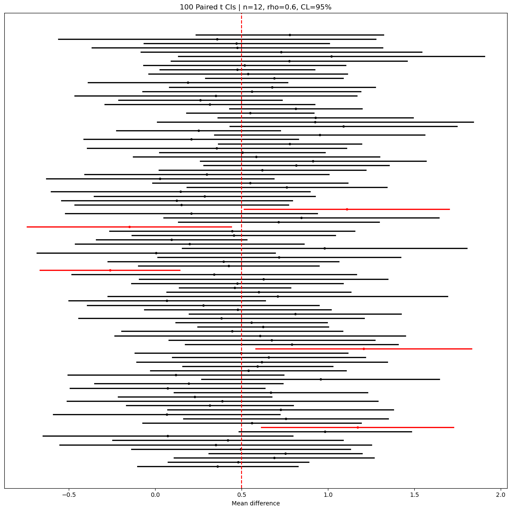

# 대응 평균 신뢰구간의 포함확률 모의실험

## 개요

같은 피험자에게서 두 측정값을 얻으면(예: 처리 전후) 각 쌍 안의 관측값이 상관된다. 평균 차이 $\mu_D = \mu_X - \mu_Y$에 대한 대응표본 신뢰구간은 문제를 차이 $D_i = X_i - Y_i$에 대한 일표본 구간으로 환원한다. 이 페이지에서는 대응 자료에 세 가지 방법을 적용해 포함확률을 모의실험하고, 짝 내 상관이 구간 너비에 어떤 영향을 주는지 보인다.

## 대응 신뢰구간

대응 관측값 $(X_1, Y_1), \ldots, (X_n, Y_n)$이 주어졌을 때 차이를 $D_i = X_i - Y_i$로 정의한다. 차이의 표본평균과 표본표준편차는

$$
\bar{D} = \frac{1}{n}\sum_{i=1}^n D_i, \quad S_D = \sqrt{\frac{1}{n-1}\sum_{i=1}^n (D_i - \bar{D})^2}
$$

### t-구간 (기본)

$$
\bar{D} \pm t_{\alpha/2,\,n-1} \cdot \frac{S_D}{\sqrt{n}}
$$

### D의 분산을 아는 z-구간

$\sigma_D$를 아는 경우(실무에서는 드물다):

$$
\bar{D} \pm z_{\alpha/2} \cdot \frac{\sigma_D}{\sqrt{n}}
$$

차이의 참 분산은 $\sigma_D^2 = \sigma_X^2 + \sigma_Y^2 - 2\rho\,\sigma_X \sigma_Y$이며, 여기서 $\rho$는 짝 내 상관이다.

### s를 대입한 z-구간

$$
\bar{D} \pm z_{\alpha/2} \cdot \frac{S_D}{\sqrt{n}}
$$

$n$이 큰 경우의 근사이며 작은 표본에서는 포함확률이 부족하다.

## 상관의 역할

차이의 분산에 주목하라:

$$
\operatorname{Var}(D) = \sigma_X^2 + \sigma_Y^2 - 2\rho\,\sigma_X\sigma_Y
$$

$\rho > 0$(양의 짝 내 상관)이면 $D$의 분산이 $\sigma_X^2 + \sigma_Y^2$보다 **줄어든다**. 이것이 짝짓기의 통계적 이점이다: 피험자 간 변동성의 상당 부분이 상쇄되어 신뢰구간이 좁아진다.

<div class="codebox" markdown>

### 예제 1. 대응표본 구간 모의실험 { .eg }

```python
import numpy as np
import matplotlib.pyplot as plt
from scipy.stats import t, norm

n_simulations = 100
n = 12
mu_x, mu_y = 0.5, 0.0
sigma_x, sigma_y = 1.0, 1.2
rho = 0.6
alpha = 0.05
method = "t"  # 't' | 'z_known' | 'z_plugin'

rng = np.random.default_rng(42)      # 아래 출력과 그림을 재현하려면 고정한다

delta_true = mu_x - mu_y
var_d_true = sigma_x**2 + sigma_y**2 - 2 * rho * sigma_x * sigma_y
sigma_d_true = np.sqrt(var_d_true)

# 상관이 있는 짝 (X, Y)를 만들어야 하므로 공분산행렬을 세우고
# Cholesky 분해 L을 쓴다. 독립인 표준정규 z에 L을 곱하면
# 공분산이 Sigma인 자료가 된다. Cov(Lz) = L L^T = Sigma 이기 때문이다.
cov = rho * sigma_x * sigma_y
Sigma = np.array([[sigma_x**2, cov], [cov, sigma_y**2]])
L = np.linalg.cholesky(Sigma)

df = n - 1
t_star = t.ppf(1 - alpha / 2, df=df)
z_star = norm.ppf(1 - alpha / 2)

lowers = np.empty(n_simulations)
uppers = np.empty(n_simulations)
centers = np.empty(n_simulations)

for i in range(n_simulations):
    z_vals = rng.standard_normal(size=(2, n))
    xy = (L @ z_vals).T
    x = xy[:, 0] + mu_x
    y = xy[:, 1] + mu_y
    d = x - y
    dbar = d.mean()
    s_d = d.std(ddof=1)

    if method == "t":
        se, crit = s_d / np.sqrt(n), t_star
    elif method == "z_known":
        se, crit = sigma_d_true / np.sqrt(n), z_star
    else:
        se, crit = s_d / np.sqrt(n), z_star

    lowers[i] = dbar - crit * se
    uppers[i] = dbar + crit * se
    centers[i] = dbar

covered = (lowers <= delta_true) & (delta_true <= uppers)
coverage_pct = 100.0 * covered.mean()
print(f"Paired {method} coverage: {coverage_pct:.1f}%")
```

출력:

```
Paired t coverage: 95.0%
```

</div>

### 구간의 시각화

<div class="codebox" markdown>

#### 예제 2. 구간 100개를 한 그림에 { .eg }

```python
# 구간 하나를 가로선 하나로 그린다. 참값을 담은 구간은 검정, 놓친 구간은
# 빨강이다. 세로 점선이 참값이고, 빨간 선이 몇 개인지 세는 것이 곧 포함확률을
# 재는 일이다. 구간마다 길이가 다른 까닭은 표본마다 s 가 다르기 때문이다.
fig, ax = plt.subplots(figsize=(12, 12))
for i in range(n_simulations):
    color = "k" if covered[i] else "r"
    ax.plot([lowers[i], uppers[i]], [i, i], lw=2, color=color)
    ax.plot(centers[i], i, marker="o", ms=3, color=color)

ax.axvline(delta_true, linestyle="--", linewidth=1.5, color="r")
n_fail = int((~covered).sum())
ax.set_title(f"{n_simulations} Paired {method} CIs | n={n}, rho={rho}, CL=95%")
ax.set_yticks([])
ax.set_xlabel("Mean difference")
plt.tight_layout()
plt.show()
```



여기 쓰인 설정에서 $\sigma_D = \sqrt{1 + 1.44 - 1.44} = 1.00$이다. $\rho = 0.6$이라는 상관 덕분에 $\sigma_X^2 + \sigma_Y^2$의 상당 부분이 상쇄되었다. 같은 자료를 짝을 무시하고 다뤘다면 산포가 1.562가 되어 구간이 1.56배 넓어졌을 것이다.

`rho`를 0.0이나 $-0.3$으로 바꿔 다시 돌려 보면 구간이 눈에 띄게 넓어진다. 포함확률은 그대로 95% 근처를 유지한다. 상관은 구간의 **정확성**이 아니라 **정밀도**를 바꾼다.

</div>

## 해석

- 대응 $t$-구간은 $\sigma_D$의 추정을 올바르게 반영하므로 명목 95% 포함확률을 달성한다.
- 짝 내 상관 $\rho$가 클수록 $\sigma_D$가 줄어 신뢰구간이 좁아진다.
- 대입한 $z$-구간은 정규 임계값이 $t$ 임계값보다 작아 작은 $n$에서 포함확률이 부족하다.
- 짝짓기는 $\rho > 0$일 때 이롭다. $\rho \le 0$이면 짝짓기가 오히려 독립 이표본 설계보다 구간을 **넓힐** 수 있으므로 설계를 다시 생각해야 한다.

## 연습문제

<div class="drillbox" markdown>

**연습문제 1.** <span class="diff easy" title="쉬움"></span> 환자 10명의 혈압을 투약 전후로 측정했다. 차이 $D_i$(투약 전 빼기 투약 후)는 5, 3, 8, 2, 6, 4, 7, 1, 5, 3이다. $\mu_D$의 95% $t$-구간을 구성하라.

</div>

??? success "풀이"

    요약통계량을 계산하면:

    $$
    \bar{D} = \frac{5+3+8+2+6+4+7+1+5+3}{10} = \frac{44}{10} = 4.4
    $$

    $$
    S_D = \sqrt{\frac{1}{9}\sum_{i=1}^{10}(D_i - 4.4)^2} = \sqrt{\frac{1}{9}(0.36+1.96+12.96+5.76+2.56+0.16+6.76+11.56+0.36+1.96)} = \sqrt{\frac{44.4}{9}} = \sqrt{4.933} \approx 2.221
    $$

    $\text{df} = 9$이고 $t_{0.025,9} = 2.262$이므로:

    $$
    4.4 \pm 2.262 \times \frac{2.221}{\sqrt{10}} = 4.4 \pm 2.262 \times 0.7024 = 4.4 \pm 1.589
    $$

    $\mu_D$의 95% 신뢰구간은 $(2.81, 5.99)$이다. 구간 전체가 양수이므로 이 약이 혈압을 낮추는 것으로 보인다. $\square$

<div class="drillbox" markdown>

**연습문제 2.** <span class="diff med" title="중간"></span> 대응 관측값에 대해 공식 $\sigma_D^2 = \sigma_X^2 + \sigma_Y^2 - 2\rho\,\sigma_X\sigma_Y$를 유도하라.

</div>

??? success "풀이"

    $D = X - Y$라 하자. 분산의 성질에 의해:

    $$
    \operatorname{Var}(D) = \operatorname{Var}(X - Y) = \operatorname{Var}(X) + \operatorname{Var}(Y) - 2\operatorname{Cov}(X,Y)
    $$

    상관계수의 정의에 의해 $\operatorname{Cov}(X,Y) = \rho\,\sigma_X\sigma_Y$이므로

    $$
    \sigma_D^2 = \sigma_X^2 + \sigma_Y^2 - 2\rho\,\sigma_X\sigma_Y
    $$

    를 얻는다. $\rho > 0$이면 빼지는 항 $2\rho\,\sigma_X\sigma_Y > 0$ 덕분에 $D$의 분산이, $X$와 $Y$가 독립일 때 나올 값인 $\sigma_X^2 + \sigma_Y^2$보다 작아진다. $\square$

<div class="drillbox" markdown>

**연습문제 3.** <span class="diff med" title="중간"></span> $\sigma_X = \sigma_Y = \sigma$이고 $\rho = 0.8$이라 하자. $n$쌍인 대응 설계에서 $\bar{D}$의 표준오차와, 집단당 관측값이 $n$개인 독립 이표본 설계에서 $\bar{X} - \bar{Y}$의 표준오차를 비교하라.

</div>

??? success "풀이"

    **대응 설계:** $\sigma_D^2 = \sigma^2 + \sigma^2 - 2(0.8)\sigma^2 = 2\sigma^2(1 - 0.8) = 0.4\sigma^2$. 표준오차는

    $$
    \text{SE}_{\text{paired}} = \frac{\sigma_D}{\sqrt{n}} = \frac{\sigma\sqrt{0.4}}{\sqrt{n}} = \frac{0.632\,\sigma}{\sqrt{n}}
    $$

    **독립 설계:** $\operatorname{Var}(\bar{X} - \bar{Y}) = \sigma^2/n + \sigma^2/n = 2\sigma^2/n$. 표준오차는

    $$
    \text{SE}_{\text{indep}} = \sqrt{\frac{2\sigma^2}{n}} = \frac{\sigma\sqrt{2}}{\sqrt{n}} = \frac{1.414\,\sigma}{\sqrt{n}}
    $$

    비는 $\text{SE}_{\text{paired}}/\text{SE}_{\text{indep}} = \sqrt{0.4}/\sqrt{2} = \sqrt{0.2} \approx 0.447$이다. 대응 설계가 표준오차를 절반 넘게 줄여 훨씬 좁은 신뢰구간을 준다. $\square$

<div class="drillbox" markdown>

**연습문제 4.** <span class="diff med" title="중간"></span> 어떤 $\rho$ 값에서 대응 설계가 독립 설계보다 나을 것이 없어지는가? $\rho < 0$이면 어떻게 되는가?

</div>

??? success "풀이"

    $\sigma_X = \sigma_Y = \sigma$일 때 대응 분산은 $\sigma_D^2 = 2\sigma^2(1-\rho)$이고, (집단당 $n$개인) 독립 설계에서 $\bar{X}-\bar{Y}$의 분산은 $2\sigma^2/n$이다. 표준오차를 비교하면:

    $$
    \text{SE}_{\text{paired}} = \frac{\sigma\sqrt{2(1-\rho)}}{\sqrt{n}}, \quad \text{SE}_{\text{indep}} = \frac{\sigma\sqrt{2}}{\sqrt{n}}
    $$

    $\sqrt{2(1-\rho)} = \sqrt{2}$일 때, 즉 $\rho = 0$일 때 둘이 같다. $\rho = 0$이면 짝 안의 측정값이 무상관이어서 짝짓기가 분산을 줄여 주지 않는다.

    $\rho < 0$이면 $2(1-\rho) > 2$이므로 $\text{SE}_{\text{paired}} > \text{SE}_{\text{indep}}$이다. 음의 짝 내 상관은 오히려 차이의 분산을 **키워** 대응 설계를 독립 설계보다 **못하게** 만든다. 실무에서 흔치는 않지만, 예컨대 짝지은 피험자들이 반대 방향으로 반응하는 경향이 있다면 생길 수 있다. $\square$

<div class="drillbox" markdown>

**연습문제 5.** <span class="diff easy" title="쉬움"></span> 어떤 연구가 대응 관측값 $n = 15$쌍을 쓴다. 표본 평균 차이는 $\bar{D} = 2.3$, $S_D = 4.1$이다. 95% 신뢰구간에 0이 들어 있는지 확인하여 5% 수준에서 $\mu_D = 0$을 검정하라.

</div>

??? success "풀이"

    $\text{df} = 14$이고 $t_{0.025,14} = 2.145$이므로:

    $$
    \text{SE} = \frac{4.1}{\sqrt{15}} = \frac{4.1}{3.873} = 1.059
    $$

    $$
    \bar{D} \pm t_{0.025,14} \times \text{SE} = 2.3 \pm 2.145 \times 1.059 = 2.3 \pm 2.272
    $$

    95% 신뢰구간은 $(0.028, 4.572)$이다. $0$이 (아슬아슬하게) 이 구간 밖에 있으므로 5% 유의수준에서 $H_0: \mu_D = 0$을 기각한다. 자료는 참 평균 차이가 양수라는 증거를 준다. $\square$

<div class="drillbox" markdown>

**연습문제 6.** <span class="diff med" title="중간"></span>
대응 자료를 **독립표본으로 잘못 분석**하면 포함확률이 어떻게 되는지 $\rho$를 바꾸며 확인하라. 방향이 $\rho$의 부호에 따라 어떻게 달라지는가?

</div>

??? success "풀이"
    ```python
    import numpy as np
    from scipy import stats

    rng = np.random.default_rng(77)
    n, M = 20, 20_000
    print(f"{'ρ':>6s} {'대응':>8s} {'독립(오분석)':>13s} "
          f"{'대응 폭':>9s} {'독립 폭':>9s}")
    for rho in [-0.5, -0.2, 0.0, 0.3, 0.6, 0.9]:
        L = np.linalg.cholesky(np.array([[1, rho], [rho, 1]]))
        z = rng.standard_normal((M, n, 2)) @ L.T
        x, y = 10 + z[:, :, 0], 12 + z[:, :, 1]     # 참 차이 -2
        d = x - y

        h = stats.t.ppf(0.975, n - 1) * d.std(1, ddof=1) / np.sqrt(n)
        cov_p = np.mean((d.mean(1) - h <= -2) & (-2 <= d.mean(1) + h))

        sp = np.sqrt((x.var(1, ddof=1) + y.var(1, ddof=1)) / 2)
        hi = stats.t.ppf(0.975, 2 * n - 2) * sp * np.sqrt(2 / n)
        dd = x.mean(1) - y.mean(1)
        cov_i = np.mean((dd - hi <= -2) & (-2 <= dd + hi))

        print(f"{rho:6.1f} {cov_p:8.4f} {cov_i:13.4f} "
              f"{2 * h.mean():9.4f} {2 * hi.mean():9.4f}")
    ```

    ```text
         ρ      대응   독립(오분석)     대응 폭     독립 폭
      -0.5   0.9500        0.8906    1.6001    1.2694
      -0.2   0.9485        0.9258    1.4353    1.2739
       0.0   0.9484        0.9493    1.3068    1.2708
       0.3   0.9495        0.9788    1.0913    1.2714
       0.6   0.9533        0.9971    0.8266    1.2673
       0.9   0.9506        1.0000    0.4132    1.2648
    ```

    **대응 분석은 모든 $\rho$에서 정확히 0.95다.** 차이를 단일표본으로 다루므로 $\rho$가 무엇이든 상관없다.

    **오분석의 방향이 $\rho$의 부호를 따른다.**

    | $\rho$ | 독립 분석 | 성격 |
    |---|---|---|
    | $-0.5$ | **0.891** | **과대기각** — 실제보다 좁은 구간 |
    | $0$ | 0.949 | 정확(독립이므로 당연) |
    | $+0.6$ | 0.997 | 지나치게 보수적 |
    | $+0.9$ | 1.000 | 무의미할 만큼 넓다 |

    **왜 그런가.** 참 분산은 $\sigma_D^2=2\sigma^2(1-\rho)$인데 독립 분석은 $2\sigma^2$을 쓴다.

    - **$\rho>0$**: 참 분산이 작은데 크게 잡으므로 구간이 필요 이상으로 넓다. **결론이 틀리지는 않지만 검정력을 크게 잃는다.** $\rho=0.9$에서 폭이 3배다.
    - **$\rho<0$**: 참 분산이 큰데 작게 잡으므로 구간이 좁다. **포함확률이 무너진다.** 이쪽이 위험하다.

    **$\rho<0$은 언제 생기는가.** 자원 경쟁(한 쌍둥이가 많이 먹으면 다른 쪽이 적게), 총량이 고정된 배분, 순위 자료처럼 **한쪽이 오르면 다른 쪽이 내려가는** 구조다. 드물지만 존재한다.

    **실무 교훈.** $\rho>0$인 흔한 경우에 오분석은 "안전한" 실수처럼 보이지만, **연구비를 낭비하는** 실수다. 같은 결론을 얻는 데 훨씬 많은 표본이 필요해진다.

<div class="drillbox" markdown>

**연습문제 7.** <span class="diff hard" title="어려움"></span>
차이가 치우쳐 있을 때 **호지스-레만 구간**(부호순위 검정의 역전)이 대응 $t$ 구간과 어떻게 다른지 확인하라. 무엇을 추정하는지 주의하라.

</div>

??? success "풀이"
    **호지스-레만 추정량.** 모든 **왈시 평균** $(d_i+d_j)/2$($i\le j$)의 중앙값이다. 부호순위 검정을 역전하면 왈시 평균의 순서통계량으로 구간이 나온다.

    **무엇을 추정하는가 — 유사중앙값.** $D$의 평균도 중앙값도 아니고, **$(D_1+D_2)/2$의 중앙값**이다. 대칭분포에서는 셋이 모두 같지만, 치우친 분포에서는 다르다.

    ```python
    import numpy as np
    from scipy import stats

    def hl_ci(d, alpha=0.05):
        n = len(d)
        w = np.add.outer(d, d)[np.triu_indices(n)] / 2     # 왈시 평균
        w.sort()
        mu = n * (n + 1) / 4
        sd = np.sqrt(n * (n + 1) * (2 * n + 1) / 24)
        k = max(int(np.floor(mu - stats.norm.ppf(1 - alpha / 2) * sd)), 0)
        return w[k], w[len(w) - 1 - k]

    # 지수분포(1)의 세 중심
    pm = stats.gamma.ppf(0.5, 2) / 2                       # 유사중앙값
    print(f"Exp(1)  평균 1.0000  중앙값 {np.log(2):.4f}  유사중앙값 {pm:.4f}")

    rng = np.random.default_rng(5)
    n, M = 15, 4_000
    ht = hm = hp = 0
    for _ in range(M):
        d = rng.exponential(1.0, n)
        h = stats.t.ppf(0.975, n - 1) * d.std(ddof=1) / np.sqrt(n)
        ht += (d.mean() - h <= 1.0 <= d.mean() + h)
        lo, hi = hl_ci(d)
        hm += (lo <= 1.0 <= hi)
        hp += (lo <= pm <= hi)
    print(f"t 구간이 평균을 담을 확률        {ht / M:.4f}")
    print(f"HL 구간이 평균을 담을 확률       {hm / M:.4f}")
    print(f"HL 구간이 유사중앙값을 담을 확률  {hp / M:.4f}")
    ```

    ```text
    Exp(1)  평균 1.0000  중앙값 0.6931  유사중앙값 0.8392
    t 구간이 평균을 담을 확률        0.9120
    HL 구간이 평균을 담을 확률       0.8852
    HL 구간이 유사중앙값을 담을 확률  0.9430
    ```

    **핵심 — HL 구간은 평균을 담도록 만들어진 것이 아니다.** 유사중앙값(0.839)에 대해서는 0.943으로 정확하지만, 평균(1.0)에 대해서는 0.885다.

    **흔한 오해.** "비모수 방법이니 분포가정 없이 평균의 구간을 준다"고 생각하는 것이다. **틀렸다.** 부호순위 검정이 평균에 대한 진술이 되려면 **$D$의 분포가 대칭**이어야 한다. 대칭이면 평균=중앙값=유사중앙값이므로 문제가 없다.

    **언제 쓰는가.**

    | 상황 | 권장 |
    |---|---|
    | $D$가 대칭(정규 포함) | HL과 $t$ 모두 타당. 정규면 $t$가 약간 효율적 |
    | $D$가 대칭이고 꼬리가 두꺼움 | **HL이 낫다**(효율 우위) |
    | $D$가 치우침, **평균**이 관심 | $t$ 또는 부트스트랩. **HL은 부적절** |
    | $D$가 치우침, **전형적 값**이 관심 | HL 또는 중앙값 구간 |

    **효율.** 정규분포에서 HL의 점근상대효율이 $3/\pi=0.955$로, $t$에 비해 4.5%만 손해다. 두꺼운 꼬리에서는 HL이 훨씬 앞선다. **대칭성만 확인된다면 기본값으로 삼을 만하다.**

<div class="drillbox" markdown>

**연습문제 8.** <span class="diff med" title="중간"></span>
$n=20$인 대응 자료에 **이상치 쌍 하나**가 섞였을 때 $t$ 구간과 호지스-레만 구간의 반응을 비교하라.

</div>

??? success "풀이"
    ```python
    import numpy as np
    from scipy import stats

    rng = np.random.default_rng(99)
    d = np.round(rng.normal(3.0, 1.5, 20), 2)
    d2 = d.copy()
    d2[0] = 25.0                                   # 기록 오류 한 건

    def t_ci(v):
        n = len(v)
        h = stats.t.ppf(0.975, n - 1) * v.std(ddof=1) / np.sqrt(n)
        return v.mean() - h, v.mean() + h

    def hl_ci(v, alpha=0.05):
        n = len(v)
        w = np.add.outer(v, v)[np.triu_indices(n)] / 2
        w.sort()
        mu = n * (n + 1) / 4
        sd = np.sqrt(n * (n + 1) * (2 * n + 1) / 24)
        k = max(int(np.floor(mu - stats.norm.ppf(1 - alpha / 2) * sd)), 0)
        return w[k], w[len(w) - 1 - k]

    for name, v in [("원자료", d), ("이상치 1개", d2)]:
        lo, hi = t_ci(v)
        l2, h2 = hl_ci(v)
        w = np.add.outer(v, v)[np.triu_indices(len(v))] / 2
        print(f"{name}")
        print(f"  평균 {v.mean():6.3f}   t  ({lo:6.3f}, {hi:6.3f})  폭 {hi - lo:6.3f}")
        print(f"  HL   {np.median(w):6.3f}   HL ({l2:6.3f}, {h2:6.3f})  폭 {h2 - l2:6.3f}")
    ```

    ```text
    원자료
      평균  3.183   t  ( 2.584,  3.783)  폭  1.199
      HL    3.230   HL ( 2.615,  3.820)  폭  1.205
    이상치 1개
      평균  4.278   t  ( 1.917,  6.638)  폭  4.720
      HL    3.340   HL ( 2.625,  4.130)  폭  1.505
    ```

    **원자료에서는 두 구간이 사실상 같다.** 자료가 정규라 HL의 효율 손실이 미미하다(폭 1.199 대 1.205, 0.5% 차이).

    **이상치가 들어오면 갈라진다.**

    | | 중심 이동 | 폭 변화 |
    |---|---|---|
    | $t$ | $3.18\to4.28$ ($+1.10$) | $1.20\to4.72$ (**3.9배**) |
    | HL | $3.23\to3.34$ ($+0.11$) | $1.21\to1.51$ (1.2배) |

    **$t$ 구간은 중심이 1.10 옮겨 가고 폭이 4배**가 된다. 값 하나가 $3.12$에서 $25.0$으로 바뀐 결과다. 이동량은 정확히 $(25.0-3.12)/20=1.094$다.

    **HL은 중심이 0.11만 움직인다.** 왈시 평균 210개 중 이상치가 들어간 것이 20개뿐이고, 중앙값은 그것들에 거의 영향받지 않는다.

    **붕괴점.** HL의 붕괴점은 $1-1/\sqrt2\approx0.29$다. 관측값의 29%까지 오염되어도 추정값이 발산하지 않는다. 평균의 붕괴점은 $1/n$이다.

    **실무 절차.** 이상치를 발견하면

    1. **원인을 확인한다.** 25.0이 기록 오류인지 진짜 반응인지.
    2. **두 결과를 모두 보고한다.** 포함/제외, 또는 $t$/HL.
    3. **결론이 갈리면** 그 사실 자체가 중요한 정보다. "관측값 하나에 결론이 좌우된다"고 명시한다.

<div class="drillbox" markdown>

**연습문제 9.** <span class="diff med" title="중간"></span>
대응 자료에서 한쪽 측정이 **결측**된 쌍이 생겼다. 완전사례 분석과 "있는 자료를 모두 쓰되 짝을 깨는" 분석을 비교하라.

</div>

??? success "풀이"
    ```python
    import numpy as np
    from scipy import stats

    rng = np.random.default_rng(21)
    n, M, rho = 20, 10_000, 0.7
    L = np.linalg.cholesky(np.array([[1, rho], [rho, 1]]))
    hit_cc = hit_br = 0
    w_cc = w_br = 0.0

    for _ in range(M):
        z = rng.standard_normal((n, 2)) @ L.T
        x, y = 10 + z[:, 0], 12 + z[:, 1]          # 참 차이 -2
        miss = rng.random(n) < 0.25                # y가 완전 무작위로 25% 결측

        d = (x - y)[~miss]                         # 완전사례 대응 분석
        m = len(d)
        h = stats.t.ppf(0.975, m - 1) * d.std(ddof=1) / np.sqrt(m)
        hit_cc += (d.mean() - h <= -2 <= d.mean() + h)
        w_cc += 2 * h

        yy = y[~miss]                              # 짝을 깨고 독립표본으로
        n1, n2 = len(x), len(yy)
        sp = np.sqrt(((n1 - 1) * x.var(ddof=1) + (n2 - 1) * yy.var(ddof=1))
                     / (n1 + n2 - 2))
        hi = stats.t.ppf(0.975, n1 + n2 - 2) * sp * np.sqrt(1 / n1 + 1 / n2)
        dd = x.mean() - yy.mean()
        hit_br += (dd - hi <= -2 <= dd + hi)
        w_br += 2 * hi

    print(f"완전사례 대응   포함확률 {hit_cc / M:.4f}  평균 폭 {w_cc / M:.4f}")
    print(f"짝 깨고 독립    포함확률 {hit_br / M:.4f}  평균 폭 {w_br / M:.4f}")
    ```

    ```text
    완전사례 대응   포함확률 0.9494  평균 폭 0.8498
    짝 깨고 독립    포함확률 0.9968  평균 폭 1.3792
    ```

    **완전사례 대응 분석이 훨씬 낫다.** 자료의 25%를 버렸는데도 폭이 0.85로, 모든 자료를 쓴 독립 분석(1.38)보다 **38% 좁다.**

    **왜 그런가.** $\rho=0.7$의 이득이 결측으로 잃는 정보보다 훨씬 크다. 쌍 15개의 대응 분석이 $(20,15)$ 두 독립표본보다 정보가 많다.

    **짝을 깨면 보수적이 된다.** 포함확률 0.997은 상관을 무시해 분산을 과대평가한 결과다. **틀리지는 않지만 낭비**다.

    **더 나은 방법들.**

    1. **혼합모형.** 결측이 무작위(MAR)라면 개체를 임의효과로 두는 선형혼합모형이 **모든 관측값을 쓰면서 상관도 반영**한다. 완전사례보다 효율적이다.

    2. **다중대체.** 결측값을 여러 번 대체해 분석하고 루빈의 규칙으로 결합한다. 결측 기전을 모형화할 수 있다는 장점이 있다.

    3. **최대가능도.** 이변량정규를 가정하면 결측이 있어도 직접 최대가능도추정이 가능하다.

    **경고 — 결측 기전.** 위 모의실험은 **완전 무작위 결측**을 가정했다. 실제로는

    - 상태가 나쁜 환자가 추적을 놓치거나,
    - 값이 극단적일 때 측정이 실패하거나,
    - 처리군에서 탈락률이 다르거나

    하는 일이 흔하다. 이런 경우 **완전사례 분석은 편향된다.** 결측 여부와 관측된 변수의 관계를 먼저 조사해야 하며, 결측이 결과와 직접 관련되면(MNAR) 어떤 방법도 가정 없이는 해결하지 못한다.

<div class="drillbox" markdown>

**연습문제 10.** <span class="diff hard" title="어려움"></span>
무작위 배정된 사전-사후 연구를 분석하는 세 방법 — **변화점수**, **사후점수만**, **ANCOVA** — 의 포함확률과 폭을 비교하라.

</div>

??? success "풀이"
    **설정.** 집단당 $n=30$, 사전-사후 상관 $\rho=0.7$, 참 처리효과 $\tau=1$.

    ```python
    import numpy as np
    from scipy import stats

    rng = np.random.default_rng(3)
    n, M, rho, tau = 30, 5_000, 0.7, 1.0
    res = {"변화점수": [0, 0.0], "사후만": [0, 0.0], "ANCOVA": [0, 0.0]}

    def two_sample(v, g):
        a, b = v[g == 0], v[g == 1]
        sp = np.sqrt(((len(a) - 1) * a.var(ddof=1) + (len(b) - 1) * b.var(ddof=1))
                     / (len(a) + len(b) - 2))
        h = stats.t.ppf(0.975, len(v) - 2) * sp * np.sqrt(1 / len(a) + 1 / len(b))
        return b.mean() - a.mean(), h

    for _ in range(M):
        g = rng.integers(0, 2, 2 * n)                      # 무작위 배정
        pre = rng.normal(0, 1, 2 * n)
        post = rho * pre + np.sqrt(1 - rho**2) * rng.normal(0, 1, 2 * n) + tau * g

        for key, v in [("변화점수", post - pre), ("사후만", post)]:
            est, h = two_sample(v, g)
            res[key][0] += (est - h <= tau <= est + h)
            res[key][1] += 2 * h

        X = np.column_stack([np.ones(2 * n), g, pre])      # ANCOVA
        beta, *_ = np.linalg.lstsq(X, post, rcond=None)
        r = post - X @ beta
        df = 2 * n - 3
        se = np.sqrt((r @ r / df) * np.linalg.inv(X.T @ X)[1, 1])
        h = stats.t.ppf(0.975, df) * se
        res["ANCOVA"][0] += (beta[1] - h <= tau <= beta[1] + h)
        res["ANCOVA"][1] += 2 * h

    for k, (hit, w) in res.items():
        print(f"{k:8s} 포함확률 {hit / M:.4f}   평균 폭 {w / M:.4f}")
    ```

    ```text
    변화점수   포함확률 0.9448   평균 폭 0.8037
    사후만     포함확률 0.9488   평균 폭 1.0405
    ANCOVA   포함확률 0.9442   평균 폭 0.7489
    ```

    **셋 다 편향되지 않았다.** 무작위 배정 덕이다. 포함확률이 모두 0.95 근처다.

    **효율이 다르다.** ANCOVA(0.749) < 변화점수(0.804) < 사후만(1.041).

    **왜 ANCOVA가 이기는가.** 세 방법의 분산은 각각

    $$
    \text{사후만}:\ 2\sigma^2,\qquad
    \text{변화점수}:\ 2\sigma^2(2-2\rho),\qquad
    \text{ANCOVA}:\ 2\sigma^2(1-\rho^2)
    $$

    에 비례한다($\sigma^2$은 사후점수의 분산, 집단당 $n$으로 나눈 것 생략).

    | $\rho$ | 사후만 | 변화점수 | ANCOVA |
    |---|---|---|---|
    | 0.0 | 1.00 | 2.00 | 1.00 |
    | 0.5 | 1.00 | 1.00 | 0.75 |
    | 0.7 | 1.00 | 0.60 | **0.51** |
    | 0.9 | 1.00 | 0.20 | **0.19** |

    **ANCOVA가 언제나 가장 작다.** 사후만 쓰는 경우를 1로 두면 세 비율이 $1$, $2(1-\rho)$, $1-\rho^2$인데, $1-\rho^2=(1-\rho)(1+\rho)\le\min\{1,\ 2(1-\rho)\}$가 모든 $\rho\in[0,1]$에서 성립한다. 사전점수의 회귀계수를 **추정**하기 때문이며, 변화점수는 그 계수를 1로 **고정**하는 셈이다.

    **변화점수의 함정.** $\rho<0.5$이면 변화점수가 사후만 쓰는 것보다 **나쁘다.** 측정 신뢰도가 낮은 척도에서 "변화량"을 분석하는 관행이 여기에 걸린다.

    **결정적인 단서 — 무작위 배정이 아니라면.** 위 결과는 배정이 사전점수와 무관할 때다. **관측연구에서 두 군의 사전점수가 다르면** 세 방법이 서로 다른 답을 주고, 이것이 **로드의 역설**이다. 그때는 인과구조를 먼저 밝혀야 하며, 통계적 효율만으로 방법을 고를 수 없다.

---

## 정리하며

짝 내 상관이 구간의 폭을 어떻게 바꾸는지 **직접 재어 보았다.**

- **상관이 높을수록 구간이 좁아진다.** 차이의 분산이 $\sigma_1^2+\sigma_2^2-2\rho\sigma_1\sigma_2$ 이므로 $\rho$ 가 커질수록 줄어들며, $\rho=0.9$ 쯤이면 폭이 절반 이하가 된다.
- **$\rho<0$ 이면 반대로 넓어진다.** 음의 상관이면 차이의 변동이 오히려 커진다.
- **포함확률은 어느 $\rho$ 에서도 명목값을 지킨다.** 대응 $t$ 구간이 차이 하나짜리 일표본 문제이므로 당연하며, **상관은 폭에만 영향을 주고 타당성에는 영향을 주지 않는다.**
- **독립 방법을 잘못 쓰면 포함확률 자체가 어긋난다.** 상관을 무시하면 표준오차가 틀리고, 그 방향은 $\rho$ 의 부호에 달려 있다.
- **설계의 이득이 수치로 확인된다.** 같은 $n$ 으로 더 좁은 구간을 얻는다는 것이 곧 더 적은 표본으로 같은 정밀도를 얻는다는 뜻이다.

다음 절부터 그 계산을 거꾸로 푼다. **원하는 정밀도를 얻으려면 $n$ 이 얼마여야 하는가.**
