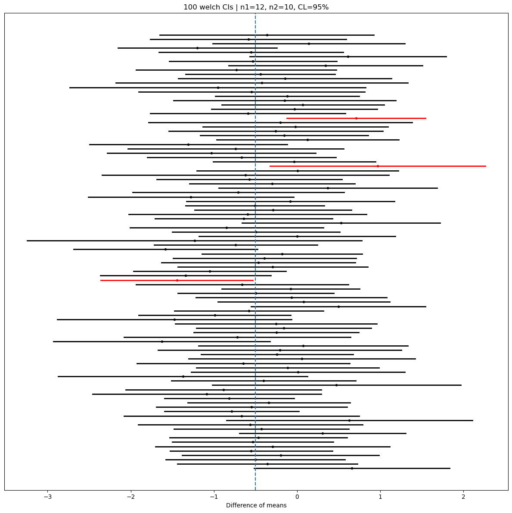

# 평균 차이 신뢰구간 모의실험

## 개요

독립인 두 모집단의 평균을 비교할 때는 $\Delta = \mu_1 - \mu_2$의 신뢰구간을 구성한다. 이 페이지에서는 네 가지 접근 — Welch의 $t$-구간(권장되는 기본값), 합동 $t$-구간, 그리고 $z$에 기반한 두 변형 — 의 포함확률을 모의실험한다. 모분산이 다를 수 있을 때 왜 Welch 방법이 선호되는지 보여준다.

## 네 가지 구간 방법

### Welch의 t-구간 (권장 기본값)

표본분산이 $s_1^2$, $s_2^2$이고 크기가 $n_1$, $n_2$인 독립표본에 대해:

$$
(\bar{X}_1 - \bar{X}_2) \pm t_{\alpha/2,\,\nu} \cdot \sqrt{\frac{s_1^2}{n_1} + \frac{s_2^2}{n_2}}
$$

여기서 Satterthwaite 자유도는

$$
\nu = \frac{\left(\frac{s_1^2}{n_1} + \frac{s_2^2}{n_2}\right)^2}{\frac{(s_1^2/n_1)^2}{n_1-1} + \frac{(s_2^2/n_2)^2}{n_2-1}}
$$

Welch 방법은 등분산을 가정하지 **않으며** 이분산성에 로버스트하다.

### 합동 t-구간

$\sigma_1^2 = \sigma_2^2$을 가정한다. 합동분산은

$$
s_p^2 = \frac{(n_1-1)s_1^2 + (n_2-1)s_2^2}{n_1 + n_2 - 2}
$$

이고 구간은

$$
(\bar{X}_1 - \bar{X}_2) \pm t_{\alpha/2,\,n_1+n_2-2} \cdot s_p\sqrt{\frac{1}{n_1} + \frac{1}{n_2}}
$$

### 분산을 아는 z-구간

$\sigma_1^2$과 $\sigma_2^2$을 알 때:

$$
(\bar{X}_1 - \bar{X}_2) \pm z_{\alpha/2} \cdot \sqrt{\frac{\sigma_1^2}{n_1} + \frac{\sigma_2^2}{n_2}}
$$

### s를 대입한 z-구간

표본표준편차를 정규 임계값과 함께 쓰는 대표본 근사이다:

$$
(\bar{X}_1 - \bar{X}_2) \pm z_{\alpha/2} \cdot \sqrt{\frac{s_1^2}{n_1} + \frac{s_2^2}{n_2}}
$$

<div class="codebox" markdown>

**예제 1.** 두 평균 차이 구간 모의실험

```python
import numpy as np
import matplotlib.pyplot as plt
from scipy.stats import t, norm

np.random.seed(42)          # 아래 출력과 그림을 재현하려면 고정한다

n_simulations = 100
# 표본크기도 분산도 서로 다르게 잡았다. 이런 설정에서 합동 t가 무너지고
# Welch가 버티는지 보려는 것이다.
n1, n2 = 12, 10
mu1, mu2 = 0.0, 0.5
sigma1, sigma2 = 1.0, 1.5
alpha = 0.05
method = "welch"  # 'welch' | 'pooled' | 'z_known' | 'z_plugin'

delta_true = mu1 - mu2
lowers = np.empty(n_simulations)
uppers = np.empty(n_simulations)
centers = np.empty(n_simulations)

for i in range(n_simulations):
    x = np.random.normal(mu1, sigma1, n1)
    y = np.random.normal(mu2, sigma2, n2)
    xbar, ybar = x.mean(), y.mean()
    s1, s2 = x.std(ddof=1), y.std(ddof=1)
    diff_hat = xbar - ybar
    centers[i] = diff_hat

    if method == "welch":
        se = np.sqrt(s1**2 / n1 + s2**2 / n2)
        num = (s1**2 / n1 + s2**2 / n2)**2
        den = (s1**2 / n1)**2 / (n1 - 1) + (s2**2 / n2)**2 / (n2 - 1)
        df = num / den
        crit = t.ppf(1 - alpha / 2, df=df)
    elif method == "pooled":
        df = n1 + n2 - 2
        sp2 = ((n1 - 1) * s1**2 + (n2 - 1) * s2**2) / df
        se = np.sqrt(sp2 * (1 / n1 + 1 / n2))
        crit = t.ppf(1 - alpha / 2, df=df)
    elif method == "z_known":
        se = np.sqrt(sigma1**2 / n1 + sigma2**2 / n2)
        crit = norm.ppf(1 - alpha / 2)
    else:  # z_plugin
        se = np.sqrt(s1**2 / n1 + s2**2 / n2)
        crit = norm.ppf(1 - alpha / 2)

    lowers[i] = diff_hat - crit * se
    uppers[i] = diff_hat + crit * se

covered = (lowers <= delta_true) & (delta_true <= uppers)
coverage_pct = 100.0 * covered.mean()
print(f"{method} coverage: {coverage_pct:.1f}%")
```

출력:

```
welch coverage: 97.0%
```

</div>

같은 자료에 `method`만 바꾸면 합동 $t$ 95%, $z$-known 94%, $z$-plugin 93%가 나온다. 다만 100회짜리 모의실험의 표준오차가 2.2%p나 되므로 이 차이를 방법의 우열로 읽으면 안 된다. 방법 사이의 진짜 차이를 보려면 아래 연습문제 3처럼 10,000회가 필요하다.

### 구간의 시각화

<div class="codebox" markdown>

**예제 2.** 구간 100개를 한 그림에

```python
# 구간 하나를 가로선 하나로 그린다. 참값을 담은 구간은 검정, 놓친 구간은
# 빨강이다. 세로 점선이 참값이고, 빨간 선이 몇 개인지 세는 것이 곧 포함확률을
# 재는 일이다. 구간마다 길이가 다른 까닭은 표본마다 s 가 다르기 때문이다.
fig, ax = plt.subplots(figsize=(12, 12))
for i in range(n_simulations):
    color = "k" if covered[i] else "r"
    ax.plot([lowers[i], uppers[i]], [i, i], lw=2, color=color)
    ax.plot(centers[i], i, marker="o", ms=3, color=color)

ax.axvline(delta_true, linestyle="--", linewidth=1.5)
n_fail = int((~covered).sum())
ax.set_title(f"{n_simulations} {method} CIs | n1={n1}, n2={n2}, CL=95%")
ax.set_yticks([])
ax.set_xlabel("Difference of means")
plt.tight_layout()
plt.show()
```

</div>



참값은 $\mu_1 - \mu_2 = -0.5$(세로 점선)이다. 구간의 폭이 1.56에서 4.02까지 두 배 넘게 널을 뛰는데, $s_1$과 $s_2$ 두 개가 동시에 흔들리는 데다 $n_2 = 10$으로 작아 그 흔들림이 크기 때문이다.

100개 중 **89개가 0을 담고 있다**는 점도 눈여겨볼 만하다. 참 차이가 분명히 존재하는데도($-0.5$) 표본이 작아 "차이가 없다"는 값을 열에 아홉은 배제하지 못한다. 9장의 용어로 말하면 검정력이 낮은 상황이다. 구간이 참값을 잘 담는 것과 유용한 결론을 주는 것은 별개다.

## 해석

- **Welch의 $t$-구간**은 모분산이 같든 다르든 명목 포함확률을 달성한다. 이표본 문제의 권장 기본값이다.
- **합동 $t$-구간**은 $\sigma_1^2 = \sigma_2^2$일 때 잘 작동하지만 이 가정이 깨지면, 특히 표본크기도 다르면 포함확률이 부족하거나 과할 수 있다.
- **$z$-known** 구간은 정확하지만 두 모분산을 모두 알아야 하며 그런 경우는 드물다.
- **$z$-plugin** 구간은 $z$ 공식에 표본분산을 대입한다. 작은 표본에서는 포함확률이 부족하지만 $n_1, n_2 \to \infty$이면 올바른 수준으로 수렴한다.
- $\sigma_1 \ne \sigma_2$이고 $n_1 \ne n_2$이면 합동 구간이 상당히 관대해지거나 보수적이 될 수 있는 반면, Welch 방법은 Satterthwaite 자유도로 적응한다.

## 연습문제

<div class="drillbox" markdown>

**연습문제 1.** <span class="diff easy" title="쉬움"></span> 두 집단의 요약통계량이 다음과 같다: $n_1 = 15$, $\bar{x}_1 = 78$, $s_1 = 10$; $n_2 = 20$, $\bar{x}_2 = 72$, $s_2 = 12$. $\mu_1 - \mu_2$의 95% Welch 신뢰구간을 구성하라.

</div>

??? success "풀이"

    점추정값은 $\bar{x}_1 - \bar{x}_2 = 6$이다. 표준오차는

    $$
    \text{SE} = \sqrt{\frac{10^2}{15} + \frac{12^2}{20}} = \sqrt{\frac{100}{15} + \frac{144}{20}} = \sqrt{6.667 + 7.200} = \sqrt{13.867} = 3.724
    $$

    Satterthwaite 자유도:

    $$
    \nu = \frac{(6.667 + 7.200)^2}{\frac{6.667^2}{14} + \frac{7.200^2}{19}} = \frac{192.29}{\frac{44.44}{14} + \frac{51.84}{19}} = \frac{192.29}{3.174 + 2.728} = \frac{192.29}{5.903} \approx 32.6
    $$

    $\nu \approx 32.6$이고 $t_{0.025,32.6} \approx 2.036$이므로:

    $$
    6 \pm 2.036 \times 3.724 = 6 \pm 7.58
    $$

    95% 신뢰구간은 $(-1.58, 13.58)$이다. 구간이 0을 포함하므로 5% 수준에서 두 평균이 다르다고 결론지을 수 없다. $\square$

<div class="drillbox" markdown>

**연습문제 2.** <span class="diff hard" title="어려움"></span> 근사적인 $t$ 추축량의 처음 두 적률을 $t_\nu$ 분포의 적률에 맞추어 Satterthwaite 자유도를 유도하라.

</div>

??? success "풀이"

    분산이 다른 이표본 모형에서 추축량은

    $$
    T = \frac{(\bar{X}_1 - \bar{X}_2) - (\mu_1 - \mu_2)}{\sqrt{S_1^2/n_1 + S_2^2/n_2}}
    $$

    분모에는 독립인 두 카이제곱 확률변수의 가중합이 들어 있다. $V = S_1^2/n_1 + S_2^2/n_2$라 하자. 적률 맞추기로 $V$를 $c \cdot W$($W \sim \chi^2_\nu / \nu$, $\nu$는 유효 자유도)로 근사한다.

    $V$의 처음 두 적률을 맞추면:

    - $E[V] = \sigma_1^2/n_1 + \sigma_2^2/n_2$
    - $\operatorname{Var}(V) = \frac{2\sigma_1^4}{n_1^2(n_1-1)} + \frac{2\sigma_2^4}{n_2^2(n_2-1)}$

    축척된 $\chi^2_\nu$에 대해 $W = c \chi^2_\nu/\nu$이면 $E[W] = c$이고 $\operatorname{Var}(W) = 2c^2/\nu$이다. $c = E[V]$로 두고 분산을 맞추면:

    $$
    \frac{2(E[V])^2}{\nu} = \operatorname{Var}(V)
    \quad\Longrightarrow\quad
    \nu = \frac{2(E[V])^2}{\operatorname{Var}(V)} = \frac{(\sigma_1^2/n_1 + \sigma_2^2/n_2)^2}{\frac{\sigma_1^4}{n_1^2(n_1-1)} + \frac{\sigma_2^4}{n_2^2(n_2-1)}}
    $$

    $\sigma_i^2$을 $s_i^2$으로 바꾸면 실무에서 쓰는 Satterthwaite 공식이 된다. $\square$

<div class="drillbox" markdown>

**연습문제 3.** <span class="diff med" title="중간"></span> $\sigma_1^2 = \sigma_2^2 = \sigma^2$이고 $n_1 = n_2 = n$일 때 Satterthwaite 자유도가 합동 자유도 $n_1 + n_2 - 2$로 간단해짐을 보여라. 분산이 같더라도 표본크기가 다르면 어떻게 되는가?

</div>

??? success "풀이"

    Satterthwaite 공식에 $\sigma_1^2 = \sigma_2^2 = \sigma^2$을 대입하면:

    $$
    \nu = \frac{(\sigma^2/n_1 + \sigma^2/n_2)^2}{\frac{\sigma^4}{n_1^2(n_1-1)} + \frac{\sigma^4}{n_2^2(n_2-1)}}
    = \frac{(1/n_1 + 1/n_2)^2}{\frac{1}{n_1^2(n_1-1)} + \frac{1}{n_2^2(n_2-1)}}
    $$

    $\sigma^4$이 약분된다. $n_1 = n_2 = n$이면:

    $$
    \nu = \frac{(2/n)^2}{2/[n^2(n-1)]} = \frac{4}{n^2} \cdot \frac{n^2(n-1)}{2} = 2(n-1) = n_1 + n_2 - 2
    $$

    즉 표본크기가 같으면 Satterthwaite 자유도가 정확히 합동 자유도와 일치한다.

    표본크기가 다르면 분산이 같더라도 이 등식은 성립하지 않는다. 예를 들어 $n_1 = 10$, $n_2 = 20$이면

    $$
    \nu = \frac{(0.1 + 0.05)^2}{\frac{0.01}{9} + \frac{0.0025}{19}} = \frac{0.0225}{0.0012427} \approx 18.1
    $$

    로 $n_1 + n_2 - 2 = 28$보다 작다. 등분산일 때 합동 방법이 자유도를 더 많이 쓰므로 약간 더 효율적인 것이며, Welch는 그 대가로 등분산 가정에서 벗어날 자유를 얻는다. $\square$

<div class="drillbox" markdown>

**연습문제 4.** <span class="diff med" title="중간"></span> $\sigma_1 = 1$, $\sigma_2 = 3$, $n_1 = n_2 = 10$일 때 Welch 구간과 합동 구간의 포함확률을 비교하는 모의실험을 설계하라. 10,000회 반복하고 결과를 보고하라.

</div>

??? success "풀이"

    ```python
    from scipy.stats import t as t_dist, norm
    np.random.seed(0)
    n1 = n2 = 10
    sigma1, sigma2 = 1.0, 3.0
    mu1 = mu2 = 0.0
    delta = 0.0
    n_sim = 10_000
    alpha = 0.05
    welch_cov = pooled_cov = 0
    for _ in range(n_sim):
        x = np.random.normal(mu1, sigma1, n1)
        y = np.random.normal(mu2, sigma2, n2)
        s1, s2 = x.std(ddof=1), y.std(ddof=1)
        diff = x.mean() - y.mean()
        # Welch
        se_w = np.sqrt(s1**2/n1 + s2**2/n2)
        num = (s1**2/n1 + s2**2/n2)**2
        den = (s1**2/n1)**2/9 + (s2**2/n2)**2/9
        df_w = num/den
        crit_w = t_dist.ppf(0.975, df_w)
        if diff - crit_w*se_w <= delta <= diff + crit_w*se_w:
            welch_cov += 1
        # Pooled
        sp2 = (9*s1**2 + 9*s2**2)/18
        se_p = np.sqrt(sp2*(1/10+1/10))
        crit_p = t_dist.ppf(0.975, 18)
        if diff - crit_p*se_p <= delta <= diff + crit_p*se_p:
            pooled_cov += 1
    print(f"Welch: {100*welch_cov/n_sim:.1f}%")
    print(f"Pooled: {100*pooled_cov/n_sim:.1f}%")
    ```

    출력:

    ```
    Welch: 95.0%
    Pooled: 94.3%
    ```

    Welch는 명목값에 정확히 맞고 합동은 0.7%p 부족하다. 합동 구간이 등분산을 가정하는데 실제로는 $\sigma_2/\sigma_1 = 3$이기 때문이다.

    차이가 이 정도로 작은 것은 $n_1 = n_2$이기 때문이다. 표본크기가 같으면 $s_p^2$의 가중치가 반반이어서 $\bar X_1 - \bar X_2$의 참 분산 $\sigma_1^2/n + \sigma_2^2/n$을 우연히 잘 맞힌다. 표본크기까지 어긋나면 왜곡이 훨씬 커진다. 연습문제 5가 그 방향을 다룬다. $\square$

<div class="drillbox" markdown>

**연습문제 5.** <span class="diff med" title="중간"></span> 표본크기와 분산의 관계에 따라 합동 $t$-구간이 관대해지기도 하고 보수적이 되기도 하는 이유를 설명하라.

</div>

??? success "풀이"

    합동 구간은 공통 분산추정값으로 $s_p^2 = [(n_1-1)s_1^2 + (n_2-1)s_2^2]/(n_1+n_2-2)$를 쓴다. $\sigma_1^2 \ne \sigma_2^2$일 때:

    - **큰** 표본이 분산이 **큰** 모집단에서 나오면 $s_p^2$이 $\bar{X}_1 - \bar{X}_2$의 유효 분산을 과대추정하여 신뢰구간이 **너무 넓어진다**(보수적, 포함확률 $> 1-\alpha$).
    - **큰** 표본이 분산이 **작은** 모집단에서 나오면 $s_p^2$이 유효 분산을 과소추정하여 신뢰구간이 **너무 좁아진다**(관대함, 포함확률 $< 1-\alpha$).

    이런 비대칭은 합동 추정값이 $s_1^2$과 $s_2^2$을 표본크기를 따라가는 자유도 $(n_i - 1)$로 가중하기 때문에 생긴다. $\bar{X}_1 - \bar{X}_2$의 실제 분산은 $\sigma_1^2/n_1 + \sigma_2^2/n_2$로, 분산과 표본크기가 어떻게 짝지어지는지에 달려 있다. Welch 방법은 두 분산을 따로 추정하고 그에 맞게 자유도를 조정하여 이 문제를 피한다. $\square$

---

## 정리하며

네 가지 방법의 포함확률을 재어 보면 **웰치가 기본값인 이유**가 분명해진다.

- **분산이 다르고 표본크기도 다르면 합동 $t$ 가 무너진다.** 특히 **작은 표본에 큰 분산이 붙은 경우**가 최악으로, 포함확률이 명목값보다 크게 낮아진다. 반대 조합에서는 지나치게 보수적이 된다.
- **웰치는 거의 모든 조합에서 명목값을 지킨다.** 새터스웨이트 자유도가 두 표본의 불균형을 흡수하기 때문이다.
- **분산이 실제로 같을 때 웰치의 손해는 미미하다.** 자유도를 조금 잃을 뿐이며, 그 대가로 가정 하나를 통째로 없앤다. **보험료가 싸다.**
- **$z$ 기반 변형은 소표본에서 부족하다.** $s$ 를 대입하고 $z$ 임계값을 쓰면 구간이 좁아져 포함확률이 떨어진다. 일표본에서 본 것과 같은 현상이다.
- **실무 권고는 단순하다. 언제나 웰치를 쓴다.** 등분산 검정으로 방법을 고르는 2단계 절차는 쓰지 않는다.

다음 절부터 **대응표본**으로 넘어간다. 두 측정이 같은 대상에서 나온 경우이며, 독립을 가정할 수 없다.
