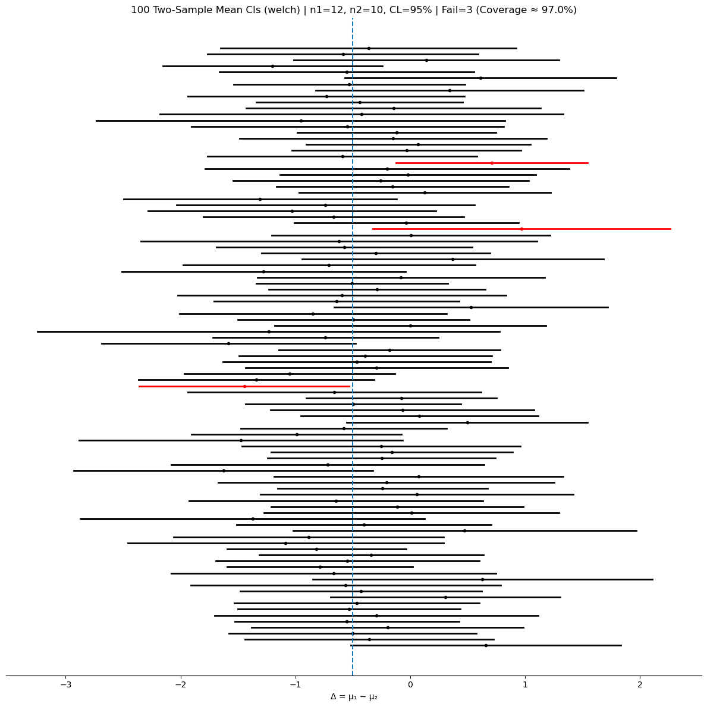

# μ₁ − μ₂의 신뢰구간

## 평균 차이에 대한 이표본 신뢰구간

두 모집단을 비교할 때 우리는 흔히 두 평균의 차이에 관심을 둔다. $\mu_1 - \mu_2$의 신뢰구간은 표본변동을 감안하여 이 차이에 대해 그럴듯한 값들의 범위를 준다.

---

## 상황별 공식

### 분산을 아는 경우 (z-구간)

$$
(\bar{X}_1 - \bar{X}_2) \pm z_{\alpha/2} \times \sqrt{\frac{\sigma_1^2}{n_1} + \frac{\sigma_2^2}{n_2}}
$$

여기서 $\sigma_1^2$과 $\sigma_2^2$은 알려진 모분산이고, $z_{\alpha/2}$는 $P(Z > z_{\alpha/2}) = \alpha/2$를 만족하는 임계값이다.

### 분산을 모르고 서로 다른 경우 — Welch의 t-구간

$$
(\bar{X}_1 - \bar{X}_2) \pm t_{\alpha/2, \, \text{df}} \times \sqrt{\frac{s_1^2}{n_1} + \frac{s_2^2}{n_2}}
$$

여기서 자유도는 **Welch–Satterthwaite 식**으로 계산한다:

$$
\text{df} = \frac{\left(\frac{s_1^2}{n_1} + \frac{s_2^2}{n_2}\right)^2}{\frac{1}{n_1 - 1}\left(\frac{s_1^2}{n_1}\right)^2 + \frac{1}{n_2 - 1}\left(\frac{s_2^2}{n_2}\right)^2}
$$

!!! tip "기본 선택"
    분산이 같다는 강한 근거가 없다면 Welch의 t-구간을 택하라.

### 분산을 모르고 서로 같은 경우 — 합동 t-구간

$$
(\bar{X}_1 - \bar{X}_2) \pm t_{\alpha/2, \, n_1+n_2-2} \times \sqrt{s_p^2\left(\frac{1}{n_1} + \frac{1}{n_2}\right)}
$$

여기서 **합동분산**은

$$
s_p^2 = \frac{(n_1 - 1)s_1^2 + (n_2 - 1)s_2^2}{n_1 + n_2 - 2}
$$

이고 $\text{df} = n_1 + n_2 - 2$이다.

### 큰 표본 (표본분산을 쓰는 z-구간)

$n_1 \ge 30$이고 $n_2 \ge 30$이면 분산을 모르고 서로 달라도 정규근사를 쓸 수 있다:

$$
(\bar{X}_1 - \bar{X}_2) \pm z_{\alpha/2} \times \sqrt{\frac{s_1^2}{n_1} + \frac{s_2^2}{n_2}}
$$

### Python 코드

```python
import numpy as np
import scipy.stats as stats

n1, n2 = 30, 25
mean1, mean2 = 100, 90
s1, s2 = 15, 20
confidence_level = 0.95

# 두 표본이 독립이므로 분산이 더해진다.
# 표준편차가 아니라 **분산**을 더한 뒤 제곱근이라는 점에 주의.
standard_error = np.sqrt((s1**2 / n1) + (s2**2 / n2))

# Welch-Satterthwaite 자유도. 정수가 아니어도 scipy는 받아 준다.
# 두 표본의 정보량을 하나로 합치는 근사이며, 한쪽 분산이 압도하면
# 그쪽 표본의 자유도 쪽으로 끌려간다.
df = ((s1**2 / n1) + (s2**2 / n2))**2 / (
    ((s1**2 / n1)**2 / (n1 - 1)) + ((s2**2 / n2)**2 / (n2 - 1))
)

t_critical = stats.t.ppf(1 - (1 - confidence_level) / 2, df)
margin_of_error = t_critical * standard_error

confidence_interval = (
    (mean1 - mean2) - margin_of_error,
    (mean1 - mean2) + margin_of_error,
)
print(f"{confidence_interval = }")
```

출력:

```
confidence_interval = (0.22892977648461788, 19.77107022351538)
```

구간이 0을 아슬아슬하게 벗어난다. 점추정값은 차이가 10이라고 말하지만, 구간은 0.23만큼 작을 수도 19.77만큼 클 수도 있다고 말한다. "차이가 있다"까지는 말할 수 있어도 "얼마나 있다"는 거의 말하지 못하는 자료다.

---

## 예제

<div class="exbox" markdown>

**보기 1.** 평균 차이의 95% 신뢰구간 (Welch).

독립인 두 표본: 표본 1은 $n_1 = 30$, $\bar{X}_1 = 100$, $s_1 = 15$이고, 표본 2는 $n_2 = 25$, $\bar{X}_2 = 90$, $s_2 = 20$이다.

</div>

**풀이.**

$$
\text{SE} = \sqrt{\frac{225}{30} + \frac{400}{25}} = \sqrt{7.5 + 16} = \sqrt{23.5} \approx 4.847
$$

Welch–Satterthwaite 자유도:

$$
\text{df} = \frac{(7.5 + 16)^2}{\frac{7.5^2}{29} + \frac{16^2}{24}} = \frac{552.25}{12.606} \approx 43.8
$$

$t_{0.025, 43} \approx 2.017$이므로:

$$
\text{ME} = 2.017 \times 4.847 \approx 9.78
$$

$$
\boxed{(0.22,\ 19.78)}
$$

두 모평균의 참 차이가 0.22와 19.78 사이에 있다고 95% 신뢰한다.

---

## 모의실험: 이표본 평균 신뢰구간의 포함확률

```python
#!/usr/bin/env python3
"""
Two-sample mean CI simulation: Welch, pooled, z_known, z_plugin.
"""

import numpy as np
import matplotlib.pyplot as plt
from scipy.stats import t, norm

rng_seed = 42        # 아래 그림을 재현하려면 고정한다
n_simulations = 100
n1, n2 = 12, 10
mu1, mu2 = 0.0, 0.5
sigma1, sigma2 = 1.0, 1.5
alpha = 0.05
method = "welch"  # 'welch' | 'pooled' | 'z_known' | 'z_plugin'


def main():
    if rng_seed is not None:
        np.random.seed(rng_seed)

    delta_true = mu1 - mu2
    lowers = np.empty(n_simulations)
    uppers = np.empty(n_simulations)
    centers = np.empty(n_simulations)

    for i in range(n_simulations):
        x = np.random.normal(loc=mu1, scale=sigma1, size=n1)
        y = np.random.normal(loc=mu2, scale=sigma2, size=n2)
        xbar, ybar = x.mean(), y.mean()
        s1, s2 = x.std(ddof=1), y.std(ddof=1)
        diff_hat = xbar - ybar
        centers[i] = diff_hat

        if method == "welch":
            se = np.sqrt(s1**2 / n1 + s2**2 / n2)
            num = (s1**2 / n1 + s2**2 / n2) ** 2
            den = (s1**2 / n1) ** 2 / (n1 - 1) + (s2**2 / n2) ** 2 / (n2 - 1)
            df = num / den
            crit = t.ppf(1 - alpha / 2.0, df=df)
        elif method == "pooled":
            df = n1 + n2 - 2
            sp2 = ((n1 - 1) * s1**2 + (n2 - 1) * s2**2) / df
            se = np.sqrt(sp2 * (1.0 / n1 + 1.0 / n2))
            crit = t.ppf(1 - alpha / 2.0, df=df)
        elif method == "z_known":
            se = np.sqrt(sigma1**2 / n1 + sigma2**2 / n2)
            crit = norm.ppf(1 - alpha / 2.0)
        else:  # z_plugin
            se = np.sqrt(s1**2 / n1 + s2**2 / n2)
            crit = norm.ppf(1 - alpha / 2.0)

        lowers[i] = diff_hat - crit * se
        uppers[i] = diff_hat + crit * se

    covered = (lowers <= delta_true) & (delta_true <= uppers)
    n_fail = int((~covered).sum())
    coverage_pct = 100.0 * covered.mean()

    fig, ax = plt.subplots(figsize=(12, 12))
    for i in range(n_simulations):
        color = "k" if covered[i] else "r"
        ax.plot([lowers[i], uppers[i]], [i, i], lw=2, color=color)
        ax.plot(centers[i], i, marker="o", ms=3, color=color)
    ax.axvline(delta_true, linestyle="--", linewidth=1.5)
    ax.set_title(
        f"{n_simulations} Two-Sample Mean CIs ({method}) | n1={n1}, n2={n2}, "
        f"CL={int((1 - alpha) * 100)}% | Fail={n_fail} (Coverage ≈ {coverage_pct:.1f}%)")
    ax.set_yticks([])
    for sp in ["left", "right", "top"]:
        ax.spines[sp].set_visible(False)
    ax.set_xlabel("Δ = μ₁ − μ₂")
    plt.tight_layout()
    plt.show()


if __name__ == "__main__":
    main()
```



포함확률 97.0%로 명목값을 달성한다(100회 모의실험의 표준오차가 2.2%p이므로 95%와 구별되지 않는다). `method`를 `"pooled"`나 `"z_plugin"`으로 바꿔 같은 자료에 다시 돌려 보면 방법마다 어디서 무너지는지 볼 수 있다.

---

## 핵심 정리

- 두 모평균을 비교할 때는 $\mu_1 - \mu_2$의 신뢰구간을 구성한다.
- 모분산을 모르고 서로 다르면 **Welch의 t-구간**을 쓴다(기본 선택).
- 분산이 같다고 가정하면 **합동 t-구간**이 결합된 분산추정값을 쓴다.
- 신뢰구간의 너비는 표본크기, 표본분산, 신뢰수준에 달려 있다.

---

## 연습문제

<div class="drillbox" markdown>

**연습문제 1.**
독립인 두 표본: $\sigma_A = 15, n_A = 36$; $\sigma_B = 20, n_B = 49$. $\mathrm{SE}(\bar X_A - \bar X_B)$를 계산하라.

</div>

??? success "풀이"
    $\mathrm{SE} = \sqrt{15^2/36 + 20^2/49} = \sqrt{6.25 + 8.16} = \sqrt{14.41} \approx 3.80$.

<div class="drillbox" markdown>

**연습문제 2.**
표본 1: $\bar X_1 = 55, s_1 = 8, n_1 = 30$. 표본 2: $\bar X_2 = 50, s_2 = 10, n_2 = 35$. $\mu_1 - \mu_2$의 95% 신뢰구간을 구하라.

</div>

??? success "풀이"
    $\mathrm{SE} = \sqrt{64/30 + 100/35} \approx 2.233$. $n$이 크므로 $z$를 쓴다: 오차한계 = $1.96 \cdot 2.233 \approx 4.38$.

    신뢰구간: $(5 - 4.38, 5 + 4.38) = (0.62, 9.38)$. 0을 포함하지 *않는다* — 차이가 있다는 증거이다.

<div class="drillbox" markdown>

**연습문제 3.**
두 교수법에 대한 Welch 신뢰구간: A ($n = 30, \bar X = 78, s = 8$), B ($n = 35, \bar X = 82, s = 10$). $\mu_A - \mu_B$의 95% 신뢰구간을 구하라.

</div>

??? success "풀이"
    $\mathrm{SE} = \sqrt{64/30 + 100/35} \approx 2.234$.

    Welch 자유도: $\nu = (2.133 + 2.857)^2/[2.133^2/29 + 2.857^2/34] = 24.9/0.397 \approx 62.7$. $t_{62}$를 쓴다.

    $t_{0.975, 62} \approx 2.00$. 신뢰구간: $(78 - 82) \pm 2.00 \cdot 2.234 = -4 \pm 4.47 = (-8.47, 0.47)$.

    0을 포함한다 — 5% 수준에서 유의한 차이를 결론지을 수 없다. 대부분 음수여서 방법 B가 더 나을 수 있음을 시사하지만 증거가 결정적이지 않다.

<div class="drillbox" markdown>

**연습문제 4.**
**합동 대 Welch.** 각각 언제 쓰며, 둘을 가르는 가정은 무엇인가?

</div>

??? success "풀이"
    **합동 $t$-검정:** $\sigma_1 = \sigma_2$를 가정한다. 두 표본을 합쳐 공통 $\sigma$를 추정한다. 자유도 $= n_1 + n_2 - 2$.

    **Welch $t$-검정:** $\sigma_1 \ne \sigma_2$를 허용한다. 각각의 분산을 따로 쓴다. Welch-Satterthwaite 공식으로 근사 자유도를 구한다.

    **합동을 쓸 때:** (예컨대 실험설계에 의해) 분산이 같다고 *알려져* 있을 때. 효율 이득이 크지 않다.

    **Welch를 쓸 때:** 기본. 분산이 같을 필요가 없고, 실제로 분산이 같을 때도 합동에 거의 맞먹는 효율을 낸다.

    현대의 권고: 등분산이 구조적으로 보장되지 않는 한 **항상 Welch를 쓰라**. R의 `t.test`는 기본이 Welch이다. 분산이 같은데 Welch를 "잘못" 쓰는 대가는 작지만, 다른데 "잘못" 합동하는 대가는 클 수 있다.

<div class="drillbox" markdown>

**연습문제 5.**
**대응 대 독립.** 피험자 $n = 50$명을 치료 전후로 측정했다. 이 연습문제의 이표본 신뢰구간을 적용해야 하는가?

</div>

??? success "풀이"
    **아니다.** 전후 측정은 같은 피험자를 두 번 잰 것이므로 *대응*되어 있다. 서로 독립이 *아니다*. 이표본 신뢰구간을 쓰면 이들을 독립으로 취급하여 피험자 내 상관을 무시하게 된다.

    **올바른 접근:** 피험자마다 차이 $D_i = \mathrm{post}_i - \mathrm{pre}_i$를 계산하고, $\bar D, s_D$와 자유도 $n - 1$로 $D$에 대한 일표본 신뢰구간을 구한다.

    **왜 중요한가:** 전후가 (흔히 그렇듯) 양의 상관을 가지면 $\mathrm{Var}(D) < \mathrm{Var}(\mathrm{pre}) + \mathrm{Var}(\mathrm{post})$이다. 대응 분석은 표준오차가 작고 신뢰구간이 좁으며 검정력이 크다.

    이표본 신뢰구간은 대응에 관한 정보를 잃고 필요 이상으로 넓은 구간을 준다. 분석은 항상 설계에 맞추어야 한다.

<div class="drillbox" markdown>

**연습문제 6.**
**효과크기.** $\mu_1 - \mu_2$의 신뢰구간과 함께 **Cohen의 $d$** = (효과)/(합동 표준편차)를 보고하라. 해석하라.

</div>

??? success "풀이"
    연습문제 3에서 합동 표준편차 $= \sqrt{((29 \cdot 64) + (34 \cdot 100))/63} = \sqrt{(1856 + 3400)/63} = \sqrt{83.4} \approx 9.13$.

    Cohen의 $d = (78 - 82)/9.13 \approx -0.44$.

    **해석:**

    - $|d| = 0.2$: 작은 효과.
    - $|d| = 0.5$: 중간 효과.
    - $|d| = 0.8$: 큰 효과.

    $d = -0.44$는 "중간에 조금 못 미치는" 효과이다 — 방법 B의 평균이 A의 평균보다 약 0.44 표준편차 위에 있다. 신뢰구간은 유의성에 살짝 못 미쳤지만 효과크기는 무시할 수준이 아니다.

    항상 둘 다 보고하라:

    - **통계적 유의성** (신뢰구간이 0을 배제, $p < \alpha$).
    - **실질적 유의성** (효과크기가 의미 있을 만큼 큰가).

    효과크기는 무차원이어서 연구와 분야를 넘어 비교할 수 있으므로 메타분석에 유용하다. 유의성 검정은 표본크기에 좌우되지만 효과크기는 그렇지 않다.

---

## 정리하며

두 평균 차의 구간은 **표준오차를 어떻게 합치느냐**로 갈린다.

$$
(\bar X_1-\bar X_2)\pm(\text{임계값})\times\sqrt{\frac{s_1^2}{n_1}+\frac{s_2^2}{n_2}}
$$

- **분산이 더해진다는 것이 핵심이다.** 두 표본이 독립이므로 차의 분산이 분산의 합이며(3장 정리 3), 표준오차는 그 제곱근이다. **표준오차끼리 더하는 것이 아니다.**
- **웰치가 기본값이다.** 등분산을 가정하지 않고 새터스웨이트 자유도를 쓴다. 분산이 실제로 같아도 손해가 거의 없고, 다르면 합동 방법보다 훨씬 낫다.
- **합동 $t$ 구간은 등분산을 가정한다.** 두 표본분산을 자유도로 가중평균해 하나의 $s_p^2$ 을 쓰며, 자유도가 $n_1+n_2-2$ 로 커지는 것이 이득이다. **가정이 맞을 때만 그렇다.**
- **"먼저 등분산 검정을 하고 고른다"는 나쁜 관행이다.** 2단계 절차가 전체 오류율을 왜곡하며, 그냥 웰치를 쓰는 편이 낫다.
- **구간이 $0$ 을 포함하는지가 검정과 이어진다.** 포함하면 수준 $\alpha$ 양측검정에서 기각하지 못한다는 뜻이며, 9장의 쌍대성이 그것이다.

다음 절 **$p_1-p_2$ 의 신뢰구간**으로 넘어간다.
