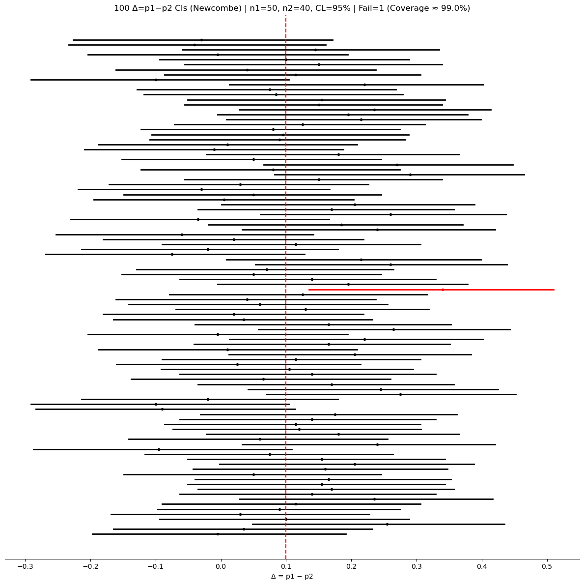

# p₁ − p₂의 신뢰구간

## 이표본 비율 신뢰구간

실무의 여러 상황에서 우리는 두 모집단의 비율을 비교한다 — 예를 들어 서로 다른 두 정책을 지지하는 사람의 비율이나 두 생산라인의 불량률 같은 것이다.

### 공식 (Wald)

독립인 두 집단의 모비율을 $p_1$과 $p_2$라 하자. $p_1 - p_2$의 신뢰구간은

$$
(\hat{p}_1 - \hat{p}_2) \pm z_{\alpha/2} \times \sqrt{\frac{\hat{p}_1(1 - \hat{p}_1)}{n_1} + \frac{\hat{p}_2(1 - \hat{p}_2)}{n_2}}
$$

여기서 $\hat{p}_1 = x_1/n_1$과 $\hat{p}_2 = x_2/n_2$는 표본비율이다.

### 타당성 조건

정규근사가 성립하려면:

- $n_1\hat{p}_1 \ge 5$이고 $n_1(1 - \hat{p}_1) \ge 5$,
- $n_2\hat{p}_2 \ge 5$이고 $n_2(1 - \hat{p}_2) \ge 5$.

### 대안적인 방법

| 방법 | 설명 | 언제 쓰는가 |
|---|---|---|
| **Wald** | $\Delta \pm z \cdot \text{SE}$ | $n$이 크고 0이나 1에 가깝지 않을 때 |
| **Newcombe (Wilson 기반)** | 집단마다 Wilson 신뢰구간 $[L_i, U_i]$를 구한 뒤 제곱합으로 결합 | **권장되는 기본값** |
| **Clopper–Pearson 결합** | 집단마다 정확한 신뢰구간을 구한 뒤 양끝을 빼서 결합 | $n$이 작을 때, 규제 상황 |

#### Newcombe 구간의 결합 방식

집단별 Wilson 구간을 $[L_1, U_1]$과 $[L_2, U_2]$라 할 때 Newcombe 구간은

$$
\left(
(\hat p_1 - \hat p_2) - \sqrt{(\hat p_1 - L_1)^2 + (U_2 - \hat p_2)^2},\;\;
(\hat p_1 - \hat p_2) + \sqrt{(U_1 - \hat p_1)^2 + (\hat p_2 - L_2)^2}
\right)
$$

이다. 여기서 **제곱합**을 쓰는 것이 핵심이다. $[L_1 - U_2,\; U_1 - L_2]$처럼 양끝을 그대로 빼면 두 집단이 동시에 최악으로 어긋나는 상황을 가정하는 셈이 되어 구간이 지나치게 넓어진다. 두 표본이 독립이므로 오차는 함께 커지는 것이 아니라 피타고라스식으로 합쳐진다.

### Python 코드

```python
import numpy as np
import scipy.stats as stats

n1, n2 = 200, 250
x1, x2 = 120, 130
confidence_level = 0.95

p1 = x1 / n1
p2 = x2 / n2

# 두 표본이 독립이므로 분산이 더해진다.
# 여기서는 두 비율을 **따로** 추정해 넣는다. 검정에서 쓰는 합동비율은
# "두 비율이 같다"는 귀무가설 아래의 계산이라 신뢰구간에는 맞지 않는다.
standard_error = np.sqrt((p1 * (1 - p1) / n1) + (p2 * (1 - p2) / n2))
z_critical = stats.norm.ppf(1 - (1 - confidence_level) / 2)
margin_of_error = z_critical * standard_error

confidence_interval = ((p1 - p2) - margin_of_error, (p1 - p2) + margin_of_error)
print(f"{confidence_interval = }")
```

출력:

```
confidence_interval = (-0.011897024279429055, 0.171897024279429)
```

---

## 보기

<div class="exbox" markdown>

**보기 1.** 비율 차이의 95% 신뢰구간. 표본 1: $n_1 = 200$, 성공 $x_1 = 120$회. 표본 2: $n_2 = 250$, 성공 $x_2 = 130$회.

</div>

**풀이.**

$$
\hat{p}_1 = 0.60, \qquad \hat{p}_2 = 0.52
$$

$$
\text{SE} = \sqrt{\frac{0.60 \times 0.40}{200} + \frac{0.52 \times 0.48}{250}} = \sqrt{0.0012 + 0.001} = \sqrt{0.0022} \approx 0.0469
$$

$$
\text{ME} = 1.96 \times 0.0469 \approx 0.0919
$$

$$
\boxed{(-0.0119,\ 0.1719)}
$$

참 차이가 $-0.0119$와 $0.1719$ 사이에 있다고 95% 신뢰한다. 구간이 0을 포함하므로 95% 수준에서 통계적으로 유의한 차이는 없다.

<div class="exbox" markdown>

**보기 2.** 새 고등학교 건립. Duncan은 도시의 북부와 남부에서 새 고등학교에 대한 지지를 비교한다.

| 지지하는가? | 북부 | 남부 |
|---|---|---|
| 예 | 54 | 77 |
| 아니오 | 66 | 63 |
| 합계 | 120 | 140 |

$p_N - p_S$의 90% 신뢰구간을 구성하라.

</div>

**풀이.**

```python
import numpy as np
from scipy import stats

n_1 = 120  # north
n_2 = 140  # south
p_1_hat = 54 / n_1
p_2_hat = 77 / n_2

confidence_level = 0.90
alpha = 1 - confidence_level
# 앞에서는 ppf(1 - alpha/2)를 썼고 여기서는 -ppf(alpha/2)를 썼다.
# 표준정규가 0을 중심으로 대칭이라 두 값이 같다.
z_star = -stats.norm().ppf(alpha / 2)
margin_of_error = z_star * np.sqrt(
    p_1_hat * (1 - p_1_hat) / n_1 + p_2_hat * (1 - p_2_hat) / n_2
)
print(f"90% CI: {p_1_hat - p_2_hat:.4f} ± {margin_of_error:.4f}")
```

출력:

```
90% CI: -0.1000 ± 0.1018
```

$\hat p_N = 0.450$, $\hat p_S = 0.550$으로 차이가 정확히 $-0.10$이다. 90% 구간은 $(-0.202, 0.002)$로 0을 아슬아슬하게 담는다. 표본 260개로는 10%p 차이도 잡아내기 어렵다는 뜻이다. 비율의 차이는 평균의 차이보다 훨씬 큰 표본을 요구한다.

---

## 모의실험: 두 비율 차이 신뢰구간의 포함확률

```python
#!/usr/bin/env python3
"""
Difference of two proportions CI simulation: Newcombe, Wald, Clopper-Pearson.
"""

import numpy as np
import matplotlib.pyplot as plt
from scipy.stats import norm, beta

rng_seed = 42        # 아래 그림을 재현하려면 고정한다
n_simulations = 100
n1, n2 = 50, 40
p1_true, p2_true = 0.60, 0.50
alpha = 0.05
method = "newcombe"  # 'newcombe' | 'wald' | 'cp'


def main():
    if rng_seed is not None:
        np.random.seed(rng_seed)

    delta_true = p1_true - p2_true
    z = norm.ppf(1 - alpha / 2.0)
    lowers = np.empty(n_simulations)
    uppers = np.empty(n_simulations)
    centers = np.empty(n_simulations)

    for i in range(n_simulations):
        k1 = np.random.binomial(n1, p1_true)
        k2 = np.random.binomial(n2, p2_true)
        p1hat, p2hat = k1 / n1, k2 / n2
        centers[i] = p1hat - p2hat

        if method == "wald":
            se = np.sqrt(p1hat * (1 - p1hat) / n1 + p2hat * (1 - p2hat) / n2)
            lo, hi = centers[i] - z * se, centers[i] + z * se
        elif method == "newcombe":
            # 집단마다 Wilson 구간을 구한다.
            denom1 = 1 + z**2 / n1
            center1 = (p1hat + z**2 / (2 * n1)) / denom1
            half1 = z * np.sqrt(p1hat * (1 - p1hat) / n1 + z**2 / (4 * n1**2)) / denom1
            L1, U1 = center1 - half1, center1 + half1
            denom2 = 1 + z**2 / n2
            center2 = (p2hat + z**2 / (2 * n2)) / denom2
            half2 = z * np.sqrt(p2hat * (1 - p2hat) / n2 + z**2 / (4 * n2**2)) / denom2
            L2, U2 = center2 - half2, center2 + half2
            # 두 구간을 **제곱합**으로 합친다. L1 - U2 처럼 양끝을 그냥 빼면
            # 두 집단이 동시에 최악으로 어긋나는 경우를 가정하는 셈이라
            # 구간이 지나치게 넓어진다(아래 설명 참조).
            lo = (p1hat - p2hat) - np.sqrt((p1hat - L1)**2 + (U2 - p2hat)**2)
            hi = (p1hat - p2hat) + np.sqrt((U1 - p1hat)**2 + (p2hat - L2)**2)
        elif method == "cp":
            L1 = 0.0 if k1 == 0 else beta.ppf(alpha / 2.0, k1, n1 - k1 + 1)
            U1 = 1.0 if k1 == n1 else beta.ppf(1 - alpha / 2.0, k1 + 1, n1 - k1)
            L2 = 0.0 if k2 == 0 else beta.ppf(alpha / 2.0, k2, n2 - k2 + 1)
            U2 = 1.0 if k2 == n2 else beta.ppf(1 - alpha / 2.0, k2 + 1, n2 - k2)
            lo, hi = L1 - U2, U1 - L2

        lowers[i] = max(-1.0, lo)
        uppers[i] = min(1.0, hi)

    covered = (lowers <= delta_true) & (delta_true <= uppers)
    n_fail = int((~covered).sum())
    coverage_pct = 100.0 * covered.mean()

    fig, ax = plt.subplots(figsize=(12, 12))
    for i in range(n_simulations):
        color = "k" if covered[i] else "r"
        ax.plot([lowers[i], uppers[i]], [i, i], lw=2, color=color)
        ax.plot(centers[i], i, marker="o", ms=3, color=color)
    ax.axvline(delta_true, linestyle="--", linewidth=1.5, color="r")
    ax.set_title(
        f"{n_simulations} Δ=p1−p2 CIs ({method.title()}) | n1={n1}, n2={n2}, "
        f"CL={int((1 - alpha) * 100)}% | Fail={n_fail} (Coverage ≈ {coverage_pct:.1f}%)")
    ax.set_yticks([])
    for sp in ["left", "right", "top"]:
        ax.spines[sp].set_visible(False)
    ax.set_xlabel("Δ = p1 − p2")
    plt.tight_layout()
    plt.show()


if __name__ == "__main__":
    main()
```



100회 중 실패 1회다. 100회짜리 모의실험으로는 방법을 가릴 수 없으니 반복을 20,000회로 늘려 실제 포함확률을 재면 Newcombe 94.8%, Wald 94.4%가 나온다. 둘 다 명목값을 조금 밑돌지만 Newcombe가 낫다.

여기서 양끝을 그냥 빼는 결합, 즉 $[L_1 - U_2,\; U_1 - L_2]$을 쓰면 어떻게 되는지 비교해 볼 만하다. 같은 조건에서 포함확률이 **99.5%**로 뛰고 구간의 평균 너비가 0.391에서 0.552로 41% 늘어난다. 명목보다 높은 포함확률은 공짜가 아니다. 그만큼 결론이 무뎌진다.

또 하나 눈에 띄는 것은 100개 중 81개가 0을 담고 있다는 점이다. 참 차이가 0.10인데 $n_1 = 50$, $n_2 = 40$으로는 다섯 번에 네 번 "차이가 없을 수도 있다"고 말하게 된다.

---

## 핵심 정리

- $p_1 - p_2$의 신뢰구간은 표본이 크다는 가정 아래 이항분포에 대한 정규근사를 쓴다.
- 너비는 표본비율, 표본크기, 신뢰수준에 달려 있다.
- 신뢰구간이 0을 포함하면 주어진 신뢰수준에서 두 비율 사이에 통계적으로 유의한 차이가 없다.
- 포함확률이 더 좋으므로, 특히 표본크기가 중간 정도일 때 **Newcombe(Wilson 기반)** 방법을 기본으로 권한다.

---

## 연습문제

<div class="drillbox" markdown>

**연습문제 1.**
독립인 두 표본에서 표본 1은 200명 중 150명이, 표본 2는 180명 중 120명이 같은 브랜드를 선호한다. 비율 차이의 95% 신뢰구간을 구성하라.

</div>

??? success "풀이"
    $$
    \hat{p}_1 = \frac{150}{200} = 0.75, \qquad \hat{p}_2 = \frac{120}{180} \approx 0.667
    $$

    $$
    \text{SE} = \sqrt{\frac{0.75 \times 0.25}{200} + \frac{0.667 \times 0.333}{180}} \approx \sqrt{0.000938 + 0.001234} \approx 0.0466
    $$

    $$
    \text{ME} = 1.96 \times 0.0466 \approx 0.091
    $$

    $$
    (0.083 - 0.091,\ 0.083 + 0.091) = (-0.008,\ 0.175)
    $$

    구간이 0을 포함하므로 5% 수준에서 차이는 통계적으로 유의하지 않다.

<div class="drillbox" markdown>

**연습문제 2.**
연습문제 1의 자료에서 정규근사의 타당성 조건이 만족되는지 확인하라.

</div>

??? success "풀이"
    조건은 $n_i\hat{p}_i \geq 5$이고 $n_i(1-\hat{p}_i) \geq 5$이다:

    - 표본 1: $200 \times 0.75 = 150 \geq 5$이고 $200 \times 0.25 = 50 \geq 5$
    - 표본 2: $180 \times 0.667 = 120 \geq 5$이고 $180 \times 0.333 = 60 \geq 5$

    모든 조건이 만족된다.

<div class="drillbox" markdown>

**연습문제 3.**
비율 차이의 신뢰구간에서 Wald 방법보다 Newcombe(Wilson 기반) 방법을 권하는 이유를 설명하라.

</div>

??? success "풀이"
    Wald 방법은 표준오차 공식에 표본비율을 그대로 쓰는데, 참 비율이 0이나 1에 가깝거나 표본크기가 중간 정도이면 포함확률이 나빠질 수 있다. Wald 구간은 심지어 $[-1, 1]$ 밖으로 벗어나는 구간을 낼 수도 있다.

    Newcombe 방법은 각 비율에 대한 Wilson 신뢰구간을 결합하여 차이의 신뢰구간을 만든다. Wilson 구간은 보정항 $z^2/(2n)$을 더해 극단적인 비율을 0.5 쪽으로 "축소"하므로 더 안정적인 구간이 나온다. 모의실험 연구들은 Newcombe 방법이 더 넓은 범위의 모수값과 표본크기에서 명목 수준에 더 가까운 포함확률을 달성함을 일관되게 보여준다.

<div class="drillbox" markdown>

**연습문제 4.**
$p_1 - p_2$의 신뢰구간이 $(0.03, 0.15)$이라면 이 결과를 맥락에 맞게 해석하고 유의한 차이의 증거가 있는지 말하라.

</div>

??? success "풀이"
    95% 신뢰구간 $(0.03, 0.15)$은 참 차이 $p_1 - p_2$가 0.03과 0.15 사이에 있다고 95% 신뢰한다는 뜻이다. 구간 전체가 양수이므로(0을 포함하지 않으므로) 5% 수준에서 $p_1$이 $p_2$보다 유의하게 크다고 결론짓는다. 추정된 차이는 집단 1에 유리하게 3~15 퍼센트포인트이다.

---

## 정리하며

두 비율 차의 왈드 구간도 **분산을 더해** 만든다.

$$
(\hat p_1-\hat p_2)\pm z_{\alpha/2}\sqrt{\frac{\hat p_1(1-\hat p_1)}{n_1}+\frac{\hat p_2(1-\hat p_2)}{n_2}}
$$

- **일표본 왈드 구간의 약점을 그대로 물려받는다.** 어느 한쪽 비율이 $0$ 이나 $1$ 에 가까우면 포함확률이 명목값에 못 미친다.
- **타당성 조건을 확인해야 한다.** 각 집단에서 성공과 실패가 모두 충분히 있어야 정규근사가 성립하며, 흔히 $n\hat p\ge5$, $n(1-\hat p)\ge5$ 를 본다.
- **개선책도 일표본과 같은 발상이다.** 각 집단의 성공·실패에 조금씩 더하는 **아그레스티–카포**(각 칸에 1 씩) 보정이 간단하면서 포함확률을 크게 개선한다.
- **검정과 구간의 표준오차가 다르다는 점에 주의하라.** 검정에서는 $H_0: p_1=p_2$ 아래 합동비율 $\hat p$ 로 표준오차를 만들고, 구간에서는 각자의 $\hat p_i$ 를 쓴다. **그래서 $p$ 값과 구간이 경계에서 어긋날 수 있다.**
- **차이 대신 비나 오즈비가 더 적절할 때가 있다.** 비율이 아주 작으면 절대차가 작아 보여도 상대적으로는 큰 차이일 수 있다.

다음 절 **$\sigma_1^2/\sigma_2^2$ 의 신뢰구간**으로 넘어간다. 차이가 아니라 **비**를 다루는 이유가 거기 있다.
