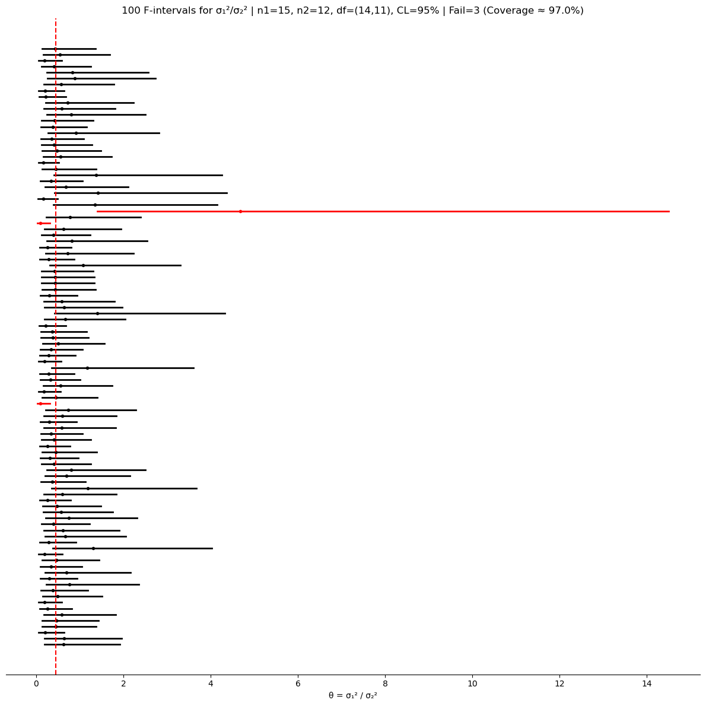

# σ₁² / σ₂²의 신뢰구간

## 두 분산의 비에 대한 신뢰구간

독립인 두 모집단의 변동성을 비교할 때는 비 $\theta = \sigma_1^2 / \sigma_2^2$의 신뢰구간을 구성한다. 이는 F-분포에 기반한다.

### 공식

$$
\left[\frac{s_1^2 / s_2^2}{F_{\alpha/2,\, n_1-1,\, n_2-1}},\;\; \frac{s_1^2 / s_2^2}{F_{1-\alpha/2,\, n_1-1,\, n_2-1}}\right]
$$

여기서

- $s_1^2$과 $s_2^2$은 (Bessel 수정을 한) 표본분산,
- $F_{\alpha/2, n_1-1, n_2-1}$과 $F_{1-\alpha/2, n_1-1, n_2-1}$은 자유도 $\text{df}_1 = n_1 - 1$, $\text{df}_2 = n_2 - 1$인 F-분포의 임계값이다.

### 표본분포

추축량은

$$
\frac{s_1^2 / \sigma_1^2}{s_2^2 / \sigma_2^2} \sim F_{n_1-1, \, n_2-1}
$$

이 결과는 두 모집단이 모두 정규분포를 따를 때 정확히 성립한다.

### 타당성 조건

$$
\sigma_1^2/\sigma_2^2 \text{에 대한 F-구간}
\quad\text{if}\quad
\begin{cases}
\text{두 모집단 분포가 모두 정규이다} \\
\text{각 집단에서 } n_i \le 0.1 N_i \text{ (i.i.d. 근사)}
\end{cases}
$$

!!! warning "정규성 요구"
    카이제곱 분산 신뢰구간과 마찬가지로 F-구간도 **정규성 아래에서만 정확하다**. 정규가 아닌 자료(치우쳤거나 꼬리가 두껍거나 이상점이 있는 자료)에서는 포함확률이 심각하게 어긋날 수 있다. 정규가 아닌 자료에는 붓스트랩이나 로버스트한 대안을 고려하라.

<div class="codebox" markdown>

**예제 1.** 분산비의 신뢰구간 계산

```python
import numpy as np
from scipy.stats import f

n1, n2 = 15, 12
alpha = 0.05

# 참 분산비는 1/1.5² = 0.444다. 답을 알고 있는 상태에서 구간을 본다.
rng = np.random.default_rng(42)
x = rng.normal(loc=0, scale=1.0, size=n1)
y = rng.normal(loc=0, scale=1.5, size=n2)

s1_sq = x.var(ddof=1)
s2_sq = y.var(ddof=1)
rhat = s1_sq / s2_sq

# F분포는 두 자유도의 **순서**가 중요하다. dfn이 분자, dfd가 분모다.
# 두 표본의 크기가 다르므로 여기서 뒤바꾸면 조용히 틀린 답이 나온다.
df1, df2 = n1 - 1, n2 - 1
F_lo = f(dfn=df1, dfd=df2).ppf(alpha / 2.0)
F_hi = f(dfn=df1, dfd=df2).ppf(1 - alpha / 2.0)

# 여기서도 큰 임계값이 아래끝의 분모로 간다.
# (s1²/s2²)/(σ1²/σ2²) ~ F 를 σ1²/σ2² 에 대해 풀면 대소가 뒤집히기 때문이다.
ci_lower = rhat / F_hi
ci_upper = rhat / F_lo

print(f"95% CI for σ₁²/σ₂²: ({ci_lower:.4f}, {ci_upper:.4f})")
```

출력:

```
95% CI for σ₁²/σ₂²: (0.2396, 2.4903)
```

참값 0.444를 담기는 하지만 위끝이 아래끝의 열 배다. 구간이 1을 넉넉히 담고 있으므로 "두 분산이 같다"는 가설조차 배제하지 못한다. 실제로는 $\sigma_2$가 $\sigma_1$의 1.5배인데도 그렇다. 분산 하나를 추정하는 것도 어려운데 그 비를 추정하는 일은 훨씬 더 어렵다.

</div>

---

## 모의실험: 분산비 신뢰구간의 포함확률

<div class="codebox" markdown>

**예제 2.** F 구간의 포함확률

```python
#!/usr/bin/env python3
"""두 분산의 비에 대한 F 신뢰구간을 100번 만들어 포함확률을 확인한다.

두 표본분산의 비가 F 분포를 따른다는 사실에서 구간이 나온다. 이 방법은
정규성에 특히 민감해서, 모집단이 정규가 아니면 포함확률이 크게 어긋난다.
"""

import numpy as np
import matplotlib.pyplot as plt
from scipy.stats import f

rng_seed = 42        # 아래 그림을 재현하려면 고정한다
n_simulations = 100
n1, n2 = 15, 12
mu1, mu2 = 0.0, 0.0
sigma1, sigma2 = 1.0, 1.5
alpha = 0.05


def main():
    if rng_seed is not None:
        np.random.seed(rng_seed)

    theta_true = (sigma1**2) / (sigma2**2)
    df1, df2 = n1 - 1, n2 - 1

    lowers = np.empty(n_simulations)
    uppers = np.empty(n_simulations)
    centers = np.empty(n_simulations)

    F_lo = f(dfn=df1, dfd=df2).ppf(alpha / 2.0)
    F_hi = f(dfn=df1, dfd=df2).ppf(1 - alpha / 2.0)

    for i in range(n_simulations):
        x = np.random.normal(loc=mu1, scale=sigma1, size=n1)
        y = np.random.normal(loc=mu2, scale=sigma2, size=n2)
        s1_sq = x.var(ddof=1)
        s2_sq = y.var(ddof=1)
        rhat = s1_sq / s2_sq
        lowers[i] = rhat / F_hi
        uppers[i] = rhat / F_lo
        centers[i] = rhat

    covered = (lowers <= theta_true) & (theta_true <= uppers)
    n_fail = (~covered).sum()
    coverage_pct = 100.0 * covered.mean()

    fig, ax = plt.subplots(figsize=(12, 12))
    for i in range(n_simulations):
        color = "k" if covered[i] else "r"
        ax.plot([lowers[i], uppers[i]], [i, i], lw=2, color=color)
        ax.plot(centers[i], i, marker="o", ms=3, color=color)

    ax.axvline(theta_true, linestyle="--", linewidth=1.5, color="r")
    ax.set_title(
        f"{n_simulations} F-intervals for σ₁²/σ₂² | n1={n1}, n2={n2}, "
        f"df=({df1},{df2}), CL={int((1 - alpha) * 100)}% | "
        f"Fail={n_fail} (Coverage ≈ {coverage_pct:.1f}%)")
    ax.set_yticks([])
    for sp in ["left", "right", "top"]:
        ax.spines[sp].set_visible(False)
    ax.set_xlabel("θ = σ₁² / σ₂²")
    plt.tight_layout()
    plt.show()


if __name__ == "__main__":
    main()
```



포함확률 97.0%로 명목값을 달성한다. 그런데 구간의 모양이 눈에 띈다. 대부분은 0 근처에서 2 언저리까지 뻗지만, 하나는 오른쪽 끝이 14를 넘는다. 그 표본에서 우연히 $s_1^2/s_2^2$이 크게 나오자 구간이 통째로 오른쪽으로 밀리며 길이까지 폭발한 것이다.

$\theta$의 척도가 비율이라 이런 일이 생긴다. 아래쪽으로는 0이라는 벽이 있어 눌리고 위쪽으로는 열려 있다. $\log \theta$로 보면 훨씬 대칭적인 그림이 된다.

100개 중 74개가 1을 담고 있다. 참 비율이 0.444, 즉 표준편차로 1.5배 차이인데도 $n_1 = 15$, $n_2 = 12$로는 네 번 중 세 번 등분산을 배제하지 못한다. **등분산 검정으로 Welch를 쓸지 합동 $t$를 쓸지 정하려는 시도가 위험한 이유**가 여기 있다. 검정이 등분산을 기각하지 못했다는 것은 분산이 같다는 뜻이 아니라 표본이 작다는 뜻일 때가 많다.

</div>

---

## 핵심 정리

- $\sigma_1^2 / \sigma_2^2$에 대한 F-구간은 **두 모집단이 모두 정규**일 것을 요구한다.
- 신뢰구간이 1을 포함하면 두 모분산이 다르다는 증거가 없다.
- F-분포는 비대칭이므로 신뢰구간이 점추정값을 중심으로 대칭이 아니다.
- 정규가 아닌 자료에는 붓스트랩 기반 대안을 고려하라.

## 연습문제

<div class="drillbox" markdown>

**연습문제 1.** <span class="diff easy" title="쉬움"></span>
정규모집단에서 뽑은 독립인 두 표본에서 $s_1^2 = 25$ ($n_1 = 16$), $s_2^2 = 10$ ($n_2 = 21$)을 얻었다. $\sigma_1^2/\sigma_2^2$의 점추정값을 계산하고 $F_{15,20,0.025} = 0.392$, $F_{15,20,0.975} = 2.573$을 써서 95% 신뢰구간을 구성하라.

</div>

??? success "풀이"
    점추정값은:

    $$
    \frac{s_1^2}{s_2^2} = \frac{25}{10} = 2.5
    $$

    95% 신뢰구간은:

    $$
    \left(\frac{s_1^2/s_2^2}{F_{0.975}},\; \frac{s_1^2/s_2^2}{F_{0.025}}\right) = \left(\frac{2.5}{2.573},\; \frac{2.5}{0.392}\right) = (0.972,\; 6.378)
    $$

    구간이 1을 포함하므로 5% 수준에서 두 분산이 다르다고 결론지을 충분한 증거가 없다.

<div class="drillbox" markdown>

**연습문제 2.** <span class="diff med" title="중간"></span>
F에 기반한 신뢰구간이 점추정값을 중심으로 비대칭인 이유를 설명하라. 연습문제 1의 구간으로 예시하라.

</div>

??? success "풀이"
    F-분포는 오른쪽으로 치우쳐 있으므로(양수에서만 정의되고 오른쪽 꼬리가 더 길다) 임계값 $F_{\alpha/2}$와 $F_{1-\alpha/2}$가 1에서 같은 거리에 있지 않다. 연습문제 1에서 점추정값은 2.5이다. 신뢰구간의 하한은 $2.5/2.573 = 0.972$로 추정값보다 1.528 아래이고, 상한은 $2.5/0.392 = 6.378$로 추정값보다 3.878 위이다. 구간이 왼쪽보다 오른쪽으로 훨씬 멀리 뻗는데, 이는 F-분포의 치우침을 반영한다.

<div class="drillbox" markdown>

**연습문제 3.** <span class="diff easy" title="쉬움"></span>
$\sigma_1^2/\sigma_2^2$의 신뢰구간이 $(1.5, 4.2)$이라면 두 모분산의 관계에 대해 무엇을 알 수 있는가?

</div>

??? success "풀이"
    구간 전체가 1보다 위에 있으므로 주어진 신뢰수준에서 $\sigma_1^2 > \sigma_2^2$이라고 결론지을 수 있다. 구체적으로 첫 번째 모집단의 분산이 두 번째 모집단 분산의 1.5배에서 4.2배 사이라고 신뢰한다. 예를 들어 (등분산을 가정하는) 합동 $t$-검정을 쓸지 Welch $t$-검정을 쓸지 결정할 때 이런 정보가 유용하다.

<div class="drillbox" markdown>

**연습문제 4.** <span class="diff med" title="중간"></span>
등분산에 대한 F-검정은 비정규성에 매우 민감한 것으로 알려져 있다. 이유를 설명하고 대안을 하나 들라.

</div>

??? success "풀이"
    F-분포의 유도는 두 모집단이 정확히 정규라고 가정한다. 정규성에서 조금만 벗어나도(약간의 치우침이나 두꺼운 꼬리만으로도) $S_1^2/S_2^2$의 분포가 F-분포에서 크게 벗어난다. 모집단의 첨도가 $S^2$의 분산에 직접 영향을 주므로, 꼬리가 두꺼운 모집단에서는 이 비가 F 이론이 예측하는 것보다 훨씬 넓게 퍼지고 제1종 오류율이 부풀려진다.

    대안으로 **Levene 검정**이 있다. 절대편차 $|X_{ij} - \bar{X}_j|$(Brown-Forsythe에서는 중앙값으로부터의 편차)에 일원분산분석을 적용하여 분산의 동일성을 검정한다. 이 방법은 비정규성에 훨씬 로버스트하다. 분산비에 대한 붓스트랩 신뢰구간도 또 다른 비모수적 대안이다.

---

## 정리하며

두 분산은 **차가 아니라 비**로 비교한다.

$$
\left[\frac{s_1^2/s_2^2}{F_{\alpha/2,\,n_1-1,\,n_2-1}},\;\frac{s_1^2/s_2^2}{F_{1-\alpha/2,\,n_1-1,\,n_2-1}}\right]
$$

- **비를 쓰는 이유는 추축량이 만들어지기 때문이다.** $\frac{s_1^2/\sigma_1^2}{s_2^2/\sigma_2^2}\sim F_{n_1-1,n_2-1}$ 이며, 이 양의 분포가 미지 모수에 의존하지 않는다. 차에는 이런 성질이 없다.
- **분모의 임계값이 뒤바뀐다.** 분산 구간과 마찬가지로 큰 분위수가 하한에, 작은 분위수가 상한에 들어간다.
- **$1$ 을 포함하는지가 관심사다.** 포함하면 두 분산이 같다는 가설을 기각하지 못한다. 분산에서 $1$ 은 평균에서의 $0$ 에 해당한다.
- **$F$ 분포의 뒤집기 성질이 유용하다.** $F_{1-\alpha/2,d_1,d_2}=1/F_{\alpha/2,d_2,d_1}$ 이므로 표 한쪽만 있으면 된다.
- **정규성에 매우 민감하다.** 일표본 분산 구간보다도 더 취약하며, 두 모집단 모두 정규여야 한다. **실무에서는 레빈 검정이나 부트스트랩 쪽이 안전하다**(15장).

다음 절 **평균 차이 신뢰구간 모의실험**에서 여러 방법의 포함확률을 직접 재어 본다.
