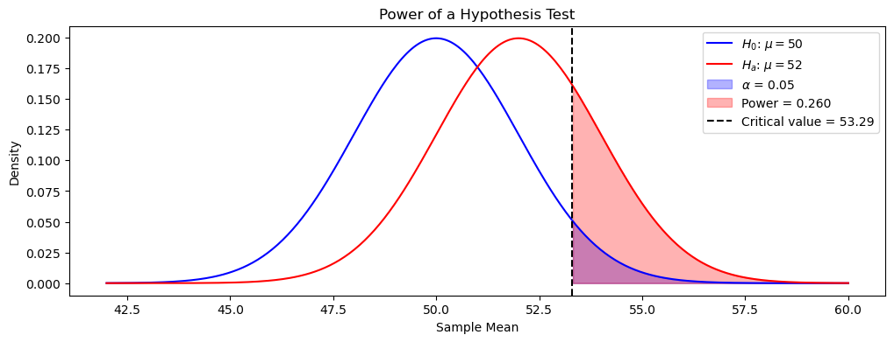
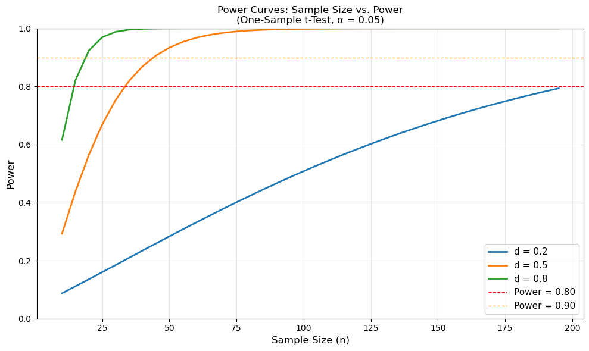

# 검정력 분석

## 검정력의 정의

가설검정의 **검정력**은 거짓인 귀무가설을 올바르게 기각할 확률이다. 제2종 오류율의 여집합이다:

$$\text{Power} = 1 - \beta = P(\text{Reject } H_0 \mid H_a \text{ is true})$$

검정력이 높은 검정은 참 효과가 있을 때 그것을 탐지할 가능성이 크다. 연구자들은 보통 검정력 0.80(80%) 이상을 목표로 하며, 이는 참 효과를 탐지할 확률이 80%라는 뜻이다.

## 검정력에 영향을 주는 요인

검정력을 결정하는 핵심 요인은 넷이다.

### 1. 유의수준 (alpha)
$\alpha$를 키우면(예: 0.01에서 0.05로) $H_0$을 기각하기 쉬워져 검정력이 커진다. 그러나 제1종 오류의 위험도 함께 커진다.

### 2. 표본크기 (n)
표본이 클수록 검정통계량의 표준오차가 줄어 참 차이를 탐지하기 쉬워지므로 검정력이 커진다. 실무에서 검정력을 높이는 가장 현실적인 지렛대이다.

### 3. 효과크기

효과크기는 참 차이 또는 효과의 크기를 잰다. 효과가 클수록 탐지하기 쉬워 검정력이 커진다. 흔한 측도는:

- 평균 비교의 **Cohen의 $d$**: $d = \frac{\mu_1 - \mu_0}{\sigma}$
- 비율 비교의 **비율 차이**

### 4. 모집단의 변동성 (sigma)
모집단의 변동성이 작을수록 참 효과를 탐지하기 쉬워 검정력이 커진다. 연구자가 모집단 변동성을 통제하기는 대개 어렵지만, 더 나은 연구 설계로 측정오차는 줄일 수 있다.

## 실무에서의 검정력 분석

검정력 분석은 주로 두 가지 방식으로 쓰인다.

### 사전 검정력 분석 (표본크기의 결정)

연구를 수행하기 전에, 예상되는 효과크기를 원하는 검정력과 유의수준으로 탐지하는 데 필요한 최소 표본크기를 검정력 분석으로 정한다.

```python
from scipy import stats
import numpy as np

def sample_size_z_test(effect_size, alpha=0.05, power=0.80, alternative='two-sided'):
    """일표본 z-검정에 필요한 표본크기."""
    if alternative == 'two-sided':
        z_alpha = stats.norm.ppf(1 - alpha / 2)
    else:
        z_alpha = stats.norm.ppf(1 - alpha)
    # z_beta는 ppf(power)이지 ppf(1 - power)가 아니다.
    # 검정력이 클수록 z_beta가 커져 n이 늘어나야 하기 때문이다.
    z_beta = stats.norm.ppf(power)
    # 두 임계값을 **더한다**. alpha는 H0 분포의 오른쪽 꼬리에서,
    # beta는 Ha 분포의 왼쪽 꼬리에서 재므로 둘 사이의 거리가 두 값의 합이다.
    n = ((z_alpha + z_beta) / effect_size) ** 2
    return int(np.ceil(n))

# 효과크기 0.5를 검정력 80%로 탐지하려면?
n = sample_size_z_test(effect_size=0.5)
print(f"Required sample size: {n}")
```

출력:

```
Required sample size: 32
```

$(1.96 + 0.8416)^2 / 0.5^2 = 31.4$를 올림한 값이다. 효과크기가 분모에서 제곱되므로 효과가 절반이면 표본은 네 배가 된다.

### 사후 검정력 분석

연구를 마친 뒤 관측된 효과크기, 표본크기, 유의수준으로 달성된 검정력을 계산할 수 있다. 그러나 유의하지 않은 결과에 대한 사후 검정력 분석은 p-값을 넘는 정보를 거의 주지 않으므로 일반적으로 권장되지 않는다.

## 검정력의 시각화

$H_0$과 $H_a$ 아래의 분포를 함께 그리면 검정력을 이해할 수 있다.

```python
import numpy as np
import matplotlib.pyplot as plt
from scipy import stats

def plot_power(mu_0, mu_a, sigma, n, alpha=0.05):
    """Visualize the power of a one-sided z-test."""
    se = sigma / np.sqrt(n)
    z_crit = stats.norm.ppf(1 - alpha)
    x_crit = mu_0 + z_crit * se

    x = np.linspace(mu_0 - 4*se, mu_a + 4*se, 300)

    # Distribution under H0
    y_h0 = stats.norm(mu_0, se).pdf(x)
    # Distribution under Ha
    y_ha = stats.norm(mu_a, se).pdf(x)

    fig, ax = plt.subplots(figsize=(12, 4))
    ax.plot(x, y_h0, 'b-', label=f'$H_0$: $\\mu = {mu_0}$')
    ax.plot(x, y_ha, 'r-', label=f'$H_a$: $\\mu = {mu_a}$')

    # Shade rejection region under H0 (alpha)
    x_reject = x[x >= x_crit]
    ax.fill_between(x_reject, stats.norm(mu_0, se).pdf(x_reject), alpha=0.3, color='blue', label=f'$\\alpha$ = {alpha}')

    # Shade power under Ha
    ax.fill_between(x_reject, stats.norm(mu_a, se).pdf(x_reject), alpha=0.3, color='red', label=f'Power = {1 - stats.norm(mu_a, se).cdf(x_crit):.3f}')

    ax.axvline(x_crit, color='k', linestyle='--', label=f'Critical value = {x_crit:.2f}')
    ax.legend()
    ax.set_xlabel('Sample Mean')
    ax.set_ylabel('Density')
    ax.set_title('Power of a Hypothesis Test')
    plt.show()

plot_power(mu_0=50, mu_a=52, sigma=10, n=25)
```



파란 곡선이 $H_0$ 아래, 빨간 곡선이 $H_a$ 아래의 $\bar X$ 분포다. 검은 점선이 임계값 53.29이고, 그 오른쪽의 파란 영역이 $\alpha = 0.05$, 빨간 영역이 검정력이다.

이 설정에서 검정력은 0.259밖에 안 된다. 참 평균이 정말 52인데도 네 번 중 세 번은 $H_0$을 기각하지 못한다는 뜻이다. 두 곡선이 겹치는 정도가 곧 검정의 무력함이다. $n$을 키우면 두 곡선이 모두 좁아지면서 겹침이 줄고 빨간 영역이 커진다.

## 검정력, 표본크기, 효과크기의 관계

| 효과크기 | 필요한 $n$ (이표본, 집단당, 검정력 = 0.80, $\alpha$ = 0.05) |
|---|---|
| 작음 ($d = 0.2$) | ~393 |
| 중간 ($d = 0.5$) | ~64 |
| 큼 ($d = 0.8$) | ~26 |

이 값들은 작은 효과를 탐지하려면 왜 훨씬 큰 표본이 필요한지 보여준다.

## statsmodels를 이용한 검정력 분석

Statsmodels는 여러 검정 유형에 대한 검정력 분석 함수를 폭넓게 제공한다.

### 일표본 t-검정

```python
from statsmodels.stats.power import TTestPower
import numpy as np

analysis = TTestPower()

# 5점 차이를 탐지하려면 몇 명이 필요한가? (mu_0 = 0, mu_a = 5, sigma = 15)
# 검정력 계산에 들어가는 것은 delta도 sigma도 아니라 그 비뿐이다.
# 5점/15와 1점/3은 검정력 관점에서 완전히 같은 문제다.
effect_size = 5 / 15  # Cohen's d = 0.333

n_needed = analysis.solve_power(effect_size=effect_size, alpha=0.05,
                                power=0.80, alternative='two-sided')
print(f"One-sample t-test:")
print(f"  Effect size (Cohen's d): {effect_size:.3f}")
print(f"  Sample size needed for 80% power: {int(np.ceil(n_needed))}")

# 반대 방향의 질문: n이 정해져 있을 때 검정력은 얼마인가?
power = analysis.power(effect_size=effect_size, nobs=50, alpha=0.05,
                      alternative='two-sided')
print(f"  Power with n=50: {power:.3f}")
```

출력:

```
One-sample t-test:
  Effect size (Cohen's d): 0.333
  Sample size needed for 80% power: 73
  Power with n=50: 0.637
```

73명이 필요한데 50명만 모으면 검정력이 0.80에서 0.64로 떨어진다. 표본을 32% 줄였을 뿐인데 효과를 놓칠 확률은 20%에서 36%로 거의 두 배가 된다.

### 이표본 t-검정 (독립표본)

```python
from statsmodels.stats.power import TTestIndPower

# Power analysis for two-sample t-test
analysis = TTestIndPower()

# Scenario: Two-group comparison (equal sample sizes)
# Effect size: Cohen's d = 0.5 (medium effect)
effect_size = 0.5

n_per_group = analysis.solve_power(effect_size=effect_size, alpha=0.05,
                                   power=0.80, ratio=1.0,
                                   alternative='two-sided')
print(f"\nTwo-sample t-test (equal n):")
print(f"  Effect size (Cohen's d): {effect_size:.3f}")
print(f"  Sample size per group for 80% power: {int(np.ceil(n_per_group))}")
print(f"  Total sample size: {2 * int(np.ceil(n_per_group))}")

# 집단 크기가 다른 경우 (예: 2:1 배분)
# ratio는 nobs2/nobs1이고, solve_power가 돌려주는 것은 **nobs1**이다.
# 따라서 두 번째 집단은 ratio를 곱해서 얻어야 한다. 나누면 거꾸로다.
ratio = 2.0
n_group1 = analysis.solve_power(effect_size=effect_size, alpha=0.05,
                                power=0.80, ratio=ratio,
                                alternative='two-sided')
n_group2 = n_group1 * ratio
n1, n2 = int(np.ceil(n_group1)), int(np.ceil(n_group2))
print(f"\nTwo-sample t-test (2:1 ratio):")
print(f"  Group 1 n: {n1}")
print(f"  Group 2 n: {n2}")
print(f"  Total sample size: {n1 + n2}")
```

출력:

```

Two-sample t-test (equal n):
  Effect size (Cohen's d): 0.500
  Sample size per group for 80% power: 64
  Total sample size: 128

Two-sample t-test (2:1 ratio):
  Group 1 n: 48
  Group 2 n: 96
  Total sample size: 144
```

배분이 균등에서 멀어질수록 **총** 표본이 늘어난다. 같은 검정력에 1:1은 128명, 1:2는 144명이 든다. 한쪽 집단을 모으기 쉽다고 해서 그쪽만 키우면 전체 비용이 오히려 커질 수 있다. 작은 쪽 집단이 병목이기 때문이다.

### 비율에 대한 검정 (A/B 검정)

```python
import numpy as np
import statsmodels.stats.api as sms
from statsmodels.stats.power import NormalIndPower

# Example: A/B test for conversion rates
# Control: 1.1% conversion rate
# Treatment: 1.65% conversion rate
p0 = 0.011   # Control baseline
p1 = 0.0165  # Treatment goal

# 비율에서는 두 값의 차이 대신 arcsin 변환 후의 차이를 효과크기로 쓴다.
#   h = 2*arcsin(sqrt(p1)) - 2*arcsin(sqrt(p0))
# 이렇게 하면 분산이 p에 의존하는 문제가 사라져 하나의 공식으로 처리된다.
# 0.011 대 0.0165는 절대차로 0.55%p뿐이지만 상대적으로는 50% 증가다.
effect_size = sms.proportion_effectsize(p1, p0)

# alternative='larger'는 단측이다. A/B 검정에서는 "개선되었는가"만 보는 일이 많다.
analysis = NormalIndPower()
n_ab = analysis.solve_power(effect_size=effect_size, alpha=0.05,
                            power=0.80, ratio=1.0, alternative='larger')

print(f"\nA/B Test (Proportions):")
print(f"  Control rate: {p0:.2%}")
print(f"  Treatment goal: {p1:.2%}")
print(f"  Effect size: {effect_size:.4f}")
print(f"  Sample size per group for 80% power: {int(np.ceil(n_ab))}")
```

출력:

```

A/B Test (Proportions):
  Control rate: 1.10%
  Treatment goal: 1.65%
  Effect size: 0.0475
  Sample size per group for 80% power: 5488
```

집단당 5,488명, 합쳐서 약 11,000명이 필요하다. 전환율이 낮으면 표본이 이렇게 커진다. 1.1%의 기저율에서는 집단당 5,488명이라도 전환이 60건 남짓에 불과하기 때문이다. 웹 실험이 몇 주씩 걸리는 이유가 여기 있다.

### 일원분산분석

```python
from statsmodels.stats.power import FTestAnovaPower

# Power analysis for one-way ANOVA
analysis = FTestAnovaPower()

# Scenario: 4 groups, medium effect size (f = 0.25)
effect_size = 0.25  # Medium effect in ANOVA
k_groups = 4

n_per_group = analysis.solve_power(effect_size=effect_size, alpha=0.05,
                                   power=0.80, k_groups=k_groups)
print(f"\nOne-way ANOVA (4 groups):")
print(f"  Effect size (Cohen's f): {effect_size:.3f}")
print(f"  Sample size per group for 80% power: {int(np.ceil(n_per_group))}")
print(f"  Total sample size: {k_groups * int(np.ceil(n_per_group))}")
```

출력:

```

One-way ANOVA (4 groups):
  Effect size (Cohen's f): 0.250
  Sample size per group for 80% power: 179
  Total sample size: 716
```

주의할 점은 Cohen의 $f$와 $d$가 다른 척도라는 것이다. $f = 0.25$는 ANOVA에서 "중간"이지만 $d = 0.5$와 같은 뜻이 아니다. 두 집단만 있을 때 $f = d/2$이므로 $f = 0.25$는 $d = 0.5$에 대응한다. 그런데도 집단당 179명이 필요한 것은 집단이 넷이라 비교해야 할 것이 많아졌기 때문이다.

### 검정력 곡선: 표본크기와 검정력의 관계

```python
import matplotlib.pyplot as plt

# Create power curves for different effect sizes
fig, ax = plt.subplots(figsize=(10, 6))

analysis = TTestPower()
sample_sizes = np.arange(10, 200, 5)

for d in [0.2, 0.5, 0.8]:
    power_values = [analysis.power(effect_size=d, nobs=n, alpha=0.05)
                    for n in sample_sizes]
    ax.plot(sample_sizes, power_values, linewidth=2, label=f"d = {d:.1f}")

# Add reference lines
ax.axhline(0.80, color='red', linestyle='--', linewidth=1, label='Power = 0.80')
ax.axhline(0.90, color='orange', linestyle='--', linewidth=1, label='Power = 0.90')

ax.set_xlabel('Sample Size (n)', fontsize=12)
ax.set_ylabel('Power', fontsize=12)
ax.set_title('Power Curves: Sample Size vs. Power\n(One-Sample t-Test, α = 0.05)')
ax.legend(fontsize=11)
ax.grid(True, alpha=0.3)
ax.set_ylim([0, 1])

plt.tight_layout()
plt.show()
```



세 곡선 모두 처음에는 가파르게 오르다가 위로 갈수록 평평해진다. 이 평평해지는 구간이 실무에서 중요하다. $d = 0.5$에서 검정력 0.8에는 34명이면 되지만 0.9에는 44명이 필요하다. 30% 더 모아서 10%p를 얻는 셈이고, 0.95를 원하면 54명으로 더 늘어난다. 마지막 몇 %p가 가장 비싸다.

세 곡선의 간격도 눈여겨보라. $d = 0.8$은 15명이면 되고 $d = 0.5$는 34명, $d = 0.2$는 199명이다. 효과크기가 4분의 1로 줄면 표본은 열세 배가 된다. 작은 효과를 탐지하는 일은 표본이 곧 예산이다.

### 검정력 분석의 작업 흐름

```python
def design_study(test_type, effect_size, alpha=0.05, power=0.80,
                 **kwargs):
    """연구 설계를 위한 검정력 분석을 한자리에 모은 함수.

    검정 종류마다 statsmodels의 클래스가 다르고 인자 이름도 다르다.
    그 차이를 여기서 흡수해 두면 설계 단계에서 시나리오를 바꿔 가며
    표본크기를 비교하기가 쉬워진다.

    test_type : 'one-sample', 'two-sample', 'anova', 'proportions'
    effect_size : 표준화된 효과크기 (종류마다 척도가 다르다: d, d, f)
    alpha : 유의수준
    power : 목표 검정력
    **kwargs : 검정별 추가 인자 (예: ANOVA의 k_groups)
    """
    results = {'test_type': test_type, 'alpha': alpha, 'power': power}

    if test_type == 'one-sample':
        analysis = TTestPower()
        n = analysis.solve_power(effect_size=effect_size, alpha=alpha,
                                power=power, alternative='two-sided')
        results['sample_size'] = int(np.ceil(n))

    elif test_type == 'two-sample':
        analysis = TTestIndPower()
        n = analysis.solve_power(effect_size=effect_size, alpha=alpha,
                                power=power, ratio=1.0, alternative='two-sided')
        results['sample_size_per_group'] = int(np.ceil(n))
        results['total_sample_size'] = 2 * int(np.ceil(n))

    elif test_type == 'anova':
        analysis = FTestAnovaPower()
        k = kwargs.get('k_groups', 3)
        n = analysis.solve_power(effect_size=effect_size, alpha=alpha,
                                power=power, k_groups=k)
        results['k_groups'] = k
        results['sample_size_per_group'] = int(np.ceil(n))
        results['total_sample_size'] = k * int(np.ceil(n))

    return results

# Example usage
print("\n" + "="*60)
print("STUDY DESIGN: Two-Sample Comparison")
print("="*60)
design = design_study('two-sample', effect_size=0.5)
for key, value in design.items():
    print(f"{key:.<30} {value}")
```

출력:

```

============================================================
STUDY DESIGN: Two-Sample Comparison
============================================================
test_type..................... two-sample
alpha......................... 0.05
power......................... 0.8
sample_size_per_group......... 64
total_sample_size............. 128
```

이런 표를 연구계획서에 그대로 옮겨 적을 수 있다. 검정력 분석에서 정작 어려운 부분은 계산이 아니라 `effect_size`에 넣을 값을 정하는 일이다. 선행 연구, 예비조사, 또는 "이보다 작으면 실무적으로 의미가 없다"는 기준 중 하나를 근거로 삼아야 하며, 그 근거를 함께 적어 두는 것이 좋다.

## 핵심 요약

- 검정력은 참 효과를 올바르게 탐지할 확률이다.
- 표본크기가 충분한지 확인하기 위해 연구 전에 항상 검정력 분석을 하라.
- 표본크기를 늘리는 것이 검정력을 높이는 가장 현실적인 방법이다.
- $\alpha$, $\beta$, 표본크기, 효과크기 사이에는 직접적인 맞바꿈이 있다.
- Statsmodels는 여러 검정 유형에 대한 편리한 검정력 분석 함수를 제공한다.
- 검정력 곡선으로 표본크기와 검정력의 관계를 시각화하라.

## 연습문제

<div class="drillbox" markdown>

**연습문제 1.**
어떤 검정의 $\alpha = 0.05$이고 검정력 $= 0.80$이다. 제1종 오류, 제2종 오류, 올바른 기각, 올바른 비기각의 확률은 각각 얼마인가?

</div>

??? success "풀이"

    - **제1종 오류** ($\alpha$): $P(\text{reject } H_0 \mid H_0 \text{ true}) = 0.05$
    - **제2종 오류** ($\beta$): $P(\text{fail to reject } H_0 \mid H_0 \text{ false}) = 1 - \text{power} = 1 - 0.80 = 0.20$
    - **올바른 기각(검정력)**: $P(\text{reject } H_0 \mid H_0 \text{ false}) = 0.80$
    - **올바른 비기각**: $P(\text{fail to reject } H_0 \mid H_0 \text{ true}) = 1 - \alpha = 0.95$

<div class="drillbox" markdown>

**연습문제 2.**
어떤 연구자가 $\alpha = 0.05$(양측, 이표본 $t$-검정)에서 효과크기 $d = 0.3$을 검정력 90%로 탐지하려 한다. 공식 $n = 2(z_{\alpha/2} + z_\beta)^2/d^2$으로 집단당 필요한 표본크기를 추정하라.

</div>

??? success "풀이"
    $\alpha = 0.05$이면 $z_{0.025} = 1.96$이다. 검정력 $= 0.90$이면 $\beta = 0.10$이므로 $z_{0.10} = 1.282$이다.

    $$
    n = \frac{2(1.96 + 1.282)^2}{0.3^2} = \frac{2(3.242)^2}{0.09} = \frac{2 \times 10.511}{0.09} = \frac{21.022}{0.09} \approx 233.6
    $$

    올림하면 집단당 $n = 234$(총 468)이다. 작은 효과를 높은 검정력으로 탐지하려면 상당한 표본이 필요하다.

<div class="drillbox" markdown>

**연습문제 3.**
검정의 검정력을 높이는 방법 네 가지를 들라. 보통 어느 것이 가장 현실적인가?

</div>

??? success "풀이"

    1. **표본크기 $n$을 늘린다**: 자료가 많아지면 표준오차가 줄어 참 효과를 탐지하기 쉬워진다. 보통 가장 현실적인 방법이다.
    2. **$\alpha$를 키운다**: 유의수준을 덜 엄격하게 하면(예: 0.05 대신 0.10) 검정력이 커지지만 제1종 오류율도 커진다.
    3. **효과크기를 키운다**: 참 차이가 클수록 탐지하기 쉽다. 보통 연구자가 통제할 수 없지만, 더 나은 실험 설계(예: 더 극단적인 처리)로 어느 정도 가능할 때도 있다.
    4. **변동성 $\sigma$를 줄인다**: 더 정밀한 측정이나 더 동질적인 표본은 $\sigma$를 줄여 신호 대 잡음 비를 높인다. 더 나은 측정기기, 교란요인의 통제, 대응 설계 등으로 달성할 수 있다.

<div class="drillbox" markdown>

**연습문제 4.**
표본크기가 고정되어 있을 때 제1종 오류($\alpha$)와 제2종 오류($\beta$) 사이의 맞바꿈을 설명하라. 둘을 동시에 얼마든지 작게 만들 수 없는 이유는?

</div>

??? success "풀이"
    표본크기와 효과크기가 고정되어 있으면 직접적인 맞바꿈이 있다: $\alpha$를 줄이면($H_0$을 기각하기 어렵게 하면) $\beta$가 커지고(참 효과를 탐지하기 어려워지고), 그 반대도 마찬가지이다. 두 오류율 모두 $H_0$과 $H_1$ 아래 분포에 대한 기각 문턱의 위치에 달려 있기 때문이다.

    문턱을 옮겨 기각을 드물게 만들면(작은 $\alpha$) 동시에 대립가설을 탐지하기 어려워진다(큰 $\beta$). 둘을 동시에 줄이는 유일한 방법은 표본크기를 늘리거나(두 분포의 표준오차를 함께 줄인다) 효과크기를 키우는 것(두 분포를 더 멀리 떼어 놓는다)이다. 자료가 무한하면 $\alpha$와 $\beta$가 모두 0에 다가갈 수 있지만, 유한한 자료에서는 맞바꿈을 피할 수 없다.
