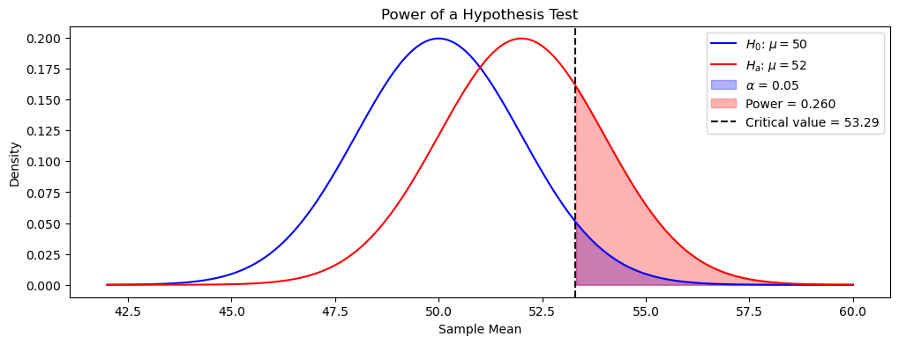
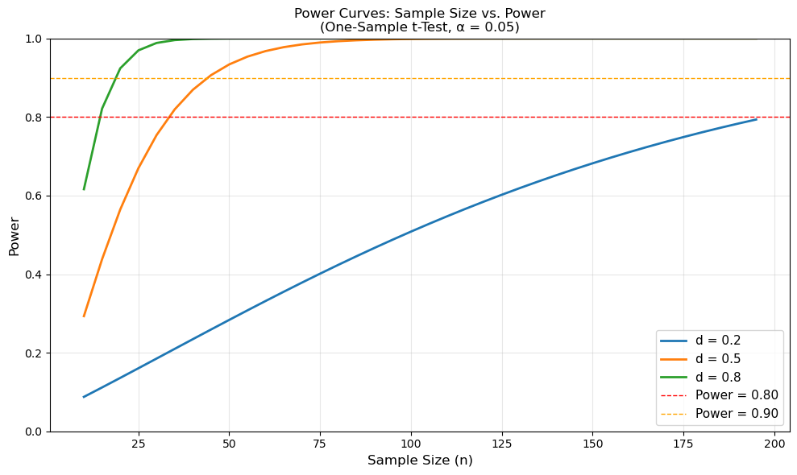

# 검정력 분석

## 검정력의 정의

가설검정의 **검정력**은 거짓인 귀무가설을 올바르게 기각할 확률이다. 제2종 오류율의 여집합이다:

$$\text{Power} = 1 - \beta = P(\text{Reject } H_0 \mid H_a \text{ is true})$$

검정력이 높은 검정은 참 효과가 있을 때 그것을 탐지할 가능성이 크다. 연구자들은 보통 검정력 0.80(80%) 이상을 목표로 하며, 이는 참 효과를 탐지할 확률이 80%라는 뜻이다.

## 검정력에 영향을 주는 요인

검정력을 결정하는 핵심 요인은 넷이다.

### 1. 유의수준 (alpha)
$\alpha$를 키우면(예: 0.01에서 0.05로) $H_0$을 기각하기 쉬워져 검정력이 커진다. 그러나 제1종 오류의 위험도 함께 커진다.

### 2. 표본크기 (n)
표본이 클수록 검정통계량의 표준오차가 줄어 참 차이를 탐지하기 쉬워지므로 검정력이 커진다. 실무에서 검정력을 높이는 가장 현실적인 지렛대이다.

### 3. 효과크기

효과크기는 참 차이 또는 효과의 크기를 잰다. 효과가 클수록 탐지하기 쉬워 검정력이 커진다. 흔한 측도는:

- 평균 비교의 **Cohen의 $d$**: $d = \frac{\mu_1 - \mu_0}{\sigma}$
- 비율 비교의 **비율 차이**

### 4. 모집단의 변동성 (sigma)
모집단의 변동성이 작을수록 참 효과를 탐지하기 쉬워 검정력이 커진다. 연구자가 모집단 변동성을 통제하기는 대개 어렵지만, 더 나은 연구 설계로 측정오차는 줄일 수 있다.

## 실무에서의 검정력 분석

검정력 분석은 주로 두 가지 방식으로 쓰인다.

### 사전 검정력 분석 (표본크기의 결정)

연구를 수행하기 전에, 예상되는 효과크기를 원하는 검정력과 유의수준으로 탐지하는 데 필요한 최소 표본크기를 검정력 분석으로 정한다.

<div class="exbox" markdown>

**보기 1.** <span class="diff easy" title="쉬움"></span> 필요한 표본크기 구하기. $\sigma$를 아는 일표본 $z$ 검정에서 효과크기 $d = \delta/\sigma$를 $\alpha = 0.05$ 양측, 검정력 $0.80$으로 탐지하려 한다.

**(1)** 필요한 표본크기가

$$
n = \left(\frac{z_{\alpha/2} + z_{\beta}}{d}\right)^2
$$

임을 유도하시오. 왜 두 임계값을 **더하는가**.

**(2)** $d = 0.5$에서 값을 구하고, 효과크기가 절반이 되면 표본이 몇 배가 되는지 말하시오.

</div>

??? success "풀이"

    **(1) 해석적으로.** $H_0$ 아래에서 $Z = (\bar X - \mu_0)/(\sigma/\sqrt n) \sim N(0,1)$이고 $\lvert Z \rvert > z_{\alpha/2}$일 때 기각한다. $H_1\colon \mu = \mu_0 + \delta$($\delta > 0$) 아래에서 $\bar X$의 중심이 $\delta$만큼 옮겨 가므로

    $$
    Z \sim N\!\left(\frac{\delta\sqrt n}{\sigma},\, 1\right) = N(d\sqrt n,\, 1)
    $$

    이다. 왼쪽 꼬리로 기각할 확률은 $\delta > 0$이면 무시할 수 있을 만큼 작으므로

    $$
    1-\beta \approx P(Z > z_{\alpha/2})
    = P\!\left(N(0,1) > z_{\alpha/2} - d\sqrt n\right)
    = \Phi\!\left(d\sqrt n - z_{\alpha/2}\right)
    $$

    이다. 이것을 $1-\beta$와 같다고 놓으면 $d\sqrt n - z_{\alpha/2} = z_\beta$, 곧

    $$
    \sqrt n = \frac{z_{\alpha/2} + z_\beta}{d}
    $$

    이고 양변을 제곱하면 주어진 식이다.

    **두 임계값을 더하는 까닭.** 기각 문턱은 하나뿐이다. 그 문턱은 $H_0$ 분포의 중심에서 오른쪽으로 $z_{\alpha/2}$만큼, $H_1$ 분포의 중심에서 **왼쪽으로** $z_\beta$만큼 떨어진 자리다. 그러므로 두 중심 사이의 거리가 $z_{\alpha/2} + z_\beta$이고, 그 거리를 표준오차 단위로 재면 $d\sqrt n$이다. **더하는 것은 두 오류를 양쪽에서 함께 막기 때문**이다. 코드에서 $z_\beta$를 `ppf(power)`로 쓰는 것도 같은 이유다. 검정력이 클수록 $H_1$ 쪽에서 더 깊이 들어가야 하므로 $z_\beta$가 커진다.

    **(2) 해석적으로.** $z_{0.025} = 1.959964$, $z_{0.20} = 0.841621$이므로

    $$
    n = \left(\frac{2.801585}{0.5}\right)^2 = 5.603170^2 = 31.3955 \;\rightarrow\; 32
    $$

    이다. $n$이 $d^{-2}$에 비례하므로 **효과가 절반이면 표본은 네 배**가 된다. $d = 0.25$에서는 $125.58 \rightarrow 126$이다.

    **수치적으로.**

    ```python
    from scipy import stats
    import numpy as np

    def sample_size_z_test(effect_size, alpha=0.05, power=0.80, alternative='two-sided'):
        """일표본 z-검정에 필요한 표본크기."""
        if alternative == 'two-sided':
            z_alpha = stats.norm.ppf(1 - alpha / 2)
        else:
            z_alpha = stats.norm.ppf(1 - alpha)
        # z_beta는 ppf(power)이지 ppf(1 - power)가 아니다.
        # 검정력이 클수록 z_beta가 커져 n이 늘어나야 하기 때문이다.
        z_beta = stats.norm.ppf(power)
        # 두 임계값을 **더한다**. alpha는 H0 분포의 오른쪽 꼬리에서,
        # beta는 Ha 분포의 왼쪽 꼬리에서 재므로 둘 사이의 거리가 두 값의 합이다.
        n = ((z_alpha + z_beta) / effect_size) ** 2
        return int(np.ceil(n))

    # 효과크기 0.5를 검정력 80%로 탐지하려면?
    n = sample_size_z_test(effect_size=0.5)
    print(f"Required sample size: {n}")

    # (2) 올림하기 전의 값과 1/d^2 비례를 확인한다.
    za, zb = stats.norm.ppf(0.975), stats.norm.ppf(0.80)
    print(f"za + zb = {za + zb:.6f}")
    for d in (0.5, 0.25):
        print(f"  d = {d:.2f}: n = {((za + zb) / d) ** 2:.4f}"
              f"  -> {sample_size_z_test(effect_size=d)}")
    ```

    출력:

    ```
    Required sample size: 32
    za + zb = 2.801585
      d = 0.50: n = 31.3955  -> 32
      d = 0.25: n = 125.5821  -> 126
    ```

    유도한 $31.3955$와 $125.5821$이 그대로 나왔고, 뒤가 앞의 정확히 네 배다.

    올림 때문에 정수 답은 $32$와 $126$이라 네 배가 되지 않는 것처럼 보이지만($32 \times 4 = 128$), 올림 전의 값은 정확히 네 배다. **효과크기가 분모에서 제곱되므로 작은 효과를 보는 일은 언제나 비싸다.**

### 사후 검정력 분석

연구를 마친 뒤 관측된 효과크기, 표본크기, 유의수준으로 달성된 검정력을 계산할 수 있다. 그러나 유의하지 않은 결과에 대한 사후 검정력 분석은 p-값을 넘는 정보를 거의 주지 않으므로 일반적으로 권장되지 않는다.

## 검정력의 시각화

$H_0$과 $H_a$ 아래의 분포를 함께 그리면 검정력을 이해할 수 있다.

<div class="exbox" markdown>

**보기 2.** <span class="diff easy" title="쉬움"></span> 검정력을 그림으로 보기. $\mu_0 = 50$, $\mu_a = 52$, $\sigma = 10$, $n = 25$인 **우측 단측** $z$ 검정을 $\alpha = 0.05$에서 본다.

**(1)** 임계값 $x_c$와 검정력의 닫힌 꼴을 구하고 값을 계산하시오.

**(2)** 검정력을 $0.80$으로 올리려면 $n$이 얼마여야 하는가. 그림에서 무엇이 달라지는가.

</div>

??? success "풀이"

    **(1) 해석적으로.** 표준오차는 $\text{SE} = \sigma/\sqrt n = 10/5 = 2$다. 우측 단측이므로 임계값은 $H_0$ 분포의 오른쪽 $5\%$ 자리,

    $$
    x_c = \mu_0 + z_{\alpha}\,\text{SE} = 50 + 1.644854 \times 2 = 53.289707
    $$

    이다. 검정력은 **같은 임계값**을 $H_1$ 분포에서 재는 것이다.

    $$
    1-\beta = P(\bar X > x_c \mid \mu = \mu_a)
    = P\!\left(N(0,1) > \frac{x_c - \mu_a}{\text{SE}}\right)
    = \Phi\!\left(\frac{\mu_a - \mu_0}{\text{SE}} - z_\alpha\right)
    $$

    여기서 $(\mu_a - \mu_0)/\text{SE} = 2/2 = 1$이므로

    $$
    1-\beta = \Phi(1 - 1.644854) = \Phi(-0.644854) = 0.259511
    $$

    이다. **참 평균이 정말 52인데도 네 번 중 세 번은 기각하지 못한다.**

    **(2) 해석적으로.** 보기 1의 식을 단측으로 바꾸면 $z_{\alpha/2}$ 자리에 $z_\alpha$가 들어간다. $d = \delta/\sigma = 2/10 = 0.2$이므로

    $$
    n = \left(\frac{z_{0.05} + z_{0.20}}{d}\right)^2
    = \left(\frac{1.644854 + 0.841621}{0.2}\right)^2
    = 12.432375^2 = 154.56 \;\rightarrow\; 155
    $$

    이다. $25$에서 $155$로 **여섯 배**가 넘게 든다. 그림에서는 두 곡선이 모두 $\sqrt{155/25} = 2.49$배 좁아져 겹침이 크게 줄고, 임계값이 $50 + 1.644854 \times 10/\sqrt{155} = 51.32$로 왼쪽으로 옮겨 가며, 빨간 영역이 전체의 80%를 차지하게 된다.

    **수치적으로.**

    ```python
    import numpy as np
    import matplotlib.pyplot as plt
    from scipy import stats

    plt.rcParams["font.sans-serif"] = ["NanumGothic", "Apple SD Gothic Neo", "Malgun Gothic"]
    plt.rcParams["font.family"] = "sans-serif"
    plt.rcParams["axes.unicode_minus"] = False

    def plot_power(mu_0, mu_a, sigma, n, alpha=0.05):
        """단측 z 검정의 검정력을 그림으로 보인다.

            귀무분포와 대립분포를 겹쳐 그리고, 기각역에 해당하는 두 넓이를 칠한다.
            귀무 쪽 넓이가 alpha, 대립 쪽 넓이가 검정력이다.
            """
        se = sigma / np.sqrt(n)
        z_crit = stats.norm.ppf(1 - alpha)
        x_crit = mu_0 + z_crit * se

        x = np.linspace(mu_0 - 4*se, mu_a + 4*se, 300)

        # 귀무가설이 참일 때의 분포
        y_h0 = stats.norm(mu_0, se).pdf(x)
        # 대립가설이 참일 때의 분포. 중심만 오른쪽으로 옮겨 간다.
        y_ha = stats.norm(mu_a, se).pdf(x)

        fig, ax = plt.subplots(figsize=(12, 4))
        ax.plot(x, y_h0, 'b-', label=f'$H_0$: $\\mu = {mu_0}$')
        ax.plot(x, y_ha, 'r-', label=f'$H_a$: $\\mu = {mu_a}$')

        # 귀무 분포에서 기각역에 해당하는 꼬리. 그 넓이가 유의수준 alpha 다.
        x_reject = x[x >= x_crit]
        ax.fill_between(x_reject, stats.norm(mu_0, se).pdf(x_reject), alpha=0.3, color='blue', label=f'$\\alpha$ = {alpha}')

        # 대립 분포에서 같은 기각역의 넓이. 그것이 검정력이다.
        ax.fill_between(x_reject, stats.norm(mu_a, se).pdf(x_reject), alpha=0.3, color='red', label=f'Power = {1 - stats.norm(mu_a, se).cdf(x_crit):.3f}')

        ax.axvline(x_crit, color='k', linestyle='--', label=f'Critical value = {x_crit:.2f}')
        ax.legend()
        ax.set_xlabel('Sample Mean')
        ax.set_ylabel('Density')
        ax.set_title('Power of a Hypothesis Test')
        plt.show()

    plot_power(mu_0=50, mu_a=52, sigma=10, n=25)

    # (1) 과 (2) 의 닫힌 꼴을 확인한다.
    mu0, mua, sigma, n_now, al = 50, 52, 10, 25, 0.05
    se = sigma / np.sqrt(n_now)
    z_al, z_be = stats.norm.ppf(1 - al), stats.norm.ppf(0.80)
    x_c = mu0 + z_al * se
    print(f"SE = {se}, x_c = {x_c:.6f}")
    print(f"검정력  닫힌 꼴 {stats.norm.sf(z_al - (mua - mu0) / se):.6f}"
          f"   직접 {stats.norm(mua, se).sf(x_c):.6f}")

    d = (mua - mu0) / sigma
    n_need = ((z_al + z_be) / d) ** 2
    print(f"검정력 0.80 에 필요한 n = {n_need:.2f} -> {int(np.ceil(n_need))}")
    se2 = sigma / np.sqrt(np.ceil(n_need))
    print(f"  그때 SE = {se2:.4f} (지금의 1/{se / se2:.2f}),"
          f"  x_c = {mu0 + z_al * se2:.2f},"
          f"  검정력 = {stats.norm.sf(z_al - (mua - mu0) / se2):.4f}")
    ```

    출력:

    ```
    SE = 2.0, x_c = 53.289707
    검정력  닫힌 꼴 0.259511   직접 0.259511
    검정력 0.80 에 필요한 n = 154.56 -> 155
      그때 SE = 0.8032 (지금의 1/2.49),  x_c = 51.32,  검정력 = 0.8010
    ```

    

    (1)에서 유도한 $x_c = 53.289707$과 검정력 $0.259511$이 그대로 나왔고, 닫힌 꼴 $\Phi(d\sqrt n - z_\alpha)$와 $H_1$ 분포에서 직접 잰 값이 소수점 여섯째 자리까지 같다. (2)의 $n = 155$도 확인되며, 그 설계의 실제 검정력은 $0.8010$으로 목표를 갓 넘는다.

    파란 곡선이 $H_0$ 아래, 빨간 곡선이 $H_a$ 아래의 $\bar X$ 분포다. 검은 점선이 임계값 $53.29$이고, 그 오른쪽의 파란 영역이 $\alpha = 0.05$, 빨간 영역이 검정력이다(그림의 범례는 소수점 셋째 자리로 반올림해 $0.260$으로 적혀 있다).

    **두 곡선이 겹치는 정도가 곧 검정의 무력함이다.** 두 중심이 $2$만큼 떨어져 있는데 표준오차가 $2$라 **딱 한 표준오차**만큼만 벌어져 있다. 보기 1의 식으로 읽으면 $d\sqrt n = 1$인데 $0.80$을 얻으려면 $z_{0.05} + z_{0.20} = 2.486$이 필요하니, 지금 가진 것은 필요한 거리의 40%뿐이다. 거리는 $\sqrt n$에 비례하므로 모자란 $1/0.40 = 2.49$배를 메우려면 $n$을 $2.49^2 = 6.2$배로 늘려야 하고, 그래서 $25 \to 155$가 된다.

## 검정력, 표본크기, 효과크기의 관계

| 효과크기 | 필요한 $n$ (이표본, 집단당, 검정력 = 0.80, $\alpha$ = 0.05) |
|---|---|
| 작음 ($d = 0.2$) | ~393 |
| 중간 ($d = 0.5$) | ~64 |
| 큼 ($d = 0.8$) | ~26 |

이 값들은 작은 효과를 탐지하려면 왜 훨씬 큰 표본이 필요한지 보여준다.

## statsmodels를 이용한 검정력 분석

Statsmodels는 여러 검정 유형에 대한 검정력 분석 함수를 폭넓게 제공한다.

### 일표본 t-검정

<div class="exbox" markdown>

**보기 3.** <span class="diff easy" title="쉬움"></span> 일표본 t-검정의 검정력. $\sigma$를 모르는 경우다. $\mu_0 = 0$, $\mu_a = 5$, $\sigma = 15$라 $d = 1/3$이고, $\alpha = 0.05$ 양측에서 검정력 $0.80$을 목표로 한다.

**(1)** 보기 1의 $z$ 공식으로 $n$을 어림하고, $n = 50$일 때의 검정력도 $z$로 어림하시오.

**(2)** `statsmodels`가 쓰는 **비중심 $t$**의 답과 견주시오. 어느 쪽으로 얼마나 어긋나는가.

</div>

??? success "풀이"

    **(1) 해석적으로.** $z_{0.025} + z_{0.20} = 2.801585$이고 $d = 1/3$이므로

    $$
    n \approx \left(\frac{2.801585}{1/3}\right)^2 = 8.404755^2 = 70.6399 \;\rightarrow\; 71
    $$

    이다. $n = 50$에서의 검정력은 보기 1에서 쓴 식 $\Phi(d\sqrt n - z_{\alpha/2})$에 넣으면

    $$
    \Phi\!\left(\tfrac13\sqrt{50} - 1.959964\right)
    = \Phi(2.357023 - 1.959964) = \Phi(0.397059) = 0.654338
    $$

    이다.

    **(2) 비중심 $t$가 옳은 답이다.** $\sigma$를 모르면 분모가 $S$라 통계량이 $t$를 따르고, $H_1$ 아래에서는 비중심모수 $\lambda = d\sqrt n$인 **비중심 $t$**를 따른다. $z$ 공식은 두 군데에서 낙관적이다. 임계값이 $z_{\alpha/2}$가 아니라 더 큰 $t_{\alpha/2,\,n-1}$이고, 대립분포의 꼬리도 정규보다 두껍다. 그래서 $z$ 어림은 **필요한 $n$을 적게, 주어진 $n$의 검정력을 크게** 내놓는다.

    **수치적으로.**

    ```python
    from statsmodels.stats.power import TTestPower
    import numpy as np

    analysis = TTestPower()

    # 5점 차이를 탐지하려면 몇 명이 필요한가? (mu_0 = 0, mu_a = 5, sigma = 15)
    # 검정력 계산에 들어가는 것은 delta도 sigma도 아니라 그 비뿐이다.
    # 5점/15와 1점/3은 검정력 관점에서 완전히 같은 문제다.
    effect_size = 5 / 15  # Cohen's d = 0.333

    n_needed = analysis.solve_power(effect_size=effect_size, alpha=0.05,
                                    power=0.80, alternative='two-sided')
    print(f"One-sample t-test:")
    print(f"  Effect size (Cohen's d): {effect_size:.3f}")
    print(f"  Sample size needed for 80% power: {int(np.ceil(n_needed))}")

    # 반대 방향의 질문: n이 정해져 있을 때 검정력은 얼마인가?
    power = analysis.power(effect_size=effect_size, nobs=50, alpha=0.05,
                          alternative='two-sided')
    print(f"  Power with n=50: {power:.3f}")

    # (1) 의 z 어림과 견준다.
    za, zb = stats.norm.ppf(0.975), stats.norm.ppf(0.80)
    n_z = ((za + zb) / effect_size) ** 2
    pw_z = stats.norm.sf(za - effect_size * np.sqrt(50))
    print(f"\n  z 어림   n = {n_z:.4f},  n=50 의 검정력 = {pw_z:.6f}")
    print(f"  비중심 t n = {n_needed:.4f},  n=50 의 검정력 = {power:.6f}")
    print(f"  차이        {n_needed - n_z:+.4f}명,"
          f"             {power - pw_z:+.6f}")
    ```

    출력:

    ```
    One-sample t-test:
      Effect size (Cohen's d): 0.333
      Sample size needed for 80% power: 73
      Power with n=50: 0.637

      z 어림   n = 70.6399,  n=50 의 검정력 = 0.654338
      비중심 t n = 72.5839,  n=50 의 검정력 = 0.637094
      차이        +1.9440명,             -0.017244
    ```

    (1)에서 손으로 구한 $70.6399$와 $0.654338$이 그대로 나왔다.

    **$z$ 어림은 예상대로 낙관적이다.** 필요한 표본을 두 명 적게 잡고($70.64$ 대 $72.58$), 검정력을 $0.0172$ 크게 잡는다. 올림하면 $71$ 대 $73$이라 **두 명 차이**다. $n$이 70쯤이면 이 정도지만 $n$이 작을수록 벌어지므로, 소표본 설계에서는 $z$ 공식을 그대로 쓰면 안 된다.

    실무적으로 더 중요한 것은 두 번째 줄이다. 73명이 필요한데 50명만 모으면 검정력이 $0.80$에서 $0.637$로 떨어진다. 표본을 $32\%$ 줄였을 뿐인데 **효과를 놓칠 확률은 $20\%$에서 $36\%$로 거의 두 배**가 된다. 검정력은 $n$에 선형으로 반응하지 않는다.

### 이표본 t-검정 (독립표본)

<div class="exbox" markdown>

**보기 4.** <span class="diff easy" title="쉬움"></span> 이표본 t-검정의 검정력. $d = 0.5$, $\alpha = 0.05$ 양측, 검정력 $0.80$으로 두 집단을 견준다. 배분을 $1{:}1$로 할 때와 $1{:}2$로 할 때를 비교한다.

**(1)** 두 집단의 크기 비를 $r = n_2/n_1$이라 둘 때, 같은 검정력에 필요한 **총** 표본크기가

$$
\frac{N(r)}{N(1)} = \frac{2 + r + 1/r}{4}
$$

배가 됨을 보이시오. 이것이 $r = 1$에서 최소임도 보이시오.

**(2)** $r = 2$에서 (1)이 예측하는 총 표본크기를 구하고 코드와 맞춰 보시오.

</div>

??? success "풀이"

    **(1) 해석적으로.** 차이 $\bar X_1 - \bar X_2$의 분산은 $\sigma^2(1/n_1 + 1/n_2)$이므로, 검정력은 오로지

    $$
    \lambda = \frac{d}{\sqrt{1/n_1 + 1/n_2}}
    $$

    를 통해서만 $n_1, n_2$에 달려 있다. 검정력을 고정한다는 것은 $\lambda$를 고정한다는 것이고, 곧

    $$
    \frac{1}{n_1} + \frac{1}{n_2} = c \qquad (c = d^2/\lambda^2 \text{ 는 상수})
    $$

    를 지킨다는 뜻이다. $n_2 = r n_1$을 넣으면

    $$
    \frac{1}{n_1}\left(1 + \frac1r\right) = c
    \quad\Longrightarrow\quad
    n_1 = \frac{1 + 1/r}{c}
    $$

    이고 총 표본은

    $$
    N(r) = n_1(1+r) = \frac{(1+1/r)(1+r)}{c} = \frac{2 + r + 1/r}{c}
    $$

    다. $r = 1$에서 $N(1) = 4/c$이므로 비는 주어진 식이 된다.

    $r = 1$이 최소임은 산술–기하평균 부등식에서 바로 나온다. $r > 0$에서 $r + 1/r \ge 2$이고 등호는 $r = 1$일 때만이다. 따라서

    $$
    \frac{N(r)}{N(1)} = \frac{2 + r + 1/r}{4} \ge \frac{2+2}{4} = 1
    $$

    이다. **같은 검정력을 얻는 데 드는 총인원은 균등 배분에서 가장 적다.**

    **(2) 해석적으로.** $r = 2$를 넣으면

    $$
    \frac{N(2)}{N(1)} = \frac{2 + 2 + 0.5}{4} = \frac{4.5}{4} = 1.125
    $$

    이다. $1{:}1$ 설계가 총 128명이므로 $1{:}2$ 설계는 $128 \times 1.125 = 144$명이다.

    **수치적으로.**

    ```python
    from statsmodels.stats.power import TTestIndPower

    # 두 집단을 견주는 t-검정의 검정력 분석
    analysis = TTestIndPower()

    # 두 집단의 크기를 같게 두는 설계다. 같은 총인원이면 이때 검정력이 가장 높다.
    # 효과크기 Cohen 의 d = 0.5. 두 평균이 표준편차의 절반만큼 떨어진 경우다.
    effect_size = 0.5

    n_per_group = analysis.solve_power(effect_size=effect_size, alpha=0.05,
                                       power=0.80, ratio=1.0,
                                       alternative='two-sided')
    print(f"\nTwo-sample t-test (equal n):")
    print(f"  Effect size (Cohen's d): {effect_size:.3f}")
    print(f"  Sample size per group for 80% power: {int(np.ceil(n_per_group))}")
    print(f"  Total sample size: {2 * int(np.ceil(n_per_group))}")

    # 집단 크기가 다른 경우 (예: 2:1 배분)
    # ratio는 nobs2/nobs1이고, solve_power가 돌려주는 것은 **nobs1**이다.
    # 따라서 두 번째 집단은 ratio를 곱해서 얻어야 한다. 나누면 거꾸로다.
    ratio = 2.0
    n_group1 = analysis.solve_power(effect_size=effect_size, alpha=0.05,
                                    power=0.80, ratio=ratio,
                                    alternative='two-sided')
    n_group2 = n_group1 * ratio
    n1, n2 = int(np.ceil(n_group1)), int(np.ceil(n_group2))
    print(f"\nTwo-sample t-test (2:1 ratio):")
    print(f"  Group 1 n: {n1}")
    print(f"  Group 2 n: {n2}")
    print(f"  Total sample size: {n1 + n2}")

    # (1) 의 식을 여러 r 에서 확인한다.
    print(f"\n{'r':>5} {'n1':>8} {'n2':>8} {'총':>6} {'관측 비':>8} {'식':>8}")
    base = None
    for r in (1.0, 1.5, 2.0, 3.0, 4.0):
        a = analysis.solve_power(effect_size=0.5, alpha=0.05, power=0.80,
                                 ratio=r, alternative='two-sided')
        total = a * (1 + r)
        base = total if base is None else base
        print(f"{r:>5.1f} {a:>8.2f} {a * r:>8.2f} {total:>6.1f}"
              f" {total / base:>8.4f} {(2 + r + 1 / r) / 4:>8.4f}")
    ```

    출력:

    ```

    Two-sample t-test (equal n):
      Effect size (Cohen's d): 0.500
      Sample size per group for 80% power: 64
      Total sample size: 128

    Two-sample t-test (2:1 ratio):
      Group 1 n: 48
      Group 2 n: 96
      Total sample size: 144

        r       n1       n2      총     관측 비        식
      1.0    63.77    63.77  127.5   1.0000   1.0000
      1.5    53.11    79.66  132.8   1.0410   1.0417
      2.0    47.74    95.48  143.2   1.1231   1.1250
      3.0    42.35   127.04  169.4   1.3282   1.3333
      4.0    39.63   158.53  198.2   1.5538   1.5625
    ```

    (1)의 식이 맞는다. $r = 2$에서 예측 $1.1250$에 관측 $1.1231$로 $0.2\%$ 안쪽이고, $r = 4$에서도 $1.5625$ 대 $1.5538$이다. 작은 차이는 $z$ 공식에는 없는 **자유도 효과** 때문이다. $r$이 커지면 $n_1$이 줄어 자유도 $n_1+n_2-2$가 식이 가정한 만큼 늘지 않는다.

    올림한 정수로 보면 $1{:}1$이 $64 + 64 = 128$명, $1{:}2$가 $48 + 96 = 144$명이다. (2)에서 예측한 $128 \times 1.125 = 144$와 **정확히 같다.**

    **배분이 균등에서 멀어질수록 총 표본이 늘어난다.** 한쪽 집단을 모으기 쉽다고 해서 그쪽만 키우면 전체 비용이 오히려 커질 수 있다. (1)의 식에서 보듯 작은 쪽 집단이 병목이기 때문이다. $r \to \infty$에서 $N(r)/N(1) \to \infty$이지만, 작은 쪽 집단 $n_1$은 $N(1)/4$, 곧 32명 아래로는 결코 내려가지 않는다. **한쪽을 무한히 늘려도 다른 쪽을 절반 아래로 줄일 수는 없다.**

### 비율에 대한 검정 (A/B 검정)

<div class="exbox" markdown>

**보기 5.** <span class="diff easy" title="쉬움"></span> 비율 검정의 검정력 — A/B 검정. 대조군 전환율 $p_0 = 1.1\%$를 실험군에서 $p_1 = 1.65\%$로 올리는 것이 목표다. $\alpha = 0.05$ **단측**, 검정력 $0.80$, 집단 크기는 같다.

**(1)** 코헨의 $h = 2\arcsin\sqrt{p_1} - 2\arcsin\sqrt{p_0}$을 계산하고, 집단당 표본크기가 $n = 2\left((z_\alpha + z_\beta)/h\right)^2$임을 보인 뒤 값을 구하시오.

**(2)** 코드와 맞춰 보고, 그 표본에서 전환이 몇 건쯤 일어나는지 세어 보시오.

</div>

??? success "풀이"

    **(1) 해석적으로.** $\arcsin$ 변환을 쓰는 까닭부터 보자. $\hat p$의 분산 $p(1-p)/n$은 $p$에 달려 있어 식이 $p$마다 달라진다. 그런데 $\varphi = 2\arcsin\sqrt{\hat p}$으로 바꾸면 **분산이 $p$와 무관하게 $1/n$**이 된다(분산안정화 변환). 그러므로 두 집단의 차 $\varphi_1 - \varphi_2$의 분산은 $1/n_1 + 1/n_2 = 2/n$이고, 효과크기를 $h$로 재면 보기 1의 식이 그대로 쓰인다.

    $$
    \lambda = \frac{h}{\sqrt{2/n}} = z_\alpha + z_\beta
    \quad\Longrightarrow\quad
    n = 2\left(\frac{z_\alpha + z_\beta}{h}\right)^2
    $$

    보기 4의 $r = 1$인 경우와 같은 꼴이고, 계수 2가 거기서 왔다.

    이제 $h$를 잰다. $\arcsin\sqrt{0.0165} = \arcsin(0.1284523) = 0.1288082$, $\arcsin\sqrt{0.011} = \arcsin(0.1048809) = 0.1050741$이므로

    $$
    h = 2(0.1288082 - 0.1050741) = 0.0474682
    $$

    이다. 단측이므로 $z_{0.05} = 1.644854$, $z_{0.20} = 0.841621$을 쓰면

    $$
    n = 2\left(\frac{2.4864749}{0.0474682}\right)^2 = 2 \times 52.38192^2 = 2 \times 2743.866 = 5487.73 \;\rightarrow\; 5488
    $$

    이다.

    **(2) 수치적으로.**

    ```python
    import numpy as np
    import statsmodels.stats.api as sms
    from statsmodels.stats.power import NormalIndPower

    # 전환율을 견주는 A/B 검정
    # 대조군 전환율 1.1%
    # 실험군 전환율 1.65%. 상대적으로는 50% 개선이지만 절대차는 0.55%p 다.
    p0 = 0.011   # Control baseline
    p1 = 0.0165  # Treatment goal

    # 비율에서는 두 값의 차이 대신 arcsin 변환 후의 차이를 효과크기로 쓴다.
    #   h = 2*arcsin(sqrt(p1)) - 2*arcsin(sqrt(p0)) — 비율을 각도로 바꿔 재는 효과크기다.
    # 이렇게 하면 분산이 p에 의존하는 문제가 사라져 하나의 공식으로 처리된다.
    # 0.011 대 0.0165는 절대차로 0.55%p뿐이지만 상대적으로는 50% 증가다.
    effect_size = sms.proportion_effectsize(p1, p0)

    # alternative='larger'는 단측이다. A/B 검정에서는 "개선되었는가"만 보는 일이 많다.
    analysis = NormalIndPower()
    n_ab = analysis.solve_power(effect_size=effect_size, alpha=0.05,
                                power=0.80, ratio=1.0, alternative='larger')

    print(f"\nA/B Test (Proportions):")
    print(f"  Control rate: {p0:.2%}")
    print(f"  Treatment goal: {p1:.2%}")
    print(f"  Effect size: {effect_size:.4f}")
    print(f"  Sample size per group for 80% power: {int(np.ceil(n_ab))}")

    # (1) 의 손계산과 맞춰 본다.
    h = 2 * np.arcsin(np.sqrt(p1)) - 2 * np.arcsin(np.sqrt(p0))
    z_a, z_b = stats.norm.ppf(0.95), stats.norm.ppf(0.80)
    n_formula = 2 * ((z_a + z_b) / h) ** 2
    print(f"\n  h 직접 계산   {h:.8f}   statsmodels {effect_size:.8f}")
    print(f"  n 공식        {n_formula:.4f}   statsmodels {n_ab:.4f}")

    # (2) 그 표본에서 전환은 몇 건인가.
    n_int = int(np.ceil(n_ab))
    print(f"\n  집단당 {n_int:,}명 x 2 = {2 * n_int:,}명")
    print(f"  기대 전환 건수: 대조군 {n_int * p0:.1f}건,"
          f" 실험군 {n_int * p1:.1f}건,  차이 {n_int * (p1 - p0):.1f}건")
    ```

    출력:

    ```

    A/B Test (Proportions):
      Control rate: 1.10%
      Treatment goal: 1.65%
      Effect size: 0.0475
      Sample size per group for 80% power: 5488

      h 직접 계산   0.04746819   statsmodels 0.04746819
      n 공식        5487.7312   statsmodels 5487.7312

      집단당 5,488명 x 2 = 10,976명
      기대 전환 건수: 대조군 60.4건, 실험군 90.6건,  차이 30.2건
    ```

    유도한 $h = 0.0474682$와 $n = 5487.73$이 `statsmodels`와 소수점 넷째 자리까지 같다. 비율 검정에는 $t$ 보정이 없으므로(정규근사를 쓰는 검정이다) **공식과 라이브러리가 완전히 일치한다.** 보기 3에서 두 명이 어긋났던 것과 대조된다.

    집단당 $5{,}488$명, 합쳐서 약 $11{,}000$명이 필요하다. **전환율이 낮으면 표본이 이렇게 커진다.** $1.1\%$의 기저율에서는 집단당 $5{,}488$명이라도 전환이 $60$건 남짓에 불과하고, 두 군의 기대 차이는 $30$건뿐이다. 세는 사건이 적으면 상대적인 흔들림이 크다는 것이 이 수의 정체다. 웹 실험이 몇 주씩 걸리는 이유가 여기 있다.

    한 가지 덧붙이면, $0.011 \to 0.0165$는 **상대적으로 50% 개선**인데도 $h$가 $0.047$로 아주 작다. 효과크기는 비율의 **비**가 아니라 변환한 척도의 **차**로 재기 때문이다. 기저율이 낮으면 같은 상대 개선이라도 $h$가 작아지고, 그래서 표본이 폭증한다.

### 일원분산분석

<div class="exbox" markdown>

**보기 6.** <span class="diff easy" title="쉬움"></span> 일원분산분석의 검정력. 코헨의 $f = 0.25$(중간), 집단 $k = 4$, $\alpha = 0.05$, 검정력 $0.80$이다. `FTestAnovaPower.solve_power`가 돌려주는 수는 **집단당**인가 **총**인가.

**(1)** $k = 2$로 두고 같은 계산을 돌리면 보기 4의 이표본 $t$ 검정과 **같은 문제**가 된다($f = d/2$이므로 $f = 0.25$는 $d = 0.5$다). 이 사실을 써서 돌려주는 수가 무엇인지 판정하시오.

**(2)** 그에 따라 $k = 4$의 집단당 표본크기와 총 표본크기를 바르게 구하시오.

</div>

??? success "풀이"

    **(1) 해석적으로.** 먼저 $f = d/2$를 확인한다. 집단이 둘이고 크기가 같을 때 집단평균의 표준편차는

    $$
    \sigma_m = \sqrt{\frac{1}{k}\sum_{i=1}^{k}(\mu_i - \bar\mu)^2}
    = \sqrt{\frac{(\delta/2)^2 + (\delta/2)^2}{2}} = \frac{\delta}{2}
    $$

    이므로 $f = \sigma_m/\sigma = d/2$다. 그러니 $f = 0.25$, $k = 2$는 $d = 0.5$인 이표본 $t$ 검정과 **같은 설계**이고, 보기 4에서 그 답이 **총** $127.531$명(집단당 $63.766$)이었다.

    분산분석의 검정력이 비중심모수 $\lambda = f^2 N$에 달려 있고 $N$이 총 관측수라는 점을 떠올리면 판정이 끝난다. `solve_power`가 $k=2$에서 $63.8$을 주면 집단당, $127.5$를 주면 총이다. **아래 코드가 $127.531$을 준다.** 따라서 이 함수가 돌려주는 것은 **총 표본크기**다.

    **(2) 해석적으로.** $k = 4$에서 함수가 주는 $178.396$은 총 표본이므로 집단당은

    $$
    \frac{178.396}{4} = 44.599 \;\rightarrow\; 45
    $$

    이고 실제로 쓰는 총 표본은 $4 \times 45 = 180$명이다.

    **수치적으로.**

    ```python
    from statsmodels.stats.power import FTestAnovaPower

    # 분산분석의 효과크기는 Cohen 의 f 다. t-검정의 d 와는 눈금이 다르므로
    # 0.25 를 d 로 읽으면 안 된다. f 는 0.10 작음, 0.25 중간, 0.40 큼으로 본다.
    analysis = FTestAnovaPower()

    effect_size = 0.25   # 중간 크기 효과
    k_groups = 4         # 비교할 집단 수

    # **nobs 는 총 관측수다.** 집단당이 아니다. 아래 k=2 검산이 그것을 보인다.
    n_total = analysis.solve_power(effect_size=effect_size, alpha=0.05,
                                   power=0.80, k_groups=k_groups)
    n_each = int(np.ceil(n_total / k_groups))
    print(f"\nOne-way ANOVA (4 groups):")
    print(f"  Effect size (Cohen's f): {effect_size:.3f}")
    print(f"  Total sample size for 80% power: {n_total:.3f}"
          f" -> {k_groups * n_each}")
    print(f"  Sample size per group: {n_total / k_groups:.3f} -> {n_each}")
    print(f"  실제 검정력: "
          f"{analysis.power(effect_size=effect_size, nobs=k_groups * n_each, alpha=0.05, k_groups=k_groups):.4f}")

    # (1) 의 검산: k=2 는 d=0.5 인 이표본 t 검정과 같은 문제여야 한다.
    n_k2 = analysis.solve_power(effect_size=0.25, alpha=0.05, power=0.80,
                                k_groups=2)
    n_t = TTestIndPower().solve_power(effect_size=0.5, alpha=0.05, power=0.80,
                                      ratio=1.0, alternative='two-sided')
    print(f"\n  ANOVA k=2 가 준 수      {n_k2:.5f}")
    print(f"  이표본 t 의 집단당       {n_t:.5f}   총 {2 * n_t:.5f}")
    print(f"  -> 돌려준 수는 '총'이다 (차이 {abs(n_k2 - 2 * n_t):.2e})")

    # 집단 수를 늘리면 어떻게 되는가.
    print(f"\n{'k':>3} {'총 N':>9} {'집단당':>8} {'올림 후 총':>10}")
    for k in (2, 3, 4, 5, 6):
        N = analysis.solve_power(effect_size=0.25, alpha=0.05, power=0.80,
                                 k_groups=k)
        each = int(np.ceil(N / k))
        print(f"{k:>3} {N:>9.3f} {N / k:>8.3f} {k * each:>10}")
    ```

    출력:

    ```

    One-way ANOVA (4 groups):
      Effect size (Cohen's f): 0.250
      Total sample size for 80% power: 178.396 -> 180
      Sample size per group: 44.599 -> 45
      실제 검정력: 0.8040

      ANOVA k=2 가 준 수      127.53062
      이표본 t 의 집단당       63.76561   총 127.53122
      -> 돌려준 수는 '총'이다 (차이 6.00e-04)

      k       총 N      집단당     올림 후 총
      2   127.531   63.765        128
      3   157.189   52.396        159
      4   178.396   44.599        180
      5   195.766   39.153        200
      6   210.845   35.141        216
    ```

    **검산이 결정적이다.** $k = 2$에서 분산분석이 준 $127.531$이 이표본 $t$ 검정의 **총** $127.531$과 소수점 셋째 자리까지 같다(차이 $6\times10^{-4}$은 두 구현의 수치해법 차이다). 집단당 $63.766$과는 두 배 차이가 나므로, `FTestAnovaPower`의 `nobs`는 **총 관측수**다. 함수 이름이나 변수 이름만 보고 "집단당"으로 읽으면 표본을 $k$배로 부풀리게 된다.

    $k = 4$의 답은 **집단당 45명, 총 180명**이고 그때 실제 검정력은 $0.8040$이다.

    맨 아래 표가 집단 수의 대가를 보여 준다. $f$를 $0.25$로 고정한 채 집단을 둘에서 여섯으로 늘리면 **총** 표본은 $128$에서 $216$으로 69% 늘지만 **집단당**은 $64$에서 $36$으로 오히려 줄어든다. 집단이 많아지면 분자 자유도가 커져 임계값이 올라가므로 총량은 늘지만, 그 증가가 집단 수에 비례하지는 않는다.

    끝으로 척도를 혼동하지 말 것. $f = 0.25$는 분산분석에서 "중간"이지만 $d = 0.5$와 **같은 수가 아니다.** 둘 사이에 $f = d/2$라는 관계가 서는 것은 집단이 **둘일 때뿐**이고, 집단이 셋 이상이면 평균들이 어떻게 흩어져 있느냐에 따라 달라진다.

### 검정력 곡선: 표본크기와 검정력의 관계

<div class="exbox" markdown>

**보기 7.** <span class="diff easy" title="쉬움"></span> 표본크기와 검정력의 곡선. 일표본 $t$ 검정에서 $d = 0.2,\ 0.5,\ 0.8$에 대한 검정력 곡선을 그린다($\alpha = 0.05$ 양측).

**(1)** 보기 1의 $z$ 공식 $n = ((z_{\alpha/2}+z_\beta)/d)^2$으로 세 효과크기에서 검정력 $0.80$에 필요한 $n$을 어림하시오. 셋의 비는 얼마인가.

**(2)** 비중심 $t$의 정확한 답과 견주시오. 어긋남이 **$d$에 따라 어떻게** 나타나는가. 그 때문에 (1)에서 구한 비가 어떻게 달라지는가.

</div>

??? success "풀이"

    **(1) 해석적으로.** $z_{0.025} + z_{0.20} = 2.801585$이므로

    $$
    n_z(d) = \left(\frac{2.801585}{d}\right)^2
    $$

    이고, $d = 0.2,\ 0.5,\ 0.8$에서 각각

    $$
    n_z(0.2) = 196.222, \quad n_z(0.5) = 31.396, \quad n_z(0.8) = 12.264
    $$

    이다. $n_z \propto d^{-2}$이므로 비는 효과크기 비의 제곱이다.

    $$
    \frac{n_z(0.2)}{n_z(0.8)} = \left(\frac{0.8}{0.2}\right)^2 = 16, \qquad
    \frac{n_z(0.2)}{n_z(0.5)} = \left(\frac{0.5}{0.2}\right)^2 = 6.25
    $$

    **(2) 예상.** 보기 3에서 보았듯 비중심 $t$는 $z$ 어림보다 큰 $n$을 요구한다. 그 차이가 $d$에 따라 어떻게 변하는지는 손으로 알기 어렵다. 아래에서 재어 보자.

    **수치적으로.**

    ```python
    import matplotlib.pyplot as plt

    plt.rcParams["font.sans-serif"] = ["NanumGothic", "Apple SD Gothic Neo", "Malgun Gothic"]
    plt.rcParams["font.family"] = "sans-serif"
    plt.rcParams["axes.unicode_minus"] = False

    # 효과크기를 세 가지로 두고 표본크기에 따른 검정력을 그린다.
    # 세 곡선이 모두 위로 볼록하다는 점이 중요하다. 표본을 늘릴수록 얻는 것이
    # 줄어들므로, 검정력 0.8 을 0.9 로 올리는 비용이 0.5 를 0.8 로 올리는 비용보다 크다.
    fig, ax = plt.subplots(figsize=(10, 6))

    analysis = TTestPower()
    sample_sizes = np.arange(10, 200, 5)

    for d in [0.2, 0.5, 0.8]:
        power_values = [analysis.power(effect_size=d, nobs=n, alpha=0.05)
                        for n in sample_sizes]
        ax.plot(sample_sizes, power_values, linewidth=2, label=f"d = {d:.1f}")

    # 관례로 쓰는 두 기준선. 0.80 이 가장 흔하다.
    ax.axhline(0.80, color='red', linestyle='--', linewidth=1, label='Power = 0.80')
    ax.axhline(0.90, color='orange', linestyle='--', linewidth=1, label='Power = 0.90')

    ax.set_xlabel('Sample Size (n)', fontsize=12)
    ax.set_ylabel('Power', fontsize=12)
    ax.set_title('Power Curves: Sample Size vs. Power\n(One-Sample t-Test, α = 0.05)')
    ax.legend(fontsize=11)
    ax.grid(True, alpha=0.3)
    ax.set_ylim([0, 1])

    plt.tight_layout()
    plt.show()

    # (1) 의 z 어림과 (2) 의 정확한 답을 나란히 둔다.
    za, zb = stats.norm.ppf(0.975), stats.norm.ppf(0.80)
    print(f"{'d':>5} {'z 어림':>10} {'비중심 t':>10} {'차이':>8}")
    exact = {}
    for d in (0.2, 0.5, 0.8):
        nz = ((za + zb) / d) ** 2
        nt = analysis.solve_power(effect_size=d, alpha=0.05, power=0.80,
                                  alternative='two-sided')
        exact[d] = nt
        print(f"{d:>5.1f} {nz:>10.3f} {nt:>10.3f} {nt - nz:>+8.3f}")

    print(f"\n비 n(0.2)/n(0.8):  z 어림 {16:.2f}"
          f"   정확 {exact[0.2] / exact[0.8]:.2f}")
    print(f"비 n(0.2)/n(0.5):  z 어림 {6.25:.2f}"
          f"   정확 {exact[0.2] / exact[0.5]:.2f}")

    # 검정력을 더 올리는 비용 (d = 0.5)
    print()
    for pw in (0.80, 0.90, 0.95):
        n = analysis.solve_power(effect_size=0.5, alpha=0.05, power=pw,
                                 alternative='two-sided')
        print(f"  d=0.5, 검정력 {pw:.2f}: n = {n:.3f} -> {int(np.ceil(n))}")
    ```

    출력:

    ```
        d       z 어림      비중심 t       차이
      0.2    196.222    198.151   +1.929
      0.5     31.396     33.367   +1.972
      0.8     12.264     14.303   +2.039

    비 n(0.2)/n(0.8):  z 어림 16.00   정확 13.85
    비 n(0.2)/n(0.5):  z 어림 6.25   정확 5.94

      d=0.5, 검정력 0.80: n = 33.367 -> 34
      d=0.5, 검정력 0.90: n = 43.995 -> 44
      d=0.5, 검정력 0.95: n = 53.941 -> 54
    ```

    

    (1)에서 손으로 구한 $196.222$, $31.396$, $12.264$가 `z 어림` 열과 그대로 맞는다.

    **어긋남이 거의 일정하다.** 차이가 $+1.93$, $+1.97$, $+2.04$로, $n$이 $196$이든 $12$든 **두 명 남짓**이다. $z$ 어림이 놓치는 것은 $S$를 추정하느라 생기는 비용인데, 그 비용이 비율이 아니라 **덧셈으로** 붙는다는 뜻이다.

    그래서 (1)의 비가 무너진다. 상수를 더하면 작은 수가 비율로 더 크게 부푼다. $n(0.2)/n(0.8)$은 $z$ 법칙의 $16$이 아니라 $13.85$이고, $n(0.2)/n(0.5)$도 $6.25$가 아니라 $5.94$다. **$d^{-2}$ 법칙은 $n$이 클 때만 쓸 만하다.** 올림한 정수로 보면 $d = 0.8$에 15명, $d = 0.5$에 34명, $d = 0.2$에 199명이고, 효과크기가 4분의 1로 줄 때 표본은 열세 배가 된다.

    맨 아래 세 줄이 그림의 평평해지는 구간을 수로 옮긴 것이다. $d = 0.5$에서 검정력 $0.80$에는 34명이면 되지만 $0.90$에는 44명, $0.95$에는 54명이 필요하다. **30% 더 모아서 10%p를 얻는 셈**이고, 그다음 5%p에 또 10명이 든다. 세 곡선이 모두 위로 볼록하므로 마지막 몇 %p가 가장 비싸다. 작은 효과를 탐지하는 일은 표본이 곧 예산이다.

### 검정력 분석의 작업 흐름

<div class="exbox" markdown>

**보기 8.** <span class="diff easy" title="쉬움"></span> 연구 설계 작업 흐름. 앞의 보기들을 하나의 함수로 묶어 설계 단계에서 시나리오를 바꿔 가며 표본크기를 비교할 수 있게 한다.

**(1)** 이 함수가 돌려주는 표에서 무엇을 읽을 수 있는가. 연구계획서에 그대로 옮길 수 있는가.

**(2)** 이 함수가 **해 주지 않는 것**은 무엇인가. 겉보기와 달리 말없이 실패하는 자리를 찾아 보이시오.

</div>

??? success "풀이"

    유도할 답이 있는 문제가 아니다. **이 코드가 무엇을 해 주고 무엇을 해 주지 않는가**가 이 보기의 전부다.

    먼저 코드를 보자. `anova` 가지는 보기 6에서 밝힌 대로 `solve_power`가 돌려주는 수를 **총 표본**으로 읽어야 한다.

    ```python
    def design_study(test_type, effect_size, alpha=0.05, power=0.80,
                     **kwargs):
        """연구 설계를 위한 검정력 분석을 한자리에 모은 함수.

        검정 종류마다 statsmodels의 클래스가 다르고 인자 이름도 다르다.
        그 차이를 여기서 흡수해 두면 설계 단계에서 시나리오를 바꿔 가며
        표본크기를 비교하기가 쉬워진다.

        test_type : 'one-sample', 'two-sample', 'anova', 'proportions'
        effect_size : 표준화된 효과크기 (종류마다 척도가 다르다: d, d, f)
        alpha : 유의수준
        power : 목표 검정력
        **kwargs : 검정별 추가 인자 (예: ANOVA의 k_groups)
        """
        results = {'test_type': test_type, 'alpha': alpha, 'power': power}

        if test_type == 'one-sample':
            analysis = TTestPower()
            n = analysis.solve_power(effect_size=effect_size, alpha=alpha,
                                    power=power, alternative='two-sided')
            results['sample_size'] = int(np.ceil(n))

        elif test_type == 'two-sample':
            analysis = TTestIndPower()
            n = analysis.solve_power(effect_size=effect_size, alpha=alpha,
                                    power=power, ratio=1.0, alternative='two-sided')
            results['sample_size_per_group'] = int(np.ceil(n))
            results['total_sample_size'] = 2 * int(np.ceil(n))

        elif test_type == 'anova':
            analysis = FTestAnovaPower()
            k = kwargs.get('k_groups', 3)
            # **FTestAnovaPower 의 nobs 는 총 관측수다**(보기 6).
            # 집단당으로 읽으면 표본을 k 배로 부풀리게 된다.
            n_total = analysis.solve_power(effect_size=effect_size, alpha=alpha,
                                           power=power, k_groups=k)
            each = int(np.ceil(n_total / k))
            results['k_groups'] = k
            results['sample_size_per_group'] = each
            results['total_sample_size'] = k * each

        return results

    # 사용 예
    print("\n" + "="*60)
    print("STUDY DESIGN: Two-Sample Comparison")
    print("="*60)
    design = design_study('two-sample', effect_size=0.5)
    for key, value in design.items():
        print(f"{key:.<30} {value}")

    # 세 가지를 나란히 돌려 본다.
    print("\n" + "="*60)
    for args in [('one-sample', 0.5, {}),
                 ('two-sample', 0.5, {}),
                 ('anova', 0.25, {'k_groups': 4})]:
        kind, es, kw = args
        print(f"{kind:>12}  es={es}  ->  {design_study(kind, es, **kw)}")

    # 말없이 실패하는 자리.
    print("\n" + "="*60)
    print("proportions :", design_study('proportions', 0.0475))
    print("오타 'twosample':", design_study('twosample', 0.5))
    ```

    출력:

    ```

    ============================================================
    STUDY DESIGN: Two-Sample Comparison
    ============================================================
    test_type..................... two-sample
    alpha......................... 0.05
    power......................... 0.8
    sample_size_per_group......... 64
    total_sample_size............. 128

    ============================================================
      one-sample  es=0.5  ->  {'test_type': 'one-sample', 'alpha': 0.05, 'power': 0.8, 'sample_size': 34}
      two-sample  es=0.5  ->  {'test_type': 'two-sample', 'alpha': 0.05, 'power': 0.8, 'sample_size_per_group': 64, 'total_sample_size': 128}
           anova  es=0.25  ->  {'test_type': 'anova', 'alpha': 0.05, 'power': 0.8, 'k_groups': 4, 'sample_size_per_group': 45, 'total_sample_size': 180}

    ============================================================
    proportions : {'test_type': 'proportions', 'alpha': 0.05, 'power': 0.8}
    오타 'twosample': {'test_type': 'twosample', 'alpha': 0.05, 'power': 0.8}
    ```

    **(1) 읽히는 것.** 표에 설계의 다섯 요소가 모두 있다. 검정 종류, 유의수준 $0.05$, 목표 검정력 $0.80$, 집단당 64명, 총 128명. 이 다섯 줄은 연구계획서의 표본크기 절에 그대로 옮겨 적을 수 있다. 세 검정을 나란히 돌린 둘째 묶음은 보기 3·4·6의 답($34$명, $64+64$명, $45\times4$명)을 그대로 재현하므로 함수가 맞게 짜였음도 확인된다.

    **(2) 해 주지 않는 것 — 효과크기.** 표에 `effect_size`가 **아예 적혀 있지 않다.** 그런데 검정력 분석에서 정작 어려운 부분은 계산이 아니라 그 값을 정하는 일이다. 선행 연구, 예비조사, 또는 "이보다 작으면 실무적으로 의미가 없다"는 기준 중 하나를 근거로 삼아야 하고, 그 근거를 함께 적어야 한다. 함수는 입력받은 수를 그대로 믿을 뿐 그 근거를 묻지도 기록하지도 않는다.

    **말없이 실패하는 자리가 둘 있다.** 하나는 독스트링이 `'proportions'`를 다룬다고 적어 두었지만 **그 가지가 없다**는 것이다. `design_study('proportions', 0.0475)`를 부르면 예외도 경고도 없이 `sample_size` 키가 **빠진 사전**이 돌아온다. 다른 하나는 오타다. `'twosample'`처럼 하이픈을 빠뜨려도 똑같이 조용히 알맹이 없는 사전이 나온다.

    둘 다 "답이 틀리는" 실패가 아니라 **"답이 없는 줄 모르고 지나가는" 실패**다. 설계 문서에 표본크기 줄이 통째로 빠진 채 제출되기 쉽고, 그런 오류는 눈에 띄지 않는다. 고치려면 `else: raise ValueError(f"알 수 없는 test_type: {test_type}")` 한 줄이면 된다. **갈래가 여럿인 함수에서 마지막 `else`를 비워 두지 말 것**이 이 보기가 남기는 교훈이다.

    끝으로 척도의 함정이 있다. `effect_size` 하나에 $d$와 $f$가 번갈아 들어가는데 함수는 그것을 구별하지 못한다. `anova`에 $f$ 대신 $d = 0.5$를 넣으면 아무 불평 없이 계산해 주고, 그 답은 뜻이 없다. 인자 이름이 같다고 같은 양이 아니다.

## 연습문제

<div class="drillbox" markdown>

**연습문제 1.** <span class="diff easy" title="쉬움"></span>
어떤 검정의 $\alpha = 0.05$이고 검정력 $= 0.80$이다. 제1종 오류, 제2종 오류, 올바른 기각, 올바른 비기각의 확률은 각각 얼마인가?

</div>

??? success "풀이"

    - **제1종 오류** ($\alpha$): $P(\text{reject } H_0 \mid H_0 \text{ true}) = 0.05$
    - **제2종 오류** ($\beta$): $P(\text{fail to reject } H_0 \mid H_0 \text{ false}) = 1 - \text{power} = 1 - 0.80 = 0.20$
    - **올바른 기각(검정력)**: $P(\text{reject } H_0 \mid H_0 \text{ false}) = 0.80$
    - **올바른 비기각**: $P(\text{fail to reject } H_0 \mid H_0 \text{ true}) = 1 - \alpha = 0.95$

<div class="drillbox" markdown>

**연습문제 2.** <span class="diff easy" title="쉬움"></span>
어떤 연구자가 $\alpha = 0.05$(양측, 이표본 $t$-검정)에서 효과크기 $d = 0.3$을 검정력 90%로 탐지하려 한다. 공식 $n = 2(z_{\alpha/2} + z_\beta)^2/d^2$으로 집단당 필요한 표본크기를 추정하라.

</div>

??? success "풀이"
    $\alpha = 0.05$이면 $z_{0.025} = 1.96$이다. 검정력 $= 0.90$이면 $\beta = 0.10$이므로 $z_{0.10} = 1.282$이다.

    $$
    n = \frac{2(1.96 + 1.282)^2}{0.3^2} = \frac{2(3.242)^2}{0.09} = \frac{2 \times 10.511}{0.09} = \frac{21.022}{0.09} \approx 233.6
    $$

    올림하면 집단당 $n = 234$(총 468)이다. 작은 효과를 높은 검정력으로 탐지하려면 상당한 표본이 필요하다.

<div class="drillbox" markdown>

**연습문제 3.** <span class="diff med" title="중간"></span>
검정의 검정력을 높이는 방법 네 가지를 들라. 보통 어느 것이 가장 현실적인가?

</div>

??? success "풀이"

    1. **표본크기 $n$을 늘린다**: 자료가 많아지면 표준오차가 줄어 참 효과를 탐지하기 쉬워진다. 보통 가장 현실적인 방법이다.
    2. **$\alpha$를 키운다**: 유의수준을 덜 엄격하게 하면(예: 0.05 대신 0.10) 검정력이 커지지만 제1종 오류율도 커진다.
    3. **효과크기를 키운다**: 참 차이가 클수록 탐지하기 쉽다. 보통 연구자가 통제할 수 없지만, 더 나은 실험 설계(예: 더 극단적인 처리)로 어느 정도 가능할 때도 있다.
    4. **변동성 $\sigma$를 줄인다**: 더 정밀한 측정이나 더 동질적인 표본은 $\sigma$를 줄여 신호 대 잡음 비를 높인다. 더 나은 측정기기, 교란요인의 통제, 대응 설계 등으로 달성할 수 있다.

<div class="drillbox" markdown>

**연습문제 4.** <span class="diff med" title="중간"></span>
표본크기가 고정되어 있을 때 제1종 오류($\alpha$)와 제2종 오류($\beta$) 사이의 맞바꿈을 설명하라. 둘을 동시에 얼마든지 작게 만들 수 없는 이유는?

</div>

??? success "풀이"
    표본크기와 효과크기가 고정되어 있으면 직접적인 맞바꿈이 있다: $\alpha$를 줄이면($H_0$을 기각하기 어렵게 하면) $\beta$가 커지고(참 효과를 탐지하기 어려워지고), 그 반대도 마찬가지이다. 두 오류율 모두 $H_0$과 $H_1$ 아래 분포에 대한 기각 문턱의 위치에 달려 있기 때문이다.

    문턱을 옮겨 기각을 드물게 만들면(작은 $\alpha$) 동시에 대립가설을 탐지하기 어려워진다(큰 $\beta$). 둘을 동시에 줄이는 유일한 방법은 표본크기를 늘리거나(두 분포의 표준오차를 함께 줄인다) 효과크기를 키우는 것(두 분포를 더 멀리 떼어 놓는다)이다. 자료가 무한하면 $\alpha$와 $\beta$가 모두 0에 다가갈 수 있지만, 유한한 자료에서는 맞바꿈을 피할 수 없다.

<div class="drillbox" markdown>

**연습문제 5.** <span class="diff med" title="중간"></span>
**검정력의 네 요소**($\alpha$, $n$, 효과크기, 검정력) 중 셋을 알면 넷째가 정해진다. 각 방향의 계산을 모두 보여라.

</div>

??? success "풀이"
    **네 가지 방향.**

    ```python
    import numpy as np
    from scipy import stats
    from scipy.optimize import brentq

    def power_t2(n, d, alpha=0.05):
        """이표본 t 검정(집단당 n)의 정확한 검정력"""
        nu = 2 * n - 2
        lam = d * np.sqrt(n / 2)
        tc = stats.t.ppf(1 - alpha / 2, nu)
        return stats.nct.sf(tc, nu, lam) + stats.nct.cdf(-tc, nu, lam)

    # ① n 구하기
    n = next(m for m in range(4, 5000) if power_t2(m, 0.5) >= 0.80)
    print(f"① d=0.5, α=0.05, 검정력 0.80  →  집단당 n = {n}")

    # ② 검정력 구하기
    print(f"② d=0.5, α=0.05, n=40        →  검정력 = {power_t2(40, 0.5):.4f}")

    # ③ 탐지 가능한 최소 효과크기
    d = brentq(lambda x: power_t2(40, x) - 0.80, 0.01, 3.0)
    print(f"③ α=0.05, n=40, 검정력 0.80  →  d = {d:.4f}")

    # ④ 필요한 α
    a = brentq(lambda x: power_t2(40, 0.5, x) - 0.80, 1e-6, 0.5)
    print(f"④ d=0.5, n=40, 검정력 0.80   →  α = {a:.4f}")
    ```

    ```text
    ① d=0.5, α=0.05, 검정력 0.80  →  집단당 n = 64
    ② d=0.5, α=0.05, n=40        →  검정력 = 0.5981
    ③ α=0.05, n=40, 검정력 0.80  →  d = 0.6343
    ④ d=0.5, n=40, 검정력 0.80   →  α = 0.1672
    ```

    **네 계산의 쓰임이 각각 다르다.**

    | 방향 | 언제 쓰나 | 주의 |
    |---|---|---|
    | ① $n$ 구하기 | **설계 단계의 기본** | 효과크기의 근거가 관건 |
    | ② 검정력 구하기 | 표본이 제약될 때 | 낮으면 연구 재검토 |
    | ③ 최소 효과크기 | **예산이 먼저 정해진 경우** | 이 값이 실무적으로 의미 있는지 판단 |
    | ④ $\alpha$ 구하기 | 드물다 | 0.17은 받아들여지지 않는다 |

    **③이 특히 유용하다.** "집단당 40명밖에 못 모은다"면 "$d=0.63$ 이상만 탐지 가능"이라고 말할 수 있다. **그 크기의 효과가 그럴듯한지**를 영역 전문가와 논의하면, 연구를 할지 말지 판단할 수 있다.

    **④는 경고다.** 검정력 80%를 지키려면 $\alpha$를 0.17로 올려야 한다는 것은 **설계가 부족하다**는 신호다. $\alpha$를 올려 해결하려 들면 안 된다.

    **주의 — 사후 검정력은 이 네 가지에 속하지 않는다.** 관측된 효과크기를 ②에 넣는 것은 앞서 본 대로 $p$-값의 재포장일 뿐이다.

<div class="drillbox" markdown>

**연습문제 6.** <span class="diff med" title="중간"></span>
검정력이 **검정 방법에 따라** 얼마나 달라지는지 여러 분포에서 비교하라.

</div>

??? success "풀이"
    ```python
    import numpy as np
    from scipy import stats

    rng = np.random.default_rng(42)
    n, M = 25, 10_000

    def run(gen, shift):
        cnt = np.zeros(3)
        for _ in range(M):
            x = gen(n)
            y = gen(n) + shift
            cnt[0] += stats.ttest_ind(x, y, equal_var=False).pvalue < 0.05
            cnt[1] += stats.mannwhitneyu(x, y).pvalue < 0.05
            # 부호검정 (중앙값 기준, 두 표본을 짝지어 비교하는 대신 대략적 대안)
            med = np.median(np.concatenate([x, y]))
            tab = [[np.sum(x > med), np.sum(x <= med)],
                   [np.sum(y > med), np.sum(y <= med)]]
            cnt[2] += stats.chi2_contingency(tab).pvalue < 0.05
        return cnt / M

    cases = [("정규", lambda m: rng.normal(0, 1, m), 0.8),
             ("t(3)", lambda m: rng.standard_t(3, m), 0.8),
             ("지수", lambda m: rng.exponential(1, m), 0.8),
             ("로그정규", lambda m: rng.lognormal(0, 1, m), 1.2)]
    print(f"{'분포':>8s} {'웰치 t':>9s} {'만-휘트니':>11s} {'중앙값검정':>11s}")
    for name, gen, sh in cases:
        r = run(gen, sh)
        print(f"{name:>8s} {r[0]:9.4f} {r[1]:11.4f} {r[2]:11.4f}")
    ```

    ```text
          분포      웰치 t       만-휘트니       중앙값검정
          정규    0.7854      0.7585      0.4788
        t(3)    0.4438      0.5716      0.3980
          지수    0.7939      0.9406      0.6787
        로그정규    0.6173      0.9597      0.7971
    ```

    **분포에 따라 순위가 바뀐다.**

    | 분포 | 최선 | 최악 |
    |---|---|---|
    | 정규 | **웰치 $t$**(0.785) | 중앙값검정(0.479) |
    | $t_3$ | **만-휘트니**(0.572) | 웰치 $t$(0.444) |
    | 지수 | **만-휘트니**(0.941) | 중앙값검정(0.679) |
    | 로그정규 | **만-휘트니**(0.960) | 웰치 $t$(0.617) |

    **로그정규에서 $t$ 검정이 0.617, 만-휘트니가 0.960이다.** 몇 개의 큰 값이 표본평균과 표준편차를 함께 부풀려 $t$ 통계량을 희석하기 때문이다. **표본크기로 환산하면 두 배 이상의 차이**다.

    **$t_3$에서도 만-휘트니가 앞선다**(0.572 대 0.444). 두꺼운 꼬리가 $t$ 검정의 분모를 키운다.

    **정규에서는 만-휘트니의 손실이 작다.** 0.785 대 0.759로 2.7%포인트다. 이론적으로 점근상대효율이 $3/\pi=0.955$이며, 표본크기로는 4.5% 손해에 해당한다.

    **중앙값검정은 언제나 나쁘다.** 순서 정보를 "중앙값보다 큰가"로 이분화해 버려 정보를 많이 잃는다.

    **실무 지침.**

    1. **정규성이 확실하면 $t$.** 다만 이득이 작다.
    2. **꼬리가 두껍거나 치우쳐 있으면 만-휘트니.** 손실이 작고 이득이 클 수 있다.
    3. **다만 추정 대상이 다르다.** 만-휘트니는 $P(X<Y)$에 대한 검정이며, 앞서 본 대로 평균 차이와 다르다.
    4. **자료를 보고 고르면 안 된다.** 앞서 본 2단계 절차의 문제가 여기에도 있다. **사전에 정한다.**

<div class="drillbox" markdown>

**연습문제 7.** <span class="diff med" title="중간"></span>
**검정력이 부족한 연구**를 하는 것이 왜 비윤리적일 수 있는지 논하고, 반론도 함께 검토하라.

</div>

??? success "풀이"
    **비윤리적이라는 논거.**

    1. **참가자를 헛되이 위험에 노출한다.** 결론을 낼 수 없는 연구에 환자를 참여시키는 것은 **위험은 지우고 이득은 없는** 거래다.

    2. **자원을 낭비한다.** 연구비, 시간, 시료는 유한하다.

    3. **거짓 정보를 생산한다.** 앞서 본 M-오류·S-오류 때문에, 검정력이 낮은 연구에서 나온 유의한 결과는 **과장되고 부호가 틀릴 수 있다.** 이것이 문헌에 남아 후속 연구를 오도한다.

    4. **거짓 음성이 발전을 막는다.** 효과가 있는 처리를 "효과 없음"으로 결론 내면 그 방향의 연구가 중단될 수 있다.

    5. **동의의 전제가 깨진다.** 참가자는 "의미 있는 연구에 기여한다"고 믿고 동의한다. 그 연구가 애초에 결론을 낼 수 없다면 동의의 근거가 부실하다.

    **반론과 그에 대한 재반론.**

    **반론 1 — "메타분석에 기여한다."**
    작은 연구들이 모이면 결론이 난다는 주장이다.

    - **일리가 있다.** 다만 **모든 연구가 보고되어야** 성립한다. 출판 편향이 있으면 메타분석이 오히려 왜곡된다.
    - **조건**: 사전등록하고, 결과와 무관하게 보고하며, 효과크기와 표준오차를 반드시 싣는다. 그러면 작은 연구도 정당하다.

    **반론 2 — "탐색적 연구는 다르다."**
    가설 생성이 목적이면 검정력 기준이 다르다는 주장이다.

    - **타당하다.** 다만 **탐색적임을 명시**해야 하고, 확증적 결론을 내지 말아야 한다.

    **반론 3 — "희귀질환에서는 불가피하다."**
    환자가 100명뿐인 질환에서 검정력 80%를 요구할 수 없다는 주장이다.

    - **타당하다.** 대신 **베이즈 방법, 단일군 설계, n-of-1 시험, 국제 공동연구** 등 대안을 적극적으로 검토해야 한다. "어쩔 수 없다"고 끝내면 안 된다.

    **반론 4 — "검정력 계산의 입력값도 추측이다."**
    효과크기를 모르는데 검정력을 계산하는 것이 형식적이라는 주장이다.

    - **일부 타당하다.** 그래서 **민감도 분석**과 **탐지 가능한 최소 효과** 보고가 중요하다. 계산이 불완전하다는 것이 계산을 안 해도 된다는 뜻은 아니다.

    **균형 잡힌 결론.**

    - **확증적 연구에서 검정력 부족은 정당화하기 어렵다.**
    - **탐색적·희귀질환 연구는 다른 기준**이 필요하되, 그 성격을 명시하고 결과를 전부 보고해야 한다.
    - **가장 중요한 것은 투명성이다.** 검정력이 낮다는 사실을 숨기는 것이 낮은 것 자체보다 나쁘다.

    **제도적 장치.** 여러 연구윤리위원회가 검정력 계산을 심사 요건으로 요구한다. 등록보고서 제도는 검정력이 확보된 연구만 사전 승인한다.

<div class="drillbox" markdown>

**연습문제 8.** <span class="diff med" title="중간"></span>
**여러 결과변수**가 있을 때 검정력을 어떻게 정의하고 계획하는지 설명하라.

</div>

??? success "풀이"
    **검정력의 정의가 여럿이 된다.**

    | 정의 | 뜻 | 언제 쓰나 |
    |---|---|---|
    | **개별 검정력** | 각 결과변수에서의 검정력 | 결과마다 독립적으로 판단 |
    | **분리 검정력(disjunctive)** | 적어도 하나에서 유의 | "어느 하나라도 효과가 있으면 성공" |
    | **결합 검정력(conjunctive)** | 모두에서 유의 | "모든 지표가 개선되어야 성공" |

    ```python
    import numpy as np
    from scipy import stats

    rng = np.random.default_rng(8)
    M, k, n = 40_000, 3, 64
    d = 0.5

    print(f"{'ρ':>5s} {'개별':>8s} {'적어도 하나':>12s} {'모두':>8s} "
          f"{'본페로니 후 하나':>16s}")
    for rho in [0.0, 0.3, 0.6, 0.9]:
        S = rho * np.ones((k, k)) + (1 - rho) * np.eye(k)
        L = np.linalg.cholesky(S)
        z = rng.standard_normal((M, k)) @ L.T + d * np.sqrt(n / 2)
        p = 2 * stats.norm.sf(np.abs(z))
        sig = p < 0.05
        sig_b = p < 0.05 / k
        print(f"{rho:5.1f} {sig[:, 0].mean():8.4f} {sig.any(1).mean():12.4f} "
              f"{sig.all(1).mean():8.4f} {sig_b.any(1).mean():16.4f}")
    ```

    ```text
        ρ       개별       적어도 하나       모두        본페로니 후 하나
      0.0   0.8105       0.9932   0.5231           0.9631
      0.3   0.8115       0.9725   0.5853           0.9170
      0.6   0.8065       0.9382   0.6451           0.8563
      0.9   0.8092       0.8797   0.7304           0.7667
    ```

    **세 정의가 크게 다르다.** 개별 0.81인데 "모두"는 0.52, "적어도 하나"는 0.99다.

    **상관이 커지면 수렴한다.** $\rho=0.9$에서 세 값이 0.73~0.88로 가까워진다. 결과변수들이 사실상 같은 것을 재기 때문이다.

    **본페로니 보정 후에도 "적어도 하나"는 높다.** $\rho=0$에서 0.963이다. **보정의 대가가 생각보다 작다.**

    **계획 지침.**

    1. **주 결과변수를 하나로 정하는 것이 가장 깔끔하다.** 그러면 정의의 문제가 사라진다.

    2. **여럿이 불가피하면 어느 정의를 쓸지 사전에 명시**한다. "적어도 하나"인지 "모두"인지에 따라 필요한 표본이 크게 다르다.

    3. **"모두"를 요구하면 표본이 많이 든다.** $\rho=0$에서 결합 검정력 80%를 얻으려면 개별 검정력이 $0.8^{1/3}=0.928$이어야 하고, 그만큼 표본이 는다.

    4. **복합 결과변수를 고려한다.** 여러 지표를 하나로 합치면 문제가 사라지지만, 앞서 본 대로 해석이 흐려진다.

    5. **계층적 검정.** 순서를 정해 순차 검정하면 보정 없이 FWER이 유지된다.

    **주의.** 위 계산은 **모든 결과변수에서 효과가 같다**고 가정했다. 실제로는 일부만 효과가 있는 경우가 흔하고, 그때는 "적어도 하나"의 검정력이 크게 떨어진다.

<div class="drillbox" markdown>

**연습문제 9.** <span class="diff med" title="중간"></span>
**결측과 탈락**이 검정력에 미치는 영향을 계산하고, 설계에서 어떻게 대비하는지 정리하라.

</div>

??? success "풀이"
    **단순한 경우 — 완전 무작위 탈락.** 유효 표본이 $n(1-q)$로 줄고, 검정력이 그에 맞게 떨어진다.

    ```python
    import numpy as np
    from scipy import stats

    def power_t2(n, d=0.5, alpha=0.05):
        nu = max(2 * n - 2, 1)
        lam = d * np.sqrt(n / 2)
        tc = stats.t.ppf(1 - alpha / 2, nu)
        return stats.nct.sf(tc, nu, lam) + stats.nct.cdf(-tc, nu, lam)

    n0 = 64                                   # 계획 표본(검정력 0.80)
    print(f"{'탈락률':>8s} {'유효 n':>8s} {'실제 검정력':>12s} "
          f"{'보정 모집 n':>12s}")
    for q in [0.0, 0.05, 0.10, 0.20, 0.30, 0.50]:
        neff = int(np.floor(n0 * (1 - q)))
        nadj = int(np.ceil(n0 / (1 - q)))
        print(f"{q:8.0%} {neff:8d} {power_t2(neff):12.4f} {nadj:12d}")
    ```

    ```text
         탈락률     유효 n       실제 검정력      보정 모집 n
          0%       64       0.8015           64
          5%       60       0.7753           68
         10%       57       0.7538           72
         20%       51       0.7056           80
         30%       44       0.6402           92
         50%       32       0.5036          128
    ```

    **탈락률 20%면 검정력이 0.80에서 0.71로 떨어진다.** 회복하려면 집단당 80명을 모집해야 한다.

    **대응설계에서는 더 심각하다.** 앞서 본 대로 한쪽이 빠지면 쌍이 깨지므로, 개체 탈락률 $q$에서 완전한 쌍의 비율이 $(1-q)^2$다.

    ```python
    for q in [0.10, 0.20, 0.30]:
        print(f"개체 탈락 {q:.0%} → 쌍 손실 {1 - (1 - q)**2:.1%}, "
              f"필요 모집 배율 {1 / (1 - q)**2:.2f}배")
    ```

    ```text
    개체 탈락 10% → 쌍 손실 19.0%, 필요 모집 배율 1.23배
    개체 탈락 20% → 쌍 손실 36.0%, 필요 모집 배율 1.56배
    개체 탈락 30% → 쌍 손실 51.0%, 필요 모집 배율 2.04배
    ```

    **더 나쁜 경우 — 정보적 탈락.** 탈락이 결과와 관련되면 **검정력만이 아니라 편향**이 생긴다. 이때는 표본을 늘려도 해결되지 않는다.

    **설계에서의 대비.**

    | 항목 | 내용 |
    |---|---|
    | 표본 계산 | $n/(1-q)$ 또는 대응이면 $n/(1-q)^2$ |
    | $q$의 출처 | 유사 연구의 실제 탈락률. **낙관하지 않는다** |
    | 추적 계획 | 연락 수단 다중화, 방문 간격 단축, 보상 |
    | 기저 정보 | 탈락자의 특성을 반드시 확보 |
    | 분석 계획 | 혼합모형·다중대체를 **사전 명시** |
    | 민감도 | MNAR 시나리오에서의 결과 |
    | 중간 점검 | 실제 탈락률을 확인하고 필요시 모집 확대 |

    **흔한 실수.** 검정력 계산에서 나온 $n$을 **그대로 모집 목표로** 삼는 것이다. 임상시험 계획서를 검토할 때 가장 자주 발견되는 누락이다.

<div class="drillbox" markdown>

**연습문제 10.** <span class="diff med" title="중간"></span>
검정력 분석의 **한계**를 정리하라. 계산이 답해 주지 못하는 것은 무엇인가?

</div>

??? success "풀이"
    **답해 주지 못하는 것 여덟.**

    **1 — 효과크기가 얼마인가.** 검정력 계산은 효과크기를 **입력으로 받는다.** 그것을 모르면 계산 전체가 가정 위에 선다. 순환논법에 가깝다.

    **2 — 연구를 할 가치가 있는가.** 검정력 80%를 달성해도, 그 질문이 중요하지 않거나 이미 답이 알려져 있으면 무의미하다.

    **3 — 측정이 타당한가.** 앞서 본 제3종 오류의 영역이다. 검정력이 아무리 높아도 잘못된 것을 재면 소용없다.

    **4 — 표본이 대표적인가.** 검정력은 **내적 타당도**의 일부만 다룬다. 일반화 가능성은 전혀 다루지 않는다.

    **5 — 모형 가정이 맞는가.** 정규성·독립성·등분산을 가정하고 계산한 검정력은, 그 가정이 깨지면 달라진다. 앞서 로그정규에서 본 대로 절반이 될 수 있다.

    **6 — 비표집오차.** 무응답 편향, 측정오차, 누락변수 편향은 표본을 늘려도 줄지 않는다. **검정력을 높이는 것이 이들을 해결하지 못한다.**

    **7 — 여러 연구를 합친 결론.** 하나의 연구가 검정력 80%여도, 분야 전체의 신뢰도는 사전등록·보고 관행·재현 문화에 달려 있다.

    **8 — 결과를 어떻게 쓸 것인가.** 정책 결정, 임상 지침, 후속 연구의 방향은 통계 밖의 문제다.

    **검정력 계산의 진짜 가치.**

    이 모든 한계에도 검정력 분석이 중요한 이유는

    1. **자원 배분을 합리화한다.** "이 설계로 무엇을 알 수 있는가"를 사전에 묻게 한다.
    2. **효과크기를 명시하게 만든다.** 이 과정에서 "우리가 찾는 효과가 얼마나 큰가"를 영역 전문가와 논의하게 되며, **이 논의 자체가 계산 결과보다 값질 때가 많다.**
    3. **실현 불가능한 연구를 걸러 낸다.** "필요한 표본이 5,000명"이라는 계산은 계획을 바꾸라는 신호다.
    4. **투명성을 강제한다.** 가정을 문서에 적게 한다.

    **권고 세 가지.**

    - **하나의 숫자가 아니라 범위로 생각한다.** 여러 효과크기와 가정에서 계산해 표로 제시한다.
    - **"탐지 가능한 최소 효과"를 함께 보고**한다. 자원이 제한된 현실에서 가장 정직한 표현이다.
    - **검정력이 낮으면 낮다고 밝힌다.** 숨기는 것이 가장 나쁘다. 밝히면 독자가 결과를 올바로 할인해 읽을 수 있다.

    **한 문장.** **검정력 분석은 연구의 품질을 보장하지 않는다. 다만 품질을 논의할 언어를 준다.**

---

## 정리하며

- 검정력은 참 효과를 올바르게 탐지할 확률이다.
- 표본크기가 충분한지 확인하기 위해 연구 전에 항상 검정력 분석을 하라.
- 표본크기를 늘리는 것이 검정력을 높이는 가장 현실적인 방법이다.
- $\alpha$, $\beta$, 표본크기, 효과크기 사이에는 직접적인 맞바꿈이 있다.
- Statsmodels는 여러 검정 유형에 대한 편리한 검정력 분석 함수를 제공한다.
- 검정력 곡선으로 표본크기와 검정력의 관계를 시각화하라.
