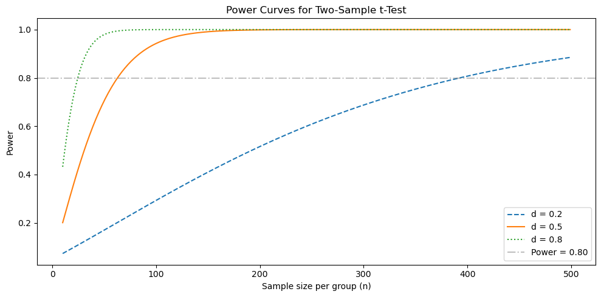
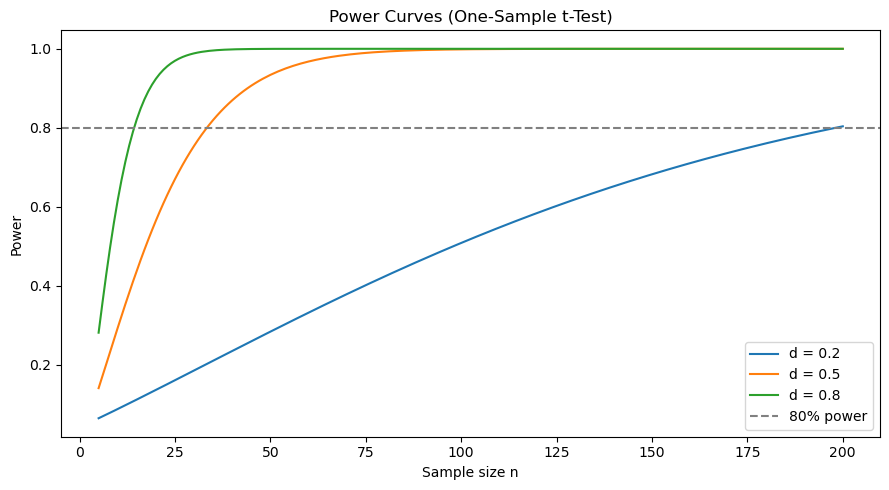

# 검정력 분석과 표본크기

## 개요

검정력 분석은 의미 있는 효과를 지정된 확률로 탐지하는 데 필요한 표본크기를 정한다. 검정의 **검정력**은 $1-\beta$이며, 여기서 $\beta$는 제2종 오류(거짓인 귀무가설을 기각하지 못함)의 확률이다. 잘 설계된 연구는 유의수준 $\alpha$, 원하는 검정력, 관심 있는 최소 효과크기의 균형을 잡아 필요한 관측값 수를 계산한다.

## 핵심 공식

**이표본 t-검정**(집단 크기가 같고 $\sigma$를 아는 경우)에서 집단당 표본크기 $n$일 때 근사적인 검정력은

$$
\text{Power} = 1 - \mathcal{N}\!\left(z_{\alpha/2} - \frac{\delta}{\sigma\sqrt{2/n}}\right) + \mathcal{N}\!\left(-z_{\alpha/2} - \frac{\delta}{\sigma\sqrt{2/n}}\right),
$$

여기서 $\delta = \mu_1 - \mu_2$는 참 차이이고 $\mathcal{N}$은 표준정규 누적분포함수이다.

검정력 $1-\beta$를 달성하는 데 필요한 집단당 표본크기는

$$
n = \frac{2\,(z_{\alpha/2} + z_\beta)^2\,\sigma^2}{\delta^2}.
$$

$\bar{p} = (p_1+p_2)/2$로 $p_1$과 $p_2$를 비교하는 **두 비율 z-검정**에서는:

$$
n = \frac{\left(z_{\alpha/2}\sqrt{2\bar{p}(1-\bar{p})} + z_\beta\sqrt{p_1(1-p_1)+p_2(1-p_2)}\right)^2}{(p_1 - p_2)^2}.
$$

## 코드

### 이표본 t-검정의 검정력

```python
import numpy as np
from scipy import stats

def power_ttest(n, delta, sigma=1.0, alpha=0.05):
    """양측 이표본 t-검정의 검정력 (정규근사)."""
    # 두 집단의 차이라 분산이 두 번 들어간다. 그래서 sqrt(2/n)이다.
    se = sigma * np.sqrt(2 / n)
    z_crit = stats.norm.ppf(1 - alpha / 2)
    z_effect = delta / se
    # 두 꼬리를 모두 세는 것이 정확하다. 두 번째 항은 참 효과가 양수인데도
    # 통계량이 반대쪽 꼬리로 넘어가 기각되는 경우이며, 보통 무시할 만큼 작다.
    power = (1 - stats.norm.cdf(z_crit - z_effect)
             + stats.norm.cdf(-z_crit - z_effect))
    return power

for n in [20, 50, 100]:
    print(f"n={n:>4} per group: power = {power_ttest(n, delta=0.5):.4f}")
```

출력:

```
n=  20 per group: power = 0.3526
n=  50 per group: power = 0.7054
n= 100 per group: power = 0.9424
```

$d = 0.5$에서 집단당 20명이면 검정력이 0.35에 불과하다. 실제로 효과가 있어도 세 번 중 두 번은 놓친다. 이 값이 정규근사라 $t$-분포를 쓰는 statsmodels의 결과보다 조금 낙관적이라는 점도 염두에 두라. 실제 검정력은 이보다 약간 낮다.

### 필요한 표본크기

```python
def sample_size_ttest(delta, sigma=1.0, alpha=0.05, power=0.80):
    """이표본 t-검정의 집단당 최소 표본크기."""
    z_alpha = stats.norm.ppf(1 - alpha / 2)
    z_beta = stats.norm.ppf(power)
    # 앞의 계수 2가 "두 집단"의 대가다. 일표본 공식과 여기서 갈린다.
    n = 2 * ((z_alpha + z_beta) * sigma / delta) ** 2
    return int(np.ceil(n))

def sample_size_proportion(p1, p2, alpha=0.05, power=0.80):
    """이표본 비율검정의 집단당 최소 표본크기."""
    p_bar = (p1 + p2) / 2
    z_alpha = stats.norm.ppf(1 - alpha / 2)
    z_beta = stats.norm.ppf(power)
    # 두 항의 제곱근 안이 서로 다르다는 점이 핵심이다.
    #   z_alpha 쪽: H0("두 비율이 같다") 아래의 분산이므로 합동비율 p_bar를 쓴다.
    #   z_beta  쪽: H1 아래의 분산이므로 p1과 p2를 각각 쓴다.
    # 검정력 계산은 두 가설 아래의 분포를 동시에 다루므로 이렇게 섞인다.
    numer = (z_alpha * np.sqrt(2 * p_bar * (1 - p_bar))
             + z_beta * np.sqrt(p1 * (1 - p1) + p2 * (1 - p2))) ** 2
    n = numer / (p1 - p2) ** 2
    return int(np.ceil(n))
```

### 계산 예시

```python
# 이표본 t-검정: 중간 크기 효과 (Cohen's d = 0.5)
delta = 0.5
n_req = sample_size_ttest(delta, sigma=1.0, alpha=0.05, power=0.80)
print(f"Required n per group: {n_req}")

# 비율 검정 (A/B 검정): 전환율 1.10% -> 1.21%, 즉 10% 상대 개선
p1, p2 = 0.0121, 0.011
n_prop = sample_size_proportion(p1, p2, alpha=0.05, power=0.80)
print(f"Required n per group: {n_prop:,}")
```

출력:

```
Required n per group: 63
Required n per group: 148,111
```

두 줄의 차이가 2,000배가 넘는다. 비율 쪽이 이렇게 커지는 이유는 두 가지가 겹쳐서다. 절대차가 0.0011로 아주 작고, 기저율 1.1%가 낮아 신호 대비 잡음이 나쁘다. 전환율을 10% 상대 개선하는 실험을 하려면 집단당 15만 명, 합쳐서 30만 명의 방문자가 필요하다는 뜻이다.

### 검정력 곡선

```python
import matplotlib.pyplot as plt

ns = np.arange(10, 500)
fig, ax = plt.subplots(figsize=(10, 5))
for d, ls in [(0.2, '--'), (0.5, '-'), (0.8, ':')]:
    powers = [power_ttest(n, d) for n in ns]
    ax.plot(ns, powers, ls, label=f'd = {d}')

ax.axhline(0.80, color='grey', linestyle='-.', alpha=0.5, label='Power = 0.80')
ax.set_xlabel('Sample size per group (n)')
ax.set_ylabel('Power')
ax.set_title('Power Curves for Two-Sample t-Test')
ax.legend()
plt.tight_layout()
plt.show()
```



세 곡선이 회색 기준선(검정력 0.80)을 지나는 지점이 각 효과크기에 필요한 표본크기다. $d = 0.8$은 26 언저리에서, $d = 0.5$는 63에서, $d = 0.2$는 그래프 오른쪽 끝 근처인 393에서 지난다.

곡선의 모양도 읽어 둘 만하다. 검정력 0.9를 넘어서면 곡선이 거의 평평해진다. 그 구간에서는 표본을 더 모아도 얻는 것이 거의 없다. 반대로 $d = 0.2$ 곡선의 왼쪽 절반처럼 가파른 구간에서는 표본을 조금만 늘려도 검정력이 크게 오른다.

### 해석

- **작은 효과**($d=0.2$)는 검정력 80%를 달성하는 데 집단당 수백 명이 필요하다.
- **중간 효과**($d=0.5$)는 집단당 약 64명이 필요하다.
- **큰 효과**($d=0.8$)는 집단당 약 26명이면 된다.
- 비율 검정에서는 차이 $|p_1-p_2|$가 아주 작으면 수만 개의 관측값이 필요할 수 있다.

## 연습문제

<div class="drillbox" markdown>

**연습문제 1.** 어떤 연구자가 $\alpha=0.01$에서 두 집단 사이의 $\delta=0.3$ 표준편차만큼의 차이를 검정력 90%로 탐지하려 한다. 집단당 몇 명이 필요한가?

</div>

??? success "풀이"

    표본크기 공식을 쓴다:

    $$
    n = \frac{2(z_{\alpha/2} + z_\beta)^2}{\delta^2}.
    $$

    여기서 $z_{0.005} = 2.576$, $z_{0.10} = 1.282$, $\delta = 0.3$이므로:

    $$
    n = \frac{2(2.576 + 1.282)^2}{0.3^2} = \frac{2(3.858)^2}{0.09} = \frac{2 \times 14.884}{0.09} = \frac{29.768}{0.09} \approx 331.
    $$

    연구자에게는 집단당 적어도 331명이 필요하다. $\square$

<div class="drillbox" markdown>

**연습문제 2.** ($\sigma$를 아는) 양측 일표본 z-검정에서 $\mu = \mu_0 + \delta$를 탐지하는 검정력을 다음과 같이 쓸 수 있음을 보여라.

$$
1 - \beta = \mathcal{N}\!\left(\frac{\delta\sqrt{n}}{\sigma} - z_{\alpha/2}\right) + \mathcal{N}\!\left(-\frac{\delta\sqrt{n}}{\sigma} - z_{\alpha/2}\right).
$$

</div>

??? success "풀이"

    $H_1\colon \mu = \mu_0 + \delta$ 아래에서 검정통계량 $Z = (\bar{X}-\mu_0)/(\sigma/\sqrt{n})$은 $N(\delta\sqrt{n}/\sigma,\,1)$을 따른다. $\lambda = \delta\sqrt{n}/\sigma$라 하자. 이 검정은 $|Z| > z_{\alpha/2}$일 때 기각하므로

    $$
    1 - \beta = P(Z > z_{\alpha/2}) + P(Z < -z_{\alpha/2}).
    $$

    $Z \sim N(\lambda, 1)$이므로:

    $$
    P(Z > z_{\alpha/2}) = P(Z - \lambda > z_{\alpha/2} - \lambda) = \mathcal{N}(\lambda - z_{\alpha/2}),
    $$

    $$
    P(Z < -z_{\alpha/2}) = P(Z - \lambda < -z_{\alpha/2} - \lambda) = \mathcal{N}(-z_{\alpha/2} - \lambda).
    $$

    둘을 더하면 원하는 결과를 얻는다. $\square$

<div class="drillbox" markdown>

**연습문제 3.** 어떤 A/B 검정이 전환율 $p_1 = 0.05$와 $p_2 = 0.04$를 비교한다. $\alpha = 0.05$에서 검정력 80%를 위한 집단당 표본크기를 계산하라.

</div>

??? success "풀이"

    $\bar{p} = (0.05 + 0.04)/2 = 0.045$, $z_{0.025}=1.96$, $z_{0.20}=0.842$이므로:

    $$
    n = \frac{\left(1.96\sqrt{2(0.045)(0.955)} + 0.842\sqrt{0.05(0.95) + 0.04(0.96)}\right)^2}{(0.05 - 0.04)^2}.
    $$

    각 부분을 계산하면 $2(0.045)(0.955) = 0.08595$이므로 $\sqrt{0.08595} \approx 0.2932$이다. 또 $0.0475 + 0.0384 = 0.0859$이므로 $\sqrt{0.0859}\approx 0.2931$이다.

    $$
    n = \frac{(1.96 \times 0.2932 + 0.842 \times 0.2931)^2}{0.0001} = \frac{(0.5747 + 0.2468)^2}{0.0001} = \frac{0.6749}{0.0001} \approx 6749.
    $$

    집단당 약 6749명이 필요하다. $\square$

<div class="drillbox" markdown>

**연습문제 4.** Python으로 $\alpha = 0.05$에서 Cohen의 $d \in \{0.2, 0.5, 0.8\}$에 대해 일표본 t-검정의 검정력을 $n$(5부터 200까지)의 함수로 그려라. `statsmodels.stats.power.TTestPower`를 쓰라.

</div>

??? success "풀이"

    ```python
    import numpy as np
    import matplotlib.pyplot as plt
    from statsmodels.stats.power import TTestPower

    analysis = TTestPower()
    ns = np.arange(5, 201)

    fig, ax = plt.subplots(figsize=(9, 5))
    for d in [0.2, 0.5, 0.8]:
        powers = [analysis.power(effect_size=d, nobs=n, alpha=0.05) for n in ns]
        ax.plot(ns, powers, label=f'd = {d}')

    ax.axhline(0.80, color='grey', linestyle='--', label='80% power')
    ax.set_xlabel('Sample size n')
    ax.set_ylabel('Power')
    ax.set_title('Power Curves (One-Sample t-Test)')
    ax.legend()
    plt.tight_layout()
    plt.show()
    ```

    

    효과크기가 클수록 필요한 피험자가 적고, 곡선이 S자 모양으로 올라간다. 가파른 구간과 평평한 구간의 경계가 대략 검정력 0.9 근처다.

    앞의 이표본 곡선과 비교해 보라. 같은 $d$에서 일표본 쪽이 훨씬 왼쪽에 있다. $d = 0.5$에 일표본은 34명, 이표본은 집단당 64명(합계 128명)이 필요하다. 대응설계로 이표본 문제를 일표본 문제로 바꿀 수 있다면 그만큼 큰 이득이다. $\square$

<div class="drillbox" markdown>

**연습문제 5.** 유의수준 $\alpha$와 효과크기 $\delta > 0$이 고정되어 있을 때 $n \to \infty$이면 이표본 z-검정의 검정력이 1에 다가감을 증명하라.

</div>

??? success "풀이"

    검정력은

    $$
    1 - \beta = \mathcal{N}\!\left(\frac{\delta}{\sigma\sqrt{2/n}} - z_{\alpha/2}\right) + \mathcal{N}\!\left(-\frac{\delta}{\sigma\sqrt{2/n}} - z_{\alpha/2}\right).
    $$

    $n \to \infty$이면 항 $\delta / (\sigma\sqrt{2/n}) = \delta\sqrt{n}/({\sigma\sqrt{2}}) \to \infty$이다. 따라서:

    - 첫째 항: $\mathcal{N}(\infty - z_{\alpha/2}) = \mathcal{N}(\infty) = 1$.
    - 둘째 항: $\mathcal{N}(-\infty - z_{\alpha/2}) = \mathcal{N}(-\infty) = 0$.

    그러므로 $1-\beta \to 1$이다. 자료가 충분하면 0이 아닌 어떤 고정된 효과도 결국 탐지됨을 확인해 준다. $\square$

---

## 정리하며

검정력 분석은 **설계 단계의 도구**다.

- **네 양이 서로 묶여 있다.** $\alpha$, 검정력 $1-\beta$, 효과크기 $\delta/\sigma$, 표본크기 $n$. **셋을 정하면 나머지 하나가 정해진다.**
- **표본크기 계산이 가장 흔한 용도다.** $\alpha=0.05$, 검정력 $0.80$ 을 정하고 의미 있는 최소 효과를 넣어 $n$ 을 푼다.
- **$n$ 이 효과크기의 제곱에 반비례한다.** 효과가 절반이면 표본은 네 배다. 작은 효과를 찾는 연구가 왜 대규모여야 하는지가 여기서 나온다.
- **가장 어려운 입력은 통계가 아니다.** "의미 있는 최소 효과"는 분야 지식이 정하며, 이 값 없이는 계산 자체가 불가능하다.
- **검정력 곡선을 그려 보는 것이 낫다.** 하나의 $n$ 을 고르기보다, 효과크기에 따라 검정력이 어떻게 변하는지 보면 설계의 여유를 판단할 수 있다.

다음 절 **제1종/제2종 오류의 시각화**에서 이 관계를 그림으로 확인한다.
