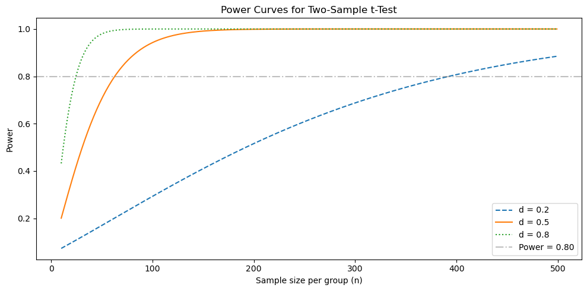
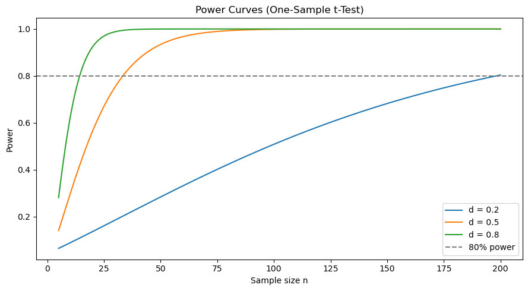

# 검정력 분석과 표본크기

## 개요

검정력 분석은 의미 있는 효과를 지정된 확률로 탐지하는 데 필요한 표본크기를 정한다. 검정의 **검정력**은 $1-\beta$이며, 여기서 $\beta$는 제2종 오류(거짓인 귀무가설을 기각하지 못함)의 확률이다. 잘 설계된 연구는 유의수준 $\alpha$, 원하는 검정력, 관심 있는 최소 효과크기의 균형을 잡아 필요한 관측값 수를 계산한다.

---

## 1. 핵심 공식

**이표본 t-검정**(집단 크기가 같고 $\sigma$를 아는 경우)에서 집단당 표본크기 $n$일 때 근사적인 검정력은

$$
\text{Power} = 1 - \mathcal{N}\!\left(z_{\alpha/2} - \frac{\delta}{\sigma\sqrt{2/n}}\right) + \mathcal{N}\!\left(-z_{\alpha/2} - \frac{\delta}{\sigma\sqrt{2/n}}\right),
$$

여기서 $\delta = \mu_1 - \mu_2$는 참 차이이고 $\mathcal{N}$은 표준정규 누적분포함수이다.

검정력 $1-\beta$를 달성하는 데 필요한 집단당 표본크기는

$$
n = \frac{2\,(z_{\alpha/2} + z_\beta)^2\,\sigma^2}{\delta^2}.
$$

$\bar{p} = (p_1+p_2)/2$로 $p_1$과 $p_2$를 비교하는 **두 비율 z-검정**에서는:

$$
n = \frac{\left(z_{\alpha/2}\sqrt{2\bar{p}(1-\bar{p})} + z_\beta\sqrt{p_1(1-p_1)+p_2(1-p_2)}\right)^2}{(p_1 - p_2)^2}.
$$

### 이표본 t-검정의 검정력

<div class="exbox" markdown>

**보기 1.** <span class="diff easy" title="쉬움"></span> 이표본 t-검정의 검정력 함수. 집단당 $n$명씩 두 집단을 $\alpha = 0.05$ 양측으로 견준다. $d = \delta/\sigma = 0.5$다.

**(1)** 위 검정력 식의 **두 항**이 각각 무엇을 세는지 밝히고, $n = 20,\ 50,\ 100$에서 두 항의 값을 따로 구하시오. 둘째 항은 얼마나 큰가.

**(2)** 이 식은 정규근사다. `statsmodels`의 비중심 $t$ 답과 견주어 어긋남이 $n$에 따라 어떻게 변하는지 보시오.

</div>

??? success "풀이"

    **(1) 해석적으로.** 기각 조건은 $\lvert Z \rvert > z_{\alpha/2}$이고, $H_1$ 아래에서

    $$
    Z \sim N\!\left(\frac{\delta}{\sigma\sqrt{2/n}},\, 1\right)
    $$

    이다. 비중심모수를 $\lambda = \delta/(\sigma\sqrt{2/n}) = d\sqrt{n/2}$라 쓰면 검정력은 **두 꼬리의 합**이다.

    $$
    1-\beta = \underbrace{P(Z > z_{\alpha/2})}_{\text{옳은 방향}} + \underbrace{P(Z < -z_{\alpha/2})}_{\text{반대 방향}}
    = \Phi(\lambda - z_{\alpha/2}) + \Phi(-z_{\alpha/2} - \lambda)
    $$

    첫째 항은 참 효과가 양수이고 통계량도 오른쪽 꼬리로 나가 기각되는, **제대로 된** 기각이다. 둘째 항은 참 효과가 양수인데도 표본이 거꾸로 나와 **왼쪽** 꼬리에서 기각되는 경우다. 기각은 기각이지만 효과의 방향을 반대로 보고하게 되므로 반가운 일이 아니다.

    $d = 0.5$에서 $\lambda = 0.5\sqrt{n/2}$이므로

    | $n$ | $\lambda$ | 첫째 항 | 둘째 항 |
    |---|---|---|---|
    | 20 | 1.581139 | $\Phi(-0.378825) = 0.352409$ | $\Phi(-3.541103) = 0.000199$ |
    | 50 | 2.500000 | $\Phi(0.540036) = 0.705414$ | $\Phi(-4.459964) = 0.0000041$ |
    | 100 | 3.535534 | $\Phi(1.575570) = 0.942438$ | $\Phi(-5.495498) = 2\times10^{-8}$ |

    **둘째 항은 $n = 20$에서도 전체의 $0.06\%$뿐이고 $n$이 커지면 자릿수로 사라진다.** 효과가 뚜렷할수록 표본이 거꾸로 나올 일이 없기 때문이다. 그래도 식에 넣어 두는 것이 옳다. $\lambda$가 0에 가까우면 두 항이 비슷해지고, $\lambda = 0$에서는 둘을 합쳐야 정확히 $\alpha$가 된다.

    **(2) 수치적으로.**

    ```python
    import numpy as np
    from scipy import stats

    def power_ttest(n, delta, sigma=1.0, alpha=0.05):
        """양측 이표본 t-검정의 검정력 (정규근사)."""
        # 두 집단의 차이라 분산이 두 번 들어간다. 그래서 sqrt(2/n)이다.
        se = sigma * np.sqrt(2 / n)
        z_crit = stats.norm.ppf(1 - alpha / 2)
        z_effect = delta / se
        # 두 꼬리를 모두 세는 것이 정확하다. 두 번째 항은 참 효과가 양수인데도
        # 통계량이 반대쪽 꼬리로 넘어가 기각되는 경우이며, 보통 무시할 만큼 작다.
        power = (1 - stats.norm.cdf(z_crit - z_effect)
                 + stats.norm.cdf(-z_crit - z_effect))
        return power

    for n in [20, 50, 100]:
        print(f"n={n:>4} per group: power = {power_ttest(n, delta=0.5):.4f}")

    # (1) 두 항을 따로 본다.
    from statsmodels.stats.power import TTestIndPower
    zc = stats.norm.ppf(0.975)
    print(f"\n{'n':>5} {'lambda':>9} {'첫째 항':>10} {'둘째 항':>11}"
          f" {'정규근사':>9} {'비중심 t':>9} {'차이':>8}")
    for n in (20, 50, 100):
        lam = 0.5 * np.sqrt(n / 2)
        up, lo = stats.norm.sf(zc - lam), stats.norm.cdf(-zc - lam)
        nct = TTestIndPower().power(effect_size=0.5, nobs1=n, alpha=0.05,
                                    ratio=1.0, alternative='two-sided')
        print(f"{n:>5} {lam:>9.6f} {up:>10.6f} {lo:>11.3e}"
              f" {up + lo:>9.4f} {nct:>9.4f} {up + lo - nct:>+8.4f}")
    ```

    출력:

    ```
    n=  20 per group: power = 0.3526
    n=  50 per group: power = 0.7054
    n= 100 per group: power = 0.9424

        n    lambda       첫째 항        둘째 항      정규근사     비중심 t       차이
       20  1.581139   0.352409   1.992e-04    0.3526    0.3379  +0.0147
       50  2.500000   0.705414   4.099e-06    0.7054    0.6969  +0.0085
      100  3.535534   0.942438   1.948e-08    0.9424    0.9404  +0.0020
    ```

    (1)의 표가 그대로 재현된다. $\lambda$, 첫째 항, 둘째 항이 모두 맞고, 둘째 항은 $n = 100$에서 $2\times10^{-8}$까지 떨어진다.

    **정규근사는 언제나 낙관적이다.** 차이가 $+0.0147$, $+0.0085$, $+0.0020$으로 모두 양수이고 $n$이 커지면 줄어든다. $\sigma$를 모른다는 대가가 자유도가 커질수록 작아지기 때문이다. 그러므로 **이 페이지의 수는 모두 약간 낙관적인 값**으로 읽어야 한다.

    $d = 0.5$에서 집단당 20명이면 검정력이 $0.35$(정확히는 $0.34$)에 불과하다. 실제로 효과가 있어도 **세 번 중 두 번은 놓친다.** 이런 설계로 "유의하지 않았다"는 결론을 내는 것은 거의 아무 정보도 주지 못한다.

### 필요한 표본크기

<div class="exbox" markdown>

**보기 2.** <span class="diff easy" title="쉬움"></span> 필요한 표본크기 함수. 비율검정의 표본크기 공식에는 제곱근이 **둘** 나오는데 그 안이 서로 다르다. 한쪽은 합동비율 $\bar p$를, 다른 쪽은 $p_1$과 $p_2$를 따로 쓴다.

**(1)** 이 공식을 유도해 두 제곱근이 어디서 오는지 밝히시오.

**(2)** 둘을 구별하지 않고 한 가지로 통일하면 답이 얼마나 달라지는가. $p_1 = 0.0121,\ p_2 = 0.011$과 $p_1 = 0.6,\ p_2 = 0.3$ 두 경우에서 재어 보시오.

</div>

??? success "풀이"

    **(1) 해석적으로.** 검정통계량은 $H_0$ 아래의 표준오차로 나눈 것이다.

    $$
    Z = \frac{\hat p_1 - \hat p_2}{\sqrt{2\bar p(1-\bar p)/n}},
    \qquad \text{기각 조건} \quad \lvert Z \rvert > z_{\alpha/2}
    $$

    이 조건을 원 척도로 옮기면 $\lvert \hat p_1 - \hat p_2 \rvert > z_{\alpha/2}\sqrt{2\bar p(1-\bar p)/n}$다. **이것이 첫째 제곱근의 출처다.** 기각 문턱은 "$H_0$이 참이라면"이라는 가정 아래에서 정해지므로 $\bar p$를 쓴다.

    이제 $H_1$ 아래에서 이 사건의 확률을 잰다. $\hat p_1 - \hat p_2$는 평균이 $\delta = p_1 - p_2$이고 표준편차가

    $$
    \sqrt{\frac{p_1(1-p_1) + p_2(1-p_2)}{n}}
    $$

    인 근사 정규다. **이것이 둘째 제곱근의 출처다.** 이번에는 참 비율이 $p_1, p_2$라고 **가정하고** 있으므로 각각을 따로 쓴다. $\delta > 0$일 때 왼쪽 꼬리를 버리면

    $$
    1-\beta \approx \Phi\!\left(
    \frac{\delta\sqrt n - z_{\alpha/2}\sqrt{2\bar p(1-\bar p)}}
    {\sqrt{p_1(1-p_1)+p_2(1-p_2)}}\right)
    $$

    이고, 이것을 $1-\beta$와 같다고 놓으면 괄호 안이 $z_\beta$가 되어

    $$
    \delta\sqrt n = z_{\alpha/2}\sqrt{2\bar p(1-\bar p)} + z_\beta\sqrt{p_1(1-p_1)+p_2(1-p_2)}
    $$

    이다. 양변을 제곱해 $\delta^2$으로 나누면 본문의 공식이다. **$z_{\alpha/2}$에는 $H_0$의 분산이, $z_\beta$에는 $H_1$의 분산이 붙는다**는 것이 요점이고, 검정력 계산이 두 가설 아래의 분포를 동시에 다루기 때문에 이렇게 섞인다.

    **(2) 수치적으로.**

    ```python
    def sample_size_ttest(delta, sigma=1.0, alpha=0.05, power=0.80):
        """이표본 t-검정의 집단당 최소 표본크기."""
        z_alpha = stats.norm.ppf(1 - alpha / 2)
        z_beta = stats.norm.ppf(power)
        # 앞의 계수 2가 "두 집단"의 대가다. 일표본 공식과 여기서 갈린다.
        n = 2 * ((z_alpha + z_beta) * sigma / delta) ** 2
        return int(np.ceil(n))

    def sample_size_proportion(p1, p2, alpha=0.05, power=0.80):
        """이표본 비율검정의 집단당 최소 표본크기."""
        p_bar = (p1 + p2) / 2
        z_alpha = stats.norm.ppf(1 - alpha / 2)
        z_beta = stats.norm.ppf(power)
        # 두 항의 제곱근 안이 서로 다르다는 점이 핵심이다.
        #   z_alpha 쪽: H0("두 비율이 같다") 아래의 분산이므로 합동비율 p_bar를 쓴다.
        #   z_beta  쪽: H1 아래의 분산이므로 p1과 p2를 각각 쓴다.
        # 검정력 계산은 두 가설 아래의 분포를 동시에 다루므로 이렇게 섞인다.
        numer = (z_alpha * np.sqrt(2 * p_bar * (1 - p_bar))
                 + z_beta * np.sqrt(p1 * (1 - p1) + p2 * (1 - p2))) ** 2
        n = numer / (p1 - p2) ** 2
        return int(np.ceil(n))

    # (2) 두 제곱근을 하나로 통일하면 어떻게 되는가.
    za, zb = stats.norm.ppf(0.975), stats.norm.ppf(0.80)
    for p1, p2 in [(0.0121, 0.011), (0.6, 0.3)]:
        pb = (p1 + p2) / 2
        s0 = np.sqrt(2 * pb * (1 - pb))                   # H0 아래
        s1 = np.sqrt(p1 * (1 - p1) + p2 * (1 - p2))       # H1 아래
        ok = (za * s0 + zb * s1) ** 2 / (p1 - p2) ** 2
        only0 = ((za + zb) * s0) ** 2 / (p1 - p2) ** 2
        only1 = ((za + zb) * s1) ** 2 / (p1 - p2) ** 2
        print(f"p1={p1}, p2={p2}:  s0={s0:.6f}  s1={s1:.6f}  s0/s1={s0 / s1:.4f}")
        print(f"   옳은 식 {ok:>12.3f}   s0 만 {only0:>12.3f}"
              f"   s1 만 {only1:>12.3f}")
        print(f"   옳은 n 에서의 검정력 "
              f"{stats.norm.sf((za * s0 - (p1 - p2) * np.sqrt(np.ceil(ok))) / s1):.4f}")
    ```

    출력:

    ```
    p1=0.0121, p2=0.011:  s0=0.151107  s1=0.151105  s0/s1=1.0000
       옳은 식   148110.393   s0 만   148111.571   s1 만   148107.647
       옳은 n 에서의 검정력 0.8000
    p1=0.6, p2=0.3:  s0=0.703562  s1=0.670820  s0/s1=1.0488
       옳은 식       41.970   s0 만       43.169   s1 만       39.244
       옳은 n 에서의 검정력 0.8003
    ```

    (1)의 식이 목표 검정력 $0.80$을 정확히 돌려준다. 두 경우 모두 올림한 $n$에서 $0.8000$과 $0.8003$이다.

    **두 제곱근의 차이는 $p_1$과 $p_2$가 얼마나 벌어져 있느냐에 달려 있다.** 첫째 경우는 $0.0121$과 $0.011$이 거의 같아 $s_0/s_1 = 1.0000$이고, 어느 쪽으로 통일하든 $148{,}111$ 대 $148{,}112$ 대 $148{,}108$로 **0.003% 차이**다. 사실상 구별할 필요가 없다.

    둘째 경우는 $0.6$과 $0.3$이 멀어 $s_0/s_1 = 1.0488$이다. $s_0$으로 통일하면 $43.17 \to 44$로 **5% 크게**, $s_1$로 통일하면 $39.24 \to 40$으로 **6% 작게** 나온다. 올림하면 42명 대신 44명 또는 40명이다. 큰 차이는 아니지만 **$s_1$로 통일하는 쪽은 표본이 모자라게 되므로** 위험하다.

    왜 $s_0 > s_1$인가. $\bar p$는 $p_1$과 $p_2$의 중점이고 $p(1-p)$가 $p = 1/2$에서 최대인 **오목함수**이므로, 옌센 부등식에 의해 $\bar p(1-\bar p) \ge \{p_1(1-p_1)+p_2(1-p_2)\}/2$다. 양변에 2를 곱하면 $s_0^2 \ge s_1^2$이고 등호는 $p_1 = p_2$일 때만이다. **$H_0$ 아래의 분산이 언제나 더 크다.**

### 계산 예시

<div class="exbox" markdown>

**보기 3.** <span class="diff easy" title="쉬움"></span> 계산 예. 두 설계의 표본크기를 재어 견준다. 하나는 $d = 0.5$인 이표본 $t$ 검정, 다른 하나는 전환율을 $1.10\%$에서 $1.21\%$로(상대 $10\%$ 개선) 올리는 A/B 검정이다.

**(1)** 두 값을 보기 2의 공식으로 손으로 구하시오.

**(2)** 둘의 비가 왜 그렇게 큰지, 비율 쪽의 **유효 효과크기**를 $d_{\text{eff}} = (p_1-p_2)/\sqrt{\bar p(1-\bar p)}$로 정의해 설명하시오.

</div>

??? success "풀이"

    **(1) 해석적으로.** $t$ 검정 쪽은 $z_{0.025} + z_{0.20} = 2.801585$이므로

    $$
    n = 2\left(\frac{2.801585}{0.5}\right)^2 = 2 \times 31.3955 = 62.791 \;\rightarrow\; 63
    $$

    이다. 비율 쪽은 $\bar p = (0.0121+0.011)/2 = 0.01155$이므로

    $$
    \sqrt{2\bar p(1-\bar p)} = \sqrt{2 \times 0.01155 \times 0.98845} = 0.151107
    $$

    $$
    \sqrt{p_1(1-p_1)+p_2(1-p_2)} = \sqrt{0.0121 \times 0.9879 + 0.011 \times 0.989} = 0.151105
    $$

    이고 분자는

    $$
    (1.959964 \times 0.151107 + 0.841621 \times 0.151105)^2 = (0.296163 + 0.127173)^2 = 0.423336^2 = 0.179214
    $$

    다. $\delta = 0.0011$이므로 $\delta^2 = 1.21\times10^{-6}$이고

    $$
    n = \frac{0.179214}{1.21\times10^{-6}} = 148110.4 \;\rightarrow\; 148111
    $$

    이다.

    **(2) 해석적으로.** 비가 $148111/63 = 2351$배다. 이 수가 어디서 오는지 보려면 비율 문제를 **같은 척도의 $d$로** 바꿔 읽으면 된다. 비율의 "표준편차"는 $\sqrt{\bar p(1-\bar p)}$이므로

    $$
    d_{\text{eff}} = \frac{p_1 - p_2}{\sqrt{\bar p(1-\bar p)}}
    = \frac{0.0011}{\sqrt{0.01155 \times 0.98845}}
    = \frac{0.0011}{0.106849} = 0.010295
    $$

    다. $t$ 검정의 $d = 0.5$에 견주면 **48.6분의 1**이고, $n \propto d^{-2}$이므로

    $$
    \left(\frac{0.5}{0.010295}\right)^2 = 48.567^2 = 2358.8
    $$

    배가 예측된다. 실제 비 $2351$과 $0.3\%$ 안에서 맞는다(차이는 두 제곱근이 꼭 같지는 않아서다).

    **$d_{\text{eff}}$가 작은 까닭 둘.** 분자 $0.0011$이 작은 것이 하나고, 분모 $\sqrt{\bar p(1-\bar p)} = 0.1068$이 그에 비해 큰 것이 또 하나다. 기저율이 $1.1\%$로 낮으면 $\sqrt{p(1-p)} \approx \sqrt p$라 **상대 개선 $10\%$가 표준편차 단위로는 $1\%$밖에 안 된다.** 상대 개선이 같아도 기저율이 낮을수록 손해다.

    **수치적으로.**

    ```python
    # 이표본 t-검정: 중간 크기 효과 (Cohen's d = 0.5)
    delta = 0.5
    n_req = sample_size_ttest(delta, sigma=1.0, alpha=0.05, power=0.80)
    print(f"Required n per group: {n_req}")

    # 비율 검정 (A/B 검정): 전환율 1.10% -> 1.21%, 즉 10% 상대 개선
    p1, p2 = 0.0121, 0.011
    n_prop = sample_size_proportion(p1, p2, alpha=0.05, power=0.80)
    print(f"Required n per group: {n_prop:,}")

    # (2) 유효 효과크기로 읽어 본다.
    pb = (p1 + p2) / 2
    d_eff = (p1 - p2) / np.sqrt(pb * (1 - pb))
    print(f"\n유효 효과크기 d_eff = {d_eff:.6f}"
          f"   (t 검정의 d = 0.5 의 1/{0.5 / d_eff:.1f})")
    print(f"d_eff 로 예측한 n   = {2 * ((za + zb) / d_eff) ** 2:>12.1f}")
    print(f"공식이 준 n         = {n_prop:>12,}")
    print(f"비: 예측 {(0.5 / d_eff) ** 2:.1f}배   실제 {n_prop / n_req:.1f}배")
    print(f"\n필요한 방문자: 집단당 {n_prop:,}명,  합계 {2 * n_prop:,}명")
    ```

    출력:

    ```
    Required n per group: 63
    Required n per group: 148,111

    유효 효과크기 d_eff = 0.010295   (t 검정의 d = 0.5 의 1/48.6)
    d_eff 로 예측한 n   =     148111.6
    공식이 준 n         =      148,111
    비: 예측 2358.8배   실제 2351.0배

    필요한 방문자: 집단당 148,111명,  합계 296,222명
    ```

    (1)에서 손으로 구한 $62.791 \to 63$과 $148110.4 \to 148111$이 그대로 나왔다. (2)의 $d_{\text{eff}}$ 예측 $148111.6$은 공식의 $148111$과 **1 이내**로 맞는다.

    **두 줄의 차이가 2,351배다.** 전환율을 $10\%$ 상대 개선하는 실험을 하려면 집단당 약 15만 명, 합쳐서 **약 30만 명**의 방문자가 필요하다는 뜻이다. 목표를 상대 $50\%$ 개선($p_1 = 0.0165$)으로 잡으면 같은 공식이 집단당 $7{,}036$명을 주므로, 개선 폭을 5분의 1로 줄인 대가가 **21배**다. $n \propto \delta^{-2}$이 $5^2 = 25$배를 예측하는데 실제로는 그보다 조금 작은데, $p_1$이 달라지면 분자의 분산 항도 함께 움직이기 때문이다.

### 검정력 곡선

<div class="exbox" markdown>

**보기 4.** <span class="diff easy" title="쉬움"></span> 검정력 곡선. 보기 1의 `power_ttest`로 $d = 0.2,\ 0.5,\ 0.8$의 곡선을 집단당 $n = 10 \sim 499$에서 그린다.

**(1)** 세 곡선이 $0.80$ 기준선을 지나는 $n$을 보기 2의 공식으로 예측하시오.

**(2)** 곡선 위에서 그 자리를 **직접 찾아** 예측과 맞추고, 곡선이 평평해지는 구간을 수로 적으시오.

</div>

??? success "풀이"

    **(1) 해석적으로.** 보기 2의 식 $n = 2\left((z_{\alpha/2}+z_\beta)/d\right)^2$에 $z_{0.025}+z_{0.20} = 2.801585$를 넣으면

    $$
    n(0.2) = 2\left(\frac{2.801585}{0.2}\right)^2 = 392.444, \quad
    n(0.5) = 62.791, \quad
    n(0.8) = 24.528
    $$

    이다. 올림하면 $393$, $63$, $25$다.

    **(2) 수치적으로.** 격자 위에서 조건을 만족하는 **첫** $n$을 찾는다. 이때 조심할 것이 있다. 조건을 만족하는 칸이 하나도 없어도 `argmax` 류는 말없이 0번 칸을 돌려주므로, **답이 격자 안에 있는지부터 단언문으로 확인**해야 한다.

    ```python
    import matplotlib.pyplot as plt

    plt.rcParams["font.sans-serif"] = ["NanumGothic", "Apple SD Gothic Neo", "Malgun Gothic"]
    plt.rcParams["font.family"] = "sans-serif"
    plt.rcParams["axes.unicode_minus"] = False

    # 효과가 작을수록 같은 검정력에 필요한 표본이 가파르게 늘어난다.
    # d=0.2 곡선이 0.8 에 닿는 자리를 d=0.8 곡선의 그것과 견주어 보면 된다.
    ns = np.arange(10, 500)
    fig, ax = plt.subplots(figsize=(10, 5))
    for d, ls in [(0.2, '--'), (0.5, '-'), (0.8, ':')]:
        powers = [power_ttest(n, d) for n in ns]
        ax.plot(ns, powers, ls, label=f'd = {d}')

    ax.axhline(0.80, color='grey', linestyle='-.', alpha=0.5, label='Power = 0.80')
    ax.set_xlabel('Sample size per group (n)')
    ax.set_ylabel('Power')
    ax.set_title('Power Curves for Two-Sample t-Test')
    ax.legend()
    plt.tight_layout()
    plt.show()

    # (1) 의 예측과 곡선 위에서 찾은 자리를 맞춘다.
    print(f"{'d':>5} {'공식':>10} {'곡선':>6} {'그 n 의 검정력':>14} {'직전 n':>7}")
    for d in (0.2, 0.5, 0.8):
        pw = np.array([power_ttest(n, d) for n in ns])
        hit = np.flatnonzero(pw >= 0.80)
        # **조건을 만족하는 칸이 있는지 먼저 확인한다.** 없으면 아래 인덱싱이
        # 조용히 엉뚱한 답을 주는 대신 여기서 멈춘다.
        assert hit.size > 0, f"d={d} 는 격자 안에서 0.80 에 닿지 않는다"
        k = hit[0]
        print(f"{d:>5.1f} {2 * ((za + zb) / d) ** 2:>10.3f} {ns[k]:>6}"
              f" {pw[k]:>14.4f} {pw[k - 1]:>7.4f}")

    # 평평해지는 구간: d = 0.5 에서 검정력을 더 올리는 값.
    print()
    for target, zq in ((0.80, zb), (0.90, stats.norm.ppf(0.90)),
                       (0.95, stats.norm.ppf(0.95))):
        n = 2 * ((za + zq) / 0.5) ** 2
        print(f"  d=0.5, 검정력 {target:.2f}: n = {n:7.2f}"
              f" -> {int(np.ceil(n)):>3}  (실제 {power_ttest(int(np.ceil(n)), 0.5):.4f})")
    print(f"  d=0.2 는 격자 끝 n=499 에서도 {power_ttest(499, 0.2):.4f} 까지만 간다")
    ```

    출력:

    ```
        d         공식     곡선      그 n 의 검정력    직전 n
      0.2    392.444    393         0.8006  0.7996
      0.5     62.791     63         0.8013  0.7950
      0.8     24.528     25         0.8074  0.7914

      d=0.5, 검정력 0.80: n =   62.79 ->  63  (실제 0.8013)
      d=0.5, 검정력 0.90: n =   84.06 ->  85  (실제 0.9031)
      d=0.5, 검정력 0.95: n =  103.96 -> 104  (실제 0.9501)
      d=0.2 는 격자 끝 n=499 에서도 0.8848 까지만 간다
    ```

    

    (1)의 예측 $392.444$, $62.791$, $24.528$을 올림한 $393$, $63$, $25$가 곡선 위에서 찾은 자리와 **정확히 같다.** 직전 $n$에서는 각각 $0.7996$, $0.7950$, $0.7914$로 모두 $0.80$에 못 미치므로 올림이 옳았다.

    세 곡선이 회색 기준선을 지나는 자리가 바로 이 세 값이다. $d = 0.8$ 곡선은 그림 왼쪽 끝에서 이미 치솟아 $n = 25$에서 넘고, $d = 0.5$는 $63$에서, $d = 0.2$는 그림 오른쪽 끝 가까운 $393$에서 넘는다. **효과크기가 4분의 1이면 표본은 16배**($393/25 = 15.7$)다. $n \propto d^{-2}$ 그대로다.

    **평평해지는 구간.** $d = 0.5$에서 검정력 $0.80$에 63명, $0.90$에 85명, $0.95$에 104명이다. 처음 $10$%p를 더 얻는 데 22명, 그다음 $5$%p에 19명이 든다. **단위 검정력당 비용이 두 배 넘게 뛴다.** 그림에서 $d = 0.8$ 곡선이 $n = 60$ 언저리부터 1에 붙어 눈으로 구별되지 않는 것도 같은 현상이다. 그 구간에서 표본을 더 모아도 얻는 것이 사실상 없다.

    반대로 $d = 0.2$ 곡선은 그림 전체에서 가파르다. 격자 끝 $n = 499$에서도 검정력이 $0.8848$에 그치므로, **이 그림만으로는 $d = 0.2$에서 검정력 $0.95$에 몇 명이 필요한지 알 수 없다.** 공식으로 계산하면 $649$명이고 그림 밖이다. 곡선 그림은 보이는 범위까지만 말해 준다.

### 해석

- **작은 효과**($d=0.2$)는 검정력 80%를 달성하는 데 집단당 수백 명이 필요하다.
- **중간 효과**($d=0.5$)는 집단당 약 64명이 필요하다.
- **큰 효과**($d=0.8$)는 집단당 약 26명이면 된다.
- 비율 검정에서는 차이 $|p_1-p_2|$가 아주 작으면 수만 개의 관측값이 필요할 수 있다.

---

## 연습문제

<div class="drillbox" markdown>

**연습문제 1.** <span class="diff easy" title="쉬움"></span> 어떤 연구자가 $\alpha=0.01$에서 두 집단 사이의 $\delta=0.3$ 표준편차만큼의 차이를 검정력 90%로 탐지하려 한다. 집단당 몇 명이 필요한가?

</div>

??? success "풀이"

    표본크기 공식을 쓴다:

    $$
    n = \frac{2(z_{\alpha/2} + z_\beta)^2}{\delta^2}.
    $$

    여기서 $z_{0.005} = 2.576$, $z_{0.10} = 1.282$, $\delta = 0.3$이므로:

    $$
    n = \frac{2(2.576 + 1.282)^2}{0.3^2} = \frac{2(3.858)^2}{0.09} = \frac{2 \times 14.884}{0.09} = \frac{29.768}{0.09} \approx 331.
    $$

    연구자에게는 집단당 적어도 331명이 필요하다. $\square$

---

<div class="drillbox" markdown>

**연습문제 2.** <span class="diff easy" title="쉬움"></span> 어떤 A/B 검정이 전환율 $p_1 = 0.05$와 $p_2 = 0.04$를 비교한다. $\alpha = 0.05$에서 검정력 80%를 위한 집단당 표본크기를 계산하라.

</div>

??? success "풀이"

    $\bar{p} = (0.05 + 0.04)/2 = 0.045$, $z_{0.025}=1.96$, $z_{0.20}=0.842$이므로:

    $$
    n = \frac{\left(1.96\sqrt{2(0.045)(0.955)} + 0.842\sqrt{0.05(0.95) + 0.04(0.96)}\right)^2}{(0.05 - 0.04)^2}.
    $$

    각 부분을 계산하면 $2(0.045)(0.955) = 0.08595$이므로 $\sqrt{0.08595} \approx 0.2932$이다. 또 $0.0475 + 0.0384 = 0.0859$이므로 $\sqrt{0.0859}\approx 0.2931$이다.

    $$
    n = \frac{(1.96 \times 0.2932 + 0.842 \times 0.2931)^2}{0.0001} = \frac{(0.5747 + 0.2468)^2}{0.0001} = \frac{0.6749}{0.0001} \approx 6749.
    $$

    집단당 약 6749명이 필요하다. $\square$

---

<div class="drillbox" markdown>

**연습문제 3.** <span class="diff med" title="중간"></span> ($\sigma$를 아는) 양측 일표본 z-검정에서 $\mu = \mu_0 + \delta$를 탐지하는 검정력을 다음과 같이 쓸 수 있음을 보여라.

$$
1 - \beta = \mathcal{N}\!\left(\frac{\delta\sqrt{n}}{\sigma} - z_{\alpha/2}\right) + \mathcal{N}\!\left(-\frac{\delta\sqrt{n}}{\sigma} - z_{\alpha/2}\right).
$$

</div>

??? success "풀이"

    $H_1\colon \mu = \mu_0 + \delta$ 아래에서 검정통계량 $Z = (\bar{X}-\mu_0)/(\sigma/\sqrt{n})$은 $N(\delta\sqrt{n}/\sigma,\,1)$을 따른다. $\lambda = \delta\sqrt{n}/\sigma$라 하자. 이 검정은 $|Z| > z_{\alpha/2}$일 때 기각하므로

    $$
    1 - \beta = P(Z > z_{\alpha/2}) + P(Z < -z_{\alpha/2}).
    $$

    $Z \sim N(\lambda, 1)$이므로:

    $$
    P(Z > z_{\alpha/2}) = P(Z - \lambda > z_{\alpha/2} - \lambda) = \mathcal{N}(\lambda - z_{\alpha/2}),
    $$

    $$
    P(Z < -z_{\alpha/2}) = P(Z - \lambda < -z_{\alpha/2} - \lambda) = \mathcal{N}(-z_{\alpha/2} - \lambda).
    $$

    둘을 더하면 원하는 결과를 얻는다. $\square$

---

<div class="drillbox" markdown>

**연습문제 4.** <span class="diff med" title="중간"></span> Python으로 $\alpha = 0.05$에서 Cohen의 $d \in \{0.2, 0.5, 0.8\}$에 대해 일표본 t-검정의 검정력을 $n$(5부터 200까지)의 함수로 그려라. `statsmodels.stats.power.TTestPower`를 쓰라.

</div>

??? success "풀이"

    ```python
    import numpy as np
    import matplotlib.pyplot as plt
    from statsmodels.stats.power import TTestPower

    analysis = TTestPower()
    ns = np.arange(5, 201)

    fig, ax = plt.subplots(figsize=(9, 5))
    for d in [0.2, 0.5, 0.8]:
        powers = [analysis.power(effect_size=d, nobs=n, alpha=0.05) for n in ns]
        ax.plot(ns, powers, label=f'd = {d}')

    ax.axhline(0.80, color='grey', linestyle='--', label='80% power')
    ax.set_xlabel('Sample size n')
    ax.set_ylabel('Power')
    ax.set_title('Power Curves (One-Sample t-Test)')
    ax.legend()
    plt.tight_layout()
    plt.show()
    ```

    

    효과크기가 클수록 필요한 피험자가 적고, 곡선이 S자 모양으로 올라간다. 가파른 구간과 평평한 구간의 경계가 대략 검정력 0.9 근처다.

    앞의 이표본 곡선과 비교해 보라. 같은 $d$에서 일표본 쪽이 훨씬 왼쪽에 있다. $d = 0.5$에 일표본은 34명, 이표본은 집단당 64명(합계 128명)이 필요하다. 대응설계로 이표본 문제를 일표본 문제로 바꿀 수 있다면 그만큼 큰 이득이다. $\square$

---

<div class="drillbox" markdown>

**연습문제 5.** <span class="diff med" title="중간"></span> 유의수준 $\alpha$와 효과크기 $\delta > 0$이 고정되어 있을 때 $n \to \infty$이면 이표본 z-검정의 검정력이 1에 다가감을 증명하라.

</div>

??? success "풀이"

    검정력은

    $$
    1 - \beta = \mathcal{N}\!\left(\frac{\delta}{\sigma\sqrt{2/n}} - z_{\alpha/2}\right) + \mathcal{N}\!\left(-\frac{\delta}{\sigma\sqrt{2/n}} - z_{\alpha/2}\right).
    $$

    $n \to \infty$이면 항 $\delta / (\sigma\sqrt{2/n}) = \delta\sqrt{n}/({\sigma\sqrt{2}}) \to \infty$이다. 따라서:

    - 첫째 항: $\mathcal{N}(\infty - z_{\alpha/2}) = \mathcal{N}(\infty) = 1$.
    - 둘째 항: $\mathcal{N}(-\infty - z_{\alpha/2}) = \mathcal{N}(-\infty) = 0$.

    그러므로 $1-\beta \to 1$이다. 자료가 충분하면 0이 아닌 어떤 고정된 효과도 결국 탐지됨을 확인해 준다. $\square$

---

<div class="drillbox" markdown>

**연습문제 6.** <span class="diff med" title="중간"></span>
**검정력함수**를 그리고, 모수가 $H_0$에서 멀어질수록 어떻게 변하는지 여러 설계에서 비교하라.

</div>

??? success "풀이"
    **검정력함수.** $\pi(\theta)=P_\theta(\text{기각})$. $\theta\in\Theta_0$에서는 수준을, $\theta\in\Theta_1$에서는 검정력을 준다.

    ```python
    import numpy as np
    from scipy import stats

    za = stats.norm.ppf(0.975)
    deltas = np.array([0, 0.2, 0.5, 0.8, 1.0, 1.5])

    def power(d, n, alpha=0.05):
        z = stats.norm.ppf(1 - alpha / 2)
        nc = d * np.sqrt(n)
        return stats.norm.sf(z - nc) + stats.norm.cdf(-z - nc)

    print(f"{'δ':>5s} " + " ".join(f"{'n='+str(n):>9s}"
                                   for n in [10, 25, 50, 100]))
    for d in deltas:
        print(f"{d:5.1f} " + " ".join(f"{power(d, n):9.4f}"
                                      for n in [10, 25, 50, 100]))

    print("\nα 를 바꾸면 (n = 25)")
    print(f"{'δ':>5s} " + " ".join(f"{'α='+str(a):>9s}"
                                   for a in [0.10, 0.05, 0.01, 0.001]))
    for d in deltas:
        print(f"{d:5.1f} " + " ".join(f"{power(d, 25, a):9.4f}"
                                      for a in [0.10, 0.05, 0.01, 0.001]))
    ```

    ```text
        δ      n=10      n=25      n=50     n=100
      0.0    0.0500    0.0500    0.0500    0.0500
      0.2    0.0969    0.1701    0.2930    0.5160
      0.5    0.3526    0.7054    0.9424    0.9988
      0.8    0.7156    0.9793    0.9999    1.0000
      1.0    0.8854    0.9988    1.0000    1.0000
      1.5    0.9973    1.0000    1.0000    1.0000

    α 를 바꾸면 (n = 25)
        δ     α=0.1    α=0.05    α=0.01   α=0.001
      0.0    0.1000    0.0500    0.0100    0.0010
      0.2    0.2636    0.1701    0.0577    0.0110
      0.5    0.8038    0.7054    0.4698    0.2146
      0.8    0.9907    0.9793    0.9228    0.7610
      1.0    0.9996    0.9988    0.9923    0.9563
      1.5    1.0000    1.0000    1.0000    1.0000
    ```

    **네 가지 관찰.**

    1. **$\delta=0$에서 정확히 $\alpha$다.** 검정력함수가 수준을 포함한다.

    2. **U자 모양.** 양측검정이므로 $\delta<0$까지 그리면 $\delta=0$에서 최소인 대칭 U자다. **이 최솟값이 $\alpha$와 같다는 것이 불편성**이다.

    3. **$n$과 $\delta$가 $\delta\sqrt n$으로만 들어온다.** $\delta=0.5$, $n=25$의 검정력(0.705)과 $\delta=0.25$, $n=100$의 검정력이 같다. **검정력은 $\delta\sqrt n$ 하나의 함수**다.

    4. **$\alpha$를 낮추는 비용이 작은 효과에서 크다.** $\delta=0.2$에서 $\alpha$를 0.05에서 0.001로 낮추면 검정력이 0.170에서 0.011로 **15분의 1**이 된다. $\delta=1.0$에서는 0.999에서 0.956으로 거의 손해가 없다.

    **설계에 주는 지침.** 관심 있는 $\delta$ 근처에서 곡선이 **가파르게 오르는 구간**에 설계점을 두어야 한다. 너무 평평한 곳(검정력 0.1)이나 이미 포화된 곳(검정력 0.999)은 자원 낭비다.

---

<div class="drillbox" markdown>

**연습문제 7.** <span class="diff med" title="중간"></span>
검정력을 높이는 방법들을 **효과의 크기 순으로** 정렬하고, 각각의 비용을 적어라.

</div>

??? success "풀이"
    검정력은 $\delta\sqrt n/\sigma$에 의해 결정되므로, 이 값을 키우는 모든 것이 검정력을 높인다.

    ```python
    import numpy as np
    from scipy import stats

    def power(delta, n, sigma=1.0, alpha=0.05, rho=0.0, paired=False):
        se = sigma * np.sqrt(2 * (1 - rho) / n) if paired else sigma * np.sqrt(2 / n)
        z = stats.norm.ppf(1 - alpha / 2)
        nc = delta / se
        return stats.norm.sf(z - nc) + stats.norm.cdf(-z - nc)

    base = power(0.5, 30)
    print(f"기준: δ=0.5, σ=1, 집단당 n=30, α=0.05 → 검정력 {base:.4f}\n")
    cases = [
        ("n 을 2배(60)로", power(0.5, 60)),
        ("n 을 4배(120)로", power(0.5, 120)),
        ("σ 를 20% 줄임", power(0.5, 30, sigma=0.8)),
        ("σ 를 절반으로", power(0.5, 30, sigma=0.5)),
        ("δ 를 1.5배로(설계 강화)", power(0.75, 30)),
        ("α 를 0.10으로", power(0.5, 30, alpha=0.10)),
        ("대응설계 ρ=0.5", power(0.5, 30, paired=True, rho=0.5)),
        ("대응설계 ρ=0.8", power(0.5, 30, paired=True, rho=0.8)),
    ]
    for name, v in cases:
        print(f"{name:24s} {v:.4f}   (+{v - base:.4f})")
    ```

    ```text
    기준: δ=0.5, σ=1, 집단당 n=30, α=0.05 → 검정력 0.4907

    n 을 2배(60)로              0.7819   (+0.2912)
    n 을 4배(120)로             0.9721   (+0.4814)
    σ 를 20% 줄임               0.6775   (+0.1868)
    σ 를 절반으로                 0.9721   (+0.4814)
    δ 를 1.5배로(설계 강화)         0.8276   (+0.3369)
    α 를 0.10으로               0.6149   (+0.1242)
    대응설계 ρ=0.5               0.7819   (+0.2912)
    대응설계 ρ=0.8               0.9911   (+0.5004)
    ```

    **효과와 비용의 정리.**

    | 방법 | 효과 | 비용·위험 |
    |---|---|---|
    | **$n$ 늘리기** | 확실하지만 $\sqrt n$ | 비용이 선형으로 증가. 4배 늘려야 효과가 2배 |
    | **$\sigma$ 줄이기** | $n$을 $1/k^2$배 줄이는 것과 동등 | 측정 개선, 표준화, 반복측정. **가장 저렴한 경우가 많다** |
    | **대응·블록화** | $\rho$가 크면 극적 | 설계 제약, 이월효과 위험 |
    | **공변량 보정** | $R^2$만큼 | 사전 계획 필요 |
    | **$\delta$ 키우기** | 직접적 | 용량을 높이면 부작용. **일반화 범위가 좁아짐** |
    | **$\alpha$ 올리기** | 작다 | 제1종 오류 증가. **대개 받아들여지지 않는다** |
    | **단측검정** | 작다 | 방향을 사전에 확정해야 함 |
    | **더 강력한 검정** | 상황에 따라 | 가정 확인 필요 |

    **주목할 점 셋.**

    1. **$\sigma$를 절반으로 줄이는 것이 $n$을 4배로 늘리는 것과 같다.** 측정 도구를 개선하거나 반복측정으로 평균을 내는 것이 **훨씬 싼 경우가 많다.** 그런데 실무에서는 거의 언제나 $n$부터 생각한다.

    2. **대응설계 $\rho=0.8$은 $n$ 4배보다도 낫다**(0.991 대 0.972). 설계의 힘이다.

    3. **$\alpha$를 올리는 것은 효과가 작다.** 0.05에서 0.10으로 두 배 올려도 검정력이 0.491에서 0.615로 오를 뿐이다. **가장 나쁜 거래**다.

    **실무 순서.** ① 측정 정밀도 개선 → ② 설계(대응·블록·공변량) → ③ 표본크기 → ④ 그 밖. 대부분의 연구가 ③에서 시작하는데, 순서가 거꾸로다.

---

<div class="drillbox" markdown>

**연습문제 8.** <span class="diff med" title="중간"></span>
**조건부 검정력**과 **예측 검정력**을 정의하고, 중간분석에서 무익성을 판단하는 데 어떻게 쓰이는지 설명하라.

</div>

??? success "풀이"
    **상황.** 계획 표본의 절반을 모았다. 지금까지의 결과로 "끝까지 가면 유의해질까"를 묻는다.

    **조건부 검정력(CP).** 현재까지의 자료를 조건으로, **특정 참 효과 아래에서** 최종 유의할 확률이다.

    $$
    \text{CP}(\delta)=P\left(\text{최종 유의}\ \middle|\ \text{현재 자료},\ \theta=\delta\right)
    $$

    ```python
    import numpy as np
    from scipy import stats

    za = stats.norm.ppf(0.975)
    t = 0.5                                  # 정보 비율(절반 모음)

    def cp(z_now, delta_over_se_final, t=0.5, za=za):
        """z_now: 현재 시점의 z 통계량 (정보비율 t)"""
        num = za - np.sqrt(t) * z_now - (1 - t) * delta_over_se_final
        return stats.norm.sf(num / np.sqrt(1 - t))

    print(f"{'현재 z':>8s} {'δ=계획값':>10s} {'δ=현재추정':>12s} {'δ=0':>8s}")
    for z_now in [0.0, 0.5, 1.0, 1.5, 2.0]:
        planned = za + stats.norm.ppf(0.90)          # 검정력 90% 설계
        print(f"{z_now:8.1f} {cp(z_now, planned):10.4f} "
              f"{cp(z_now, z_now / np.sqrt(t)):12.4f} {cp(z_now, 0.0):8.4f}")
    ```

    ```text
        현재 z      δ=계획값       δ=현재추정      δ=0
         0.0     0.3157       0.0028   0.0028
         0.5     0.5081       0.0382   0.0115
         1.0     0.6986       0.2201   0.0382
         1.5     0.8462       0.5903   0.1017
         2.0     0.9358       0.8903   0.2201
    ```

    **읽기.**

    - **현재 $z=0$이면** 계획한 효과가 참이어도 최종 유의 확률이 0.32에 불과하다. 절반의 정보를 이미 썼는데 아무 신호가 없기 때문이다.
    - **현재 추정값을 참으로 놓으면** 0.003이다. **거의 확실히 실패**한다.
    - **$\delta=0$ 가정**은 무익성의 최악 시나리오다.

    **예측 검정력(PP).** $\delta$를 하나로 고정하지 않고 **사후분포로 적분**한다.

    $$
    \text{PP}=\int\text{CP}(\delta)\,\pi(\delta\mid\text{현재 자료})\,d\delta
    $$

    - **장점**: $\delta$를 임의로 고르는 문제를 피한다. 현재 자료의 불확실성을 반영한다.
    - **단점**: 사전분포가 필요하다.

    **무익성 중단 규칙.** 흔히 "CP(현재 추정값) $<0.20$이면 중단"을 쓴다. 위 표에서 $z<1.0$이면 중단에 해당한다.

    **주의할 점 넷.**

    1. **어느 $\delta$를 쓰는지가 결정적이다.** 계획값을 쓰면 낙관적, 현재 추정값을 쓰면 비관적, $\delta=0$이면 극단적으로 비관적이다. **미리 정해 문서화**해야 한다.

    2. **검정력이 조금 떨어진다.** 무익성 중단을 넣으면 참 효과가 있는데도 일찍 멈출 확률이 생긴다. 설계 단계에서 이 손실을 반영해 표본을 조금 늘린다.

    3. **$\alpha$에는 영향이 거의 없다.** 무익성 중단은 **기각을 줄이는** 방향이므로 제1종 오류율을 높이지 않는다. 오히려 낮춘다.

    4. **구속력 여부.** 무익성 경계를 "반드시 따른다(binding)"로 하면 $\alpha$를 되찾을 수 있지만, 운영위원회의 재량이 사라진다. 실무에서는 비구속적으로 두는 경우가 많다.

    **윤리적 의미.** 실패할 시험을 계속하면 참가자를 불필요한 위험에 노출시키고 자원을 낭비한다. **무익성 중단은 통계적 장치이기 전에 윤리적 장치**다.

---

<div class="drillbox" markdown>

**연습문제 9.** <span class="diff med" title="중간"></span>
검정력 계산을 **모의실험으로** 하는 법을 보이고, 공식이 없는 상황에서 어떻게 쓰는지 예를 들어라.

</div>

??? success "풀이"
    **원리.** ① 대립가설 아래에서 자료를 생성하고 ② 계획한 분석을 그대로 수행하여 ③ 기각 비율을 센다.

    ```python
    import numpy as np
    from scipy import stats

    rng = np.random.default_rng(101)
    M = 20_000

    def sim_power(gen, analyze, M=M, alpha=0.05):
        return np.mean([analyze(*gen()) < alpha for _ in range(M)])

    # 1) 공식이 있는 경우로 검증
    n, d = 30, 0.5
    gen1 = lambda: (rng.normal(d, 1, n), rng.normal(0, 1, n))
    ana1 = lambda x, y: stats.ttest_ind(x, y, equal_var=False).pvalue
    theo = stats.norm.sf(stats.norm.ppf(0.975) - d / np.sqrt(2 / n))
    print(f"t 검정  모의 {sim_power(gen1, ana1):.4f}   이론(정규근사) {theo:.4f}")

    # 2) 공식이 마땅치 않은 경우: 치우친 자료에 만-휘트니
    def gen2():
        x = rng.lognormal(0.3, 1.0, n)
        y = rng.lognormal(0.0, 1.0, n)
        return x, y
    ana2 = lambda x, y: stats.mannwhitneyu(x, y, alternative="two-sided").pvalue
    ana3 = lambda x, y: stats.ttest_ind(x, y, equal_var=False).pvalue
    print(f"로그정규 — 만-휘트니 {sim_power(gen2, ana2):.4f}   "
          f"웰치 t {sim_power(gen2, ana3):.4f}")
    ```

    ```text
    t 검정  모의 0.4768   이론(정규근사) 0.4906
    로그정규 — 만-휘트니 0.1961   웰치 t 0.1422
    ```

    **첫 줄이 코드의 검증이다.** 모의실험 0.477이 정규근사 0.491에 가깝다. 차이는 $t$ 분포의 꼬리와 자유도를 정규근사가 무시한 데서 오며, $n$을 키우면 사라진다. **모의실험 코드를 짤 때 이런 대조를 반드시 먼저 해 본다.**

    **둘째 줄이 모의실험의 가치다.** 로그정규 자료에서 **만-휘트니가 웰치 $t$보다 검정력이 1.4배** 높다(0.196 대 0.142). 이런 비교는 공식으로 하기 어렵다. 두 방법 모두 검정력이 낮은 것은 로그정규의 변동이 커서 $n=30$으로는 부족하다는 뜻이며, **이 사실을 설계 전에 아는 것 자체가 모의실험의 가치**다.

    **모의실험이 필요한 상황.**

    | 상황 | 왜 공식이 없나 |
    |---|---|
    | 비정규 자료의 $t$/비모수 비교 | 비중심분포가 표준이 아님 |
    | 혼합모형, 반복측정 | 자유도와 상관구조가 복잡 |
    | 다단계·적응 설계 | 중단 규칙이 얽힘 |
    | 결측·탈락이 있는 설계 | 유효 표본이 확률적 |
    | 다중비교 보정 후 검정력 | 검정 간 상관 반영 |
    | 사용자 정의 통계량 | 분포가 알려지지 않음 |

    **설계 시 주의.**

    1. **분석 코드를 그대로 쓴다.** 실제로 쓸 코드를 모의실험에 넣어야 한다. 단순화하면 의미가 없다.
    2. **$M$과 MCSE를 보고한다.** 검정력 0.8 근처에서 $M=10{,}000$이면 MCSE가 0.004다.
    3. **여러 시나리오를 훑는다.** 효과크기, 분산, 결측률, 분포 형태.
    4. **가장 비관적인 시나리오를 반드시 포함**한다. 설계는 최악에 견뎌야 한다.
    5. **씨앗과 코드를 계획서에 첨부**한다.

---

<div class="drillbox" markdown>

**연습문제 10.** <span class="diff med" title="중간"></span>
검정력 분석을 **보고할 때** 무엇을 적어야 하는지 정리하고, 흔히 빠지는 항목을 지적하라.

</div>

??? success "풀이"
    **적어야 할 것 여덟.**

    1. **주 결과변수와 검정 방법.** 어느 검정의 검정력인가.
    2. **효과크기와 그 근거.** 숫자와 **왜 그 숫자인지**. 이것이 가장 중요하다.
    3. **변동성 가정.** $\sigma$, 기저율, 상관 등과 출처.
    4. **$\alpha$, 단측/양측, 다중비교 보정.**
    5. **목표 검정력.**
    6. **계산 결과.** 필요한 $n$ 또는 주어진 $n$에서의 검정력.
    7. **손실 요인.** 탈락률, 설계효과를 반영한 최종 모집 규모.
    8. **민감도.** 가정이 틀렸을 때의 결과.

    **효과크기의 근거 — 좋은 것과 나쁜 것.**

    | 근거 | 평가 |
    |---|---|
    | 임상적·실무적 최소 중요 차이 | **최선**. 의사결정과 직결 |
    | 선행 메타분석의 요약 효과 | 좋음. 다만 출판 편향에 주의 |
    | 예비연구의 관측 효과 | **위험**. 앞서 본 M-오류로 과장되어 있다 |
    | "코헨의 중간 효과 $d=0.5$" | 근거가 아니다 |
    | 예산에서 역산한 값 | 정직하다면 괜찮다. 다만 그렇게 밝혀야 |

    **흔히 빠지는 항목 다섯.**

    1. **단측/양측 표시.** 이것만으로 필요한 $n$이 20% 이상 달라진다.

    2. **다중비교 보정.** 주 결과가 둘 이상인데 보정 없이 계산한 경우가 흔하다.

    3. **탈락률.** 계산된 $n$을 그대로 모집 목표로 쓰면 부족해진다.

    4. **가정의 출처.** "$\sigma=10$으로 가정했다"만 있고 어디서 온 값인지 없다.

    5. **민감도.** 단 하나의 시나리오만 제시하는 경우가 대부분이다.

    **사후 검정력을 적지 않는다.** 앞서 본 대로 관측된 효과로 계산한 검정력은 $p$-값의 단조변환일 뿐이다. 대신 **관심 있는 효과크기에서의 설계 검정력**을 적는다.

    **좋은 보고의 예.**

    > 주 결과는 12주 시점의 통증 점수(0~100 VAS)다. 선행 메타분석(이 외, 2022, 7개 연구 $n=1{,}104$)에서 표준편차가 18점으로 보고되었다. 임상적으로 의미 있는 최소 차이는 10점이다(환자 대상 앵커 연구 근거). 양측 $\alpha=0.05$, 검정력 90%에서 집단당 69명이 필요하다(비중심 $t$ 분포로 계산). 예상 탈락률 20%를 반영해 집단당 87명, 총 174명을 모집한다.
    >
    > 민감도: 표준편차가 22점이면 집단당 103명(모집 129명)이 필요하다. 표본을 173명으로 고정할 경우 탐지 가능한 최소 차이는 10.9점이다. 계산 코드와 난수 씨앗은 부록 B에 있다.

    **한 문장 원칙.** **검정력 분석의 모든 입력값을 독자가 다시 계산할 수 있어야 한다.** 결과 숫자 하나만 적는 것은 계산을 안 한 것과 크게 다르지 않다.

---

<div class="drillbox" markdown>

**연습문제 11.** <span class="diff hard" title="어려움"></span>
검정력이 낮으면 유의한 결과의 **효과크기가 과장되고 부호까지 틀릴 수 있다.** 이를 정량화하라(M-오류와 S-오류).

</div>

??? success "풀이"
    **개념.** 겔먼과 칼린이 제안한 두 지표다.

    - **M-오류(과장 비)**: 유의한 결과만 모았을 때 $E[|\hat\theta|\mid\text{유의}]/|\theta|$.
    - **S-오류(부호 오류율)**: 유의한 결과의 부호가 참 부호와 반대일 확률.

    ```python
    import numpy as np
    from scipy import stats
    from scipy.optimize import brentq

    rng = np.random.default_rng(6)
    M = 400_000
    za = stats.norm.ppf(0.975)

    print(f"{'검정력':>8s} {'θ/SE':>7s} {'과장 비 M':>10s} {'부호 오류 S':>12s}")
    for pw in [0.06, 0.10, 0.20, 0.50, 0.80, 0.95]:
        # 목표 검정력을 주는 참 효과(표준오차 단위)
        nc = brentq(lambda c: stats.norm.sf(za - c)
                    + stats.norm.cdf(-za - c) - pw, 1e-9, 10)
        z = rng.normal(nc, 1, M)
        est = z[np.abs(z) > za]                      # 유의한 결과만
        print(f"{pw:8.0%} {nc:7.3f} {np.mean(np.abs(est)) / nc:10.3f} "
              f"{np.mean(est < 0):12.4f}")
    ```

    ```text
         검정력    θ/SE     과장 비 M      부호 오류 S
          6%   0.295      8.015       0.2030
         10%   0.652      3.710       0.0449
         20%   1.115      2.258       0.0051
         50%   1.960      1.407       0.0001
         80%   2.802      1.125       0.0000
         95%   3.605      1.030       0.0000
    ```

    **검정력 20%인 연구에서 유의하게 나온 효과는 평균적으로 참값의 2.3배**다. 검정력 10%면 3.7배, 6%면 8배다.

    **부호까지 틀릴 수 있다.** 검정력 6%이면 유의한 결과의 **20%가 참 효과와 반대 방향**이다. "여성에게 효과가 있다"가 실제로는 "해롭다"일 수 있다는 뜻이다.

    **왜 그런가.** 유의하려면 $|\hat\theta|>1.96\,\text{SE}$여야 한다. 참 효과가 SE보다 훨씬 작으면, **이 문턱을 넘는 표본은 우연히 크게 나온 것**뿐이다. 선택이 곧 과장을 만든다.

    **검정력 80% 이상이면 문제가 거의 없다.** 과장 비 1.13, 부호 오류 0이다. **이것이 "검정력 80%"라는 관례의 숨은 근거** 중 하나다.

    **실무적 함의.**

    1. **소규모 연구의 "놀라운 발견"을 의심한다.** 효과가 크게 보이는 것 자체가 검정력이 낮다는 증거일 수 있다.

    2. **후속 연구의 표본을 원 연구의 효과크기로 계산하면 안 된다.** 과장된 값을 쓰면 표본이 크게 모자란다. **문헌의 효과크기를 절반으로 할인**하는 것이 안전하다는 제안이 있다.

    3. **메타분석에서 소규모 연구가 큰 효과를 보이는 현상**(소규모 연구 효과)이 여기서 부분적으로 설명된다. 출판 편향과 겹친다.

    4. **설계 단계에서 M-오류를 계산**해 볼 가치가 있다. "이 설계로 유의한 결과가 나온다면 그것을 얼마나 믿을 수 있는가"를 미리 아는 것이다.

---

## 정리하며

검정력 분석은 **설계 단계의 도구**다.

- **네 양이 서로 묶여 있다.** $\alpha$, 검정력 $1-\beta$, 효과크기 $\delta/\sigma$, 표본크기 $n$. **셋을 정하면 나머지 하나가 정해진다.**
- **표본크기 계산이 가장 흔한 용도다.** $\alpha=0.05$, 검정력 $0.80$ 을 정하고 의미 있는 최소 효과를 넣어 $n$ 을 푼다.
- **$n$ 이 효과크기의 제곱에 반비례한다.** 효과가 절반이면 표본은 네 배다. 작은 효과를 찾는 연구가 왜 대규모여야 하는지가 여기서 나온다.
- **가장 어려운 입력은 통계가 아니다.** "의미 있는 최소 효과"는 분야 지식이 정하며, 이 값 없이는 계산 자체가 불가능하다.
- **검정력 곡선을 그려 보는 것이 낫다.** 하나의 $n$ 을 고르기보다, 효과크기에 따라 검정력이 어떻게 변하는지 보면 설계의 여유를 판단할 수 있다.

다음 절 **제1종/제2종 오류의 시각화**에서 이 관계를 그림으로 확인한다.
