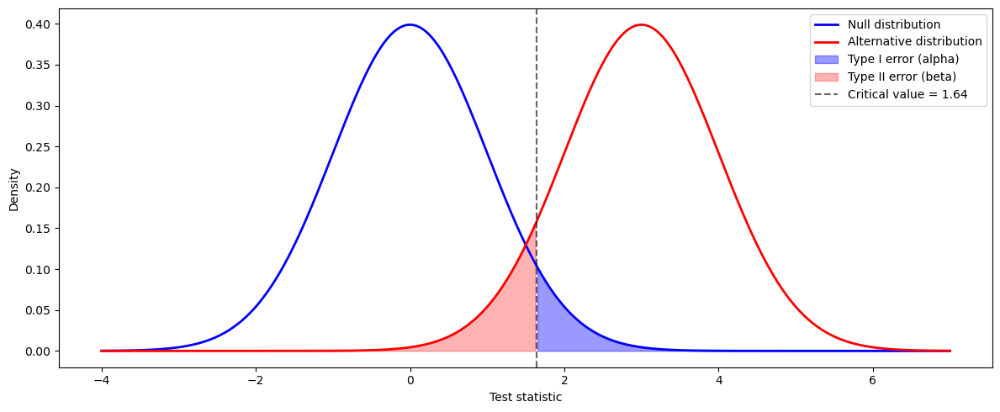

# 제1종/제2종 오류의 시각화

## 개요

모든 가설검정에는 두 종류의 실수가 있다: 제1종 오류($H_0$이 참인데 기각)와 제2종 오류($H_1$이 참인데 $H_0$을 기각하지 못함). 이 페이지에서는 두 오류를 겹쳐진 두 분포(귀무분포와 대립분포) 아래의 색칠된 넓이로 시각화하고, 유의수준·효과크기·표본크기가 함께 검정력을 결정하는 방식을 보인다.

<div class="defn" markdown>

**정의 1.** [제1종 오류, 제2종 오류, 검정력]

| | $H_0$ 참 | $H_1$ 참 |
|---|---|---|
| **$H_0$ 기각** | 제1종 오류 ($\alpha$) | 올바름 (검정력 $= 1 - \beta$) |
| **$H_0$ 기각 못함** | 올바름 | 제2종 오류 ($\beta$) |

- **제1종 오류율** ($\alpha$): $H_0$이 실제로 참일 때 기각할 확률. 연구자가 정하는 유의수준이며 흔히 0.05이다.
- **제2종 오류율** ($\beta$): $H_1$이 실제로 참일 때 $H_0$을 기각하지 못할 확률.
- **검정력** ($1 - \beta$): $H_1$이 참일 때 $H_0$을 올바르게 기각할 확률.

</div>

## 오류의 기하

귀무분포가 $N(\mu_0, 1)$이고 대립분포가 $N(\mu_1, 1)$($\mu_1 > \mu_0$)인 단측검정을 생각하자. 수준 $\alpha$의 우측검정에서 임계값은

$$
z_{\text{crit}} = \mu_0 + z_{1-\alpha}.
$$

그러면:

$$
\alpha = P(Z \geq z_{\text{crit}} \mid H_0) = 1 - \mathcal{N}(z_{1-\alpha}) = \alpha,
$$

$$
\beta = P(Z < z_{\text{crit}} \mid H_1) = \mathcal{N}\!\left(z_{\text{crit}} - \mu_1\right),
$$

$$
\text{Power} = 1 - \beta = 1 - \mathcal{N}\!\left(z_{1-\alpha} - (\mu_1 - \mu_0)\right).
$$

## 코드

### 두 분포 그리기

```python
import numpy as np
import matplotlib.pyplot as plt
from scipy import stats

null_loc = 0
alt_loc = 3
alpha = 0.05

x = np.linspace(null_loc - 4, alt_loc + 4, 400)
y_null = stats.norm.pdf(x, loc=null_loc)
y_alt = stats.norm.pdf(x, loc=alt_loc)

z_crit = stats.norm.ppf(1 - alpha, loc=null_loc)

fig, ax = plt.subplots(figsize=(12, 5))
ax.plot(x, y_null, "b-", lw=2, label="Null distribution")
ax.plot(x, y_alt, "r-", lw=2, label="Alternative distribution")

# 제1종 오류: 귀무분포에서 임계값 오른쪽. H0가 참인데 기각하는 경우다.
mask_t1 = x >= z_crit
ax.fill_between(x[mask_t1], y_null[mask_t1], alpha=0.4, color="blue",
                label="Type I error (alpha)")

# 제2종 오류: 대립분포에서 임계값 왼쪽. H1이 참인데 기각하지 못하는 경우다.
# 두 오류가 **다른 곡선** 아래에서 재어진다는 점이 이 그림의 요점이다.
mask_t2 = x <= z_crit
ax.fill_between(x[mask_t2], y_alt[mask_t2], alpha=0.3, color="red",
                label="Type II error (beta)")

ax.axvline(z_crit, color="black", linestyle="--", alpha=0.6,
           label=f"Critical value = {z_crit:.2f}")
ax.set_xlabel("Test statistic")
ax.set_ylabel("Density")
ax.legend()
plt.tight_layout()
plt.show()
```



같은 세로 점선(임계값 1.645)이 두 곡선을 각각 자른다. 파란 곡선에서 오른쪽으로 잘린 조각이 $\alpha$, 빨간 곡선에서 왼쪽으로 잘린 조각이 $\beta$다.

점선을 오른쪽으로 옮기면 파란 조각이 줄고 빨간 조각이 는다. 하나를 줄이면 다른 하나가 커지는 이 맞바꿈은 임계값 하나로 두 오류를 동시에 통제할 수 없다는 뜻이다. 둘 다 줄이는 방법은 하나뿐이다. 표본을 키워 두 곡선을 좁게 만드는 것이다.

### 분리 정도에 따른 검정력 계산

```python
for sep in [1, 2, 3, 4, 5]:
    z_c = stats.norm.ppf(0.95)
    # loc=sep은 "대립분포에서 재라"는 뜻이다. 임계값 z_c 자체는 sep과 무관하다.
    # H0 아래에서 정해지는 값이기 때문이다.
    power = 1 - stats.norm.cdf(z_c, loc=sep)
    beta = 1 - power
    print(f"Separation = {sep}: beta = {beta:.4f}, Power = {power:.4f}")
```

출력:

```
Separation = 1: beta = 0.7405, Power = 0.2595
Separation = 2: beta = 0.3612, Power = 0.6388
Separation = 3: beta = 0.0877, Power = 0.9123
Separation = 4: beta = 0.0093, Power = 0.9907
Separation = 5: beta = 0.0004, Power = 0.9996
```

검정력이 선형으로 오르지 않는다. 분리가 1에서 2로 갈 때 0.26에서 0.64로 크게 뛰지만, 4에서 5로 갈 때는 0.991에서 0.9996으로 거의 움직이지 않는다. 정규분포의 꼬리가 지수적으로 얇아지기 때문이다.

분리가 1일 때 검정력이 0.26이라는 것도 새겨 둘 만하다. 효과가 표준오차만큼 있어도 네 번 중 세 번은 놓친다. "효과가 있으면 검정이 잡아낼 것"이라는 기대는 대체로 근거가 없다.

## 해석

$\mu_0 = 0$, $\mu_1 = 3$, $\alpha = 0.05$일 때:

- **임계값**은 $z_{\text{crit}} \approx 1.645$이다.
- **제1종 오류**(귀무곡선 아래에서 1.645 오른쪽의 파란 영역)는 정확히 $\alpha = 0.05$이다.
- **제2종 오류**(대립곡선 아래에서 1.645 왼쪽의 빨간 영역)는 $\beta = \mathcal{N}(1.645 - 3) = \mathcal{N}(-1.355) \approx 0.088$이다.
- **검정력**은 $1 - 0.088 = 0.912$로, 크기 3인 효과를 탐지할 확률이 91.2%이다.

분리 $\mu_1 - \mu_0$이 커지면(효과크기가 커지면) 대립분포가 오른쪽으로 이동하여 귀무분포와의 겹침이 줄고 $\beta$가 작아진다. 반대로 효과가 작으면 겹침이 커지고 검정력이 낮아진다.

## 검정력에 영향을 주는 요인

다음의 경우 검정력이 커진다:

1. **효과크기**($\mu_1 - \mu_0$)가 커진다 — 두 분포가 더 멀어진다.
2. **표본크기**($n$)가 커진다 — 표준오차 $\sigma/\sqrt{n}$이 줄어 두 분포가 모두 좁아진다.
3. **유의수준**($\alpha$)이 커진다 — 임계값이 왼쪽으로 옮겨 기각역이 넓어진다(대신 제1종 오류가 늘어난다).
4. **분산**($\sigma^2$)이 작아진다 — 분포가 좁아져 겹침이 줄어든다.

## 연습문제

<div class="drillbox" markdown>

**연습문제 1.** $\mu_0 = 0$, $\mu_1 = 2$, $\sigma = 1$, $\alpha = 0.05$인 단측검정에서 $\beta$와 검정력을 해석적으로 계산하라.

</div>

??? success "풀이"

    임계값은 $z_{\text{crit}} = z_{0.95} = 1.645$이다. $H_1$ 아래에서 검정통계량은 $N(2, 1)$을 따른다. 따라서

    $$
    \beta = P(Z < 1.645 \mid Z \sim N(2,1)) = \mathcal{N}(1.645 - 2) = \mathcal{N}(-0.355) \approx 0.3613.
    $$

    검정력은

    $$
    1 - \beta = 1 - 0.3613 = 0.6387.
    $$

    크기 2인 효과를 탐지할 확률이 약 64%이다. $\square$

<div class="drillbox" markdown>

**연습문제 2.** 표본크기를 $n$에서 $4n$으로 늘리면 (표준오차 단위로) 귀무분포와 대립분포의 "유효 분리"가 두 배가 됨을 보여라. 목표 검정력을 달성하는 데 필요한 표본크기에 대해 이것이 무엇을 함의하는가?

</div>

??? success "풀이"

    표본크기가 $n$이면 검정은 $\bar{X} \sim N(\mu, \sigma^2/n)$에 기반한다. 표준오차 단위의 분리는

    $$
    \delta = \frac{\mu_1 - \mu_0}{\sigma / \sqrt{n}} = \frac{(\mu_1 - \mu_0)\sqrt{n}}{\sigma}.
    $$

    $n$을 $4n$으로 바꾸면:

    $$
    \delta' = \frac{(\mu_1 - \mu_0)\sqrt{4n}}{\sigma} = 2\delta.
    $$

    즉 표본크기를 네 배로 하면 유효 분리가 두 배가 된다. 더 일반적으로, 효과크기가 고정되어 있을 때 목표 검정력을 달성하는 데 필요한 표본크기는

    $$
    n = \left(\frac{(z_{1-\alpha} + z_{1-\beta})\sigma}{\mu_1 - \mu_0}\right)^2.
    $$

    이 공식은 $n$이 효과크기의 제곱에 반비례함을 보여준다. $\square$

<div class="drillbox" markdown>

**연습문제 3.** $\alpha$와 $\beta$의 맞바꿈을 설명하라. 다른 조건을 고정한 채 $\alpha$를 0.05에서 0.01로 낮추면 $\beta$와 검정력은 어떻게 되는가?

</div>

??? success "풀이"

    $\alpha$를 낮추면 (우측검정에서) 임계값이 오른쪽으로 옮겨간다: $z_{0.99} = 2.326 > z_{0.95} = 1.645$. $H_0$을 기각하기 어려워지므로:

    - $\alpha$가 줄어든다(제1종 오류가 줄어든다).
    - 더 엄격해진 임계값 아래로 대립분포가 더 많이 들어가므로 $\beta$가 커진다(제2종 오류가 늘어난다).
    - 검정력 $= 1 - \beta$가 줄어든다.

    $\mu_1 = 3$인 예에서:

    - $\alpha = 0.05$일 때: $\beta = \mathcal{N}(1.645 - 3) = \mathcal{N}(-1.355) \approx 0.088$, 검정력 $\approx 0.912$.
    - $\alpha = 0.01$일 때: $\beta = \mathcal{N}(2.326 - 3) = \mathcal{N}(-0.674) \approx 0.250$, 검정력 $\approx 0.750$.

    두 오류를 동시에 줄이는 유일한 방법은 표본크기를 늘리는 것이다. $\square$

<div class="drillbox" markdown>

**연습문제 4.** 이 시각화에서 두 분포의 분산은 같다. 대립분포의 분산이 더 크면 무엇이 달라지는가? 새 그림을 그리거나 기술하라.

</div>

??? success "풀이"

    대립분포가 $\sigma_1 > 1$인 $N(\mu_1, \sigma_1^2)$이면 귀무분포 $N(\mu_0, 1)$보다 넓고 납작하다. 주요 결과는:

    - 대립곡선이 퍼지므로 임계값 아래로 들어가는 넓이가 커진다. $\beta$가 커지고 검정력이 낮아진다.
    - 평균이 잘 떨어져 있어도 두 분포의 겹침이 커진다.
    - 검정력 공식은 다음이 된다:

    $$
    \text{Power} = 1 - \mathcal{N}\!\left(\frac{z_{\text{crit}} - \mu_1}{\sigma_1}\right),
    $$

    $\sigma_1 > 1$일 때 등분산인 경우보다 작다.

    시각적으로는 빨간 곡선이 낮고 넓어지며, 임계값 왼쪽의 빨간 제2종 오류 영역이 더 커진다. $\square$

<div class="drillbox" markdown>

**연습문제 5.** 어떤 임상시험이 $\alpha = 0.05$(양측)에서 효과 $\delta = 0.5$(Cohen의 $d$)를 검정력 80%로 탐지해야 한다. 집단당 최소 표본크기를 유도하라.

</div>

??? success "풀이"

    양측검정의 검정력 식은

    $$
    1 - \beta = \mathcal{N}\!\left(\delta\sqrt{\frac{n}{2}} - z_{1-\alpha/2}\right).
    $$

    $1 - \beta = 0.80$으로 놓으면 $z_{0.80} = 0.8416$이고 $z_{0.975} = 1.960$이다. 풀면:

    $$
    0.8416 = \delta\sqrt{\frac{n}{2}} - 1.960,
    $$

    $$
    \delta\sqrt{\frac{n}{2}} = 2.8016,
    $$

    $$
    \sqrt{\frac{n}{2}} = \frac{2.8016}{0.5} = 5.6032,
    $$

    $$
    \frac{n}{2} = 31.40, \qquad n = 62.8.
    $$

    양측 5% 수준에서 $d = 0.5$인 중간 효과를 검정력 80%로 탐지하려면 집단당 적어도 $n = 63$명(총 126명)이 필요하다. $\square$

---

## 정리하며

두 오류를 **겹친 두 분포 아래의 넓이**로 보면 관계가 한눈에 들어온다.

- **$\alpha$ 는 귀무분포의 꼬리, $\beta$ 는 대립분포의 꼬리다.** 임계값 하나가 두 넓이를 동시에 정하므로, 그 선을 옮기면 한쪽이 줄고 다른 쪽이 는다.
- **세 가지가 검정력을 키운다.** 효과크기가 커지면 두 분포가 멀어지고, $n$ 이 커지면 둘 다 좁아지며, $\alpha$ 를 키우면 임계값이 안쪽으로 온다. **앞의 둘은 좋고 마지막은 거짓 양성을 늘린다.**
- **$n$ 을 늘리는 것만이 두 오류를 함께 줄인다.** 그림에서 두 분포가 각각 좁아지며 겹치는 부분이 줄어드는 모습으로 나타난다.
- **효과가 $0$ 에 가까우면 검정력이 $\alpha$ 에 수렴한다.** 구별할 것이 없으면 기각률이 우연 수준으로 떨어진다는 뜻이다.
- **그림이 공식보다 오래 남는다.** 검정력 공식을 잊어도 이 두 분포 그림을 기억하면 관계를 다시 세울 수 있다.

다음 절부터 **다중검정**으로 넘어간다. 검정을 여러 번 하면 $\alpha$ 의 의미가 달라진다.
