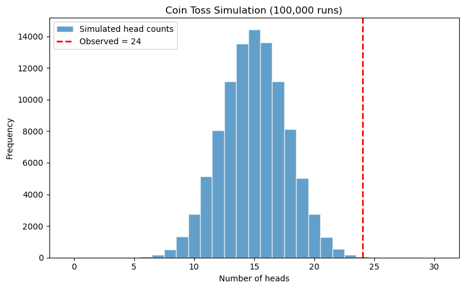

# 동전 던지기 모의실험

## 개요

모의실험에 기반한 가설검정은 해석적 공식을 반복적인 무작위 실험으로 대체한다. 동전이 공정한지 검정하려면 귀무가설 $H_0\colon p = 0.5$ 아래에서 동전 던지기 수열을 여러 번 모의실험하고, 관측된 자료만큼 또는 그보다 극단적인 결과가 나온 모의실험의 비율로 p-값을 추정한다. 이 접근은 이항분포를 몰라도 가설검정의 핵심 논리를 보여준다.

## 설정

동전을 $n = 30$번 던져 앞면이 $k = 24$번 나왔다. $H_0\colon p = 0.5$(공정한 동전) 아래에서 이 결과가 얼마나 이례적인지 묻는다.

단측 p-값은

$$
p\text{-value} = P(X \geq 24 \mid X \sim \text{Bin}(30, 0.5)).
$$

이를 해석적으로 계산하는 대신 모의실험으로 추정한다.

### 단일 실험

<div class="codebox" markdown>

#### 예제 1. 동전 던지기 한 번의 실험 { .eg }

```python
import numpy as np

np.random.seed(42)

TOTAL_TOSSES = 30
OBSERVED_HEADS = 24
PROB_HEAD_FAIR = 0.5
NUM_SIMULATIONS = 100_000

def single_experiment(n_tosses=TOTAL_TOSSES, p=PROB_HEAD_FAIR):
    """공정한 동전을 n_tosses번 던진 한 판을 흉내 내고 앞면 횟수를 돌려준다."""
    # 0/1을 30개 뽑아 더할 필요가 없다. 앞면 횟수의 분포가 곧 Bin(30, 0.5)다.
    return np.random.binomial(n_tosses, p)

# H0가 참일 때 한 판을 돌리면 무엇이 나오는지 몇 번 본다.
print([single_experiment() for _ in range(10)])
```

출력:

```
[14, 20, 17, 16, 12, 12, 11, 18, 16, 17]
```

공정한 동전에서 앞면은 15 언저리를 오간다. 관측된 24가 이 범위에서 얼마나 떨어져 있는지가 이 검정의 전부다.

</div>

### 반복 모의실험

<div class="codebox" markdown>

#### 예제 2. 모의실험 되풀이하기 { .eg }

```python
def simulate_coin_tosses(n_simulations=NUM_SIMULATIONS,
                         n_tosses=TOTAL_TOSSES,
                         p=PROB_HEAD_FAIR):
    """실험을 n_simulations번 반복하고 앞면 횟수 배열을 돌려준다."""
    return np.random.binomial(n_tosses, p, size=n_simulations)

# 여기서 세는 것은 "H0가 참일 때 관측값만큼 극단적인 일이 얼마나 자주 일어나는가"다.
# 그것이 p-값의 정의다. 이항분포 공식을 몰라도 이 논리는 그대로 성립한다.

head_counts = simulate_coin_tosses()
extreme = np.sum(head_counts >= OBSERVED_HEADS)
pct = extreme / NUM_SIMULATIONS * 100

print(f"Times with >= {OBSERVED_HEADS} heads: {extreme:,}")
print(f"Percentage: {pct:.4f}%")
```

출력:

```
Times with >= 24 heads: 71
Percentage: 0.0710%
```

10만 번 중 71번이다. 모의실험 p-값은 0.00071이 된다.

</div>

### 정확한 값과의 비교

<div class="codebox" markdown>

#### 예제 3. 정확한 값과 견주기 { .eg }

```python
from scipy.stats import binom

# P(X >= 24) = 1 - P(X <= 23) 이다. cdf에 24가 아니라 **23**을 넣어야 한다.
# 이산분포에서 부등호를 하나 어긋나게 쓰는 것이 가장 흔한 실수다.
p_exact = 1 - binom.cdf(OBSERVED_HEADS - 1, TOTAL_TOSSES, PROB_HEAD_FAIR)
print(f"Exact binomial P(X >= {OBSERVED_HEADS}): {p_exact:.6f}")
```

출력:

```
Exact binomial P(X >= 24): 0.000715
```

모의실험의 0.00071과 정확한 값 0.000715가 소수점 넷째 자리까지 맞는다. 모의실험 p-값의 표준오차가 $\sqrt{0.0007 \times 0.9993/100000} \approx 0.000084$이므로 이 정도 일치는 기대할 만하다(연습문제 3).

</div>

### 시각화

<div class="codebox" markdown>

#### 예제 4. 결과를 히스토그램으로 { .eg }

```python
import matplotlib.pyplot as plt

# 앞면 수가 정수이므로 계급 경계를 반 칸씩 밀어 막대 하나가 값 하나를 담게 한다.
fig, ax = plt.subplots(figsize=(8, 5))
bins = np.arange(0, TOTAL_TOSSES + 2) - 0.5
ax.hist(head_counts, bins=bins, edgecolor="white", alpha=0.7,
        label="Simulated head counts")
# 관측값 자리에 세로선을 긋는다. 그 오른쪽 막대들의 넓이 비율이 곧 p-값이다.
ax.axvline(OBSERVED_HEADS, color="red", linestyle="--", linewidth=2,
           label=f"Observed = {OBSERVED_HEADS}")
ax.set_xlabel("Number of heads")
ax.set_ylabel("Frequency")
ax.set_title(f"Coin Toss Simulation ({NUM_SIMULATIONS:,} runs)")
ax.legend()
plt.tight_layout()
plt.show()
```



히스토그램이 15를 중심으로 모여 있고 빨간 선이 그은 24는 오른쪽 꼬리 저 끝에 있다. 막대 높이가 눈에 보이지 않을 만큼 낮은 영역이다. p-값이란 결국 이 빨간 선 오른쪽에 있는 막대들의 넓이 비율이다.

</div>

### 해석

100,000번의 모의실험에서 앞면이 24번 이상 나온 비율은 5%를 크게 밑돈다. 정확한 이항 p-값은 $P(X \geq 24 \mid n=30, p=0.5) \approx 0.0007$이다. 어떤 합리적인 유의수준보다도 훨씬 작으므로 $H_0$을 기각하고 이 동전이 앞면 쪽으로 치우쳐 있다고 결론짓는다.

## 연습문제

<div class="drillbox" markdown>

**연습문제 1.** <span class="diff med" title="중간"></span> 동전이 어느 쪽으로든 치우쳤는지(양측) 검정하도록 모의실험을 고쳐라. 즉 $P(X \leq 6 \text{ 또는 } X \geq 24 \mid n=30, p=0.5)$을 모의실험으로 추정하라.

</div>

??? success "풀이"

    ```python
    head_counts = np.random.binomial(30, 0.5, size=100_000)
    extreme_two_sided = np.sum((head_counts >= 24) | (head_counts <= 6))
    p_two_sided = extreme_two_sided / 100_000
    print(f"Two-sided simulated p-value: {p_two_sided:.4f}")
    ```

    출력:

    ```
    Two-sided simulated p-value: 0.0014
    ```

    $p = 0.5$에서 이항분포가 15를 중심으로 대칭이므로 $P(X \leq 6) = P(X \geq 24)$이고, 따라서 양측 p-값은 단측의 정확히 두 배인 $2 \times 0.000715 = 0.00143$이다. 모의실험이 0.0014를 주어 이를 재현한다.

    대칭은 $p_0 = 0.5$이기 때문에 성립한다. $p_0$이 0.5가 아니면 이항분포가 치우쳐서 "양쪽 꼬리를 어떻게 자를 것인가"가 그 자체로 골칫거리가 된다. $\square$

<div class="drillbox" markdown>

**연습문제 2.** <span class="diff med" title="중간"></span> 여집합과 이항 PMF의 마지막 몇 항을 써서 정확한 이항 p-값 $P(X \geq 24 \mid n=30, p=0.5)$을 손으로 계산하라.

</div>

??? success "풀이"

    $$
    P(X \geq 24) = \sum_{k=24}^{30} \binom{30}{k} (0.5)^{30}.
    $$

    $(0.5)^{30} = 1/1{,}073{,}741{,}824$이므로:

    - $\binom{30}{24} = \binom{30}{6} = 593{,}775$
    - $\binom{30}{25} = \binom{30}{5} = 142{,}506$
    - $\binom{30}{26} = \binom{30}{4} = 27{,}405$
    - $\binom{30}{27} = \binom{30}{3} = 4{,}060$
    - $\binom{30}{28} = \binom{30}{2} = 435$
    - $\binom{30}{29} = \binom{30}{1} = 30$
    - $\binom{30}{30} = 1$

    합: $593{,}775 + 142{,}506 + 27{,}405 + 4{,}060 + 435 + 30 + 1 = 768{,}212$.

    $$
    P(X \geq 24) = \frac{768{,}212}{1{,}073{,}741{,}824} \approx 0.000716.
    $$

    모의실험 추정값과 일치한다. $\square$

<div class="drillbox" markdown>

**연습문제 3.** <span class="diff med" title="중간"></span> 모의실험 수가 늘어날 때 모의실험 기반 p-값이 정확한 p-값으로 수렴하는 이유를 설명하라. 모의실험 p-값의 표준오차는 얼마인가?

</div>

??? success "풀이"

    각 모의실험은 지시함수 $I_i = \mathbf{1}(X_i \geq k)$를 낳고 $P(I_i = 1) = p^*$(참 p-값)이다. 모의실험 p-값은 $\hat{p} = \bar{I} = \sum I_i / N$이다. 대수의법칙에 의해 $N \to \infty$이면 $\hat{p} \to p^*$이다.

    $\hat{p}$의 표준오차는

    $$
    SE = \sqrt{\frac{p^*(1-p^*)}{N}}.
    $$

    $p^* \approx 0.0007$이고 $N = 100{,}000$이면:

    $$
    SE = \sqrt{\frac{0.0007 \times 0.9993}{100{,}000}} \approx 0.000084.
    $$

    모의실험 p-값의 95% 신뢰구간은 대략 $0.0007 \pm 0.00016$이다. 모의실험을 늘리면 이 불확실성이 줄어든다. $\square$

<div class="drillbox" markdown>

**연습문제 4.** <span class="diff med" title="중간"></span> 모의실험 p-값이 $p^* = 0.05$일 때 95% 신뢰구간의 반너비가 0.005 이하가 되려면 모의실험이 몇 번 필요한가?

</div>

??? success "풀이"

    $1.96 \times SE \leq 0.005$가 필요하므로 $SE \leq 0.00255$이다. 다음을 놓으면

    $$
    \sqrt{\frac{0.05 \times 0.95}{N}} \leq 0.00255,
    $$

    $$
    \frac{0.0475}{N} \leq 0.00255^2 = 6.5025 \times 10^{-6},
    $$

    $$
    N \geq \frac{0.0475}{6.5025 \times 10^{-6}} \approx 7{,}305.
    $$

    적어도 7,305번의 모의실험이 필요하다. 실무에서는 $N = 10{,}000$을 흔한 최소값으로 삼는다. $\square$

<div class="drillbox" markdown>

**연습문제 5.** <span class="diff med" title="중간"></span> 30번 던져 앞면이 24번 나왔다고 하자. $p$에 대해 $\text{Beta}(1,1)$(균등) 사전분포를 쓰는 베이즈 접근으로 사후분포와 사후확률 $P(p > 0.5 \mid \text{자료})$를 계산하라.

</div>

??? success "풀이"

    $\text{Beta}(1,1)$ 사전분포에서 $n=30$번 시행 중 $k=24$번 앞면을 관측하면 사후분포는

    $$
    p \mid \text{data} \sim \text{Beta}(1 + 24,\; 1 + 6) = \text{Beta}(25, 7).
    $$

    동전이 앞면 쪽으로 치우쳐 있을 사후확률은

    $$
    P(p > 0.5 \mid \text{data}) = 1 - I_{0.5}(25, 7),
    $$

    여기서 $I_x(a,b)$는 정규화된 불완전 베타 함수이다. Python으로 `1 - stats.beta.cdf(0.5, 25, 7)`을 계산하면 $\approx 0.9997$이다. $p > 0.5$일 사후확률이 99.97%이다. $\square$

---

## 정리하며

$p$ 값은 **분포표 없이도** 구할 수 있다.

- **정의를 그대로 코드로 옮기면 된다.** $H_0$ 아래에서 실험을 수만 번 되풀이하고, 관측된 것만큼 극단적인 결과가 나온 비율을 세면 그것이 $p$ 값의 추정값이다.
- **이항분포를 몰라도 된다는 점이 요점이다.** 여기서는 정확한 답을 알고 있으므로 모의실험이 맞는지 확인할 수 있지만, 공식이 없는 상황에서도 같은 논리가 통한다. **17장의 순열검정과 부트스트랩이 이 착상의 확장이다.**
- **모의 $p$ 값에는 자체 오차가 있다.** $B$ 번 반복하면 표준오차가 대략 $\sqrt{p(1-p)/B}$ 이므로, 작은 $p$ 값을 정밀하게 재려면 $B$ 를 크게 잡아야 한다. $p\approx0.001$ 을 유효숫자 한 자리로 보려면 $B$ 가 $10^5$ 단위여야 한다.
- **$0$ 이 나와도 $p=0$ 이 아니다.** 모의에서 한 번도 나오지 않았다는 뜻일 뿐이며, 관례적으로 $(\text{초과 횟수}+1)/(B+1)$ 로 보고해 $0$ 을 피한다.
- **"극단적"의 정의가 대립가설을 반영한다.** 단측이면 한쪽만, 양측이면 양쪽을 센다.

다음 절 **기각역 시연**에서 같은 판정을 통계량 척도에서 그림으로 본다.
