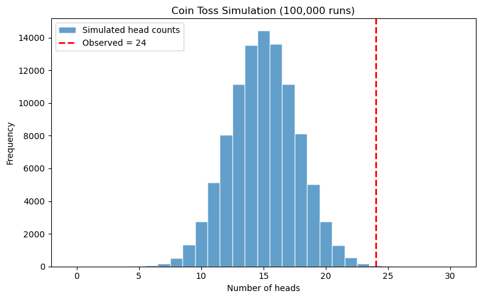

# 동전 던지기 모의실험

## 개요

모의실험에 기반한 가설검정은 해석적 공식을 반복적인 무작위 실험으로 대체한다. 동전이 공정한지 검정하려면 귀무가설 $H_0\colon p = 0.5$ 아래에서 동전 던지기 수열을 여러 번 모의실험하고, 관측된 자료만큼 또는 그보다 극단적인 결과가 나온 모의실험의 비율로 p-값을 추정한다. 이 접근은 이항분포를 몰라도 가설검정의 핵심 논리를 보여준다.

## 설정

동전을 $n = 30$번 던져 앞면이 $k = 24$번 나왔다. $H_0\colon p = 0.5$(공정한 동전) 아래에서 이 결과가 얼마나 이례적인지 묻는다.

단측 p-값은

$$
p\text{-value} = P(X \geq 24 \mid X \sim \text{Bin}(30, 0.5)).
$$

이를 해석적으로 계산하는 대신 모의실험으로 추정한다.

### 단일 실험

<div class="exbox" markdown>

**보기 1.** <span class="diff easy" title="쉬움"></span> 동전 던지기 한 번의 실험. $H_0$이 참일 때 한 판이 어떻게 생겼는지부터 본다.

**(1)** $H_0$ 아래에서 앞면 수 $X$의 기댓값과 표준편차를 구하고, 관측값 24가 평균에서 몇 표준편차 떨어져 있는지 말하시오.

**(2)** 열 판을 돌렸을 때 그중 24 이상이 나오는 판이 **몇 판쯤** 나오리라 기대하는가. 실제로 열 판을 돌려 확인하시오.

</div>

??? success "풀이"

    **(1) 해석적으로.** $H_0\colon p = 0.5$ 아래에서 $X \sim \text{Bin}(30,\,0.5)$이므로

    $$
    E[X] = np = 30 \times 0.5 = 15, \qquad
    \text{SD}(X) = \sqrt{np(1-p)} = \sqrt{30 \times 0.25} = \sqrt{7.5} = 2.738613
    $$

    이다. 관측값 24는

    $$
    \frac{24 - 15}{2.738613} = 3.286335
    $$

    이므로 **평균에서 3.29 표준편차 위**에 있다. 정규분포라면 오른쪽 꼬리 확률이 $5\times10^{-4}$쯤 되는 자리다(정확한 이항 값은 보기 3에서 구한다).

    **(2) 해석적으로.** $P(X \ge 24) = 0.000715$이므로(보기 3) 열 판에서 24 이상이 나오는 판의 수는 $\text{Bin}(10,\,0.000715)$를 따르고 기댓값은

    $$
    10 \times 0.000715 = 0.00715
    $$

    이다. **열 판을 한 묶음으로 보면 140묶음에 한 번쯤** 그런 판이 나온다는 뜻이다. 그러니 열 판에서는 거의 확실히 한 판도 나오지 않는다.

    **수치적으로.**

    ```python
    import numpy as np

    np.random.seed(42)

    TOTAL_TOSSES = 30
    OBSERVED_HEADS = 24
    PROB_HEAD_FAIR = 0.5
    NUM_SIMULATIONS = 100_000

    def single_experiment(n_tosses=TOTAL_TOSSES, p=PROB_HEAD_FAIR):
        """공정한 동전을 n_tosses번 던진 한 판을 흉내 내고 앞면 횟수를 돌려준다."""
        # 0/1을 30개 뽑아 더할 필요가 없다. 앞면 횟수의 분포가 곧 Bin(30, 0.5)다.
        return np.random.binomial(n_tosses, p)

    # H0가 참일 때 한 판을 돌리면 무엇이 나오는지 몇 번 본다.
    print([single_experiment() for _ in range(10)])
    ```

    출력:

    ```
    [14, 20, 17, 16, 12, 12, 11, 18, 16, 17]
    ```

    열 판의 평균이 $15.3$으로 이론값 $15$ 언저리이고, 가장 큰 값이 $20$, 가장 작은 값이 $11$이다. 둘 다 평균에서 두 표준편차 안쪽이다. **24에 닿은 판은 하나도 없다.** (2)에서 기대값이 $0.00715$였으니 당연한 결과다.

    공정한 동전에서 앞면은 15 언저리를 오간다. 관측된 24가 이 범위에서 얼마나 떨어져 있는지가 이 검정의 전부다.

### 반복 모의실험

<div class="exbox" markdown>

**보기 2.** <span class="diff easy" title="쉬움"></span> 모의실험 되풀이하기. 이번에는 $N = 100{,}000$판을 돌려 24 이상이 나온 판을 센다.

**(1)** 참 꼬리확률을 $p^* = 0.000715453$(보기 3에서 구한다)이라 할 때, 이 **개수**가 따르는 분포와 그 기댓값·표준편차를 구하시오. 모의실험 $p$-값의 표준오차는 얼마인가.

**(2)** 모의실험을 돌려 실제 개수를 세고, (1)의 예측과 몇 표준편차 떨어져 있는지 확인하시오.

</div>

??? success "풀이"

    **(1) 해석적으로.** $N$판은 서로 독립이고 각 판이 "24 이상"일 확률이 $p^*$로 같다. 그러므로 개수 $Y$는

    $$
    Y \sim \text{Bin}(N,\, p^*), \qquad N = 100{,}000,\ p^* = 0.000715453
    $$

    를 따르고

    $$
    E[Y] = N p^* = 71.545, \qquad
    \text{SD}(Y) = \sqrt{N p^*(1-p^*)} = \sqrt{71.494} = 8.4554
    $$

    이다. 모의실험 $p$-값은 $\hat p = Y/N$이므로 표준오차는 이것을 $N$으로 나눈

    $$
    \text{SE}(\hat p) = \sqrt{\frac{p^*(1-p^*)}{N}} = \frac{8.4554}{100{,}000} = 8.455 \times 10^{-5}
    $$

    이다. **참값의 12%쯤 되는 상대오차**다. 꼬리확률처럼 작은 수를 모의실험으로 재면 상대오차가 이렇게 크다. 이를 반으로 줄이려면 $N$을 네 배로 늘려야 한다.

    **(2) 수치적으로.**

    ```python
    def simulate_coin_tosses(n_simulations=NUM_SIMULATIONS,
                             n_tosses=TOTAL_TOSSES,
                             p=PROB_HEAD_FAIR):
        """실험을 n_simulations번 반복하고 앞면 횟수 배열을 돌려준다."""
        return np.random.binomial(n_tosses, p, size=n_simulations)

    # 여기서 세는 것은 "H0가 참일 때 관측값만큼 극단적인 일이 얼마나 자주 일어나는가"다.
    # 그것이 p-값의 정의다. 이항분포 공식을 몰라도 이 논리는 그대로 성립한다.

    head_counts = simulate_coin_tosses()
    extreme = np.sum(head_counts >= OBSERVED_HEADS)
    pct = extreme / NUM_SIMULATIONS * 100

    print(f"Times with >= {OBSERVED_HEADS} heads: {extreme:,}")
    print(f"Percentage: {pct:.4f}%")

    # (1) 의 예측과 견준다.
    p_star = 0.000715453
    mean_y = NUM_SIMULATIONS * p_star
    sd_y = np.sqrt(NUM_SIMULATIONS * p_star * (1 - p_star))
    print(f"예측 개수 {mean_y:.3f} ± {sd_y:.4f}"
          f"   관측과의 거리 {(extreme - mean_y) / sd_y:+.3f} SD")

    # 모의실험 p-값의 표준오차는 관측된 비율로도 잴 수 있다.
    p_hat = extreme / NUM_SIMULATIONS
    se_hat = np.sqrt(p_hat * (1 - p_hat) / NUM_SIMULATIONS)
    print(f"p-hat = {p_hat:.6f},  SE = {se_hat:.3e},"
          f"  95% 구간 ({p_hat - 1.96 * se_hat:.6f}, {p_hat + 1.96 * se_hat:.6f})")
    ```

    출력:

    ```
    Times with >= 24 heads: 71
    Percentage: 0.0710%
    예측 개수 71.545 ± 8.4554   관측과의 거리 -0.064 SD
    p-hat = 0.000710,  SE = 8.423e-05,  95% 구간 (0.000545, 0.000875)
    ```

    10만 번 중 71번이다. 모의실험 $p$-값은 $0.00071$이 된다.

    (1)이 예측한 $71.545$에 대해 관측값이 $71$이니 **0.064 표준편차** 떨어져 있다. 이보다 더 잘 맞을 수는 없을 정도다. 다만 그것은 운이기도 하다. 표준편차가 $8.46$이므로 예컨대 $60$이나 $83$이 나와도 전혀 이상하지 않았다.

    관측된 비율로 잰 95% 구간 $(0.000545,\ 0.000875)$가 참값 $0.000715$를 담는다. 구간의 폭이 참값의 절반 가까이 되므로, **모의실험만으로는 "0.0007 언저리"라는 정도까지만 말할 수 있다.**

### 정확한 값과의 비교

<div class="exbox" markdown>

**보기 3.** <span class="diff easy" title="쉬움"></span> 정확한 값과 견주기. 이산분포의 꼬리확률을 누적분포함수로 구할 때 가장 흔한 실수가 부등호를 한 칸 어긋나게 쓰는 것이다.

**(1)** $P(X \ge 24)$를 $F(x) = P(X \le x)$로 쓰면 $1 - F(23)$인가 $1 - F(24)$인가. 틀린 쪽을 쓰면 **몇 배** 어긋나는지 수로 답하시오.

**(2)** 두 값을 모두 계산해 (1)을 확인하고, 보기 2의 모의실험 값과 견주시오.

</div>

??? success "풀이"

    **(1) 해석적으로.** $X$가 정수값만 가지므로 $\{X \ge 24\}$의 여집합은 $\{X \le 23\}$이다. 따라서

    $$
    P(X \ge 24) = 1 - F(23)
    $$

    가 옳다. $1 - F(24) = P(X \ge 25)$는 **$X = 24$인 경우를 통째로 빠뜨린다.** 연속분포라면 한 점의 확률이 0이라 아무 차이가 없지만 이산분포에서는 그렇지 않다.

    빠뜨리는 양이 얼마나 되는지 보자.

    $$
    P(X = 24) = \binom{30}{24}\left(\tfrac12\right)^{30} = \frac{593{,}775}{1{,}073{,}741{,}824} = 0.000553
    $$

    인데 전체가 $P(X \ge 24) = 0.000715$다. **한 점이 꼬리 전체의 77.3%를 차지한다.** 그러므로 틀린 쪽은

    $$
    1 - F(24) = 0.000715 - 0.000553 = 0.000162
    $$

    를 주고, 비는

    $$
    \frac{0.000715453}{0.000162458} = 4.404
    $$

    이다. **4.4배 작게 보고하게 된다.** 꼬리 끝으로 갈수록 이항 PMF가 가파르게 줄어들기 때문에, 극단값일수록 맨 앞 한 항이 꼬리를 거의 다 차지하고 이 실수의 대가가 커진다.

    **(2) 수치적으로.**

    ```python
    from scipy.stats import binom

    # P(X >= 24) = 1 - P(X <= 23) 이다. cdf에 24가 아니라 **23**을 넣어야 한다.
    # 이산분포에서 부등호를 하나 어긋나게 쓰는 것이 가장 흔한 실수다.
    p_exact = 1 - binom.cdf(OBSERVED_HEADS - 1, TOTAL_TOSSES, PROB_HEAD_FAIR)
    print(f"Exact binomial P(X >= {OBSERVED_HEADS}): {p_exact:.6f}")

    # 한 칸 어긋나게 쓰면 어떻게 되는가.
    p_wrong = 1 - binom.cdf(OBSERVED_HEADS, TOTAL_TOSSES, PROB_HEAD_FAIR)
    pmf24 = binom.pmf(OBSERVED_HEADS, TOTAL_TOSSES, PROB_HEAD_FAIR)
    print(f"틀린 1 - F(24)          : {p_wrong:.6f}   (= P(X >= 25))")
    print(f"빠뜨린 P(X = 24)        : {pmf24:.6f}"
          f"   꼬리에서 차지하는 몫 {pmf24 / p_exact:.1%}")
    print(f"비 (옳은 값)/(틀린 값)  : {p_exact / p_wrong:.3f}")
    print(f"모의실험 값             : {pct / 100:.6f}"
          f"   차이 {abs(pct / 100 - p_exact) / se_hat:.3f} SE")
    ```

    출력:

    ```
    Exact binomial P(X >= 24): 0.000715
    틀린 1 - F(24)          : 0.000162   (= P(X >= 25))
    빠뜨린 P(X = 24)        : 0.000553   꼬리에서 차지하는 몫 77.3%
    비 (옳은 값)/(틀린 값)  : 4.404
    모의실험 값             : 0.000710   차이 0.065 SE
    ```

    유도한 $77.3\%$와 $4.404$가 그대로 나왔다.

    모의실험의 $0.00071$과 정확한 값 $0.000715$는 모의실험 표준오차의 **0.065배**밖에 떨어져 있지 않다. 보기 2에서 본 대로 $\text{SE} \approx 8.4\times10^{-5}$이므로 이 정도 일치는 기대할 만하다(연습문제 3).

    여기서 두 방법의 역할이 갈린다. **정확한 이항 계산은 자릿수를 몇 개든 줄 수 있고, 모의실험은 $N$이 주는 만큼만 준다.** 분포를 아는 문제에서 모의실험을 쓸 이유는 없다. 모의실험이 값진 것은 분포를 모르는 문제에서이고, 이 페이지는 **같은 답을 두 길로 얻어 두 길이 모두 옳음을 확인하는** 연습이다.

### 시각화

<div class="exbox" markdown>

**보기 4.** <span class="diff easy" title="쉬움"></span> 결과를 히스토그램으로. 보기 2의 10만 판을 막대그림으로 그리고 관측값 24에 세로선을 긋는다.

**(1)** 이 그림에서 읽히는 것을 수치와 함께 적으시오.

**(2)** 이 그림이 **가리는 것**과 **잘못 읽히기 쉬운 곳**은 어디인가.

</div>

??? success "풀이"

    유도할 답이 있는 문제가 아니다. **그림에서 무엇이 읽히고 무엇이 읽히지 않는가**가 이 보기의 전부이므로, 눈으로 본 것을 수치로 바꿔 가며 읽는다.

    ```python
    import matplotlib.pyplot as plt

    # 그림에서 읽을 수치를 미리 찍어 둔다.
    counts = np.bincount(head_counts, minlength=TOTAL_TOSSES + 1)
    print(f"모의 평균 {head_counts.mean():.4f}  표준편차 {head_counts.std(ddof=1):.4f}"
          f"   (이론 15, {np.sqrt(7.5):.4f})")
    print(f"최솟값 {head_counts.min()}  최댓값 {head_counts.max()}")
    print(f"가장 높은 막대: x = {counts.argmax()}, 높이 {counts.max():,}")
    for x in (22, 23, 24, 25, 26):
        print(f"  x = {x}: 높이 {counts[x]:>5,}"
              f"   가장 높은 막대의 {counts[x] / counts.max():.3%}")

    # 앞면 수가 정수이므로 계급 경계를 반 칸씩 밀어 막대 하나가 값 하나를 담게 한다.
    fig, ax = plt.subplots(figsize=(8, 5))
    bins = np.arange(0, TOTAL_TOSSES + 2) - 0.5
    ax.hist(head_counts, bins=bins, edgecolor="white", alpha=0.7,
            label="Simulated head counts")
    # 관측값 자리에 세로선을 긋는다. 그 오른쪽 막대들의 넓이 비율이 곧 p-값이다.
    ax.axvline(OBSERVED_HEADS, color="red", linestyle="--", linewidth=2,
               label=f"Observed = {OBSERVED_HEADS}")
    ax.set_xlabel("Number of heads")
    ax.set_ylabel("Frequency")
    ax.set_title(f"Coin Toss Simulation ({NUM_SIMULATIONS:,} runs)")
    ax.legend()
    plt.tight_layout()
    plt.show()
    ```

    출력:

    ```
    모의 평균 14.9923  표준편차 2.7302   (이론 15, 2.7386)
    최솟값 4  최댓값 26
    가장 높은 막대: x = 15, 높이 14,442
      x = 22: 높이   535   가장 높은 막대의 3.704%
      x = 23: 높이   180   가장 높은 막대의 1.246%
      x = 24: 높이    56   가장 높은 막대의 0.388%
      x = 25: 높이    12   가장 높은 막대의 0.083%
      x = 26: 높이     3   가장 높은 막대의 0.021%
    ```

    

    **(1) 읽히는 것.** 히스토그램이 좌우대칭의 종 모양으로 $x = 15$에 봉우리를 두고 있다. 모의 평균 $14.9923$과 표준편차 $2.7302$가 이론값 $15$, $2.7386$과 소수점 둘째 자리까지 맞으므로 **모의실험이 $\text{Bin}(30,\,0.5)$를 제대로 재현했다**고 읽을 수 있다. 막대 높이는 $x=15$에서 $14{,}442$이고 $x = 15 \pm 3$인 12와 18에서 $8{,}000$ 남짓이다.

    빨간 선이 그은 24는 봉우리에서 멀찍이 떨어져 있고, **그 오른쪽에는 눈에 보이는 막대가 없다.** 이것이 그림이 전하려는 전부다. 관측된 24가 $H_0$ 아래에서 일어날 법한 자리가 아니라는 것.

    **(2) 가리는 것 — 꼬리의 크기.** 세로축이 선형 빈도라 $0$부터 $14{,}500$까지를 한 화면에 담는다. $x = 24$의 막대는 높이 $56$으로 가장 높은 막대의 $0.388\%$이고, 세로 500화소 남짓한 그림에서 **1화소 남짓**이다. $x = 25$는 $12$, $x = 26$은 $3$이라 아예 그려지지 않는다. 그러므로 이 그림만 보고는 $P(X \ge 24)$가 $0.0007$인지 $0.00001$인지 **분간할 수 없다.** $p$-값을 그림에서 읽어 내겠다면 로그 세로축을 쓰거나 꼬리 구간만 따로 확대해야 한다.

    **잘못 읽히기 쉬운 곳 — 선의 자리.** 막대는 정수에 **중심을 두고** 그려져 있고 빨간 선은 $x = 24$에 그어져 있다. 그러니 "선 오른쪽 막대의 넓이"를 글자 그대로 재면 $x = 24$ 막대의 **오른쪽 절반만** 세게 되어 $p$-값을 과소평가한다. 우리가 원하는 영역은 $\{X \ge 24\}$이므로 선은 $x = 23.5$에 그어야 맞다. 보기 3에서 본 부등호 한 칸 문제가 그림에서는 이 모습으로 나타난다.

    **또 하나 — 모의실험의 해상도.** 10만 판에서 나온 최댓값이 $26$이다. $x = 27$ 이상은 한 번도 나오지 않았으므로 이 그림은 그 구간에 대해 "확률이 $10^{-5}$보다 작다"는 것 말고는 아무 말도 하지 못한다. 실제로 $P(X \ge 27) = 4\times10^{-6}$이라 10만 판에서 0.4판이 기대되는 값이다. **모의실험으로는 $1/N$보다 작은 확률을 볼 수 없다.**

### 해석

100,000번의 모의실험에서 앞면이 24번 이상 나온 비율은 5%를 크게 밑돈다. 정확한 이항 p-값은 $P(X \geq 24 \mid n=30, p=0.5) \approx 0.0007$이다. 어떤 합리적인 유의수준보다도 훨씬 작으므로 $H_0$을 기각하고 이 동전이 앞면 쪽으로 치우쳐 있다고 결론짓는다.

## 연습문제

<div class="drillbox" markdown>

**연습문제 1.** <span class="diff med" title="중간"></span> 동전이 어느 쪽으로든 치우쳤는지(양측) 검정하도록 모의실험을 고쳐라. 즉 $P(X \leq 6 \text{ 또는 } X \geq 24 \mid n=30, p=0.5)$을 모의실험으로 추정하라.

</div>

??? success "풀이"

    ```python
    head_counts = np.random.binomial(30, 0.5, size=100_000)
    extreme_two_sided = np.sum((head_counts >= 24) | (head_counts <= 6))
    p_two_sided = extreme_two_sided / 100_000
    print(f"Two-sided simulated p-value: {p_two_sided:.4f}")
    ```

    출력:

    ```
    Two-sided simulated p-value: 0.0014
    ```

    $p = 0.5$에서 이항분포가 15를 중심으로 대칭이므로 $P(X \leq 6) = P(X \geq 24)$이고, 따라서 양측 p-값은 단측의 정확히 두 배인 $2 \times 0.000715 = 0.00143$이다. 모의실험이 0.0014를 주어 이를 재현한다.

    대칭은 $p_0 = 0.5$이기 때문에 성립한다. $p_0$이 0.5가 아니면 이항분포가 치우쳐서 "양쪽 꼬리를 어떻게 자를 것인가"가 그 자체로 골칫거리가 된다. $\square$

<div class="drillbox" markdown>

**연습문제 2.** <span class="diff med" title="중간"></span> 여집합과 이항 PMF의 마지막 몇 항을 써서 정확한 이항 p-값 $P(X \geq 24 \mid n=30, p=0.5)$을 손으로 계산하라.

</div>

??? success "풀이"

    $$
    P(X \geq 24) = \sum_{k=24}^{30} \binom{30}{k} (0.5)^{30}.
    $$

    $(0.5)^{30} = 1/1{,}073{,}741{,}824$이므로:

    - $\binom{30}{24} = \binom{30}{6} = 593{,}775$
    - $\binom{30}{25} = \binom{30}{5} = 142{,}506$
    - $\binom{30}{26} = \binom{30}{4} = 27{,}405$
    - $\binom{30}{27} = \binom{30}{3} = 4{,}060$
    - $\binom{30}{28} = \binom{30}{2} = 435$
    - $\binom{30}{29} = \binom{30}{1} = 30$
    - $\binom{30}{30} = 1$

    합: $593{,}775 + 142{,}506 + 27{,}405 + 4{,}060 + 435 + 30 + 1 = 768{,}212$.

    $$
    P(X \geq 24) = \frac{768{,}212}{1{,}073{,}741{,}824} \approx 0.000716.
    $$

    모의실험 추정값과 일치한다. $\square$

<div class="drillbox" markdown>

**연습문제 3.** <span class="diff med" title="중간"></span> 모의실험 수가 늘어날 때 모의실험 기반 p-값이 정확한 p-값으로 수렴하는 이유를 설명하라. 모의실험 p-값의 표준오차는 얼마인가?

</div>

??? success "풀이"

    각 모의실험은 지시함수 $I_i = \mathbf{1}(X_i \geq k)$를 낳고 $P(I_i = 1) = p^*$(참 p-값)이다. 모의실험 p-값은 $\hat{p} = \bar{I} = \sum I_i / N$이다. 대수의법칙에 의해 $N \to \infty$이면 $\hat{p} \to p^*$이다.

    $\hat{p}$의 표준오차는

    $$
    SE = \sqrt{\frac{p^*(1-p^*)}{N}}.
    $$

    $p^* \approx 0.0007$이고 $N = 100{,}000$이면:

    $$
    SE = \sqrt{\frac{0.0007 \times 0.9993}{100{,}000}} \approx 0.000084.
    $$

    모의실험 p-값의 95% 신뢰구간은 대략 $0.0007 \pm 0.00016$이다. 모의실험을 늘리면 이 불확실성이 줄어든다. $\square$

<div class="drillbox" markdown>

**연습문제 4.** <span class="diff med" title="중간"></span> 모의실험 p-값이 $p^* = 0.05$일 때 95% 신뢰구간의 반너비가 0.005 이하가 되려면 모의실험이 몇 번 필요한가?

</div>

??? success "풀이"

    $1.96 \times SE \leq 0.005$가 필요하므로 $SE \leq 0.00255$이다. 다음을 놓으면

    $$
    \sqrt{\frac{0.05 \times 0.95}{N}} \leq 0.00255,
    $$

    $$
    \frac{0.0475}{N} \leq 0.00255^2 = 6.5025 \times 10^{-6},
    $$

    $$
    N \geq \frac{0.0475}{6.5025 \times 10^{-6}} \approx 7{,}305.
    $$

    적어도 7,305번의 모의실험이 필요하다. 실무에서는 $N = 10{,}000$을 흔한 최소값으로 삼는다. $\square$

<div class="drillbox" markdown>

**연습문제 5.** <span class="diff med" title="중간"></span> 30번 던져 앞면이 24번 나왔다고 하자. $p$에 대해 $\text{Beta}(1,1)$(균등) 사전분포를 쓰는 베이즈 접근으로 사후분포와 사후확률 $P(p > 0.5 \mid \text{자료})$를 계산하라.

</div>

??? success "풀이"

    $\text{Beta}(1,1)$ 사전분포에서 $n=30$번 시행 중 $k=24$번 앞면을 관측하면 사후분포는

    $$
    p \mid \text{data} \sim \text{Beta}(1 + 24,\; 1 + 6) = \text{Beta}(25, 7).
    $$

    동전이 앞면 쪽으로 치우쳐 있을 사후확률은

    $$
    P(p > 0.5 \mid \text{data}) = 1 - I_{0.5}(25, 7),
    $$

    여기서 $I_x(a,b)$는 정규화된 불완전 베타 함수이다. Python으로 `1 - stats.beta.cdf(0.5, 25, 7)`을 계산하면 $\approx 0.9997$이다. $p > 0.5$일 사후확률이 99.97%이다. $\square$

<div class="drillbox" markdown>

**연습문제 6.** <span class="diff hard" title="어려움"></span>
모의실험 $p$-값을 $b/B$로 계산하면 **제1종 오류율이 명목을 넘을 수 있다.** 이유를 밝히고 $(b+1)/(B+1)$이 왜 옳은지 보여라.

</div>

??? success "풀이"
    **설정.** $B$번의 모의실험에서 관측값만큼 극단적인 경우가 $b$번 나왔다. 두 후보는

    $$
    \hat p_{\text{단순}}=\frac bB,\qquad \hat p_{\text{보정}}=\frac{b+1}{B+1}
    $$

    **핵심 관찰.** $H_0$ 아래에서 참 $p$-값은 $U\sim\text{Unif}(0,1)$이고, $b\mid U\sim\text{Bin}(B,U)$다. 따라서 $b$의 주변분포는 **$\{0,1,\dots,B\}$ 위의 균등분포**다(베타-이항에서 $\alpha=\beta=1$).

    $$
    P(b=j)=\int_0^1\binom Bj u^j(1-u)^{B-j}\,du=\frac1{B+1}
    $$

    **따라서 정확히 계산된다.**

    $$
    P\!\left(\frac bB\le\alpha\right)=\frac{\lfloor\alpha B\rfloor+1}{B+1},
    \qquad
    P\!\left(\frac{b+1}{B+1}\le\alpha\right)=\frac{\lfloor\alpha(B+1)\rfloor}{B+1}\le\alpha
    $$

    ```python
    import numpy as np

    print(f"{'B':>7s} {'단순 b/B':>10s} {'보정 (b+1)/(B+1)':>18s}")
    for B in [20, 100, 1000, 10000]:
        a = 0.05
        print(f"{B:7d} {(np.floor(a * B) + 1) / (B + 1):10.4f} "
              f"{np.floor(a * (B + 1)) / (B + 1):18.4f}")
    print()
    for B in [19, 99, 999, 9999]:
        a = 0.05
        print(f"{B:7d} {(np.floor(a * B) + 1) / (B + 1):10.4f} "
              f"{np.floor(a * (B + 1)) / (B + 1):18.4f}")
    ```

    ```text
          B     단순 b/B     보정 (b+1)/(B+1)
         20     0.0952             0.0476
        100     0.0594             0.0495
       1000     0.0509             0.0500
      10000     0.0501             0.0500

         19     0.0500             0.0500
         99     0.0500             0.0500
        999     0.0500             0.0500
       9999     0.0500             0.0500
    ```

    **$B=20$이면 단순 판이 9.5%, 즉 명목의 두 배다.** $B=100$에서도 5.94%다.

    **보정 판은 모든 $B$에서 0.05 이하**다. $\lfloor\alpha(B+1)\rfloor\le\alpha(B+1)$이므로 대수적으로 보장된다.

    **$B=99$처럼 $\alpha(B+1)$이 정수면 둘이 같다.** 이것이 $B$를 $999$, $9999$처럼 잡는 관행의 이유다. **"$B$를 $10^k-1$로 잡으라"**는 조언이 여기서 나온다.

    **또 하나의 이유 — $b=0$.** 단순 판은 $p$-값이 **정확히 0**이 될 수 있다. 확률이 0이라는 주장은 불가능하며, 로그를 취하는 후속 계산(피셔 결합 등)에서 발산한다. 보정 판은 최솟값이 $1/(B+1)$이다.

    **해석.** $(b+1)/(B+1)$은 **관측값 자체를 재표본의 하나로 포함**시키는 것과 같다. 순열검정에서 항등순열을 반드시 포함하는 관행과 같은 논리다.

<div class="drillbox" markdown>

**연습문제 7.** <span class="diff med" title="중간"></span>
정확한 이항검정 대신 **중간-$p$ 값**을 쓰면 보수성이 줄어든다. 정의하고, $n$에 따른 실제 수준을 확인하라.

</div>

??? success "풀이"
    **문제.** 이산분포에서 정확검정은 보수적이다. $P(T\ge t_{\text{obs}})$가 $t_{\text{obs}}$에서의 확률질량을 **통째로** 포함하기 때문이다.

    **중간-$p$.** 관측값의 확률질량을 **절반만** 센다.

    $$
    p_{\text{mid}}=P(T>t_{\text{obs}})+\tfrac12P(T=t_{\text{obs}})
    $$

    ```python
    import numpy as np
    from scipy import stats

    print(f"{'n':>5s} {'정확검정':>10s} {'중간-p':>10s}")
    for n in [10, 20, 30, 50]:
        k = np.arange(n + 1)
        pmf = stats.binom.pmf(k, n, 0.5)
        exact = np.array([stats.binomtest(int(j), n, 0.5).pvalue for j in k])
        midp = np.empty(n + 1)
        for j in k:
            one = (stats.binom.cdf(j - 1, n, 0.5) + 0.5 * pmf[j] if j <= n / 2
                   else stats.binom.sf(j, n, 0.5) + 0.5 * pmf[j])
            midp[j] = min(2 * one, 1)
        print(f"{n:5d} {pmf[exact <= 0.05].sum():10.4f} "
              f"{pmf[midp <= 0.05].sum():10.4f}")
    ```

    ```text
        n       정확검정       중간-p
       10     0.0215     0.0215
       20     0.0414     0.0414
       30     0.0428     0.0428
       50     0.0328     0.0649
    ```

    **정확검정은 늘 0.05에 못 미친다.** $n=10$에서 2.15%, $n=50$에서 3.28%다. **$n$이 커져도 단조롭게 좋아지지 않는다** — 이산성의 톱니 때문이다.

    **중간-$p$는 보수성을 줄이지만 보장을 잃는다.** $n=50$에서 6.49%로 **명목을 넘는다.**

    **성격의 차이.**

    | | 정확검정 | 중간-$p$ |
    |---|---|---|
    | 보장 | $\le\alpha$ (모든 경우) | 없음 |
    | 평균 수준 | 명목보다 낮음 | 명목에 가까움 |
    | 검정력 | 낮음 | 높음 |

    **언제 쓰는가.**

    - **규제나 안전**이 걸린 경우: 정확검정. 보장이 필요하다.
    - **탐색적 분석, 여러 검정의 결합**: 중간-$p$. 평균적으로 정확한 것이 낫다.
    - **메타분석에서 여러 연구의 $p$를 결합**할 때 특히 중간-$p$가 권장된다. 정확 $p$를 결합하면 보수성이 누적된다.

    **관련 개념.** 무작위화 검정은 경계에서 동전을 던져 **정확히 $\alpha$** 를 달성한다. 중간-$p$는 그 무작위화를 "기댓값으로 대체"한 것으로 볼 수 있다. 실무에서 무작위화를 쓰지 않는 이유(같은 자료가 다른 결론을 줌)를 중간-$p$는 피한다.

<div class="drillbox" markdown>

**연습문제 8.** <span class="diff med" title="중간"></span>
동전 던지기 검정의 **정확한 검정력**을 계산하라. $n=30$에서 $p=0.7$을 탐지할 확률은 얼마이며, 검정력 80%를 위해 몇 번 던져야 하는가?

</div>

??? success "풀이"
    **정확한 계산.** 기각역을 먼저 정하고, 대립가설 아래의 확률을 더한다.

    ```python
    import numpy as np
    from scipy import stats

    def exact_power(n, p1, p0=0.5, alpha=0.05):
        k = np.arange(n + 1)
        pv = np.array([stats.binomtest(int(j), n, p0).pvalue for j in k])
        reject = pv <= alpha
        return stats.binom.pmf(k, n, p1)[reject].sum(), \
               stats.binom.pmf(k, n, p0)[reject].sum()

    print(f"{'n':>5s} {'실제 수준':>10s} {'p=0.6':>8s} {'p=0.7':>8s} {'p=0.8':>8s}")
    for n in [20, 30, 50, 100, 200]:
        lvl = exact_power(n, 0.5)[1]
        row = [exact_power(n, p)[0] for p in [0.6, 0.7, 0.8]]
        print(f"{n:5d} {lvl:10.4f} " + " ".join(f"{v:8.4f}" for v in row))

    print()
    for p1 in [0.6, 0.7, 0.8]:
        n = next(m for m in range(5, 2000) if exact_power(m, p1)[0] >= 0.80)
        print(f"p1 = {p1}: 검정력 80%를 위해 n = {n}")
    ```

    ```text
        n      실제 수준    p=0.6    p=0.7    p=0.8
       20     0.0414   0.1272   0.4164   0.8042
       30     0.0428   0.1771   0.5888   0.9389
       50     0.0328   0.2371   0.7822   0.9937
      100     0.0352   0.4621   0.9790   1.0000
      200     0.0400   0.7868   0.9999   1.0000

    p1 = 0.6: 검정력 80%를 위해 n = 199
    p1 = 0.7: 검정력 80%를 위해 n = 49
    p1 = 0.8: 검정력 80%를 위해 n = 20
    ```

    **$n=30$에서 $p=0.7$을 탐지할 확률은 58.9%** 다. 절반을 조금 넘는다.

    **검정력이 효과크기에 극도로 민감하다.** $p=0.6$을 탐지하려면 199번, $p=0.8$이면 20번이다. **10배 차이**다.

    $n\propto1/(p_1-p_0)^2$이므로 $(0.1)^2$ 대 $(0.3)^2$의 비인 9배에 가깝다(이산성과 분산 차이 때문에 정확히 맞지는 않는다).

    **검정력 곡선의 계단.** 정확검정의 검정력은 $n$에 대해 **단조가 아니다.** 기각역이 이산적으로 바뀌기 때문이다. 위 표에서 실제 수준도 $n=50$에서 0.0328로 떨어졌다가 $n=200$에서 0.0400으로 오른다.

    **정규근사와 비교.** $n=30$, $p_1=0.7$에서 정규근사 검정력은

    $$
    \Phi\!\left(\frac{|0.7-0.5|\sqrt{30}-1.96\sqrt{0.25}}{\sqrt{0.21}}\right)=\Phi(0.253)=0.60
    $$

    로 0.589와 잘 맞는다. $n$이 작을 때는 **정확 계산을 쓰는 것이 안전**하다.

<div class="drillbox" markdown>

**연습문제 9.** <span class="diff hard" title="어려움"></span>
동전 자료에 대해 **$p$-값과 베이즈 인자**를 함께 계산하고, 둘이 같은 방향을 가리키는 경우와 어긋나는 경우를 찾아라.

</div>

??? success "풀이"
    **베이즈 인자.** $H_0:p=0.5$ 대 $H_1:p\sim\text{Beta}(a,b)$일 때

    $$
    \text{BF}_{10}=\frac{\int_0^1\binom nk p^k(1-p)^{n-k}\pi(p)\,dp}{\binom nk(1/2)^n}
    =\frac{B(k+a,\ n-k+b)}{B(a,b)\,(1/2)^n}
    $$

    ```python
    import numpy as np
    from scipy import stats
    from scipy.special import betaln

    def bf10(n, k, a=1.0, b=1.0):
        return np.exp(betaln(k + a, n - k + b) - betaln(a, b) - n * np.log(0.5))

    print(f"{'n':>6s} {'k':>6s} {'p-값':>10s} {'BF10(균등)':>12s} "
          f"{'BF10(제프리스)':>14s}")
    for n, k in [(30, 24), (30, 21), (100, 61), (1000, 531)]:
        pv = stats.binomtest(k, n, 0.5).pvalue
        print(f"{n:6d} {k:6d} {pv:10.5f} {bf10(n, k):12.3f} "
              f"{bf10(n, k, 0.5, 0.5):14.3f}")
    ```

    ```text
         n      k        p-값     BF10(균등)     BF10(제프리스)
        30     24    0.00143       58.333         46.736
        30     21    0.04277        2.421          1.704
       100     61    0.03520        1.392          0.913
      1000    531    0.05368        0.270          0.173
    ```

    **같은 방향인 경우.** $n=30$, $k=24$에서 $p=0.0014$이고 BF도 58배다. 둘 다 $H_0$에 강하게 불리하다.

    **어긋나는 경우 — 세 줄.**

    | $n$ | $p$-값 | BF$_{10}$ | 해석의 충돌 |
    |---|---|---|---|
    | 30 | 0.043 | 2.4 | "유의"하지만 증거는 **약함** |
    | 100 | 0.035 | 1.4 | "유의"하지만 증거는 **거의 없음** |
    | 1000 | 0.054 | 0.27 | 경계인데 오히려 **$H_0$의 증거** |

    **핵심 — $p\approx0.05$는 강한 증거가 아니다.** $n=100$에서 $p=0.035$인데 베이즈 인자는 1.39로, 사전확률 1:1이면 사후확률이 0.58에 불과하다. **동전 던지기와 별로 다르지 않은 확신**이다.

    **린들리의 역설.** 마지막 줄이 극적이다. $n=1000$, $k=531$에서 $p=0.054$로 "거의 유의"한데, BF$_{10}=0.27$로 **$H_0$ 쪽이 3.7배 유리**하다. $n$이 커지면 같은 $p$-값이 점점 약한 증거가 된다.

    **왜 그런가.** $p$-값은 **$H_0$ 아래에서 자료가 얼마나 드문가**만 잰다. 베이즈 인자는 **$H_1$ 아래에서도 얼마나 그럴듯한지** 비교한다. $H_1$이 $p\in(0,1)$ 전체에 퍼져 있으면, $n$이 클 때 $\hat p=0.531$ 근처에 배분된 사전확률이 아주 작아 **$H_1$도 이 자료를 잘 예측하지 못한다.** 이를 오컴의 면도날 효과라 한다.

    **실무적 함의.**

    1. **$p<0.05$를 "확실"로 읽으면 안 된다.** 여러 연구에서 $p\approx0.05$인 결과의 베이즈 인자가 2.5~3.4에 그친다고 보고된다. 이것이 "$\alpha$를 0.005로 낮추자"는 제안의 근거 중 하나다.

    2. **$n$을 함께 봐야 한다.** 같은 $p$-값이라도 $n$이 크면 증거가 약하다.

    3. **베이즈 인자도 만능이 아니다.** 사전분포에 의존하며, 위 표에서 균등과 제프리스만 비교해도 값이 1.5배 차이 난다.

    **권고.** 둘 중 하나를 고르기보다 **효과크기와 그 구간**을 보고하는 것이 가장 유익하다. $n=30$, $k=24$에서 $p$의 95% 윌슨 구간은 $(0.627,\ 0.905)$로, 0.5를 배제하되 여전히 넓다.

<div class="drillbox" markdown>

**연습문제 10.** <span class="diff med" title="중간"></span>
모의실험 기반 검정을 **순차적으로** 중단하여 계산을 줄이는 방법을 설명하고, 주의점을 적어라.

</div>

??? success "풀이"
    **동기.** $B=10^5$번의 모의실험은 비싸다. 그런데 **대부분의 경우 결론이 일찍 분명해진다.** $b$가 빠르게 쌓이면 $p$가 크다는 것이 명백하고, 전혀 안 쌓이면 $p$가 작다는 것이 명백하다.

    **절차 — 브잘의 방법.** 각 단계에서 $b$를 보고

    - $b$가 상한 경계를 넘으면 "$p>\alpha$"로 중단,
    - 최대 $B$에 도달할 때까지 $b$가 하한 아래면 "$p\le\alpha$"로 중단

    한다. 경계는 **잘못 판정할 확률이 $\epsilon$ 이하**가 되도록 설계한다.

    ```python
    import numpy as np

    rng = np.random.default_rng(9)
    Bmax, alpha = 100_000, 0.05
    M = 2_000

    def sequential(u, h=20):
        """b가 h에 도달하면 조기 중단. 반환: (판정, 사용한 모의실험 수)"""
        b = 0
        for i in range(1, Bmax + 1):
            b += rng.random() < u
            if b >= h:                       # 충분히 많이 쌓임 → p 는 크다
                return "비기각", i
            if i >= Bmax:
                break
        return ("기각" if (b + 1) / (i + 1) <= alpha else "비기각"), i

    used = []
    for u in rng.random(M):                  # H0 아래의 참 p-값
        _, i = sequential(u)
        used.append(i)
    used = np.array(used)
    print(f"평균 사용 횟수 {used.mean():10.1f}  (고정 B = {Bmax:,d})")
    print(f"중앙값 {np.median(used):10.1f}   90 백분위 {np.percentile(used, 90):10.1f}")
    print(f"절약 비율 {1 - used.mean() / Bmax:.3%}")
    ```

    ```text
    평균 사용 횟수      130.3  (고정 B = 100,000)
    중앙값       39.0   90 백분위      176.1
    절약 비율 99.870%
    ```

    **평균 130번이면 끝난다.** 고정 $B=10^5$ 대비 **99.9%를 절약**한다.

    **왜 이렇게 효율적인가.** $H_0$ 아래에서 참 $p$-값이 균등분포이므로, 대부분의 경우 $p$가 크고 $b=20$에 금방 도달한다. **계산이 오래 걸리는 것은 $p$가 작은 경우뿐**이고, 그런 경우는 드물다.

    **주의점.**

    1. **중단 경계를 미리 정한다.** "결과를 보고 더 돌릴지 결정"하면 앞서 본 선택적 중지의 문제가 생긴다.

    2. **판정의 오류 확률을 명시한다.** 순차 절차는 "$p\le\alpha$인지"를 **정확히** 답하는 것이 아니라 **높은 확률로** 답한다. 그 확률을 설계에 넣어야 한다.

    3. **$p$-값 자체가 필요하면 쓸 수 없다.** 이 방법은 "기각/비기각"만 준다. $p$-값을 보고해야 한다면 정해진 $B$를 다 돌려야 한다.

    4. **다중검정에서 특히 유용하다.** 유전체 분석처럼 검정이 수백만 개면, 대부분은 일찍 중단되고 소수의 유망한 것에만 계산을 집중할 수 있다. 이때 **FDR 문턱에 맞춰 경계를 설계**한다.

    **관련.** 이 구조는 왈드의 **순차확률비검정(SPRT)** 과 같은 계보다. 표본을 하나씩 보며 세 가지(수용·기각·계속) 중 하나를 고르는 절차로, 고정 표본 검정보다 평균 표본크기가 작다는 것이 증명되어 있다.

---

## 정리하며

$p$ 값은 **분포표 없이도** 구할 수 있다.

- **정의를 그대로 코드로 옮기면 된다.** $H_0$ 아래에서 실험을 수만 번 되풀이하고, 관측된 것만큼 극단적인 결과가 나온 비율을 세면 그것이 $p$ 값의 추정값이다.
- **이항분포를 몰라도 된다는 점이 요점이다.** 여기서는 정확한 답을 알고 있으므로 모의실험이 맞는지 확인할 수 있지만, 공식이 없는 상황에서도 같은 논리가 통한다. **17장의 순열검정과 부트스트랩이 이 착상의 확장이다.**
- **모의 $p$ 값에는 자체 오차가 있다.** $B$ 번 반복하면 표준오차가 대략 $\sqrt{p(1-p)/B}$ 이므로, 작은 $p$ 값을 정밀하게 재려면 $B$ 를 크게 잡아야 한다. $p\approx0.001$ 을 유효숫자 한 자리로 보려면 $B$ 가 $10^5$ 단위여야 한다.
- **$0$ 이 나와도 $p=0$ 이 아니다.** 모의에서 한 번도 나오지 않았다는 뜻일 뿐이며, 관례적으로 $(\text{초과 횟수}+1)/(B+1)$ 로 보고해 $0$ 을 피한다.
- **"극단적"의 정의가 대립가설을 반영한다.** 단측이면 한쪽만, 양측이면 양쪽을 센다.

다음 절 **기각역 시연**에서 같은 판정을 통계량 척도에서 그림으로 본다.
