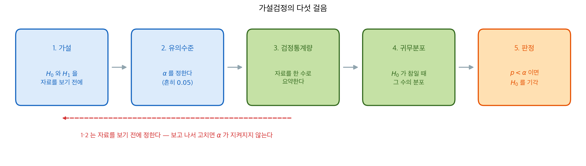

# 가설검정 시연

## 개요

가설검정은 표본자료에 근거하여 모수에 관한 결정을 내리는 형식적인 틀이다. 이 절차는 귀무가설 $H_0$(기본 주장)을 대립가설 $H_1$에 맞세우고, 검정통계량을 계산한 뒤 그 표본분포로 p-값을 얻는다. 이 페이지에서는 평균과 비율에 대한 일표본·이표본·대응 검정을 검정력 분석 및 신뢰구간과 가설검정의 쌍대성과 함께 시연한다.

아래에서 볼 검정들은 대상이 평균이든 비율이든 분산이든 **같은 다섯 걸음**을 밟는다.



달라지는 것은 3번과 4번, 곧 자료를 어떤 수로 요약하고 그 수가 $H_0$ 아래에서 어떤 분포를 따르는가뿐이다. 평균이면 $t$, 비율이면 $z$, 분산이면 $\chi^2$이 그 자리에 들어간다. 나머지 세 걸음은 검정이 바뀌어도 그대로다.

그림 아래의 붉은 화살표가 실무에서 가장 자주 깨지는 규칙이다. **1번과 2번은 자료를 본 뒤에 고치면 안 된다.** 결과를 보고 가설의 방향을 바꾸거나 $\alpha$를 올리면 그 순간 5번의 판정이 약속한 오류율을 지키지 못한다. 9.5절의 다중검정과 $p$-해킹이 모두 이 한 줄을 어긴 사례다.

## 평균에 대한 일표본 검정

모표준편차 $\sigma$를 모를 때는 **t-검정**을 쓴다. 표본평균이 $\bar{X}$이고 표본표준편차가 $S$인 확률표본 $X_1, \dots, X_n$이 주어졌을 때 $H_0\colon \mu = \mu_0$의 검정통계량은

$$
T = \frac{\bar{X} - \mu_0}{S / \sqrt{n}} \sim t_{n-1}.
$$

<div class="exbox" markdown>

**보기 1.** <span class="diff easy" title="쉬움"></span> 일표본 t-검정. 어떤 공장이 제품의 평균 무게가 500 g이라고 주장한다. 20개를 재어 아래 값을 얻었다(단위 g).

$$
498,\, 495,\, 502,\, 497,\, 501,\, 499,\, 496,\, 503,\, 494,\, 500,\,
497,\, 502,\, 496,\, 501,\, 498,\, 499,\, 495,\, 503,\, 497,\, 500
$$

**(1)** $\bar x$와 $s$를 구해 $H_0\colon \mu = 500$ 대 $H_1\colon \mu \ne 500$의 검정통계량과 양측 $p$-값을 손으로 계산하고, $\alpha = 0.05$에서 판정하시오.

**(2)** scipy의 `ttest_1samp`가 같은 값을 주는지 확인하시오.

</div>

??? success "풀이"

    **(1) 해석적으로.** 20개를 더하면 9973이므로

    $$
    \bar x = \frac{9973}{20} = 498.65
    $$

    이다. 편차제곱합은 $\sum (x_i - \bar x)^2 = 146.55$이고 자유도가 $n - 1 = 19$이므로

    $$
    s^2 = \frac{146.55}{19} = 7.713158, \qquad s = 2.777257
    $$

    이다. 표준오차는 $s/\sqrt n = 2.777257/\sqrt{20} = 0.621014$이고, 검정통계량은

    $$
    T = \frac{\bar x - \mu_0}{s/\sqrt n} = \frac{498.65 - 500}{0.621014} = \frac{-1.35}{0.621014} = -2.17387
    $$

    이다. $H_0$ 아래에서 $T \sim t_{19}$이고 $t_{19,\,0.025} = 2.09302$이므로 $|T| = 2.17387 > 2.09302$, 곧 **기각**이다. 양측 $p$-값은 대칭성에 의해

    $$
    p = 2\,P(T_{19} \le -2.17387) = 0.042561
    $$

    이다. $p = 0.0426 < 0.05$라 기각역으로 내린 판정과 일치한다. **임계값으로 보는 것과 $p$-값으로 보는 것은 같은 판정의 두 표현이다.**

    **(2) 수치적으로.**

    ```python
    import numpy as np
    from scipy import stats

    # 공장은 평균 무게가 500g이라고 주장한다.
    data = np.array([498, 495, 502, 497, 501, 499, 496, 503, 494, 500,
                     497, 502, 496, 501, 498, 499, 495, 503, 497, 500])
    mu_0 = 500
    alpha = 0.05

    # scipy의 ttest_1samp는 기본이 **양측**이고 p-값도 양측이다.
    t_stat, p_value = stats.ttest_1samp(data, mu_0)
    print(f"t = {t_stat:.4f}, p-value = {p_value:.4f}")
    print(f"Decision: {'Reject H0' if p_value < alpha else 'Fail to reject H0'}")
    ```

    출력:

    ```
    t = -2.1739, p-value = 0.0426
    Decision: Reject H0
    ```

    손으로 구한 $T = -2.17387$, $p = 0.042561$이 소수점 넷째 자리까지 그대로 나왔다.

    표본평균은 498.65로 주장값 500에서 1.35 g 모자란다. 그 자체로는 작은 차이지만 표준오차가 0.621 g밖에 안 되므로 **표준오차 단위로 재면 2.17칸**이고, 우연으로 보기 어려운 거리다. 다만 $p = 0.0426$은 0.05에 바짝 붙은 값이라는 점을 기억해 두는 것이 좋다. 스무 점 가운데 열 점은 **1 g만 올려도** $p$가 0.05를 넘어 판정이 뒤집힌다(예컨대 $499 \to 500$으로 바꾸면 $p = 0.0511$이다).

**단측** 검정 $H_1\colon \mu < \mu_0$에서는 검정통계량이 대립가설 방향에 있을 때 양측 p-값을 2로 나눈다:

<div class="exbox" markdown>

**보기 2.** <span class="diff easy" title="쉬움"></span> 단측 $p$-값 구하기. 보기 1의 자료로 이번에는 $H_1\colon \mu < 500$을 검정한다.

**(1)** 양측 $p$-값 $p_{\text{양}}$만 알고 있을 때 단측 $p$-값이

$$
p_{\text{단}} = \begin{cases} p_{\text{양}}/2 & (t < 0) \\ 1 - p_{\text{양}}/2 & (t > 0)\end{cases}
$$

임을 $t$ 분포의 대칭성에서 유도하시오.

**(2)** 보기 1의 자료에 적용해 값을 구하고, 왜 아래쪽 경우를 빠뜨리면 안 되는지 말하시오.

</div>

??? success "풀이"

    **(1) 해석적으로.** $H_1\colon \mu < \mu_0$의 단측 $p$-값은 정의상 왼쪽 꼬리다.

    $$
    p_{\text{단}} = P(T_{n-1} \le t)
    $$

    한편 양측 $p$-값은 $p_{\text{양}} = 2\,P(T_{n-1} \ge |t|)$이다. $t$ 분포는 0에 대해 대칭이므로 $P(T \ge |t|) = P(T \le -|t|)$이고, 따라서

    $$
    \frac{p_{\text{양}}}{2} = P(T_{n-1} \le -|t|)
    $$

    이다. 이제 두 경우로 갈린다.

    - $t < 0$이면 $-|t| = t$이므로 $p_{\text{단}} = P(T \le t) = p_{\text{양}}/2$이다.
    - $t > 0$이면 $-|t| = -t$이므로 $P(T \le -t) = p_{\text{양}}/2$인데 우리가 원하는 것은 $P(T \le +t)$다. 여집합을 쓰면

      $$
      p_{\text{단}} = P(T \le t) = 1 - P(T \ge t) = 1 - P(T \le -t) = 1 - \frac{p_{\text{양}}}{2}
      $$

    두 경우가 **정확히** 위 식이다. $t = 0$에서는 둘 다 $1/2$을 주므로 어느 쪽으로 갈라도 같다.

    **(2) 수치적으로.** 보기 1에서 $t = -2.17387 < 0$이고 $p_{\text{양}} = 0.042561$이므로 $p_{\text{단}} = 0.042561/2 = 0.021280$이다.

    ```python
    # 통계량이 대립가설 쪽(여기서는 음수)이면 양측 p-값을 반으로 나눈다.
    # 반대쪽이면 1에서 그 절반을 빼야 한다. 이 두 번째 경우를 빠뜨리면
    # 방향이 반대인 자료에 대해 0에 가까운 p-값을 보고하게 된다.
    p_one_sided = p_value / 2 if t_stat < 0 else 1 - p_value / 2
    print(f"one-sided p (H1: mu < 500) = {p_one_sided:.4f}")
    ```

    출력:

    ```
    one-sided p (H1: mu < 500) = 0.0213
    ```

    유도한 $0.021280$과 같다.

    **아래쪽 경우가 왜 중요한가.** 조건문 없이 늘 반으로 나누면, 자료가 대립가설과 **반대 방향**일 때 터무니없는 결과가 나온다. 가령 같은 공장에서 $\bar x = 501.35$가 나왔다면 $t = +2.17387$이라 양측 $p$는 그대로 $0.0426$인데, 반으로 나누면 $0.0213$이 되어 "평균이 500보다 작다는 강한 증거"라고 보고하게 된다. 옳은 답은 $1 - 0.0213 = 0.9787$, 곧 **증거가 전혀 없다**이다. 두 값의 차이는 44배가 아니라 결론의 방향 자체다.

    한 가지 더. 단측 $p$가 양측의 절반이니 단측 검정이 늘 유리해 보이지만, **방향은 자료를 보기 전에 정해야 한다.** 자료를 본 뒤 유리한 쪽으로 $H_1$을 고르면 실제 1종 오류율은 $\alpha$가 아니라 $2\alpha$가 된다. 이 페이지 맨 앞 그림의 붉은 화살표가 금지한 바로 그 일이다.

### 직접 계산

<div class="exbox" markdown>

**보기 3.** <span class="diff easy" title="쉬움"></span> 검정통계량 직접 계산. 보기 1의 결과를 공식만으로 다시 만들어 본다. numpy의 `std`는 기본값이 `ddof=0`이라 **모표준편차**를 준다.

**(1)** `ddof=0`을 그대로 쓰면 $|T|$가 몇 배로 부풀어 오르는지 유도하고, 그 값과 $p$-값을 구하시오.

**(2)** 두 경우를 코드로 확인하고, $\alpha = 0.05$에서 판정이 달라지는지 보시오.

</div>

??? success "풀이"

    **(1) 해석적으로.** 두 표준편차는 같은 편차제곱합 $Q = \sum (x_i - \bar x)^2$을 서로 다른 수로 나눈 것이다.

    $$
    s_1^2 = \frac{Q}{n-1}, \qquad s_0^2 = \frac{Q}{n}
    $$

    따라서 $s_0 = s_1 \sqrt{(n-1)/n}$이고, $T$의 분모가 그만큼 작아지므로

    $$
    \frac{|T_0|}{|T_1|} = \frac{s_1}{s_0} = \sqrt{\frac{n}{n-1}}
    $$

    이다. $n = 20$에서 $\sqrt{20/19} = 1.025978$이므로

    $$
    |T_0| = 2.17387 \times 1.025978 = 2.23034
    $$

    가 되고, 양측 $p$-값은 $2\,P(T_{19} \le -2.23034) = 0.037979$다. **$|T|$는 2.6% 커지고 $p$는 0.0426에서 0.0380으로 11% 줄어든다.**

    여기서 $p$-값을 쓰는 방식도 함께 짚어 두자. 양측 $p$는 "관측된 것만큼 극단적인" 확률이므로 한쪽 꼬리를 두 배 하는데, `-abs(t)`를 넣어 **왼쪽** 꼬리를 재면 $t$의 부호와 무관하게 하나의 식으로 쓸 수 있다.

    $$
    p = 2\,P(T_{n-1} \le -|t|)
    $$

    **(2) 수치적으로.**

    ```python
    n = len(data)
    xbar = data.mean()
    s = data.std(ddof=1)
    t_manual = (xbar - mu_0) / (s / np.sqrt(n))
    # 양측 p-값은 "관측된 것만큼 극단적인" 확률이므로 한쪽 꼬리를 두 배 한다.
    # -abs(t)를 넣어 왼쪽 꼬리를 재면 t의 부호와 무관하게 같은 식이 쓰인다.
    p_manual = 2 * stats.t.cdf(-abs(t_manual), df=n - 1)
    print(f"ddof=1 (옳다):  t = {t_manual:.5f}, p = {p_manual:.6f}")

    # numpy의 기본값 ddof=0 을 그대로 쓰면 어떻게 되는가.
    s0 = data.std()                      # ddof=0 — 모표준편차
    t_wrong = (xbar - mu_0) / (s0 / np.sqrt(n))
    p_wrong = 2 * stats.t.cdf(-abs(t_wrong), df=n - 1)
    print(f"ddof=0 (틀렸다): t = {t_wrong:.5f}, p = {p_wrong:.6f}")
    print(f"비 |t0|/|t1| = {abs(t_wrong / t_manual):.6f}"
          f"   sqrt(n/(n-1)) = {np.sqrt(n / (n - 1)):.6f}")
    ```

    출력:

    ```
    ddof=1 (옳다):  t = -2.17387, p = 0.042561
    ddof=0 (틀렸다): t = -2.23034, p = 0.037979
    비 |t0|/|t1| = 1.025978   sqrt(n/(n-1)) = 1.025978
    ```

    유도한 비 $\sqrt{20/19} = 1.025978$이 코드가 준 값과 소수점 여섯째 자리까지 같다. 첫 줄은 보기 1에서 scipy가 돌려준 값과도 일치한다.

    **이 자료에서는 판정이 바뀌지 않는다.** 0.0426도 0.0380도 0.05보다 작으니 둘 다 기각이다. 그러나 참 $p$가 0.05 바로 위에 있는 자료였다면 `ddof` 하나로 기각과 비기각이 갈린다. $n$이 작을수록 $\sqrt{n/(n-1)}$이 커지므로 위험도 커진다. $n = 5$에서는 11.8%, $n = 100$에서는 0.5%다.

    `scipy.stats.ttest_1samp`는 내부에서 $\text{ddof}=1$을 쓴다. 공식을 직접 쓸 때만 조심하면 된다.

## 비율에 대한 일표본 검정

$\hat{p} = x/n$으로 $H_0\colon p = p_0$을 검정할 때 Wald 검정통계량은

$$
Z = \frac{\hat{p} - p_0}{\sqrt{p_0(1 - p_0)/n}} \;\dot\sim\; N(0,1).
$$

<div class="exbox" markdown>

**보기 4.** <span class="diff easy" title="쉬움"></span> 비율에 대한 일표본 검정. 제품 200개를 검사해 불량 12개를 찾았다. 공정의 불량률이 $p_0 = 0.05$라는 주장을 검정한다.

**(1)** 표준오차에 $p_0$을 넣은 점수형 통계량 $Z_0$과 $\hat p$을 넣은 왈드형 통계량 $Z_{\hat p}$의 비 $Z_0 / Z_{\hat p}$를 $p_0$과 $\hat p$만으로 나타내고, 이 자료에서 그 값을 구하시오.

**(2)** 두 통계량과 $p$-값을 코드로 계산해 (1)의 비를 확인하고, 정확 이항검정과도 견주어 보시오.

</div>

??? success "풀이"

    **(1) 해석적으로.** 두 통계량은 분자가 같고 분모만 다르다.

    $$
    Z_0 = \frac{\hat p - p_0}{\sqrt{p_0(1-p_0)/n}}, \qquad
    Z_{\hat p} = \frac{\hat p - p_0}{\sqrt{\hat p(1-\hat p)/n}}
    $$

    그러므로 비는 분모를 뒤집은 것이고 $n$은 약분된다.

    $$
    \frac{Z_0}{Z_{\hat p}} = \sqrt{\frac{\hat p (1-\hat p)}{p_0 (1-p_0)}}
    $$

    이 자료는 $\hat p = 12/200 = 0.06$이므로 $\hat p(1-\hat p) = 0.0564$, $p_0(1-p_0) = 0.0475$이고

    $$
    \frac{Z_0}{Z_{\hat p}} = \sqrt{\frac{0.0564}{0.0475}} = \sqrt{1.187368} = 1.089664
    $$

    이다. **$\hat p$이 $p_0$보다 $1/2$에 가까우므로 $\hat p$ 기반 분산이 더 크고, 따라서 왈드형 통계량이 더 작다.** 반대로 $\hat p$가 $p_0$보다 $1/2$에서 멀면 왈드형이 커진다. 어느 쪽으로 틀리는지가 $\hat p$의 위치만으로 정해지는 셈이다.

    여기서 $p_0$을 쓰는 것이 원칙이다. 검정은 "$H_0$이 참이라면"이라는 가정 아래의 확률을 재는 일이고, $H_0$ 아래에서 $\hat p$의 분산은 $p_0(1-p_0)/n$이다. 신뢰구간에서 $\hat p$을 넣었던 것과 바로 여기서 갈린다.

    **(2) 수치적으로.**

    ```python
    from statsmodels.stats.proportion import proportions_ztest

    x, n = 12, 200  # 200개 중 불량 12개
    p_0 = 0.05
    p_hat = x / n

    # 표준오차에 p_hat이 아니라 **p_0**을 넣는다.
    # 검정은 "H0가 참이라면"이라는 가정 아래에서의 확률을 재기 때문이다.
    # 신뢰구간에서 p_hat을 넣었던 것과 여기서 갈린다.
    z_stat = (p_hat - p_0) / np.sqrt(p_0 * (1 - p_0) / n)
    p_value = 2 * stats.norm.sf(abs(z_stat))
    print(f"수동:        z = {z_stat:.4f}, p = {p_value:.4f}")

    # statsmodels는 기본적으로 p_hat 기반 표준오차를 쓴다(prop_var로 바꿀 수 있다).
    # 그래서 같은 자료에서도 z가 조금 다르게 나온다.
    z_sm, p_sm = proportions_ztest(x, n, value=p_0)
    print(f"statsmodels: z = {z_sm:.4f}, p = {p_sm:.4f}")

    # (1) 에서 유도한 비와 맞춰 본다.
    print(f"비 z0/z_phat = {z_stat / z_sm:.6f}"
          f"   sqrt(phat(1-phat)/p0(1-p0)) = "
          f"{np.sqrt(p_hat * (1 - p_hat) / (p_0 * (1 - p_0))):.6f}")

    # 정규근사를 쓰지 않는 정확 이항검정.
    print(f"정확 이항:   p = {stats.binomtest(x, n, p_0).pvalue:.4f}")
    ```

    출력:

    ```
    수동:        z = 0.6489, p = 0.5164
    statsmodels: z = 0.5955, p = 0.5515
    비 z0/z_phat = 1.089664   sqrt(phat(1-phat)/p0(1-p0)) = 1.089664
    정확 이항:   p = 0.5135
    ```

    유도한 비 $1.089664$가 코드가 준 값과 소수점 여섯째 자리까지 같다.

    두 결과가 다르다는 점이 중요하다. `proportions_ztest`는 표준오차를 $\hat p$로 계산하는 반면 위의 수동 계산은 $p_0$을 쓴다. 어느 쪽도 틀린 것은 아니지만 **교과서의 공식은 대개 $p_0$ 쪽**이다. 어느 규약을 쓰는지 모르고 결과만 옮기면 보고한 $z$가 재현되지 않는다.

    정확 이항검정이 $p = 0.5135$를 주어 $p_0$ 기반 정규근사의 $0.5164$에 가깝다. 이 자료는 $np_0 = 10$이라 정규근사의 경계선에 있는데, 결론이 전혀 유의하지 않은 쪽이어서 세 방법의 차이가 판정을 바꾸지는 않는다. 불량률이 주장값의 1.2배로 나왔지만 **$n = 200$으로는 이 정도 차이를 구별할 수 없다**는 것이 이 보기의 답이다.

## 이표본 t-검정

두 모집단에서 얻은 독립표본에 대해 귀무가설은 $H_0\colon \mu_1 = \mu_2$이다. **Welch의 t-검정**(분산이 다른 경우)은

$$
T = \frac{\bar{X}_1 - \bar{X}_2}{\sqrt{S_1^2/n_1 + S_2^2/n_2}}
$$

를 쓰며 자유도는 Welch–Satterthwaite 근사로 계산한다.

<div class="exbox" markdown>

**보기 5.** <span class="diff easy" title="쉬움"></span> 이표본 t-검정. 두 약물의 반응을 각각 10명에게서 재었다.

**(1)** $n_1 = n_2 = n$일 때 합동 $t$ 통계량과 Welch $t$ 통계량이 **정확히 같은 수**임을 보이시오.

**(2)** 그렇다면 둘은 무엇이 다른가. $n_1 = n_2 = n$에서 Welch–Satterthwaite 자유도가

$$
\nu = \frac{(n-1)(s_1^2 + s_2^2)^2}{s_1^4 + s_2^4}
$$

로 줄어듦을 보이고, 이것이 합동 자유도 $2(n-1)$을 넘지 못함을 보이시오. 자료에 적용해 확인하시오.

</div>

??? success "풀이"

    **(1) 해석적으로.** 분자는 둘 다 $\bar X_1 - \bar X_2$이므로 분모만 보면 된다. 합동분산은

    $$
    S_p^2 = \frac{(n_1-1)S_1^2 + (n_2-1)S_2^2}{n_1+n_2-2}
    $$

    인데 $n_1 = n_2 = n$을 넣으면 $(n-1)$이 약분되어 **단순평균**이 된다.

    $$
    S_p^2 = \frac{(n-1)(S_1^2+S_2^2)}{2n-2} = \frac{S_1^2+S_2^2}{2}
    $$

    따라서 합동 표준오차는

    $$
    S_p\sqrt{\frac{1}{n}+\frac{1}{n}} = \sqrt{\frac{S_1^2+S_2^2}{2}\cdot\frac{2}{n}}
    = \sqrt{\frac{S_1^2}{n}+\frac{S_2^2}{n}}
    $$

    이고, 맨 오른쪽이 바로 Welch 표준오차 $\sqrt{S_1^2/n_1 + S_2^2/n_2}$다. **두 통계량은 근사적으로 같은 것이 아니라 같은 식이다.** 표본크기가 같으면 등분산 가정은 통계량에 아무 영향을 주지 않는다.

    **(2) 해석적으로.** 그러니 차이는 **자유도**에만 남는다. Welch–Satterthwaite 식에 $n_1 = n_2 = n$을 넣는다.

    $$
    \nu = \frac{\left(\dfrac{s_1^2}{n}+\dfrac{s_2^2}{n}\right)^2}
    {\dfrac{(s_1^2/n)^2}{n-1}+\dfrac{(s_2^2/n)^2}{n-1}}
    = \frac{\dfrac{(s_1^2+s_2^2)^2}{n^2}}{\dfrac{s_1^4+s_2^4}{n^2(n-1)}}
    = \frac{(n-1)(s_1^2+s_2^2)^2}{s_1^4+s_2^4}
    $$

    $n^2$이 위아래에서 지워진다는 것이 요점이다. 이제 $a = s_1^2$, $b = s_2^2$라 두면 $(a+b)^2 \le 2(a^2+b^2)$가 항등식 $2(a^2+b^2) - (a+b)^2 = (a-b)^2 \ge 0$에서 바로 나오므로

    $$
    \nu \le \frac{(n-1)\cdot 2(s_1^4+s_2^4)}{s_1^4+s_2^4} = 2(n-1)
    $$

    이고, **등호는 $s_1^2 = s_2^2$일 때만** 성립한다. 곧 Welch 자유도는 합동 자유도보다 **언제나 작거나 같다.** 두 표본분산이 벌어질수록 깎인다. 자유도가 작으면 같은 $t$에 더 큰 $p$를 주므로 Welch가 더 보수적이다.

    **수치적으로.**

    ```python
    drug_a = np.array([5.2, 4.8, 6.1, 5.5, 4.9, 5.7, 5.3, 6.0, 5.1, 5.4])
    drug_b = np.array([4.1, 3.8, 4.5, 4.2, 3.9, 4.6, 4.0, 4.3, 3.7, 4.4])

    # scipy의 기본값은 equal_var=True(합동)이다. Welch를 쓰려면 명시해야 한다.
    # 기본값을 그대로 두고 "Welch를 썼다"고 적는 실수가 흔하다.
    t_welch, p_welch = stats.ttest_ind(drug_a, drug_b, equal_var=False)
    t_pooled, p_pooled = stats.ttest_ind(drug_a, drug_b, equal_var=True)
    print(f"Welch:  t = {t_welch:.6f}, p = {p_welch:.3e}")
    print(f"Pooled: t = {t_pooled:.6f}, p = {p_pooled:.3e}")
    print(f"통계량 차이 = {t_welch - t_pooled:.3e}")

    # 자유도를 직접 계산해 (2) 의 축약식과 맞춰 본다.
    m = len(drug_a)
    v1, v2 = drug_a.var(ddof=1), drug_b.var(ddof=1)
    nu_full = (v1 / m + v2 / m) ** 2 / ((v1 / m) ** 2 / (m - 1)
                                        + (v2 / m) ** 2 / (m - 1))
    nu_short = (m - 1) * (v1 + v2) ** 2 / (v1 ** 2 + v2 ** 2)
    print(f"s1^2 = {v1:.6f}, s2^2 = {v2:.6f}  (비 {v1 / v2:.3f})")
    print(f"Welch df: 원식 {nu_full:.4f}  축약식 {nu_short:.4f}"
          f"   합동 df = {2 * (m - 1)}")
    print(f"p 비 (Welch/합동) = {p_welch / p_pooled:.4f}")
    ```

    출력:

    ```
    Welch:  t = 7.462779, p = 1.314e-06
    Pooled: t = 7.462779, p = 6.500e-07
    통계량 차이 = 0.000e+00
    s1^2 = 0.188889, s2^2 = 0.091667  (비 2.061)
    Welch df: 원식 16.0702  축약식 16.0702   합동 df = 18
    p 비 (Welch/합동) = 2.0218
    ```

    **통계량 차이가 부동소수점 수준에서도 정확히 0이다.** (1)의 유도대로다. 축약식 $16.0702$도 원식과 같은 값을 준다.

    자유도는 $16.07$과 $18$로 갈린다. 두 표본분산의 비가 $2.06$이라 등호 조건에서 꽤 멀어진 탓이다. 그 결과 **같은 $t = 7.4628$에 Welch는 $p = 1.31\times10^{-6}$, 합동은 $6.50\times10^{-7}$을 주어 2.02배 차이**가 난다. 여기서는 둘 다 압도적으로 유의하므로 결론이 같지만, $p$가 0.05 근처였다면 자유도 2칸이 판정을 바꿀 수 있다.

    표본크기가 **다르고** 분산도 다를 때 비로소 통계량 자체가 갈라진다. 그때는 (1)의 약분이 일어나지 않기 때문이다.

## 대응 t-검정

관측값이 자연스러운 쌍을 이룰 때(예: 전후 측정) 차이 $D_i = X_i^{(\text{after})} - X_i^{(\text{before})}$를 계산하고 $H_0\colon \mu_D = 0$을 검정한다:

$$
T = \frac{\bar{D}}{S_D / \sqrt{n}} \sim t_{n-1}.
$$

<div class="exbox" markdown>

**보기 6.** <span class="diff easy" title="쉬움"></span> 대응 t-검정. 열 사람의 혈압을 처리 전후로 재었다. 같은 자료를 (가) 대응 검정으로, (나) 짝을 무시한 독립 이표본 검정으로 분석한다.

**(1)** $n_1 = n_2 = n$일 때 두 통계량의 비가

$$
\frac{\lvert T_{\text{대응}} \rvert}{\lvert T_{\text{독립}} \rvert}
= \sqrt{\frac{s_1^2 + s_2^2}{s_1^2 + s_2^2 - 2 r s_1 s_2}}
$$

임을 보이시오($r$은 두 측정의 표본상관계수). $s_1 = s_2$이면 이것이 $1/\sqrt{1-r}$로 줄어듦도 확인하시오.

**(2)** 자료에서 $r$을 재어 (1)의 비를 예측하고, 실제 두 통계량의 비와 맞춰 보시오. 짝을 무시하면 무엇을 잃는가.

</div>

??? success "풀이"

    **(1) 해석적으로.** 먼저 분자가 같다는 데서 시작한다. $D_i = X_i^{(2)} - X_i^{(1)}$이라 두면 $\bar D = \bar X_2 - \bar X_1$이므로 **두 통계량의 분자는 글자 그대로 같은 수**다. 분모만 다르다.

    $$
    T_{\text{대응}} = \frac{\bar D}{s_D/\sqrt n}, \qquad
    T_{\text{독립}} = \frac{\bar D}{s_p\sqrt{2/n}}
    $$

    보기 5에서 $n_1 = n_2 = n$일 때 $s_p^2 = (s_1^2+s_2^2)/2$였으므로

    $$
    s_p\sqrt{\frac{2}{n}} = \sqrt{\frac{s_1^2+s_2^2}{n}}
    $$

    이고, 비는 분모를 뒤집은 것이다. $\sqrt n$이 약분되어

    $$
    \frac{\lvert T_{\text{대응}} \rvert}{\lvert T_{\text{독립}} \rvert}
    = \frac{\sqrt{s_1^2+s_2^2}}{s_D}
    $$

    가 된다. 이제 $s_D$를 원래 두 측정의 통계량으로 쓴다. 표본분산의 전개식에서

    $$
    s_D^2 = s_1^2 + s_2^2 - 2\,\widehat{\text{Cov}} = s_1^2 + s_2^2 - 2 r s_1 s_2
    $$

    이므로 이를 넣으면 주어진 식이 나온다. $s_1 = s_2 = s$이면 분자가 $2s^2$, 분모가 $2s^2 - 2rs^2 = 2s^2(1-r)$이라

    $$
    \frac{\lvert T_{\text{대응}} \rvert}{\lvert T_{\text{독립}} \rvert} = \frac{1}{\sqrt{1-r}}
    $$

    이다. **$r$이 1에 가까울수록 대응 검정의 이득이 폭발한다.** $r = 0$이면 비가 1이라 짝짓기가 아무 도움이 안 되고, $r < 0$이면 오히려 손해다.

    **(2) 수치적으로.**

    ```python
    before = np.array([145, 150, 138, 155, 142, 148, 136, 152, 140, 146])
    after  = np.array([138, 142, 130, 148, 135, 140, 132, 145, 134, 139])

    t_stat, p_value = stats.ttest_rel(after, before)
    print(f"ttest_rel:   t = {t_stat:.4f}, p = {p_value:.8f}")

    # 대응검정은 차이에 대한 일표본 검정과 **같은 것**이다. 별개의 방법이 아니다.
    diff = after - before
    t_stat2, p_value2 = stats.ttest_1samp(diff, 0)
    print(f"ttest_1samp: t = {t_stat2:.4f}, p = {p_value2:.8f}")

    # 짝을 무시하고 독립 이표본으로 다루면 어떻게 되는지 비교해 본다.
    t_ind, p_ind = stats.ttest_ind(after, before)
    print(f"ttest_ind:   t = {t_ind:.4f}, p = {p_ind:.8f}")

    # (1) 의 식을 확인한다.
    s1, s2 = before.std(ddof=1), after.std(ddof=1)
    r = np.corrcoef(before, after)[0, 1]
    s_d = diff.std(ddof=1)
    print(f"\ns1 = {s1:.4f}, s2 = {s2:.4f}, r = {r:.6f}")
    print(f"s_D 관측 {s_d:.6f}"
          f"   식 {np.sqrt(s1**2 + s2**2 - 2 * r * s1 * s2):.6f}")
    print(f"통계량 비 관측 {abs(t_stat / t_ind):.6f}"
          f"   식 {np.sqrt((s1**2 + s2**2) / s_d**2):.6f}"
          f"   (s1=s2 어림 1/sqrt(1-r) = {1 / np.sqrt(1 - r):.4f})")
    ```

    출력:

    ```
    ttest_rel:   t = -18.2253, p = 0.00000002
    ttest_1samp: t = -18.2253, p = 0.00000002
    ttest_ind:   t = -2.5841, p = 0.01871524

    s1 = 6.2147, s2 = 5.7164, r = 0.983321
    s_D 관측 1.197219   식 1.197219
    통계량 비 관측 7.052956   식 7.052956   (s1=s2 어림 1/sqrt(1-r) = 7.7430)
    ```

    앞의 두 줄이 완전히 같다. **대응 $t$-검정은 별개의 방법이 아니라 차이에 대한 일표본 검정 그 자체다.**

    (1)의 두 식이 모두 맞는다. $s_D$는 소수점 여섯째 자리까지 일치하고, 통계량 비도 $7.052956$으로 정확히 들어맞는다. 반면 $s_1 = s_2$를 가정한 어림식 $1/\sqrt{1-r} = 7.743$은 10% 벗어난다. 두 표준편차가 $6.21$과 $5.72$로 같지 않기 때문이며, **어림식은 어림식일 뿐**이라는 것을 보여 준다.

    **짝을 무시하면 무엇을 잃는가.** 같은 자료를 짝만 무시하고 분석하면 $t$가 $-18.23$에서 $-2.58$로, $p$가 $2.06\times10^{-8}$에서 $0.0187$로 **백만 배 가까이** 뛴다. 사람마다 혈압 수준이 136에서 155까지 흩어져 있고(표준편차 $6.2$) 그 개인차가 처리 효과를 덮어 버리기 때문이다. 짝을 지으면 그 개인차가 뺄셈으로 사라져 산포가 $6.2$에서 $1.2$로 줄어든다. 여기서는 두 검정 모두 5% 수준에서 기각하지만, 효과가 조금만 작았다면 짝을 무시한 쪽은 놓쳤을 것이다.

    대가도 있다. 대응 검정의 자유도는 $n - 1 = 9$인데 독립 검정은 $2n - 2 = 18$이다. **자유도 절반을 내주고 산포 감소를 사는 것**이며, $r$이 충분히 크지 않으면 이 거래가 손해다.

## 검정력 분석

검정의 **검정력**은 $H_1$이 참일 때 $H_0$을 올바르게 기각할 확률이다:

$$
\text{Power} = 1 - \beta = P(\text{reject } H_0 \mid H_1 \text{ true}).
$$

<div class="exbox" markdown>

**보기 7.** <span class="diff easy" title="쉬움"></span> 검정력 분석. 두 설계의 표본크기를 정한다. 하나는 $\sigma = 15$에서 5점 차이를 보려는 일표본 검정이고($d = 1/3$), 다른 하나는 중간 크기 효과 $d = 0.5$를 보려는 이표본 검정이다. 둘 다 $\alpha = 0.05$ 양측, 목표 검정력 $0.80$이다.

**(1)** $z$ 검정 공식 $n = \left((z_{\alpha/2}+z_\beta)/d\right)^2$(일표본)과 $n = 2\left((z_{\alpha/2}+z_\beta)/d\right)^2$(집단당, 이표본)으로 표본크기를 구하시오.

**(2)** `statsmodels`가 돌려주는 값은 (1)보다 크다. 왜 그런가. 올림한 (1)의 답에서 **실제** 검정력이 얼마인지 비중심 $t$로 재어 확인하시오.

</div>

??? success "풀이"

    **(1) 해석적으로.** $z_{0.025} = 1.959964$, $z_{0.20} = 0.841621$이므로 합은 $2.801585$다. 일표본은 $d = 5/15 = 1/3$이라

    $$
    n = \left(\frac{2.801585}{1/3}\right)^2 = 8.404755^2 = 70.64 \;\to\; 71
    $$

    이고, 이표본은 $d = 0.5$이지만 차이의 표준오차에 $\sqrt{2}$가 붙으므로 집단당

    $$
    n = 2\left(\frac{2.801585}{0.5}\right)^2 = 2 \times 5.603170^2 = 62.79 \;\to\; 63
    $$

    이다. 계수 2가 붙는 까닭은 $\text{Var}(\bar X_1 - \bar X_2) = 2\sigma^2/n$이기 때문이다. **평균을 두 개 추정하면 표준오차가 $\sqrt 2$배가 되고, 표본크기는 그 제곱인 2배가 필요하다.**

    **(2) $z$ 공식은 두 군데에서 낙관적이다.** 첫째, $\sigma$를 안다고 가정해 임계값에 $z_{\alpha/2} = 1.96$을 쓰지만 실제로는 $S$를 추정하므로 임계값이 $t_{\alpha/2,\,n-1}$로 더 크다. 둘째, $H_1$ 아래에서 $T$가 따르는 분포가 "평균이 옮겨진 정규"가 아니라 **비중심 $t$ 분포**다. 분모의 $S$가 흔들리는 만큼 꼬리가 두꺼워 기각역 안으로 들어갈 확률이 덜 오른다.

    올바른 검정력은 비중심모수 $\lambda = d\sqrt n$(일표본), $\lambda = d\sqrt{n/2}$(집단당 $n$인 이표본)에 대해

    $$
    1-\beta = P\!\left(T'_{\nu,\lambda} > t_{\alpha/2,\nu}\right)
    + P\!\left(T'_{\nu,\lambda} < -t_{\alpha/2,\nu}\right)
    $$

    이다. 둘째 항은 여기서 $10^{-8}$ 아래라 사실상 무시된다.

    ```python
    from statsmodels.stats.power import TTestPower, TTestIndPower

    # 일표본: sigma=15에서 5점 차이를 탐지하려 한다.
    # 검정력 계산에 들어가는 것은 delta도 sigma도 아니고 그 비(효과크기)뿐이다.
    analysis = TTestPower()
    effect_size = 5 / 15  # Cohen's d
    n_needed = analysis.solve_power(effect_size=effect_size, alpha=0.05,
                                     power=0.80, alternative='two-sided')
    print(f"one-sample n = {n_needed:.1f}")

    # 이표본: 중간 크기 효과(d=0.5). ratio는 두 집단 크기의 비이고
    # 돌려주는 n_each는 **집단당** 표본크기다. 전체가 아니다.
    analysis2 = TTestIndPower()
    n_each = analysis2.solve_power(effect_size=0.5, alpha=0.05, power=0.80,
                                    ratio=1.0, alternative='two-sided')
    print(f"two-sample n per group = {n_each:.1f}")

    # (1) 의 z 공식과 견준다.
    z_a, z_b = stats.norm.ppf(0.975), stats.norm.ppf(0.80)
    print(f"\nz 공식: 일표본 {((z_a + z_b) / effect_size) ** 2:.2f}"
          f"   이표본(집단당) {2 * ((z_a + z_b) / 0.5) ** 2:.2f}")

    def power_nct(n, d, two_sample):
        """비중심 t 로 계산한 양측검정의 검정력."""
        nu = 2 * n - 2 if two_sample else n - 1
        lam = d * np.sqrt(n / 2) if two_sample else d * np.sqrt(n)
        tc = stats.t.ppf(0.975, nu)
        return stats.nct.sf(tc, nu, lam) + stats.nct.cdf(-tc, nu, lam)

    print("\n일표본 — z 공식이 고른 71 과 statsmodels 가 고른 73")
    for n in (71, 72, 73):
        print(f"  n = {n}:  검정력 {power_nct(n, effect_size, False):.4f}")
    print("이표본(집단당) — z 공식이 고른 63 과 statsmodels 가 고른 64")
    for n in (63, 64):
        print(f"  n = {n}:  검정력 {power_nct(n, 0.5, True):.4f}")
    ```

    출력:

    ```
    one-sample n = 72.6
    two-sample n per group = 63.8

    z 공식: 일표본 70.64   이표본(집단당) 62.79

    일표본 — z 공식이 고른 71 과 statsmodels 가 고른 73
      n = 71:  검정력 0.7910
      n = 72:  검정력 0.7967
      n = 73:  검정력 0.8023
    이표본(집단당) — z 공식이 고른 63 과 statsmodels 가 고른 64
      n = 63:  검정력 0.7952
      n = 64:  검정력 0.8015
    ```

    (1)에서 손으로 구한 $70.64$와 $62.79$가 코드의 `z 공식` 줄과 소수점 둘째 자리까지 같다.

    **$z$ 공식의 답은 실제로 모자란다.** 일표본에서 $n = 71$의 참 검정력은 $0.7910$으로 목표 $0.80$에 못 미치고, $0.80$을 넘기려면 $n = 73$이 필요하다. 두 개를 더 모아야 하니 2.8% 더 든다. 이표본에서는 $n = 63$이 $0.7952$라 한 명만 더하면 되고 오차가 작다. **자유도가 클수록 $t$가 정규에 가까워지므로 $z$ 공식의 낙관이 줄어든다.** 거꾸로 $n$이 작은 설계에서는 이 차이가 커지므로 $z$ 공식을 그대로 쓰면 안 된다.

    올림하면 일표본은 73개, 이표본은 집단당 64개(합계 128개)다. 효과크기가 $0.33$에서 $0.5$로 **커졌는데도** 전체 표본이 더 필요하다. (1)에서 본 계수 2가 효과크기 제곱의 이득 $(0.5/0.333)^2 = 2.25$보다는 작으므로 집단당 수는 줄었지만($73 \to 64$), 집단이 둘이라 합계는 $128$로 늘어난다.

## 신뢰구간과 검정의 쌍대성

수준 $\alpha$의 양측검정이 $H_0\colon \mu = \mu_0$을 기각하지 못할 필요충분조건은 $\mu_0$이 $100(1-\alpha)\%$ 신뢰구간 안에 있는 것이다.

<div class="exbox" markdown>

**보기 8.** <span class="diff easy" title="쉬움"></span> 신뢰구간과 검정의 쌍대성. 자료 $52, 48, 55, 50, 47, 53, 49, 51, 54, 46$을 쓴다.

**(1)** 95% 신뢰구간을 손으로 구하고, $\mu_0$을 구간의 끝점에 놓으면 양측 $p$-값이 **정확히** $0.05$가 됨을 보이시오.

**(2)** $\mu_0 = 48, \dots, 53$에서 기각 여부와 구간 포함 여부를 나란히 찍어 두 열이 언제나 반대임을 확인하시오. $p$-값이 왜 $\bar x$에 대해 대칭인가.

</div>

??? success "풀이"

    **(1) 해석적으로.** 자료 열 개를 더하면 505이므로 $\bar x = 50.5$다. 편차제곱합은 $\sum (x_i-\bar x)^2 = 82.5$이고 자유도가 9이므로

    $$
    s^2 = \frac{82.5}{9} = 9.166667, \qquad s = 3.027650
    $$

    이다. $t_{9,\,0.025} = 2.262157$이라 오차한계는

    $$
    \text{ME} = 2.262157 \times \frac{3.027650}{\sqrt{10}} = 2.262157 \times 0.957427 = 2.165851
    $$

    이고 구간은 $(50.5 - 2.165851,\ 50.5 + 2.165851) = (48.334149,\ 52.665851)$이다.

    끝점에서의 $p$-값은 따로 계산할 것이 없다. $\mu_0 = \bar x - \text{ME}$를 통계량에 넣으면

    $$
    T = \frac{\bar x - (\bar x - \text{ME})}{s/\sqrt n} = \frac{\text{ME}}{s/\sqrt n}
    = t_{9,\,0.025}
    $$

    이 되어 통계량이 임계값과 **똑같아진다.** 그러면 양측 $p$-값은 정의상

    $$
    p = 2\,P(T_9 \ge t_{9,\,0.025}) = 2 \times 0.025 = 0.05
    $$

    이다. 다른 끝점도 대칭이므로 같다. **구간의 경계가 바로 $p = \alpha$인 자리**이고, 이것이 쌍대성의 알맹이다. 두 명제가 닮았다는 것이 아니라 $\lvert T \rvert > t_{\alpha/2}$와 $\mu_0 \notin$ 구간이 **같은 사건**이다.

    (2)의 대칭성도 여기서 따라온다. $\mu_0$에서의 통계량은 $T(\mu_0) = (\bar x - \mu_0)/(s/\sqrt n)$이라 $\mu_0$의 **일차함수**이고, $\bar x$에서 같은 거리에 있는 두 값 $\bar x \pm c$는 $T$의 부호만 뒤집은 값을 준다. 양측 $p$-값은 $\lvert T \rvert$에만 의존하므로 두 값의 $p$가 같다.

    **(2) 수치적으로.**

    ```python
    data = np.array([52, 48, 55, 50, 47, 53, 49, 51, 54, 46])
    n = len(data)
    xbar = data.mean()
    s = data.std(ddof=1)
    alpha = 0.05

    t_c = stats.t.ppf(1 - alpha / 2, df=n - 1)
    me = t_c * s / np.sqrt(n)
    ci = (xbar - me, xbar + me)
    print(f"xbar = {xbar}, s = {s:.6f}, t_c = {t_c:.6f}, ME = {me:.6f}")
    print(f"95% CI = ({ci[0]:.6f}, {ci[1]:.6f})\n")

    # 여러 mu_0에 대해 검정을 반복하며 "기각 여부"와 "구간 포함 여부"를 나란히 본다.
    # 두 열이 언제나 정확히 반대여야 한다. 그것이 쌍대성이다.
    print(f"{'mu0':>5} {'p-value':>9} {'reject':>7} {'in CI':>6}")
    for mu0 in [48, 49, 50, 51, 52, 53]:
        t_stat, p_val = stats.ttest_1samp(data, mu0)
        in_ci = ci[0] <= mu0 <= ci[1]
        reject = p_val < alpha
        print(f"{mu0:>5} {p_val:>9.4f} {str(reject):>7} {str(in_ci):>6}")

    # (1) 에서 예측한 대로 끝점에서는 p 가 정확히 0.05 여야 한다.
    for end in ci:
        print(f"mu0 = {end:.6f} (구간 끝점)  p = "
              f"{stats.ttest_1samp(data, end).pvalue:.10f}")
    ```

    출력:

    ```
    xbar = 50.5, s = 3.027650, t_c = 2.262157, ME = 2.165851
    95% CI = (48.334149, 52.665851)

      mu0   p-value  reject  in CI
       48    0.0282    True  False
       49    0.1516   False   True
       50    0.6141   False   True
       51    0.6141   False   True
       52    0.1516   False   True
       53    0.0282    True  False
    mu0 = 48.334149 (구간 끝점)  p = 0.0500000000
    mu0 = 52.665851 (구간 끝점)  p = 0.0500000000
    ```

    (1)에서 손으로 구한 $s = 3.027650$, $t_c = 2.262157$, $\text{ME} = 2.165851$, 구간 $(48.334149, 52.665851)$이 모두 그대로 나왔다. 끝점에서의 $p$-값도 소수점 열째 자리까지 $0.05$다.

    `reject` 열과 `in CI` 열이 여섯 줄 모두에서 정확히 반대다. 신뢰구간 $(48.33, 52.67)$ 밖에 있는 48과 53만 기각된다.

    $p$-값이 구간의 중심 $\bar x = 50.5$를 기준으로 대칭인 것도 눈여겨볼 만하다. 49와 52가 둘 다 $0.1516$, 48과 53이 둘 다 $0.0282$다. (1)에서 본 대로 $T(\mu_0)$이 $\mu_0$의 일차함수여서, $\bar x$에서 같은 거리에 있는 두 값이 부호만 다른 통계량을 주기 때문이다.

    **신뢰구간은 이런 검정들을 $\mu_0$에 대해 전부 돌려 놓고 기각되지 않는 값만 모아 놓은 것**과 같다. 거꾸로 읽으면, 구간 하나를 보고하면 모든 $\mu_0$에 대한 검정 결과를 한꺼번에 보고하는 셈이다. 검정은 고른 $\mu_0$ 하나에 대한 판정만 준다. 구간을 주 보고 수단으로 권하는 이유가 이것이다.

### 해석

쌍대성 원리는 다음을 말한다:

$$
\mu_0 \notin \left(\bar{X} \pm t_{\alpha/2,\,n-1}\,\frac{S}{\sqrt{n}}\right) \iff \text{reject } H_0\colon \mu = \mu_0 \text{ at level } \alpha.
$$

이는 통합된 관점을 준다: 신뢰구간을 구성하는 일은 가설검정의 가족을 뒤집는 일과 같다.

## 연습문제

<div class="drillbox" markdown>

**연습문제 1.** <span class="diff easy" title="쉬움"></span> 전구 $n=16$개의 표본에서 $\bar{x}=1020$시간, $s=80$시간을 얻었다. $\alpha=0.05$에서 $H_0\colon \mu=1000$ 대 $H_1\colon \mu>1000$을 검정하라. 검정통계량, p-값, 판정을 제시하라.

</div>

??? success "풀이"

    검정통계량은

    $$
    T = \frac{1020 - 1000}{80/\sqrt{16}} = \frac{20}{20} = 1.0.
    $$

    $H_0$ 아래에서 $T \sim t_{15}$이다. 단측 p-값은

    $$
    p = P(T_{15} \geq 1.0) \approx 0.1667.
    $$

    $p = 0.1667 > 0.05$이므로 $H_0$을 기각하지 못한다. 평균 수명이 1000시간을 넘는다는 증거가 부족하다. $\square$

<div class="drillbox" markdown>

**연습문제 2.** <span class="diff easy" title="쉬움"></span> 유권자 400명 조사에서 228명이 어떤 안건을 지지한다. 1% 유의수준에서 참 비율이 0.50을 넘는지 검정하라.

</div>

??? success "풀이"

    $\hat{p} = 228/400 = 0.57$이고 $H_0\colon p = 0.50$ 대 $H_1\colon p > 0.50$을 검정한다. 검정통계량은

    $$
    Z = \frac{0.57 - 0.50}{\sqrt{0.50 \times 0.50 / 400}} = \frac{0.07}{0.025} = 2.80.
    $$

    단측 p-값은 $P(Z \geq 2.80) \approx 0.0026 < 0.01$이므로 $H_0$을 기각한다. 유권자의 절반 넘는 비율이 이 안건을 지지한다는 강한 증거이다. $\square$

<div class="drillbox" markdown>

**연습문제 3.** <span class="diff easy" title="쉬움"></span> 독립인 두 집단에서 $\bar{x}_1=75$, $s_1=10$, $n_1=20$과 $\bar{x}_2=70$, $s_2=12$, $n_2=25$를 얻었다. $\alpha=0.05$에서 $H_0\colon \mu_1 = \mu_2$의 Welch t-검정을 수행하라. Welch–Satterthwaite 자유도의 공식을 함께 쓰라.

</div>

??? success "풀이"

    검정통계량은

    $$
    T = \frac{75 - 70}{\sqrt{10^2/20 + 12^2/25}} = \frac{5}{\sqrt{5 + 5.76}} = \frac{5}{\sqrt{10.76}} \approx \frac{5}{3.280} \approx 1.524.
    $$

    Welch–Satterthwaite 자유도는

    $$
    \nu = \frac{\left(\frac{s_1^2}{n_1} + \frac{s_2^2}{n_2}\right)^2}{\frac{(s_1^2/n_1)^2}{n_1-1} + \frac{(s_2^2/n_2)^2}{n_2-1}} = \frac{(5 + 5.76)^2}{\frac{25}{19} + \frac{33.18}{24}} \approx \frac{115.78}{1.316 + 1.382} \approx 42.9.
    $$

    $\nu \approx 42$를 쓰면 양측 p-값이 약 0.135이다. $p > 0.05$이므로 $H_0$을 기각하지 못한다. $\square$

<div class="drillbox" markdown>

**연습문제 4.** <span class="diff med" title="중간"></span> 신뢰구간과 검정의 쌍대성을 증명하라. 즉 수준 $\alpha$의 양측 일표본 t-검정에서 $H_0\colon \mu = \mu_0$을 기각하는 것이 $\mu_0$이 $100(1-\alpha)\%$ 신뢰구간 밖에 있는 것과 동등함을 보여라.

</div>

??? success "풀이"

    이 검정은 $|T| > t_{\alpha/2,\,n-1}$일 때 $H_0$을 기각한다. 즉,

    $$
    \left|\frac{\bar{X} - \mu_0}{S/\sqrt{n}}\right| > t_{\alpha/2,\,n-1}.
    $$

    이는 다음과 동등하다:

    $$
    |\bar{X} - \mu_0| > t_{\alpha/2,\,n-1}\,\frac{S}{\sqrt{n}},
    $$

    즉 $\mu_0 < \bar{X} - t_{\alpha/2,\,n-1}\,S/\sqrt{n}$이거나 $\mu_0 > \bar{X} + t_{\alpha/2,\,n-1}\,S/\sqrt{n}$이다. 다시 말해,

    $$
    \mu_0 \notin \left(\bar{X} - t_{\alpha/2,\,n-1}\,\frac{S}{\sqrt{n}},\; \bar{X} + t_{\alpha/2,\,n-1}\,\frac{S}{\sqrt{n}}\right).
    $$

    오른쪽의 구간이 바로 $\mu$의 $100(1-\alpha)\%$ 신뢰구간이다. 따라서 수준 $\alpha$에서 이 검정이 $H_0\colon \mu=\mu_0$을 기각할 필요충분조건은 $\mu_0$이 신뢰구간에 들어 있지 않은 것이다. $\square$

<div class="drillbox" markdown>

**연습문제 5.** <span class="diff med" title="중간"></span> 일표본 z-검정의 검정력 공식을 써서, ($\sigma$를 아는) 양측검정에서 이동 $\delta$를 유의수준 $\alpha$에서 검정력 $1-\beta$로 탐지하는 데 필요한 표본크기가

$$
n = \left(\frac{(z_{\alpha/2} + z_\beta)\,\sigma}{\delta}\right)^2
$$

임을 보여라.

</div>

??? success "풀이"

    $H_0$ 아래에서 $Z = (\bar{X}-\mu_0)/(\sigma/\sqrt{n}) \sim N(0,1)$이고 $|Z|>z_{\alpha/2}$일 때 기각한다. $H_1\colon \mu = \mu_0 + \delta$ 아래에서 이 통계량은 $Z \sim N(\delta\sqrt{n}/\sigma,\,1)$을 따른다. ($\delta>0$일 때 지배적인 오른쪽 꼬리만 보면) 검정력은

    $$
    1 - \beta = P\!\left(Z > z_{\alpha/2}\right) = P\!\left(N(0,1) > z_{\alpha/2} - \frac{\delta\sqrt{n}}{\sigma}\right).
    $$

    이를 $1-\beta$와 같다고 놓으면

    $$
    z_{\alpha/2} - \frac{\delta\sqrt{n}}{\sigma} = -z_\beta,
    $$

    따라서

    $$
    \frac{\delta\sqrt{n}}{\sigma} = z_{\alpha/2} + z_\beta \implies \sqrt{n} = \frac{(z_{\alpha/2}+z_\beta)\,\sigma}{\delta}.
    $$

    양변을 제곱하면 원하는 공식을 얻는다. $\square$

<div class="drillbox" markdown>

**연습문제 6.** <span class="diff hard" title="어려움"></span>
**네이만-피어슨 보조정리**를 진술하고, 단순가설 대 단순가설에서 우도비 검정이 최강력임을 증명하라.

</div>

??? success "풀이"
    **진술.** $H_0:\theta=\theta_0$ 대 $H_1:\theta=\theta_1$(둘 다 단순가설)에서, 기각역

    $$
    C=\left\{\mathbf x:\ \frac{L(\theta_1;\mathbf x)}{L(\theta_0;\mathbf x)}>k\right\}
    $$

    가 $P_{\theta_0}(C)=\alpha$를 만족하면, $C$는 **수준 $\alpha$인 모든 검정 중 검정력이 최대**다.

    **증명.** $\phi$를 $C$의 지시함수, $\psi$를 다른 수준 $\alpha$ 검정의 검정함수라 하자($0\le\psi\le1$, $E_{\theta_0}[\psi]\le\alpha$).

    핵심은 다음 부등식이 **모든 $\mathbf x$에서** 성립한다는 것이다.

    $$
    \left\{\phi(\mathbf x)-\psi(\mathbf x)\right\}\left\{L_1(\mathbf x)-kL_0(\mathbf x)\right\}\ \ge\ 0
    $$

    - $L_1>kL_0$이면 $\phi=1\ge\psi$이므로 두 인수가 모두 $\ge0$.
    - $L_1<kL_0$이면 $\phi=0\le\psi$이므로 두 인수가 모두 $\le0$.
    - $L_1=kL_0$이면 둘째 인수가 0.

    양변을 적분하면

    $$
    \int(\phi-\psi)L_1\ \ge\ k\int(\phi-\psi)L_0=k\left\{\alpha-E_{\theta_0}[\psi]\right\}\ \ge\ 0
    $$

    이므로 $E_{\theta_1}[\phi]\ge E_{\theta_1}[\psi]$, 즉 $C$의 검정력이 더 크다. $\square$

    **직관.** 가능도비가 큰 표본부터 기각역에 넣는 것이 "**제1종 오류 예산 $\alpha$를 가장 효율적으로 쓰는**" 방법이다. 배낭 문제에서 가치/무게 비가 높은 것부터 담는 것과 같은 논리다.

    **예 — 정규평균.** $N(\mu,\sigma^2)$, $\sigma$ 기지, $H_0:\mu=0$ 대 $H_1:\mu=\delta>0$이면

    $$
    \frac{L_1}{L_0}=\exp\left\{\frac{\delta}{\sigma^2}\sum x_i-\frac{n\delta^2}{2\sigma^2}\right\}>k
    \iff \bar x>c
    $$

    로 **$\bar X$가 크면 기각**하는 통상의 $z$ 검정이 나온다. $\delta$의 구체적인 값이 $c$에 들어가지 않으므로, **모든 $\delta>0$에 대해 같은 검정**이다. 이 경우 검정이 **일양최강력(UMP)** 이 된다.

    **한계.**

    1. **양측 대립에서는 UMP가 없다.** $\delta>0$과 $\delta<0$에서 최강력 기각역의 방향이 반대라, 하나의 검정이 둘 다 최적일 수 없다. 이때는 **불편성**이나 **불변성**을 추가로 요구해 최적 검정을 특정한다.
    2. **복합가설·다차원 모수**에서는 일반적으로 UMP가 없다. 우도비 검정이 그 대안으로 쓰인다.
    3. **이산분포에서는 정확히 $\alpha$를 못 맞춘다.** 엄밀한 진술에는 경계에서의 무작위화가 들어간다.

<div class="drillbox" markdown>

**연습문제 7.** <span class="diff med" title="중간"></span>
**일반화 우도비검정**의 구성과 윌크스 정리를 설명하고, 자유도를 어떻게 세는지 예로 보여라.

</div>

??? success "풀이"
    **구성.** 모수공간 $\Theta$와 귀무공간 $\Theta_0\subset\Theta$에 대해

    $$
    \Lambda=\frac{\sup_{\theta\in\Theta_0}L(\theta)}{\sup_{\theta\in\Theta}L(\theta)}\in(0,1],
    \qquad
    G^2=-2\log\Lambda
    $$

    $\Lambda$가 작으면(제약을 걸었을 때 가능도가 많이 떨어지면) 기각한다.

    **윌크스 정리.** 정칙 조건 아래 $H_0$이 참이면

    $$
    G^2\ \xrightarrow{d}\ \chi^2_r,\qquad r=\dim\Theta-\dim\Theta_0
    $$

    **자유도는 "제약의 개수"** 다.

    **자유도 세기 — 네 예.**

    | 모형 | $\dim\Theta$ | $\dim\Theta_0$ | $r$ |
    |---|---|---|---|
    | $N(\mu,\sigma^2)$에서 $H_0:\mu=0$ | 2 | 1 | 1 |
    | $N(\mu,\sigma^2)$에서 $H_0:\mu=0,\sigma=1$ | 2 | 0 | 2 |
    | 다항 $k$범주에서 균등성 | $k-1$ | 0 | $k-1$ |
    | 회귀 $p$개 변수 중 $q$개가 0 | $p+1$ | $p+1-q$ | $q$ |

    **예 — 이항.** $H_0:p=0.5$, $n=30$, $k=22$.

    $$
    G^2=2\left\{k\log\frac{\hat p}{p_0}+(n-k)\log\frac{1-\hat p}{1-p_0}\right\}
    $$

    ```python
    import numpy as np
    from scipy import stats

    n, k, p0 = 30, 22, 0.5
    ph = k / n
    G2 = 2 * (k * np.log(ph / p0) + (n - k) * np.log((1 - ph) / (1 - p0)))
    print(f"G² = {G2:.4f}   df = 1   p = {stats.chi2.sf(G2, 1):.4f}")
    ```

    ```text
    G² = 6.7939   df = 1   p = 0.0091
    ```

    **주의할 정칙 조건.**

    1. **$\theta_0$가 모수공간의 내부점이어야 한다.** 분산성분처럼 $H_0:\sigma_b^2=0$이 경계면 극한분포가 $\chi^2$가 아니라 **혼합분포** $\tfrac12\chi^2_0+\tfrac12\chi^2_1$이다. 그냥 $\chi^2_1$을 쓰면 보수적이 된다.

    2. **모형이 겹쳐 있어야(nested) 한다.** 겹치지 않는 모형 비교에는 윌크스 정리가 적용되지 않는다. AIC나 복스 검정을 쓴다.

    3. **식별 가능해야 한다.** 혼합모형의 성분 수 검정처럼 $H_0$ 아래에서 일부 모수가 식별되지 않으면 극한분포가 표준이 아니다.

    4. **$n$이 충분해야 한다.** 소표본에서는 $\chi^2$ 근사가 나쁘다. **바틀렛 보정**이나 부트스트랩으로 개선한다.

    **왜 우도비를 쓰는가.**

    - **불변이다.** 모수를 다시 매개화해도 $\Lambda$가 변하지 않는다. 왈드 검정은 그렇지 않다.
    - **일반적이다.** 어떤 겹친 모형 쌍에도 적용된다.
    - **좋은 성질.** 넓은 조건에서 점근적으로 최적(국소최강력)이다.

<div class="drillbox" markdown>

**연습문제 8.** <span class="diff med" title="중간"></span>
**왈드·점수·우도비** 세 검정을 같은 자료에 적용하고, 왜 다른 답을 주는지 설명하라.

</div>

??? success "풀이"
    **세 검정의 기하.** 로그가능도 $\ell(\theta)$를 그렸을 때

    | 검정 | 무엇을 재는가 | 필요한 것 |
    |---|---|---|
    | **왈드** | $\hat\theta$와 $\theta_0$의 **가로 거리** | $\hat\theta$와 $\hat I(\hat\theta)$ |
    | **점수** | $\theta_0$에서의 **기울기** | $\theta_0$에서의 미분만 |
    | **우도비** | $\ell(\hat\theta)-\ell(\theta_0)$, **세로 거리** | 양쪽 모두 |

    ```python
    import numpy as np
    from scipy import stats

    n, k, p0 = 30, 22, 0.5
    ph = k / n

    wald = (ph - p0) / np.sqrt(ph * (1 - ph) / n)          # 분산을 p̂ 로
    score = (ph - p0) / np.sqrt(p0 * (1 - p0) / n)         # 분산을 p0 로
    G2 = 2 * (k * np.log(ph / p0) + (n - k) * np.log((1 - ph) / (1 - p0)))

    print(f"왈드   z = {wald:7.4f}   p = {2 * stats.norm.sf(abs(wald)):.4f}")
    print(f"점수   z = {score:7.4f}   p = {2 * stats.norm.sf(abs(score)):.4f}")
    print(f"우도비 G² = {G2:7.4f}   p = {stats.chi2.sf(G2, 1):.4f}")
    print(f"정확 이항        p = {stats.binomtest(k, n, p0).pvalue:.4f}")
    ```

    ```text
    왈드   z =  2.8900   p = 0.0039
    점수   z =  2.5560   p = 0.0106
    우도비 G² =  6.7939   p = 0.0091
    정확 이항        p = 0.0161
    ```

    **네 값이 0.0039에서 0.0161까지 네 배 차이**가 난다. 모두 같은 자료, 같은 가설이다.

    **왜 다른가.** 세 검정은 **점근적으로 동등**하지만 유한표본에서는 다르다.

    - **왈드**가 가장 작은 $p$를 준다. 분산을 $\hat p=0.733$에서 계산하는데, $\hat p(1-\hat p)=0.196$이 $p_0(1-p_0)=0.25$보다 작아 **표준오차를 과소평가**한다.
    - **점수**가 가장 보수적이다. $H_0$ 아래의 분산을 쓰므로 이 방향의 편향이 없다.
    - **우도비**가 중간이다.
    - **정확검정**이 가장 크다. 이산성의 보수성이 더해진다.

    **어느 것을 믿을 것인가.**

    1. **점수 검정이 일반적으로 가장 낫다.** $H_0$ 아래의 정보만 쓰므로 경계 근처에서 안정적이다. 비율에서는 이것이 윌슨 구간과 쌍대다.

    2. **왈드는 피한다.** 경계 근처에서 심각하게 나쁘고, **모수화에 의존**한다. $p$로 검정하느냐 $\log\frac p{1-p}$로 검정하느냐에 따라 답이 달라진다.

    3. **우도비는 불변이라 안전하다.** 계산이 조금 더 들지만 왈드보다 언제나 낫다.

    4. **$n$이 작으면 정확검정**을 쓴다.

    **왈드의 모수화 의존성 확인.**

    ```python
    eta = np.log(ph / (1 - ph))                   # 로짓 척도에서의 왈드
    se_eta = np.sqrt(1 / k + 1 / (n - k))
    w2 = eta / se_eta
    print(f"로짓 척도 왈드 z = {w2:.4f}   p = {2 * stats.norm.sf(abs(w2)):.4f}")
    ```

    ```text
    로짓 척도 왈드 z = 2.4502   p = 0.0143
    ```

    **같은 왈드 검정인데 $p$가 0.0039에서 0.0143으로 3.7배 바뀐다.** 점수와 우도비는 이런 일이 없다.

<div class="drillbox" markdown>

**연습문제 9.** <span class="diff med" title="중간"></span>
**순열검정**의 원리를 설명하고, 두 집단 비교에 적용하라. 어떤 가정이 필요한가?

</div>

??? success "풀이"
    **원리.** $H_0$이 "**두 집단의 분포가 같다**"면, 관측된 집단 표지는 자료와 무관하다. 따라서 표지를 무작위로 섞어 만든 통계량들이 $H_0$ 아래의 분포를 **정확히** 준다.

    ```python
    import numpy as np

    rng = np.random.default_rng(11)
    x = np.array([12.1, 15.3, 9.8, 14.2, 11.7, 13.5, 16.1, 10.9])
    y = np.array([17.2, 14.8, 19.3, 16.5, 15.9, 18.1, 13.7])
    obs = x.mean() - y.mean()

    pooled = np.concatenate([x, y])
    n1 = len(x)
    B = 99_999
    diffs = np.empty(B)
    for i in range(B):
        perm = rng.permutation(pooled)
        diffs[i] = perm[:n1].mean() - perm[n1:].mean()

    p_perm = (np.sum(np.abs(diffs) >= abs(obs)) + 1) / (B + 1)
    print(f"관측 차이 {obs:.4f}")
    print(f"순열검정 p = {p_perm:.4f}")

    from scipy import stats
    print(f"웰치 t 검정 p = {stats.ttest_ind(x, y, equal_var=False).pvalue:.4f}")
    ```

    ```text
    관측 차이 -3.5500
    순열검정 p = 0.0073
    웰치 t 검정 p = 0.0053
    ```

    **두 방법이 같은 결론을 준다**(0.0073 대 0.0053). 자료가 정규에 가까우면 대체로 그렇다. 순열검정의 장점은 **정규성을 가정하지 않고도** 이 결과를 얻는다는 점이다. 여기서 순열 쪽이 조금 큰 것은 순열분포의 이산성 때문이다.

    **필요한 가정 — 교환가능성.** $H_0$ 아래에서 관측값의 **순서를 바꿔도 결합분포가 변하지 않아야** 한다. 무작위 배정 실험에서는 설계가 이를 보장한다.

    **주의할 점 넷.**

    1. **$H_0$이 "분포가 같다"이지 "평균이 같다"가 아니다.** 두 집단의 분산이 다르면 평균이 같아도 교환가능성이 깨진다. 그때 순열검정을 "평균 차이 검정"으로 쓰면 **수준이 어긋난다.**

       - 대처: 스튜던트화한 통계량(웰치 $t$)을 순열분포에 넣으면 이 문제가 크게 완화된다.

    2. **$(b+1)/(B+1)$을 쓴다.** 앞서 본 이유 그대로이며, 순열검정에서는 **항등순열이 항상 유효한 순열**이라는 점에서 더 자연스럽다.

    3. **가능한 순열 수의 한계.** $n_1=8$, $n_2=7$이면 $\binom{15}8=6435$가지뿐이다. 도달 가능한 최소 $p$-값이 $1/6435=0.00016$이므로, 그보다 작은 $p$는 나올 수 없다. **소표본에서는 정확 열거**가 가능하고 더 낫다.

    4. **관측연구에서는 근거가 약하다.** 교환가능성이 설계로 보장되지 않으므로, 다른 검정과 같은 가정 문제를 안는다.

    **언제 쓰는가.**

    - **무작위 배정 실험**: 가장 자연스럽다. "무작위화 검정"이라 부르며, 분포가정이 전혀 필요 없다.
    - **비표준 통계량**: 중앙값 차이, 최댓값, 복잡한 요약통계의 분포를 이론적으로 구하기 어려울 때.
    - **소표본**: 점근이론을 믿을 수 없을 때.

<div class="drillbox" markdown>

**연습문제 10.** <span class="diff med" title="중간"></span>
가설검정의 결과를 **논문에 어떻게 보고해야 하는지** 표준 양식을 만들어라.

</div>

??? success "풀이"
    **필수 요소 아홉.**

    1. **가설.** 무엇을 검정했는가. 단측인지 양측인지.
    2. **검정 방법.** 이름과 변형(웰치/합동, 정확/근사).
    3. **검정통계량과 자유도.** $t(28)=2.41$ 형태.
    4. **$p$-값.** 정확한 값. "$p<0.05$"가 아니라 "$p=0.023$".
    5. **효과크기.** 원 척도와 표준화 척도 둘 다면 더 좋다.
    6. **신뢰구간.** **가장 중요한 항목**이다.
    7. **표본크기.** 집단별로.
    8. **가정 확인.** 정규성, 등분산, 독립성을 어떻게 확인했는가.
    9. **다중비교 여부.** 몇 개의 검정을 했고 보정했는가.

    **좋은 보고의 예.**

    > 처리군($n=32$)의 평균 반응시간은 412 ms(SD 68), 대조군($n=30$)은 458 ms(SD 74)였다. 웰치의 이표본 $t$ 검정에서 $t(59.4)=-2.55$, 양측 $p=0.013$이었다. 평균 차이는 $-46$ ms(95% 신뢰구간 $-82$ ~ $-10$ ms), 코헨의 $d$는 $-0.65$(95% CI $-1.15$ ~ $-0.14$)다. 잔차의 Q-Q 그림에서 정규성 위배는 보이지 않았다. 이 분석은 사전등록된 주 결과이며, 부수 분석 세 건은 표 3에 별도로 보고한다.

    **나쁜 보고와 문제점.**

    | 서술 | 문제 |
    |---|---|
    | "두 군은 유의하게 달랐다($p<0.05$)" | 방향·크기·구간이 모두 없다 |
    | "$p=0.0000$" | 0이 될 수 없다. "$p<0.001$"로 |
    | "$t$ 검정 결과 차이가 있었다" | 어느 $t$ 검정인지, 통계량도 없음 |
    | "정규성을 만족했다($p=0.3$)" | 정규성 검정으로 정규성을 "확인"할 수 없다 |
    | "유의한 결과만 표에 실었다" | 선택적 보고. 전부 실어야 한다 |

    **자주 빠뜨리는 것.**

    - **효과의 방향.** "차이가 있었다"만 적고 어느 쪽이 큰지 안 적는 경우가 놀랍도록 많다.
    - **자유도.** 웰치는 소수 자유도가 나오는데 이를 적어야 어떤 검정인지 알 수 있다.
    - **제외된 관측값.** 몇 개를, 왜 뺐는지.
    - **탐색적 분석의 표시.** 사전 계획과 사후 분석을 구분하지 않으면 독자가 $p$-값을 올바로 해석할 수 없다.

    **한 줄 원칙.** **다른 연구자가 당신의 보고만 읽고 메타분석에 넣을 수 있어야 한다.** 그러려면 효과크기, 표준오차(또는 구간), 표본크기가 반드시 있어야 한다. $p$-값만으로는 불가능하다.

---

## 정리하며

가설검정의 전체 절차를 **한 페이지에서 훑었다.**

- **네 단계는 어느 검정이든 같다.** 가설을 세우고, 검정통계량을 계산하고, 그 표본분포에서 $p$ 값을 얻고, $\alpha$ 와 비교한다.
- **분포를 고르는 것이 자료가 아니라 가정이다.** $\sigma$ 를 알면 $z$, 모르면 $t_{n-1}$, 비율이면 정규근사, 분산이면 카이제곱이다.
- **일표본·이표본·대응이 같은 틀의 변주다.** 달라지는 것은 표준오차를 어떻게 만드느냐뿐이며, 대응 검정은 차이를 만들어 일표본으로 환원한다.
- **검정과 신뢰구간은 쌍대다.** 수준 $\alpha$ 양측검정이 $H_0:\theta=\theta_0$ 을 기각할 필요충분조건은 $\theta_0$ 이 $(1-\alpha)$ 신뢰구간 **밖**에 있는 것이다. 같은 계산을 다르게 보고할 뿐이다.
- **현대의 권고는 구간이 주, 검정이 보조다.** 구간은 효과의 크기와 정밀도를 함께 보여 주지만 검정은 이분법적 판정만 준다.

다음 절 **동전 던지기 모의실험**으로 넘어간다. 분포 공식을 전혀 쓰지 않고 $p$ 값을 얻는 방법이다.
