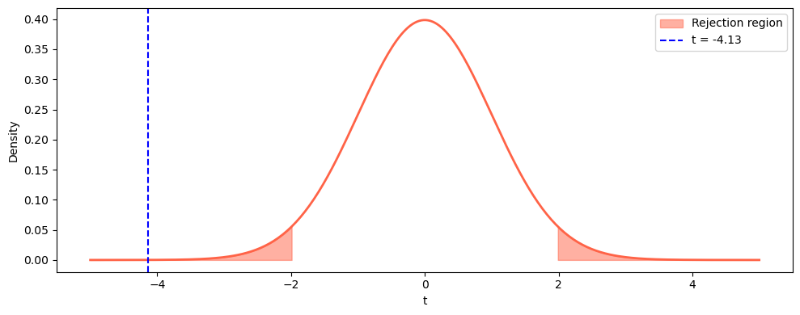

# 기각역 시연

## 개요

기각역은 $H_0$을 기각하게 만드는 검정통계량 값들의 집합이다. 그 모양은 검정이 양측인지, 좌측인지, 우측인지에 따라 달라진다. 이 페이지에서는 세 경우 모두에 대해 $t$-분포 위의 기각역을 시각화하며, 원래 측정 단위(cm)와 표준화된 $t$-통계량 척도를 함께 보인다.

## 양측검정

유의수준 $\alpha$에서 $H_0\colon \mu = \mu_0$ 대 $H_1\colon \mu \neq \mu_0$을 검정할 때, 검정통계량이 어느 쪽 꼬리에든 들어가면 기각한다:

$$
|t| > t_{\alpha/2,\, n-1}.
$$

임계값이 $\alpha$를 두 꼬리에 반씩 나눈다. 원래 단위로 옮기면 기각역은

$$
\bar{x} < \mu_0 - t_{\alpha/2,\, n-1} \cdot \frac{s}{\sqrt{n}} \quad \text{or} \quad \bar{x} > \mu_0 + t_{\alpha/2,\, n-1} \cdot \frac{s}{\sqrt{n}}.
$$

### 코드

```python
import numpy as np
import matplotlib.pyplot as plt
from scipy import stats

np.random.seed(42)
data = stats.norm.rvs(loc=170, scale=8, size=250)

mu0 = 172
n = len(data)
df = n - 1
xbar = data.mean()
s = data.std(ddof=1)
se = s / np.sqrt(n)

alpha = 0.05
# 양측이므로 alpha를 두 꼬리에 반씩 나눈다. ppf에 1 - alpha/2를 넣는 이유다.
t_crit = stats.t.ppf(1 - alpha / 2, df)
t_stat = (xbar - mu0) / se

print(f"x-bar = {xbar:.2f}, SE = {se:.2f}")
print(f"t-stat = {t_stat:.4f}, t-crit = +/-{t_crit:.4f}")
# 기각역을 t 척도가 아니라 cm 척도로도 적어 둔다.
# 실무자에게는 "표본평균이 171.04 아래면 기각"이 t보다 읽기 쉽다.
print(f"Rejection boundaries: {mu0 - t_crit*se:.2f} and {mu0 + t_crit*se:.2f}")
```

출력:

```
x-bar = 169.98, SE = 0.49
t-stat = -4.1314, t-crit = +/-1.9695
Rejection boundaries: 171.04 and 172.96
```

자료를 평균 170에서 만들었으니 $H_0\colon \mu = 172$는 실제로 거짓이고, 검정이 그것을 잡아냈다($|t| = 4.13 > 1.97$).

주목할 것은 기각역의 좁기다. $n = 250$이라 표준오차가 0.49 cm밖에 안 되고, 그래서 표본평균이 172에서 1 cm만 벗어나도 기각된다. 표본이 크면 실질적으로 사소한 차이도 통계적으로 유의해진다.

### 시각화

위쪽 그림은 $H_0$ 아래 $\bar{X}$의 표본분포를 센티미터 단위로 보여주며 꼬리의 기각역을 색칠한다. 아래쪽 그림은 같은 검정을 $t$-통계량 척도로 보여주며 기각역은 단순히 $|t| > t_{\text{crit}}$이다.

```python
x_t = np.linspace(-5, 5, 300)
y_t = stats.t.pdf(x_t, df)

fig, ax = plt.subplots(figsize=(10, 4))
ax.plot(x_t, y_t, "tomato", lw=2)
ax.fill_between(x_t[x_t <= -t_crit], stats.t.pdf(x_t[x_t <= -t_crit], df),
                color="tomato", alpha=0.5, label="Rejection region")
ax.fill_between(x_t[x_t >= t_crit], stats.t.pdf(x_t[x_t >= t_crit], df),
                color="tomato", alpha=0.5)
ax.axvline(t_stat, color="blue", linestyle="--", label=f"t = {t_stat:.2f}")
ax.set_xlabel("t")
ax.set_ylabel("Density")
ax.legend()
plt.tight_layout()
plt.show()
```



파란 점선이 관측된 $t = -4.13$이고 붉게 칠한 양쪽 꼬리가 기각역이다. 점선이 왼쪽 기각역 안에 확실히 들어가 있다.

이 그림은 $t$ 척도라 자유도만 알면 자료와 무관하게 언제나 같은 모양이다. 자료가 하는 일은 파란 점선을 어디에 놓을지 정하는 것뿐이다.

## 단측검정

### 좌측검정

$H_0\colon \mu = \mu_0$ 대 $H_1\colon \mu < \mu_0$에서는 기각역 전체가 왼쪽 꼬리에 있다:

$$
t < -t_{\alpha,\, n-1}.
$$

### 우측검정

$H_0\colon \mu = \mu_0$ 대 $H_1\colon \mu > \mu_0$에서는 기각역이 오른쪽 꼬리에 있다:

$$
t > t_{\alpha,\, n-1}.
$$

### 코드

```python
df = 100
alpha = 0.05
x = np.linspace(-5, 5, 300)
y = stats.t.pdf(x, df)

# 단측이므로 alpha를 나누지 않는다. 꼬리 하나에 5%를 통째로 준다.
t_lo = stats.t.ppf(alpha, df)
print(f"Left-tailed critical value: {t_lo:.4f}")

t_hi = stats.t.ppf(1 - alpha, df)
print(f"Right-tailed critical value: {t_hi:.4f}")
```

출력:

```
Left-tailed critical value: -1.6602
Right-tailed critical value: 1.6602
```

$t$-분포의 대칭성에 의해 $t_{\alpha,\,\text{df}} = -t_{1-\alpha,\,\text{df}}$이다.

같은 자유도의 양측 임계값 $t_{0.025,\,100} = 1.9840$과 비교해 보라. 단측검정의 임계값 1.6602가 더 안쪽에 있어 넘기 쉽다. 이것이 단측검정의 검정력 이득이고, 그 대가는 반대 방향의 효과를 아예 보지 못한다는 것이다.

## 해석

- **양측검정**에서는 어느 방향에서든 $H_0$에 반하는 증거가 나올 수 있다. p-값은 $2P(T \geq |t_{\text{obs}}|)$이다.
- **단측검정**에서는 한쪽 방향의 이탈만 보므로 그 방향의 효과를 탐지할 검정력은 커지지만 반대 방향에는 전혀 없다.
- **원래 단위의 기각역**은 기각으로 이어지는 실제 측정값(예: cm 단위의 키)을 보여준다. 실무자에게는 $t$-통계량 척도보다 직관적인 경우가 많다.
- $\alpha$를 0.05에서 0.01로 낮추면 기각역이 줄어들고(임계값이 바깥으로 이동하고) $H_0$을 기각하는 데 더 강한 증거가 필요해진다.

## 연습문제

<div class="drillbox" markdown>

**연습문제 1.** <span class="diff easy" title="쉬움"></span> $n = 25$, $\alpha = 0.05$, $\mu_0 = 100$인 양측검정에서 $s = 15$일 때 임계값을 $t$ 단위와 원래 단위로 계산하라.

</div>

??? success "풀이"

    자유도: $\text{df} = 24$. 임계 $t$-값은

    $$
    t_{0.025,\,24} = 2.0639 \quad (\text{표 또는 } \texttt{stats.t.ppf(0.975, 24)}).
    $$

    표준오차는 $SE = 15/\sqrt{25} = 3.0$이다. 원래 단위의 기각 경계는

    $$
    100 \pm 2.0639 \times 3.0 = 100 \pm 6.19,
    $$

    이므로 기각역은 $\bar{x} < 93.81$ 또는 $\bar{x} > 106.19$이다. $\square$

<div class="drillbox" markdown>

**연습문제 2.** <span class="diff med" title="중간"></span> 참 효과가 가설의 방향에 있을 때 단측검정이 양측검정보다 강력한 이유를 설명하라. 그 대가는 무엇인가?

</div>

??? success "풀이"

    수준 $\alpha$의 단측검정에서는 기각확률 전체가 한쪽 꼬리에 몰리므로 임계값이 $t_{\alpha/2}$가 아니라 $t_\alpha$이다. $t_\alpha < t_{\alpha/2}$이므로 임계값을 넘기가 쉬워져 검정력이 커진다.

    수치로 보면 $n$이 큰 $\alpha = 0.05$에서 단측 임계값은 $z_{0.05} = 1.645$이고 양측은 $z_{0.025} = 1.960$이다. 1.645와 1.960 사이의 검정통계량은 단측검정에서는 기각되지만 양측검정에서는 기각되지 않는다.

    대가는 단측검정이 반대 방향의 효과에 대해 **검정력이 0**이라는 점이다. 양의 효과를 검정하는데 참 효과가 음수이면 그 효과가 아무리 커도 결코 $H_0$을 기각할 수 없다. $\square$

<div class="drillbox" markdown>

**연습문제 3.** <span class="diff med" title="중간"></span> (대칭인 분포에서) 양측검정의 p-값이 단측 p-값의 두 배임을 보여라. 이 관계가 깨질 수 있는 경우는?

</div>

??? success "풀이"

    ($t$-분포처럼) 대칭인 분포에서는 $P(T \leq -|t|) = P(T \geq |t|)$이다. 양측 p-값은

    $$
    p_{\text{two}} = P(|T| \geq |t_{\text{obs}}|) = P(T \leq -|t_{\text{obs}}|) + P(T \geq |t_{\text{obs}}|) = 2P(T \geq |t_{\text{obs}}|) = 2p_{\text{one}}.
    $$

    이 관계는 다음의 경우 깨진다:

    - 검정통계량의 **귀무분포가 비대칭**일 때(예: 카이제곱, $F$-분포).
    - 대응하는 분위수에서 두 꼬리의 확률질량이 같지 않을 수 있는 **이산분포**에 기반한 검정일 때. $\square$

<div class="drillbox" markdown>

**연습문제 4.** <span class="diff easy" title="쉬움"></span> 어떤 연구자가 $H_0\colon \mu = 50$을 $H_1\colon \mu > 50$에 대해 검정하여 $\text{df} = 29$에서 $t = 1.80$을 얻었다. p-값을 구하고 $\alpha = 0.05$에서 판정하라.

</div>

??? success "풀이"

    우측검정의 p-값은

    $$
    p = P(T_{29} \geq 1.80) = 1 - F_{T_{29}}(1.80).
    $$

    Python으로 `1 - stats.t.cdf(1.80, 29)`를 계산하면 $\approx 0.0411$이다.

    $0.0411 < 0.05$이므로 $H_0$을 기각하고 5% 수준에서 $\mu > 50$이라는 유의한 증거가 있다고 결론짓는다. $\square$

<div class="drillbox" markdown>

**연습문제 5.** <span class="diff med" title="중간"></span> $\alpha$가 0.10에서 0.01로 줄어들 때 양측 기각역이 어떻게 변하는지 그리거나 기술하라. 제2종 오류의 확률은 어떻게 되는가?

</div>

??? success "풀이"

    $\alpha$가 줄어들면:

    - 임계값 $\pm t_{\alpha/2}$가 0에서 더 멀어진다(예: $n$이 클 때 $\alpha=0.10$의 $\pm 1.645$에서 $\alpha=0.01$의 $\pm 2.576$으로).
    - 각 꼬리의 색칠된 기각역이 줄어든다.
    - $H_0$을 기각하기 어려워지므로 제1종 오류의 확률이 줄어든다.

    그러나 **제2종 오류**의 확률($\beta$)은 커진다. 문턱이 엄격해지면 $H_1$이 참이어도 $H_0$을 기각하지 못할 가능성이 커진다. 검정력 $= 1 - \beta$가 줄어든다. 근본적인 맞바꿈을 보여준다: 표본크기를 함께 늘리지 않는 한 한쪽 오류를 줄이면 다른 쪽이 커진다. $\square$

---

## 정리하며

기각역은 **$H_0$ 을 기각하게 만드는 통계량 값들의 집합**이며, 모양이 대립가설에서 나온다.

| 대립가설 | 기각역 | $\alpha$ 배분 |
|---|---|---|
| $\mu\ne\mu_0$ | 양쪽 꼬리 | $\alpha/2$ 씩 |
| $\mu>\mu_0$ | 오른쪽 꼬리 | 한쪽에 $\alpha$ 전부 |
| $\mu<\mu_0$ | 왼쪽 꼬리 | 한쪽에 $\alpha$ 전부 |

- **양측검정은 임계값이 더 멀다.** 같은 $\alpha$ 를 둘로 나누기 때문이며, 그래서 단측검정이 해당 방향에서 검정력이 높다.
- **그렇다고 자료를 보고 단측으로 바꾸면 안 된다.** 실질적인 $\alpha$ 가 두 배가 되며, 방향은 **사전에** 정해야 한다.
- **두 척도가 같은 것을 말한다.** 원래 단위(cm)의 기각역과 표준화된 $t$ 척도의 기각역은 같은 경계를 다르게 적은 것이다. 그림에서 두 축을 함께 보면 그 대응이 드러난다.
- **기각역의 경계가 곧 $p=\alpha$ 인 지점**이므로, 임계값 방식과 $p$ 값 방식이 언제나 같은 판정을 준다.

다음 절부터 **일표본 검정**을 하나씩 다룬다. $\sigma$ 를 아는 $z$ 검정에서 시작한다.
