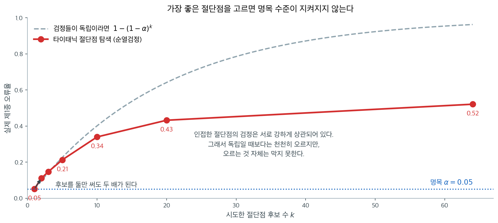

# p-해킹 시연 - 타이타닉 절단점 탐색

앞 절에서 본 p-해킹 수법은 셋이었다. 표본을 몰래 늘리기, 결과변수를 여러 개 재기, 임의로 중단하기. 모두 **모의자료**였다.

이 절은 **네 번째 수법**을 **실자료**에서 본다. 연속형 변수를 범주로 나눌 때 **절단점을 어디에 둘지 고르는 것**이다. 앞의 셋과 달리 이것은 대개 **p-해킹이라는 자각 없이** 일어난다. "나이를 어린이와 어른으로 나누자"는 문장은 지극히 자연스럽게 들리기 때문이다.

자료는 [절단점 하나가 결론을 바꾼다](../../ch02/exploration/titanic_age_cutoff.md) 절에서 탐색해 둔 타이타닉 승객 714명이다.

!!! note "자료를 내려받는다"
    자료는 인터넷에서 읽어 온다. 네트워크가 없으면 실행되지 않지만, **출력을 모두 실어 두었으므로 읽는 데는 지장이 없다.**

## 2장에서 남겨 둔 질문

2장에서 절단점을 2세부터 65세까지 64개 훑어보고, **생존율 차이가 절단점에 따라 크게 요동친다**는 것을 보았다. 5세에서 $+28$%포인트, 30세에서 $+0.02$%포인트, 65세에서 $+32$%포인트였다.

그때 답하지 못한 질문이 이것이다.

> 절단점을 훑어보고 **가장 신호가 강한 것**을 고르면, 그 결과를 믿어도 되는가?

직관은 "왜 안 되는가"라고 말한다. 절단점 하나하나의 검정은 저마다 정직하고, 자료를 조작한 것도 아니다. **이 절은 그 직관이 왜 틀렸는지를 보인다.**

## 절단점마다의 검정은 저마다 정직하다

먼저 64개의 검정을 실제로 해 본다.

<div class="exbox" markdown>

**보기 1.** <span class="diff easy" title="쉬움"></span> 가능한 모든 절단점에서 검정하기. 양쪽에 최소 10명이 남는 절단점 64개(2세~65세)에서 $2\times2$ 카이제곱 검정을 돌린다. 2장에서 본 대로 5세에서 생존율 차이가 $+0.2848$, 65세에서 $+0.3202$로 **65세 쪽이 더 큰데**, 카이제곱은 $12.70$과 $4.60$으로 **5세 쪽이 세 배 가까이 크다.**

**(1)** 절단점 $c$에서의 카이제곱을 **생존율 차이와 두 집단의 크기만으로** 쓰는 식을 세우고, 위의 역전을 설명하시오.

**(2)** 그 식을 64개 절단점 전체에서 확인하고, 차이를 $0.30$으로 고정한 채 분할 위치만 바꾸면 카이제곱이 어디까지 움직이는지 보이시오.

</div>

??? success "풀이"

    **(1) 해석적으로.** 절단점 $c$는 $N$명을 크기 $n_1 = \#\{x < c\}$와 $n_2 = N - n_1$의 두 집단으로 나눈다. 생존자 수의 합계는 절단점과 무관하게 $N\bar p$로 고정이다($\bar p$는 전체 생존율). [이표본 비율 검정](../two_sample_tests/test_two_props.md)에서 보았듯 $2\times2$ 표의 (연속성 보정 없는) 피어슨 카이제곱은 합동 $z$ 통계량의 제곱이므로

    $$
    \chi^2(c) = z_{\text{pool}}^2
    = \frac{\bigl(\hat p_1 - \hat p_2\bigr)^2}
    {\bar p(1-\bar p)\left(\dfrac{1}{n_1} + \dfrac{1}{n_2}\right)}
    $$

    이다. **분자에만 생존율 차이가 있고, 분모는 전체 생존율과 분할의 균형만으로 정해진다.** $\bar p(1-\bar p)$는 절단점이 바뀌어도 그대로이므로, 절단점 사이의 비교에서 움직이는 것은 $(\hat p_1 - \hat p_2)^2$과 $1/n_1 + 1/n_2$ 둘뿐이다.

    뒤의 항이 **조화평균 꼴**이라 작은 쪽 집단이 지배한다. $n_1 + n_2 = N$이 고정일 때 $1/n_1 + 1/n_2$는 $n_1 = n_2 = N/2$에서 최소 $4/N$이고, 한쪽으로 치우칠수록 커진다. 그래서

    $$
    \chi^2(c) = \frac{(\hat p_1 - \hat p_2)^2}{\bar p(1-\bar p)}\cdot\frac{n_1 n_2}{N}
    $$

    로 바꿔 쓰면 **$n_1n_2/N$이라는 "유효 표본크기"가 그대로 곱해져 있음**이 보인다.

    이제 역전이 설명된다. $c = 5$는 $40$ 대 $674$로 나누므로 $n_1n_2/N = 37.8$이고, $c = 65$는 $703$ 대 $11$로 나누어 $n_1n_2/N = 10.8$이다. **차이는 비슷해도 그 차이를 받치는 관측값의 수가 세 배 넘게 다르다.** 11명짜리 집단의 생존율 $+32$%포인트는 사람 세 명 차이에 지나지 않는다.

    **(2) 수치적으로.**

    ```python
    import warnings
    warnings.filterwarnings("ignore")

    import numpy as np
    import pandas as pd
    from scipy.stats import chi2_contingency

    URL = ("https://raw.githubusercontent.com/datasciencedojo/"
           "datasets/f0ccab6a7ceafdff780052166fb6fab3311398eb/titanic.csv")
    df = pd.read_csv(URL, index_col="PassengerId")
    d = df.dropna(subset=["Age"]).copy()

    age = d["Age"].to_numpy()
    sur = d["Survived"].to_numpy()

    # 양쪽에 최소 10명은 남는 절단점만 고려한다.
    CUTS = [c for c in range(1, 80)
            if (age < c).sum() >= 10 and (age >= c).sum() >= 10]
    print(f"검사 대상 절단점 {len(CUTS)}개 ({CUTS[0]}세 ~ {CUTS[-1]}세)\n")

    rows = []
    print(f"{'절단점':>7s}{'n<c':>6s}{'차이':>9s}{'chi2':>9s}{'p':>11s}")
    for c in CUTS:
        m = age < c
        res = chi2_contingency(pd.crosstab(m, sur), correction=False)
        rows.append((c, res.statistic, res.pvalue))
        if c % 5 == 0:
            print(f"{c:>7d}{m.sum():>6d}"
                  f"{sur[m].mean() - sur[~m].mean():>+9.4f}"
                  f"{res.statistic:>9.3f}{res.pvalue:>11.2e}")

    best = max(rows, key=lambda z: z[1])
    sig = [c for c, s, p in rows if p < 0.05]
    print(f"\n가장 강한 절단점 {best[0]}세: chi2 = {best[1]:.4f}, "
          f"p = {best[2]:.3e}")
    print(f"p < 0.05 인 절단점 {len(sig)}개 / {len(CUTS)}개")
    print(f"  {sig}")
    ```

    ```text
    검사 대상 절단점 64개 (2세 ~ 65세)

        절단점   n<c       차이     chi2          p
          5    40  +0.2848   12.697   3.66e-04
         10    62  +0.2264   12.032   5.23e-04
         15    78  +0.1917   10.586   1.14e-03
         20   164  +0.0981    5.038   2.48e-02
         25   278  +0.0300    0.632   4.27e-01
         30   384  +0.0002    0.000   9.96e-01
         35   479  +0.0092    0.055   8.14e-01
         40   551  +0.0414    0.893   3.45e-01
         45   599  +0.0384    0.591   4.42e-01
         50   640  +0.0461    0.584   4.45e-01
         55   672  +0.1027    1.728   1.89e-01
         60   688  +0.1421    2.098   1.48e-01
         65   703  +0.3202    4.603   3.19e-02

    가장 강한 절단점 7세: chi2 = 18.2719, p = 1.915e-05
    p < 0.05 인 절단점 21개 / 64개
      [2, 3, 4, 5, 6, 7, 8, 9, 10, 11, 12, 13, 14, 15, 16, 17, 18, 19, 20, 64, 65]
    ```

    ```python
    from scipy.stats import chi2 as chi2dist

    n = len(sur)
    pbar = sur.mean()
    print(f"전체 생존율 p-bar = {pbar:.6f},  N = {n}")
    print(f"{'c':>4}{'n1':>5}{'n2':>5}{'차이':>11}{'공식':>11}{'표의 chi2':>11}{'차':>10}")
    for c in (5, 7, 10, 20, 30, 40, 50, 60, 65):
        m = age < c
        n1, n2 = int(m.sum()), int((~m).sum())
        diff = sur[m].mean() - sur[~m].mean()
        f = diff ** 2 / (pbar * (1 - pbar) * (1 / n1 + 1 / n2))
        tab = rows[CUTS.index(c)][1]
        print(f"{c:>4}{n1:>5}{n2:>5}{diff:>+11.6f}{f:>11.5f}{tab:>11.5f}"
              f"{abs(f - tab):>10.1e}")

    # 64 개 전부에서 확인
    diffs = np.array([sur[age < c].mean() - sur[age >= c].mean() for c in CUTS])
    n1s = np.array([(age < c).sum() for c in CUTS])
    form = diffs ** 2 / (pbar * (1 - pbar) * (1 / n1s + 1 / (n - n1s)))
    tabs = np.array([s for _, s, _ in rows])
    print(f"\n절단점 64개 전체에서 |공식 - 표| 의 최대 = {np.abs(form - tabs).max():.3e}")

    # 같은 차이가 절단점에 따라 얼마나 다른 chi2 를 주는가
    print("\n차이를 0.30 으로 고정하고 n1 만 바꾸면")
    print(f"{'n1':>6}{'chi2':>10}{'p':>12}")
    for n1 in (20, 40, 100, 357, 600, 700):
        f = 0.30 ** 2 / (pbar * (1 - pbar) * (1 / n1 + 1 / (n - n1)))
        print(f"{n1:>6}{f:>10.4f}{chi2dist.sf(f, 1):>12.3e}")
    ```

    ```text
    전체 생존율 p-bar = 0.406162,  N = 714
       c   n1   n2         차이         공식    표의 chi2         차
       5   40  674  +0.284792   12.69728   12.69728   7.1e-15
       7   47  667  +0.316820   18.27192   18.27192   0.0e+00
      10   62  652  +0.226400   12.03170   12.03170   1.8e-15
      20  164  550  +0.098071    5.03758    5.03758   4.4e-15
      30  384  330  +0.000189    0.00003    0.00003   2.4e-17
      40  551  163  +0.041375    0.89278    0.89278   7.8e-16
      50  640   74  +0.046073    0.58376    0.58376   0.0e+00
      60  688   26  +0.142106    2.09760    2.09760   8.9e-16
      65  703   11  +0.320186    4.60349    4.60349   8.9e-16

    절단점 64개 전체에서 |공식 - 표| 의 최대 = 8.882e-15

    차이를 0.30 으로 고정하고 n1 만 바꾸면
        n1      chi2           p
        20    7.2538   7.075e-03
        40   14.0895   1.743e-04
       100   32.0882   1.473e-08
       357   66.6060   3.316e-16
       600   35.7465   2.247e-09
       700    5.1216   2.363e-02
    ```

    **공식이 정확하다.** 아홉 줄을 손으로 맞추었을 때 차가 $10^{-14}$ 수준이고, 절단점 64개 전체에서도 최대 $8.9\times10^{-15}$로 부동소수점 오차뿐이다. $\chi^2 = z_{\text{pool}}^2$ 항등식이 근사가 아니라 등식이라는 점이 여기서도 확인된다.

    **역전도 설명된 대로다.** 차이를 $0.30$으로 **고정**하고 분할 위치만 바꾸면 카이제곱이 $n_1 = 20$에서 $7.25$, $n_1 = 357$(정확히 반)에서 최대 $66.61$, $n_1 = 700$에서 $5.12$로 움직인다. **같은 크기의 생존율 차이가 어디서 자르느냐에 따라 13배 다른 증거로 보고된다.** 절단점 탐색이 위험한 첫 번째 까닭이 이것이다. 가장 강한 신호를 고르는 일은 "차이가 큰 곳"을 고르는 것이 아니라 **"차이와 균형의 곱이 큰 곳"**을 고르는 것이다.

    같은 식이 $p < 0.05$인 절단점이 왜 양 끝에 몰리는지도 설명한다. 유의한 21개가 $2$–$20$세와 $64$–$65$세인데, 앞의 덩어리는 차이가 커서($+0.19$~$+0.32$) 유의하고 뒤의 둘은 차이가 아주 커서($+0.32$) 간신히 유의하다. 가운데의 $25$–$60$세는 차이가 $0.05$ 아래로 떨어져 균형이 좋아도 통계량이 작다.

    **$p$가 $1.9\times10^{-5}$부터 0.996까지 나온다.** 같은 자료, 같은 질문인데 절단점 하나가 바뀌었을 뿐이다.

    **20세와 21세 사이에서 결론이 뒤집힌다.** 20세는 $p=0.025$로 유의하고 21세는 $p=0.119$로 유의하지 않다.

    **중요한 것은 이 64개 검정이 하나하나는 전부 정당하다는 점이다.** 어느 하나를 **자료를 보기 전에** 정해 두었다면 그 $p$값은 그대로 읽어도 된다. 문제는 **64개를 다 보고 나서 고르는 것**이다.

## "가장 좋은" 절단점을 고르면

7세에서 $p=1.9\times10^{-5}$다. 강력한 증거처럼 보인다.

**이 $p$값은 그대로 쓸 수 없다.** 64개를 시도하고 가장 좋은 것을 골랐기 때문이다. 얼마나 못 쓰는지를 재려면, **나이와 생존이 정말로 무관한 세계**에서 같은 절차를 돌려 보면 된다.

<div class="exbox" markdown>

**보기 2.** <span class="diff easy" title="쉬움"></span> 절단점을 탐색하면 1종 오류가 얼마나 커지나. 생존 여부를 무작위로 섞으면 나이와의 관계가 사라진다($H_0$가 참인 세계). 그 세계에서 **64개 절단점의 최대 카이제곱**이 어떤 분포를 갖는지 순열로 구한다.

**(1)** 탐색을 반영한 올바른 p-값이 단일 p-값의 몇 배여야 하는지 세 가지로 예측하시오. 본페로니($k$배), 시데크($1-(1-p)^k$), 그리고 **유효 후보 수**로 보정한 값. 세 값의 순서는 어떻게 되는가.

**(2)** 순열로 구한 p-값과 맞추고, 반복 20,000회로 이만한 꼬리확률을 잴 수 있는지 평가하시오.

</div>

??? success "풀이"

    **(1) 해석적으로.** 관측된 최대 카이제곱은 $18.2719$이고 이것을 **단일** 검정으로 읽으면 $p_1 = P(\chi^2_1 > 18.2719) = 1.9151\times10^{-5}$다. 그런데 우리가 실제로 쓴 검정통계량은 $\chi^2$ 하나가 아니라 $\max_c \chi^2(c)$이므로, 올바른 p-값은

    $$
    p_{\max} = P\Bigl(\max_{c} \chi^2(c) \ge 18.2719 \;\Bigm|\; H_0\Bigr)
    $$

    다. 후보 $k$개가 **독립**이라면

    $$
    p_{\max} = 1 - (1 - p_1)^k \approx k\,p_1
    $$

    이고($p_1$이 작을 때), $k = 64$에서 본페로니가 $64 p_1 = 1.2257\times10^{-3}$, 시데크가 $1.2249\times10^{-3}$으로 사실상 같다. **$p_1$이 아주 작으면 두 보정의 차이는 없다.**

    그러나 이웃한 절단점끼리 통계량이 강하게 상관되어 있으므로 독립인 검정 $k$개가 아니라 더 적은 수에 해당한다. 보기 3에서 재는 유효 후보 수를 $k_{\text{eff}} = \log(1 - 0.5194)/\log(0.95) = 14.3$으로 쓰면

    $$
    p_{\max} \approx 1 - (1-p_1)^{14.3} = 2.736\times10^{-4}
    $$

    이다. 세 값의 순서는 **유효 후보 수 보정 $<$ 시데크 $<$ 본페로니**이고, 참값은 맨 앞의 것에 가까워야 한다. 본페로니는 상관을 무시하므로 **4.5배 보수적**이다.

    **(2) 수치적으로.**

    ```python
    from scipy.stats import chi2 as chi2dist

    n = len(sur)
    # 절단점마다의 지시벡터를 미리 쌓아 두면 한 번에 계산할 수 있다.
    M = np.array([age < c for c in CUTS])           # (64, 714)

    def chi2_all(y):
        """모든 절단점의 2x2 카이제곱을 한꺼번에 (닫힌 꼴)."""
        tot = y.sum()
        n1 = M.sum(axis=1)
        s1 = M @ y
        a, b = s1, n1 - s1                          # 어린 쪽 생존/사망
        c, e = tot - s1, (n - n1) - (tot - s1)      # 나이 든 쪽 생존/사망
        den = (a + b) * (c + e) * (a + c) * (b + e)
        out = np.zeros(len(CUTS))
        ok = den > 0
        out[ok] = n * (a[ok] * e[ok] - b[ok] * c[ok]) ** 2 / den[ok]
        return out

    obs = chi2_all(sur).max()
    print(f"관측된 최대 카이제곱 {obs:.4f}")
    print(f"  이것을 단일 검정으로 읽으면 p = {chi2dist.sf(obs, 1):.4e}\n")

    # 생존 여부를 무작위로 섞으면 나이와의 관계가 사라진다 (H0 가 참인 세계).
    # 그 세계에서도 '최대 카이제곱'이 얼마나 커지는지 본다.
    rng = np.random.default_rng(0)
    B = 20_000
    y = sur.copy()
    null = np.empty(B)
    for i in range(B):
        rng.shuffle(y)
        null[i] = chi2_all(y).max()

    crit = chi2dist.ppf(0.95, 1)
    print(f"귀무가설에서 '최대 카이제곱'의 분포 ({B:,}회)")
    print(f"  평균 {null.mean():.4f}")
    print(f"  95분위 {np.quantile(null, 0.95):.4f}   "
          f"(자유도 1 카이제곱의 95분위는 {crit:.4f})")
    print(f"  99분위 {np.quantile(null, 0.99):.4f}")

    print(f"\n나이와 생존이 완전히 무관한데도")
    print(f"  '어떤 절단점에서든 p<0.05' 가 나올 확률 = "
          f"{np.mean(null > crit):.4f}")

    print(f"\n탐색을 반영한 올바른 p = "
          f"{(np.sum(null >= obs) + 1) / (B + 1):.4f}")
    ```

    ```text
    관측된 최대 카이제곱 18.2719
      이것을 단일 검정으로 읽으면 p = 1.9151e-05

    귀무가설에서 '최대 카이제곱'의 분포 (20,000회)
      평균 4.4309
      95분위 9.0294   (자유도 1 카이제곱의 95분위는 3.8415)
      99분위 12.1888

    나이와 생존이 완전히 무관한데도
      '어떤 절단점에서든 p<0.05' 가 나올 확률 = 0.5194

    탐색을 반영한 올바른 p = 0.0004
    ```

    ```python
    from scipy import stats

    p_single = chi2dist.sf(obs, 1)
    k = len(CUTS)
    print(f"단일 p-값                     {p_single:.6e}")
    print(f"본페로니 (k = {k})             {min(1, k * p_single):.6e}")
    print(f"시데크   1-(1-p)^{k}          {1 - (1 - p_single) ** k:.6e}")
    k_eff = np.log(1 - np.mean(null > crit)) / np.log(0.95)
    print(f"유효 후보 수 {k_eff:.1f} 개로 보정     "
          f"{1 - (1 - p_single) ** k_eff:.6e}")
    p_perm = (np.sum(null >= obs) + 1) / (B + 1)
    print(f"순열이 준 p                   {p_perm:.6e}"
          f"   (초과 횟수 {int(np.sum(null >= obs))} / {B:,})")

    # 20,000 회로 이만한 꼬리를 잴 수 있는가
    hits = int(np.sum(null >= obs))
    lo, hi = stats.beta.ppf([0.025, 0.975], hits + 0.5, B - hits + 0.5)
    print(f"\n몬테카를로 정밀도")
    print(f"  분해능 1/(B+1) = {1 / (B + 1):.2e}")
    print(f"  초과 횟수 {hits} 에 대한 95% 구간 = [{lo:.2e}, {hi:.2e}]")
    print(f"  표준오차 약 {np.sqrt(p_perm * (1 - p_perm) / B):.2e}")
    ```

    ```text
    단일 p-값                     1.915098e-05
    본페로니 (k = 64)             1.225663e-03
    시데크   1-(1-p)^64          1.224924e-03
    유효 후보 수 14.3 개로 보정     2.735741e-04
    순열이 준 p                   3.999800e-04   (초과 횟수 7 / 20,000)

    몬테카를로 정밀도
      분해능 1/(B+1) = 5.00e-05
      초과 횟수 7 에 대한 95% 구간 = [1.57e-04, 6.87e-04]
      표준오차 약 1.41e-04
    ```

    **순열이 준 $4.0\times10^{-4}$가 예측한 세 값 가운데 유효 후보 수 쪽에 가깝다.** 본페로니 $1.23\times10^{-3}$은 3배 보수적이고, 유효 후보 수로 보정한 $2.74\times10^{-4}$은 1.5배 낙관적이다. 둘 사이에 참값이 있다.

    **그런데 20,000회로는 이 꼬리를 정확히 잴 수 없다.** 초과가 7번뿐이므로 추정값의 95% 구간이 $[1.6\times10^{-4},\ 6.9\times10^{-4}]$로 네 배 넓고, 분해능 자체가 $5\times10^{-5}$다. 예측값 $2.74\times10^{-4}$는 이 구간 안에 있으므로 **순열 결과와 어긋나지 않는다.** $10^{-4}$ 수준의 p-값을 두 자리까지 보고하려면 반복을 백만 회 단위로 올려야 한다. 이 쪽의 목적은 "보정 후에도 유의한가"이고 그 답은 $B = 20{,}000$으로 충분하다.

    **나이와 생존이 완전히 무관한 자료에서도 52%의 확률로 "유의한 절단점"이 발견된다.**

    | | 값 |
    |---|---|
    | 명목 유의수준 | 0.05 |
    | **실제 1종 오류** | **0.5194** |
    | 팽창 배율 | **10.4배** |

    **올바른 임계값은 3.8415가 아니라 9.0294**다. 절단점을 64개 시도했으므로 기준이 그만큼 높아져야 한다. 귀무분포의 평균이 $4.43$이라는 것도 함께 읽어 두면 좋다. $\chi^2_1$ 하나의 평균은 1인데, 64개의 **최댓값**을 취하면 평균이 4.43으로 올라간다. **오류율을 정하는 것은 후보의 개수가 아니라 최댓값의 분포다.**

**이것이 "정원의 갈림길"이다.** 자료를 보고 절단점을 정하면, 정한 뒤의 $p$값은 더 이상 $p$값이 아니다.

```text
나쁜 절차:  절단점을 여러 개 시도 -> 가장 좋은 것 선택 -> 그 p값 보고
            (실제 1종 오류 0.52)

좋은 절차:  절단점을 자료 보기 전에 확정 -> 그 하나만 검정
            또는 탐색을 인정하고 순열검정으로 보정
```

**다행히 이 자료의 신호는 보정 후에도 살아남는다.** 탐색을 반영한 $p=0.0004$로 여전히 유의하다. **어린아이가 더 많이 살아남았다는 것은 실재하는 현상**이다.

**그러나 "7세"라는 숫자를 믿어서는 안 된다.** 그 값은 이 표본에서 우연히 가장 잘 맞았을 뿐이고, 다른 표본에서는 5세나 9세가 될 것이다.

## 후보가 몇 개부터 문제인가

64개는 극단적으로 들린다. **"두세 개만 해 봤다"면 괜찮은가.**

<div class="exbox" markdown>

**보기 3.** <span class="diff easy" title="쉬움"></span> 후보 수를 바꿔 가며. 전체 범위에 고르게 $k$개의 절단점만 후보로 두고 같은 순열실험을 돌린다. 아래 표가 나오는데, $k = 2$의 $0.1111$이 **독립일 때의 값 $1-0.95^2 = 0.0975$보다 크다.**

**(1)** 통계량들이 양의 상관을 가지면 FWER가 독립일 때보다 **작아야** 하는데 표는 그 반대다. 모순인가. 두 가지를 재어 설명하시오. (ㄱ) 양 끝 두 절단점 통계량의 상관, (ㄴ) 개별 절단점에서 카이제곱 근사의 **실제** 수준.

**(2)** 각 $k$에서 **유효 후보 수** $k_{\text{eff}} = \log(1-\text{FWER})/\log(0.95)$를 계산해 어디서 포화하는지 보이시오.

</div>

??? success "풀이"

    **(1) 모순이 아니다. 두 전제가 모두 어긋나 있다.**

    첫째, $k = 2$가 쓰는 두 후보는 양 끝인 2세와 65세다. **이 둘은 상관이 없다.** 2세 미만과 65세 미만으로 나눈 두 분할은 거의 겹치지 않는 사람들을 보고 있고, 아래에서 재면 상관이 $-0.0016$이다. 상관이 팽창을 덜어 주는 것은 **이웃한 절단점끼리**의 이야기이고, 후보를 범위 전체에 고르게 두면 $k$가 작을 때는 그 효과가 없다.

    둘째, 개별 절단점의 실제 수준이 $0.05$가 아니다. $2\times2$ 표의 도수는 이산이고 한쪽 칸이 아주 작으므로($c = 65$에서 나이 든 쪽이 11명뿐이다) 카이제곱 근사가 정확하지 않다. 순열분포로 재면 2세에서 $0.0538$, 65세에서 $0.0576$이다. 두 검정이 독립이라고 보면

    $$
    1 - (1-0.0538)(1-0.0576) = 0.1083
    $$

    이고, 이것이 $0.0975$가 아니라 표의 $0.1111$과 맞아야 할 값이다. 표의 값은 반복 8,000회에서 나온 것이라 몬테카를로 오차가 $\pm 0.0035$이므로 $0.1083$과 $0.1111$의 차 $0.0028$은 그 안에 있다.

    **(2) 유효 후보 수.** 후보 $k$개가 독립이고 각자 수준 $\alpha$라면 $\text{FWER} = 1-(1-\alpha)^k$다. 이것을 거꾸로 풀어

    $$
    k_{\text{eff}} = \frac{\log(1-\text{FWER})}{\log(1-\alpha)}
    $$

    로 정의하면 "독립인 검정 몇 개에 해당하는가"를 읽을 수 있다.

    **수치적으로.**

    ```python
    rng = np.random.default_rng(0)
    B = 8_000
    crit = chi2dist.ppf(0.95, 1)

    print(f"명목 유의수준 0.05, 임계값 {crit:.4f}")
    print(f"{'후보 수':>7s}{'실제 1종 오류':>14s}{'팽창':>8s}"
          f"{'올바른 임계값':>14s}")
    for k in [1, 2, 3, 5, 10, 20, 64]:
        # 후보를 전체 범위에 고르게 k 개 배치한다.
        idx = [0] if k == 1 else \
              [int(round(i * (len(CUTS) - 1) / (k - 1))) for i in range(k)]
        sub = M[sorted(set(idx))]

        y = sur.copy()
        null_k = np.empty(B)
        for i in range(B):
            rng.shuffle(y)
            tot = y.sum()
            n1 = sub.sum(axis=1); s1 = sub @ y
            a, b = s1, n1 - s1
            c, e = tot - s1, (n - n1) - (tot - s1)
            den = (a + b) * (c + e) * (a + c) * (b + e)
            v = np.zeros(len(sub)); ok = den > 0
            v[ok] = n * (a[ok] * e[ok] - b[ok] * c[ok]) ** 2 / den[ok]
            null_k[i] = v.max()

        fwer = np.mean(null_k > crit)
        print(f"{len(sub):>7d}{fwer:>14.4f}{fwer / 0.05:>8.1f}배"
              f"{np.quantile(null_k, 0.95):>14.4f}")
    ```

    ```text
    명목 유의수준 0.05, 임계값 3.8415
       후보 수      실제 1종 오류      팽창       올바른 임계값
          1        0.0521     1.0배        4.1047
          2        0.1111     2.2배        4.7761
          3        0.1476     3.0배        5.6209
          5        0.2129     4.3배        6.4261
         10        0.3399     6.8배        7.5406
         20        0.4324     8.6배        8.0108
         64        0.5211    10.4배        9.1297
    ```

    ```python
    # 개별 절단점의 실제 수준과 양 끝 두 후보의 상관
    rng = np.random.default_rng(0)
    B2 = 40_000
    y = sur.copy()
    mat = np.empty((B2, len(CUTS)))
    for i in range(B2):
        rng.shuffle(y)
        mat[i] = chi2_all(y)

    lev = (mat > crit).mean(axis=0)
    print(f"개별 절단점에서 카이제곱 근사의 실제 수준 ({B2:,}회)")
    print(f"  최소 {lev.min():.4f} ({CUTS[int(lev.argmin())]}세), "
          f"최대 {lev.max():.4f} ({CUTS[int(lev.argmax())]}세), "
          f"평균 {lev.mean():.4f}")
    print(f"  k=2 가 쓰는 두 후보: {CUTS[0]}세 {lev[0]:.4f}, "
          f"{CUTS[-1]}세 {lev[-1]:.4f}")
    print(f"  두 통계량의 상관 = {np.corrcoef(mat[:, 0], mat[:, -1])[0, 1]:+.4f}")
    mx2 = mat[:, [0, len(CUTS) - 1]].max(axis=1)
    print(f"  두 후보만 쓸 때 FWER = {(mx2 > crit).mean():.4f}")
    print(f"  독립 예측 1-(1-{lev[0]:.4f})(1-{lev[-1]:.4f}) = "
          f"{1 - (1 - lev[0]) * (1 - lev[-1]):.4f}")

    # 유효 후보 수
    print(f"\n{'후보 수':>7}{'FWER':>9}{'1-0.95^k':>10}{'유효 후보 수':>13}")
    for kk, fw in zip([1, 2, 3, 5, 10, 20, 64],
                      [0.0521, 0.1111, 0.1476, 0.2129, 0.3399, 0.4324, 0.5211]):
        print(f"{kk:>7}{fw:>9.4f}{1 - 0.95 ** kk:>10.4f}"
              f"{np.log(1 - fw) / np.log(0.95):>13.2f}")
    ```

    ```text
    개별 절단점에서 카이제곱 근사의 실제 수준 (40,000회)
      최소 0.0376 (6세), 최대 0.0673 (58세), 평균 0.0507
      k=2 가 쓰는 두 후보: 2세 0.0538, 65세 0.0576
      두 통계량의 상관 = -0.0016
      두 후보만 쓸 때 FWER = 0.1083
      독립 예측 1-(1-0.0538)(1-0.0576) = 0.1083

       후보 수     FWER  1-0.95^k      유효 후보 수
          1   0.0521    0.0500         1.04
          2   0.1111    0.0975         2.30
          3   0.1476    0.1426         3.11
          5   0.2129    0.2262         4.67
         10   0.3399    0.4013         8.10
         20   0.4324    0.6415        11.04
         64   0.5211    0.9625        14.35
    ```

    

    **(1)의 설명이 확인된다.** 양 끝 두 통계량의 상관이 $-0.0016$으로 0이고, 그 둘만 썼을 때의 FWER $0.1083$이 독립 예측 $0.1083$과 **소수 넷째 자리까지 같다.** 개별 수준은 $0.0376$(6세)에서 $0.0673$(58세)까지 흩어지고 평균이 $0.0507$이다. **$2\times2$ 표가 이산이라 절단점마다 실제 수준이 다르고, 그 어긋남이 $k$가 작을 때 표에 그대로 드러난다.**

    **유효 후보 수가 어디서 포화하는지가 (2)의 답이다.**

    | 후보 수 $k$ | FWER | $1-0.95^k$ | $k_{\text{eff}}$ |
    |---:|---:|---:|---:|
    | 1 | 0.0521 | 0.0500 | 1.04 |
    | 2 | 0.1111 | 0.0975 | 2.30 |
    | 3 | 0.1476 | 0.1426 | 3.11 |
    | 5 | 0.2129 | 0.2262 | 4.67 |
    | 10 | 0.3399 | 0.4013 | 8.10 |
    | 20 | 0.4324 | 0.6415 | 11.04 |
    | 64 | 0.5211 | 0.9625 | 14.35 |

    **$k \le 3$에서는 $k_{\text{eff}} \approx k$다.** 후보가 범위 전체에 흩어져 있어 서로 거의 독립이기 때문이다. **$k = 5$를 지나면서 갈라지기 시작해 $k = 64$에서 $14.35$에 머문다.** 후보를 고르게 배치하면 $k$가 커질수록 이웃 사이의 간격이 좁아지고, 간격이 상관의 길이(몇 살)보다 작아지는 순간부터 새 후보가 새 정보를 주지 못한다. **64개를 시도해도 독립인 검정 14개 정도의 값만 치르는 것**이고, 연습문제 1에서 그 14가 이웃 상관 0.88에서 나온다는 것을 확인한다.

    **후보가 하나면 0.0521로 명목 수준에 맞는다.** 문제는 **둘부터** 시작된다. 절단점을 단 두 개만 시도해도 오류율이 두 배가 된다. "20세랑 21세 둘 다 해 봤다"가 이미 문제다. 다만 20세와 21세처럼 **붙어 있는** 두 후보라면 상관이 0.88이어서 팽창이 훨씬 작다. 위 표의 $k=2$는 가장 불리한 배치(양 끝)를 쓴 것이므로 두 배가 상한에 가깝다.

    그림의 회색 파선이 상관이 없을 때, 곧 후보 $k$개가 서로 독립일 때의 곡선 $1 - (1-\alpha)^k$이다. 붉은 곡선이 그 아래에 머무는 폭이 상관이 덜어 준 몫이며, $k = 64$에서 0.96 대신 0.52에 그친 것이 그 결과다. **상관은 팽창을 늦출 뿐 막지 못한다.** 명목 5%가 실제로는 52%라면 늦춰졌다는 사실이 위로가 되지 않는다.

    **실무적 교훈 셋.**

    1. **"몇 가지 잘라 보았다"는 말이 나오면 보정이 필요하다.** 둘만 해도 그렇다.
    2. **시도한 절단점을 전부 보고**해야 독자가 판단할 수 있다. 보고하지 않은 시도는 **보이지 않는 다중검정**이다.
    3. **순열검정이 가장 간단한 해법**이다. 실제로 시도한 후보 집합 전체에 대해 최대 통계량의 분포를 구하면 된다.

## 애초에 자르지 않으면 된다

지금까지는 "자르되 정직하게 자르는 법"이었다. **더 나은 답은 자르지 않는 것이다.**

<div class="exbox" markdown>

**보기 4.** <span class="diff easy" title="쉬움"></span> 이분화가 버리는 것. 나이를 (ㄱ) 무시하는 모형, (ㄴ) 21세에서 자른 모형, (ㄷ) 7세(탐색으로 고른 값)에서 자른 모형, (ㄹ) 연속형으로 쓰는 모형, (ㅁ) 이차항까지 쓰는 모형, (ㅂ) 10년 구간 더미로 쓰는 모형을 로지스틱 회귀로 적합해 AIC를 견준다.

**(1)** 모수를 $\Delta k$개 더 쓸 때 AIC의 변화와 우도비 통계량의 관계를 쓰고, **"AIC가 낮아진다"가 우도비 검정의 어느 유의수준에 해당하는지** $\Delta k = 1$과 $\Delta k = 6$에서 구하시오.

**(2)** 표의 각 쌍에서 그 관계를 확인하고, 7세 이분화의 AIC를 다른 값과 나란히 놓을 수 없는 까닭을 적으시오.

</div>

??? success "풀이"

    **(1) 해석적으로.** $\text{AIC} = -2\hat\ell + 2k$이므로 모형 $A \subset B$에서

    $$
    \Delta\text{AIC} = \text{AIC}_B - \text{AIC}_A
    = -2(\hat\ell_B - \hat\ell_A) + 2(k_B - k_A)
    = 2\,\Delta k - \text{LR},
    \qquad \text{LR} = 2(\hat\ell_B - \hat\ell_A)
    $$

    이다. 그러므로

    $$
    \Delta\text{AIC} < 0 \iff \text{LR} > 2\,\Delta k
    $$

    이고, **AIC는 "우도비가 $2\Delta k$를 넘는가"를 묻는 검정과 정확히 같은 규칙**이다. 귀무분포가 $\chi^2_{\Delta k}$이므로 그 유의수준은

    - $\Delta k = 1$: $P(\chi^2_1 > 2) = 0.157299$
    - $\Delta k = 6$: $P(\chi^2_6 > 12) = 0.061969$

    다. **AIC가 낮다는 것은 $p < 0.05$보다 훨씬 느슨한 기준이다.** 모수 하나를 더 쓰는 경우 $p$가 $0.157$만 밑돌면 AIC가 낮아진다. 그래서 "AIC가 낮은 모형"을 "유의하게 나은 모형"으로 읽으면 안 된다. 더하는 모수가 많아질수록 기준이 조금 빡빡해지지만($0.157 \to 0.062$) 여전히 느슨하다.

    **(2) 수치적으로.**

    ```python
    import statsmodels.api as sm

    y = d["Survived"].to_numpy()
    models = {
        "절편만 (나이 무시)": np.ones((len(y), 1)),
        "21세 이분화": sm.add_constant((age < 21).astype(float)),
        "7세 이분화 (탐색으로 고름)": sm.add_constant((age < 7).astype(float)),
        "나이 연속 (선형)": sm.add_constant(age),
        "나이 + 나이 제곱": sm.add_constant(np.column_stack([age, age ** 2])),
        "10년 구간 더미": sm.add_constant(
            pd.get_dummies(np.digitize(age, [10, 20, 30, 40, 50, 60]),
                           drop_first=True).to_numpy(dtype=float)),
    }
    print(f"{'모형':>26s}{'모수':>6s}{'로그가능도':>12s}{'AIC':>10s}")
    for lab, X in models.items():
        m = sm.Logit(y, X).fit(disp=0)
        print(f"{lab:>26s}{X.shape[1]:>6d}{m.llf:>12.3f}{m.aic:>10.3f}")

    # 연속형 나이의 효과가 정말 있는지 직접 검정한다.
    m = sm.Logit(y, sm.add_constant(age)).fit(disp=0)
    print(f"\n로지스틱 회귀 (나이 연속)")
    print(f"  나이 계수 {m.params[1]:+.6f}  (한 살 많아질수록 로그오즈 변화)")
    print(f"  p = {m.pvalues[1]:.4f}")
    print(f"  오즈비 (10살 차이) {np.exp(m.params[1] * 10):.4f}")
    ```

    ```text
                            모형    모수       로그가능도       AIC
                   절편만 (나이 무시)     1    -482.258   966.516
                       21세 이분화     2    -481.049   966.099
              7세 이분화 (탐색으로 고름)     2    -473.249   950.499
                    나이 연속 (선형)     2    -480.114   964.228
                    나이 + 나이 제곱     3    -478.906   963.812
                     10년 구간 더미     7    -473.913   961.827

    로지스틱 회귀 (나이 연속)
      나이 계수 -0.010963  (한 살 많아질수록 로그오즈 변화)
      p = 0.0397
      오즈비 (10살 차이) 0.8962
    ```

    ```python
    print(f"모수 하나를 더 써서 AIC 가 낮아지는 조건: LR > 2, "
          f"곧 p < {chi2dist.sf(2, 1):.6f}")
    print(f"모수 여섯을 더 쓰는 경우:              LR > 12, "
          f"곧 p < {chi2dist.sf(12, 6):.6f}")

    fits = {lab: sm.Logit(y, X).fit(disp=0) for lab, X in models.items()}
    print(f"\n{'비교':>34}{'LR':>8}{'df':>4}{'p':>9}{'dAIC':>8}")
    pairs = [("절편만 (나이 무시)", "21세 이분화"),
             ("절편만 (나이 무시)", "나이 연속 (선형)"),
             ("나이 연속 (선형)", "나이 + 나이 제곱"),
             ("절편만 (나이 무시)", "10년 구간 더미")]
    for a, b in pairs:
        ma, mb = fits[a], fits[b]
        lr = 2 * (mb.llf - ma.llf)
        dfd = models[b].shape[1] - models[a].shape[1]
        print(f"{a[:12] + ' -> ' + b[:14]:>34}{lr:>8.4f}{dfd:>4}"
              f"{chi2dist.sf(lr, dfd):>9.4f}{mb.aic - ma.aic:>8.4f}")
        assert abs((mb.aic - ma.aic) - (2 * dfd - lr)) < 1e-9
    print("\n모든 쌍에서 dAIC = 2*df - LR 이 성립한다 (단언문 통과)")
    ```

    ```text
    모수 하나를 더 써서 AIC 가 낮아지는 조건: LR > 2, 곧 p < 0.157299
    모수 여섯을 더 쓰는 경우:              LR > 12, 곧 p < 0.061969

                                    비교      LR  df        p    dAIC
                절편만 (나이 무시) -> 21세 이분화  2.4173   1   0.1200 -0.4173
             절편만 (나이 무시) -> 나이 연속 (선형)  4.2876   1   0.0384 -2.2876
              나이 연속 (선형) -> 나이 + 나이 제곱  2.4164   1   0.1201 -0.4164
              절편만 (나이 무시) -> 10년 구간 더미 16.6893   6   0.0105 -4.6893

    모든 쌍에서 dAIC = 2*df - LR 이 성립한다 (단언문 통과)
    ```

    **관계식이 네 쌍 모두에서 성립한다**(단언문으로 확인했다). 그리고 각 줄이 (1)의 기준을 그대로 보여 준다.

    | 비교 | LR | $\Delta k$ | $p$ | $\Delta$AIC |
    |---|---:|---:|---:|---:|
    | 절편만 → 21세 이분화 | 2.417 | 1 | 0.120 | $-0.42$ |
    | 절편만 → 나이 연속 | 4.288 | 1 | 0.038 | $-2.29$ |
    | 나이 연속 → 나이 + 나이² | 2.416 | 1 | 0.120 | $-0.42$ |
    | 절편만 → 10년 구간 더미 | 16.689 | 6 | 0.011 | $-4.69$ |

    **21세 이분화는 $p = 0.120$으로 유의하지 않은데도 AIC가 낮다.** $0.120 < 0.157$이기 때문이다. 그 "낫다"가 $-0.42$에 지나지 않는 것이 같은 사실의 다른 표현이다. **나이라는 변수를 넣고도 사실상 아무것도 얻지 못했다.**

    **연속형으로 쓰면 $p=0.0384$(우도비) 또는 $0.0397$(발트)로 유의하다.** 21세로 이분화했을 때의 $0.120$과 견주어 보라. **자르지 않았더니 없던 신호가 생긴 것**이 아니라, **자르면서 버렸던 정보가 돌아온 것**이다. 보기 5에서 그 버린 양을 닫힌 꼴로 계산한다.

    **10년 구간 더미가 가장 낫다.** 2장에서 본 비단조 모양을 표현할 수 있기 때문이다. 모수를 7개나 쓰고도 AIC가 가장 낮다($961.8$).

    **괄호 친 7세 이분화의 AIC 950.5는 다른 값들과 비교할 수 없다.** 절단점을 **결과를 보고 골랐으므로** 이 모형은 모수 2개가 아니라 "절단점 64개 가운데 하나를 고르는 자유"까지 쓴 것이다. 보기 2에서 보았듯 그 자유는 카이제곱 기준으로 $3.84$에서 $9.03$으로, 곧 **5.19만큼의 문턱**에 해당한다. 로그가능도로 환산하면 그 절반인 $2.6$이므로 AIC에는 대략 $5$를 더해 보아야 하며, 그러면 $955$ 둘레로 올라간다. **모형 선택 기준도 p-값과 똑같이 탐색에 오염된다.**
!!! note "로지스틱 회귀를 앞당겨 썼다"
    이진 결과에 대한 회귀는 [19장 로지스틱 회귀](../../ch19/index.md)에서 제대로 다룬다. 여기서는 **"자르지 않은 나이"를 쓰는 도구**로만 빌려 썼다. 계수의 해석과 가정은 그 장에 미룬다.

## 이분화가 치르는 검정력의 대가

타이타닉에서만 그런 것이 아니다. **효과가 정말로 있는 자료**에서 이분화가 얼마를 잃는지 모의실험으로 잰다.

<div class="exbox" markdown>

**보기 5.** <span class="diff easy" title="쉬움"></span> 중앙값 분할의 검정력 손실. 참 효과가 선형인 자료($X \sim N(0,1)$, 로지스틱 모형의 기울기 $\beta$)에서 $X$를 그대로 쓰는 검정과 중앙값에서 잘라 $D = 1\{X > \text{median}\}$으로 쓰는 검정을 견준다.

**(1)** 중앙값 분할이 잃는 것을 닫힌 꼴로 구하시오. $X \sim N(0,1)$과 $D = 1\{X>0\}$ 사이의 상관을 계산하고, 그로부터 **같은 검정력을 얻는 데 필요한 표본크기가 몇 배**가 되는지 구하시오.

**(2)** 그 배율로 검정력 손실을 예측하고 모의실험과 맞추시오.

</div>

??? success "풀이"

    **(1) 해석적으로.** $X \sim N(0,1)$이면 중앙값이 0이므로 $D = 1\{X>0\}$이다. $\beta$가 작을 때 검정의 세기는 결과변수와 설명변수 사이의 **상관**에 비례하므로, 잃는 양은 $\operatorname{corr}(X, D)$ 하나로 정해진다.

    $$
    E[XD] = E\bigl[X\,\mathbf 1\{X>0\}\bigr] = \int_0^\infty x\varphi(x)\,dx = \varphi(0) = \frac{1}{\sqrt{2\pi}} = 0.398942
    $$

    이고 $E[X] = 0$, $E[D] = 1/2$이므로 $\operatorname{Cov}(X,D) = \varphi(0)$다. $\operatorname{Var}(X) = 1$, $\operatorname{Var}(D) = 1/4$이므로

    $$
    \rho = \operatorname{corr}(X, D)
    = \frac{\varphi(0)}{1 \times \tfrac12}
    = 2\varphi(0) = \sqrt{\frac{2}{\pi}} = 0.797885.
    $$

    **이것이 중앙값 분할의 효율이다.** 검정통계량의 비중심모수가 $\rho$배가 되므로 설명하는 분산의 몫은 $\rho^2 = 2/\pi = 0.636620$으로 줄고, 같은 비중심모수를 되찾으려면 표본크기를 

    $$
    \frac{1}{\rho^2} = \frac{\pi}{2} = 1.570796
    $$

    배로 늘려야 한다. **자료의 $1 - 2/\pi = 36.3\%$를 버리는 셈이다.** 앞에서 "대략 1.5배"라 한 것이 이 $\pi/2$다.

    **(2) 검정력의 예측.** $p = 1/2$ 둘레에서 로지스틱 회귀의 비중심모수는

    $$
    \lambda = \beta\sqrt{n\,\operatorname{Var}(X)\,p(1-p)} = \frac{\beta\sqrt n}{2}
    $$

    이고 중앙값 분할 쪽은 $\rho\lambda$다. 명목 5% 양측검정의 검정력은 $\bar\Phi(z_{0.975} - \lambda) + \Phi(-z_{0.975} - \lambda)$로 계산한다. $n = 300$, $\beta = 0.2$면 $\lambda = 1.7321$, $\rho\lambda = 1.3821$이므로 각각 $0.4100$과 $0.2821$을 예측한다.

    **수치적으로.**

    ```python
    rng = np.random.default_rng(1)
    B = 2_000

    print("참 효과가 선형인 자료에서의 검정력 (n=300, 명목 0.05)")
    print(f"{'beta':>6s}{'연속 그대로':>11s}{'중앙값 분할':>12s}{'손실':>8s}")
    for beta in [0.2, 0.3, 0.4, 0.5]:
        a = b = 0
        for _ in range(B):
            x = rng.standard_normal(300)
            yy = (rng.random(300) < 1 / (1 + np.exp(-beta * x))).astype(int)
            a += sm.Logit(yy, sm.add_constant(x)).fit(disp=0).pvalues[1] < 0.05
            xd = (x > np.median(x)).astype(float)
            b += sm.Logit(yy, sm.add_constant(xd)).fit(disp=0).pvalues[1] < 0.05
        print(f"{beta:>6.1f}{a / B:>11.4f}{b / B:>12.4f}"
              f"{1 - (b / B) / (a / B):>8.1%}")
    ```

    ```text
    참 효과가 선형인 자료에서의 검정력 (n=300, 명목 0.05)
      beta     연속 그대로      중앙값 분할      손실
       0.2     0.3905      0.2840   27.3%
       0.3     0.7180      0.5280   26.5%
       0.4     0.9140      0.7610   16.7%
       0.5     0.9840      0.9120    7.3%
    ```

    ```python
    from scipy.stats import norm

    rho = np.sqrt(2 / np.pi)
    print(f"E[X 1{{X>0}}] = phi(0) = {1 / np.sqrt(2 * np.pi):.6f}")
    print(f"corr(X, D)  = {1 / np.sqrt(2 * np.pi)} / (1 * 0.5) = {rho:.6f}"
          f"  (= sqrt(2/pi))")
    print(f"설명하는 분산의 비 rho^2 = {rho**2:.6f}")
    print(f"필요한 표본크기의 배율 1/rho^2 = pi/2 = {np.pi / 2:.6f}")

    print(f"\n{'beta':>6}{'예측(연속)':>11}{'모의':>8}{'예측(분할)':>12}{'모의':>8}"
          f"{'예측 손실':>10}{'모의 손실':>10}")
    sim_c = {0.2: 0.3905, 0.3: 0.7180, 0.4: 0.9140, 0.5: 0.9840}
    sim_d = {0.2: 0.2840, 0.3: 0.5280, 0.4: 0.7610, 0.5: 0.9120}
    z95 = 1.959964
    for beta in (0.2, 0.3, 0.4, 0.5):
        lam = 0.5 * beta * np.sqrt(300)          # 0.5 = sqrt(p q) at p = 1/2
        pc = norm.sf(z95 - lam) + norm.cdf(-z95 - lam)
        pd_ = norm.sf(z95 - rho * lam) + norm.cdf(-z95 - rho * lam)
        print(f"{beta:>6.1f}{pc:>11.4f}{sim_c[beta]:>8.4f}{pd_:>12.4f}"
              f"{sim_d[beta]:>8.4f}{1 - pd_ / pc:>10.1%}"
              f"{1 - sim_d[beta] / sim_c[beta]:>10.1%}")
    ```

    ```text
    E[X 1{X>0}] = phi(0) = 0.398942
    corr(X, D)  = 0.3989422804014327 / (1 * 0.5) = 0.797885  (= sqrt(2/pi))
    설명하는 분산의 비 rho^2 = 0.636620
    필요한 표본크기의 배율 1/rho^2 = pi/2 = 1.570796

      beta     예측(연속)      모의      예측(분할)      모의     예측 손실     모의 손실
       0.2     0.4100  0.3905      0.2821  0.2840     31.2%     27.3%
       0.3     0.7383  0.7180      0.5450  0.5280     26.2%     26.5%
       0.4     0.9337  0.9140      0.7893  0.7610     15.5%     16.7%
       0.5     0.9911  0.9840      0.9325  0.9120      5.9%      7.3%
    ```

    **$\rho = \sqrt{2/\pi}$가 네 줄을 모두 설명한다.** 예측한 검정력 $0.4100$, $0.7383$, $0.9337$, $0.9911$에 대해 모의값이 $0.3905$, $0.7180$, $0.9140$, $0.9840$이다. 네 자리 모두 예측이 $2$%포인트쯤 높은데, $\lambda$를 $\beta \approx 0$의 어림으로 구했고 반복이 2,000회라 몬테카를로 오차가 $\pm0.011$인 탓이다. 손실의 예측 $31.2\%$, $26.2\%$, $15.5\%$, $5.9\%$가 모의값 $27.3\%$, $26.5\%$, $16.7\%$, $7.3\%$와 같은 모양으로 움직인다.

    **효과가 작을수록 손실이 크다.** $\beta=0.2$에서 검정력이 0.391에서 0.284로 **27.3% 줄어든다.** 비중심모수는 언제나 같은 비율 $0.798$배로 줄어드는데, 검정력 곡선이 평평해지는 구간(검정력이 1에 가까운 곳)에서는 그 감소가 검정력에 덜 반영되기 때문이다.

    **효과가 크면 손실이 작다**($\beta=0.5$에서 7.3%). 신호가 아주 강하면 대충 잘라도 잡히기 때문인데, **실무에서 마주치는 효과는 대개 작은 쪽**이다.

    **표본으로 되찾으려면 정확히 $\pi/2 = 1.571$배가 필요하다.** 앞에서 "대략 1.5배"라 한 수의 정체이고, 연습문제 2에서 수치로 다시 확인한다. **자료의 3분의 1을 버리는 셈이다.**

!!! warning "그래도 이분화해야 하는 경우"
    이분화가 언제나 나쁜 것은 아니다. **정당한 이유가 하나 있다.**

    | 이유 | 정당한가 |
    |---|---|
    | **임상적·법적 절단점이 미리 정해져 있다** | **그렇다** |
    | 해석이 쉬워서 | 아니다. 회귀계수도 충분히 쉽다 |
    | 정규성 가정을 피하려고 | 아니다. 이분화가 정규성을 주지 않는다 |
    | 관계가 비선형이라서 | 아니다. 스플라인이나 구간 더미를 쓴다 |
    | **자료를 보고 최적점을 찾아서** | **절대 아니다**(보기 2) |

    **핵심은 절단점이 어디서 왔느냐**다. 타이타닉에서 "여성과 어린이 먼저"의 **어린이**가 당시 규정으로 몇 살이었는지 문서로 확인된다면, 그 나이를 절단점으로 쓰는 것은 정당하다. **자료가 아니라 자료 밖의 지식이 절단점을 정할 때**만 그렇다.

## 연습문제

<div class="drillbox" markdown>

**연습문제 1.** <span class="diff med" title="중간"></span>
보기 3에서 후보가 64개일 때 실제 1종 오류가 0.52였다. 64개의 검정이 **독립**이라면 $1-0.95^{64}=0.962$가 되어야 한다. 왜 그보다 훨씬 작은지 수치로 설명하라.

</div>

??? success "풀이"
    **검정들이 독립이 아니기 때문이다.** 귀무가설 아래에서 절단점별 통계량의 상관을 직접 재 본다.

    ```python
    # 보기 2 의 순열에서 절단점별 통계량을 모두 저장한다.
    rng = np.random.default_rng(0)
    B = 5_000
    y = sur.copy()
    mat = np.empty((B, len(CUTS)))
    for i in range(B):
        rng.shuffle(y)
        mat[i] = chi2_all(y)

    C = np.corrcoef(mat.T)
    adj = [C[i, i + 1] for i in range(len(CUTS) - 1)]
    print(f"이웃한 절단점 통계량의 상관: 평균 {np.mean(adj):.4f}, "
          f"최소 {min(adj):.4f}")
    print(f"양 끝({CUTS[0]}세와 {CUTS[-1]}세)의 상관: {C[0, -1]:+.4f}")

    print(f"\n독립이라고 가정하면 1 - 0.95^{len(CUTS)} = "
          f"{1 - 0.95 ** len(CUTS):.4f}")
    print(f"실제 (보기 2)                      = 0.5194")

    # 상관이 높으면 '서로 다른 검정'의 유효 개수가 줄어든다.
    eff = np.log(1 - 0.5194) / np.log(0.95)
    print(f"\n0.5194 를 내는 '유효 후보 수' = {eff:.1f}개")
    print(f"  실제 후보 {len(CUTS)}개의 {eff / len(CUTS):.1%} 에 해당한다")
    ```

    ```text
    이웃한 절단점 통계량의 상관: 평균 0.8796, 최소 0.5626
    양 끝(2세와 65세)의 상관: +0.0081

    독립이라고 가정하면 1 - 0.95^64 = 0.9625
    실제 (보기 2)                      = 0.5194

    0.5194 를 내는 '유효 후보 수' = 14.3개
      실제 후보 64개의 22.3% 에 해당한다
    ```

    **이웃한 절단점의 통계량은 상관이 0.88이다.** 20세로 나눈 표와 21세로 나눈 표는 **사람 몇 명만 자리를 옮긴 거의 같은 표**이므로 당연하다.

    **멀리 떨어진 절단점은 거의 독립이다.** 2세와 65세의 상관은 $+0.008$로 사실상 0이다.

    **그래서 64개의 후보가 독립인 14개 정도의 역할만 한다.** 유효 후보 수가 실제의 22%다.

    **일반적인 교훈.** 다중검정 보정에서 **검정들이 얼마나 상관되어 있는지가 결정적**이다.

    - **독립에 가까우면** 보정이 커야 한다(Bonferroni가 적절해진다).
    - **강하게 상관되어 있으면** Bonferroni는 **지나치게 보수적**이다.

    순열검정이 좋은 이유가 여기 있다. **상관 구조를 가정하지 않고 자료에서 그대로 가져오기 때문**이다. 연습문제 2에서 이것을 수치로 확인한다. $\square$

<div class="drillbox" markdown>

**연습문제 2.** <span class="diff med" title="중간"></span>
절단점 64개에 **Bonferroni 보정**을 적용하면 임계값이 얼마가 되는가? 보기 2의 순열 임계값 9.0294와 견주고, 어느 쪽을 써야 하는지 판단하라.

</div>

??? success "풀이"
    ```python
    from scipy.stats import chi2 as chi2dist

    k = len(CUTS)
    bonf = chi2dist.ppf(1 - 0.05 / k, 1)
    perm = 9.0294                      # 보기 2 의 순열 95분위

    print(f"후보 {k}개")
    print(f"  보정 없음      임계값 {chi2dist.ppf(0.95, 1):.4f}")
    print(f"  Bonferroni    임계값 {bonf:.4f}  (alpha/{k} = {0.05 / k:.6f})")
    print(f"  순열검정       임계값 {perm:.4f}")

    # 각 임계값에서 실제 1종 오류가 얼마인지 순열분포로 확인한다.
    rng = np.random.default_rng(0)
    B = 20_000
    y = sur.copy()
    null = np.empty(B)
    for i in range(B):
        rng.shuffle(y)
        null[i] = chi2_all(y).max()

    print(f"\n{'방법':>14s}{'임계값':>10s}{'실제 1종 오류':>14s}")
    for lab, cv in [("보정 없음", chi2dist.ppf(0.95, 1)),
                    ("Bonferroni", bonf),
                    ("순열검정", np.quantile(null, 0.95))]:
        print(f"{lab:>14s}{cv:>10.4f}{np.mean(null > cv):>14.4f}")
    ```

    ```text
    후보 64개
      보정 없음      임계값 3.8415
      Bonferroni    임계값 11.2853  (alpha/64 = 0.000781)
      순열검정       임계값 9.0294

                방법       임계값      실제 1종 오류
             보정 없음    3.8415        0.5194
        Bonferroni   11.2853        0.0169
              순열검정    9.0294        0.0500
    ```

    **세 방법이 확연히 다르다.**

    | 방법 | 임계값 | 실제 1종 오류 | 평가 |
    |---|---|---|---|
    | 보정 없음 | 3.84 | **0.5194** | **완전히 틀렸다** |
    | Bonferroni | 11.29 | **0.0169** | **지나치게 보수적** |
    | **순열검정** | **9.03** | **0.0500** | **정확하다** |

    **Bonferroni는 목표 0.05 대신 0.0169를 준다.** 세 배 가까이 보수적이다. **검정들이 독립이라고 가정**하는데 실제로는 이웃끼리 상관이 0.88이기 때문이다(연습문제 1).

    **보수적인 것이 안전하지만 공짜는 아니다.** 1종 오류를 필요 이상으로 낮추면 **2종 오류가 늘어난다** — 진짜 효과를 놓친다. 이 자료에서는 신호가 강해($\chi^2=18.27$) 두 방법 모두 기각하지만, $\chi^2$이 10 근처였다면 순열검정은 기각하고 Bonferroni는 기각하지 못했을 것이다.

    **권고.** 검정들이 **상관되어 있을 때는 순열검정**을 쓴다. Bonferroni는 상관을 모를 때의 **안전한 하한**으로, 또는 후보가 적고 서로 독립일 때 쓴다. [Bonferroni와 Holm 보정](bonferroni_holm.md) 절의 논의가 그대로 적용된다. $\square$

<div class="drillbox" markdown>

**연습문제 3.** <span class="diff hard" title="어려움"></span>
2장 5절의 **"나이와 생존의 관계가 비단조"**라는 주장을 검정하라. 정말 비단조인가, 아니면 표본 잡음인가?

</div>

??? success "풀이"
    **세 가지로 접근한다.** 이차항 검정, 구간 더미의 결합 검정, 그리고 10세를 기준으로 나눈 부분집합 분석이다.

    ```python
    import statsmodels.api as sm
    from scipy.stats import chi2 as chi2dist

    y = d["Survived"].to_numpy()

    # (1) 이차항이 필요한가 -- 우도비 검정
    m1 = sm.Logit(y, sm.add_constant(age)).fit(disp=0)
    m2 = sm.Logit(y, sm.add_constant(
        np.column_stack([age, age ** 2]))).fit(disp=0)
    lr = 2 * (m2.llf - m1.llf)
    print(f"(1) 선형 대 이차")
    print(f"    우도비 = {lr:.4f}, df=1, p = {chi2dist.sf(lr, 1):.4f}")
    print(f"    2차 계수 {m2.params[2]:+.8f}  (양수면 U자)")

    # (2) 10년 구간 더미가 선형보다 나은가
    D = pd.get_dummies(np.digitize(age, [10, 20, 30, 40, 50, 60]),
                       drop_first=True).to_numpy(dtype=float)
    m3 = sm.Logit(y, sm.add_constant(D)).fit(disp=0)
    m0 = sm.Logit(y, np.ones((len(y), 1))).fit(disp=0)
    lr2 = 2 * (m3.llf - m0.llf)
    print(f"\n(2) 절편만 대 10년 구간 더미")
    print(f"    우도비 = {lr2:.4f}, df={D.shape[1]}, "
          f"p = {chi2dist.sf(lr2, D.shape[1]):.4f}")
    lr3 = 2 * (m3.llf - m1.llf)
    print(f"    선형 대 구간 더미: 우도비 = {lr3:.4f}, df={D.shape[1] - 1}, "
          f"p = {chi2dist.sf(lr3, D.shape[1] - 1):.4f}")

    # (3) 10세 미만을 따로 떼면 나머지는 평평한가
    older = age >= 10
    m4 = sm.Logit(y[older], sm.add_constant(age[older])).fit(disp=0)
    print(f"\n(3) 10세 이상만 (n={older.sum()})")
    print(f"    나이 계수 {m4.params[1]:+.6f}, p = {m4.pvalues[1]:.4f}")
    m5 = sm.Logit(y[~older], sm.add_constant(age[~older])).fit(disp=0)
    print(f"    10세 미만만 (n={(~older).sum()})")
    print(f"    나이 계수 {m5.params[1]:+.6f}, p = {m5.pvalues[1]:.4f}")
    ```

    ```text
    (1) 선형 대 이차
        우도비 = 2.4164, df=1, p = 0.1201
        2차 계수 +0.00039646  (양수면 U자)

    (2) 절편만 대 10년 구간 더미
        우도비 = 16.6893, df=6, p = 0.0105
        선형 대 구간 더미: 우도비 = 12.4017, df=5, p = 0.0297

    (3) 10세 이상만 (n=652)
        나이 계수 -0.000421, p = 0.9470
        10세 미만만 (n=62)
        나이 계수 -0.201384, p = 0.0376
    ```

    | 검정 | $p$ | 해석 |
    |---|---|---|
    | 이차항 필요? | 0.120 | **증거 약함** |
    | 구간 더미 대 절편만 | **0.011** | 나이 효과 있음 |
    | **구간 더미 대 선형** | **0.030** | **선형으로 부족** |
    | **10세 이상만 선형** | **0.947** | **효과가 정확히 없음** |
    | **10세 미만만 선형** | **0.038** | **강한 효과** |

    **마지막 두 줄이 전부를 말한다.**

    ```text
    전체 714명:      나이 계수 -0.0110,  p = 0.0397  (유의)
    10세 이상 652명: 나이 계수 -0.0004,  p = 0.9470  (효과 없음)
    10세 미만  62명: 나이 계수 -0.2014,  p = 0.0376  (강한 효과)
    ```

    **10세 이상에서는 계수가 $-0.0004$로 사실상 정확히 0이다.** 652명이나 되는데도 $p=0.947$이다.

    **10세 미만 62명 안에서는 계수가 $-0.2014$로 전체의 18배**다. 한 살 많아질 때마다 생존 오즈가 $e^{-0.2014}=0.818$배, 즉 **18%씩 줄어든다.** 표본이 62명뿐인데도 $p=0.038$로 유의하다.

    **보기 4에서 본 전체 $p=0.0397$은 이 62명이 혼자 만들어 낸 것이다.**

    **이차항으로는 잘 잡히지 않는다**($p=0.120$). 실제 모양이 **매끄러운 포물선이 아니라 "어린이 안에서만 가파르고 그 밖에서는 평평한 꺾인 선"**이기 때문이다. 이차 다항식은 그런 모양에 맞지 않는 함수족이다.

    **결론.** 비단조성은 **실재하지만 그 실체는 "10세 미만 안에서의 급한 기울기 + 그 밖에서의 평평함"**이다. 그러므로 **절단점을 쓴다면 10세 부근이 맞고**, 그 절단점은 자료가 아니라 "어린이 먼저" 규범에서 와야 한다. $\square$

<div class="drillbox" markdown>

**연습문제 4.** <span class="diff med" title="중간"></span>
보기 5에서 "표본을 1.5배로 늘려야 한다"고 했다. 이 수치를 확인하라.

</div>

??? success "풀이"
    **이분화로 잃은 검정력을 표본으로 되찾으려면 얼마가 필요한가.**

    ```python
    import numpy as np
    import statsmodels.api as sm

    rng = np.random.default_rng(2)
    B = 2_000
    BETA = 0.3

    def power(n_, dichotomize):
        hit = 0
        for _ in range(B):
            x = rng.standard_normal(n_)
            yy = (rng.random(n_) < 1 / (1 + np.exp(-BETA * x))).astype(int)
            if yy.sum() in (0, n_):
                continue
            v = (x > np.median(x)).astype(float) if dichotomize else x
            hit += sm.Logit(yy, sm.add_constant(v)).fit(disp=0).pvalues[1] < 0.05
        return hit / B

    base = power(300, False)
    print(f"기준: 연속형, n=300 -> 검정력 {base:.4f}\n")
    print(f"{'n':>6s}{'이분화 검정력':>13s}{'기준 대비':>10s}")
    for n_ in [300, 400, 450, 500, 600]:
        p_ = power(n_, True)
        print(f"{n_:>6d}{p_:>13.4f}{p_ / base:>10.4f}")
    ```

    ```text
    기준: 연속형, n=300 -> 검정력 0.7130

         n      이분화 검정력     기준 대비
       300       0.5375    0.7539
       400       0.6490    0.9102
       450       0.7265    1.0189
       500       0.7585    1.0638
       600       0.8115    1.1381
    ```

    **$n=400$과 $n=450$ 사이에서 연속형 $n=300$의 검정력 0.7130을 따라잡는다.** 필요 표본이 대략 $1.4\!\sim\!1.5$배다.

    **이론적 근거.** 중앙값 분할은 상관을 $\sqrt{2/\pi}=0.798$배로 줄인다([점이연 상관과 파이 계수](../../ch12/correlation/special_cases.md) 절). 필요 표본은 효과크기의 제곱에 반비례하므로

    $$
    \frac{n_{\text{이분화}}}{n_{\text{연속}}}=\frac{1}{2/\pi}=\frac{\pi}{2}=1.571
    $$

    **이론값 1.571과 모의실험의 $1.4\!\sim\!1.5$배가 잘 맞는다.**

    **이것을 비용으로 읽으면.** 승객 300명을 조사할 자원으로 450명분의 정보를 얻어야 하는 셈이니, **자료의 3분의 1을 버린 것**과 같다.

    $$
    1-\frac{1}{1.571}=0.364
    $$

    **관측연구에서는 자료를 늘릴 수 없는 경우가 대부분**이므로, 이 손실은 그대로 결론의 불확실성이 된다. $\square$

<div class="drillbox" markdown>

**연습문제 5.** <span class="diff med" title="중간"></span>
지금까지는 "유의한 절단점이 있다"는 사실을 믿지 말라는 이야기였다. 그렇다면 **이 자료의 나이 효과는 가짜인가?** 귀무가설이 참이면 $p$값이 균등분포를 따른다는 사실을 이용해, 관측된 $64$개 $p$값의 분포를 생존 여부를 뒤섞은 귀무분포와 견주어라.

</div>

??? success "풀이"
    **귀무가설이 참이면 $p$값은 $\text{Uniform}(0,1)$을 따른다.** 따라서 $64$개를 검정하면 $p<0.05$인 것이 평균 $64 \times 0.05 = 3.2$개, $p<0.01$인 것이 $0.64$개 나오고 중앙값은 $0.5$ 근처여야 한다.

    ```python
    import numpy as np, pandas as pd
    from scipy import stats

    URL = ("https://raw.githubusercontent.com/datasciencedojo/"
           "datasets/f0ccab6a7ceafdff780052166fb6fab3311398eb/titanic.csv")
    d = pd.read_csv(URL).dropna(subset=["Age"])
    age = d["Age"].to_numpy()
    sur = d["Survived"].to_numpy().astype(float)
    CUTS = np.array([c for c in range(1, 80)
                     if (age < c).sum() >= 10 and (age >= c).sum() >= 10])

    def chi_all(a, s, cuts, minn=10):
        """모든 절단점의 chi2 를 2x2 닫힌 공식으로 한 번에 계산한다."""
        M = (a[:, None] < cuts[None, :])
        n = len(a); n1 = M.sum(0); n0 = n - n1
        s1 = (M * s[:, None]).sum(0); s0 = s.sum() - s1
        A, B, C, D = s1, n1 - s1, s0, n0 - s0
        den = (A + B) * (C + D) * (A + C) * (B + D)
        with np.errstate(divide='ignore', invalid='ignore'):
            chi = np.where(den > 0, n * (A * D - B * C) ** 2 / den, 0.0)
        return np.where((n1 >= minn) & (n0 >= minn), chi, np.nan)

    pv = stats.chi2.sf(chi_all(age, sur, CUTS), 1)
    print(f"관측: p<0.05 {int((pv<0.05).sum())}개, "
          f"p<0.01 {int((pv<0.01).sum())}개, 중앙값 {np.median(pv):.4f}")

    rng = np.random.default_rng(0)
    c5, c1, med = [], [], []
    for _ in range(2000):
        p2 = stats.chi2.sf(chi_all(age, rng.permutation(sur), CUTS), 1)
        c5.append((p2 < 0.05).sum()); c1.append((p2 < 0.01).sum())
        med.append(np.median(p2))
    print(f"귀무: p<0.05 {np.mean(c5):.2f}개, "
          f"p<0.01 {np.mean(c1):.2f}개, 중앙값 {np.mean(med):.4f}")
    print(f"균등분포 기대: {0.05*64:.2f}개, {0.01*64:.2f}개, 0.5")
    ```

    출력:

    ```
    관측: p<0.05 21개, p<0.01 17개, 중앙값 0.2306
    귀무: p<0.05 3.13개, p<0.01 0.54개, 중앙값 0.4895
    균등분포 기대: 3.20개, 0.64개, 0.5
    ```

    **귀무분포가 균등분포와 거의 정확히 맞는다.** 섞은 자료에서 $p<0.05$가 평균 $3.13$개로 이론값 $3.20$과 일치하고, 중앙값도 $0.49$로 $0.5$에 가깝다. 시뮬레이션이 제대로 작동한다는 확인이다.

    **관측은 거기서 크게 벗어난다.** $p<0.05$가 $21$개로 기대의 **$6.7$배**이고, $p<0.01$은 $17$개로 기대 $0.64$개의 **$27$배**다. 중앙값도 $0.23$으로 절반 이하다.

    **그래서 답은 "가짜가 아니다"이다.** 절단점 하나를 골라 그 $p$값을 읽는 것은 부당하지만, **$64$개 $p$값의 분포 전체를 보면** 나이와 생존 사이에 실제 관계가 있다는 증거가 분명하다. 우연이라면 이렇게 한쪽으로 쏠릴 수 없다.

    **두 질문을 구별해야 한다.**

    | 질문 | 답 |
    |---|---|
    | 나이와 생존에 관계가 있는가 | **그렇다** (위의 쏠림) |
    | "$7$세가 중요한 경계"인가 | **근거 없음** (2장 연습문제 9) |
    | $p = 1.9\times10^{-5}$를 보고해도 되는가 | **안 된다** (보기 2의 임계값 $9.03$) |

    본문이 경고하는 것은 **첫째가 아니라 둘째와 셋째**다. p-해킹 비판이 "효과가 없다"는 뜻으로 오해되는 일이 흔한데, 실제로는 **"이 절차로는 알 수 없다"** 는 뜻이다. 효과가 있는지 알고 싶으면 이 연습문제처럼 **탐색 전체를 하나의 검정으로 다뤄야** 한다.

<div class="drillbox" markdown>

**연습문제 6.** <span class="diff hard" title="어려움"></span>
최적 절단점을 고른 뒤 **같은 자료로** 효과크기를 재면 어떻게 되는가? 자료를 절반으로 갈라 한쪽에서 절단점을 고르고 **다른 쪽에서** 효과를 재는 방식과 견주어, 과대추정의 크기를 구하라.

</div>

??? success "풀이"
    ```python
    import numpy as np, pandas as pd

    URL = ("https://raw.githubusercontent.com/datasciencedojo/"
           "datasets/f0ccab6a7ceafdff780052166fb6fab3311398eb/titanic.csv")
    d = pd.read_csv(URL).dropna(subset=["Age"])
    age = d["Age"].to_numpy()
    sur = d["Survived"].to_numpy().astype(float)
    CUTS = np.array([c for c in range(1, 80)
                     if (age < c).sum() >= 10 and (age >= c).sum() >= 10])

    def scan(a, s, cuts, minn=5):
        M = (a[:, None] < cuts[None, :])
        n = len(a); n1 = M.sum(0); n0 = n - n1
        s1 = (M * s[:, None]).sum(0); s0 = s.sum() - s1
        A, B, C, D = s1, n1 - s1, s0, n0 - s0
        den = (A + B) * (C + D) * (A + C) * (B + D)
        with np.errstate(divide='ignore', invalid='ignore'):
            chi = np.where(den > 0, n * (A * D - B * C) ** 2 / den, 0.0)
        chi = np.where((n1 >= minn) & (n0 >= minn), chi, -1.0)
        return chi, n1, n0, s1, s0

    rng = np.random.default_rng(0)
    naive, split = [], []
    for _ in range(2000):
        i = rng.permutation(len(age)); h = len(age) // 2
        A_, B_ = i[:h], i[h:]
        chi, n1, n0, s1, s0 = scan(age[A_], sur[A_], CUTS)
        if chi.max() < 0:
            continue
        j = int(np.argmax(chi))
        naive.append(s1[j] / n1[j] - s0[j] / n0[j])       # 고른 곳에서 재기
        mB = age[B_] < CUTS[j]
        if mB.sum() >= 5 and (~mB).sum() >= 5:
            split.append(sur[B_][mB].mean() - sur[B_][~mB].mean())   # 다른 쪽에서 재기

    print(f"  같은 절반에서 고르고 재기      : {np.mean(naive):+.4f}")
    print(f"  절반에서 고르고 나머지에서 재기: {np.mean(split):+.4f}")
    print(f"  과대추정 폭                    : {np.mean(naive)-np.mean(split):+.4f}")
    ```

    출력:

    ```
      같은 절반에서 고르고 재기      : +0.3506
      절반에서 고르고 나머지에서 재기: +0.2520
      과대추정 폭                    : +0.0986
    ```

    **같은 자료로 고르고 재면 효과가 $0.35$, 나눠서 하면 $0.25$다.** $0.099$만큼, 비율로는 **$39\%$** 부풀려진다.

    **원인은 최댓값을 고른다는 데 있다.** 각 절단점의 추정치는 참값 주위로 흩어지는데, 그중 **가장 큰 것**을 고르면 참값이 큰 절단점뿐 아니라 **우연히 크게 나온** 절단점도 함께 뽑힌다. 고른 그 자리에서 다시 재면 그 우연이 추정치에 그대로 남는다. **승자의 저주**와 같은 구조다.

    **표본 분할이 왜 고치는가.** 절반 $A$에서 고른 절단점은 절반 $B$의 입장에서 보면 **자료를 보기 전에 정해진** 절단점이다. $B$에서 재는 순간 선택의 우연이 끼어들 여지가 없으므로 추정이 편향되지 않는다.

    **대가는 표본을 절반씩만 쓴다는 것이다.** 선택도 추정도 정밀도가 떨어진다. 연습문제 4의 "$1.5$배 표본이 필요하다"는 손실 위에 얹히는 또 하나의 비용이다.

    **실무에서 쓰는 세 가지.**

    | 방법 | 내용 |
    |---|---|
    | **표본 분할** | 위와 같이 탐색용·확증용으로 나눈다 |
    | **교차검증** | 분할을 여러 번 반복해 평균낸다 |
    | **선택 후 추론** | 선택 과정을 조건으로 넣어 분포를 다시 유도한다 |

    가장 확실한 것은 **새 자료로 확증하는 것**이다. 탐색에서 나온 가설을 독립된 자료에서 다시 검정하는 것이 과학의 표준 절차이며, 이 절의 문제 전체에 대한 근본적인 답이다.

<div class="drillbox" markdown>

**연습문제 7.** <span class="diff med" title="중간"></span>
연습문제 2에서 **본페로니**를 썼다. 본페로니는 "거짓 양성을 **하나도** 내지 않을" 확률을 지키는 방식(FWER)이다. 대신 "기각한 것 중 거짓의 **비율**"을 지키는 **벤야미니–호크베르크(BH)** 절차를 적용하고, 두 방식이 이 자료에서 몇 개를 기각하는지 견주어라.

</div>

??? success "풀이"
    **BH 절차.** $p$값을 오름차순 $p_{(1)} \le \cdots \le p_{(m)}$으로 놓고

    $$
    p_{(k)} \le \frac{k}{m}\alpha
    $$

    를 만족하는 **가장 큰 $k$**를 찾아, $p_{(1)}, \ldots, p_{(k)}$를 모두 기각한다. 이때 거짓발견율(FDR)이 $\alpha$ 이하로 통제된다.

    ```python
    import numpy as np, pandas as pd
    from scipy import stats
    # (연습문제 5의 chi_all, CUTS, age, sur 를 그대로 쓴다)

    pv = stats.chi2.sf(chi_all(age, sur, CUTS), 1)
    m, a = len(pv), 0.05

    bon = a / m
    o = np.argsort(pv)
    passed = pv[o] <= np.arange(1, m + 1) / m * a
    k = np.max(np.where(passed)[0]) + 1 if passed.any() else 0

    print(f"검정 {m}개, alpha={a}")
    print(f"  보정 없이 p<0.05 : {int((pv<0.05).sum())}개")
    print(f"  Bonferroni (p < {bon:.6f}) : {int((pv<bon).sum())}개")
    print(f"  BH (FDR<=0.05)   : {k}개,  최대 기각 p = {pv[o][k-1]:.6f}")
    print(f"\n  BH 로 기각된 절단점: {sorted(np.array(CUTS)[o][:k])}")
    ```

    출력:

    ```
    검정 64개, alpha=0.05
      보정 없이 p<0.05 : 21개
      Bonferroni (p < 0.000781) : 8개
      BH (FDR<=0.05)   : 17개,  최대 기각 p = 0.009148

      BH 로 기각된 절단점: [2, 4, 5, 6, 7, 8, 9, 10, 11, 12, 13, 14, 15, 16, 17, 18, 19]
    ```

    **세 방식이 $21$, $17$, $8$개를 기각한다.** BH가 본페로니보다 두 배 넘게 많이 기각한다.

    **통제하는 대상이 다르기 때문이다.**

    | 방식 | 통제하는 양 | 뜻 |
    |---|---|---|
    | 보정 없음 | 검정별 오류율 | $21$개 중 다수가 거짓일 수 있다 |
    | **본페로니(FWER)** | 하나라도 틀릴 확률 $\le 0.05$ | 매우 보수적 |
    | **BH(FDR)** | 기각한 것 중 거짓 **비율** $\le 0.05$ | $17$개 중 평균 $0.85$개가 거짓 |

    **BH가 기각한 절단점이 $2\sim19$세로 몰려 있다는 점이 중요하다.** 흩어져 있지 않고 **한 덩어리**다. 이것은 연습문제 5의 결론과 같은 방향을 가리킨다. "어린 나이에서 생존율이 높다"는 하나의 실제 구조가 이웃한 절단점들에서 함께 잡히는 것이지, 무작위로 흩뿌려진 거짓 양성이 아니다.

    **어느 쪽을 쓸 것인가.**

    - **확증적 결론을 하나 내려야 하면 FWER**을 쓴다. 신약 승인처럼 거짓 양성 하나의 대가가 큰 상황이다.
    - **후보를 추려 다음 단계로 넘기려면 FDR**을 쓴다. 유전체에서 수만 개 유전자를 스크리닝할 때 본페로니를 쓰면 아무것도 남지 않는다.

    **다만 이 절의 문제에는 둘 다 완전한 답이 아니다.** BH든 본페로니든 "$64$개 중 어느 것이 유의한가"에 답할 뿐, **"최적 절단점의 효과크기가 얼마인가"** 라는 원래 질문에는 답하지 않는다. 그것은 연습문제 6의 선택 후 추론 문제다.

<div class="drillbox" markdown>

**연습문제 8.** <span class="diff hard" title="어려움"></span>
연습문제 1에서 $64$개 검정이 서로 **의존**하기 때문에 1종 오류가 $0.962$가 아니라 $0.52$라고 했다. 그렇다면 이 $64$개는 **실질적으로 몇 개의 독립 검정**에 해당하는가? 두 가지 방법으로 추정하고 차이를 설명하라.

</div>

??? success "풀이"
    **방법 1 — 관측된 오류율에서 역산한다.** 독립인 $m_{\text{eff}}$개 검정이라면 1종 오류가 $1 - 0.95^{m_{\text{eff}}}$이므로, 이것을 $0.52$와 맞추면

    $$
    m_{\text{eff}} = \frac{\log(1-0.52)}{\log(1-0.05)} = 14.3
    $$

    이다.

    **방법 2 — 검정들의 상관구조에서 구한다.** 절단점 $c$가 만드는 지시변수 $\mathbb{1}(\text{age} < c)$들의 상관행렬을 만들고, 고유값의 분산으로 유효 개수를 추정한다(체버루드–니홀트).

    $$
    M_{\text{eff}} = 1 + (m-1)\left(1 - \frac{\operatorname{Var}(\lambda)}{m}\right)
    $$

    ```python
    import numpy as np

    M = np.column_stack([(age < c).astype(float) for c in CUTS])
    R = np.corrcoef(M, rowvar=False)
    ev = np.linalg.eigvalsh(R)
    m = len(CUTS)
    Meff = 1 + (m - 1) * (1 - np.var(ev, ddof=1) / m)

    print(f"  명목 검정 수 m        = {m}")
    print(f"  상관구조 기반 M_eff   = {Meff:.2f}")
    print(f"  오류율에서 역산 m_eff = {np.log(1-0.52)/np.log(1-0.05):.2f}")
    ```

    출력:

    ```
      명목 검정 수 m        = 64
      상관구조 기반 M_eff   = 49.98
      오류율에서 역산 m_eff = 14.31
    ```

    **두 값이 크게 다르다**($50.0$ 대 $14.3$). 우연이 아니라 **재는 대상이 다르기 때문**이다.

    - **상관구조 기반 $50.0$**은 지시변수들의 선형 상관만 본다. 이웃한 절단점끼리는 상관이 높지만 $5$세와 $60$세처럼 먼 절단점은 상관이 낮아, 전체적으로는 "꽤 많은 독립 방향"이 있다고 셈한다.
    - **오류율 역산 $14.3$**은 **최댓값의 분포**를 반영한다. 1종 오류를 좌우하는 것은 $64$개 통계량의 **최댓값**인데, 최댓값은 이웃끼리 거의 같은 값을 갖는 **덩어리 구조**에 훨씬 민감하다.

    **극단을 보면 감이 온다.** $64$개 검정이 완전히 같다면 $m_{\text{eff}} = 1$이고, 완전히 독립이면 $64$다. 실제 절단점 검정은 **연속적으로 변하는 하나의 곡선**을 훑는 것에 가까워서, 독립 검정 $64$개보다는 **몇 개의 덩어리**에 가깝다.

    **실무적 함의.** 본페로니를 $m = 64$로 적용하면 **지나치게 보수적**이다. 연습문제 2에서 본페로니 임계값이 순열 임계값 $9.03$보다 높게 나온 이유가 이것이다.

    | 방법 | 임계값의 성격 |
    |---|---|
    | 본페로니 ($m=64$) | 의존을 무시 — 과도하게 엄격 |
    | 유효 개수로 보정 | 근사적 — 어느 유효 개수를 쓰느냐에 달림 |
    | **순열 검정** | **의존구조를 자료에서 그대로 반영 — 가장 정확** |

    **그래서 순열이 정답이다.** 유효 검정 개수는 순열을 돌릴 수 없을 때의 차선책이며, 위에서 보듯 **추정 방법에 따라 세 배 넘게 달라질 수 있다.** 보기 2가 본페로니 대신 순열로 임계값을 구한 것이 옳은 선택이었다.

<div class="drillbox" markdown>

**연습문제 9.** <span class="diff hard" title="어려움"></span>
지금까지는 **나이 하나**의 절단점만 훑었다. 실제 분석자는 변수도 고른다. `Age`, `Fare`, `SibSp`, `Parch`, 그리고 가족 수 `SibSp+Parch`까지 다섯 변수에 대해 모든 절단점을 훑으면 후보가 몇 개가 되는가? 귀무가설 아래에서 "어느 변수든 유의한 절단점 하나"를 찾을 확률을 구하라.

</div>

??? success "풀이"
    ```python
    import numpy as np, pandas as pd
    from scipy import stats

    URL = ("https://raw.githubusercontent.com/datasciencedojo/"
           "datasets/f0ccab6a7ceafdff780052166fb6fab3311398eb/titanic.csv")
    dd = pd.read_csv(URL).dropna(subset=["Age"]).copy()
    dd["FamSize"] = dd.SibSp + dd.Parch
    sur2 = dd.Survived.to_numpy().astype(float)
    VARS = {k: dd[k].to_numpy().astype(float)
            for k in ("Age", "Fare", "SibSp", "Parch", "FamSize")}

    def cand(v):
        return np.array([c for c in np.unique(v)
                         if (v < c).sum() >= 10 and (v >= c).sum() >= 10])

    tot = 0
    print(f"{'변수':>9}{'절단점 수':>10}{'유의(p<.05)':>13}{'최소 p':>12}")
    for k, v in VARS.items():
        cs = cand(v)
        p = stats.chi2.sf(chi_all(v, sur2, cs), 1)
        tot += len(cs)
        print(f"{k:>9}{len(cs):>10}{int(np.nansum(p<0.05)):>13}{np.nanmin(p):>12.2e}")
    print(f"\n전체 후보 수 {tot}개")

    rng = np.random.default_rng(0)
    hits = 0
    for _ in range(1000):
        sp = rng.permutation(sur2)
        if any(np.nanmin(stats.chi2.sf(chi_all(v, sp, cand(v)), 1)) < 0.05
               for v in VARS.values()):
            hits += 1
    print(f"귀무에서 '어느 변수든 유의한 절단점 하나' 발견 확률: {hits/1000:.3f}")
    ```

    출력:

    ```
           변수     절단점 수    유의(p<.05)        최소 p
          Age        76           22    1.92e-05
         Fare       213          213    7.90e-17
        SibSp         4            3    6.20e-03
        Parch         4            3    1.11e-05
      FamSize         6            4    1.60e-07

    전체 후보 수 303개
    귀무에서 '어느 변수든 유의한 절단점 하나' 발견 확률: 0.874
    ```

    (여기서는 관측된 서로 다른 값을 전부 후보로 썼기 때문에 `Age`의 후보가 본문의 $64$개가 아니라 $76$개다. 정수 절단점만 쓰는 본문의 규칙보다 조금 넓은 탐색이다.)

    **후보가 $64$개에서 $303$개로 늘었고, 귀무에서의 발견 확률이 $0.52$에서 $0.874$로 올랐다.** 나이와 생존이 아무 관계가 없어도, 다섯 변수를 훑으면 **여덟 번 중 일곱 번은** "유의한 절단점"을 찾아낸다.

    이 $0.874$ 는 순열 $1{,}000$ 번으로 잰 값이라 몬테카를로 오차가 $\sqrt{0.874 \times 0.126/1000} = 0.011$ 이다. 씨앗을 바꾸면 $0.846$, $0.866$ 처럼 나오므로 **셋째 자리는 믿을 것이 못 된다.** 가져갈 것은 "$0.85$ 를 넘는다" 이지 소수점 아래 세 자리가 아니다.

    **이것이 갤먼이 말한 "갈림길의 정원"이다.** 분석자가 $303$개를 전부 검정하지 않아도 문제가 생긴다. **자료를 본 뒤에 어느 변수를 볼지 정하는 것만으로** 실질적인 탐색 공간이 $303$개가 된다. 실제로 계산한 것이 하나뿐이어도, "만약 나이가 안 나왔다면 운임을 봤을 것"이라면 그 가능성들이 전부 오류율에 들어간다.

    **그래서 "몇 번 검정했는가"는 잘못된 질문이다.** 올바른 질문은 **"자료가 달랐다면 무엇을 검정했을 것인가"** 이며, 이 질문의 답은 보통 분석자 본인도 모른다. 사전에 분석계획을 적어 두는 것(사전등록)이 유일하게 확실한 방어인 이유가 이것이다.

    **`Fare`의 $213$개가 전부 유의한 것에 주목하라.** 이것은 p-해킹의 증거가 아니라 **운임과 생존의 관계가 강하고 단조**라는 뜻이다(2장 연습문제 7). 어디서 잘라도 유의하므로 절단점 선택의 자유도가 결론을 바꾸지 못한다. **탐색 공간이 넓다는 것과 결과가 불안정하다는 것은 다른 문제**이며, 둘을 구별하려면 이 절처럼 전체 분포를 봐야 한다.

<div class="drillbox" markdown>

**연습문제 10.** <span class="diff easy" title="쉬움"></span>
이 절의 내용을 **보고 지침**으로 정리하라. 연속형 변수를 자르는 분석을 실제로 수행하고 보고해야 한다면 무엇을 어떻게 적어야 하는가?

</div>

??? success "풀이"
    **절차 — 자르기 전에 물을 것 셋.**

    ```text
    1. 자를 이유가 자료 밖에 있는가?
       - 법정 연령, 의학적 기준, 정책 경계 -> 자른다 (절단점이 사전에 정해짐)
       - "해 보니 이게 제일 잘 나와서"   -> 자르지 않는다
    2. 자르지 않고 답할 수 있는가?
       - 로지스틱 회귀, 스플라인, 평활 -> 대개 가능하다
    3. 그래도 잘라야 한다면 몇 개를 시도할 것인가?
       - 시도 횟수를 미리 적어 둔다
    ```

    **보고 — 반드시 적어야 할 것 다섯.**

    | 항목 | 이유 |
    |---|---|
    | **시도한 절단점 전부** | "$64$개 중 최선"과 "미리 정한 하나"는 전혀 다른 증거다 |
    | **선택 방법** | 자료 기반인지 사전 지정인지 |
    | **다중성 보정** | 순열 임계값이 최선(연습문제 8), 본페로니는 보수적 |
    | **효과크기와 그 편향** | 같은 자료로 고르고 재면 $39\%$ 부풀려진다(연습문제 6) |
    | **연속형 분석 결과** | 자르지 않은 분석을 함께 보이면 이분화의 영향이 드러난다 |

    **보고 예시.**

    ```text
    나이와 생존의 관계 (n = 714, 나이 결측 177명 제외)

      탐색: 2~65세의 정수 절단점 64개에서 카이제곱 검정
      최대: 7세에서 chi2 = 18.27
      순열 임계값(10,000회, alpha=0.05): 9.03  -> 유의
      단, 절단점 7세는 자료에서 고른 것이므로
        이 위치 자체를 결론으로 삼지 않는다.
      재표본 검사에서 최적 절단점은 2~64세로 흔들린다.

      효과크기: 표본을 반으로 나눠 추정한 생존율 차이 0.25
        (같은 자료에서 고르고 재면 0.35 로 과대추정)

      연속형 분석: 나이를 그대로 쓴 로지스틱 회귀에서
        나이 효과는 비단조이며, 이분화는 이 구조를 지운다.
    ```

    **한 문장으로.** 절단점을 자료에서 골랐다면 **그 사실 자체가 결과의 일부**이므로, 고르는 과정을 숨기지 않고 적는 것이 유일하게 정직한 보고다.

    **마지막으로 연습문제 5를 잊지 말라.** 이 모든 경고는 **"효과가 없다"는 뜻이 아니다.** 나이와 생존에는 실제 관계가 있고, 이 절이 부정하는 것은 그 관계가 아니라 **"$7$세가 경계다"라는 구체적 주장과 $p = 1.9\times10^{-5}$라는 구체적 수치**다. p-해킹 비판을 효과 부정으로 읽는 것도 같은 크기의 오독이다. $\square$

---

## 정리하며

연속형 변수의 **절단점을 고르는 일**은 p-해킹이다. 앞 절의 세 수법과 달리 **자각 없이** 일어나는 것이 특징이다.

- **절단점 64개를 훑으면 1종 오류가 0.05에서 0.52로 커진다.** 올바른 임계값은 3.84가 아니라 9.03이다.
- **둘만 시도해도 오류율이 두 배**가 된다. "몇 가지 잘라 보았다"는 말이 나오면 이미 보정이 필요하다.
- **인접한 절단점의 검정은 상관이 0.88**이라, 64개가 독립인 14개 정도의 역할만 한다. 그래서 Bonferroni는 지나치게 보수적이고(실제 오류율 0.0169), **순열검정이 정확하다**(0.0500).
- **순열검정으로 보정해도 이 자료의 신호는 살아남는다**($p=0.0004$). 어린아이가 더 많이 살아남았다는 것은 실재한다. **다만 "7세"라는 값 자체는 믿을 것이 못 된다.**
- **21세 이분화 모형은 나이를 무시한 모형보다 AIC가 0.4 나을 뿐**이다. 연속형으로 쓰면 $p=0.0397$로 유의해진다.
- **그 유의성조차 10세 미만 62명이 혼자 만든 것**이다. 10세 이상 652명만 보면 나이 효과가 $p=0.947$로 정확히 사라진다.
- **중앙값 분할만으로도 검정력의 27%를 잃고**, 되찾으려면 표본이 $\pi/2\approx1.57$배 필요하다.

**가장 중요한 한 가지.** 절단점이 **자료 밖에서** 왔다면(임상 기준, 법적 정의, 사전 등록된 계획) 아무 문제가 없다. **자료를 보고 정했다면** 그 뒤의 $p$값은 $p$값이 아니다.

다음 절 **가족단위 오류율**에서 이 문제를 일반적으로 다룬다.
