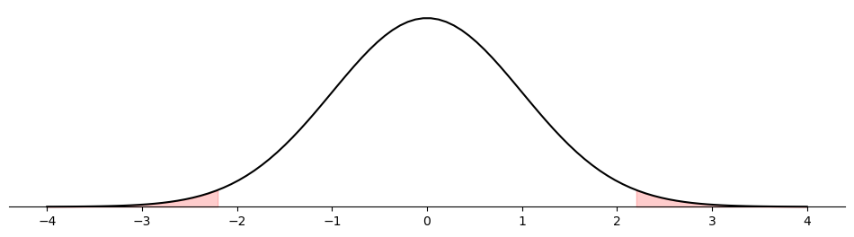
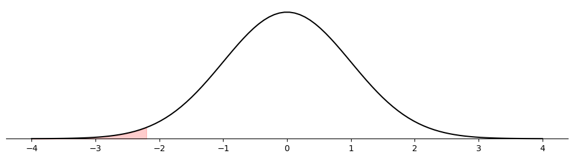
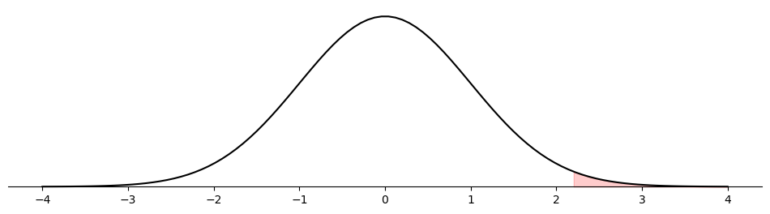
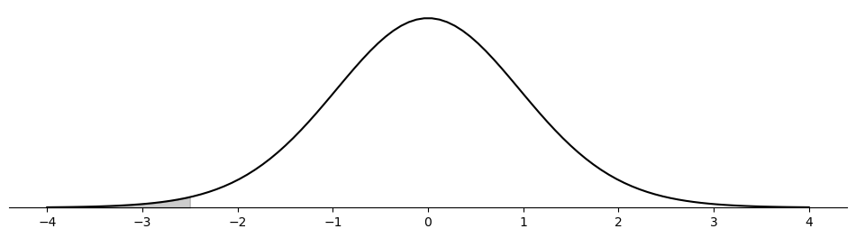
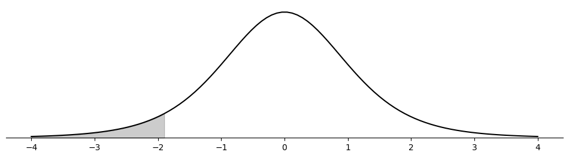
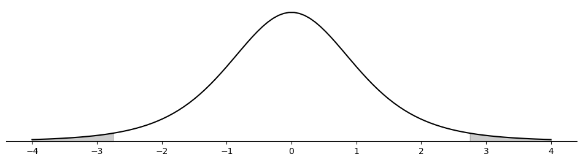
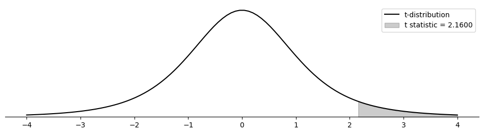
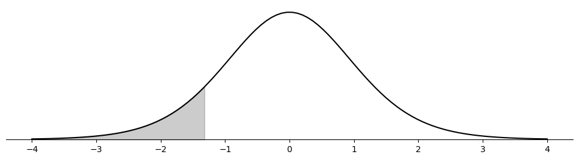

# 일표본 검정

## 1. 일표본 z 검정

일표본 z 검정은 모표준편차를 알고 있을 때 하나의 표본의 평균이 알려진(또는 가설의) 모평균과 유의하게 다른지 판단하는 통계적 방법이다.

표본이 몇 개뿐이더라도 자료가 정규분포를 따른다고 알려져 있고 모표준편차를 안다면, 정규분포의 성질에 의해 이 검정을 쓸 수 있다. 이때 표본분포는 다음을 만족한다:

$$\frac{\bar{x}-\mu_0}{\sigma/\sqrt{n}}\sim Z$$

표본크기 $n$이 크면($n \geq 30$) 중심극한정리와 약대수의법칙에 의해 모표준편차를 몰라도 이 검정을 쓸 수 있다. 이때 표본분포는 다음을 만족한다:

$$\frac{\bar{x}-\mu_0}{s/\sqrt{n}}\approx Z$$

### A. 가설

일표본 z 검정에서는 두 가설을 세운다:

- **귀무가설 ($H_0$)**: 표본평균($\bar{x}$)이 가설의 모평균($\mu_0$)과 같다고 진술한다. $H_0: \mu = \mu_0$으로 쓴다.

- **대립가설 ($H_a$)**: 표본평균이 가설의 모평균과 다르다고 진술한다. 연구 질문에 따라 다음 중 하나이다:
    - 양측: $H_a: \mu \neq \mu_0$
    - 단측(큼): $H_a: \mu > \mu_0$
    - 단측(작음): $H_a: \mu < \mu_0$

### B. 검정통계량

일표본 z 검정의 검정통계량은 다음 공식으로 계산한다:

$$ z = \frac{\bar{x} - \mu_0}{\sigma / \sqrt{n}} $$

여기서 $\bar{x}$는 표본평균, $\mu_0$은 귀무가설 아래의 모평균, $\sigma$는 알려진 모표준편차, $n$은 표본크기이다. 귀무가설 아래에서 이 통계량은 표준정규분포(Z-분포)를 따른다.

표본크기 $n$이 크면($n \geq 30$) $\sigma$ 자리에 표본표준편차 $s$를 대신 넣을 수 있다:

$$ z = \frac{\bar{x} - \mu_0}{s / \sqrt{n}} $$

### C. 판정 규칙

귀무가설을 기각할지 유지할지는 계산된 z-값과 원하는 유의수준($\alpha$)에 대응하는 임계 z-값으로 판정한다. 흔히 쓰는 유의수준은 0.05, 0.01, 0.10이다.

- **양측검정**: $|z| > z_{\alpha/2}$이면 $H_0$을 기각한다.
- **단측검정(큼)**: $z > z_{\alpha}$이면 $H_0$을 기각한다.
- **단측검정(작음)**: $z < -z_{\alpha}$이면 $H_0$을 기각한다.

### D. p-값

p-값은 귀무가설에 반하는 증거의 척도를 준다:

- 양측검정: $p\text{-값} = 2P(Z \geq |z|)$
- 단측검정(큼): $p\text{-값} = P(Z \geq z)$
- 단측검정(작음): $p\text{-값} = P(Z \leq z)$

### E. 해석

- p-값 $\leq \alpha$이면 귀무가설을 기각할 유의한 증거가 있으며, 표본평균이 모평균과 통계적으로 유의하게 다름을 뜻한다.
- p-값 $> \alpha$이면 귀무가설을 기각할 증거가 부족하다.

### F. 예제

#### 예제: 일표본 z 검정 — 양측

$$H_0: \mu=50 \quad \text{vs} \quad H_1: \mu\neq50$$

주어진 값: $n = 500$, $\bar{x} = 48$, $s = 20.3$.

```python
import matplotlib.pyplot as plt
import numpy as np
import scipy.stats as stats

def plot_z_statistic(statistic, ax, alternative='two-sided'):
    """검정통계량 위치에서 잘린 꼬리를 칠해 p-값을 눈으로 보여준다.

    칠해진 넓이가 곧 p-값이다. 양측이면 좌우 두 조각의 합이다.
    """
    x = np.linspace(-4, 4, 100)
    y = stats.norm().pdf(x)
    ax.plot(x, y, '-k')

    if alternative == 'less':
        x_fill = np.linspace(-4, statistic, 100)
        y_fill = stats.norm().pdf(x_fill)
        ax.fill_between(x_fill, y_fill, color='r', alpha=0.2)
    elif alternative == 'greater':
        x_fill = np.linspace(statistic, 4, 100)
        y_fill = stats.norm().pdf(x_fill)
        ax.fill_between(x_fill, y_fill, color='r', alpha=0.2)
    elif alternative == 'two-sided':
        x_fill_left = np.linspace(-4, -abs(statistic), 100)
        y_fill_left = stats.norm().pdf(x_fill_left)
        ax.fill_between(x_fill_left, y_fill_left, color='r', alpha=0.2)
        x_fill_right = np.linspace(abs(statistic), 4, 100)
        y_fill_right = stats.norm().pdf(x_fill_right)
        ax.fill_between(x_fill_right, y_fill_right, color='r', alpha=0.2)

    ax.spines['left'].set_visible(False)
    ax.spines['right'].set_visible(False)
    ax.spines['top'].set_visible(False)
    ax.spines['bottom'].set_position("zero")
    ax.set_yticks([])

mu = 50
n = 500
x_bar = 48
s = 20.3

# n = 500 >= 30 이므로 sigma를 몰라도 s를 넣고 z를 쓴다.
statistic = (x_bar - mu) / (s / np.sqrt(n))
# sf(x) = 1 - cdf(x) 이고 꼬리확률에서는 sf가 수치적으로 더 정확하다.
# abs를 씌우고 2를 곱해 양측으로 만든다.
p_value = stats.norm().sf(abs(statistic)) * 2

print(f"Statistic: {statistic:.4f}")
print(f"P-value  : {p_value:.4f}")

alpha = 0.05
if p_value <= alpha:
    print("Reject H0 (Choose H1)")
else:
    print("Fail to reject H0")

fig, ax = plt.subplots(figsize=(12, 3))
plot_z_statistic(statistic, ax=ax, alternative='two-sided')
plt.show()
```

출력:

```
Statistic: -2.2030
P-value  : 0.0276
Reject H0 (Choose H1)
```



$\bar x = 48$은 가설값 50에서 2만큼 떨어져 있을 뿐이지만 $n = 500$이라 표준오차가 0.91로 작아 $z = -2.20$이 된다. 표본이 크면 작은 차이도 유의해진다.

그림에서 칠해진 두 꼬리의 넓이 합이 0.0276이다.

#### 예제: 일표본 z 검정 — 작음

$$H_0: \mu=50 \quad \text{vs} \quad H_1: \mu<50$$

주어진 값: $n = 500$, $\bar{x} = 48$, $s = 20.3$.

```python
mu = 50
n = 500
x_bar = 48
s = 20.3

statistic = (x_bar - mu) / (s / np.sqrt(n))
# H1이 "작다" 쪽이므로 왼쪽 꼬리만 센다. abs도, 2를 곱하는 것도 없다.
p_value = stats.norm().cdf(statistic)

print(f"Statistic : {statistic:.4f}")
print(f"P-value   : {p_value:.4f}")

alpha = 0.05
if p_value <= alpha:
    print("We choose H1, or using statistician's jargon, reject H0")
else:
    print("We choose H0, or using statistician's jargon, fail to reject H0")

fig, ax = plt.subplots(figsize=(12, 3))
plot_z_statistic(statistic, ax=ax, alternative='less')
plt.show()
```

출력:

```
Statistic : -2.2030
P-value   : 0.0138
We choose H1, or using statistician's jargon, reject H0
```



같은 자료, 같은 통계량인데 p-값이 양측의 0.0276에서 정확히 절반인 0.0138이 되었다. 그림에서도 오른쪽 꼬리의 칠이 사라졌다.

단측검정을 쓰려면 자료를 보기 **전에** 방향을 정해 두어야 한다. 결과를 보고 유리한 방향을 고르면 실제 제1종 오류율이 5%가 아니라 10%가 된다.

#### 예제: 일표본 z 검정 — 큼

$$H_0: \mu=50 \quad \text{vs} \quad H_1: \mu>50$$

주어진 값: $n = 500$, $\bar{x} = 52$, $s = 20.3$.

```python
mu = 50
n = 500
x_bar = 52
s = 20.3

statistic = (x_bar - mu) / (s / np.sqrt(n))
# 이번에는 H1이 "크다" 쪽이므로 오른쪽 꼬리만 센다.
p_value = stats.norm().sf(statistic)

print(f"Statistic : {statistic:.4f}")
print(f"P-value   : {p_value:.4f}")

alpha = 0.05
if p_value <= alpha:
    print("We choose H1, or using statistician's jargon, reject H0")
else:
    print("We choose H0, or using statistician's jargon, fail to reject H0")

fig, ax = plt.subplots(figsize=(12, 3))
plot_z_statistic(statistic, ax=ax, alternative='greater')
plt.show()
```

출력:

```
Statistic : 2.2030
P-value   : 0.0138
We choose H1, or using statistician's jargon, reject H0
```



$\bar x$가 48에서 52로 바뀌어 통계량의 부호만 뒤집혔고, 대립가설의 방향도 함께 뒤집혀 p-값은 앞의 예제와 같은 0.0138이다. 정규분포의 대칭성 덕분이다.

---

## 2. 일표본 t 검정

일표본 t 검정은 모표준편차를 모르고 표본크기가 비교적 작을 때 하나의 표본의 평균이 알려진(또는 가설의) 모평균과 유의하게 다른지 판단하는 모수적 통계 기법이다. 이 검정은 모집단 분포가 근사적으로 정규라고 가정한다.

### A. 가설

- **귀무가설 ($H_0$)**: $H_0: \mu = \mu_0$
- **대립가설 ($H_a$)**:
    - 양측: $H_a: \mu \neq \mu_0$
    - 단측(큼): $H_a: \mu > \mu_0$
    - 단측(작음): $H_a: \mu < \mu_0$

### B. 검정통계량

$$ t = \frac{\bar{x} - \mu_0}{s / \sqrt{n}} $$

여기서 $\bar{x}$는 표본평균, $\mu_0$은 귀무가설 아래의 모평균, $s$는 표본표준편차, $n$은 표본크기이다. 이 통계량은 자유도 $n - 1$인 t-분포를 따른다.

### C. 판정 규칙

- **양측검정**: $|t| > t_{\alpha/2, n-1}$이면 $H_0$을 기각한다.
- **단측검정(큼)**: $t > t_{\alpha, n-1}$이면 $H_0$을 기각한다.
- **단측검정(작음)**: $t < -t_{\alpha, n-1}$이면 $H_0$을 기각한다.

### D. p-값

- 양측검정: $p\text{-값} = 2P(T \geq |t|)$
- 단측검정(큼): $p\text{-값} = P(T \geq t)$
- 단측검정(작음): $p\text{-값} = P(T \leq t)$

### E. 해석

- p-값 $\leq \alpha$이면 귀무가설을 기각할 통계적으로 유의한 증거가 있다.
- p-값 $> \alpha$이면 귀무가설을 기각할 증거가 부족하다.

### F. 예제

#### 예제: 교사 경력에 대한 t 통계량

Rory는 자기 학군의 교사들이 평균적으로 경력 5년 미만이라고 의심한다. $H_0: \mu = 5$ 대 $H_1: \mu < 5$를 검정한다. 교사 25명을 표본으로 모아 $\bar{x} = 4$년, $s = 2$년을 얻었다.

```python
import matplotlib.pyplot as plt
import numpy as np
from scipy import stats

def plot_t_statistic(statistic, df, ax, alternative='two-sided'):
    x = np.linspace(-4, 4, 100)
    y = stats.t(df).pdf(x)
    ax.plot(x, y, '-k')

    if alternative == 'less':
        x_fill = np.linspace(-4, statistic, 100)
        y_fill = stats.t(df).pdf(x_fill)
        ax.fill_between(x_fill, y_fill, color='k', alpha=0.2)
    elif alternative == 'greater':
        x_fill = np.linspace(statistic, 4, 100)
        y_fill = stats.t(df).pdf(x_fill)
        ax.fill_between(x_fill, y_fill, color='k', alpha=0.2)
    elif alternative == 'two-sided':
        x_fill_left = np.linspace(-4, -abs(statistic), 100)
        y_fill_left = stats.t(df).pdf(x_fill_left)
        ax.fill_between(x_fill_left, y_fill_left, color='k', alpha=0.2)
        x_fill_right = np.linspace(abs(statistic), 4, 100)
        y_fill_right = stats.t(df).pdf(x_fill_right)
        ax.fill_between(x_fill_right, y_fill_right, color='k', alpha=0.2)

    ax.spines['left'].set_visible(False)
    ax.spines['right'].set_visible(False)
    ax.spines['top'].set_visible(False)
    ax.spines['bottom'].set_position("zero")
    ax.set_yticks(())

mu_0 = 5
x_bar = 4
s = 2
n = 25

statistic = (x_bar - mu_0) / (s / np.sqrt(n))
df = n - 1                      # s를 자료에서 추정했으므로 하나를 잃는다
p_value = stats.t(df).cdf(statistic)

print(f"T-statistic: {statistic:.4f}")
print(f"P-value    : {p_value:.4f}")

fig, ax = plt.subplots(figsize=(12, 3))
plot_t_statistic(statistic, df=df, ax=ax, alternative='less')
plt.show()
```

출력:

```
T-statistic: -2.5000
P-value    : 0.0098
```



$p = 0.0098$로 1% 수준에서도 기각된다. Rory의 의심을 자료가 강하게 뒷받침한다.

#### 예제: Miriam의 검정에서 p-값

Miriam은 $H_0: \mu = 18$ 대 $H_1: \mu < 18$을 검정했다. 관측값 $n = 7$개를 써서 $t = -1.9$를 얻었다.

```python
n = 7
df = n - 1
# 원자료 없이 t 통계량만 있어도 p-값을 구할 수 있다.
# 필요한 것은 통계량과 자유도뿐이다.
statistic = -1.9
p_value = stats.t(df).cdf(statistic)
print(f"{statistic = :.4f}")
print(f"{p_value = :.4f}")

fig, ax = plt.subplots(figsize=(12, 3))
plot_t_statistic(statistic, df=df, ax=ax, alternative='less')
plt.show()
```

출력:

```
statistic = -1.9000
p_value = 0.0531
```



$p = 0.0531$로 0.05를 아슬아슬하게 넘어 기각하지 못한다. 같은 $t = -1.9$라도 자유도가 크면 이야기가 달라진다. $\text{df} = 30$이면 $p = 0.0335$로 기각된다. 자유도가 6밖에 안 되어 꼬리가 두꺼운 것이 여기서 결론을 가른다.

#### 예제: Caterina의 검정에서 p-값

Caterina는 $H_0: \mu = 0$ 대 $H_1: \mu \neq 0$을 검정했다. 관측값 $n = 6$개를 써서 $t = 2.75$를 얻었다.

```python
n = 6
df = n - 1
statistic = 2.75
# 양측이므로 한쪽 꼬리를 두 배 한다.
p_value = stats.t(df).sf(statistic) * 2
print(f"{statistic = :.4f}")
print(f"{p_value = :.4f}")

fig, ax = plt.subplots(figsize=(12, 3))
plot_t_statistic(statistic, df=df, ax=ax, alternative='two-sided')
plt.show()
```

출력:

```
statistic = 2.7500
p_value = 0.0403
```



양측인데도 $p = 0.0403 < 0.05$로 기각된다. 만약 Caterina가 단측으로 검정했다면 $p = 0.0201$이었을 것이다.

#### 예제: Jude의 자동 음료 충전기

Jude는 음료 $n = 20$개로 $H_0: \mu = 530$ 대 $H_1: \mu \neq 530$을 검정했다. $\bar{x} = 528$ mL, $s = 4$ mL를 얻어 $t = -2.236$, $p \approx 0.038$이 되었다. $\alpha = 0.05$에서 p-값이 유의수준보다 작으므로 $H_0$을 기각하고 $H_1$을 택한다.

#### 예제: 일표본 t 검정 — 간단한 예

$$H_0 : \mu = 70 \quad\text{vs}\quad H_1: \mu > 70$$

```python
samples = np.array([78, 83, 68, 72, 88])

n = samples.shape[0]
df = n - 1
x_bar = samples.mean()
s = samples.std(ddof=1)
mu = 70

confidence_level = 0.95
alpha = 1 - confidence_level
t_score = (x_bar - mu) / (s / np.sqrt(n))
# H1이 mu > 70인 단측이므로 오른쪽 꼬리만 센다.
# 여기에 양측 공식 sf(abs(t))*2 를 쓰면 p-값이 두 배가 되어
# 이 자료에서는 결론이 뒤집힌다(0.0484 대 0.0969).
p_value = stats.t(df=df).sf(t_score)

print(f"Test statistic (t-score): {t_score:.4f}")
print(f"p-value                 : {p_value:.4f}")

if p_value <= alpha:
    print("Reject H_0: Sufficient evidence to support the alternative hypothesis.")
else:
    print("Fail to reject H_0: Insufficient evidence to support the alternative hypothesis.")

fig, ax = plt.subplots(figsize=(12, 3))
plot_t_statistic(t_score, df=df, ax=ax, alternative='greater')
ax.legend(["t-distribution", f"t statistic = {t_score:.4f}"])
plt.show()
```

출력:

```
Test statistic (t-score): 2.1600
p-value                 : 0.0484
Reject H_0: Sufficient evidence to support the alternative hypothesis.
```



$p = 0.0484$로 0.05를 겨우 밑돌아 기각된다. 이 예제는 단측과 양측의 차이가 결론을 가르는 경우다. 양측으로 계산하면 $p = 0.0969$가 되어 기각하지 못한다. 대립가설의 방향을 세워 두었으면 p-값도 그 방향으로 계산해야 한다.

$\bar x = 77.8$로 가설값 70보다 한참 크지만 $n = 5$에 $s = 8.07$이라 표준오차가 3.61이나 되어 이만큼 아슬아슬해진다.

#### 예제: 우유

어떤 공장의 우유 용기에 128온스라고 표시되어 있다. 용기 12개의 표본에서 $\bar{x} = 127.2$ oz, $s = 2.1$ oz를 얻었다. $H_0: \mu = 128$ 대 $H_1: \mu < 128$을 검정하라.

```python
mu_0 = 128
x_bar = 127.2
s = 2.1
n = 12
statistic = (x_bar - mu_0) / (s / np.sqrt(n))
df = n - 1
p_value = stats.t(df).cdf(statistic)

print(f"{statistic = :.4f}")
print(f"{p_value = :.4f}")

alpha = 0.05
if p_value <= alpha:
    print("Reject H_0 in favor of H_1")
else:
    print("Fail to reject H_0")

fig, ax = plt.subplots(figsize=(12, 3))
plot_t_statistic(statistic, df=df, ax=ax, alternative='less')
plt.show()
```

출력:

```
statistic = -1.3197
p_value = 0.1069
Fail to reject H_0
```



평균이 표시량보다 0.8 oz 모자라지만 기각하지 못한다. $n = 12$에 $s = 2.1$이면 표준오차가 0.61이라 0.8 oz의 부족은 표준오차 1.3배 남짓에 지나지 않는다. "기각하지 못했다"가 "용기가 제대로 채워졌다"는 뜻이 아니라는 점이 중요하다. 이 자료는 $\mu = 128$도, $\mu = 126.4$도 배제하지 못한다.

---

## 3. 일표본 비율 검정

일표본 비율 검정(단일 비율에 대한 z 검정)은 표본에서 어떤 특성의 비율이 가설의 모비율과 통계적으로 유의하게 다른지 판단하는 방법이다. 관심 변수가 범주형일 때(예: 성공/실패, 예/아니오) 쓴다.

### A. 가설

- **귀무가설 ($H_0$)**: $H_0: p = p_0$
- **대립가설 ($H_a$)**:
    - 양측: $H_a: p \neq p_0$
    - 단측(큼): $H_a: p > p_0$
    - 단측(작음): $H_a: p < p_0$

### B. 검정통계량

$$ z = \frac{\hat{p} - p_0}{\sqrt{\frac{p_0 (1 - p_0)}{n}}} $$

여기서 $\hat{p}$는 표본비율, $p_0$은 가설의 모비율, $n$은 전체 관측값 수이다. $np_0 \geq 5$이고 $n(1 - p_0) \geq 5$이면 이 z-통계량은 표준정규분포를 따른다.

### C. 판정 규칙

- **양측검정**: $|z| > z_{\alpha/2}$이면 $H_0$을 기각한다.
- **단측검정(큼)**: $z > z_{\alpha}$이면 $H_0$을 기각한다.
- **단측검정(작음)**: $z < -z_{\alpha}$이면 $H_0$을 기각한다.

### D. p-값

- 양측검정: $p\text{-값} = 2P(Z \geq |z|)$
- 단측검정(큼): $p\text{-값} = P(Z \geq z)$
- 단측검정(작음): $p\text{-값} = P(Z \leq z)$

### E. 해석

- p-값 $\leq \alpha$이면 귀무가설을 기각할 만큼 증거가 강하다.
- p-값 $> \alpha$이면 귀무가설을 기각할 증거가 부족하다.

### F. 예제

#### 예제: 노동조합 가입 비율

Ariel은 자기 주의 교사 중 49%가 조합원인지 검정하려 한다.

$$H_0: p = 0.49 \quad \text{vs} \quad H_1: p \neq 0.49$$

#### 예제: 인터넷을 쓰는 California 가구의 비율

California 가구의 약 90%가 인터넷을 이용한다. 시장조사자들이 가구 1,000곳의 표본에서 920곳(92%)이 이용하는 것을 보고 그 비율이 더 높아졌는지 검정한다.

$$H_0: p = 0.90 \quad \text{vs} \quad H_1: p > 0.90$$

#### 예제: 실업률 — 검정통계량

시장이 주민 200명의 표본에서 22명이 실업 상태인 것을 보고 $H_0: p = 0.08$ 대 $H_1: p \neq 0.08$을 검정한다.

```python
p_hat = 22 / 200
p = 0.08
n = 200

# 표준오차의 분모에 p_hat이 아니라 가설값 p를 넣는다.
# H0가 참이라는 가정 아래의 확률을 재는 것이 검정이기 때문이다.
statistic = (p_hat - p) / np.sqrt(p * (1 - p) / n)
p_value = stats.norm().sf(abs(statistic)) * 2

print(f"Statistic: {statistic:.4f}")
print(f"P-value : {p_value:.4f}")
```

출력:

```
Statistic: 1.5639
P-value : 0.1179
```

관측된 실업률 11%가 가설값 8%보다 눈에 띄게 높지만 $n = 200$으로는 기각하지 못한다.

#### 예제: 여러 언어를 쓰는 사람

Fay는 $H_0: p = 0.26$ 대 $H_1: p > 0.26$을 검정한다. 120명 중 40명이 두 가지 이상의 언어를 쓸 수 있었다.

```python
p_hat = 40 / 120
p = 0.26
n = 120

statistic = (p_hat - p) / np.sqrt(p * (1 - p) / n)
p_value = stats.norm().sf(statistic)      # 단측이므로 오른쪽 꼬리만

print(f"Statistic: {statistic:.4f}")
print(f"P-value: {p_value:.4f}")
```

출력:

```
Statistic: 1.8314
P-value: 0.0335
```

$p = 0.0335 < 0.05$로 기각된다. 같은 통계량을 양측으로 계산했다면 $p = 0.067$이 되어 기각하지 못했을 것이다.

#### 예제: 공립학교 재정을 위한 증세

연구자들이 200명 중 113명이 지지하는 자료로 $H_0: p = 0.50$ 대 $H_1: p > 0.50$을 검정한다.

```python
k = 113
n = 200
p_0 = 0.5

# 정확검정: 이항분포에서 P(X >= 113)을 그대로 더한다. 근사가 없다.
result = stats.binomtest(k, n, p=p_0, alternative="greater")
print(f"Exact P-value: {result.pvalue:.4f}")

# 근사검정: 이항분포를 정규분포로 바꿔 계산한다.
p_hat = k / n
approx_statistic = (p_hat - p_0) / np.sqrt(p_0 * (1 - p_0) / n)
approx_p_value = stats.norm().sf(approx_statistic)
print(f"Approximate Statistic: {approx_statistic:.4f}")
print(f"Approximate P-value: {approx_p_value:.4f}")
```

출력:

```
Exact P-value: 0.0384
Approximate Statistic: 1.8385
Approximate P-value: 0.0330
```

두 값이 0.0384와 0.0330으로 다르다. 근사 쪽이 작게 나오는 것은 우연이 아니다. 이산인 이항분포를 연속인 정규분포로 바꾸면서 막대의 절반이 넘어가기 때문이며, 연속성 보정($k$ 대신 $k - 0.5$를 쓰는 것)으로 대부분 메울 수 있다.

여기서는 둘 다 0.05를 밑돌아 결론이 같다. 그러나 p-값이 0.04 언저리일 때 근사와 정확 사이의 이 정도 차이는 결론을 가를 수 있다.

#### 예제: 무료 비디오 대여권

학생들이 $H_0: p = 0.20$ 대 $H_1: p < 0.20$을 검정한다. 상자 65개에서 대여권 11장을 찾았다.

```python
k = 11
n = 65
p_0 = 0.2

result = stats.binomtest(k, n, p=p_0, alternative="less")
print(f"Exact P-value: {result.pvalue:.4f}")

p_hat = k / n
approx_statistic = (p_hat - p_0) / np.sqrt(p_0 * (1 - p_0) / n)
approx_p_value = stats.norm().cdf(approx_statistic)
print(f"Approximate Statistic: {approx_statistic:.4f}")
print(f"Approximate P-value: {approx_p_value:.4f}")
```

출력:

```
Exact P-value: 0.3301
Approximate Statistic: -0.6202
Approximate P-value: 0.2676
```

이번에는 차이가 더 크다. 0.3301과 0.2676으로 20% 넘게 벌어진다. $n p_0 = 13$으로 경험칙은 만족하지만 $k = 11$이 작아 이산성의 영향이 크게 남는다. 어느 쪽이든 기각하지 못하므로 결론은 같다.

---

## 4. 일표본 t 검정의 대안

정규성을 비롯한 모수적 조건이 깨질 때 쓸 수 있는 일표본 t-검정의 비모수적 대안이 있다.

| **검정** | **가정** | **언제 쓰는가** | **강점** |
|---|---|---|---|
| **Wilcoxon 부호순위** | 차이가 중앙값을 중심으로 대칭 | 가장 흔한 비모수적 대안 | 순위를 쓰므로 부호검정보다 검정력이 크다 |
| **부호검정** | 없음(부호만 본다) | 자료가 순서형이거나 치우쳐 있을 때 | 단순하고 로버스트하지만 검정력이 낮다 |
| **붓스트랩** | 없음 | 작은 표본, 신뢰구간이 필요할 때 | 유연하지만 계산량이 많다 |
| **순열검정** | 없음 | 분포 가정이 없을 때 | 로버스트하고 다재다능하지만 계산이 필요하다 |
| **Mood 중앙값 검정** | 없음 | 정규가 아닌 자료의 중앙값 비교 | 이상점에 로버스트하다 |

### A. Wilcoxon 부호순위 검정

일표본 Wilcoxon 부호순위 검정은 일표본 t-검정의 비모수적 대안으로, 하나의 표본의 중앙값이 가설의 값과 다른지 평가한다.

**검정 절차:**

1. 차이를 계산한다: $d_i = X_i - m_0$. $d_i = 0$인 것은 버린다.
2. 절대차이 $|d_i|$를 오름차순으로 순위를 매긴다.
3. 각 차이의 부호를 해당 순위에 부여한다.
4. $W^+$(양의 순위의 합)와 $W^-$(음의 순위의 합)를 계산한다.
5. 검정통계량: $W = \min(W^+, W^-)$.
6. 표본이 크면 정규근사를 쓴다:

$$Z = \frac{W - \frac{n(n+1)}{4}}{\sqrt{\frac{n(n+1)(2n+1)}{24}}}$$

```python
import numpy as np
from scipy.stats import wilcoxon

task_times = np.array([16, 14, 15, 17, 13, 18, 14, 16, 15, 19])
hypothetical_median = 15

# 차이의 **크기 순위**에 부호를 붙여 더한다.
# 부호검정이 방향만 보는 것과 달리 크기 정보를 일부 살리므로 검정력이 높다.
differences = task_times - hypothetical_median
stat, p_value = wilcoxon(differences)

print(f"Test Statistic: {stat}")
print(f"P-value: {p_value}")

alpha = 0.05
if p_value < alpha:
    print("Reject the null hypothesis: The median is significantly different.")
else:
    print("Fail to reject the null hypothesis: No significant difference.")
```

출력:

```
Test Statistic: 10.5
P-value: 0.28702974430361805
Fail to reject the null hypothesis: No significant difference.
```

자료의 중앙값이 15.5로 가설값 15에 가깝고, 관측값 10개 중 2개는 차이가 정확히 0이라 버려진다. 실질적으로 8개로 검정하는 셈이라 검정력이 낮다.

### B. 부호검정

부호검정은 하나의 표본의 중앙값이 지정된 값과 같은지 평가한다. 차이의 크기는 무시하고 방향(양수인지 음수인지)만 본다.

```python
from scipy.stats import binom
import numpy as np

def sign_test(data, median_hypothesis):
    """차이의 부호만 세는 검정. 크기는 완전히 버린다.

    H0가 "중앙값 = median_hypothesis"이면 각 관측값이 그보다 클 확률이 1/2이므로
    양수의 개수가 Bin(n, 0.5)를 따른다. 그래서 이항분포로 p-값을 구한다.
    """
    differences = np.array(data) - median_hypothesis
    n_plus = np.sum(differences > 0)
    n_minus = np.sum(differences < 0)
    ties = np.sum(differences == 0)      # 0인 것은 세지 않고 버린다
    W = min(n_plus, n_minus)
    n = n_plus + n_minus                 # 동점을 뺀 개수
    p_value = 2 * binom.cdf(W, n, 0.5)
    return p_value, n_plus, n_minus, ties

data = [9.8, 10.1, 9.9, 10.2, 10.4, 10.3, 10.0, 9.7, 10.5, 9.6, 10.0, 9.9, 10.2, 9.8, 10.1]
p_value, n_plus, n_minus, ties = sign_test(data, 10)
print(f"P-value: {p_value}, n+: {n_plus}, n-: {n_minus}, Ties: {ties}")
```

출력:

```
P-value: 1.0, n+: 7, n-: 6, Ties: 2
```

양수 7개와 음수 6개로 거의 반반이니 $p = 1.0$이 나온다. 부호검정이 얼마나 많은 정보를 버리는지도 여기서 드러난다. 10.5든 10.01이든 똑같이 "양수 하나"로 셀 뿐이다. 그래서 로버스트하지만 검정력이 낮다.

### C. 붓스트랩 방법

붓스트랩 방법은 관측된 자료에서 복원추출로 재표본을 반복해 뽑아 통계량의 분포를 추정한다. 모수적 방법과 달리 바탕 분포에 대한 가정을 하지 않는다.

```python
import numpy as np

np.random.seed(42)      # 아래 출력을 재현하려면 고정한다

def bootstrap_confidence_interval(data, statistic=np.mean, n_resamples=10000, ci=95):
    """원자료에서 **복원**추출로 재표본을 만들어 통계량의 분포를 흉내 낸다.

    size=len(data)가 핵심이다. 원자료와 같은 크기로 뽑아야
    "같은 크기의 표본을 다시 얻었다면"이라는 물음에 답하는 것이 된다.
    """
    bootstrap_distribution = np.array([
        statistic(np.random.choice(data, size=len(data), replace=True))
        for _ in range(n_resamples)
    ])
    lower_bound = np.percentile(bootstrap_distribution, (100 - ci) / 2)
    upper_bound = np.percentile(bootstrap_distribution, 100 - (100 - ci) / 2)
    return lower_bound, upper_bound, bootstrap_distribution

data = [5, 7, 9, 12, 15]
lower, upper, _ = bootstrap_confidence_interval(data)
print(f"95% CI for the Mean: ({lower:.2f}, {upper:.2f})")
```

출력:

```
95% CI for the Mean: (6.60, 12.80)
```

관측값 다섯 개의 평균은 9.6이다. 같은 자료에 $t$-구간을 쓰면 $(4.66, 14.54)$로 붓스트랩 구간보다 훨씬 넓다. 표본이 다섯 개뿐일 때 백분위수 붓스트랩은 구간을 좁게 잡는 경향이 있다. 재표본이 원자료의 다섯 값 안에서만 나오므로 원자료가 담지 못한 꼬리를 만들어 낼 수 없기 때문이다.

### D. 순열검정

순열검정은 관측된 검정통계량을, 자료를 가능한 모든 방식으로 재배열하여 만든 분포와 견주어 귀무가설과 부합하는지 평가한다.

```python
import numpy as np

np.random.seed(42)      # 아래 출력을 재현하려면 고정한다

def permutation_test(group_a, group_b, n_permutations=10000):
    """집단 표시를 무작위로 뒤섞어 "차이가 없다"는 세상을 흉내 낸다.

    H0가 참이면 어느 관측값이 어느 집단에 속하는지가 아무 상관이 없다.
    그러니 표시를 뒤섞은 자료들이 곧 귀무분포다.
    """
    combined = np.concatenate([group_a, group_b])
    observed_diff = np.mean(group_a) - np.mean(group_b)
    perm_differences = []
    for _ in range(n_permutations):
        # 비복원이다. 값 자체는 그대로 두고 순서만 바꾼다.
        # 붓스트랩이 복원추출인 것과 여기서 갈린다.
        np.random.shuffle(combined)
        perm_diff = np.mean(combined[:len(group_a)]) - np.mean(combined[len(group_a):])
        perm_differences.append(perm_diff)
    perm_differences = np.array(perm_differences)
    p_value = np.mean(np.abs(perm_differences) >= np.abs(observed_diff))
    return p_value, observed_diff, perm_differences

group_a = [8, 7, 9, 10, 6]
group_b = [5, 6, 4, 3, 7]
p_value, observed_diff, _ = permutation_test(group_a, group_b)
print(f"Observed Difference: {observed_diff:.2f}, P-value: {p_value:.4f}")
```

출력:

```
Observed Difference: 3.00, P-value: 0.0407
```

집단당 다섯 개씩이라 가능한 배치가 $\binom{10}{5} = 252$가지뿐이다. 10,000번을 뽑아도 서로 다른 배치는 252개를 넘지 못하므로, 이 경우에는 모든 배치를 다 나열하는 완전 순열검정이 더 낫다. 완전 열거로 계산하면 $p = 0.0397$이다.

#### 붓스트랩과 순열검정의 비교

| 항목 | **붓스트랩** | **순열검정** |
|---|---|---|
| **주된 목적** | 신뢰구간, 변동성 추정 | 가설검정 |
| **재표본추출** | 복원 | 비복원 |
| **핵심 출력** | 신뢰구간 | 가설검정을 위한 p-값 |
| **가정** | 자료가 모집단을 대표한다 | 귀무가설 아래의 교환가능성 |
| **유연성** | 복잡한 통계량에 매우 유연하다 | 비교적 단순한 검정에 집중한다 |

### E. Mood 중앙값 검정

Mood 중앙값 검정은 둘 이상 집단의 중앙값을 비교하는 비모수 검정으로, 자료에 이상점이 있을 때 특히 유용하다.

```python
import numpy as np
from scipy.stats import chi2_contingency

def moods_median_test(*groups):
    """전체 중앙값을 기준으로 각 집단의 위/아래 개수를 세어 독립성을 검정한다."""
    combined_data = np.concatenate(groups)
    overall_median = np.median(combined_data)
    contingency_table = []
    for group in groups:
        # 중앙값과 **같은** 값은 위에도 아래에도 들어가지 않고 버려진다.
        # 이산적인 자료에서는 이렇게 버려지는 관측값이 적지 않을 수 있다.
        above = np.sum(group > overall_median)
        below = np.sum(group < overall_median)
        contingency_table.append([above, below])
    contingency_table = np.array(contingency_table).T
    chi2_stat, p_value, _, _ = chi2_contingency(contingency_table)
    return chi2_stat, p_value, contingency_table

group_a = np.array([50, 55, 60, 65, 70])
group_b = np.array([45, 50, 55, 60, 65])
chi2_stat, p_value, table = moods_median_test(group_a, group_b)
print(f"Chi-Square: {chi2_stat:.4f}, P-value: {p_value:.4f}")
print(table)
```

출력:

```
Chi-Square: 0.0000, P-value: 1.0000
[[3 2]
 [2 3]]
```

전체 중앙값은 57.5이고, 그보다 큰 값이 group_a에 3개, group_b에 2개다(표의 첫 행). 표만 보면 완전한 균형은 아닌데 통계량이 정확히 0으로 나왔다.

`chi2_contingency`가 $2 \times 2$ 표에 **Yates 연속성 보정**을 기본으로 적용하기 때문이다. 각 칸의 편차 0.5에서 0.5를 빼면 0이 되어 통계량이 0으로 무너진다. `correction=False`로 끄면 $\chi^2 = 0.4$, $p = 0.527$이 나온다. 어느 쪽이든 기각하지 못하지만, 표본이 작은 $2 \times 2$ 표에서 이 기본값이 결과를 크게 바꿀 수 있다는 점은 알고 있어야 한다.

$p$가 크다고 "두 집단이 같다"고 읽어서도 안 된다. 집단당 다섯 개로는 어떤 차이도 잡아낼 수 없다는 뜻일 뿐이다. 실제로 group_b는 group_a보다 정확히 5씩 작다.

## 연습문제

<div class="drillbox" markdown>

**연습문제 1.**
관측값 36개의 표본에서 $\bar{x} = 52$, $s = 6$이다. 일표본 $t$-검정으로 $\alpha = 0.05$에서 $H_0: \mu = 50$ 대 $H_1: \mu \neq 50$을 검정하라.

</div>

??? success "풀이"
    검정통계량은:

    $$
    t = \frac{\bar{x} - \mu_0}{s/\sqrt{n}} = \frac{52 - 50}{6/\sqrt{36}} = \frac{2}{1} = 2.0
    $$

    $df = 35$에서 임계값은 $t_{35, 0.025} \approx 2.030$이다. $|t| = 2.0 < 2.030$이므로 $\alpha = 0.05$에서 아슬아슬하게 $H_0$을 **기각하지 못한다**. p-값은 약 0.053이다.

<div class="drillbox" markdown>

**연습문제 2.**
평균에 대한 일표본 검정에서 z-검정과 $t$-검정을 각각 언제 쓸지 설명하라.

</div>

??? success "풀이"
    모표준편차 $\sigma$를 알 때는 **z-검정**을 쓴다. 검정통계량 $Z = (\bar{X} - \mu_0)/(\sigma/\sqrt{n})$이 정확히 표준정규분포를 따른다.

    $\sigma$를 모르고 표본표준편차 $s$로 추정해야 할 때는 **$t$-검정**을 쓴다. 검정통계량 $T = (\bar{X} - \mu_0)/(S/\sqrt{n})$이 (정규성 아래에서) $t_{n-1}$ 분포를 따른다. 실무에서 $\sigma$를 아는 경우는 거의 없으므로 $t$-검정이 표준적인 선택이다. $n$이 크면(대략 $n \geq 30$) $t$와 $z$ 분포가 거의 같다.

<div class="drillbox" markdown>

**연습문제 3.**
어떤 연구자가 정규가 아니라고 의심되는 모집단에서 작은 표본($n = 8$)을 얻었다. 위치모수를 검정하는 데 어떤 일표본 검정을 써야 하며 그 이유는?

</div>

??? success "풀이"
    **Wilcoxon 부호순위 검정**이나 **부호검정**을 써야 한다. 둘 다 정규성 가정을 요구하지 않는 비모수 검정이다.

    분포가 정규는 아니지만 대칭이라면 **Wilcoxon 부호순위 검정**이 낫다. 가설의 중앙값으로부터의 편차의 순위와 부호를 쓰므로 부호검정보다 검정력이 크다. **부호검정**은 (가설값보다 위인지 아래인지) 방향만 쓰며 임의의 연속분포에 통하지만 검정력이 낮다. $n = 8$이고 자료가 정규가 아니면 $t$-분포 근사를 믿을 수 없으므로 $t$-검정은 쓰지 말아야 한다.

<div class="drillbox" markdown>

**연습문제 4.**
일표본 비율 검정에서 유권자 100명 중 45명이 어떤 안건을 지지한다. $\alpha = 0.05$에서 $H_0: p = 0.50$ 대 $H_1: p < 0.50$을 검정하라.

</div>

??? success "풀이"
    $\hat{p} = 45/100 = 0.45$. $H_0$ 아래에서 표준오차는:

    $$
    \text{SE}_0 = \sqrt{\frac{p_0(1-p_0)}{n}} = \sqrt{\frac{0.50 \times 0.50}{100}} = 0.05
    $$

    검정통계량은:

    $$
    z = \frac{\hat{p} - p_0}{\text{SE}_0} = \frac{0.45 - 0.50}{0.05} = -1.0
    $$

    좌측검정의 임계값은 $z_{0.05} = -1.645$이다. $z = -1.0 > -1.645$이므로 $H_0$을 **기각하지 못한다**. p-값은 $P(Z < -1.0) = 0.159$이다. 유권자의 50% 미만이 이 안건을 지지한다고 결론지을 증거가 부족하다.

---

## 정리하며

일표본 검정 네 가지를 **한 표로** 정리한다.

| 모수 | 조건 | 통계량 | 분포 |
|---|---|---|---|
| $\mu$ | $\sigma$ 기지 | $(\bar x-\mu_0)/(\sigma/\sqrt n)$ | $N(0,1)$ |
| $\mu$ | $\sigma$ 미지 | $(\bar x-\mu_0)/(s/\sqrt n)$ | $t_{n-1}$ |
| $p$ | $np_0\ge5$ | $(\hat p-p_0)/\sqrt{p_0(1-p_0)/n}$ | $N(0,1)$ 근사 |
| $\sigma^2$ | 정규모집단 | $(n-1)s^2/\sigma_0^2$ | $\chi^2_{n-1}$ |

- **구조가 모두 같다.** (추정값 $-$ 귀무값) $\div$ 표준오차. 분산 검정만 비 형태라 예외다.
- **$n\ge30$ 이면 $\sigma$ 를 몰라도 $z$ 로 근사할 수 있다**는 것이 전통적 관례이지만, 3장에서 보았듯 **치우친 모집단에서는 이 규칙이 성립하지 않는다.** 의심스러우면 $t$ 를 쓰면 된다 — $n$ 이 크면 어차피 같은 답이다.
- **강건성의 순서가 있다.** 평균 검정 > 비율 검정 > 분산 검정. 뒤로 갈수록 가정에 민감하다.
- **결론을 쓸 때는 방향과 크기를 함께 적는다.** "유의하다"만으로는 실질적 의미를 알 수 없다.

다음 절부터 같은 검정들을 **코드로** 구현한다.
