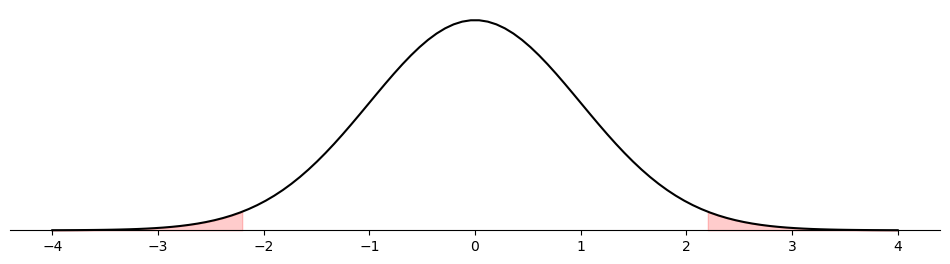
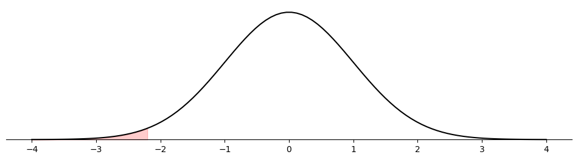
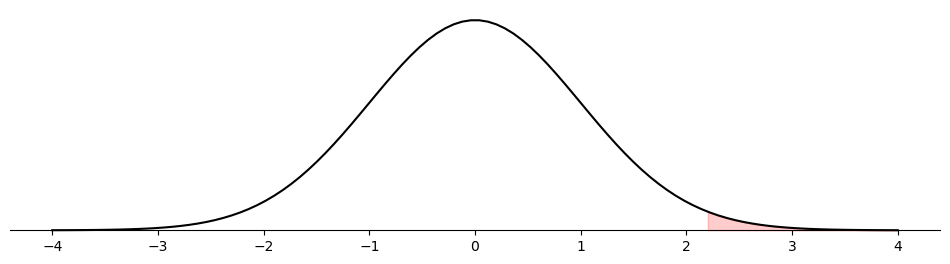
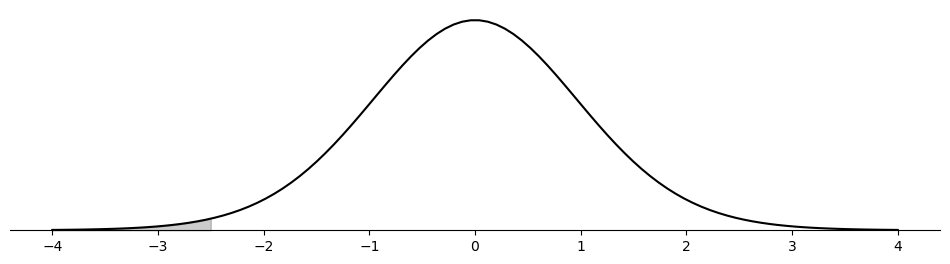
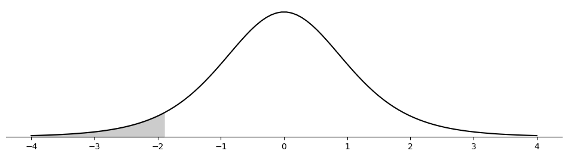
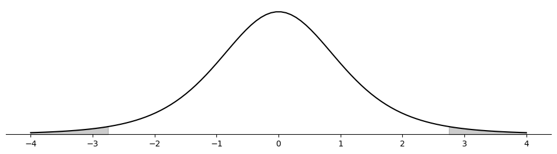
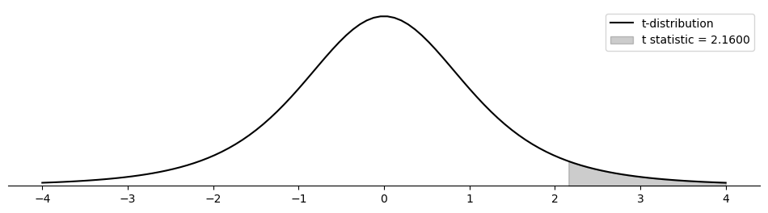
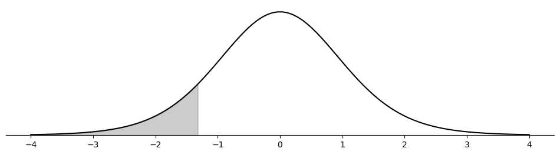

# 일표본 검정

## 1. 일표본 z 검정

일표본 z 검정은 모표준편차를 알고 있을 때 하나의 표본의 평균이 알려진(또는 가설의) 모평균과 유의하게 다른지 판단하는 통계적 방법이다.

표본이 몇 개뿐이더라도 자료가 정규분포를 따른다고 알려져 있고 모표준편차를 안다면, 정규분포의 성질에 의해 이 검정을 쓸 수 있다. 이때 표본분포는 다음을 만족한다:

$$\frac{\bar{x}-\mu_0}{\sigma/\sqrt{n}}\sim Z$$

표본크기 $n$이 크면($n \geq 30$) 중심극한정리와 약대수의법칙에 의해 모표준편차를 몰라도 이 검정을 쓸 수 있다. 이때 표본분포는 다음을 만족한다:

$$\frac{\bar{x}-\mu_0}{s/\sqrt{n}}\approx Z$$

### A. 가설

일표본 z 검정에서는 두 가설을 세운다:

- **귀무가설 ($H_0$)**: 표본평균($\bar{x}$)이 가설의 모평균($\mu_0$)과 같다고 진술한다. $H_0: \mu = \mu_0$으로 쓴다.

- **대립가설 ($H_a$)**: 표본평균이 가설의 모평균과 다르다고 진술한다. 연구 질문에 따라 다음 중 하나이다:
    - 양측: $H_a: \mu \neq \mu_0$
    - 단측(큼): $H_a: \mu > \mu_0$
    - 단측(작음): $H_a: \mu < \mu_0$

### B. 검정통계량

일표본 z 검정의 검정통계량은 다음 공식으로 계산한다:

$$ z = \frac{\bar{x} - \mu_0}{\sigma / \sqrt{n}} $$

여기서 $\bar{x}$는 표본평균, $\mu_0$은 귀무가설 아래의 모평균, $\sigma$는 알려진 모표준편차, $n$은 표본크기이다. 귀무가설 아래에서 이 통계량은 표준정규분포(Z-분포)를 따른다.

표본크기 $n$이 크면($n \geq 30$) $\sigma$ 자리에 표본표준편차 $s$를 대신 넣을 수 있다:

$$ z = \frac{\bar{x} - \mu_0}{s / \sqrt{n}} $$

### C. 판정 규칙

귀무가설을 기각할지 유지할지는 계산된 z-값과 원하는 유의수준($\alpha$)에 대응하는 임계 z-값으로 판정한다. 흔히 쓰는 유의수준은 0.05, 0.01, 0.10이다.

- **양측검정**: $|z| > z_{\alpha/2}$이면 $H_0$을 기각한다.
- **단측검정(큼)**: $z > z_{\alpha}$이면 $H_0$을 기각한다.
- **단측검정(작음)**: $z < -z_{\alpha}$이면 $H_0$을 기각한다.

### D. p-값

p-값은 귀무가설에 반하는 증거의 척도를 준다:

- 양측검정: $p\text{-값} = 2P(Z \geq |z|)$
- 단측검정(큼): $p\text{-값} = P(Z \geq z)$
- 단측검정(작음): $p\text{-값} = P(Z \leq z)$

### E. 해석

- p-값 $\leq \alpha$이면 귀무가설을 기각할 유의한 증거가 있으며, 표본평균이 모평균과 통계적으로 유의하게 다름을 뜻한다.
- p-값 $> \alpha$이면 귀무가설을 기각할 증거가 부족하다.

### F. 보기

<div class="exbox" markdown>

**보기 1.** <span class="diff easy" title="쉬움"></span> 일표본 z 검정 — 양측. 관측값 $n = 500$개에서 $\bar x = 48$, $s = 20.3$을 얻었다.

$$H_0: \mu = 50 \quad \text{vs} \quad H_1: \mu \neq 50$$

**(1)** 검정통계량과 양측 p-값을 손으로 구하고, $\alpha = 0.05$의 기각역을 $\bar x$의 값으로 환산하시오.

**(2)** 코드로 확인하고, p-값이 그림의 어느 넓이인지 밝히시오.

</div>

??? success "풀이"

    **(1) 해석적으로.** 표준오차부터 구한다.

    $$
    \frac{s}{\sqrt{n}} = \frac{20.3}{\sqrt{500}} = \frac{20.3}{22.3607} = 0.90784
    $$

    이므로 검정통계량은

    $$
    z = \frac{\bar x - \mu_0}{s/\sqrt{n}} = \frac{48 - 50}{0.90784} = -2.20302
    $$

    이고, 양측 p-값은 한쪽 꼬리를 두 배 한 값이다.

    $$
    p = 2\,P(Z \ge 2.20302) = 2 \times 0.013797 = 0.027593
    $$

    기각역을 $\bar x$의 값으로 되돌려 보면 더 잘 보인다. $\lvert \bar x - 50 \rvert > 1.95996 \times 0.90784 = 1.77934$이므로

    $$
    \bar x < 48.2207 \quad \text{또는} \quad \bar x > 51.7793
    $$

    이다. 관측된 $48$은 아래쪽 경계보다 $0.22$만 더 낮다. **아슬아슬하게 들어간 것**이고, p-값 $0.0276$이 $0.05$에 가까운 것이 같은 사실의 다른 표현이다.

    **(2) 수치적으로.**

    ```python
    import matplotlib.pyplot as plt
    import numpy as np
    import scipy.stats as stats

    def plot_z_statistic(statistic, ax, alternative='two-sided'):
        """검정통계량 위치에서 잘린 꼬리를 칠해 p-값을 눈으로 보여준다.

        칠해진 넓이가 곧 p-값이다. 양측이면 좌우 두 조각의 합이다.
        """
        x = np.linspace(-4, 4, 100)
        y = stats.norm().pdf(x)
        ax.plot(x, y, '-k')

        if alternative == 'less':
            x_fill = np.linspace(-4, statistic, 100)
            y_fill = stats.norm().pdf(x_fill)
            ax.fill_between(x_fill, y_fill, color='r', alpha=0.2)
        elif alternative == 'greater':
            x_fill = np.linspace(statistic, 4, 100)
            y_fill = stats.norm().pdf(x_fill)
            ax.fill_between(x_fill, y_fill, color='r', alpha=0.2)
        elif alternative == 'two-sided':
            x_fill_left = np.linspace(-4, -abs(statistic), 100)
            y_fill_left = stats.norm().pdf(x_fill_left)
            ax.fill_between(x_fill_left, y_fill_left, color='r', alpha=0.2)
            x_fill_right = np.linspace(abs(statistic), 4, 100)
            y_fill_right = stats.norm().pdf(x_fill_right)
            ax.fill_between(x_fill_right, y_fill_right, color='r', alpha=0.2)

        ax.spines['left'].set_visible(False)
        ax.spines['right'].set_visible(False)
        ax.spines['top'].set_visible(False)
        ax.spines['bottom'].set_position("zero")
        ax.set_yticks([])

    mu = 50
    n = 500
    x_bar = 48
    s = 20.3

    # n = 500 >= 30 이므로 sigma를 몰라도 s를 넣고 z를 쓴다.
    statistic = (x_bar - mu) / (s / np.sqrt(n))
    # sf(x) = 1 - cdf(x) 이고 꼬리확률에서는 sf가 수치적으로 더 정확하다.
    # abs를 씌우고 2를 곱해 양측으로 만든다.
    p_value = stats.norm().sf(abs(statistic)) * 2

    print(f"Statistic: {statistic:.4f}")
    print(f"P-value  : {p_value:.4f}")

    alpha = 0.05
    if p_value <= alpha:
        print("Reject H0 (Choose H1)")
    else:
        print("Fail to reject H0")

    fig, ax = plt.subplots(figsize=(12, 3))
    plot_z_statistic(statistic, ax=ax, alternative='two-sided')
    plt.show()
    ```

    출력:

    ```
    Statistic: -2.2030
    P-value  : 0.0276
    Reject H0 (Choose H1)
    ```

    

    $\bar x = 48$은 가설값 50에서 2만큼 떨어져 있을 뿐이지만 $n = 500$이라 표준오차가 0.91로 작아 $z = -2.20$이 된다. 표본이 크면 작은 차이도 유의해진다.

    그림에서 칠해진 두 꼬리의 넓이 합이 0.0276이다.

    유도한 $z = -2.20302$와 $p = 0.027593$이 출력의 $-2.2030$, $0.0276$과 맞는다. 칠해진 두 꼬리는 $z \le -2.2030$과 $z \ge 2.2030$이고 정규분포가 대칭이므로 두 조각의 넓이가 같다. 한 조각이 $0.013797$이다.

    **표본이 크면 작은 차이도 유의해진다.** 거꾸로 같은 $\bar x$와 $s$로 $n = 100$이었다면 표준오차가 $2.03$이 되어 $z = -0.9852$, $p = 0.3245$로 기각하지 못한다.

    한 가지 덧붙일 것이 있다. 여기서는 $\sigma$를 모르고 $s$를 넣었으니 통계량은 엄밀히 말해 $z$가 아니라 $t_{499}$다. 자유도 $499$에서 양측 p-값은 $0.02805$, 임계값은 $1.9647$이어서 정규의 $1.9600$과 거의 같다. **$n$이 이만큼 크면 둘을 구별할 필요가 없다**는 것이 "$n \ge 30$" 관례가 가리키는 바다.


<div class="exbox" markdown>

**보기 2.** <span class="diff easy" title="쉬움"></span> 일표본 z 검정 — 작음. 자료는 보기 1과 같고($n = 500$, $\bar x = 48$, $s = 20.3$) 대립가설만 바꾼다.

$$H_0: \mu = 50 \quad \text{vs} \quad H_1: \mu < 50$$

**(1)** 이 좌측 p-값이 보기 1의 양측 p-값의 **정확히** 절반임을 보이시오.

**(2)** 자료를 본 뒤에 유리한 방향을 골라 단측검정을 하면 실제 제1종 오류율이 얼마가 되는지 구하시오.

</div>

??? success "풀이"

    **(1) 절반인 것은 우연이 아니다.** 통계량은 자료만으로 정해지므로 보기 1과 같은 $z = -2.20302$다. 좌측 p-값은

    $$
    p_{<} = P(Z \le z) = P(Z \le -2.20302) = 0.013797
    $$

    이고 양측 p-값은 정의상

    $$
    p_{\ne} = 2\,P(Z \ge \lvert z \rvert) = 2\,P(Z \le -\lvert z \rvert)
    $$

    이다. 지금은 $z < 0$이므로 $-\lvert z \rvert = z$이고, 따라서 $p_{\ne} = 2 p_{<}$가 **등식으로** 성립한다. $0.027593 = 2 \times 0.013797$이다.

    여기에는 조건이 하나 붙어 있다. **통계량의 부호가 대립가설이 가리키는 방향과 같아야 한다.** 만약 $\bar x = 52$였다면 $z = +2.20302$이고 좌측 p-값은 $0.98620$이 되어 양측값 $0.027593$의 절반과는 아무 관계가 없다.

    **(2) 수치적으로.**

    ```python
    mu = 50
    n = 500
    x_bar = 48
    s = 20.3

    statistic = (x_bar - mu) / (s / np.sqrt(n))
    # H1이 "작다" 쪽이므로 왼쪽 꼬리만 센다. abs도, 2를 곱하는 것도 없다.
    p_value = stats.norm().cdf(statistic)

    print(f"Statistic : {statistic:.4f}")
    print(f"P-value   : {p_value:.4f}")

    alpha = 0.05
    if p_value <= alpha:
        print("We choose H1, or using statistician's jargon, reject H0")
    else:
        print("We choose H0, or using statistician's jargon, fail to reject H0")

    fig, ax = plt.subplots(figsize=(12, 3))
    plot_z_statistic(statistic, ax=ax, alternative='less')
    plt.show()
    ```

    출력:

    ```
    Statistic : -2.2030
    P-value   : 0.0138
    We choose H1, or using statistician's jargon, reject H0
    ```

    

    같은 자료, 같은 통계량인데 p-값이 양측의 0.0276에서 정확히 절반인 0.0138이 되었다. 그림에서도 오른쪽 꼬리의 칠이 사라졌다.

    단측검정을 쓰려면 자료를 보기 **전에** 방향을 정해 두어야 한다. 결과를 보고 유리한 방향을 고르면 실제 제1종 오류율이 5%가 아니라 10%가 된다.

    그 $10\%$는 어림이 아니라 정확한 값이다. 자료를 보고 유리한 쪽을 고른다는 것은 두 단측 p-값 중 **작은 쪽**을 쓴다는 뜻인데, 두 값의 합이 항상 $1$이므로 작은 쪽은 언제나 $P(Z \le -\lvert z \rvert)$다. 그러니 기각하는 사건은

    $$
    \min(p_{<},\, p_{>}) \le 0.05 \iff \lvert z \rvert \ge z_{0.05} = 1.64485
    $$

    이고, $H_0$ 아래에서 그 확률은

    $$
    P(\lvert Z \rvert \ge 1.64485) = 2 \times 0.05 = 0.10
    $$

    이다. **명목 $5\%$ 검정이 실제로는 $10\%$ 검정이 된다.** 모의실험이 필요 없는 닫힌 꼴이다.


<div class="exbox" markdown>

**보기 3.** <span class="diff easy" title="쉬움"></span> 일표본 z 검정 — 큼. 이번에는 $n = 500$, $\bar x = 52$, $s = 20.3$이다.

$$H_0: \mu = 50 \quad \text{vs} \quad H_1: \mu > 50$$

**(1)** p-값이 보기 2와 같은 값이 되는 까닭을 밝히시오.

**(2)** 참 평균이 정말 $52$라면, 같은 $\alpha = 0.05$에서 단측검정과 양측검정의 검정력은 각각 얼마인가. 닫힌 꼴로 구하시오.

</div>

??? success "풀이"

    **(1) 두 번 뒤집히면 제자리다.** $\bar x$가 $48$에서 $52$로 옮겨 가 $\bar x - \mu_0$의 부호만 바뀌었으므로 $z = +2.20302$다. 대립가설이 오른쪽이라 p-값은 오른쪽 꼬리이고

    $$
    p_{>} = P(Z \ge 2.20302) = 0.013797
    $$

    이다. 보기 2의 $P(Z \le -2.20302)$와 같은 수인데, 표준정규밀도가 $\varphi(-x) = \varphi(x)$로 대칭이기 때문이다. **통계량의 부호와 꼬리의 방향이 함께 뒤집혀 상쇄되었다.**

    **(2) 수치적으로.**

    ```python
    mu = 50
    n = 500
    x_bar = 52
    s = 20.3

    statistic = (x_bar - mu) / (s / np.sqrt(n))
    # 이번에는 H1이 "크다" 쪽이므로 오른쪽 꼬리만 센다.
    p_value = stats.norm().sf(statistic)

    print(f"Statistic : {statistic:.4f}")
    print(f"P-value   : {p_value:.4f}")

    alpha = 0.05
    if p_value <= alpha:
        print("We choose H1, or using statistician's jargon, reject H0")
    else:
        print("We choose H0, or using statistician's jargon, fail to reject H0")

    fig, ax = plt.subplots(figsize=(12, 3))
    plot_z_statistic(statistic, ax=ax, alternative='greater')
    plt.show()
    ```

    출력:

    ```
    Statistic : 2.2030
    P-value   : 0.0138
    We choose H1, or using statistician's jargon, reject H0
    ```

    

    $\bar x$가 48에서 52로 바뀌어 통계량의 부호만 뒤집혔고, 대립가설의 방향도 함께 뒤집혀 p-값은 앞의 보기와 같은 0.0138이다. 정규분포의 대칭성 덕분이다.

    **검정력은 방향을 맞게 세운 쪽이 높다.** 참 평균이 $\mu = 52$이고 표준오차가 $\sigma/\sqrt{n} = 0.90784$라면 비중심성은

    $$
    \frac{\mu - \mu_0}{\sigma/\sqrt{n}} = \frac{2}{0.90784} = 2.20302
    $$

    이다. $Z = (\bar X - 50)/0.90784$는 평균 $2.20302$, 분산 $1$인 정규분포를 따르므로

    $$
    \text{단측 검정력} = P(Z > 1.64485) = 1 - \Phi(1.64485 - 2.20302) = 1 - \Phi(-0.55817) = 0.7116
    $$

    $$
    \text{양측 검정력} = 1 - \Phi(1.95996 - 2.20302) + \Phi(-1.95996 - 2.20302) = 0.5960 + 0.0000 = 0.5960
    $$

    이다. 양측의 왼쪽 꼬리 기여 $\Phi(-4.163) = 0.0000157$은 소수 넷째 자리에 거의 보이지 않는다. **방향을 미리 알고 있으면 같은 자료로 검정력이 $0.596$에서 $0.712$로 올라간다.** 이것이 단측검정을 쓰는 유일한 정당한 이유이며, 보기 2에서 본 대로 **자료를 본 뒤에 방향을 고르는 순간 그 이득은 오류율로 되돌려 갚아야 한다.**


---

## 2. 일표본 t 검정

일표본 t 검정은 모표준편차를 모르고 표본크기가 비교적 작을 때 하나의 표본의 평균이 알려진(또는 가설의) 모평균과 유의하게 다른지 판단하는 모수적 통계 기법이다. 이 검정은 모집단 분포가 근사적으로 정규라고 가정한다.

### A. 가설

- **귀무가설 ($H_0$)**: $H_0: \mu = \mu_0$
- **대립가설 ($H_a$)**:
    - 양측: $H_a: \mu \neq \mu_0$
    - 단측(큼): $H_a: \mu > \mu_0$
    - 단측(작음): $H_a: \mu < \mu_0$

### B. 검정통계량

$$ t = \frac{\bar{x} - \mu_0}{s / \sqrt{n}} $$

여기서 $\bar{x}$는 표본평균, $\mu_0$은 귀무가설 아래의 모평균, $s$는 표본표준편차, $n$은 표본크기이다. 이 통계량은 자유도 $n - 1$인 t-분포를 따른다.

### C. 판정 규칙

- **양측검정**: $|t| > t_{\alpha/2, n-1}$이면 $H_0$을 기각한다.
- **단측검정(큼)**: $t > t_{\alpha, n-1}$이면 $H_0$을 기각한다.
- **단측검정(작음)**: $t < -t_{\alpha, n-1}$이면 $H_0$을 기각한다.

### D. p-값

- 양측검정: $p\text{-값} = 2P(T \geq |t|)$
- 단측검정(큼): $p\text{-값} = P(T \geq t)$
- 단측검정(작음): $p\text{-값} = P(T \leq t)$

### E. 해석

- p-값 $\leq \alpha$이면 귀무가설을 기각할 통계적으로 유의한 증거가 있다.
- p-값 $> \alpha$이면 귀무가설을 기각할 증거가 부족하다.

### F. 보기

<div class="exbox" markdown>

**보기 4.** <span class="diff easy" title="쉬움"></span> 교사 경력에 대한 t 통계량. Rory는 자기 학군의 교사들이 평균적으로 경력 5년 미만이라고 의심한다. 교사 25명을 표본으로 모아 $\bar x = 4$년, $s = 2$년을 얻었다.

$$H_0: \mu = 5 \quad \text{vs} \quad H_1: \mu < 5$$

**(1)** $t$ 통계량과 p-값을 손으로 구하고, $\alpha = 0.05$의 기각역을 $\bar x$의 값으로 환산하시오.

**(2)** 코드로 확인하시오.

**(3)** 모집단이 정규라면 이 검정의 제1종 오류율이 $\sigma$의 값과 상관없이 **정확히** $\alpha$가 되는 까닭을 밝히고, 치우친 모집단에서 실제 오류율을 모의로 재시오.

</div>

??? success "풀이"

    **(1) 해석적으로.** 표준오차가

    $$
    \frac{s}{\sqrt{n}} = \frac{2}{\sqrt{25}} = \frac{2}{5} = 0.4
    $$

    로 깔끔하게 나오므로

    $$
    t = \frac{\bar x - \mu_0}{s/\sqrt{n}} = \frac{4 - 5}{0.4} = -2.5
    $$

    이고 자유도는 $n - 1 = 24$다. 좌측 p-값은

    $$
    p = P(T_{24} \le -2.5) = 0.009827
    $$

    이다. 임계값은 $t_{0.05,\,24} = -1.71088$이므로 기각역을 $\bar x$로 환산하면

    $$
    \bar x < 5 - 1.71088 \times 0.4 = 4.31565
    $$

    다. 관측된 $\bar x = 4$는 경계보다 $0.32$년 더 아래여서 **여유 있게** 기각역 안에 있다.

    **(2) 수치적으로.**

    ```python
    import matplotlib.pyplot as plt
    import numpy as np
    from scipy import stats

    def plot_t_statistic(statistic, df, ax, alternative='two-sided'):
        """t 분포를 그리고 p-값에 해당하는 꼬리를 칠한다.

        대립가설의 방향에 따라 칠하는 쪽이 달라진다. 양측이면 양쪽을 모두
        칠하므로 넓이가 두 배가 되고, 그래서 양측 p-값이 단측의 두 배다.
        """
        x = np.linspace(-4, 4, 100)
        y = stats.t(df).pdf(x)
        ax.plot(x, y, '-k')

        if alternative == 'less':
            x_fill = np.linspace(-4, statistic, 100)
            y_fill = stats.t(df).pdf(x_fill)
            ax.fill_between(x_fill, y_fill, color='k', alpha=0.2)
        elif alternative == 'greater':
            x_fill = np.linspace(statistic, 4, 100)
            y_fill = stats.t(df).pdf(x_fill)
            ax.fill_between(x_fill, y_fill, color='k', alpha=0.2)
        elif alternative == 'two-sided':
            x_fill_left = np.linspace(-4, -abs(statistic), 100)
            y_fill_left = stats.t(df).pdf(x_fill_left)
            ax.fill_between(x_fill_left, y_fill_left, color='k', alpha=0.2)
            x_fill_right = np.linspace(abs(statistic), 4, 100)
            y_fill_right = stats.t(df).pdf(x_fill_right)
            ax.fill_between(x_fill_right, y_fill_right, color='k', alpha=0.2)

        ax.spines['left'].set_visible(False)
        ax.spines['right'].set_visible(False)
        ax.spines['top'].set_visible(False)
        ax.spines['bottom'].set_position("zero")
        ax.set_yticks(())

    # sigma 를 모르므로 s 를 쓴다. 그래서 z 가 아니라 t 로 간다.
    mu_0 = 5
    x_bar = 4
    s = 2
    n = 25

    statistic = (x_bar - mu_0) / (s / np.sqrt(n))
    df = n - 1                      # s를 자료에서 추정했으므로 하나를 잃는다
    p_value = stats.t(df).cdf(statistic)

    print(f"T-statistic: {statistic:.4f}")
    print(f"P-value    : {p_value:.4f}")

    fig, ax = plt.subplots(figsize=(12, 3))
    plot_t_statistic(statistic, df=df, ax=ax, alternative='less')
    plt.show()
    ```

    출력:

    ```
    T-statistic: -2.5000
    P-value    : 0.0098
    ```

    

    $p = 0.0098$로 1% 수준에서도 기각된다. Rory의 의심을 자료가 강하게 뒷받침한다.

    유도한 $t = -2.5$와 $p = 0.009827$이 출력의 $-2.5000$, $0.0098$과 맞는다.

    **(3) 정규모집단에서는 크기가 정확히 $\alpha$다.** $X_1, \ldots, X_n$이 독립인 $N(\mu_0, \sigma^2)$이면

    $$
    T = \frac{\bar X - \mu_0}{S/\sqrt{n}} \sim t_{n-1}
    $$

    이 **근사가 아니라 등식**이고, 이 분포에 $\sigma$가 들어 있지 않다. $T$는 $\sigma$에 의존하지 않는 **추축량**이다. 그러므로 $\sigma$가 얼마든

    $$
    P(T < t_{\alpha,\,n-1}) = \alpha
    $$

    가 정확히 성립한다. $n$이 작아도 그렇다. $\sigma$를 모른다는 사실이 손해를 주는 곳은 오류율이 아니라 **임계값의 크기**다($1.7109$ 대 정규의 $1.6449$).

    **깨지는 것은 정규성이고, 어긋나는 양은 왜도가 정한다.**

    ```python
    import numpy as np
    from scipy import stats

    rng = np.random.default_rng(3)
    M, n = 400_000, 25
    c_left = stats.t(n - 1).ppf(0.05)        # 좌측 임계값 (우측은 대칭이라 -c_left)
    c_two = stats.t(n - 1).ppf(0.975)        # 양측 임계값

    print(f"n = {n},  되풀이 {M:,}회,  명목 수준 0.05")
    print(f"{'모집단':>10s} {'왜도':>7s} {'좌측':>8s} {'우측':>8s} {'양측':>8s}")
    for label, draw, mu, g1 in [
        ("정규", lambda s: rng.normal(0, 1, s), 0.0, 0.0),
        ("지수", lambda s: rng.exponential(1, s), 1.0, 2.0),
        ("로그정규", lambda s: rng.lognormal(0, 1, s), np.exp(0.5), 6.1849),
    ]:
        x = draw((M, n))
        # 참 평균 mu 를 귀무가설값으로 넣는다. 곧 H0 가 참인 세상이다.
        t = (x.mean(1) - mu) / (x.std(1, ddof=1) / np.sqrt(n))
        print(f"{label:>10s} {g1:7.2f} {(t < c_left).mean():8.4f} "
              f"{(t > -c_left).mean():8.4f} {(np.abs(t) > c_two).mean():8.4f}")
    print(f"\n몬테카를로 오차 = sqrt(0.05*0.95/{M}) "
          f"= {np.sqrt(0.05 * 0.95 / M):.5f}")
    ```

    출력:

    ```
    n = 25,  되풀이 400,000회,  명목 수준 0.05
           모집단      왜도       좌측       우측       양측
            정규    0.00   0.0500   0.0501   0.0502
            지수    2.00   0.1033   0.0214   0.0769
          로그정규    6.18   0.1626   0.0089   0.1245

    몬테카를로 오차 = sqrt(0.05*0.95/400000) = 0.00034
    ```

    **정규 줄의 세 값이 모두 $0.05$다.** 몬테카를로 오차가 $0.00034$이니 $0.0500$, $0.0501$, $0.0502$는 모두 $0.05$와 구별되지 않는다. 추축량 논증이 수로 확인된 것이다.

    치우친 모집단에서는 어긋나는 **방향이 꼬리마다 다르다.** 오른쪽으로 치우친 자료에서는 $\bar X$가 작게 나올 때 $S$도 함께 작아져 $T$의 왼쪽 꼬리가 두꺼워진다. 그래서 이 보기처럼 **좌측검정은 위험해지고**($0.05 \to 0.1033 \to 0.1626$) 우측검정은 보수적이 된다($0.05 \to 0.0214 \to 0.0089$). 양측은 두 효과가 일부 상쇄되어 중간에 놓인다. 왜도가 $2$에서 $6.18$로 커질 때 어긋남도 함께 커진다는 점에 주의하라. 이 어긋남이 $n$에 따라 어떻게 줄어드는지는 [5.3절](../../ch05/applications/standard_error.md)에서 다룬 바 있다.

    Rory의 자료에서는 교사 경력이 오른쪽으로 치우쳐 있을 가능성이 높다(경력은 $0$에서 막히고 위로만 열려 있다). 그렇다면 좌측검정인 이 검정의 실제 오류율은 $5\%$보다 **클** 수 있으므로, $p = 0.0098$을 명목 그대로 읽는 것은 위험한 쪽으로 기운 읽기다.


<div class="exbox" markdown>

**보기 5.** <span class="diff easy" title="쉬움"></span> Miriam의 검정에서 p-값. Miriam은 관측값 $n = 7$개로 $H_0: \mu = 18$ 대 $H_1: \mu < 18$을 검정해 $t = -1.9$를 얻었다. 원자료는 남아 있지 않다.

**(1)** 통계량과 자유도만으로 p-값을 구할 수 있는 까닭을 말하고, $\alpha = 0.05$에서의 결론을 임계값과 견주어 내리시오.

**(2)** 같은 $t = -1.9$에서 자유도를 키우면 p-값이 어떻게 변하는지 표로 만들고, 그 극한값이 무엇인지 밝히시오.

</div>

??? success "풀이"

    **(1) 통계량이 이미 모든 정보를 담고 있다.** $t$ 통계량은 $\bar x$, $s$, $n$을 하나의 수로 뭉친 것이고, 귀무분포 $t_{n-1}$은 자유도 하나로 정해진다. 그러니 p-값을 계산하는 데 필요한 것은 **통계량과 자유도뿐**이다. $\bar x$가 $17$이었는지 $4$였는지는 p-값에 영향을 주지 않는다.

    $n = 7$이므로 $\text{df} = 6$이고

    $$
    p = P(T_6 \le -1.9) = 0.0531
    $$

    이다. 임계값으로 보면 $t_{0.05,\,6} = -1.94318$이고 $-1.9 > -1.94318$이므로 기각역 **바깥**이다. 두 읽기가 당연히 일치한다. $p > 0.05 \iff t > t_{0.05,\,6}$이기 때문이다.

    **(2) 수치적으로.**

    ```python
    n = 7
    df = n - 1
    # 원자료 없이 t 통계량만 있어도 p-값을 구할 수 있다.
    # 필요한 것은 통계량과 자유도뿐이다.
    statistic = -1.9
    p_value = stats.t(df).cdf(statistic)
    print(f"{statistic = :.4f}")
    print(f"{p_value = :.4f}")

    fig, ax = plt.subplots(figsize=(12, 3))
    plot_t_statistic(statistic, df=df, ax=ax, alternative='less')
    plt.show()
    ```

    출력:

    ```
    statistic = -1.9000
    p_value = 0.0531
    ```

    

    $p = 0.0531$로 0.05를 아슬아슬하게 넘어 기각하지 못한다. 같은 $t = -1.9$라도 자유도가 크면 이야기가 달라진다. $\text{df} = 30$이면 $p = 0.0335$로 기각된다. 자유도가 6밖에 안 되어 꼬리가 두꺼운 것이 여기서 결론을 가른다.

    자유도를 키워 가며 같은 통계량의 p-값을 재면 이렇다.

    ```python
    import numpy as np
    from scipy import stats

    statistic = -1.9
    print(f"{'df':>6s} {'임계값':>10s} {'p-값':>9s}")
    for df in [6, 10, 20, 30, 60, 120, 1000]:
        print(f"{df:6d} {stats.t(df).ppf(0.05):10.4f} {stats.t(df).cdf(statistic):9.4f}")
    # 자유도를 무한히 키운 극한이 표준정규다.
    print(f"{'∞':>6s} {stats.norm.ppf(0.05):10.4f} {stats.norm.cdf(statistic):9.4f}")
    ```

    출력:

    ```
        df        임계값       p-값
         6    -1.9432    0.0531
        10    -1.8125    0.0433
        20    -1.7247    0.0360
        30    -1.6973    0.0335
        60    -1.6706    0.0311
       120    -1.6577    0.0299
      1000    -1.6464    0.0289
         ∞    -1.6449    0.0287
    ```

    **p-값은 자유도의 감소함수이고 극한은 $\Phi(-1.9) = 0.0287$이다.** 본문이 말한 $\text{df} = 30$의 $0.0335$가 표에 그대로 있다. 자유도가 $6$인 Miriam의 $0.0531$은 그 극한보다 $0.0244$나 크다. **$t_6$의 꼬리가 정규보다 두꺼워 같은 거리가 더 흔한 일로 읽힌다**는 뜻이다.

    결론이 갈리는 지점을 거꾸로 찾아볼 수도 있다. $p = 0.05$가 되는 통계량은 임계값 그 자체이므로, $t = -1.9$로 기각하려면 임계값이 $-1.9$보다 커야 하고 표에서 그것은 $\text{df} \ge 10$일 때다. **관측값 세 개만 더 있었다면 결론이 뒤집혔다.**


<div class="exbox" markdown>

**보기 6.** <span class="diff easy" title="쉬움"></span> Caterina의 검정에서 p-값. Caterina는 관측값 $n = 6$개로 $H_0: \mu = 0$ 대 $H_1: \mu \neq 0$을 검정해 $t = 2.75$를 얻었다. 원자료도, $\bar x$도, $s$도 남아 있지 않다.

**(1)** 양측 p-값과, 같은 자료를 단측으로 검정했을 때의 p-값을 구하시오.

**(2)** $\bar x$와 $s$를 모르는데도 **$\mu$의 95% 신뢰구간이 $0$을 담지 않는다**는 것을 보일 수 있다. 보이시오.

</div>

??? success "풀이"

    **(1) 해석적으로.** $\text{df} = n - 1 = 5$이고 통계량이 양수이므로

    $$
    p_{\ne} = 2\,P(T_5 \ge 2.75) = 2 \times 0.020155 = 0.040310
    $$

    이다. 단측(큼)이었다면 그 절반인 $p_{>} = 0.020155$다. 보기 2에서 본 관계가 그대로 적용된다 — 통계량의 부호가 대립가설의 방향과 같으므로 단측이 양측의 정확히 절반이다.

    **(2) 수치적으로.**

    ```python
    n = 6
    df = n - 1
    statistic = 2.75
    # 양측이므로 한쪽 꼬리를 두 배 한다.
    p_value = stats.t(df).sf(statistic) * 2
    print(f"{statistic = :.4f}")
    print(f"{p_value = :.4f}")

    fig, ax = plt.subplots(figsize=(12, 3))
    plot_t_statistic(statistic, df=df, ax=ax, alternative='two-sided')
    plt.show()
    ```

    출력:

    ```
    statistic = 2.7500
    p_value = 0.0403
    ```

    

    양측인데도 $p = 0.0403 < 0.05$로 기각된다. 만약 Caterina가 단측으로 검정했다면 $p = 0.0201$이었을 것이다.

    **신뢰구간과 검정은 같은 사건이다.** $\mu$의 양측 $95\%$ $t$-구간은

    $$
    \bar x \pm t_{0.025,\,5}\,\frac{s}{\sqrt{6}}, \qquad t_{0.025,\,5} = 2.570582
    $$

    이다. 여기서 $\bar x$와 $s$를 따로 알 필요가 없다. 통계량의 정의 $t = \bar x / (s/\sqrt{6}) = 2.75$가 $\bar x = 2.75 \cdot s/\sqrt{6}$을 주므로, 구간 전체를 $s/\sqrt{6}$을 단위로 적을 수 있다.

    $$
    \left(\,(2.75 - 2.570582)\frac{s}{\sqrt 6},\ \ (2.75 + 2.570582)\frac{s}{\sqrt 6}\,\right)
    = \left(0.179418\,\frac{s}{\sqrt 6},\ \ 5.320582\,\frac{s}{\sqrt 6}\right)
    $$

    $s > 0$이므로 **아래끝이 양수**이고 따라서 구간은 $0$을 담지 않는다. $\bar x$와 $s$를 몰라도 결론이 정해진 것이다.

    이것은 우연이 아니라 **쌍대성**이다. 일반적으로

    $$
    \lvert t \rvert > t_{\alpha/2,\,n-1}
    \iff
    \mu_0 \notin \left(\bar x \pm t_{\alpha/2,\,n-1}\frac{s}{\sqrt n}\right)
    $$

    가 동치다. 양변 모두 $\lvert \bar x - \mu_0 \rvert > t_{\alpha/2,\,n-1}\,s/\sqrt n$을 다르게 쓴 것일 뿐이다. 그러므로 **구간의 포함률과 검정의 크기는 정확히 더해 $1$이 된다.** 정규모집단에서 둘은 각각 $0.95$와 $0.05$이고, 정규성이 깨지면 **같은 양만큼** 함께 어긋난다. 보기 4의 표에서 양측 크기가 $0.1245$였던 로그정규 설정이라면 같은 구간의 포함률이 $0.8755$라는 뜻이다.


<div class="exbox" markdown>

**보기 7.** <span class="diff easy" title="쉬움"></span> Jude의 자동 음료 충전기. 표시량이 530 mL인 충전기에서 음료 $n = 20$개를 뽑아 $\bar x = 528$ mL, $s = 4$ mL를 얻었다.

$$H_0: \mu = 530 \quad \text{vs} \quad H_1: \mu \neq 530$$

**(1)** $t$ 통계량과 양측 p-값을 구하고 $\alpha = 0.05$에서 판정하시오.

**(2)** $\mu$의 $95\%$ 신뢰구간을 구해 (1)과 같은 결론이 나오는지 확인하고, **부족량이 얼마나 되는지** 구간으로 답하시오.

</div>

??? success "풀이"

    **(1) 해석적으로.** 표준오차는

    $$
    \frac{s}{\sqrt n} = \frac{4}{\sqrt{20}} = \frac{4}{4.472136} = 0.894427
    $$

    이고

    $$
    t = \frac{528 - 530}{0.894427} = -\frac{2\sqrt{20}}{4} = -\frac{\sqrt{20}}{2} = -\sqrt 5 = -2.236068
    $$

    이다. 자료가 깔끔해서 통계량이 $-\sqrt 5$라는 닫힌 꼴로 나온다. 자유도 $19$에서

    $$
    p = 2\,P(T_{19} \le -2.236068) = 0.037541
    $$

    이고 임계값 $t_{0.025,\,19} = 2.093024$보다 $\lvert t \rvert$가 크므로 $\alpha = 0.05$에서 $H_0$을 **기각한다.**

    **(2) 신뢰구간으로.** 같은 재료로 구간을 만들면

    $$
    528 \pm 2.093024 \times 0.894427 = 528 \pm 1.872058 = (526.128,\ 529.872)
    $$

    이다. $530$이 위끝 $529.872$보다 크므로 구간 밖이고, 보기 6에서 본 쌍대성대로 (1)과 같은 결론이다. 부족량 $530 - \mu$의 구간은 양끝을 뒤집어

    $$
    (530 - 529.872,\ 530 - 526.128) = (0.128,\ 3.872)\ \text{mL}
    $$

    가 된다.

    **(3) 수치적으로.**

    ```python
    import numpy as np
    from scipy import stats

    mu_0, x_bar, s, n = 530, 528, 4, 20
    se = s / np.sqrt(n)
    df = n - 1
    statistic = (x_bar - mu_0) / se
    p_value = 2 * stats.t(df).cdf(statistic)
    t_crit = stats.t(df).ppf(0.975)
    lo, hi = x_bar - t_crit * se, x_bar + t_crit * se

    print(f"표준오차 = {se:.6f}")
    print(f"t = {statistic:.5f}   (-sqrt(5) = {-np.sqrt(5):.5f})")
    print(f"양측 p = {p_value:.5f}")
    print(f"임계값 t(0.025, {df}) = {t_crit:.5f}")
    print(f"95% 신뢰구간 = ({lo:.4f}, {hi:.4f})")
    print(f"구간이 530 을 담는가: {lo <= mu_0 <= hi}")
    print(f"부족량 530 - mu 의 95% 구간 = "
          f"({mu_0 - hi:.4f}, {mu_0 - lo:.4f}) mL")
    print(f"표시량에 대한 비율 = ({(mu_0 - hi) / mu_0 * 100:.3f}%, "
          f"{(mu_0 - lo) / mu_0 * 100:.3f}%)")
    ```

    출력:

    ```
    표준오차 = 0.894427
    t = -2.23607   (-sqrt(5) = -2.23607)
    양측 p = 0.03754
    임계값 t(0.025, 19) = 2.09302
    95% 신뢰구간 = (526.1279, 529.8721)
    구간이 530 을 담는가: False
    부족량 530 - mu 의 95% 구간 = (0.1279, 3.8721) mL
    표시량에 대한 비율 = (0.024%, 0.731%)
    ```

    유도한 세 값이 모두 맞는다. 통계량이 $-\sqrt 5$라는 것도 출력이 확인해 준다.

    **그런데 기각했다는 것과 고쳐야 한다는 것은 다른 이야기다.** 부족량의 구간이 $(0.13,\ 3.87)$ mL이고 표시량에 대한 비율로는 $(0.02\%,\ 0.73\%)$다. 아래끝은 **사실상 $0$과 구별되지 않는 크기**다. 자료가 말해 주는 것은 "평균이 $530$보다 작다는 쪽이 맞을 듯하다"일 뿐이고, **얼마나 작은지는 거의 아무것도 말해 주지 못한다.**

    p-값 하나만 보고 "유의한 미달이 확인되었다"고 적으면 이 사정이 가려진다. 보기 1에서 본 것의 짝이 되는 교훈이다 — 표본이 크면 작은 차이도 유의해지고, **유의한 차이가 반드시 큰 차이는 아니다.**


<div class="exbox" markdown>

**보기 8.** <span class="diff easy" title="쉬움"></span> 일표본 t 검정 — 간단한 예. 관측값은 $78, 83, 68, 72, 88$ 다섯 개다.

$$H_0 : \mu = 70 \quad\text{vs}\quad H_1: \mu > 70$$

**(1)** $\bar x$, $s^2$, 표준오차, $t$ 를 손으로 구하고 $\alpha = 0.05$에서 임계값과 견주어 판정하시오.

**(2)** 코드로 확인하고, 같은 통계량을 **양측**으로 계산하면 결론이 어떻게 달라지는지 말하시오.

</div>

??? success "풀이"

    **(1) 해석적으로.** 합이 $78 + 83 + 68 + 72 + 88 = 389$이므로

    $$
    \bar x = \frac{389}{5} = 77.8
    $$

    이다. 편차는 $0.2,\ 5.2,\ -9.8,\ -5.8,\ 10.2$이고 제곱의 합은

    $$
    0.04 + 27.04 + 96.04 + 33.64 + 104.04 = 260.8
    $$

    이다. 자유도 $n - 1 = 4$로 나누어

    $$
    s^2 = \frac{260.8}{4} = 65.2, \qquad s = \sqrt{65.2} = 8.074652,
    \qquad \frac{s}{\sqrt 5} = 3.611094
    $$

    를 얻는다. 따라서

    $$
    t = \frac{77.8 - 70}{3.611094} = \frac{7.8}{3.611094} = 2.160010
    $$

    이다. 단측(큼) 임계값은 $t_{0.05,\,4} = 2.131847$이고 $2.160010 > 2.131847$이므로 **기각한다.** p-값으로는

    $$
    p = P(T_4 \ge 2.160010) = 0.048444
    $$

    로 $0.05$를 $0.0016$만큼 밑돈다. **아슬아슬한 기각**이다.

    **(2) 수치적으로.**

    ```python
    samples = np.array([78, 83, 68, 72, 88])

    n = samples.shape[0]
    df = n - 1
    x_bar = samples.mean()
    s = samples.std(ddof=1)
    mu = 70

    confidence_level = 0.95
    alpha = 1 - confidence_level
    t_score = (x_bar - mu) / (s / np.sqrt(n))
    # H1이 mu > 70인 단측이므로 오른쪽 꼬리만 센다.
    # 여기에 양측 공식 sf(abs(t))*2 를 쓰면 p-값이 두 배가 되어
    # 이 자료에서는 결론이 뒤집힌다(0.0484 대 0.0969).
    p_value = stats.t(df=df).sf(t_score)

    print(f"Test statistic (t-score): {t_score:.4f}")
    print(f"p-value                 : {p_value:.4f}")

    if p_value <= alpha:
        print("Reject H_0: Sufficient evidence to support the alternative hypothesis.")
    else:
        print("Fail to reject H_0: Insufficient evidence to support the alternative hypothesis.")

    fig, ax = plt.subplots(figsize=(12, 3))
    plot_t_statistic(t_score, df=df, ax=ax, alternative='greater')
    ax.legend(["t-distribution", f"t statistic = {t_score:.4f}"])
    plt.show()
    ```

    출력:

    ```
    Test statistic (t-score): 2.1600
    p-value                 : 0.0484
    Reject H_0: Sufficient evidence to support the alternative hypothesis.
    ```

    

    $p = 0.0484$로 0.05를 겨우 밑돌아 기각된다. 이 보기는 단측과 양측의 차이가 결론을 가르는 경우다. 양측으로 계산하면 $p = 0.0969$가 되어 기각하지 못한다. 대립가설의 방향을 세워 두었으면 p-값도 그 방향으로 계산해야 한다.

    $\bar x = 77.8$로 가설값 70보다 한참 크지만 $n = 5$에 $s = 8.07$이라 표준오차가 3.61이나 되어 이만큼 아슬아슬해진다.

    유도한 $t = 2.160010$과 $p = 0.048444$가 출력의 $2.1600$, $0.0484$와 맞는다.

    **양측으로 계산하면 결론이 뒤집힌다.** $p_{\ne} = 2 \times 0.048444 = 0.096888$이 되어 $0.05$의 거의 두 배다. 임계값으로 보아도 $t_{0.025,\,4} = 2.776445$여서 $2.160010$이 한참 못 미친다.

    **자유도가 $4$뿐이라는 것이 여기서 결정적이다.** 같은 $t = 2.16$을 자유도 $30$에서 얻었다면 양측 p-값이 $0.0388$로 기각된다. $t_4$의 꼬리가 그만큼 두껍다. 관측값 다섯 개로는 $\bar x$가 가설값보다 $7.8$이나 커도 단측에서 겨우 기각할 뿐이다.

    방향을 **자료를 보기 전에** 세워 두었다면 단측이 정당하고, 그러면 $p = 0.0484$가 맞는 값이다. 보기 2에서 본 대로 $\bar x$를 보고 나서 "크다 쪽"을 고르는 것은 실제 오류율을 $10\%$로 올린다. 그 경우 $0.0484$는 **명목값일 뿐 실제 오류율이 아니다.**


<div class="exbox" markdown>

**보기 9.** <span class="diff easy" title="쉬움"></span> 우유 표시량 검정. 어떤 공장의 우유 용기에 128온스라고 표시되어 있다. 용기 12개의 표본에서 $\bar x = 127.2$ oz, $s = 2.1$ oz를 얻었다.

$$H_0: \mu = 128 \quad \text{vs} \quad H_1: \mu < 128$$

**(1)** $t$ 통계량과 p-값을 손으로 구하고 $\alpha = 0.05$에서 판정하시오.

**(2)** 참 평균이 정말 $127.2$이고 $\sigma = 2.1$이라면 이 검정이 그것을 잡아낼 확률은 얼마인가. **비중심 $t$** 로 정확히 구하고, 정규근사로 어림한 값과 견주시오.

</div>

??? success "풀이"

    **(1) 해석적으로.** 표준오차는

    $$
    \frac{s}{\sqrt n} = \frac{2.1}{\sqrt{12}} = \frac{2.1}{3.464102} = 0.606218
    $$

    이고

    $$
    t = \frac{127.2 - 128}{0.606218} = \frac{-0.8}{0.606218} = -1.319658
    $$

    이다. 자유도 $11$에서 좌측 p-값은

    $$
    p = P(T_{11} \le -1.319658) = 0.106878
    $$

    이고 임계값 $t_{0.05,\,11} = -1.795885$보다 통계량이 **크므로** 기각역 바깥이다. $H_0$을 기각하지 못한다.

    **(2) 수치적으로.**

    ```python
    # 표시량 128 에 못 미치는지를 묻는 단측검정이다. 그래서 아래에서 cdf 를 쓴다.
    mu_0 = 128
    x_bar = 127.2
    s = 2.1
    n = 12
    statistic = (x_bar - mu_0) / (s / np.sqrt(n))
    df = n - 1
    p_value = stats.t(df).cdf(statistic)

    print(f"{statistic = :.4f}")
    print(f"{p_value = :.4f}")

    alpha = 0.05
    if p_value <= alpha:
        print("Reject H_0 in favor of H_1")
    else:
        print("Fail to reject H_0")

    fig, ax = plt.subplots(figsize=(12, 3))
    plot_t_statistic(statistic, df=df, ax=ax, alternative='less')
    plt.show()
    ```

    출력:

    ```
    statistic = -1.3197
    p_value = 0.1069
    Fail to reject H_0
    ```

    

    평균이 표시량보다 0.8 oz 모자라지만 기각하지 못한다. $n = 12$에 $s = 2.1$이면 표준오차가 0.61이라 0.8 oz의 부족은 표준오차 1.3배 남짓에 지나지 않는다. "기각하지 못했다"가 "용기가 제대로 채워졌다"는 뜻이 아니라는 점이 중요하다. 이 자료는 $\mu = 128$도, $\mu = 126.4$도 배제하지 못한다.

    **검정력은 비중심 $t$ 가 필요하다.** 참 평균이 $\mu = 127.2$라면 통계량

    $$
    T = \frac{\bar X - 128}{S/\sqrt{12}}
    $$

    의 분자가 $0$을 중심으로 돌지 않고 $\mu - \mu_0 = -0.8$만큼 밀려 있다. 이때 $T$가 따르는 것은 중심 $t$가 아니라 **비중심 모수**

    $$
    \delta = \frac{\mu - \mu_0}{\sigma/\sqrt n} = \frac{-0.8}{0.606218} = -1.319658
    $$

    인 비중심 $t_{11}(\delta)$다. 검정력은 그 분포가 기각역에 주는 확률

    $$
    1 - \beta = P\!\left(T_{11}(\delta) < t_{0.05,\,11}\right) = P\!\left(T_{11}(-1.319658) < -1.795885\right)
    $$

    이다. 손으로 적을 닫힌 꼴이 없으므로 수로 구한다.

    ```python
    import numpy as np
    from scipy import stats

    mu_0, mu_true, sigma, n = 128, 127.2, 2.1, 12
    df = n - 1
    ncp = (mu_true - mu_0) / (sigma / np.sqrt(n))     # 비중심 모수
    crit = stats.t(df).ppf(0.05)                      # 좌측 임계값

    print(f"비중심 모수 delta = {ncp:.6f}")
    print(f"좌측 임계값       = {crit:.6f}")
    print(f"비중심 t 로 구한 정확한 검정력 = "
          f"{stats.nct(df, ncp).cdf(crit):.4f}")
    print(f"정규근사 (z 임계값을 쓴 어림)  = "
          f"{stats.norm.cdf(-stats.norm.ppf(0.95) - ncp):.4f}")
    print(f"정규근사 (t 임계값을 쓴 어림)  = "
          f"{stats.norm.cdf(crit - ncp):.4f}")
    ```

    출력:

    ```
    비중심 모수 delta = -1.319658
    좌측 임계값       = -1.795885
    비중심 t 로 구한 정확한 검정력 = 0.3422
    정규근사 (z 임계값을 쓴 어림)  = 0.3725
    정규근사 (t 임계값을 쓴 어림)  = 0.3170
    ```

    **정확한 검정력은 $0.3422$다.** 자주 쓰는 정규근사 $1 - \Phi(z_{0.05} - \lvert\delta\rvert)$는 $0.3725$로 **$0.030$ 과대평가**한다. 그 어림은 $S$의 변동을 아예 무시하고 임계값마저 $1.6449$로 낮춰 잡은 것이다. 거꾸로 $t$ 임계값 $-1.795885$를 쓰면서 분포만 정규로 두면 $0.3170$으로 **과소평가**한다. 두 어림이 정확값을 양쪽에서 끼고 있고, 어느 쪽도 $n = 12$에서는 쓸 만하지 않다. **작은 표본의 검정력은 비중심 $t$로 계산해야 한다.**

    실무적으로 더 중요한 수는 $0.3422$ 자체다. **참 부족량이 정확히 관측된 만큼($0.8$ oz)이더라도 이 검정이 그것을 잡아낼 확률은 세 번에 한 번뿐이다.** 그러니 "기각하지 못했다"는 결과는 거의 아무 정보도 아니다. 위에서 $\mu = 128$도 $\mu = 126.4$도 배제하지 못한다고 한 것이 바로 이 사정의 신뢰구간 쪽 표현이다.


---

## 3. 일표본 비율 검정

일표본 비율 검정(단일 비율에 대한 z 검정)은 표본에서 어떤 특성의 비율이 가설의 모비율과 통계적으로 유의하게 다른지 판단하는 방법이다. 관심 변수가 범주형일 때(예: 성공/실패, 예/아니오) 쓴다.

### A. 가설

- **귀무가설 ($H_0$)**: $H_0: p = p_0$
- **대립가설 ($H_a$)**:
    - 양측: $H_a: p \neq p_0$
    - 단측(큼): $H_a: p > p_0$
    - 단측(작음): $H_a: p < p_0$

### B. 검정통계량

$$ z = \frac{\hat{p} - p_0}{\sqrt{\frac{p_0 (1 - p_0)}{n}}} $$

여기서 $\hat{p}$는 표본비율, $p_0$은 가설의 모비율, $n$은 전체 관측값 수이다. 분모에 $\hat p$가 아니라 $p_0$이 들어가 있다는 점에서 이것은 **점수 검정**이며, 분모를 $\sqrt{\hat p(1-\hat p)/n}$으로 바꾼 왈드 검정과 구별된다([일표본 비율 검정](test_proportion.md) 참조). $np_0 \geq 10$이고 $n(1 - p_0) \geq 10$이면 이 z-통계량은 근사적으로 표준정규분포를 따른다. 분포의 모양만 놓고 보면 문턱값 $5$인 느슨한 기준에서 이미 종 모양에 가까워지지만, 검정은 제1종 오류율이 명목 $\alpha$에 가깝기를 요구하므로 [보수적 기준](../../ch04/discrete_distributions/binomial.md#언제-쓸-수-있는가-5와-10) 쪽을 쓴다.

### C. 판정 규칙

- **양측검정**: $|z| > z_{\alpha/2}$이면 $H_0$을 기각한다.
- **단측검정(큼)**: $z > z_{\alpha}$이면 $H_0$을 기각한다.
- **단측검정(작음)**: $z < -z_{\alpha}$이면 $H_0$을 기각한다.

### D. p-값

- 양측검정: $p\text{-값} = 2P(Z \geq |z|)$
- 단측검정(큼): $p\text{-값} = P(Z \geq z)$
- 단측검정(작음): $p\text{-값} = P(Z \leq z)$

### E. 해석

- p-값 $\leq \alpha$이면 귀무가설을 기각할 만큼 증거가 강하다.
- p-값 $> \alpha$이면 귀무가설을 기각할 증거가 부족하다.

### F. 보기

<div class="exbox" markdown>

**보기 10.** <span class="diff easy" title="쉬움"></span> 노동조합 가입 비율 — 표본을 몇 명 모아야 하는가. Ariel은 자기 주의 교사 중 49%가 조합원인지 검정하려 한다. **자료는 아직 모으지 않았다.**

$$H_0: p = 0.49 \quad \text{vs} \quad H_1: p \neq 0.49$$

**(1)** 참 비율이 $p = 0.55$라면 $\alpha = 0.05$ 양측 점수검정이 검정력 $0.80$을 가지려면 표본이 몇 명이어야 하는가. 정규근사로 공식을 유도해 답하시오.

**(2)** 그 표본크기에서 **정확한** 검정력을 전수 열거로 재어, 공식의 답이 목표를 채우는지 확인하시오.

</div>

??? success "풀이"

    **(1) 해석적으로.** 기각 조건은 $\lvert \hat p - p_0 \rvert > z_{\alpha/2}\sqrt{p_0 q_0 / n}$이다. 참 비율이 $p_1 > p_0$이면 왼쪽으로 기각할 확률은 무시할 만큼 작으므로 오른쪽만 센다. $\hat p$가 근사적으로 $N(p_1,\ p_1 q_1/n)$이라 보면

    $$
    1 - \beta \approx P\!\left(\hat p > p_0 + z_{\alpha/2}\sqrt{\frac{p_0 q_0}{n}}\right)
    = 1 - \Phi\!\left(\frac{p_0 - p_1 + z_{\alpha/2}\sqrt{p_0 q_0/n}}{\sqrt{p_1 q_1/n}}\right)
    $$

    이다. 이것이 $1 - \beta$가 되려면 괄호 안이 $-z_\beta$여야 한다. 양변에 $\sqrt{n}$을 곱해 정리하면

    $$
    z_{\alpha/2}\sqrt{p_0 q_0} - \sqrt n\,(p_1 - p_0) = -z_\beta \sqrt{p_1 q_1}
    $$

    이고 따라서

    $$
    n \ge \left(\frac{z_{\alpha/2}\sqrt{p_0 q_0} + z_\beta\sqrt{p_1 q_1}}{p_1 - p_0}\right)^{\!2}
    $$

    를 얻는다. **분자에 두 표준편차가 따로 들어간다**는 점이 요점이다. 크기는 $p_0$ 아래에서 재고 검정력은 $p_1$ 아래에서 재기 때문이다.

    수를 넣으면 $z_{0.025} = 1.959964$, $z_{0.20} = 0.841621$, $\sqrt{0.49 \times 0.51} = 0.499900$, $\sqrt{0.55 \times 0.45} = 0.497494$이므로

    $$
    n \ge \left(\frac{1.959964 \times 0.499900 + 0.841621 \times 0.497494}{0.06}\right)^{\!2}
    = \left(\frac{1.398487}{0.06}\right)^{\!2} = 23.30812^2 = 543.27
    $$

    이고 올림하여 **$n = 544$** 명이다.

    **(2) 수치적으로.** $\hat p$의 분포는 사실 연속이 아니라 이항이다. 표본이 $n$명이면 가능한 결과가 $n + 1$가지뿐이므로 **검정력을 어림하지 않고 전수 열거로 정확히 계산할 수 있다.**

    ```python
    import numpy as np
    from scipy import stats

    p_0, p_1, alpha, beta = 0.49, 0.55, 0.05, 0.20
    z_a = stats.norm.ppf(1 - alpha / 2)
    z_b = stats.norm.ppf(1 - beta)

    n_formula = ((z_a * np.sqrt(p_0 * (1 - p_0))
                  + z_b * np.sqrt(p_1 * (1 - p_1))) / (p_1 - p_0)) ** 2
    print(f"정규근사 공식이 주는 n = {n_formula:.2f}  ->  {int(np.ceil(n_formula))}")


    def exact_power(n, p_true, p_0=0.49, alpha=0.05):
        """전수 열거로 구한 양측 점수검정의 정확한 기각확률."""
        k = np.arange(n + 1)
        z = (k / n - p_0) / np.sqrt(p_0 * (1 - p_0) / n)
        reject = np.abs(z) > stats.norm.ppf(1 - alpha / 2)
        return stats.binom.pmf(k, n, p_true)[reject].sum()


    print(f"그 n 에서의 정확 검정력 = {exact_power(544, p_1):.4f}  (목표 0.80)")
    print(f"그 n 에서의 정확 크기   = {exact_power(544, p_0):.4f}  (명목 0.05)")

    # 격자에서 "처음 0.80 을 넘는 n" 을 집으면 안 된다. 검정력이 n 의
    # 증가함수가 아니기 때문이다. 격자 전체를 보고 되돌아오는 칸을 센다.
    ns = np.arange(300, 901)
    pw = np.array([exact_power(n, p_1) for n in ns])
    first = ns[pw >= 0.80].min()
    dips = ns[(ns > first) & (pw < 0.80)]
    print(f"\n처음 0.80 에 닿는 n = {first}  (검정력 {exact_power(first, p_1):.4f})")
    print(f"그보다 큰데도 0.80 에 못 미치는 n = {list(dips)}")
    print(f"0.80 이 무너지지 않는 가장 작은 n = {dips.max() + 1}")
    ```

    출력:

    ```
    정규근사 공식이 주는 n = 543.27  ->  544
    그 n 에서의 정확 검정력 = 0.7985  (목표 0.80)
    그 n 에서의 정확 크기   = 0.0484  (명목 0.05)

    처음 0.80 에 닿는 n = 535  (검정력 0.8017)
    그보다 큰데도 0.80 에 못 미치는 n = [536, 538, 540, 542, 544, 553, 555, 557]
    0.80 이 무너지지 않는 가장 작은 n = 558
    ```

    **공식이 준 $544$에서 정확 검정력은 $0.7985$다. 목표 $0.80$에 $0.0015$ 모자란다.** 유도가 틀린 것이 아니라 유도가 **연속근사**였기 때문이다. 실무에서는 이 정도 차이를 무시해도 좋지만, "$544$명이면 검정력 $0.80$이 보장된다"고 적으면 그것은 사실이 아니다.

    더 조심할 것이 하나 있다. **정확 검정력은 $n$의 증가함수가 아니다.** 출력의 둘째 덩어리가 그것을 보여 준다. $n = 535$에서 처음 $0.80$을 넘지만 $536, 538, 540, 542, 544$에서 다시 아래로 내려가고 $553, 555, 557$에서 또 내려간다. $0.80$이 더는 무너지지 않는 가장 작은 $n$은 **$558$**이다.

    까닭은 기각역이 이산이라는 데 있다. $n$이 하나 늘면 기각 경계가 되는 성공 개수 $k$가 한 칸씩 움직이는데, 그 움직임이 $n$의 증가가 주는 이득보다 클 때 검정력이 되돌아간다. **격자에서 조건을 처음 만족하는 칸을 답으로 삼으면 안 된다는 것**이 여기서 구체적으로 드러난다. 격자 전체를 보고 **마지막으로 조건을 깨뜨리는 칸 다음**을 골라야 한다.

    같은 출력의 정확 크기 $0.0484$도 명목 $0.05$가 아니다. 비율 검정의 실제 크기가 명목값과 어긋나는 문제는 보기 12에서 다시 본다.


<div class="exbox" markdown>

**보기 11.** <span class="diff easy" title="쉬움"></span> 인터넷을 쓰는 California 가구의 비율. California 가구의 약 90%가 인터넷을 이용한다. 시장조사자들이 가구 1,000곳의 표본에서 920곳(92%)이 이용하는 것을 보고 그 비율이 더 높아졌는지 검정한다.

$$H_0: p = 0.90 \quad \text{vs} \quad H_1: p > 0.90$$

**(1)** 점수 $z$ 통계량과 단측 p-값을 손으로 구하시오.

**(2)** 정확 이항 p-값을 구하고, 보정하지 않은 정규근사와 **연속성 보정**을 한 정규근사 중 어느 쪽이 더 가까운지 확인하시오.

</div>

??? success "풀이"

    **(1) 해석적으로.** $\hat p = 920/1000 = 0.92$이고 $H_0$ 아래의 표준오차는

    $$
    \sqrt{\frac{p_0(1-p_0)}{n}} = \sqrt{\frac{0.90 \times 0.10}{1000}} = \sqrt{0.00009} = 0.00948683
    $$

    이다. 따라서

    $$
    z = \frac{0.92 - 0.90}{0.00948683} = \frac{0.02}{0.00948683} = 2.108185
    $$

    이고 단측 p-값은

    $$
    p = P(Z \ge 2.108185) = 0.017507
    $$

    이다. $\alpha = 0.05$에서 기각한다. 조건도 넉넉히 만족한다 — $np_0 = 900$, $n(1-p_0) = 100$으로 보수적 기준 $10$을 한참 넘는다.

    **(2) 수치적으로.**

    ```python
    import numpy as np
    from scipy import stats

    n, k, p_0 = 1000, 920, 0.90
    sd = np.sqrt(n * p_0 * (1 - p_0))          # X 의 표준편차
    se_0 = np.sqrt(p_0 * (1 - p_0) / n)        # p_hat 의 표준오차

    z = (k / n - p_0) / se_0
    exact = stats.binomtest(k, n, p_0, alternative="greater").pvalue
    z_cc = (k - 0.5 - n * p_0) / sd            # 연속성 보정
    g1 = (1 - 2 * p_0) / sd                    # 이항분포의 왜도
    # 연속성 보정 위에 왜도 항을 하나 더 얹은 에지워스 근사
    edge = stats.norm.sf(z_cc) + (g1 / 6) * (z_cc**2 - 1) * stats.norm.pdf(z_cc)

    print(f"z (점수)  = {z:.6f}")
    print(f"z (연속성 보정) = {z_cc:.6f}")
    print(f"이항분포의 왜도 = {g1:.6f}\n")
    for label, value in [("정확 이항", exact),
                         ("정규근사", stats.norm.sf(z)),
                         ("정규근사 + 연속성 보정", stats.norm.sf(z_cc)),
                         ("정규근사 + 연속성 + 왜도", edge)]:
        print(f"{label:24s} p = {value:.6f}   오차 {abs(value - exact):.6f}")
    ```

    출력:

    ```
    z (점수)  = 2.108185
    z (연속성 보정) = 2.055480
    이항분포의 왜도 = -0.084327

    정확 이항                    p = 0.017612   오차 0.000000
    정규근사                     p = 0.017507   오차 0.000104
    정규근사 + 연속성 보정            p = 0.019916   오차 0.002305
    정규근사 + 연속성 + 왜도          p = 0.017730   오차 0.000118
    ```

    유도한 $z = 2.108185$와 $p = 0.017507$이 출력과 맞는다.

    **그런데 (2)의 답이 뜻밖이다. 연속성 보정이 상황을 나쁘게 만들었다.** 보정하지 않은 $0.017507$의 오차가 $0.000104$인데 보정한 $0.019916$의 오차는 $0.002305$로 **스물두 배**다. 보기 14에서는 같은 보정이 거의 정확히 들어맞을 것이므로, 이것은 "보정이 늘 좋다"는 생각이 틀렸다는 뜻이다.

    까닭은 표의 마지막 줄이 보여 준다. 이항분포는 $p_0 = 0.90$에서 **왼쪽으로 치우쳐** 있고 왜도가 $-0.0843$이다. 오른쪽 꼬리확률을 정규로 바꿀 때 생기는 오차에는 **이산성에서 오는 항과 왜도에서 오는 항이 둘 다** 있으며, 여기서는 둘이 서로 **반대 방향**이라 상쇄되고 있었다. 연속성 보정만 넣으면 그 균형이 깨진다. 왜도 항

    $$
    \frac{\gamma_1}{6}\,(z^2 - 1)\,\varphi(z), \qquad \gamma_1 = \frac{1 - 2p_0}{\sqrt{np_0(1-p_0)}}
    $$

    까지 함께 얹으면 오차가 $0.002305$에서 $0.000118$로 되돌아온다. 상쇄가 일어나고 있었다는 설명이 수로 확인된 것이다.

    **실무적 결론은 간단하다. 근사를 고쳐 쓸 것이 아니라 정확 이항검정을 쓰면 된다.** $n = 1000$에서도 `binomtest` 는 즉시 끝난다. 근사는 손으로 계산할 때나 필요했던 것이고, $p_0$이 $0.5$에서 멀면 보정의 효과를 미리 가늠하기 어렵다.


<div class="exbox" markdown>

**보기 12.** <span class="diff easy" title="쉬움"></span> 실업률 — 검정통계량. 시장이 주민 $200$명의 표본에서 $22$명이 실업 상태인 것을 보고 $H_0\colon p = 0.08$ 대 $H_1\colon p \ne 0.08$을 검정한다. 코드는 표준오차의 분모에 $\hat p$가 아니라 **가설값 $p_0$**을 넣는다.

**(1)** $p_0$을 쓰는 표준오차(점수검정)와 $\hat p$를 쓰는 표준오차(발트검정)를 모두 구하고, 어느 쪽이 큰 $\lvert z \rvert$를 주는지 **일반 조건**으로 말하시오.

**(2)** 두 p-값을 정확 이항검정과 견주어 어느 쪽이 옳은 선택인지 판정하시오. 연속성 보정을 넣으면 나아지는가.

</div>

??? success "풀이"

    **(1) 어느 분모가 큰가.** $\hat p = 22/200 = 0.11$이므로

    $$
    \text{SE}_{\text{score}} = \sqrt{\frac{p_0(1-p_0)}{n}} = \sqrt{\frac{0.08 \times 0.92}{200}} = 0.0191833,
    \qquad
    \text{SE}_{\text{wald}} = \sqrt{\frac{\hat p(1-\hat p)}{n}} = 0.0221246
    $$

    다. 분모의 크기 순서는 $p(1-p)$의 모양으로 정해진다. 이 함수는 $p = 1/2$에서 최대이고 그 양쪽으로 내려가는 포물선이므로,

    $$
    \lvert \hat p - 0.5 \rvert < \lvert p_0 - 0.5 \rvert
    \implies \hat p(1-\hat p) > p_0(1-p_0)
    \implies \text{SE}_{\text{wald}} > \text{SE}_{\text{score}}
    $$

    이다. **곧 관측된 비율이 $0.5$에 더 가까우면 발트 표준오차가 크고, 따라서 발트 $\lvert z \rvert$가 작다.** 여기서는 $\hat p = 0.11$이 $p_0 = 0.08$보다 $0.5$에 가까우므로 점수검정이 더 큰 통계량을 준다. $z = 1.5639$ 대 $1.3560$이다.

    **(2) 정확검정이 심판이다.** 셋을 나란히 놓으면 점수검정 $p = 0.117851$, 발트 $0.175114$, 정확 이항 $0.117778$이다. **점수검정이 정확값과 소수 넷째 자리까지 같고 발트는 $50\%$나 벗어난다.** 비율 검정에서 $H_0$의 $p_0$을 분모에 쓰는 관례가 단순한 형식이 아니라 **실제로 더 정확하다**는 것이 이 수에 들어 있다. 이유는 검정이 재는 것이 "$H_0$가 참일 때의 확률"이고, 그 확률의 분모는 $p_0$으로 정해지기 때문이다.

    연속성 보정을 넣으면 $z = 1.4335$, $p = 0.151705$가 되어 **오히려 나빠진다.** 보정은 이산성 때문에 근사가 p-값을 **작게** 잡을 때 쓰는 것인데, 여기서는 점수검정이 이미 정확값과 맞아 있어 보정이 그만큼 과하게 밀어 올린다. **양측검정에서는 두 꼬리의 보정이 같은 방향으로 더해져 쉽게 과보정이 된다.**

    **수치적으로.**

    ```python
    p_hat = 22 / 200
    p = 0.08
    n = 200

    # 표준오차의 분모에 p_hat이 아니라 가설값 p를 넣는다.
    # H0가 참이라는 가정 아래의 확률을 재는 것이 검정이기 때문이다.
    statistic = (p_hat - p) / np.sqrt(p * (1 - p) / n)
    p_value = stats.norm().sf(abs(statistic)) * 2

    print(f"Statistic: {statistic:.4f}")
    print(f"P-value : {p_value:.4f}")
    ```

    출력:

    ```
    Statistic: 1.5639
    P-value : 0.1179
    ```

    ```python
    from scipy.stats import binomtest

    ph, p0, n = 22 / 200, 0.08, 200
    se_score = np.sqrt(p0 * (1 - p0) / n)          # H0 의 p0 를 쓴다 (점수검정)
    se_wald = np.sqrt(ph * (1 - ph) / n)           # 관측된 p-hat 을 쓴다 (발트)
    print(f"p-hat = {ph},  p0 = {p0}")
    print(f"SE(점수) = {se_score:.7f}   SE(발트) = {se_wald:.7f}"
          f"   비 = {se_wald / se_score:.4f}")
    for lab, s in (("점수 (p0)", se_score), ("발트 (p-hat)", se_wald)):
        z = (ph - p0) / s
        print(f"  {lab:>12}: z = {z:.6f},  양측 p = {2 * stats.norm.sf(abs(z)):.6f}")

    z_cc = (abs(ph - p0) - 0.5 / n) / se_score
    print(f"  {'연속성 보정':>12}: z = {z_cc:.6f},  양측 p = "
          f"{2 * stats.norm.sf(z_cc):.6f}")
    print(f"  {'정확 이항':>12}: p = {binomtest(22, 200, p0).pvalue:.6f}")
    ```

    출력:

    ```
    p-hat = 0.11,  p0 = 0.08
    SE(점수) = 0.0191833   SE(발트) = 0.0221246   비 = 1.1533
           점수 (p0): z = 1.563858,  양측 p = 0.117851
        발트 (p-hat): z = 1.355954,  양측 p = 0.175114
            연속성 보정: z = 1.433537,  양측 p = 0.151705
             정확 이항: p = 0.117778
    ```

    **점수검정 $0.117851$과 정확 이항 $0.117778$의 차이가 $0.00007$이다.** 표본이 $200$이고 $np_0 = 16$이어서 근사가 잘 듣는 자리이며, 분모를 $p_0$으로 둔 것이 그 정확성에 기여한다. 발트의 $0.175114$는 같은 자료에서 $50\%$ 큰 p-값이다. **분모를 어디서 가져오는지가 p-값을 절반쯤 바꾼다.**

    관측된 실업률 $11\%$가 가설값 $8\%$보다 눈에 띄게 높지만 $n = 200$으로는 기각하지 못한다. 세 방법이 모두 $0.12$에서 $0.18$ 사이를 주므로 그 결론은 흔들리지 않는다.

<div class="exbox" markdown>

**보기 13.** <span class="diff easy" title="쉬움"></span> 여러 언어를 쓰는 사람. Fay 는 $H_0\colon p = 0.26$ 대 $H_1\colon p > 0.26$을 검정한다. $120$명 중 $40$명이 두 가지 이상의 언어를 쓸 수 있었고, $z = 1.8314$, 단측 $p = 0.0335$로 기각된다.

**(1)** 기각에 필요한 **최소 성공 수** $k$를 구하시오. 관측값 $40$은 그 문턱에서 얼마나 떨어져 있는가.

**(2)** 그 둘레의 $k$에서 근사와 정확 이항의 p-값을 나란히 놓고, 이 결론이 얼마나 튼튼한지 판정하시오.

</div>

??? success "풀이"

    **(1) 문턱은 사람 한 명 거리다.** 표준오차가

    $$
    \text{SE} = \sqrt{\frac{0.26 \times 0.74}{120}} = 0.0400416
    $$

    이므로 단측 $5\%$ 기각 조건은

    $$
    \hat p > p_0 + z_{0.95}\,\text{SE} = 0.26 + 1.644854 \times 0.0400416 = 0.325863
    $$

    이고, 이것을 성공 수로 바꾸면

    $$
    k > 120 \times 0.325863 = 39.1035
    $$

    이다. 따라서 **기각에 필요한 최소 $k$는 $40$**이고, 관측값이 바로 그 $40$이다. **한 사람만 적었다면 기각하지 못한다.**

    **(2) 한 명의 무게.** $k = 39$이면 $z = 1.6233$, 근사 $p = 0.05226$으로 $0.05$를 넘는다. 정확 이항으로 보면 $k = 39$에서 $0.06674$, $k = 40$에서 $0.04464$다. **근사와 정확이 모두 "40 부터 기각"으로 같은 답을 주지만, 두 경우 모두 결론이 사람 한 명에 걸려 있다.**

    같은 통계량을 양측으로 계산했다면 $p = 0.06704$가 되어 기각하지 못했을 것이다. **그러므로 이 결론은 두 가지 선택에 동시에 의지하고 있다.** 단측을 쓴다는 선택과, $k = 40$이라는 한 명의 관측값이다. 둘 중 하나만 달라져도 "유의하지 않다"가 된다. 보고할 때는 $p = 0.0335$ 한 줄이 아니라 그 취약함을 함께 적어야 한다.

    **수치적으로.**

    ```python
    # 비율의 검정에서 표준오차는 관측된 p_hat 이 아니라 귀무가설의 p 로 만든다.
    # 귀무가설이 참이라는 전제 아래에서의 흩어짐을 재야 하기 때문이다.
    p_hat = 40 / 120
    p = 0.26
    n = 120

    statistic = (p_hat - p) / np.sqrt(p * (1 - p) / n)
    p_value = stats.norm().sf(statistic)      # 단측이므로 오른쪽 꼬리만

    print(f"Statistic: {statistic:.4f}")
    print(f"P-value: {p_value:.4f}")
    ```

    출력:

    ```
    Statistic: 1.8314
    P-value: 0.0335
    ```

    ```python
    p0, n = 0.26, 120
    se = np.sqrt(p0 * (1 - p0) / n)
    k_thresh = (p0 + stats.norm.ppf(0.95) * se) * n
    print(f"SE = {se:.7f}")
    print(f"기각에 필요한 p-hat > {p0 + stats.norm.ppf(0.95) * se:.6f}"
          f"  →  k > {k_thresh:.4f}")
    print(f"\n{'k':>4}{'p-hat':>9}{'z':>9}{'근사 단측 p':>13}{'정확 단측 p':>13}")
    for k in (38, 39, 40, 41):
        z = (k / n - p0) / se
        print(f"{k:>4}{k / n:>9.4f}{z:>9.4f}{stats.norm.sf(z):>13.5f}"
              f"{binomtest(k, n, p0, alternative='greater').pvalue:>13.5f}")
    print(f"\n관측값 40 에서 양측으로 하면 p = "
          f"{2 * stats.norm.sf((40 / n - p0) / se):.5f}")
    ```

    출력:

    ```
    SE = 0.0400416
    기각에 필요한 p-hat > 0.325863  →  k > 39.1035

       k    p-hat        z      근사 단측 p      정확 단측 p
      38   0.3167   1.4152      0.07851      0.09665
      39   0.3250   1.6233      0.05226      0.06674
      40   0.3333   1.8314      0.03352      0.04464
      41   0.3417   2.0395      0.02070      0.02892

    관측값 40 에서 양측으로 하면 p = 0.06704
    ```

    **문턱이 $39.1035$다.** 관측값 $40$은 그것을 겨우 넘는다. 표에서 $k$가 하나 바뀔 때 근사 p-값이 $0.0523 \to 0.0335 \to 0.0207$로 움직이는데, **한 명이 $0.05$의 양쪽을 왕복한다.**

    정확 이항 쪽은 같은 $k$에서 언제나 더 크다($0.06674$ 대 $0.05226$, $0.04464$ 대 $0.03352$). 연속성 때문이며 보기 14와 15에서 다룬 그 어긋남이다. **여기서는 정확값도 $k = 40$에서 $0.0446 < 0.05$이므로 결론이 같지만, 정확검정 쪽이 더 보수적이라는 사실은 기억해 두어야 한다.**

<div class="exbox" markdown>

**보기 14.** <span class="diff easy" title="쉬움"></span> 공립학교 재정을 위한 증세. 연구자들이 $200$명 중 $113$명이 지지하는 자료로 $H_0\colon p = 0.50$ 대 $H_1\colon p > 0.50$을 검정한다. 정확 이항검정이 $0.0384$, 정규근사가 $0.0330$을 준다.

**(1)** 두 값이 벌어진 양을 **연속성 보정**으로 설명하시오. 보정량이 $z$ 척도에서 얼마인지 계산하고, 보정 후의 p-값을 미리 구하시오.

**(2)** 그것을 확인하고, 이 자료에서 보정이 특히 잘 듣는 까닭을 적으시오.

</div>

??? success "풀이"

    **(1) 이산을 연속으로 바꿀 때 생기는 반 칸.** 정확검정이 재는 것은 $P(X \ge 113)$이고 $X$는 정수에만 질량을 갖는다. 정규분포로 바꾸면 $113$이라는 점이 폭 1의 막대 $[112.5,\ 113.5]$로 퍼지므로, 막대 전체를 포함하려면 **$112.5$에서부터** 세어야 한다. 그래서

    $$
    z_{\text{보정}} = \frac{(112.5/200) - 0.5}{\sqrt{0.25/200}}
    = \frac{0.0625}{0.0353553} = 1.767767
    $$

    이다. 보정하지 않은 $z = 1.838478$보다 $0.070711$ 작은데, 이 값은

    $$
    \frac{0.5/n}{\sqrt{p_0q_0/n}} = \frac{0.5}{\sqrt{n p_0 q_0}} = \frac{0.5}{\sqrt{50}} = 0.070711
    $$

    로 **표본크기만으로 정해진다.** $n$이 커지면 $1/\sqrt n$으로 줄어든다.

    보정한 p-값은 $1 - \Phi(1.767767) = 0.038550$이고, 정확값 $0.038419$와 $0.00013$밖에 차이 나지 않는다. **근사의 오차 $0.0054$ 가운데 $0.0053$이 연속성 하나였던 셈이다.**

    **(2) $p_0 = 0.5$이기 때문이다.** 이항분포의 왜도는 $(1-2p_0)/\sqrt{np_0q_0}$인데 $p_0 = 0.5$에서 정확히 $0$이다. **분포가 완벽히 대칭이므로 정규근사의 오차원이 이산성 하나로 줄어들고, 그것을 연속성 보정이 거의 그대로 걷어낸다.** 보기 15에서 $p_0 = 0.2$인 경우를 보면 같은 보정이 $85\%$만 메운다.

    **수치적으로.**

    ```python
    k = 113
    n = 200
    p_0 = 0.5

    # 정확검정: 이항분포에서 P(X >= 113)을 그대로 더한다. 근사가 없다.
    result = stats.binomtest(k, n, p=p_0, alternative="greater")
    print(f"Exact P-value: {result.pvalue:.4f}")

    # 근사검정: 이항분포를 정규분포로 바꿔 계산한다.
    p_hat = k / n
    approx_statistic = (p_hat - p_0) / np.sqrt(p_0 * (1 - p_0) / n)
    approx_p_value = stats.norm().sf(approx_statistic)
    print(f"Approximate Statistic: {approx_statistic:.4f}")
    print(f"Approximate P-value: {approx_p_value:.4f}")
    ```

    출력:

    ```
    Exact P-value: 0.0384
    Approximate Statistic: 1.8385
    Approximate P-value: 0.0330
    ```

    ```python
    k, n, p_0 = 113, 200, 0.5
    p_hat = k / n
    se = np.sqrt(p_0 * (1 - p_0) / n)
    z_plain = (p_hat - p_0) / se
    z_cc = ((k - 0.5) / n - p_0) / se          # 막대의 절반을 되돌려 준다
    print(f"{'방법':>14}{'z':>11}{'단측 p':>12}{'정확값과의 차':>14}")
    exact = stats.binomtest(k, n, p=p_0, alternative="greater").pvalue
    print(f"{'정확 이항':>14}{'':>11}{exact:>12.6f}{0.0:>14.6f}")
    for lab, z in (("정규근사", z_plain), ("연속성 보정", z_cc)):
        p = stats.norm.sf(z)
        print(f"{lab:>14}{z:>11.6f}{p:>12.6f}{p - exact:>+14.6f}")
    print(f"\n보정의 크기: 0.5/n = {0.5 / n} (비율 척도),  "
          f"z 로는 {z_plain - z_cc:.6f}")
    print(f"이항분포의 왜도 (1-2p0)/sqrt(n p0 q0) = "
          f"{(1 - 2 * p_0) / np.sqrt(n * p_0 * (1 - p_0)):.6f}  (p0 = 0.5 이므로 0)")
    ```

    출력:

    ```
                방법          z        단측 p       정확값과의 차
             정확 이항               0.038419      0.000000
              정규근사   1.838478    0.032996     -0.005423
            연속성 보정   1.767767    0.038550     +0.000131

    보정의 크기: 0.5/n = 0.0025 (비율 척도),  z 로는 0.070711
    이항분포의 왜도 (1-2p0)/sqrt(n p0 q0) = 0.000000  (p0 = 0.5 이므로 0)
    ```

    **보정 후 어긋남이 $+0.000131$이다.** 보정 없을 때 $-0.005423$이었으므로 $97.6\%$를 걷어냈다. $z$ 척도의 보정량 $0.070711 = 0.5/\sqrt{50}$도 예측과 같다.

    두 값이 $0.0384$와 $0.0330$으로 다르다. 근사 쪽이 작게 나오는 것은 우연이 아니다. **이산인 이항분포를 연속인 정규분포로 바꾸면서 막대의 절반이 기각역 쪽으로 넘어가기 때문**이며, 연속성 보정($k$ 대신 $k - 0.5$를 쓰는 것)으로 거의 다 메울 수 있다.

    여기서는 둘 다 $0.05$를 밑돌아 결론이 같다. 그러나 p-값이 $0.04$ 언저리일 때 근사와 정확 사이의 이 정도 차이는 결론을 가를 수 있다. $k = 112$였다면 정확 $p = 0.0518$, 근사 $p = 0.0448$로 **판정이 갈린다.**

<div class="exbox" markdown>

**보기 15.** <span class="diff easy" title="쉬움"></span> 무료 비디오 대여권. 학생들이 $H_0\colon p = 0.20$ 대 $H_1\colon p < 0.20$을 검정한다. 상자 $65$개에서 대여권 $11$장을 찾았다. 정확 이항검정이 $0.3301$, 정규근사가 $0.2676$으로 **$20\%$ 넘게 벌어진다.**

**(1)** 연속성 보정으로 그 간격을 얼마나 메울 수 있는지 예측하시오. 보기 14에서는 보정이 거의 완벽했는데 여기서는 어떤가.

**(2)** 메우고도 남는 어긋남의 정체를 이항분포의 **왜도**로 설명하시오.

</div>

??? success "풀이"

    **(1) 보정의 방향이 반대다.** 왼쪽 꼬리를 재므로 $P(X \le 11)$을 구해야 하고, 이산 막대의 오른쪽 절반까지 세어 주어야 하므로 $k$ 대신 $k + 0.5$를 쓴다($H_1$이 "큼"이던 보기 14에서는 $k - 0.5$였다).

    $$
    z_{\text{보정}} = \frac{(11.5/65) - 0.20}{\sqrt{0.2 \times 0.8/65}}
    = \frac{-0.023077}{0.049614} = -0.465130
    \implies p = 0.320919
    $$

    보정 없는 $0.267572$에서 $0.320919$로 올라가 정확값 $0.330066$에 훨씬 가까워진다. **어긋남이 $-0.0625$에서 $-0.0091$로 줄어 $85\%$가 메워진다.** 그러나 보기 14처럼 소수 넷째 자리까지 맞지는 않는다.

    **(2) 남는 것은 왜도다.** 이항분포의 왜도는

    $$
    \gamma_1 = \frac{1 - 2p_0}{\sqrt{n p_0 (1-p_0)}}
    $$

    이고, 보기 14는 $p_0 = 0.5$여서 $\gamma_1 = 0$이었다. **대칭인 분포를 대칭인 정규로 바꾸었으니 남을 오차가 연속성뿐이었고, 그래서 보정이 거의 완벽했다.** 여기서는

    $$
    \gamma_1 = \frac{1 - 0.4}{\sqrt{65 \times 0.2 \times 0.8}} = \frac{0.6}{\sqrt{10.4}} = 0.186052
    $$

    로 오른쪽으로 치우쳐 있다. 연속성 보정은 **이산성만** 고치고 **비대칭은 고치지 못한다.** 왼쪽 꼬리가 짧은 분포를 대칭 정규로 재면 왼쪽 꼬리확률을 작게 잡게 되고, 그 몫이 $0.009$로 남는다.

    조건 $np_0 = 13 \ge 10$과 $n(1-p_0) = 52 \ge 10$을 만족하는데도 이만큼 어긋난다는 점이 중요하다. **그 경험칙은 "쓸 수 있다"가 아니라 "완전히 못 쓸 정도는 아니다"를 뜻한다.** 결론을 가르는 자리에서는 정확 이항검정을 쓰는 것이 맞다.

    **수치적으로.**

    ```python
    # n*p_0 = 13 으로 작은 편이라 정규근사가 미덥지 않다.
    # 그래서 이항분포로 정확히 구한 값과 근사값을 나란히 놓고 견준다.
    k = 11
    n = 65
    p_0 = 0.2

    result = stats.binomtest(k, n, p=p_0, alternative="less")
    print(f"Exact P-value: {result.pvalue:.4f}")

    p_hat = k / n
    approx_statistic = (p_hat - p_0) / np.sqrt(p_0 * (1 - p_0) / n)
    approx_p_value = stats.norm().cdf(approx_statistic)
    print(f"Approximate Statistic: {approx_statistic:.4f}")
    print(f"Approximate P-value: {approx_p_value:.4f}")
    ```

    출력:

    ```
    Exact P-value: 0.3301
    Approximate Statistic: -0.6202
    Approximate P-value: 0.2676
    ```

    ```python
    k, n, p_0 = 11, 65, 0.2
    p_hat = k / n
    se = np.sqrt(p_0 * (1 - p_0) / n)
    exact = stats.binomtest(k, n, p=p_0, alternative="less").pvalue
    z_plain = (p_hat - p_0) / se
    z_cc = ((k + 0.5) / n - p_0) / se          # 왼쪽 꼬리이므로 +0.5
    print(f"{'방법':>14}{'z':>11}{'단측 p':>12}{'정확값과의 차':>14}")
    print(f"{'정확 이항':>14}{'':>11}{exact:>12.6f}{0.0:>14.6f}")
    for lab, z in (("정규근사", z_plain), ("연속성 보정", z_cc)):
        p = stats.norm.cdf(z)
        print(f"{lab:>14}{z:>11.6f}{p:>12.6f}{p - exact:>+14.6f}")
    print(f"\nn p0 = {n * p_0}, n(1-p0) = {n * (1 - p_0)}")
    print(f"이항분포의 왜도 (1-2p0)/sqrt(n p0 q0) = "
          f"{(1 - 2 * p_0) / np.sqrt(n * p_0 * (1 - p_0)):.6f}")
    print("보기 14 (p0 = 0.5) 의 왜도는 0 이었다. 그 차이가 남은 어긋남의 정체다.")
    ```

    출력:

    ```
                방법          z        단측 p       정확값과의 차
             정확 이항               0.330066      0.000000
              정규근사  -0.620174    0.267572     -0.062494
            연속성 보정  -0.465130    0.320919     -0.009146

    n p0 = 13.0, n(1-p0) = 52.0
    이항분포의 왜도 (1-2p0)/sqrt(n p0 q0) = 0.186052
    보기 14 (p0 = 0.5) 의 왜도는 0 이었다. 그 차이가 남은 어긋남의 정체다.
    ```

    **예측한 대로다.** 보정이 어긋남을 $-0.062494$에서 $-0.009146$으로 줄이지만 $0$으로 만들지는 못하고, 그 남은 몫의 원인인 왜도가 $0.186$으로 계산된다. 보기 14에서 왜도가 정확히 0이었고 보정 후 어긋남이 $+0.000131$이었던 것과 나란히 놓으면 **연속성과 비대칭이 서로 다른 두 오차원이라는 것**이 분명해진다.

    이번에는 차이가 더 크다. $0.3301$과 $0.2676$으로 $20\%$ 넘게 벌어진다. $n p_0 = 13$과 $n(1-p_0) = 52$로 보수적 기준($\ge 10$)을 만족하지만 $k = 11$이 작아 이산성의 영향이 크게 남는다. 어느 쪽이든 기각하지 못하므로 결론은 같다.

---

## 4. 일표본 t 검정의 대안

정규성을 비롯한 모수적 조건이 깨질 때 쓸 수 있는 일표본 t-검정의 비모수적 대안이 있다.

| **검정** | **가정** | **언제 쓰는가** | **강점** |
|---|---|---|---|
| **Wilcoxon 부호순위** | 차이가 중앙값을 중심으로 대칭 | 가장 흔한 비모수적 대안 | 순위를 쓰므로 부호검정보다 검정력이 크다 |
| **부호검정** | 없음(부호만 본다) | 자료가 순서형이거나 치우쳐 있을 때 | 단순하고 로버스트하지만 검정력이 낮다 |
| **붓스트랩** | 없음 | 작은 표본, 신뢰구간이 필요할 때 | 유연하지만 계산량이 많다 |
| **순열검정** | 없음 | 분포 가정이 없을 때 | 로버스트하고 다재다능하지만 계산이 필요하다 |
| **Mood 중앙값 검정** | 없음 | 정규가 아닌 자료의 중앙값 비교 | 이상점에 로버스트하다 |

### A. Wilcoxon 부호순위 검정

일표본 Wilcoxon 부호순위 검정은 일표본 t-검정의 비모수적 대안으로, 하나의 표본의 중앙값이 가설의 값과 다른지 평가한다.

**검정 절차:**

1. 차이를 계산한다: $d_i = X_i - m_0$. $d_i = 0$인 것은 버린다.
2. 절대차이 $|d_i|$를 오름차순으로 순위를 매긴다.
3. 각 차이의 부호를 해당 순위에 부여한다.
4. $W^+$(양의 순위의 합)와 $W^-$(음의 순위의 합)를 계산한다.
5. 검정통계량: $W = \min(W^+, W^-)$.
6. 표본이 크면 정규근사를 쓴다:

$$Z = \frac{W - \frac{n(n+1)}{4}}{\sqrt{\frac{n(n+1)(2n+1)}{24}}}$$

<div class="exbox" markdown>

**보기 16.** <span class="diff easy" title="쉬움"></span> Wilcoxon 부호순위 검정. 작업시간 $16, 14, 15, 17, 13, 18, 14, 16, 15, 19$로 $H_0\colon \text{중앙값} = 15$를 검정한다. `scipy`가 $W = 10.5$, $p = 0.28702974$를 준다.

**(1)** $W^+$와 $W^-$를 손으로 계산하시오. 동점과 0 은 어떻게 처리되는가. 두 값의 합이 무엇이어야 하는지도 확인하시오.

**(2)** 정규근사로 p-값을 구해 `scipy`의 값과 맞추시오. 동점 보정을 넣지 않으면 얼마나 어긋나는가.

</div>

??? success "풀이"

    **(1) 손으로 센다.** 차이는

    $$
    d = (1,\ -1,\ 0,\ 2,\ -2,\ 3,\ -1,\ 1,\ 0,\ 4)
    $$

    이고 **0 인 두 개는 버린다.** 남은 $n = 8$개의 절대값은 $1,1,2,2,3,1,1,4$이다. 같은 값에는 평균 순위를 준다. $1$이 네 개이므로 순위 $1,2,3,4$의 평균 $2.5$를, $2$가 두 개이므로 $5,6$의 평균 $5.5$를, $3$에는 $7$, $4$에는 $8$을 준다.

    부호를 붙여 더하면

    $$
    W^+ = 2.5 + 5.5 + 7 + 2.5 + 8 = 25.5,
    \qquad
    W^- = 2.5 + 5.5 + 2.5 = 10.5
    $$

    이고 검정통계량은 $W = \min = 10.5$다. **두 값의 합은 순위의 총합이므로 반드시**

    $$
    W^+ + W^- = \frac{n(n+1)}{2} = \frac{8 \times 9}{2} = 36
    $$

    **이어야 한다.** $25.5 + 10.5 = 36$으로 맞는다. 이 등식은 계산을 점검하는 가장 빠른 방법이다.

    **(2) 정규근사.** $H_0$ 아래에서 각 순위가 독립적으로 $\pm$ 부호를 받으므로

    $$
    E[W^+] = \frac{n(n+1)}{4} = 18,
    \qquad
    \operatorname{Var}(W^+) = \frac{n(n+1)(2n+1)}{24} = \frac{8 \cdot 9 \cdot 17}{24} = 51
    $$

    이다. 동점이 있으면 순위가 평균으로 뭉치면서 분산이 **줄어든다.** 크기 $t$인 동점 묶음마다 $(t^3-t)/2$를 빼야 한다.

    $$
    \operatorname{Var}_{\text{보정}} = \frac{n(n+1)(2n+1) - \sum_j (t_j^3 - t_j)/2}{24}
    = \frac{1224 - 33}{24} = 49.625
    $$

    ($t = 4$에서 $(64-4)/2 = 30$, $t = 2$에서 $(8-2)/2 = 3$, 합 $33$이다.)

    $$
    z_{\text{보정 없음}} = \frac{10.5 - 18}{\sqrt{51}} = -1.050210,
    \qquad
    z_{\text{보정}} = \frac{10.5 - 18}{\sqrt{49.625}} = -1.064660
    $$

    이고 양측 p-값이 각각 $0.293622$와 $0.287030$이다. **뒤의 것이 `scipy`가 준 $0.28702974$와 소수 열한째 자리까지 같다.** 곧 `scipy`는 0 이 있어 정확분포를 쓸 수 없으므로 **동점 보정을 넣은 정규근사**로 넘어간 것이다.

    **수치적으로.**

    ```python
    import numpy as np
    from scipy.stats import wilcoxon

    task_times = np.array([16, 14, 15, 17, 13, 18, 14, 16, 15, 19])
    hypothetical_median = 15

    # 차이의 **크기 순위**에 부호를 붙여 더한다.
    # 부호검정이 방향만 보는 것과 달리 크기 정보를 일부 살리므로 검정력이 높다.
    differences = task_times - hypothetical_median
    stat, p_value = wilcoxon(differences)

    print(f"Test Statistic: {stat}")
    print(f"P-value: {p_value}")

    alpha = 0.05
    if p_value < alpha:
        print("Reject the null hypothesis: The median is significantly different.")
    else:
        print("Fail to reject the null hypothesis: No significant difference.")
    ```

    출력:

    ```
    Test Statistic: 10.5
    P-value: 0.28702974430361805
    Fail to reject the null hypothesis: No significant difference.
    ```

    ```python
    from scipy.stats import rankdata
    from collections import Counter

    d = task_times - hypothetical_median
    nz = d[d != 0]
    n = len(nz)
    r = rankdata(np.abs(nz))
    W_plus = r[nz > 0].sum()
    W_minus = r[nz < 0].sum()
    print(f"차이          {list(d)}")
    print(f"0 을 뺀 차이  {list(nz)}   n = {n}  (버린 개수 {len(d) - n})")
    print(f"|차이|의 순위 {list(r)}")
    print(f"W+ = {W_plus},  W- = {W_minus},  합 = {W_plus + W_minus}"
          f"  (n(n+1)/2 = {n * (n + 1) / 2})")

    E = n * (n + 1) / 4
    V = n * (n + 1) * (2 * n + 1) / 24
    cnt = Counter(np.abs(nz))
    corr = sum(c ** 3 - c for c in cnt.values()) / 2
    V_tie = (n * (n + 1) * (2 * n + 1) - corr) / 24
    print(f"\nE[W] = n(n+1)/4 = {E},  Var = n(n+1)(2n+1)/24 = {V}")
    print(f"동점 보정량 sum(t^3-t)/2 = {corr},  보정한 Var = {V_tie}")
    for lab, v in (("보정 없음", V), ("동점 보정", V_tie)):
        z = (W_minus - E) / np.sqrt(v)
        print(f"  {lab}: z = {z:.6f},  양측 p = {2 * stats.norm.cdf(z):.11f}")
    print(f"  scipy 가 준 값: {p_value:.11f}")
    ```

    출력:

    ```
    차이          [1, -1, 0, 2, -2, 3, -1, 1, 0, 4]
    0 을 뺀 차이  [1, -1, 2, -2, 3, -1, 1, 4]   n = 8  (버린 개수 2)
    |차이|의 순위 [2.5, 2.5, 5.5, 5.5, 7.0, 2.5, 2.5, 8.0]
    W+ = 25.5,  W- = 10.5,  합 = 36.0  (n(n+1)/2 = 36.0)

    E[W] = n(n+1)/4 = 18.0,  Var = n(n+1)(2n+1)/24 = 51.0
    동점 보정량 sum(t^3-t)/2 = 33.0,  보정한 Var = 49.625
      보정 없음: z = -1.050210,  양측 p = 0.29362154393
      동점 보정: z = -1.064660,  양측 p = 0.28702974430
      scipy 가 준 값: 0.28702974430
    ```

    **손계산이 `scipy`와 정확히 맞는다.** $W^+ = 25.5$, $W^- = 10.5$, 합 $36$이고, 동점 보정한 정규근사가 $0.28702974430$으로 `scipy`의 값과 같다. 보정을 빼면 $0.29362$로 $0.0066$ 크게 나온다. **동점이 많을수록 보정의 몫이 커지며, 여기서는 여덟 개 가운데 여섯 개가 동점 묶음에 들어 있다.**

    자료의 중앙값이 $15.5$로 가설값 $15$에 가깝고, 관측값 10개 중 2개는 차이가 정확히 0이라 버려진다. 실질적으로 8개로 검정하는 셈이라 검정력이 낮다. **$W^+ = 25.5$는 최대 36 가운데 71%로 한쪽에 치우쳐 있는데도 $p = 0.29$인 것이 그 결과다.**

    0 을 버리는 처리에도 주의할 점이 있다. 버리면 $n$이 줄어 검정력이 떨어지지만, 0 을 "차이 없음"의 증거로 세면 $H_0$ 쪽으로 기울게 된다. `scipy`의 `zero_method` 인수가 그 선택을 다루며, 기본값은 버리는 쪽이다. **0 이 많은 자료에서는 어느 처리를 썼는지 반드시 밝혀야 한다.**

### B. 부호검정

부호검정은 하나의 표본의 중앙값이 지정된 값과 같은지 평가한다. 차이의 크기는 무시하고 방향(양수인지 음수인지)만 본다.

<div class="exbox" markdown>

**보기 17.** <span class="diff easy" title="쉬움"></span> 부호검정. 관측값 15개로 $H_0\colon \text{중앙값} = 10$을 검정한다. 양수 7개, 음수 6개, 동점 2개가 나와 $p = 1.0$이다.

**(1)** p-값이 **정확히** $1.0$인 것이 우연이 아님을 보이시오. 그리고 이 함수가 쓰는 "작은 쪽 꼬리의 두 배" 관례가 **1을 넘는 값**을 돌려줄 수 있는지 따져 보시오.

**(2)** 부호검정은 크기 정보를 버린다. 정규자료에서 $t$ 검정과 견주어 그 대가를 재시오. 이산성 때문에 실제 수준이 명목에 못 미친다는 점도 확인하시오.

</div>

??? success "풀이"

    **(1) 홀수에서는 정확히 1이다.** 동점 2개를 버리면 유효 $n = 13$이고 $W = \min(7,6) = 6$이다. $\text{Bin}(13, 1/2)$은 $k \mapsto 13-k$ 대칭이므로

    $$
    \sum_{k=0}^{6}\binom{13}{k}\frac{1}{2^{13}}
    = \sum_{k=7}^{13}\binom{13}{k}\frac{1}{2^{13}} = \frac12
    $$

    이다. **$n$이 홀수이면 중앙에 질량이 걸리는 점이 없으므로 $F((n-1)/2) = 1/2$가 정확히 성립한다.** 따라서 $p = 2 \times 0.5 = 1.0$이다. 반올림이 아니라 등식이다.

    **그런데 $n$이 짝수이면 이 관례가 깨진다.** $n = 14$, $W = 7$이면 $k = 7$이 중앙이므로

    $$
    F(7) = \frac12 + \frac12 P(X = 7) = 0.604736
    \implies 2F(7) = 1.209473 > 1
    $$

    이다. **확률이 1을 넘는 "p-값"이 나온다.** 이 함수는 그 자리를 잘라 주지 않으므로 그대로 돌려준다. 올바른 양측 p-값은 $\min(1,\ 2F(W))$로 자르거나, 중앙 질량을 한 번만 세는 방식을 쓰는 것이다. 이 쪽의 자료는 $n = 13$이라 그 문제를 비껴갔다.

    **(2) 대가와 이산성.** 부호검정의 점근 상대효율은 정규모집단에서 $2/\pi = 0.6366$이다. **같은 검정력을 얻는 데 $t$ 검정보다 $\pi/2 = 1.571$배의 표본이 필요하다**는 뜻이다. 다만 이것은 극한의 양이고, 유한한 $n$에서는 **이산성이 한 겹 더 깎는다.** 양측 수준 $0.05$를 쓰려면 $2F(k) < 0.05$인 가장 큰 $k$를 기각역으로 삼아야 하는데, 이항분포가 이산이라 그 실제 수준이 $0.05$에 한참 못 미친다.

    **수치적으로.**

    ```python
    from scipy.stats import binom
    import numpy as np

    def sign_test(data, median_hypothesis):
        """차이의 부호만 세는 검정. 크기는 완전히 버린다.

        H0가 "중앙값 = median_hypothesis"이면 각 관측값이 그보다 클 확률이 1/2이므로
        양수의 개수가 Bin(n, 0.5)를 따른다. 그래서 이항분포로 p-값을 구한다.
        """
        differences = np.array(data) - median_hypothesis
        n_plus = np.sum(differences > 0)
        n_minus = np.sum(differences < 0)
        ties = np.sum(differences == 0)      # 0인 것은 세지 않고 버린다
        W = min(n_plus, n_minus)
        n = n_plus + n_minus                 # 동점을 뺀 개수
        p_value = 2 * binom.cdf(W, n, 0.5)
        return p_value, n_plus, n_minus, ties

    data = [9.8, 10.1, 9.9, 10.2, 10.4, 10.3, 10.0, 9.7, 10.5, 9.6, 10.0, 9.9, 10.2, 9.8, 10.1]
    p_value, n_plus, n_minus, ties = sign_test(data, 10)
    print(f"P-value: {p_value}, n+: {n_plus}, n-: {n_minus}, Ties: {ties}")
    ```

    출력:

    ```
    P-value: 1.0, n+: 7, n-: 6, Ties: 2
    ```

    ```python
    from scipy.stats import binom

    n_pm = n_plus + n_minus
    W = min(n_plus, n_minus)
    print(f"n+ = {n_plus}, n- = {n_minus}, 동점 {ties}  →  유효 n = {n_pm}")
    print(f"W = min = {W}")
    print(f"binom.cdf({W}, {n_pm}, 0.5) = {binom.cdf(W, n_pm, 0.5):.12f}")
    print(f"  n 이 홀수이면 cdf((n-1)/2) 가 정확히 1/2 이다 → p = "
          f"{2 * binom.cdf(W, n_pm, 0.5):.12f}")

    print("\n'작은 쪽 꼬리의 두 배' 관례가 1 을 넘는 경우")
    for m, w in ((13, 6), (14, 7), (20, 10)):
        print(f"  n = {m}, W = {w}:  2*cdf = {2 * binom.cdf(w, m, 0.5):.6f}"
              f"{'   ← 1 을 넘는다' if 2 * binom.cdf(w, m, 0.5) > 1 else ''}")

    print("\n부호검정의 실제 수준 (이산성 때문에 명목 0.05 를 채우지 못한다)")
    print(f"{'n':>4}{'기각 임계 k':>12}{'실제 수준':>12}")
    for m in (10, 13, 14, 15, 20, 31, 32, 40):
        kk, lev = None, 0.0
        for k in range(0, m // 2 + 1):
            if 2 * binom.cdf(k, m, 0.5) < 0.05:
                kk, lev = k, 2 * binom.cdf(k, m, 0.5)
        print(f"{m:>4}{str(kk):>12}{lev:>12.5f}")
    ```

    출력:

    ```
    n+ = 7, n- = 6, 동점 2  →  유효 n = 13
    W = min = 6
    binom.cdf(6, 13, 0.5) = 0.500000000000
      n 이 홀수이면 cdf((n-1)/2) 가 정확히 1/2 이다 → p = 1.000000000000

    '작은 쪽 꼬리의 두 배' 관례가 1 을 넘는 경우
      n = 13, W = 6:  2*cdf = 1.000000
      n = 14, W = 7:  2*cdf = 1.209473   ← 1 을 넘는다
      n = 20, W = 10:  2*cdf = 1.176197   ← 1 을 넘는다

    부호검정의 실제 수준 (이산성 때문에 명목 0.05 를 채우지 못한다)
       n     기각 임계 k       실제 수준
      10           1     0.02148
      13           2     0.02246
      14           2     0.01294
      15           3     0.03516
      20           5     0.04139
      31           9     0.02945
      32           9     0.02006
      40          13     0.03848
    ```

    ```python
    rng = np.random.default_rng(7)
    B = 40_000
    print("정규자료에서 t 검정과 부호검정의 검정력 (양측 0.05)")
    print(f"{'n':>4}{'참 mu':>8}{'t 검정':>10}{'부호검정':>11}{'비':>8}")
    for m, mu in ((20, 0.5), (40, 0.5), (20, 0.3), (40, 0.3)):
        x = rng.normal(mu, 1, (B, m))
        t = x.mean(1) / (x.std(1, ddof=1) / np.sqrt(m))
        p_t = np.mean(2 * stats.t.sf(np.abs(t), m - 1) < 0.05)
        npl = (x > 0).sum(1)
        kk = np.minimum(npl, m - npl)
        p_s = np.mean(np.minimum(1, 2 * binom.cdf(kk, m, 0.5)) < 0.05)
        print(f"{m:>4}{mu:>8.2f}{p_t:>10.4f}{p_s:>11.4f}{p_s / p_t:>8.4f}")
    print(f"\n점근 상대효율 2/pi = {2 / np.pi:.6f}")
    print("이것은 '같은 검정력에 필요한 표본의 비'의 극한값이고,")
    print("위 표의 '검정력의 비'와는 다른 양이다.")
    ```

    출력:

    ```
    정규자료에서 t 검정과 부호검정의 검정력 (양측 0.05)
       n    참 mu      t 검정       부호검정       비
      20    0.50    0.5638     0.3820  0.6775
      40    0.50    0.8674     0.6611  0.7622
      20    0.30    0.2446     0.1636  0.6689
      40    0.30    0.4560     0.2872  0.6298

    점근 상대효율 2/pi = 0.636620
    이것은 '같은 검정력에 필요한 표본의 비'의 극한값이고,
    위 표의 '검정력의 비'와는 다른 양이다.
    ```

    **$p = 1.0$이 정확하다.** `binom.cdf(6, 13, 0.5)`가 소수 열두째 자리까지 $0.5$다. 그리고 예상대로 $n = 14$에서 $1.209473$, $n = 20$에서 $1.176197$로 **1을 넘는 값이 나온다.** 이 함수를 그대로 쓰려면 `min(1, ...)`을 씌워야 한다.

    **이산성의 대가가 표에 그대로 보인다.** 명목 $0.05$ 양측검정의 실제 수준이 $n = 14$에서 $0.0129$, $n = 32$에서 $0.0201$이다. $n$이 커져도 단조롭게 올라가지 않고 $n = 20$의 $0.0414$와 $n = 31$의 $0.0295$처럼 들쭉날쭉하다. **표본을 하나 늘렸다고 검정이 더 예민해지는 것이 아니다.**

    **검정력의 비는 $0.63$에서 $0.76$ 사이다.** $n = 20$, $\mu = 0.5$에서 $t$ 검정 $0.5638$ 대 부호검정 $0.3820$이다. 점근 상대효율 $2/\pi = 0.6366$과 같은 영역에 있지만 정확히 같은 양은 아니다. **ARE 는 "같은 검정력에 필요한 표본크기의 비"의 극한이고, 표의 수는 "같은 표본크기에서의 검정력의 비"다.** 두 양을 섞어 쓰지 않도록 주의해야 한다.

    양수 7개와 음수 6개로 거의 반반이니 $p = 1.0$이 나온다. 부호검정이 얼마나 많은 정보를 버리는지도 여기서 드러난다. $10.5$든 $10.01$이든 똑같이 "양수 하나"로 셀 뿐이다. 그래서 로버스트하지만 검정력이 낮다.

### C. 붓스트랩 방법

붓스트랩 방법은 관측된 자료에서 복원추출로 재표본을 반복해 뽑아 통계량의 분포를 추정한다. 모수적 방법과 달리 바탕 분포에 대한 가정을 하지 않는다.

<div class="exbox" markdown>

**보기 18.** <span class="diff easy" title="쉬움"></span> 붓스트랩 검정. 관측값 다섯 개 $5, 7, 9, 12, 15$에서 평균의 $95\%$ 백분위 붓스트랩 구간이 $(6.60,\ 12.80)$으로 나왔다. 같은 자료의 $t$ 구간은 $(4.66,\ 14.54)$로 **두 배 가까이 넓다.**

**(1)** 두 구간의 너비의 비를 닫힌 꼴로 예측하시오. 붓스트랩 평균의 표준편차가 $s$의 어느 버전을 쓰는지가 열쇠다.

**(2)** $n = 5$에서 백분위 붓스트랩 구간의 **실제 포함률**을 모의실험으로 재시오.

</div>

??? success "풀이"

    **(1) 두 가지가 다르다.** $t$ 구간의 반너비는

    $$
    t_{0.975,\,n-1}\,\frac{s_{n-1}}{\sqrt n},
    \qquad s_{n-1}^2 = \frac{1}{n-1}\sum (x_i - \bar x)^2
    $$

    이다. 붓스트랩은 원자료를 **모집단으로 삼아** 복원추출하므로, 재표본 평균의 참 표준편차는 그 "모집단"의 표준편차를 $\sqrt n$으로 나눈 값이다. 그 모집단은 다섯 값에 각각 질량 $1/5$를 준 분포이므로 표준편차가 $s_n$($\text{ddof}=0$)이다.

    $$
    \operatorname{sd}(\bar X^*) = \frac{s_n}{\sqrt n},
    \qquad s_n = s_{n-1}\sqrt{\frac{n-1}{n}}
    $$

    그리고 백분위수는 $t$ 분위수가 아니라 (재표본 평균이 대략 정규이므로) $z$ 분위수에 가깝다. 두 효과를 곱하면

    $$
    \frac{\text{붓스트랩 반너비}}{t\ \text{반너비}}
    \approx \frac{z_{0.975}}{t_{0.975,\,n-1}}\sqrt{\frac{n-1}{n}}
    = \frac{1.959964}{2.776445}\sqrt{\frac45} = 0.6314
    $$

    다. **$n = 5$에서 붓스트랩 구간은 $t$ 구간의 63%밖에 되지 않는다.** 두 원인이 같은 방향으로 작용한다. 자유도 4의 $t$ 분위수가 $z$보다 $42\%$ 크고, 거기에 $\sqrt{(n-1)/n}$만큼 더 좁아진다.

    **(2) 포함률.** 구간이 좁다는 것은 명목 $95\%$를 지키지 못한다는 뜻이다. 아래에서 재면 $n = 5$ 정규자료에서 실제 포함률이 $0.84$ 둘레로 나와야 한다.

    **수치적으로.**

    ```python
    import numpy as np

    np.random.seed(42)      # 아래 출력을 재현하려면 고정한다

    def bootstrap_confidence_interval(data, statistic=np.mean, n_resamples=10000, ci=95):
        """원자료에서 **복원**추출로 재표본을 만들어 통계량의 분포를 흉내 낸다.

        size=len(data)가 핵심이다. 원자료와 같은 크기로 뽑아야
        "같은 크기의 표본을 다시 얻었다면"이라는 물음에 답하는 것이 된다.
        """
        bootstrap_distribution = np.array([
            statistic(np.random.choice(data, size=len(data), replace=True))
            for _ in range(n_resamples)
        ])
        lower_bound = np.percentile(bootstrap_distribution, (100 - ci) / 2)
        upper_bound = np.percentile(bootstrap_distribution, 100 - (100 - ci) / 2)
        return lower_bound, upper_bound, bootstrap_distribution

    data = [5, 7, 9, 12, 15]
    lower, upper, _ = bootstrap_confidence_interval(data)
    print(f"95% CI for the Mean: ({lower:.2f}, {upper:.2f})")
    ```

    출력:

    ```
    95% CI for the Mean: (6.60, 12.80)
    ```

    ```python
    x = np.array(data, dtype=float)
    m = len(x)
    s1 = x.std(ddof=1)
    s0 = x.std(ddof=0)
    tc = stats.t.ppf(0.975, m - 1)
    hw_t = tc * s1 / np.sqrt(m)
    print(f"자료 {list(x)}   평균 {x.mean()}")
    print(f"s(ddof=1) = {s1:.6f},  s(ddof=0) = {s0:.6f}")
    print(f"t 구간: ({x.mean() - hw_t:.4f}, {x.mean() + hw_t:.4f})  반너비 {hw_t:.6f}")
    se_boot = s0 / np.sqrt(m)
    print(f"붓스트랩 평균의 참 표준편차 = s(ddof=0)/sqrt(n) = {se_boot:.6f}")
    print(f"  정규근사 반너비 1.96*SE = {1.959964 * se_boot:.6f}")
    print(f"  실제 붓스트랩 구간 (6.60, 12.80) 의 반너비 = {(12.80 - 6.60) / 2:.6f}")
    print(f"\n예측한 너비의 비 = (1.96/t_4)*sqrt((n-1)/n) = "
          f"{(1.959964 / tc) * np.sqrt((m - 1) / m):.6f}")
    print(f"실제 비 = {(12.80 - 6.60) / 2 / hw_t:.6f}")

    rng = np.random.default_rng(11)
    B, nn = 20_000, 5
    tc5 = stats.t.ppf(0.975, nn - 1)
    cov_t = cov_b = 0
    for _ in range(B):
        z = rng.normal(0, 1, nn)
        cov_t += abs(z.mean()) <= tc5 * z.std(ddof=1) / np.sqrt(nn)
        bs = z[rng.integers(0, nn, (2000, nn))].mean(1)
        lo, hi = np.percentile(bs, [2.5, 97.5])
        cov_b += lo <= 0 <= hi
    print(f"\nn = 5 정규자료, 명목 95% (반복 {B:,})")
    print(f"  t 구간의 포함률          {cov_t / B:.4f}")
    print(f"  백분위 붓스트랩의 포함률 {cov_b / B:.4f}")
    ```

    출력:

    ```
    자료 [5.0, 7.0, 9.0, 12.0, 15.0]   평균 9.6
    s(ddof=1) = 3.974921,  s(ddof=0) = 3.555278
    t 구간: (4.6645, 14.5355)  반너비 4.935517
    붓스트랩 평균의 참 표준편차 = s(ddof=0)/sqrt(n) = 1.589969
      정규근사 반너비 1.96*SE = 3.116281
      실제 붓스트랩 구간 (6.60, 12.80) 의 반너비 = 3.100000

    예측한 너비의 비 = (1.96/t_4)*sqrt((n-1)/n) = 0.631399
    실제 비 = 0.628100

    n = 5 정규자료, 명목 95% (반복 20,000)
      t 구간의 포함률          0.9487
      백분위 붓스트랩의 포함률 0.8366
    ```

    **예측 $0.6314$와 실제 $0.6281$이 맞는다.** 차이 $0.003$은 백분위수를 $z$로 어림한 몫이다. $t$ 구간의 반너비 $4.9355$에 그 비를 곱하면 $3.12$이고, 실제 붓스트랩 반너비가 $3.10$이다.

    **포함률이 $0.8366$이다.** 명목 $95\%$ 구간이 $84\%$만 덮는다. $t$ 구간은 $0.9487$로 제자리를 지킨다(정규자료에서 $t$ 구간은 정확하다). **$n = 5$에서 백분위 붓스트랩을 쓰면 신뢰수준을 $11$%포인트 잃는다.**

    까닭은 (1)의 유도에 다 들어 있다. 재표본은 원자료의 다섯 값 **안에서만** 나오므로 원자료가 담지 못한 꼬리를 만들어 낼 수 없고, 분산도 $s_n$ 쪽을 쓰게 되어 체계적으로 작다. **붓스트랩은 "분포 가정이 없다"는 장점과 "작은 표본에서 구간이 좁다"는 결점을 함께 가진다.** 바로잡는 방법으로 붓스트랩-$t$나 BCa가 있고, 더 간단하게는 **$n$이 작을 때 붓스트랩을 쓰지 않는 것**이다.

### D. 순열검정

순열검정은 관측된 검정통계량을, 자료를 가능한 모든 방식으로 재배열하여 만든 분포와 견주어 귀무가설과 부합하는지 평가한다.

<div class="exbox" markdown>

**보기 19.** <span class="diff easy" title="쉬움"></span> 순열검정. `group_a = [8, 7, 9, 10, 6]`과 `group_b = [5, 6, 4, 3, 7]`의 평균 차이 $3.00$에 대해 무작위 순열 10,000번으로 $p = 0.0407$을 얻었다.

**(1)** 이 설계에서 서로 다른 배치가 몇 가지인지 세고, **완전 열거**로 정확한 p-값을 구하시오. 그 분모 때문에 나올 수 있는 p-값이 어떤 수들로 제한되는가.

**(2)** 무작위 10,000번이 준 $0.0407$과 정확한 값의 차이가 몬테카를로 오차로 설명되는지 확인하시오.

</div>

??? success "풀이"

    **(1) 배치의 수.** 열 개의 값을 다섯 개씩 두 집단으로 나누는 방법은

    $$
    \binom{10}{5} = 252
    $$

    가지다. 순열검정의 귀무분포는 이 $252$개 배치에서 계산한 통계량의 분포이고, **그것이 전부다.** 10,000번을 뽑아도 서로 다른 값은 $252$개를 넘지 못한다.

    그러므로 **정확한 p-값은 $k/252$ 꼴의 수만 가질 수 있다.** 가장 작은 0이 아닌 값은 $1/252 = 0.003968$이고, 아무리 극단적인 자료라도 $0.004$보다 작은 p-값은 얻을 수 없다. $\alpha = 0.001$ 같은 수준을 쓰려면 표본이 더 커야 한다는 뜻이다.

    아래에서 열거하면 $\lvert \text{차이} \rvert \ge 3$인 배치가 $10$개이므로

    $$
    p = \frac{10}{252} = 0.0396825
    $$

    다. (원래 배치와 두 집단을 맞바꾼 배치가 모두 포함되므로 $10$은 짝수다.)

    **(2) 몬테카를로 오차.** 무작위 순열은 참 비율 $p = 0.0397$을 $B = 10{,}000$번의 베르누이 시행으로 추정하는 것이므로 표준오차가

    $$
    \sqrt{\frac{p(1-p)}{B}} = \sqrt{\frac{0.0397 \times 0.9603}{10000}} = 0.001952
    $$

    다. 관측된 $0.0407$과 참값의 차 $0.0010$은 그 $0.52$배이므로 **완전히 정상 범위다.**

    **수치적으로.**

    ```python
    import numpy as np

    np.random.seed(42)      # 아래 출력을 재현하려면 고정한다

    def permutation_test(group_a, group_b, n_permutations=10000):
        """집단 표시를 무작위로 뒤섞어 "차이가 없다"는 세상을 흉내 낸다.

        H0가 참이면 어느 관측값이 어느 집단에 속하는지가 아무 상관이 없다.
        그러니 표시를 뒤섞은 자료들이 곧 귀무분포다.
        """
        combined = np.concatenate([group_a, group_b])
        observed_diff = np.mean(group_a) - np.mean(group_b)
        perm_differences = []
        for _ in range(n_permutations):
            # 비복원이다. 값 자체는 그대로 두고 순서만 바꾼다.
            # 붓스트랩이 복원추출인 것과 여기서 갈린다.
            np.random.shuffle(combined)
            perm_diff = np.mean(combined[:len(group_a)]) - np.mean(combined[len(group_a):])
            perm_differences.append(perm_diff)
        perm_differences = np.array(perm_differences)
        p_value = np.mean(np.abs(perm_differences) >= np.abs(observed_diff))
        return p_value, observed_diff, perm_differences

    group_a = [8, 7, 9, 10, 6]
    group_b = [5, 6, 4, 3, 7]
    p_value, observed_diff, _ = permutation_test(group_a, group_b)
    print(f"Observed Difference: {observed_diff:.2f}, P-value: {p_value:.4f}")
    ```

    출력:

    ```
    Observed Difference: 3.00, P-value: 0.0407
    ```

    ```python
    import itertools

    combined_all = np.array(group_a + group_b, dtype=float)
    obs = np.mean(group_a) - np.mean(group_b)
    hit = tot = 0
    for idx in itertools.combinations(range(len(combined_all)), len(group_a)):
        g1 = combined_all[list(idx)]
        g2 = np.delete(combined_all, list(idx))
        tot += 1
        if abs(g1.mean() - g2.mean()) >= abs(obs) - 1e-12:
            hit += 1
    print(f"가능한 배치 수 = C(10,5) = {tot}")
    print(f"|차이| >= {abs(obs):.1f} 인 배치 = {hit}")
    print(f"완전 열거 p = {hit}/{tot} = {hit / tot:.7f}")
    print(f"무작위 10,000 순열이 준 p = {p_value:.4f}")
    print(f"  몬테카를로 표준오차 = sqrt(p(1-p)/B) = "
          f"{np.sqrt(hit / tot * (1 - hit / tot) / 10000):.7f}")
    print(f"  어긋남 {abs(p_value - hit / tot):.7f} 는 "
          f"{abs(p_value - hit / tot) / np.sqrt(hit / tot * (1 - hit / tot) / 10000):.2f} 표준오차")
    print(f"\n서로 다른 p-값은 {tot} 가지 분모 위에서만 나올 수 있다.")
    print(f"  가장 작은 0 이 아닌 p = 1/{tot} = {1 / tot:.7f}")
    ```

    출력:

    ```
    가능한 배치 수 = C(10,5) = 252
    |차이| >= 3.0 인 배치 = 10
    완전 열거 p = 10/252 = 0.0396825
    무작위 10,000 순열이 준 p = 0.0407
      몬테카를로 표준오차 = sqrt(p(1-p)/B) = 0.0019521
      어긋남 0.0010175 는 0.52 표준오차

    서로 다른 p-값은 252 가지 분모 위에서만 나올 수 있다.
      가장 작은 0 이 아닌 p = 1/252 = 0.0039683
    ```

    **완전 열거가 $10/252 = 0.0396825$를 준다.** 무작위 순열의 $0.0407$은 그것의 $0.52$ 표준오차 안에 있으므로 두 값은 어긋난 것이 아니다. 다만 **배치가 252가지뿐인 설계에서 무작위 순열을 10,000번 돌리는 것은 낭비다.** 같은 배치를 평균 40번씩 다시 뽑으면서 쓸모없는 몬테카를로 오차만 들여놓는다. 집단당 다섯 개씩이라면 완전 열거가 더 빠르고 정확하다.

    **어디까지 열거할 수 있는가.** $\binom{2n}{n}$은 $n = 5$에서 252, $n = 10$에서 184,756, $n = 15$에서 1.55억이다. 집단당 열 개까지는 열거가 쉽고, 그 위로는 무작위 순열이 현실적인 선택이다. **열거가 가능한지 먼저 확인하는 것이 순서다.**

    그리고 $1/252$라는 하한을 기억해 두어야 한다. 순열검정의 p-값은 결코 $0$이 될 수 없고, 보고된 $p = 0$은 언제나 "$1/B$보다 작다"는 뜻이다.

#### 붓스트랩과 순열검정의 비교

| 항목 | **붓스트랩** | **순열검정** |
|---|---|---|
| **주된 목적** | 신뢰구간, 변동성 추정 | 가설검정 |
| **재표본추출** | 복원 | 비복원 |
| **핵심 출력** | 신뢰구간 | 가설검정을 위한 p-값 |
| **가정** | 자료가 모집단을 대표한다 | 귀무가설 아래의 교환가능성 |
| **유연성** | 복잡한 통계량에 매우 유연하다 | 비교적 단순한 검정에 집중한다 |

### E. Mood 중앙값 검정

Mood 중앙값 검정은 둘 이상 집단의 중앙값을 비교하는 비모수 검정으로, 자료에 이상점이 있을 때 특히 유용하다.

<div class="exbox" markdown>

**보기 20.** <span class="diff easy" title="쉬움"></span> Mood 중앙값 검정. `group_a = [50, 55, 60, 65, 70]`과 `group_b = [45, 50, 55, 60, 65]`를 비교한다. **group_b 는 group_a 보다 정확히 5씩 작다.** 그런데 출력은 $\chi^2 = 0.0000$, $p = 1.0000$이다.

**(1)** 분할표 $[[3,2],[2,3]]$에서 보정 없는 카이제곱을 손으로 구하고, Yates 보정이 그것을 **정확히 0으로** 무너뜨리는 까닭을 보이시오. 피셔 정확검정은 무엇을 주는가.

**(2)** 참 차이가 5이고 표준편차가 $7.9$인 정규모집단에서 Mood 검정이 그 차이를 잡으려면 집단당 몇 개가 필요한가. Welch $t$와 견주시오.

</div>

??? success "풀이"

    **(1) 손으로 계산한다.** 전체 중앙값은 열 값의 중앙 두 값 $(55+60)/2 = 57.5$다. 그보다 큰 값이 group_a 에 3개($60,65,70$), group_b 에 2개($60,65$)이고 작은 값이 각각 2개와 3개다. 네 칸의 합이 10이고 행합·열합이 모두 5이므로 **기대도수가 모두 $2.5$**이고 각 칸의 편차가 정확히 $0.5$다.

    $2\times2$ 표의 보정 없는 피어슨 카이제곱은

    $$
    \chi^2 = \frac{N(ad-bc)^2}{(a+b)(c+d)(a+c)(b+d)}
    = \frac{10\,(3\cdot3 - 2\cdot2)^2}{5\cdot5\cdot5\cdot5}
    = \frac{10 \times 25}{625} = 0.4
    $$

    이고 $p = P(\chi^2_1 > 0.4) = 0.527$이다.

    **Yates 보정은 각 칸의 $\lvert O - E\rvert$에서 $0.5$를 뺀다.** 여기서는 그 편차가 바로 $0.5$이므로

    $$
    \lvert O - E \rvert - 0.5 = 0.5 - 0.5 = 0
    $$

    이 되어 네 항이 모두 사라지고 $\chi^2 = 0$, $p = 1$이 된다. **표가 완전한 균형이어서 0이 된 것이 아니라, 보정이 깎아내는 양이 편차와 정확히 같아서 0이 된 것이다.** 네 칸 가운데 하나만 한 개 옮겨 $[[4,1],[1,4]]$가 되면 편차가 $1.5$로 올라가 보정 후에도 $\chi^2 = 1.6$이 남는다.

    피셔 정확검정은 $p = 1.0$이다. 이것은 보정 때문이 아니라 **주변합을 고정했을 때 이 표보다 치우친 표가 사실상 없기** 때문이다. 초기하분포로 네 칸을 열거하면 $(3,2)$ 배치가 가장 흔한 쪽에 속한다.

    **(2) 필요한 표본크기.** Mood 검정은 각 관측값을 "전체 중앙값보다 큰가"라는 한 비트로 줄인다. 자료가 정규이고 참 차이가 $\delta$, 표준편차가 $\sigma$이면 전체 중앙값은 두 집단의 중앙 $\delta/2$ 둘레에 놓이고, 집단 1에서 그보다 큰 값의 비율은

    $$
    \Phi\!\left(\frac{\delta/2}{\sigma}\right) = \Phi\!\left(\frac{5/2}{7.9}\right) = \Phi(0.3165) = 0.6242
    $$

    , 집단 2에서는 $1 - 0.6242 = 0.3758$이다. **곧 Mood 검정은 "두 비율 $0.624$와 $0.376$을 구별하는 문제"로 바뀐다.** 두 비율 비교의 표본크기 공식을 쓰면 집단당 $60$ 남짓이 필요한데, 중앙값을 자료에서 추정하는 탓과 중앙값과 같은 값을 버리는 탓이 더해져 실제로는 그보다 더 든다. 아래에서 모의실험으로 잰다.

    **수치적으로.**

    ```python
    import numpy as np
    from scipy.stats import chi2_contingency

    def moods_median_test(*groups):
        """전체 중앙값을 기준으로 각 집단의 위/아래 개수를 세어 독립성을 검정한다."""
        combined_data = np.concatenate(groups)
        overall_median = np.median(combined_data)
        contingency_table = []
        for group in groups:
            # 중앙값과 **같은** 값은 위에도 아래에도 들어가지 않고 버려진다.
            # 이산적인 자료에서는 이렇게 버려지는 관측값이 적지 않을 수 있다.
            above = np.sum(group > overall_median)
            below = np.sum(group < overall_median)
            contingency_table.append([above, below])
        contingency_table = np.array(contingency_table).T
        chi2_stat, p_value, _, _ = chi2_contingency(contingency_table)
        return chi2_stat, p_value, contingency_table

    group_a = np.array([50, 55, 60, 65, 70])
    group_b = np.array([45, 50, 55, 60, 65])
    chi2_stat, p_value, table = moods_median_test(group_a, group_b)
    print(f"Chi-Square: {chi2_stat:.4f}, P-value: {p_value:.4f}")
    print(table)
    ```

    출력:

    ```
    Chi-Square: 0.0000, P-value: 1.0000
    [[3 2]
     [2 3]]
    ```

    ```python
    tab = table
    a, b = int(tab[0, 0]), int(tab[0, 1])
    c, dd = int(tab[1, 0]), int(tab[1, 1])
    N = a + b + c + dd
    chi_nc = N * (a * dd - b * c) ** 2 / ((a + b) * (c + dd) * (a + c) * (b + dd))
    print(f"표 [[{a},{b}],[{c},{dd}]],  N = {N}")
    print(f"기대도수는 모두 {N / 4}  →  각 칸의 편차 = {abs(a - N / 4)}")
    print(f"보정 없는 chi2 = N(ad-bc)^2/(행곱*열곱) = {chi_nc:.6f}")
    print(f"  scipy(correction=False): "
          f"{stats.chi2_contingency(tab, correction=False).statistic:.6f},  p = "
          f"{stats.chi2_contingency(tab, correction=False).pvalue:.6f}")
    print(f"Yates 보정: (|O-E| - 0.5) = {abs(a - N / 4) - 0.5}  →  chi2 = "
          f"{stats.chi2_contingency(tab).statistic:.6f},  p = "
          f"{stats.chi2_contingency(tab).pvalue:.6f}")
    print(f"피셔 정확검정 양측 p = {stats.fisher_exact(tab).pvalue:.6f}")

    rng = np.random.default_rng(3)


    def mood_p(u, v, correction=True):
        cc = np.concatenate([u, v])
        md = np.median(cc)
        t = np.array([[(u > md).sum(), (v > md).sum()],
                      [(u < md).sum(), (v < md).sum()]])
        if t.sum(0).min() == 0 or t.sum(1).min() == 0:
            return 1.0
        return stats.chi2_contingency(t, correction=correction).pvalue


    print("\n참 차이 5, 표준편차 7.9 인 정규모집단에서의 검정력 (양측 0.05, 반복 4000)")
    print(f"{'집단당 n':>9}{'Mood(보정)':>12}{'Mood(보정없음)':>16}{'Welch t':>10}")
    for m in (5, 10, 20, 50, 100):
        c1 = c2 = c3 = 0
        for _ in range(4000):
            u = rng.normal(5, 7.9, m)
            v = rng.normal(0, 7.9, m)
            c1 += mood_p(u, v) < 0.05
            c2 += mood_p(u, v, correction=False) < 0.05
            c3 += stats.ttest_ind(u, v, equal_var=False).pvalue < 0.05
        print(f"{m:>9}{c1 / 4000:>12.4f}{c2 / 4000:>16.4f}{c3 / 4000:>10.4f}")
    ```

    출력:

    ```
    표 [[3,2],[2,3]],  N = 10
    기대도수는 모두 2.5  →  각 칸의 편차 = 0.5
    보정 없는 chi2 = N(ad-bc)^2/(행곱*열곱) = 0.400000
      scipy(correction=False): 0.400000,  p = 0.527089
    Yates 보정: (|O-E| - 0.5) = 0.0  →  chi2 = 0.000000,  p = 1.000000
    피셔 정확검정 양측 p = 1.000000

    참 차이 5, 표준편차 7.9 인 정규모집단에서의 검정력 (양측 0.05, 반복 4000)
        집단당 n    Mood(보정)      Mood(보정없음)   Welch t
            5      0.0302          0.0302    0.1348
           10      0.1268          0.1268    0.2730
           20      0.2570          0.2570    0.4803
           50      0.6305          0.7718    0.8810
          100      0.9220          0.9553    0.9940
    ```

    **(1)이 그대로 확인된다.** 보정 없는 $\chi^2 = 0.400000$($p = 0.527089$), Yates 보정 후 $0$($p = 1$), 피셔 $p = 1$이다. 손으로 구한 $10 \times 25/625$가 `scipy`의 값과 같다.

    **(2)에서 대가가 드러난다.** 집단당 5개에서 Mood 검정의 검정력은 $0.030$이고 Welch $t$는 $0.135$다. 집단당 50개가 되어야 Mood 가 $0.63$(보정 없이는 $0.77$)에 이르고, 그때 Welch 는 이미 $0.88$이다. **집단당 100개에서 Mood 가 $0.92$에 이르므로, Welch 가 50개로 얻는 $0.88$을 따라잡는 데 두 배 가까운 표본이 든다.** 전체 관측값을 "중앙값보다 큰가" 한 비트로 줄인 대가다.

    **보정의 효과가 $n$에 따라 다르다는 점도 읽어 두자.** 집단당 20개까지는 보정 여부가 검정력을 바꾸지 않는데(표가 거칠어 어느 쪽이든 같은 결정이 난다), 50개에서 $0.63$ 대 $0.77$로 크게 갈린다. **표본이 작을 때 보정이 위험한 것이 아니라, 표본이 중간일 때 보정이 가장 많이 빼앗는다.**

    $p$가 크다고 "두 집단이 같다"고 읽어서도 안 된다. 집단당 다섯 개로는 어떤 차이도 잡아낼 수 없다는 뜻일 뿐이다. 실제로 group_b 는 group_a 보다 정확히 5씩 작은데, 검정력 $0.03$짜리 설계가 그것을 보지 못한 것이다.

## 연습문제

<div class="drillbox" markdown>

**연습문제 1.** <span class="diff easy" title="쉬움"></span>
관측값 36개의 표본에서 $\bar{x} = 52$, $s = 6$이다. 일표본 $t$-검정으로 $\alpha = 0.05$에서 $H_0: \mu = 50$ 대 $H_1: \mu \neq 50$을 검정하라.

</div>

??? success "풀이"
    검정통계량은:

    $$
    t = \frac{\bar{x} - \mu_0}{s/\sqrt{n}} = \frac{52 - 50}{6/\sqrt{36}} = \frac{2}{1} = 2.0
    $$

    $df = 35$에서 임계값은 $t_{35, 0.025} \approx 2.030$이다. $|t| = 2.0 < 2.030$이므로 $\alpha = 0.05$에서 아슬아슬하게 $H_0$을 **기각하지 못한다**. p-값은 약 0.053이다.

<div class="drillbox" markdown>

**연습문제 2.** <span class="diff med" title="중간"></span>
평균에 대한 일표본 검정에서 z-검정과 $t$-검정을 각각 언제 쓸지 설명하라.

</div>

??? success "풀이"
    모표준편차 $\sigma$를 알 때는 **z-검정**을 쓴다. 검정통계량 $Z = (\bar{X} - \mu_0)/(\sigma/\sqrt{n})$이 정확히 표준정규분포를 따른다.

    $\sigma$를 모르고 표본표준편차 $s$로 추정해야 할 때는 **$t$-검정**을 쓴다. 검정통계량 $T = (\bar{X} - \mu_0)/(S/\sqrt{n})$이 (정규성 아래에서) $t_{n-1}$ 분포를 따른다. 실무에서 $\sigma$를 아는 경우는 거의 없으므로 $t$-검정이 표준적인 선택이다. $n$이 크면(대략 $n \geq 30$) $t$와 $z$ 분포가 거의 같다.

<div class="drillbox" markdown>

**연습문제 3.** <span class="diff med" title="중간"></span>
어떤 연구자가 정규가 아니라고 의심되는 모집단에서 작은 표본($n = 8$)을 얻었다. 위치모수를 검정하는 데 어떤 일표본 검정을 써야 하며 그 이유는?

</div>

??? success "풀이"
    **Wilcoxon 부호순위 검정**이나 **부호검정**을 써야 한다. 둘 다 정규성 가정을 요구하지 않는 비모수 검정이다.

    분포가 정규는 아니지만 대칭이라면 **Wilcoxon 부호순위 검정**이 낫다. 가설의 중앙값으로부터의 편차의 순위와 부호를 쓰므로 부호검정보다 검정력이 크다. **부호검정**은 (가설값보다 위인지 아래인지) 방향만 쓰며 임의의 연속분포에 통하지만 검정력이 낮다. $n = 8$이고 자료가 정규가 아니면 $t$-분포 근사를 믿을 수 없으므로 $t$-검정은 쓰지 말아야 한다.

<div class="drillbox" markdown>

**연습문제 4.** <span class="diff easy" title="쉬움"></span>
일표본 비율 검정에서 유권자 100명 중 45명이 어떤 안건을 지지한다. $\alpha = 0.05$에서 $H_0: p = 0.50$ 대 $H_1: p < 0.50$을 검정하라.

</div>

??? success "풀이"
    $\hat{p} = 45/100 = 0.45$. $H_0$ 아래에서 표준오차는:

    $$
    \text{SE}_0 = \sqrt{\frac{p_0(1-p_0)}{n}} = \sqrt{\frac{0.50 \times 0.50}{100}} = 0.05
    $$

    검정통계량은:

    $$
    z = \frac{\hat{p} - p_0}{\text{SE}_0} = \frac{0.45 - 0.50}{0.05} = -1.0
    $$

    좌측검정의 임계값은 $z_{0.05} = -1.645$이다. $z = -1.0 > -1.645$이므로 $H_0$을 **기각하지 못한다**. p-값은 $P(Z < -1.0) = 0.159$이다. 유권자의 50% 미만이 이 안건을 지지한다고 결론지을 증거가 부족하다.

<div class="drillbox" markdown>

**연습문제 5.** <span class="diff med" title="중간"></span>
일표본 문제에서 **어떤 검정을 고를지** 결정하는 흐름도를 만들어라.

</div>

??? success "풀이"

    **1단계 — 무엇에 대한 가설인가.**

    | 관심 모수 | 기본 검정 |
    |---|---|
    | 평균 $\mu$ | $t$ 검정 |
    | 중앙값 | 부호검정, 윌콕슨(대칭 시) |
    | 분위수 $\xi_q$ | 이항 기반 분위수 검정 |
    | 비율 $p$ | 정확 이항 또는 점수 검정 |
    | 분산 $\sigma^2$ | 카이제곱(정규 시), 부트스트랩 |
    | 분포 전체 | 콜모고로프-스미르노프, 앤더슨-달링, 카이제곱 적합도 |
    | 계수의 비율 | 포아송 검정 |

    **2단계 — 자료의 척도.**

    - **연속** → 위 표 그대로.
    - **순서형** → 순위 기반(부호, 윌콕슨).
    - **명목(2범주)** → 비율 검정.
    - **명목(다범주)** → 카이제곱 적합도.
    - **계수** → 포아송 또는 음이항.

    **3단계 — 분포 가정을 확인한다.**

    ```text
    Q-Q 그림과 왜도를 본다
        │
        ├─ 정규에 가깝다 ──────────────→ t 검정
        │
        ├─ 대칭이지만 꼬리가 두껍다 ─────→ 윌콕슨 (또는 절사평균 + 부트스트랩)
        │
        ├─ 치우쳐 있다
        │      ├─ 평균이 관심사 ────────→ 부트스트랩-t, 또는 변환
        │      └─ 전형적 값이 관심사 ────→ 중앙값 검정
        │
        └─ 이상치가 몇 개 있다 ─────────→ 원인 확인 후 강건 방법 + 민감도 분석
    ```

    **4단계 — 표본크기와 독립성.**

    - **$n<15$**: 정확 방법이나 순열을 우선한다. 점근이론을 믿지 않는다.
    - **독립이 의심**: 이것이 최우선 문제다. 앞서 본 대로 $\rho=0.3$이면 수준이 세 배가 된다. 혼합모형이나 군집 보정으로 간다.

    **5단계 — 검정이 정말 필요한가.**

    - **$\mu_0$가 의미 있는 기준**인가. 아니면 **구간 추정**으로 충분하다.
    - **실무적 문턱**이 있는가. 있다면 동등성 검정이나 구간 귀무가설이 낫다.

    **흔한 오적용 넷.**

    | 잘못 | 왜 |
    |---|---|
    | 치우친 자료에 윌콕슨을 "평균 검정"으로 | 유사중앙값을 검정한다 |
    | 순서형 자료에 $t$ 검정 | 간격이 등간이라는 가정 |
    | 계수 자료에 정규 근사 | 작은 계수에서 부정확 |
    | 정규성 검정 후 방법 선택 | 앞서 본 2단계 절차의 문제 |

    **가장 중요한 원칙.** **방법을 자료를 보기 전에 정한다.** 흐름도의 3단계가 "자료를 본 뒤"인 것처럼 보이지만, 실제로는 **"자료가 이러면 이 방법을 쓴다"는 규칙을 사전에 문서화**하는 것이 맞다.

<div class="drillbox" markdown>

**연습문제 6.** <span class="diff med" title="중간"></span>
**분위수에 대한 검정**을 구성하라. 중앙값이 아닌 90 백분위를 검정하려면?

</div>

??? success "풀이"
    **착안.** $H_0:\xi_q=c$($q$ 분위수가 $c$)라면, $H_0$ 아래에서

    $$
    K=\#\{i:X_i\le c\}\ \sim\ \text{Bin}(n,\ q)
    $$

    다. **이항검정으로 환원**된다.

    ```python
    import numpy as np
    from scipy import stats

    rng = np.random.default_rng(42)
    x = rng.lognormal(0, 1, 80)
    c, q = 3.0, 0.90                      # H0: 90 백분위 = 3.0

    n = len(x)
    k = int((x <= c).sum())
    res = stats.binomtest(k, n, q)
    print(f"n = {n},  x ≤ {c} 인 개수 = {k}  (H0 기댓값 {n * q:.1f})")
    print(f"정확 이항검정 p = {res.pvalue:.4f}")
    print(f"표본 90 백분위 = {np.percentile(x, 90):.4f}")

    # 분위수의 신뢰구간(순서통계량)
    xs = np.sort(x)
    lo_i = stats.binom.ppf(0.025, n, q)
    hi_i = stats.binom.ppf(0.975, n, q)
    print(f"90 백분위의 95% 구간 "
          f"({xs[int(lo_i) - 1]:.4f}, {xs[min(int(hi_i), n - 1)]:.4f})")
    ```

    ```text
    n = 80,  x ≤ 3.0 인 개수 = 75  (H0 기댓값 72.0)
    정확 이항검정 p = 0.3503
    표본 90 백분위 = 2.4074
    90 백분위의 95% 구간 (2.1028, 3.3958)
    ```

    **$H_0$를 기각하지 못한다**($p=0.350$). 참 90 백분위는 $e^{1.282}=3.60$이고 $H_0$의 3.0도 구간 $(2.10,\ 3.40)$ 안에 있다. $n=80$의 90 백분위 추정은 이 정도로 부정확하다.

    **일반 원리 — 분포무관.** 이 검정은 **어떤 연속분포에서도 타당**하다. 분위수의 정의만 쓰기 때문이다. 이것이 큰 장점이다.

    **꼬리 분위수의 어려움.**

    ```python
    for q in [0.50, 0.75, 0.90, 0.95, 0.99]:
        xs = np.sort(rng.lognormal(0, 1, 200))
        n = 200
        lo = int(stats.binom.ppf(0.025, n, q))
        hi = min(int(stats.binom.ppf(0.975, n, q)), n - 1)
        true = np.exp(stats.norm.ppf(q))
        print(f"q={q:.2f}: 참값 {true:6.3f}  "
              f"구간 ({xs[lo - 1]:6.3f}, {xs[hi]:6.3f})  "
              f"폭/참값 {(xs[hi] - xs[lo - 1]) / true:5.2f}")
    ```

    ```text
    q=0.50: 참값  1.000  구간 ( 0.750,  1.055)  폭/참값  0.30
    q=0.75: 참값  1.963  구간 ( 1.608,  2.356)  폭/참값  0.38
    q=0.90: 참값  3.602  구간 ( 2.448,  5.008)  폭/참값  0.71
    q=0.95: 참값  5.180  구간 ( 3.860,  6.280)  폭/참값  0.47
    q=0.99: 참값 10.240  구간 ( 6.016, 16.597)  폭/참값  1.03
    ```

    **극단 분위수일수록 구간이 넓어진다.** $q=0.99$에서 폭이 참값과 맞먹는다(1.03배). $n=200$에서 99 백분위 위에는 관측값이 두 개뿐이기 때문이다. 표에서 $q=0.95$의 값이 0.47로 $q=0.90$의 0.71보다 작은데, 이는 표본마다 다시 뽑았기 때문에 생긴 변동이다 — **비율 자체가 표본에 따라 크게 흔들린다**는 점이 오히려 요지를 강화한다.

    **실무 함의.** 극단 분위수(VaR, 환경기준, 안전여유)를 추정하려면 **아주 큰 표본**이 필요하거나, **극단값 이론**으로 꼬리를 모형화해야 한다.

    **분위수 검정이 유용한 상황.**

    - **환경·안전 기준**: "오염물질 농도의 95 백분위가 기준치를 넘는가."
    - **서비스 수준**: "응답시간의 99 백분위가 200 ms 이하인가."
    - **분포가 심하게 치우침**: 평균이 무의미한 경우.

<div class="drillbox" markdown>

**연습문제 7.** <span class="diff hard" title="어려움"></span>
**적합도 검정**(카이제곱·KS·앤더슨-달링)을 비교하라. 모수를 추정하느냐 아니냐가 결과를 어떻게 바꾸는가?

</div>

??? success "풀이"
    ```python
    import numpy as np
    from scipy import stats

    rng = np.random.default_rng(55)
    n, M = 100, 3_000

    def run(gen, label):
        c = np.zeros(3)
        for _ in range(M):
            x = gen(n)
            # ① 카이제곱 (N(0,1) 을 완전히 특정, 10 구간)
            edges = stats.norm.ppf(np.linspace(0, 1, 11))
            obs = np.histogram(x, bins=np.r_[-np.inf, edges[1:-1], np.inf])[0]
            c[0] += stats.chisquare(obs, [n / 10] * 10).pvalue < 0.05
            # ② KS (N(0,1) 을 완전히 특정)
            c[1] += stats.kstest(x, "norm").pvalue < 0.05
            # ③ 앤더슨-달링 (μ, σ 를 자료에서 추정 → 복합가설)
            a = stats.anderson(x, "norm")
            c[2] += a.statistic > a.critical_values[2]
        print(f"{label:>18s} {c[0] / M:9.4f} {c[1] / M:9.4f} {c[2] / M:9.4f}")

    print(f"{'대립가설':>18s} {'카이제곱':>9s} {'KS':>9s} {'AD(모수 추정)':>13s}")
    run(lambda m: rng.normal(0, 1, m), "N(0,1) (H0 참)")
    run(lambda m: rng.normal(0.3, 1, m), "중심 이동 0.3")
    run(lambda m: rng.normal(0, 1.2, m), "척도 1.2배")
    run(lambda m: rng.standard_t(5, m), "t(5) 두꺼운 꼬리")
    run(lambda m: rng.lognormal(0, 0.5, m) - 1.13, "치우침")
    ```

    ```text
                  대립가설      카이제곱        KS     AD(모수 추정)
         N(0,1) (H0 참)    0.0543    0.0567    0.0427
             중심 이동 0.3    0.4987    0.7417    0.0487
               척도 1.2배    0.2843    0.1573    0.0530
           t(5) 두꺼운 꼬리    0.1283    0.0657    0.4780
                   치우침    1.0000    1.0000    0.9947
    ```

    **결과가 극적으로 갈린다. 그런데 그것은 검정의 우열이 아니라 가설이 다르기 때문이다.**

    | 검정 | 귀무가설 |
    |---|---|
    | 카이제곱(위 코드) | "분포가 **정확히** $N(0,1)$" |
    | KS(위 코드) | 같음 |
    | **`scipy.stats.anderson`** | "분포가 **어떤** 정규분포" |

    **AD는 중심 이동과 척도 변화를 잡아내지 못한다**(0.049, 0.053). 당연하다 — $\hat\mu$, $\hat\sigma$를 자료에서 추정하므로 **$N(0.3,1)$도 정규분포**이고, $H_0$이 참이기 때문이다.

    **반대로 AD는 모양의 차이에 훨씬 강하다.** $t_5$에서 0.478로, KS(0.066)의 일곱 배다. 두 가지가 겹친다.

    1. **AD는 꼬리에 가중치**를 준다.

       $$
       A^2=n\int_{-\infty}^{\infty}\frac{\{F_n(x)-F_0(x)\}^2}{F_0(x)\{1-F_0(x)\}}\,dF_0(x)
       $$

       분모가 꼬리에서 작아져 차이가 증폭된다.

    2. **모수를 추정하면 임계값이 낮아진다.** 릴리포스·스테펀스의 수정 임계값은 완전 특정 경우보다 작으므로, 같은 통계량이 더 쉽게 기각된다.

    **KS가 꼬리에 둔하다.** 최대 거리를 보는데 그 최대가 대개 중앙 부근에서 나타나기 때문이다. $t_5$에서 0.066으로 거의 무력하다.

    **카이제곱은 구간화 때문에 정보를 잃는다.** 구간 수와 경계 선택이 결과를 바꾼다.

    **가장 중요한 교훈 — 무엇을 검정하는지 확인하라.**

    - 정규성을 검정하고 싶다면 **모수를 추정하는 판**(릴리포스 KS, 수정 AD, 샤피로-윌크)을 써야 한다.
    - 완전 특정 분포와 비교하려면 표준 KS·카이제곱이 맞다.
    - **모수를 추정해 놓고 완전 특정 임계값을 쓰면** 검정이 지나치게 보수적이 되어 위배를 놓친다. 흔한 실수다.

    **그리고 더 근본적인 권고.** **적합도 검정보다 Q-Q 그림이 유익하다.** 검정은 "맞다/틀리다"만 주지만 그림은 **어디가 어떻게 다른지** 보여 준다. $n$이 크면 사소한 차이도 기각되고, 작으면 큰 차이도 놓친다.

<div class="drillbox" markdown>

**연습문제 8.** <span class="diff med" title="중간"></span>
일표본 **계수 자료**(포아송)의 검정을 구성하고, 과대산포를 어떻게 다루는지 설명하라.

</div>

??? success "풀이"
    **포아송 검정.** $H_0:\lambda=\lambda_0$일 때 관측된 총 계수 $S=\sum X_i\sim\text{Poisson}(n\lambda_0)$이므로 정확검정이 가능하다.

    ```python
    import numpy as np
    from scipy import stats

    counts = np.array([3, 5, 2, 7, 4, 6, 3, 8, 5, 4,
                       6, 2, 9, 5, 3, 7, 4, 6, 5, 4])
    lam0 = 4.0
    n, S = len(counts), counts.sum()

    # ① 정확 포아송 검정
    mu0 = n * lam0
    p_exact = 2 * min(stats.poisson.cdf(S, mu0), stats.poisson.sf(S - 1, mu0))
    print(f"총 계수 {S} (H0 기댓값 {mu0:.0f})")
    print(f"정확 포아송 p = {min(p_exact, 1):.4f}")

    # ② 분산 대 평균 (과대산포 진단)
    print(f"\n표본평균 {counts.mean():.4f},  표본분산 {counts.var(ddof=1):.4f}")
    print(f"분산/평균 = {counts.var(ddof=1) / counts.mean():.4f}  (포아송이면 1)")

    # ③ 과대산포 검정 (분산 검정)
    D = ((counts - counts.mean())**2).sum() / counts.mean()
    print(f"산포 통계량 D = {D:.4f}  (χ²_{n-1} 근사)  "
          f"p = {stats.chi2.sf(D, n - 1):.4f}")
    ```

    ```text
    총 계수 98 (H0 기댓값 80)
    정확 포아송 p = 0.0563

    표본평균 4.9000,  표본분산 3.6737
    분산/평균 = 0.7497  (포아송이면 1)
    산포 통계량 D = 14.2449  (χ²_19 근사)  p 0.7692
    ```

    **과대산포는 없다.** 분산/평균이 0.75로 오히려 1보다 작다(과소산포 방향이지만 $p=0.77$로 유의하지 않다).

    **과대산포가 있으면 어떻게 되는가.** 실제 분산이 $\phi\lambda$($\phi>1$)라면, 포아송 검정의 표준오차가 $\sqrt\phi$배 과소평가된다.

    ```python
    rng = np.random.default_rng(9)
    M, n, lam = 20_000, 20, 4.0
    for label, gen in [("포아송(φ=1)", lambda: rng.poisson(lam, n)),
                       ("음이항(φ=2)",
                        lambda: rng.negative_binomial(lam, 0.5, n)),
                       ("음이항(φ=3)",
                        lambda: rng.negative_binomial(lam / 2, 1 / 3, n))]:
        rej = 0
        for _ in range(M):
            S = gen().sum()
            pv = 2 * min(stats.poisson.cdf(S, n * lam),
                         stats.poisson.sf(S - 1, n * lam))
            rej += min(pv, 1) < 0.05
        print(f"{label:14s} 제1종 오류율 {rej / M:.4f}")
    ```

    ```text
    포아송(φ=1)       제1종 오류율 0.0440
    음이항(φ=2)       제1종 오류율 0.1502
    음이항(φ=3)       제1종 오류율 0.2442
    ```

    **과대산포가 두 배면 오류율이 0.15로 세 배**가 된다. 세 배면 0.24로 다섯 배다.

    (세 생성분포 모두 평균이 4.0으로 같도록 맞췄고, 음이항의 분산/평균 비가 각각 2와 3이다.)

    **대처 넷.**

    | 방법 | 내용 |
    |---|---|
    | **준포아송** | 분산을 $\hat\phi\lambda$로 두고 표준오차를 $\sqrt{\hat\phi}$배 |
    | **음이항** | 감마-포아송 혼합을 명시적으로 모형화 |
    | **강건 표준오차** | 샌드위치 추정량 |
    | 부트스트랩 | 분포가정 없이 |

    **과대산포의 원인.**

    1. **관측되지 않은 이질성.** 개체마다 $\lambda$가 다르다.
    2. **군집.** 사건이 무리 지어 발생한다(전염, 사고의 연쇄).
    3. **영 과잉.** 0이 예상보다 많다. 영과잉 포아송(ZIP)으로 다룬다.

    **진단이 먼저다.** 분산/평균 비를 계산하고, 1에서 크게 벗어나면 포아송 가정을 버린다. **계수 자료에서 이 확인은 필수**다.

<div class="drillbox" markdown>

**연습문제 9.** <span class="diff med" title="중간"></span>
일표본 검정에서 **무작위성·독립성**을 검정하는 방법을 소개하고, 왜 다른 가정보다 중요한지 밝혀라.

</div>

??? success "풀이"
    **왜 가장 중요한가.** 앞서 확인한 대로, $t$ 검정의 실제 수준이

    | 위배 | $n=30$에서의 수준 |
    |---|---|
    | 비정규(로그정규) | 0.115 |
    | **AR(1) $\rho=0.3$** | **0.145** |
    | AR(1) $\rho=0.5$ | 0.258 |

    **독립성 위배가 더 심각**하고, 게다가 **$n$을 늘려도 개선되지 않는다.** 중심극한정리가 보호해 주지 않는다.

    **진단 방법 넷.**

    **1 — 순서 그림.** 자료를 수집 순서대로 그린다. 추세, 주기, 군집이 보이면 독립이 아니다. **가장 간단하고 가장 유익하다.**

    **2 — 자기상관함수.**

    ```python
    import numpy as np
    from scipy import stats

    rng = np.random.default_rng(2)
    n = 60
    e = rng.standard_normal(n)
    x = np.empty(n)
    x[0] = e[0]
    for i in range(1, n):
        x[i] = 0.5 * x[i - 1] + np.sqrt(1 - 0.25) * e[i]

    def acf(v, k):
        v = v - v.mean()
        return (v[k:] @ v[:-k]) / (v @ v)

    print(f"{'시차':>5s} {'자기상관':>10s} {'±2/√n':>10s}")
    for k in range(1, 6):
        print(f"{k:5d} {acf(x, k):10.4f} {2 / np.sqrt(n):10.4f}")
    ```

    ```text
       시차       자기상관      ±2/√n
        1     0.3144     0.2582
        2    -0.0631     0.2582
        3    -0.1282     0.2582
        4    -0.0899     0.2582
        5    -0.1063     0.2582
    ```

    **시차 1의 자기상관 0.314가 한계 0.258을 넘는다.** 참 $\rho=0.5$인데 $n=60$에서 0.31로 추정되었다 — **자기상관 추정도 아래쪽으로 편향**되어 있으므로, 한계를 살짝 넘는 정도라도 가볍게 보면 안 된다.

    **3 — 런 검정.** 중앙값 위아래의 연속 구간 수를 센다.

    ```python
    med = np.median(x)
    s = (x > med).astype(int)
    runs = 1 + np.sum(s[1:] != s[:-1])
    n1, n2 = s.sum(), len(s) - s.sum()
    mu = 2 * n1 * n2 / (n1 + n2) + 1
    var = (2 * n1 * n2 * (2 * n1 * n2 - n1 - n2)
           / ((n1 + n2)**2 * (n1 + n2 - 1)))
    z = (runs - mu) / np.sqrt(var)
    print(f"런 수 {runs} (기댓값 {mu:.1f}),  z = {z:.3f},  "
          f"p = {2 * stats.norm.sf(abs(z)):.4f}")
    ```

    ```text
    런 수 26 (기댓값 31.0),  z = -1.302,  p = 0.1929
    ```

    **런이 예상보다 적지만 유의하지는 않다**($p=0.193$). 방향은 맞는데($\rho=0.5$인 자료이므로 런이 적어야 한다) **검정력이 부족**하다. 런 검정은 순위 정보만 쓰므로 자기상관함수보다 둔하다 — 같은 자료에서 자기상관은 한계를 넘었는데 런 검정은 놓쳤다.

    **4 — 더빈-왓슨.** 회귀 잔차의 1차 자기상관을 검정한다. $d\approx2(1-\hat\rho_1)$이므로 2에서 멀면 문제다.

    **대처.**

    | 원인 | 대처 |
    |---|---|
    | 시계열 구조 | ARIMA, 뉴이-웨스트 표준오차 |
    | 군집 | 혼합모형, 군집 강건 SE |
    | 공간 상관 | 공간모형 |
    | 학습·순서 효과 | 무작위화, 설계 개선 |

    **가장 근본적인 대처는 설계다.** 무작위 추출과 무작위 배정이 독립성을 **설계로** 보장한다. 자료를 모은 뒤의 통계적 보정은 차선책이다.

    **왜 흔히 놓치는가.** 독립성은 **자료만 보고는 확인하기 어렵다.** 수집 순서, 배치, 장소, 시점 같은 **메타정보**가 필요한데, 그것이 기록되지 않은 경우가 많다. **자료를 모을 때 그 정보를 함께 남기는 것**이 핵심이다.

<div class="drillbox" markdown>

**연습문제 10.** <span class="diff med" title="중간"></span>
일표본 검정의 결과를 **종합적으로 보고**하는 양식을 만들고, 여러 검정을 함께 제시할 때의 원칙을 적어라.

</div>

??? success "풀이"
    **종합 보고의 뼈대.**

    > **자료.** $n=42$개 관측값, 2025년 3~5월 수집, 결측 3건(제외 후 $n=39$).
    >
    > **요약.** 평균 52.3(SD 11.8), 중앙값 50.1, 사분위 (44.2, 58.9), 왜도 0.87.
    >
    > **가정 점검.** 수집 순서 그림에서 추세 없음, 시차 1 자기상관 0.08(한계 0.32). Q-Q 그림에서 오른쪽 꼬리가 다소 무겁고 왜도가 0.87이나, $n=39$에서 $t$ 검정은 대체로 강건하다.
    >
    > **주 분석(사전등록).** $H_0:\mu=48$ 대 양측. $t(38)=2.28$, $p=0.028$. 평균 차이 4.3(95% CI 0.5~8.1), 코헨의 $d$ 0.36(95% CI 0.04~0.69).
    >
    > **민감도.** 윌콕슨 부호순위 $p=0.041$(유사중앙값 기준), 부트스트랩-$t$ $p=0.035$, 이상치 1건 제외 시 $p=0.019$. 결론이 방법에 따라 달라지지 않는다.
    >
    > **해석.** 실무적으로 의미 있다고 보는 최소 차이 5보다 구간의 대부분이 아래에 있으므로, 통계적으로는 차이가 있으나 **실무적 중요성은 불확실**하다.

    **여러 검정을 함께 제시할 때의 원칙 다섯.**

    1. **주 분석을 하나로 명시한다.** 나머지는 **민감도**로 표시한다. 그렇지 않으면 앞서 본 연구자 자유도가 된다.

    2. **다른 검정은 다른 모수를 검정한다는 점을 밝힌다.** $t$는 평균, 윌콕슨은 유사중앙값, 부호는 중앙값이다. "세 검정이 모두 유의했다"는 **세 개의 다른 주장**이다.

    3. **결론이 갈리면 그 사실을 보고한다.** 숨기고 유리한 것만 고르지 않는다. 갈린다는 것 자체가 **자료가 결론을 확정하기에 부족하다**는 정보다.

    4. **다중검정 보정은 대개 불필요하다.** 같은 가설을 여러 방법으로 확인하는 것은 "여러 가설"이 아니다. 다만 **주 분석을 사전에 정했을 때만** 그렇다.

    5. **효과크기와 구간을 중심으로.** 여러 $p$-값을 나열하는 것보다, 각 방법의 **추정값과 구간**을 표로 제시하는 것이 훨씬 유익하다.

    **민감도 표의 예.**

    | 방법 | 추정 대상 | 추정값 | 95% 구간 | $p$ |
    |---|---|---|---|---|
    | $t$ 검정 | 평균 차이 | 4.3 | 0.5 ~ 8.1 | 0.028 |
    | 부트스트랩-$t$ | 평균 차이 | 4.3 | 0.7 ~ 8.3 | 0.035 |
    | 윌콕슨 | 유사중앙값 차이 | 3.9 | 0.2 ~ 7.6 | 0.041 |
    | 부호검정 | 중앙값 차이 | 2.1 | $-1.4$ ~ 6.3 | 0.184 |

    **이 표가 좋은 이유.** 추정 대상을 명시해 **부호검정의 $p=0.184$가 모순이 아님**을 보여 준다. 중앙값의 차이는 평균의 차이보다 작고, 부호검정은 검정력도 낮다.

    **최종 점검 세 가지.**

    - [ ] 다른 연구자가 이 보고만으로 메타분석에 넣을 수 있는가.
    - [ ] 사전 계획과 실제 분석의 차이가 모두 드러나 있는가.
    - [ ] 결론이 통계적 유의성이 아니라 **효과의 크기와 실무적 의미**로 서술되어 있는가.

---

## 정리하며

일표본 검정 네 가지를 **한 표로** 정리한다.

| 모수 | 조건 | 통계량 | 분포 |
|---|---|---|---|
| $\mu$ | $\sigma$ 기지 | $(\bar x-\mu_0)/(\sigma/\sqrt n)$ | $N(0,1)$ |
| $\mu$ | $\sigma$ 미지 | $(\bar x-\mu_0)/(s/\sqrt n)$ | $t_{n-1}$ |
| $p$ | $np_0\ge10$ | $(\hat p-p_0)/\sqrt{p_0(1-p_0)/n}$ | $N(0,1)$ 근사 |
| $\sigma^2$ | 정규모집단 | $(n-1)s^2/\sigma_0^2$ | $\chi^2_{n-1}$ |

- **구조가 모두 같다.** (추정값 $-$ 귀무값) $\div$ 표준오차. 분산 검정만 비 형태라 예외다.
- **$n\ge30$ 이면 $\sigma$ 를 몰라도 $z$ 로 근사할 수 있다**는 것이 전통적 관례이지만, 3장에서 보았듯 **치우친 모집단에서는 이 규칙이 성립하지 않는다.** 의심스러우면 $t$ 를 쓰면 된다 — $n$ 이 크면 어차피 같은 답이다.
- **강건성의 순서가 있다.** 평균 검정 > 비율 검정 > 분산 검정. 뒤로 갈수록 가정에 민감하다.
- **결론을 쓸 때는 방향과 크기를 함께 적는다.** "유의하다"만으로는 실질적 의미를 알 수 없다.

다음 절부터 같은 검정들을 **코드로** 구현한다.
