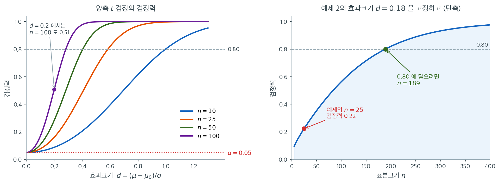

# 일표본 평균 검정

## 개요

일표본 평균 검정은 모평균 $\mu$가 가설의 값 $\mu_0$과 같은지 판단한다. 모분산을 알 때는 **z-검정**을, 모르고 표본에서 추정할 때는 **t-검정**을 쓴다. 두 검정 모두 자료가 정규분포를 따르거나 표본이 중심극한정리를 적용할 만큼 크다는 가정에 기댄다.

## 검정의 구성

**가설:**

- 양측: $H_0\colon \mu = \mu_0$ 대 $H_1\colon \mu \neq \mu_0$
- 단측: $H_0\colon \mu = \mu_0$ 대 $H_1\colon \mu > \mu_0$ (또는 $H_1\colon \mu < \mu_0$)

**z-검정** ($\sigma$를 아는 경우): 검정통계량은

$$
Z = \frac{\bar{X} - \mu_0}{\sigma / \sqrt{n}} \sim N(0,1).
$$

**t-검정** ($\sigma$를 모르고 $S$로 추정하는 경우): 검정통계량은

$$
T = \frac{\bar{X} - \mu_0}{S / \sqrt{n}} \sim t_{n-1}.
$$

<div class="exbox" markdown>

**보기 1.** <span class="diff easy" title="쉬움"></span> 일표본 평균 검정 계산기. 요약통계량 $(\bar x, s, n)$만 받아 $z$-검정과 $t$-검정을 모두 처리하는 함수를 만들려 한다. 양측 p-값은 $P(\lvert T \rvert \ge \lvert t_{\text{obs}} \rvert)$로 정의한다.

**(1)** 귀무분포가 $0$에 대해 대칭인 연속분포이고 그 분포함수를 $F$라 할 때,

$$
P(\lvert T \rvert \ge \lvert t_{\text{obs}} \rvert) = 2\min\{F(t_{\text{obs}}),\ 1 - F(t_{\text{obs}})\}
$$

임을 보이시오. 또 이 식이 성립하지 않는 검정의 예를 드시오.

**(2)** (1)의 식을 써서 두 검정을 함께 처리하는 함수를 작성하고, 원자료가 있는 경우 `scipy.stats.ttest_1samp`와 같은 값을 주는지 확인하시오.

</div>

??? success "풀이"

    **(1) 해석적으로.** $F$가 $0$에 대해 대칭이면 $F(-u) = 1 - F(u)$이다. $t = t_{\text{obs}}$로 줄여 쓰면

    $$
    P(\lvert T \rvert \ge \lvert t \rvert)
    = P(T \le -\lvert t \rvert) + P(T \ge \lvert t \rvert)
    = F(-\lvert t \rvert) + \bigl(1 - F(\lvert t \rvert)\bigr)
    = 2\bigl(1 - F(\lvert t \rvert)\bigr)
    $$

    이다. 남은 것은 $1 - F(\lvert t \rvert) = \min\{F(t),\ 1-F(t)\}$를 보이는 일이고, 부호로 나누면 끝난다.

    - $t \ge 0$이면 $\lvert t \rvert = t$이므로 $1 - F(\lvert t \rvert) = 1 - F(t)$이다. 대칭성에서 $F(0) = 1/2$이고 $F$가 비감소이므로 $F(t) \ge 1/2 \ge 1 - F(t)$, 따라서 최솟값은 $1 - F(t)$다.
    - $t < 0$이면 $\lvert t \rvert = -t$이므로 $1 - F(\lvert t \rvert) = 1 - F(-t) = F(t)$이고, 이번에는 $F(t) < 1/2 < 1 - F(t)$이므로 최솟값이 $F(t)$다.

    두 경우가 모두 $2\min\{F(t), 1-F(t)\}$를 준다. $\square$

    **두 검정이 한 함수에 들어가는 까닭이 이 식에 있다.** $z$-검정과 $t$-검정은 분자·분모가 같은 꼴이고 $F$만 $\Phi$에서 $t_{n-1}$의 분포함수로 바뀐다. 둘 다 $0$에 대해 대칭이므로 위 식이 그대로 쓰인다.

    **성립하지 않는 예.** 귀무분포가 대칭이 아니면 쓸 수 없다. 모분산 검정의 $\chi^2_{n-1}$, 분산비 검정의 $F_{n_1-1,\,n_2-1}$이 그렇다. 그때는 두 꼬리 확률을 따로 계산해 더하거나, 관례대로 작은 쪽 꼬리를 두 배 하는 **다른** 규칙을 쓴다고 명시해야 한다.

    **(2) 수치적으로.** 먼저 함수를 만든다.

    ```python
    import math
    from scipy.stats import t as tdist, norm

    def test_mean_one_sample(xbar, n, mu0=0.0, sd=None, known_sigma=None,
                             alternative="two-sided", alpha=0.05):
        """known_sigma를 주면 z-검정, 아니면 표본 sd로 t-검정.

        원자료가 아니라 요약통계량(xbar, n, sd)만 받는다.
        검정에 필요한 것이 그것뿐이기 때문이다.
        alternative는 scipy의 관례를 그대로 따른다.
        돌려주는 값은 (통계량, p-값, 기각 여부, 이름)이다.
        """
        if known_sigma is not None:
            se = known_sigma / math.sqrt(n)
            z = (xbar - mu0) / se
            if alternative == "two-sided":
                # 작은 쪽 꼬리를 골라 두 배 한다. z의 부호를 따지지 않아도 되고
                # 어느 쪽으로 치우쳐도 같은 식이 쓰인다.
                p = 2 * min(norm.cdf(z), norm.sf(z))
            elif alternative == "less":
                p = norm.cdf(z)
            else:
                # 오른쪽 꼬리는 sf로 계산한다. 1 - cdf는 꼬리에서 정밀도를 잃는다.
                p = norm.sf(z)
            return z, p, (p < alpha), "z-test"

        if sd is None:
            raise ValueError("Provide sd for t-test or known_sigma for z-test.")
        se = sd / math.sqrt(n)
        df = n - 1               # sd를 자료에서 추정했으므로 자유도 하나를 잃는다
        t = (xbar - mu0) / se
        if alternative == "two-sided":
            p = 2 * min(tdist.cdf(t, df), tdist.sf(t, df))
        elif alternative == "less":
            p = tdist.cdf(t, df)
        else:
            p = tdist.sf(t, df)
        return t, p, (p < alpha), f"t-test (df={df})"
    ```

    원자료를 하나 만들어 `scipy.stats.ttest_1samp`와 맞추어 본다. 함수는 요약통계량만 받으므로 원자료에서 $\bar x$와 $s$를 뽑아 넘긴다. 대칭 항등식도 몇 점에서 직접 확인한다.

    ```python
    import numpy as np
    from scipy import stats

    rng = np.random.default_rng(9)
    x = rng.normal(3.4, 1.2, 25)
    n, xbar, sd = len(x), x.mean(), x.std(ddof=1)
    mu0 = 3.0

    print(f"n = {n},  xbar = {xbar:.4f},  s = {sd:.4f}")
    for alt in ("two-sided", "greater", "less"):
        t_my, p_my, _, _ = test_mean_one_sample(xbar, n, mu0, sd=sd, alternative=alt)
        r = stats.ttest_1samp(x, mu0, alternative=alt)
        print(f"  {alt:>9s}:  요약통계량 p = {p_my:.8f}   scipy p = {r.pvalue:.8f}")

    # 대칭 항등식 2 min(F(t), 1-F(t)) = P(|T| >= |t|) 를 여러 t 에서 확인한다.
    grid = np.array([-3.1, -0.4, 0.0, 0.9, 2.7])
    tail = 2 * stats.t.sf(np.abs(grid), n - 1)                                 # P(|T| >= |t|)
    mins = 2 * np.minimum(stats.t.cdf(grid, n - 1), stats.t.sf(grid, n - 1))   # 함수가 쓰는 식
    print(f"두 식의 최대 차이 = {np.max(np.abs(tail - mins)):.2e}")
    ```

    출력:

    ```
    n = 25,  xbar = 3.5836,  s = 1.3921
      two-sided:  요약통계량 p = 0.04680592   scipy p = 0.04680592
        greater:  요약통계량 p = 0.02340296   scipy p = 0.02340296
           less:  요약통계량 p = 0.97659704   scipy p = 0.97659704
    두 식의 최대 차이 = 0.00e+00
    ```

    세 대립가설 모두에서 소수 여덟째 자리까지 일치하고, 항등식의 두 식은 **부동소수점 수준에서 정확히** 같다. 단측 두 p-값이 $0.02340296 + 0.97659704 = 1$로 합이 1인 것도 확인할 수 있다. 연속분포이므로 $P(T \le t) + P(T \ge t) = 1$이기 때문이며, 이 합이 1이 아니라면 어느 한쪽 꼬리를 잘못 잡은 것이다.

<div class="exbox" markdown>

**보기 2.** <span class="diff easy" title="쉬움"></span> $\sigma$를 안다는 가정의 값. $\bar x = 3.2$, $s = 1.1$, $n = 25$로 $H_0\colon \mu = 3.0$ 대 $H_1\colon \mu > 3.0$을 검정한다. **같은 숫자 1.1**을 한 번은 표본표준편차 $s$로, 한 번은 알려진 $\sigma$로 넣어 두 검정을 나란히 돌린다.

**(1)** 관측된 통계량이 같을 때 $t$ 검정의 p-값이 $z$ 검정의 p-값보다 **언제나** 크다는 것을 보이시오.

**(2)** $\sigma$를 모르는데 안다고 가정하면, 곧 귀무분포가 $t_{n-1}$인데 정규 임계값 $1.96$으로 기각하면 실제 유의수준이 얼마가 되는지 $n$별로 구하시오.

</div>

??? success "풀이"

    **(1) 해석적으로.** 두 통계량은 분자·분모가 같은 수이므로 $t_{\text{obs}} = z_{\text{obs}}$다. 달라지는 것은 그 수를 견주는 분포뿐이고, $t$ 분포를 **정규분포의 척도혼합**으로 적으면 부등식이 바로 나온다. $Z \sim N(0,1)$, $W \sim \chi^2_\nu$가 독립일 때

    $$
    T_\nu = \frac{Z}{\sqrt{W/\nu}}
    $$

    이므로, $W$로 조건을 걸면 $T_\nu$는 표준편차 $\sqrt{\nu/W}$인 정규분포다. $t > 0$에 대해 꼬리확률을 조건부 기댓값으로 풀면

    $$
    P(T_\nu \ge t) = E\!\left[\bar\Phi\!\left(t\sqrt{W/\nu}\right)\right],
    \qquad \bar\Phi(u) = 1 - \Phi(u)
    $$

    이다. 여기서 $\bar\Phi$는 $u > 0$에서 **볼록**하다. $\bar\Phi''(u) = u\varphi(u) > 0$이기 때문이다. $t > 0$이고 $W > 0$이니 안쪽 값이 늘 양수이므로 옌센 부등식을 그대로 쓸 수 있다.

    $$
    P(T_\nu \ge t) \;\ge\; \bar\Phi\!\left(t \cdot c_\nu\right),
    \qquad
    c_\nu = E\!\left[\sqrt{W/\nu}\right]
    = \sqrt{\frac{2}{\nu}}\,\frac{\Gamma\!\left(\frac{\nu+1}{2}\right)}{\Gamma\!\left(\frac{\nu}{2}\right)}
    $$

    남은 것은 $c_\nu < 1$이다. 제곱근은 **엄격히 오목**하고 $W$는 상수가 아니므로 옌센 부등식이 반대 방향으로 엄격하게 성립한다.

    $$
    c_\nu = E\!\left[\sqrt{W/\nu}\right] < \sqrt{E[W]/\nu} = 1
    $$

    $\bar\Phi$가 감소함수이므로 $\bar\Phi(t c_\nu) > \bar\Phi(t)$이고, 두 부등식을 이으면

    $$
    P(T_\nu \ge t) \;>\; \bar\Phi(t) = P(Z \ge t)
    \qquad (t > 0)
    $$

    이다. **$t$ 검정의 단측 p-값은 어떤 $t > 0$에서도 $z$ 검정의 것보다 크다.** 양측은 두 배이므로 그대로 따라온다. $\square$

    옌센을 두 번 쓴 것이 각각 다른 일을 한다. 앞의 것은 **분모가 흔들린다**는 사실의 값이고, 뒤의 것은 그 흔들림의 중심이 1보다 **아래로** 내려앉는다는 사실의 값이다.

    **(2) 임계값을 잘못 쓰면.** $\sigma$를 안다고 가정하면 $\pm 1.96$으로 기각하지만 참 귀무분포는 $t_{n-1}$이다. 그러므로 실제 유의수준은

    $$
    \alpha_{\text{실제}} = 2\left[1 - F_{t_{n-1}}(1.96)\right]
    $$

    이고 (1)에 의해 이 값은 명목 $0.05$보다 **언제나 크다.** 작은 자유도에서는 닫힌 꼴로 적을 수 있다. $\nu = 1$(코시)에서 $F(t) = \tfrac12 + \tfrac{1}{\pi}\arctan t$이므로

    $$
    \alpha_{\text{실제}} = 1 - \frac{2}{\pi}\arctan(1.96) = 0.3003
    $$

    이고, $\nu = 2$에서는 $F(t) = \tfrac12\left(1 + t/\sqrt{2+t^2}\right)$이므로

    $$
    \alpha_{\text{실제}} = 1 - \frac{1.96}{\sqrt{2 + 1.96^2}} = 0.1891
    $$

    이다. $n = 3$짜리 표본에서 $\sigma$를 안다고 둘러대면 5% 검정이 실제로는 19% 검정이 된다.

    **수치로 확인한다.** 먼저 보기의 두 검정을 돌린다.

    ```python
    stat, p, reject, label = test_mean_one_sample(
        xbar=3.2, n=25, mu0=3.0, sd=1.1, alternative="greater"
    )
    print(label, "stat:", stat, "p:", p, "reject:", reject)

    # 같은 자료를 sigma=1.1을 안다고 가정하고 z-검정으로도 해 본다.
    stat_z, p_z, reject_z, label_z = test_mean_one_sample(
        xbar=3.2, n=25, mu0=3.0, known_sigma=1.1, alternative="greater"
    )
    print(label_z, "stat:", stat_z, "p:", p_z, "reject:", reject_z)
    ```

    출력:

    ```
    t-test (df=24) stat: 0.9090909090909097 p: 0.18617076763866552 reject: False
    z-test stat: 0.9090909090909097 p: 0.1816510704434488 reject: False
    ```

    통계량은 같고 p-값만 다르다. 산포로 넣은 숫자가 1.1로 같으니 분자와 분모가 같을 수밖에 없고, 달라지는 것은 그 통계량을 어느 분포에 견주느냐뿐이다. **$\sigma$를 모른다는 사실의 값이 여기서는 0.0045만큼이다.**

    이제 (1)의 부등식과 (2)의 표를 확인한다.

    ```python
    import math

    import numpy as np
    from scipy import stats
    from scipy.special import gammaln

    nu = 24
    t_obs = 0.2 / (1.1 / math.sqrt(25))

    # c_nu = E[sqrt(W/nu)],  W ~ chi2_nu.  1 보다 작다는 것이 요점이다.
    c_nu = math.exp(0.5 * math.log(2 / nu) + gammaln((nu + 1) / 2) - gammaln(nu / 2))

    print(f"t_obs = {t_obs:.6f},  c_24 = {c_nu:.6f}")
    print(f"정규 꼬리   Phibar(t)      = {stats.norm.sf(t_obs):.6f}")
    print(f"옌센 하한   Phibar(c t)    = {stats.norm.sf(c_nu * t_obs):.6f}")
    print(f"t 꼬리      P(T_24 >= t)   = {stats.t.sf(t_obs, nu):.6f}")

    # 부등식이 t 전체에서 성립하는지 격자로 훑는다.
    tg = np.linspace(0.01, 8.0, 200_001)
    gap = stats.t.sf(tg, nu) - stats.norm.sf(tg)
    print(f"(t 꼬리 - 정규 꼬리) 의 최솟값 = {gap.min():.3e}")

    # sigma 를 안다고 잘못 가정하면 실제 유의수준이 얼마가 되는가.
    z975 = stats.norm.ppf(0.975)
    print("\n    n      nu   실제 크기   올바른 임계값")
    for n in (2, 3, 5, 11, 25, 61, 101, 1001):
        print(f"{n:5d}  {n - 1:6d}      {2 * stats.t.sf(z975, n - 1):.4f}"
              f"          {stats.t.ppf(0.975, n - 1):.3f}")
    ```

    출력:

    ```
    t_obs = 0.909091,  c_24 = 0.989640
    정규 꼬리   Phibar(t)      = 0.181651
    옌센 하한   Phibar(c t)    = 0.184147
    t 꼬리      P(T_24 >= t)   = 0.186171
    (t 꼬리 - 정규 꼬리) 의 최솟값 = 1.578e-08

        n      nu   실제 크기   올바른 임계값
        2       1      0.3003          12.706
        3       2      0.1891          4.303
        5       4      0.1216          2.776
       11      10      0.0784          2.228
       25      24      0.0617          2.064
       61      60      0.0546          2.000
      101     100      0.0528          1.984
     1001    1000      0.0503          1.962
    ```

    세 수가 유도한 순서대로 놓인다. $0.181651 < 0.184147 \le 0.186171$, 곧 **정규 꼬리 < 옌센 하한 $\le$ $t$ 꼬리**다. 격자를 $(0,\,8]$로 훑어도 차이의 최솟값이 양수이고, 양 끝에서 0으로 수렴하므로 최솟값이 $10^{-8}$ 수준까지 내려가는 것은 수렴의 흔적일 뿐 부등호가 뒤집힌 것이 아니다.

    표의 두 닫힌 꼴 $0.3003$과 $0.1891$이 (2)에서 손으로 구한 값과 자리까지 같다. **$n = 25$에서 실제 크기는 $0.0617$**로 명목의 1.23배이고, 명목을 맞추려면 임계값을 $1.96$이 아니라 $2.064$로 잡아야 한다. $n = 1001$에서야 $0.0503$으로 명목에 붙는다.

    여기서 쓴 수 $1.1$을 "모표준편차"라고 부를 수 있었다면 p-값이 $0.1817$이었다. 실제로는 그 수를 자료에서 얻었으므로 $0.1862$가 옳다. 차이가 $0.0045$로 작아 보이지만, (2)의 표가 보이는 대로 **$n$이 작아질수록 그 대가가 급격히 커진다.**

### 해석

이 보기에서는 $\bar{x} = 3.2$, $s = 1.1$, $n = 25$로 $H_0\colon \mu = 3.0$을 $H_1\colon \mu > 3.0$에 대해 검정한다. 검정통계량은

$$
T = \frac{3.2 - 3.0}{1.1/\sqrt{25}} = \frac{0.2}{0.22} \approx 0.909.
$$

자유도 24에서 단측 p-값은 약 0.186이다. 통상적인 $\alpha = 0.05$를 넘으므로 $H_0$을 기각하지 못한다.



기각하지 못했다는 것과 차이가 없다는 것은 다른 말이다. 둘을 구별하려면 이 검정이 애초에 차이를 잡아낼 힘을 얼마나 가지고 있었는지를 함께 보아야 한다. **검정력은 대립가설이 참일 때 $H_0$을 기각할 확률이며, 효과크기 $d = (\mu - \mu_0)/\sigma$와 표본크기 $n$ 두 가지가 그 값을 거의 결정한다.** 왼쪽은 양측 $t$ 검정($\alpha = 0.05$)의 검정력을 비중심 $t$ 분포로 정확히 계산한 것이다.

곡선 하나를 고르고 가로로 읽으면 표본크기가 하는 일이 보인다. 중간 크기의 차이 $d = 0.5$를 잡아낼 확률이 $n = 10$에서 0.29, $n = 25$에서 0.67, $n = 50$에서 0.93으로 올라간다. 반면 작은 차이 $d = 0.2$는 $n = 100$에서도 0.51에 그친다. **작은 효과를 다루면서 표본을 백 개쯤 모으는 연구는 참인 차이를 절반 가까이 놓친다.**

오른쪽은 이 쪽의 보기 2를 그대로 옮긴 것이다. 관측된 차이 $0.2$를 산포 $1.1$로 나누면 $d \approx 0.18$이고($\sigma$가 $s$와 같다고 본 것이다), 이 크기의 차이에 대해 $n = 25$ 단측 검정의 검정력은 0.22다. 참으로 $\mu = 3.2$였다 해도 이 설계는 열 번 중 여덟 번 가까이 기각에 실패한다는 뜻이다. 검정력을 0.80까지 올리려면 $n = 189$가 필요하다.

그러므로 $p = 0.186$에서 끌어낼 수 있는 결론은 "$\mu = 3.0$이다"가 아니라 "이 자료로는 판단할 수 없다"이다. 판단하려면 표본을 늘리거나, 적어도 신뢰구간을 함께 보고하여 어느 크기의 차이들이 여전히 자료와 양립하는지 밝혀야 한다.

## 연습문제

<div class="drillbox" markdown>

**연습문제 1.** <span class="diff easy" title="쉬움"></span> 관측값 $n = 36$개의 표본에서 $\bar{x} = 52$이고 모표준편차가 $\sigma = 6$으로 알려져 있다. $\alpha = 0.05$에서 $H_0\colon \mu = 50$ 대 $H_1\colon \mu \neq 50$을 검정하라.

</div>

??? success "풀이"

    z-검정통계량은

    $$
    Z = \frac{52 - 50}{6/\sqrt{36}} = \frac{2}{1} = 2.0.
    $$

    양측 p-값은 $2\,P(Z \geq 2.0) = 2(0.0228) = 0.0456$이다. $0.0456 < 0.05$이므로 $H_0$을 기각한다. $\mu \neq 50$이라는 유의한 증거가 있다. $\square$

<div class="drillbox" markdown>

**연습문제 2.** <span class="diff easy" title="쉬움"></span> $n = 10$, $\bar{x} = 15.3$, $s = 2.5$일 때 $\alpha = 0.01$에서 $H_0\colon \mu = 14$ 대 $H_1\colon \mu > 14$를 검정하라.

</div>

??? success "풀이"

    t-검정통계량은

    $$
    T = \frac{15.3 - 14}{2.5/\sqrt{10}} = \frac{1.3}{0.7906} \approx 1.644.
    $$

    $\text{df} = 9$에서 단측 p-값은 $P(T_9 \geq 1.644) \approx 0.068$이다. $0.068 > 0.01$이므로 1% 수준에서 $H_0$을 기각하지 못한다. $\square$

<div class="drillbox" markdown>

**연습문제 3.** <span class="diff med" title="중간"></span> $\sigma$를 모를 때 z-검정 대신 t-검정을 쓰는 이유를 설명하라. $n \to \infty$이면 t-분포는 어떻게 되는가?

</div>

??? success "풀이"

    $\sigma$를 모르면 $S$로 추정한다. $S$ 자체가 확률변수이므로 비 $(\bar{X}-\mu_0)/(S/\sqrt{n})$은 표준정규보다 꼬리가 두껍다. $t_{n-1}$ 분포가 이 추가 불확실성을 반영한다. $n \to \infty$이면 대수의법칙에 의해 $S \to \sigma$가 거의 확실하게 성립하므로 $S/\sqrt{n}$이 $\sigma/\sqrt{n}$처럼 행동하고 $t_{n-1} \to N(0,1)$이 된다. 형식적으로 $\nu \to \infty$일 때 $t_\nu \xrightarrow{d} N(0,1)$이다. $\square$

<div class="drillbox" markdown>

**연습문제 4.** <span class="diff med" title="중간"></span> 유의수준 $\alpha$에서 단측 t-검정 $H_0\colon \mu = \mu_0$ 대 $H_1\colon \mu > \mu_0$의 기각역을 유도하라.

</div>

??? success "풀이"

    $H_0$ 아래에서 $T = (\bar{X} - \mu_0)/(S/\sqrt{n}) \sim t_{n-1}$이다. $T$가 클 때 $H_0$을 기각하고 $H_1\colon \mu > \mu_0$을 택한다. 기각역은

    $$
    T > t_{\alpha,\,n-1},
    $$

    여기서 $t_{\alpha,\,n-1}$은 $t_{n-1}$ 분포의 $(1-\alpha)$ 분위수, 즉 $P(T_{n-1} > t_{\alpha,\,n-1}) = \alpha$인 값이다. 동등하게 p-값 $P(T_{n-1} \geq t_{\text{obs}}) < \alpha$일 때 기각한다. $\square$

<div class="drillbox" markdown>

**연습문제 5.** <span class="diff easy" title="쉬움"></span> 어떤 제조사가 강봉의 평균 인장강도가 적어도 5000 psi라고 주장한다. 강봉 $n = 20$개의 표본에서 $\bar{x} = 4917$, $s = 200$을 얻었다. $\alpha = 0.05$에서 이 주장이 뒷받침되는지 검정하라.

</div>

??? success "풀이"

    $H_0\colon \mu \geq 5000$ 대 $H_1\colon \mu < 5000$을 검정한다. 검정통계량은

    $$
    T = \frac{4917 - 5000}{200/\sqrt{20}} = \frac{-83}{44.72} \approx -1.856.
    $$

    $\text{df} = 19$에서 단측 p-값은 $P(T_{19} \leq -1.856) \approx 0.039$이다. $0.039 < 0.05$이므로 $H_0$을 기각한다. 평균 인장강도가 5000 psi보다 작다는 유의한 증거가 있어 제조사의 주장과 어긋난다. $\square$

<div class="drillbox" markdown>

**연습문제 6.** <span class="diff med" title="중간"></span>
일표본 평균 검정을 **부트스트랩**과 **순열**로 수행하는 법을 각각 설명하고, 두 방법의 차이를 밝혀라.

</div>

??? success "풀이"
    **핵심 차이.** 일표본 문제에서

    - **부트스트랩**은 재표본으로 **$\bar X$의 표집분포**를 근사한다. 가정: 관측값이 독립·동일분포.
    - **순열(부호 뒤집기)** 은 **대칭성**을 이용한다. $H_0$ 아래 $X_i-\mu_0$의 부호를 뒤집어도 분포가 같다는 가정이 필요하다.

    ```python
    import numpy as np
    from scipy import stats

    rng = np.random.default_rng(19)
    x = np.array([12.4, 9.8, 14.1, 11.2, 13.7, 10.5, 15.3,
                  12.9, 11.8, 13.1, 10.2, 14.6])
    mu0 = 11.0
    n, B = len(x), 99_999

    # ① t 검정
    t_obs = (x.mean() - mu0) / (x.std(ddof=1) / np.sqrt(n))
    print(f"t({n-1}) = {t_obs:.4f},  p = {2 * stats.t.sf(abs(t_obs), n-1):.4f}")

    # ② 부트스트랩-t (자료를 mu0 로 중심 이동한 뒤 재표본)
    xc = x - x.mean() + mu0
    idx = rng.integers(0, n, (B, n))
    xs = xc[idx]
    tb = (xs.mean(1) - mu0) / (xs.std(1, ddof=1) / np.sqrt(n))
    print(f"부트스트랩 p = {(np.sum(np.abs(tb) >= abs(t_obs)) + 1) / (B + 1):.4f}")

    # ③ 부호 뒤집기 순열
    d = x - mu0
    s = rng.choice([-1.0, 1.0], (B, n))
    ts = (d * s).mean(1) / ((d * s).std(1, ddof=1) / np.sqrt(n))
    print(f"부호 순열 p  = {(np.sum(np.abs(ts) >= abs(t_obs)) + 1) / (B + 1):.4f}")

    # ④ 윌콕슨
    print(f"윌콕슨 p     = {stats.wilcoxon(d).pvalue:.4f}")
    ```

    ```text
    t(11) = 2.8271,  p = 0.0165
    부트스트랩 p = 0.0202
    부호 순열 p  = 0.0192
    윌콕슨 p     = 0.0269
    ```

    **네 방법이 모두 같은 결론을 준다**(0.017~0.027). 자료가 대칭에 가깝기 때문이다. 윌콕슨이 조금 큰 것은 순위만 쓰면서 정보를 일부 버리기 때문이다.

    **가정의 비교.**

    | 방법 | 가정 | 성질 |
    |---|---|---|
    | $t$ | 정규(또는 큰 $n$) | 정규에서 정확 |
    | 부트스트랩-$t$ | 독립·동일분포 | **이차정확**, 대칭 불필요 |
    | 부호 순열 | **$H_0$ 아래 대칭** | 정확(유한표본에서도) |
    | 윌콕슨 | **대칭** | 정확, 순위만 씀 |

    **결정적인 차이 — 대칭성.** 부호 뒤집기 순열은 "$X_i-\mu_0$의 분포가 0에 대해 대칭"을 가정한다. **치우친 자료에서는 평균 검정으로 부적절**하다.

    ```python
    rng = np.random.default_rng(21)
    M, n = 4_000, 20
    cnt_t = cnt_perm = 0
    for _ in range(M):
        y = rng.exponential(1.0, n)          # 평균 1, 오른쪽으로 치우침
        t = (y.mean() - 1.0) / (y.std(ddof=1) / np.sqrt(n))
        cnt_t += abs(t) > stats.t.ppf(0.975, n - 1)
        d = y - 1.0
        s = rng.choice([-1.0, 1.0], (999, n))
        ts = (d * s).mean(1) / ((d * s).std(1, ddof=1) / np.sqrt(n))
        cnt_perm += (np.sum(np.abs(ts) >= abs(t)) + 1) / 1000 < 0.05
    print(f"지수분포(n=20): t 검정 {cnt_t / M:.4f},  "
          f"부호 순열 {cnt_perm / M:.4f}")
    ```

    ```text
    지수분포(n=20): t 검정 0.0862,  부호 순열 0.0860
    ```

    **둘 다 0.086으로 어긋난다.** 부호 순열이 $t$보다 나을 것이 없다. **대칭성이 깨지면 순열의 "정확성"도 사라진다.**

    **권고.**

    - **대칭이 그럴듯하면** 부호 순열이나 윌콕슨이 좋다. 유한표본에서 정확하다.
    - **치우쳐 있고 평균이 관심사이면** 부트스트랩-$t$. 유일하게 이 상황을 제대로 다룬다.
    - **$n$이 크면** 모두 비슷해진다.

<div class="drillbox" markdown>

**연습문제 7.** <span class="diff med" title="중간"></span>
평균 검정에서 **이상치 하나**가 결론을 뒤집는 경우를 만들고, 강건한 대안과 비교하라.

</div>

??? success "풀이"
    ```python
    import numpy as np
    from scipy import stats

    x = np.array([52.1, 48.7, 51.3, 49.8, 53.2, 50.4, 52.8,
                  49.1, 51.7, 50.9, 48.3, 52.5])
    mu0 = 50.0

    def report(v, tag):
        n = len(v)
        t = stats.ttest_1samp(v, mu0)
        w = stats.wilcoxon(v - mu0)
        k = (v > mu0).sum()
        sg = stats.binomtest(k, n, 0.5).pvalue
        tm = stats.trim_mean(v, 0.1)
        print(f"{tag:14s} 평균 {v.mean():7.3f}  t p={t.pvalue:.4f}  "
              f"윌콕슨 p={w.pvalue:.4f}  부호 p={sg:.4f}  "
              f"10% 절사평균 {tm:.3f}")

    report(x, "원자료")
    y = x.copy()
    y[0] = 20.0                       # 기록 오류 하나
    report(y, "이상치 1개")
    ```

    ```text
    원자료            평균  50.900  t p=0.0857  윌콕슨 p=0.1099  부호 p=0.3877  10% 절사평균 50.930
    이상치 1개         평균  48.225  t p=0.5101  윌콕슨 p=0.5186  부호 p=0.7744  10% 절사평균 50.550
    ```

    **$p$-값이 6배로 벌어진다.** $p=0.086$에서 $p=0.510$이 된다.

    **왜 그런가.** 이상치 하나가

    - **평균을 2.675 끌어내리고**($52.1\to20.0$이므로 $32.1/12=2.675$),
    - **동시에 $S$를 크게 키운다.**

    두 효과가 모두 $|t|$를 줄이는 방향이라 **결론이 극적으로 바뀐다.**

    **강건한 요약통계는 훨씬 덜 흔들린다.**

    | 지표 | 원자료 | 이상치 후 | 변화 |
    |---|---|---|---|
    | 평균 | 50.900 | 48.225 | $-2.675$ |
    | **10% 절사평균** | 50.930 | 50.550 | $-0.380$ |
    | $t$ 검정 $p$ | 0.086 | 0.510 | 6배 |
    | 윌콕슨 $p$ | 0.110 | 0.519 | 4.7배 |
    | 부호 $p$ | 0.388 | 0.774 | 2배 |

    **절사평균의 이동이 평균의 7분의 1이다**(0.38 대 2.68). 순위 기반 검정들도 $t$보다 덜 흔들리지만, $n=12$에서는 관측값 하나의 비중이 커서 완전히 면역은 아니다.

    **실무 절차.**

    1. **그림을 먼저 본다.** 점도표나 상자그림에서 20.0이 명백히 튄다.
    2. **원인을 확인한다.** 52.1을 20.0으로 잘못 입력했을 가능성이 높다(자릿수 실수).
    3. **민감도 분석을 보고한다.** "이상치를 포함하면 $p=0.51$, 제외하면 $p=0.09$"라고 명시한다.
    4. **결론이 관측값 하나에 좌우된다면** 그 사실 자체가 가장 중요한 발견이다.

    **하지 말 것.** 유의해지는 쪽을 골라 보고하기. 앞서 본 연구자 자유도의 전형이다.

<div class="drillbox" markdown>

**연습문제 8.** <span class="diff med" title="중간"></span>
일표본 검정에서 **$H_0$의 값 $\mu_0$를 어떻게 정하는지** 논하고, 잘못 정한 경우의 예를 들어라.

</div>

??? success "풀이"
    **$\mu_0$의 출처 — 다섯.**

    | 출처 | 예 | 신뢰도 |
    |---|---|---|
    | **명세·규격** | 병의 표시 용량 500 mL | 높음. 다툼의 여지가 적다 |
    | **이론값** | 물리 상수, 공정한 동전의 0.5 | 높음 |
    | **역사적 기준** | 작년 평균 고객 만족도 | 중간. 조건이 바뀌었을 수 있다 |
    | **외부 기준** | 전국 평균, 업계 표준 | 중간. 비교 가능성 확인 필요 |
    | **임의의 기준** | "0" | **낮다.** 대개 의미 없다 |

    **잘못 정한 경우 셋.**

    **1 — 의미 없는 $\mu_0=0$.** "학생들의 시험 점수 평균이 0인가"를 검정하는 것은 무의미하다. 점수가 0일 수 없기 때문이다. **기각은 당연하고 정보가 없다.**

    올바른 질문은 "기준 점수 70점을 넘는가" 같은 것이다.

    **2 — 자료에서 나온 $\mu_0$.** 같은 자료로 $\mu_0$를 정하고 검정하면 순환이다.

    ```python
    import numpy as np
    from scipy import stats

    rng = np.random.default_rng(77)
    M, n = 20_000, 30

    cnt_ok = 0       # μ0 를 사전에 고정한 경우
    cnt_bad = 0      # μ0 를 같은 자료에서 고른 경우
    for _ in range(M):
        x = rng.normal(0, 1, n)
        cnt_ok += stats.ttest_1samp(x, 0.0).pvalue < 0.05
        mu0_bad = np.percentile(x, 25)          # 자료에서 고른 μ0
        cnt_bad += stats.ttest_1samp(x, mu0_bad).pvalue < 0.05
    print(f"사전 고정 μ0: 제1종 오류율 {cnt_ok / M:.4f}")
    print(f"자료에서 고른 μ0: 기각률 {cnt_bad / M:.4f}")
    ```

    ```text
    사전 고정 μ0: 제1종 오류율 0.0511
    자료에서 고른 μ0: 기각률 0.9769
    ```

    **자료에서 $\mu_0$를 고르면 거의 언제나 기각된다.** 극단적인 예지만, 원리는 흔한 실수와 같다.

    **3 — 대리 기준.** "이 약이 효과가 있는가"를 "$\mu=0$인가"로 바꾸는 것. 진짜 질문은 "임상적으로 의미 있는 효과가 있는가"이므로 $\mu_0$를 **최소 중요 차이**로 두는 것이 낫다.

    **더 나은 틀 — 구간 귀무가설.**

    $$
    H_0:\ |\mu-\mu_{\text{기준}}|\le\Delta
    $$

    앞서 본 대로 $n$이 커도 참인 $H_0$가 기각되지 않는다는 장점이 있다.

    **실무 권고.**

    1. **$\mu_0$를 자료를 보기 전에 정한다.** 사전등록에 적는다.
    2. **$\mu_0$의 근거를 밝힌다.** "규격서 3.2절" 같은 출처.
    3. **$\mu_0$가 임의적이면 검정 대신 추정**을 한다. 구간을 보고하고 독자가 판단하게 한다.
    4. **실무적 문턱이 있으면 그것을 $\mu_0$나 $\Delta$로** 쓴다.

<div class="drillbox" markdown>

**연습문제 9.** <span class="diff med" title="중간"></span>
일표본 평균 검정의 **점근적 근거**를 정리하라. 중심극한정리와 슬러츠키 정리가 어떻게 쓰이는가?

</div>

??? success "풀이"
    **목표.** $X_1,\dots,X_n$이 평균 $\mu$, 분산 $\sigma^2<\infty$인 임의 분포에서 나올 때

    $$
    T_n=\frac{\bar X_n-\mu}{S_n/\sqrt n}\ \xrightarrow{d}\ N(0,1)
    $$

    임을 보인다. **정규성 가정이 전혀 필요 없다.**

    **1단계 — 중심극한정리.**

    $$
    Z_n=\frac{\sqrt n(\bar X_n-\mu)}{\sigma}\ \xrightarrow{d}\ N(0,1)
    $$

    **2단계 — 대수의 법칙으로 $S_n$의 일치성.** $S_n^2\xrightarrow{p}\sigma^2$이고, 연속사상정리로 $S_n\xrightarrow{p}\sigma$, 따라서

    $$
    \frac{\sigma}{S_n}\ \xrightarrow{p}\ 1
    $$

    **3단계 — 슬러츠키 정리.** $Z_n\xrightarrow{d}Z$이고 $W_n\xrightarrow{p}c$이면 $Z_nW_n\xrightarrow{d}cZ$다. 여기서

    $$
    T_n=\frac{\sqrt n(\bar X_n-\mu)}{S_n}
    =\underbrace{\frac{\sqrt n(\bar X_n-\mu)}{\sigma}}_{\xrightarrow{d}N(0,1)}
    \times\underbrace{\frac{\sigma}{S_n}}_{\xrightarrow{p}1}
    \ \xrightarrow{d}\ N(0,1)\ \square
    $$

    **무엇이 필요하고 무엇이 필요 없는가.**

    | 필요 | 불필요 |
    |---|---|
    | **독립** | 정규성 |
    | 동일분포(또는 린데베르그 조건) | 대칭성 |
    | **유한한 분산** | 유한한 고차 적률 |

    **유한 분산이 결정적이다.** 코시분포처럼 분산이 없으면 중심극한정리가 성립하지 않고, $T_n$이 정규로 수렴하지 않는다.

    ```python
    import numpy as np
    from scipy import stats

    rng = np.random.default_rng(31)
    M = 40_000
    print(f"{'분포':>8s} " + " ".join(f"{'n='+str(n):>8s}"
                                      for n in [10, 100, 1000]))
    for name, gen, ok in [("정규", lambda s: rng.normal(0, 1, s), True),
                          ("t(2.5)", lambda s: rng.standard_t(2.5, s), True),
                          ("코시", lambda s: rng.standard_cauchy(s), False)]:
        row = []
        for n in [10, 100, 1000]:
            x = gen((M, n))
            t = x.mean(1) / (x.std(1, ddof=1) / np.sqrt(n))
            row.append(np.mean(np.abs(t) > 1.96))
        print(f"{name:>8s} " + " ".join(f"{v:8.4f}" for v in row))
    ```

    ```text
          분포     n=10    n=100   n=1000
          정규   0.0838   0.0512   0.0512
      t(2.5)   0.0695   0.0477   0.0490
          코시   0.0407   0.0217   0.0209
    ```

    **$t_{2.5}$는 분산이 유한하므로 수렴한다.** $n=1000$에서 0.049다. 정규도 $n=100$부터 0.051로 자리 잡는다($n=10$에서 0.084인 것은 $z$ 임계값 1.96을 $t$ 임계값 대신 썼기 때문이다).

    **코시는 수렴하지 않는다.** $n$을 100배 늘려도 0.021~0.022에 머문다. 분산이 없어 정리가 적용되지 않는다.

    **수렴 속도 — 베리-에센.**

    $$
    \sup_z\left|P(Z_n\le z)-\Phi(z)\right|\le\frac{C\rho}{\sigma^3\sqrt n},
    \qquad \rho=E|X-\mu|^3
    $$

    **$n^{-1/2}$ 속도**이며, **3차 적률(왜도)** 이 상수에 들어간다. 앞서 왜도가 관건이라고 본 것의 이론적 근거다.

<div class="drillbox" markdown>

**연습문제 10.** <span class="diff med" title="중간"></span>
일표본 평균 검정을 수행하는 **완전한 절차**를 순서대로 정리하고, 각 단계에서 무엇을 확인하는지 적어라.

</div>

??? success "풀이"

    **0단계 — 자료를 보기 전.**

    - [ ] 연구 질문을 한 문장으로 적는다.
    - [ ] $\mu_0$와 그 근거를 정한다.
    - [ ] 단측/양측, $\alpha$를 정한다.
    - [ ] 표본크기와 검정력을 계산한다.
    - [ ] 이상치·결측 처리 규칙을 정한다.
    - [ ] 사전등록한다.

    **1단계 — 자료 확인.**

    - [ ] 관측값 수가 계획과 맞는가. 결측은 얼마인가.
    - [ ] **히스토그램과 점도표**를 그린다.
    - [ ] **Q-Q 그림**을 그린다.
    - [ ] 요약통계: $n$, $\bar x$, $s$, 중앙값, 사분위, 왜도.
    - [ ] 시간 순서나 수집 순서에 추세가 있는가(독립성).

    **2단계 — 가정 점검.**

    | 가정 | 확인 방법 | 위배 시 |
    |---|---|---|
    | 독립 | **설계**를 확인. 순서 그림 | 혼합모형, 군집 보정 |
    | 정규/왜도 | Q-Q 그림, $\hat\gamma_1$ | 변환, 부트스트랩, 비모수 |
    | 이상치 | 점도표, 영향도 | 강건 방법, 민감도 분석 |

    **3단계 — 검정 수행.**

    - [ ] 계획한 검정을 그대로 수행한다.
    - [ ] 검정통계량, 자유도, $p$-값을 기록한다.

    **4단계 — 효과크기와 구간.**

    - [ ] 원 척도의 차이와 95% 구간.
    - [ ] 표준화 효과크기와 구간.

    **5단계 — 민감도.**

    - [ ] 이상치 포함/제외.
    - [ ] 대안 검정($t$/윌콕슨/부트스트랩)의 결과.
    - [ ] 결측 처리 방식을 바꿔 본 결과.

    **6단계 — 보고.**

    > $n=25$개 표본의 평균 중량은 490 g(SD 18)으로, 표시 용량 500 g과 비교하는 양측 일표본 $t$ 검정에서 $t(24)=-2.78$, $p=0.010$이었다. 평균 차이는 $-10.0$ g(95% 신뢰구간 $-17.4$ ~ $-2.6$ g), 코헨의 $d$는 $-0.56$(95% CI $-0.97$ ~ $-0.13$)이다. Q-Q 그림에서 정규성 위배의 뚜렷한 증거는 없었고(왜도 0.21), 윌콕슨 부호순위 검정도 같은 결론을 주었다($p=0.013$). 규격상 허용 오차 $\pm5$ g을 구간의 상한이 넘으므로 공정 점검이 필요하다.

    **가장 자주 빠지는 세 가지.**

    1. **그림을 안 그린다.** 1단계를 건너뛰고 바로 검정한다.
    2. **구간을 보고하지 않는다.** $p$-값만 적는다.
    3. **실무적 문턱과 비교하지 않는다.** 통계적 유의성으로 끝낸다.

    **한 문장.** **검정은 여섯 단계 중 하나일 뿐이며, 앞뒤의 다섯 단계가 결론의 신뢰도를 결정한다.**

---

## 정리하며

평균 검정을 **코드로 구현**하며 실무의 세부를 확인했다.

- **$z$ 와 $t$ 의 분기는 한 줄이다.** $\sigma$ 가 주어졌는지로 갈리며, 나머지 계산은 동일하다. 함수 하나에 `known_sigma=None` 기본값을 두고 그 값이 들어왔는지로 갈라 쓰면 깔끔하다.
- **단측·양측을 인자로 받는다.** `alternative` 를 `"two-sided"`, `"greater"`, `"less"` 로 두는 것이 `scipy` 의 관례이며, 보기 1의 함수도 이를 따랐다.
- **요약통계량만으로 검정이 된다.** $\bar x$, $s$, $n$ 이 전부이므로 원자료가 없어도 논문의 보고값만으로 재현할 수 있다. 거꾸로 `scipy.stats.ttest_1samp` 는 원자료를 요구하므로, 보고값만 있는 상황에서는 이렇게 직접 계산하는 함수가 필요하다.
- **틀리는 자리는 자유도와 단측 처리다.** 보기 2에서 같은 통계량 $0.909$ 에 $t_{24}$ 는 $p = 0.186$, 정규는 $0.182$ 를 준다. 자유도를 잘못 쓰거나 단측을 양측으로 다루면 이 정도 차이로 결론이 뒤집힐 수 있다.
- **작은 $p$ 값은 `sf` 로 계산한다.** `1 - cdf` 는 꼬리에서 정밀도를 잃는다(4장). 보기 1의 함수도 오른쪽 꼬리에 `norm.sf`, `tdist.sf` 를 쓴다.

다음 절 **일표본 비율 검정**으로 넘어간다.
