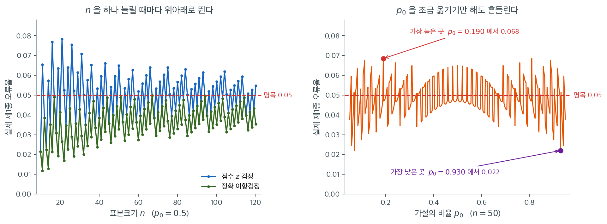

# 일표본 비율 검정

## 개요

일표본 비율 검정은 모비율 $p$가 가설의 값 $p_0$과 같은지 평가한다. **점수 $z$ 검정**은 이항분포에 대한 정규근사를 쓴다. 관례는 검정에 [보수적 기준](../../ch04/discrete_distributions/binomial.md#언제-쓸-수-있는가-5와-10) $np_0 \ge 10$과 $n(1-p_0) \ge 10$을 요구하지만, 연습문제 6에서 직접 재어 보면 **점수 검정은 그보다 훨씬 아래에서도 버틴다.** 그 문턱이 정말로 필요한 쪽은 왈드 검정이다. 표본이 작으면 점근근사에 기대지 않는 **정확한 이항검정**이 대안이 된다.

## 검정의 구성

**가설:**

- 양측: $H_0\colon p = p_0$ 대 $H_1\colon p \neq p_0$
- 단측: $H_0\colon p = p_0$ 대 $H_1\colon p > p_0$ (또는 $H_1\colon p < p_0$)

**점수 $z$ 검정:** $n$번 시행에서 성공이 $k$번이고 $\hat{p} = k/n$일 때 검정통계량은

$$
Z = \frac{\hat{p} - p_0}{\sqrt{p_0(1-p_0)/n}} \;\dot\sim\; N(0,1).
$$

귀무가설 아래에서 계산하므로 표준오차에 $\hat{p}$가 아니라 $p_0$을 쓴다는 점에 유의하라. 이 한 글자가 검정의 이름을 가른다.

<div class="thmbox" markdown>

**점수 검정과 왈드 검정.** 분자는 둘 다 $\hat p - p_0$이고 분모만 다르다.

$$
Z_{\text{점수}} = \frac{\hat{p} - p_0}{\sqrt{p_0(1-p_0)/n}}, \qquad
Z_{\text{왈드}} = \frac{\hat{p} - p_0}{\sqrt{\hat p(1-\hat p)/n}}
$$

점수 검정은 **귀무가설이 참일 때의** 표준오차 $\sqrt{p_0(1-p_0)/n}$을 쓴다. $p_0$은 우리가 정한 수이므로 이 분모는 자료와 무관한 상수다. 왈드 검정은 자료에서 추정한 $\hat p$를 넣으므로 분모까지 표본마다 흔들린다.

이 쪽에서 다루는 것은 **점수 검정**이다. 왈드 검정은 $\hat p$가 극단적일 때 무너지는데, 얼마나 무너지는지는 연습문제 6에서 네 검정을 나란히 놓고 잰다.

</div>

**정확한 이항검정:** 정규근사 없이 이항분포 $\text{Bin}(n, p_0)$에서 p-값을 직접 계산한다.

<div class="exbox" markdown>

**보기 1.** <span class="diff easy" title="쉬움"></span> 일표본 비율 검정 계산기. 점수 $z$ 검정과 정확 이항검정을 한 함수에 담는다. 성공 횟수 $k$가 정수이므로 두 검정의 기각역은 모두 $\{0, 1, \dots, n\}$의 **부분집합**이고, 따라서 실제 유의수준을 전수 열거로 정확히 계산할 수 있다.

**(1)** 명목 유의수준 $\alpha$의 점수 검정이 기각하는 $k$를 닫힌 꼴로 적고, $n = 5$, $p_0 = 0.5$, $\alpha = 0.05$에서 두 검정의 기각역을 각각 구하시오.

**(2)** 그 기각역의 확률을 유리수로 정확히 더해 두 검정의 실제 크기를 구하고, 함수를 작성해 확인하시오.

</div>

??? success "풀이"

    **(1) 해석적으로.** 양측 p-값이 $2\min\{\Phi(z),\,1-\Phi(z)\}$이므로

    $$
    p < \alpha
    \iff \lvert z \rvert > z_{1-\alpha/2}
    \iff \left\lvert \frac{k/n - p_0}{\sqrt{p_0(1-p_0)/n}} \right\rvert > z_{1-\alpha/2}
    $$

    이고, 양변에 $n$을 곱해 정리하면 **성공 횟수 자체에 대한 조건**이 된다.

    $$
    \lvert k - n p_0 \rvert > c,
    \qquad c = z_{1-\alpha/2}\sqrt{n p_0 (1-p_0)}
    $$

    그러므로 점수 검정의 채택역은 구간 $[np_0 - c,\ np_0 + c]$에 들어가는 **정수**들이고, 기각역은 그 나머지다. $k$가 정수라는 사실이 여기서 처음 들어온다.

    $n = 5$, $p_0 = 0.5$, $\alpha = 0.05$를 넣으면 $np_0 = 2.5$이고

    $$
    c = 1.96\sqrt{5 \times 0.25} = 1.96 \times 1.11803 = 2.19131
    $$

    이므로 채택 구간은 $[0.30869,\ 4.69131]$이다. 이 구간에 들어가는 정수는 $1, 2, 3, 4$이므로

    $$
    \text{점수 검정 기각역} = \{0,\ 5\}
    $$

    이다. 정확검정은 다르다. $p_0 = 0.5$에서 양측 정확 p-값을 $k$마다 적으면

    $$
    \frac{2}{32},\quad \frac{12}{32},\quad 1,\quad 1,\quad \frac{12}{32},\quad \frac{2}{32}
    $$

    곧 $0.0625,\ 0.375,\ 1,\ 1,\ 0.375,\ 0.0625$다. **가장 작은 값이 $0.0625$로 이미 $0.05$보다 크다.** 따라서

    $$
    \text{정확검정 기각역} = \varnothing
    $$

    이다. 무엇을 관측해도 기각할 수 없다.

    **(2) 크기를 정확히 더한다.** 기각역의 확률을 그대로 더하면 된다. 점수 검정은

    $$
    \alpha_{\text{실제}} = P(K = 0) + P(K = 5) = \frac{1}{32} + \frac{1}{32} = \frac{1}{16} = 0.0625
    $$

    로 **명목 $0.05$를 넘고**, 정확검정은 기각역이 비었으므로

    $$
    \alpha_{\text{실제}} = 0
    $$

    이다. 정확히 0이다. 근사가 아니라 등식이다.

    이 0이 언제 풀리는지도 바로 나온다. $p_0 = 0.5$에서 양측 정확 p-값의 최솟값은 양 끝 $k = 0$과 $k = n$에서 나오는 $2 \cdot 2^{-n} = 2^{1-n}$이므로, 기각역이 비지 않을 조건은

    $$
    2^{1-n} \le \alpha
    \iff n \ge 1 + \log_2 \frac{1}{\alpha}
    $$

    이다. $\alpha = 0.05$이면 $1 + \log_2 20 = 5.32$이므로 **$n \ge 6$**이어야 한다. 동전을 다섯 번 던져서는 $p = 0.5$를 정확검정으로 반박할 길이 애초에 없다.

    함수를 작성해 확인한다.

    ```python
    from scipy.stats import norm, binomtest
    import math

    def test_prop_one_sample(k, n, p0=0.5, method="score",
                             alt="two-sided", alpha=0.05):
        """method='score'(정규근사) 또는 'exact'(이항).

        정확검정에는 검정통계량이 따로 없다. 이항분포에서 꼬리확률을
        바로 더하므로 표준화할 대상이 없기 때문이다. 그래서 None을 돌려준다.
        """
        phat = k / n
        if method == "exact":
            p = binomtest(k, n, p0, alternative=alt).pvalue
            return None, p, (p < alpha), "exact binomial"

        # 표준오차에 phat이 아니라 **p0**을 넣는다.
        # H0가 참이라는 가정 아래의 확률을 재는 것이 검정이기 때문이다.
        # 신뢰구간에서는 phat을 넣었다. 목적이 다르면 대입하는 값도 다르다.
        se0 = math.sqrt(p0 * (1 - p0) / n)
        z = (phat - p0) / se0
        if alt == "two-sided":
            p = 2 * min(norm.cdf(z), 1 - norm.cdf(z))
        elif alt == "less":
            p = norm.cdf(z)
        else:
            p = 1 - norm.cdf(z)
        return z, p, (p < alpha), "score z-test"
    ```

    기각역과 그 확률을 전수 열거로 구한다. 확률은 유리수로 더해 부동소수점
    오차를 아예 없앤다.

    ```python
    from fractions import Fraction

    z975 = norm.ppf(0.975)


    def accept_interval(n, p0, z=z975):
        """점수 검정이 채택하는 k 의 구간 [np0 - c, np0 + c]."""
        c = z * math.sqrt(n * p0 * (1 - p0))
        return n * p0 - c, n * p0 + c


    def exact_size(reject, n, p0):
        """기각역의 확률을 유리수로 정확히 더한다. 부동소수점 오차가 없다."""
        q = Fraction(p0).limit_denominator()
        return sum(Fraction(math.comb(n, k)) * q**k * (1 - q)**(n - k)
                   for k in reject)


    n, p0 = 5, 0.5
    lo, hi = accept_interval(n, p0)
    rej_score = [k for k in range(n + 1) if not (lo <= k <= hi)]
    rej_exact = [k for k in range(n + 1) if binomtest(k, n, p0).pvalue <= 0.05]

    print(f"n = {n}, p0 = {p0}:  채택 구간 = [{lo:.6f}, {hi:.6f}]")
    print(f"  점수 검정 기각역 = {rej_score},  정확 크기 = "
          f"{exact_size(rej_score, n, p0)} = {float(exact_size(rej_score, n, p0)):.4f}")
    print(f"  정확검정 기각역 = {rej_exact},  정확 크기 = "
          f"{exact_size(rej_exact, n, p0)}")
    print("  k 마다의 정확 양측 p-값:",
          [float(binomtest(k, n, p0).pvalue) for k in range(n + 1)])

    print("\np0 = 0.5, 명목 0.05 에서 두 검정의 정확한 크기")
    print("   n  점수 기각역                   크기     정확검정 기각역        크기")
    for n in range(5, 15):
        lo, hi = accept_interval(n, p0)
        rs = [k for k in range(n + 1) if not (lo <= k <= hi)]
        re_ = [k for k in range(n + 1) if binomtest(k, n, p0).pvalue <= 0.05]
        print(f"{n:4d}  {str(rs):28s} {float(exact_size(rs, n, p0)):.4f}   "
              f"{str(re_):20s} {float(exact_size(re_, n, p0)):.4f}")
    ```

    출력:

    ```
    n = 5, p0 = 0.5:  채택 구간 = [0.308694, 4.691306]
      점수 검정 기각역 = [0, 5],  정확 크기 = 1/16 = 0.0625
      정확검정 기각역 = [],  정확 크기 = 0
      k 마다의 정확 양측 p-값: [0.0625, 0.375, 1.0, 1.0, 0.375, 0.0625]

    p0 = 0.5, 명목 0.05 에서 두 검정의 정확한 크기
       n  점수 기각역                   크기     정확검정 기각역        크기
       5  [0, 5]                       0.0625   []                   0.0000
       6  [0, 6]                       0.0312   [0, 6]               0.0312
       7  [0, 7]                       0.0156   [0, 7]               0.0156
       8  [0, 1, 7, 8]                 0.0703   [0, 8]               0.0078
       9  [0, 1, 8, 9]                 0.0391   [0, 1, 8, 9]         0.0391
      10  [0, 1, 9, 10]                0.0215   [0, 1, 9, 10]        0.0215
      11  [0, 1, 2, 9, 10, 11]         0.0654   [0, 1, 10, 11]       0.0117
      12  [0, 1, 2, 10, 11, 12]        0.0386   [0, 1, 2, 10, 11, 12] 0.0386
      13  [0, 1, 2, 11, 12, 13]        0.0225   [0, 1, 2, 11, 12, 13] 0.0225
      14  [0, 1, 2, 3, 11, 12, 13, 14] 0.0574   [0, 1, 2, 12, 13, 14] 0.0129
    ```

    채택 구간과 두 기각역, 그리고 $1/16$과 $0$이라는 두 크기가 (1)·(2)에서 손으로 구한 것과 모두 같다. $n = 6$에서 정확검정의 크기가 $0.0312$로 비로소 0을 벗어나는 것도 $n \ge 6$이라는 조건과 맞는다.

    표를 아래로 읽으면 두 검정의 성격이 갈린다. **점수 검정은 $n = 5,\ 8,\ 11,\ 14$에서 명목을 넘는다**($0.0625$, $0.0703$, $0.0654$, $0.0574$). 기각역을 정수 격자 위에서 자르는데 그 경계가 $0.05$에 맞아떨어질 이유가 없기 때문이며, 넘을 때는 한 칸을 통째로 들이므로 꽤 크게 넘는다. **정확검정은 한 번도 넘지 않는다.** 최댓값이 $n = 9$의 $0.0391$이고, $n = 8$에서는 $0.0078$까지 내려간다. 같은 자료에 같은 명목 수준인데 실제 크기가 다섯 배 차이다.

    같은 톱니를 $n = 10$부터 $120$까지 이어 그린 것이 아래 [해석](#해석)의 그림이다. 여기서 본 것은 그 톱니가 가장 거친 왼쪽 끝이다.

<div class="exbox" markdown>

**보기 2.** <span class="diff easy" title="쉬움"></span> 근사와 정확이 갈리는 자리. $n = 50$ 가운데 성공이 $k = 12$인 자료로 $H_0\colon p = 0.2$를 양측 검정하면 점수 검정과 정확검정의 p-값이 $0.4795$와 $0.4797$로 거의 같다.

**(1)** 같은 두 검정을 $k = 2$, $n = 10$, $p_0 = 0.5$에서 손으로 계산하고, 그 차이를 **연속성 보정**이 얼마나 메우는지 보이시오.

**(2)** 두 자료에서 양측 p-값을 네 가지 방식으로 계산해, 가장 큰 차이를 만드는 것이 근사인지 관례인지 밝히시오.

</div>

??? success "풀이"

    **(1) 해석적으로.** $k = 2$, $n = 10$, $p_0 = 0.5$이면 $np_0 = 5$, $\sqrt{np_0(1-p_0)} = \sqrt{2.5} = 1.58114$다.

    점수 검정은

    $$
    z = \frac{k - np_0}{\sqrt{np_0(1-p_0)}} = \frac{2 - 5}{1.58114} = -1.89737,
    \qquad p = 2\bar\Phi(1.89737) = 0.05778
    $$

    이다. 정확검정은 $p_0 = 0.5$라 분포가 대칭이므로 양 꼬리를 그대로 더하면 된다.

    $$
    P(K \le 2) + P(K \ge 8)
    = \frac{2\left[\binom{10}{0} + \binom{10}{1} + \binom{10}{2}\right]}{2^{10}}
    = \frac{2(1 + 10 + 45)}{1024} = \frac{112}{1024} = \frac{7}{64} = 0.109375
    $$

    **두 값이 거의 두 배 차이다.** 명목 $0.05$를 놓고 결론이 갈리는 자리이기도 하다.

    차이의 출처는 $K$가 정수라는 데 있다. 정규근사는 $K$를 연속량으로 보아 꼬리를 $k = 2$에서 자르는데, 정확확률 $P(K \le 2)$는 $2$라는 칸을 **통째로** 포함한다. 그러니 경계를 반 칸 밖으로 밀어 $2.5$에서 자르는 것이 옳다. 이것이 **연속성 보정**이다.

    $$
    z_{\text{cc}} = \frac{\lvert k - np_0 \rvert - 0.5}{\sqrt{np_0(1-p_0)}}
    = \frac{3 - 0.5}{1.58114} = 1.58114,
    \qquad p = 2\bar\Phi(1.58114) = 0.113846
    $$

    보정 전에는 정확값과 $0.0516$ 어긋났는데 보정 후에는 $0.0045$다. **열한 분의 일로 줄었다.** 반 칸이라는 작은 교정이 작은 표본에서는 거의 전부를 설명한다.

    **(2) 수치적으로.** 먼저 보기의 두 검정을 돌린다.

    ```python
    stat, p, reject, label = test_prop_one_sample(
        k=12, n=50, p0=0.2, method="score", alt="two-sided"
    )
    print(label, "stat:", stat, "p:", p, "reject:", reject)

    # 같은 자료의 정확한 이항검정
    stat_e, p_e, reject_e, label_e = test_prop_one_sample(
        k=12, n=50, p0=0.2, method="exact", alt="two-sided"
    )
    print(label_e, "stat:", stat_e, "p:", p_e, "reject:", reject_e)
    ```

    출력:

    ```
    score z-test stat: 0.7071067811865471 p: 0.4795001221869537 reject: False
    exact binomial stat: None p: 0.47974220659401984 reject: False
    ```

    두 p-값이 $0.4795$와 $0.4797$로 거의 같다. $np_0 = 10$과 $n(1-p_0) = 40$으로 검정에 요구되는 [보수적 기준](../../ch04/discrete_distributions/binomial.md#언제-쓸-수-있는가-5와-10) $\ge 10$을 턱걸이로 만족하기 때문이다.

    이제 네 가지 방식을 한자리에 놓는다. 비대칭인 이항분포에서는 **"양측"을 정의하는 관례가 하나가 아니다.**

    ```python
    import math
    from fractions import Fraction

    from scipy.stats import norm, binomtest


    def four_pvalues(k, n, p0):
        """같은 자료에 대한 네 가지 양측 p-값."""
        q = Fraction(p0).limit_denominator()
        w = [Fraction(math.comb(n, j)) * q**j * (1 - q)**(n - j) for j in range(n + 1)]

        sd = math.sqrt(n * p0 * (1 - p0))
        z = (k - n * p0) / sd                      # 점수 z (k 단위로 적은 것)
        p_score = 2 * norm.sf(abs(z))
        z_cc = (abs(k - n * p0) - 0.5) / sd        # 경계를 반 칸 밖으로 민다
        p_cc = 2 * norm.sf(z_cc)

        # 정확 ①: 관측된 칸보다 확률이 작거나 같은 칸을 모두 더한다(scipy 의 기본).
        p_small = sum(w[j] for j in range(n + 1) if w[j] <= w[k])
        # 정확 ②: 작은 쪽 꼬리를 두 배 한다.
        p_twice = 2 * min(sum(w[: k + 1]), sum(w[k:]))
        return z, p_score, z_cc, p_cc, p_small, p_twice


    for k, n, p0 in [(2, 10, 0.5), (12, 50, 0.2)]:
        z, p_score, z_cc, p_cc, p_small, p_twice = four_pvalues(k, n, p0)
        print(f"k = {k}, n = {n}, p0 = {p0}")
        print(f"  점수            z = {z:+.6f}  p = {p_score:.6f}")
        print(f"  연속성 보정    z = {z_cc:+.6f}  p = {p_cc:.6f}")
        frac = f"  = {p_small}" if p_small.denominator < 10**6 else ""
        print(f"  정확 (작은 확률 합)       p = {float(p_small):.6f}{frac}")
        print(f"  정확 (작은 꼬리 두 배)    p = {float(p_twice):.6f}")
        print(f"  scipy binomtest           p = {binomtest(k, n, p0).pvalue:.6f}")
        print(f"  두 정확 관례의 차이 = {float(p_twice - p_small):.6f}")
    ```

    출력:

    ```
    k = 2, n = 10, p0 = 0.5
      점수            z = -1.897367  p = 0.057780
      연속성 보정    z = +1.581139  p = 0.113846
      정확 (작은 확률 합)       p = 0.109375  = 7/64
      정확 (작은 꼬리 두 배)    p = 0.109375
      scipy binomtest           p = 0.109375
      두 정확 관례의 차이 = 0.000000
    k = 12, n = 50, p0 = 0.2
      점수            z = +0.707107  p = 0.479500
      연속성 보정    z = +0.530330  p = 0.595883
      정확 (작은 확률 합)       p = 0.479742
      정확 (작은 꼬리 두 배)    p = 0.578665
      scipy binomtest           p = 0.479742
      두 정확 관례의 차이 = 0.098923
    ```

    위쪽 자료에서 $z$, $z_{\text{cc}}$, $7/64$가 (1)에서 손으로 구한 값과 모두 같다. 두 정확 관례가 소수점까지 **똑같이** $0.109375$인 것은 $p_0 = 0.5$에서 분포가 대칭이라 "확률이 작은 칸"과 "꼬리"가 같은 집합이기 때문이다.

    아래쪽 자료에서 이야기가 달라진다. 두 **정확** 관례가 $0.4797$과 $0.5787$로 $0.0989$ 어긋난다. **근사를 쓰느냐 마느냐($0.4795$ 대 $0.4797$, 차이 $0.00024$)보다 "양측"을 어떻게 정의하느냐가 400배 넘게 큰 차이를 만든다.** 연속성 보정이 $0.5959$를 주어 오히려 멀어지는 것도 같은 이유다. 보정은 중심에서 같은 거리만큼 떨어진 두 꼬리를 재므로 꼬리 두 배 쪽($0.5787$)의 근사이고, `binomtest`의 기본값은 확률이 작은 칸을 모으는 다른 관례($0.4797$)다. **$0.4795$와 $0.4797$의 일치는 서로 다른 두 가지가 우연히 만난 것이다.**

    그러므로 보고할 때는 수만 적지 말고 어느 관례인지 함께 적어야 한다. 대칭인 $p_0 = 0.5$에서는 걱정할 일이 없지만, $p_0$이 치우치면 같은 자료가 $0.48$이 되기도 하고 $0.58$이 되기도 한다.

### 해석

$n = 50$ 중 성공이 $k = 12$이어서 $\hat{p} = 0.24$인 자료로 $H_0\colon p = 0.2$를 검정한다. 검정통계량은

$$
Z = \frac{0.24 - 0.20}{\sqrt{0.20 \times 0.80 / 50}} = \frac{0.04}{0.0566} \approx 0.707.
$$

양측 p-값이 약 0.48이므로 $H_0$을 기각하지 못한다. 관측된 비율은 $p = 0.20$과 부합한다.



비율 검정에는 평균 검정에 없는 성질이 하나 있다. 성공 횟수 $k$가 정수이므로 검정통계량이 $n+1$개의 값만 가지고, 기각역도 그 격자 위에서만 만들어진다. **그래서 실제 제1종 오류율은 명목 $0.05$에 정확히 맞출 수가 없고, $n$이나 $p_0$이 조금만 달라져도 그 위아래로 튄다.** 그림의 값은 모의실험이 아니라 기각역에 속하는 $k$들의 이항확률을 그대로 더한 정확한 값이다.

왼쪽은 $p_0 = 0.5$를 고정하고 $n$을 하나씩 늘린 것이다. 점수 검정의 실제 수준이 $n = 20$에서 0.0414, $n = 21$에서 0.0784, $n = 22$에서 0.0525, $n = 23$에서 0.0347이다. 표본 하나 차이로 두 배 넘게 오르내린다. $n = 10$부터 $120$까지 평균을 내면 0.0499로 명목과 거의 같지만, 그 평균은 어떤 개별 $n$에서도 성립하지 않는다. 표본이 커져도 톱니는 사라지지 않고 진폭만 서서히 줄어든다.

같은 그림의 초록 곡선이 정확 이항검정이다. 이쪽도 톱니 모양이지만 **한 번도 0.05를 넘지 않는다**(최댓값 0.0498, 평균 0.0359). "정확"은 실제 수준이 명목과 같다는 뜻이 아니라 명목을 넘지 않음이 보장된다는 뜻이며, 허용된 0.05 중 평균 0.036만 쓰는 보수성의 대가로 검정력을 내준다.

오른쪽은 $n = 50$을 고정하고 $p_0$만 훑은 것이다. $p_0 = 0.18$에서 0.0403, $0.19$에서 0.0685, $0.20$에서 0.0493, $0.21$에서 0.0352다. 자료도 검정 방법도 그대로이고 $H_0$에 적어 넣는 숫자만 0.01씩 옮겼는데 실제 수준이 두 배로 널을 뛴다. **$\alpha = 0.05$는 이산자료에서 지킬 수 있는 약속이 아니라 목표값일 뿐이며, 0.05 언저리의 p-값 하나로 결론을 가르는 습관이 특히 위험한 이유가 여기에 있다.**

## 연습문제

<div class="drillbox" markdown>

**연습문제 1.** <span class="diff easy" title="쉬움"></span> 제조품 $n = 200$개의 표본에서 18개가 불량이다. $\alpha = 0.01$에서 $H_0\colon p = 0.05$ 대 $H_1\colon p > 0.05$를 검정하라.

</div>

??? success "풀이"

    $\hat{p} = 18/200 = 0.09$이다. 검정통계량은

    $$
    Z = \frac{0.09 - 0.05}{\sqrt{0.05 \times 0.95 / 200}} = \frac{0.04}{\sqrt{0.0002375}} = \frac{0.04}{0.01541} \approx 2.596.
    $$

    단측 p-값은 $P(Z \geq 2.596) \approx 0.0047$이다. $0.0047 < 0.01$이므로 $H_0$을 기각한다. 불량률이 5%를 넘는다는 유의한 증거가 있다. $\square$

<div class="drillbox" markdown>

**연습문제 2.** <span class="diff easy" title="쉬움"></span> 동전을 100번 던져 앞면이 60번 나왔다. $\alpha = 0.05$에서 점수 검정과 정확한 이항검정으로 이 동전이 공정한지 검정하라. p-값을 비교하라.

</div>

??? success "풀이"

    **점수 검정:** $\hat{p} = 0.60$, $p_0 = 0.50$.

    $$
    Z = \frac{0.60 - 0.50}{\sqrt{0.50 \times 0.50/100}} = \frac{0.10}{0.05} = 2.0.
    $$

    양측 p-값: $2 \times P(Z \geq 2.0) = 2(0.0228) = 0.0456$. $H_0$을 기각한다.

    **정확한 이항검정:** $p = 2 \times P(X \geq 60 \mid X \sim \text{Bin}(100, 0.5)) \approx 0.0569$. $H_0$을 기각하지 못한다.

    점수 검정은 기각하고 정확검정은 기각하지 않는데, 이는 정규근사가 약간 관대해질 수 있음을 보여준다. 경계에 있는 경우에는 정확검정이 더 믿을 만하다. $\square$

<div class="drillbox" markdown>

**연습문제 3.** <span class="diff med" title="중간"></span> 이항분포에 중심극한정리를 적용하여 점수 검정통계량을 유도하라.

</div>

??? success "풀이"

    $X_1, \dots, X_n \overset{\text{iid}}{\sim} \text{Bernoulli}(p)$라 하자. 표본비율은 $\hat{p} = \bar{X} = \sum X_i / n$이다. $H_0\colon p = p_0$ 아래에서 $E[\hat{p}] = p_0$이고 $\text{Var}(\hat{p}) = p_0(1-p_0)/n$이다. 중심극한정리에 의해 $n \to \infty$일 때

    $$
    \frac{\hat{p} - p_0}{\sqrt{p_0(1-p_0)/n}} \xrightarrow{d} N(0,1)
    $$

    이다. 귀무가설 아래에서는 $p = p_0$이므로 분모가 $\sqrt{p_0(1-p_0)/n}$이 되고, 이 표준화된 양이 바로 점수 검정통계량 $Z$이다. 유한한 $n$에서 이 극한을 얼마나 믿을 수 있는지가 남는 문제인데, 분포의 모양만 보면 $np_0 \geq 5$에서 이미 종에 가까워지고, 검정의 제1종 오류율까지 명목 수준에 가깝기를 요구하면 보수적 기준 $np_0 \geq 10$이고 $n(1-p_0) \geq 10$으로 올려 잡는다. $\square$

<div class="drillbox" markdown>

**연습문제 4.** <span class="diff easy" title="쉬움"></span> 어떤 여론조사가 유권자 $n = 1000$명을 조사하여 540명이 한 후보를 지지함을 발견했다. $p$의 95% 신뢰구간을 구성하고 신뢰구간–검정 쌍대성으로 $H_0\colon p = 0.50$을 검정하라.

</div>

??? success "풀이"

    $p$의 Wald 95% 신뢰구간은

    $$
    \hat{p} \pm z_{0.025}\sqrt{\frac{\hat{p}(1-\hat{p})}{n}} = 0.54 \pm 1.96\sqrt{\frac{0.54 \times 0.46}{1000}} = 0.54 \pm 1.96(0.01577) = 0.54 \pm 0.0309.
    $$

    구간은 $(0.509, 0.571)$이다. $p_0 = 0.50$이 이 구간에 없으므로 $\alpha = 0.05$에서 $H_0\colon p = 0.50$을 기각한다.

    쌍대성을 엄밀히 따지면 한 가지 단서가 붙는다. **구간을 뒤집으면 나오는 검정은 그 구간과 짝이 맞는 검정이다.** 방금 쓴 왈드 구간은 분모에 $\hat p$를 넣었으므로 뒤집으면 왈드 검정이 나오고, 이 쪽에서 다루는 점수 검정과 짝이 맞는 것은 왈드 구간이 아니라 **윌슨 구간**이다. 점수 검정의 기각역을 $p_0$에 대해 풀면 그대로 윌슨 구간이 된다.

    이 자료에서는 두 구간이 $(0.5091, 0.5709)$와 $(0.5090, 0.5707)$로 거의 겹친다. $n = 1000$으로 크고 $\hat p$가 $0.5$ 근처여서 $\hat p(1-\hat p)$와 $p_0(1-p_0)$의 차이가 거의 없기 때문이다. 검정 쪽도 점수 $z = 2.530$, 왈드 $z = 2.538$로 사실상 같다. 둘이 갈라지는 것은 $n$이 작거나 $\hat p$가 0 또는 1에 가까울 때이며, 그 경우의 차이는 연습문제 6에서 잰다. $\square$

<div class="drillbox" markdown>

**연습문제 5.** <span class="diff hard" title="어려움"></span> $H_0\colon p = p_0$ 대 $H_1\colon p > p_0$에 대한 수준 $\alpha$의 정확한 이항검정이 $k \geq c$일 때 기각함을 보여라. 여기서 $c$는 $P(X \geq c \mid X \sim \text{Bin}(n, p_0)) \leq \alpha$를 만족하는 가장 작은 정수이다.

</div>

??? success "풀이"

    단측검정의 p-값은

    $$
    p\text{-value} = P(X \geq k \mid p = p_0) = \sum_{j=k}^{n} \binom{n}{j} p_0^j (1-p_0)^{n-j}.
    $$

    이 p-값이 $\alpha$ 이하일 때 $H_0$을 기각한다. 임계값 $c$는 다음을 만족하는 가장 작은 정수이다:

    $$
    P(X \geq c \mid p = p_0) = \sum_{j=c}^{n} \binom{n}{j} p_0^j (1-p_0)^{n-j} \leq \alpha.
    $$

    $P(X \geq k)$가 $k$의 감소하는 계단함수이므로, 관측값 $k \geq c$이면 p-값이 $\alpha$ 이하이고 $k < c$이면 $\alpha$를 넘는다. 이 검정은 이산적이므로 달성되는 유의수준이 $\alpha$보다 엄격히 작을 수 있다. $\square$

<div class="drillbox" markdown>

**연습문제 6.** <span class="diff hard" title="어려움"></span>
비율 검정 네 가지(왈드·점수·우도비·정확)의 **실제 수준**을 정확히 계산해 비교하라.

</div>

??? success "풀이"
    이항은 표본공간이 유한하므로 몬테카를로 없이 정확히 계산된다.

    ```python
    import numpy as np
    from scipy import stats

    def levels(n, p0, alpha=0.05):
        k = np.arange(n + 1)
        ph = k / n
        z = stats.norm.ppf(1 - alpha / 2)
        se_w = np.sqrt(np.where((ph > 0) & (ph < 1), ph * (1 - ph) / n, np.inf))
        wald = np.abs(ph - p0) / se_w > z
        score = np.abs(ph - p0) / np.sqrt(p0 * (1 - p0) / n) > z
        a = np.where(k > 0, k * np.log(np.where(k > 0, ph / p0, 1)), 0)
        b = np.where(k < n, (n - k) * np.log(np.where(k < n,
                                                      (1 - ph) / (1 - p0), 1)), 0)
        lr = 2 * (a + b) > stats.chi2.ppf(1 - alpha, 1)
        ex = np.array([stats.binomtest(int(j), n, p0).pvalue
                       for j in k]) <= alpha
        pmf = stats.binom.pmf(k, n, p0)
        return [pmf[m].sum() for m in (wald, score, lr, ex)]

    print(f"{'n':>5s} {'p0':>6s} {'왈드':>8s} {'점수':>8s} "
          f"{'우도비':>8s} {'정확':>8s}")
    for n, p0 in [(20, 0.5), (20, 0.1), (50, 0.5), (50, 0.1),
                  (100, 0.05), (200, 0.02)]:
        print(f"{n:5d} {p0:6.2f} " + " ".join(f"{v:8.4f}"
                                              for v in levels(n, p0)))
    ```

    ```text
        n     p0       왈드       점수      우도비       정확
       20   0.50   0.0414   0.0414   0.0414   0.0414
       20   0.10   0.0024   0.0432   0.1328   0.0432
       50   0.50   0.0649   0.0649   0.0649   0.0328
       50   0.10   0.1159   0.0297   0.0583   0.0297
      100   0.05   0.1166   0.0341   0.0653   0.0341
      200   0.02   0.0743   0.0669   0.0378   0.0378
    ```

    **네 가지 관찰.**

    1. **$p_0=0.5$에서는 세 근사가 모두 같다.** 대칭이라 세 통계량이 같은 기각역을 준다. 이산성 때문에 0.041이나 0.065로 명목에서 벗어난다.

    2. **왈드가 $p_0$가 작을 때 극단적으로 나쁘다.** $n=20$, $p_0=0.1$에서 0.0024(명목의 5%)로 지나치게 보수적이고, $n=50$, $p_0=0.1$에서는 0.116(명목의 2.3배)으로 과대기각이다. **방향이 뒤집힌다**는 점이 특히 나쁘다.

    3. **점수 검정이 가장 안정적이다.** 0.030~0.067 범위로 명목 근처를 유지한다.

    4. **우도비가 중간이다.** $n=20$, $p_0=0.1$에서 0.133으로 크게 어긋나지만, $n$이 커지면 개선된다.

    **왈드가 왜 이렇게 나쁜가.** 분산을 $\hat p$로 추정하는데, $\hat p$가 0이면 표준오차가 0이라 검정이 정의되지 않고, $\hat p$가 작으면 표준오차를 과소평가한다. **$H_0$ 아래의 분산 $p_0(1-p_0)/n$을 쓰는 점수 검정에는 이 문제가 없다.**

    **권고 — 명확하다.**

    | 상황 | 권장 |
    |---|---|
    | $\min(np_0, n(1-p_0))\gtrsim 5$ | **점수 검정** |
    | 그보다 작음 | **정확 이항검정** |
    | 여러 검정의 결합 | 중간-$p$ |
    | 어떤 경우에도 | **왈드는 쓰지 않는다** |

    표의 첫 행이 관례적인 $\ge 10$이 아니라는 점에 주목하라. 위 결과가 근거다. 점수 검정은 $np_0 = 2$인 줄($n=20$, $p_0=0.1$)에서도 실제 수준이 0.0432로 명목 근처에 있고, $np_0 = 4$와 $5$인 줄에서도 마찬가지다. **관례의 10은 왈드를 염두에 둔 안전 여유**이며, 분모가 $H_0$ 아래의 상수인 점수 검정에는 그만큼이 필요하지 않다. 같은 표에서 왈드는 $np_0 = 5$인 두 줄에서 이미 0.116과 0.117로 명목의 두 배를 넘는다.

    **구간과의 대응.** 점수 검정을 역전하면 **윌슨 구간**, 정확검정을 역전하면 **클로퍼-피어슨 구간**이 나온다. 검정과 구간을 같은 원리로 맞추면 결론이 일관된다.

<div class="drillbox" markdown>

**연습문제 7.** <span class="diff med" title="중간"></span>
비율 검정의 **정확한 검정력**을 계산하고, 필요한 표본크기를 근사식과 비교하라.

</div>

??? success "풀이"
    ```python
    import numpy as np
    from scipy import stats

    def exact_power(n, p0, p1, alpha=0.05):
        k = np.arange(n + 1)
        pv = np.array([stats.binomtest(int(j), n, p0).pvalue for j in k])
        rej = pv <= alpha
        return (stats.binom.pmf(k, n, p1)[rej].sum(),
                stats.binom.pmf(k, n, p0)[rej].sum())

    za, zb = stats.norm.ppf(0.975), stats.norm.ppf(0.80)
    print(f"{'p0':>6s} {'p1':>6s} {'정확 n':>8s} {'근사 n':>8s} "
          f"{'근사 n 의 실제 검정력':>22s}")
    for p0, p1 in [(0.5, 0.7), (0.5, 0.6), (0.1, 0.25), (0.05, 0.15),
                   (0.02, 0.05)]:
        n_app = int(np.ceil((za * np.sqrt(p0 * (1 - p0))
                             + zb * np.sqrt(p1 * (1 - p1)))**2
                            / (p1 - p0)**2))
        n_ex = next(m for m in range(5, 3000)
                    if exact_power(m, p0, p1)[0] >= 0.80)
        print(f"{p0:6.2f} {p1:6.2f} {n_ex:8d} {n_app:8d} "
              f"{exact_power(n_app, p0, p1)[0]:22.4f}")
    ```

    ```text
        p0     p1     정확 n     근사 n          근사 n 의 실제 검정력
      0.50   0.70       49       47                 0.7801
      0.50   0.60      199      194                 0.7643
      0.10   0.25       44       41                 0.7296
      0.05   0.15       52       53                 0.8262
      0.02   0.05      226      233                 0.7322
    ```

    **근사식의 $n$에서 실제 검정력이 대체로 80%에 못 미친다.** $p_0=0.5,p_1=0.6$에서 근사 194명의 실제 검정력이 0.764이고, $p_0=0.02$에서는 233명인데도 0.732다.

    **왜 그런가.**

    1. **이산성의 보수성.** 정확검정의 실제 수준이 명목보다 낮으므로 검정력도 낮다.
    2. **연속성 수정 부재.** 근사식은 정규 근사를 쓴다.

    **다만 방향이 일정하지 않다.** $p_0=0.05$, $p_1=0.15$에서는 근사 53명의 실제 검정력이 0.826으로 오히려 넉넉하다. **이산성 때문에 $n$에 따라 오르내리기** 때문이며, 다음 표가 그 모습을 보여 준다.

    **검정력 곡선이 단조가 아니다.**

    ```python
    for n in range(45, 56):
        print(f"n={n}: 수준 {exact_power(n, 0.5, 0.7)[1]:.4f}  "
              f"검정력 {exact_power(n, 0.5, 0.7)[0]:.4f}")
    ```

    ```text
    n=45: 수준 0.0357  검정력 0.7462
    n=46: 수준 0.0259  검정력 0.7128
    n=47: 수준 0.0400  검정력 0.7801
    n=48: 수준 0.0293  검정력 0.7495
    n=49: 수준 0.0444  검정력 0.8100
    n=50: 수준 0.0328  검정력 0.7822
    n=51: 수준 0.0489  검정력 0.8363
    n=52: 수준 0.0365  검정력 0.8112
    n=53: 수준 0.0270  검정력 0.7844
    n=54: 수준 0.0402  검정력 0.8368
    n=55: 수준 0.0300  검정력 0.8125
    ```

    **$n$을 늘렸는데 검정력이 떨어지는 구간이 여럿 있다.** $n=45$(0.746) → $n=46$(0.713), $n=49$(0.810) → $n=50$(0.782), $n=52$(0.811) → $n=53$(0.784). 기각역이 이산적으로 바뀌면서 실제 수준이 함께 오르내리기 때문이다.

    **실무 함의.** 표본크기를 정할 때 **정확 계산으로 확인**하고, 검정력이 목표를 넘는 가장 작은 $n$이 아니라 **그 이상에서 계속 넘는 $n$**을 고르는 것이 안전하다.

<div class="drillbox" markdown>

**연습문제 8.** <span class="diff med" title="중간"></span>
비율 검정에서 **군집·가중 자료**를 어떻게 다루는지 설명하고, 무시했을 때의 결과를 계산하라.

</div>

??? success "풀이"
    **문제.** 조사 자료에서 관측값이 독립이 아니거나 가중치가 다르면, 이항 가정이 깨진다.

    **군집 — 과대산포.** 같은 군집 안의 응답이 비슷하면 분산이 $\text{DEFF}$배 커진다.

    ```python
    import numpy as np
    from scipy import stats

    n, m, rho = 1_000, 20, 0.05          # 군집 50개 × 20명
    k, p0 = 560, 0.5
    ph = k / n
    deff = 1 + (m - 1) * rho

    for name, d in [("독립 가정", 1.0), ("DEFF 반영", deff)]:
        se = np.sqrt(p0 * (1 - p0) * d / n)
        z = (ph - p0) / se
        print(f"{name:10s} SE {se:.5f}  z {z:6.3f}  "
              f"p {2 * stats.norm.sf(abs(z)):.5f}")
    print(f"\nDEFF = {deff:.2f},  유효표본 {n / deff:.0f}명")
    ```

    ```text
    독립 가정      SE 0.01581  z  3.795  p 0.00015
    DEFF 반영    SE 0.02208  z  2.717  p 0.00658

    DEFF = 1.95,  유효표본 513명
    ```

    **$p$-값이 44배 차이 난다.** $0.00015$ 대 $0.0066$이다. 결론이 "매우 강한 증거"에서 "보통 증거"로 바뀐다.

    **가중 — 유효표본크기가 준다.** 가중치 $w_i$가 다르면

    $$
    n_{\text{eff}}=\frac{\left(\sum_iw_i\right)^2}{\sum_iw_i^2}
    $$

    ```python
    rng = np.random.default_rng(7)
    for cv in [0.0, 0.3, 0.6, 1.0]:
        w = 1 + cv * rng.standard_normal(1_000)
        w = np.clip(w, 0.1, None)
        neff = w.sum()**2 / (w**2).sum()
        print(f"가중치 변동계수 {cv:.1f}: 유효표본 {neff:.0f}명 "
              f"(설계효과 {1000 / neff:.2f})")
    ```

    ```text
    가중치 변동계수 0.0: 유효표본 1000명 (설계효과 1.00)
    가중치 변동계수 0.3: 유효표본 913명 (설계효과 1.10)
    가중치 변동계수 0.6: 유효표본 757명 (설계효과 1.32)
    가중치 변동계수 1.0: 유효표본 636명 (설계효과 1.57)
    ```

    **가중치의 변동이 클수록 정보가 준다.** 변동계수 1.0이면 유효표본이 64%로 줄어든다(하한을 0.1로 잘라 낸 탓에 이론값 500명보다 크게 나왔다). 이것이 **키시의 설계효과 공식**이다.

    **두 효과가 곱해진다.** 군집과 가중이 함께 있으면 총 설계효과가 두 값의 곱에 가깝다. 실제 조사에서 **총 DEFF가 2~4인 경우가 흔하다.**

    **올바른 분석 방법.**

    | 방법 | 내용 |
    |---|---|
    | **설계 기반** | 층·군집·가중을 명시해 분산 추정 |
    | **혼합모형** | 군집을 임의효과로(로지스틱 GLMM) |
    | **GEE** | 군집 강건 표준오차 |
    | 과대산포 모형 | 베타-이항, 준가능도 |
    | 집계 | 군집별 비율을 관측값으로 |

    **실무에서 가장 흔한 잘못.** 조사 자료를 `binomtest`나 단순 $z$ 검정에 그대로 넣는 것이다. **$p$-값이 체계적으로 작게 나온다.**

<div class="drillbox" markdown>

**연습문제 9.** <span class="diff med" title="중간"></span>
비율 검정의 **베이즈 대응물**을 구성하고, 빈도주의 결과와 비교하라.

</div>

??? success "풀이"
    ```python
    import numpy as np
    from scipy import stats
    from scipy.special import betaln

    n, k, p0 = 100, 61, 0.5

    # ① 빈도주의
    print(f"정확 이항 p = {stats.binomtest(k, n, p0).pvalue:.4f}")
    ph = k / n
    z = (ph - p0) / np.sqrt(p0 * (1 - p0) / n)
    print(f"점수 z = {z:.4f},  p = {2 * stats.norm.sf(abs(z)):.4f}")

    # ② 사후확률 (제프리스 사전분포)
    a, b = k + 0.5, n - k + 0.5
    print(f"\n사후분포 Beta({a}, {b})")
    print(f"P(p > 0.5 | 자료) = {stats.beta.sf(0.5, a, b):.4f}")
    lo, hi = stats.beta.ppf([0.025, 0.975], a, b)
    print(f"95% 신용구간 ({lo:.4f}, {hi:.4f})")

    # ③ 베이즈 인자 (H0: p=0.5 대 H1: p ~ Beta(1,1))
    bf = np.exp(betaln(k + 1, n - k + 1) - betaln(1, 1) - n * np.log(0.5))
    print(f"\nBF10 = {bf:.4f}  →  사전 1:1 이면 H1 의 사후확률 "
          f"{bf / (1 + bf):.4f}")

    # ④ ROPE 접근: |p - 0.5| < 0.05 를 '실질적으로 같음'으로
    rope = stats.beta.cdf(0.55, a, b) - stats.beta.cdf(0.45, a, b)
    print(f"P(|p - 0.5| < 0.05 | 자료) = {rope:.4f}")
    ```

    ```text
    정확 이항 p = 0.0352
    점수 z = 2.2000,  p = 0.0278

    사후분포 Beta(61.5, 39.5)
    P(p > 0.5 | 자료) = 0.9863
    95% 신용구간 (0.5124, 0.7014)

    BF10 = 1.3924  →  사전 1:1 이면 H1 의 사후확률 0.5820

    P(|p - 0.5| < 0.05 | 자료) = 0.1128
    ```

    **네 답이 서로 다른 것을 말한다.**

    | 지표 | 값 | 뜻 |
    |---|---|---|
    | $p$-값 | 0.035 | $H_0$ 아래 이 자료가 드물다 |
    | 단측 사후확률 | 0.986 | $p>0.5$일 확률 |
    | 베이즈 인자 | 1.39 | $H_1$이 1.4배 더 그럴듯 |
    | ROPE 확률 | 0.113 | $p$가 0.5 근처(±0.05)일 확률 |

    **$p$-값과 단측 사후확률이 대응한다.** $0.986\approx1-0.035/2$다. 균등 사전분포에서 이 근사가 성립하는 것은 우연이 아니라, 이항 사후분포와 신뢰분포가 가깝기 때문이다.

    **베이즈 인자는 전혀 다른 이야기를 한다.** 1.39는 "거의 증거 없음"이다. 앞서 본 대로 **점 귀무가설에 사전확률 1/2을 몰아준 대가**이며, 린들리의 역설과 같은 구조다.

    **ROPE가 실용적이다.** "$p$가 0.45~0.55 사이일 확률이 11%"라는 진술은 실무적으로 해석하기 쉽다. 문턱을 0.05로 정한 것이 이 분석의 핵심 가정이다.

    **어느 것을 보고할 것인가.**

    - **"차이가 있는가"** → $p$-값이나 신용구간.
    - **"얼마나 다른가"** → **신용구간이 가장 유익**하다. $(0.512,\ 0.701)$.
    - **"$H_0$ 모형이 그럴듯한가"** → 베이즈 인자.
    - **"실질적으로 같은가"** → ROPE.

    **권고.** 대부분의 실무에서 **신용구간(또는 신뢰구간)과 실무적 문턱**의 조합이 가장 유용하다. 여기서는 구간의 하한이 0.512로 0.5를 간신히 넘으므로, "차이가 있지만 작다"가 정직한 요약이다.

<div class="drillbox" markdown>

**연습문제 10.** <span class="diff med" title="중간"></span>
비율 검정을 **여러 개** 수행하는 상황(A/B 시험, 품질관리)에서 주의할 점을 정리하라.

</div>

??? success "풀이"
    **상황 1 — A/B 시험의 순차 모니터링.**

    전환율을 매일 확인하며 "유의해지면 중단"하면, 앞서 본 선택적 중지 문제가 그대로 발생한다.

    ```python
    import numpy as np
    from scipy import stats

    rng = np.random.default_rng(88)
    M, p, days, per_day = 3_000, 0.10, 30, 200

    cnt = 0
    for _ in range(M):
        ka = kb = na = nb = 0
        for d in range(days):
            ka += rng.binomial(per_day, p)
            kb += rng.binomial(per_day, p)     # 참 차이 없음
            na += per_day
            nb += per_day
            pa, pb = ka / na, kb / nb
            pbar = (ka + kb) / (na + nb)
            se = np.sqrt(pbar * (1 - pbar) * (1 / na + 1 / nb))
            if se > 0 and abs(pa - pb) / se > 1.96:
                cnt += 1
                break
    print(f"매일 확인하며 유의하면 중단: 거짓양성률 {cnt / M:.4f}")
    ```

    ```text
    매일 확인하며 유의하면 중단: 거짓양성률 0.2730
    ```

    **명목 5%가 27%다.**

    **대처**: 표본크기를 미리 고정하거나, 군순차 경계, 또는 **언제나 타당한 방법**(e-값, 신뢰순차)을 쓴다. 상업용 A/B 시험 플랫폼들이 후자를 채택하는 추세다.

    **상황 2 — 여러 지표를 동시에.**

    전환율, 클릭률, 체류시간, 이탈률을 모두 보면 다중검정이다. 앞서 본 대로 **주 지표를 하나로 정하는 것**이 최선이다.

    **상황 3 — 여러 세그먼트.**

    "신규 사용자에서만 효과가 있다"는 하위집단 분석의 함정이다. 상호작용을 검정하고, 세그먼트 수를 사전에 고정한다.

    **상황 4 — 품질관리 차트.**

    관리도는 **매 시점 검정**을 수행하는 구조다. $3\sigma$ 한계를 쓰는 이유가 여기 있다.

    ```python
    alpha1 = 2 * stats.norm.sf(3)
    print(f"3σ 한계의 개별 오류율 {alpha1:.6f}")
    for n_pts in [20, 50, 100, 500]:
        print(f"  {n_pts:4d}점 관측 시 한 번이라도 경보: "
              f"{1 - (1 - alpha1)**n_pts:.4f}")
    ```

    ```text
    3σ 한계의 개별 오류율 0.002700
        20점 관측 시 한 번이라도 경보: 0.0526
        50점 관측 시 한 번이라도 경보: 0.1264
       100점 관측 시 한 번이라도 경보: 0.2369
       500점 관측 시 한 번이라도 경보: 0.7412
    ```

    **500점을 보면 74%의 확률로 거짓 경보가 한 번은 뜬다.** $3\sigma$라는 보수적 한계를 쓰는데도 그렇다.

    **대처**: 평균 실행 길이(ARL)로 설계한다. "공정이 정상일 때 평균 370점마다 한 번 경보"가 $3\sigma$의 의미다.

    **공통 원칙 넷.**

    1. **결정 규칙을 사전에 정한다.** 무엇을 보고 언제 멈출지.
    2. **주 지표를 하나로.**
    3. **반복 확인에는 보정이나 순차 방법을 쓴다.**
    4. **효과크기를 함께 본다.** 전환율 0.1%포인트 개선이 유의해도 사업적으로 무의미할 수 있다.

---

## 정리하며

비율 검정에는 **근사와 정확, 두 갈래**가 있다.

- **점수 $z$ 검정**은 관례적으로 보수적 기준 $np_0\ge10$, $n(1-p_0)\ge10$ 아래에서 권장되지만, 연습문제 6에서 재어 보면 $np_0$이 5 언저리까지 내려가도 실제 오류율이 명목 근처를 유지한다. 그 문턱이 실제로 필요한 쪽은 분모에 $\hat p$를 넣는 왈드 검정이다. 계산이 간단하고 대표본에서 잘 맞는다. 분포의 모양만 보는 느슨한 기준 $\ge5$ 는 확률 하나를 어림하는 데까지만 쓸 수 있고, 검정의 제1종 오류율을 명목 수준에 맞추려면 $10$ 으로 올려 잡아야 한다.
- **정확 이항검정**은 근사를 쓰지 않고 이항분포에서 직접 확률을 더한다. $n$ 이 작거나 $p_0$ 이 극단적일 때 필요하며, `scipy.stats.binomtest` 가 제공한다.
- **정확 검정은 보수적이다.** 이산성 때문에 실제 제1종 오류율이 명목 $\alpha$ 보다 낮게 나오며, 그 대가로 검정력이 조금 떨어진다. **"정확"이 "최적"은 아니다.**
- **양측 정확 검정의 정의가 하나가 아니다.** 확률이 작은 쪽을 더하는 방식과 대칭으로 두 배 하는 방식이 있어 답이 미세하게 다를 수 있다. 라이브러리의 기본값을 확인해야 한다.
- **검정의 표준오차는 $p_0$ 로, 구간의 표준오차는 $\hat p$ 로** 만든다는 차이를 다시 확인하게 된다.

다음 절 **일표본 분산 검정**으로 넘어간다.
