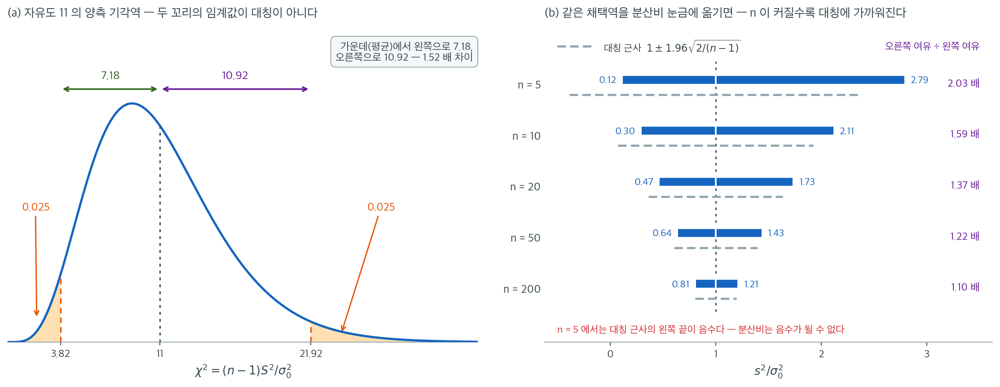

# 일표본 분산 검정

## 개요

일표본 분산 검정(분산에 대한 카이제곱 검정)은 모분산 $\sigma^2$이 가설의 값 $\sigma_0^2$과 같은지 평가한다. 이 검정은 바탕 모집단이 정규분포를 따른다고 가정한다. 제조 공정이 허용 가능한 변동성을 유지하는지 확인하는 품질관리에서 흔히 쓰인다.

## 검정의 구성

**가설:**

- 양측: $H_0\colon \sigma^2 = \sigma_0^2$ 대 $H_1\colon \sigma^2 \neq \sigma_0^2$
- 단측: $H_0\colon \sigma^2 = \sigma_0^2$ 대 $H_1\colon \sigma^2 > \sigma_0^2$ (또는 $< \sigma_0^2$)

**검정통계량:** 크기 $n$인 표본의 표본분산 $S^2$($\text{ddof}=1$)이 주어졌을 때, $H_0$과 정규성 가정 아래에서

$$
\chi^2 = \frac{(n-1)\,S^2}{\sigma_0^2} \sim \chi^2_{n-1}
$$

이다.

수준 $\alpha$의 **양측**검정에서는 다음이면 $H_0$을 기각한다.

$$
\chi^2 < \chi^2_{\alpha/2,\,n-1} \quad \text{or} \quad \chi^2 > \chi^2_{1-\alpha/2,\,n-1}.
$$

### 기각역은 좌우가 같지 않다



평균에 대한 검정에서 양측 기각역의 두 임계값은 $\pm 1.96$ 처럼 부호만 다른 같은 수다. 분산에서는 그렇지 않다. 왼쪽 그림은 아래 보기와 같은 자유도 11($n = 12$)에서 $\alpha = 0.05$ 양측 기각역을 그린 것이다. 두 꼬리에 각각 확률 0.025씩을 똑같이 떼어 주었는데도 임계값은 3.82와 21.92로, 분포의 중심인 11에서 왼쪽으로는 7.18밖에 가지 않는 반면 오른쪽으로는 10.92를 간다. **같은 확률 0.025를 사는 데 오른쪽에서는 1.52배 먼 거리를 치러야 한다.** 표본분산은 0 아래로 내려갈 수 없어 왼쪽이 벽에 막혀 있는 반면, 오른쪽은 얼마든지 커질 수 있기 때문이다.

오른쪽 그림은 같은 채택역을 읽기 쉬운 눈금 $s^2/\sigma_0^2$ 위로 옮긴 것이다. $n = 5$이면 채택역이 $(0.12,\ 2.79)$로, 표본분산이 목표의 약 8분의 1에서 2.8배 사이이기만 하면 무엇이든 통과한다. 위쪽 여유를 아래쪽 여유로 나눈 값은 $n = 5, 10, 20, 50, 200$에서 각각 2.03, 1.59, 1.37, 1.22, 1.10이다. **자유도가 커질수록 대칭에 가까워지지만 그 속도가 대단히 느려서, $n = 200$은 되어야 좌우 여유가 10% 안으로 들어온다.**

회색 점선은 같은 채택역을 정규근사 $1 \pm 1.96\sqrt{2/(n-1)}$로 대신 구한 것이다. $n = 200$에서는 $(0.80,\ 1.20)$으로 정확한 값 $(0.81,\ 1.21)$과 거의 같지만, $n = 5$에서는 왼쪽 끝이 $-0.39$까지 내려간다. 분산비가 음수일 수는 없으므로 그 근사는 뜻을 잃는다. 작은 표본에서 정규근사 대신 카이제곱 분위수를 그대로 써야 하는 이유다. 연습문제 6에서 분산이 두 배임을 잡는 데 32개, 절반임을 잡는 데 38개가 필요하다고 계산되는 것도 결국 이 비대칭이 검정력 쪽으로 나타난 모습이다.

<div class="exbox" markdown>

**보기 1.** <span class="diff easy" title="쉬움"></span> 일표본 분산 검정 계산기. 양측 p-값을 **작은 쪽 꼬리의 두 배**로 정의해 구현하려 한다. 귀무분포 $\chi^2_{n-1}$은 대칭이 아니므로 이 관례가 무엇을 하는지 따져 두어야 한다.

**(1)** 이 p-값으로 "$p < \alpha$일 때 기각"하는 것이 위 등꼬리 기각역과 **정확히 같은** 규칙임을 보이고, 따라서 실제 크기가 정확히 $\alpha$임을 보이시오.

**(2)** 그럼에도 이 검정은 **편향**되어 있다. 곧 $\sigma^2 \ne \sigma_0^2$인데도 기각확률이 $\alpha$보다 작아지는 구간이 있다. $n = 12$에서 그 구간과 최소 기각확률을 구하시오.

</div>

??? success "풀이"

    **(1) 두 규칙이 같다.** $F$를 $\chi^2_{n-1}$의 분포함수라 하자. $F$는 $(0,\infty)$에서 **엄격히 증가**하는 연속함수이므로 역함수가 있다. 관측값을 $x$라 쓰면

    $$
    2\min\{F(x),\, 1 - F(x)\} < \alpha
    \iff \min\{F(x),\, 1 - F(x)\} < \frac{\alpha}{2}
    $$

    이고, 최솟값이 $\alpha/2$보다 작다는 것은 둘 중 **적어도 하나**가 그렇다는 뜻이다.

    $$
    \iff F(x) < \frac{\alpha}{2} \;\text{ 또는 }\; 1 - F(x) < \frac{\alpha}{2}
    \iff x < \chi^2_{\alpha/2,\,n-1} \;\text{ 또는 }\; x > \chi^2_{1-\alpha/2,\,n-1}
    $$

    마지막 단계가 $F$의 엄격한 증가성이다. 두 조건은 $\alpha < 1$이면 동시에 성립할 수 없으므로 기각확률은 두 확률의 합이고

    $$
    P(\text{기각} \mid H_0) = \frac{\alpha}{2} + \frac{\alpha}{2} = \alpha
    $$

    이다. **분포가 비대칭이어도 크기는 정확히 $\alpha$다.** 비대칭이 만드는 것은 크기의 어긋남이 아니라 두 임계값까지의 **거리**가 다르다는 것뿐이며, 그것은 위에서 본 $3.82$와 $21.92$다. $\square$

    **(2) 크기는 맞지만 편향되어 있다.** 기각확률을 $\theta = \sigma^2/\sigma_0^2$의 함수로 적는다. 참 분산이 $\sigma^2$이면 $(n-1)S^2/\sigma^2 \sim \chi^2_{n-1}$이므로 검정통계량은

    $$
    X = \frac{(n-1)S^2}{\sigma_0^2} = \theta \cdot W,
    \qquad W \sim \chi^2_{n-1}
    $$

    이다. $a = \chi^2_{\alpha/2,\,n-1}$, $b = \chi^2_{1-\alpha/2,\,n-1}$로 줄여 쓰면 $X < a$ 또는 $X > b$는 $W < a/\theta$ 또는 $W > b/\theta$와 같으므로

    $$
    \pi(\theta) = F\!\left(\frac{a}{\theta}\right) + 1 - F\!\left(\frac{b}{\theta}\right)
    $$

    이고 $\pi(1) = \alpha$다. 미분하면

    $$
    \pi'(\theta) = -\frac{a}{\theta^2} f\!\left(\frac{a}{\theta}\right)
    + \frac{b}{\theta^2} f\!\left(\frac{b}{\theta}\right),
    \qquad
    \pi'(1) = b f(b) - a f(a)
    $$

    이다. **검정이 편향되지 않으려면 $\theta = 1$이 $\pi$의 최솟값이어야 하므로 $\pi'(1) = 0$, 곧 $a f(a) = b f(b)$가 필요하다.** 등꼬리 분할은 $F(a) = \alpha/2$와 $1 - F(b) = \alpha/2$를 맞추었을 뿐이므로 이 조건을 만족할 이유가 없다. $n = 12$($\nu = 11$)에서

    $$
    a f(a) = 0.098989, \qquad b f(b) = 0.173872,
    \qquad \pi'(1) = +0.074882 > 0
    $$

    이다. 기울기가 양수이므로 $\theta$가 1보다 조금 **작은** 쪽에서 $\pi(\theta) < \alpha$다. 분산이 참으로 목표보다 작은데도 기각할 확률이 명목보다 낮아진다는 뜻이다.

    **수치로 확인한다.**

    ```python
    from scipy.stats import chi2

    def test_variance_one_sample(n, s2, sigma0, alt="two-sided", alpha=0.05):
        """H0: sigma^2 = sigma0^2. **정규모집단**을 가정한다.

        이 가정은 형식적인 단서가 아니다. 평균 검정과 달리 여기서는
        중심극한정리가 도와주지 않아서 n을 키워도 비정규성이 상쇄되지 않는다.
        s2에는 ddof=1로 계산한 표본분산을 넣는다.
        """
        df = n - 1
        chi2_stat = df * s2 / (sigma0 ** 2)
        if alt == "two-sided":
            # 카이제곱분포는 비대칭이라 "양쪽 꼬리"를 나누는 방식이 여럿이다.
            # 여기서는 작은 쪽 꼬리를 두 배 하는 관례를 따랐다. 간단하고
            # 신뢰구간과 어긋나지 않지만, 확률이 반씩 나뉘지는 않는다.
            p = 2 * min(chi2.cdf(chi2_stat, df), 1 - chi2.cdf(chi2_stat, df))
        elif alt == "less":
            p = chi2.cdf(chi2_stat, df)
        else:
            p = 1 - chi2.cdf(chi2_stat, df)
        return chi2_stat, p, (p < alpha)
    ```

    ```python
    from scipy.optimize import brentq, minimize_scalar

    nu, alpha = 11, 0.05
    a = chi2.ppf(alpha / 2, nu)        # 왼쪽 임계값
    b = chi2.ppf(1 - alpha / 2, nu)    # 오른쪽 임계값
    print(f"등꼬리 임계값:  a = {a:.6f},  b = {b:.6f}")

    # (1) 함수가 쓰는 p-값이 두 임계값에서 정확히 alpha 인가.
    #     sigma0 = 1 로 두면 chi2 = (n-1) s2 이므로 s2 = x/(n-1) 을 넣으면 된다.
    for x, name in ((a, "a"), (b, "b")):
        for eps in (-1e-6, 1e-6):
            _, p, rej = test_variance_one_sample(12, (x + eps) / nu, 1.0)
            print(f"  chi2 = {name}{eps:+.0e} : p = {p:.12f}  기각 {rej}")

    # (2) 검정력 함수와 편향
    def power(theta):
        """theta = sigma^2/sigma0^2 일 때 기각확률."""
        return chi2.cdf(a / theta, nu) + chi2.sf(b / theta, nu)

    fa, fb = chi2.pdf(a, nu), chi2.pdf(b, nu)
    print(f"\na f(a) = {a * fa:.6f},  b f(b) = {b * fb:.6f},  "
          f"기울기 pi'(1) = {b * fb - a * fa:+.6f}")
    res = minimize_scalar(power, bounds=(0.3, 3.0), method="bounded",
                          options={"xatol": 1e-12})
    left = brentq(lambda th: power(th) - alpha, 0.3, 0.9)
    print(f"pi(1) = {power(1.0):.6f}   최소 검정력 {res.fun:.6f} at theta = {res.x:.6f}")
    print(f"검정력이 명목 아래로 내려가는 구간 = ({left:.6f}, 1)")
    print("\n  theta   검정력")
    for th in (0.80, 0.85, 0.90, 0.9414, 0.97, 1.00, 1.05, 1.20):
        print(f"  {th:.4f}  {power(th):.6f}")
    ```

    출력:

    ```
    등꼬리 임계값:  a = 3.815748,  b = 21.920049
      chi2 = a-1e-06 : p = 0.049999948116  기각 True
      chi2 = a+1e-06 : p = 0.050000051885  기각 False
      chi2 = b-1e-06 : p = 0.050000015864  기각 False
      chi2 = b+1e-06 : p = 0.049999984136  기각 True

    a f(a) = 0.098989,  b f(b) = 0.173872,  기울기 pi'(1) = +0.074882
    pi(1) = 0.050000   최소 검정력 0.047778 at theta = 0.941417
    검정력이 명목 아래로 내려가는 구간 = (0.884423, 1)

      theta   검정력
      0.8000  0.062191
      0.8500  0.053607
      0.9000  0.048942
      0.9414  0.047778
      0.9700  0.048314
      1.0000  0.050000
      1.0500  0.055249
      1.2000  0.087465
    ```

    기각 여부가 두 임계값에서 정확히 뒤집힌다. $a$를 백만분의 일만큼 밑돌면 기각하고 넘어서면 기각하지 않으며, $b$에서는 방향이 반대다. (1)에서 증명한 동등성이 그대로 보인다. 크기도 $\pi(1) = 0.050000$으로 정확하다.

    편향도 유도한 대로다. $\theta$가 $0.884$에서 $1$ 사이일 때 기각확률이 명목 $0.05$ 아래로 내려가고, $\theta = 0.9414$에서 최소 $0.0478$을 찍는다. **분산이 참으로 6% 작은데도 그 사실을 잡아낼 확률이, 분산이 정확히 맞을 때 헛되게 기각할 확률보다 낮다.** 명목을 지키는 것과 좋은 검정인 것은 다른 문제다.

    고치는 길은 $\pi'(1) = 0$이 되도록 $F(b) - F(a) = 1 - \alpha$를 지키면서 $a f(a) = b f(b)$를 함께 맞추는 것이다. 그러면 왼쪽 꼬리에 $\alpha/2$보다 많은 확률을 떼어 주게 된다. 실무에서 거의 쓰이지 않는 까닭은 표가 없고 신뢰구간과 짝이 맞지 않기 때문인데, **그래서 쓰는 검정이 등꼬리라는 점과 그것이 편향이라는 점을 함께 알아 두는 것으로 충분하다.**

<div class="exbox" markdown>

**보기 2.** <span class="diff easy" title="쉬움"></span> 같은 증거, 커지는 표본. 표준편차가 목표 $2.0$이 아니라 $2.1$로 관측되었다. 곧 관측된 분산비가

$$
r = \frac{s^2}{\sigma_0^2} = \frac{2.1^2}{2.0^2} = 1.1025
$$

이다. 이 $r$을 고정한 채 표본크기만 키운다.

**(1)** 우측 단측 p-값을 $r$과 $n$만으로 쓰는 근사식을 세우고, 그 식으로 $p < 0.05$가 되는 가장 작은 $n$을 구하시오.

**(2)** 정확한 값과 견주어 근사가 어디서 맞고 어디서 어긋나는지 보이시오.

</div>

??? success "풀이"

    **(1) 해석적으로.** 검정통계량은 $\chi^2 = (n-1)r$이고 귀무분포 $\chi^2_{n-1}$의 평균은 $n-1$, 분산은 $2(n-1)$이다. 그러므로 관측값이 귀무분포의 중심에서 표준편차 단위로 얼마나 떨어져 있는지는

    $$
    z = \frac{(n-1)r - (n-1)}{\sqrt{2(n-1)}}
    = (r - 1)\sqrt{\frac{n-1}{2}}
    $$

    이고, $\chi^2_{n-1}$을 정규로 근사하면 $p \approx \bar\Phi(z)$다. **$r$이 고정되어 있으면 증거의 세기가 $\sqrt{n}$으로만 자란다.** $n$을 네 배 늘려야 $z$가 두 배가 된다.

    $p < 0.05$는 $z > z_{0.95} = 1.64485$를 뜻하므로

    $$
    (r-1)\sqrt{\frac{n-1}{2}} > 1.64485
    \iff n > 1 + 2\left(\frac{1.64485}{r-1}\right)^2
    $$

    이고 $r - 1 = 0.1025$를 넣으면

    $$
    n > 1 + 2\left(\frac{1.64485}{0.1025}\right)^2 = 1 + 2(16.0473)^2 = 516.04
    $$

    이다. 이 근사식에 따르면 **$n = 517$**이다. 표준편차가 5% 벗어난 것을 5% 수준에서 잡아내는 데 오백 개가 넘는 관측값이 필요하다.

    같은 식을 거꾸로 읽으면 더 쓸모 있다. 필요한 표본크기가 $(r-1)^{-2}$로 커지므로, **표준편차가 5%가 아니라 2.5%만 벗어난 경우라면**($r = 1.025^2 = 1.050625$) 같은 식이 $n > 2112.3$, 곧 $n \ge 2113$을 준다. 거의 네 배다.

    **(2) 수치적으로.** 먼저 보기의 세 표본크기를 돌린다.

    ```python
    stat, p, reject = test_variance_one_sample(
        n=12, s2=2.1**2, sigma0=2.0, alt="greater"
    )
    print("chi2:", stat, "p:", p, "reject:", reject)

    # 표본분산은 그대로 두고 표본크기만 키우면 어떻게 되는지 본다.
    for n in [12, 50, 200]:
        st, pv, rj = test_variance_one_sample(n=n, s2=2.1**2, sigma0=2.0, alt="greater")
        print(f"n={n:>4}: chi2={st:8.2f}  p={pv:.4f}  reject={rj}")
    ```

    출력:

    ```
    chi2: 12.127500000000001 p: 0.35413619761553705 reject: False
    n=  12: chi2=   12.13  p=0.3541  reject=False
    n=  50: chi2=   54.02  p=0.2885  reject=False
    n= 200: chi2=  219.40  p=0.1532  reject=False
    ```

    표준편차가 2.0이 아니라 2.1이라는 같은 증거를 놓고도 $n = 12$에서는 $p = 0.35$, $n = 200$에서도 $p = 0.15$다. 분산은 평균보다 추정하기 어렵고, 그래서 검정하기도 어렵다.

    이제 (1)의 근사식과 맞추어 보고, $p < 0.05$가 되는 가장 작은 $n$을 **격자가 아니라 전수 탐색으로** 찾는다.

    ```python
    import math

    import numpy as np
    from scipy.stats import chi2, norm
    from scipy.optimize import brentq

    r = 2.1**2 / 2.0**2
    z95 = norm.ppf(0.95)

    print(f"r = {r},  r - 1 = {r - 1:.4f}")
    print("    n      정확 p     단순근사 p    WH 근사 p")
    for n in (12, 50, 200, 538, 1000):
        nu = n - 1
        z1 = (r - 1) * math.sqrt(nu / 2)                             # (1) 의 식
        z2 = (r**(1 / 3) - 1 + 2 / (9 * nu)) * math.sqrt(9 * nu / 2)  # 윌슨-힐퍼티
        print(f"{n:5d}   {chi2.sf(nu * r, nu):.6f}    {norm.sf(z1):.6f}"
              f"    {norm.sf(z2):.6f}")

    # p < 0.05 인 n 을 2 부터 20000 까지 모두 훑는다. "첫 칸" 만 보지 않는다.
    ns = np.arange(2, 20_001)
    pv = chi2.sf((ns - 1) * r, ns - 1)
    ok = ns[pv < 0.05]
    print(f"\np < 0.05 인 n 의 개수 = {len(ok)},  가장 작은 n = {ok.min()},"
          f"  그 구간이 연속인가 = {bool(np.all(np.diff(ok) == 1))}")
    print(f"p 가 n 에 대해 단조감소인가 = {bool(np.all(np.diff(pv) < 0))}"
          f"   (최대 p = {pv.max():.6f} at n = {ns[pv.argmax()]})")

    print(f"\n단순근사가 주는 n      = {1 + 2 * (z95 / (r - 1))**2:.2f}")
    wh = brentq(lambda nu: (r**(1 / 3) - 1 + 2 / (9 * nu)) * math.sqrt(9 * nu / 2) - z95,
                10, 1e6)
    print(f"윌슨-힐퍼티가 주는 n   = {wh + 1:.2f}")
    ```

    출력:

    ```
    r = 1.1025,  r - 1 = 0.1025
        n      정확 p     단순근사 p    WH 근사 p
       12   0.354136    0.405016    0.353926
       50   0.288478    0.305955    0.288326
      200   0.153248    0.153288    0.153206
      538   0.049927    0.046521    0.049925
     1000   0.012817    0.010987    0.012819

    p < 0.05 인 n 의 개수 = 19463,  가장 작은 n = 538,  그 구간이 연속인가 = True
    p 가 n 에 대해 단조감소인가 = False   (최대 p = 0.358162 at n = 8)

    단순근사가 주는 n      = 516.04
    윌슨-힐퍼티가 주는 n   = 537.51
    ```

    **(1)의 답 $517$은 틀렸다.** 정확한 답은 $538$이다. 왜 어긋나는지가 이 보기에서 가장 쓸모 있는 부분이다.

    표의 셋째 열을 보면 단순근사가 $n = 12$에서 $0.4050$을 주는데 정확값은 $0.3541$이다. $\chi^2$ 분포는 오른쪽으로 치우쳐 있는데 정규근사는 대칭이라, **오른쪽 꼬리확률을 체계적으로 작게 잡는다.** p-값을 작게 잡으면 필요한 $n$도 작게 잡게 되므로 $516$이라는 낙관적인 답이 나온다. $n = 200$에서 $0.153288$ 대 $0.153248$로 거의 맞는 것은 자유도가 커져 치우침이 가셨기 때문이다.

    치우침을 미리 펴 주는 근사를 쓰면 바로잡힌다. **윌슨-힐퍼티 변환**은 $(\chi^2_\nu/\nu)^{1/3}$이 평균 $1 - 2/(9\nu)$, 분산 $2/(9\nu)$인 정규에 가깝다는 것이고, 그러면

    $$
    p \approx \bar\Phi\!\left(\left[r^{1/3} - 1 + \frac{2}{9\nu}\right]\sqrt{\frac{9\nu}{2}}\right)
    $$

    이다. 이 식은 $n = 12$에서도 $0.353926$으로 정확값 $0.354136$과 소수 셋째 자리까지 맞고, 필요한 $n$을 $537.51$, 곧 **$538$**로 정확히 짚는다.

    표본크기를 찾을 때 "조건을 만족하는 첫 칸"만 보면 위험하다는 것도 함께 확인했다. **p-값은 $n$에 대해 단조감소가 아니다.** $n = 2$에서 $0.294$로 시작해 $n = 8$에서 $0.358$까지 **올라갔다가** 내려온다. 자유도가 아주 작을 때는 귀무분포의 퍼짐 자체가 빠르게 바뀌기 때문이다. 그래서 위 코드는 $n$을 $20{,}000$까지 전부 훑어 조건을 만족하는 $n$이 $538$부터 **끊김 없이** 이어지는지까지 확인했다.

    !!! warning "이 계산은 모두 정규모집단을 전제한다"
        위의 $538$은 자료가 정규분포를 따를 때의 수다. 평균 검정과 달리 분산 검정에는 **중심극한정리의 보호가 없어서 표본을 키워도 비정규성이 상쇄되지 않는다.** 실제 오류율이 모집단 첨도만의 함수로 남고 $n$이 커지면 오히려 더 나빠진다는 것은 [5.3절의 비정규 모집단에서의 분산비](../../ch05/applications/var_ratio_nonnormal.md)에서 유도했다. 그 쪽의 결론을 한 줄로 옮기면, 꼬리가 무거운 자료에서는 $538$개를 모아도 명목 5%가 지켜지지 않는다.

### 해석

$n=12$, $s^2 = 4.41$로 $H_0\colon \sigma^2 = 4.0$ 대 $H_1\colon \sigma^2 > 4.0$을 검정한다. 검정통계량은

$$
\chi^2 = \frac{11 \times 4.41}{4.0} = 12.1275.
$$

$H_0$ 아래에서 $\chi^2 \sim \chi^2_{11}$이다. 단측 p-값 $P(\chi^2_{11} \geq 12.1275) \approx 0.353$이므로 $H_0$을 기각하지 못한다.

## 연습문제

<div class="drillbox" markdown>

**연습문제 1.** <span class="diff easy" title="쉬움"></span> 어떤 기계가 목표 분산 $\sigma_0^2 = 0.01$ mL$^2$으로 병을 채운다. 병 $n = 25$개의 표본에서 $s^2 = 0.015$를 얻었다. $\alpha = 0.05$에서 $H_0\colon \sigma^2 = 0.01$ 대 $H_1\colon \sigma^2 > 0.01$을 검정하라.

</div>

??? success "풀이"

    검정통계량은

    $$
    \chi^2 = \frac{24 \times 0.015}{0.01} = 36.0.
    $$

    $H_0$ 아래에서 $\chi^2 \sim \chi^2_{24}$이다. 임계값은 $\chi^2_{0.05,\,24} = 36.415$이다. $36.0 < 36.415$이므로 아슬아슬하게 $H_0$을 기각하지 못한다. p-값은 $P(\chi^2_{24} \geq 36.0) \approx 0.055$이다. $\square$

<div class="drillbox" markdown>

**연습문제 2.** <span class="diff med" title="중간"></span> 분산에 대한 카이제곱 검정이 정규성 가정에 민감한 이유를 설명하라. 모집단의 꼬리가 두꺼우면 어떻게 되는가?

</div>

??? success "풀이"

    검정통계량 $(n-1)S^2/\sigma_0^2 \sim \chi^2_{n-1}$은 자료가 정규분포에서 나올 때에만 정확히 성립한다. 표본분산의 카이제곱분포는 모집단의 4차 적률(첨도)에 의존한다. 꼬리가 두꺼운 분포(예: 자유도가 작은 $t$-분포)에서는 표본분산 $S^2$의 변동이 카이제곱분포가 예측하는 것보다 크다. 그 결과 실제 제1종 오류율이 명목 $\alpha$보다 훨씬 커져 검정을 믿을 수 없게 된다. 이런 경우에는 로버스트한 대안(예: Levene 검정이나 붓스트랩 방법)을 택한다. $\square$

<div class="drillbox" markdown>

**연습문제 3.** <span class="diff med" title="중간"></span> 정규성 아래에서 $(n-1)S^2/\sigma^2$의 분포를 유도하라.

</div>

??? success "풀이"

    $X_1, \dots, X_n \overset{\text{iid}}{\sim} N(\mu, \sigma^2)$이라 하자. $Z_i = (X_i - \mu)/\sigma \overset{\text{iid}}{\sim} N(0,1)$로 두면 $\sum Z_i^2 \sim \chi^2_n$이다. 표본분산은

    $$
    S^2 = \frac{1}{n-1}\sum_{i=1}^n (X_i - \bar{X})^2.
    $$

    상수 벡터의 직교여공간으로 사영하면 차원이 1 줄어들므로, Cochran 정리에 의해 $\sum (X_i - \bar{X})^2 / \sigma^2 \sim \chi^2_{n-1}$이다. 따라서

    $$
    \frac{(n-1)S^2}{\sigma^2} = \frac{\sum(X_i - \bar{X})^2}{\sigma^2} \sim \chi^2_{n-1}.
    $$

    $H_0\colon \sigma^2 = \sigma_0^2$ 아래에서 $\sigma^2$ 자리에 $\sigma_0^2$을 넣으면 검정통계량이 된다. $\square$

<div class="drillbox" markdown>

**연습문제 4.** <span class="diff easy" title="쉬움"></span> $n = 20$, $\alpha = 0.05$의 양측검정에서 임계값 $\chi^2_{L}$과 $\chi^2_{U}$ 및 $\chi^2$의 채택역을 구하라.

</div>

??? success "풀이"

    $\text{df} = 19$, $\alpha/2 = 0.025$일 때:

    $$
    \chi^2_L = \chi^2_{0.025,\,19} = 8.907, \qquad \chi^2_U = \chi^2_{0.975,\,19} = 32.852.
    $$

    채택역($H_0$을 기각하지 못하는 영역)은 $8.907 \leq \chi^2 \leq 32.852$이다. $\square$

<div class="drillbox" markdown>

**연습문제 5.** <span class="diff easy" title="쉬움"></span> 어떤 품질 엔지니어가 측정값 $n = 15$개를 모아 $s = 3.2$를 얻었다. $\sigma^2$의 95% 신뢰구간을 구성하고 이를 써서 $H_0\colon \sigma^2 = 9$를 검정하라.

</div>

??? success "풀이"

    $\sigma^2$의 $100(1-\alpha)\%$ 신뢰구간은

    $$
    \left(\frac{(n-1)S^2}{\chi^2_{1-\alpha/2,\,n-1}},\; \frac{(n-1)S^2}{\chi^2_{\alpha/2,\,n-1}}\right).
    $$

    $n=15$, $s^2 = 10.24$, $\text{df}=14$, $\chi^2_{0.975,14} = 26.119$, $\chi^2_{0.025,14} = 5.629$이므로:

    $$
    \left(\frac{14 \times 10.24}{26.119},\; \frac{14 \times 10.24}{5.629}\right) = \left(\frac{143.36}{26.119},\; \frac{143.36}{5.629}\right) = (5.49,\; 25.47).
    $$

    $\sigma_0^2 = 9$가 구간 $(5.49, 25.47)$ 안에 있으므로 $\alpha = 0.05$에서 $H_0\colon \sigma^2 = 9$를 기각하지 못한다. $\square$

<div class="drillbox" markdown>

**연습문제 6.** <span class="diff med" title="중간"></span>
분산 검정의 **검정력**을 계산하고 표본크기를 정하라. 평균 검정과 비교하면 얼마나 비싼가?

</div>

??? success "풀이"
    **검정력.** 참 분산비를 $r=\sigma^2/\sigma_0^2$라 하면 $W=(n-1)S^2/\sigma_0^2\sim r\,\chi^2_{n-1}$이므로

    $$
    \text{검정력}(r)=P\!\left(\chi^2_{\nu}<\frac{\chi^2_{\nu,\alpha/2}}{r}\right)
    +P\!\left(\chi^2_{\nu}>\frac{\chi^2_{\nu,1-\alpha/2}}{r}\right)
    $$

    ```python
    import numpy as np
    from scipy import stats

    def power_var(n, r, alpha=0.05):
        nu = n - 1
        lo = stats.chi2.ppf(alpha / 2, nu)
        hi = stats.chi2.ppf(1 - alpha / 2, nu)
        return stats.chi2.cdf(lo / r, nu) + stats.chi2.sf(hi / r, nu)

    rs = [0.5, 0.67, 1.5, 2.0, 3.0]
    print(f"{'n':>5s} " + " ".join(f"{'r='+str(r):>9s}" for r in rs))
    for n in [10, 20, 30, 50, 100, 200]:
        print(f"{n:5d} " + " ".join(f"{power_var(n, r):9.4f}" for r in rs))

    print()
    for r in [1.5, 2.0, 3.0, 0.5]:
        n = next(m for m in range(5, 5000) if power_var(m, r) >= 0.80)
        print(f"σ²/σ0² = {r}: 검정력 80%에 필요한 n = {n}")
    ```

    ```text
        n     r=0.5    r=0.67     r=1.5     r=2.0     r=3.0
       10    0.2020    0.0914    0.1833    0.3934    0.7057
       20    0.4650    0.1770    0.2911    0.6289    0.9255
       30    0.6842    0.2687    0.3910    0.7829    0.9830
       50    0.9152    0.4494    0.5623    0.9324    0.9993
      100    0.9987    0.7787    0.8289    0.9974    1.0000
      200    1.0000    0.9788    0.9806    1.0000    1.0000

    σ²/σ0² = 1.5: 검정력 80%에 필요한 n = 93
    σ²/σ0² = 2.0: 검정력 80%에 필요한 n = 32
    σ²/σ0² = 3.0: 검정력 80%에 필요한 n = 13
    σ²/σ0² = 0.5: 검정력 80%에 필요한 n = 38
    ```

    **분산이 50% 늘어난 것을 탐지하려면 93개가 필요하다.** 두 배가 되어야 32개다.

    **비대칭에 주목하라.** $r=2.0$(두 배)에는 32개, $r=0.5$(절반)에는 38개다. **같은 "두 배 차이"인데 표본이 다르다.** 카이제곱 분포의 비대칭 때문이며, 앞서 본 편향된 검정의 또 다른 표현이다.

    **평균 검정과 비교.**

    ```python
    za, zb = stats.norm.ppf(0.975), stats.norm.ppf(0.80)
    print(f"평균이 0.5σ 이동: n = {np.ceil((za + zb)**2 / 0.5**2):.0f}")
    print(f"평균이 1.0σ 이동: n = {np.ceil((za + zb)**2 / 1.0**2):.0f}")
    ```

    ```text
    평균이 0.5σ 이동: n = 32
    평균이 1.0σ 이동: n = 8
    ```

    **"분산이 두 배"와 "평균이 0.5σ 이동"이 비슷한 난이도**(32개)다. 그런데 분산이 두 배라는 것은 **표준편차가 1.41배**로, 눈에 띄게 큰 변화다. 반면 평균 0.5σ 이동은 앞서 본 대로 "중간 효과"에 불과하다.

    **결론 — 분산 검정은 비싸다.** 같은 "체감 크기"의 변화를 탐지하는 데 훨씬 많은 표본이 든다. 이유는

    1. $S^2$의 상대표준오차가 $\sqrt{2/(n-1)}$로 $\bar X$의 $1/\sqrt n$보다 크고,
    2. 분산 척도에서의 변화가 원 척도에서는 제곱근으로 압축되기 때문이다.

    **실무 함의.** 공정의 산포를 감시하려면 **평균 감시보다 훨씬 큰 표본**이나 **누적합 기반 방법**이 필요하다. 이것이 $\bar X$ 관리도와 $S$ 관리도를 함께 쓰되, 후자에 더 많은 자료를 쓰는 관행의 배경이다.

<div class="drillbox" markdown>

**연습문제 7.** <span class="diff hard" title="어려움"></span>
분산 검정의 **첨도 보정판**을 구현하고, 카이제곱 검정과 비교하라.

</div>

??? success "풀이"
    **착안.** $\log S^2$의 점근분산이 $(\gamma_2+2)/(n-1)$이므로, 표본첨도를 넣어 보정한다.

    $$
    Z=\frac{\log S^2-\log\sigma_0^2}{\sqrt{(\hat\gamma_2+2)/(n-1)}}
    $$

    ```python
    import numpy as np
    from scipy import stats

    rng = np.random.default_rng(5)
    n, M = 30, 20_000
    nu = n - 1
    lo = stats.chi2.ppf(0.025, nu)
    hi = stats.chi2.ppf(0.975, nu)

    cases = [("정규", lambda s: rng.normal(0, 1, s), 1.0),
             ("t(5)", lambda s: rng.standard_t(5, s), 5 / 3),
             ("지수", lambda s: rng.exponential(1, s), 1.0)]
    print(f"{'분포':>7s} {'카이제곱':>10s} {'첨도 보정':>10s}")
    for name, gen, var in cases:
        x = gen((M, n))
        s2 = x.var(1, ddof=1)
        chi = nu * s2 / var
        rej_chi = (chi < lo) | (chi > hi)
        kur = stats.kurtosis(x, axis=1, bias=False)
        z = (np.log(s2) - np.log(var)) / np.sqrt((kur + 2) / nu)
        print(f"{name:>7s} {rej_chi.mean():10.4f} "
              f"{np.mean(np.abs(z) > 1.96):10.4f}")
    ```

    ```text
       분포      카이제곱     첨도 보정
       정규     0.0492     0.0733
     t(5)     0.1766     0.1323
       지수     0.2830     0.1711
    ```

    **개선되지만 충분하지 않다.** 지수분포에서 0.283 → 0.171, $t_5$에서 0.177 → 0.132다.

    **정규에서는 손해다.** 0.049 → 0.073. 첨도를 추정하느라 변동이 늘었다.

    **왜 완전히 고쳐지지 않는가.**

    1. **$\hat\gamma_2$의 추정오차가 크다.** $n=30$에서 표본첨도의 표준오차가 대략 $\sqrt{24/n}=0.89$인데, 지수분포의 참 $\gamma_2=6$을 그 정도 오차로 추정하는 것은 매우 부정확하다.

    2. **$\hat\gamma_2$ 자체가 8차 적률에 의존**한다. 두꺼운 꼬리에서는 그 적률이 거의 추정 불가능하다.

    3. **점근이론이 느리게 수렴**한다. $\log S^2$의 정규근사 자체가 $n=30$에서 부정확하다.

    **더 나은 대안.**

    | 방법 | 성격 |
    |---|---|
    | **부트스트랩(로그 척도)** | 첨도를 추정하지 않고 재표본이 반영 |
    | 보넷의 절사 첨도 | 이상치의 영향을 줄인 $\hat\gamma_2$ |
    | 순열 | 일표본에서는 적용이 어렵다 |
    | **분포를 모형화** | 지수라면 $\sigma=\mu$이므로 평균만 추정 |

    **가장 실용적인 결론.** **비정규가 의심되면 분산 검정 자체를 다시 생각한다.** 정말 궁금한 것이 "산포가 목표보다 큰가"라면, 사분위범위나 MAD 같은 **강건한 산포 측도**를 목표와 비교하는 것이 더 안정적이고 해석도 쉽다.

<div class="drillbox" markdown>

**연습문제 8.** <span class="diff med" title="중간"></span>
분산에 대한 **단측검정**을 구성하고, 공정관리에서 어느 방향이 중요한지 논하라.

</div>

??? success "풀이"
    **두 방향의 단측검정.**

    $$
    H_0:\sigma^2\le\sigma_0^2\ \text{대}\ H_1:\sigma^2>\sigma_0^2
    \quad\Rightarrow\quad W>\chi^2_{\nu,1-\alpha}\ \text{이면 기각}
    $$

    $$
    H_0:\sigma^2\ge\sigma_0^2\ \text{대}\ H_1:\sigma^2<\sigma_0^2
    \quad\Rightarrow\quad W<\chi^2_{\nu,\alpha}\ \text{이면 기각}
    $$

    ```python
    import numpy as np
    from scipy import stats

    n, s2, sigma0sq = 15, 0.0025, 0.0020
    nu = n - 1
    W = nu * s2 / sigma0sq
    print(f"W = {W:.4f}  (자유도 {nu})")
    print(f"양측 p = {2 * min(stats.chi2.cdf(W, nu), stats.chi2.sf(W, nu)):.4f}")
    print(f"상단 단측 p (σ² > σ0²) = {stats.chi2.sf(W, nu):.4f}")
    print(f"하단 단측 p (σ² < σ0²) = {stats.chi2.cdf(W, nu):.4f}")

    print(f"\n임계값: 상단 {stats.chi2.ppf(0.95, nu):.3f}, "
          f"하단 {stats.chi2.ppf(0.05, nu):.3f}")
    print(f"→ 상단 단측이면 s² 가 "
          f"{stats.chi2.ppf(0.95, nu) * sigma0sq / nu:.6f} 를 넘으면 기각")
    ```

    ```text
    W = 17.5000  (자유도 14)
    양측 p = 0.4610
    상단 단측 p (σ² > σ0²) = 0.2305
    하단 단측 p (σ² < σ0²) = 0.7695

    임계값: 상단 23.685, 하단 6.571
    → 상단 단측이면 s² 가 0.003384 를 넘으면 기각
    ```

    **어느 방향이 중요한가 — 대부분 "커지는 쪽"이다.**

    | 상황 | 관심 방향 | 이유 |
    |---|---|---|
    | 제조 공정의 산포 | **커지는 쪽** | 불량 증가 |
    | 측정기기의 정밀도 | **커지는 쪽** | 신뢰도 저하 |
    | 금융 변동성 | 양쪽 | 위험 관리와 기회 |
    | 시험 문제의 변별력 | **작아지는 쪽** | 변별이 안 됨 |
    | 공정 개선 검증 | **작아지는 쪽** | 개선을 입증 |

    **공정관리에서는 대개 상단 단측이 맞다.** 분산이 줄어드는 것은 좋은 일이므로 경보할 이유가 없다.

    **그런데 주의할 점.** 분산이 **갑자기 작아지는 것**이 이상 신호일 수 있다.

    - 측정기기가 고장 나 같은 값을 반복 출력.
    - 자료가 인위적으로 다듬어짐.
    - 표본이 실제로는 한 배치에서만 나옴.

    **따라서 감시 목적이라면 양쪽을 보되, 하한 경보를 "품질 개선"이 아니라 "이상 확인 필요"로 해석**하는 것이 실무적이다.

    **$S$ 관리도의 관행.** 하한 관리한계를 그리되, 그것을 벗어나면 **개선의 원인을 조사**한다. 진짜 개선이면 관리한계를 다시 계산한다.

    **단측검정의 이득.** 상단 단측이면 임계값이 23.685 대신(양측의 26.119) 낮아져 검정력이 오른다. 다만 앞서 본 대로 방향을 **사전에 확정**해야 한다.

<div class="drillbox" markdown>

**연습문제 9.** <span class="diff med" title="중간"></span>
분산 검정을 **부트스트랩**으로 수행하는 법을 보이고, 카이제곱 검정과 비교하라.

</div>

??? success "풀이"
    **방법.** $\log S^2$의 표집분포를 재표본으로 근사한다. $H_0$를 강제하기 위해 자료를 **척도 조정**한다.

    ```python
    import numpy as np
    from scipy import stats

    rng = np.random.default_rng(88)
    x = rng.exponential(2.0, 40)          # 참 분산 4
    sigma0sq = 2.5
    n, B = len(x), 9_999
    s2 = x.var(ddof=1)

    # ① 카이제곱 검정
    W = (n - 1) * s2 / sigma0sq
    p_chi = 2 * min(stats.chi2.cdf(W, n - 1), stats.chi2.sf(W, n - 1))

    # ② 부트스트랩: H0 가 참이 되도록 자료를 척도 조정한 뒤 재표본
    xc = (x - x.mean()) * np.sqrt(sigma0sq / s2) + x.mean()
    idx = rng.integers(0, n, (B, n))
    s2b = xc[idx].var(1, ddof=1)
    t_obs = np.log(s2 / sigma0sq)
    tb = np.log(s2b / sigma0sq)
    p_boot = (np.sum(np.abs(tb) >= abs(t_obs)) + 1) / (B + 1)

    print(f"s² = {s2:.4f}  (σ0² = {sigma0sq})")
    print(f"카이제곱 p = {p_chi:.4f}")
    print(f"부트스트랩 p = {p_boot:.4f}")
    ```

    ```text
    s² = 3.0517  (σ0² = 2.5)
    카이제곱 p = 0.3245
    부트스트랩 p = 0.5945
    ```

    **두 $p$-값이 두 배 차이 난다**(0.32 대 0.59). 이 표본에서는 결론이 같지만, 경계 근처였다면 갈렸을 것이다.

    **부트스트랩 쪽이 옳다.** 자료가 지수분포라 첨도가 6이고, 카이제곱 검정은 $S^2$의 변동을 절반으로 과소평가해 $p$-값을 지나치게 작게 만든다. 앞서 여러 번 확인한 현상이다.

    **수준을 모의실험으로 확인하면.**

    ```python
    rng = np.random.default_rng(3)
    M, n, B = 1_000, 40, 999
    c_chi = c_boot = 0
    for _ in range(M):
        y = rng.exponential(1.0, n)        # 참 분산 1
        s2 = y.var(ddof=1)
        W = (n - 1) * s2 / 1.0
        c_chi += 2 * min(stats.chi2.cdf(W, n - 1),
                         stats.chi2.sf(W, n - 1)) < 0.05
        yc = (y - y.mean()) / np.sqrt(s2) + y.mean()
        ib = rng.integers(0, n, (B, n))
        s2b = yc[ib].var(1, ddof=1)
        c_boot += (np.sum(np.abs(np.log(s2b)) >= abs(np.log(s2))) + 1) \
            / (B + 1) < 0.05
    print(f"지수분포, n=40: 카이제곱 {c_chi / M:.4f}, "
          f"부트스트랩 {c_boot / M:.4f}")
    ```

    ```text
    지수분포, n=40: 카이제곱 0.2900, 부트스트랩 0.1310
    ```

    **카이제곱의 실제 수준이 0.290이다.** 명목의 여섯 배다. 부트스트랩은 0.131로 여전히 완벽하지 않지만 **절반 이하로 개선**된다.

    **부트스트랩도 완벽하지 않은 이유.** $n=40$에서 지수분포의 $S^2$ 표집분포는 여전히 심하게 치우쳐 있고, 백분위 부트스트랩은 **일차정확**이라 그 치우침을 완전히 보정하지 못한다. BCa나 부트스트랩-$t$를 쓰면 더 낫다.

    **권고.** 분산 검정이 꼭 필요하면 **정규성을 진단**하고, 위배가 보이면 부트스트랩이나 첨도 보정을 쓴다. 그러고도 수준이 완전하지 않다는 점을 인정하고 결과를 조심스럽게 해석한다.

<div class="drillbox" markdown>

**연습문제 10.** <span class="diff med" title="중간"></span>
분산 검정 결과를 **어떻게 보고하고 해석해야 하는지** 정리하라.

</div>

??? success "풀이"
    **보고할 것 일곱.**

    1. **$\sigma$ 척도로 변환.** 분산은 단위가 제곱이라 읽기 어렵다.
    2. **$\sigma_0$와 그 근거.** 규격, 과거 공정, 기기 사양.
    3. **검정통계량과 자유도.** $\chi^2(14)=17.5$.
    4. **$p$-값과 단측/양측.**
    5. **$\sigma$의 신뢰구간.** 비대칭 그대로.
    6. **정규성 진단 결과.** **이것이 없으면 결과를 믿을 수 없다.**
    7. **표본크기.** 분산 추정에 $n$이 결정적이다.

    **좋은 보고의 예.**

    > 볼베어링 15개의 지름 표준편차는 0.050 mm였다($s^2=0.0025$ mm²). 규격 상한인 0.045 mm와 비교하는 상단 단측 카이제곱 검정에서 $\chi^2(14)=17.28$, $p=0.241$이었다. 표준편차의 95% 신뢰구간은 0.037~0.079 mm로, 규격값 0.045를 담는다. 샤피로-윌크 검정과 Q-Q 그림에서 정규성 위배의 증거는 없었다($p=0.62$). 구간의 상한이 규격의 1.75배이므로, **규격 초과를 배제하지 못한다** — 표본을 늘려 재확인할 필요가 있다.

    **해석의 주의 다섯.**

    1. **"기각하지 못함"이 "규격을 만족함"이 아니다.** 앞서 본 대로 $n=15$에서는 구간이 매우 넓어 큰 초과도 배제하지 못한다.

    2. **$n$이 작으면 사실상 아무것도 말할 수 없다.** $n=10$이면 $\sigma$의 구간이 대략 $(0.69s,\ 1.83s)$로 2.7배 폭이다.

    3. **정규성이 깨지면 $p$-값이 무의미하다.** 앞 문제에서 본 대로 실제 수준이 0.25까지 간다.

    4. **분산이 관심사가 아닐 수 있다.** 진짜 질문이 "규격을 벗어나는 제품의 비율"이라면, 그것을 직접 추정하는 것이 낫다(공정능력지수, 허용구간).

    5. **$\sigma$와 $\sigma^2$의 혼동.** "분산이 두 배"는 "표준편차가 1.41배"다. 보고할 때 어느 척도인지 반드시 명시한다.

    **더 유용한 대안 지표.**

    | 목적 | 지표 |
    |---|---|
    | 규격 대비 산포 | **공정능력지수** $C_p=(\text{USL}-\text{LSL})/(6\sigma)$ |
    | 규격 이탈 비율 | 불량률 추정과 구간 |
    | 미래 개체의 범위 | **허용구간** |
    | 두 공정 비교 | 분산비와 그 구간 |

    **한 문장.** **분산 검정의 결과는 거의 언제나 "정밀도가 부족하다"로 요약된다.** 구간을 함께 보고하면 그 사실이 드러나고, 독자가 올바로 해석할 수 있다.

---

## 정리하며

분산 검정의 구현에서 주의할 점은 **분포의 비대칭**이다.

- **양측 $p$ 값을 두 배로 적당히 만들 수 없다.** 카이제곱분포가 비대칭이므로 양쪽 꼬리 확률이 다르며, 관례적으로 작은 쪽 꼬리 확률의 두 배를 쓰되 $1$ 을 넘지 않게 자른다.
- **`ddof=1` 을 반드시 확인한다.** 통계량이 $(n-1)s^2/\sigma_0^2$ 이므로 베셀 수정한 $s^2$ 을 써야 한다. `numpy.var()` 의 기본값은 `ddof=0` 이다(7장).
- **자유도는 $n-1$ 이다.** 평균을 추정하느라 하나를 잃은 결과다.
- **품질관리가 대표적 응용이다.** 공정의 변동이 규격을 넘는지 검정하며, 대개 **단측**($\sigma^2>\sigma_0^2$)으로 쓴다.
- **정규성 확인이 검정 자체보다 중요하다.** 이 검정은 정규성에서 벗어나면 결과를 믿을 수 없으므로, 14장의 정규성 진단을 먼저 하거나 15장의 로버스트 대안으로 넘어가야 한다.

다음 절부터 **이표본 검정**으로 넘어간다. 두 집단을 비교하는 문제다.
