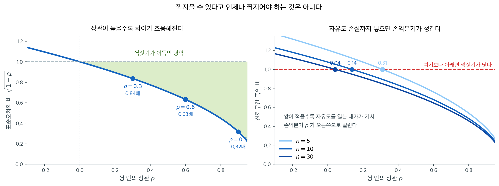

# 대응 평균 검정

## 개요

대응 t-검정은 같은 피험자에게서 얻은 관련된 두 측정값(예: 처리 전후)을 비교한다. 각 쌍에 대해 차이 $D_i = X_i - Y_i$를 계산하면 문제가 그 차이에 대한 일표본 t-검정으로 환원된다. 이 접근은 피험자 간 변동성을 제거하므로, 짝짓기가 의미 있을 때 독립 이표본 검정보다 통계적 검정력이 크다.

## 검정의 구성

**가설:** $\mu_D = E[D_i]$를 대응 차이의 모평균이라 하자.

- 양측: $H_0\colon \mu_D = \mu_{D_0}$ 대 $H_1\colon \mu_D \neq \mu_{D_0}$
- 단측: $H_0\colon \mu_D = \mu_{D_0}$ 대 $H_1\colon \mu_D > \mu_{D_0}$ (또는 $< \mu_{D_0}$)

보통 $\mu_{D_0} = 0$(차이 없음)이다.

**검정통계량:** 쌍이 $n$개이고 평균 차이가 $\bar{D}$, 차이의 표준편차가 $S_D$일 때,

$$
T = \frac{\bar{D} - \mu_{D_0}}{S_D / \sqrt{n}} \sim t_{n-1}.
$$

**짝짓기가 언제 이득인가.** 차이의 분산은

$$
\operatorname{Var}(D) = \sigma_1^2 + \sigma_2^2 - 2\rho\sigma_1\sigma_2
= 2\sigma^2(1 - \rho)
$$

이므로($\sigma_1 = \sigma_2 = \sigma$일 때), 쌍 안의 상관 $\rho$가 클수록 차이가 조용해진다.



왼쪽이 그 $\sqrt{1-\rho}$다. 상관이 $0.9$면 표준오차가 독립 표본의 $0.32$배로 줄어든다. 같은 정밀도를 얻는 데 관측값이 십분의 일이면 된다는 뜻이다.

그런데 공짜가 아니다. 오른쪽이 **자유도까지 셈에 넣은** 그림이다. 쌍 $n$개의 대응 검정은 자유도가 $n-1$인 반면, 각 $n$명인 두 독립 집단은 $2n-2$를 쓴다. 자유도가 적으면 임계값이 커지므로, 상관이 0에 가까우면 짝짓기가 **오히려 손해**다. 손익분기점은 $n = 5$에서 $\rho \approx 0.31$, $n = 10$에서 $0.14$, $n = 30$에서 $0.04$다. **쌍이 적을수록 짝짓기가 더 확실히 이득이어야 값을 한다.**

실무에서 이 계산이 중요한 경우는 드물다. **같은 사람을 두 번 재면 $\rho$는 대개 $0.5$를 훌쩍 넘기 때문이다.** 다만 "짝지을 수 있으니 짝짓는다"가 언제나 옳은 것은 아니며, 짝짓기가 느슨할수록(예컨대 나이만 맞춘 대조군) 이득이 줄어든다는 점은 기억해 둘 만하다.

<div class="exbox" markdown>

**보기 1.** <span class="diff easy" title="쉬움"></span> 대응표본 평균 검정 계산기. 함수가 받는 것은 $(n,\ \bar d,\ s_D)$ 세 수뿐이다. 두 집단의 산포 $\sigma_1, \sigma_2$도 쌍 안의 상관 $\rho$도 받지 않는다.

**(1)** 세 수만으로 충분한 까닭을 적고, $\sigma_1 = \sigma_2 = \sigma$일 때 **짝짓기가 이득이 되는 상관의 문턱** $\rho^*$를 닫힌 꼴로 구하시오.

**(2)** $\rho^*$를 $n = 5, 10, 30$에서 계산해 위 그림의 값과 맞추고, 문턱을 검정력으로 다시 정의하면 어떻게 달라지는지 보이시오.

</div>

??? success "풀이"

    **(1) 해석적으로.** 쌍 $(X_i, Y_i)$가 서로 독립이면 차이 $D_i = X_i - Y_i$는 i.i.d.이고, 대응 검정은 **$D$에 대한 일표본 $t$ 검정 그 자체**다. 일표본 검정이 쓰는 것은 $(n, \bar d, s_D)$ 세 수뿐이므로 함수도 그 셋만 받으면 된다.

    $\sigma_1$, $\sigma_2$, $\rho$가 필요 없어지는 것은 그것들이 사라졌기 때문이 아니라 **$s_D$ 안에 이미 들어와 있기** 때문이다.

    $$
    \operatorname{Var}(D) = \sigma_1^2 + \sigma_2^2 - 2\rho\sigma_1\sigma_2
    $$

    이고 $s_D^2$이 이 값을 추정한다. 세 모수가 각자 무엇이었는지는 알 수 없지만, 검정에 필요한 것은 그 조합 하나뿐이다.

    **문턱을 구한다.** 관측값 $2n$개를 같은 자료로 두고 두 설계를 견준다. $\sigma_1 = \sigma_2 = \sigma$라 하면

    - **대응**: 쌍 $n$개. $\operatorname{sd}(D) = \sigma\sqrt{2(1-\rho)}$이므로 표준오차는 $\sigma\sqrt{2(1-\rho)/n}$, 자유도는 $n-1$이다.
    - **독립 이표본**: 각 $n$명의 두 집단. 표준오차는 $\sigma\sqrt{2/n}$, 자유도는 $2n-2$다.

    유의하다고 선언되는 **관측 차이의 문턱**(임계값 $\times$ 표준오차)을 각각 적으면

    $$
    c_{\text{대응}} = t_{1-\alpha/2,\,n-1}\,\sigma\sqrt{\frac{2(1-\rho)}{n}},
    \qquad
    c_{\text{독립}} = t_{1-\alpha/2,\,2n-2}\,\sigma\sqrt{\frac{2}{n}}
    $$

    이다. $\sigma$와 $\sqrt{2/n}$이 양쪽에 공통이므로 **지워진다.** 두 문턱이 같아지는 조건은

    $$
    t_{1-\alpha/2,\,n-1}\sqrt{1-\rho} = t_{1-\alpha/2,\,2n-2}
    $$

    이고, 양변을 제곱해 $\rho$로 풀면

    $$
    \boxed{\;\rho^* = 1 - \left(\frac{t_{1-\alpha/2,\,2n-2}}{t_{1-\alpha/2,\,n-1}}\right)^{2}\;}
    $$

    이다. 자유도가 크면 $t$ 임계값이 작아지므로 언제나 $t_{2n-2} < t_{n-1}$이고 따라서 $0 < \rho^* < 1$이다. **$\rho > \rho^*$이면 짝짓기가 이득, $\rho < \rho^*$이면 손해다.** 그리고 $n \to \infty$에서 두 임계값이 모두 $z_{1-\alpha/2}$로 가므로 $\rho^* \to 0$, 곧 **쌍이 많으면 상관이 조금만 있어도 짝짓기가 이긴다.**

    **(2) 수치적으로.** 먼저 함수를 만든다.

    ```python
    import math
    from scipy.stats import t as tdist

    def test_paired_mean(n, dbar, sd_d, mu_d0=0.0,
                         alt="two-sided", alpha=0.05):
        """대응 t-검정. 차이 D = X - Y에 대한 일표본 검정과 같다.

        받는 것은 짝의 개수 n, 차이의 평균, 차이의 표준편차뿐이다.
        두 집단의 산포나 상관을 따로 알 필요가 없다. 짝을 지으며 이미 흡수했기 때문이다.
        """
        df = n - 1               # 짝의 개수 - 1. 관측값 2n개가 아니다.
        se = sd_d / math.sqrt(n)
        t = (dbar - mu_d0) / se
        if alt == "two-sided":
            p = 2 * min(tdist.cdf(t, df), 1 - tdist.cdf(t, df))
        elif alt == "less":
            p = tdist.cdf(t, df)
        else:
            p = 1 - tdist.cdf(t, df)
        return t, p, (p < alpha)
    ```

    문턱을 두 가지 기준으로 계산한다. 하나는 (1)의 닫힌 꼴이고, 다른 하나는 두 설계의 **검정력**이 같아지는 $\rho$를 비중심 $t$ 분포로 직접 찾은 것이다.

    ```python
    from scipy import stats
    from scipy.optimize import brentq

    print("  n   t_{n-1}   t_{2n-2}    rho*")
    for n in (5, 10, 30):
        t1 = stats.t.ppf(0.975, n - 1)
        t2 = stats.t.ppf(0.975, 2 * n - 2)
        print(f"{n:4d}   {t1:.4f}    {t2:.4f}    {1 - (t2 / t1)**2:.4f}")


    def pow_paired(n, rho, mu):
        """쌍 n 개, 상관 rho, 참 평균차 mu 일 때 대응 검정의 검정력."""
        nc = mu * math.sqrt(n) / math.sqrt(2 * (1 - rho))
        tc = stats.t.ppf(0.975, n - 1)
        return stats.nct.sf(tc, n - 1, nc) + stats.nct.cdf(-tc, n - 1, nc)


    def pow_two(n, mu):
        """각 n 명인 독립 두 집단의 검정력. 자유도가 2n-2 로 늘어난다."""
        nc = mu * math.sqrt(n) / math.sqrt(2)
        tc = stats.t.ppf(0.975, 2 * n - 2)
        return stats.nct.sf(tc, 2 * n - 2, nc) + stats.nct.cdf(-tc, 2 * n - 2, nc)


    print("\n검정력을 같게 만드는 rho (sigma = 1, 참 mu_D 를 바꾸며)")
    print("   n    mu_D   독립 검정력    rho*")
    for n in (5, 10, 30):
        for mu in (0.5, 1.0, 1.5):
            r = brentq(lambda rr: pow_paired(n, rr, mu) - pow_two(n, mu), -0.5, 0.95)
            print(f"{n:4d}   {mu:.1f}      {pow_two(n, mu):.4f}      {r:.4f}")
    ```

    출력:

    ```
      n   t_{n-1}   t_{2n-2}    rho*
       5   2.7764    2.3060    0.3102
      10   2.2622    2.1009    0.1375
      30   2.0452    2.0017    0.0421

    검정력을 같게 만드는 rho (sigma = 1, 참 mu_D 를 바꾸며)
       n    mu_D   독립 검정력    rho*
       5   0.5      0.1077      0.2191
       5   1.0      0.2863      0.2368
       5   1.5      0.5494      0.2563
      10   0.5      0.1851      0.1052
      10   1.0      0.5620      0.1112
      10   1.5      0.8870      0.1173
      30   0.5      0.4779      0.0335
      30   1.0      0.9677      0.0346
      30   1.5      0.9999      0.0356
    ```

    첫 표의 $0.3102$, $0.1375$, $0.0421$이 위 그림에서 읽은 $0.31$, $0.14$, $0.04$와 같다. 닫힌 꼴이 그림을 그대로 재현한다.

    둘째 표가 이 보기에서 한 걸음 더 나간 부분이다. **검정력을 기준으로 삼으면 문턱이 조금 더 낮다.** $n = 10$에서 $0.1375$ 대신 $0.105$에서 $0.117$ 사이이고, $n = 5$에서는 $0.310$ 대신 $0.219$에서 $0.256$ 사이다. 곧 **(1)의 $\rho^*$는 짝짓기에 조금 불리한 쪽으로 기운 기준이며, 실제로는 그보다 낮은 상관에서도 짝짓기가 이긴다.**

    두 기준이 어긋나는 까닭은 자유도가 다르면 검정력 곡선의 **모양**까지 달라지기 때문이다. (1)은 임계값 하나만 견주었으므로 $\rho^*$가 참 효과크기와 무관한 수로 나오는데, 검정력은 참 $\mu_D$에 의존하므로 문턱도 함께 움직인다. 표에서 $\mu_D$가 커질수록 문턱이 $0.1052 \to 0.1173$으로 올라가는 것이 그 의존성이다.

    실무에는 (1)의 닫힌 꼴로 충분하다. **보수적인 쪽으로 틀리기** 때문이다. $3 \le n \le 200$과 검정력 $0.05$에서 $0.9995$ 사이를 훑어 보면 검정력 기준의 문턱이 $\rho^*$를 넘는 경우가 한 번도 없었다. 그러므로 $\rho > \rho^*$를 확인했다면 검정력 기준으로도 이득이라고 보아도 된다.

<div class="exbox" markdown>

**보기 2.** <span class="diff easy" title="쉬움"></span> 대응 평균 검정 — 방향과 쌍의 개수. 쌍 $n = 12$개에서 $\bar d = 0.4$, $s_D = 1.1$을 얻었다. 보기 1의 함수에 같은 자료를 넣고 대립가설만 바꾸면 $H_1\colon \mu_D < 0$에서 $p = 0.883$, $H_1\colon \mu_D > 0$에서 $p = 0.117$이 나온다.

**(1)** 두 단측 p-값이 정확히 1로 더해지는 까닭을 보이고, 양측 p-값을 이 둘로 쓰시오. 단측 p-값이 $0.5$를 넘는다는 것은 무엇을 뜻하는가.

**(2)** $\bar d = 0.4$와 $s_D = 1.1$을 고정한 채 쌍의 개수만 늘린다. 우측 단측검정이 $p < 0.05$가 되는 가장 작은 $n$을 **정규근사로 예측**하고 정확한 값과 견주시오. 양측에서도 같이 하시오.

</div>

??? success "풀이"

    **(1) 해석적으로.** 검정통계량 $T = (\bar d - \mu_{D_0})/(s_D/\sqrt n)$은 세 대립가설에서 **똑같은 수**다. 달라지는 것은 그 수를 어느 꼬리로 읽는가뿐이다. $F$를 $t_{n-1}$의 분포함수라 하면

    $$
    p_{<} = F(t), \qquad p_{>} = 1 - F(t)
    $$

    이므로 $p_{<} + p_{>} = 1$이다. **$t$ 분포가 연속이라 점질량이 없으므로 이 등식에 오차가 없다.** 그리고 양측 p-값은

    $$
    p_{\ne} = 2\min\{F(t),\, 1 - F(t)\} = 2\min\{p_{<},\, p_{>}\}
    $$

    이다. 여기서는 $2 \times 0.116929 = 0.233858$이다.

    $p_{<} > 0.5$는 $F(t) > 1/2$, 곧 $t > 0$($t_{n-1}$의 중앙값이 0이므로)과 같은 말이다. 그러므로 **단측 p-값이 $0.5$를 넘으면 언제나 자료가 대립가설과 반대 방향에 있다는 뜻이다.** $0.883$은 "증거가 아주 약하다"가 아니라 "$\bar d = 0.4 > 0$인데 $\mu_D < 0$을 검정했다"는 신호다. 이런 경우 올바른 보고는 "기각하지 못했다"가 아니라 **"예상과 반대 방향"**이다.

    **(2) 필요한 쌍의 개수.** 분자와 분모가 고정이므로 $t$는 $\sqrt n$으로만 자란다.

    $$
    t(n) = \frac{\bar d}{s_D}\sqrt n = 0.363636\sqrt n
    $$

    $t_{1-q,\,n-1}$을 표준정규 분위수 $z_q$로 바꾸는 정규근사를 쓰면

    $$
    \frac{\bar d}{s_D}\sqrt n > z_q
    \iff n > \left(\frac{z_q\, s_D}{\bar d}\right)^2
    $$

    이고, 단측($z_{0.95} = 1.644854$)에서 $n > (1.644854 \times 2.75)^2 = 20.4607$, 곧 **$n = 21$**이다. 양측($z_{0.975} = 1.959964$)에서는 $n > 29.0510$, 곧 **$n = 30$**이다.

    **이 두 답은 모두 틀렸다.** $t$ 분포의 임계값은 언제나 정규의 것보다 크므로($t_{1-q,\,\nu} > z_q$), 정규근사는 필요한 표본을 **낙관적으로 과소평가한다.** 바로잡으려면 $t$ 임계값을 그대로 둔 고정점

    $$
    \frac{\bar d}{s_D}\sqrt n = t_{1-q,\,n-1}
    $$

    을 풀면 된다. 아래에서 보듯 단측은 $22.3577$, 양측은 $31.4990$을 주어 올림하면 **23**과 **32**로 정확한 답을 짚는다.

    **수치적으로.**

    ```python
    import numpy as np

    dbar, sd_d = 0.4, 1.1

    t_stat, p_less, rej_less = test_paired_mean(
        n=12, dbar=dbar, sd_d=sd_d, mu_d0=0.0, alt="less"
    )
    t2, p_gre, rej_gre = test_paired_mean(
        n=12, dbar=dbar, sd_d=sd_d, mu_d0=0.0, alt="greater"
    )
    _, p_two, rej_two = test_paired_mean(
        n=12, dbar=dbar, sd_d=sd_d, mu_d0=0.0, alt="two-sided"
    )
    print(f"t = {t_stat:.12f}   (두 호출이 같은가: {t_stat == t2})")
    print(f"  alt='less'      p = {p_less:.12f}  기각 {rej_less}")
    print(f"  alt='greater'   p = {p_gre:.12f}  기각 {rej_gre}")
    print(f"  두 p 의 합       = {p_less + p_gre:.12f}")
    print(f"  alt='two-sided' p = {p_two:.12f}  기각 {rej_two}"
          f"   2*min = {2 * min(p_less, p_gre):.12f}")

    # (2) dbar 와 sd_d 를 고정하고 쌍의 개수만 늘린다.
    d_over_s = dbar / sd_d
    print(f"\nd/s = {d_over_s:.6f}")
    for q, name in ((0.95, "단측"), (0.975, "양측")):
        crit = stats.norm.ppf(q)
        n_norm = (crit / d_over_s) ** 2
        n_fix = brentq(lambda n: d_over_s * math.sqrt(n) - stats.t.ppf(q, n - 1),
                       2.5, 5000)
        print(f"  {name}: 정규근사 n > {n_norm:.4f} → {math.ceil(n_norm):d},"
              f"   t 고정점 n > {n_fix:.4f} → {math.ceil(n_fix):d}")

    # 전수 탐색. "조건을 만족하는 첫 칸" 만 보지 않는다.
    ns = np.arange(2, 2001)
    tt = d_over_s * np.sqrt(ns)
    p_one = stats.t.sf(tt, ns - 1)
    p_dbl = 2 * p_one
    for p, name in ((p_one, "단측"), (p_dbl, "양측")):
        ok = ns[p < 0.05]
        print(f"\n{name}: p<0.05 인 n 의 개수 = {len(ok)},  가장 작은 n = {ok.min()},"
              f"  연속인가 = {bool(np.all(np.diff(ok) == 1))}")
        print(f"      p 가 n 에 대해 단조감소인가 = {bool(np.all(np.diff(p) < 0))}"
              f"   (최대 p = {p.max():.6f} at n = {ns[p.argmax()]})")

    print("\n   n        t      단측 p     양측 p")
    for n in (12, 21, 22, 23, 30, 31, 32):
        t = d_over_s * math.sqrt(n)
        print(f"{n:4d}  {t:.6f}  {stats.t.sf(t, n - 1):.6f}"
              f"  {2 * stats.t.sf(t, n - 1):.6f}")
    ```

    출력:

    ```
    t = 1.259673314596   (두 호출이 같은가: True)
      alt='less'      p = 0.883070909978  기각 False
      alt='greater'   p = 0.116929090022  기각 False
      두 p 의 합       = 1.000000000000
      alt='two-sided' p = 0.233858180045  기각 False   2*min = 0.233858180045

    d/s = 0.363636
      단측: 정규근사 n > 20.4607 → 21,   t 고정점 n > 22.3577 → 23
      양측: 정규근사 n > 29.0510 → 30,   t 고정점 n > 31.4990 → 32

    단측: p<0.05 인 n 의 개수 = 1978,  가장 작은 n = 23,  연속인가 = True
          p 가 n 에 대해 단조감소인가 = True   (최대 p = 0.348806 at n = 2)

    양측: p<0.05 인 n 의 개수 = 1969,  가장 작은 n = 32,  연속인가 = True
          p 가 n 에 대해 단조감소인가 = True   (최대 p = 0.697612 at n = 2)

       n        t      단측 p     양측 p
      12  1.259673  0.116929  0.233858
      21  1.666391  0.055611  0.111221
      22  1.705606  0.051415  0.102831
      23  1.743939  0.047564  0.095128
      30  1.991718  0.027947  0.055894
      31  2.024642  0.025943  0.051885
      32  2.057038  0.024090  0.048180
    ```

    **(1)이 확인된다.** 두 단측 p-값의 합이 소수 열두째 자리까지 $1.000000000000$이고, 양측 p-값이 작은 쪽의 정확히 두 배다. $t$ 통계량은 세 호출에서 모두 같은 $1.259673314596$이다.

    **(2)에서는 정규근사가 두 번 다 모자란다.** 단측에서 근사는 21을 주지만 $n = 21$의 실제 p-값은 $0.055611$로 아직 $0.05$를 넘고, $n = 22$에서도 $0.051415$다. 정확한 답은 **23**이다. 양측에서는 근사가 30을 주지만 $n = 30$에서 $0.055894$, $n = 31$에서 $0.051885$이고 정확한 답은 **32**다. 두 번 모두 두 개씩 모자라며, 이는 $t$ 임계값이 정규보다 크다는 사실의 직접적 귀결이다. $t$ 고정점으로 바로잡으면 $22.3577$과 $31.4990$으로 올림해 정확히 23과 32를 짚는다.

    전수 탐색도 함께 해 두었다. 여기서는 p-값이 $n$에 대해 **단조감소**이고 조건을 만족하는 $n$이 23(또는 32)부터 끊김 없이 이어진다. [일표본 분산 검정](../one_sample_tests/test_variance.md)의 보기 2에서는 p-값이 $n = 8$까지 올라갔다가 내려와 "첫 칸"만 보면 위험했는데, 평균 검정에서는 $\bar d/s_D$를 고정하면 그런 일이 없다. **분모가 자유도에 따라 분포까지 바뀌는 분산 검정과 달리, 여기서는 $t$ 임계값이 $n$에 대해 단조감소하고 $t(n)$은 단조증가하기 때문이다.**

    끝으로 수의 크기를 보아 두자. $\bar d/s_D = 0.364$는 코헨의 $d_z$로 작은 편의 효과다. 쌍 12개로는 양측 $p = 0.234$이고, 같은 효과를 5% 수준에서 잡으려면 **쌍이 32개** 필요하다. 12쌍은 이 효과를 가려낼 설계가 아니었다.

### 해석

$n=12$쌍, $\bar{D}=0.4$, $S_D=1.1$일 때 $H_1\colon \mu_D < 0$에 대한 검정통계량은

$$
T = \frac{0.4 - 0}{1.1/\sqrt{12}} = \frac{0.4}{0.3175} \approx 1.260.
$$

$T > 0$인데 왼쪽 꼬리를 검정하므로($H_1\colon \mu_D < 0$) p-값이 크고 $H_0$을 기각하지 못한다.

## 연습문제

<div class="drillbox" markdown>

**연습문제 1.** <span class="diff easy" title="쉬움"></span> 환자 10명의 혈압을 새 약 투여 전후로 측정했다. 차이(투여 후 $-$ 투여 전)는 $-7, -8, -8, -7, -7, -8, -4, -7, -6, -7$이다. $\alpha = 0.05$에서 이 약이 혈압을 유의하게 낮추는지 검정하라.

</div>

??? success "풀이"

    계산하면 $\bar{D} = -6.9$, $S_D \approx 1.197$, $n = 10$이다.

    $H_0\colon \mu_D = 0$ 대 $H_1\colon \mu_D < 0$을 검정한다:

    $$
    T = \frac{-6.9 - 0}{1.197/\sqrt{10}} = \frac{-6.9}{0.3785} \approx -18.23.
    $$

    $\text{df} = 9$에서 $P(T_9 \leq -18.23) \approx 0$이다. $H_0$을 강하게 기각한다. 이 약이 혈압을 유의하게 낮춘다. $\square$

<div class="drillbox" markdown>

**연습문제 2.** <span class="diff med" title="중간"></span> 짝짓기가 적절할 때 대응 t-검정이 독립 이표본 t-검정보다 강력한 이유를 설명하라.

</div>

??? success "풀이"

    독립 이표본 t-검정에서 평균 차이의 분산은

    $$
    \text{Var}(\bar{X} - \bar{Y}) = \frac{\sigma_X^2}{n} + \frac{\sigma_Y^2}{n}.
    $$

    대응 검정에서 $\bar{D}$의 분산은

    $$
    \text{Var}(\bar{D}) = \frac{\sigma_D^2}{n} = \frac{\sigma_X^2 + \sigma_Y^2 - 2\rho\,\sigma_X\sigma_Y}{n},
    $$

    여기서 $\rho = \text{Corr}(X_i, Y_i)$이다. 짝짓기가 양의 상관을 만들면($\rho > 0$) $\bar{D}$의 분산이 작아져 검정통계량이 커지고 검정력이 높아진다. 감소량은 $2\rho\sigma_X\sigma_Y/n$에 비례한다. $\square$

<div class="drillbox" markdown>

**연습문제 3.** <span class="diff med" title="중간"></span> 대응 t-검정이 차이에 대한 일표본 t-검정과 대수적으로 동등함을 보여라.

</div>

??? success "풀이"

    $i = 1, \dots, n$에 대해 $D_i = X_i - Y_i$로 정의한다. 그러면 $\bar{D} = \bar{X} - \bar{Y}$이고

    $$
    S_D^2 = \frac{1}{n-1}\sum_{i=1}^n (D_i - \bar{D})^2.
    $$

    대응 t-통계량은

    $$
    T_{\text{paired}} = \frac{\bar{D} - 0}{S_D/\sqrt{n}}.
    $$

    표본 $D_1, \dots, D_n$에 귀무값 $\mu_0 = 0$으로 일표본 t-검정을 적용하면

    $$
    T_{\text{one-sample}} = \frac{\bar{D} - 0}{S_D/\sqrt{n}} = T_{\text{paired}}.
    $$

    검정통계량과 자유도($n-1$)가 모두 같으므로 두 검정은 동일하다. $\square$

<div class="drillbox" markdown>

**연습문제 4.** <span class="diff easy" title="쉬움"></span> 어떤 연구가 피험자 8명의 반응시간(ms)을 카페인 조건과 위약 조건에서 측정했다. 대응 차이(카페인 $-$ 위약)는 $-15, -22, -8, -30, -12, -18, -25, -10$이다. 평균 차이의 99% 신뢰구간을 계산하라.

</div>

??? success "풀이"

    계산하면 $\bar{D} = (-15-22-8-30-12-18-25-10)/8 = -140/8 = -17.5$이다.

    $$
    S_D = \sqrt{\frac{\sum(D_i - \bar{D})^2}{7}} = \sqrt{\frac{(2.5)^2+(-4.5)^2+(9.5)^2+(-12.5)^2+(5.5)^2+(-0.5)^2+(-7.5)^2+(7.5)^2}{7}}
    $$

    $$
    = \sqrt{\frac{6.25+20.25+90.25+156.25+30.25+0.25+56.25+56.25}{7}} = \sqrt{\frac{416}{7}} \approx 7.71.
    $$

    99% 신뢰구간은 $\bar{D} \pm t_{0.005,7} \cdot S_D/\sqrt{8}$이다. $t_{0.005,7} = 3.499$이므로:

    $$
    -17.5 \pm 3.499 \times \frac{7.71}{\sqrt{8}} = -17.5 \pm 3.499 \times 2.727 = -17.5 \pm 9.54.
    $$

    99% 신뢰구간은 $(-27.04, -7.96)$이다. 0이 이 구간에 없으므로 $\alpha = 0.01$에서 $H_0\colon \mu_D = 0$을 기각한다. $\square$

<div class="drillbox" markdown>

**연습문제 5.** <span class="diff med" title="중간"></span> 대응 t-검정이 부적절한 조건은 무엇인가? 차이가 정규가 아닐 때의 대안을 제안하라.

</div>

??? success "풀이"

    대응 t-검정의 가정:

    1. 차이 $D_i$가 독립이다(서로 다른 피험자).
    2. 차이가 근사적으로 정규분포를 따른다(또는 $n$이 중심극한정리를 쓸 만큼 크다).

    다음의 경우 부적절하다:

    - 표본이 아주 작고 차이가 분명히 정규가 아닐 때(두꺼운 꼬리, 강한 치우침).
    - 쌍이 자연스럽게 짝지어져 있지 않아 상관 구조가 무의미할 때.

    비모수적 대안은 차이의 중앙값이 0인지 검정하는 **Wilcoxon 부호순위 검정**이다. 절대차이의 순위를 매기고 부호를 부여한 뒤 부호 있는 순위의 합을 검정통계량으로 쓴다. 차이의 분포가 중앙값을 중심으로 대칭이라는 더 약한 가정 아래에서 타당하다. $\square$

<div class="drillbox" markdown>

**연습문제 6.** <span class="diff easy" title="쉬움"></span>
`test_paired_mean`으로 연습문제 1의 자료를 세 가지 대립가설로 모두 검정하고, **차이의 부호를 반대로 잡았을 때** 어떤 일이 벌어지는지 확인하라.

</div>

??? success "풀이"
    ```python
    import math
    import numpy as np
    from scipy.stats import t as tdist

    def test_paired_mean(n, dbar, sd_d, mu_d0=0.0,
                         alt="two-sided", alpha=0.05):
        df = n - 1
        se = sd_d / math.sqrt(n)
        t = (dbar - mu_d0) / se
        if alt == "two-sided":
            p = 2 * min(tdist.cdf(t, df), 1 - tdist.cdf(t, df))
        elif alt == "less":
            p = tdist.cdf(t, df)
        else:
            p = 1 - tdist.cdf(t, df)
        return t, p, bool(p < alpha)

    d = np.array([-7, -8, -8, -7, -7, -8, -4, -7, -6, -7], float)
    m, s = d.mean(), d.std(ddof=1)
    print(f"차이(투여 후 - 투여 전)  평균 {m:.4f}  표준편차 {s:.4f}\n")

    for alt in ["two-sided", "less", "greater"]:
        t, p, rej = test_paired_mean(10, m, s, 0, alt)
        print(f"{alt:10s} t={t:8.4f}  p={p:12.6g}  기각={rej}")

    print("\n부호를 반대로 (투여 전 - 투여 후) 잡으면:")
    for alt in ["less", "greater"]:
        t, p, rej = test_paired_mean(10, -m, s, 0, alt)
        print(f"{alt:10s} t={t:8.4f}  p={p:12.6g}  기각={rej}")
    ```

    ```text
    차이(투여 후 - 투여 전)  평균 -6.9000  표준편차 1.1972

    two-sided  t=-18.2253  p= 2.05724e-08  기각=True
    less       t=-18.2253  p= 1.02862e-08  기각=True
    greater    t=-18.2253  p=           1  기각=False

    부호를 반대로 (투여 전 - 투여 후) 잡으면:
    less       t= 18.2253  p=           1  기각=False
    greater    t= 18.2253  p= 1.02862e-08  기각=True
    ```

    **세 가지 관찰.**

    **1 — $t$ 값은 하나뿐이다.** $-18.2253$. 대립가설은 이 값을 **어떻게 읽을지**만 정한다.

    **2 — 단측 $p$는 양측의 정확히 절반**이다($1.029\times10^{-8}$ 대 $2.057\times10^{-8}$). $t$ 분포가 대칭이기 때문이다.

    **3 — 방향이 틀리면 $p=1$이다.** "혈압이 올라갔는가"($\text{greater}$)를 물으면, 자료가 정반대 방향이므로 $p$가 1에 붙는다. **$p=1$은 "증거 없음"이 아니라 "반대 방향의 압도적 증거"**를 뜻한다.

    **부호 규약이 결정적이다.** $D=\text{투여 전}-\text{투여 후}$로 잡으면 같은 자료로 $\text{less}$가 아니라 $\text{greater}$를 써야 한다. 부호와 대립가설의 방향이 **짝을 이뤄 바뀐다**.

    **실무 규칙 셋.**

    1. **차이의 정의를 코드 주석과 보고문에 명시**한다. "$D=$ 투여 후 $-$ 투여 전"처럼.
    2. **단측 검정의 방향은 자료를 보기 전에 정한다.** 자료를 보고 $p$가 작아지는 쪽을 고르면 실제 수준이 0.05가 아니라 0.10이 된다.
    3. **$p$가 1에 가까우면 부호를 의심**한다. 대개 방향을 반대로 잡은 실수다.

<div class="drillbox" markdown>

**연습문제 7.** <span class="diff med" title="중간"></span>
대응 $t$ 검정의 **표본크기 설계**를 다루자. 측정값 하나의 표준편차가 $\sigma=10$이고 찾고 싶은 평균 차이가 $\delta=3$일 때, 짝 내 상관 $\rho$에 따라 필요한 쌍의 개수를 구하라. 독립 이표본 설계와도 비교하라.

</div>

??? success "풀이"
    **핵심은 $\sigma_D$의 환산이다.** 두 측정값의 표준편차가 각각 $\sigma$이고 상관이 $\rho$이면

    $$
    \sigma_D^2=\operatorname{Var}(X-Y)=2\sigma^2(1-\rho),
    \qquad \sigma_D=\sigma\sqrt{2(1-\rho)}
    $$

    **설계 단계에서 알아야 하는 것은 $\sigma$와 $\rho$**이지 $\sigma_D$가 아니다. 문헌에서 얻기 쉬운 쪽도 이 둘이다.

    ```python
    import numpy as np
    from scipy import stats

    def power_paired(n, delta, sd_d, alpha=0.05):
        """쌍 n개, 참 평균 차이 delta 일 때 양측 대응 t 검정의 검정력."""
        nc = delta / (sd_d / np.sqrt(n))     # 비중심 모수
        df = n - 1
        crit = stats.t.ppf(1 - alpha / 2, df)
        return stats.nct.sf(crit, df, nc) + stats.nct.cdf(-crit, df, nc)

    def n_paired(delta, sigma, rho, power=0.80, alpha=0.05):
        sd_d = sigma * np.sqrt(2 * (1 - rho))
        for n in range(5, 100_000):          # n=5 부터: 극소표본은 수치가 불안정
            if power_paired(n, delta, sd_d, alpha) >= power:
                return n, sd_d, power_paired(n, delta, sd_d, alpha)

    print(f"{'ρ':>5s} {'SD_D':>8s} {'필요 쌍':>8s} {'측정 횟수':>10s} {'검정력':>8s}")
    for rho in [0.0, 0.3, 0.5, 0.7, 0.9]:
        n, sd, pw = n_paired(3.0, 10.0, rho)
        print(f"{rho:5.1f} {sd:8.3f} {n:8d} {2 * n:10d} {pw:8.4f}")

    def n_independent(delta, sigma, power=0.80, alpha=0.05):
        """군당 표본크기."""
        for n in range(5, 100_000):
            nc = delta / (sigma * np.sqrt(2 / n))
            df = 2 * n - 2
            crit = stats.t.ppf(1 - alpha / 2, df)
            if stats.nct.sf(crit, df, nc) + stats.nct.cdf(-crit, df, nc) >= power:
                return n

    n_ind = n_independent(3.0, 10.0)
    print(f"\n독립 이표본: 군당 {n_ind}명, 총 {2 * n_ind}명 (측정 {2 * n_ind}회)")
    ```

    ```text
        ρ     SD_D     필요 쌍      측정 횟수      검정력
      0.0   14.142      177        354   0.8015
      0.3   11.832      125        250   0.8031
      0.5   10.000       90        180   0.8038
      0.7    7.746       55        110   0.8054
      0.9    4.472       20         40   0.8121

    독립 이표본: 군당 176명, 총 352명 (측정 352회)
    ```

    **읽는 법 — 무엇을 세는가에 따라 결론이 달라진다.**

    | 기준 | $\rho=0$ | $\rho=0.9$ |
    |---|---|---|
    | 모집할 **사람** 수 | 177 대 352 → **대응이 절반** | 20 대 352 → **대응이 1/18** |
    | **측정** 횟수 | 354 대 352 → **거의 같음** | 40 대 352 → **대응이 1/9** |

    **$\rho=0$이어도 사람은 절반만 모집하면 된다.** 다만 한 사람이 두 번 측정되므로 총 측정 횟수는 같다. 상관이 없으면 **"측정당 정보"의 이득은 없고 "사람당 정보"의 이득만 있다.**

    **$\rho$가 커질수록 두 기준 모두에서 대응이 압도적**이다. $\rho=0.9$면 20쌍으로 끝난다.

    **어느 비용이 지배하는가.**

    - **모집이 비싸고 측정이 싸다**(희귀질환, 침습적 등록 절차): 대응이 압도적으로 유리하다.
    - **모집이 싸고 측정이 비싸다**(대규모 코호트의 고가 영상검사): $\rho$가 충분히 커야 이득이 있다.

    **주의 — $\rho$를 낙관하지 말 것.** $\rho=0.7$을 가정해 55쌍을 모았는데 실제가 0.5면 필요한 수가 90쌍이고, 검정력이 0.80이 아니라 0.59로 떨어진다.

    ```python
    n, _, _ = n_paired(3.0, 10.0, 0.7)
    sd_actual = 10.0 * np.sqrt(2 * (1 - 0.5))
    print(f"ρ=0.7 가정으로 {n}쌍 모집 → 실제 ρ=0.5 였다면 "
          f"검정력 {power_paired(n, 3.0, sd_actual):.4f}")
    ```

    ```text
    ρ=0.7 가정으로 55쌍 모집 → 실제 ρ=0.5 였다면 검정력 0.5891
    ```

    **$\rho$를 보수적으로 잡는 것이 안전하다.**

<div class="drillbox" markdown>

**연습문제 8.** <span class="diff med" title="중간"></span>
대응 자료로 **동등성**을 주장하려면 어떻게 하는가? $\mu_{D_0}\neq0$인 검정을 두 번 쓰는 TOST 절차를 20쌍 자료에 적용하라.

</div>

??? success "풀이"
    **문제의 출발점.** "차이가 없다"를 보이고 싶은데, $p>0.05$는 **차이가 없다는 증거가 아니다.** 검정력이 낮아서일 수도 있다.

    **TOST(두 단측검정).** 먼저 **동등성 한계** $\Delta$를 정한다. "$|\mu_D|<\Delta$면 실질적으로 같다"는 임상적·실무적 판단이다. 그리고 두 단측검정을

    $$
    H_{01}\colon \mu_D\le-\Delta \quad\text{대}\quad H_{11}\colon \mu_D>-\Delta
    $$

    $$
    H_{02}\colon \mu_D\ge\Delta \quad\text{대}\quad H_{12}\colon \mu_D<\Delta
    $$

    로 세우고 **둘 다** 기각되면 동등성을 인정한다. TOST의 $p$-값은 두 $p$의 **최댓값**이다.

    ```python
    import numpy as np
    from scipy import stats

    d = np.array([-1.2, 0.8, -0.3, 1.5, 0.2, -0.9, 0.6, 1.1, -0.5, 0.4,
                  0.9, -0.2, 1.3, 0.1, -0.7, 0.5, 0.3, -1.0, 0.7, 0.0])
    n, delta_eq = len(d), 1.0          # 동등성 한계 ±1.0
    m, s = d.mean(), d.std(ddof=1)
    se, df = s / np.sqrt(n), n - 1

    t_lo = (m - (-delta_eq)) / se      # H01: μ ≤ -Δ 에 대한 단측
    p_lo = stats.t.sf(t_lo, df)
    t_hi = (m - delta_eq) / se         # H02: μ ≥ +Δ 에 대한 단측
    p_hi = stats.t.cdf(t_hi, df)

    print(f"n={n}  평균 차이 {m:.4f}  SD {s:.4f}  SE {se:.4f}\n")
    print(f"하한 검정  t={t_lo:7.4f}  p={p_lo:.6f}")
    print(f"상한 검정  t={t_hi:7.4f}  p={p_hi:.6f}")
    print(f"TOST p = max = {max(p_lo, p_hi):.6f}  → "
          f"동등성 {'인정' if max(p_lo, p_hi) < 0.05 else '미인정'}\n")

    tc90 = stats.t.ppf(0.95, df)       # TOST 는 90% 구간과 짝을 이룬다
    tc95 = stats.t.ppf(0.975, df)
    print(f"90% CI ({m - tc90 * se:7.4f}, {m + tc90 * se:7.4f})  ← ±1.0 안에 들어감")
    print(f"95% CI ({m - tc95 * se:7.4f}, {m + tc95 * se:7.4f})")
    print(f"보통의 대응 t 검정 p = {stats.ttest_1samp(d, 0).pvalue:.6f}")
    ```

    ```text
    n=20  평균 차이 0.1800  SD 0.7770  SE 0.1738

    하한 검정  t= 6.7913  p=0.000001
    상한 검정  t=-4.7194  p=0.000075
    TOST p = max = 0.000075  → 동등성 인정

    90% CI (-0.1204,  0.4804)  ← ±1.0 안에 들어감
    95% CI (-0.1837,  0.5437)
    보통의 대응 t 검정 p = 0.313225
    ```

    **두 결론이 함께 성립한다.**

    - 보통의 검정: $p=0.313$ → "차이가 있다고 할 수 없다."
    - TOST: $p=0.000075$ → **"차이가 $\pm1.0$보다 작다고 단언할 수 있다."**

    앞의 것은 소극적 진술이고, 뒤의 것이 **적극적 주장**이다. 동등성을 말하려면 TOST가 필요하다.

    **90% 구간과의 대응.** $\alpha=0.05$의 TOST는 **$100(1-2\alpha)\%=90\%$ 신뢰구간이 $(-\Delta,\Delta)$ 안에 완전히 들어가는 것**과 동치다. 여기서 $(-0.120,\ 0.480)\subset(-1,1)$이므로 동등하다. 95%가 아니라 **90%**라는 점이 자주 틀리는 대목이다.

    **$\Delta$가 전부다.** $\Delta$를 크게 잡으면 동등성을 쉽게 인정한다. 따라서

    1. **자료를 보기 전에** 정하고 사전등록한다.
    2. **임상적·실무적 근거**를 댄다(최소 임상적 중요 차이 등). 통계로 정하는 값이 아니다.
    3. **보고할 때 $\Delta$와 그 근거를 함께** 쓴다.

    **비열등성은 한쪽만 쓴다.** "새 치료가 기존보다 $\Delta$ 이상 나쁘지는 않다"를 주장하려면 위의 하한 검정 하나만 하면 된다.

<div class="drillbox" markdown>

**연습문제 9.** <span class="diff hard" title="어려움"></span>
예비연구에서 추정한 $S_D$로 본연구의 표본크기를 정하면, 실제로 얻는 검정력이 목표에 못 미치는 일이 잦다. 그 정도를 모의실험으로 재고 대책을 제시하라.

</div>

??? success "풀이"
    **문제의 구조.** 표본크기 공식은 $\sigma_D$를 **알려진 값**으로 취급한다. 실제로는 예비연구의 $S_D$를 꽂아 넣는데, 이 값 자체가 확률변수다.

    $$
    \frac{(m-1)S_D^2}{\sigma_D^2}\sim\chi^2_{m-1}
    $$

    예비 표본 $m$이 작으면 $S_D$가 크게 흔들린다. **$S_D$가 우연히 작게 나오면 $n$을 적게 잡고, 그 결과 실제 검정력이 목표에 못 미친다.**

    ```python
    import numpy as np
    from scipy import stats

    def power_paired(n, delta, sd_d, alpha=0.05):
        nc = delta / (sd_d / np.sqrt(n))
        df = n - 1
        crit = stats.t.ppf(1 - alpha / 2, df)
        return stats.nct.sf(crit, df, nc) + stats.nct.cdf(-crit, df, nc)

    def n_for(delta, sd_d, power=0.80, alpha=0.05):
        for n in range(5, 100_000):
            if power_paired(n, delta, sd_d, alpha) >= power:
                return n
        return 100_000

    delta, sd_true = 3.0, 8.0
    print(f"참 SD_D={sd_true} 를 안다면 필요한 쌍 = {n_for(delta, sd_true)}\n")

    rng = np.random.default_rng(7)
    print(f"{'예비 m':>7s} {'계획 n 중앙값':>13s} {'5~95%':>12s} "
          f"{'실제 검정력':>12s} {'0.8 미달':>9s}")
    for m in [10, 20, 40]:
        ns, pws = [], []
        for _ in range(2_000):
            # 예비연구의 S_D 를 카이제곱 분포에서 생성
            s = sd_true * np.sqrt(stats.chi2.rvs(m - 1, random_state=rng) / (m - 1))
            n = n_for(delta, s)
            ns.append(n)
            pws.append(power_paired(n, delta, sd_true))   # 실제 SD 로 평가
        ns, pws = np.array(ns), np.array(pws)
        print(f"{m:7d} {np.median(ns):13.0f} "
              f"{np.percentile(ns, 5):5.0f}~{np.percentile(ns, 95):<6.0f} "
              f"{pws.mean():12.3f} {np.mean(pws < 0.8):9.3f}")
    ```

    ```text
    참 SD_D=8.0 를 안다면 필요한 쌍 = 58

       예비 m      계획 n 중앙값        5~95%       실제 검정력    0.8 미달
         10            52    22~107           0.731     0.590
         20            57    32~91            0.770     0.522
         40            58    39~81            0.790     0.497
    ```

    **세 가지 사실.**

    **1 — 계획한 $n$이 엄청나게 흔들린다.** 예비 10쌍이면 90% 범위가 **22~107쌍**이다. 참값 58쌍의 0.4배에서 1.8배까지.

    **2 — 평균 검정력이 목표에 못 미친다.** 0.80을 목표했는데 예비 10쌍이면 평균 0.731이다.

    **3 — 절반 이상이 0.80에 못 미친다.** 예비 40쌍으로 늘려도 미달 비율이 0.497이다. **이것은 없앨 수 없다.** $n$이 $\sigma_D$의 증가함수라서, $S_D$가 참값보다 작을 확률(약 절반)만큼 미달이 생긴다.

    **왜 $m$을 키워도 미달 비율이 0.5 근처인가.** 큰 $m$은 편차의 **크기**를 줄일 뿐 **방향**의 확률을 바꾸지 않는다. $m=40$의 미달은 대개 0.79 같은 미세한 미달이고, $m=10$의 미달은 0.5까지 떨어질 수 있다. **평균 검정력이 0.731에서 0.790으로 개선된 것**이 진짜 이득이다.

    **대책 넷.**

    1. **$S_D$의 상한신뢰한계를 쓴다.** $S_D$ 대신 $S_D\sqrt{(m-1)/\chi^2_{1-\gamma,\,m-1}}$을 꽂으면 보수적이다.

        ```python
        m, s_obs = 10, 8.0
        s_upper = s_obs * np.sqrt((m - 1) / stats.chi2.ppf(0.20, m - 1))
        print(f"S_D={s_obs} 의 80% 상한 = {s_upper:.3f} → "
              f"필요한 쌍 {n_for(3.0, s_upper)} (점추정으로는 {n_for(3.0, s_obs)})")
        ```

        ```text
        S_D=8.0 의 80% 상한 = 10.347 → 필요한 쌍 96 (점추정으로는 58)
        ```

        66% 더 모집하는 대신 검정력 미달 위험을 크게 줄인다. 비용이 만만치 않으므로 상한의 신뢰수준($\gamma$)을 얼마로 할지는 예산과의 타협이다.

    2. **보증(assurance)을 쓴다.** $S_D$의 사후분포에 대해 검정력을 평균한 값을 목표로 삼는다.
    3. **내부 예비연구를 한다.** 본연구 도중 눈가림 상태로 $S_D$를 다시 추정해 $n$을 조정한다. 처리군 정보를 보지 않으므로 제1종 오류가 거의 부풀지 않는다.
    4. **군순차 설계를 쓴다.** 중간분석으로 조기 종료·표본 재계산을 하되, 경계는 사전에 정한다.

    **가장 중요한 것.** 예비연구의 $S_D$ 하나를 믿고 계산한 $n$은 **점추정일 뿐**이다. 표본크기 계산 결과는 항상 **범위**로 제시하고, 민감도 분석을 함께 보고한다.

<div class="drillbox" markdown>

**연습문제 10.** <span class="diff easy" title="쉬움"></span>
대응 $t$ 검정 결과의 **보고 양식**을 정리하고, 자주 빠지는 항목을 지적하라.

</div>

??? success "풀이"

    **보고해야 할 것.**

    | 항목 | 예시 | 왜 필요한가 |
    |---|---|---|
    | 차이의 **정의** | $D=$ 투여 후 $-$ 투여 전 | 부호 해석의 전제 |
    | 쌍의 **개수** | $n=10$쌍 | 자유도의 근거 |
    | **평균 차이** | $-6.90$ mmHg | 주된 결과 |
    | **신뢰구간** | 95% CI $(-7.76,\ -6.04)$ | 불확실성의 크기 |
    | **표준편차** 또는 SE | $S_D=1.20$, SE $=0.379$ | 재분석·메타분석의 재료 |
    | **검정통계량과 자유도** | $t(9)=-18.23$ | 검증 가능성 |
    | **$p$-값** | $p<0.001$ | 관행 |
    | **효과크기** | $d_z=-5.76$ | 척도 무관 비교 |
    | **정규성 점검** | 차이의 그림 확인 | 가정의 타당성 |

    **문장 예시.**

    > 새 약 투여 전후 수축기 혈압을 10명에게서 측정했다. 차이($D=$ 투여 후 $-$ 투여 전)의 평균은 $-6.90$ mmHg($S_D=1.20$), 95% 신뢰구간은 $(-7.76,\ -6.04)$였다. 대응 $t$ 검정 결과 $t(9)=-18.23$, $p<0.001$로 통계적으로 유의했다($d_z=-5.76$). 차이의 정규분위수그림에서 뚜렷한 이탈은 없었다.

    ```python
    import numpy as np
    from scipy import stats

    d = np.array([-7, -8, -8, -7, -7, -8, -4, -7, -6, -7], float)
    n = len(d)
    m, s = d.mean(), d.std(ddof=1)
    se = s / np.sqrt(n)
    t, p = stats.ttest_1samp(d, 0)
    tc = stats.t.ppf(0.975, n - 1)
    print(f"n={n}  평균 차이 {m:.2f}  SD {s:.2f}  SE {se:.3f}")
    print(f"95% CI ({m - tc * se:.2f}, {m + tc * se:.2f})")
    print(f"t({n - 1}) = {t:.2f},  p = {p:.3g}")
    print(f"d_z = {m / s:.2f}")
    ```

    ```text
    n=10  평균 차이 -6.90  SD 1.20  SE 0.379
    95% CI (-7.76, -6.04)
    t(9) = -18.23,  p = 2.06e-08
    d_z = -5.76
    ```

    **자주 빠지는 항목 여섯.**

    1. **차이의 방향.** "유의하게 감소"만 쓰고 $D$의 정의를 안 밝힌다. 독자가 부호를 뒤집어 읽을 수 있다.
    2. **신뢰구간.** $p$-값만 쓴다. **$p$는 "0인가"만 답하고, 구간은 "얼마나 큰가"를 답한다.** 후자가 대개 더 중요하다.
    3. **$S_D$.** 메타분석에 쓰려면 반드시 필요한데 자주 빠진다. $S_D$가 없으면 $\rho$를 역산할 수도 없다.
    4. **탈락과 결측.** "10명"이 모집한 수인지 분석에 쓴 수인지 밝힌다.
    5. **정규성 점검.** 했는지 여부만이라도 쓴다. $n$이 작을수록 중요하다.
    6. **단측인지 양측인지, 그리고 사전에 정했는지.**

    **주의 — 이 예시의 $d_z=-5.76$은 비현실적으로 크다.** 실제 혈압 자료에서 개인차가 이렇게 작을 리 없다. 연습문제용으로 만든 숫자이므로, **효과크기가 상식을 벗어나면 자료 생성 과정을 의심**하는 습관을 들이자.

    **마지막으로 — 대조군이 없다.** 이 설계는 "투여 전후"만 비교하므로, 관측된 감소가 약 때문인지 평균으로의 회귀·자연 경과·측정 반복 효과 때문인지 **구분할 수 없다.** 통계적 유의성은 인과를 만들어 주지 않는다. 인과를 말하려면 무작위 대조군이 필요하다.

---

## 정리하며

대응 검정의 **구현은 일표본 검정의 재사용**이다.

- **차이를 만들고 일표본 $t$ 검정을 호출하면 끝난다.** `ttest_1samp(x - y, 0)` 과 `ttest_rel(x, y)` 가 같은 답을 준다.
- **$\mu_{D_0}\ne0$ 도 가능하다.** "차이가 5 이상인가" 같은 가설이며, 그때는 `ttest_1samp(d, 5)` 처럼 귀무값을 넣는다.
- **결측 처리에 주의한다.** 한쪽만 있는 쌍은 차이를 만들 수 없으므로 버려야 하며, 그 개수를 보고해야 한다. **한쪽씩 따로 평균 내는 것은 대응 분석이 아니다.**
- **검정력 이득이 구현에서도 확인된다.** 같은 자료를 독립 이표본으로 돌려 보면 $p$ 값이 커지는 것을 볼 수 있다.
- **차이의 정규성을 확인한다.** 쌍이 적으면 16장의 윌콕슨 부호순위검정이 대안이다.

다음 절부터 **오류와 검정력**으로 넘어간다. 지금까지 $p$ 값만 보았다면 이제 **놓치는 쪽의 위험**을 다룬다.
