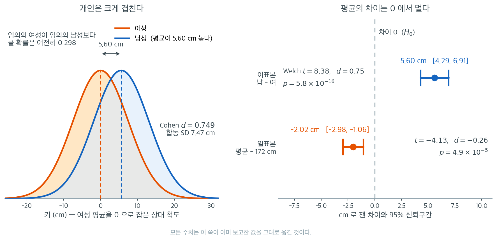

# 키/몸무게 가설검정

## 개요

이 페이지에서는 키와 비율 자료로 기초적인 가설검정 흐름 세 가지를 훑는다: 모평균에 대한 일표본 $t$-검정, 두 모평균을 비교하는 (분산을 아는) 이표본 $z$-검정, 그리고 거절률을 비교하는 두 비율 $z$-검정. 각 검정은 같은 네 단계 틀을 따른다: 가설을 세우고, 검정통계량을 계산하고, p-값을 구하고, 판정한다.

## 일표본 t-검정

남성의 평균 키가 주장된 값 $\mu_0$과 같은지 검정한다.

**가설:**

$$
H_0\colon \mu = \mu_0, \qquad H_1\colon \mu \neq \mu_0.
$$

**검정통계량:** 크기 $n$인 표본의 평균이 $\bar{x}$, 표준편차가 $s$일 때

$$
t = \frac{\bar{x} - \mu_0}{s / \sqrt{n}},
$$

이고 $H_0$ 아래에서 자유도 $n - 1$인 $t$-분포를 따른다.

**판정 규칙:** $|t| > t_{\alpha/2,\, n-1}$이면 $H_0$을 기각한다.

<div class="exbox" markdown>

**보기 1.** <span class="diff easy" title="쉬움"></span> 키 자료로 하는 일표본 검정. 참 평균이 $170$, 참 표준편차가 $8$인 모집단에서 $250$명을 뽑아 $H_0\colon \mu = 172$를 양측으로 검정한다. **우리는 참값을 알지만 검정은 모르는 척한다.**

**(1)** 참값을 아는 입장에서 이 검정의 **검정력**을 비중심 $t$로 계산하시오. 관측된 $t = -4.1314$는 그 분포에서 흔한 값인가.

**(2)** $2$ cm의 차이를 검정력 $80\%$로 잡는 데 필요한 $n$을 정규근사와 정확한 계산으로 각각 구하시오.

</div>

??? success "풀이"

    **(1) 해석적으로.** 참 평균이 $\mu = 170$, $\mu_0 = 172$, $\sigma = 8$, $n = 250$이므로 비중심모수는

    $$
    \lambda = \frac{\mu - \mu_0}{\sigma/\sqrt n} = \frac{-2}{8/\sqrt{250}} = -3.952847
    $$

    이고 $t$ 통계량은 자유도 $249$, 비중심모수 $\lambda$인 비중심 $t$ 분포를 따른다. 임계값이 $t_{0.975,\,249} = 1.969537$이므로

    $$
    \text{검정력} = P\bigl(T'_{249,\,\lambda} < -1.969537\bigr)
    + P\bigl(T'_{249,\,\lambda} > 1.969537\bigr) = 0.976013
    $$

    이다. **$250$명이면 2 cm의 어긋남을 $97.6\%$의 확률로 잡는다.** 관측값 $t = -4.1314$는 $\lambda = -3.9528$에서 $0.18$ 떨어져 있을 뿐이고(비중심 $t$의 척도는 1 근처다), 이 분포의 $43$번째 백분위수다. **전혀 특별한 표본이 아니다.** 검정이 $H_0$를 기각한 것은 운이 좋았기 때문이 아니라 설계가 충분했기 때문이다.

    **(2) 필요한 표본크기.** 정규근사에서는

    $$
    n \ge \frac{(z_{0.975} + z_{0.80})^2 \sigma^2}{\delta^2}
    = \frac{(1.959964 + 0.841621)^2 \times 64}{4} = 125.582
    $$

    이므로 $126$이다. 정확한 비중심 $t$ 계산은 $n = 126$에서 검정력 $0.79522$, $n = 127$에서 $0.79838$을 주어 둘 다 모자라고, $n = 128$에서 $0.80151$로 처음 넘는다. **정확한 답은 $128$이고 정규근사는 둘 모자란다.** 임계값을 $z$로 바꾼 만큼 낙관적으로 나오는 것이며, 평균 검정에서 늘 같은 방향이다.

    **수치적으로.**

    ```python
    import numpy as np
    from scipy import stats

    np.random.seed(42)

    # 참 평균이 170 인 모집단에서 250명을 뽑았다. 우리는 이 사실을 모른다고 하고,
    # "평균 키가 172 인가"를 자료만으로 판단해 본다.
    data = stats.norm.rvs(loc=170, scale=8, size=250)

    mu0 = 172
    n = len(data)
    xbar = data.mean()
    s = data.std(ddof=1)
    se = s / np.sqrt(n)
    df = n - 1

    t_stat = (xbar - mu0) / se
    p_val = 2 * stats.t.cdf(-abs(t_stat), df)
    t_crit = stats.t.ppf(1 - 0.05 / 2, df)

    print(f"x-bar = {xbar:.2f}, s = {s:.2f}, SE = {se:.2f}")
    print(f"t = {t_stat:.4f}, p = {p_val:.4f}, t_crit = {t_crit:.4f}")
    print("Reject H0" if abs(t_stat) > t_crit else "Fail to reject H0")
    ```

    출력:

    ```
    x-bar = 169.98, s = 7.73, SE = 0.49
    t = -4.1314, p = 0.0000, t_crit = 1.9695
    Reject H0
    ```

    ```python
    # 자료를 만든 쪽의 참값을 쓴다. mu = 170, sigma = 8.
    lam = (170 - mu0) * np.sqrt(n) / 8          # 비중심모수
    power = (stats.nct.cdf(-t_crit, df, lam)
             + stats.nct.sf(t_crit, df, lam))
    print(f"비중심모수 lambda = {lam:.6f},  임계값 {t_crit:.6f}")
    print(f"이 설계의 검정력 = {power:.6f}")
    print(f"관측된 t = {t_stat:.6f}  →  비중심 t 분포에서의 분위수 "
          f"{stats.nct.cdf(t_stat, df, lam):.4f}")
    print(f"  (E[t] 근사값 lambda = {lam:.4f},  관측값과의 거리 "
          f"{t_stat - lam:+.4f})")

    # 2 cm 를 검정력 80% 로 잡는 데 필요한 n
    za, zb = stats.norm.ppf(0.975), stats.norm.ppf(0.80)
    n_norm = (za + zb) ** 2 * 8**2 / 2**2
    print(f"\n정규근사가 주는 n = {n_norm:.4f}  →  {int(np.ceil(n_norm))}")


    def power_one_sample(m, delta=2.0, sigma=8.0, alpha=0.05):
        lam = delta * np.sqrt(m) / sigma
        c = stats.t.ppf(1 - alpha / 2, m - 1)
        return stats.nct.sf(c, m - 1, lam) + stats.nct.cdf(-c, m - 1, lam)


    print("   n     검정력")
    for m in (124, 125, 126, 127, 128, 250):
        print(f"{m:4d}   {power_one_sample(m):.5f}")
    # n = 4 에서 scipy 의 비중심 t 가 경고를 내므로 5 부터 훑는다.
    ms = np.arange(5, 1001)
    pw = np.array([power_one_sample(int(k)) for k in ms])
    ok = ms[pw >= 0.80]
    print(f"\n검정력 >= 0.80 인 가장 작은 n = {ok.min()},  개수 = {len(ok)},"
          f"  연속인가 = {bool(np.all(np.diff(ok) == 1))}")
    ```

    출력:

    ```
    비중심모수 lambda = -3.952847,  임계값 1.969537
    이 설계의 검정력 = 0.976013
    관측된 t = -4.131402  →  비중심 t 분포에서의 분위수 0.4319
      (E[t] 근사값 lambda = -3.9528,  관측값과의 거리 -0.1786)

    정규근사가 주는 n = 125.5821  →  126
       n     검정력
     124   0.78876
     125   0.79201
     126   0.79522
     127   0.79838
     128   0.80151
     250   0.97601

    검정력 >= 0.80 인 가장 작은 n = 128,  개수 = 873,  연속인가 = True
    ```

    **두 답이 모두 확인된다.** 검정력 $0.976013$, 관측된 $t$의 분위수 $0.4319$로 이 표본은 평범하다. 필요한 $n$은 정확히 $128$이고 조건을 만족하는 $n$이 끊김 없이 이어진다.

    여기서 표준오차가 $0.49$ cm라는 점이 중요하다. $n = 250$이라 개인의 산포 $7.73$ cm가 표본평균 수준에서는 $0.49$ cm로 줄어든다. 그래서 2 cm 차이가 표준오차의 네 배가 넘는 큰 차이가 된다. **같은 2 cm가 개인에게는 눈에 띄지 않는 차이이고 평균에게는 압도적인 차이다.** 그 둘을 가르는 것이 $\sqrt{n}$뿐이다.

## 이표본 z-검정 (분산을 아는 경우)

모표준편차 $\sigma_x$와 $\sigma_y$를 알 때 두 평균을 다음으로 비교한다.

$$
z = \frac{\bar{x} - \bar{y} - D_0}{\sqrt{\dfrac{\sigma_x^2}{n_1} + \dfrac{\sigma_y^2}{n_2}}},
$$

여기서 $D_0$은 가설의 차이(보통 0)이다. $H_0\colon \mu_x - \mu_y = D_0$ 아래에서 $z \sim N(0,1)$이다.

<div class="exbox" markdown>

**보기 2.** <span class="diff easy" title="쉬움"></span> 남녀 키의 이표본 검정. 참 평균이 $170$과 $165$, 참 표준편차가 $8$과 $7$인 두 모집단에서 각 $250$명을 뽑아 $\sigma$를 안다고 가정한 $z$ 검정을 한다.

**(1)** $H_1$이 참일 때 $z$ 통계량이 따르는 분포를 적고, 관측값 $8.3297$이 그 분포에서 어디쯤인지 말하시오. 이 설계의 검정력은 얼마인가.

**(2)** $5$ cm 차이를 검정력 $80\%$로 잡는 데 집단당 몇 명이면 되는가. $250$명은 얼마나 과한 설계인가.

</div>

??? success "풀이"

    **(1) 해석적으로.** $\sigma$를 알면 표준오차가 **자료에 의존하지 않는 상수**다.

    $$
    \text{SE} = \sqrt{\frac{64}{250} + \frac{49}{250}} = \sqrt{0.452} = 0.672309
    $$

    분자 $\bar X - \bar Y$는 평균 $\delta = 5$, 분산 $\text{SE}^2$인 정규변수이므로

    $$
    z = \frac{\bar X - \bar Y}{\text{SE}} \sim N\!\left(\frac{\delta}{\text{SE}},\, 1\right)
    = N(7.437051,\, 1)
    $$

    이다. **분산이 정확히 1인 정규분포이므로 "$z$가 기댓값에서 몇 떨어졌는가"가 곧 표준편차 몇 개인가다.** 관측값 $8.3297$은 $+0.89$로, 완전히 평범한 값이다.

    검정력은

    $$
    \Phi(-1.959964 - 7.437051) + \bigl[1 - \Phi(1.959964 - 7.437051)\bigr] = 0.99999998
    $$

    로 사실상 1이다.

    **(2) 필요한 표본크기.** $\sigma$를 알므로 자유도 보정이 없어 닫힌 꼴이 정확하다.

    $$
    n \ge \frac{(z_{0.975}+z_{0.80})^2(\sigma_x^2+\sigma_y^2)}{\delta^2}
    = \frac{7.848932 \times 113}{25} = 35.477
    $$

    이므로 **집단당 36명**이면 된다. $250$명은 그 $6.9$배다. 이 설계는 5 cm를 잡기에 턱없이 과하고, 그래서 p-값이 $10^{-17}$ 수준으로 나온다. **$p$가 작다는 것은 효과가 크다는 뜻이 아니라 설계가 과했다는 뜻이기도 하다.**

    **수치적으로.**

    ```python
    male = stats.norm.rvs(loc=170, scale=8, size=250)
    female = stats.norm.rvs(loc=165, scale=7, size=250)

    sigma_x, sigma_y = 8, 7
    n1, n2 = len(male), len(female)
    # sigma를 안다고 가정하므로 표본에서 추정하지 않는다.
    # 그래서 자유도라는 개념도 없고 정규분포를 그대로 쓴다.
    se = np.sqrt(sigma_x**2 / n1 + sigma_y**2 / n2)
    z = (male.mean() - female.mean()) / se
    p = 2 * stats.norm.cdf(-abs(z))

    print(f"z = {z:.4f}, p = {p:.6f}")
    ```

    출력:

    ```
    z = 8.3297, p = 0.000000
    ```

    ```python
    delta = 170 - 165          # 자료를 만든 참 차이
    mu_z = delta / se          # H1 아래에서 z 의 기댓값
    print(f"SE = {se:.6f}")
    print(f"H1 아래 z 의 분포 = N({mu_z:.4f}, 1)")
    print(f"관측된 z = {z:.4f}  →  기댓값에서 {z - mu_z:+.4f} 만큼 떨어져 있다")
    print(f"이 설계의 검정력 = "
          f"{stats.norm.sf(1.959964 - mu_z) + stats.norm.cdf(-1.959964 - mu_z):.9f}")
    print(f"양측 p-값(정확) = {2 * stats.norm.sf(abs(z)):.3e}")

    za, zb = stats.norm.ppf(0.975), stats.norm.ppf(0.80)
    n_norm = (za + zb) ** 2 * (sigma_x**2 + sigma_y**2) / delta**2
    print(f"\n검정력 80% 에 필요한 집단당 n = {n_norm:.4f}  →  {int(np.ceil(n_norm))}")
    print("   n    검정력")
    for m in (34, 35, 36, 37, 250):
        s_m = np.sqrt(sigma_x**2 / m + sigma_y**2 / m)
        print(f"{m:4d}   {stats.norm.sf(1.959964 - delta / s_m) + stats.norm.cdf(-1.959964 - delta / s_m):.5f}")
    print(f"실제 쓴 250 명은 필요량의 {250 / np.ceil(n_norm):.1f} 배다")
    ```

    출력:

    ```
    SE = 0.672309
    H1 아래 z 의 분포 = N(7.4371, 1)
    관측된 z = 8.3297  →  기댓값에서 +0.8927 만큼 떨어져 있다
    이 설계의 검정력 = 0.999999978
    양측 p-값(정확) = 8.103e-17

    검정력 80% 에 필요한 집단당 n = 35.4769  →  36
       n    검정력
      34   0.78310
      35   0.79467
      36   0.80571
      37   0.81624
     250   1.00000
    실제 쓴 250 명은 필요량의 6.9 배다
    ```

    **$z = 8.33$은 표준정규분포에서 사실상 불가능한 값**이지만, $H_1$이 참인 이 자료에서는 기댓값 $7.44$에서 $0.89$ 떨어진 평범한 값이다. 두 문장이 모두 옳다. **p-값은 전자의 관점에서 계산되고, 설계의 적절성은 후자의 관점에서 판단한다.**

    출력의 `p = 0.000000`은 반올림이고 실제 값은 $8.1 \times 10^{-17}$이다. 이런 자리에서는 `:.6f` 대신 지수 꼴로 찍는 것이 맞다.

    필요한 표본은 집단당 36명으로 확인되었고, 250명에서는 검정력이 `1.00000`으로 찍힌다. 이 설계가 과했다는 것이 수로 드러난다.

모분산을 모르면 Welch $t$-검정이 알려진 $\sigma$ 대신 표본추정값을 쓰고 자유도를 조정한다:

<div class="exbox" markdown>

**보기 3.** <span class="diff easy" title="쉬움"></span> Welch 검정. 같은 자료에 $\sigma$를 모르는 척하고 Welch $t$ 검정을 걸면 $t = 8.3773$이 나온다. 보기 2의 $z = 8.3297$과 $0.6\%$만 다르다.

**(1)** 두 통계량의 비 $t/z$가 무엇으로 정해지는지 적고, 이 표본에서 그 값을 구하시오.

**(2)** Welch 자유도를 균형 설계의 공식으로 구해 범위 검사를 하고, 자유도가 $488$이나 되는 것이 p-값에 얼마나 영향을 주는지 보시오.

</div>

??? success "풀이"

    **(1) 해석적으로.** 두 통계량의 분자는 같은 $\bar x - \bar y$이고 분모만 다르다. 그러므로

    $$
    \frac{t_{\text{welch}}}{z}
    = \frac{\text{SE}_{\text{known}}}{\text{SE}_{\text{welch}}}
    = \sqrt{\frac{\sigma_x^2/n_1 + \sigma_y^2/n_2}{s_x^2/n_1 + s_y^2/n_2}}
    $$

    이다. **이 비는 오로지 $s_i$가 $\sigma_i$를 얼마나 잘 맞추었는지로 정해진다.** 정규모집단에서 $s/\sigma$의 표준편차는 대략

    $$
    \operatorname{sd}\!\left(\frac{s}{\sigma}\right) \approx \frac{1}{\sqrt{2(n-1)}}
    = \frac{1}{\sqrt{498}} = 0.0448
    $$

    이므로 $n = 250$이면 $s$가 $\sigma$에서 $4.5\%$ 안쪽에 있다. 이 표본에서는 $s_x/\sigma_x = 0.9981$, $s_y/\sigma_y = 0.9894$로 더 가깝고, 그래서 두 통계량이 $0.6\%$만 다르다. **"$\sigma$를 안다"는 정보가 $n = 250$에서 사실상 아무 값도 갖지 못하는 까닭이 이 한 줄이다.**

    **(2) 자유도.** 집단크기가 같으므로 [이표본 t-검정](t_test_two_means.md)의 보기 2에서 얻은 균형 공식을 쓸 수 있다.

    $$
    \nu = (n-1)\frac{(1+\rho)^2}{1+\rho^2},
    \qquad \rho = \frac{s_y^2}{s_x^2}
    $$

    범위는 $n-1 = 249$에서 $2(n-1) = 498$ 사이다. 여기서는 $\nu = 488.25$로 상한에 가깝다. 두 분산이 꽤 비슷하기 때문이다.

    **그리고 자유도가 이만큼 크면 $t$와 정규가 거의 같다.** 임계값이 $1.9648$ 대 $1.9600$으로 $0.25\%$ 차이이고, p-값도 $5.79\times10^{-16}$ 대 $5.41\times10^{-17}$이다. 비율로는 열 배지만 **둘 다 "일어나지 않는 일"이라는 같은 뜻이고, 판정에는 아무 영향이 없다.** 꼬리의 극단에서는 작은 자유도 차이가 p-값의 자릿수를 바꾸므로, 이런 자리의 p-값을 자릿수까지 보고하는 것은 의미가 없다.

    **수치적으로.**

    ```python
    # equal_var=False 가 Welch 검정이다. 두 분산이 같다고 보지 않으므로
    # 자유도가 정수가 아닌 값으로 나온다.
    t_w, p_w = stats.ttest_ind(male, female, equal_var=False)
    print(f"Welch t = {t_w:.4f}, p = {p_w:.6f}")
    ```

    출력:

    ```
    Welch t = 8.3773, p = 0.000000
    ```

    ```python
    v1, v2 = male.var(ddof=1), female.var(ddof=1)
    se_w = np.sqrt(v1 / n1 + v2 / n2)
    print(f"표본표준편차 {np.sqrt(v1):.6f} (참 8),  {np.sqrt(v2):.6f} (참 7)")
    print(f"  s/sigma = {np.sqrt(v1) / 8:.6f},  {np.sqrt(v2) / 7:.6f}"
          f"   (sd 는 약 1/sqrt(2(n-1)) = {1 / np.sqrt(2 * (n1 - 1)):.6f})")
    print(f"SE(sigma 를 아는 경우) = {se:.6f}")
    print(f"SE(Welch)              = {se_w:.6f}")
    print(f"  비 SE_welch/SE = {se_w / se:.6f},  따라서 t/z = {se / se_w:.6f}")
    print(f"관측된 t/z = {t_w / z:.6f}")

    rho = v2 / v1
    nu_formula = (n1 - 1) * (1 + rho) ** 2 / (1 + rho**2)
    nu_direct = ((v1 / n1 + v2 / n2) ** 2
                 / ((v1 / n1) ** 2 / (n1 - 1) + (v2 / n2) ** 2 / (n2 - 1)))
    print(f"\nWelch 자유도: 균형 공식 {nu_formula:.6f},  정의대로 {nu_direct:.6f}")
    print(f"  범위 [{min(n1, n2) - 1}, {n1 + n2 - 2}] 안인가: "
          f"{min(n1, n2) - 1 <= nu_direct <= n1 + n2 - 2}")
    print(f"자유도 {nu_direct:.1f} 과 무한대의 임계값: "
          f"{stats.t.ppf(0.975, nu_direct):.6f} 대 {stats.norm.ppf(0.975):.6f}")
    print(f"같은 통계량 {t_w:.4f} 의 p-값: t 로 {2 * stats.t.sf(t_w, nu_direct):.3e}, "
          f"정규로 {2 * stats.norm.sf(t_w):.3e}")
    ```

    출력:

    ```
    표본표준편차 7.984588 (참 8),  6.925729 (참 7)
      s/sigma = 0.998074,  0.989390   (sd 는 약 1/sqrt(2(n-1)) = 0.044811)
    SE(sigma 를 아는 경우) = 0.672309
    SE(Welch)              = 0.668489
      비 SE_welch/SE = 0.994317,  따라서 t/z = 1.005715
    관측된 t/z = 1.005715

    Welch 자유도: 균형 공식 488.249320,  정의대로 488.249320
      범위 [249, 498] 안인가: True
    자유도 488.2 과 무한대의 임계값: 1.964835 대 1.959964
    같은 통계량 8.3773 의 p-값: t 로 5.793e-16, 정규로 5.414e-17
    ```

    **예측한 대로다.** $\text{SE}_{\text{welch}}/\text{SE} = 0.994317$이고 그 역수 $1.005715$가 관측된 $t/z$와 같다. 균형 공식이 준 자유도 $488.249320$이 정의대로 계산한 값과 소수 여섯째 자리까지 같고 범위 $[249, 498]$ 안에 있다.

    $z = 8.33$과 Welch $t = 8.38$이 거의 같은 것은 집단당 250개면 $s$가 $\sigma$를 아주 잘 추정하기 때문이다. 이 정보가 값을 갖는 것은 표본이 작을 때뿐이며, 연습문제 6에서 집단당 5명에서 50명까지 그 값을 재어 본다. 거기서 보듯 **잘못 아는 $\sigma$는 표본을 키워도 고쳐지지 않는다**는 점이 더 중요하다.

## 두 비율 z-검정

두 모비율이 다른지 검정하기 위해 $H_0\colon p_1 = p_2$ 아래의 합동 비율을 쓴다:

$$
\hat{p} = \frac{k_1 + k_2}{n_1 + n_2}, \qquad z = \frac{\hat{p}_1 - \hat{p}_2}{\sqrt{\hat{p}(1-\hat{p})\left(\frac{1}{n_1} + \frac{1}{n_2}\right)}}.
$$

<div class="exbox" markdown>

**보기 4.** <span class="diff easy" title="쉬움"></span> 거절률 비교 — 두 비율 검정. 여성 $649$명 중 $59$명($9.09\%$), 남성 $2490$명 중 $128$명($5.14\%$)이 대출을 거절당했다. $H_1\colon p_{\text{여}} > p_{\text{남}}$로 단측검정한다.

**(1)** 표준오차 안의 $1/n_1 + 1/n_2$를 분해해 **어느 집단이 정밀도를 지배하는지** 보이시오. 남성 표본을 무한히 늘려도 $z$가 넘지 못하는 상한을 구하시오.

**(2)** 단측과 양측 p-값을 모두 구하고, 정규근사를 쓸 수 있는 조건(기대도수)을 확인하시오.

</div>

??? success "풀이"

    **(1) 작은 집단이 지배한다.**

    $$
    \frac{1}{n_1} + \frac{1}{n_2} = \frac{1}{649} + \frac{1}{2490}
    = 0.0015408 + 0.0004016 = 0.0019424
    $$

    에서 여성 쪽 항이 전체의 $79.3\%$다. **남성 자료가 네 배 가까이 많은데도 정밀도의 5분의 4는 여성 $649$명이 정한다.** 조화평균 꼴이라 작은 쪽이 지배하는 것이다.

    그 귀결로 상한이 생긴다. 남성 쪽 비율을 $p_2$로 고정한 채 $n_2 \to \infty$로 보내면 합동 비율이 $\bar p \to p_2$로 가고

    $$
    \text{SE} \;\downarrow\; \sqrt{\frac{p_2(1-p_2)}{n_1}}
    = \sqrt{\frac{0.051406 \times 0.948594}{649}} = 0.0086681,
    \qquad
    z \;\uparrow\; \frac{0.039494}{0.0086681} = 4.5573
    $$

    이다. **남성을 천만 명 조사해도 $z$는 $4.56$을 넘지 못하고 단측 p-값은 $2.6\times10^{-6}$ 아래로 내려가지 않는다.** 반면 여성 표본을 $649$에서 $1300$으로 두 배만 늘리면 $z = 4.68$로 그 상한을 **이미 넘는다**. 자료를 더 모아야 한다면 어느 쪽인지가 이 계산으로 정해진다.

    **(2) p-값과 조건.** $\bar p = 187/3139 = 0.059573$이므로

    $$
    \text{SE} = \sqrt{0.059573 \times 0.940427 \times 0.0019424} = 0.0104318,
    \qquad z = \frac{0.039494}{0.0104318} = 3.786814
    $$

    이고 단측 p-값은 $7.63\times10^{-5}$, 양측은 그 두 배인 $1.53\times10^{-4}$다. 출력의 `0.0001`은 단측 값을 반올림한 것이다.

    정규근사의 조건은 **합동 비율로 계산한 네 기대도수가 모두 5 이상**인 것이다. 가장 작은 것이 여성의 거절 기대도수 $649 \times 0.059573 = 38.66$으로 넉넉하다.

    **수치적으로.**

    ```python
    k1, n1 = 59, 649     # 여성: 649명 중 59명 거절
    k2, n2 = 128, 2490   # 남성: 2490명 중 128명 거절

    p1, p2 = k1 / n1, k2 / n2
    # H0가 "두 비율이 같다"이므로 그 공통값을 전체를 합쳐 추정한다.
    p_pool = (k1 + k2) / (n1 + n2)
    se = np.sqrt(p_pool * (1 - p_pool) * (1/n1 + 1/n2))
    z = (p1 - p2) / se
    p = 1 - stats.norm.cdf(z)  # 단측: H1: p1 > p2

    print(f"p_women = {p1:.4f}, p_men = {p2:.4f}")
    print(f"z = {z:.4f}, p (one-sided) = {p:.4f}")
    ```

    출력:

    ```
    p_women = 0.0909, p_men = 0.0514
    z = 3.7868, p (one-sided) = 0.0001
    ```

    ```python
    print(f"1/n1 = {1 / n1:.7f},  1/n2 = {1 / n2:.7f},  합 = {1 / n1 + 1 / n2:.7f}")
    print(f"  작은 집단(여성 {n1}명)의 몫 = {(1 / n1) / (1 / n1 + 1 / n2):.4f}")
    print(f"SE = {se:.7f},  z = {z:.6f}")
    print(f"단측 p = {stats.norm.sf(z):.3e},  양측 p = {2 * stats.norm.sf(z):.3e}")

    print("\n남성 표본만 늘릴 때")
    print("      n2        SE         z       단측 p")
    for m in (2490, 10_000, 100_000, 10**7):
        pp = (k1 + m * p2) / (n1 + m)
        s_m = np.sqrt(pp * (1 - pp) * (1 / n1 + 1 / m))
        print(f"{m:9d}  {s_m:.7f}  {(p1 - p2) / s_m:8.6f}  {stats.norm.sf((p1 - p2) / s_m):.3e}")
    se_inf = np.sqrt(p2 * (1 - p2) / n1)
    print(f"{'무한':>9}  {se_inf:.7f}  {(p1 - p2) / se_inf:8.6f}"
          f"  {stats.norm.sf((p1 - p2) / se_inf):.3e}   ← 상한")

    print("\n여성 표본만 늘릴 때 (비율은 그대로)")
    print("      n1        SE         z       단측 p")
    for m in (649, 1300, 2600, 10_000):
        pp = (m * p1 + k2) / (m + n2)
        s_m = np.sqrt(pp * (1 - pp) * (1 / m + 1 / n2))
        print(f"{m:9d}  {s_m:.7f}  {(p1 - p2) / s_m:8.6f}  {stats.norm.sf((p1 - p2) / s_m):.3e}")

    print(f"\n기대도수 (합동 비율 {p_pool:.6f} 로):")
    print(f"  여성 거절 {n1 * p_pool:.2f},  여성 승인 {n1 * (1 - p_pool):.2f}")
    print(f"  남성 거절 {n2 * p_pool:.2f},  남성 승인 {n2 * (1 - p_pool):.2f}")
    print(f"  모두 5 이상인가: {min(n1 * p_pool, n1 * (1 - p_pool), n2 * p_pool, n2 * (1 - p_pool)) >= 5}")
    ```

    출력:

    ```
    1/n1 = 0.0015408,  1/n2 = 0.0004016,  합 = 0.0019424
      작은 집단(여성 649명)의 몫 = 0.7932
    SE = 0.0104318,  z = 3.786814
    단측 p = 7.630e-05,  양측 p = 1.526e-04

    남성 표본만 늘릴 때
          n2        SE         z       단측 p
         2490  0.0104318  3.786814  7.630e-05
        10000  0.0091404  4.321858  7.736e-06
       100000  0.0087165  4.532024  2.921e-06
     10000000  0.0086686  4.557091  2.593e-06
           무한  0.0086681  4.557346  2.590e-06   ← 상한

    여성 표본만 늘릴 때 (비율은 그대로)
          n1        SE         z       단측 p
          649  0.0104318  3.786814  7.630e-05
         1300  0.0084328  4.684492  1.403e-06
         2600  0.0072286  5.464907  2.316e-08
        10000  0.0061800  6.392192  8.176e-11

    기대도수 (합동 비율 0.059573 로):
      여성 거절 38.66,  여성 승인 610.34
      남성 거절 148.34,  남성 승인 2341.66
      모두 5 이상인가: True
    ```

    **상한이 확인된다.** $n_2$를 $2490 \to 10^4 \to 10^5 \to 10^7$로 늘리면 $z$가 $3.787 \to 4.322 \to 4.532 \to 4.557$로 올라가다 멈추고, 해석적 상한 $4.557346$에 닿는다. 그런데 여성 쪽을 $1300$으로만 늘려도 $z = 4.684$로 그 상한을 넘는다. **표본을 늘리는 일에도 어디를 늘리느냐가 있다.**

    기대도수도 모두 5를 넘어 정규근사를 쓸 조건이 충족된다. [이표본 비율 검정](test_two_props.md)의 보기 2에서 보았듯, 이 조건이 깨지는 것은 작은 집단의 기대 성공 수가 1~2 수준으로 내려갈 때이고 그때는 실제 수준이 명목보다 **낮아진다**.

    거절률이 $9.1\%$ 대 $5.1\%$로 $p = 7.6\times10^{-5}$다. 다만 이 결론이 말하는 것은 "두 비율이 우연히 이만큼 다를 가능성은 낮다"까지다. 왜 다른지는 말해 주지 않는다. 소득이나 신용 이력 같은 변수가 성별과 얽혀 있다면 그쪽이 원인일 수 있고, 연습문제 9에서 같은 주변합을 유지한 채 결론이 뒤집히는 층별 표를 만들어 본다. 12장의 교란변수 논의가 바로 이 문제를 다룬다.

## 해석

- **일표본 $t$-검정**은 남성 250명의 키가 모평균 172 cm와 부합하는지 확인한다. 표본평균이 눈에 띄게 낮으면(170 근처이면) $t$-통계량이 기각역에 들어갈 수 있다.
- **이표본 $z$-검정**은 남성과 여성의 평균 키 사이 약 5 cm 차이를 탐지한다. 집단당 $n = 250$이고 분산을 알면 적당한 차이만으로도 큰 $z$ 값과 아주 작은 p-값이 나온다.
- **두 비율 검정**은 여성이 은행 대출에서 더 높은 거절률(9.1% 대 5.1%)을 겪는지 살핀다. 단측검정은 여성 비율이 남성 비율을 넘는지만 묻는데, 차별에 관한 연구 질문에 비추어 적절하다.



위 그림은 새로 자료를 만들지 않고 이 쪽이 이미 보고한 수치만 옮겨 그린 것이다. 왼쪽은 개인 수준이고 오른쪽은 평균 수준인데, **둘이 답하는 질문이 다르다.** 왼쪽은 "사람 하나씩 뽑아 견주면 얼마나 다른가"를 묻고, 오른쪽은 "집단의 평균이 기준에서 얼마나 떨어져 있는가"를 묻는다. 검정과 p-값이 보는 것은 오른쪽뿐이다.

왼쪽에서 두 분포는 평균이 5.60 cm 떨어져 있지만 합동 표준편차가 7.47 cm라 크게 겹친다. 임의로 고른 여성이 임의로 고른 남성보다 클 확률이 0.298이다. Cohen $d = 0.749$는 흔히 "중간에서 큰" 효과로 분류되는 값인데도 열 번에 세 번꼴로 순서가 뒤집힌다. **"남성이 여성보다 크다"는 평균에 대한 진술이지 개인에 대한 진술이 아니다.**

오른쪽으로 옮겨 가면 그림이 완전히 달라진다. 개인의 산포 7.47 cm가 $\sqrt{250}$에 눌려 차이의 신뢰구간은 폭이 2.6 cm밖에 되지 않고 0에서 한참 떨어져 있다. 일표본 결과도 같은 cm 척도 위에 놓았다. 두 구간 모두 0을 품지 않으니 둘 다 "유의"하지만 크기는 전혀 다르다. 하나는 2.02 cm($d = -0.26$)이고 다른 하나는 5.60 cm($d = 0.75$)이다. 그런데 p-값은 $4.9 \times 10^{-5}$와 $5.8 \times 10^{-16}$로 $10^{11}$배나 벌어진다.

두 검정의 표본크기가 모두 250으로 같으므로 이 격차는 순전히 효과 크기에서 온 것인데, **$d$ 가 세 배가 되는 사이에 p 는 열한 자릿수가 움직였다.** p-값이 $|t|$ 에 지수적으로 반응하기 때문이다. 그러니 p 의 지수는 효과가 얼마나 큰지를 재는 눈금이 아니다. 보고해야 할 것은 신뢰구간이 놓인 자리와 폭이다.

## 연습문제

<div class="drillbox" markdown>

**연습문제 1.** <span class="diff med" title="중간"></span> 일표본 $t$-검정의 표준오차 공식을 유도하라. 왜 $n$이 아니라 $\sqrt{n}$으로 나누는가?

</div>

??? success "풀이"

    표본평균 $\bar{X} = \frac{1}{n}\sum_{i=1}^n X_i$의 분산은

    $$
    \text{Var}(\bar{X}) = \text{Var}\!\left(\frac{1}{n}\sum X_i\right) = \frac{1}{n^2} \cdot n\sigma^2 = \frac{\sigma^2}{n}.
    $$

    표준오차는 $\text{SE} = \sigma/\sqrt{n}$이며 $s/\sqrt{n}$으로 추정한다. 평균의 분산이 $1/n$로 축척되고 (분산의 제곱근인) 표준편차는 $1/\sqrt{n}$로 축척되므로 $\sqrt{n}$으로 나눈다. $\square$

<div class="drillbox" markdown>

**연습문제 2.** <span class="diff med" title="중간"></span> 이표본 $z$-검정에서 모분산을 모르지만 같다고 믿는다고 하자. 합동 $t$-검정통계량을 쓰고 Welch $t$-검정과 어떻게 다른지 설명하라.

</div>

??? success "풀이"

    합동 이표본 $t$-통계량은

    $$
    t = \frac{\bar{x} - \bar{y}}{s_p \sqrt{\frac{1}{n_1} + \frac{1}{n_2}}}, \qquad s_p^2 = \frac{(n_1-1)s_x^2 + (n_2-1)s_y^2}{n_1 + n_2 - 2}.
    $$

    하나의 합동 분산추정값 $s_p^2$을 쓰며 자유도는 $n_1 + n_2 - 2$이다. Welch 검정은 등분산을 가정하지 않고 각각의 분산추정값 $s_x^2/n_1 + s_y^2/n_2$을 쓰며 Welch-Satterthwaite 식으로 자유도를 근사한다:

    $$
    \text{df} = \frac{\left(\frac{s_x^2}{n_1} + \frac{s_y^2}{n_2}\right)^2}{\frac{(s_x^2/n_1)^2}{n_1-1} + \frac{(s_y^2/n_2)^2}{n_2-1}}.
    $$

    분산이 다를 때 Welch 검정이 더 로버스트하다. $\square$

<div class="drillbox" markdown>

**연습문제 3.** <span class="diff easy" title="쉬움"></span> 두 비율 검정에서 합동 비율 $\hat{p} = (59 + 128)/(649 + 2490)$이 올바른 값을 주는지 확인하고 $p_1 - p_2$의 95% 신뢰구간을 계산하라.

</div>

??? success "풀이"

    합동 비율은

    $$
    \hat{p} = \frac{59 + 128}{649 + 2490} = \frac{187}{3139} \approx 0.0596.
    $$

    신뢰구간에는 합동하지 않은 표준오차를 쓴다:

    $$
    SE = \sqrt{\frac{\hat{p}_1(1-\hat{p}_1)}{n_1} + \frac{\hat{p}_2(1-\hat{p}_2)}{n_2}} = \sqrt{\frac{0.0909 \times 0.9091}{649} + \frac{0.0514 \times 0.9486}{2490}} \approx 0.0121.
    $$

    $p_1 - p_2$의 95% 신뢰구간은

    $$
    (0.0909 - 0.0514) \pm 1.96 \times 0.0121 = 0.0395 \pm 0.0237 = [0.0158,\; 0.0632].
    $$

    이 구간이 0을 포함하지 않으므로 차이가 통계적으로 유의하다고 결론짓는다. $\square$

<div class="drillbox" markdown>

**연습문제 4.** <span class="diff med" title="중간"></span> 단측검정과 양측검정의 차이를 설명하라. 은행 차별 보기에서 단측검정이 적절한 상황은 언제인가?

</div>

??? success "풀이"

    **양측**검정은 $H_1\colon p_1 \neq p_2$이고 $|z|$가 클 때 기각한다. **단측**검정은 $H_1\colon p_1 > p_2$(또는 $p_1 < p_2$)이고 한쪽 방향으로 $z$가 클 때만 기각한다.

    은행 차별 보기에서 연구 질문은 여성이 *더 높은* 거절률을 겪는지이다. 반대 방향을 검정할 사전 이유가 없다면 단측검정($H_1\colon p_{\text{women}} > p_{\text{men}}$)이 적절하다. 단측 p-값은 양측 p-값의 절반이어서 $H_0$을 기각하기 쉬워지지만, 이는 자료를 보기 전에 방향을 지정했을 때에만 정당하다. $\square$

<div class="drillbox" markdown>

**연습문제 5.** <span class="diff med" title="중간"></span> 남성 키에 대한 일표본 $t$-검정이 $p = 0.04$를 준다면 이것이 평이한 말로 무슨 뜻인가? 무엇을 뜻하지 *않는가*?

</div>

??? success "풀이"

    p-값 0.04는 이런 뜻이다: 참 모평균이 $\mu_0 = 172$ cm라면 얻은 표본평균만큼 또는 그보다 극단적인 값을 관측할 확률이 4%이다. $0.04 < 0.05$이므로 5% 유의수준에서 $H_0$을 기각한다.

    다음을 뜻하지 **않는다**:

    - $H_0$이 참일 확률이 4%라는 뜻이 아니다. p-값은 $P(\text{자료} \mid H_0)$이지 $P(H_0 \mid \text{자료})$가 아니다.
    - 효과의 크기를 재지 않는다. 표본이 크면 사소하게 작은 차이에서도 작은 p-값이 나올 수 있다.
    - $H_1$이 참임을 증명하지 않는다. $H_0$을 기각한다는 것은 자료가 $H_0$ 아래에서 나오기 어렵다는 뜻일 뿐, 특정 대립가설이 옳다는 뜻이 아니다.

    $\square$

<div class="drillbox" markdown>

**연습문제 6.** <span class="diff med" title="중간"></span>
보기 3은 "$\sigma$를 안다는 정보가 값을 갖는 것은 표본이 작을 때뿐"이라고 했다. 이를 모의실험으로 확인하고, **$\sigma$를 잘못 알았을 때** 무슨 일이 생기는지도 보여라.

</div>

??? success "풀이"
    ```python
    import numpy as np
    from scipy import stats

    rng = np.random.default_rng(909)
    M = 20_000

    print("제1종 오류율 (두 평균이 실제로 같음)")
    print(f"{'군당 n':>7s} {'z(σ 정확)':>11s} {'z(σ 20%↓)':>11s} "
          f"{'Welch':>9s} {'합동 t':>9s}")
    for n in [5, 10, 20, 50]:
        a = b = c = d = 0
        for _ in range(M):
            x = rng.standard_normal(n) * 8      # 참 σ = 8
            y = rng.standard_normal(n) * 7      # 참 σ = 7
            z = (x.mean() - y.mean()) / np.sqrt(8**2 / n + 7**2 / n)
            a += 2 * stats.norm.sf(abs(z)) < 0.05
            # σ를 20% 작게 잘못 알고 있는 경우
            se_wrong = np.sqrt((8 * 0.8)**2 / n + (7 * 0.8)**2 / n)
            b += 2 * stats.norm.sf(abs((x.mean() - y.mean()) / se_wrong)) < 0.05
            c += stats.ttest_ind(x, y, equal_var=False).pvalue < 0.05
            d += stats.ttest_ind(x, y, equal_var=True).pvalue < 0.05
        print(f"{n:7d} {a / M:11.4f} {b / M:11.4f} {c / M:9.4f} {d / M:9.4f}")

    print("\n검정력 (참 차이 5)")
    print(f"{'군당 n':>7s} {'z 검정':>9s} {'Welch':>9s}")
    for n in [5, 10, 20, 50]:
        a = c = 0
        for _ in range(M):
            x = rng.standard_normal(n) * 8 + 5
            y = rng.standard_normal(n) * 7
            z = (x.mean() - y.mean()) / np.sqrt(8**2 / n + 7**2 / n)
            a += 2 * stats.norm.sf(abs(z)) < 0.05
            c += stats.ttest_ind(x, y, equal_var=False).pvalue < 0.05
        print(f"{n:7d} {a / M:9.4f} {c / M:9.4f}")
    ```

    ```text
    제1종 오류율 (두 평균이 실제로 같음)
       군당 n     z(σ 정확)   z(σ 20%↓)     Welch      합동 t
          5      0.0503      0.1181    0.0437    0.0499
         10      0.0496      0.1183    0.0500    0.0513
         20      0.0483      0.1121    0.0482    0.0485
         50      0.0493      0.1164    0.0502    0.0503

    검정력 (참 차이 5)
       군당 n      z 검정     Welch
          5    0.1847    0.1419
         10    0.3143    0.2854
         20    0.5568    0.5360
         50    0.9152    0.9096
    ```

    **세 가지 결론.**

    **1 — 이득은 검정력에만, 그것도 작은 표본에서만 나타난다.**

    | 군당 $n$ | $z$ 검정력 | Welch 검정력 | 차이 |
    |---|---|---|---|
    | 5 | 0.185 | 0.142 | **+0.043** |
    | 10 | 0.314 | 0.285 | +0.029 |
    | 20 | 0.557 | 0.536 | +0.021 |
    | 50 | 0.915 | 0.910 | +0.006 |

    $n=5$에서는 $\sigma$를 아는 것이 검정력을 4%포인트 올린다. $n=50$에서는 0.6%포인트다. **보기 3의 $n=250$에서는 사실상 0이다.**

    **2 — 잘못 안 $\sigma$는 재앙이다.** $\sigma$를 20% 작게 잡으면 **표본크기와 무관하게** 수준이 0.11~0.12로 고정된다. 표본을 아무리 키워도 고쳐지지 않는다.

    이것이 결정적 차이다. Welch는 $\sigma$를 자료에서 추정하므로 $n$이 커지면 저절로 정확해진다. $z$ 검정의 오류는 **자료가 고쳐 주지 않는다.**

    **3 — 그래서 실무에서 $\sigma$를 안다고 가정할 일이 거의 없다.** $\sigma$를 정말 아는 경우는

    - 오랜 이력이 쌓인 제조 공정의 측정오차,
    - 명세가 확정된 계측기의 정밀도,

    정도이고, 이때조차 "여전히 그 값인가"를 확인해야 한다. **$\sigma$를 모르면서 안다고 가정하는 것보다, 모른다고 인정하고 Welch를 쓰는 편이 언제나 낫다.**

    **$z$ 검정을 배우는 이유는 따로 있다.** 교육적으로 표준오차와 참조분포의 구실을 가장 깨끗하게 보여 주고, 표본크기 설계에서 근사식으로 유용하기 때문이다.

<div class="drillbox" markdown>

**연습문제 7.** <span class="diff med" title="중간"></span>
보기 4의 대출 자료에 **여러 방법**(합동 $z$, 비합동 $z$, 피셔 정확검정, 연속성 보정 카이제곱)을 적용해 결과를 비교하라. 왜 서로 다른가?

</div>

??? success "풀이"
    ```python
    import numpy as np
    from scipy import stats

    k1, n1 = 59, 649      # 여성
    k2, n2 = 128, 2490    # 남성
    p1, p2 = k1 / n1, k2 / n2

    pp = (k1 + k2) / (n1 + n2)                       # H0 아래 합동 비율
    z_pooled = (p1 - p2) / np.sqrt(pp * (1 - pp) * (1 / n1 + 1 / n2))
    z_unpool = (p1 - p2) / np.sqrt(p1 * (1 - p1) / n1 + p2 * (1 - p2) / n2)

    print(f"합동 z       {z_pooled:7.4f}   단측 p {stats.norm.sf(z_pooled):.6f}")
    print(f"비합동 z     {z_unpool:7.4f}   단측 p {stats.norm.sf(z_unpool):.6f}")

    odds, p_f = stats.fisher_exact([[k1, n1 - k1], [k2, n2 - k2]],
                                   alternative='greater')
    print(f"피셔 정확     오즈비 {odds:.4f}   단측 p {p_f:.6f}")

    _, p_cc, _, _ = stats.chi2_contingency([[k1, n1 - k1], [k2, n2 - k2]],
                                           correction=True)
    chi2, p_nc, _, _ = stats.chi2_contingency([[k1, n1 - k1], [k2, n2 - k2]],
                                              correction=False)
    print(f"카이제곱(보정)      양측 p {p_cc:.6f}")
    print(f"카이제곱(보정 없음) 양측 p {p_nc:.6f}   χ²={chi2:.4f} "
          f"= z_pooled² = {z_pooled**2:.4f}")

    print(f"\n차이 {p1 - p2:.4f}   위험비 {p1 / p2:.4f}   "
          f"오즈비 {(p1 / (1 - p1)) / (p2 / (1 - p2)):.4f}")
    ```

    ```text
    합동 z        3.7868   단측 p 0.000076
    비합동 z      3.2590   단측 p 0.000559
    피셔 정확     오즈비 1.8453   단측 p 0.000206
    카이제곱(보정)      양측 p 0.000221
    카이제곱(보정 없음) 양측 p 0.000153   χ²=14.3400 = z_pooled² = 14.3400

    차이 0.0395   위험비 1.7685   오즈비 1.8453
    ```

    **모두 같은 결론**(강한 증거)이지만 $p$가 0.000076에서 0.000559까지 **7배** 차이난다.

    **왜 다른가.**

    **1 — 합동 대 비합동.** 합동 $z$는 $H_0$이 참이라는 **가정 아래** 표준오차를 계산한다. 여기서는 $p_1=0.091$, $p_2=0.051$인데 합동값 $\hat p=0.060$을 쓴다. $p(1-p)$가 0.5 근처에서 최대이므로, 낮은 비율 쪽에서 합동값이 크면 **분산을 크게 잡을 것 같지만** 실제로는 $n_1$이 작은 쪽($649$)에 합동값 0.060이 $p_1=0.091$보다 작아 표준오차가 작아진다. 그래서 $z$가 더 커진다.

    - **검정에는 합동**이 옳다. $H_0$ 아래의 분포를 써야 하기 때문이다.
    - **신뢰구간에는 비합동**이 옳다. 연습문제 3이 그렇게 했다.

    **2 — 카이제곱은 합동 $z$의 제곱이다.** $\chi^2=14.34=3.7868^2$. **같은 검정**이고 표현만 다르다(양측). 연속성 보정을 넣으면 $p$가 0.000153에서 0.000221로 커진다. **보수적으로 만드는 장치**다.

    **3 — 피셔 정확검정은 주변합을 고정한 조건부 검정**이다. 이산성 때문에 근사검정보다 대개 보수적이다. 여기서는 0.000206으로 합동 $z$(0.000076)와 비합동 $z$(0.000559) 사이에 있다.

    **어느 것을 쓸 것인가.**

    | 상황 | 권장 |
    |---|---|
    | 기대도수가 모두 5 이상 | 합동 $z$(= 보정 없는 카이제곱) |
    | 기대도수가 작음 | 피셔 정확검정 |
    | 구간 추정 | 비합동 SE, 또는 뉴컴의 방법 |
    | 보수적이어야 함 | 연속성 보정 또는 피셔 |

    여기서는 기대도수가 최소 $649\times0.0596\approx39$로 넉넉하다. **합동 $z$면 충분하다.**

    **효과크기를 셋 다 보라.**

    - **차이** 0.0395 — "100명당 4명 더 거절"
    - **위험비** 1.77 — "1.8배 더 자주 거절"
    - **오즈비** 1.85 — 로지스틱 회귀와 연결

    같은 자료가 "4%p"로도 "1.8배"로도 읽힌다. **기저 비율이 낮으면 상대 지표가 극적으로 보인다.** 셋을 함께 보고하는 것이 정직하다.

<div class="drillbox" markdown>

**연습문제 8.** <span class="diff med" title="중간"></span>
"정리하며"가 지적한 다중검정 문제를 정량화하라. 이 페이지처럼 한 연구에서 검정 셋을 하면 적어도 하나가 거짓 기각될 확률은 얼마인가?

</div>

??? success "풀이"
    ```python
    import numpy as np
    from scipy import stats

    def one_study(rng):
        """세 귀무가설이 모두 참인 상황에서 p-값 세 개를 만든다."""
        d = rng.standard_normal(250) * 8 + 172          # 참 μ = 172
        p1 = stats.ttest_1samp(d, 172).pvalue
        a = rng.standard_normal(250) * 8                # 두 평균이 같다
        b = rng.standard_normal(250) * 7
        p2 = stats.ttest_ind(a, b, equal_var=False).pvalue
        k1, k2 = rng.binomial(649, 0.06), rng.binomial(2490, 0.06)
        q1, q2 = k1 / 649, k2 / 2490                    # 두 비율이 같다
        pp = (k1 + k2) / (649 + 2490)
        se = np.sqrt(pp * (1 - pp) * (1 / 649 + 1 / 2490))
        p3 = 2 * stats.norm.sf(abs((q1 - q2) / se))
        return np.array([p1, p2, p3])

    M = 50_000
    rng = np.random.default_rng(404)
    counts = np.zeros(4)
    any_rej = 0
    for _ in range(M):
        r = (one_study(rng) < 0.05).sum()
        counts[r] += 1
        any_rej += r >= 1
    print(f"적어도 하나 기각  {any_rej / M:.4f}   (이론값 {1 - 0.95**3:.4f})")
    print("기각 개수 분포   ", (counts / M).round(4))

    rng = np.random.default_rng(404)
    bonf = sum((one_study(rng) < 0.05 / 3).sum() >= 1 for _ in range(M))
    print(f"본페로니 보정 후  {bonf / M:.4f}")
    ```

    ```text
    적어도 하나 기각  0.1413   (이론값 0.1426)
    기각 개수 분포    [8.587e-01 1.343e-01 6.800e-03 1.000e-04]
    본페로니 보정 후  0.0482
    ```

    **셋 다 참인데도 14%의 확률로 뭔가를 "발견"한다.** 명목 5%의 거의 세 배다.

    **계산.** 세 검정이 독립이면

    $$
    P(\text{적어도 하나 기각})=1-(1-\alpha)^3=1-0.95^3=0.1426
    $$

    모의실험값 0.1413이 이와 일치한다.

    **본페로니**($\alpha/3=0.0167$)를 쓰면 0.0482로 내려온다. 셋을 **한 묶음**으로 보면 이것이 옳은 처리다.

    **그런데 언제 보정해야 하는가.** 기계적으로 늘 보정하는 것이 답은 아니다.

    | 상황 | 보정 |
    |---|---|
    | 세 검정이 **하나의 주장**을 뒷받침 | **필요** |
    | "무엇이든 유의한 것을 찾는" 탐색 | **필요**(또는 FDR) |
    | 서로 **독립적인 세 연구 질문** | 보통 불필요 |
    | 사전에 정한 **주 결과 하나** + 부차 결과 | 주 결과는 보정 안 함 |

    이 페이지의 세 검정은 "키의 평균", "남녀 키 차이", "대출 거절률"로 **서로 다른 질문**이다. 각각을 독립적으로 보고한다면 보정이 필수는 아니다. 다만 **"셋 중 유의한 것만 골라 보고"하면 반드시 보정해야 한다.**

    **더 근본적인 문제.** 실제 연구에서는 검정이 3개가 아니라 수십 개다. 하위집단, 여러 결과변수, 여러 모형 설정을 곱하면 금세 늘어난다. 아래는 검정 수에 따른 FWER이다.

    ```python
    for k in [1, 3, 5, 10, 20, 50]:
        print(f"검정 {k:2d}개 → FWER {1 - 0.95**k:.4f}")
    ```

    ```text
    검정  1개 → FWER 0.0500
    검정  3개 → FWER 0.1426
    검정  5개 → FWER 0.2262
    검정 10개 → FWER 0.4013
    검정 20개 → FWER 0.6415
    검정 50개 → FWER 0.9231
    ```

    **검정 50개면 거의 확실히 뭔가가 "유의"하다.** 사전등록과 분석계획서가 필요한 이유다.

<div class="drillbox" markdown>

**연습문제 9.** <span class="diff hard" title="어려움"></span>
보기 4의 결론은 "왜 다른지는 말해 주지 않는다"였다. **소득 계층으로 층화**하면 결론이 뒤집힐 수 있음을 구체적인 표로 보여라.

</div>

??? success "풀이"
    **합계는 그대로 두고 층별 표를 만든다.**

    ```python
    import numpy as np
    from scipy import stats

    # (층 이름, 여성 거절, 여성 지원, 남성 거절, 남성 지원)
    strata = [("저소득", 50, 400, 30, 200),
              ("고소득",  9, 249, 98, 2290)]

    print(f"{'층':>6s} {'여성 거절/지원':>17s} {'비율':>8s} "
          f"{'남성 거절/지원':>17s} {'비율':>8s}")
    tw_k = tw_n = tm_k = tm_n = 0
    for name, wk, wn, mk, mn in strata:
        print(f"{name:>6s} {wk:8d}/{wn:<8d} {wk / wn:8.4f} "
              f"{mk:8d}/{mn:<8d} {mk / mn:8.4f}")
        tw_k, tw_n, tm_k, tm_n = tw_k + wk, tw_n + wn, tm_k + mk, tm_n + mn
    print(f"{'합계':>6s} {tw_k:8d}/{tw_n:<8d} {tw_k / tw_n:8.4f} "
          f"{tm_k:8d}/{tm_n:<8d} {tm_k / tm_n:8.4f}")
    ```

    ```text
         층          여성 거절/지원       비율          남성 거절/지원       비율
       저소득       50/400        0.1250       30/200        0.1500
       고소득        9/249        0.0361       98/2290       0.0428
        합계       59/649        0.0909      128/2490       0.0514
    ```

    **합계는 보기 4와 정확히 같다**(59/649, 128/2490). 그런데

    - **저소득층**: 여성 12.5% 대 남성 15.0% → **여성이 덜 거절된다.**
    - **고소득층**: 여성 3.6% 대 남성 4.3% → **여성이 덜 거절된다.**
    - **합계**: 여성 9.1% 대 남성 5.1% → **여성이 더 거절된다.**

    **두 층 모두에서 여성이 유리한데 합계에서는 불리하다.** 심슨의 역설이다.

    **원인.** 여성 지원자의 62%(400/649)가 저소득층인 반면 남성은 8%(200/2490)다. 저소득층은 어느 성별이든 거절률이 높으므로, **여성이 거절률 높은 층에 몰려 있다는 사실**이 합계를 지배한다.

    ```python
    # 맨텔·헨젤 층화 분석
    num = den = obs = exp = var = 0.0
    for name, wk, wn, mk, mn in strata:
        a, b, c, d = wk, wn - wk, mk, mn - mk
        N = a + b + c + d
        num += a * d / N
        den += b * c / N
        obs += a
        exp += (a + b) * (a + c) / N
        var += (a + b) * (c + d) * (a + c) * (b + d) / (N**2 * (N - 1))
        print(f"{name} 층의 오즈비 {(a / b) / (c / d):.4f}")

    k1, n1, k2, n2 = 59, 649, 128, 2490
    print(f"\n층화하지 않은 오즈비  {(k1 / (n1 - k1)) / (k2 / (n2 - k2)):.4f}")
    print(f"맨텔·헨젤 오즈비      {num / den:.4f}")
    chi = (abs(obs - exp) - 0.5)**2 / var
    print(f"맨텔·헨젤 χ² = {chi:.4f},  양측 p = {stats.chi2.sf(chi, 1):.4f}")
    ```

    ```text
    저소득 층의 오즈비 0.8095
    고소득 층의 오즈비 0.8388

    층화하지 않은 오즈비  1.8453
    맨텔·헨젤 오즈비      0.8196
    맨텔·헨젤 χ² = 0.7641,  양측 p = 0.3821
    ```

    **오즈비가 1.85에서 0.82로 뒤집힌다.** 그리고 층화 후에는 $p=0.38$로 유의하지 않다.

    **교훈 넷.**

    1. **주변표만 보고 인과를 말하면 안 된다.** 같은 자료가 층화 여부에 따라 정반대 결론을 준다.
    2. **어느 쪽이 옳은가는 통계가 정하지 않는다.** 소득이 성별보다 **먼저** 결정되는 교란변수라면 층화한 쪽이 옳다. 반대로 소득 자체가 차별의 **결과**(같은 일을 하고도 낮은 임금)라면, 소득으로 층화하는 것은 차별의 경로를 지워 버린다.
    3. **따라서 인과구조에 대한 가정이 먼저**다. 12장의 교란변수 논의가 필요한 이유다.
    4. **이 표는 만들어 낸 것**임을 기억한다. 실제 자료가 이렇다는 뜻이 아니라, **합계가 같아도 층별 구조가 정반대일 수 있다**는 가능성을 보인 것이다.

    **실무 권고.** 비율을 비교할 때는 **반드시 주요 층별로도 표를 만들어 본다.** 층별 방향이 합계와 다르면 그것이 가장 중요한 발견일 수 있다.

<div class="drillbox" markdown>

**연습문제 10.** <span class="diff med" title="중간"></span>
보기 1~3의 결과를 **효과크기와 신뢰구간**으로 다시 보고하라. $p$-값만 볼 때 놓치는 것은 무엇인가?

</div>

??? success "풀이"
    ```python
    import numpy as np
    from scipy import stats

    # 보기 1~3과 똑같은 난수열을 쓴다 (뽑는 순서까지 같아야 한다)
    np.random.seed(42)
    data = stats.norm.rvs(loc=170, scale=8, size=250)
    male = stats.norm.rvs(loc=170, scale=8, size=250)
    female = stats.norm.rvs(loc=165, scale=7, size=250)

    # ── 일표본: H0: μ = 172
    n = len(data)
    xbar, s = data.mean(), data.std(ddof=1)
    se = s / np.sqrt(n)
    tc = stats.t.ppf(0.975, n - 1)
    t, p = stats.ttest_1samp(data, 172)
    print("일표본 (H0: μ = 172 cm)")
    print(f"  평균 {xbar:.2f} cm,  95% CI ({xbar - tc * se:.2f}, "
          f"{xbar + tc * se:.2f})")
    print(f"  t = {t:.3f},  p = {p:.2e},  Cohen d = {(xbar - 172) / s:.3f}")

    # ── 이표본
    d_hat = male.mean() - female.mean()
    se2 = np.sqrt(male.var(ddof=1) / 250 + female.var(ddof=1) / 250)
    res = stats.ttest_ind(male, female, equal_var=False)
    df_w = se2**4 / ((male.var(ddof=1) / 250)**2 / 249
                     + (female.var(ddof=1) / 250)**2 / 249)
    tc2 = stats.t.ppf(0.975, df_w)
    s_pool = np.sqrt((male.var(ddof=1) + female.var(ddof=1)) / 2)
    print("\n이표본 (남 - 여)")
    print(f"  차이 {d_hat:.2f} cm,  95% CI ({d_hat - tc2 * se2:.2f}, "
          f"{d_hat + tc2 * se2:.2f})")
    print(f"  Welch t = {res.statistic:.3f},  df = {df_w:.1f},  "
          f"p = {res.pvalue:.2e}")
    print(f"  Cohen d = {d_hat / s_pool:.3f}  (합동 SD {s_pool:.2f} cm)")
    print(f"  겹침 지표: 임의의 여성이 임의의 남성보다 클 확률 "
          f"{stats.norm.cdf(-d_hat / np.sqrt(male.var(ddof=1) + female.var(ddof=1))):.3f}")
    ```

    ```text
    일표본 (H0: μ = 172 cm)
      평균 169.98 cm,  95% CI (169.02, 170.94)
      t = -4.131,  p = 4.93e-05,  Cohen d = -0.261

    이표본 (남 - 여)
      차이 5.60 cm,  95% CI (4.29, 6.91)
      Welch t = 8.377,  df = 488.2,  p = 5.79e-16
      Cohen d = 0.749  (합동 SD 7.47 cm)
      겹침 지표: 임의의 여성이 임의의 남성보다 클 확률 0.298
    ```

    **$p$만 볼 때 놓치는 것 다섯.**

    **1 — 크기.** 일표본 검정의 $p=4.9\times10^{-5}$는 압도적이지만, 실제 차이는 $172-169.98=2.02$ cm다. 키에서 2 cm는 **작은 차이**다. $p$가 작은 것은 $n=250$ 덕분이지 차이가 커서가 아니다.

    **2 — 정밀도.** 이표본 구간 $(4.29,\ 6.91)$은 "차이가 4~7 cm 사이"라고 말한다. 이것이 $p=5.8\times10^{-16}$보다 훨씬 유용하다.

    **3 — 표준화된 크기.** Cohen $d$로 보면 일표본이 $-0.26$(작음), 이표본이 $0.75$(중간~큼)이다. **$p$는 이표본이 $10^{11}$배 작지만, 표준화된 차이는 3배 정도다.**

    **4 — 겹침.** $d=0.75$는 상당한 효과지만, 임의로 고른 여성이 임의의 남성보다 클 확률이 여전히 **30%**다. "남성이 여성보다 크다"는 집단 평균의 진술이지 개인에 대한 진술이 아니다.

    **5 — 실무적 유의성.** 2 cm 차이가 **무엇에 쓰이는가**에 따라 의미가 달라진다.

    - 의자 설계: 무시해도 좋다.
    - 인구 전체의 영양상태 추적: 중요한 신호다.

    **통계는 "0인가"만 답하고, "중요한가"는 답하지 않는다.**

    **보고 원칙 셋.**

    1. **효과크기와 신뢰구간을 먼저**, $p$는 그 다음에.
    2. **원 척도(cm)와 표준화 척도($d$)를 함께.** 전자는 해석에, 후자는 비교에 쓴다.
    3. **"유의하다"를 "크다"로 바꿔 쓰지 않는다.** 이 둘을 혼동하는 것이 통계 보고에서 가장 흔한 잘못이다.

---

## 정리하며

한 자료에 **세 가지 검정**을 적용하며 공통 골격을 확인했다.

- **네 단계가 언제나 같다.** 가설 → 검정통계량 → $p$ 값 → 판정. 일표본 $t$, 이표본 $z$, 두 비율 $z$ 어느 것이든 이 틀을 벗어나지 않는다.
- **달라지는 것은 표준오차와 참조 분포뿐이다.** 무엇을 비교하는가(평균·비율), 무엇을 아는가($\sigma$), 표본이 독립인가가 그 선택을 정한다.
- **같은 자료에서 여러 검정을 돌리면 다중검정 문제가 생긴다.** 각각 $\alpha=0.05$ 로 세 번 검정하면 적어도 하나가 거짓 기각될 확률이 $5\%$ 를 넘는다. 이 장 마지막 절의 주제다.
- **검정마다 가정이 다르다.** $z$ 검정은 $\sigma$ 를 안다고 가정하고, 비율 검정은 대표본을 요구한다. 한 페이지에서 여러 검정을 쓸 때 특히 헷갈리기 쉽다.

다음 절부터 **대응표본 검정**으로 넘어간다. 두 측정이 같은 대상에서 나온 경우다.
