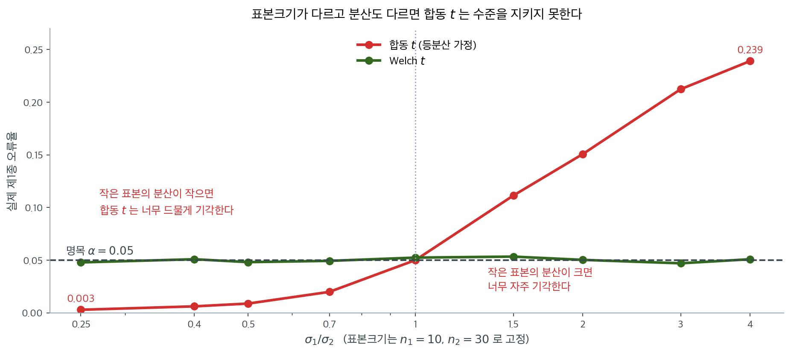

# 이표본 t-검정 (합동과 Welch)

!!! note "Welch 자유도 공식에 관한 정정"
    원 강의노트의 여러 코드 조각이 Welch-Satterthwaite 자유도를 다음처럼 계산했다.

    ```
    bottom = (s_1**2/n_1)**2 / n_1 + (s_2**2/n_2)**2 / n_2      # 잘못됨
    ```

    분모는 $n_i$가 아니라 $n_i - 1$이어야 한다.

    $$
    \nu = \frac{\left(\frac{s_1^2}{n_1}+\frac{s_2^2}{n_2}\right)^2}
              {\frac{(s_1^2/n_1)^2}{n_1-1}+\frac{(s_2^2/n_2)^2}{n_2-1}}
    $$

    차이가 얼마나 되는지 두 경우로 확인해 보자.

    ```python
    def welch_df(s1, n1, s2, n2, wrong=False):
        a, b = s1**2 / n1, s2**2 / n2
        d1, d2 = (n1, n2) if wrong else (n1 - 1, n2 - 1)
        return (a + b) ** 2 / (a**2 / d1 + b**2 / d2)

    for label, (s1, n1, s2, n2) in [
        ("큰 표본  (n=65, 75)", (18.2, 65, 23.9, 75)),
        ("작은 표본 (n=5, 5)",  (5.4, 5, 7.5, 5)),
    ]:
        wrong = welch_df(s1, n1, s2, n2, wrong=True)
        right = welch_df(s1, n1, s2, n2)
        print(f"{label}: 잘못된 식 {wrong:7.2f}  올바른 식 {right:7.2f}  "
              f"({100*(wrong/right - 1):+.1f}%)")
    ```

    출력:

    ```
    큰 표본  (n=65, 75): 잘못된 식  137.77  올바른 식  135.84  (+1.4%)
    작은 표본 (n=5, 5): 잘못된 식    9.09  올바른 식    7.27  (+25.0%)
    ```

    표본이 크면 1.4% 차이에 그치지만, 아래 연습문제 4(전기차, $n_1 = n_2 = 5$)에서는 **자유도가 25% 부풀려진다.** 자유도가 부풀면 임계값이 작아져 기각하기 쉬워지므로, 작은 표본에서는 제1종 오류율이 명목값을 넘게 된다. 이 책의 풀이는 모두 올바른 공식을 쓴다.

---

## 개요

이표본 t-검정은 독립인 두 표본의 평균을 비교하여 유의하게 다른지 판단한다. A/B 검정, 임상시험, 실험 설계에서 널리 쓰인다.

---

## 1. 가설

- **귀무가설** ($H_0$): $\mu_1 = \mu_2$ (평균이 같다)
- **대립가설** ($H_a$): $\mu_1 \neq \mu_2$ (평균이 다르다)

---

## 2. 검정통계량

### 합동 t-검정 (등분산 가정)

두 집단의 모분산이 같다고 가정할 때:

$$
t = \frac{\bar{X}_1 - \bar{X}_2}{S_p\sqrt{1/n_1 + 1/n_2}}
$$

여기서 합동 표준편차는:

$$S_p^2 = \frac{(n_1-1)S_1^2 + (n_2-1)S_2^2}{n_1+n_2-2}$$

**자유도**: $df = n_1 + n_2 - 2$

### Welch t-검정 (분산이 다를 수 있는 경우)

분산이 다를 수 있으면 Welch 검정이 더 로버스트하다:

$$
t = \frac{\bar{X}_1 - \bar{X}_2}{\sqrt{S_1^2/n_1 + S_2^2/n_2}}
$$

**자유도** (Satterthwaite 근사):

$$df = \frac{\left(\frac{S_1^2}{n_1} + \frac{S_2^2}{n_2}\right)^2}{\frac{(S_1^2/n_1)^2}{n_1-1} + \frac{(S_2^2/n_2)^2}{n_2-1}}$$

**참고**: Welch 검정은 등분산을 가정하지 않으면서 제1종 오류를 잘 통제하므로 일반적으로 선호된다.

---

## 3. 실무적 고려사항

### 등분산 가정



권고의 근거가 이 그림에 있다. $H_0$이 참인 자료에서 두 검정의 실제 기각률을 잰 것인데, **Welch는 분산비가 어떻든 $0.05$에 머물고 합동 $t$는 크게 벗어난다.**

벗어나는 방향이 표본크기와 얽혀 있다는 점이 중요하다. 여기서는 $n_1 = 10 < n_2 = 30$인데,

- **작은 집단의 분산이 크면** 합동분산이 그 큰 분산을 과소평가해 분모가 작아지고, 너무 자주 기각한다. $\sigma_1 = 4\sigma_2$에서 실제 오류율이 $0.239$로 명목의 다섯 배에 가깝다.
- **작은 집단의 분산이 작으면** 반대로 지나치게 보수적이 되어 $0.003$까지 내려간다. 이때는 오류율이 아니라 검정력을 잃는다.

표본크기가 같으면 합동 $t$도 꽤 견딘다. **문제는 표본크기와 분산이 함께 다를 때 생기며**, 실제 자료에서는 그런 경우가 드물지 않다.

합동 검정과 Welch 검정 중 하나를 고르기 전에 (Levene 검정 같은) 등분산 사전검정을 하고 싶을 수 있다. 그러나 현대의 통계 실무는 다음 이유로 Welch 검정을 기본으로 쓰기를 권한다:

1. 등분산 가정이 깨져도 로버스트하다
2. 실제로 분산이 같을 때도 합동 검정과 검정력이 거의 같다
3. 분산이 다를 때 더 나은 보호를 제공한다

### 효과크기

이표본 비교에서 **Cohen의 d**가 실질적 유의성을 잰다:

$$d = \frac{\bar{X}_1 - \bar{X}_2}{S_p}$$

해석:

- $|d| < 0.2$: 작은 효과
- $0.2 \leq |d| < 0.5$: 작은~중간 효과
- $0.5 \leq |d| < 0.8$: 중간 효과
- $|d| \geq 0.8$: 큰 효과

<div class="exbox" markdown>

**보기 1.** <span class="diff easy" title="쉬움"></span> 웹페이지 A/B 검정. 새로 디자인한 웹페이지(페이지 B)에서 사용자가 기존 버전(페이지 A)보다 더 오래 머무는지 검정한다. 체류시간(초)을 각 10명에게서 재어 아래를 얻었다.

$$
\begin{aligned}
\text{A} &: 185,\ 188,\ 142,\ 160,\ 161,\ 157,\ 182,\ 181,\ 159,\ 167\\
\text{B} &: 173,\ 181,\ 182,\ 170,\ 169,\ 177,\ 168,\ 183,\ 169,\ 164
\end{aligned}
$$

**(1)** 두 평균과 표준편차, 합동표준편차, 코헨의 $d$를 구하시오. 양측 p-값에서 단측 p-값을 얻는 규칙은 무엇인가.

**(2)** 이 $d$를 검정력 $80\%$로 탐지하려면 집단당 몇 명이 필요한가. 정규근사와 정확한 비중심 $t$ 계산을 모두 하고, 현재 설계(집단당 10명)의 검정력도 구하시오.

</div>

??? success "풀이"

    **(1) 해석적으로.** 평균은 $\bar x_A = 168.20$, $\bar x_B = 173.60$으로 차이가 $5.40$초다. 표본분산은 $s_A^2 = 227.2889$, $s_B^2 = 44.9333$이고 표본표준편차로는 $15.0761$과 $6.7032$다. 집단크기가 같으므로 합동분산은 단순평균이다.

    $$
    s_p^2 = \frac{9 \times 227.2889 + 9 \times 44.9333}{18}
    = \frac{227.2889 + 44.9333}{2} = 136.1111,
    \qquad s_p = 11.6667
    $$

    따라서

    $$
    d = \frac{\bar x_B - \bar x_A}{s_p} = \frac{5.40}{11.6667} = 0.462857.
    $$

    **단측 p-값의 규칙.** 양측 p-값은 $2\min\{F(t), 1-F(t)\}$이므로, 관측된 차이가 대립가설이 말하는 방향이면 단측 p-값이 양측의 절반이고 반대 방향이면 $1 - (\text{양측})/2$이다. 여기서는 $H_1\colon \mu_B > \mu_A$이고 실제로 $\bar x_B > \bar x_A$이므로 절반을 쓴다. $0.3204/2 = 0.1602$다.

    **(2) 필요한 표본크기.** 균형 이표본 검정의 비중심모수는 $\lambda = d\sqrt{n/2}$($n$은 집단당 크기)이고, 임계값을 정규로 바꾸는 거친 근사에서는

    $$
    d\sqrt{\frac n2} \ge z_{1-\alpha/2} + z_{0.80}
    \iff n \ge \frac{2(z_{1-\alpha/2} + z_{0.80})^2}{d^2}
    = \frac{2(1.959964 + 0.841621)^2}{0.462857^2} = 73.273
    $$

    이므로 $n = 74$다. 그러나 이 근사는 **자유도를 무한으로 보고** 비중심 $t$를 정규로 바꾼 것이라 필요한 표본을 과소평가한다. 정확한 계산은

    $$
    \text{검정력}(n) = P\bigl(T'_{2n-2,\,\lambda} > t_{1-\alpha/2,\,2n-2}\bigr)
    + P\bigl(T'_{2n-2,\,\lambda} < -t_{1-\alpha/2,\,2n-2}\bigr)
    $$

    을 쓰며, 아래에서 보듯 $n = 74$에서 $0.79868$로 모자라고 $n = 75$에서 $0.80400$이 된다. **정확한 답은 집단당 75명이다.** 본문이 "75명 남짓"이라 한 것이 이 값이다.

    **수치적으로.**

    ```python
    import numpy as np
    from scipy import stats

    # 체류시간(초)
    page_a = np.array([185, 188, 142, 160, 161, 157, 182, 181, 159, 167])
    page_b = np.array([173, 181, 182, 170, 169, 177, 168, 183, 169, 164])

    # scipy의 기본값은 equal_var=True(합동)이다. Welch를 쓰려면 반드시 명시해야 한다.
    t_stat, p_value = stats.ttest_ind(page_a, page_b, equal_var=False)

    print(f"Page A: mean = {page_a.mean():.2f}, std = {page_a.std(ddof=1):.2f}")
    print(f"Page B: mean = {page_b.mean():.2f}, std = {page_b.std(ddof=1):.2f}")
    print(f"t-statistic: {t_stat:.4f}")
    print(f"p-value (two-sided): {p_value:.4f}")

    # 단측검정. 대립가설은 B 쪽 평균이 더 크다는 것이다.
    p_one_sided = p_value / 2 if page_b.mean() > page_a.mean() else 1 - p_value / 2
    print(f"p-value (one-sided): {p_one_sided:.4f}")

    # 효과크기 Cohen 의 d — 평균 차이를 표준편차 단위로 잰 값
    pooled_std = np.sqrt(((len(page_a) - 1) * page_a.std(ddof=1)**2 +
                           (len(page_b) - 1) * page_b.std(ddof=1)**2) /
                          (len(page_a) + len(page_b) - 2))
    # 효과크기는 표본크기와 무관하다. t는 n이 커지면 함께 커지지만 d는 그렇지 않다.
    # 그래서 "유의한가"와 "쓸모 있을 만큼 큰가"를 따로 말할 수 있다.
    cohens_d = (page_b.mean() - page_a.mean()) / pooled_std
    print(f"Cohen's d: {cohens_d:.3f}")
    ```

    출력:

    ```
    Page A: mean = 168.20, std = 15.08
    Page B: mean = 173.60, std = 6.70
    t-statistic: -1.0350
    p-value (two-sided): 0.3204
    p-value (one-sided): 0.1602
    Cohen's d: 0.463
    ```

    ```python
    d = cohens_d
    print(f"정확한 d = {d:.9f}   (s_p = {pooled_std:.9f})")

    za, zb = stats.norm.ppf(0.975), stats.norm.ppf(0.80)
    n_norm = 2 * (za + zb) ** 2 / d**2
    print(f"정규근사가 주는 집단당 n = {n_norm:.4f}  →  {int(np.ceil(n_norm))}")


    def power_two_sample(n, d, alpha=0.05):
        """집단당 n 명, 참 효과크기 d 인 균형 이표본 t 검정의 검정력."""
        df = 2 * n - 2
        nc = d * np.sqrt(n / 2)            # 비중심모수
        tc = stats.t.ppf(1 - alpha / 2, df)
        return stats.nct.sf(tc, df, nc) + stats.nct.cdf(-tc, df, nc)


    print("\n   n(집단당)   검정력")
    for n in (10, 70, 73, 74, 75, 76, 80):
        print(f"{n:9d}   {power_two_sample(n, d):.5f}")

    # 격자의 "첫 칸" 만 보지 않는다. 3 부터 400 까지 모두 훑는다.
    # (n >= 757 부터는 검정력이 배정밀도로 정확히 1 이 되어 차가 0 이 된다.)
    ns = np.arange(3, 401)
    pw = np.array([power_two_sample(int(k), d) for k in ns])
    ok = ns[pw >= 0.80]
    print(f"\n검정력 >= 0.80 인 n 의 개수 = {len(ok)},  가장 작은 n = {ok.min()},"
          f"  연속인가 = {bool(np.all(np.diff(ok) == 1))}")
    print(f"검정력이 n 에 대해 단조증가인가 = {bool(np.all(np.diff(pw) > 0))}")
    print(f"현재 설계(n = 10)의 검정력 = {power_two_sample(10, d):.4f}")
    ```

    출력:

    ```
    정확한 d = 0.462857143   (s_p = 11.666666667)
    정규근사가 주는 집단당 n = 73.2730  →  74

       n(집단당)   검정력
           10   0.16531
           70   0.77614
           73   0.79324
           74   0.79868
           75   0.80400
           76   0.80920
           80   0.82883

    검정력 >= 0.80 인 n 의 개수 = 326,  가장 작은 n = 75,  연속인가 = True
    검정력이 n 에 대해 단조증가인가 = True
    현재 설계(n = 10)의 검정력 = 0.1653
    ```

    **(1)의 수가 모두 맞는다.** 평균 $168.20$과 $173.60$, 표준편차 $15.08$과 $6.70$, $d = 0.463$이다. 양측 $p = 0.3204$, 단측 $p = 0.1602$로 정확히 절반이다.

    **(2)에서 근사와 정확값이 하나 차이로 갈린다.** 정규근사는 $73.27$을 주어 $74$라 하지만, $n = 74$의 실제 검정력은 $0.79868$로 목표에 $0.0013$ 모자란다. 정확한 답은 $75$($0.80400$)다. 검정력이 $n$에 대해 단조증가이고 $n \ge 75$가 끊김 없이 이어지는 것까지 확인했다.

    **그리고 현재 설계의 검정력은 $0.1653$이다.** $d = 0.463$이 참값이라 해도 여섯 번에 한 번만 잡아낸다. $p = 0.32$로 기각하지 못한 것은 효과가 없다는 뜻이 아니라 **집단당 10명으로는 이만한 효과를 가려낼 수 없다**는 뜻이다. 필요한 75명의 7분의 1밖에 모으지 않았다.

    두 집단의 표준편차가 $15.08$과 $6.70$으로 두 배 넘게(분산으로는 다섯 배) 차이 난다는 점도 눈여겨보라. 합동 $t$-검정이 가정하는 등분산과는 거리가 멀어서, 여기서 Welch를 쓴 것은 형식이 아니라 필요다.

### scipy.stats 사용

<div class="exbox" markdown>

**보기 2.** <span class="diff easy" title="쉬움"></span> scipy 로 이표본 t-검정. 같은 자료에 `equal_var=False`(Welch)와 `equal_var=True`(합동)를 모두 적용하면 **통계량은 똑같고 p-값만 다르다**($-1.0350$에 대해 $0.3204$와 $0.3144$).

**(1)** 집단크기가 같으면 두 검정의 통계량이 **정확히 같은 수**가 되는 까닭을 보이시오. 그렇다면 어느 쪽 p-값이 반드시 큰가.

**(2)** 균형 설계에서 Welch 자유도를 분산비 $\rho = s_2^2/s_1^2$만의 식으로 쓰고, 그 값이 들어갈 수 있는 범위를 구하시오.

</div>

??? success "풀이"

    **(1) 같은 통계량.** [이표본 평균 검정](test_two_means.md)의 보기 1에서 두 표준오차의 차를 닫힌 꼴로 구했다.

    $$
    \text{SE}_{\text{pool}}^2 - \text{SE}_{\text{welch}}^2
    = \frac{(N-1)(n_1-n_2)(s_1^2-s_2^2)}{(N-2)\,n_1n_2}
    $$

    $n_1 = n_2$이면 $(n_1 - n_2) = 0$이므로 **차가 분산비와 무관하게 정확히 0이다.** 분자도 같으니 두 통계량은 같은 수다. 직접 확인해도 된다. $n_1 = n_2 = n$에서

    $$
    \text{SE}_{\text{pool}}^2 = \frac{(n-1)s_1^2 + (n-1)s_2^2}{2n-2}\cdot\frac{2}{n}
    = \frac{s_1^2 + s_2^2}{n}
    = \frac{s_1^2}{n} + \frac{s_2^2}{n} = \text{SE}_{\text{welch}}^2
    $$

    이다.

    **그러므로 남는 차이는 자유도뿐이다.** 같은 $\lvert t \rvert$를 자유도가 작은 분포로 읽으면 꼬리확률이 더 크고, Welch 자유도는 언제나 $\nu \le n_1 + n_2 - 2$이므로

    $$
    p_{\text{welch}} \ \ge\ p_{\text{pool}}
    $$

    이다. 등호는 $\nu = n_1+n_2-2$, 곧 균형 설계에서는 $s_1 = s_2$일 때뿐이다. **균형 설계에서 Welch는 합동과 같은 통계량을 더 조심스럽게 읽는 검정이다.**

    **(2) 균형 설계의 자유도.** $a = s_1^2/n$, $b = s_2^2/n$이고 두 자유도가 모두 $n-1$이므로

    $$
    \nu = \frac{(a+b)^2}{\dfrac{a^2 + b^2}{n-1}}
    = (n-1)\,\frac{(s_1^2+s_2^2)^2}{s_1^4+s_2^4}
    = (n-1)\,\frac{(1+\rho)^2}{1+\rho^2},
    \qquad \rho = \frac{s_2^2}{s_1^2}
    $$

    이다. $g(\rho) = (1+\rho)^2/(1+\rho^2)$는 $\rho = 1$에서 최대 2, $\rho \to 0$ 또는 $\rho \to \infty$에서 1로 간다. 그러므로

    $$
    n - 1 \;<\; \nu \;\le\; 2(n-1) = n_1 + n_2 - 2
    $$

    이다. **균형 설계에서 Welch가 잃을 수 있는 자유도는 최대 절반이다.** $n = 10$이면 $\nu$가 9와 18 사이에 있다.

    **수치적으로.**

    ```python
    from scipy import stats

    group1, group2 = page_a, page_b          # 위 보기의 자료를 그대로 쓴다

    # Welch t-검정 (권장). 등분산을 가정하지 않는다.
    t_welch, p_welch = stats.ttest_ind(group1, group2, equal_var=False)

    # 합동 t-검정. 등분산을 가정한다.
    t_pooled, p_pooled = stats.ttest_ind(group1, group2, equal_var=True)

    print(f"Welch : t = {t_welch:.4f}, p = {p_welch:.4f}")
    print(f"Pooled: t = {t_pooled:.4f}, p = {p_pooled:.4f}")

    # 단측 p-값. 통계량의 부호에 따라 처리가 달라진다.
    if t_welch > 0:
        p_one_sided = p_welch / 2
    else:
        p_one_sided = 1 - p_welch / 2
    print(f"one-sided (H1: mu1 > mu2): p = {p_one_sided:.4f}")
    ```

    출력:

    ```
    Welch : t = -1.0350, p = 0.3204
    Pooled: t = -1.0350, p = 0.3144
    one-sided (H1: mu1 > mu2): p = 0.8398
    ```

    ```python
    n = len(group1)
    v1, v2 = group1.var(ddof=1), group2.var(ddof=1)
    a, b = v1 / n, v2 / n

    se_welch = np.sqrt(a + b)
    sp2 = ((n - 1) * v1 + (n - 1) * v2) / (2 * n - 2)
    se_pool = np.sqrt(sp2 * (1 / n + 1 / n))
    print(f"n1 = n2 = {n}")
    print(f"  SE_welch = {se_welch:.12f}")
    print(f"  SE_pool  = {se_pool:.12f}")
    print(f"  차 = {se_pool - se_welch:.3e}   (0 이어야 한다)")
    print(f"  t_welch = {t_welch:.15f}")
    print(f"  t_pool  = {t_pooled:.15f}")
    print(f"  두 통계량이 같은가: {t_welch == t_pooled}")

    nu = (a + b) ** 2 / (a**2 / (n - 1) + b**2 / (n - 1))
    rho = v2 / v1
    print(f"\n자유도: 합동 {2 * n - 2},  Welch {nu:.9f}")
    print(f"  균형 공식 (n-1)(1+rho)^2/(1+rho^2) = "
          f"{(n - 1) * (1 + rho) ** 2 / (1 + rho**2):.9f}   (rho = s2^2/s1^2 = {rho:.6f})")
    print(f"  공식이 주는 범위: [{n - 1}, {2 * (n - 1)}]")
    print(f"\n같은 |t| = {abs(t_welch):.6f} 를 두 자유도로 읽으면")
    print(f"  df = {2 * n - 2}      : p = {2 * stats.t.sf(abs(t_welch), 2 * n - 2):.9f}")
    print(f"  df = {nu:.4f} : p = {2 * stats.t.sf(abs(t_welch), nu):.9f}")
    ```

    출력:

    ```
    n1 = n2 = 10
      SE_welch = 5.217491947500
      SE_pool  = 5.217491947500
      차 = 8.882e-16   (0 이어야 한다)
      t_welch = -1.034980035299904
      t_pool  = -1.034980035299904
      두 통계량이 같은가: True

    자유도: 합동 18,  Welch 12.424624520
      균형 공식 (n-1)(1+rho)^2/(1+rho^2) = 12.424624520   (rho = s2^2/s1^2 = 0.197693)
      공식이 주는 범위: [9, 18]

    같은 |t| = 1.034980 를 두 자유도로 읽으면
      df = 18      : p = 0.314383791
      df = 12.4246 : p = 0.320403323
    ```

    **두 통계량이 비트 단위로 같다.** `t_welch == t_pooled`가 `True`이고, 두 표준오차의 차가 $9 \times 10^{-16}$으로 부동소수점 반올림뿐이다. 분산이 다섯 배 차이 나는데도 그렇다. **균형이 합동 $t$를 구해 준다**는 말의 가장 깨끗한 형태다.

    **자유도 공식도 맞는다.** $\rho = 0.197693$에서 $(n-1)(1+\rho)^2/(1+\rho^2) = 12.424624520$이 `scipy`의 Welch 자유도와 소수 아홉째 자리까지 같다. 범위 $[9, 18]$ 안에 있다.

    **p-값의 차는 자유도에서만 온다.** 같은 $\lvert t \rvert = 1.034980$을 자유도 18로 읽으면 $0.314384$, $12.4246$으로 읽으면 $0.320403$이다. 예상대로 Welch 쪽이 크다. 이 자료에서는 둘 다 $0.05$와 멀어 판정이 같지만, 경계 근처라면 자유도 하나 때문에 결론이 갈릴 수 있다.

    단측 p-값이 $0.8398$로 나온 것도 읽어 둘 만하다. $t$가 음수인데 $H_1$을 $\mu_1 > \mu_2$로 잡았으니 자료가 대립가설과 반대 방향이고, 그럴 때 단측 p-값은 $0.5$보다 커진다. 보기 1에서 쓴 단측 p-값 $0.1602$는 집단의 순서를 반대로 잡은 것, 곧 $H_1\colon \mu_B > \mu_A$에 대한 값이다. **같은 자료에서 두 수가 더해 1이 된다**($0.1602 + 0.8398$).

### statsmodels 사용

<div class="exbox" markdown>

**보기 3.** <span class="diff easy" title="쉬움"></span> statsmodels 로 이표본 t-검정. `scipy.stats.ttest_ind`는 $t$와 p-값만 돌려주지만 `statsmodels`는 자유도까지 함께 준다. 보고할 때 자유도를 적어야 하므로 이 점이 편하다.

**(1)** `statsmodels`가 주는 Welch 자유도를 보기 2의 공식으로 손으로 재현하시오. 본문은 "한쪽 분산이 다른 쪽의 다섯 배"라 했는데 실제 비는 얼마이고, 자유도를 얼마나 잃었는가.

**(2)** 분산비를 극단까지 밀면 자유도가 어디까지 내려가는지 표로 보이시오.

</div>

??? success "풀이"

    **(1) 해석적으로.** 보기 2의 공식에 $\rho = s_2^2/s_1^2 = 44.9333/227.2889 = 0.197693$과 $n = 10$을 넣으면

    $$
    \nu = 9 \times \frac{(1 + 0.197693)^2}{1 + 0.197693^2}
    = 9 \times \frac{1.434469}{1.039083} = 12.424625
    $$

    다. 분산비는 $s_1^2/s_2^2 = 5.0584$로 본문의 "다섯 배"가 맞다. 합동 자유도 $18$ 가운데 $5.5754$를 잃어 $69.0\%$만 남았다.

    **(2) 극단으로 밀면.** 보기 2에서 보았듯 $g(\rho) = (1+\rho)^2/(1+\rho^2)$는 $\rho \to 0$에서 1로 가므로 $\nu \to n-1 = 9$다. **분산비가 아무리 커도 자유도가 절반 아래로는 내려가지 않는다.** 다가가는 속도는 느리다. 분산비 10에서 $10.78$, 100에서 $9.18$, 10,000에서 $9.0018$이다.

    **수치적으로.**

    ```python
    import statsmodels.api as sm

    # statsmodels는 자유도까지 함께 돌려준다. scipy는 그렇지 않다.
    # 결과를 보고할 때 자유도를 함께 적어야 하므로 이 점이 편하다.
    t_stat, p_value, df = sm.stats.ttest_ind(group1, group2,
                                             usevar='unequal',
                                             alternative='two-sided')
    print(f"t = {t_stat:.4f}, p = {p_value:.4f}, df = {df:.4f}")
    ```

    출력:

    ```
    t = -1.0350, p = 0.3204, df = 12.4246
    ```

    ```python
    # 손으로 구한 값과 맞추어 본다.
    nu_hand = (n - 1) * (1 + rho) ** 2 / (1 + rho**2)
    print(f"statsmodels df = {df:.12f}")
    print(f"손으로 구한 df = {nu_hand:.12f}   차 = {abs(df - nu_hand):.2e}")
    print(f"분산비 s1^2/s2^2 = {v1 / v2:.6f}  (본문의 '다섯 배')")
    print(f"잃은 자유도 = {2 * (n - 1) - nu_hand:.6f}  "
          f"(합동 {2 * (n - 1)} 의 {100 * nu_hand / (2 * (n - 1)):.1f}% 만 남는다)")

    print("\n분산비를 바꾸면 자유도가 어떻게 되는가 (n = 10 균형)")
    print("   s1^2/s2^2     nu      합동과의 비")
    for ratio in (1, 2, 5.058358, 10, 100, 10_000):
        rr = 1 / ratio
        nn = (n - 1) * (1 + rr) ** 2 / (1 + rr**2)
        print(f"{ratio:11.4f}  {nn:8.4f}     {nn / (2 * (n - 1)):.4f}")

    print(f"\nscipy 와 statsmodels 의 t, p 가 같은가: "
          f"{np.allclose([t_stat, p_value], [t_welch, p_welch])}")
    ```

    출력:

    ```
    statsmodels df = 12.424624519556
    손으로 구한 df = 12.424624519556   차 = 0.00e+00
    분산비 s1^2/s2^2 = 5.058358  (본문의 '다섯 배')
    잃은 자유도 = 5.575375  (합동 18 의 69.0% 만 남는다)

    분산비를 바꾸면 자유도가 어떻게 되는가 (n = 10 균형)
       s1^2/s2^2     nu      합동과의 비
         1.0000   18.0000     1.0000
         2.0000   16.2000     0.9000
         5.0584   12.4246     0.6903
        10.0000   10.7822     0.5990
       100.0000    9.1800     0.5100
     10000.0000    9.0018     0.5001

    scipy 와 statsmodels 의 t, p 가 같은가: True
    ```

    **손계산과 `statsmodels`가 완전히 같다.** 차가 $0$이다(배정밀도로 같은 비트). 두 라이브러리의 $t$와 p-값도 일치한다.

    **표가 (2)를 확인한다.** 분산비 1에서 $\nu = 18$로 합동과 같고, 거기서 내려가지만 10,000배에서도 $9.0018$로 하한 9에 닿기만 할 뿐 밑돌지 않는다. **균형 설계에서 Welch가 치르는 자유도의 대가는 최악의 경우에도 절반이다.** 이 자료의 $12.42$는 그 중간쯤이고, 실제로 잃은 것은 p-값에서 $0.3144 \to 0.3204$, 곧 $0.006$이다. 등분산이 의심스러울 때 Welch를 기본으로 쓰는 것이 왜 손해가 아닌지가 이 수에 들어 있다.

---

## 4. 가정

1. **독립성**: 각 집단 안의 관측값이 독립이다
2. **정규성**: 각 집단의 자료가 근사적으로 정규분포를 따른다(n > 30이면 덜 중요하다)
3. **확률표본추출**: 표본이 각 모집단에서 무작위로 뽑혔다

---

## 5. 어느 검정을 언제 쓸 것인가

| 상황 | 쓸 검정 |
|----------|------------|
| 작은 표본이고 분산이 같아 보임 | 합동 t-검정 |
| 표본크기와 무관, 또는 분산이 불확실 | **Welch t-검정** |
| 정규가 아닌 자료, 작은 표본 | 순열검정 또는 Mann-Whitney U 검정 |
| 큰 표본 (n > 30) | 어느 쪽이든 (둘 다 잘 통한다) |

---

## 6. 관련 검정

- **대응 t-검정**: 종속인 표본(짝지은 쌍)에 대해
- **Mann-Whitney U 검정**: 정규가 아닌 자료를 위한 비모수적 대안
- **순열검정**: 가정이 없는 재표본추출 접근
- **붓스트랩 신뢰구간**: 분포 가정 없이 신뢰구간을 구할 때

---

## 연습문제

<div class="drillbox" markdown>

**연습문제 1.** <span class="diff easy" title="쉬움"></span>
프로그램 A: $\bar X_1 = 55\,000, s_1 = 7\,500, n_1 = 14$. 프로그램 B: $\bar X_2 = 60\,000, s_2 = 8\,000, n_2 = 16$. $\alpha = 0.05$에서 합동 $t$-검정을 하라.

</div>

??? success "풀이"
    $S_p^2 = (13 \cdot 56\,250\,000 + 15 \cdot 64\,000\,000)/28 \approx 60\,401\,786$.

    $t = -5000/\sqrt{60\,401\,786 \cdot (1/14 + 1/16)} = -5000/\sqrt{8\,089\,524} \approx -1.76$.

    임계값: $t_{0.025, 28} = \pm 2.048$. $|t| = 1.76 < 2.048$. **기각하지 못한다.**

---

<div class="drillbox" markdown>

**연습문제 2.** <span class="diff easy" title="쉬움"></span>
Norway ($\bar X = 64.3, s = 18.2, n = 65$) 대 US ($\bar X = 53.4, s = 23.9, n = 75$)의 소득. Welch 검정을 하라.

</div>

??? success "풀이"
    $\mathrm{SE} = \sqrt{18.2^2/65 + 23.9^2/75} = \sqrt{5.10 + 7.62} = \sqrt{12.72} \approx 3.57$.

    $t = (64.3 - 53.4)/3.57 \approx 3.06$. 강하게 유의하다.

    Welch 자유도: $\nu \approx (12.72)^2/[(5.10)^2/64 + (7.62)^2/74] \approx 136$. 자유도가 이만큼 크면 사실상 $z$-검정이다.

    p-값 $\approx 0.003$. $H_0$을 기각한다. Norway의 소득이 유의하게 높다.

---

<div class="drillbox" markdown>

**연습문제 3.** <span class="diff easy" title="쉬움"></span>
US ($\bar X = 25.5, s = 3.8, n = 108$) 대 Canada ($\bar X = 26.3, s = 3.2, n = 102$)의 초혼 연령. 합동 $t$-검정을 하라.

</div>

??? success "풀이"
    $S_p^2 = (107 \cdot 14.44 + 101 \cdot 10.24)/208 \approx 12.40$.

    $t = -0.8/\sqrt{12.40 \cdot (1/108 + 1/102)} = -0.8/\sqrt{0.2362} \approx -1.65$.

    임계값: $t_{0.025, 208} \approx \pm 1.97$. $|t| < 1.97$. 기각하지 못한다.

    p-값 $\approx 0.10$. 경계에 있어 5%에서는 유의하지 않지만 가깝다. 표본이 더 크면 실제 차이를 탐지할 수도 있다.

---

<div class="drillbox" markdown>

**연습문제 4.** <span class="diff easy" title="쉬움"></span>
전기차 모델 A ($\bar X = 168, s = 5.4, n = 5$) 대 B ($\bar X = 172, s = 7.5, n = 5$). Welch 검정을 하라.

</div>

??? success "풀이"
    $\mathrm{SE} = \sqrt{29.16/5 + 56.25/5} = \sqrt{17.08} \approx 4.13$.

    $t = -4/4.13 \approx -0.97$. Welch 자유도: $\nu \approx (17.08)^2/[5.83^2/4 + 11.25^2/4] \approx 7.3$.

    임계값: $t_{0.025, 7} \approx 2.36$. $|t| < 2.36$. 기각하지 못한다.

    표본이 아주 작아 검정력이 낮다. 차이가 실재하더라도 결론지을 수 없다.

---

<div class="drillbox" markdown>

**연습문제 5.** <span class="diff easy" title="쉬움"></span>
**평균 교육연수: 이탈리아 대 프랑스.**
|  | 이탈리아 | 프랑스 |
|:---:|:---:|:---:|
| 평균 | 10.7 | 10.4 |
| 표준편차 | 2.3 | 2.5 |
| $n$ | 46 | 58 |

합동분산을 써서 $\alpha = 0.05$에서 검정하라.

</div>

??? success "풀이"
    $t = 0.6295$, $df = 102$, $p = 0.5304$. **기각하지 못한다.**

---

<div class="drillbox" markdown>

**연습문제 6.** <span class="diff easy" title="쉬움"></span>
**두 부서의 평균 연봉 (Welch $t$ 검정).**
부서 A: $\bar{X}_1 = 60{,}000$, $s_1 = 8{,}000$, $n_1 = 12$. 부서 B: $\bar{X}_2 = 65{,}000$, $s_2 = 10{,}000$, $n_2 = 15$. 이분산. $\alpha = 0.05$에서 검정하라.

</div>

??? success "풀이"
    $$t = \frac{60{,}000 - 65{,}000}{\sqrt{\frac{8000^2}{12} + \frac{10000^2}{15}}} = \frac{-5{,}000}{3{,}464.1} = -1.4434$$

    $\nu = 25.0$, $t_{0.025,\,25} = \pm 2.060$, $p = 0.1613$. **기각하지 못한다.**

---

<div class="drillbox" markdown>

**연습문제 7.** <span class="diff med" title="중간"></span>
**Welch 대 합동.** 분산이 다를 때 합동 $t$-검정은 언제 실패하는가(잘못된 $\alpha$를 주는가)?

</div>

??? success "풀이"
    합동 $t$는 $\sigma_1 = \sigma_2$를 가정한다. 분산이 다르면 합동 표준오차 추정량이 편향되고 검정통계량이 정확한 $t$ 분포를 따르지 않는다.

    **실패 양상:**

    - **$n$도 다르고 $\sigma$도 다를 때:** 제1종 오류가 크게 부풀 수 있다. 작은 표본 쪽의 분산이 크면 $\alpha$가 명목 수준의 2~3배까지 커질 수 있다.
    - **$n$이 같을 때:** 합동 검정은 분산이 달라도 로버스트하다. $\alpha$가 명목값 근처에 머문다.

    **Welch 검정:** 등분산을 가정하지 않는다. 실제로 분산이 같을 때 검정력이 약간 낮을 뿐이다(효율 손실이 작다).

    **현대의 권고:** Welch. $\alpha$가 부풀 위험을 피한다. R의 `t.test`는 이것이 기본값이지만 scipy의 `ttest_ind`는 합동 $t$가 기본이므로 `equal_var=False`를 명시해야 한다.

---

<div class="drillbox" markdown>

**연습문제 8.** <span class="diff med" title="중간"></span>
이표본 $t$-검정의 **효과크기와 표본크기 계획.**

</div>

??? success "풀이"
    Cohen의 $d = (\mu_1 - \mu_2)/\sigma_{\text{pooled}}$. 연습문제 1에서: $d = -5000/7772 \approx -0.64$.

    이표본 $t$-검정의 (집단당) 표본크기:

    $$
    n = \frac{2(z_{\alpha/2} + z_\beta)^2}{d^2}
    $$

    $\alpha = 0.05$에서 검정력 80%이면 $n \approx 16/d^2$이다. $d = 0.5$(중간)이면 $n \approx 64$, $d = 0.8$(큼)이면 $n \approx 25$이다.

    작은 효과에는 큰 표본이 든다 — 사회과학과 의학 연구에서 흔한 축척이다. 연구를 시작하기 *전에* 검정력 분석을 하라.

---

<div class="drillbox" markdown>

**연습문제 9.** <span class="diff med" title="중간"></span>
연습문제 1의 결과를 **효과크기·신뢰구간·검정력**까지 포함해 완결된 형태로 보고하라.

</div>

??? success "풀이"
    ```python
    import numpy as np
    from scipy import stats

    x1, s1, n1 = 55_000.0, 7_500.0, 14      # 프로그램 A
    x2, s2, n2 = 60_000.0, 8_000.0, 16      # 프로그램 B
    diff = x1 - x2

    # ── 합동 t
    sp = np.sqrt(((n1 - 1) * s1**2 + (n2 - 1) * s2**2) / (n1 + n2 - 2))
    se_p, df_p = sp * np.sqrt(1 / n1 + 1 / n2), n1 + n2 - 2
    t_p = diff / se_p
    tc = stats.t.ppf(0.975, df_p)
    print(f"합동  sp={sp:.2f}  t={t_p:.4f}  df={df_p}  "
          f"p={2 * stats.t.sf(abs(t_p), df_p):.4f}")
    print(f"      95% CI ({diff - tc * se_p:.1f}, {diff + tc * se_p:.1f})")

    # ── Welch
    se_w = np.sqrt(s1**2 / n1 + s2**2 / n2)
    df_w = se_w**4 / ((s1**2 / n1)**2 / (n1 - 1) + (s2**2 / n2)**2 / (n2 - 1))
    t_w = diff / se_w
    tcw = stats.t.ppf(0.975, df_w)
    print(f"Welch t={t_w:.4f}  df={df_w:.2f}  "
          f"p={2 * stats.t.sf(abs(t_w), df_w):.4f}")
    print(f"      95% CI ({diff - tcw * se_w:.1f}, {diff + tcw * se_w:.1f})")

    # ── 효과크기
    d = diff / sp
    g = d * (1 - 3 / (4 * (n1 + n2) - 9))            # 헤지스의 소표본 보정
    se_d = np.sqrt((n1 + n2) / (n1 * n2) + d**2 / (2 * (n1 + n2 - 2)))
    print(f"\nCohen d = {d:.4f},  Hedges g = {g:.4f}")
    print(f"  d의 95% CI ({d - 1.96 * se_d:.4f}, {d + 1.96 * se_d:.4f})")

    # ── 검정력
    def power_ind(n, d, alpha=0.05):
        nc = abs(d) * np.sqrt(n / 2)
        df = 2 * n - 2
        c = stats.t.ppf(1 - alpha / 2, df)
        return stats.nct.sf(c, df, nc) + stats.nct.cdf(-c, df, nc)

    print(f"\n군당 15명일 때 참 d={d:.3f}에 대한 검정력 {power_ind(15, d):.4f}")
    for n in range(5, 2_000):
        if power_ind(n, d) >= 0.80:
            print(f"80% 검정력에 필요한 군당 표본 {n}명")
            break
    ```

    ```text
    합동  sp=7771.86  t=-1.7580  df=28  p=0.0897
          95% CI (-10826.1, 826.1)
    Welch t=-1.7658  df=27.85  p=0.0884
          95% CI (-10801.7, 801.7)

    Cohen d = -0.6433,  Hedges g = -0.6260
      d의 95% CI (-1.3802, 0.0935)

    군당 15명일 때 참 d=-0.643에 대한 검정력 0.3981
    80% 검정력에 필요한 군당 표본 39명
    ```

    **보고문.**

    > 프로그램 A 수료자 14명의 평균 연봉은 55,000달러($s=7{,}500$), 프로그램 B 수료자 16명은 60,000달러($s=8{,}000$)였다. 합동 이표본 $t$ 검정 결과 $t(28)=-1.76$, $p=0.090$으로 5% 수준에서 유의하지 않았다. 평균 차이는 $-5{,}000$달러(95% CI $-10{,}826$~$+826$)였고, 표준화 효과크기는 Hedges $g=-0.63$(95% CI $-1.38$~$+0.09$)이었다. 웰치 검정도 거의 같은 결과였다($t(27.9)=-1.77$, $p=0.088$).

    **핵심 다섯.**

    **1 — "유의하지 않다"가 "차이가 없다"는 아니다.** 구간이 $-10{,}826$에서 $+826$까지다. **1만 달러 차이가 자료와 완전히 양립한다.** 이 연구는 "차이가 없다"고 말할 자격이 없다.

    **2 — 효과크기가 결코 작지 않다.** $g=-0.63$은 관례상 "중간~큰" 효과다. 유의하지 않은 이유는 **효과가 작아서가 아니라 표본이 작아서**다.

    **3 — 검정력이 0.40이다.** 관측된 크기의 효과가 실제로 있더라도 **60%의 확률로 놓친다.** 80%를 원했다면 군당 39명이 필요했다.

    **4 — 관측된 검정력을 사후에 계산하는 것은 무의미하다.** 위의 0.398은 "설계가 왜 부족했는가"를 설명하는 용도이지, "$p>0.05$이니 효과가 없다"를 뒷받침하는 근거가 아니다. 관측된 검정력은 $p$-값의 단조함수라 새 정보가 없다.

    **5 — 합동과 웰치가 거의 같다.** $s_1=7{,}500$, $s_2=8{,}000$으로 분산이 비슷하고 $n$도 비슷해서다. **이런 상황에서 웰치를 쓰는 비용은 사실상 0**(자유도 28 → 27.85)이므로, 굳이 등분산을 가정할 이유가 없다.

    **보고에서 빠뜨리기 쉬운 것.**

    | 항목 | 왜 필요한가 |
    |---|---|
    | 두 집단의 $n$, 평균, SD | 재분석·메타분석의 재료 |
    | 차이의 **신뢰구간** | "얼마나 다른가"의 답 |
    | 효과크기와 그 구간 | 다른 연구와의 비교 |
    | 어느 검정을 왜 썼는지 | 재현 가능성 |
    | 표본이 어떻게 정해졌는지 | 선택적 중단 배제 |
    | 정규성·이상점 점검 | 가정의 타당성 |

    **마지막으로 — 이 자료는 관측자료다.** 프로그램을 무작위 배정한 것이 아니라면, 차이가 프로그램 때문인지 **지원자의 특성** 때문인지 구분할 수 없다. 유의했더라도 같은 한계가 남는다.

---

<div class="drillbox" markdown>

**연습문제 10.** <span class="diff hard" title="어려움"></span>
정규성이 무너질 때 $t$ 검정, 만·휘트니 검정, 순열검정을 비교하라. 만·휘트니가 항상 더 나은가?

</div>

??? success "풀이"
    ```python
    import numpy as np
    from scipy import stats

    rng = np.random.default_rng(717)
    M, n = 5_000, 20

    def perm_p(x, y, B, rng):
        """평균 차이를 통계량으로 하는 양측 순열검정."""
        obs = abs(x.mean() - y.mean())
        z = np.r_[x, y]
        cnt = 1
        for _ in range(B):
            rng.shuffle(z)
            cnt += abs(z[:len(x)].mean() - z[len(x):].mean()) >= obs
        return cnt / (B + 1)

    print(f"{'분포':>10s} {'상황':>6s} {'Welch':>8s} {'MWU':>8s} {'순열':>8s}")
    for name in ["정규", "로그정규", "t(3)", "지수"]:
        for shift, lab in [(0.0, "수준"), (0.8, "검정력")]:
            a = b = c = 0
            for _ in range(M):
                if name == "정규":
                    x, y = rng.standard_normal(n), rng.standard_normal(n) + shift
                elif name == "로그정규":
                    x, y = rng.lognormal(0, 1, n), rng.lognormal(0, 1, n) + shift
                elif name == "t(3)":
                    x, y = rng.standard_t(3, n), rng.standard_t(3, n) + shift
                else:
                    x, y = rng.exponential(1, n), rng.exponential(1, n) + shift
                a += stats.ttest_ind(x, y, equal_var=False).pvalue < 0.05
                b += stats.mannwhitneyu(x, y).pvalue < 0.05
                c += perm_p(x, y, 299, rng) < 0.05
            print(f"{name:>10s} {lab:>6s} {a / M:8.4f} {b / M:8.4f} {c / M:8.4f}")
    ```

    ```text
            분포     상황    Welch      MWU       순열
            정규     수준   0.0448   0.0436   0.0404
            정규    검정력   0.6868   0.6618   0.6756
          로그정규     수준   0.0368   0.0480   0.0462
          로그정규    검정력   0.3226   0.7184   0.3424
          t(3)     수준   0.0412   0.0474   0.0450
          t(3)    검정력   0.3630   0.4812   0.3674
            지수     수준   0.0490   0.0524   0.0516
            지수    검정력   0.7036   0.8772   0.7000
    ```

    **세 검정 모두 수준은 안전하다**(0.037~0.052). 웰치 $t$는 $n=20$·평균 차이를 볼 때 비정규성에 상당히 로버스트하다.

    **차이는 검정력에서 난다.**

    | 분포 | Welch | MWU | 이득 |
    |---|---|---|---|
    | 정규 | 0.687 | 0.662 | Welch가 미세하게 우위 |
    | $t(3)$ | 0.363 | **0.481** | MWU +0.12 |
    | 지수 | 0.704 | **0.877** | MWU +0.17 |
    | 로그정규 | 0.323 | **0.718** | **MWU +0.40** |

    **꼬리가 두꺼우면 만·휘트니가 크게 앞선다.** 순위로 바꾸면 극단값의 영향이 사라지기 때문이다. 정규에서 잃는 것은 3%포인트에 불과하다(점근 상대효율 $3/\pi\approx0.955$).

    **순열검정은 웰치와 거의 같다.** 둘 다 **평균 차이**를 통계량으로 쓰기 때문이다. 순열은 분포 가정을 없애 주지만, **평균이 두꺼운 꼬리에 휘둘리는 문제 자체는 해결하지 않는다.**

    **그렇다면 만·휘트니가 항상 나은가 — 아니다.** 두 검정이 **다른 것을 검정하기 때문**이다.

    ```python
    rng = np.random.default_rng(818)
    M, n = 5_000, 30
    mu2 = 0.5 - 1.4**2 / 2                   # 두 평균이 같아지도록 맞춘다
    print(f"X: 로그정규(0, 1)     평균 {np.exp(0.5):.4f}  중앙값 {1.0:.4f}")
    print(f"Y: 로그정규({mu2:.2f}, 1.4)  평균 {np.exp(mu2 + 1.4**2 / 2):.4f}  "
          f"중앙값 {np.exp(mu2):.4f}")

    a = b = 0
    for _ in range(M):
        x, y = rng.lognormal(0, 1, n), rng.lognormal(mu2, 1.4, n)
        a += stats.ttest_ind(x, y, equal_var=False).pvalue < 0.05
        b += stats.mannwhitneyu(x, y).pvalue < 0.05
    print(f"\n평균은 같고 중앙값이 다른 상황")
    print(f"  Welch 기각률 {a / M:.4f}   MWU 기각률 {b / M:.4f}")

    xs, ys = rng.lognormal(0, 1, 200_000), rng.lognormal(mu2, 1.4, 200_000)
    print(f"  P(Y > X) ≈ {np.mean(ys > xs):.4f}")
    ```

    ```text
    X: 로그정규(0, 1)     평균 1.6487  중앙값 1.0000
    Y: 로그정규(-0.48, 1.4)  평균 1.6487  중앙값 0.6188

    평균은 같고 중앙값이 다른 상황
      Welch 기각률 0.0720   MWU 기각률 0.3160
      P(Y > X) ≈ 0.3886
    ```

    **여기서 "옳은" 답이 무엇인지가 질문에 달려 있다.**

    - **평균을 묻는다면** 두 평균이 정확히 같으므로 기각하면 안 된다. 웰치의 0.072는 약간 부풀었지만 방향은 맞다.
    - **"어느 쪽이 더 큰 값을 내는가"를 묻는다면** $P(Y>X)=0.389\ne0.5$이므로 **기각하는 것이 옳다.** 만·휘트니의 0.316은 옳은 탐지다.

    **만·휘트니는 $H_0\colon P(Y>X)=1/2$를 검정한다.** "중앙값이 같다"가 아니다. 두 분포의 모양이 같을 때만(위치이동 모형) 중앙값·평균 검정과 일치한다.

    **선택 기준.**

    | 연구 질문 | 검정 |
    |---|---|
    | **평균**이 관심(총액, 예산, 합계) | 웰치 $t$ 또는 순열 |
    | **전형적인 값**·순위가 관심 | 만·휘트니 |
    | 꼬리가 두껍고 평균이 관심 | 로그변환 후 $t$, 또는 절사평균 검정 |
    | 분포 모양이 다름 | **둘 다 보고**하고 차이를 설명 |

    **실무 권고.** 자료를 그려 보고 질문을 먼저 정한 뒤 검정을 고른다. **"정규성 검정이 유의하니 비모수로 바꾼다"는 기계적 절차는 피한다** — 앞 절의 2단계 절차와 같은 문제를 일으키고, 무엇보다 **검정하는 대상이 바뀐다**는 사실을 감춘다.

---

## 정리하며

이표본 $t$ 검정에서 갈리는 것은 **표준오차를 어떻게 만드느냐**다.

| | 가정 | 자유도 |
|---|---|---|
| 합동 | $\sigma_1^2=\sigma_2^2$ | $n_1+n_2-2$ |
| 웰치 | 없음 | 새터스웨이트 근사 |

- **웰치가 기본값이다.** 등분산 가정을 하지 않으며, 분산이 실제로 같아도 손해가 미미하다. 8장의 구간에서 본 것과 같은 결론이다.
- **합동 방법은 분산이 다르고 표본크기도 다를 때 무너진다.** 특히 작은 표본에 큰 분산이 붙으면 제1종 오류율이 명목값을 크게 넘는다.
- **"먼저 등분산 검정을 하고 고르는" 2단계 절차는 권하지 않는다.** 전체 오류율이 왜곡되며, 그냥 웰치를 쓰면 된다.
- **독립성이 전제다.** 같은 대상에서 두 번 측정했다면 이 검정이 아니라 대응 검정을 써야 한다.
- **A/B 검정과 임상시험의 주력 도구**이며, 결과는 $p$ 값만이 아니라 **차이의 신뢰구간과 함께** 보고해야 한다.

다음 절 **$p_1-p_2$ 에 대한 이표본 $Z$ 검정**으로 넘어간다.
