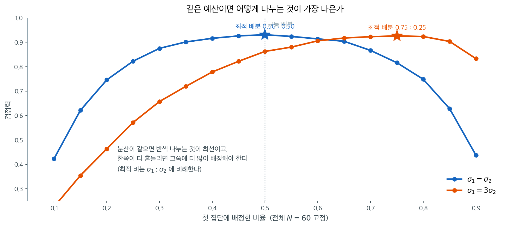

# 이표본 평균 검정

## 개요

이표본 t-검정은 독립인 두 모집단의 평균을 비교한다. **합동 t-검정**은 등분산을 가정하고 두 표본분산을 하나의 추정값으로 합치며, **Welch t-검정**은 자유도를 조정하여 분산이 다른 경우를 허용한다. Welch 검정은 분산이 같을 때에도 잘 작동하므로 일반적으로 기본으로 권장된다.

## 검정의 구성

**가설:**

- 양측: $H_0\colon \mu_1 - \mu_2 = \delta_0$ 대 $H_1\colon \mu_1 - \mu_2 \neq \delta_0$
- 단측: $H_0\colon \mu_1 - \mu_2 = \delta_0$ 대 $H_1\colon \mu_1 - \mu_2 > \delta_0$

### Welch t-검정

$$
T = \frac{(\bar{X}_1 - \bar{X}_2) - \delta_0}{\sqrt{S_1^2/n_1 + S_2^2/n_2}}
$$

Welch–Satterthwaite 자유도:

$$
\nu = \frac{\left(\frac{S_1^2}{n_1} + \frac{S_2^2}{n_2}\right)^2}{\frac{(S_1^2/n_1)^2}{n_1-1} + \frac{(S_2^2/n_2)^2}{n_2-1}}.
$$

### 합동 t-검정

$\sigma_1^2 = \sigma_2^2 = \sigma^2$일 때 분산을 합친다:

$$
S_p^2 = \frac{(n_1-1)S_1^2 + (n_2-1)S_2^2}{n_1+n_2-2}, \qquad T = \frac{(\bar{X}_1 - \bar{X}_2) - \delta_0}{S_p\sqrt{1/n_1 + 1/n_2}} \sim t_{n_1+n_2-2}.
$$

### 표본을 어떻게 나눌 것인가

두 검정 모두 표준오차가 $\sigma_1^2/n_1 + \sigma_2^2/n_2$에서 나오므로, **전체 표본크기가 정해져 있을 때 이를 어떻게 쪼개느냐가 검정력을 바꾼다.**



분산이 같으면 반씩 나누는 것이 최선이다. 합 $\sigma^2(1/n_1 + 1/n_2)$은 $n_1 + n_2$가 고정일 때 $n_1 = n_2$에서 최소가 되기 때문이며, 한쪽으로 치우칠수록 작은 쪽의 $1/n$이 전체를 지배한다.

분산이 다르면 이야기가 달라진다. $\sigma_1 = 3\sigma_2$인 경우 최적 배분이 $0.75 : 0.25$로 옮겨 가는데, 이는 **$\sigma_1 : \sigma_2 = 3 : 1$과 정확히 같은 비**다. 더 많이 흔들리는 쪽에 더 많은 관측을 배정해야 두 항의 기여가 균형을 이룬다.

실무에서 이것이 문제가 되는 경우는 한쪽 집단의 자료를 얻기가 훨씬 비쌀 때다. 그럴 때는 비용까지 함께 셈에 넣어야 하지만, **출발점은 "분산에 비례해 나눈다"**이다.

<div class="exbox" markdown>

**보기 1.** <span class="diff easy" title="쉬움"></span> 두 평균 차이 검정 계산기. 아래 함수는 같은 자료를 `method="welch"`와 `method="pooled"` 두 길로 처리한다. 두 길은 표준오차와 자유도가 모두 다르다.

**(1)** 두 표준오차의 차 $\text{SE}_{\text{pool}}^2 - \text{SE}_{\text{welch}}^2$을 닫힌 꼴로 구하고, 합동 쪽이 더 작아지는(곧 더 쉽게 기각하는) 조건을 말하시오. 균형 설계 $n_1 = n_2$에서는 어떻게 되는가.

**(2)** 그 식을 검사하고, 웰치 자유도가 $\min(n_1,n_2)-1 \le \nu \le n_1+n_2-2$를 지키는지 무작위 입력으로 확인하시오. 두 한계에 등호가 오는 입력을 각각 만드시오.

</div>

??? success "풀이"

    **(1) 해석적으로.** $A = s_1^2$, $B = s_2^2$, $N = n_1 + n_2$로 줄여 쓴다. 두 표준오차의 제곱은

    $$
    \text{SE}_{\text{welch}}^2 = \frac{A}{n_1} + \frac{B}{n_2} = \frac{An_2 + Bn_1}{n_1n_2},
    \qquad
    \text{SE}_{\text{pool}}^2 = \frac{(n_1-1)A + (n_2-1)B}{N-2}\cdot\frac{N}{n_1n_2}
    $$

    이다. 차를 구해 $n_1n_2$를 곱하고 $N-2$로 통분하면 분자가

    $$
    A\bigl[(n_1-1)N - (N-2)n_2\bigr] + B\bigl[(n_2-1)N - (N-2)n_1\bigr]
    $$

    이다. 첫 괄호를 $N = n_1+n_2$로 풀어 쓰면

    $$
    (n_1+n_2)(n_1-n_2-1) + 2n_2 = n_1^2 - n_2^2 - (n_1 - n_2) = (n_1-n_2)(N-1)
    $$

    이고, 둘째 괄호는 아래위를 맞바꾼 꼴이므로 $(n_2-n_1)(N-1)$이다. 따라서

    $$
    \boxed{\;
    \text{SE}_{\text{pool}}^2 - \text{SE}_{\text{welch}}^2
    = \frac{(N-1)\,(n_1-n_2)\,(s_1^2 - s_2^2)}{(N-2)\,n_1 n_2}
    \;}
    $$

    부호가 $(n_1-n_2)(s_1^2-s_2^2)$ 하나에 달려 있다. 그러므로

    - $(n_1 - n_2)(s_1^2 - s_2^2) < 0$, 곧 **큰 표본분산이 작은 표본에 붙어 있으면** 합동 표준오차가 더 작고 $\lvert t_{\text{pool}}\rvert > \lvert t_{\text{welch}}\rvert$다. 합동 쪽이 더 쉽게 기각한다.
    - 부호가 반대면, 곧 큰 분산이 큰 표본에 붙어 있으면 합동 쪽이 더 보수적이다.

    **균형 설계에서는 차가 정확히 0이다.** $n_1 = n_2$이면 두 검정의 표준오차가 **같은 수**이고 따라서 $t$ 통계량도 같은 수다. 달라지는 것은 자유도뿐이며 $\nu \le N-2$이므로, **균형 설계에서 Welch는 합동과 같은 통계량을 더 작은 자유도로 읽는 검정, 곧 언제나 조금 더 보수적인 검정이다.** 합동 $t$가 무너지려면 이분산만으로는 안 되고 불균형이 함께 들어와야 한다는 사실이 이 식에 그대로 들어 있다. 자세한 격자는 [5.3절 $\bar X_1 - \bar X_2$의 표본분포](../../ch05/applications/diff_means_welch.md)에서 다루었다.

    자유도의 범위 $\min(n_1,n_2)-1 \le \nu \le n_1+n_2-2$는 그 절의 연습문제 4에서 코시-슈바르츠로 증명했다. 여기서는 **구현이 그 범위를 지키는지** 검사한다. 등호 조건은 상한에서 $a/(n_1-1) = b/(n_2-1)$($a = s_1^2/n_1$, $b = s_2^2/n_2$), 하한에서 한쪽이 전부를 지배하는 극한이다.

    **(2) 수치적으로.** 먼저 함수다.

    ```python
    import math
    from scipy.stats import t as tdist

    def test_diff_two_means(n1, m1, s1, n2, m2, s2, method="welch",
                            delta0=0.0, alt="two-sided", alpha=0.05):
        """귀무가설 H0: mu1 - mu2 = delta0.

        delta0을 0이 아닌 값으로 둘 수 있게 해 두었다.
        "차이가 있는가"가 아니라 "차이가 5 이상인가"를 묻는 동등성·비열등성
        검정에서 이 자리가 쓰인다.
        method='welch'(기본) 또는 'pooled'. 돌려주는 값은 (t, df, p, 기각 여부).
        """
        diff_hat = m1 - m2
        if method == "welch":
            # 두 분산을 따로 둔 채 더한다. 합동하지 않는다.
            se = math.sqrt(s1**2 / n1 + s2**2 / n2)
            num = (s1**2 / n1 + s2**2 / n2) ** 2
            den = (s1**2 / n1)**2 / (n1 - 1) + (s2**2 / n2)**2 / (n2 - 1)
            df = num / den
        else:
            # 합동: 두 분산이 같다고 보고 자유도로 가중평균한다.
            # 이 가정이 틀리면 표준오차가 편향되고 t가 t분포를 따르지 않는다.
            df = n1 + n2 - 2
            sp2 = ((n1 - 1) * s1**2 + (n2 - 1) * s2**2) / df
            se = math.sqrt(sp2 * (1 / n1 + 1 / n2))

        t = (diff_hat - delta0) / se
        if alt == "two-sided":
            p = 2 * min(tdist.cdf(t, df), 1 - tdist.cdf(t, df))
        elif alt == "less":
            p = tdist.cdf(t, df)
        else:
            p = 1 - tdist.cdf(t, df)
        return t, df, p, (p < alpha)
    ```

    이제 범위와 항등식을 검사한다.

    ```python
    import numpy as np

    rng = np.random.default_rng(0)
    K = 200_000
    n1 = rng.integers(2, 201, K)
    n2 = rng.integers(2, 201, K)
    s1 = 10.0 ** rng.uniform(-3, 3, K)      # 분산비를 10^12 까지 벌린다
    s2 = 10.0 ** rng.uniform(-3, 3, K)

    a, b = s1**2 / n1, s2**2 / n2
    nu = (a + b) ** 2 / (a**2 / (n1 - 1) + b**2 / (n2 - 1))
    lo = np.minimum(n1, n2) - 1
    hi = n1 + n2 - 2
    print(f"범위 검사 {K:,} 개")
    print(f"  nu < min(n1,n2)-1 인 경우 = {int(np.sum(nu < lo - 1e-9))}")
    print(f"  nu > n1+n2-2    인 경우 = {int(np.sum(nu > hi + 1e-9))}")
    print(f"  하한에 가장 가까운 비 nu/lo 의 최소 = {np.min(nu / lo):.12f}")
    print(f"  상한에 가장 가까운 비 nu/hi 의 최대 = {np.max(nu / hi):.12f}")

    # 두 끝을 직접 만들어 본다. n1 = 12, n2 = 10 고정.
    print("\n  s1      s2        welch nu      합동 df")
    for ss1, ss2 in ((1.0, 1.0), (1.0, 1e3), (1e3, 1.0),
                     (math.sqrt(12 * 11), math.sqrt(10 * 9))):
        _, nu_w, _, _ = test_diff_two_means(12, 0, ss1, 10, 0, ss2, method="welch")
        _, nu_p, _, _ = test_diff_two_means(12, 0, ss1, 10, 0, ss2, method="pooled")
        print(f"{ss1:8.4f} {ss2:8.4f}  {nu_w:12.6f}  {nu_p:8.0f}")

    # 표준오차 항등식
    print("\n표준오차 항등식 검사")
    worst = 0.0
    for _ in range(200_000):
        m, k = int(rng.integers(2, 201)), int(rng.integers(2, 201))
        u, v = 10.0 ** rng.uniform(-3, 3), 10.0 ** rng.uniform(-3, 3)
        N = m + k
        se_w2 = u**2 / m + v**2 / k
        sp2 = ((m - 1) * u**2 + (k - 1) * v**2) / (N - 2)
        se_p2 = sp2 * (1 / m + 1 / k)
        pred = (N - 1) * (m - k) * (u**2 - v**2) / ((N - 2) * m * k)
        worst = max(worst, abs(se_p2 - se_w2 - pred) / max(se_w2, 1e-300))
    print(f"  상대오차의 최대값 = {worst:.3e}")
    ```

    출력:

    ```
    범위 검사 200,000 개
      nu < min(n1,n2)-1 인 경우 = 0
      nu > n1+n2-2    인 경우 = 0
      하한에 가장 가까운 비 nu/lo 의 최소 = 1.000000000000
      상한에 가장 가까운 비 nu/hi 의 최대 = 0.999999999798

      s1      s2        welch nu      합동 df
      1.0000   1.0000     19.289855        20
      1.0000 1000.0000      9.000015        20
    1000.0000   1.0000     11.000026        20
     11.4891   9.4868     20.000000        20

    표준오차 항등식 검사
      상대오차의 최대값 = 3.773e-14
    ```

    **범위가 지켜진다.** 표본크기를 2에서 200까지, 표준편차를 $10^{-3}$에서 $10^{3}$까지(분산비로는 $10^{12}$까지) 벌린 입력 20만 개에서 위아래 어느 쪽도 한 번 벗어나지 않는다. 그리고 두 비가 모두 $1$에 닿는다. **상한과 하한이 둘 다 도달 가능한 한계, 곧 더 좁힐 수 없는 한계라는 뜻이다.**

    아래 표가 그 두 끝을 직접 보여 준다. $s_2$만 1000배로 키우면 $\nu \to 9.000015$로 **하한 $\min(12,10)-1 = 9$**에 붙는다. 작은 쪽 표본이 분산을 지배하는 경우다. 반대로 $s_1$을 키우면 $11.000026$으로 가는데, 이것은 $n_1 - 1 = 11$로 하한이 아니다. **하한이 실제로 달성되는 것은 지배하는 쪽이 표본이 작은 집단일 때뿐이다.** 상한은 $a/(n_1-1) = b/(n_2-1)$을 풀어 $s_1 = \sqrt{n_1(n_1-1)} = 11.4891$, $s_2 = \sqrt{n_2(n_2-1)} = 9.4868$로 두면 $\nu = 20.000000$으로 정확히 합동 자유도와 같아진다.

    등분산 $s_1 = s_2 = 1$인 줄도 눈여겨볼 만하다. $\nu = 19.29$로 합동의 20보다 작다. **표본크기가 다르면 등분산이어도 Welch는 자유도를 조금 잃는다.** 이것이 Welch를 기본으로 쓰는 값이고, 그 대가가 이만큼(20에서 19.29로)밖에 안 된다는 것이 쓰는 이유다.

    항등식은 같은 폭의 입력 20만 개에서 상대오차 $4 \times 10^{-14}$, 곧 부동소수점 한계 안에서 성립한다.

<div class="exbox" markdown>

**보기 2.** <span class="diff easy" title="쉬움"></span> 이표본 평균 검정 — 큰 분산이 작은 표본에 붙은 경우. $n_1 = 12$, $\bar x_1 = 0.0$, $s_1 = 1.0$과 $n_2 = 10$, $\bar x_2 = 0.5$, $s_2 = 1.5$로 $H_0\colon \mu_1 - \mu_2 = 0$ 대 $H_1\colon \mu_1 - \mu_2 > 0$을 검정한다.

**(1)** 보기 1의 식으로 두 표준오차와 두 $t$ 통계량을 구하시오. 어느 쪽 $\lvert t \rvert$가 크고 그 까닭은 무엇인가. 단측 p-값이 $0.81$인 것은 무슨 뜻인가.

**(2)** 이 배치를 그대로 두고 $H_0$이 참인 정규모집단($\sigma_1 = 1.0$, $\sigma_2 = 1.5$)을 가정할 때, 명목 5% 양측검정의 **실제 오류율**을 예측하고 모의실험으로 확인하시오.

</div>

??? success "풀이"

    **(1) 해석적으로.** $n_1 = 12 > n_2 = 10$이고 $s_1^2 = 1 < s_2^2 = 2.25$이므로 $(n_1-n_2)(s_1^2-s_2^2) = 2 \times (-1.25) < 0$이다. 보기 1의 식이 바로

    $$
    \text{SE}_{\text{pool}}^2 - \text{SE}_{\text{welch}}^2
    = \frac{21 \times 2 \times (-1.25)}{20 \times 120} = -0.021875
    $$

    을 준다. **큰 분산이 작은 표본에 붙은 배치라 합동 표준오차가 더 작다.** 실제로

    $$
    \text{SE}_{\text{welch}} = \sqrt{\frac{1}{12} + \frac{2.25}{10}} = \sqrt{0.308333} = 0.555278,
    \qquad
    \text{SE}_{\text{pool}} = \sqrt{1.5625 \times \frac{11}{60}} = 0.535218
    $$

    이고($s_p^2 = (11 \times 1 + 9 \times 2.25)/20 = 1.5625$), 분자가 $\bar x_1 - \bar x_2 = -0.5$로 같으므로

    $$
    t_{\text{welch}} = \frac{-0.5}{0.555278} = -0.900450,
    \qquad
    t_{\text{pool}} = \frac{-0.5}{0.535218} = -0.934199
    $$

    로 합동 쪽이 크다. 자유도는 반대로 합동이 20, Welch가 15.1958이다. **합동 $t$는 표준오차를 작게 잡으면서 자유도는 크게 주장한다.** 두 어긋남이 같은 방향으로 작용해 기각을 쉽게 만든다.

    p-값이 $0.81$인 것은 **자료가 대립가설과 반대 방향**이라는 뜻이다. $H_1\colon \mu_1 - \mu_2 > 0$인데 $\bar x_1 - \bar x_2 = -0.5 < 0$이니 $t < 0$이고, 우측 꼬리확률은 $0.5$를 넘을 수밖에 없다. 단측검정에서 p-값이 $0.5$를 넘으면 언제나 이 상황이며, "증거가 약하다"가 아니라 "방향이 반대다"로 읽어야 한다.

    **(2) 오류율의 예측.** [5.3절](../../ch05/applications/diff_means_welch.md)에서 합동 $t$의 실제 오류율을 두 손잡이로 설명했다. $c = 1/n_1 + 1/n_2$, $d_i = n_i - 1$로 두면

    $$
    R = \frac{E\bigl[S_p^2 c\bigr]}{\sigma_1^2/n_1 + \sigma_2^2/n_2},
    \qquad
    m = \frac{(d_1\sigma_1^2 + d_2\sigma_2^2)^2}{d_1\sigma_1^4 + d_2\sigma_2^4},
    \qquad
    T_{\text{pool}} \approx \frac{t_m}{\sqrt R}
    $$

    이다. 여기에 $\sigma_1 = 1$, $\sigma_2 = 1.5$, $n_1 = 12$, $n_2 = 10$을 넣으면 $R = 0.929054$, $m = 17.2652$이고

    $$
    P\bigl(\lvert T_{\text{pool}} \rvert > t_{0.975,\,20}\bigr)
    \approx P\bigl(\lvert t_{17.2652} \rvert > 2.085963\sqrt{0.929054}\bigr) = 0.0603
    $$

    을 예측한다. 두 손잡이가 모두 조금씩 어긋나 있다. $R < 1$이라 통계량의 척도가 $1/\sqrt R = 1.0375$배 부풀고, $m = 17.27 < 20$이라 분모가 합동 자유도가 주장하는 것보다 더 흔들린다. 둘이 더해져 명목 $0.05$가 $0.060$으로 간다.

    **$0.060$은 작은 어긋남이다.** 불균형이 $12{:}10$뿐이고 분산비도 $1.5$라서 그렇다. 5.3절의 격자는 같은 구조를 극단으로 밀면 $(n_1,n_2) = (10,40)$, $\sigma_1/\sigma_2 = 4$에서 오류율이 $0.291$까지 간다는 것을 보였다. 여기서는 같은 병의 가벼운 증상만 보고 있는 것이다.

    **수치적으로.**

    ```python
    t, df, p, reject = test_diff_two_means(
        n1=12, m1=0.0, s1=1.0, n2=10, m2=0.5, s2=1.5,
        method="welch", alt="greater"
    )
    print("t:", t, "df:", df, "p:", p, "reject:", reject)

    # 같은 자료를 합동 t로도 해 본다. 자유도가 어떻게 달라지는지 보라.
    t_p, df_p, p_p, reject_p = test_diff_two_means(
        n1=12, m1=0.0, s1=1.0, n2=10, m2=0.5, s2=1.5,
        method="pooled", alt="greater"
    )
    print("t:", t_p, "df:", df_p, "p:", p_p, "reject:", reject_p)
    ```

    출력:

    ```
    t: -0.9004503377814964 df: 15.195761856710394 p: 0.8090351110315042 reject: False
    t: -0.9341987329938274 df: 20 p: 0.8193278973550725 reject: False
    ```

    ```python
    import numpy as np
    from scipy import stats

    n1, n2, sg1, sg2 = 12, 10, 1.0, 1.5
    d1, d2, N = n1 - 1, n2 - 1, n1 + n2
    c = 1 / n1 + 1 / n2

    # 두 표준오차와 항등식
    se_w = math.sqrt(sg1**2 / n1 + sg2**2 / n2)
    sp2 = (d1 * sg1**2 + d2 * sg2**2) / (N - 2)
    se_p = math.sqrt(sp2 * c)
    ident = (N - 1) * (n1 - n2) * (sg1**2 - sg2**2) / ((N - 2) * n1 * n2)
    print(f"SE_welch = {se_w:.9f}   SE_pool = {se_p:.9f}")
    print(f"SE_p^2 - SE_w^2 = {se_p**2 - se_w**2:.12f}   항등식 = {ident:.12f}")
    print(f"t_welch = {-0.5 / se_w:.9f}   t_pool = {-0.5 / se_p:.9f}")

    # 5.3 절의 두 손잡이 R 과 m
    tau2 = sg1**2 / n1 + sg2**2 / n2
    EVp = c * (d1 * sg1**2 + d2 * sg2**2) / (d1 + d2)
    R = EVp / tau2
    m = (d1 * sg1**2 + d2 * sg2**2) ** 2 / (d1 * sg1**4 + d2 * sg2**4)
    crit = stats.t.ppf(0.975, N - 2)
    print(f"\nR = {R:.6f},  m = {m:.6f},  t_(0.975, 20) = {crit:.6f}")
    print(f"다듬은 어림 P(|t_m| > crit*sqrt(R)) = "
          f"{2 * stats.t.sf(crit * math.sqrt(R), m):.6f}")
    print(f"거친 어림   P(|Z|   > crit*sqrt(R)) = "
          f"{2 * stats.norm.sf(crit * math.sqrt(R)):.6f}")

    # 모의실험
    rng = np.random.default_rng(7)
    B = 200_000
    x1 = rng.normal(0, sg1, (B, n1))
    x2 = rng.normal(0, sg2, (B, n2))
    dd = x1.mean(1) - x2.mean(1)
    v1, v2 = x1.var(1, ddof=1), x2.var(1, ddof=1)

    t_pool = dd / np.sqrt(((d1 * v1 + d2 * v2) / (N - 2)) * c)
    a, b = v1 / n1, v2 / n2
    t_welch = dd / np.sqrt(a + b)
    nu = (a + b) ** 2 / (a**2 / d1 + b**2 / d2)
    print(f"\n반복 {B:,} 회   (오류율 0.05 둘레의 몬테카를로 오차 ±0.0005)")
    print(f"  합동 t 의 실제 오류율  = {np.mean(np.abs(t_pool) > crit):.5f}")
    print(f"  Welch 의 실제 오류율   = "
          f"{np.mean(np.abs(t_welch) > stats.t(nu).ppf(0.975)):.5f}")
    print(f"  실현된 nu: 평균 {nu.mean():.4f}, 최소 {nu.min():.4f}, 최대 {nu.max():.4f}"
          f"   (한계 {min(n1, n2) - 1} 과 {N - 2})")
    ```

    출력:

    ```
    SE_welch = 0.555277708   SE_pool = 0.535218024
    SE_p^2 - SE_w^2 = -0.021875000000   항등식 = -0.021875000000
    t_welch = -0.900450338   t_pool = -0.934198733

    R = 0.929054,  m = 17.265193,  t_(0.975, 20) = 2.085963
    다듬은 어림 P(|t_m| > crit*sqrt(R)) = 0.060252
    거친 어림   P(|Z|   > crit*sqrt(R)) = 0.044367

    반복 200,000 회   (오류율 0.05 둘레의 몬테카를로 오차 ±0.0005)
      합동 t 의 실제 오류율  = 0.05967
      Welch 의 실제 오류율   = 0.04979
      실현된 nu: 평균 15.4196, 최소 9.2603, 최대 20.0000   (한계 9 과 20)
    ```

    **(1)의 수가 모두 맞는다.** 두 표준오차가 $0.555278$과 $0.535218$, 그 제곱의 차가 항등식이 준 $-0.021875$와 소수 열두째 자리까지 같다. 두 $t$도 $-0.900450$과 $-0.934199$로 함수의 출력과 일치한다. 이 자료에서는 $s_i$가 마침 $\sigma_i$와 같은 수여서 (1)의 표본 계산과 (2)의 모집단 계산이 같은 수를 쓰게 되었지만, 앞의 것은 관측된 표준오차이고 뒤의 것은 그 기댓값이라는 점을 구별해 두어야 한다.

    **(2)의 예측도 맞는다.** 다듬은 어림 $0.060252$에 대해 모의실험이 $0.05967$을 주었다. 반복 20만 회에서 몬테카를로 오차가 $\pm 0.00053$이므로 어긋남 $0.00058$은 그 범위에 있다. Welch는 $0.04979$로 명목을 지킨다.

    거친 어림 $P(\lvert Z \rvert > \cdot) = 0.044367$은 **명목보다도 낮은 값**을 주어 방향조차 틀린다. 분모의 흔들림($m = 17.27$)을 빠뜨리면 이렇게 된다는 5.3절의 경고가 여기서도 그대로 나타난다.

    실현된 $\nu$의 범위도 함께 확인해 두었다. 20만 개 표본에서 최소 $9.2603$, 최대 $20.0000$으로 보기 1의 한계 $[9,\ 20]$ 안에 있다. **실제 자료에서도 자유도가 작은 쪽 표본의 크기 가까이까지 내려간다.**

### 해석

$\bar{x}_1 = 0.0$, $s_1 = 1.0$, $n_1 = 12$와 $\bar{x}_2 = 0.5$, $s_2 = 1.5$, $n_2 = 10$으로 $H_0\colon \mu_1 - \mu_2 = 0$ 대 $H_1\colon \mu_1 - \mu_2 > 0$을 검정한다. $\bar{x}_1 - \bar{x}_2 = -0.5 < 0$이므로 검정통계량이 음수이다. 우측검정에서는 p-값이 1에 가까워지므로 $H_0$을 기각하지 못한다.

## 연습문제

<div class="drillbox" markdown>

**연습문제 1.** <span class="diff easy" title="쉬움"></span> 집단 A ($n_1=15$, $\bar{x}_1=82$, $s_1=6$)와 집단 B ($n_2=12$, $\bar{x}_2=76$, $s_2=8$). $\alpha=0.05$에서 $H_0\colon \mu_1 = \mu_2$의 Welch t-검정을 수행하라.

</div>

??? success "풀이"

    표준오차는

    $$
    SE = \sqrt{\frac{6^2}{15} + \frac{8^2}{12}} = \sqrt{2.4 + 5.333} = \sqrt{7.733} \approx 2.781.
    $$

    검정통계량은

    $$
    T = \frac{82 - 76}{2.781} = \frac{6}{2.781} \approx 2.157.
    $$

    Welch–Satterthwaite 자유도:

    $$
    \nu = \frac{7.733^2}{\frac{2.4^2}{14} + \frac{5.333^2}{11}} = \frac{59.80}{0.411 + 2.587} = \frac{59.80}{2.998} \approx 19.95.
    $$

    $\nu \approx 20$에서 양측 p-값은 약 0.044이다. $0.044 < 0.05$이므로 $H_0$을 기각한다. 두 평균이 유의하게 다르다. $\square$

<div class="drillbox" markdown>

**연습문제 2.** <span class="diff med" title="중간"></span> $n_1 = n_2 = n$이고 $s_1 = s_2 = s$이면 합동 t-검정과 Welch t-검정의 검정통계량과 자유도가 같음을 보여라.

</div>

??? success "풀이"

    **합동:** $S_p^2 = \frac{(n-1)s^2 + (n-1)s^2}{2n-2} = s^2$. 표준오차는 $s\sqrt{2/n}$이고 $\text{df} = 2n-2$이다.

    **Welch:** $SE = \sqrt{s^2/n + s^2/n} = s\sqrt{2/n}$. 검정통계량이 같다. 자유도는:

    $$
    \nu = \frac{(s^2/n + s^2/n)^2}{\frac{(s^2/n)^2}{n-1} + \frac{(s^2/n)^2}{n-1}} = \frac{(2s^2/n)^2}{2(s^2/n)^2/(n-1)} = \frac{4s^4/n^2}{2s^4/(n^2(n-1))} = 2(n-1).
    $$

    이는 합동 자유도 $2n-2$와 같다. $\square$

<div class="drillbox" markdown>

**연습문제 3.** <span class="diff med" title="중간"></span> 어떤 조건에서 Welch 검정보다 합동 t-검정을 선호하는가? 언제 잘못된 결론으로 이어질 수 있는가?

</div>

??? success "풀이"

    (F-검정이나 분야 지식 등으로) $\sigma_1^2 = \sigma_2^2$이라는 강한 사전 근거가 있을 때 합동 t-검정을 선호한다. 등분산 아래에서 합동 검정은 자유도가 조금 더 많아($n_1+n_2-2$ 대 $\nu_{\text{Welch}}$) 검정력이 미세하게 높다.

    그러나 분산이 다르면 표본크기와 분산의 관계에 따라 합동 검정의 제1종 오류율이 부풀거나(관대해지거나) 줄어들 수 있다(보수적이 될 수 있다). 구체적으로 표본이 작은 집단의 분산이 크면 합동 검정이 너무 자주 기각한다. Welch 검정은 분산이 달라도 로버스트하고 등분산일 때 검정력 손실도 미미하므로 더 안전한 기본값이다. $\square$

<div class="drillbox" markdown>

**연습문제 4.** <span class="diff easy" title="쉬움"></span> 두 기계가 볼트를 생산한다. 기계 1: $n_1=20$, $\bar{x}_1=10.02$ mm, $s_1=0.05$. 기계 2: $n_2=25$, $\bar{x}_2=10.00$ mm, $s_2=0.04$. $\alpha = 0.01$에서 합동 t-검정으로 $H_0\colon \mu_1 - \mu_2 = 0$ 대 $H_1\colon \mu_1 - \mu_2 \neq 0$을 검정하라.

</div>

??? success "풀이"

    합동분산은

    $$
    S_p^2 = \frac{19(0.05)^2 + 24(0.04)^2}{43} = \frac{19(0.0025) + 24(0.0016)}{43} = \frac{0.0475 + 0.0384}{43} = \frac{0.0859}{43} \approx 0.001998.
    $$

    표준오차는

    $$
    SE = \sqrt{0.001998 \times (1/20 + 1/25)} = \sqrt{0.001998 \times 0.09} = \sqrt{0.0001798} \approx 0.01341.
    $$

    검정통계량은

    $$
    T = \frac{10.02 - 10.00}{0.01341} = \frac{0.02}{0.01341} \approx 1.491.
    $$

    $\text{df} = 43$에서 양측 p-값은 약 0.143이다. $0.143 > 0.01$이므로 $H_0$을 기각하지 못한다. $\square$

<div class="drillbox" markdown>

**연습문제 5.** <span class="diff med" title="중간"></span> $\sigma_1^2 = \sigma_2^2 = \sigma^2$이라는 가정 아래에서 합동 분산추정량 $S_p^2$을 (편향 보정을 제외하면) $\sigma^2$의 최대가능도추정량으로 유도하라.

</div>

??? success "풀이"

    등분산 모형에서 $j=1,\dots,n_1$에 대해 $X_{1j} \overset{\text{iid}}{\sim} N(\mu_1, \sigma^2)$, $j=1,\dots,n_2$에 대해 $X_{2j} \overset{\text{iid}}{\sim} N(\mu_2, \sigma^2)$이고 두 집단은 독립이다. 로그가능도는

    $$
    \ell(\mu_1, \mu_2, \sigma^2) = -\frac{n_1+n_2}{2}\ln(2\pi\sigma^2) - \frac{1}{2\sigma^2}\left[\sum_{j=1}^{n_1}(X_{1j}-\mu_1)^2 + \sum_{j=1}^{n_2}(X_{2j}-\mu_2)^2\right].
    $$

    $\mu_1, \mu_2$에 대해 최대화하면 $\hat{\mu}_i = \bar{X}_i$이다. 이를 대입하고 $\sigma^2$에 대해 최대화하면:

    $$
    \hat{\sigma}^2_{\text{MLE}} = \frac{\sum(X_{1j}-\bar{X}_1)^2 + \sum(X_{2j}-\bar{X}_2)^2}{n_1+n_2}.
    $$

    편향 보정을 적용하면($n_1+n_2$를 $n_1+n_2-2$로 바꾸면) 불편추정량을 얻는다:

    $$
    S_p^2 = \frac{(n_1-1)S_1^2 + (n_2-1)S_2^2}{n_1+n_2-2}. \quad \square
    $$

<div class="drillbox" markdown>

**연습문제 6.** <span class="diff med" title="중간"></span>
연습문제 1의 자료에 대해 Welch 신뢰구간과 합동 신뢰구간을 모두 구하고, **Welch 자유도가 어떤 범위에서 움직이는지** 확인하라.

</div>

??? success "풀이"
    ```python
    import numpy as np
    from scipy import stats

    def welch_df(s1, n1, s2, n2):
        a, b = s1**2 / n1, s2**2 / n2
        return (a + b)**2 / (a**2 / (n1 - 1) + b**2 / (n2 - 1))

    x1, s1, n1 = 82.0, 6.0, 15
    x2, s2, n2 = 76.0, 8.0, 12
    diff = x1 - x2

    se_w = np.sqrt(s1**2 / n1 + s2**2 / n2)
    df_w = welch_df(s1, n1, s2, n2)
    t_w = diff / se_w
    tc_w = stats.t.ppf(0.975, df_w)
    print(f"Welch  t={t_w:.4f}  df={df_w:.3f}  "
          f"p={2 * stats.t.sf(abs(t_w), df_w):.4f}")
    print(f"       95% CI ({diff - tc_w * se_w:.3f}, {diff + tc_w * se_w:.3f})")

    sp = np.sqrt(((n1 - 1) * s1**2 + (n2 - 1) * s2**2) / (n1 + n2 - 2))
    se_p, df_p = sp * np.sqrt(1 / n1 + 1 / n2), n1 + n2 - 2
    t_p = diff / se_p
    tc_p = stats.t.ppf(0.975, df_p)
    print(f"합동   t={t_p:.4f}  df={df_p}  "
          f"p={2 * stats.t.sf(abs(t_p), df_p):.4f}")
    print(f"       95% CI ({diff - tc_p * se_p:.3f}, {diff + tc_p * se_p:.3f})")

    print(f"\n자유도가 움직이는 범위: [{min(n1, n2) - 1}, {n1 + n2 - 2}]")
    print(f"{'s1':>5s} {'s2':>5s} {'Welch df':>10s}")
    for a, b in [(1, 1), (1, 2), (1, 5), (1, 20)]:
        print(f"{a:5d} {b:5d} {welch_df(a, n1, b, n2):10.3f}")
    ```

    ```text
    Welch  t=2.1576  df=19.953  p=0.0433
           95% CI (0.198, 11.802)
    합동   t=2.2287  df=25  p=0.0351
           95% CI (0.455, 11.545)

    자유도가 움직이는 범위: [11, 25]
       s1    s2   Welch df
        1     1     23.715
        1     2     15.357
        1     5     11.706
        1    20     11.044
    ```

    **두 결론이 같다**(둘 다 유의). 다만 Welch 쪽 $p$가 조금 크고 구간이 조금 넓다.

    **Welch 자유도의 범위.** 언제나

    $$
    \min(n_1,n_2)-1\ \le\ \nu_{\text{Welch}}\ \le\ n_1+n_2-2
    $$

    이 성립한다. 위 표에서 $[11,25]$ 구간 안에서만 움직인다.

    | 상황 | Welch df |
    |---|---|
    | 분산이 같음 | **상한 근처**(23.7) — 합동과 거의 같음 |
    | 한쪽 분산이 압도적 | **하한 근처**(11.0) — 그 집단의 $n-1$로 수렴 |

    **직관.** 한 집단의 분산이 다른 쪽을 압도하면 표준오차가 사실상 그 집단 하나로 결정된다. 그러면 **정보를 그 집단에서만 얻는 셈**이라 자유도도 $n-1$로 떨어진다.

    **$s_1=6$, $s_2=8$일 때 왜 19.95인가.** 두 분산의 비가 $64/36\approx1.78$로 크지 않아 상한 25에 가까운 쪽이지만, $n_2$가 작아(12) 그쪽의 자유도 부족이 반영됐다.

    **왜 굳이 Welch인가.** 이 자료에서 Welch를 써서 잃은 것은 자유도 5(25→19.95)와 $p$ 0.004(0.035→0.043)뿐이다. **분산이 정말 달랐다면** 앞 절에서 본 대로 합동 $t$의 수준이 크게 어긋났을 것이다. **잃는 것이 이렇게 작으니 항상 Welch를 쓰는 편이 낫다.**

    **한 가지 주의.** Welch 자유도는 정수가 아니다. 표를 쓰던 시절에는 보수적으로 내림했지만, 소프트웨어를 쓰면 그럴 필요가 없다.

<div class="drillbox" markdown>

**연습문제 7.** <span class="diff med" title="중간"></span>
총 표본 $N$이 고정돼 있고 두 집단의 분산이 다를 때, **어떻게 나눠야** 가장 정밀한가? 균등 배분과 비교하라.

</div>

??? success "풀이"
    **최적화 문제.** $n_1+n_2=N$ 아래에서

    $$
    \operatorname{Var}(\bar X_1-\bar X_2)=\frac{\sigma_1^2}{n_1}+\frac{\sigma_2^2}{N-n_1}
    $$

    을 최소화한다. $n_1$로 미분해 0으로 두면

    $$
    -\frac{\sigma_1^2}{n_1^2}+\frac{\sigma_2^2}{(N-n_1)^2}=0
    \quad\Longrightarrow\quad
    \frac{n_1}{n_2}=\frac{\sigma_1}{\sigma_2}
    $$

    **표준편차에 비례해 배분한다**(네이만 배분). 분산이 아니라 **표준편차**에 비례한다는 점이 핵심이다.

    ```python
    import numpy as np
    from scipy import stats

    N = 100
    print(f"{'σ1:σ2':>8s} {'균등 SE':>10s} {'최적 배분':>14s} "
          f"{'최적 SE':>10s} {'분산 효율':>10s}")
    for s1, s2 in [(1, 1), (1, 2), (1, 3), (1, 5)]:
        se_eq = np.sqrt(s1**2 / (N / 2) + s2**2 / (N / 2))
        n1 = N * s1 / (s1 + s2)
        se_op = np.sqrt(s1**2 / n1 + s2**2 / (N - n1))
        print(f"{s1}:{s2:<6d} {se_eq:10.4f} {n1:6.1f}:{N - n1:<7.1f} "
              f"{se_op:10.4f} {(se_eq / se_op)**2:10.4f}")

    def power(n1, n2, delta, s1, s2, alpha=0.05):
        a, b = s1**2 / n1, s2**2 / n2
        se, df = np.sqrt(a + b), (a + b)**2 / (a**2 / (n1 - 1) + b**2 / (n2 - 1))
        c = stats.t.ppf(1 - alpha / 2, df)
        return stats.nct.sf(c, df, delta / se) + stats.nct.cdf(-c, df, delta / se)

    print(f"\nσ1=1, σ2=3, 참 차이 1, 총 {N}명일 때")
    for n1 in [25, 33, 50, 60, 75]:
        print(f"  n1={n1:3d}, n2={N - n1:3d}  →  검정력 "
              f"{power(n1, N - n1, 1.0, 1.0, 3.0):.4f}")
    ```

    ```text
       σ1:σ2      균등 SE          최적 배분      최적 SE      분산 효율
    1:1          0.2000   50.0:50.0        0.2000     1.0000
    1:2          0.3162   33.3:66.7        0.3000     1.1111
    1:3          0.4472   25.0:75.0        0.4000     1.2500
    1:5          0.7211   16.7:83.3        0.6000     1.4444

    σ1=1, σ2=3, 참 차이 1, 총 100명일 때
      n1= 25, n2= 75  →  검정력 0.6969
      n1= 33, n2= 67  →  검정력 0.6837
      n1= 50, n2= 50  →  검정력 0.5949
      n1= 60, n2= 40  →  검정력 0.5122
      n1= 75, n2= 25  →  검정력 0.3506
    ```

    **분산이 큰 집단에 사람을 더 보낸다.** $\sigma_2=3\sigma_1$이면 25:75가 최적이고, 균등 배분보다 검정력이 0.595에서 0.697로 **10%포인트** 오른다.

    **이득이 생각보다 작다.** $\sigma_1{:}\sigma_2=1{:}5$에서도 분산 효율이 1.44배다. **최적에서 조금 벗어나도 손해가 크지 않다**는 뜻이기도 하다(25:75 대신 33:67로 해도 검정력이 0.697 → 0.684).

    **반대로 잘못된 방향은 치명적이다.** 75:25(분산 작은 쪽에 몰아주기)로 하면 검정력이 0.351로 반토막 난다.

    **실무에서는 다른 제약이 더 크다.**

    | 제약 | 결과 |
    |---|---|
    | 한쪽 집단이 희소(희귀질환 환자) | 그쪽을 다 쓰고 대조군을 늘림 |
    | 비용이 다름 | $n_1/n_2=(\sigma_1/\sigma_2)\sqrt{c_2/c_1}$ |
    | 윤리(위약군 최소화) | 2:1, 3:1 배정 |
    | $\sigma$를 모름 | **균등 배분이 안전하다** |

    **마지막 줄이 중요하다.** $\sigma_1/\sigma_2$를 잘못 추정하면 손해를 보고, 균등 배분은 최악의 경우에도 적당히 좋다. **확실한 근거가 없으면 1:1로 한다.**

    **비용까지 넣은 일반해.** 단위 관측 비용이 $c_1,c_2$이면 총비용 $c_1n_1+c_2n_2$ 제약 아래

    $$
    \frac{n_1}{n_2}=\frac{\sigma_1}{\sigma_2}\sqrt{\frac{c_2}{c_1}}
    $$

    **싸고 변동이 큰 쪽에 더 많이** 배정한다.

<div class="drillbox" markdown>

**연습문제 8.** <span class="diff hard" title="어려움"></span>
이상점이 섞였을 때 Welch 검정과 **절사평균 검정**(유엔의 검정)을 비교하라.

</div>

??? success "풀이"
    **유엔(Yuen)의 검정.** 양쪽 $\gamma$ 비율을 잘라낸 **절사평균**을 비교하고, 표준오차를 **윈저화 분산**으로 추정한다.

    $$
    T_y=\frac{\bar X_{t1}-\bar X_{t2}}{\sqrt{d_1+d_2}},
    \qquad d_j=\frac{(n_j-1)s_{wj}^2}{h_j(h_j-1)}
    $$

    여기서 $h_j$는 잘라낸 뒤 남은 개수, $s_{wj}^2$은 윈저화 분산이다. 자유도는 새터스웨이트 식으로 근사한다.

    ```python
    import numpy as np
    from scipy import stats

    def yuen(x, y, tr=0.2):
        """절사비율 tr 의 유엔 검정. (t, p, df) 를 돌려준다."""
        def wins_var(a, g):
            s = np.sort(a)
            n = len(a)
            s[:g] = s[g]                 # 아래 g 개를 g번째 값으로 대치
            s[n - g:] = s[n - g - 1]     # 위 g 개도 마찬가지
            return s.var(ddof=1)

        g1, g2 = int(np.floor(tr * len(x))), int(np.floor(tr * len(y)))
        h1, h2 = len(x) - 2 * g1, len(y) - 2 * g2
        d1 = (len(x) - 1) * wins_var(x, g1) / (h1 * (h1 - 1))
        d2 = (len(y) - 1) * wins_var(y, g2) / (h2 * (h2 - 1))
        t = (stats.trim_mean(x, tr) - stats.trim_mean(y, tr)) / np.sqrt(d1 + d2)
        df = (d1 + d2)**2 / (d1**2 / (h1 - 1) + d2**2 / (h2 - 1))
        return t, 2 * stats.t.sf(abs(t), df), df

    rng = np.random.default_rng(626)
    M, n = 5_000, 25
    print(f"{'상황':>10s} {'Welch 수준':>11s} {'Yuen 수준':>11s} "
          f"{'Welch 검정력':>13s} {'Yuen 검정력':>13s}")
    for name in ["정규", "t(3)", "오염 10%", "로그정규"]:
        res = []
        for shift in [0.0, 0.8]:
            a = b = 0
            for _ in range(M):
                if name == "정규":
                    x, y = rng.standard_normal(n), rng.standard_normal(n) + shift
                elif name == "t(3)":
                    x, y = rng.standard_t(3, n), rng.standard_t(3, n) + shift
                elif name == "오염 10%":
                    # 10% 의 관측값이 표준편차 5배로 흩어진다
                    x = rng.standard_normal(n) * np.where(rng.random(n) < 0.1, 5, 1)
                    y = rng.standard_normal(n) * np.where(rng.random(n) < 0.1, 5, 1) + shift
                else:
                    x, y = rng.lognormal(0, 1, n), rng.lognormal(0, 1, n) + shift
                a += stats.ttest_ind(x, y, equal_var=False).pvalue < 0.05
                b += yuen(x, y)[1] < 0.05
            res += [a / M, b / M]
        print(f"{name:>10s} {res[0]:11.4f} {res[1]:11.4f} "
              f"{res[2]:13.4f} {res[3]:13.4f}")
    ```

    ```text
            상황    Welch 수준     Yuen 수준     Welch 검정력      Yuen 검정력
            정규      0.0528      0.0466        0.7882        0.7148
          t(3)      0.0432      0.0474        0.4344        0.5790
        오염 10%      0.0432      0.0482        0.3790        0.6166
          로그정규      0.0378      0.0388        0.3668        0.6068
    ```

    **둘 다 수준은 안전하다**(0.038~0.053).

    **검정력의 대비가 극적이다.**

    | 상황 | Welch | Yuen | 차이 |
    |---|---|---|---|
    | 정규 | **0.788** | 0.715 | Welch $+0.073$ |
    | $t(3)$ | 0.434 | **0.579** | Yuen $+0.145$ |
    | 오염 10% | 0.379 | **0.617** | **Yuen $+0.238$** |
    | 로그정규 | 0.367 | **0.607** | Yuen $+0.240$ |

    **오염이 10%만 있어도 Welch의 검정력이 0.79에서 0.38로 반토막**난다. 이상점이 $s$를 부풀려 표준오차를 키우기 때문이다. 유엔은 0.62를 지킨다.

    **정규에서 치르는 대가는 7%포인트**다. **보험료로는 싸다.**

    **무엇을 검정하는가.** 유엔은 **절사평균**을 비교한다. 대칭분포에서는 절사평균 $=$ 평균이라 문제가 없지만, 치우친 분포에서는 다르다. 로그정규에서 유엔이 이긴 것은 부분적으로 "더 잘 정의된 모수를 봐서"이기도 하다.

    **절사비율의 선택.**

    | $\gamma$ | 성격 |
    |---|---|
    | 0 | 보통의 평균 (Welch) |
    | 0.1 | 가벼운 보호 |
    | **0.2** | **표준 권장값** — 효율과 로버스트성의 균형 |
    | 0.5 | 중앙값 비교 |

    **권고.** 이상점이 예상되는 자료(반응시간, 소득, 생물학적 측정)에서는 **유엔의 20% 절사 검정을 기본으로 삼을 만하다.** 이상점을 손으로 제거한 뒤 $t$ 검정하는 것보다 훨씬 원칙적이다 — 제거 기준을 자료를 보고 정하면 수준이 무너지기 때문이다.

<div class="drillbox" markdown>

**연습문제 9.** <span class="diff med" title="중간"></span>
연습문제 1의 자료로 **두 집단이 동등하다**는 주장을 검정하라. 동등성 한계를 바꿔 가며 결론이 어떻게 달라지는지 보여라.

</div>

??? success "풀이"
    ```python
    import numpy as np
    from scipy import stats

    x1, s1, n1 = 82.0, 6.0, 15
    x2, s2, n2 = 76.0, 8.0, 12
    diff = x1 - x2
    a, b = s1**2 / n1, s2**2 / n2
    se = np.sqrt(a + b)
    df = (a + b)**2 / (a**2 / (n1 - 1) + b**2 / (n2 - 1))

    print(f"평균 차이 {diff:.1f},  SE {se:.4f},  df {df:.2f}\n")
    for D in [5.0, 10.0, 15.0]:
        p_lo = stats.t.sf((diff + D) / se, df)      # H01: μ1-μ2 ≤ -Δ
        p_hi = stats.t.cdf((diff - D) / se, df)     # H02: μ1-μ2 ≥ +Δ
        tost = max(p_lo, p_hi)
        print(f"Δ={D:5.1f}  TOST p={tost:.4f}  → "
              f"{'동등 인정' if tost < 0.05 else '동등 미인정'}")

    tc90 = stats.t.ppf(0.95, df)
    print(f"\n90% CI ({diff - tc90 * se:.3f}, {diff + tc90 * se:.3f})")

    D = 5.0
    t_ni = (diff + D) / se
    print(f"비열등성(Δ=5, '집단 1이 5점 이상 나쁘지는 않다')  "
          f"t={t_ni:.4f}, 단측 p={stats.t.sf(t_ni, df):.6f}")
    ```

    ```text
    평균 차이 6.0,  SE 2.7809,  df 19.95

    Δ=  5.0  TOST p=0.6385  → 동등 미인정
    Δ= 10.0  TOST p=0.0829  → 동등 미인정
    Δ= 15.0  TOST p=0.0021  → 동등 인정

    90% CI (1.203, 10.797)
    비열등성(Δ=5, '집단 1이 5점 이상 나쁘지는 않다')  t=3.9556, 단측 p=0.000392
    ```

    **결론이 $\Delta$에 전적으로 달려 있다.**

    | $\Delta$ | 결론 | 이유 |
    |---|---|---|
    | 5 | 미인정 | 관측된 차이 6이 이미 $\Delta$를 넘음 |
    | 10 | 미인정 | 90% 구간 상한 10.8이 $\Delta$를 살짝 넘음 |
    | 15 | **인정** | 90% 구간 $(1.2,\ 10.8)\subset(-15,15)$ |

    **90% 구간이 판정을 대신한다.** $\alpha=0.05$의 TOST는 **90% 구간이 $(-\Delta,\Delta)$에 완전히 들어가는 것**과 동치다. 여기서는 $\Delta>10.797$이어야 동등성이 인정된다.

    **동시에 두 가지가 참일 수 있다.**

    - 연습문제 1: $p=0.043$으로 **"차이가 0이 아니다"**
    - 여기 $\Delta=15$: TOST $p=0.002$로 **"차이가 15보다 작다"**

    모순이 아니다. 앞은 "0인가"를, 뒤는 "실질적으로 중요한가"를 묻는다. **둘을 함께 보고하는 것이 가장 유익하다.**

    **네 가지 결과의 조합.**

    | 보통 검정 | TOST | 해석 |
    |---|---|---|
    | 유의 | 미인정 | **차이가 있고 중요할 수 있다** |
    | 유의 | 인정 | 차이는 있지만 **실질적으로 사소하다** |
    | 유의하지 않음 | 인정 | **실질적으로 같다고 말할 수 있다** |
    | 유의하지 않음 | 미인정 | **결정 불가** — 표본이 부족하다 |

    **마지막 행이 가장 흔하고 가장 많이 오해된다.** "$p>0.05$이니 차이가 없다"는 주장은 대개 이 칸에 속한다.

    **비열등성은 한쪽만 본다.** "집단 1이 집단 2보다 5점 이상 나쁘지는 않다"는 단측 검정으로 $p=0.0004$다. 여기서는 실제로 집단 1이 더 높으니 당연한 결과지만, **주장하려는 방향을 사전에 정해야** 한다.

    **$\Delta$는 통계가 아니라 분야가 정한다.** 시험 점수 15점이 의미 있는 차이인지 아닌지는 그 시험의 척도와 용도가 결정한다.

<div class="drillbox" markdown>

**연습문제 10.** <span class="diff med" title="중간"></span>
두 평균 비교의 전체 절차를 **결정 흐름**으로 정리하라.

</div>

??? success "풀이"

    ```text
    두 집단의 중심을 비교하고 싶다
        │
        ├─ 자료가 짝지어져 있는가 ──── 예 ──→ 대응 검정 (앞 절)
        │
        └─ 아니오 (독립 두 집단)
             │
             ├─ 1단계: 그림을 그린다
             │     상자그림 · 정규분위수그림 · 산점도
             │     → 이상점, 치우침, 분산 차이, 다봉성을 눈으로 확인
             │
             ├─ 2단계: 무엇을 비교할 것인지 정한다
             │     ├─ 평균 (총액·합계가 관심) ──→ Welch t
             │     ├─ 절사평균 (이상점 있음) ──→ 유엔의 검정
             │     ├─ 순위 (전형적 값) ────────→ 만·휘트니
             │     └─ 분포 전체 ──────────────→ 콜모고로프·스미르노프
             │
             ├─ 3단계: 검정 + 신뢰구간 + 효과크기
             │
             └─ 4단계: 동등성이 관심이면 TOST 추가
    ```

    **핵심 권고 여섯.**

    **1 — 등분산을 사전검정하지 않는다.** 그냥 Welch를 쓴다. 앞 절에서 본 대로 2단계 절차는 수준을 어긋나게 한다.

    **2 — 정규성 검정으로 검정을 고르지 않는다.** 같은 이유다. **그림을 보고 연구 질문에 맞춰** 미리 정한다.

    **3 — 표본크기는 자료 수집 전에 정한다.** 배분 비율도 함께(연습문제 7).

    **4 — $p$-값만 보고하지 않는다.** 차이의 추정값, 신뢰구간, 효과크기가 함께 있어야 한다.

    **5 — "유의하지 않음"을 "같음"으로 바꿔 쓰지 않는다.** 동등성을 주장하려면 TOST를 한다(연습문제 9).

    **6 — 무작위 배정이 아니면 인과를 말하지 않는다.**

    **검정 선택 요약표.**

    | 상황 | 검정 | 이유 |
    |---|---|---|
    | 기본 | **Welch $t$** | 거의 항상 안전 |
    | 이상점·두꺼운 꼬리 | 유엔(20% 절사) | 검정력 회복 |
    | 순위·서열 자료 | 만·휘트니 | 척도 가정 없음 |
    | $n$이 아주 작음($<10$) | 순열검정 | 정확한 수준 |
    | 치우쳤고 평균이 관심 | 로그변환 후 $t$, 또는 붓스트랩 | 대칭화 |
    | 분산 자체가 관심 | 브라운·포사이드 | 앞 절 참조 |

    **자주 하는 실수 넷.**

    1. **이상점을 눈으로 골라 제거한 뒤 검정** — 수준이 무너진다. 로버스트 검정을 쓰거나, 제거 기준을 사전에 정한다.
    2. **여러 검정을 돌려 유의한 것 보고** — 다중검정 문제.
    3. **표본을 모으면서 계속 검정** — 선택적 중단. 계획된 중간분석이 아니면 하지 않는다.
    4. **집단 평균의 차이를 개인에게 적용** — $d=0.75$여도 겹침이 상당하다.

    **마지막으로.** 이 모든 절차보다 **자료를 그려 보는 것**이 먼저다. 이봉분포, 기록 오류, 잘린 관측 같은 문제는 어떤 검정으로도 드러나지 않지만 그림에서는 한눈에 보인다.

---

## 정리하며

합동과 웰치를 **나란히 구현**해 비교했다.

- **차이는 분모와 자유도 두 곳뿐이다.** 합동은 $s_p\sqrt{1/n_1+1/n_2}$ 에 자유도 $n_1+n_2-2$, 웰치는 $\sqrt{s_1^2/n_1+s_2^2/n_2}$ 에 새터스웨이트 자유도다.
- **웰치의 자유도는 정수가 아니다.** $t$ 분포는 실수 자유도를 받으므로 문제없으며, 반올림하면 결과가 미세하게 달라진다.
- **`scipy.stats.ttest_ind(..., equal_var=False)` 가 웰치**이고, 기본값 `True` 가 합동이다. **기본값이 합동이라는 점을 기억해야 한다.**
- **$\delta_0\ne0$ 을 검정하려면 직접 구현해야 한다.** `scipy` 는 $\delta_0=0$ 만 다루므로, 동등성 검정이나 비열등성 검정에서는 통계량을 손으로 만든다.
- **결론은 웰치를 기본으로.** 등분산일 때 손해가 미미하고 아닐 때 이득이 크다.

다음 절 **이표본 비율 검정**으로 넘어간다.
