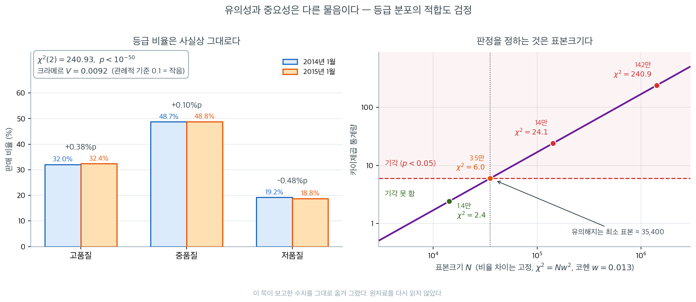

# 이표본 t-검정 (대마초 가격)

## 개요

이 페이지는 2014년 1월과 2015년 1월 California 고품질 대마초 가격에 완전한 가설검정 흐름을 적용한다. 네 단계는 다음과 같다: Shapiro-Wilk 검정으로 정규성 확인, 신뢰구간 구성, 독립 이표본 $t$-검정 수행, 품질 등급 비율에 대한 카이제곱 적합도 검정. 이 보기는 모수적 검정을 적용하기 전에 가정을 확인하는 일의 중요성을 강조한다.

---

## 1. 1단계 — 정규성 확인 (Shapiro-Wilk)

이표본 $t$-검정은 각 표본이 정규모집단에서 나왔다고 가정한다. Shapiro-Wilk 검정이 이를 확인한다:

$$
H_0\colon \text{the data are normally distributed}, \qquad H_1\colon \text{the data are not normally distributed}.
$$

p-값이 크면($> 0.05$) 정규성에 반하는 증거가 없다는 뜻이다.

<div class="exbox" markdown>

**보기 1.** <span class="diff easy" title="쉬움"></span> 두 주의 가격 자료와 정규성 검정. 아래 두 배열은 2014년 1월과 2015년 1월의 California 고품질 대마초 가격이다. Shapiro-Wilk 검정이 둘 다 $p > 0.05$를 주어 "정규성에 반하는 증거가 없다"고 말한다.

**(1)** Shapiro-Wilk 검정이 검사하는 것과 **검사하지 않는 것**을 적으시오. 이 자료가 i.i.d. 표본인지 판정할 진단 세 가지를 세우고, 자료가 (ㄱ) 독립일 때와 (ㄴ) 완전한 등차수열일 때 각 진단이 얼마가 되어야 하는지 미리 계산하시오.

**(2)** 그 진단을 실제로 계산해 어느 쪽에 가까운지 판정하시오.

</div>

??? success "풀이"

    **(1) Shapiro-Wilk 은 모양만 본다.** 이 검정은 순서통계량과 정규분위수의 상관을 재는 것이므로 **관측값의 순서를 뒤섞어도 값이 변하지 않는다.** 그러므로 검사하는 것은 "주변분포의 모양이 정규인가"뿐이고, 검사하지 **않는** 것이 독립성·등분산성·관측 순서에 실린 추세다. $t$ 검정이 요구하는 가정은 정규성과 **독립성** 둘인데, 이 검정은 앞의 하나만 본다.

    독립성을 보는 진단 셋을 세운다.

    1. **차분의 부호.** 독립인 표본이면 $x_{i+1} - x_i$의 부호가 대략 반반이어야 한다. 음수의 개수는 $\text{Bin}(n-1, 1/2)$을 따르므로 $n = 31$에서 평균 $15$, 표준편차 $2.74$다.
    2. **지연 1 표본상관** $r_1 = \operatorname{corr}(x_{1:n-1},\, x_{2:n})$. 독립이면 $0$ 둘레에 표준오차 $1/\sqrt n = 0.180$으로 흩어진다. 반대로 자료가 **완전한 등차수열**이면 $x_{i+1} = x_i + c$라는 아핀 관계가 성립하므로 $r_1$이 **정확히 1**이다.
    3. **더빈-왓슨 통계량** $d = \sum_i (r_{i+1}-r_i)^2 / \sum_i r_i^2$($r_i$는 평균을 뺀 잔차). 독립이면 $E[d] \approx 2$다. 완전한 등차수열이면 손으로 계산할 수 있다. 기울기 $g$인 직선에서 $r_i = g\bigl(i - \tfrac{n-1}{2}\bigr)$이므로

    $$
    \sum_i (r_{i+1}-r_i)^2 = (n-1)g^2,
    \qquad
    \sum_i r_i^2 = g^2\,\frac{n(n^2-1)}{12}
    $$

    이고 따라서

    $$
    d = \frac{12(n-1)}{n(n^2-1)} = \frac{12}{n(n+1)}
    = \frac{12}{31 \times 32} = 0.012097.
    $$

    **$g$가 약분되어 사라지는 것에 주목하라.** 추세의 기울기가 얼마든 완전한 직선이면 더빈-왓슨이 이 값 하나로 정해진다. 독립일 때의 2와 두 자릿수 차이이므로, 두 가설을 가르는 데 모호함이 없다.

    **(2) 수치적으로.** 먼저 자료와 Shapiro-Wilk 검정이다.

    ```python
    import numpy as np
    from scipy import stats

    np.random.seed(42)

    CA_JAN2014 = np.array([
        248.75, 248.59, 248.63, 248.37, 248.02, 247.68, 247.36,
        246.85, 246.44, 246.06, 245.81, 245.48, 245.18, 244.87,
        244.55, 244.23, 243.89, 243.60, 243.34, 243.08, 242.85,
        242.64, 242.36, 242.15, 241.88, 241.64, 241.40, 241.14,
        240.91, 240.65, 240.42,
    ])

    CA_JAN2015 = np.array([
        245.02, 244.88, 244.76, 244.65, 244.53, 244.42, 244.30,
        244.18, 244.08, 243.97, 243.85, 243.74, 243.63, 243.52,
        243.40, 243.28, 243.17, 243.06, 242.95, 242.83, 242.72,
        242.61, 242.49, 242.38, 242.27, 242.15, 242.04, 241.93,
        241.81, 241.70, 241.59,
    ])

    for label, data in [("Jan 2014", CA_JAN2014), ("Jan 2015", CA_JAN2015)]:
        # 여기서는 H0가 "정규분포를 따른다"이다. 보통과 방향이 반대다.
        # 그래서 p가 크면 "정규성에 반하는 증거가 없다"는 뜻이고,
        # 이것을 "정규성이 확인되었다"로 읽으면 안 된다.
        stat, p = stats.shapiro(data)
        print(f"Shapiro-Wilk ({label}): W={stat:.4f}, p={p:.4f}")
    ```

    출력:

    ```
    Shapiro-Wilk (Jan 2014): W=0.9402, p=0.0835
    Shapiro-Wilk (Jan 2015): W=0.9587, p=0.2694
    ```

    이제 독립성을 본다.

    ```python
    n = len(CA_JAN2014)
    print(f"n = {n}")
    print(f"완전한 등차수열이라면 DW = 12/(n(n+1)) = {12 / (n * (n + 1)):.6f}, "
          f"지연 1 상관 = 1")
    print(f"독립 표본이라면       DW ~ 2,  지연 1 상관 ~ 0 "
          f"(표준오차 약 {1 / np.sqrt(n):.3f})")

    print(f"\n{'자료':>9} {'차분<0':>7} {'지연1 r':>9} {'DW':>9} "
          f"{'추세 r^2':>9} {'기울기':>9} {'잔차 sd':>9}")
    for label, data in [("Jan 2014", CA_JAN2014), ("Jan 2015", CA_JAN2015)]:
        d = np.diff(data)
        r_lag = np.corrcoef(data[:-1], data[1:])[0, 1]
        resid = data - data.mean()
        dw = np.sum(np.diff(resid) ** 2) / np.sum(resid ** 2)
        t = np.arange(n)
        fit = stats.linregress(t, data)
        resid_tr = data - (fit.intercept + fit.slope * t)
        print(f"{label:>9} {int((d < 0).sum()):4d}/{len(d):<3d} {r_lag:9.6f} "
              f"{dw:9.6f} {fit.rvalue**2:9.6f} {fit.slope:9.4f} "
              f"{resid_tr.std(ddof=1):9.4f}")
    print(f"\n전체 표준편차: 2014 {CA_JAN2014.std(ddof=1):.4f}, "
          f"2015 {CA_JAN2015.std(ddof=1):.4f}")
    ```

    출력:

    ```
    n = 31
    완전한 등차수열이라면 DW = 12/(n(n+1)) = 0.012097, 지연 1 상관 = 1
    독립 표본이라면       DW ~ 2,  지연 1 상관 ~ 0 (표준오차 약 0.180)

           자료    차분<0     지연1 r        DW    추세 r^2       기울기     잔차 sd
     Jan 2014   29/30   0.999396  0.011950  0.993389   -0.2926    0.2170
     Jan 2015   30/30   0.999976  0.012322  0.999952   -0.1135    0.0072

    전체 표준편차: 2014 2.6689, 2015 1.0320
    ```

    **세 진단이 모두 "등차수열" 쪽을 가리킨다.** 차분이 음수인 횟수가 $29/30$과 $30/30$이다. 독립이라면 $\text{Bin}(30, 1/2)$에서 29 이상이 나올 확률이 $3\times10^{-8}$이다. 지연 1 상관이 $0.9994$와 $0.99998$로 거의 1이고, 더빈-왓슨이 $0.0120$과 $0.0123$으로 완전한 직선의 값 $0.012097$과 소수 셋째 자리까지 같다. 선형 추세의 $r^2$은 $0.9934$와 **$0.99995$**다.

    **이 두 배열은 독립표본이 아니라 한 달 동안의 시계열이다.** 2015년 자료는 특히 극단적이다. 하루에 $0.1135$달러씩 내려가는 거의 완전한 직선이고, 추세를 뺀 잔차의 표준편차가 $0.0072$달러로 전체 표준편차 $1.0320$의 $0.7\%$에 지나지 않는다.

    그러므로 Shapiro-Wilk 검정을 통과했다는 사실은 $t$ 검정의 가정이 선다는 뜻이 **아니다.** 통과한 것은 가정 둘 가운데 하나이고, 깨진 쪽이 더 치명적인 쪽이다. 다음 보기에서 그 대가를 수로 잰다.

    !!! warning "이 쪽의 계산을 어떻게 읽어야 하는가"
        아래의 신뢰구간·$t$ 검정·p-값은 모두 "관측값이 독립"이라는 전제 위에서 계산된 것이다. 이 쪽은 **검정 절차의 흐름을 익히는 보기**로 읽어야 하며, 보고된 p-값을 California 가격에 대한 추론으로 받아들여서는 안 된다. 추세가 있는 시계열에서 평균을 비교하려면 시계열 모형(추세항을 넣은 회귀, 뉴이-웨스트 표준오차 등)이 필요하다.

---

## 2. 2단계 — 평균의 신뢰구간

정규성을 가정할 때 평균의 $100(1-\alpha)\%$ 신뢰구간은

$$
\bar{x} \pm t_{\alpha/2,\, n-1} \cdot \frac{s}{\sqrt{n}}.
$$

<div class="exbox" markdown>

**보기 2.** <span class="diff easy" title="쉬움"></span> 신뢰구간 함수. 아래 함수는 $\bar x \pm t_{0.975,\,n-1}\, s/\sqrt n$을 돌려준다. 2014년에 $[243.50,\ 245.46]$, 2015년에 $[242.91,\ 243.67]$을 얻는다. 그런데 보기 1에서 이 자료의 독립성이 깨져 있음을 보았다.

**(1)** 지연 1 상관이 $\rho$인 정상 AR(1) 자료에서 $\operatorname{Var}(\bar X)$가 독립일 때의 몇 배인지 식으로 쓰고, 보기 1이 잰 $\rho$에서 **유효표본크기**를 구하시오. 흔히 쓰는 점근식 $(1+\rho)/(1-\rho)$를 여기에 그대로 쓸 수 있는가.

**(2)** 소박한 $t$ 구간의 **포함률**이 $\rho$에 따라 어떻게 되는지 예측하고 모의실험으로 확인하시오.

</div>

??? success "풀이"

    **(1) 분산팽창계수.** 정상 AR(1)에서 $\operatorname{Cov}(X_i, X_j) = \gamma_0 \rho^{|i-j|}$이므로

    $$
    \operatorname{Var}(\bar X)
    = \frac{1}{n^2}\sum_{i}\sum_{j} \gamma_0\rho^{|i-j|}
    = \frac{\gamma_0}{n}\,f_n(\rho),
    \qquad
    f_n(\rho) = 1 + 2\sum_{k=1}^{n-1}\left(1 - \frac kn\right)\rho^k
    $$

    이다. 유효표본크기는 $n_{\text{eff}} = n/f_n(\rho)$다.

    $n \to \infty$에서 $f_n \to (1+\rho)/(1-\rho)$이고 이 점근식이 널리 쓰이지만, **여기서는 쓸 수 없다.** $\rho = 0.9994$를 넣으면 $(1+\rho)/(1-\rho) = 3310$이 되어 $n_{\text{eff}} = 31/3310 = 0.009$라는 뜻 없는 값이 나온다. $f_n$은 정의상 $n$을 넘을 수 없으므로($\rho = 1$에서 $f_n = n$) $n_{\text{eff}} \ge 1$이다. 유한한 $n$에서는 합을 그대로 계산해야 하며, 그러면 $f_n(0.9994) = 30.81$, 곧

    $$
    n_{\text{eff}} = \frac{31}{30.81} = 1.006
    $$

    이다. **관측값이 31개지만 평균에 대해서는 사실상 한 개짜리 표본이다.** $\rho = 0.99998$인 2015년 자료는 $1.0002$로 더 심하다.

    **(2) 포함률.** 소박한 구간은 참 표준오차 $\sqrt{\gamma_0 f_n/n}$ 대신 $s/\sqrt n$을 쓴다. AR(1)에서

    $$
    E[s^2] = \gamma_0\,\frac{n - f_n}{n-1}
    $$

    이므로(표본분산도 자기상관 때문에 $\gamma_0$을 과소추정한다), 구간의 반너비와 참 표준편차의 비는

    $$
    \frac{t_{0.975,\,n-1}\sqrt{E[s^2]/n}}{\sqrt{\gamma_0 f_n/n}}
    = t_{0.975,\,n-1}\sqrt{\frac{n-f_n}{(n-1)f_n}}
    $$

    이고, 포함률은 대략 그 값을 $t_{n-1}$의 분포함수에 넣은 것의 양쪽 합이다. $\rho = 0$이면 $f_n = 1$이 되어 정확히 $0.95$를 준다.

    **수치적으로.**

    ```python
    def confidence_interval(data, confidence=0.95):
        n = len(data)
        m = data.mean()
        # stats.sem은 ddof=1로 계산한 s를 sqrt(n)으로 나눈 표준오차다.
        se = stats.sem(data)
        h = se * stats.t.ppf((1 + confidence) / 2, n - 1)
        return m - h, m + h

    ci14 = confidence_interval(CA_JAN2014)
    ci15 = confidence_interval(CA_JAN2015)
    print(f"Jan 2014 95% CI: [{ci14[0]:.2f}, {ci14[1]:.2f}]")
    print(f"Jan 2015 95% CI: [{ci15[0]:.2f}, {ci15[1]:.2f}]")
    ```

    출력:

    ```
    Jan 2014 95% CI: [243.50, 245.46]
    Jan 2015 95% CI: [242.91, 243.67]
    ```

    ```python
    def f_inflation(rho, n):
        """AR(1) 에서 Var(X-bar) 가 독립일 때의 몇 배인가."""
        k = np.arange(1, n)
        return 1 + 2 * np.sum((1 - k / n) * rho ** k)


    print("  rho      f_n     n_eff = n/f_n    점근식 (1+rho)/(1-rho)")
    for rho in (0.5, 0.9, 0.99, 0.999396, 0.999976):
        f = f_inflation(rho, n)
        print(f"{rho:9.6f} {f:8.4f} {n / f:12.4f} {(1 + rho) / (1 - rho):18.1f}")

    print("\n2015 자료의 산포는 어디서 오는가")
    print(f"  2015 전체 표준편차 {CA_JAN2015.std(ddof=1):.4f} 가운데")
    t = np.arange(n)
    fit15 = stats.linregress(t, CA_JAN2015)
    resid15 = CA_JAN2015 - (fit15.intercept + fit15.slope * t)
    print(f"    추세가 설명하는 몫 {fit15.rvalue**2 * 100:.4f}% (r^2),")
    print(f"    잔차에 남는 표준편차 {resid15.std(ddof=1):.4f}")

    # 포함률 모의실험: AR(1) 자료에 소박한 t 구간을 씌운다
    tc = stats.t.ppf(0.975, n - 1)
    rng = np.random.default_rng(5)
    B = 40_000
    print(f"\n정상 AR(1) 자료에서 소박한 95% t 구간의 포함률 (n = {n}, 반복 {B:,})")
    print("  rho    이론 예측   모의 포함률")
    for rho in (0.0, 0.5, 0.9, 0.99):
        f = f_inflation(rho, n)
        arg = tc * np.sqrt((n - f) / ((n - 1) * f))
        pred = 2 * stats.t.cdf(arg, n - 1) - 1
        e = rng.standard_normal((B, n))
        x = np.empty((B, n))
        x[:, 0] = e[:, 0]
        for j in range(1, n):
            x[:, j] = rho * x[:, j - 1] + np.sqrt(1 - rho ** 2) * e[:, j]
        m, s = x.mean(1), x.std(1, ddof=1)
        cov = np.mean(np.abs(m) <= tc * s / np.sqrt(n))
        print(f"{rho:6.2f}   {pred:9.4f}   {cov:11.4f}")
    ```

    출력:

    ```
      rho      f_n     n_eff = n/f_n    점근식 (1+rho)/(1-rho)
     0.500000   2.8710      10.7978                3.0
     0.900000  13.4151       2.3108               19.0
     0.990000  28.0196       1.1064              199.0
     0.999396  30.8076       1.0062             3310.3
     0.999976  30.9923       1.0002            83332.3

    2015 자료의 산포는 어디서 오는가
      2015 전체 표준편차 1.0320 가운데
        추세가 설명하는 몫 99.9952% (r^2),
        잔차에 남는 표준편차 0.0072

    정상 AR(1) 자료에서 소박한 95% t 구간의 포함률 (n = 31, 반복 40,000)
      rho    이론 예측   모의 포함률
      0.00      0.9500        0.9512
      0.50      0.7476        0.7414
      0.90      0.3275        0.3104
      0.99      0.0960        0.0917
    ```

    **유효표본크기가 1로 주저앉는다.** $\rho = 0.5$에서도 $31$개가 $10.8$개로 줄고, $\rho = 0.9$에서 $2.3$개, 보기 1이 잰 $\rho$에서는 $1.0$이다. **"$n = 31$"이라는 수가 구간의 너비를 정하는데, 그 31이 가짜다.**

    **포함률도 함께 무너진다.** 명목 $95\%$ 구간의 실제 포함률이 $\rho = 0.5$에서 $0.74$, $\rho = 0.9$에서 $0.31$, $\rho = 0.99$에서 $0.09$다. 이론 예측 $0.7476$, $0.3275$, $0.0960$이 모의값 $0.7414$, $0.3104$, $0.0917$을 따라간다. 세 자리 모두 예측이 $1\sim2$%포인트 **높게** 나오는데, $s^2$을 그 기댓값으로 대신하고 $\bar X$와 $s^2$ 사이의 상관을 무시한 어림이라 그렇다. 방향과 크기는 맞는다.

    여기서 유의할 것은 **구간이 좁아지는 쪽으로 틀린다**는 점이다. 2015년 구간이 2014년보다 훨씬 좁은 것도 "그해 가격 변동이 작았다"기보다 **그해 추세가 더 매끄러운 직선이었다**는 뜻이다. 추세가 깨끗하면 $s$가 작아지고 구간이 좁아지는데, 그 좁음은 정밀도가 아니라 가정 위반의 크기를 재고 있다.

    두 구간이 $243.50$과 $243.67$에서 겹치는데도 다음 보기의 $t$ 검정이 기각하는 것은 별개의 문제다. **"구간이 겹치면 차이가 없다"는 경험칙 자체가 보수적**이기 때문이며, 연습문제 6에서 그 규칙이 실제로 어느 수준의 검정에 해당하는지, 몇 % 구간을 그려야 $t$ 검정과 맞아떨어지는지 계산한다. 올바른 비교는 각 평균의 구간이 아니라 **차이**의 구간을 보는 것이다.

---

## 3. 3단계 — 독립 이표본 t-검정

두 해의 평균 가격이 같은지 검정한다:

$$
H_0\colon \mu_{2014} = \mu_{2015}, \qquad H_1\colon \mu_{2014} \neq \mu_{2015}.
$$

(등분산을 가정한) 합동 이표본 $t$-통계량은

$$
t = \frac{\bar{x} - \bar{y}}{s_p \sqrt{\frac{1}{n_1} + \frac{1}{n_2}}}, \qquad s_p^2 = \frac{(n_1 - 1)s_x^2 + (n_2 - 1)s_y^2}{n_1 + n_2 - 2}.
$$

<div class="exbox" markdown>

**보기 3.** <span class="diff easy" title="쉬움"></span> 합동 t-검정. 두 표본의 표준편차가 $2.669$와 $1.032$로 분산비가 $6.69$배다. 등분산 가정과는 거리가 멀다.

**(1)** 그럼에도 **합동 $t$와 Welch $t$의 통계량이 같은 수**가 되는 까닭을 적고, 두 p-값이 갈리는 원인이 무엇인지 말하시오.

**(2)** 이 설계($n_1 = n_2 = 31$, 분산비 $6.69$)에서 합동 $t$의 **실제 제1종 오류율**을 예측하고 모의실험으로 확인하시오.

</div>

??? success "풀이"

    **(1) 균형이 구해 준다.** [이표본 평균 검정](test_two_means.md)의 보기 1에서

    $$
    \text{SE}_{\text{pool}}^2 - \text{SE}_{\text{welch}}^2
    = \frac{(N-1)(n_1-n_2)(s_1^2-s_2^2)}{(N-2)\,n_1n_2}
    $$

    를 얻었다. $n_1 = n_2 = 31$이므로 **분산비가 얼마든 차가 정확히 0**이고 두 통계량은 같은 수 $2.3167$이다.

    남는 차이는 자유도뿐이다. 합동은 $N - 2 = 60$을 쓰고 Welch는 $\nu = 38.78$을 쓴다. 균형 설계의 공식 $\nu = (n-1)(1+\rho)^2/(1+\rho^2)$에 $\rho = s_2^2/s_1^2 = 0.1495$를 넣은 값이다. 그래서 p-값이 $0.023951$(합동)과 $0.025894$(Welch)로 갈린다. **합동 쪽이 작은 것은 자유도를 60이라고 주장하기 때문이고, 그 주장이 과하다.**

    **(2) 실제 오류율.** [5.3절](../../ch05/applications/diff_means_welch.md)의 결과를 쓴다. 균형 설계에서는 합동분산이 겨누는 값이 참 분산과 정확히 같아 척도 배율 $R = 1$이지만, 분모의 흔들림을 맞춘 자유도

    $$
    m = \frac{(d_1\sigma_1^2 + d_2\sigma_2^2)^2}{d_1\sigma_1^4 + d_2\sigma_2^4}
    = (n-1)\frac{(1+\rho)^2}{1+\rho^2}
    \qquad (\rho = \sigma_2^2/\sigma_1^2)
    $$

    은 60보다 작다. 관측된 $s_i$를 $\sigma_i$로 삼으면 $m = 38.78$이고(균형 설계에서 $m$은 Welch 자유도의 공식과 같은 식이 된다),

    $$
    P\bigl(\lvert T_{\text{pool}}\rvert > t_{0.975,\,60}\bigr)
    \approx P\bigl(\lvert t_{38.78}\rvert > 2.000298\bigr) = 0.052507
    $$

    을 예측한다. **명목 $0.05$가 $0.0525$로 $5\%$ 부푸는 데 그친다.** 분산비가 $6.69$나 되는데도 이만큼인 것이 균형의 힘이다.

    **수치적으로.**

    ```python
    # equal_var=True는 합동 t-검정이다. scipy의 기본값이기도 하다.
    t_stat, p_val = stats.ttest_ind(CA_JAN2014, CA_JAN2015, equal_var=True)
    print(f"t-statistic: {t_stat:.4f}")
    print(f"p-value:     {p_val:.6f}")
    print("Reject H0" if p_val < 0.05 else "Fail to reject H0")
    ```

    출력:

    ```
    t-statistic: 2.3167
    p-value:     0.023951
    Reject H0
    ```

    ```python
    s1 = CA_JAN2014.std(ddof=1)
    s2 = CA_JAN2015.std(ddof=1)
    d1 = d2 = n - 1
    se_w = np.sqrt(s1**2 / n + s2**2 / n)
    sp2 = (d1 * s1**2 + d2 * s2**2) / (d1 + d2)
    se_p = np.sqrt(sp2 * (2 / n))
    diff = CA_JAN2014.mean() - CA_JAN2015.mean()
    print(f"분산비 s1^2/s2^2 = {s1**2 / s2**2:.6f}  (표준편차로는 {s1 / s2:.6f} 배)")
    print(f"SE_welch = {se_w:.12f}")
    print(f"SE_pool  = {se_p:.12f}   차 = {se_p - se_w:.3e}")
    print(f"t_welch = {diff / se_w:.12f}")
    print(f"t_pool  = {diff / se_p:.12f}")

    nu = (s1**2 / n + s2**2 / n) ** 2 / ((s1**2 / n) ** 2 / d1 + (s2**2 / n) ** 2 / d2)
    print(f"\n자유도: 합동 {2 * n - 2},  Welch {nu:.6f}")
    print(f"p-값:   합동 {2 * stats.t.sf(diff / se_p, 2 * n - 2):.6f},  "
          f"Welch {2 * stats.t.sf(diff / se_w, nu):.6f}")

    # 균형 설계에서 합동 t 의 실제 수준 (5.3 절의 m)
    rho = s2**2 / s1**2
    m = d1 * (1 + rho) ** 2 / (1 + rho**2)
    crit = stats.t.ppf(0.975, 2 * n - 2)
    print(f"\n관측된 s 를 sigma 로 삼으면 m = {m:.6f}  (R = 1, 균형이므로)")
    print(f"다듬은 어림 P(|t_m| > {crit:.6f}) = {2 * stats.t.sf(crit, m):.6f}")

    rng = np.random.default_rng(23)
    B = 200_000
    x = rng.normal(0, s1, (B, n))
    y = rng.normal(0, s2, (B, n))
    dd = x.mean(1) - y.mean(1)
    v1, v2 = x.var(1, ddof=1), y.var(1, ddof=1)
    t_pool_sim = dd / np.sqrt(((d1 * v1 + d2 * v2) / (2 * n - 2)) * (2 / n))
    a, b = v1 / n, v2 / n
    t_welch_sim = dd / np.sqrt(a + b)
    nu_sim = (a + b) ** 2 / (a**2 / d1 + b**2 / d2)
    print(f"\n반복 {B:,} 회 (오차 약 ±0.0005)")
    print(f"  합동 t 의 실제 수준  = {np.mean(np.abs(t_pool_sim) > crit):.5f}")
    print(f"  Welch 의 실제 수준   = "
          f"{np.mean(np.abs(t_welch_sim) > stats.t(nu_sim).ppf(0.975)):.5f}")
    print(f"  실현된 nu 의 평균 {nu_sim.mean():.4f}, "
          f"범위 [{nu_sim.min():.4f}, {nu_sim.max():.4f}]  (한계 {n - 1} 과 {2 * n - 2})")
    ```

    출력:

    ```
    분산비 s1^2/s2^2 = 6.687940  (표준편차로는 2.586105 배)
    SE_welch = 0.513938489917
    SE_pool  = 0.513938489917   차 = 0.000e+00
    t_welch = 2.316707513931
    t_pool  = 2.316707513931

    자유도: 합동 60,  Welch 38.775185
    p-값:   합동 0.023951,  Welch 0.025894

    관측된 s 를 sigma 로 삼으면 m = 38.775185  (R = 1, 균형이므로)
    다듬은 어림 P(|t_m| > 2.000298) = 0.052507

    반복 200,000 회 (오차 약 ±0.0005)
      합동 t 의 실제 수준  = 0.05265
      Welch 의 실제 수준   = 0.05015
      실현된 nu 의 평균 39.2630, 범위 [31.6778, 59.8803]  (한계 30 과 60)
    ```

    **두 표준오차의 차가 정확히 $0$이다.** 부동소수점 반올림조차 없다. 두 $t$ 통계량이 소수 열두째 자리까지 같다.

    **예측한 오류율도 맞는다.** 다듬은 어림 $0.052507$에 대해 모의실험이 $0.05265$를 주었다(오차 $\pm0.0005$). Welch는 $0.05015$다. 실현된 $\nu$가 평균 $39.26$, 범위 $[31.68,\ 59.88]$로 한계 $[30,\ 60]$ 안에 있다.

    그러므로 $p = 0.024$와 $0.026$ 가운데 어느 것을 보고해도 결론은 같고, 이 자료에서 등분산 가정이 일으키는 왜곡은 작다. **이 쪽에서 실제로 문제가 되는 가정은 등분산이 아니라 보기 1에서 본 독립성이다.** 연습문제 3이 Welch로 다시 계산하지만, 둘 다 독립성을 전제한다는 점에서는 같은 배를 타고 있다.

---

## 4. 4단계 — 카이제곱 적합도 검정

품질 등급 분포(High, Medium, Low)가 두 해 사이에 달라졌는지 확인하기 위해 카이제곱 적합도 검정을 쓴다:

$$
\chi^2 = \sum_{i=1}^k \frac{(O_i - E_i)^2}{E_i},
$$

여기서 $O_i$는 관측도수이고 $E_i$는 2014년 분포에 기반한 기대도수이다. $H_0$(변화 없음) 아래에서 $\chi^2 \sim \chi^2_{k-1}$이다.

<div class="exbox" markdown>

**보기 4.** <span class="diff easy" title="쉬움"></span> 적합도 검정으로 본 판매량. 2014년 등급별 판매 건수가 $(453020,\ 688699,\ 271937)$, 2015년이 $(461900,\ 695432,\ 267120)$이다.

**(1)** $\chi^2 = N w^2$임을 보이고($w^2 = \sum_i (p_i^{15} - p_i^{14})^2/p_i^{14}$), 자유도가 왜 $k - 1 = 2$인지 적으시오. 크라메르 $V$를 $w$로 쓰시오.

**(2)** $\chi^2 = 240.93$을 재현하고 **셀별로 분해**하시오. 어느 등급이 통계량을 지배하는가. 같은 비율 차이로 기각하는 데 필요한 최소 $N$은 얼마인가.

</div>

??? success "풀이"

    **(1) 해석적으로.** 기대도수를 $E_i = N p_i^{14}$($N$은 2015년 총합), 관측도수를 $O_i = N p_i^{15}$로 쓰면

    $$
    \chi^2 = \sum_i \frac{(Np_i^{15} - Np_i^{14})^2}{Np_i^{14}}
    = N \sum_i \frac{(p_i^{15}-p_i^{14})^2}{p_i^{14}}
    = N w^2
    $$

    이다. **$N$이 통계량 앞에 상수배로 붙어 나온다.** 비율이 그대로인 채 자료의 양만 $c$배가 되면 통계량도 $c$배가 된다.

    자유도는 $k - 1 = 2$다. 셀이 셋이고 제약이 $\sum_i O_i = \sum_i E_i$ 하나뿐이기 때문이다. **기대비율을 2015년 자료에서 추정한 것이 아니라 2014년에서 가져왔으므로 추정으로 잃는 자유도가 없다.** 만약 2014년 자료의 불확실성까지 셈에 넣고 싶으면 이것은 적합도 검정이 아니라 $2\times3$ 동질성 검정이 되고, 자유도는 $(2-1)(3-1) = 2$로 같지만 기대도수의 계산이 달라진다.

    크라메르 $V$는 $\chi^2$을 $N$과 자유도의 상한으로 정규화한 것이므로

    $$
    V = \sqrt{\frac{\chi^2}{N(k-1)}} = \frac{w}{\sqrt{k-1}} = \frac{w}{\sqrt2}
    $$

    다. **$N$이 약분되어 사라지는 것이 요점이다.** $V$는 자료의 양과 무관하게 내용만 재고, $\chi^2$은 둘을 섞는다.

    **(2) 수치적으로.**

    ```python
    counts_2014 = np.array([453020, 688699, 271937])
    observed_2015 = np.array([461900, 695432, 267120])

    # 2014년 도수를 2015년 총합에 맞춰 축척한다.
    # chisquare는 sum(E) == sum(O)를 요구하며, 이 줄을 빠뜨리면
    # "총합이 다르다"는 사실이 통계량에 섞여 들어가 무의미한 값이 나온다.
    expected_2015 = counts_2014 / counts_2014.sum() * observed_2015.sum()

    chi2, p_chi = stats.chisquare(observed_2015, f_exp=expected_2015)
    print(f"Chi-square stat: {chi2:.2f}, p-value: {p_chi:.6f}")
    ```

    출력:

    ```
    Chi-square stat: 240.93, p-value: 0.000000
    ```

    ```python
    p14 = counts_2014 / counts_2014.sum()
    p15 = observed_2015 / observed_2015.sum()
    N = observed_2015.sum()
    labels = ("고품질", "중품질", "저품질")

    print(f"N(2014) = {counts_2014.sum():,},  N(2015) = {N:,}")
    print(f"{'등급':>7} {'2014 비율':>10} {'2015 비율':>10} {'차(%p)':>9} "
          f"{'기대도수':>13} {'기여':>10} {'몫':>7}")
    contrib = (observed_2015 - expected_2015) ** 2 / expected_2015
    for lab, a, b, e, c in zip(labels, p14, p15, expected_2015, contrib):
        print(f"{lab:>7} {a:10.6f} {b:10.6f} {(b - a) * 100:9.4f} "
              f"{e:13.2f} {c:10.4f} {c / contrib.sum():7.4f}")
    print(f"{'합':>7} {p14.sum():10.6f} {p15.sum():10.6f} {'':9} "
          f"{expected_2015.sum():13.2f} {contrib.sum():10.4f} {1.0:7.4f}")

    w2 = np.sum((p15 - p14) ** 2 / p14)
    print(f"\nw^2 = sum (p15-p14)^2/p14 = {w2:.9f},  w = {np.sqrt(w2):.6f}")
    print(f"N * w^2 = {N * w2:.6f}   (= chi2 = {chi2:.6f})")
    print(f"크라메르 V = w/sqrt(k-1) = {np.sqrt(w2 / 2):.6f}")
    print(f"자유도 = k - 1 = {len(p14) - 1}  "
          f"(기대비율을 2014 에서 가져왔으므로 추정한 모수가 없다)")
    print(f"기각에 필요한 N = chi2_(0.95,2)/w^2 = "
          f"{stats.chi2.ppf(0.95, 2) / w2:.1f}")
    ```

    출력:

    ```
    N(2014) = 1,413,656,  N(2015) = 1,424,452
         등급    2014 비율    2015 비율     차(%p)          기대도수         기여       몫
        고품질   0.320460   0.324265    0.3805     456479.68    64.3617  0.2671
        중품질   0.487176   0.488210    0.1034     693958.55     3.1285  0.0130
        저품질   0.192364   0.187525   -0.4840     274013.77   173.4365  0.7199
          합   1.000000   1.000000              1424452.00   240.9268  1.0000

    w^2 = sum (p15-p14)^2/p14 = 0.000169136,  w = 0.013005
    N * w^2 = 240.926777   (= chi2 = 240.926777)
    크라메르 V = w/sqrt(k-1) = 0.009196
    자유도 = k - 1 = 2  (기대비율을 2014 에서 가져왔으므로 추정한 모수가 없다)
    기각에 필요한 N = chi2_(0.95,2)/w^2 = 35423.8
    ```

    **$N w^2 = 240.926777$이 `scipy`의 $\chi^2$과 소수 여섯째 자리까지 같다.** $w = 0.013005$, 크라메르 $V = 0.009196$이다.

    **저품질 등급 하나가 통계량의 $72\%$를 만든다.** 기여도가 고품질 $64.36$($26.7\%$), 중품질 $3.13$($1.3\%$), 저품질 $173.44$($72.0\%$)다. 비율 변화가 $+0.38$%p, $+0.10$%p, $-0.48$%p이므로 가장 많이 움직인 셀이 가장 많이 기여하는데, 분모 $p_i^{14}$가 작을수록($0.192$) 같은 %p 차이가 더 크게 셈되는 것도 함께 작용한다. **"무엇이 달라졌는가"를 묻는다면 답은 "저품질의 비중이 0.48%p 줄었다"이고, 그것이 전부다.**

    기각에 필요한 최소 $N$은 $\chi^2_{0.95,\,2}/w^2 = 35{,}424$다. 실제 자료의 $N$은 $1{,}424{,}452$로 그 $40$배이므로 통계량이 $240.93$까지 올라간다.

    $\chi^2 = 240.9$로 엄청나게 크지만, 이 결과를 실질적 변화의 크기로 읽으면 안 된다. 비율이 실제로 얼마나 바뀌었는지 보면 고품질이 $32.0\%$에서 $32.4\%$로, 중품질이 $48.7\%$에서 $48.8\%$로, 저품질이 $19.2\%$에서 $18.8\%$로 움직였을 뿐이다. 관측값이 142만 건이나 되기 때문에 이 정도의 미세한 차이도 통계적으로는 압도적인 증거가 된다.

    **표본이 아주 크면 거의 모든 귀무가설이 기각된다.** p-값과 효과크기를 반드시 함께 보아야 하는 이유다.



그림은 이 쪽이 이미 보고한 수치를 그대로 옮겨 그린 것이다(원자료를 다시 읽지 않았다). 왼쪽은 보기 4의 등급 비율이고, 오른쪽은 연습문제 7이 만든 표본 축소표를 곡선으로 이은 것이다. 왼쪽 막대 여섯 개를 눈으로 훑어서는 두 해의 차이를 찾아내기 어렵다. 고품질이 32.0%에서 32.4%로, 중품질이 48.7%에서 48.8%로, 저품질이 19.2%에서 18.8%로 움직였을 뿐이고, 가장 큰 변화도 0.48%p다. 그런데 같은 표에서 계산한 통계량은 $\chi^2(2) = 240.93$, $p < 10^{-50}$이다. **눈으로는 찾을 수 없는 차이가 압도적인 증거로 보고되는 상황**이 왼쪽 그림 한 장에 들어 있다.

오른쪽이 그 역설의 정체를 보여 준다. 비율 차이를 그대로 붙들어 두고 표본크기만 바꾸면 $\chi^2 = N w^2$이므로 통계량은 $N$에 정비례해 직선으로 올라간다(로그-로그 축이라 기울기 1인 직선이다). 기각선 $\chi^2_{0.95,\,2} = 5.99$를 어디서 넘느냐는 전적으로 $N$이 정한다. 표본이 1.4만이면 $\chi^2 = 2.4$로 기각하지 못하고, 3.5만에서 겨우 선을 넘으며, 실제 자료의 142만에서는 240.9까지 치솟는다. **자료의 내용은 네 점에서 모두 똑같고, 달라진 것은 자료의 양뿐이다.**

그러므로 이 자료에서 $p$-값은 등급 분포가 얼마나 달라졌는지를 재는 도구가 아니라, 판매 건수가 얼마나 많은지를 재는 도구에 가깝다. 변화의 크기를 재려면 $N$으로 정규화한 값을 보아야 한다 — 크라메르 $V = 0.0092$는 "작다"는 관례적 기준 0.1의 십분의 일에도 못 미친다. 검정 결과를 보고할 때 왼쪽 그림(비율표)과 효과크기를 함께 놓아야 하는 이유이며, 분석을 시작하기 전에 "몇 %p부터 실질적으로 중요한 변화로 볼 것인가"를 미리 정해 두어야 하는 이유이기도 하다.

---

## 5. 해석

- **정규성**: 2014년 1월과 2015년 1월 가격 표본 모두 Shapiro-Wilk 검정을 통과한다. 다만 **그것으로 $t$ 검정의 가정이 선다고 읽어서는 안 된다.** 이 검정은 순서를 뒤섞어도 값이 변하지 않으므로 **독립성을 전혀 보지 않는다.** 실제로 두 배열은 독립표본이 아니라 거의 완전한 직선을 그리는 **시계열**이다 — 차분이 각각 $29/30$과 $30/30$이 음수이고, 시간 추세의 $r^2$가 $0.993$과 $0.99995$이며, 평균 모형 잔차의 더빈–왓슨이 $0.0120$과 $0.0123$으로 완전한 등차수열의 값 $12/\{n(n+1)\} = 0.0121$과 사실상 같다(독립이면 $2$ 근처여야 한다). 보기 1이 이 진단을 자세히 다룬다.
- **신뢰구간**: 2014년 평균은 \$244.48(95% 구간 $[243.50,\ 245.46]$), 2015년 평균은 \$243.29(95% 구간 $[242.91,\ 243.67]$)이다. **두 구간이 243.50에서 243.67까지 겹치지만 이것을 "차이가 없다"로 읽어서는 안 된다.** 구간이 떨어져 있으면 차이가 유의하다고 말할 수 있으나(보수적인 기준이다) 그 역은 성립하지 않는다. 이 자료가 바로 그 반례로, 구간이 겹치는데도 아래의 $t$-검정은 기각한다. 판단의 근거는 각 평균의 구간이 아니라 **차이의 구간** $[0.16,\ 2.22]$이며, 이 구간이 $0$을 포함하지 않는다(연습문제 6).
- **이표본 $t$-검정**: p-값이 0.05보다 작으면 California 고품질 대마초 가격이 2014년 1월에서 2015년 1월 사이에 유의하게 떨어졌다고 결론짓는다.
- **카이제곱 검정**: 적합도 검정은 고·중·저 품질을 구매한 고객의 비율이 두 해 사이에 달라졌는지 확인한다. 유의한 결과는 구매 패턴의 변화를 뜻한다.

---

## 연습문제

<div class="drillbox" markdown>

**연습문제 1.** <span class="diff easy" title="쉬움"></span> 2014년 1월 가격 평균의 99% 신뢰구간을 계산하라. 95% 구간과 비교하면 어떤가?

</div>

??? success "풀이"

    ```python
    ci99 = confidence_interval(CA_JAN2014, confidence=0.99)
    print(f"99% CI: [{ci99[0]:.2f}, {ci99[1]:.2f}]")
    ```

    출력:

    ```
    99% CI: [243.16, 245.80]
    ```

    95% 구간 $[243.50, 245.46]$과 견주면 너비가 1.96에서 2.64로 35% 늘었다. 임계값이 $t_{0.025,\,30} = 2.042$에서 $t_{0.005,\,30} = 2.750$으로 커졌기 때문이다.

    99% 신뢰구간은 $t_{0.025,\,30}$ 대신 $t_{0.005,\,30}$을 쓴다. $t_{0.005} > t_{0.025}$이므로 오차한계가 커지고 구간이 넓어진다. 일반적인 공식은

    $$
    \text{width} = 2 \cdot t_{\alpha/2,\,n-1} \cdot \frac{s}{\sqrt{n}}.
    $$

    명시한 포함확률을 유지하려면 신뢰수준이 높을수록 구간이 넓어야 한다. $\square$

---

<div class="drillbox" markdown>

**연습문제 2.** <span class="diff med" title="중간"></span> Shapiro-Wilk 검정은 표본이 작을 때 검정력이 낮다. $n = 10$이고 자료가 약간 정규가 아니라면 어떤 일이 생기겠는가? 이것이 뒤이은 $t$-검정의 신뢰도에 어떤 영향을 주는가?

</div>

??? success "풀이"

    $n = 10$이면 Shapiro-Wilk 검정의 검정력이 낮다: 자료가 어느 정도 정규가 아닌 분포에서 나와도 정규성을 기각하지 못할 가능성이 크다. 즉 가정이 깨져 있어도 정규성 검정을 "통과"할 수 있다.

    다만 $t$-검정은 약한 비정규성, 특히 대칭인 분포에는 꽤 로버스트하다. $n$이 작을 때 더 나은 전략은 Shapiro-Wilk 검정과 Q-Q 그림을 함께 보는 것이다. 심각한 비정규성이 의심되면 비모수적 대안(예: Mann-Whitney $U$ 검정)을 대신 써야 한다. $\square$

---

<div class="drillbox" markdown>

**연습문제 3.** <span class="diff med" title="중간"></span> 등분산 가정이 의심스럽다고 하자. Welch $t$-검정을 수행하고 결과를 비교하라. 언제 합동 검정보다 Welch를 선호해야 하는가?

</div>

??? success "풀이"

    ```python
    t_w, p_w = stats.ttest_ind(CA_JAN2014, CA_JAN2015, equal_var=False)
    print(f"Welch t = {t_w:.4f}, p = {p_w:.6f}")
    ```

    출력:

    ```
    Welch t = 2.3167, p = 0.025894
    ```

    통계량은 합동 검정과 정확히 같은 2.3167이고 p-값만 0.023951에서 0.025894로 커졌다. 두 표본의 크기가 같아서 통계량이 일치하고, 달라지는 것은 자유도뿐이기 때문이다. 결론은 둘 다 기각으로 같지만, 산포가 다른 자료에서는 Welch를 기본으로 삼는 편이 안전하다.

    Welch 검정은 등분산을 가정하지 않고 Welch-Satterthwaite 자유도를 쓴다:

    $$
    \text{df} = \frac{\left(\frac{s_x^2}{n_1} + \frac{s_y^2}{n_2}\right)^2}{\frac{(s_x^2/n_1)^2}{n_1-1} + \frac{(s_y^2/n_2)^2}{n_2-1}}.
    $$

    실무에서 Welch 검정은 분산이 같을 때 합동 검정에 거의 맞먹는 검정력을 내고 분산이 다를 때는 훨씬 믿을 만하다. 많은 통계학자가 Welch 검정을 기본으로 쓰기를 권한다. $\square$

---

<div class="drillbox" markdown>

**연습문제 4.** <span class="diff med" title="중간"></span> 카이제곱 적합도 검정에서 왜 2014년 비율을 기댓값으로 쓰는가? 기대도수를 2015년 합계에 맞추어 다시 축척하면 무엇이 달라지는가?

</div>

??? success "풀이"

    귀무가설은 2015년 품질 분포가 2014년과 같다는 것이다. 따라서 기대도수는 2014년의 비율을 2015년 전체 표본크기에 적용한 값이어야 한다:

    $$
    E_i = n_{2015} \cdot \frac{O_{i,2014}}{n_{2014}}.
    $$

    카이제곱 통계량은 $\sum O_i = \sum E_i$를 요구하며, `scipy.stats.chisquare`는 두 합이 다르면 오류를 낸다. 그러므로 위 코드처럼 기대도수를 직접 다시 축척해야 한다. 축척하지 않으면 표본크기의 차이와 비율의 차이가 뒤섞여 버린다. $\square$

---

<div class="drillbox" markdown>

**연습문제 5.** <span class="diff med" title="중간"></span> $t$-검정이 $p = 0.03$을 주고 효과크기(평균 차이)가 \$1.20이라면 이 결과가 실질적으로 유의한지 논하라. 어떤 추가 정보가 도움이 되는가?

</div>

??? success "풀이"

    통계적 유의성($p = 0.03 < 0.05$)은 관측된 차이가 $H_0$ 아래에서 나오기 어렵다는 뜻이지만, 그 차이가 실무에서 중요한지는 말해 주지 않는다. 기준 가격이 약 \$244인데 \$1.20의 차이는 약 0.5%로, 맥락에 따라 경제적으로 무시할 만할 수 있다.

    유용한 추가 정보:

    - **Cohen의 $d$**: $d = (\bar{x} - \bar{y}) / s_p$가 효과를 표준편차 단위로 잰다. $d$가 0.2 미만이면 관례적으로 "작다"고 본다.
    - **차이의 신뢰구간**: 예컨대 [\$0.15, \$2.25]는 그럴듯한 차이의 범위를 알려 준다.
    - **분야의 맥락**: \$1.20이 구매자나 판매자에게 의미가 있는가? 거래비용이나 측정오차를 넘는가?

    표본이 크면 아주 작은 효과도 작은 p-값을 내므로, 통계적으로는 유의하지만 실질적으로는 무시할 만한 결과가 흔하다. $\square$

---

<div class="drillbox" markdown>

**연습문제 6.** <span class="diff med" title="중간"></span>
보기 2는 "구간이 겹치면 차이가 없다"는 경험칙이 보수적이라고 했다. 이를 정량화하고, **몇 % 구간을 그려야** $t$ 검정과 맞아떨어지는지 찾아라.

</div>

??? success "풀이"
    ```python
    import numpy as np
    from scipy import stats

    rng = np.random.default_rng(1717)
    M, n = 20_000, 31

    def ci(d, conf):
        se = stats.sem(d)
        h = se * stats.t.ppf((1 + conf) / 2, len(d) - 1)
        return d.mean() - h, d.mean() + h

    def disjoint(x, y, conf):
        l1, u1 = ci(x, conf)
        l2, u2 = ci(y, conf)
        return not (l1 <= u2 and l2 <= u1)

    for shift, label in [(0.0, "수준 (참 차이 0)"), (0.8, "검정력 (참 차이 0.8)")]:
        a = b = c = 0
        for _ in range(M):
            x, y = rng.standard_normal(n) + shift, rng.standard_normal(n)
            a += disjoint(x, y, 0.95)
            b += disjoint(x, y, 0.84)
            c += stats.ttest_ind(x, y, equal_var=False).pvalue < 0.05
        print(f"{label}")
        print(f"  95% 구간 비겹침 {a / M:.4f}")
        print(f"  84% 구간 비겹침 {b / M:.4f}")
        print(f"  Welch t 기각률  {c / M:.4f}")
    ```

    ```text
    수준 (참 차이 0)
      95% 구간 비겹침 0.0053
      84% 구간 비겹침 0.0461
      Welch t 기각률  0.0490
    검정력 (참 차이 0.8)
      95% 구간 비겹침 0.6068
      84% 구간 비겹침 0.8649
      Welch t 기각률  0.8706
    ```

    **95% 구간 규칙은 실제로 $\alpha\approx0.005$인 검정**이다. 명목 0.05의 **1/10**이다. 그 대가로 검정력이 0.871에서 0.607로 떨어진다.

    **84% 구간이 $t$ 검정과 거의 같다**(수준 0.046 대 0.049, 검정력 0.865 대 0.871).

    **왜 84%인가.** 두 평균의 표준오차가 같다고 하면($\text{SE}_1=\text{SE}_2=\text{SE}$),

    - **차이의 표준오차** $=\sqrt{2}\,\text{SE}$
    - **$t$ 검정의 기각 조건** $\approx|\bar x-\bar y|>1.96\sqrt2\,\text{SE}=2.77\,\text{SE}$
    - **구간이 안 겹칠 조건** $=|\bar x-\bar y|>2z_{\text{conf}}\,\text{SE}$

    둘이 같아지려면 $2z=1.96\sqrt2$, 즉 $z=1.386$이고, 이는 **양측 83.4% 구간**이다.

    **실무 지침 넷.**

    1. **개별 구간의 겹침으로 판정하지 않는다.** **차이의 구간**을 그리는 것이 정답이다.
    2. **그래도 개별 구간을 겹쳐 보고 싶다면 84%**(또는 $\pm1$ 표준오차 근처)로 그린다.
    3. **표준오차가 크게 다르면 84% 규칙도 깨진다.** 위 유도는 $\text{SE}_1\approx\text{SE}_2$를 전제했다.
    4. **비겹침은 충분조건이다.** 95% 구간이 안 겹치면 확실히 유의하지만, **겹친다고 유의하지 않은 것은 아니다.** 이 페이지의 자료가 정확히 그 경우다 — 구간이 243.50~243.67에서 겹치는데도 $p=0.024$다.

---

<div class="drillbox" markdown>

**연습문제 7.** <span class="diff med" title="중간"></span>
보기 4의 $\chi^2=240.9$가 얼마나 큰 효과인지 **효과크기**로 재어라. 같은 비율 차이에서 표본이 얼마나 작아지면 유의하지 않게 되는가?

</div>

??? success "풀이"
    ```python
    import numpy as np
    from scipy import stats

    counts_2014 = np.array([453020, 688699, 271937])
    observed_2015 = np.array([461900, 695432, 267120])
    expected = counts_2014 / counts_2014.sum() * observed_2015.sum()
    chi2, p = stats.chisquare(observed_2015, f_exp=expected)
    N = observed_2015.sum()
    k = len(observed_2015)

    print(f"χ² = {chi2:.2f},  p = {p:.3g},  N = {N:,}")
    print(f"코헨 w      = {np.sqrt(chi2 / N):.5f}")
    print(f"크라메르 V  = {np.sqrt(chi2 / (N * (k - 1))):.5f}")
    print(f"2014 비율 {np.round(counts_2014 / counts_2014.sum(), 5)}")
    print(f"2015 비율 {np.round(observed_2015 / N, 5)}")
    print(f"차이(%p)  {np.round((observed_2015 / N - counts_2014 / counts_2014.sum()) * 100, 3)}")

    print("\n같은 비율을 유지하고 표본만 줄이면")
    for scale in [1, 0.1, 0.01, 0.005, 0.001]:
        o = np.round(observed_2015 * scale)
        e = counts_2014 / counts_2014.sum() * o.sum()
        cs, ps = stats.chisquare(o, f_exp=e)
        print(f"  표본 {o.sum():>9,.0f}: χ² = {cs:8.3f},  p = {ps:.4f}")

    for N0 in range(100, 200_000, 100):
        o = np.round(observed_2015 / N * N0)
        e = counts_2014 / counts_2014.sum() * o.sum()
        cs, ps = stats.chisquare(o, f_exp=e)
        if ps < 0.05:
            print(f"\n유의해지는 최소 표본 ≈ {o.sum():,.0f} "
                  f"(χ² = {cs:.3f}, p = {ps:.4f})")
            break
    ```

    ```text
    χ² = 240.93,  p = 4.82e-53,  N = 1,424,452
    코헨 w      = 0.01301
    크라메르 V  = 0.00920
    2014 비율 [0.32046 0.48718 0.19236]
    2015 비율 [0.32427 0.48821 0.18752]
    차이(%p)  [ 0.381  0.103 -0.484]

    같은 비율을 유지하고 표본만 줄이면
      표본 1,424,452: χ² =  240.927,  p = 0.0000
      표본   142,445: χ² =   24.092,  p = 0.0000
      표본    14,244: χ² =    2.418,  p = 0.2985
      표본     7,123: χ² =    1.196,  p = 0.5500
      표본     1,424: χ² =    0.248,  p = 0.8835

    유의해지는 최소 표본 ≈ 35,400 (χ² = 6.008, p = 0.0496)
    ```

    **효과크기가 사실상 0이다.** 크라메르 $V=0.0092$는 관례적 기준(0.1 작음, 0.3 중간, 0.5 큼)의 **1/10에도 못 미친다.**

    **비율 변화가 최대 0.48%p**다. 저품질이 19.24%에서 18.75%로 움직인 것이 가장 큰 변화다.

    **$\chi^2$이 표본크기에 정비례한다.** $\chi^2=N\cdot w^2$이므로,

    | 표본 | $\chi^2$ | $p$ |
    |---|---|---|
    | 1,424,452 | 240.9 | $10^{-53}$ |
    | 142,445 | 24.1 | $10^{-6}$ |
    | **35,400** | **6.0** | **0.050** |
    | 14,244 | 2.4 | 0.299 |

    **똑같은 비율 차이가 표본 3.5만에서 겨우 유의해지고, 1.4만에서는 전혀 유의하지 않다.** 결론이 자료의 **양**에만 달려 있고 **내용**에는 달려 있지 않다.

    **교훈 넷.**

    1. **$\chi^2$ 값 자체는 효과의 크기가 아니다.** 반드시 $N$으로 정규화한 $w$나 $V$를 함께 본다.
    2. **대규모 자료에서 $p$-값은 정보가 거의 없다.** 관측 수백만이면 어떤 차이든 유의하다.
    3. **비율표를 직접 보여주는 것이 가장 정직하다.** 32.0% → 32.4%라고 쓰면 독자가 스스로 판단한다.
    4. **"실질적으로 중요한 차이"를 사전에 정의**한다. 예컨대 "등급 비율이 1%p 이상 움직이면 정책적으로 유의미하다"고 정해 두면, 이 자료는 그 기준을 넘지 못한다.

---

<div class="drillbox" markdown>

**연습문제 8.** <span class="diff med" title="중간"></span>
이 페이지처럼 **정규성 검정을 통과하면 $t$ 검정, 아니면 비모수 검정**을 쓰는 절차의 성능을 모의실험으로 평가하라.

</div>

??? success "풀이"
    ```python
    import numpy as np
    from scipy import stats

    rng = np.random.default_rng(3141)
    M, n = 10_000, 31

    gens = {"정규":     lambda k: rng.standard_normal(k),
            "t(3)":     lambda k: rng.standard_t(3, k),
            "지수":     lambda k: rng.exponential(1, k),
            "로그정규": lambda k: rng.lognormal(0, 1, k)}

    print(f"{'분포':>10s} {'':>6s} {'Shapiro 통과':>13s} {'항상 t':>8s} "
          f"{'항상 MWU':>10s} {'2단계':>8s}")
    for name, gen in gens.items():
        rows = []
        for shift in [0.0, 0.8]:
            passed = a = b = c = 0
            for _ in range(M):
                x, y = gen(n), gen(n) + shift
                ok = (stats.shapiro(x).pvalue > 0.05
                      and stats.shapiro(y).pvalue > 0.05)
                passed += ok
                p_t = stats.ttest_ind(x, y, equal_var=False).pvalue
                p_m = stats.mannwhitneyu(x, y).pvalue
                a += p_t < 0.05
                b += p_m < 0.05
                c += (p_t if ok else p_m) < 0.05
            rows.append((passed / M, a / M, b / M, c / M))
        print(f"{name:>10s} {'수준':>6s} {rows[0][0]:13.4f} {rows[0][1]:8.4f} "
              f"{rows[0][2]:10.4f} {rows[0][3]:8.4f}")
        print(f"{'':>10s} {'검정력':>6s} {rows[1][0]:13.4f} {rows[1][1]:8.4f} "
              f"{rows[1][2]:10.4f} {rows[1][3]:8.4f}")
    ```

    ```text
            분포           Shapiro 통과     항상 t     항상 MWU      2단계
            정규     수준        0.9010   0.0507     0.0489   0.0517
                  검정력        0.9013   0.8677     0.8510   0.8668
          t(3)     수준        0.2848   0.0470     0.0512   0.0521
                  검정력        0.2861   0.5094     0.6725   0.6591
            지수     수준        0.0003   0.0484     0.0480   0.0481
                  검정력        0.0005   0.8666     0.9750   0.9750
          로그정규     수준        0.0000   0.0429     0.0501   0.0501
                  검정력        0.0000   0.4090     0.8787   0.8787
    ```

    **예상과 달리 2단계 절차가 꽤 잘 작동한다.**

    - **수준이 모든 분포에서 0.048~0.052**로 안전하다.
    - **검정력이 항상 좋은 쪽에 가깝다.** $t(3)$에서 0.659(항상 $t$는 0.509), 지수에서 0.975다.

    **왜 앞 절의 등분산 사전검정과 다른가.** 두 가지 차이가 있다.

    1. **여기서는 두 검정이 같은 방향을 본다.** 위치이동 모형에서 $t$와 만·휘트니는 둘 다 "$Y$가 $X$보다 큰가"를 묻는다. 반면 합동 $t$와 웰치는 **같은 모수를 다른 표준오차로** 검정하므로, 선택이 통계량과 얽힌다.
    2. **Shapiro 검정은 평균 차이와 거의 무관하다.** 중심화된 잔차의 모양만 보므로, 선택 규칙이 검정통계량과 약하게만 상관된다.

    **그래도 이 절차를 권하지 않는 이유.**

    **1 — 무엇을 검정하는지가 자료에 따라 바뀐다.** 어떤 표본에서는 평균을, 어떤 표본에서는 $P(Y>X)$를 검정한다. **모수가 표본에 따라 달라지는 절차**는 해석할 수 없다.

    **2 — Shapiro의 판정이 표본크기에 좌우된다.** $n=31$에서 $t(3)$의 통과율이 0.285인데, $n=200$이면 거의 0이 되고 $n=10$이면 대부분 통과한다. **표본이 클수록 비모수로 가는** 이상한 절차다.

    **3 — 그냥 미리 정하면 된다.** 자료의 성격(반응시간·소득·계수 자료)을 알면 어느 검정이 맞는지 **수집 전에** 판단할 수 있다.

    **4 — 신뢰구간이 없다.** 어느 검정을 쓸지 모르면 무엇의 구간을 보고할지도 모른다.

    **이 페이지의 경우.** Shapiro가 $p=0.0835$와 $p=0.2694$로 통과했다. 그러나 앞 문제에서 본 대로 **진짜 문제는 정규성이 아니라 독립성**이었다. **가정 확인의 순서가 잘못되었다** — 독립성을 먼저 따졌어야 한다.

---

<div class="drillbox" markdown>

**연습문제 9.** <span class="diff med" title="중간"></span>
지금까지의 검토를 종합해 이 분석을 **다시 설계**하라.

</div>

??? success "풀이"

    **발견한 문제 넷.**

    | # | 문제 | 심각도 |
    |---|---|---|
    | 1 | 일별 가격을 독립 표본으로 취급(연습문제 10) | **치명적** |
    | 2 | 정규성 검정을 문지기로 사용(연습문제 8) | 중간 |
    | 3 | $\chi^2$의 효과크기를 보고하지 않음(연습문제 7) | 중간 |
    | 4 | 개별 신뢰구간의 겹침으로 판단 시도(연습문제 6) | 경미 |

    **다시 설계한 분석.**

    **1단계 — 자료의 구조를 먼저 확인한다.**

    - 관측 단위가 무엇인가? (일별 가격 지수 1개, 판매 건수 142만 건)
    - 시간 구조가 있는가? (있다 — 강한 추세)
    - 독립인 반복이 몇 개인가? (연도별 1개)

    **2단계 — 질문을 자료가 답할 수 있는 형태로 바꾼다.**

    | 원래 질문 | 자료가 답할 수 있는 질문 |
    |---|---|
    | 두 해의 평균 가격이 다른가 | 가격 **수준과 하락 속도**를 기술 |
    | (검정 불가) | 여러 해 자료로 **추세 모형** 적합 |
    | 등급 분포가 달라졌는가 | 달라졌다. **얼마나** 달라졌는가가 진짜 질문 |

    **3단계 — 기술통계를 정직하게 보고한다.**

    > 2014년 1월 California 고품질 대마초 가격은 월초 248.75달러에서 월말 240.42달러로 하락했고(하루 평균 $-0.29$달러), 월평균은 244.48달러였다. 2015년 1월에는 245.02달러에서 241.59달러로 하락했으며(하루 평균 $-0.11$달러), 월평균은 243.29달러였다. 전년 대비 월평균이 1.19달러(0.49%) 낮았고, **하락 속도가 약 60% 둔화**되었다.
    >
    > 일별 가격은 강한 자기상관($r_1>0.99$)을 보이므로, 두 해의 월평균 차이에 대한 이표본 검정은 적절하지 않다. 연도 간 비교에는 다년간의 자료가 필요하다.

    **4단계 — 등급 분포는 효과크기와 함께.**

    > 판매 등급 분포는 2014년 32.0%/48.7%/19.2%에서 2015년 32.4%/48.8%/18.8%로 변화했다. 관측 수가 142만 건이어서 카이제곱 검정은 $\chi^2(2)=240.9$, $p<10^{-50}$으로 압도적이지만, 효과크기는 크라메르 $V=0.009$로 무시할 만한 수준이다. 가장 큰 변화도 0.48%p에 불과하다.

    **5단계 — 한계를 명시한다.**

    - 자료가 어떻게 수집·집계되었는지(2015년 자료는 평활된 것으로 보인다)
    - 두 해의 1월만 비교하므로 계절성을 분리할 수 없다는 점
    - 등급 분류 기준이 두 해에 동일했는지 확인되지 않았다는 점

    **이 페이지에서 배울 점.**

    **1 — 가정 확인의 순서가 중요하다.**

    ```text
    ① 독립성 — 자료 수집 방식을 본다. 검정으로 확인할 수 없다.
         ↓ (통과해야 다음으로)
    ② 등분산 — 확인하지 말고 웰치를 쓴다.
         ↓
    ③ 정규성 — 그림으로 본다. 검정은 보조.
    ```

    **가장 확인하기 어려운 것이 가장 중요하다.** 정규성 검정은 쉬워서 자주 하고, 독립성은 어려워서 자주 건너뛴다. 그런데 검정 결과를 무너뜨리는 힘은 정반대 순서다.

    **2 — "검정을 할 수 있다"와 "검정을 해야 한다"는 다르다.** `stats.ttest_ind`는 어떤 배열 두 개를 넣어도 숫자를 돌려준다. 그 숫자가 의미를 갖는지는 **사람이 판단할 몫**이다.

    **3 — 검정 없이 기술하는 것도 훌륭한 분석이다.** 이 자료에서는 수치를 정직하게 제시하고 추세를 보여주는 것이 억지 검정보다 훨씬 유익하다.

---

<div class="drillbox" markdown>

**연습문제 10.** <span class="diff hard" title="어려움"></span>
이 페이지의 자료가 이표본 $t$ 검정의 가정을 만족하는지 **독립성** 관점에서 검토하라.

</div>

??? success "풀이"
    **자료를 다시 보라.** 두 배열 모두 **단조롭게 감소**한다. 이것은 31개의 독립 관측이 아니라 **31일간의 시계열**이다.

    ```python
    import numpy as np
    from scipy import stats

    CA_JAN2014 = np.array([
        248.75, 248.59, 248.63, 248.37, 248.02, 247.68, 247.36,
        246.85, 246.44, 246.06, 245.81, 245.48, 245.18, 244.87,
        244.55, 244.23, 243.89, 243.60, 243.34, 243.08, 242.85,
        242.64, 242.36, 242.15, 241.88, 241.64, 241.40, 241.14,
        240.91, 240.65, 240.42,
    ])
    CA_JAN2015 = np.array([
        245.02, 244.88, 244.76, 244.65, 244.53, 244.42, 244.30,
        244.18, 244.08, 243.97, 243.85, 243.74, 243.63, 243.52,
        243.40, 243.28, 243.17, 243.06, 242.95, 242.83, 242.72,
        242.61, 242.49, 242.38, 242.27, 242.15, 242.04, 241.93,
        241.81, 241.70, 241.59,
    ])

    for label, d in [("2014", CA_JAN2014), ("2015", CA_JAN2015)]:
        n = len(d)
        r1 = np.corrcoef(d[:-1], d[1:])[0, 1]
        diffs = np.diff(d)
        slope, _, r, p, _ = stats.linregress(np.arange(n), d)
        print(f"{label}: 평균 {d.mean():.4f}  SD {d.std(ddof=1):.4f}")
        print(f"   1차 자기상관 {r1:.4f}")
        print(f"   일별 변화   평균 {diffs.mean():+.4f}  SD {diffs.std(ddof=1):.4f}  "
              f"하락 비율 {np.mean(diffs < 0):.3f}")
        print(f"   선형추세    기울기 {slope:+.4f}/일  R² = {r**2:.4f}  p = {p:.2e}")
        print(f"   유효 표본크기 n_eff ≈ n(1-r)/(1+r) = {n * (1 - r1) / (1 + r1):.2f}")
    ```

    ```text
    2014: 평균 244.4781  SD 2.6689
       1차 자기상관 0.9994
       일별 변화   평균 -0.2777  SD 0.0911  하락 비율 0.967
       선형추세    기울기 -0.2926/일  R² = 0.9934  p = 3.65e-33
       유효 표본크기 n_eff ≈ n(1-r)/(1+r) = 0.01
    2015: 평균 243.2874  SD 1.0320
       1차 자기상관 1.0000
       일별 변화   평균 -0.1143  SD 0.0073  하락 비율 1.000
       선형추세    기울기 -0.1135/일  R² = 1.0000  p = 3.85e-64
       유효 표본크기 n_eff ≈ n(1-r)/(1+r) = 0.00
    ```

    **독립성 가정이 완전히 무너져 있다.**

    - **1차 자기상관이 0.999와 1.000**이다. 오늘 가격을 알면 내일 가격을 거의 정확히 안다.
    - **2015년 자료는 $R^2=1.0000$인 완벽한 직선**이다. 매일 정확히 $-0.114$씩 내려간다. 이것은 관측이 아니라 **보간되거나 평활된 값**으로 보인다.
    - **유효 표본크기가 사실상 0**이다. 31개의 값이 주는 독립적 정보가 1개에도 못 미친다.

    **결과적으로 보기 3의 $t$ 검정은 무효다.**

    $$
    \text{SE}=\frac{s}{\sqrt{n}}\quad\text{는}\quad
    \text{관측이 독립일 때만 성립한다.}
    $$

    강한 양의 자기상관이 있으면 **참 표준오차가 훨씬 크다.** $p=0.024$는 심하게 낙관적인 값이다.

    **무엇이 문제였나 — 질문 자체가 잘못 세워졌다.** 두 해 1월의 "평균 가격"을 비교하면서 **일별 값을 독립 표본으로 취급**했다. 실제로 비교해야 할 것은

    | 잘못된 질문 | 올바른 질문 |
    |---|---|
    | 두 표본의 평균이 다른가 | 2014년 1월의 **월평균**과 2015년 1월의 월평균이 다른가 |
    | (31 대 31로 검정) | 각 해에 **관측값이 하나씩**이므로 검정 자체가 불가능 |

    **두 해를 비교하려면 여러 해의 자료가 필요하다.** 월평균 시계열을 여러 해에 걸쳐 모으고, 추세와 계절성을 모형화한 뒤 그 안에서 연도 효과를 본다.

    **그래도 할 수 있는 것.**

    1. **추세를 비교한다.** 2014년은 하루 $-0.293$, 2015년은 $-0.114$로 **하락 속도가 크게 달랐다.** 이것은 신뢰할 만한 관찰이다(각 해에서 기울기가 잘 추정된다).
    2. **수준 차이를 기술한다.** "2014년 1월 평균 244.48달러, 2015년 1월 평균 243.29달러로 1.19달러(0.49%) 낮았다"고 **검정 없이** 보고한다.
    3. **자기상관을 반영한 추론.** 시계열 모형(ARIMA)이나 블록 붓스트랩, HAC 표준오차를 쓴다. 다만 $n=31$의 한 구간으로는 한계가 크다.

    **일반 교훈.** **정규성 검정을 통과했다고 $t$ 검정을 쓸 수 있는 것이 아니다.** 세 가정 중

    - 정규성 — 이 페이지가 확인한 것
    - 등분산 — 웰치로 피할 수 있는 것
    - **독립성 — 검정으로 확인하기 어렵고, 가장 치명적인 것**

    중 마지막이 가장 중요하다. **자료가 어떻게 수집됐는지**를 보는 것이 유일한 방법이다.

---

## 정리하며

실제 자료 하나로 **가정 확인부터 결론까지** 전 과정을 밟았다.

- **순서가 요점이다.** 정규성 확인(샤피로–윌크) → 신뢰구간 → $t$ 검정 → 범주 비율의 적합도 검정. **검정을 돌리기 전에 가정을 확인한다**는 습관이 이 절의 교훈이다.
- **정규성 검정의 결과를 기계적으로 따르지 말 것.** 표본이 크면 사소한 이탈에도 기각되고, 작으면 큰 이탈도 놓친다(14장). 그림과 함께 보아야 한다.
- **$t$ 검정과 신뢰구간이 같은 이야기를 한다.** 구간이 $0$ 을 포함하지 않으면 기각이며, 구간은 거기에 **차이의 크기**까지 알려 준다.
- **적합도 검정은 다른 물음이다.** 평균 비교가 아니라 범주 분포가 기대와 맞는지를 보며, 10장의 주제로 이어진다.
- **실제 자료에는 언제나 군더더기가 있다.** 결측·이상치·표본 불균형을 어떻게 다뤘는지 밝히는 것이 결과 보고의 일부다.

다음 절 **키/몸무게 가설검정**에서 세 가지 검정을 한 자료에 적용해 본다.
