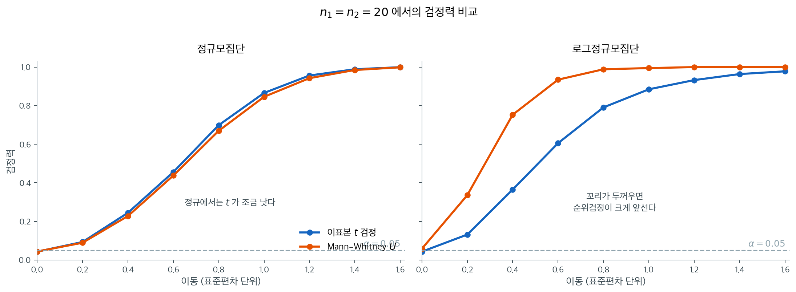

# 이표본 검정

## 1. 이표본 z 검정

이표본 z-검정은 모분산을 알고 있을 때 독립인 두 표본의 평균이 유의하게 다른지 판단한다. 서로 다른 조건의 두 집단을 비교할 때 쓰며, 표본이 정규분포를 따르고 독립이라고 가정한다.

### A. 가설

- **귀무가설**: $H_0: \mu_1 = \mu_2$
- **대립가설**:
    - 양측: $H_a: \mu_1 \neq \mu_2$
    - 단측(큼): $H_a: \mu_1 > \mu_2$
    - 단측(작음): $H_a: \mu_1 < \mu_2$

### B. 검정통계량

$$ z = \frac{(\bar{x}_1 - \bar{x}_2) - (\mu_1 - \mu_2)}{\sqrt{\frac{\sigma_1^2}{n_1} + \frac{\sigma_2^2}{n_2}}} $$

$H_0$ 아래에서($\mu_1 - \mu_2 = 0$) 표본이 크면 표본표준편차를 써서:

$$ z = \frac{\bar{x}_1 - \bar{x}_2}{\sqrt{\frac{s_1^2}{n_1} + \frac{s_2^2}{n_2}}} $$

### C. 판정 규칙

- **양측**: $|z| > z_{\alpha/2}$이면 $H_0$을 기각한다.
- **단측(큼)**: $z > z_{\alpha}$이면 $H_0$을 기각한다.
- **단측(작음)**: $z < -z_{\alpha}$이면 $H_0$을 기각한다.

### D. p-값

- 양측: $p\text{-값} = 2P(Z \geq |z|)$
- 단측(큼): $p\text{-값} = P(Z \geq z)$
- 단측(작음): $p\text{-값} = P(Z \leq z)$

### E. 보기

<div class="exbox" markdown>

**보기 1.** <span class="diff easy" title="쉬움"></span> 표본표준편차를 $\sigma$ 자리에 넣는 $z$ 검정. 프랑스와 스위스의 여성 각 100명을 뽑아 낳은 아이 수를 세었더니 평균이 1.85명과 1.65명, 표준편차가 1.3명과 1.2명이었다. 모분산은 모르지만 표본이 커서 $\sigma_i$ 자리에 $s_i$를 넣는다.

**(1)** $z$ 통계량과 양측 $p$-값을 손으로 계산하고, $\alpha = 0.05$에서 기각하려면 두 표본평균의 차가 얼마 이상이어야 하는지 구하시오.

**(2)** 코드로 (1)을 확인하고, 참 차이가 0.2명일 때 그것을 80% 확률로 잡아내려면 집단당 몇 명을 뽑아야 하는지 구하시오.

</div>

??? success "풀이"

    **(1) 해석적으로.** 분모는 두 집단의 분산을 합친 것이다.

    $$
    \mathrm{SE} = \sqrt{\frac{s_1^2}{n_1} + \frac{s_2^2}{n_2}}
    = \sqrt{\frac{1.69}{100} + \frac{1.44}{100}}
    = \sqrt{0.0313} = 0.176918
    $$

    따라서

    $$
    z = \frac{1.85 - 1.65}{0.176918} = \frac{0.2}{0.176918} = 1.1305,
    \qquad p = 2\left[1-\Phi(1.1305)\right] = 0.2583
    $$

    이다. 기각 경계는 $\lvert \bar x_1 - \bar x_2 \rvert > z_{0.975}\,\mathrm{SE} = 1.95996 \times 0.176918 = 0.3468$이므로, **관측된 차 0.2는 필요한 0.3468의 58%밖에 되지 않는다.** 0.2라는 차가 작아서가 아니라 개인차(표준편차 1.3과 1.2)가 그 차보다 여섯 배 크기 때문이다.

    **(2) 수치적으로.**

    ```python
    import numpy as np
    from scipy import stats

    n_f, n_s = 100, 100
    x_bar_f, x_bar_s = 1.85, 1.65
    s_f, s_s = 1.3, 1.2

    # n이 각각 100이라 크므로 sigma 자리에 표본표준편차를 넣고 z를 쓴다.
    statistic = (x_bar_f - x_bar_s) / np.sqrt(s_f**2/n_f + s_s**2/n_s)
    p_value = stats.norm().sf(abs(statistic)) * 2

    print(f"statistic : {statistic:.4f}")
    print(f"p value   : {p_value:.4f}")
    ```

    출력:

    ```
    statistic : 1.1305
    p value   : 0.2583
    ```

    **$1.1305$와 $0.2583$이 손으로 낸 값과 소수 넷째 자리까지 같다.**

    필요한 표본크기는 양측 $\alpha$와 검정력 $1-\beta$에 대한 표준 공식

    $$
    n = \frac{(z_{1-\alpha/2} + z_{1-\beta})^2(\sigma_1^2+\sigma_2^2)}{\delta^2}
    = \frac{(1.95996+0.84162)^2 \times 3.13}{0.04} = 614.17
    $$

    에서 나온다. 올림하면 집단당 615명이다.

    ```python
    import numpy as np
    from scipy import stats

    se = np.sqrt(1.3**2 / 100 + 1.2**2 / 100)
    z_crit = stats.norm.ppf(0.975)
    print(f"SE             = {se:.6f}")
    print(f"기각 경계 차이 = {z_crit * se:.6f}")

    # 0.2 의 차를 양측 5% 검정으로 80% 확률로 잡아내려면 집단당 몇 명인가.
    n_formula = (z_crit + stats.norm.ppf(0.8)) ** 2 * (1.3**2 + 1.2**2) / 0.2**2
    print(f"공식이 주는 n  = {n_formula:.2f}")
    for n in (613, 614, 615):
        s = np.sqrt(3.13 / n)
        power = stats.norm.sf(z_crit - 0.2 / s) + stats.norm.cdf(-z_crit - 0.2 / s)
        print(f"  n = {n}: 검정력 {power:.4f}")
    ```

    출력:

    ```
    SE             = 0.176918
    기각 경계 차이 = 0.346753
    공식이 주는 n  = 614.17
      n = 613: 검정력 0.7992
      n = 614: 검정력 0.7999
      n = 615: 검정력 0.8005
    ```

    **공식의 $614.17$이 정확한 검정력 계산과 맞는다.** $n = 614$에서 검정력이 $0.7999$로 $0.80$에 간발의 차로 못 미치고 $615$에서 $0.8005$로 넘어선다.

    **읽어야 할 것은 100 대 615라는 격차다.** 관측된 차 0.2가 참값이라 해도 집단당 100명으로는 그것을 잡아낼 확률이

    $$
    \left[1-\Phi(0.8295)\right] + \Phi(-3.0904) = 0.2035 + 0.0010 = 0.204
    $$

    밖에 안 된다($0.8295 = z_{0.975} - 0.2/0.176918$, 뒤의 항은 반대쪽 꼬리다). **이 설계는 애초에 다섯 번 중 한 번만 성공하도록 되어 있었다.** 기각하지 못한 것은 "차이가 없다"는 증거가 아니라 표본이 모자랐다는 증거다.

---

## 2. 이표본 t 검정

이표본 t-검정(독립표본 t-검정)은 독립인 두 집단의 평균이 유의하게 다른지 판단한다. 모분산을 모르고 서로 같다고 가정할 때 쓴다.

### A. 가설

- **귀무가설**: $H_0: \mu_1 = \mu_2$
- **대립가설**:
    - 양측: $H_a: \mu_1 \neq \mu_2$
    - 단측(큼): $H_a: \mu_1 > \mu_2$
    - 단측(작음): $H_a: \mu_1 < \mu_2$

### B. 검정통계량 (합동분산)

$$ t = \frac{\bar{x}_1 - \bar{x}_2}{s_p \cdot \sqrt{\frac{1}{n_1} + \frac{1}{n_2}}} $$

여기서 합동 표준편차는:

$$ s_p = \sqrt{\frac{(n_1 - 1) s_1^2 + (n_2 - 1) s_2^2}{n_1 + n_2 - 2}} $$

이 통계량은 자유도 $n_1 + n_2 - 2$인 t-분포를 따른다.

### C. 판정 규칙

- **양측**: $|t| > t_{\alpha/2, n_1+n_2-2}$이면 $H_0$을 기각한다.
- **단측(큼)**: $t > t_{\alpha, n_1+n_2-2}$이면 $H_0$을 기각한다.
- **단측(작음)**: $t < -t_{\alpha, n_1+n_2-2}$이면 $H_0$을 기각한다.

### D. 보기

<div class="exbox" markdown>

**보기 2.** <span class="diff easy" title="쉬움"></span> 급여의 성별 격차 — 단측 검정. 시장조사자들이 남성 관리자와 여성 관리자의 평균 급여를 비교한다. 조사 전부터 관심은 한 방향이었으므로 가설을 단측으로 세운다.

$$H_0 : \mu_{\text{men}} = \mu_{\text{women}} \quad\text{vs}\quad H_1: \mu_{\text{men}} > \mu_{\text{women}}$$

표본에서 얻은 요약값은 다음과 같다(단위: 천 달러).

| | 남성 | 여성 |
|:---:|:---:|:---:|
| 평균 | 62.5 | 58.9 |
| 표준편차 | 7.2 | 6.4 |
| n | 30 | 25 |

**(1)** 합동 $t$로 단측 검정을 하고, 같은 자료에 양측 검정을 걸면 결론이 어떻게 바뀌는지 적으시오.

**(2)** 그렇다면 단측을 쓰는 것이 늘 유리한가. $H_0$가 참인 자료를 20만 번 만들어, 방향을 **미리 고정한** 단측 검정과 **자료를 보고 고른** 단측 검정의 실제 기각률을 각각 재시오.

</div>

??? success "풀이"

    **(1) 해석적으로.** 합동분산을 자유도로 가중한다.

    $$
    s_p^2 = \frac{29 \times 7.2^2 + 24 \times 6.4^2}{53}
    = \frac{1503.36 + 983.04}{53} = \frac{2486.40}{53} = 46.9132
    $$

    이므로 $s_p = 6.8493$이고

    $$
    \mathrm{SE} = s_p\sqrt{\frac{1}{30}+\frac{1}{25}} = 6.8493 \times \sqrt{0.073333} = 1.8548
    $$

    이다. 따라서

    $$
    t = \frac{62.5-58.9}{1.8548} = \frac{3.6}{1.8548} = 1.9409, \qquad df = 53
    $$

    이다. 임계값이 $t_{0.95,\,53} = 1.6741$이므로 **단측 검정은 $H_0$를 기각한다**($p = 0.0288$).

    같은 통계량을 양측으로 읽으면 $p = 2 \times 0.0288 = 0.0576$이고 임계값은 $t_{0.975,\,53} = 2.0057$이다. **$1.9409 < 2.0057$이므로 양측 검정은 기각하지 못한다.** 같은 자료, 같은 통계량인데 결론이 갈린다.

    **(2) 단측이 공짜가 아니다.** 단측 검정이 기각하기 쉬운 것은 **대립가설이 미리 반쪽으로 줄어 있을 때**의 이야기다. 자료를 보고 큰 쪽을 $H_1$으로 삼으면 $\lvert t \rvert > t_{1-\alpha,\,df}$일 때 기각하는 절차가 되고, 그 확률은 $H_0$ 아래에서

    $$
    P\!\left(\lvert t_{53} \rvert > t_{0.95,\,53}\right) = 2\alpha = 0.10
    $$

    이다. 명목 5%라고 적어 놓고 실제로는 10%를 쓰는 것이다.

    ```python
    import numpy as np
    from scipy import stats

    n_1, n_2 = 30, 25
    X_1_bar, X_2_bar = 62.5, 58.9
    s_1, s_2 = 7.2, 6.4
    df = n_1 + n_2 - 2

    s_p_square = ((n_1 - 1) * s_1**2 + (n_2 - 1) * s_2**2) / df
    statistic = (X_1_bar - X_2_bar) / np.sqrt(s_p_square * (1 / n_1 + 1 / n_2))

    print(f"s_p       = {np.sqrt(s_p_square):.4f}")
    print(f"statistic = {statistic:.4f}   (df = {df})")
    print(f"단측 p    = {stats.t(df).sf(statistic):.4f}   임계값 {stats.t(df).ppf(0.95):.4f}")
    print(f"양측 p    = {2 * stats.t(df).sf(statistic):.4f}   임계값 {stats.t(df).ppf(0.975):.4f}")

    # 방향을 자료를 보고 고르면 실제 수준은 2alpha 가 된다.
    rng = np.random.default_rng(7)
    B = 200_000
    x = rng.normal(0, 1, (B, n_1))
    y = rng.normal(0, 1, (B, n_2))
    v = ((n_1 - 1) * x.var(1, ddof=1) + (n_2 - 1) * y.var(1, ddof=1)) / df
    t = (x.mean(1) - y.mean(1)) / np.sqrt(v * (1 / n_1 + 1 / n_2))
    c95 = stats.t(df).ppf(0.95)
    print(f"\nH0 가 참일 때 {B}번 중 기각 비율")
    print(f"  방향을 미리 고정한 단측 : {np.mean(t > c95):.4f}")
    print(f"  자료를 보고 방향을 고름 : {np.mean(np.abs(t) > c95):.4f}")
    print(f"  양측                    : {np.mean(np.abs(t) > stats.t(df).ppf(0.975)):.4f}")
    ```

    출력:

    ```
    s_p       = 6.8493
    statistic = 1.9409   (df = 53)
    단측 p    = 0.0288   임계값 1.6741
    양측 p    = 0.0576   임계값 2.0057

    H0 가 참일 때 200000번 중 기각 비율
      방향을 미리 고정한 단측 : 0.0500
      자료를 보고 방향을 고름 : 0.1008
      양측                    : 0.0503
    ```

    **네 수가 모두 손으로 낸 값과 맞는다.** $s_p = 6.8493$, $t = 1.9409$, 단측 $0.0288$, 양측 $0.0576$이다. 모의실험의 세 기각률도 예측대로 $0.05$, $0.10$, $0.05$에 떨어진다. 반복 20만 회에서 $p = 0.05$ 둘레의 몬테카를로 오차가 $\sqrt{0.05\times0.95/200000} = 0.0005$이므로 $0.0500$과 $0.0503$은 모두 오차 안이고, $0.1008$은 $0.10$에서 $0.0008$ 떨어져 있어 역시 오차의 두 배 안이다.

    **결론은 단측 검정을 쓰지 말라는 것이 아니다.** 방향을 **자료를 보기 전에** 정했다면 $p = 0.0288$은 정당하다. 이 보기의 요점은 **그 조건이 검증 불가능**하다는 데 있다. 독자는 연구자가 언제 방향을 정했는지 알 수 없고, 보고된 숫자만으로는 수준 5%짜리 절차와 수준 10%짜리 절차를 구별할 방법이 없다.

    그래서 실무의 관례는 **양측을 기본으로 두고, 단측을 쓸 때는 사전등록 같은 외부 증거로 방향을 못 박는 것**이다. 이 보기처럼 $0.0288$과 $0.0576$이 $0.05$를 가운데 두고 갈리는 자리에서는 더욱 그렇다.

<div class="exbox" markdown>

**보기 3.** <span class="diff easy" title="쉬움"></span> 서로 다른 두 밭의 토마토 — 웰치 자유도의 범위 검사. 두 밭에서 토마토 포기의 키를 재어 다음을 얻었다.

| | 밭 A | 밭 B |
|:---:|:---:|:---:|
| 평균 | 1.3 m | 1.6 m |
| 표준편차 | 0.5 m | 0.3 m |
| n | 22 | 24 |

$$H_0 : \mu_A = \mu_B \quad\text{vs}\quad H_1: \mu_A \neq \mu_B$$

**(1)** 웰치 통계량과 자유도 $\nu$를 손으로 계산하시오. 계산을 믿을 수 있는지 $\nu$가 갇혀야 하는 구간을 적고 **범위 검사**를 하시오.

**(2)** 코드로 (1)을 확인하고, 같은 자료에 합동 $t$를 걸면 $p$-값이 어느 쪽으로 움직이는지 미리 예측한 뒤 확인하시오.

</div>

??? success "풀이"

    **(1) 해석적으로.** 두 집단의 몫을 $a$와 $b$로 적는다.

    $$
    a = \frac{s_1^2}{n_1} = \frac{0.25}{22} = 0.0113636, \qquad
    b = \frac{s_2^2}{n_2} = \frac{0.09}{24} = 0.00375
    $$

    이므로 $a+b = 0.0151136$이고 $\sqrt{a+b} = 0.122938$이다. 따라서

    $$
    t = \frac{1.3-1.6}{0.122938} = -2.4403
    $$

    이다. 자유도는 새터스웨이트 식에서

    $$
    \nu = \frac{(a+b)^2}{\dfrac{a^2}{n_1-1}+\dfrac{b^2}{n_2-1}}
    = \frac{2.28421\times 10^{-4}}{\dfrac{1.29132\times 10^{-4}}{21}+\dfrac{1.40625\times 10^{-5}}{23}}
    = \frac{2.28421\times 10^{-4}}{6.76056\times 10^{-6}} = 33.787
    $$

    이다.

    **범위 검사.** 웰치 자유도는 반드시

    $$
    \min(n_1,n_2)-1 \;\le\; \nu \;\le\; n_1+n_2-2
    $$

    를 만족한다. 여기서는 $21 \le 33.787 \le 44$이므로 통과한다. **이 검사를 통과하지 못하면 계산이 틀린 것이다.** 가장 흔한 실수는 분모에 $n_i-1$ 대신 $n_i$를 넣는 것이고, 그러면 $\nu$가 $44$를 넘어 상한을 깨뜨린다. 실제로 그렇게 계산하면 $\nu = 35.38$이 나와 이 자료에서는 상한을 깨지 않지만, 자유도를 부풀려 기각을 쉽게 만든다.

    **(2) 합동 $t$는 어느 쪽으로 움직이는가.** 5.3절에서 본 배율

    $$
    R = \frac{s_p^2\left(\frac{1}{n_1}+\frac{1}{n_2}\right)}{\dfrac{s_1^2}{n_1}+\dfrac{s_2^2}{n_2}}
    $$

    을 쓰면 된다. 여기서는 **분산이 큰 밭 A에 표본이 적다**($n_1 = 22 < 24 = n_2$). 합동분산은 자유도로 가중하므로 표본이 많은 밭 B의 작은 분산을 더 반영하고, 그 결과 참 분산을 **과소평가**한다. 곧 $R < 1$이어서 합동 $t$가 웰치보다 **크게** 나오고 $p$-값은 **작아진다.**

    ```python
    import numpy as np
    from scipy import stats

    X_1_bar, X_2_bar = 1.3, 1.6
    s_1, s_2 = 0.5, 0.3
    n_1, n_2 = 22, 24

    # 표준편차가 0.5와 0.3으로 다르므로 합동하지 않고 Welch를 쓴다.
    statistic = (X_1_bar - X_2_bar) / np.sqrt(s_1**2 / n_1 + s_2**2 / n_2)

    # Welch-Satterthwaite 자유도.
    # 분모에 n_i가 아니라 **n_i - 1**이 들어간다는 점에 주의하라.
    # n으로 잘못 쓰면 자유도가 부풀어 기각하기 쉬워진다.
    top = (s_1**2 / n_1 + s_2**2 / n_2)**2
    bottom = (s_1**2 / n_1)**2 / (n_1 - 1) + (s_2**2 / n_2)**2 / (n_2 - 1)
    df = top / bottom

    p_value = 2 * stats.t(df).cdf(-abs(statistic))
    print(f"{df = :.4f}")
    print(f"{statistic = :.4f}")
    print(f"{p_value   = :.4f}")

    alpha = 0.05
    if p_value <= alpha:
        print("Reject H_0")
    else:
        print("Fail to reject H_0")
    ```

    출력:

    ```
    df = 33.7874
    statistic = -2.4403
    p_value   = 0.0201
    Reject H_0
    ```

    자유도가 33.79로 정수가 아니다. 웰치 자유도는 근사값이라 정수일 이유가 없다. 합동 검정이었다면 $n_1 + n_2 - 2 = 44$였을 것이고, 분산이 달라 정보량을 보수적으로 잡은 결과가 이 차이다.

    ```python
    import numpy as np
    from scipy import stats

    s_1, s_2 = 0.5, 0.3
    n_1, n_2 = 22, 24

    # 같은 자료에 합동 t 를 걸어 본다.
    s_p_square = ((n_1 - 1) * s_1**2 + (n_2 - 1) * s_2**2) / (n_1 + n_2 - 2)
    se_pool = np.sqrt(s_p_square * (1 / n_1 + 1 / n_2))
    se_welch = np.sqrt(s_1**2 / n_1 + s_2**2 / n_2)
    t_pool = (1.3 - 1.6) / se_pool

    print(f"웰치 SE   = {se_welch:.6f}")
    print(f"합동 SE   = {se_pool:.6f}   비 = {se_pool / se_welch:.6f}")
    R = s_p_square * (1 / n_1 + 1 / n_2) / (s_1**2 / n_1 + s_2**2 / n_2)
    print(f"R = {R:.6f}   sqrt(R) = {np.sqrt(R):.6f}")
    print(f"합동 t    = {t_pool:.4f}  (df = {n_1 + n_2 - 2})"
          f"  p = {2 * stats.t(n_1 + n_2 - 2).cdf(-abs(t_pool)):.4f}")
    ```

    출력:

    ```
    웰치 SE   = 0.122938
    합동 SE   = 0.120390   비 = 0.979280
    R = 0.958988   sqrt(R) = 0.979280
    합동 t    = -2.4919  (df = 44)  p = 0.0165
    ```

    **예측한 방향이 맞는다.** $R = 0.9590 < 1$이고 합동 $t$의 $p$-값이 $0.0201$에서 $0.0165$로 내려갔다. 두 표준오차의 비 $0.979280$이 $\sqrt R = 0.979280$과 소수 여섯째 자리까지 같은 것은 우연이 아니다. $\mathrm{SE}_{\text{pool}}/\mathrm{SE}_{\text{Welch}} = \sqrt{R}$이 $R$의 정의 그대로이기 때문이다.

    **그러면서 어긋남은 작다.** $R$이 $1$에서 $4\%$밖에 떨어져 있지 않고, $p$-값도 $0.0201$과 $0.0165$로 결론이 같다. 5.3절에서 같은 배율이 $0.29$까지 무너져 오류율이 $0.291$이 되었던 것과 견주면 아무 일도 일어나지 않은 셈이다. **까닭은 설계가 거의 균형이라는 데 있다**($22$ 대 $24$). 분산비는 $(0.5/0.3)^2 = 2.78$로 작지 않지만, 5.3절의 결론이 이분산 **하나만으로는** 큰일이 나지 않는다는 것이었다. 참사는 이분산과 **불균형**이 겹쳐야 일어난다.

    그러니 이 자료에서는 두 검정 중 무엇을 쓰든 같은 결론에 닿는다. 그래도 웰치를 쓸 이유는 있다. **어느 쪽이 안전한지 미리 알 수 없다는 것**이 바로 웰치를 기본값으로 두는 이유다.

<div class="exbox" markdown>

**보기 4.** <span class="diff easy" title="쉬움"></span> 출생아 수 — 보기 1의 자료에 합동 $t$를 걸면. 같은 자료를 다시 쓴다.

| | France | Switzerland |
|:---:|:---:|:---:|
| 평균 | 1.85 | 1.65 |
| 표준편차 | 1.3 | 1.2 |
| n | 100 | 100 |

**(1)** $n_1 = n_2 = n$이면 합동 표준오차가 보기 1의 $z$ 검정 분모와 **정확히 같아진다**는 것을 보이시오. 그러면 두 검정은 무엇으로 갈리는가.

**(2)** 코드로 확인하고, 두 $p$-값의 차이 $0.2596 - 0.2583 = 0.0013$이 어디서 오는지 적으시오.

</div>

??? success "풀이"

    **(1) 해석적으로.** $n_1 = n_2 = n$을 합동분산에 넣으면 가중값이 같아져 단순 평균이 된다.

    $$
    s_p^2 = \frac{(n-1)s_1^2 + (n-1)s_2^2}{2n-2} = \frac{s_1^2+s_2^2}{2}
    $$

    이것을 합동 표준오차에 넣는다.

    $$
    s_p^2\left(\frac1n+\frac1n\right) = \frac{s_1^2+s_2^2}{2}\cdot\frac{2}{n}
    = \frac{s_1^2}{n} + \frac{s_2^2}{n}
    $$

    **오른쪽이 보기 1의 $z$ 분모 안에 있던 바로 그 식이다.** 두 검정의 분자도 $\bar x_1 - \bar x_2$로 같으므로 **통계량이 글자 그대로 같다.** 수로 적으면 둘 다 $0.176918$과 $1.1305$다.

    남는 차이는 단 하나, **그 통계량을 어느 분포에 대고 읽느냐**다. $z$ 검정은 $N(0,1)$에, 합동 $t$ 검정은 $t_{198}$에 댄다. 임계값으로 보면 $1.95996$ 대 $1.97202$다.

    여기서 5.3절의 결과도 다시 확인된다. 균형 설계에서는 $R = 1$, 곧 합동분산이 겨누는 값이 참 분산과 **정확히** 같다. 표준편차가 $1.3$과 $1.2$로 달라도 그렇다. 이 보기는 그 등식의 표본 버전이다.

    **(2) 수치적으로.**

    ```python
    X_1_bar, X_2_bar = 1.85, 1.65
    s_1, s_2 = 1.3, 1.2
    n_1, n_2 = 100, 100

    # 합동분산은 두 표본분산을 자유도로 가중평균한 것이다.
    # 여기서는 n이 같아 단순 평균과 같아진다.
    s_p_square = ((n_1 - 1) * s_1**2 + (n_2 - 1) * s_2**2) / (n_1 + n_2 - 2)
    statistic = (X_1_bar - X_2_bar) / np.sqrt(s_p_square / n_1 + s_p_square / n_2)
    df = n_1 + n_2 - 2
    p_value = 2 * stats.t(df).cdf(-abs(statistic))

    print(f"{df = :.4f}")
    print(f"{statistic = :.4f}")
    print(f"{p_value   = :.4f}")
    ```

    출력:

    ```
    df = 198.0000
    statistic = 1.1305
    p_value   = 0.2596
    ```

    같은 자료의 앞선 $z$-검정과 통계량이 1.1305로 정확히 같고 $p$-값만 0.2583에서 0.2596으로 바뀌었다. 자유도 198이면 $t$가 정규분포와 거의 구별되지 않기 때문이다.

    등식을 자리까지 맞춰 확인한다.

    ```python
    import numpy as np
    from scipy import stats

    s_1, s_2, n = 1.3, 1.2, 100
    s_p_square = ((n - 1) * s_1**2 + (n - 1) * s_2**2) / (2 * n - 2)

    print(f"s_p^2            = {s_p_square:.6f}")
    print(f"(s_1^2+s_2^2)/2  = {(s_1**2 + s_2**2) / 2:.6f}")
    print(f"합동 SE          = {np.sqrt(s_p_square * 2 / n):.10f}")
    print(f"z 검정의 분모    = {np.sqrt(s_1**2 / n + s_2**2 / n):.10f}")
    print(f"t_.975,198 = {stats.t(2 * n - 2).ppf(0.975):.6f}"
          f"    z_.975 = {stats.norm.ppf(0.975):.6f}")
    ```

    출력:

    ```
    s_p^2            = 1.565000
    (s_1^2+s_2^2)/2  = 1.565000
    합동 SE          = 0.1769180601
    z 검정의 분모    = 0.1769180601
    t_.975,198 = 1.972017    z_.975 = 1.959964
    ```

    **두 표준오차가 소수 열째 자리까지 같다.** 유도한 등식이 근사가 아니라 항등식임을 보여 준다.

    **$p$-값의 차이 0.0013은 전부 꼬리의 무게에서 온다.** $t_{198}$은 $N(0,1)$보다 꼬리가 조금 두꺼우므로 같은 통계량 $1.1305$ 밖에 놓인 확률이 더 크다. 임계값으로 보면 $1.97202$ 대 $1.95996$, 곧 $0.6\%$ 차이다. 자유도가 $198$이나 되므로 이 정도가 남는 전부다.

    **그래서 이 쪽에서 $z$와 합동 $t$를 가르는 것은 공식이 아니라 자유도다.** $n$이 크면 두 검정이 사실상 같은 검정이 되고, $n$이 작으면 $t$를 써야 한다. 반대로 $z$를 쓸 **명분**은 $\sigma$를 실제로 아는 경우뿐인데, 여기서는 $\sigma$ 자리에 $s$를 넣었으므로 그 명분이 없다. **엄밀하게는 처음부터 $t$를 쓰는 것이 맞고, $z$는 큰 표본에서 그것과 거의 같아지는 어림일 뿐이다.**

<div class="exbox" markdown>

**보기 5.** <span class="diff easy" title="쉬움"></span> 두 품종의 배 — 신뢰구간으로 검정하기. Bosc와 Anjou 두 품종의 무게를 재어 다음을 얻었다.

| | Bosc | Anjou |
|:---:|:---:|:---:|
| 평균 | 120 | 116 |
| 표준편차 | 15 | 13 |
| n | 65 | 65 |

$\mu_{\text{Bosc}} - \mu_{\text{Anjou}}$의 99% 신뢰구간이 $4 \pm 6.44$, 즉 $(-2.44, 10.44)$라고 한다.

**(1)** 여유폭 $6.44$를 직접 만들어 보이시오. 합동과 웰치가 사실상 같은 구간을 주는 까닭도 적으시오. 그리고 **이 여유폭이 $t$로 만든 것인지 $z$로 만든 것인지** 수로 판정하시오.

**(2)** 같은 자료의 양측 $p$-값을 구해 구간이 내린 결론과 맞는지 확인하고, 99% 대신 95% 구간이었다면 결론이 바뀌는지 보시오.

</div>

??? success "풀이"

    **(1) 해석적으로.** $n_1 = n_2 = 65$이므로 보기 4에서 본 등식이 그대로 쓰인다. 합동 표준오차와 웰치 표준오차가 **같은 수**다.

    $$
    \mathrm{SE} = \sqrt{\frac{15^2}{65}+\frac{13^2}{65}} = \sqrt{\frac{394}{65}} = \sqrt{6.06154} = 2.46202
    $$

    합동 자유도는 $n_1+n_2-2 = 128$이고 $t_{0.995,\,128} = 2.61479$이므로

    $$
    2.61479 \times 2.46202 = 6.4377 \approx 6.44
    $$

    이다. 웰치 자유도는

    $$
    \nu = \frac{(3.46154+2.6)^2}{\dfrac{3.46154^2}{64}+\dfrac{2.6^2}{64}} = 125.47
    $$

    로 범위 검사 $64 \le 125.47 \le 128$을 통과하며, $t_{0.995,\,125.47} = 2.61558$에서 여유폭 $6.4396$을 준다. **두 여유폭이 $6.44$로 같다.** 표준오차가 정확히 같고 자유도만 $128$ 대 $125.47$로 다르니, 남는 차이는 임계값의 $0.03\%$뿐이다.

    **$t$인가 $z$인가.** $z_{0.995} = 2.57583$을 썼다면 여유폭이

    $$
    2.57583 \times 2.46202 = 6.3417 \approx 6.34
    $$

    였을 것이다. **$6.44$는 $6.34$가 아니므로 이 구간은 $t$로 만든 것이다.** 자유도 128이라도 99% 구간에서는 꼬리가 $0.5\%$씩만 남아 $t$와 $z$의 차이가 여유폭의 $1.5\%$로 드러난다. 보기 4의 95% 수준에서 $0.6\%$였던 것과 견주면 **구간을 좁게 잡을수록 $t$와 $z$의 차이가 커진다.**

    **(2) 수치적으로.**

    ```python
    import numpy as np
    from scipy import stats

    X_1_bar, X_2_bar = 120, 116
    s_1, s_2 = 15, 13
    n_1 = n_2 = 65
    diff = X_1_bar - X_2_bar

    # n_1 = n_2 이므로 합동 SE 와 웰치 SE 가 정확히 같다.
    se = np.sqrt(s_1**2 / n_1 + s_2**2 / n_2)
    df_pool = n_1 + n_2 - 2
    a, b = s_1**2 / n_1, s_2**2 / n_2
    df_welch = (a + b) ** 2 / (a**2 / (n_1 - 1) + b**2 / (n_2 - 1))

    print(f"SE = {se:.6f}")
    for name, df in (("합동", df_pool), ("웰치", df_welch)):
        m = stats.t(df).ppf(0.995) * se
        print(f"{name}  df = {df:7.2f}  t_.995 = {stats.t(df).ppf(0.995):.4f}"
              f"  여유폭 = {m:.4f}  99% CI = ({diff - m:.4f}, {diff + m:.4f})")

    t = diff / se
    print(f"\nt = {t:.4f}   양측 p = {2 * stats.t(df_pool).sf(t):.4f}")
    m95 = stats.t(df_pool).ppf(0.975) * se
    print(f"95% CI = ({diff - m95:.4f}, {diff + m95:.4f})")
    ```

    출력:

    ```
    SE = 2.462019
    합동  df =  128.00  t_.995 = 2.6148  여유폭 = 6.4377  99% CI = (-2.4377, 10.4377)
    웰치  df =  125.47  t_.995 = 2.6156  여유폭 = 6.4396  99% CI = (-2.4396, 10.4396)

    t = 1.6247   양측 p = 0.1067
    95% CI = (-0.8715, 8.8715)
    ```

    **$(-2.4377,\ 10.4377)$이 본문의 $(-2.44,\ 10.44)$와 맞는다.** 웰치가 준 $(-2.4396,\ 10.4396)$도 소수 둘째 자리에서 같은 구간이다.

    **구간과 검정이 같은 말을 한다.** $t = 1.6247$이고 양측 $p = 0.1067$이므로 $\alpha = 0.01$에서는 당연히 기각하지 못한다. 이것은 우연이 아니라 **구간과 검정이 같은 부등식을 양쪽에서 읽은 것**이기 때문이다.

    $$
    0 \in \left(\bar x_1 - \bar x_2 \pm t_{1-\alpha/2}\,\mathrm{SE}\right)
    \iff \left\lvert \frac{\bar x_1-\bar x_2}{\mathrm{SE}} \right\rvert < t_{1-\alpha/2}
    \iff p > \alpha
    $$

    같은 분모를 쓰는 한 이 동치는 깨지지 않는다. 뒤의 보기 12에서 **분모가 달라지면 깨질 수 있다**는 것을 볼 것이다.

    **95% 구간이어도 결론은 같다.** $(-0.8715,\ 8.8715)$가 여전히 0을 포함하고, $p = 0.1067 > 0.05$다. $p = 0.1067$이므로 구간이 0에 닿는 신뢰수준은 $1-p = 89.3\%$이고, 90% 구간조차 $(-0.0792,\ 8.0792)$로 아직 0을 품는다.

    **구간이 검정보다 더 말해 준다.** 기각 여부는 "0이 들어 있다" 한 줄이지만, 구간은 참 차이가 $-2.4$에서 $10.4$ 사이의 어디쯤이라고 말한다. **위쪽 끝 10.4는 Bosc가 Anjou보다 9%쯤 무거울 가능성도 아직 배제되지 않았다는 뜻**이고, 이것은 "유의하지 않다"는 말에 들어 있지 않은 정보다. 구간의 폭 $12.9$가 추정값 $4$의 세 배라는 사실이 이 자료의 실제 상태다.

---

## 3. Welch의 t 검정

**Welch의 t-검정**은 분산이 다르고 표본크기도 다를 수 있는 상황을 감안한, 표준 이표본 t-검정의 로버스트한 변형이다.

### 공식

$$t = \frac{\bar{X}_1 - \bar{X}_2}{\sqrt{\frac{s_1^2}{n_1} + \frac{s_2^2}{n_2}}}$$

자유도는 **Welch-Satterthwaite 식**으로 근사한다:

$$df = \frac{\left( \frac{s_1^2}{n_1} + \frac{s_2^2}{n_2} \right)^2}{\frac{\left( \frac{s_1^2}{n_1} \right)^2}{n_1 - 1} + \frac{\left( \frac{s_2^2}{n_2} \right)^2}{n_2 - 1}}$$

### 언제 쓰는가

- 두 집단의 분산이 눈에 띄게 다를 때.
- 두 집단의 표본크기가 크게 다를 때.
- 모분산을 모를 때.

<div class="exbox" markdown>

**보기 6.** <span class="diff easy" title="쉬움"></span> 합동 t-검정 구현. 두 팀의 기록을 각 $15$개와 $20$개 모았다. `equal_var=False`를 주어 Welch 검정을 걸면 $t = -9.4407$이 나온다.

**(1)** 두 집단의 평균·표준편차·분산비를 구하고, 이 자료가 **불균형이면서 이분산**임을 확인하시오. [이표본 평균 검정](test_two_means.md) 보기 1의 식으로 합동 $t$와 Welch $t$ 가운데 어느 쪽 $\lvert t \rvert$가 큰지 **미리** 판정하시오.

**(2)** 두 통계량과 자유도를 모두 계산해 (1)의 판정을 확인하고, Welch 자유도의 범위 검사를 하시오.

</div>

??? success "풀이"

    **(1) 부호만 보면 된다.** 두 표준오차의 차는

    $$
    \text{SE}_{\text{pool}}^2 - \text{SE}_{\text{welch}}^2
    = \frac{(N-1)(n_1-n_2)(s_1^2-s_2^2)}{(N-2)\,n_1n_2}
    $$

    이므로 부호가 $(n_1-n_2)(s_1^2-s_2^2)$로 정해진다. 이 자료는 $n_1 = 15 < n_2 = 20$이고 $s_1^2 = 19.2571 > s_2^2 = 15.5237$이므로

    $$
    (n_1-n_2)(s_1^2-s_2^2) = (-5)\times(+3.7335) = -18.67 < 0
    $$

    이다. **큰 분산이 작은 표본에 붙어 있는 배치**이고, 따라서 합동 표준오차가 더 작고 합동 $\lvert t \rvert$가 더 크다. 곧 **합동 검정이 더 쉽게 기각하는 방향**이며, 이것이 5.3절에서 본 위험한 조합이다. 다만 분산비가 $1.24$에 그치므로 어긋남의 크기는 작을 것이다.

    **(2) 범위 검사.** Welch 자유도는 언제나 $\min(n_1,n_2)-1 = 14$와 $n_1+n_2-2 = 33$ 사이에 있어야 한다.

    **수치적으로.**

    ```python
    import numpy as np
    from scipy.stats import ttest_ind

    team_a = [120, 118, 125, 130, 115, 122, 121, 119, 117, 123, 124, 126, 127, 118, 116]
    team_b = [135, 132, 137, 140, 136, 130, 134, 138, 139, 133, 131, 142, 141,
               129, 128, 135, 137, 136, 134, 132]

    # 표본크기가 15와 20으로 다르다. 이런 상황이 Welch를 쓸 이유다.
    stat, p_value = ttest_ind(team_a, team_b, equal_var=False)
    print(f"Test Statistic: {stat:.4f}")
    print(f"P-value: {p_value:.4f}")

    alpha = 0.05
    if p_value < alpha:
        print("Reject H0: The means are significantly different.")
    else:
        print("Fail to reject H0.")
    ```

    출력:

    ```
    Test Statistic: -9.4407
    P-value: 0.0000
    Reject H0: The means are significantly different.
    ```

    ```python
    from scipy import stats

    a = np.array(team_a, dtype=float)
    b = np.array(team_b, dtype=float)
    n1, n2 = len(a), len(b)
    N = n1 + n2
    v1, v2 = a.var(ddof=1), b.var(ddof=1)
    print(f"n = {n1}, {n2}   평균 {a.mean():.4f}, {b.mean():.4f}   "
          f"표준편차 {np.sqrt(v1):.4f}, {np.sqrt(v2):.4f}")
    print(f"분산비 s1^2/s2^2 = {v1 / v2:.6f}")

    se_w = np.sqrt(v1 / n1 + v2 / n2)
    sp2 = ((n1 - 1) * v1 + (n2 - 1) * v2) / (N - 2)
    se_p = np.sqrt(sp2 * (1 / n1 + 1 / n2))
    ident = (N - 1) * (n1 - n2) * (v1 - v2) / ((N - 2) * n1 * n2)
    print(f"\nSE_welch = {se_w:.9f}   SE_pool = {se_p:.9f}")
    print(f"SE_p^2 - SE_w^2 = {se_p**2 - se_w**2:.9f}   닫힌 꼴 = {ident:.9f}")
    print(f"(n1-n2)(s1^2-s2^2) = ({n1 - n2}) x ({v1 - v2:+.4f}) = "
          f"{(n1 - n2) * (v1 - v2):+.4f}  →  합동 SE 가 더 작다")

    d = a.mean() - b.mean()
    nu = (v1 / n1 + v2 / n2) ** 2 / ((v1 / n1) ** 2 / (n1 - 1) + (v2 / n2) ** 2 / (n2 - 1))
    print(f"\n{'검정':>8}{'t':>12}{'자유도':>10}{'p':>14}")
    print(f"{'Welch':>8}{d / se_w:12.6f}{nu:10.4f}"
          f"{2 * stats.t.sf(abs(d / se_w), nu):14.3e}")
    print(f"{'합동':>8}{d / se_p:12.6f}{N - 2:10d}"
          f"{2 * stats.t.sf(abs(d / se_p), N - 2):14.3e}")
    print(f"자유도 범위 검사: {min(n1, n2) - 1} <= {nu:.4f} <= {N - 2}  "
          f"→ {min(n1, n2) - 1 <= nu <= N - 2}")
    print(f"코헨의 d = {d / np.sqrt(sp2):.6f}")
    ```

    출력:

    ```
    n = 15, 20   평균 121.4000, 134.9500   표준편차 4.3883, 3.9400
    분산비 s1^2/s2^2 = 1.240501

    SE_welch = 1.435267827   SE_pool = 1.412757530
    SE_p^2 - SE_w^2 = -0.064109896   닫힌 꼴 = -0.064109896
    (n1-n2)(s1^2-s2^2) = (-5) x (+3.7335) = -18.6673  →  합동 SE 가 더 작다

          검정           t       자유도             p
       Welch   -9.440747   28.3975     2.942e-10
          합동   -9.591172        33     4.556e-11
    자유도 범위 검사: 14 <= 28.3975 <= 33  → True
    코헨의 d = -3.276009
    ```

    **(1)의 판정이 맞는다.** 닫힌 꼴이 준 $-0.064110$이 두 표준오차 제곱의 차와 소수 아홉째 자리까지 같고, 합동 $\lvert t \rvert = 9.5912$가 Welch의 $9.4407$보다 크다. 자유도는 반대로 $33$ 대 $28.3975$이고, 범위 $[14,\ 33]$ 안에 있다.

    **그런데 이 자료에서는 어느 쪽을 써도 결론이 같다.** p-값이 $2.9\times10^{-10}$과 $4.6\times10^{-11}$로 둘 다 압도적이다. 분산비가 $1.24$뿐이어서 합동 가정이 깨진 정도가 작기 때문이다. 5.3절의 격자에서 합동 $t$가 무너진 자리는 분산비가 4이고 표본크기 비가 1:4인 칸이었다.

    두 팀의 평균이 $121.4$와 $134.95$로 $13.55$ 차이인데 팀 안의 산포는 표준편차 $4$ 남짓이다. 코헨의 $d$가 $-3.28$로, 흔히 "큰 효과"라 부르는 $0.8$의 네 배다. **집단 간 차이가 집단 안 산포보다 훨씬 크면 표본이 작아도 분명하게 갈린다.** 이런 자료에서는 합동이냐 Welch냐가 아무 차이를 만들지 않으며, 둘의 선택이 문제가 되는 것은 $t$가 임계값 둘레에 있을 때다.

### 표준 이표본 t-검정과의 비교

| 항목 | 표준 t-검정 | Welch t-검정 |
|---|---|---|
| 분산 가정 | 등분산 | 등분산 가정 없음 |
| 표본크기 | 비슷한 크기를 전제 | 크기가 달라도 된다 |
| 자유도 | 고정: $n_1 + n_2 - 2$ | Welch-Satterthwaite로 근사 |

---

## 4. 이표본 비율 검정

이표본 비율 검정은 이진 결과에 대해 독립인 두 집단의 비율에 유의한 차이가 있는지 판단한다.

### A. 가설

- **귀무가설**: $H_0: p_1 = p_2$
- **대립가설**:
    - 양측: $H_a: p_1 \neq p_2$
    - 단측(큼): $H_a: p_1 > p_2$
    - 단측(작음): $H_a: p_1 < p_2$

### B. 검정통계량

합동 비율:

$$\hat{p}_{\text{pool}} = \frac{x_1 + x_2}{n_1 + n_2}$$

검정통계량:

$$z = \frac{\hat{p}_1 - \hat{p}_2}{\sqrt{\hat{p}_{\text{pool}} (1 - \hat{p}_{\text{pool}}) \left(\frac{1}{n_1} + \frac{1}{n_2}\right)}}$$

### C. 보기

| | A 지구 | B 지구 | 합계 |
|:---:|:---:|:---:|:---:|
| 예 | 58 | 52 | 110 |
| 아니오 | 42 | 48 | 90 |

$$H_0 : p_A = p_B \quad\text{vs}\quad H_1: p_A \neq p_B$$

<div class="exbox" markdown>

**보기 7.** <span class="diff easy" title="쉬움"></span> 새 법률에 대한 지지. A 지구 $100$명 중 $58$명, B 지구 $100$명 중 $52$명이 찬성했다. $H_0\colon p_A = p_B$ 대 $H_1\colon p_A \ne p_B$를 검정한다.

**(1)** 합동 $z$ 통계량과 양측 p-값을 손으로 구하시오.

**(2)** $6$%포인트의 차이를 양측 $5\%$에서 검정력 $80\%$로 잡으려면 지구당 몇 명을 조사해야 하는가. 지구당 $100$명 설계의 검정력은 얼마인가.

</div>

??? success "풀이"

    **(1) 해석적으로.** $\hat p_A = 0.58$, $\hat p_B = 0.52$이고 합동 비율은

    $$
    \hat p = \frac{58 + 52}{200} = 0.55
    $$

    다. $H_0$ 아래의 표준오차는

    $$
    \text{SE} = \sqrt{0.55 \times 0.45 \left(\frac{1}{100}+\frac{1}{100}\right)}
    = \sqrt{0.2475 \times 0.02} = \sqrt{0.00495} = 0.070356
    $$

    이고

    $$
    z = \frac{0.58 - 0.52}{0.070356} = 0.852803,
    \qquad p = 2\bigl[1 - \Phi(0.852803)\bigr] = 0.393794
    $$

    다. 기각하지 못한다.

    **(2) 필요한 표본크기.** 두 비율 비교에서는 $H_0$ 아래와 $H_1$ 아래의 표준오차가 다르므로 공식에 두 항이 들어온다.

    $$
    n \ge \frac{\Bigl(z_{1-\alpha/2}\sqrt{2\bar p\bar q} + z_{1-\beta}\sqrt{p_1q_1+p_2q_2}\Bigr)^2}{(p_1-p_2)^2}
    $$

    $p_1 = 0.58$, $p_2 = 0.52$, $\bar p = 0.55$를 넣으면

    $$
    n \ge \frac{\bigl(1.959964\sqrt{0.495} + 0.841621\sqrt{0.4932}\bigr)^2}{0.06^2}
    = \frac{(1.378963 + 0.590944)^2}{0.0036} = 1078.04
    $$

    이므로 **지구당 $1{,}079$명**이다. 실제로 조사한 $100$명의 **열한 배**다.

    분모가 $(p_1-p_2)^2$이라는 점이 모든 것을 설명한다. **비율의 차이를 재는 일은 평균의 차이를 재는 일보다 비싸다.** 비율의 분산 $p(1-p)$는 $p = 0.5$ 둘레에서 $0.25$로 고정이고 줄일 방법이 없으므로, 작은 차이를 보려면 표본밖에 늘릴 것이 없다.

    **수치적으로.**

    ```python
    import numpy as np
    from scipy import stats

    positive_A, positive_B = 58, 52
    n_A, n_B = 100, 100
    p_hat_A, p_hat_B = positive_A / n_A, positive_B / n_B

    # H0가 "두 비율이 같다"이므로 그 공통값을 전체를 합쳐 추정한다.
    # 신뢰구간을 만들 때는 이렇게 합동하지 않는다. 목적이 다르기 때문이다.
    p_pooled = (positive_A + positive_B) / (n_A + n_B)
    statistic = (p_hat_A - p_hat_B) / (np.sqrt(p_pooled * (1 - p_pooled)) * np.sqrt(1/n_A + 1/n_B))
    p_value = stats.norm().sf(abs(statistic)) * 2

    print(f"{statistic = :.4f}")
    print(f"{p_value = :.4f}")

    alpha = 0.05
    if p_value <= alpha:
        print("Reject H_0")
    else:
        print("Fail to reject H_0")
    ```

    출력:

    ```
    statistic = 0.8528
    p_value = 0.3938
    Fail to reject H_0
    ```

    ```python
    p1, p2 = 0.58, 0.52
    pbar = (p1 + p2) / 2
    za, zb = stats.norm.ppf(0.975), stats.norm.ppf(0.80)
    n_formula = ((za * np.sqrt(2 * pbar * (1 - pbar))
                  + zb * np.sqrt(p1 * (1 - p1) + p2 * (1 - p2))) / (p1 - p2)) ** 2
    print(f"공식이 주는 지구당 n = {n_formula:.4f}  →  {int(np.ceil(n_formula))}")


    def power_two_prop(m, p1, p2, alpha=0.05, one_sided=False):
        """각 집단 m 명인 합동 z 검정의 검정력 (정규근사)."""
        pbar = (p1 + p2) / 2
        se0 = np.sqrt(2 * pbar * (1 - pbar) / m)      # H0 아래의 표준오차
        se1 = np.sqrt(p1 * (1 - p1) / m + p2 * (1 - p2) / m)
        zc = stats.norm.ppf(1 - alpha) if one_sided else stats.norm.ppf(1 - alpha / 2)
        return stats.norm.sf((zc * se0 - abs(p1 - p2)) / se1)


    print("\n   n(지구당)   검정력")
    for m in (100, 500, 1000, 1078, 1079, 1200):
        print(f"{m:9d}   {power_two_prop(m, p1, p2):.5f}")
    ms = np.arange(10, 5001)
    pw = np.array([power_two_prop(int(m), p1, p2) for m in ms])
    ok = ms[pw >= 0.80]
    print(f"\n검정력 >= 0.80 인 가장 작은 n = {ok.min()},  연속인가 = "
          f"{bool(np.all(np.diff(ok) == 1))}")
    print(f"지구당 100명 설계의 검정력 = {power_two_prop(100, p1, p2):.4f}")
    ```

    출력:

    ```
    공식이 주는 지구당 n = 1078.0413  →  1079

       n(지구당)   검정력
          100   0.13368
          500   0.47881
         1000   0.76980
         1078   0.79998
         1079   0.80035
         1200   0.84039

    검정력 >= 0.80 인 가장 작은 n = 1079,  연속인가 = True
    지구당 100명 설계의 검정력 = 0.1337
    ```

    **공식과 전수 탐색이 모두 $1{,}079$를 준다.** 그리고 **지구당 $100$명 설계의 검정력은 $0.1337$이다.** 참 차이가 정말 6%포인트라 해도 일곱 번에 한 번만 잡아낸다.

    지지율이 $58\%$와 $52\%$로 $6$%p 차이인데도 기각하지 못한다. 지구당 $100$명으로는 이 정도 차이를 가려낼 수 없다. **비율의 차이를 검정하려면 평균의 차이보다 훨씬 큰 표본이 필요하다.** $p = 0.39$를 "차이가 없다"로 읽으면 안 되는 까닭도 이 $0.13$에 있다.

<div class="exbox" markdown>

**보기 8.** <span class="diff easy" title="쉬움"></span> Derrick의 지지율. Derrick은 총리 지지율이 11월보다 12월에 낮은지 검정한다.

$$H_0 : p_{\text{Nov}} = p_{\text{Dec}} \quad\text{vs}\quad H_1: p_{\text{Nov}} > p_{\text{Dec}}$$

**(1)** 단측으로 세운 이 가설이 정당한 경우와 부당한 경우를 적으시오. 또 11월 표본과 12월 표본이 **같은 사람들**이라면 무엇이 달라지는가.

**(2)** 지지율이 $50\%$에서 $45\%$로 떨어진 것을 단측 $5\%$에서 검정력 $80\%$로 잡으려면 매달 몇 명을 조사해야 하는가.

</div>

??? success "풀이"

    **(1) 단측의 정당성.** 단측검정은 기각역을 한쪽에 몰아 주므로 같은 자료에서 p-값이 절반이 된다. 그 이득을 쓸 자격은 **자료를 보기 전에 방향을 정했을 때만** 생긴다.

    - **정당한 경우**: 11월 조사 전에 "지지율이 내려갔는지만 본다"고 기록해 두었거나, 반대 방향의 결과가 나와도 **같은 결정**을 내리게 되는 경우(예: 올라갔으면 아무 조치도 하지 않는다).
    - **부당한 경우**: 12월 수치가 낮게 나온 것을 **보고 나서** 단측으로 바꾼 경우. 이때 실제 수준은 명목의 두 배가 된다. 양측 $p = 0.08$이 단측 $p = 0.04$로 바뀌는 장면이 가장 흔한 p-해킹이다.

    **같은 사람들이면 이표본 검정을 쓸 수 없다.** 두 측정이 독립이 아니므로 차의 분산이

    $$
    \operatorname{Var}(\hat p_1 - \hat p_2)
    = \frac{p_1q_1}{n} + \frac{p_2q_2}{n} - \frac{2\rho\sqrt{p_1q_1p_2q_2}}{n}
    $$

    로 줄어든다($\rho$는 두 응답의 상관). 지지율 조사에서 같은 사람의 두 응답은 강하게 상관되어 있으므로($\rho = 0.6$만 되어도 표준오차가 $0.63$배로 준다) 독립 가정을 쓰면 **필요 이상으로 보수적**이다.

    다만 이항 자료에서 대응 설계의 올바른 검정은 위 식을 쓰는 것이 아니라 **맥니마 검정**이다. 네 칸짜리 표에서 의견이 바뀐 두 칸($b$: 지지$\to$반대, $c$: 반대$\to$지지)만 쓰고

    $$
    \chi^2 = \frac{(b-c)^2}{b+c}
    $$

    를 $\chi^2_1$과 견준다. **의견을 바꾸지 않은 사람은 정보를 주지 않는다**는 것이 요점이고, 위 상관 공식은 그 이득의 크기를 눈대중하는 데만 쓴다.

    **(2) 필요한 표본크기.** 단측 $\alpha$, 검정력 $1-\beta$인 두 비율 비교의 표준 공식은

    $$
    n \ge \frac{\Bigl(z_{1-\alpha}\sqrt{2\bar p\bar q} + z_{1-\beta}\sqrt{p_1q_1 + p_2q_2}\Bigr)^2}{(p_1-p_2)^2},
    \qquad \bar p = \frac{p_1+p_2}{2}
    $$

    이다. 앞의 항은 $H_0$ 아래의 표준오차(합동), 뒤의 항은 $H_1$ 아래의 표준오차(비합동)를 쓴다는 점이 중요하다. $p_1 = 0.50$, $p_2 = 0.45$, $\bar p = 0.475$를 넣으면

    $$
    n \ge \frac{\bigl(1.644854\sqrt{0.49875} + 0.841621\sqrt{0.4975}\bigr)^2}{0.05^2}
    = 1232.37
    $$

    이므로 **매달 $1{,}233$명**이다. 지지율 조사의 통상적인 표본 $1{,}000$명으로는 검정력이 $0.72$에 그친다.

    **수치적으로.**

    ```python
    # 11월과 12월에 각 m 명을 새로 조사하는 설계. 지지율이 0.50 에서 0.45 로
    # 떨어진 것을 단측 5% 에서 80% 검정력으로 잡으려면 m 이 얼마여야 하는가.
    p_nov, p_dec = 0.50, 0.45
    pbar = (p_nov + p_dec) / 2
    z_a, z_b = stats.norm.ppf(0.95), stats.norm.ppf(0.80)
    m_formula = ((z_a * np.sqrt(2 * pbar * (1 - pbar))
                  + z_b * np.sqrt(p_nov * (1 - p_nov) + p_dec * (1 - p_dec)))
                 / (p_nov - p_dec)) ** 2
    print(f"단측 공식이 주는 매달 n = {m_formula:.4f}  →  {int(np.ceil(m_formula))}")
    ms = np.arange(10, 5001)
    pw = np.array([power_two_prop(int(m), p_nov, p_dec, one_sided=True) for m in ms])
    ok = ms[pw >= 0.80]
    print(f"전수 탐색: 가장 작은 n = {ok.min()},  연속인가 = "
          f"{bool(np.all(np.diff(ok) == 1))}")
    print(f"\n{'n(매달)':>8}{'단측 검정력':>12}{'양측 검정력':>12}")
    for m in (500, 1000, 1233, 1500):
        print(f"{m:>8}{power_two_prop(m, p_nov, p_dec, one_sided=True):>12.4f}"
              f"{power_two_prop(m, p_nov, p_dec):>12.4f}")

    # 같은 사람을 두 번 조사했다면: 대응 설계의 표준오차
    print("\n같은 1000명을 두 번 조사했다면 (대응 설계)")
    print(f"{'rho':>6}{'독립 SE':>10}{'대응 SE':>10}{'비':>8}")
    se_ind = np.sqrt(p_nov * (1 - p_nov) / 1000 + p_dec * (1 - p_dec) / 1000)
    for rho in (0.0, 0.3, 0.6, 0.9):
        se_pair = np.sqrt(p_nov * (1 - p_nov) / 1000 + p_dec * (1 - p_dec) / 1000
                          - 2 * rho * np.sqrt(p_nov * (1 - p_nov) * p_dec * (1 - p_dec)) / 1000)
        print(f"{rho:>6.1f}{se_ind:>10.6f}{se_pair:>10.6f}{se_pair / se_ind:>8.4f}")
    ```

    출력:

    ```
    단측 공식이 주는 매달 n = 1232.3734  →  1233
    전수 탐색: 가장 작은 n = 1233,  연속인가 = True

       n(매달)      단측 검정력      양측 검정력
         500      0.4754      0.3530
        1000      0.7240      0.6100
        1233      0.8002      0.7008
        1500      0.8640      0.7832

    같은 1000명을 두 번 조사했다면 (대응 설계)
       rho     독립 SE     대응 SE       비
       0.0  0.022305  0.022305  1.0000
       0.3  0.022305  0.018662  0.8367
       0.6  0.022305  0.014107  0.6325
       0.9  0.022305  0.007054  0.3162
    ```

    **공식과 전수 탐색이 모두 $1{,}233$을 준다.** 양측으로 하면 같은 $n$에서 검정력이 $0.80$에서 $0.70$으로 떨어진다. 단측이 주는 이득이 이만큼이고, 그 이득을 쓰려면 방향을 미리 못박아야 한다.

    **대응 설계의 이득은 상관이 결정한다.** $\rho = 0.6$에서 표준오차가 $0.63$배, $\rho = 0.9$에서 $0.32$배다. 표준오차가 $0.63$배면 같은 검정력에 필요한 표본이 $0.4$배로 줄어든다. **같은 사람에게 두 번 묻는 것만으로 표본의 60%를 절약할 수 있다**는 뜻이고, 여론조사에서 패널을 유지하는 이유가 이것이다. 대신 패널이 닳는 문제(반복 응답에 따른 태도 변화, 이탈)가 새로 생긴다.

<div class="exbox" markdown>

**보기 9.** <span class="diff easy" title="쉬움"></span> 10센트와 5센트 동전. Kiley는 10센트 동전과 5센트 동전이 앞면을 보일 가능성이 같은지 검정한다.

$$H_0 : p_{\text{Dime}} = p_{\text{Nickel}} \quad\text{vs}\quad H_1: p_{\text{Dime}} \neq p_{\text{Nickel}}$$

**(1)** 이 가설은 "두 동전이 **서로** 같은가"를 묻는다. "두 동전이 **모두 공정한가**"($p = 1/2$)와 어떻게 다른지, 이표본 검정이 놓치는데 두 번의 일표본 검정은 잡는 상황을 수로 만들어 보이시오.

**(2)** 각 동전을 $n$번씩 던지는 설계에서 $H_0$ 아래의 표준오차를 닫힌 꼴로 쓰고, 차이의 95% 구간의 반너비를 $0.05$ 이내로 하려면 $n$이 얼마여야 하는지 구하시오.

</div>

??? success "풀이"

    **(1) 두 물음은 다르다.** 이표본 검정의 귀무가설은 $p_1 = p_2$이고 **그 공통값이 무엇인지는 묻지 않는다.** 그러므로 두 동전이 똑같이 치우쳐 있으면($p_1 = p_2 = 0.6$) 이표본 검정은 아무것도 잡지 못한다. 반면 일표본 검정의 귀무가설은 $p_i = 1/2$로 **값을 못박는다.**

    각 동전을 $400$번 던져 둘 다 앞면 $240$번($60\%$)이 나왔다고 하자. 이표본 검정은 $\hat p_1 - \hat p_2 = 0$이므로 $z = 0$, $p = 1$이다. 일표본 검정은

    $$
    z = \frac{0.6 - 0.5}{\sqrt{0.25/400}} = \frac{0.1}{0.025} = 4.0,
    \qquad p = 6.3\times10^{-5}
    $$

    으로 강하게 기각한다. **같은 자료에서 한 검정은 $p = 1$을, 다른 검정은 $p = 6\times10^{-5}$을 준다.** 묻는 것이 다르기 때문이며 둘 다 옳다. "동전이 공정한가"가 궁금했다면 이표본 검정은 처음부터 잘못 고른 도구다.

    **(2) 표준오차와 표본크기.** $H_0$ 아래에서 두 비율이 공통값 $p$이므로

    $$
    \text{SE} = \sqrt{p(1-p)\left(\frac1n + \frac1n\right)} = \sqrt{\frac{2p(1-p)}{n}}
    $$

    이고, $p(1-p)$는 $p = 1/2$에서 최대 $1/4$이므로 **동전 문제에서는 그 최악의 경우가 곧 귀무가설이다.**

    $$
    \text{SE} = \sqrt{\frac{1}{2n}}, \qquad
    1.959964\sqrt{\frac{1}{2n}} \le 0.05
    \iff n \ge \frac{1.959964^2}{2 \times 0.05^2} = 768.29
    $$

    이므로 **동전마다 $769$번**씩 던져야 한다. $100$번씩으로는 반너비가 $0.139$로, "두 동전의 앞면 확률이 14%포인트까지 다를 수 있다"는 말밖에 하지 못한다.

    **수치적으로.**

    ```python
    # 동전 두 개를 각 n 번 던져 비율 차이를 재는 설계.
    # H0 아래에서 p1 = p2 = 1/2 이므로 차이의 표준오차가 닫힌 꼴로 나온다.
    print(f"{'n(동전마다)':>12}{'SE(차이)':>12}{'95% 구간의 반너비':>18}")
    for n in (25, 100, 200, 768, 769, 1000):
        se = np.sqrt(0.25 / n + 0.25 / n)
        print(f"{n:>12}{se:>12.6f}{1.959964 * se:>18.6f}")
    need = 1.959964 ** 2 * 0.5 / 0.05 ** 2
    print(f"\n반너비 <= 0.05 에 필요한 n = 1.96^2 * 0.5 / 0.05^2 = {need:.4f}"
          f"  →  {int(np.ceil(need))}")

    # "두 비율이 같은가" 와 "둘 다 1/2 인가" 는 다른 물음이다.
    print("\n두 동전이 모두 0.6 으로 치우쳐 있다면 (n = 400)")
    k1, k2 = 240, 240                      # 둘 다 60%
    p1, p2 = k1 / 400, k2 / 400
    P = (k1 + k2) / 800
    z_two = (p1 - p2) / np.sqrt(P * (1 - P) * (1 / 400 + 1 / 400))
    print(f"  이표본 검정 (H0: p1 = p2):  z = {z_two:.4f}, "
          f"p = {2 * stats.norm.sf(abs(z_two)):.4f}  → 기각 못 함")
    z_one = (p1 - 0.5) / np.sqrt(0.25 / 400)
    print(f"  일표본 검정 (H0: p1 = 1/2): z = {z_one:.4f}, "
          f"p = {2 * stats.norm.sf(abs(z_one)):.3e}  → 강하게 기각")
    ```

    출력:

    ```
         n(동전마다)      SE(차이)       95% 구간의 반너비
              25    0.141421          0.277181
             100    0.070711          0.138590
             200    0.050000          0.097998
             768    0.025516          0.050009
             769    0.025499          0.049977
            1000    0.022361          0.043826

    반너비 <= 0.05 에 필요한 n = 1.96^2 * 0.5 / 0.05^2 = 768.2918  →  769

    두 동전이 모두 0.6 으로 치우쳐 있다면 (n = 400)
      이표본 검정 (H0: p1 = p2):  z = 0.0000, p = 1.0000  → 기각 못 함
      일표본 검정 (H0: p1 = 1/2): z = 4.0000, p = 6.334e-05  → 강하게 기각
    ```

    **두 답이 확인된다.** $n = 768$에서 반너비가 $0.050009$로 아직 넘고 $n = 769$에서 $0.049977$로 들어온다. 그리고 같은 자료에서 이표본 $p = 1.0000$과 일표본 $p = 6.3\times10^{-5}$이 나란히 나온다.

    **그래서 가설을 세울 때 "무엇을 묻는지"가 검정의 선택보다 먼저다.** Kiley의 물음이 "두 동전이 서로 다른가"라면 이표본 검정이 맞다. "동전이 공정한가"라면 동전마다 일표본 검정을 해야 하고, 그때는 검정이 둘이므로 다중검정 보정이 따라온다([본페로니와 홀름](../multiple_testing/bonferroni_holm.md)).

<div class="exbox" markdown>

**보기 10.** <span class="diff easy" title="쉬움"></span> 근시 비율의 변화. 연구자들이 2000년에서 2015년 사이에 근시 유병률이 높아졌는지 검정한다. 2000년은 $400$명 중 $132$명($33.0\%$), 2015년은 $600$명 중 $228$명($38.0\%$)이다.

$$H_0 : p_{2000} = p_{2015} \quad\text{vs}\quad H_1: p_{2000} < p_{2015}$$

단측 $p = 0.0533$으로 $0.05$를 아슬아슬하게 넘긴다.

**(1)** 이 경계 사례를 세 방향에서 흔들어 보시오. 양측으로 바꾸면 얼마인가. 연속성 보정을 넣으면 어느 쪽으로 움직이는가. 비율을 그대로 두고 표본만 늘린다면 **몇 배**를 늘려야 $0.05$를 넘는가.

**(2)** 그 배율을 확인하고 $p_{2015} - p_{2000}$의 95% 신뢰구간을 구하시오.

</div>

??? success "풀이"

    **(1) 세 방향.** 합동 비율은 $\hat p = 360/1000 = 0.36$이고

    $$
    \text{SE} = \sqrt{0.36 \times 0.64 \left(\frac{1}{400}+\frac{1}{600}\right)}
    = \sqrt{0.2304 \times 0.0041667} = 0.0309839,
    \qquad z = \frac{-0.05}{0.0309839} = -1.613743
    $$

    이다.

    - **양측으로 바꾸면** 단측의 두 배인 $p = 0.106583$이다. 유병률이 "달라졌는가"를 물었다면 더 멀어진다.
    - **연속성 보정**은 분자에서 $\tfrac12(1/n_1 + 1/n_2) = 0.002083$을 깎는다. $\lvert d \rvert$가 $0.05$에서 $0.047917$로 줄어 $z = 1.546504$, 단측 $p = 0.060991$이다. **보정은 언제나 보수적인 쪽, 곧 p-값을 키우는 쪽으로 움직인다.**
    - **표본을 $k$배로** 늘리면 두 비율이 그대로이므로 $\text{SE}$가 $1/\sqrt k$배, $\lvert z \rvert$가 $\sqrt k$배가 된다. $\sqrt k \times 1.613743 > 1.644854$에서

    $$
    k > \left(\frac{1.644854}{1.613743}\right)^2 = 1.0389
    $$

    이므로 **표본을 $3.9\%$만 늘리면 된다.** $(400,\,600)$을 $(416,\,624)$로, 곧 $40$명을 더 모으면 $p = 0.0499$가 되어 경계를 넘는다.

    **이것이 경계 사례를 "효과가 없다"로 읽으면 안 되는 까닭이다.** $40$명이 결론을 뒤집는다면 그 결론은 자료의 성질이 아니라 표본크기의 성질이다.

    **(2) 신뢰구간.** 구간에는 합동하지 않은 표준오차를 쓴다.

    $$
    \text{SE}_{\text{wald}} = \sqrt{\frac{0.33 \times 0.67}{400} + \frac{0.38 \times 0.62}{600}} = 0.0307476
    $$

    이므로 $p_{2000} - p_{2015}$의 95% 구간은 $-0.05 \pm 1.959964 \times 0.0307476 = (-0.1103,\ 0.0103)$이고, 방향을 돌리면 $p_{2015} - p_{2000}$이 $(-0.0103,\ 0.1103)$이다. **2015년 유병률이 1%포인트 낮을 수도, 11%포인트 높을 수도 있다.**

    **수치적으로.**

    ```python
    n_2000, n_2015 = 400, 600
    positive_2000, positive_2015 = 132, 228
    p_hat_2000, p_hat_2015 = positive_2000 / n_2000, positive_2015 / n_2015

    p_pooled = (positive_2000 + positive_2015) / (n_2000 + n_2015)
    statistic = (p_hat_2000 - p_hat_2015) / (np.sqrt(p_pooled * (1 - p_pooled)) * np.sqrt(1/n_2000 + 1/n_2015))
    # H1이 p_2000 < p_2015 이므로 왼쪽 꼬리를 센다.
    p_value = stats.norm().cdf(statistic)

    print(f"{statistic = :.4f}")
    print(f"{p_value = :.4f}")

    alpha = 0.05
    if p_value <= alpha:
        print("Reject H_0: significant increase in myopia")
    else:
        print("Fail to reject H_0")
    ```

    출력:

    ```
    statistic = -1.6137
    p_value = 0.0533
    Fail to reject H_0
    ```

    ```python
    d = p_hat_2000 - p_hat_2015
    se = np.sqrt(p_pooled * (1 - p_pooled) * (1 / n_2000 + 1 / n_2015))
    print(f"p-hat: {p_hat_2000:.4f}, {p_hat_2015:.4f}   차이 {d:+.4f}")
    print(f"합동 p = {p_pooled:.4f},  SE = {se:.7f},  z = {d / se:.6f}")
    print(f"단측 p = {stats.norm.cdf(d / se):.6f},  양측 p = "
          f"{2 * stats.norm.cdf(d / se):.6f}")

    # 연속성 보정을 넣으면
    num = abs(d) - 0.5 * (1 / n_2000 + 1 / n_2015)
    print(f"연속성 보정: |d| - (1/n1+1/n2)/2 = {num:.6f},  z = {num / se:.6f},  "
          f"단측 p = {stats.norm.sf(num / se):.6f}")

    # 비율을 고정한 채 표본만 k 배로 늘리면
    k_need = (stats.norm.ppf(0.95) / abs(d / se)) ** 2
    print(f"\n단측 0.05 를 넘으려면 표본을 k = {k_need:.4f} 배로 늘려야 한다")
    print(f"{'배율':>6}{'n2000':>7}{'n2015':>7}{'z':>11}{'단측 p':>11}")
    for f in (1.00, 1.04, 1.50, 2.00):
        m1, m2 = round(n_2000 * f), round(n_2015 * f)
        P = (p_hat_2000 * m1 + p_hat_2015 * m2) / (m1 + m2)
        s = np.sqrt(P * (1 - P) * (1 / m1 + 1 / m2))
        print(f"{f:>6.2f}{m1:>7}{m2:>7}{d / s:>11.6f}{stats.norm.cdf(d / s):>11.6f}")

    # 신뢰구간 (합동하지 않은 표준오차)
    se_u = np.sqrt(p_hat_2000 * (1 - p_hat_2000) / n_2000
                   + p_hat_2015 * (1 - p_hat_2015) / n_2015)
    print(f"\n비합동 SE = {se_u:.7f},  95% CI = "
          f"({d - 1.959964 * se_u:+.6f}, {d + 1.959964 * se_u:+.6f})")
    ```

    출력:

    ```
    p-hat: 0.3300, 0.3800   차이 -0.0500
    합동 p = 0.3600,  SE = 0.0309839,  z = -1.613743
    단측 p = 0.053292,  양측 p = 0.106583
    연속성 보정: |d| - (1/n1+1/n2)/2 = 0.047917,  z = 1.546504,  단측 p = 0.060991

    단측 0.05 를 넘으려면 표본을 k = 1.0389 배로 늘려야 한다
        배율  n2000  n2015          z       단측 p
      1.00    400    600  -1.613743   0.053292
      1.04    416    624  -1.645701   0.049913
      1.50    600    900  -1.976424   0.024053
      2.00    800   1200  -2.282177   0.011239

    비합동 SE = 0.0307476,  95% CI = (-0.110264, +0.010264)
    ```

    **세 수가 모두 맞는다.** 양측 $0.106583$, 연속성 보정 $0.060991$, 그리고 배율 $1.0389$에 해당하는 $(416, 624)$에서 단측 $p = 0.049913$이다. 표본을 두 배로 늘리면 $0.011239$까지 내려간다.

    $p = 0.0533$으로 $0.05$를 아슬아슬하게 넘겨 기각하지 못한다. 유병률이 $33\%$에서 $38\%$로 $5$%p 늘었지만 표본 $1{,}000$명으로는 부족하다.

    **이런 경계 사례를 "효과가 없다"로 읽으면 안 된다.** $0.0533$과 $0.0467$ 사이에 실질적인 차이는 없고, 사람 $40$명이 그 사이를 가른다. 기각 여부라는 이분법 대신 신뢰구간 $(-0.0103,\ 0.1103)$과 효과크기를 함께 보고하는 편이 낫다.

<div class="exbox" markdown>

**보기 11.** <span class="diff easy" title="쉬움"></span> 고양이 질병 — 암수 비교. 수의사들이 수컷 고양이 $259$마리 중 $24$마리, 암컷 $241$마리 중 $14$마리가 이환된 자료로 $H_0\colon p_{\text{male}} = p_{\text{female}}$ 대 $H_1\colon p_{\text{male}} > p_{\text{female}}$을 검정한다. 결과는 $z = 1.4577$, 단측 $p = 0.0725$다.

**(1)** $500$마리를 조사했는데도 가려내지 못한다. 정밀도를 정하는 것이 **개체 수가 아니라 사건 수**임을 보이시오. 위험비의 로그를 써서 사건 수만으로 $z$를 근사하고 위의 $1.4577$과 견주시오.

**(2)** 단측 $0.05$를 넘기려면 사건이 몇 건씩 필요한가.

</div>

??? success "풀이"

    **(1) 희귀사건에서는 사건 수가 전부다.** 이환율이 작으면 $\hat p(1-\hat p) \approx \hat p$이므로

    $$
    \operatorname{Var}(\hat p_1 - \hat p_2) \approx \frac{p_1}{n_1} + \frac{p_2}{n_2}
    = \frac{E_1}{n_1^2} + \frac{E_2}{n_2^2},
    \qquad E_i = n_i p_i = \text{기대 사건 수}
    $$

    다. 차이가 아니라 **비**를 보면 $n_i$가 깨끗하게 사라진다. $\log \hat p_i$의 분산은 델타법으로

    $$
    \operatorname{Var}(\log \hat p_i)
    \approx \frac{1}{p_i^2}\cdot\frac{p_i(1-p_i)}{n_i}
    = \frac{1-p_i}{n_i p_i}
    = \frac{1}{a_i} - \frac{1}{n_i}
    $$

    이고($a_i$는 관측된 사건 수), 두 집단이 독립이므로

    $$
    \operatorname{Var}\bigl(\log \widehat{RR}\bigr)
    = \frac{1}{a_1} - \frac{1}{n_1} + \frac{1}{a_2} - \frac{1}{n_2}
    \;\approx\; \frac{1}{a_1} + \frac{1}{a_2}
    $$

    이다. **희귀사건 근사에서는 표본크기가 전혀 들어오지 않고 사건 수 둘만 남는다.** 여기서는

    $$
    \frac{1}{24} + \frac{1}{14} = 0.041667 + 0.071429 = 0.113095,
    \qquad \text{SE} = 0.336296
    $$

    이고 $\log \widehat{RR} = \log(0.092664/0.058091) = \log 1.595146 = 0.466965$이므로 $z = 1.3886$, 단측 $p = 0.0825$다. 보기의 $1.4577$과 $5\%$ 차이인데, 희귀근사에서 떼어낸 $-1/n_i$ 항을 되돌리면 분산이 $0.105085$로 줄어 $z = 1.4405$가 되어 훨씬 가까워진다. 남는 차이는 **검정통계량이 다르기 때문**이다. 보기가 쓴 것은 $H_0$ 아래의 합동 표준오차를 쓰는 점수검정이고, 여기 것은 로그 위험비의 발트검정이다.

    요점은 수에 있다. $1/24 + 1/14$에서 **작은 쪽인 암컷 14건이 분산의 63%를 만든다.** 암컷을 2,000마리 더 조사해도 이환이 14건에 머문다면 분산은 그대로다. 반대로 개체 수는 그대로여도 사건이 두 배로 나오면 분산은 절반이 된다.

    **(2) 필요한 사건 수.** 단측 $0.05$는 $z > 1.644854$를 뜻하므로

    $$
    \text{SE} \le \frac{0.466965}{1.644854} = 0.283895
    \iff \frac{1}{a_1} + \frac{1}{a_2} \le 0.080596
    $$

    이고, 두 사건 수의 비 $24{:}14$를 유지한 채 $c$배로 늘린다면 $0.113095/c \le 0.080596$에서 $c \ge 1.4032$다. 곧 **$34$건 대 $20$건**이 필요하다. 이환율이 그대로라면 개체도 $1.4$배, 곧 수컷 $364$마리와 암컷 $338$마리를 조사해야 한다.

    **수치적으로.**

    ```python
    # 두 비율이 같다는 귀무가설 아래에서는 둘을 합쳐 하나의 비율로 보는 것이
    # 맞다. 아래 p_pooled 가 그것이며, 표준오차를 이 값으로 만든다.
    positive_male, positive_female = 24, 14
    n_male, n_female = 259, 241
    p_hat_male, p_hat_female = positive_male / n_male, positive_female / n_female

    p_pooled = (positive_male + positive_female) / (n_male + n_female)
    statistic = (p_hat_male - p_hat_female) / (np.sqrt(p_pooled * (1 - p_pooled)) * np.sqrt(1/n_male + 1/n_female))
    p_value = stats.norm().sf(statistic)      # H1: p_male > p_female 이므로 오른쪽 꼬리

    print(f"{statistic = :.4f}")
    print(f"{p_value = :.4f}")
    ```

    출력:

    ```
    statistic = 1.4577
    p_value = 0.0725
    ```

    ```python
    a, c = positive_male, positive_female
    RR = p_hat_male / p_hat_female
    log_rr = np.log(RR)
    var_rare = 1 / a + 1 / c                      # 희귀사건 근사
    var_exact = 1 / a - 1 / n_male + 1 / c - 1 / n_female
    print(f"이환율 {p_hat_male:.6f} 대 {p_hat_female:.6f},  위험비 RR = {RR:.6f}")
    print(f"log RR = {log_rr:.6f}")
    print(f"{'분산식':>22}{'분산':>12}{'SE':>10}{'z':>10}{'단측 p':>10}")
    for lab, v in (("1/a + 1/c (희귀근사)", var_rare),
                   ("1/a-1/n1+1/c-1/n2", var_exact)):
        print(f"{lab:>22}{v:>12.6f}{np.sqrt(v):>10.6f}"
              f"{log_rr / np.sqrt(v):>10.6f}{stats.norm.sf(log_rr / np.sqrt(v)):>10.6f}")
    print(f"{'비율 차 검정 (보기)':>22}{'':>12}{'':>10}{statistic:>10.6f}"
          f"{p_value:>10.6f}")

    print(f"\n전체 개체 수는 {n_male + n_female}마리인데 사건은 {a + c}건뿐이다.")
    print(f"  1/a + 1/c = 1/{a} + 1/{c} = {var_rare:.6f}")
    print(f"  개체 수를 두 배로 늘려도 사건 수가 그대로면 분산은 그대로다.")

    need_se = log_rr / stats.norm.ppf(0.95)
    scale = var_rare / need_se ** 2
    print(f"\n단측 0.05 를 넘기려면 SE <= {need_se:.6f},  곧 1/a+1/c <= "
          f"{need_se**2:.6f}")
    print(f"  사건 수를 {scale:.4f} 배로 늘려야 한다  →  "
          f"{a * scale:.1f}건 대 {c * scale:.1f}건")
    ```

    출력:

    ```
    이환율 0.092664 대 0.058091,  위험비 RR = 1.595146
    log RR = 0.466965
                       분산식          분산        SE         z      단측 p
          1/a + 1/c (희귀근사)    0.113095  0.336296  1.388553  0.082484
         1/a-1/n1+1/c-1/n2    0.105085  0.324168  1.440504  0.074862
              비율 차 검정 (보기)                        1.457690  0.072463

    전체 개체 수는 500마리인데 사건은 38건뿐이다.
      1/a + 1/c = 1/24 + 1/14 = 0.113095
      개체 수를 두 배로 늘려도 사건 수가 그대로면 분산은 그대로다.

    단측 0.05 를 넘기려면 SE <= 0.283895,  곧 1/a+1/c <= 0.080596
      사건 수를 1.4032 배로 늘려야 한다  →  33.7건 대 19.6건
    ```

    **세 통계량이 $1.39$에서 $1.46$ 사이에 모여 있다.** 희귀근사가 가장 보수적이고($z = 1.3886$), $-1/n_i$ 항을 되돌리면 $1.4405$, 합동 점수검정이 $1.4577$이다. 어느 것으로 읽어도 단측 $p$가 $0.07$에서 $0.08$ 사이이므로 결론은 같다. **세 방법이 이만큼 가까운 것은 이환율이 작아 세 근사가 모두 같은 영역에 있기 때문이다.**

    이환율이 $9.3\%$와 $5.8\%$로 수컷 쪽이 $1.60$배 높지만 $p = 0.0725$로 기각하지 못한다. 이환된 개체가 $24$마리와 $14$마리뿐이라, **$500$마리를 조사했어도 비교의 정밀도를 좌우하는 것은 전체 개체 수가 아니라 이 사건 수다.** 필요한 것은 $34$건과 $20$건, 곧 $1.4$배의 자료다.

<div class="exbox" markdown>

**보기 12.** <span class="diff easy" title="쉬움"></span> 대면 수업과 온라인 수업. $p_{\text{대면}} - p_{\text{온라인}}$의 95% 신뢰구간이 $(-0.04,\ 0.14)$로 보고되었다. 구간이 0을 포함하므로 $H_0\colon p_{\text{대면}} = p_{\text{온라인}}$을 기각하지 못한다고 읽는다.

**(1)** 이 구간만으로 추정값과 표준오차, 그리고 양측 p-값을 역산하시오.

**(2)** 보기 5에서 "분모가 달라지면 구간과 검정의 동치가 깨질 수 있다"고 했다. 비율 검정에서 그 일이 실제로 일어나는 보기를 하나 만들고, 어느 쪽을 믿어야 하는지 판정하시오.

</div>

??? success "풀이"

    **(1) 구간 역산.** 대칭인 발트 구간이므로 중심이 추정값이고 반너비가 $z_{0.975}\,\text{SE}$다.

    $$
    \hat d = \frac{-0.04 + 0.14}{2} = 0.05,
    \qquad
    \text{SE} = \frac{0.14 - (-0.04)}{2 \times 1.959964} = \frac{0.09}{1.959964} = 0.045919
    $$

    그러므로 $z = 0.05/0.045919 = 1.0889$, 양측 $p = 0.2762$다. **"0을 포함한다"보다 많은 것을 읽을 수 있다.** 참 차이가 $-4$%포인트에서 $+14$%포인트 사이이고, 구간의 폭 $18$%포인트가 추정값 $5$%포인트의 3.6배다. 이 자료는 "차이가 없다"를 보인 것이 아니라 **아무것도 가려내지 못했다.**

    **(2) 동치가 깨지는 자리.** 비율 검정은 $H_0$ 아래의 **합동** 표준오차를 쓰고 신뢰구간은 **합동하지 않은** 발트 표준오차를 쓴다. 평균 검정에서는 분모가 같아 동치가 깨지지 않지만, 비율에서는 두 분모가 다른 수이므로

    $$
    \text{검정: } \frac{\lvert \hat d \rvert}{\text{SE}_{\text{pool}}} > z_{1-\alpha/2},
    \qquad
    \text{구간: } \frac{\lvert \hat d \rvert}{\text{SE}_{\text{wald}}} > z_{1-\alpha/2}
    $$

    의 두 판정이 갈릴 수 있다. [이표본 비율 검정](test_two_props.md)의 보기 1에서 두 표준오차의 차를 닫힌 꼴로 구했는데, 비율이 1에 가까우면서 표본이 불균형할 때 그 차가 커진다.

    아래에서 쓰는 보기는 $499/500$ 대 $47/50$이다. 합동 비율이 $0.9927$이라 $\text{SE}_{\text{pool}}$이 아주 작은데, 발트 쪽은 $\hat p_1 = 0.998$이 경계에 붙어 있어 $\hat p_1(1-\hat p_1)$이 거의 0이 되는 대신 $\hat p_2 = 0.94$ 쪽 항이 전체를 지배한다. 두 표준오차가 2.7배 차이 나고, **검정은 $p = 4 \times 10^{-6}$으로 기각하는데 95% 구간은 0을 담는다.**

    **수치적으로.**

    ```python
    import numpy as np
    from scipy import stats

    lo, hi = -0.04, 0.14
    center, half = (lo + hi) / 2, (hi - lo) / 2
    se_ci = half / stats.norm.ppf(0.975)
    print(f"구간 ({lo}, {hi})  →  추정값 {center:.4f},  반너비 {half:.4f}")
    print(f"비합동 SE = {half:.4f}/1.959964 = {se_ci:.6f}")
    print(f"그 SE 로 읽은 z = {center / se_ci:.6f},  양측 p = "
          f"{2 * stats.norm.sf(abs(center / se_ci)):.6f}")

    # 분모가 다르면 쌍대성이 깨질 수 있다
    k1, n1, k2, n2 = 499, 500, 47, 50
    p1, p2 = k1 / n1, k2 / n2
    d = p1 - p2
    P = (k1 + k2) / (n1 + n2)
    se_pool = np.sqrt(P * (1 - P) * (1 / n1 + 1 / n2))
    se_wald = np.sqrt(p1 * (1 - p1) / n1 + p2 * (1 - p2) / n2)
    z95 = stats.norm.ppf(0.975)
    print(f"\n쌍대성이 깨지는 보기: {k1}/{n1} 대 {k2}/{n2}")
    print(f"  p-hat {p1:.4f} 대 {p2:.4f},  차이 {d:+.4f}")
    print(f"  합동 SE  {se_pool:.6f}  →  z = {d / se_pool:.4f},  "
          f"양측 p = {2 * stats.norm.sf(d / se_pool):.3e}  → 기각")
    print(f"  Wald SE  {se_wald:.6f}  →  95% CI = "
          f"({d - z95 * se_wald:+.6f}, {d + z95 * se_wald:+.6f})  → 0 을 담는다")
    print(f"  두 SE 의 비 = {se_wald / se_pool:.4f}")


    def wilson(k, n, z=z95):
        p = k / n
        den = 1 + z * z / n
        c = (p + z * z / (2 * n)) / den
        h = z * np.sqrt(p * (1 - p) / n + z * z / (4 * n * n)) / den
        return c - h, c + h


    l1, u1 = wilson(k1, n1)
    l2, u2 = wilson(k2, n2)
    nc_lo = d - np.sqrt((p1 - l1) ** 2 + (u2 - p2) ** 2)
    nc_hi = d + np.sqrt((u1 - p1) ** 2 + (p2 - l2) ** 2)
    print(f"\n  윌슨 구간: p1 ({l1:.4f}, {u1:.4f}),  p2 ({l2:.4f}, {u2:.4f})")
    print(f"  뉴컴 구간: ({nc_lo:+.6f}, {nc_hi:+.6f})  → 0 을 담지 않는다")
    print(f"  피셔 정확검정 양측 p = "
          f"{stats.fisher_exact([[k1, n1 - k1], [k2, n2 - k2]]).pvalue:.6f}")
    ```

    출력:

    ```
    구간 (-0.04, 0.14)  →  추정값 0.0500,  반너비 0.0900
    비합동 SE = 0.0900/1.959964 = 0.045919
    그 SE 로 읽은 z = 1.088869,  양측 p = 0.276212

    쌍대성이 깨지는 보기: 499/500 대 47/50
      p-hat 0.9980 대 0.9400,  차이 +0.0580
      합동 SE  0.012603  →  z = 4.6021,  양측 p = 4.183e-06  → 기각
      Wald SE  0.033645  →  95% CI = (-0.007943, +0.123943)  → 0 을 담는다
      두 SE 의 비 = 2.6696

      윌슨 구간: p1 (0.9888, 0.9996),  p2 (0.8378, 0.9794)
      뉴컴 구간: (+0.017545, +0.160184)  → 0 을 담지 않는다
      피셔 정확검정 양측 p = 0.002660
    ```

    **$p = 4.18\times10^{-6}$과 "0을 담는 95% 구간"이 같은 자료에서 나온다.** 평균 검정에서는 결코 일어나지 않는 일이다.

    **그런데 어느 쪽이 옳은가.** 셋째 후보를 보면 답이 보인다. 피셔의 정확검정은 양측 $p = 0.00266$으로 **기각하는 쪽**이고, 윌슨 구간을 조합한 뉴컴 구간은 $(0.0175,\ 0.1602)$로 **0을 담지 않는다.** 곧 네 방법 가운데 발트 구간 하나만 다른 말을 한다.

    까닭은 분모의 차이만이 아니다. **$\hat p_1 = 499/500$은 비율의 경계에 붙어 있고, 거기서 발트 구간은 신뢰구간으로서 제구실을 하지 못한다.** $\hat p_1(1-\hat p_1)/n_1 = 4\times10^{-6}$으로 1집단의 불확실성을 거의 0으로 보는데, 실제로는 500번에 한 번 실패한 사건이므로 그만큼 확실할 수 없다. 윌슨 구간은 그 자리를 $(0.9888,\ 0.9996)$으로 정직하게 잡는다.

    **정리하면 두 가지 교훈이다.** 첫째, 비율에서 검정과 구간은 **분모가 달라 정확한 동치가 아니다.** 보통은 둘이 같은 결론을 주지만 경계 근처에서는 갈릴 수 있다. 둘째, 비율이 0이나 1에 가까우면 **발트 구간을 쓰지 말고** 윌슨·뉴컴 구간이나 정확검정을 써야 한다. 이 보기의 $(-0.04,\ 0.14)$ 같은 중간 비율에서는 발트로도 충분하다.

---

## 5. Mann-Whitney U 검정 (Wilcoxon 순위합 검정)

Mann-Whitney U 검정은 독립인 두 집단의 분포를 비교하는 비모수 검정이다. 모수적 검정의 가정이 충족되지 않을 때(예: 비정규성이나 순서형 자료) 유용하다.



언제 이 검정으로 갈아타야 하는지는 검정력을 재 보면 분명해진다. 왼쪽 정규모집단에서는 $t$ 검정이 조금 앞선다. 정규 자료에서 $t$ 검정이 최적이므로 당연한 결과이고, **잃는 것도 얼마 되지 않는다.** 순위로 바꾸면서 버리는 정보가 크지 않기 때문이다.

오른쪽 로그정규모집단에서는 순서가 뒤집히고 격차도 크다. 같은 이동을 두고 $t$ 검정이 못 잡아내는 차이를 순위검정은 잡아낸다. 꼬리가 두꺼우면 표본평균이 몇 개의 큰 값에 휘둘려 표준오차가 부풀고, 그만큼 검정력이 깎이기 때문이다. 순위는 그 큰 값들을 "가장 큰 값" 하나로만 세므로 영향을 덜 받는다.

**그래서 선택 기준은 간단하다.** 자료가 정규에 가깝다고 믿을 근거가 있으면 $t$를 쓰고, 그렇지 않거나 판단이 서지 않으면 순위검정을 함께 보고하는 편이 안전하다. 잃을 것은 정규일 때의 작은 검정력이고, 얻을 것은 꼬리가 두꺼울 때의 큰 검정력이다.

### 핵심 특징

- 독립인 두 집단의 분포가 같은지 검정한다.
- 가정: 독립인 집단, 순서형/구간/비율 척도 자료, 확률표본.
- **귀무가설**: 두 집단의 분포가 같다.
- **대립가설**: 분포가 다르거나, 한 집단이 더 큰 값을 갖는 경향이 있다.

### 검정 방법

1. 모든 자료를 합쳐 **순위**를 매긴다(동점은 평균 순위를 준다).
2. 순위합 $R_1$과 $R_2$를 계산한다.
3. U-통계량을 계산한다:
    - $U_1 = n_1 n_2 + \frac{n_1(n_1+1)}{2} - R_1$
    - $U_2 = n_1 n_2 + \frac{n_2(n_2+1)}{2} - R_2$
4. 검정통계량: $U = \min(U_1, U_2)$.
5. 표본이 크면($n_1, n_2 > 20$) Z-점수를 쓰는 정규근사를 적용한다.

### 해석

- $p < 0.05$이면 $H_0$을 기각한다. 두 집단의 분포가 유의하게 다르다.
- $p$가 크면 $H_0$을 기각하지 못한다.

### 어느 집단이 더 큰가?

$H_0$을 기각했다면 두 집단의 **평균 순위**를 비교한다. 평균 순위가 높은 집단이 더 큰 값을 갖는 경향이 있다.

### 참고

Mann-Whitney U 검정과 Wilcoxon 순위합 검정은 통계적으로 동등하다. 용어는 소프트웨어마다 다르다(예: SPSS에서는 "Mann-Whitney U", R에서는 "Wilcoxon rank-sum").

## 연습문제

<div class="drillbox" markdown>

**연습문제 1.** <span class="diff easy" title="쉬움"></span>
독립인 두 표본: 집단 1 ($n_1 = 25$, $\bar{x}_1 = 78$, $s_1 = 10$), 집단 2 ($n_2 = 30$, $\bar{x}_2 = 72$, $s_2 = 12$). 합동 표준오차(등분산 가정)를 써서 $\alpha = 0.05$에서 $H_0: \mu_1 = \mu_2$의 이표본 $t$-검정을 하라.

</div>

??? success "풀이"
    합동분산은:

    $$
    s_p^2 = \frac{(n_1 - 1)s_1^2 + (n_2 - 1)s_2^2}{n_1 + n_2 - 2} = \frac{24 \times 100 + 29 \times 144}{53} = \frac{2400 + 4176}{53} = \frac{6576}{53} \approx 124.08
    $$

    합동 표준오차는:

    $$
    \text{SE} = \sqrt{s_p^2\left(\frac{1}{n_1} + \frac{1}{n_2}\right)} = \sqrt{124.08 \times (0.04 + 0.0333)} = \sqrt{124.08 \times 0.0733} = \sqrt{9.095} \approx 3.016
    $$

    검정통계량은:

    $$
    t = \frac{78 - 72}{3.016} = \frac{6}{3.016} \approx 1.989
    $$

    $df = 53$에서 $t_{53, 0.025} \approx 2.006$이다. $|t| = 1.989 < 2.006$이므로 $\alpha = 0.05$에서 아슬아슬하게 $H_0$을 **기각하지 못한다**.

<div class="drillbox" markdown>

**연습문제 2.** <span class="diff med" title="중간"></span>
합동 $t$-검정보다 Welch의 $t$-검정을 언제 선호해야 하는지, 그리고 분산이 다른데 합동 검정을 쓰면 무슨 일이 생기는지 설명하라.

</div>

??? success "풀이"
    두 집단의 **분산이 다를 때**($\sigma_1^2 \neq \sigma_2^2$) Welch의 $t$-검정을 선호해야 한다. 등분산을 가정하지 않고 자유도에 Welch-Satterthwaite 근사를 쓴다.

    분산이 다른데 합동 $t$-검정을 쓰면 합동 분산추정값이 부정확해진다: 서로 다른 두 분산을 평균하므로, 특히 표본크기까지 다르면 오해를 부를 수 있다. 분산이 큰 집단의 표본이 더 작으면 제1종 오류율이 $\alpha$ 위로 부푼다. 분산이 큰 집단의 표본이 더 크면 검정이 보수적이 된다(제1종 오류가 $\alpha$ 아래). Welch 검정은 두 문제를 모두 피하므로 기본으로 널리 권장된다.

<div class="drillbox" markdown>

**연습문제 3.** <span class="diff med" title="중간"></span>
어떤 연구에서 두 집단 사이에 $p = 0.001$로 통계적으로 유의한 차이를 찾았고 평균 차이는 0.5 단위였다. 두 집단의 표준편차는 모두 50이다. 이 결과의 실질적 유의성을 논하라.

</div>

??? success "풀이"
    표준화 효과크기는 $d = 0.5/50 = 0.01$로 극도로 작다. $p$-값이 아주 작지만(통계적 유의성이 높지만) 표준편차 50에 비해 0.5 단위의 차이는 실질적으로 무시할 만하다.

    이는 **통계적 유의성**과 **실질적 유의성**의 구분을 보여준다. 표본이 충분히 크면 사소한 차이도 통계적 유의성을 얻을 수 있다. $p$-값은 차이가 정확히 0일 가능성이 낮다고 말할 뿐, 그 차이가 의미 있다고 말하지 않는다. 연구자는 항상 효과크기를 보고하고 그 크기가 응용 맥락에서 중요할 만한지 따져야 한다.

<div class="drillbox" markdown>

**연습문제 4.** <span class="diff med" title="중간"></span>
이표본 $t$-검정보다 Mann-Whitney U 검정을 선호해야 하는 때는 언제인가?

</div>

??? success "풀이"
    다음의 경우 Mann-Whitney U 검정(Wilcoxon 순위합 검정)을 선호해야 한다:

    1. **자료가 정규분포를 따르지 않을 때.** 특히 중심극한정리가 $t$-검정을 충분히 보호하지 못하는 작은 표본에서 그렇다.
    2. **자료가 구간/비율 척도가 아니라 순서형일 때**(예: Likert 척도 평가). 평균은 의미가 없지만 순위는 의미가 있다.
    3. **이상점이 있어** $t$-검정에 과도한 영향을 줄 때. Mann-Whitney 검정은 순위에 기반하므로 이상점에 로버스트하다.
    4. **분포가 치우쳐 있고** 관심이 평균 자체보다 중심경향이나 확률적 순서의 비교에 있을 때.

    정규성 가정이 성립할 때는 Mann-Whitney 검정이 $t$-검정보다 검정력이 낮으므로(점근 상대효율이 $3/\pi \approx 0.955$), 자료가 분명히 정규이면 $t$-검정을 택한다.

<div class="drillbox" markdown>

**연습문제 5.** <span class="diff med" title="중간"></span>
이 페이지가 소개한 다섯 검정($z$, 합동 $t$, Welch $t$, 만·휘트니, 그리고 순열검정)을 **하나의 자료에 모두** 적용하고, 왜 결론이 갈리는지 설명하라.

</div>

??? success "풀이"
    ```python
    import numpy as np
    from scipy import stats

    A = np.array([4.2, 5.1, 3.8, 6.0, 4.7, 5.5, 3.9, 4.4, 5.8,
                  4.1, 6.3, 4.9, 5.2, 3.6, 4.6, 12.4, 5.0, 4.3])
    B = np.array([5.6, 6.2, 5.9, 7.1, 6.5, 5.4, 6.8, 5.1, 6.0,
                  7.4, 5.7, 6.1, 6.6, 5.3, 6.9, 5.8, 6.4, 7.0])
    n1, n2 = len(A), len(B)

    print(f"A: n={n1}  평균 {A.mean():.4f}  SD {A.std(ddof=1):.4f}  "
          f"중앙값 {np.median(A):.4f}")
    print(f"B: n={n2}  평균 {B.mean():.4f}  SD {B.std(ddof=1):.4f}  "
          f"중앙값 {np.median(B):.4f}\n")

    z = (A.mean() - B.mean()) / np.sqrt(A.var(ddof=1) / n1 + B.var(ddof=1) / n2)
    print(f"z 검정       z={z:8.4f}                 p={2 * stats.norm.sf(abs(z)):.4f}")

    r = stats.ttest_ind(A, B, equal_var=True)
    print(f"합동 t       t={r.statistic:8.4f}  df={n1 + n2 - 2:6d}   p={r.pvalue:.4f}")

    r = stats.ttest_ind(A, B, equal_var=False)
    print(f"Welch t      t={r.statistic:8.4f}  df={r.df:6.2f}   p={r.pvalue:.4f}")

    u = stats.mannwhitneyu(A, B)
    print(f"만·휘트니    U={u.statistic:8.1f}                 p={u.pvalue:.4f}")

    res = stats.permutation_test(
        (A, B), lambda x, y, axis=0: x.mean(axis) - y.mean(axis),
        permutation_type='independent', n_resamples=99_999,
        random_state=1, alternative='two-sided')
    print(f"순열검정                                p={res.pvalue:.4f}")
    ```

    ```text
    A: n=18  평균 5.2111  SD 1.9517  중앙값 4.8000
    B: n=18  평균 6.2111  SD 0.6685  중앙값 6.1500

    z 검정       z= -2.0565                 p=0.0397
    합동 t       t= -2.0565  df=    34   p=0.0475
    Welch t      t= -2.0565  df= 20.93   p=0.0524
    만·휘트니    U=    45.5                 p=0.0002
    순열검정                                p=0.0337
    ```

    **$p$가 0.0002에서 0.0524까지 흩어진다.** 0.05를 기준으로 결론이 갈린다.

    **관찰 1 — 세 검정통계량이 완전히 같다**($-2.0565$). $n_1=n_2$이면 합동 표준오차와 비합동 표준오차가 **정확히 같기** 때문이다.

    $$
    s_p^2\Bigl(\frac1n+\frac1n\Bigr)=\frac{s_1^2+s_2^2}{2}\cdot\frac2n=\frac{s_1^2}{n}+\frac{s_2^2}{n}
    $$

    **달라지는 것은 참조분포뿐**이다. $z$(무한 자유도) → $t_{34}$ → $t_{20.93}$ 순으로 꼬리가 두꺼워져 $p$가 커진다.

    **관찰 2 — 만·휘트니만 자릿수가 다르다**($p=0.0002$). 자료를 보면 이유가 보인다. **A에 12.4라는 이상점이 하나** 있다. 이 값이

    - **평균을 끌어올려** 두 집단의 평균 차이를 줄이고,
    - **표준편차를 1.95로 부풀려** 표준오차를 크게 만든다.

    순위로 바꾸면 12.4는 그저 "가장 큰 값"일 뿐이라 영향이 사라진다.

    ```python
    A2 = A[A < 10]                                   # 12.4 를 빼면
    print(f"A(이상점 제외): n={len(A2)}  평균 {A2.mean():.4f}  "
          f"SD {A2.std(ddof=1):.4f}")
    print(f"  Welch p = {stats.ttest_ind(A2, B, equal_var=False).pvalue:.6f}")
    ```

    ```text
    A(이상점 제외): n=17  평균 4.7882  SD 0.7921
      Welch p = 0.000003
    ```

    **관측값 하나가 $p$를 0.052에서 0.000003로 바꾼다.**

    **관찰 3 — 순열검정도 이상점에 취약하다**($p=0.0337$). 평균 차이를 통계량으로 쓰기 때문이다. **순열은 분포 가정을 없앨 뿐 통계량의 성질을 바꾸지 않는다.**

    **무엇이 옳은가.** 답은 "12.4가 무엇인가"에 달려 있다.

    | 12.4의 정체 | 올바른 처리 |
    |---|---|
    | 기록 오류 | 원자료를 확인해 고치거나 제외 |
    | 실제로 일어난 극단값 | **남겨 두고** 로버스트 검정 |
    | 다른 모집단에서 온 값 | 모집단 정의를 다시 검토 |

    **보고 원칙.** 이상점이 결론을 뒤집을 때는 **양쪽 결과를 모두 보고**한다. "이상점을 포함하면 $p=0.052$, 제외하면 $p<0.001$"이라고 쓰는 것이 정직하다. 유리한 쪽만 고르는 것이 $p$-해킹이다.

<div class="drillbox" markdown>

**연습문제 6.** <span class="diff med" title="중간"></span>
만·휘트니 검정의 **정확분포와 정규근사**가 언제 갈리는지, 그리고 **동점**이 있으면 어떻게 되는지 확인하라. 아주 작은 표본에서 이 검정의 한계는 무엇인가?

</div>

??? success "풀이"
    ```python
    import numpy as np
    from scipy import stats

    x = np.array([3.1, 4.5, 2.8, 5.0, 3.9, 4.2])
    y = np.array([5.5, 6.1, 4.8, 7.0, 5.9, 6.3])
    for method in ["exact", "asymptotic"]:
        r = stats.mannwhitneyu(x, y, method=method)
        print(f"{method:12s} U={r.statistic:5.1f}  p={r.pvalue:.6f}")

    print("\n동점이 있는 자료 (정수로 반올림)")
    xt = np.array([3, 4, 3, 5, 4, 4])
    yt = np.array([5, 6, 5, 7, 6, 6])
    r = stats.mannwhitneyu(xt, yt, method="asymptotic")
    print(f"  정규근사(동점 보정)  U={r.statistic:5.1f}  p={r.pvalue:.6f}")
    r = stats.mannwhitneyu(xt, yt, method="exact")
    print(f"  정확법(동점 무시)    U={r.statistic:5.1f}  p={r.pvalue:.6f}")

    print("\n두 집단이 완전히 분리됐을 때 도달 가능한 최소 양측 p")
    for k in [3, 4, 5, 6, 8]:
        a, b = np.arange(k), np.arange(k) + 100
        print(f"  n1=n2={k}: p = {stats.mannwhitneyu(a, b, method='exact').pvalue:.6f}")
    ```

    ```text
    exact        U=  1.0  p=0.004329
    asymptotic   U=  1.0  p=0.008239

    동점이 있는 자료 (정수로 반올림)
      정규근사(동점 보정)  U=  1.0  p=0.006845
      정확법(동점 무시)    U=  1.0  p=0.004329

    두 집단이 완전히 분리됐을 때 도달 가능한 최소 양측 p
      n1=n2=3: p = 0.100000
      n1=n2=4: p = 0.028571
      n1=n2=5: p = 0.007937
      n1=n2=6: p = 0.002165
      n1=n2=8: p = 0.000155
    ```

    **1 — 소표본에서 정규근사가 두 배 보수적이다.** $n_1=n_2=6$에서 정확법 0.0043, 정규근사 0.0082다. **작은 표본에서는 반드시 `method="exact"`를 쓴다.**

    **2 — 동점이 있으면 정확법을 쓸 수 없다.** `scipy`는 오류를 내지 않고 **동점을 무시한 값**(0.004329)을 돌려준다. 동점 보정을 한 정규근사(0.006845)와 다르다. **조용히 틀린 값을 주므로 주의해야 한다.**

    동점이 있으면

    - **정규근사 + 동점 보정**을 쓰거나,
    - **순열검정**(동점을 그대로 다룸)을 쓴다.

    **3 — 아주 작은 표본에서는 기각 자체가 불가능하다.** $n_1=n_2=3$이면 두 집단이 **완전히 분리돼도** 양측 $p$의 최솟값이 0.10이다. 순위의 배열이 $\binom{6}{3}=20$가지뿐이라 가장 극단적인 경우의 확률이 $2/20=0.1$이다.

    | $n_1=n_2$ | 도달 가능한 최소 $p$ | $\alpha=0.05$에서 |
    |---|---|---|
    | 3 | 0.100 | **기각 불가능** |
    | 4 | 0.029 | 완전 분리에서만 가능 |
    | 5 | 0.008 | 가능 |
    | 8 | 0.00016 | 여유 있음 |

    **이것이 비모수 검정의 근본적 한계**다. 순위만 쓰므로 가능한 결과의 가짓수가 유한하고, 표본이 작으면 그 가짓수가 너무 적다.

    **실무 지침.**

    | 조건 | 권장 |
    |---|---|
    | $n_1,n_2\ge4$이고 동점 없음 | `method="exact"` |
    | 동점 있음 | `method="asymptotic"`(동점 보정 포함) |
    | $n_1,n_2<4$ | **비모수로는 불가능** — 다른 설계를 찾는다 |
    | $n$이 크고 동점 많음 | 순열검정 또는 정규근사 |

    **연속형 자료를 반올림해 기록하면 인위적 동점이 생긴다.** 가능하면 원래 정밀도로 기록하는 것이 낫다.

<div class="drillbox" markdown>

**연습문제 7.** <span class="diff hard" title="어려움"></span>
**순열검정이 이 페이지의 여러 검정을 하나의 틀로 묶는다**는 것을 보여라. 같은 순열 절차에 통계량만 바꿔 넣어 $t$ 검정과 만·휘트니를 재현하라.

</div>

??? success "풀이"
    **순열검정의 논리.** $H_0$가 "두 집단의 분포가 같다"이면, **집단 이름표는 자료와 무관**하다. 따라서 이름표를 임의로 섞어 만든 통계량들의 분포가 곧 귀무분포다.

    $$
    p=\frac{1+\#\{\text{섞은 자료의 통계량}\ \ge\ \text{관측 통계량}\}}{1+B}
    $$

    **어떤 통계량이든 쓸 수 있다**는 것이 핵심이다.

    ```python
    import numpy as np
    from scipy import stats

    A = np.array([4.2, 5.1, 3.8, 6.0, 4.7, 5.5, 3.9, 4.4, 5.8,
                  4.1, 6.3, 4.9, 5.2, 3.6, 4.6, 12.4, 5.0, 4.3])
    B = np.array([5.6, 6.2, 5.9, 7.1, 6.5, 5.4, 6.8, 5.1, 6.0,
                  7.4, 5.7, 6.1, 6.6, 5.3, 6.9, 5.8, 6.4, 7.0])

    def perm_p(x, y, stat, B_=19_999, seed=0):
        """같은 순열 틀에 통계량만 갈아 끼운다."""
        rng = np.random.default_rng(seed)
        pooled = np.r_[x, y]
        n1 = len(x)
        obs = abs(stat(pooled[:n1], pooled[n1:]))
        cnt = 1
        for _ in range(B_):
            z = rng.permutation(pooled)
            cnt += abs(stat(z[:n1], z[n1:])) >= obs
        return cnt / (B_ + 1)

    stats_to_try = {
        "평균 차이":      lambda a, b: a.mean() - b.mean(),
        "합동 t 통계량":  lambda a, b: stats.ttest_ind(a, b, equal_var=True).statistic,
        "Welch t 통계량": lambda a, b: stats.ttest_ind(a, b, equal_var=False).statistic,
        # 순위합은 양수이므로 abs() 가 통하도록 기댓값을 빼서 중심화한다
        "순위합(만·휘트니)": lambda a, b: (stats.rankdata(np.r_[a, b])[:len(a)].sum()
                                        - len(a) * (len(a) + len(b) + 1) / 2),
        "중앙값 차이":    lambda a, b: np.median(a) - np.median(b),
        "20% 절사평균 차이": lambda a, b: (stats.trim_mean(a, 0.2)
                                          - stats.trim_mean(b, 0.2)),
    }
    for name, f in stats_to_try.items():
        print(f"{name:20s} 순열 p = {perm_p(A, B, f):.4f}")

    print(f"\n참고: 합동 t 검정      p = "
          f"{stats.ttest_ind(A, B, equal_var=True).pvalue:.4f}")
    print(f"      만·휘트니 검정   p = {stats.mannwhitneyu(A, B).pvalue:.4f}")
    ```

    ```text
    평균 차이                순열 p = 0.0318
    합동 t 통계량             순열 p = 0.0318
    Welch t 통계량          순열 p = 0.0317
    순위합(만·휘트니)           순열 p = 0.0002
    중앙값 차이               순열 p = 0.0001
    20% 절사평균 차이          순열 p = 0.0001

    참고: 합동 t 검정      p = 0.0475
          만·휘트니 검정   p = 0.0002
    ```

    **세 가지가 드러난다.**

    **1 — 평균 차이·합동 $t$·Welch $t$가 거의 같은 $p$를 준다**(0.0318, 0.0318, 0.0317). $n_1=n_2$이면 세 통계량이 순열 안에서 **같은 순서**를 매기기 때문이다. 남는 차이는 몬테카를로 오차뿐이다.

    **그리고 이 값(0.032)이 합동 $t$ 검정의 $p$(0.0475)와 다르다.** 순열은 $t$ 분포를 쓰지 않고 **이 자료에서 직접 만든 귀무분포**를 쓰기 때문이다. 이상점 때문에 $t$ 분포 근사가 잘 맞지 않는 상황이라 차이가 제법 크다.

    **2 — 순위합 통계량을 쓰면 만·휘트니가 그대로 재현된다**(0.0002 대 0.0002). **만·휘트니 검정은 "순위합을 통계량으로 쓰는 순열검정"이다.**

    다만 순위합은 항상 양수이므로 `abs()`로 양측을 만들려면 **기댓값 $n_1(n_1+n_2+1)/2$를 먼저 빼야** 한다. 이 중심화를 빠뜨리면 $p$가 1에 가깝게 나온다.

    **3 — 로버스트 통계량들이 훨씬 작은 $p$를 준다**(중앙값 0.0001, 절사평균 0.0001). 이상점의 영향을 받지 않기 때문이다. **같은 순열 틀에서 통계량만 바꿨는데 $p$가 300배 차이난다** — 검정의 힘이 어디서 오는지 보여 준다.

    **순열검정이 주는 자유.**

    | 얻는 것 | 설명 |
    |---|---|
    | **분포 가정 불필요** | 정규성을 요구하지 않는다 |
    | **통계량 자유** | 중앙값, 절사평균, 지니계수, 무엇이든 |
    | **정확한 수준** | 유한표본에서 정확하다(모든 순열을 쓰면) |
    | **해석 가능** | "우연히 이런 차이가 날 확률" 그대로 |

    **치르는 대가.**

    1. **교환가능성이 필요하다.** $H_0$가 "분포가 완전히 같다"여야 한다. 분산이 다르면 엄밀한 수준이 보장되지 않는다(그래서 Welch 통계량을 넣어도 완전하지는 않다).
    2. **신뢰구간을 직접 주지 않는다.** 구간이 필요하면 붓스트랩이나 검정을 반전시키는 방법을 쓴다.
    3. **계산량이 있다.** 다만 요즘 하드웨어에서는 거의 문제가 되지 않는다.

    **가장 중요한 교훈.** 검정을 고르는 일은 **통계량을 고르는 일**이다. 분포 가정은 그 통계량의 귀무분포를 얻기 위한 수단일 뿐이고, 순열은 그 수단을 자료 자체에서 만들어 낸다. **"어떤 요약값으로 두 집단을 비교할 것인가"가 본질적 질문**이다.

<div class="drillbox" markdown>

**연습문제 8.** <span class="diff med" title="중간"></span>
연습문제 5의 자료에 쓸 수 있는 **효과크기**를 모두 계산하고, 서로 왜 다른지 설명하라.

</div>

??? success "풀이"
    ```python
    import numpy as np
    from scipy import stats

    A = np.array([4.2, 5.1, 3.8, 6.0, 4.7, 5.5, 3.9, 4.4, 5.8,
                  4.1, 6.3, 4.9, 5.2, 3.6, 4.6, 12.4, 5.0, 4.3])
    B = np.array([5.6, 6.2, 5.9, 7.1, 6.5, 5.4, 6.8, 5.1, 6.0,
                  7.4, 5.7, 6.1, 6.6, 5.3, 6.9, 5.8, 6.4, 7.0])
    n1, n2 = len(A), len(B)

    sp = np.sqrt(((n1 - 1) * A.var(ddof=1) + (n2 - 1) * B.var(ddof=1))
                 / (n1 + n2 - 2))
    d = (B.mean() - A.mean()) / sp
    g = d * (1 - 3 / (4 * (n1 + n2) - 9))
    glass = (B.mean() - A.mean()) / A.std(ddof=1)      # 대조군 SD 기준
    t = stats.ttest_ind(A, B, equal_var=True).statistic
    r_pb = abs(t) / np.sqrt(t**2 + n1 + n2 - 2)
    u = stats.mannwhitneyu(A, B).statistic
    r_rb = 1 - 2 * u / (n1 * n2)
    cles = 1 - u / (n1 * n2)

    print(f"{'원 척도 평균 차이':<22s} {B.mean() - A.mean():8.4f}")
    print(f"{'원 척도 중앙값 차이':<22s} {np.median(B) - np.median(A):8.4f}")
    print(f"{'20% 절사평균 차이':<22s} "
          f"{stats.trim_mean(B, 0.2) - stats.trim_mean(A, 0.2):8.4f}")
    print(f"{'Cohen d':<22s} {d:8.4f}")
    print(f"{'Hedges g':<22s} {g:8.4f}")
    print(f"{'Glass Δ':<22s} {glass:8.4f}")
    print(f"{'점이연 상관 r':<22s} {r_pb:8.4f}")
    print(f"{'순위이연 상관':<22s} {r_rb:8.4f}")
    print(f"{'CLES  P(B > A)':<22s} {cles:8.4f}")
    ```

    ```text
    원 척도 평균 차이               1.0000
    원 척도 중앙값 차이              1.3500
    20% 절사평균 차이              1.3917
    Cohen d                  0.6855
    Hedges g                 0.6703
    Glass Δ                  0.5124
    점이연 상관 r                 0.3326
    순위이연 상관                  0.7191
    CLES  P(B > A)           0.8596
    ```

    **"효과의 크기"가 0.33부터 0.86까지 나온다.** 모두 같은 자료다.

    **왜 이렇게 다른가.**

    | 지표 | 무엇으로 나누는가 | 이상점의 영향 |
    |---|---|---|
    | Cohen $d$ | 합동 SD(1.46) | **큼** — 12.4가 SD를 부풀림 |
    | Glass $\Delta$ | A의 SD(1.95) | **더 큼** |
    | 점이연 $r$ | $t$의 단조변환 | 큼 |
    | 순위이연 $r$ | 순위만 사용 | **없음** |
    | CLES | 순위만 사용 | **없음** |

    **순위 기반 지표(0.72, 0.86)가 훨씬 크다.** 순위로 보면 두 집단이 거의 겹치지 않기 때문이다. **CLES 0.86**은 "임의로 고른 B의 값이 임의의 A보다 클 확률이 86%"라는 뜻으로, 가장 직관적인 표현이다.

    **원 척도가 여전히 가장 중요하다.** 평균 차이 1.0과 중앙값 차이 1.35 중 어느 쪽이 의미 있는지는 **측정 단위가 무엇인가**에 달려 있다. 표준화 지표는 원 척도를 대체하는 것이 아니라 보완한다.

    **평균 차이(1.00)와 중앙값 차이(1.35)가 35% 다르다.** 이 자체가 **분포가 대칭이 아님을 알리는 신호**다.

    **선택 기준.**

    | 목적 | 지표 |
    |---|---|
    | **해석과 의사결정** | 원 척도 차이 + 신뢰구간 |
    | 다른 연구와 비교 | Hedges $g$ |
    | 메타분석 입력 | Hedges $g$ + 그 분산 |
    | 비전문가에게 설명 | **CLES** |
    | 이상점·치우침이 있음 | 순위이연, 절사평균 차이 |
    | 소표본($n<20$) | Hedges $g$(Cohen $d$는 위로 편향) |

    **주의 둘.**

    1. **관례적 구간(0.2/0.5/0.8)을 기계적으로 적용하지 않는다.** 분야에 따라 $d=0.2$가 대단히 큰 효과일 수 있다.
    2. **효과크기에도 신뢰구간을 붙인다.** $n=18$씩이면 $d$의 구간이 대략 $\pm0.67$로 매우 넓다.

<div class="drillbox" markdown>

**연습문제 9.** <span class="diff hard" title="어려움"></span>
이표본 $t$ 검정이 **더미변수를 쓴 단순회귀와 같다**는 것을 보여라. 이 관점에서 Welch 검정은 무엇에 대응하는가?

</div>

??? success "풀이"
    **모형.** 집단 표시 $G_i\in\{0,1\}$에 대해

    $$
    Y_i=\beta_0+\beta_1G_i+\varepsilon_i,\qquad \varepsilon_i\sim N(0,\sigma^2)
    $$

    를 적합하면

    - $\hat\beta_0=\bar Y_{G=0}$ (0집단의 평균),
    - $\hat\beta_1=\bar Y_{G=1}-\bar Y_{G=0}$ (두 평균의 차이),
    - $\hat\beta_1$의 $t$ 통계량 $=$ **합동 이표본 $t$ 통계량**.

    ```python
    import numpy as np
    from scipy import stats

    A = np.array([4.2, 5.1, 3.8, 6.0, 4.7, 5.5, 3.9, 4.4, 5.8,
                  4.1, 6.3, 4.9, 5.2, 3.6, 4.6, 12.4, 5.0, 4.3])
    B = np.array([5.6, 6.2, 5.9, 7.1, 6.5, 5.4, 6.8, 5.1, 6.0,
                  7.4, 5.7, 6.1, 6.6, 5.3, 6.9, 5.8, 6.4, 7.0])

    y = np.r_[A, B]
    g = np.r_[np.zeros(len(A)), np.ones(len(B))]
    X = np.column_stack([np.ones(len(y)), g])
    beta, *_ = np.linalg.lstsq(X, y, rcond=None)
    resid = y - X @ beta
    n, p = X.shape
    XtXinv = np.linalg.inv(X.T @ X)
    s2 = resid @ resid / (n - p)
    se = np.sqrt(np.diag(s2 * XtXinv))
    t = beta[1] / se[1]

    print(f"절편 β0  = {beta[0]:.4f}   (A의 평균 {A.mean():.4f})")
    print(f"기울기 β1 = {beta[1]:.4f}   (B - A = {B.mean() - A.mean():.4f})")
    print(f"β1 의 SE  = {se[1]:.4f},  t = {t:.4f},  df = {n - p}, "
          f"p = {2 * stats.t.sf(abs(t), n - p):.4f}")
    r = stats.ttest_ind(B, A, equal_var=True)
    print(f"합동 t 검정:        t = {r.statistic:.4f},  p = {r.pvalue:.4f}")

    sst, sse = ((y - y.mean())**2).sum(), resid @ resid
    F = ((sst - sse) / 1) / (sse / (n - p))
    print(f"\nANOVA  F = {F:.4f} = t² = {t**2:.4f},  R² = {1 - sse / sst:.4f}")
    print(f"점이연 상관 r = {np.corrcoef(g, y)[0, 1]:.4f}, "
          f"r² = {np.corrcoef(g, y)[0, 1]**2:.4f}")

    # HC3 이분산 로버스트 표준오차
    h = np.einsum('ij,jk,ik->i', X, XtXinv, X)
    u = resid / (1 - h)
    V = XtXinv @ (X.T @ np.diag(u**2) @ X) @ XtXinv
    se_r = np.sqrt(np.diag(V))
    print(f"\nHC3 로버스트 SE = {se_r[1]:.4f},  t = {beta[1] / se_r[1]:.4f}")
    rw = stats.ttest_ind(B, A, equal_var=False)
    print(f"Welch: t = {rw.statistic:.4f}, df = {rw.df:.2f}, "
          f"SE = {(B.mean() - A.mean()) / rw.statistic:.4f}")
    ```

    ```text
    절편 β0  = 5.2111   (A의 평균 5.2111)
    기울기 β1 = 1.0000   (B - A = 1.0000)
    β1 의 SE  = 0.4863,  t = 2.0565,  df = 34, p = 0.0475
    합동 t 검정:        t = 2.0565,  p = 0.0475

    ANOVA  F = 4.2291 = t² = 4.2291,  R² = 0.1106
    점이연 상관 r = 0.3326, r² = 0.1106

    HC3 로버스트 SE = 0.5004,  t = 1.9985
    Welch: t = 2.0565, df = 20.93, SE = 0.4863
    ```

    **완전히 일치한다.** 그리고 덤으로

    - $F=t^2$ — **일원배치 ANOVA도 같은 것**이다(집단이 2개일 때).
    - $R^2=r_{pb}^2=0.1106$ — **점이연 상관의 제곱**이 결정계수다.

    **Welch는 무엇에 대응하는가.** 회귀에서 등분산 가정을 버리면 **이분산 로버스트 표준오차**(화이트/HC 계열)를 쓴다. 위에서 HC3 SE가 0.5004로, 합동 SE 0.4863보다 크다.

    **다만 완전히 같지는 않다.**

    | | Welch | HC3 회귀 |
    |---|---|---|
    | 표준오차 | 0.4863 | 0.5004 |
    | 자유도 | 20.93(새터스웨이트) | 34 또는 정규근사 |

    $n_1=n_2$이면 Welch의 SE가 합동 SE와 **정확히 같아지고**, 차이는 자유도뿐이다. HC3는 반대로 SE를 조정하고 자유도는 그대로 둔다. **두 방법은 이분산을 다른 방식으로 다룬다** — 소표본에서는 Welch가, 대표본에서는 둘이 같아진다.

    **이 관점이 주는 이득.**

    1. **공변량을 넣을 수 있다.** $Y=\beta_0+\beta_1G+\beta_2X+\varepsilon$은 공분산분석(ANCOVA)이고, 교란을 보정하면서 집단 차이를 본다.
    2. **집단이 셋 이상이어도 된다.** 더미를 늘리면 ANOVA다.
    3. **군집·시계열 구조를 다룰 수 있다.** 군집 로버스트 표준오차, 혼합모형으로 확장된다.
    4. **결과가 이진·계수여도 된다.** 로지스틱·포아송 회귀로 자연스럽게 넘어간다.

    **"$t$ 검정, ANOVA, 상관, 회귀는 모두 같은 선형모형"**이라는 관점은 통계학을 배우는 데 가장 유용한 통합 시각 중 하나다.

<div class="drillbox" markdown>

**연습문제 10.** <span class="diff easy" title="쉬움"></span>
이 페이지의 다섯 검정을 **언제 쓸지** 한 장으로 정리하라.

</div>

??? success "풀이"

    **결정 흐름.**

    ```text
    독립인 두 집단을 비교한다
        │
        ├─ 결과가 이진(성공/실패)인가
        │      └─ 예 ──→ 두 비율 z 검정
        │                 (기대도수가 작으면 피셔 정확검정)
        │
        └─ 연속형·순서형
             │
             ├─ σ 를 정말 아는가 (오랜 이력·기기 명세)
             │      └─ 예 ──→ 이표본 z 검정   ※ 드물다
             │
             ├─ 그림을 그린다 (상자그림·정규분위수그림)
             │
             ├─ 이상점이나 두꺼운 꼬리가 있는가
             │      ├─ 예 ──→ 만·휘트니, 절사평균 검정, 순열검정
             │      └─ 아니오
             │             └─→ Welch t 검정  ← 기본 선택
             │
             └─ 표본이 아주 작은가(<10)
                    └─→ 순열검정(정확한 수준)
    ```

    **다섯 검정 비교표.**

    | 검정 | 가정 | 검정 대상 | 언제 |
    |---|---|---|---|
    | **$z$ 검정** | $\sigma$ 기지, 정규 또는 대표본 | $\mu_1-\mu_2$ | $\sigma$를 실제로 알 때 |
    | **합동 $t$** | 정규, **등분산** | $\mu_1-\mu_2$ | 등분산이 설계로 보장될 때 |
    | **Welch $t$** | 정규(로버스트) | $\mu_1-\mu_2$ | **기본** |
    | **만·휘트니** | 독립, 연속(동점 적음) | $P(Y>X)$ | 순위가 관심, 이상점 |
    | **순열검정** | **교환가능성** | 통계량에 따라 | 소표본, 특이 통계량 |

    **세 가지 핵심 권고.**

    **1 — 기본값은 Welch $t$다.** 등분산일 때 잃는 것이 거의 없고, 아닐 때 얻는 것이 크다. `scipy`의 `equal_var=False`가 기본값인 이유다.

    **2 — 사전검정으로 검정을 고르지 않는다.** 등분산 검정도, 정규성 검정도 문지기로 쓰지 않는다. **자료의 성격과 연구 질문**으로 미리 정한다.

    **3 — 검정 대상이 다르다는 점을 잊지 않는다.** 만·휘트니로 바꾸는 것은 "더 안전한 검정"으로 바꾸는 것이 아니라 **다른 질문으로 바꾸는 것**이다.

    **어떤 검정을 쓰든 함께 보고할 것.**

    - [ ] 각 집단의 $n$, 중심, 산포
    - [ ] **차이의 추정값과 신뢰구간**
    - [ ] 효과크기(원 척도와 표준화 척도 모두)
    - [ ] 검정통계량, 자유도, $p$-값
    - [ ] 검정을 고른 **이유**
    - [ ] 이상점·결측의 처리 방식
    - [ ] 표본크기를 어떻게 정했는지

    **마지막으로 — 가장 중요한 가정은 독립성이다.** 정규성과 등분산은 방법으로 피해 갈 수 있지만, 관측이 독립이 아니면 **어떤 이표본 검정도 유효하지 않다.** 자료가 어떻게 수집됐는지를 먼저 보라.

---

## 정리하며

이표본 검정 네 가지를 **한 표로** 모은다.

| 비교 대상 | 조건 | 참조 분포 |
|---|---|---|
| 평균 차 | $\sigma$ 기지 | $N(0,1)$ |
| 평균 차 | $\sigma$ 미지 | $t$ (웰치 권장) |
| 비율 차 | 대표본 | $N(0,1)$, 합동비율 |
| 분산 비 | 정규모집단 | $F_{n_1-1,n_2-1}$ |

- **모두 독립을 전제한다.** 같은 대상에서 두 번 측정했다면 대응 검정으로 가야 하며, 다음 절의 주제다.
- **강건성의 순서는 평균 > 비율 > 분산**이다. 앞의 둘은 중심극한정리의 보호를 받지만 분산 검정은 그렇지 않다.
- **검정과 신뢰구간을 함께 보고한다.** $p$ 값은 "차이가 있는가"에만 답하고 "얼마나"에는 답하지 않는다.
- **표본크기가 다르면 조심한다.** 불균형 설계에서 합동 방법과 웰치의 차이가 가장 크게 벌어진다.

다음 절부터 이 검정들의 **구현과 실제 자료 적용**을 다룬다.
