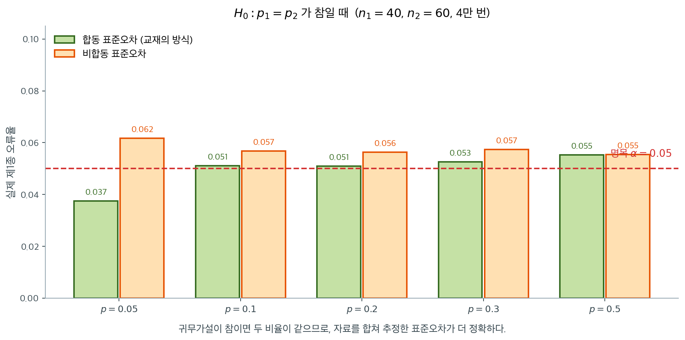

# 비율 차이에 대한 이표본 Z-검정

## 집단 간 성공률의 비교

실무의 많은 질문이 두 모집단의 "성공" 비율을 비교하는 것이다. 새 웹사이트 디자인이 기존보다 높은 전환율로 이어지는가? 백신 접종군의 감염률이 위약군보다 낮은가? 두 인구집단의 지지율이 다른가? 비율에 대한 이표본 z-검정은 두 모비율 $p_1$과 $p_2$가 같은지 검정하여 이런 질문에 답하는 형식적 틀을 제공한다.

## 설정과 기호

이진(성공/실패) 결과의 독립인 두 확률표본을 관측한다:

- 표본 1: 독립 시행 $n_1$번에서 성공 $X_1$번, 표본비율 $\hat{p}_1 = X_1 / n_1$
- 표본 2: 독립 시행 $n_2$번에서 성공 $X_2$번, 표본비율 $\hat{p}_2 = X_2 / n_2$

여기서 $X_1 \sim \text{Binomial}(n_1, p_1)$, $X_2 \sim \text{Binomial}(n_2, p_2)$이고 두 표본은 서로 독립이다.

## 가설

귀무가설은 두 모비율이 같다는 것이다:

$$
H_0 : p_1 = p_2
$$

대립가설은 다음 세 형태 중 하나이다:

| 이름 | 대립가설 $H_a$ | 기각하는 경우 |
|---|---|---|
| 양측 | $p_1 \neq p_2$ | $\lvert Z \rvert$가 클 때 |
| 좌측 | $p_1 < p_2$ | $Z$가 매우 작을 때(음수) |
| 우측 | $p_1 > p_2$ | $Z$가 매우 클 때 |

??? note "0이 아닌 차이를 검정할 때"
    여기서 제시한 검정은 $H_0: p_1 - p_2 = 0$에만 적용된다. $\delta_0 \neq 0$인 $H_0: p_1 - p_2 = \delta_0$을 검정하려면 (합동하지 않는) 다른 표준오차 공식이 필요하다. 합동 비율은 귀무가설 아래에서 $p_1 = p_2$를 가정할 때에만 의미가 있기 때문이다.

## 합동 비율

$H_0: p_1 = p_2$ 아래에서 두 표본은 성공확률이 같은 모집단에서 나온다. 이 공통 비율의 최선의 추정값은 두 표본의 자료를 합친 것이다:

$$
\hat{p} = \frac{X_1 + X_2}{n_1 + n_2}
$$

이 합동 비율 $\hat{p}$는 성공 횟수와 시행 횟수를 모두 합쳐 하나의 추정값을 만든다. 귀무가설 아래에서 공통 표준오차를 추정하기 위해 검정통계량의 분모에 쓰인다.

## 검정통계량의 유도

$H_0$ 아래에서 차이 $\hat{p}_1 - \hat{p}_2$의 기댓값은 0이다. 두 표본이 독립이므로 차이의 분산은:

$$
\text{Var}(\hat{p}_1 - \hat{p}_2) = p(1 - p)\left(\frac{1}{n_1} + \frac{1}{n_2}\right)
$$

여기서 $p = p_1 = p_2$는 $H_0$ 아래의 공통 모비율이다. 미지의 $p$를 합동 추정값 $\hat{p}$로 바꾸고 표준화하면 검정통계량을 얻는다:

$$
Z = \frac{\hat{p}_1 - \hat{p}_2}{\sqrt{\hat{p}(1 - \hat{p})\left(\dfrac{1}{n_1} + \dfrac{1}{n_2}\right)}}
$$

$H_0$ 아래에서 표본이 충분히 크면 $Z$는 근사적으로 표준정규이다: $Z \dot{\sim} N(0, 1)$.



합동이 그저 취향의 문제가 아니라는 것은 오류율을 재 보면 안다. $H_0$이 참인 자료에서 두 방식의 실제 기각률을 잰 것인데, **합동 쪽이 명목 $0.05$에 더 가깝다.** 특히 $p$가 작을 때 비합동 방식은 $0.05$를 웃돈다.

이유는 분모에 있다. 귀무가설이 참이면 두 모비율이 같은 값이므로, 그 하나를 추정하는 데 두 표본을 모두 쓰는 편이 정확하다. 비합동 방식은 $\hat p_1$과 $\hat p_2$를 따로 쓰는데, 작은 표본에서 이 둘이 우연히 극단으로 치우치면 분모가 지나치게 작아져 $Z$가 부풀려진다.

**신뢰구간에서는 반대로 합동하면 안 된다**는 점을 함께 기억해 두자. 구간은 어떤 가설도 전제하지 않으므로 두 비율이 같다고 볼 근거가 없기 때문이다. 같은 자료에 같은 통계량인데 무엇을 묻느냐에 따라 분모가 달라지는 것이며, 5.8절에서 두 표본분포를 나란히 놓고 그 차이를 보았다.

## 기각역과 p-값

$z_{\alpha}$를 표준정규분포의 상위 $\alpha$ 분위수, $z_{\text{obs}}$를 검정통계량의 관측값이라 하자.

### 양측검정 (Hₐ: p₁ ≠ p₂)

**기각역**: $|z_{\text{obs}}| > z_{\alpha/2}$이면 $H_0$을 기각한다.

**p-값**:

$$
p\text{-value} = 2\bigl[1 - \mathcal{N}(|z_{\text{obs}}|)\bigr]
$$

### 좌측검정 (Hₐ: p₁ < p₂)

**기각역**: $z_{\text{obs}} < -z_{\alpha}$이면 $H_0$을 기각한다.

**p-값**:

$$
p\text{-value} = \mathcal{N}(z_{\text{obs}})
$$

### 우측검정 (Hₐ: p₁ > p₂)

**기각역**: $z_{\text{obs}} > z_{\alpha}$이면 $H_0$을 기각한다.

**p-값**:

$$
p\text{-value} = 1 - \mathcal{N}(z_{\text{obs}})
$$

## 가정

비율에 대한 이표본 z-검정에는 다음 조건이 필요하다:

1. **독립인 표본**: 두 표본이 각 모집단에서 독립적으로 뽑혔다.
2. **독립인 관측값**: 각 표본 안에서 이진 결과가 독립이다.
3. **충분히 큰 표본크기**: 이항분포에 대한 정규근사가 적절해야 한다. 표준적인 경험칙은 다음 네 가지를 모두 요구한다:

$$
n_1 \hat{p} \geq 5, \quad n_1(1 - \hat{p}) \geq 5, \quad n_2 \hat{p} \geq 5, \quad n_2(1 - \hat{p}) \geq 5
$$

어떤 교재는 이 조건을 각 표본비율($n_1\hat{p}_1 \geq 5$ 등)로 진술하지만, $\hat{p}$가 $H_0$ 아래에서 쓰는 추정값이므로 합동 비율 $\hat{p}$로 확인하는 것이 더 적절하다.

!!! warning "작은 표본이나 극단적인 비율"
    표본이 작거나 비율이 0 또는 1에 가까우면 정규근사가 나쁘다. 이런 경우에는 Fisher의 정확검정이나 순열검정이 더 믿을 만한 대안이다.

<div class="exbox" markdown>

**보기 1.** <span class="diff easy" title="쉬움"></span> 전환율에 대한 A/B 검정. 어떤 전자상거래 회사가 기존 결제 페이지(A)와 새로 디자인한 버전(B)의 전환율을 비교하는 A/B 검정을 한 주 동안 진행했다:

- 페이지 A: 방문자 $n_1 = 500$명, 전환 $X_1 = 45$건, $\hat{p}_1 = 45/500 = 0.090$
- 페이지 B: 방문자 $n_2 = 480$명, 전환 $X_2 = 58$건, $\hat{p}_2 = 58/480 = 0.121$

$\alpha = 0.05$에서 전환율이 다른지 검정하라.

</div>

??? success "풀이"
    **1단계: 가설을 세운다.**

    $$
    H_0: p_1 = p_2 \quad \text{vs} \quad H_a: p_1 \neq p_2
    $$

    **2단계: 합동 비율을 계산한다.**

    $$
    \hat{p} = \frac{45 + 58}{500 + 480} = \frac{103}{980} \approx 0.1051
    $$

    **3단계: 표본크기 조건을 확인한다.** 가장 작은 기대도수는 $n_2(1 - \hat{p}) = 480 \times 0.8949 \approx 430 \geq 5$이다. 네 조건이 모두 만족된다.

    **4단계: 표준오차와 검정통계량을 계산한다.**

    $$
    \text{SE} = \sqrt{0.1051 \times 0.8949 \times \left(\frac{1}{500} + \frac{1}{480}\right)} = \sqrt{0.09406 \times 0.004083} \approx \sqrt{0.000384} \approx 0.01960
    $$

    $$
    z_{\text{obs}} = \frac{0.090 - 0.121}{0.01960} = \frac{-0.031}{0.01960} \approx -1.582
    $$

    **5단계: p-값을 계산한다.**

    $$
    p\text{-value} = 2\bigl[1 - \mathcal{N}(1.582)\bigr] = 2(1 - 0.9431) = 2(0.0569) \approx 0.114
    $$

    **6단계: 판정한다.** $p \approx 0.114 > 0.05 = \alpha$이므로 $H_0$을 기각하지 못한다. 5% 유의수준에서 두 페이지 디자인의 전환율이 다르다고 결론지을 증거가 부족하다.

<div class="exbox" markdown>

**보기 2.** <span class="diff easy" title="쉬움"></span> 두 비율의 z 검정 구현 — 손계산과 어긋나는 자리. 보기 1을 손으로 풀 때 $z_{\text{obs}} \approx -1.582$를 얻었는데, 아래 구현은 $-1.573$을 준다.

**(1)** 두 값이 어디서 갈라졌는지 짚고 정확한 $z$와 $p$를 구하시오. 또 성공 수와 표본크기를 함께 $k$배로 늘리면 $z$가 어떻게 변하는지 식으로 쓰시오.

**(2)** 검정은 **합동**한 표준오차를 쓰고 신뢰구간은 **합동하지 않은** 표준오차를 쓴다. $n_1 = n_2 = n$일 때 두 표준오차의 정확한 관계를 유도하고, 그 결론이 이 자료($500$ 대 $480$)에도 그대로 적용되는지 확인하시오.

</div>

??? success "풀이"

    **(1) 어긋남의 출처는 분자다.** 정확한 값은 $\hat p_2 = 58/480 = 0.12083333\ldots$인데 보기 1의 손계산은 이것을 $0.121$로 올림하고 차이도 $-0.031$로 적었다. 참 차이는

    $$
    \hat p_1 - \hat p_2 = 0.09 - 0.12083333 = -0.03083333
    $$

    이므로 손계산은 분자의 크기를 $0.54\%$ 부풀렸다. 분모는 거의 그대로다. 합동 비율 $\hat p = 103/980 = 0.10510204$에서

    $$
    \text{SE} = \sqrt{0.10510204 \times 0.89489796 \times \left(\frac{1}{500} + \frac{1}{480}\right)}
    = 0.01959746
    $$

    이고, 보기 1이 쓴 반올림값 $0.1051$로 계산해도 $0.01959729$로 소수 일곱째 자리에서야 갈라진다. 그러므로

    $$
    \frac{-0.031}{0.0195975} = -1.581838,
    \qquad
    \frac{-0.03083333}{0.0195975} = -1.573333
    $$

    로 **차이 전부가 분자의 반올림에서 왔다.** 정확한 값은 $z = -1.573333$, $p = 0.115642$이고 판정은 바뀌지 않는다.

    **$k$배 확장.** $x_i \to kx_i$, $n_i \to kn_i$로 늘리면 $\hat p_1, \hat p_2, \hat p$가 모두 그대로이고 $1/n_1 + 1/n_2$만 $1/k$배가 되므로

    $$
    \text{SE}(k) = \frac{\text{SE}(1)}{\sqrt k},
    \qquad z(k) = \sqrt k \; z(1).
    $$

    $k = 10$이면 $z = -1.573333\sqrt{10} = -4.975317$, $k = 100$이면 $-15.733333$이다.

    **(2) 균형 설계에서는 합동 쪽이 반드시 크다.** $f(p) = p(1-p)$로 쓰고 $n_1 = n_2 = n$, $d = \hat p_1 - \hat p_2$라 하자. 이때 합동 비율은 단순평균 $\bar p = (\hat p_1 + \hat p_2)/2$이고

    $$
    \text{SE}_{\text{pool}}^2 = \frac{2}{n} f(\bar p),
    \qquad
    \text{SE}_{\text{CI}}^2 = \frac{f(\hat p_1) + f(\hat p_2)}{n}.
    $$

    $f$의 일차항은 평균을 지나므로 차이는 이차항만 남는다.

    $$
    f(\bar p) - \frac{f(\hat p_1) + f(\hat p_2)}{2}
    = \left[\bar p - \bar p^{\,2}\right] - \left[\bar p - \frac{\hat p_1^2 + \hat p_2^2}{2}\right]
    = \frac{\hat p_1^2 + \hat p_2^2}{2} - \bar p^{\,2}
    = \frac{d^2}{4}
    $$

    이므로

    $$
    \text{SE}_{\text{pool}}^2 = \text{SE}_{\text{CI}}^2 + \frac{d^2}{2n}.
    $$

    양변을 $d^2$으로 나누면 두 통계량의 관계가 깔끔하게 나온다.

    $$
    \frac{1}{z_{\text{pool}}^2} = \frac{1}{z_{\text{CI}}^2} + \frac{1}{2n}
    \iff
    z_{\text{pool}}^2 = \frac{z_{\text{CI}}^2}{1 + z_{\text{CI}}^2/(2n)}
    $$

    **그러므로 균형 설계에서는 언제나 $\lvert z_{\text{pool}} \rvert \le \lvert z_{\text{CI}} \rvert$다.** 곧 검정이 신뢰구간보다 조금 보수적이다. 그리고 $z_{\text{CI}}$를 아무리 키워도 $z_{\text{pool}}^2 < 2n = N$이다. **합동 $z$ 통계량은 총 관측값 수의 제곱근을 넘지 못한다.** 이 한계는 균형에만 있는 것이 아니다. $z_{\text{pool}}^2$은 $2 \times 2$ 표의 피어슨 카이제곱통계량과 정확히 같고, 그것은 $N\phi^2$($\phi$는 파이계수)이며 $\lvert \phi \rvert \le 1$이기 때문이다.

    **그러나 이 자료는 균형이 아니다.** 아래에서 확인하듯 $500$ 대 $480$에서는 부등호가 뒤집힌다. 균형점에서의 간격이 $d^2/(2n) = 0.03083333^2/980 = 9.70 \times 10^{-7}$(분산 척도), 표준오차로는 $0.0000247$밖에 안 되어, 열 명의 불균형이 그것을 지워 버린다.

    **수치적으로.** 먼저 검정 함수를 만든다.

    ```python
    import numpy as np
    from scipy import stats

    def two_proportion_z_test(x1, n1, x2, n2, alternative="two-sided"):
        """두 비율의 차이에 대한 이표본 z 검정.

        Parameters
        ----------
        x1, x2 : int
            Number of successes in each sample.
        n1, n2 : int
            Sample sizes.
        alternative : str
            'two-sided', 'less', or 'greater'.

        Returns
        -------
        z_stat : float
            Test statistic.
        p_value : float
            P-value.
        """
        p1_hat = x1 / n1
        p2_hat = x2 / n2
        # H0가 "두 비율이 같다"이므로 그 공통값을 전체를 합쳐 추정한다.
        # 신뢰구간을 만들 때는 합동하지 않는다. 목적이 다르기 때문이다.
        p_hat = (x1 + x2) / (n1 + n2)

        se = np.sqrt(p_hat * (1 - p_hat) * (1 / n1 + 1 / n2))
        z_stat = (p1_hat - p2_hat) / se

        if alternative == "two-sided":
            p_value = 2 * (1 - stats.norm.cdf(abs(z_stat)))
        elif alternative == "less":
            p_value = stats.norm.cdf(z_stat)
        elif alternative == "greater":
            p_value = 1 - stats.norm.cdf(z_stat)
        else:
            raise ValueError("alternative must be 'two-sided', 'less', or 'greater'")

        return z_stat, p_value


    # 보기 1 의 A/B 검정
    z, p = two_proportion_z_test(45, 500, 58, 480, alternative="two-sided")
    print(f"z = {z:.3f}, p-value = {p:.3f}")
    ```

    출력:

    ```
    z = -1.573, p-value = 0.116
    ```

    이제 (1)과 (2)를 확인한다.

    ```python
    x1, n1, x2, n2 = 45, 500, 58, 480
    p1, p2 = x1 / n1, x2 / n2
    pb = (x1 + x2) / (n1 + n2)
    d = p1 - p2
    se_p = np.sqrt(pb * (1 - pb) * (1 / n1 + 1 / n2))
    se_u = np.sqrt(p1 * (1 - p1) / n1 + p2 * (1 - p2) / n2)
    print(f"p1 = {p1:.7f}   p2 = {p2:.7f}   차이 = {d:.7f}")
    print(f"합동 p = {pb:.7f}   합동 SE = {se_p:.7f}")
    print(f"손계산의 차이 -0.031 →  z = {-0.031 / se_p:.6f}")
    print(f"정확한 차이          →  z = {d / se_p:.6f}"
          f"   p = {2 * stats.norm.sf(abs(d / se_p)):.6f}")

    print("\n자료를 k 배로 늘릴 때")
    print("   k      z          p            sqrt(k)*z_1")
    z1 = d / se_p
    for k in (1, 10, 100):
        z, _ = two_proportion_z_test(k * x1, k * n1, k * x2, k * n2)
        p = 2 * stats.norm.sf(abs(z))
        print(f"{k:4d}  {z:9.6f}  {p:.3e}   {np.sqrt(k) * z1:9.6f}")

    print(f"\n비합동 SE = {se_u:.7f}   |z| = {abs(d / se_u):.6f}")
    print(f"합동   SE = {se_p:.7f}   |z| = {abs(d / se_p):.6f}")
    print(f"→ 이 불균형 자료에서는 {'합동' if se_p > se_u else '비합동'} 쪽 SE 가 크다")

    # 균형 설계에서의 항등식: SE_p^2 - SE_u^2 = d^2/(2n)
    rng = np.random.default_rng(0)
    worst = 0.0
    for _ in range(20_000):
        n = int(rng.integers(20, 2000))
        a, b = int(rng.integers(1, n)), int(rng.integers(1, n))
        q1, q2, qb = a / n, b / n, (a + b) / (2 * n)
        sp2 = qb * (1 - qb) * (2 / n)
        su2 = q1 * (1 - q1) / n + q2 * (1 - q2) / n
        worst = max(worst, abs(sp2 - su2 - (q1 - q2) ** 2 / (2 * n)))
    print(f"\n균형 항등식 SE_p^2 - SE_u^2 = d^2/(2n) 의 최대 오차 = {worst:.2e}"
          f"  (무작위 표 20000 개)")

    # 총 980 명을 어떻게 나누면 부호가 뒤집히는가
    print("\n  n1   n2    합동 SE   비합동 SE   큰 쪽")
    for m in (400, 450, 490, 495, 500, 560):
        k = 980 - m
        PB = (m * p1 + k * p2) / 980
        sp = np.sqrt(PB * (1 - PB) * (1 / m + 1 / k))
        su = np.sqrt(p1 * (1 - p1) / m + p2 * (1 - p2) / k)
        print(f"{m:4d} {k:4d}   {sp:.7f}  {su:.7f}   {'합동' if sp > su else '비합동'}")

    # z_p^2 은 2x2 피어슨 카이제곱과 같고 N 을 넘지 못한다
    chi = stats.chi2_contingency([[x1, n1 - x1], [x2, n2 - x2]], correction=False)
    print(f"\nz_p^2 = {z1**2:.9f}   피어슨 카이제곱 = {chi.statistic:.9f}")
    worst = 0.0
    for _ in range(20_000):
        a, b = int(rng.integers(5, 500)), int(rng.integers(5, 500))
        u, v = int(rng.integers(0, a + 1)), int(rng.integers(0, b + 1))
        if u + v in (0, a + b):
            continue
        P1, P2, PB = u / a, v / b, (u + v) / (a + b)
        z = (P1 - P2) / np.sqrt(PB * (1 - PB) * (1 / a + 1 / b))
        worst = max(worst, z**2 / (a + b))
    print(f"z_p^2 / N 의 최대값 = {worst:.9f}  (1 을 넘지 못한다)")
    ```

    출력:

    ```
    p1 = 0.0900000   p2 = 0.1208333   차이 = -0.0308333
    합동 p = 0.1051020   합동 SE = 0.0195975
    손계산의 차이 -0.031 →  z = -1.581838
    정확한 차이          →  z = -1.573333   p = 0.115642

    자료를 k 배로 늘릴 때
       k      z          p            sqrt(k)*z_1
       1  -1.573333  1.156e-01   -1.573333
      10  -4.975317  6.514e-07   -4.975317
     100  -15.733333  8.938e-56   -15.733333

    비합동 SE = 0.0196244   |z| = 1.571171
    합동   SE = 0.0195975   |z| = 1.573333
    → 이 불균형 자료에서는 비합동 쪽 SE 가 크다

    균형 항등식 SE_p^2 - SE_u^2 = d^2/(2n) 의 최대 오차 = 6.94e-18  (무작위 표 20000 개)

      n1   n2    합동 SE   비합동 SE   큰 쪽
     400  580   0.0201930  0.0196954   합동
     450  530   0.0197882  0.0195560   합동
     490  490   0.0196192  0.0195945   합동
     495  485   0.0196073  0.0196084   비합동
     500  480   0.0195975  0.0196244   비합동
     560  420   0.0196385  0.0199796   비합동

    z_p^2 = 2.475377593   피어슨 카이제곱 = 2.475377593
    z_p^2 / N 의 최대값 = 1.000000000  (1 을 넘지 못한다)
    ```

    **(1)이 맞는다.** 반올림한 분자는 $-1.581838$, 정확한 분자는 $-1.573333$으로 손계산의 $-1.582$가 그대로 재현된다. $k$배 확장에서도 $\sqrt k\,z(1)$이 직접 계산한 $z$와 소수 여섯째 자리까지 같다. 같은 $3.08\%$p 차이가 $k = 1$에서 $p = 0.116$, $k = 10$에서 $6.5 \times 10^{-7}$, $k = 100$에서 $9 \times 10^{-56}$이다. **A/B 검정에서 표본크기 계획이 왜 중요한지가 이 한 줄에 다 있다.** 실험을 너무 일찍 멈추면 실재하는 3%p 개선을 "차이 없음"으로 결론짓는다.

    **(2)의 항등식도 맞는다.** 무작위로 만든 균형 표 20,000개에서 $\text{SE}_{\text{pool}}^2 - \text{SE}_{\text{CI}}^2 = d^2/(2n)$의 최대 오차가 $7 \times 10^{-18}$로 부동소수점 한계다. $z_{\text{pool}}^2 = 2.475377593$이 피어슨 카이제곱과 소수 아홉째 자리까지 같고, $z_{\text{pool}}^2/N$의 최대값은 정확히 $1$에서 멈춘다($\hat p_1 = 0$, $\hat p_2 = 1$인 극단에서 등호가 성립한다).

    **그런데 부등호는 균형에서만 보장된다.** 표를 보면 $n_1 \le 490$에서는 합동 SE가 크고 $n_1 \ge 495$에서는 비합동 SE가 크다. 균형점 $490{:}490$에서의 간격이 $0.0196192 - 0.0195945 = 0.0000247$에 지나지 않으므로, 열 명만 옮겨도 뒤집히는 것이다. 이 자료에서는 $p = 0.115642$(합동) 대 $0.116143$(비합동)으로 **두 값 모두 $0.05$에서 멀어 판정이 갈릴 일이 없지만**, 경계 근처라면 "검정은 기각했는데 신뢰구간은 0을 담는다"는 모순이 생길 수 있다. 바로 아래 「신뢰구간과의 관계」에서 짚는 쌍대성이 **정확한** 동치가 아닌 이유가 이 분모의 차이다.

## 신뢰구간과의 관계

[가설검정과 신뢰구간의 쌍대성](../errors_and_power/duality.md)에 의해, 수준 $\alpha$에서 $H_0: p_1 = p_2$를 기각하지 못하는 것은 $p_1 - p_2$의 $(1 - \alpha)$ 신뢰구간이 0을 포함하는 것과 동등하다. 다만 신뢰구간은 보통 **합동하지 않은** 표준오차를 쓴다:

$$
\text{SE}_{\text{CI}} = \sqrt{\frac{\hat{p}_1(1 - \hat{p}_1)}{n_1} + \frac{\hat{p}_2(1 - \hat{p}_2)}{n_2}}
$$

신뢰구간은 $p_1 = p_2$를 가정하지 않기 때문이다. 합동 표준오차는 $H_0$ 아래의 가설검정에만 해당한다.

## 관련 주제

- [평균에 대한 이표본 Z-검정](z_test_two_means.md): 분산을 알 때의 평균 비교
- [이표본 t-검정](t_test_two_means.md): 분산을 모를 때의 평균 비교
- [두 분산에 대한 F-검정](f_test_two_variances.md): 모분산의 동일성 검정

## 연습문제

<div class="drillbox" markdown>

**연습문제 1.** <span class="diff easy" title="쉬움"></span>
치료 A: 200명 중 60명 금연. B: 180명 중 54명 금연. $\alpha = 0.05$에서 검정하라.

</div>

??? success "풀이"
    $\hat p_1 = 0.30$, $\hat p_2 = 0.30$. 합동: $\hat p = (60+54)/(200+180) = 114/380 = 0.30$.

    $z = (0.30 - 0.30)/\mathrm{SE} = 0$. 기각하지 못한다. 차이가 탐지되지 않았다.

<div class="drillbox" markdown>

**연습문제 2.** <span class="diff easy" title="쉬움"></span>
A/B 검정: A는 2000명 중 240명, B는 2000명 중 270명이 전환했다. $\alpha = 0.05$에서 $H_0: p_A = p_B$를 검정하라.

</div>

??? success "풀이"
    $\hat p_A = 0.120$, $\hat p_B = 0.135$. 합동: $\hat p = 510/4000 = 0.1275$.

    $\mathrm{SE} = \sqrt{0.1275 \cdot 0.8725 \cdot (1/2000 + 1/2000)} = \sqrt{0.0001113} \approx 0.01055$.

    $z = (0.135 - 0.120)/0.01055 \approx 1.42$. 양측 p-값 $\approx 0.156$. 기각하지 못한다.

    상대적으로 12.5%의 상승인데도 이 표본크기에서는 통계적으로 유의하지 않다. 표본이 더 커야 한다.

<div class="drillbox" markdown>

**연습문제 3.** <span class="diff med" title="중간"></span>
**A/B 검정을 위한 표본크기.** $\alpha = 0.05$에서 12%에서 13.5%로의 상승을 검정력 80%로 탐지하려면 집단당 $n$이 얼마여야 하는가?

</div>

??? success "풀이"
    효과크기: $|p_1 - p_2| = 0.015$. 평균 분산: $\approx 0.1275 \cdot 0.8725 \approx 0.1112$.

    공식: $n \approx 2 \cdot ((z_{\alpha/2} + z_\beta)^2 \cdot p(1-p))/(\Delta)^2 = 2 \cdot ((1.96 + 0.84)^2 \cdot 0.1112)/0.000225 \approx 7750$.

    집단당 대략 8000명이다. 작은 효과에 대한 A/B 검정에는 큰 표본이 필요하며, 기술 업계에서 흔한 일이다.

<div class="drillbox" markdown>

**연습문제 4.** <span class="diff med" title="중간"></span>
**합동 표준오차와 비합동 표준오차.** 가설검정에는 합동, 신뢰구간에는 비합동 표준오차를 쓰는 이유는?

</div>

??? success "풀이"
    $H_0: p_1 = p_2 = p$ 아래에서는 합동 추정량 $\hat p_{\text{pool}}$이 공통 $p$의 최선의 추정값이다. 검정의 표준오차에는 이것을 쓴다.

    (동일성을 가정하지 않는) $p_1 - p_2$의 신뢰구간에는 $\hat p_1$과 $\hat p_2$를 따로 쓴다.

    현대의 A/B 검정 플랫폼은 검정에도 비합동 표준오차를 쓰기도 한다 — 보수적인 선택으로, 검정력이 약간 낮지만 비율이 다를 때에도 타당하다.

<div class="drillbox" markdown>

**연습문제 5.** <span class="diff med" title="중간"></span>
두 비율 $z$-검정의 **조건.**

</div>

??? success "풀이"
    - 각 모집단에서 독립적으로 뽑은 확률표본.
    - 충분히 큰 표본크기: $n_1 \hat p_1 \ge 10$, $n_1(1 - \hat p_1) \ge 10$, 표본 2도 마찬가지.
    - 합동 버전에서는 $n \hat p_{\text{pool}}$과 $n (1 - \hat p_{\text{pool}})$이 모두 $\ge 10$.

    조건이 깨지면 Fisher의 정확검정을 쓴다.

<div class="drillbox" markdown>

**연습문제 6.** <span class="diff med" title="중간"></span>
**두 비율의 효과크기.** 상대위험도와 오즈비를 정의하라.

</div>

??? success "풀이"
    **위험 차이:** $p_1 - p_2$. 절대적인 값이다.

    **상대위험도(RR):** $p_1/p_2$. 비율이다.

    **오즈비(OR):** $[p_1/(1-p_1)]/[p_2/(1-p_2)]$. 환자-대조군 연구와 로지스틱 회귀에서 쓴다.

    드문 사건($p$가 작을 때)에서는 $\mathrm{OR} \approx \mathrm{RR}$이다. 흔한 사건에서는 다르다.

    보고 방식: 위험 차이(임상적으로 해석 가능), 상대위험도(효과의 크기), 오즈비(통계적 관례)를 함께 제시하라. 각각 쓰임새가 있다.

<div class="drillbox" markdown>

**연습문제 7.** <span class="diff hard" title="어려움"></span>
연습문제 4의 "검정에는 합동, 구간에는 비합동" 규칙 때문에 **검정과 신뢰구간이 서로 다른 결론**을 줄 수 있다. 그런 사례를 찾아 설명하라.

</div>

??? success "풀이"
    **문제의 구조.** 검정은 합동 표준오차 $\text{SE}_0$을, 구간은 비합동 $\text{SE}_1$을 쓴다. 두 값이 다르면

    - 합동 $z>1.96$ (기각) 인데
    - 95% Wald 구간이 0을 포함

    하는 일이 생길 수 있다.

    ```python
    import numpy as np
    from scipy import stats

    z95 = stats.norm.ppf(0.975)
    n1, k1 = 30, 3         # 10%
    n2, k2 = 100, 1        # 1%
    p1, p2 = k1 / n1, k2 / n2
    pp = (k1 + k2) / (n1 + n2)
    se_pooled = np.sqrt(pp * (1 - pp) * (1 / n1 + 1 / n2))
    se_unpool = np.sqrt(p1 * (1 - p1) / n1 + p2 * (1 - p2) / n2)

    print(f"p̂1 = {p1:.4f} ({k1}/{n1}),  p̂2 = {p2:.4f} ({k2}/{n2}),  "
          f"합동 p̂ = {pp:.4f}\n")
    print(f"합동   SE={se_pooled:.5f}  z={(p1 - p2) / se_pooled:.4f}  "
          f"p={2 * stats.norm.sf(abs((p1 - p2) / se_pooled)):.4f}  ← 기각")
    print(f"비합동 SE={se_unpool:.5f}  z={(p1 - p2) / se_unpool:.4f}  "
          f"p={2 * stats.norm.sf(abs((p1 - p2) / se_unpool)):.4f}")
    print(f"Wald 95% CI ({p1 - p2 - z95 * se_unpool:.5f}, "
          f"{p1 - p2 + z95 * se_unpool:.5f})  ← 0 을 포함")

    def wilson(k, n, z=z95):
        p = k / n
        d = 1 + z * z / n
        c = (p + z * z / (2 * n)) / d
        h = z * np.sqrt(p * (1 - p) / n + z * z / (4 * n * n)) / d
        return c - h, c + h

    l1, u1 = wilson(k1, n1)
    l2, u2 = wilson(k2, n2)
    lo = p1 - p2 - z95 * np.sqrt(l1 * (1 - l1) / n1 + u2 * (1 - u2) / n2)
    hi = p1 - p2 + z95 * np.sqrt(u1 * (1 - u1) / n1 + l2 * (1 - l2) / n2)
    print(f"뉴컴 95% CI ({lo:.5f}, {hi:.5f})  ← 0 을 포함하지 않음")

    print(f"\n피셔 정확검정 p = "
          f"{stats.fisher_exact([[k1, n1 - k1], [k2, n2 - k2]]).pvalue:.4f}")
    print(f"기대도수의 최솟값 = "
          f"{min(n1 * pp, n1 * (1 - pp), n2 * pp, n2 * (1 - pp)):.2f}")
    ```

    ```text
    p̂1 = 0.1000 (3/30),  p̂2 = 0.0100 (1/100),  합동 p̂ = 0.0308

    합동   SE=0.03595  z=2.5036  p=0.0123  ← 기각
    비합동 SE=0.05567  z=1.6167  p=0.1059
    Wald 95% CI (-0.01911, 0.19911)  ← 0 을 포함
    뉴컴 95% CI (0.01090, 0.24643)  ← 0 을 포함하지 않음

    피셔 정확검정 p = 0.0382
    기대도수의 최솟값 = 0.92
    ```

    **검정은 기각($p=0.012$), Wald 구간은 0을 포함**한다. 정면으로 충돌한다.

    **왜 이런 일이.** 합동 표준오차는 $\hat p=0.031$로 계산되는데, 비합동 쪽은 $\hat p_1=0.10$을 쓴다. $p(1-p)$가 $p$에 대해 증가하는 구간이라 $\hat p_1$이 큰 쪽의 분산 기여가 훨씬 크다.

    $$
    \text{SE}_0=0.0360 \quad\text{대}\quad \text{SE}_1=0.0557
    $$

    **1.5배 넘게 차이난다.**

    **어느 쪽이 옳은가 — 둘 다 신뢰하기 어렵다.** 기대도수의 최솟값이 0.92로, 정규근사의 조건($\ge5$)을 크게 벗어났다. **정규근사를 쓰면 안 되는 자료**다.

    - **피셔 정확검정** $p=0.038$ — 기각 쪽에 가깝다.
    - **뉴컴 구간** $(0.011,\ 0.246)$ — 0을 포함하지 않아 검정과 일치한다.

    **정리하면.**

    | 방법 | 결론 | 신뢰도 |
    |---|---|---|
    | 합동 $z$ 검정 | 기각($p=0.012$) | 근사 조건 위반 |
    | Wald 구간 | 0 포함 | **가장 나쁨**(작은 $p$에서 붕괴) |
    | 뉴컴 구간 | 0 미포함 | **양호** |
    | 피셔 정확검정 | 기각($p=0.038$) | 양호(다소 보수적) |

    **실무 지침 넷.**

    1. **검정과 구간이 충돌하면 근사가 깨졌다는 신호**다. 기대도수를 먼저 확인한다.
    2. **Wald 구간을 쓰지 않는다.** 뉴컴(윌슨 기반)을 기본으로 삼으면 이런 충돌이 거의 사라진다.
    3. **기대도수가 작으면 정확검정**을 쓴다.
    4. **하나의 결론만 보고할 때는 구간을 고른다.** "차이가 0이 아니다"보다 "차이가 1%p에서 25%p 사이다"가 훨씬 유용하다.

    **큰 표본에서는 이 문제가 사라진다.** $n$이 커지면 $\hat p_1,\hat p_2,\hat p$가 모두 참값에 가까워져 두 표준오차가 같아진다. 연습문제 2(각 2000명)에서는 합동 $z=-1.4222$, 비합동 $z=-1.4225$로 소수점 셋째 자리까지 같다.

<div class="drillbox" markdown>

**연습문제 8.** <span class="diff med" title="중간"></span>
연습문제 6에서 정의한 상대위험도와 오즈비의 **신뢰구간**을 구하고, 연습문제 1·2의 자료에 적용하라.

</div>

??? success "풀이"
    **핵심은 로그 척도다.** $\widehat{RR}$과 $\widehat{OR}$은 오른쪽으로 치우친 분포를 갖지만, **로그를 취하면 근사적으로 정규**가 된다.

    $$
    \operatorname{Var}(\log\widehat{RR})\approx\frac{1}{X_1}-\frac{1}{n_1}+\frac{1}{X_2}-\frac{1}{n_2}
    $$

    $$
    \operatorname{Var}(\log\widehat{OR})\approx\frac{1}{X_1}+\frac{1}{n_1-X_1}+\frac{1}{X_2}+\frac{1}{n_2-X_2}
    $$

    구간은 **로그 척도에서 대칭으로 만든 뒤 지수를 취한다.**

    ```python
    import numpy as np
    from scipy import stats

    z95 = stats.norm.ppf(0.975)

    def compare(k1, n1, k2, n2, label):
        p1, p2 = k1 / n1, k2 / n2
        pp = (k1 + k2) / (n1 + n2)
        z_pooled = (p1 - p2) / np.sqrt(pp * (1 - pp) * (1 / n1 + 1 / n2))
        se_u = np.sqrt(p1 * (1 - p1) / n1 + p2 * (1 - p2) / n2)

        rr = p1 / p2
        se_lrr = np.sqrt(1 / k1 - 1 / n1 + 1 / k2 - 1 / n2)
        or_ = (k1 / (n1 - k1)) / (k2 / (n2 - k2))
        se_lor = np.sqrt(1 / k1 + 1 / (n1 - k1) + 1 / k2 + 1 / (n2 - k2))

        print(f"{label}:  p̂1={p1:.4f}  p̂2={p2:.4f}")
        print(f"  합동 z = {z_pooled:.4f},  "
              f"p = {2 * stats.norm.sf(abs(z_pooled)):.4f}")
        print(f"  위험차 {p1 - p2:+.5f}  95% CI "
              f"({p1 - p2 - z95 * se_u:+.5f}, {p1 - p2 + z95 * se_u:+.5f})")
        print(f"  RR     {rr:.4f}     95% CI "
              f"({np.exp(np.log(rr) - z95 * se_lrr):.4f}, "
              f"{np.exp(np.log(rr) + z95 * se_lrr):.4f})")
        print(f"  OR     {or_:.4f}     95% CI "
              f"({np.exp(np.log(or_) - z95 * se_lor):.4f}, "
              f"{np.exp(np.log(or_) + z95 * se_lor):.4f})")

    compare(60, 200, 54, 180, "연습문제 1 (금연)")
    print()
    compare(240, 2000, 270, 2000, "연습문제 2 (A/B 전환)")
    ```

    ```text
    연습문제 1 (금연):  p̂1=0.3000  p̂2=0.3000
      합동 z = 0.0000,  p = 1.0000
      위험차 +0.00000  95% CI (-0.09228, +0.09228)
      RR     1.0000     95% CI (0.7352, 1.3601)
      OR     1.0000     95% CI (0.6444, 1.5518)

    연습문제 2 (A/B 전환):  p̂1=0.1200  p̂2=0.1350
      합동 z = -1.4222,  p = 0.1550
      위험차 -0.01500  95% CI (-0.03567, +0.00567)
      RR     0.8889     95% CI (0.7556, 1.0457)
      OR     0.8737     95% CI (0.7254, 1.0525)
    ```

    **연습문제 1은 두 비율이 정확히 같아 $p=1$이다.** 그런데도 구간은 **결코 좁지 않다.**

    - 위험차 $\pm9.2$%p
    - $RR$이 **0.74배에서 1.36배** 사이

    **"$p=1$이니 효과가 없다"고 말할 수 없다.** 치료 A가 B보다 36% 나을 가능성이 자료와 완전히 양립한다. **$p$-값의 최댓값조차 "차이 없음"의 증거가 아니다.**

    **연습문제 2는 세 지표가 모두 1(또는 0)을 아슬아슬하게 포함**한다. 구간의 상한 $RR=1.046$은 "B가 A보다 나쁠 수도 있지만 많아야 5%"라는 뜻으로, 실무적으로는 유용한 정보다.

    **세 가지 주의.**

    **1 — 구간이 로그 척도에서 대칭이므로 원 척도에서는 비대칭**이다. $RR=0.889$의 구간 $(0.756,\ 1.046)$은 중심에서 아래로 0.133, 위로 0.157이다. **$\widehat{RR}\pm z\cdot\text{SE}$처럼 원 척도에서 대칭 구간을 만들면 안 된다.**

    **2 — 셀이 0이면 계산이 불가능**하다. $1/X_1$이 발산한다. 관례적으로 모든 셀에 0.5를 더하는 보정(할데인·앙스콤 보정)을 쓰지만, 이는 근사이고 결과가 보정값에 민감하다. 정확법이 낫다.

    **3 — 검정과 구간이 다른 근사를 쓴다.** 위에서 연습문제 2의 합동 $z$ 검정 $p=0.155$이고 위험차 구간은 0을 포함하는데, 이는 우연히 일치한 것이다. 앞 문제에서 본 대로 표본이 작으면 어긋날 수 있다.

    **어느 지표를 주 결과로 삼을까.**

    | 상황 | 주 지표 |
    |---|---|
    | 의사결정·자원 배분 | **위험차**(와 NNT) |
    | 인과의 강도 | 위험비 |
    | 환자대조군 연구 | **오즈비**(다른 선택지가 없다) |
    | 로지스틱 회귀 | 오즈비 |

    **셋을 모두 보고하는 것이 가장 안전하다.** 지면이 부족하면 **위험차와 그 구간**을 우선한다.

<div class="drillbox" markdown>

**연습문제 9.** <span class="diff hard" title="어려움"></span>
백신 임상시험에서 쓰는 **백신 효능** $VE=1-RR$의 추론을 두 가지 방법으로 수행하고 비교하라.

</div>

??? success "풀이"
    **설정.** 백신군과 위약군을 비슷한 규모로 배정하고, 일정 기간 발생한 확진자 수를 센다.

    $$
    VE=1-RR=1-\frac{p_{\text{백신}}}{p_{\text{위약}}}
    $$

    $VE=0.95$는 "백신군의 발생률이 위약군의 5%"라는 뜻이다.

    ```python
    import numpy as np
    from scipy import stats

    z95 = stats.norm.ppf(0.975)
    k_v, n_v = 8, 21_720        # 백신군: 21,720명 중 8명 발병
    k_p, n_p = 162, 21_728      # 위약군: 21,728명 중 162명 발병
    p_v, p_p = k_v / n_v, k_p / n_p
    print(f"백신군 {k_v}/{n_v:,} = {p_v * 100:.4f}%")
    print(f"위약군 {k_p}/{n_p:,} = {p_p * 100:.4f}%")

    # ── 방법 ①: log RR 의 델타법 구간
    rr = p_v / p_p
    se = np.sqrt(1 / k_v - 1 / n_v + 1 / k_p - 1 / n_p)
    lo, hi = np.exp(np.log(rr) - z95 * se), np.exp(np.log(rr) + z95 * se)
    print(f"\n① 로그 RR 델타법")
    print(f"   RR = {rr:.5f}  95% CI ({lo:.5f}, {hi:.5f})")
    print(f"   VE = {(1 - rr) * 100:.2f}%  95% CI "
          f"({(1 - hi) * 100:.2f}%, {(1 - lo) * 100:.2f}%)")

    # ── 방법 ②: 전체 사례 수를 고정한 조건부 이항
    n_case = k_v + k_p
    theta = k_v / n_case                   # 사례 중 백신군의 비율
    ratio = n_v / n_p                      # 배정 비율

    def wilson(k, n, z=z95):
        p = k / n
        d = 1 + z * z / n
        c = (p + z * z / (2 * n)) / d
        h = z * np.sqrt(p * (1 - p) / n + z * z / (4 * n * n)) / d
        return c - h, c + h

    def ve(th):
        return 1 - (th / (1 - th)) / ratio

    t_lo, t_hi = wilson(k_v, n_case)
    print(f"\n② 조건부 이항 (사례 {n_case}건 중 백신군 {k_v}건)")
    print(f"   θ̂ = {theta:.5f}  윌슨 95% CI ({t_lo:.5f}, {t_hi:.5f})")
    print(f"   VE = {ve(theta) * 100:.2f}%  95% CI "
          f"({ve(t_hi) * 100:.2f}%, {ve(t_lo) * 100:.2f}%)")

    rd = p_p - p_v
    print(f"\n위험차 {rd * 1e5:.2f}건 / 10만명")
    print(f"1명의 발병을 막는 데 필요한 접종 수 = {1 / rd:.0f}명")
    pool = (k_v + k_p) / (n_v + n_p)
    zs = (p_v - p_p) / np.sqrt(pool * (1 - pool) * (1 / n_v + 1 / n_p))
    print(f"합동 z = {zs:.4f},  p = {2 * stats.norm.sf(abs(zs)):.3g}")
    ```

    ```text
    백신군 8/21,720 = 0.0368%
    위약군 162/21,728 = 0.7456%

    ① 로그 RR 델타법
       RR = 0.04940  95% CI (0.02430, 0.10044)
       VE = 95.06%  95% CI (89.96%, 97.57%)

    ② 조건부 이항 (사례 170건 중 백신군 8건)
       θ̂ = 0.04706  윌슨 95% CI (0.02404, 0.09010)
       VE = 95.06%  95% CI (90.09%, 97.54%)

    위험차 708.75건 / 10만명
    1명의 발병을 막는 데 필요한 접종 수 = 141명
    합동 z = -11.8320,  p = 2.67e-32
    ```

    **두 방법이 거의 같은 답을 준다**(90.0~97.6% 대 90.1~97.5%).

    **조건부 방법의 발상.** 발병이 드물면 총 사례 수 $X_v+X_p$를 고정하고 **"그중 몇 건이 백신군에서 나왔는가"**만 본다. 이는 이항분포이므로 윌슨 구간을 그대로 쓸 수 있고, 다시 $VE$로 변환한다.

    $$
    \theta=\frac{p_v r}{p_v r+p_p},\qquad r=\frac{n_v}{n_p}
    \quad\Longrightarrow\quad
    VE=1-\frac{1}{r}\cdot\frac{\theta}{1-\theta}
    $$

    **왜 조건부 방법을 선호하는가.**

    1. **드문 사건에서 안정적**이다. 델타법은 $1/X$에 의존해 $X$가 작으면 불안정하다.
    2. **$X_v=0$이어도 계산된다.** 윌슨 구간은 0에서도 붕괴하지 않는다.
    3. **정확한 이항 방법**(클로퍼·피어슨)으로 바꾸기 쉽다.
    4. **베이즈 버전**이 자연스럽다. 실제 백신 3상 시험들이 $\theta$에 베타 사전분포를 놓는 베이즈 방식을 사전등록에 썼다.

    **해석에서 놓치기 쉬운 것.**

    **1 — $VE$는 상대 지표다.** 95%라는 숫자는 인상적이지만, 절대 감소는 **10만 명당 709건**이다. 유행이 잠잠한 시기라면 같은 백신의 절대 효과가 훨씬 작다.

    **2 — 1명을 막으려면 141명을 접종**해야 한다(이 유행 강도에서). 이 값은 **기저 발생률에 반비례**하므로 시기와 지역에 따라 크게 달라진다.

    **3 — 구간의 하한이 정책을 정한다.** 규제기관이 "$VE$의 95% 구간 하한이 30%를 넘을 것"처럼 요구하는 이유다. 점추정 95%보다 **하한 90%**가 실질적 보증이다.

    **4 — 이 예는 규모만 빌린 가상의 수치**다. 실제 시험 결과를 인용한 것이 아니므로 특정 백신의 효능으로 읽어서는 안 된다.

<div class="drillbox" markdown>

**연습문제 10.** <span class="diff easy" title="쉬움"></span>
두 비율 $z$ 검정의 **점검 목록**과 보고 양식을 정리하라.

</div>

??? success "풀이"

    **사용 전 점검.**

    - [ ] 두 표본이 **독립**인가 (같은 사람이 양쪽에 들어가지 않았는가)
    - [ ] 각 관측이 **이진**이고 시행 간 독립인가 (군집 표본이면 설계효과를 반영)
    - [ ] **기대도수**가 $n_i\hat p$, $n_i(1-\hat p)$ 모두 5 이상인가
    - [ ] 표본크기를 **사전에** 정했는가 (중간 확인 없이)
    - [ ] 단측/양측을 **사전에** 정했는가
    - [ ] 결과의 정의가 두 집단에서 **동일**한가

    **검정 선택.**

    | 조건 | 검정 |
    |---|---|
    | 기대도수 충분 | **합동 $z$**(= 보정 없는 카이제곱) |
    | 기대도수 작음 | 피셔 정확검정 또는 바너드 검정 |
    | 보수적이어야 함 | 연속성 보정 또는 피셔 |
    | 층이 있음 | 맨텔·헨젤, 로지스틱 회귀 |
    | 사건이 드묾 | 조건부 이항, 포아송 근사 |

    **구간 선택.**

    | 대상 | 권장 구간 |
    |---|---|
    | 각 비율 $p_i$ | **윌슨** (Wald 금지) |
    | 차이 $p_1-p_2$ | **뉴컴** |
    | 비 $RR$, $OR$ | **로그 척도**에서 구성 후 지수 |
    | $VE=1-RR$ | 조건부 이항 + 윌슨 |

    **보고 양식.**

    > 치료 A군 200명 중 60명(30.0%), B군 180명 중 54명(30.0%)이 금연에 성공했다. 두 비율의 차이는 0.0%p(95% CI $-9.2$~$+9.2$%p), 상대위험도는 1.00(95% CI 0.74~1.36)이었다($z=0.00$, $p=1.00$). 이 표본크기로는 15%p 미만의 차이를 안정적으로 탐지할 수 없으므로, 이 결과를 두 치료가 동등하다는 근거로 삼을 수 없다.

    **이 문장이 담은 것.**

    1. **원 도수와 비율을 모두** — 재분석에 필요하다
    2. **차이와 그 구간** — $p$보다 먼저
    3. **상대 지표도 함께**
    4. **검정 결과**
    5. **한계** — 특히 "유의하지 않음"을 오독하지 않도록

    **자주 하는 실수 다섯.**

    1. **Wald 구간 사용.** 포함률이 0.92까지 떨어진다. 뉴컴을 쓴다.
    2. **상대 지표만 보고.** "위험 2배"는 기저 위험 없이 무의미하다.
    3. **오즈비를 위험비로 읽기.** $p$가 크면 크게 다르다.
    4. **중간에 계속 확인하며 유의해지면 중단.** 수준이 5배까지 부풀 수 있다.
    5. **"$p>0.05$이므로 같다".** 연습문제 1처럼 $p=1$이어도 구간은 넓다.

    **한 문장.** **비율 비교는 쉬워 보이지만 근사와 구간에서 함정이 많다.** 도수를 직접 보여주고, 뉴컴 구간을 쓰고, 절대·상대 지표를 함께 보고하면 대부분의 함정을 피할 수 있다.

---

## 정리하며

두 비율 비교에서 핵심은 **합동비율**이다.

$$
z=\frac{\hat p_1-\hat p_2}{\sqrt{\hat p(1-\hat p)\left(\frac1{n_1}+\frac1{n_2}\right)}},
\qquad \hat p=\frac{X_1+X_2}{n_1+n_2}
$$

- **$H_0:p_1=p_2$ 아래에서는 공통의 $p$ 가 하나뿐이므로** 두 표본을 합쳐 추정하는 것이 옳다. 그것이 합동비율이다.
- **신뢰구간에서는 합동하지 않는다.** 거기서는 $p_1=p_2$ 를 가정하지 않으므로 각자의 $\hat p_i$ 를 쓴다. **같은 자료에서 검정과 구간이 미세하게 다른 결론을 낼 수 있는 이유다.**
- **타당성 조건을 양쪽 모두에서 확인한다.** 각 집단에서 성공과 실패가 충분히 있어야 한다.
- **A/B 검정의 표준 도구**이며, 전환율·감염률·지지율 비교가 모두 이 형태다.
- **차이만이 답은 아니다.** 비율이 아주 작으면 절대차가 작아 보여도 상대위험이나 오즈비가 더 의미 있는 요약일 수 있다.

다음 절 **$\sigma_1^2/\sigma_2^2$ 에 대한 $F$ 검정**으로 넘어간다.
