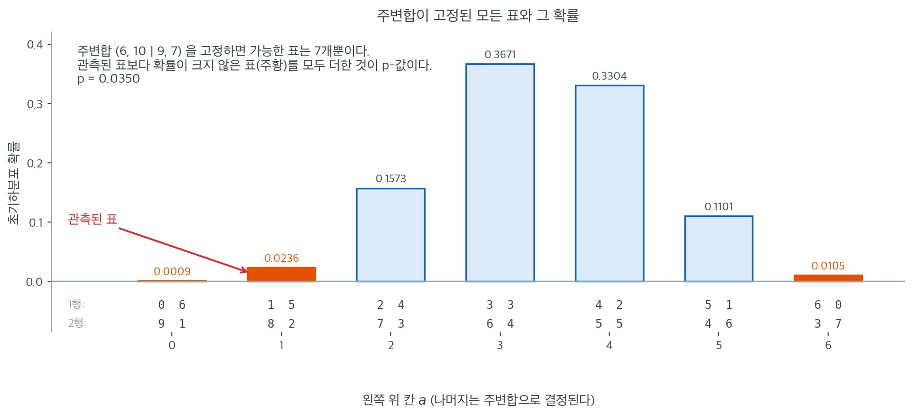

# Fisher의 정확검정 (2×2)

## 개요

**Fisher의 정확검정**은 주변 합계가 고정된 상태에서 관측된 $2 \times 2$ 분할표만큼 또는 그보다 극단적인 표를 관측할 정확한 확률을 계산한다. 카이제곱 검정과 달리 대표본 근사에 의존하지 않으므로, 표본이 작거나 기대 칸 도수가 5 아래로 떨어질 때 선호되는 방법이다.

## Fisher의 정확검정을 언제 쓰는가

- 분할표가 $2 \times 2$일 때.
- 기대 칸 도수가 5 미만인 칸이 하나 이상 있을 때.
- 전체 표본크기가 작을 때(대략 $n < 20$–$30$).
- 점근 근사가 아니라 정확한 p-값을 원할 때.

표가 더 크거나 표본이 크면 카이제곱 독립성 검정이 계산이 더 간단하고 훌륭한 근사를 준다.

## 가설

- **귀무가설** ($H_0$): 행 변수와 열 변수가 독립이다(즉 오즈비가 1이다).
- **대립가설** ($H_A$): 행 변수와 열 변수가 연관되어 있다(즉 오즈비가 1이 아니다).

## 수학적 배경

주변 합계가 고정된 $2 \times 2$ 표를 생각하자:

$$
\begin{array}{c|cc|c}
 & \text{Col 1} & \text{Col 2} & \text{Row Total} \\
\hline
\text{Row 1} & a & b & a+b \\
\text{Row 2} & c & d & c+d \\
\hline
\text{Col Total} & a+c & b+d & n
\end{array}
$$

$H_0$ 아래에서 칸 도수 $a$는 **초기하분포**를 따른다. (주변 합계가 주어졌을 때) 특정 표를 관측할 확률은

$$
P(a) = \frac{\binom{a+b}{a}\binom{c+d}{c}}{\binom{n}{a+c}}
$$

이다. p-값은 관측된 표만큼 또는 그보다 극단적인 모든 표의 확률을 더한 값이다.

## 오즈비

**표본 오즈비**는 연관의 강도를 잰다:

$$
\text{OR} = \frac{a \cdot d}{b \cdot c}
$$

- $\text{OR} = 1$: 연관 없음($H_0$과 부합).
- $\text{OR} > 1$: 행 1이 행 2보다 열 1에 속할 가능성이 높다.
- $\text{OR} < 1$: 행 1이 행 2보다 열 1에 속할 가능성이 낮다.

<div class="exbox" markdown>

**보기 1.** <span class="diff easy" title="쉬움"></span> Fisher의 정확검정. 전체가 16명뿐인 $2\times2$ 표다.

$$
\begin{array}{c|cc|r}
 & \text{성공} & \text{실패} & \text{행 합} \\ \hline
\text{처치군} & 1 & 5 & 6 \\
\text{대조군} & 8 & 2 & 10 \\ \hline
\text{열 합} & 9 & 7 & 16
\end{array}
$$

**(1)** 주변합을 고정하면 왼쪽 위 칸 $a$ 가 취할 수 있는 값이 몇 개인가. 일곱 표의 확률을 **유리수로 정확히** 구하시오. 분모가 모두 같아진다.

**(2)** 양측 p-값을 유리수로 구하시오. "극단적" 의 기준이 무엇인가.

**(3)** 같은 표에 카이제곱 검정을 걸면 얼마가 나오는가. 보정 유무로 나누어 구하고 (2)의 정확값과 견주시오. $\alpha = 0.05$ 에서 세 방법의 판정이 같은가.

**(4)** 코드로 확인하시오.

</div>

??? success "풀이"

    **(1) 표본공간이 일곱 개뿐이다.** 행 합 $6, 10$ 과 열 합 $9, 7$ 을 고정하면 $a$ 하나로 표 전체가 정해진다($b = 6-a$, $c = 9-a$, $d = 1+a$). 네 칸이 모두 음이 아니려면

    $$
    \max(0,\, 6-7) = 0 \;\le\; a \;\le\; \min(6,\, 9) = 6
    $$

    이므로 $a \in \{0,1,\ldots,6\}$ 의 **일곱 가지**다. $H_0$ 아래에서 $a$ 는 초기하분포를 따른다. 16명 가운데 성공한 9명을 고르는 모든 방법 가운데, 그중 $a$ 명이 처치군 6명에서 나오는 경우를 세면

    $$
    P(a) = \frac{\binom{6}{a}\binom{10}{9-a}}{\binom{16}{9}},
    \qquad \binom{16}{9} = 11440
    $$

    이다. **분모가 일곱 표에서 모두 $11440$ 으로 같으므로 분자만 세면 된다.**

    $$
    \begin{array}{c|ccccccc|c}
    a & 0 & 1 & 2 & 3 & 4 & 5 & 6 & \text{합} \\ \hline
    \binom6a\binom{10}{9-a} & 10 & 270 & 1800 & 4200 & 3780 & 1260 & 120 & 11440 \\
    P(a) & \tfrac{10}{11440} & \tfrac{270}{11440} & \tfrac{1800}{11440} & \tfrac{4200}{11440} & \tfrac{3780}{11440} & \tfrac{1260}{11440} & \tfrac{120}{11440} & 1 \\
    \text{소수} & 0.00087 & 0.02360 & 0.15734 & 0.36713 & 0.33042 & 0.11014 & 0.01049 &
    \end{array}
    $$

    분자의 합이 $11440$ 으로 분모와 **정확히** 같다. 이것이 방더몬드 항등식 $\sum_a \binom6a\binom{10}{9-a} = \binom{16}{9}$ 이고, 좋은 검산이다.

    **근사가 한 군데도 쓰이지 않았다.** 표본공간이 일곱 개짜리 유한집합이니 근사할 것이 없다. 이것이 "정확" 이라는 말의 뜻이다.

    **(2) 양측 p-값.** 관측된 표는 $a = 1$ 이고 그 확률은 $270/11440 = 0.02360$ 이다. 양측검정에서 "관측된 것만큼 또는 그보다 극단적" 의 기준은 **확률 자체**다. $P(a) \le P(1)$ 인 표를 모은다.

    $$
    P(0) = 0.00087 \le P(1), \qquad P(6) = 0.01049 \le P(1), \qquad P(1) = P(1)
    $$

    나머지 넷은 모두 $P(1)$ 보다 크다. 따라서

    $$
    p = P(0) + P(1) + P(6) = \frac{10 + 270 + 120}{11440} = \frac{400}{11440} = \frac{5}{143} = 0.034965
    $$

    다. $p < 0.05$ 이므로 $H_0$ 을 **기각한다.** 전체가 16명뿐인데도 유의하다.

    **$a = 6$ 이 들어간 것에 주목하라.** $a=6$ 인 표 $\begin{pmatrix}6&0\\3&7\end{pmatrix}$ 은 오즈비가 무한대인, **관측된 표와 정반대 방향**의 극단이다. 양측검정이라 반대쪽 꼬리도 센다. 처치가 나쁘다는 쪽만 보는 단측검정이었다면 $a \le 1$ 만 더해 $280/11440 = 0.02448$ 을 얻었을 것이다.

    오즈비는 $\text{OR} = ad/(bc) = (1\times2)/(5\times8) = 1/20 = 0.05$ 다. 처치군의 성공 오즈가 대조군의 **20분의 1** 이다.

    **(3) 카이제곱과 견주면.** 먼저 조건부터 본다. 기대도수는

    $$
    E = \frac{1}{16}\begin{pmatrix}6\\10\end{pmatrix}\begin{pmatrix}9 & 7\end{pmatrix}
    = \begin{pmatrix} 3.375 & 2.625 \\ 5.625 & 4.375 \end{pmatrix}
    $$

    로 **네 칸 가운데 둘이 5 미만**이다. 경험 법칙을 어겼으니 애초에 카이제곱을 쓸 자리가 아니다. 그래도 계산해 본다. $2\times2$ 닫힌 꼴 $\chi^2 = n(ad-bc)^2/D$ 에서 $ad-bc = 2-40 = -38$ 이고 $D = 6\cdot10\cdot9\cdot7 = 3780$ 이므로

    $$
    \chi^2 = \frac{16 \times 38^2}{3780} = \frac{23104}{3780} = \frac{5776}{945} = 6.11217,
    \qquad p = 0.013425
    $$

    $$
    \chi^2_{\text{Yates}} = \frac{16(38-8)^2}{3780} = \frac{14400}{3780} = \frac{80}{21} = 3.80952,
    \qquad p = 0.050962
    $$

    세 값을 늘어놓는다.

    | 방법 | p-값 | $\alpha=0.05$ 판정 |
    |---|---:|:---:|
    | 비보정 $\chi^2$ | $0.013425$ | 기각 |
    | **Fisher 정확** | $0.034965$ | 기각 |
    | 예이츠 $\chi^2$ | $0.050962$ | **기각 못 함** |

    **세 방법이 갈린다.** 비보정판은 정확값의 **$0.38$ 배**로 너무 작고, 예이츠판은 **$1.46$ 배**로 너무 크다. 그리고 하필 예이츠판이 $0.05$ 를 $0.001$ 차이로 넘어 **결론이 뒤집힌다.** 기대도수가 5 에 못 미치는 표에서 카이제곱을 쓰면 안 되는 이유가 이것이다.

    **정확검정의 한계도 같은 자리에 있다.** 더할 수 있는 확률 덩어리가 일곱 개뿐이므로 p-값도 일곱 값만 가진다. 관측된 $a$ 마다 양측 p-값을 계산해 보면 $0.0009,\ 0.0350,\ 0.3024,\ 1.0000,\ 0.6329,\ 0.1451,\ 0.0114$ 이고, 이 가운데 $0.05$ 이하인 것은 $a \in \{0, 1, 6\}$ 셋이다. 그러므로 **명목 $5\%$ 검정의 실제 크기는**

    $$
    P(0) + P(1) + P(6) = \frac{5}{143} = 0.034965
    $$

    **로 $5\%$ 가 아니라 $3.50\%$ 다.** $0.05$ 에 딱 맞춰 경계를 세울 방법이 없기 때문이다. 정확검정이 보수적이라고 말하는 것이 이 뜻이다. **"정확" 은 p-값이 정확하다는 말이지 크기가 명목값과 같다는 말이 아니다.**

    **(4) 수치적으로.**

    ```python
    import numpy as np
    from scipy import stats

    # 2x2 분할표
    #               성공   실패
    # 처치군          1      5
    # 대조군          8      2
    # 기대도수가 5에 못 미치는 칸이 있어 카이제곱 근사를 쓸 수 없는 상황이다.
    observed = np.array([[1, 5],
                         [8, 2]])

    print("Observed contingency table:")
    print(observed)

    # Fisher의 정확검정. 근사가 전혀 없고 초기하분포로 확률을 직접 더한다.
    # 주변 합계를 고정한 채 가능한 표들을 모두 나열할 수 있기 때문에 가능한 일이다.
    odds_ratio, p_value = stats.fisher_exact(observed)

    print(f"Odds ratio : {odds_ratio:.4f}")
    print(f"p-value    : {p_value:.4f}")

    if p_value < 0.05:
        print("Reject H0: significant association (alpha = 0.05).")
    else:
        print("Fail to reject H0: no significant association (alpha = 0.05).")

    # (1) 일곱 표의 확률을 유리수로
    from fractions import Fraction
    from math import comb

    n, r1, c1 = 16, 6, 9
    denom = comb(n, c1)
    prob = {a: Fraction(comb(r1, a) * comb(n - r1, c1 - a), denom) for a in range(r1 + 1)}
    print(f"\n분모 C(16,9) = {denom}")
    print("  a  분자   P(a)")
    for a, pr in prob.items():
        print(f"  {a}  {comb(r1, a) * comb(n - r1, c1 - a):5d}   {float(pr):.5f}")
    print(f"  분자의 합 {sum(comb(r1, a) * comb(n - r1, c1 - a) for a in prob)}"
          f"   확률의 합 {sum(prob.values())}")

    # (2) 양측 p-값. 기준은 확률 자체.
    extreme = [a for a in prob if prob[a] <= prob[1]]
    p_exact = sum(prob[a] for a in extreme)
    print(f"\n극단적인 표 {extreme}   p = {p_exact} = {float(p_exact):.6f}")

    # (3) 카이제곱과 견주기
    exp = np.outer(observed.sum(1), observed.sum(0)) / n
    print(f"\n기대도수\n{exp}   최소 {exp.min():.3f}" + ("  < 5" if exp.min() < 5 else ""))
    for name, corr in [("비보정", False), ("예이츠", True)]:
        x, pv = stats.chi2_contingency(observed, correction=corr)[:2]
        print(f"{name}  chi2 = {x:.5f}  p = {pv:.6f}   정확값의 {pv / float(p_exact):.2f} 배"
              f"   {'기각' if pv < 0.05 else '기각 못 함'}")

    # 명목 5% 검정의 실제 크기
    size = sum(prob[a] for a in prob
               if sum(prob[k] for k in prob if prob[k] <= prob[a]) <= Fraction(1, 20))
    print(f"\n명목 5% 검정의 실제 크기 {size} = {float(size):.6f}")
    ```

    출력:

    ```
    Observed contingency table:
    [[1 5]
     [8 2]]
    Odds ratio : 0.0500
    p-value    : 0.0350
    Reject H0: significant association (alpha = 0.05).

    분모 C(16,9) = 11440
      a  분자   P(a)
      0     10   0.00087
      1    270   0.02360
      2   1800   0.15734
      3   4200   0.36713
      4   3780   0.33042
      5   1260   0.11014
      6    120   0.01049
      분자의 합 11440   확률의 합 1

    극단적인 표 [0, 1, 6]   p = 5/143 = 0.034965

    기대도수
    [[3.375 2.625]
     [5.625 4.375]]   최소 2.625  < 5
    비보정  chi2 = 6.11217  p = 0.013425   정확값의 0.38 배   기각
    예이츠  chi2 = 3.80952  p = 0.050962   정확값의 1.46 배   기각 못 함

    명목 5% 검정의 실제 크기 5/143 = 0.034965
    ```

    일곱 분자 `10 270 1800 4200 3780 1260 120` 이 (1)의 표와 같고, 합이 분모 `11440` 과 **정확히** 같다. 확률의 합도 `Fraction` 으로 딱 `1` 이다.

    극단적인 표가 `[0, 1, 6]` 로 (2)에서 손으로 고른 셋과 같고, p-값이 **유리수 `5/143`** 로 나온다. `scipy.stats.fisher_exact` 가 준 `0.0350` 이 이 분수의 소수 표기다.

    기대도수의 최솟값이 `2.625` 로 5 에 못 미치고, 그 자리에서 비보정 카이제곱은 정확값의 $0.38$ 배, 예이츠는 $1.46$ 배를 준다. **예이츠판만 기각하지 못한다.**

    마지막 줄이 (3)의 끝에서 말한 것이다. 명목 $5\%$ 검정의 실제 크기가 `5/143` $= 3.50\%$ 다. 이 자료에서는 그 값이 관측된 p-값과 우연히 같은데, 기각역이 하필 $\{0,1,6\}$ 으로 (2)의 극단 집합과 같기 때문이다.

    오즈비 $\text{OR} = (1 \times 2)/(5 \times 8) = 0.05$ 이고, p-값은 초기하분포로 정확히 계산되어 $5/143 = 0.0350$ 이다. 전체가 16명뿐인데도 유의하다.

## 해석

처치 대 대조 보기에서:

- 오즈비가 약 $0.05$라는 것은 처치군의 성공 오즈가 대조군보다 극적으로 낮았다는 뜻이다.
- p-값 $0.0350$이 $0.05$보다 작으므로 집단 소속과 결과 사이에 통계적으로 유의한 연관이 있다고 결론짓는다.

Fisher의 정확검정은 집단별 표본이 아주 작을 수 있는 의학·생물학 연구(예: 희귀질환, 예비연구)에서 특히 중요하다.

### 가능한 표를 전부 펼쳐 보자



"정확"하다는 말이 무슨 뜻인지는 표를 전부 펼쳐 보면 분명해진다. 보기의 자료는 행 합이 6과 10, 열 합이 9와 7이었다. 주변합을 이렇게 고정하면 왼쪽 위 칸 $a$가 0부터 6까지 일곱 값만 가질 수 있고, $a$를 정하는 순간 나머지 세 칸은 뺄셈으로 결정된다. 즉 $H_0$ 아래의 표본공간은 통째로 일곱 개짜리 유한집합이다. 근사할 것이 없다.

각 막대의 높이가 그 표의 초기하분포 확률이다. $a=3$이 0.3671로 가장 그럴듯하고, $a=4$가 0.3304로 뒤를 잇는다. 관측된 표는 $a=1$이고 확률은 0.0236에 지나지 않는다. 양측 p-값은 "관측된 표만큼 또는 그보다 극단적인" 표들의 확률을 더한 것인데, 여기서 극단적이라는 말의 기준이 바로 이 확률이다. 0.0236 이하인 표는 $a=0$(0.0009), $a=1$(0.0236), $a=6$(0.0105) 세 개이며

$$
0.0009 + 0.0236 + 0.0105 = 0.0350
$$

이 그대로 p-값이 된다. 앞에서 `scipy`가 출력한 0.0350이 이 세 수의 합이다.

주목할 것은 $a=6$이 포함되었다는 점이다. $a=6$인 표는 $\begin{pmatrix} 6 & 0 \\ 3 & 7\end{pmatrix}$로 오즈비가 무한대인, 관측된 표와 **정반대** 방향의 극단이다. 양측검정이라 반대쪽 꼬리도 세는 것이다. 만약 처치가 나쁘다는 쪽만 보는 단측검정이었다면 $a \le 1$인 표만 더해 $0.0009 + 0.0236 = 0.0245$를 얻었을 것이다.

이 그림은 정확검정의 한계도 같이 보여 준다. 더할 수 있는 확률이 일곱 덩어리뿐이므로 p-값도 몇 가지 값만 가질 수 있다. 0.05에 딱 맞춰 기각 경계를 세울 방법이 없고, 그래서 실제 유의수준은 언제나 0.05보다 작아진다. 정확검정이 보수적이라고 말하는 이유가 여기에 있다.

## 연습문제

<div class="drillbox" markdown>

**연습문제 1.** <span class="diff med" title="중간"></span>
표 $\begin{pmatrix} 3 & 1 \\ 1 & 3 \end{pmatrix}$에 대해 오즈비를 계산하고 `stats.fisher_exact`로 정확한 p-값을 구하라. $\alpha = 0.05$에서 유의한가?

</div>

??? success "풀이"

    $$
    \text{OR} = \frac{3 \times 3}{1 \times 1} = 9.0
    $$

    ```python
    odds_ratio, p_value = stats.fisher_exact([[3, 1], [1, 3]])
    print(f"OR = {odds_ratio:.4f}, p = {p_value:.4f}")
    ```

    출력:

    ```
    OR = 9.0000, p = 0.4857
    ```

    양측 정확 p-값은 약 $0.486$이다. $p > 0.05$이므로 $H_0$을 **기각하지 못한다**. 오즈비가 커 보이지만 표본크기($n = 8$)가 너무 작아 유의성에 이르지 못한다. $\square$

<div class="drillbox" markdown>

**연습문제 2.** <span class="diff easy" title="쉬움"></span>
기대 칸 도수가 5 미만일 때 카이제곱 검정보다 Fisher의 정확검정이 선호되는 이유를 설명하라.

</div>

??? success "풀이"

    카이제곱 검정은 검정통계량의 분포를 연속인 $\chi^2$ 분포로 근사한다. 이 근사는 중심극한정리에 의존하며 기대 칸 도수가 충분히 클 때에만(흔한 경험 법칙은 $E_{ij} \ge 5$) 정확하다. 기대도수가 작으면 검정통계량의 실제 분포가 $\chi^2$에서 크게 벗어나 p-값을 믿을 수 없게 된다.

    Fisher의 정확검정은 어떤 근사도 쓰지 않는다. 같은 주변 합계를 갖는 가능한 표를 모두 열거하고 $H_0$ 아래에서 각각의 확률을 초기하분포로 정확히 계산한다. 그래서 표본크기와 무관하게 p-값이 정확하며, 카이제곱 근사를 믿을 수 없을 때 적절한 선택이 된다. $\square$

<div class="drillbox" markdown>

**연습문제 3.** <span class="diff med" title="중간"></span>
관측된 표 $\begin{pmatrix} 1 & 5 \\ 8 & 2 \end{pmatrix}$에 대해 조합 공식을 써서 초기하 확률을 적어라.

</div>

??? success "풀이"

    주변 합계는 $R_1 = 6$, $R_2 = 10$, $C_1 = 9$, $C_2 = 7$, $n = 16$이다. 칸 $(1,1)$에서 $a = 1$을 관측할 초기하 확률은

    $$
    P(a = 1) = \frac{\binom{6}{1}\binom{10}{8}}{\binom{16}{9}}
    $$

    이다. 각 이항계수를 계산하면

    $$
    \binom{6}{1} = 6, \quad \binom{10}{8} = \binom{10}{2} = 45, \quad \binom{16}{9} = \binom{16}{7} = 11440
    $$

    $$
    P(a = 1) = \frac{6 \times 45}{11440} = \frac{270}{11440} \approx 0.0236
    $$

    양측 p-값은 $a \le 1$인 모든 표의 확률에, 위쪽 극단에서 확률이 같거나 더 작은 표들의 확률을 더한 값이다. $\square$

<div class="drillbox" markdown>

**연습문제 4.** <span class="diff med" title="중간"></span>
`stats.fisher_exact`의 `alternative` 인자는 `"two-sided"`, `"less"`, `"greater"`를 받을 수 있다. 각각은 오즈비에 대해 무엇을 검정하는가?

</div>

??? success "풀이"

    - `"two-sided"`(기본값): $H_A: \text{OR} \ne 1$을 검정한다. p-값에 양쪽 방향으로 같거나 더 극단적인 표가 모두 들어간다.
    - `"less"`: $H_A: \text{OR} < 1$을 검정한다. 오즈비가 관측값 이하인 표만 p-값에 들어간다.
    - `"greater"`: $H_A: \text{OR} > 1$을 검정한다. 오즈비가 관측값 이상인 표만 p-값에 들어간다.

    $\text{OR} = 0.05$인 처치 보기에서 `alternative="less"`를 쓰면 처치의 성공 오즈가 대조보다 유의하게 낮은지를 검정하게 된다. $\square$

<div class="drillbox" markdown>

**연습문제 5.** <span class="diff med" title="중간"></span>
주변 합계가 모두 고정된 $2 \times 2$ 표에서는 칸 하나의 값이 표 전체를 결정함을 증명하라.

</div>

??? success "풀이"

    표를

    $$
    \begin{pmatrix} a & b \\ c & d \end{pmatrix}
    $$

    라 하고 행 합계 $R_1 = a + b$, $R_2 = c + d$와 열 합계 $C_1 = a + c$, $C_2 = b + d$가 모두 고정되어 있다고 하자. $a$를 안다고 하면:

    - $b = R_1 - a$ (첫 행 합계로 결정)
    - $c = C_1 - a$ (첫 열 합계로 결정)
    - $d = R_2 - c = R_2 - (C_1 - a) = R_2 - C_1 + a$ (둘째 행 합계로 결정)

    네 칸이 모두 값 $a$ 하나로 결정된다. 그래서 $H_0$ 아래에서 $a$에 대한 초기하분포만으로 표 전체의 정확한 분포를 규정할 수 있으며, 이 검정의 자유도가 1인 이유이기도 하다. $\square$

<div class="drillbox" markdown>

**연습문제 6.** <span class="diff hard" title="어려움"></span>
"정리하며"는 피셔의 정확검정이 **보수적**이라고 했다. 그 정도를 모의실험으로 재고, **중간 $p$ 값** 보정이 얼마나 도움이 되는지 확인하라.

</div>

??? success "풀이"
    **"정확"의 뜻.** 피셔 검정이 정확하다는 것은 **실제 수준이 명목 $\alpha$를 넘지 않는다**는 뜻이지, 같다는 뜻이 아니다. 도달 가능한 $p$ 값이 띄엄띄엄하므로 대개 훨씬 작다.

    ```python
    import numpy as np
    from scipy import stats

    rng = np.random.default_rng(1234)
    M = 20_000

    print(f"{'n1,n2':>8s} {'p':>5s} {'Fisher':>8s} {'중간 p':>8s} "
          f"{'χ²(보정없음)':>13s} {'χ²(Yates)':>11s}")
    for (n1, n2), p in [((10, 10), 0.30), ((15, 15), 0.30), ((20, 20), 0.10),
                        ((30, 30), 0.50), ((50, 50), 0.05)]:
        k1, k2 = rng.binomial(n1, p, M), rng.binomial(n2, p, M)
        f = mid = cn = cy = 0
        for i in range(M):
            t = np.array([[k1[i], n1 - k1[i]], [k2[i], n2 - k2[i]]])
            f += stats.fisher_exact(t).pvalue < 0.05

            # 중간 p 값: 관측된 표의 확률을 절반만 더한다
            N, K, n = n1 + n2, n1, k1[i] + k2[i]
            xs = np.arange(0, min(K, n) + 1)
            pmf = stats.hypergeom.pmf(xs, N, K, n)
            obs = stats.hypergeom.pmf(k1[i], N, K, n)
            mid += pmf[pmf <= obs * (1 + 1e-9)].sum() - obs / 2 < 0.05

            if t.sum(0).min() > 0 and t.sum(1).min() > 0:
                cn += stats.chi2_contingency(t, correction=False)[1] < 0.05
                cy += stats.chi2_contingency(t, correction=True)[1] < 0.05
        print(f"{f'{n1},{n2}':>8s} {p:5.2f} {f / M:8.4f} {mid / M:8.4f} "
              f"{cn / M:13.4f} {cy / M:11.4f}")
    ```

    ```text
       n1,n2     p   Fisher     중간 p      χ²(보정없음)   χ²(Yates)
       10,10  0.30   0.0117   0.0199        0.0371      0.0117
       15,15  0.30   0.0160   0.0255        0.0530      0.0142
       20,20  0.10   0.0131   0.0131        0.0389      0.0050
       30,30  0.50   0.0262   0.0273        0.0508      0.0262
       50,50  0.05   0.0077   0.0211        0.0440      0.0077
    ```

    **피셔 검정의 실제 수준이 0.008~0.026**이다. 명목 0.05의 **1/6에서 1/2**에 불과하다.

    **표본이 커져도 좋아지지 않는다.** $n=50$씩인데도 $p=0.05$인 상황에서 수준이 0.0077이다. **문제는 표본크기가 아니라 자료의 이산성**이다.

    **야츠 보정은 피셔와 거의 같다.** 두 방법 모두 0.012~0.026이다. 야츠 보정이 "피셔 검정을 흉내 내려는" 장치이니 당연한 결과인데, **그만큼 검정력도 함께 잃는다.**

    **가장 잘 맞는 것은 보정 없는 카이제곱**이다(0.037~0.053). 대부분의 칸에서 명목 수준에 가깝다.

    **중간 $p$ 값 보정.**

    $$
    p_{\text{mid}}=P(\text{더 극단})+\tfrac12 P(\text{관측된 표})
    $$

    관측된 표 자체의 확률을 절반만 세는 것이다. 수준이 0.012→0.020, 0.008→0.021로 **개선되지만 여전히 보수적**이다.

    **선택 기준.**

    | 상황 | 권장 |
    |---|---|
    | 수준을 **절대** 넘으면 안 됨(규제) | 피셔 |
    | 검정력이 중요(탐색 연구) | 보정 없는 카이제곱, 또는 바너드 |
    | 절충 | **중간 $p$ 값** |
    | 표본이 아주 작음 | 다음 문제의 바너드 검정 |

    **"정확"이라는 이름에 속지 말 것.** 정확한 것은 **확률 계산**이지 **수준의 달성**이 아니다. 이산 자료에서는 명목 수준을 정확히 달성하는 비확률화 검정이 존재하지 않는다.

<div class="drillbox" markdown>

**연습문제 7.** <span class="diff hard" title="어려움"></span>
피셔 검정은 **두 주변합을 모두 고정**한다. 한쪽만 고정하는 **바너드의 무조건부 정확검정**과 비교하라.

</div>

??? success "풀이"
    **두 검정이 다른 표본공간을 쓴다.**

    | 검정 | 고정하는 것 | 표본공간 |
    |---|---|---|
    | 피셔 | 행 합 **그리고** 열 합 | 초기하 (1차원) |
    | 바너드 | 행 합만(각 군의 $n$) | 두 이항 (2차원) |

    **실제 실험에서는 대개 열 합(성공 수)이 고정되지 않는다.** 처치군 15명, 대조군 15명을 정해 놓고 결과를 관측하므로, 성공의 총수는 **확률변수**다. 피셔는 그것까지 조건화하므로 **정보를 버린다.**

    바너드는 성가신 모수 $p$에 대해 **상한을 취해** 수준을 보장한다.

    $$
    p_{\text{Barnard}}=\sup_{0<p<1}P_p\bigl(T\ge t_{\text{obs}}\bigr)
    $$

    ```python
    import numpy as np
    from scipy import stats

    rng = np.random.default_rng(999)
    M, n1, n2 = 3_000, 15, 15
    for label, p1, p2 in [("H0 (0.3 대 0.3)", 0.3, 0.3),
                          ("H1 (0.7 대 0.3)", 0.7, 0.3),
                          ("H1 (0.6 대 0.2)", 0.6, 0.2)]:
        k1, k2 = rng.binomial(n1, p1, M), rng.binomial(n2, p2, M)
        f = b = c = 0
        for i in range(M):
            t = np.array([[k1[i], n1 - k1[i]], [k2[i], n2 - k2[i]]])
            f += stats.fisher_exact(t).pvalue < 0.05
            b += stats.barnard_exact(t).pvalue < 0.05
            if t.sum(0).min() > 0 and t.sum(1).min() > 0:
                c += stats.chi2_contingency(t, correction=False)[1] < 0.05
        print(f"{label:>16s}:  Fisher {f / M:.4f}   Barnard {b / M:.4f}   "
              f"χ²(보정없음) {c / M:.4f}")
    ```

    ```text
      H0 (0.3 대 0.3):  Fisher 0.0157   Barnard 0.0400   χ²(보정없음) 0.0517
      H1 (0.7 대 0.3):  Fisher 0.4183   Barnard 0.5853   χ²(보정없음) 0.5920
      H1 (0.6 대 0.2):  Fisher 0.4503   Barnard 0.6140   χ²(보정없음) 0.6407
    ```

    **바너드가 수준을 지키면서 검정력을 크게 회복한다.**

    | | 수준 | 검정력(0.7 대 0.3) |
    |---|---|---|
    | 피셔 | 0.016 | 0.418 |
    | **바너드** | **0.040** | **0.585** |
    | 카이제곱 | 0.052 | 0.592 |

    **검정력이 0.42에서 0.59로 17%포인트** 오른다. 그러면서도 수준 0.040으로 명목을 넘지 않는다.

    **카이제곱이 검정력은 가장 높지만 수준이 0.052로 살짝 넘는다.** 엄밀함이 필요하면 바너드가 낫고, 실용적으로는 둘이 거의 같다.

    **왜 피셔가 널리 쓰이는가.**

    1. **역사적 관성.** 계산이 쉬워 손으로도 할 수 있었다.
    2. **조건부 추론의 원리.** 주변합이 오즈비에 대해 **보조통계량**이므로 조건화하는 것이 논리적이라는 주장이 있다(피셔의 입장).
    3. **후향 연구에서는 실제로 두 주변합이 고정**된다. 환자대조군 연구가 그렇다.
    4. **계산 비용.** 바너드는 $p$에 대한 상한을 수치로 찾아야 해 훨씬 비싸다.

    **오늘날의 권고.**

    | 설계 | 검정 |
    |---|---|
    | 두 군의 크기를 정하고 결과를 관측 | **바너드**(또는 카이제곱) |
    | 전체 $n$만 정하고 두 분류를 관측 | 바너드 계열의 다른 변형 |
    | 두 주변합이 실제로 고정 | **피셔** |
    | 규제 제출 등 관행이 중요 | 피셔(관행) |

    **`scipy.stats.barnard_exact`**가 이를 지원한다. 표가 아주 크면 느리지만, 정확검정이 필요한 상황은 원래 표가 작다.

<div class="drillbox" markdown>

**연습문제 8.** <span class="diff med" title="중간"></span>
"정리하며"는 **양측 $p$ 값의 정의가 하나가 아니라** 소프트웨어마다 값이 다를 수 있다고 했다. 세 가지 관례를 직접 구현해 비교하라.

</div>

??? success "풀이"
    **세 관례.**

    | 이름 | 정의 |
    |---|---|
    | 확률법 | 관측된 표보다 **확률이 작거나 같은** 표를 모두 더한다 |
    | 두 배법 | 작은 쪽 단측 $p$를 **두 배**로 한다(1을 넘으면 1) |
    | 중심법 | 기댓값에서 **관측만큼 떨어진** 표를 모두 더한다 |

    ```python
    import numpy as np
    from scipy import stats

    def two_sided_variants(table):
        a = table[0, 0]
        R1, R2 = table[0].sum(), table[1].sum()
        C1, N = table[:, 0].sum(), table.sum()
        xs = np.arange(max(0, C1 - R2), min(R1, C1) + 1)
        pmf = stats.hypergeom.pmf(xs, N, R1, C1)
        obs = stats.hypergeom.pmf(a, N, R1, C1)

        p_prob = pmf[pmf <= obs * (1 + 1e-9)].sum()              # 확률법
        p_double = min(1.0, 2 * min(stats.hypergeom.cdf(a, N, R1, C1),
                                    stats.hypergeom.sf(a - 1, N, R1, C1)))
        mean = R1 * C1 / N
        p_central = pmf[np.abs(xs - mean) >= abs(a - mean) - 1e-9].sum()
        return p_prob, p_double, p_central, p_prob - obs / 2

    for t in [np.array([[1, 5], [8, 2]]), np.array([[3, 1], [1, 3]]),
              np.array([[7, 2], [3, 8]]), np.array([[2, 10], [8, 4]])]:
        a, b, c, m = two_sided_variants(t)
        print(f"{str(t.tolist()):>22s}  확률법 {a:.4f} "
              f"(scipy {stats.fisher_exact(t).pvalue:.4f})  "
              f"두 배법 {b:.4f}  중심법 {c:.4f}  중간p {m:.4f}")
    ```

    ```text
          [[1, 5], [8, 2]]  확률법 0.0350 (scipy 0.0350)  두 배법 0.0490  중심법 0.0350  중간p 0.0232
          [[3, 1], [1, 3]]  확률법 0.4857 (scipy 0.4857)  두 배법 0.4857  중심법 0.4857  중간p 0.3714
          [[7, 2], [3, 8]]  확률법 0.0698 (scipy 0.0698)  두 배법 0.0698  중심법 0.0698  중간p 0.0537
         [[2, 10], [8, 4]]  확률법 0.0361 (scipy 0.0361)  두 배법 0.0361  중심법 0.0361  중간p 0.0277
    ```

    **대부분의 표에서 세 관례가 일치한다.** 주변합이 대칭이면 초기하분포도 대칭이라 "확률이 작다"와 "멀리 떨어졌다"가 같은 뜻이 된다.

    **첫 표에서 갈린다.** 확률법 0.0350, 두 배법 **0.0490**이다. 주변합이 $(6,10)\times(9,7)$로 비대칭이라 분포가 치우쳐 있기 때문이다.

    **$\alpha=0.05$ 근처에서는 이 차이가 결론을 바꿀 수 있다.** 0.0350과 0.0490 모두 기각이지만, 조금만 다른 자료였다면 하나는 기각하고 하나는 못 했을 것이다.

    **어느 것이 표준인가.**

    | 소프트웨어 | 기본 |
    |---|---|
    | `scipy.stats.fisher_exact` | **확률법** |
    | R의 `fisher.test` | **확률법** |
    | 일부 상용 패키지 | 두 배법 |
    | StatXact 등 | 선택 가능 |

    **확률법이 사실상 표준**이지만, 논문에 정확한 $p$ 값을 쓸 때는 **어떤 소프트웨어를 썼는지 밝히는 것**이 재현성에 도움이 된다.

    **두 배법의 장점 하나.** 항상 **신뢰구간과 정합적**이다. 확률법으로 만든 $p$ 값은 대응하는 구간을 만들기가 까다롭다. 그래서 정확 신뢰구간은 대개 두 배법(즉 중심 구간) 기준으로 만든다 — 다음 문제에서 본다.

<div class="drillbox" markdown>

**연습문제 9.** <span class="diff hard" title="어려움"></span>
보기 1의 오즈비 0.05에 대한 **정확 신뢰구간**을 구하라. 표본 오즈비와 **조건부 최대가능도** 추정값은 왜 다른가?

</div>

??? success "풀이"
    **비중심 초기하분포.** 오즈비가 $\psi$일 때 주변합을 고정한 $a$의 분포는

    $$
    P_\psi(a)=\frac{\binom{R_1}{a}\binom{R_2}{C_1-a}\psi^{a}}
    {\sum_{x}\binom{R_1}{x}\binom{R_2}{C_1-x}\psi^{x}}
    $$

    이다. $\psi=1$이면 보통의 초기하분포로 돌아간다.

    - **조건부 최대가능도**: $E_\psi[a]=a_{\text{obs}}$를 푸는 $\psi$
    - **정확 신뢰구간**: 위 분포의 꼬리 확률을 $\alpha/2$로 맞추는 $\psi$들(코닝 구간)

    ```python
    import numpy as np
    from scipy import stats
    from scipy.optimize import brentq
    from scipy.special import comb

    def nchg(a, N, K, n, psi):
        """비중심 초기하분포의 지지집합과 확률질량."""
        xs = np.arange(max(0, n - (N - K)), min(K, n) + 1)
        w = comb(K, xs) * comb(N - K, n - xs) * psi**xs
        return xs, w / w.sum()

    def cond_mle(a, N, K, n):
        lo, hi = max(0, n - (N - K)), min(K, n)
        if a == lo:
            return 0.0
        if a == hi:
            return np.inf
        def gap(log_psi):
            xs, pm = nchg(a, N, K, n, np.exp(log_psi))
            return (xs * pm).sum() - a
        return np.exp(brentq(gap, -20, 20))

    def exact_ci(a, N, K, n, alpha=0.05):
        lo_b, hi_b = max(0, n - (N - K)), min(K, n)
        def upper_tail(log_psi):          # P(X ≥ a) = α/2  → 하한
            xs, pm = nchg(a, N, K, n, np.exp(log_psi))
            return pm[xs >= a].sum() - alpha / 2
        def lower_tail(log_psi):          # P(X ≤ a) = α/2  → 상한
            xs, pm = nchg(a, N, K, n, np.exp(log_psi))
            return pm[xs <= a].sum() - alpha / 2
        lo = 0.0 if a == lo_b else np.exp(brentq(upper_tail, -30, 30))
        hi = np.inf if a == hi_b else np.exp(brentq(lower_tail, -30, 30))
        return lo, hi

    for t in [np.array([[1, 5], [8, 2]]), np.array([[3, 1], [1, 3]]),
              np.array([[7, 2], [3, 8]])]:
        a, N = t[0, 0], t.sum()
        K, n = t[0].sum(), t[:, 0].sum()
        sample_or = (t[0, 0] * t[1, 1]) / (t[0, 1] * t[1, 0])
        lo, hi = exact_ci(a, N, K, n)
        print(f"{str(t.tolist()):>22s}")
        print(f"   표본 OR {sample_or:8.4f}   조건부 MLE {cond_mle(a, N, K, n):8.4f}"
              f"   정확 95% CI ({lo:.4f}, {hi:.4f})")
    ```

    ```text
          [[1, 5], [8, 2]]
       표본 OR   0.0500   조건부 MLE   0.0647   정확 95% CI (0.0009, 0.9912)
          [[3, 1], [1, 3]]
       표본 OR   9.0000   조건부 MLE   6.4083   정확 95% CI (0.2117, 626.2435)
          [[7, 2], [3, 8]]
       표본 OR   9.3333   조건부 MLE   8.1538   정확 95% CI (0.8821, 127.0090)
    ```

    **표본 오즈비와 조건부 MLE가 다르다.** 표본 OR 0.050 대 조건부 MLE 0.065, 9.00 대 6.41이다.

    **표본 오즈비 $ad/bc$는 위로 편향**되어 있다(1에서 멀어지는 방향). 조건부 MLE는 주변합을 조건화한 가능도를 최대화하므로 **1 쪽으로 당겨진다.** 소표본일수록 차이가 크다(둘째 표: 9.00 → 6.41).

    **구간이 엄청나게 넓다.** 둘째 표의 $(0.21,\ 626)$은 사실상 아무 정보도 주지 않는다. $n=8$로는 당연한 결과다. **"오즈비 9"라는 인상적인 숫자에 속으면 안 된다는 것이 요점이다.**

    **보기 1의 구간 $(0.0009,\ 0.9912)$가 1을 아슬아슬하게 벗어난다.** 이것이 $p=0.0350<0.05$와 정합적이다. 다만 상한이 0.99라, **"오즈비가 1보다 작다"는 것 말고는 말할 수 있는 것이 거의 없다.**

    **주의 넷.**

    1. **셀에 0이 있으면 표본 OR가 발산**한다. 조건부 MLE는 0 또는 $\infty$를 주고, 정확 구간은 한쪽이 열린다.
    2. **정확 구간은 보수적**이다. 검정과 같은 이유(이산성)로 포함률이 0.95를 넘는다.
    3. **중간 $p$ 값 기반 구간**이 더 짧다. 실무에서 쓸 만한 절충이다.
    4. **로그 척도의 Wald 구간**($\exp(\log\widehat{OR}\pm1.96\,\text{SE})$)은 계산이 쉽지만 소표본에서 부정확하다. $n$이 작으면 정확 구간을 쓴다.

<div class="drillbox" markdown>

**연습문제 10.** <span class="diff easy" title="쉬움"></span>
$2\times2$ 표를 만났을 때의 **판단 흐름**을 정리하라.

</div>

??? success "풀이"

    **결정 흐름.**

    ```text
    2×2 표를 분석한다
        │
        ├─ 자료가 대응(짝지어진)인가
        │      └─ 예 ──→ McNemar 검정 (이 장의 다른 절)
        │
        └─ 독립인 두 군
             │
             ├─ 설계에서 무엇이 고정되었는가
             │      ├─ 두 군의 크기만 ──→ 바너드 또는 카이제곱
             │      ├─ 전체 n 만 ────────→ 카이제곱
             │      └─ 두 주변합 모두 ───→ 피셔
             │
             ├─ 기대도수를 확인한다
             │      ├─ 모두 5 이상 ──→ 카이제곱(보정 없음)
             │      └─ 5 미만 있음 ──→ 정확검정
             │
             └─ 언제나: 오즈비·위험비·위험차 + 신뢰구간을 함께
    ```

    **검정별 성격 요약.**

    | 검정 | 수준 | 검정력 | 계산 |
    |---|---|---|---|
    | 카이제곱(보정 없음) | 대체로 정확, 가끔 살짝 초과 | **최고** | 즉시 |
    | 카이제곱(야츠 보정) | **매우 보수적** | 낮음 | 즉시 |
    | 피셔 | 보수적 | 낮음 | 빠름 |
    | 피셔 + 중간 $p$ | 거의 정확 | 중간 | 빠름 |
    | **바너드** | **정확하면서 안전** | **높음** | 느림 |

    **야츠 보정을 쓰지 않는 것을 권한다.** 피셔 검정을 근사하려는 장치인데, 정작 피셔 자체가 보수적이므로 **보수성을 두 번 겹치는** 셈이다. 정확검정이 필요하면 피셔를 직접 쓰면 된다.

    **반드시 보고할 것.**

    - [ ] **원 도수표** — 백분율만으로는 검증이 불가능하다
    - [ ] 어떤 검정을 **왜** 썼는지
    - [ ] $p$ 값과 그 **양측 관례**(확률법인지 두 배법인지)
    - [ ] **오즈비와 신뢰구간** — 소표본이면 정확 구간
    - [ ] 기대도수의 최솟값
    - [ ] 표본크기를 어떻게 정했는지

    **자주 하는 실수 다섯.**

    1. **"정확검정이니 더 낫다"** — 보수적이라 검정력을 잃는다(연습문제 6).
    2. **야츠 보정을 습관적으로 적용** — 이중 보수성.
    3. **소표본 오즈비를 액면대로 인용** — 편향돼 있고 구간이 아주 넓다(연습문제 9).
    4. **소프트웨어를 바꿔 가며 $p$가 작은 쪽 선택** — 양측 관례가 다른 것을 악용하는 셈이다.
    5. **유의하지 않은 결과를 "차이 없음"으로** — $n=8$에서 구간이 $(0.21,\ 626)$이었다.

    **마지막 관점.** $2\times2$ 표는 가장 단순해 보이지만, **이산성 때문에 정확한 추론이 가장 까다로운** 자리이기도 하다. "정확"과 "최적"이 다르다는 것, 명목 수준을 정확히 달성하는 검정이 존재하지 않는다는 것을 받아들이는 것이 출발점이다.

---

## 정리하며

피셔의 정확검정은 **근사를 쓰지 않는다.**

- **주변합을 고정하고 초기하분포로 확률을 직접 계산한다.** 관측된 표만큼 또는 그보다 극단적인 표의 확률을 모두 더하는 것이 $p$ 값이다.
- **언제 쓰는가.** $2\times2$ 표에서 기대도수가 $5$ 미만인 칸이 있거나 전체 $n$ 이 작을 때다. 카이제곱 근사가 무너지는 바로 그 영역이다.
- **보수적이다.** 이산성 때문에 실제 제1종 오류율이 명목 $\alpha$ 보다 낮게 나오며, 그만큼 검정력을 잃는다. **"정확"이 "최적"은 아니다.**
- **양측 $p$ 값의 정의가 하나가 아니다.** 확률이 작은 쪽 표들을 모두 더하는 방식이 `scipy` 의 기본이며, 다른 관례도 있어 소프트웨어마다 값이 다를 수 있다.
- **$r\times c$ 로 확장되지만 계산이 비싸다.** 표가 크면 몬테카를로 근사를 쓴다.

**이것으로 10장이 끝난다.** 카이제곱분포가 범주형 자료 검정의 기준분포가 되는 이유에서 시작해, 적합도·독립성·동질성 세 검정과 대응 자료의 McNemar·코크런 $Q$, 그리고 타당성 조건·효과크기·정확검정까지 보았다.

다음 장 **분산분석**으로 넘어간다. 집단이 셋 이상일 때 평균을 비교하는 방법이며, 9장에서 본 다중검정 문제에 대한 하나의 답이기도 하다.
