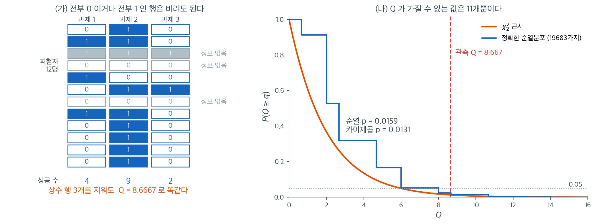

# Cochran의 Q 검정 (관련된 k개의 결과)

## 개요

**Cochran의 Q 검정**은 McNemar 검정을 같은 대상에게서 측정한 $k \ge 2$개의 관련된 이분(이진) 결과로 일반화한 것이다. "성공"의 비율이 $k$개 조건 전체에서 같은지를 검정한다. 각 대상을 여러 처치·과제·시점에서 이진 결과로 평가하는 반복측정 설계에 흔히 쓰인다.

---

## 1. 연구 설계

- 대상 $n$명을 각각 $k$개 조건에서 관측한다.
- 각 (대상, 조건) 쌍의 결과가 이진(0 또는 1)이다.
- 자료는 $X_{ij} \in \{0, 1\}$인 $n \times k$ 행렬 $X$를 이룬다.

---

## 2. 가설

- **귀무가설** ($H_0$): 성공 확률이 $k$개 조건에서 모두 같다. 즉 $p_1 = p_2 = \cdots = p_k$.
- **대립가설** ($H_A$): 적어도 한 조건의 성공 확률이 다르다.

---

## 3. 검정통계량

$T_j = \sum_{i=1}^{n} X_{ij}$를 열 합계(조건 $j$의 성공 수), $L_i = \sum_{j=1}^{k} X_{ij}$를 행 합계(대상 $i$의 성공 수)라 하고, $T = \sum_j T_j$를 총합이라 하자. Cochran의 Q 통계량은

$$
Q = \frac{(k-1)\left(k \sum_{j=1}^{k} T_j^2 - T^2\right)}{k\,T - \sum_{i=1}^{n} L_i^2}
$$

이다. $n$이 크면 $H_0$ 아래에서 $Q$는 근사적으로 $\chi^2(k-1)$ 분포를 따른다.

---

## 4. McNemar 검정과의 관계

$k = 2$일 때 Cochran의 Q는 McNemar 검정으로 환원된다. 구체적으로 $k = 2$인 Q 통계량은 (연속성 보정을 하지 않은) McNemar 카이제곱 통계량과 같다. 그래서 Cochran의 Q는 관련된 이진 결과를 셋 이상 비교할 때의 자연스러운 확장이 된다.

<div class="exbox" markdown>

**보기 1.** <span class="diff easy" title="쉬움"></span> Cochran의 Q 검정 구현. 공식

$$
Q = \frac{(k-1)\left(k \sum_{j} T_j^2 - T^2\right)}{k\,T - \sum_{i} L_i^2}
$$

을 그대로 코드로 옮기기 전에, 분자와 분모가 **무엇을 재고 있는지** 풀어 쓴다.

**(1)** 분자가 $k(k-1)\sum_j (T_j - \bar T)^2$, 분모가 $\sum_i L_i(k - L_i)$ 와 같음을 보이시오($\bar T = T/k$).

**(2)** (1)로부터 $L_i = 0$ 또는 $L_i = k$ 인 피험자, 곧 **모든 조건에서 같은 결과를 낸 사람**이 분모에 전혀 기여하지 않음을 보이시오. 분자에는 어떤가.

**(3)** $k = 2$ 일 때 $Q$ 가 (연속성 보정 없는) McNemar 통계량 $(b-c)^2/(b+c)$ 와 **같음**을 보이시오. 여기서 $b, c$ 는 두 조건에서 결과가 엇갈린 사람의 수다.

**(4)** 공식을 그대로 옮긴 함수를 짜시오.

</div>

??? success "풀이"

    **(1) 두 변동으로 다시 쓰기.** 분자부터 본다. $\bar T = T/k$ 이므로

    $$
    \sum_{j=1}^k (T_j - \bar T)^2 = \sum_j T_j^2 - 2\bar T \sum_j T_j + k\bar T^2
    = \sum_j T_j^2 - \frac{2T^2}{k} + \frac{T^2}{k}
    = \sum_j T_j^2 - \frac{T^2}{k}
    $$

    다. 양변에 $k$ 를 곱하면 $k\sum_j T_j^2 - T^2 = k\sum_j (T_j - \bar T)^2$ 이므로 분자는

    $$
    (k-1)\left(k\sum_j T_j^2 - T^2\right) = k(k-1)\sum_{j=1}^k (T_j - \bar T)^2
    $$

    이다. 분모는 더 쉽다. $T = \sum_j T_j = \sum_i L_i$ 이므로

    $$
    kT - \sum_i L_i^2 = \sum_{i=1}^n \bigl(k L_i - L_i^2\bigr) = \sum_{i=1}^n L_i(k - L_i)
    $$

    다. 합쳐서

    $$
    Q = \frac{k(k-1)\sum_j (T_j - \bar T)^2}{\sum_i L_i(k - L_i)}
    $$

    **분자는 조건 사이의 변동, 분모는 피험자 안의 변동이다.** 조건별 성공 수가 서로 흩어질수록 분자가 커지고, 피험자마다 성공·실패가 섞여 있을수록 분모가 커진다. 분산분석의 $F$ 와 같은 짜임이다.

    **(2) 아무 말도 하지 않는 피험자.** $g(L) = L(k - L)$ 은 $L = 0$ 과 $L = k$ 에서 $0$ 이다. 모두 실패했거나 모두 성공한 사람은 **분모에 $0$ 을 보탠다.**

    분자에는 어떤가. $L_i = k$ 인 사람은 모든 $T_j$ 를 똑같이 1 씩 올린다. 모든 $T_j$ 와 $\bar T$ 가 함께 1 씩 커지므로 $T_j - \bar T$ 는 **하나도 달라지지 않는다.** $L_i = 0$ 이면 아무것도 보태지 않으니 더 말할 것이 없다.

    **그러므로 이런 피험자는 $Q$ 를 조금도 바꾸지 못한다.** 당연하기도 하다. 세 과제를 모두 성공한 사람은 "어느 과제가 더 쉬운가" 라는 물음에 할 말이 없다. McNemar 검정에서 일치 쌍을 버리는 것과 똑같은 일이다. **실질 표본크기는 $n$ 이 아니라 $0 < L_i < k$ 인 사람의 수**다.

    **(3) $k = 2$ 에서 McNemar 로 환원.** 두 조건의 결과를 네 패턴으로 나누어 세자.

    | 패턴 $(X_{i1}, X_{i2})$ | 사람 수 | $L_i$ | $L_i(2-L_i)$ |
    |:---:|:---:|:---:|:---:|
    | $(1,1)$ | $a$ | 2 | 0 |
    | $(1,0)$ | $b$ | 1 | 1 |
    | $(0,1)$ | $c$ | 1 | 1 |
    | $(0,0)$ | $d$ | 0 | 0 |

    분모는 (2)에 따라 엇갈린 사람만 남아 $\sum_i L_i(2-L_i) = b + c$ 다.

    분자는 $k = 2$ 이므로 $\bar T = (T_1+T_2)/2$ 이고 $T_1 - \bar T = (T_1-T_2)/2$, $T_2 - \bar T = -(T_1-T_2)/2$ 다. 따라서

    $$
    k(k-1)\sum_j (T_j-\bar T)^2 = 2 \cdot 1 \cdot 2\left(\frac{T_1-T_2}{2}\right)^{\!2} = (T_1 - T_2)^2
    $$

    인데 $T_1 = a + b$, $T_2 = a + c$ 이므로 $T_1 - T_2 = b - c$ 다. 합치면

    $$
    Q = \frac{(b-c)^2}{b+c}
    $$

    **McNemar 통계량 그 자체다.** $a$ 와 $d$ 가 식에서 완전히 사라진 것이 (2)에서 본 일이다. $\square$

    **(4) 공식을 코드로.**

    ```python
    import numpy as np
    from scipy import stats

    def cochran_q(data):
        """Cochran의 Q 검정.

        data : (피험자 수, 조건 수) 모양의 0/1 행렬.
               행 하나가 피험자, 열 하나가 조건이다.
        돌려주는 값은 (Q 통계량, chi2(k-1) 근사 p-값).
        """
        data = np.asarray(data, dtype=float)
        n, k = data.shape

        T_j = data.sum(axis=0)          # 조건별 성공 수
        L_i = data.sum(axis=1)          # 피험자별 성공 수
        grand_T = T_j.sum()

        # 분자는 조건 사이의 변동, 분모는 피험자 안의 변동을 잰다.
        # L_i가 0이거나 k인 피험자, 즉 전부 성공하거나 전부 실패한 피험자는
        # 분모에 아무 기여도 하지 않는다. 조건 간 비교에 정보가 없기 때문이다.
        numerator = (k - 1) * (k * np.sum(T_j**2) - grand_T**2)
        denominator = k * grand_T - np.sum(L_i**2)

        Q = numerator / denominator
        p_value = stats.chi2(k - 1).sf(Q)
        return Q, p_value
    ```

    분자와 분모를 (1)의 꼴로 적어도 똑같은 값이 나온다. 아래 보기 2 에서 두 꼴이 일치하는지 수로 확인한다.

### 검정 실행

<div class="exbox" markdown>

**보기 2.** <span class="diff easy" title="쉬움"></span> 세 과제의 성공률 비교. 피험자 12명이 과제 3개를 수행해 성공 여부를 기록했다. 과제별 성공 수는 $T_1 = 4$, $T_2 = 9$, $T_3 = 2$ 이고, 사람별 성공 수는 $L = (1,2,3,0,1,2,0,2,1,1,1,1)$ 이다.

**(1)** 보기 1 (1)의 꼴로 $Q$ 를 **유리수로** 구하시오. 분모에 실제로 기여하는 피험자는 몇 명인가.

**(2)** p-값을 구해 $\alpha = 0.05$ 에서 판정하시오. 자유도가 2 이므로 **닫힌 꼴**로 적힌다.

**(3)** $Q$ 는 "세 과제가 모두 같지는 않다" 만 말한다. **어느 쌍이 다른지**는 쌍별 McNemar 검정 세 개로 따져야 한다. 보기 1 (3)의 $(b-c)^2/(b+c)$ 를 세 쌍에 적용하고 본페로니로 보정해 판정하시오.

**(4)** 코드로 (1)·(2)·(3)을 확인하시오.

</div>

??? success "풀이"

    **(1) $Q$ 를 유리수로.** 보기 1 (1)의 꼴을 쓴다. 먼저 분자. $\bar T = 15/3 = 5$ 이므로

    $$
    \sum_j (T_j - \bar T)^2 = (4-5)^2 + (9-5)^2 + (2-5)^2 = 1 + 16 + 9 = 26
    $$

    $$
    \text{분자} = k(k-1)\sum_j (T_j-\bar T)^2 = 3 \cdot 2 \cdot 26 = 156
    $$

    분모는 $\sum_i L_i(3 - L_i)$ 다. $g(L) = L(3-L)$ 은 $g(0) = 0$, $g(1) = 2$, $g(2) = 2$, $g(3) = 0$ 이다.

    | $L_i$ | 0 | 1 | 2 | 3 | 합 |
    |:---:|:---:|:---:|:---:|:---:|:---:|
    | 사람 수 | 2 | 6 | 3 | 1 | 12 |
    | $g(L_i)$ | 0 | 2 | 2 | 0 | |
    | 기여 | 0 | 12 | 6 | 0 | **18** |

    $$
    Q = \frac{156}{18} = \frac{26}{3} = 8.6\overline{6}
    $$

    **기여하는 사람은 9명뿐이다.** 모두 실패한 2명($L_i = 0$)과 모두 성공한 1명($L_i = 3$)은 분모에 $0$ 을 보태고, 보기 1 (2)에서 본 대로 분자도 바꾸지 못한다. **$n = 12$ 라고 적혀 있지만 이 검정이 실제로 쓰는 표본은 9명**이다.

    **(2) p-값.** $\text{df} = k - 1 = 2$ 다. 자유도 2 의 $\chi^2$ 밀도는 $\tfrac12 e^{-x/2}$, 곧 평균 2 인 지수분포라 꼬리가 바로 적분된다.

    $$
    p = P\!\left(\chi^2_2 \ge \tfrac{26}{3}\right) = e^{-13/3} = 0.0131237
    $$

    $p = 0.0131 < 0.05$ 이므로 $H_0$ 을 **기각한다.** 세 과제의 성공률이 모두 같지는 않다.

    피험자가 12명뿐인데도 기각된다. 같은 사람이 세 과제를 모두 수행하므로 **개인차가 상쇄되기** 때문이며, 대응설계가 버는 것이 여기서도 같다. 다만 이 $p$ 는 $\chi^2$ **근사**가 준 값이다. 아래 "12명 중 실제로 정보를 주는 사람은 몇 명인가" 에서 보듯 정확한 순열 p-값은 $0.0159$ 로 근사보다 조금 크다.

    **(3) 어느 쌍이 다른가.** 쌍마다 엇갈린 사람만 세면 된다. $b$ 는 앞 과제만 성공한 사람, $c$ 는 뒤 과제만 성공한 사람이다.

    $$
    \begin{array}{l|cc|cc}
    \text{쌍} & b & c & \chi^2 = \dfrac{(b-c)^2}{b+c} & p \\ \hline
    \text{과제 1 대 2} & 1 & 6 & \dfrac{25}{7} = 3.5714 & 0.0588 \\[2mm]
    \text{과제 1 대 3} & 3 & 1 & \dfrac{4}{4} = 1.0000 & 0.3173 \\[2mm]
    \text{과제 2 대 3} & 7 & 0 & \dfrac{49}{7} = 7.0000 & 0.0082
    \end{array}
    $$

    비교가 $\binom32 = 3$ 개이므로 본페로니 문턱은 $0.05/3 = 0.0167$ 이다.

    - **과제 2 대 3 만 유의하다**($0.0082 < 0.0167$). 과제 2 를 성공하고 과제 3 을 실패한 사람이 7명인데 그 반대는 **한 명도 없다.** 완전히 한 방향이다.
    - 과제 1 대 2 는 $0.0588$ 로 보정 전 $0.05$ 에도 못 미친다.
    - 과제 1 대 3 은 $0.3173$ 으로 멀다.

    **표본이 작으므로 McNemar 의 정확검정도 함께 보는 것이 옳다.** 엇갈린 $b+c$ 명 가운데 $b$ 명이 한쪽으로 가는 것이 $\text{Bin}(b+c, 1/2)$ 이므로, 과제 2 대 3 의 양측 정확 p-값은

    $$
    2 \cdot \left(\tfrac12\right)^{7} = \frac{1}{64} = 0.015625
    $$

    다. $0.015625 < 0.0167$ 이라 **간신히** 유의하다. 근사가 준 $0.0082$ 보다 두 배 가까이 크다. **엇갈린 사람이 7명뿐일 때 $\chi^2$ 근사는 믿을 것이 못 된다.**

    **(4) 수치적으로.**

    ```python
    # 피험자 12명이 과제 3개를 수행한 결과 (성공=1, 실패=0)
    tasks = np.array([
        [0, 1, 0],
        [1, 1, 0],
        [1, 1, 1],
        [0, 0, 0],
        [1, 0, 0],
        [0, 1, 1],
        [0, 0, 0],
        [1, 1, 0],
        [0, 1, 0],
        [0, 1, 0],
        [0, 1, 0],
        [0, 1, 0],
    ])

    Q, p = cochran_q(tasks)

    print(f"Cochran's Q = {Q:.4f}")
    print(f"p-value     = {p:.4f}")

    if p < 0.05:
        print("Reject H0: success rates differ across tasks.")
    else:
        print("Fail to reject H0: no significant difference.")

    # (1) 두 꼴이 같은지, 기여하는 사람이 몇 명인지
    T_j, L_i = tasks.sum(axis=0), tasks.sum(axis=1)
    k = tasks.shape[1]
    print(f"\n분자  k(k-1)Σ(T_j-T̄)² = {k * (k - 1) * ((T_j - T_j.mean())**2).sum():.0f}")
    print(f"분모  ΣL_i(k-L_i)      = {(L_i * (k - L_i)).sum():.0f}"
          f"   기여하는 사람 {np.sum((L_i > 0) & (L_i < k))}명")

    # (2) 자유도 2 의 닫힌 꼴
    print(f"exp(-Q/2) = {np.exp(-Q / 2):.7f}")

    # (3) 쌍별 McNemar 와 본페로니
    print()
    for a, b_ in [(0, 1), (0, 2), (1, 2)]:
        b = int(((tasks[:, a] == 1) & (tasks[:, b_] == 0)).sum())
        c = int(((tasks[:, a] == 0) & (tasks[:, b_] == 1)).sum())
        chi = (b - c) ** 2 / (b + c)
        p_chi = stats.chi2(1).sf(chi)
        p_exact = min(1.0, 2 * stats.binom(b + c, 0.5).cdf(min(b, c)))
        print(f"과제 {a+1} 대 {b_+1}:  b={b} c={c}  chi2={chi:.4f}  "
              f"p={p_chi:.4f}  정확 p={p_exact:.4f}"
              f"{'  ← 유의 (0.0167)' if p_chi < 0.05 / 3 else ''}")
    ```

    출력:

    ```
    Cochran's Q = 8.6667
    p-value     = 0.0131

    분자  k(k-1)Σ(T_j-T̄)² = 156
    분모  ΣL_i(k-L_i)      = 18   기여하는 사람 9명
    exp(-Q/2) = 0.0131237

    과제 1 대 2:  b=1 c=6  chi2=3.5714  p=0.0588  정확 p=0.1250
    과제 1 대 3:  b=3 c=1  chi2=1.0000  p=0.3173  정확 p=0.6250
    과제 2 대 3:  b=7 c=0  chi2=7.0000  p=0.0082  정확 p=0.0156  ← 유의 (0.0167)
    ```

    `Cochran's Q = 8.6667` 이 (1)의 $26/3$ 과, `exp(-Q/2) = 0.0131237` 이 (2)의 $e^{-13/3}$ 과 맞는다. 분자 `156` 과 분모 `18` 도 손으로 만든 표와 같고, **기여하는 사람이 9명**이라는 것도 확인된다.

    쌍별 결과도 (3)의 표와 네 자리까지 같다. 본페로니 문턱 $0.0167$ 을 넘는 것은 **과제 2 대 3 하나뿐**이다. 정확 p-값 `0.0156` 이 근사 `0.0082` 의 거의 두 배인 것도 그대로다.

    **정리.** 과제별 성공률은 $T_1/12 = 33\%$, $T_2/12 = 75\%$, $T_3/12 = 17\%$ 다. $Q$ 가 잡아낸 차이의 정체는 결국 **과제 2 와 과제 3 의 간격**이고, 과제 1 은 그 사이에 애매하게 놓여 어느 쪽과도 유의하게 갈리지 않는다.

---

## 5. 해석

p-값이 $\alpha = 0.05$보다 작으면 $k$개 조건의 성공 확률이 모두 같지는 않다고 결론짓는다. Cochran의 Q는 *어느* 조건이 다른지는 알려주지 **않는다**. 어떤 조건 쌍의 성공률이 유의하게 다른지 알아내려면 사후 쌍별 비교(예: Bonferroni 보정을 적용한 여러 McNemar 검정)가 필요하다.

Q에 대한 카이제곱 근사는 대체로 다음일 때 적절하다:

- 대상 수 $n$이 어느 정도 클 때.
- 곱 $nk$가 충분히 커서 Q의 분포가 $\chi^2(k-1)$로 잘 근사될 때.

흔한 지침은 $n \ge 4$이고 $nk \ge 24$이다.

### 12명 중 실제로 정보를 주는 사람은 몇 명인가



왼쪽 (가)가 자료 12행을 그대로 그린 것이다. 세 번째 피험자는 세 과제를 모두 성공했고, 네 번째와 일곱 번째는 모두 실패했다. 이 세 사람은 회색으로 칠해 두었다. 분모 $kT - \sum L_i^2$를 보면 이유가 보인다. $L_i = 0$이면 $kL_i - L_i^2 = 0$이고 $L_i = k$여도 $k \cdot k - k^2 = 0$이다. 분자 쪽의 열 합계에는 모든 행이 같은 양만큼 더해지므로 조건 사이의 **차이**에는 영향이 없다. 실제로 이 세 행을 지우고 남은 9명으로만 계산해도 $Q = 8.6667$로 한 자리도 달라지지 않는다.

이것은 McNemar 검정에서 일치 쌍을 버렸던 것과 같은 일이다. 모든 조건에서 똑같은 결과를 낸 사람은 "어느 조건이 더 쉬운가"라는 질문에 아무 말도 하지 않는다. 대응설계가 개인차를 상쇄한다는 말의 구체적인 내용이 이것이며, 동시에 실제 표본크기가 12가 아니라 9라는 경고이기도 하다.

오른쪽 (나)는 그 9명 안에서 세 과제의 이름표를 섞어 만든 정확한 귀무분포이다. 가능한 배치가 $3^9 = 19683$가지뿐이므로 열거해서 다 세었다. $Q$가 가질 수 있는 값은 11개에 불과하고, 파란 계단이 주황 곡선($\chi^2_2$) 주위를 성글게 오르내린다. 관측값 $Q = 8.667$에서 정확한 순열 p-값은 0.0159, 카이제곱 근사는 0.0131이다.

두 값 모두 0.05보다 작아 결론은 같지만 근사 쪽이 조금 낙관적이다. 여기서는 $nk = 36 \ge 24$이라 근사가 그런대로 쓸 만했다. 피험자가 더 적거나 조건이 더 적어 계단이 더 성글어지면 이 차이가 결론을 뒤집을 수 있으므로, 그럴 때는 그림처럼 순열분포를 직접 만들어 보는 편이 안전하다.

---

## 연습문제

<div class="drillbox" markdown>

**연습문제 1.** <span class="diff easy" title="쉬움"></span>
위 보기 자료에서 열 합계 $T_1 = 4$, $T_2 = 9$, $T_3 = 2$를 확인하고 총합 $T$를 계산하라.

</div>

??? success "풀이"

    1열의 합: $0+1+1+0+1+0+0+1+0+0+0+0 = 4$. 확인.

    2열의 합: $1+1+1+0+0+1+0+1+1+1+1+1 = 9$. 확인.

    3열의 합: $0+0+1+0+0+1+0+0+0+0+0+0 = 2$. 확인.

    총합: $T = 4 + 9 + 2 = 15$. $\square$

---

<div class="drillbox" markdown>

**연습문제 2.** <span class="diff easy" title="쉬움"></span>
대응된 범주형 자료 분석의 **전체 지도**를 정리하라.

</div>

??? success "풀이"

    **선택 흐름.**

    ```text
    같은 대상을 여러 조건에서 측정했다
        │
        ├─ 결과가 이진인가
        │      │
        │      ├─ 조건이 2개 ────→ McNemar
        │      └─ 조건이 k≥3 ───→ 코크런 Q
        │
        ├─ 결과가 k개 범주(순서 없음)
        │      └─ 조건이 2개 ────→ 보커 대칭성 / 주변 동질성
        │
        ├─ 결과가 순서형
        │      └─→ 대응 순위 검정, 순서형 혼합모형
        │
        └─ 공변량·결측·불균형이 있다
               └─→ 혼합효과 로지스틱 / GEE / 조건부 로지스틱
    ```

    **공통의 원리.** 모두 **개체 내 변동만 쓰고 개체 간 변동을 제거**한다.

    | 검정 | 버리는 것 | 쓰는 것 |
    |---|---|---|
    | McNemar | 일치 쌍 $a$, $d$ | 불일치 쌍 $b$, $c$ |
    | 코크런 $Q$ | $L_i=0$ 또는 $k$인 피험자 | 나머지 |
    | 조건부 로지스틱 | 개체 절편 | 개체 내 대비 |

    **이것이 대응 설계의 힘이자 한계**다. 개체 간 차이를 통제해 검정력을 얻지만, **변화가 없는 개체는 정보를 주지 않는다.**

    **점검 목록.**

    - [ ] 자료가 **대응**인가(같은 대상의 반복 측정)
    - [ ] 결측이 있는 대상을 어떻게 처리했는가
    - [ ] **정보 있는 대상의 수**를 세었는가
    - [ ] 천장·바닥 효과가 없는가
    - [ ] 옴니버스 검정을 먼저 했는가
    - [ ] 사후 쌍별 비교에 보정을 했는가
    - [ ] 효과크기(오즈비, 성공률 차이)를 보고했는가
    - [ ] 조건에 순서가 있다면 그것을 활용했는가

    **자주 하는 실수 다섯.**

    | 실수 | 대가 |
    |---|---|
    | 대응 자료를 독립으로 분석 | 검정력이 크게 무너짐 |
    | 정보 없는 대상의 수를 무시 | 유효 표본크기를 오해 |
    | 옴니버스 없이 쌍별 비교 | FWER 부풀림 |
    | 순서형 조건에 $Q$ 사용 | 검정력 손실 |
    | 결측을 조용히 제외 | 편향 가능 |

    **보고 예시.**

    > 피험자 12명이 과제 3개를 수행했다. 성공률은 각각 33.3%, 75.0%, 16.7%였다. 이 중 9명(75%)은 과제에 따라 결과가 달랐고, 3명은 모든 과제에서 같은 결과를 보여 분석에 기여하지 않는다. 코크런 $Q$ 검정 결과 세 과제의 성공률이 유의하게 달랐다($Q=8.67$, df $=2$, $p=0.013$; 순열 $p=0.015$). 사후 쌍별 McNemar 검정(홀름 보정)에서 과제 2와 과제 3만 유의했다($p=0.047$). 다만 불일치 쌍이 각 비교마다 4~7개에 불과해 정밀도에 큰 한계가 있다.

    **마지막 문장이 중요하다.** 불일치 쌍이 한 자릿수인 자료에서 나온 결론은 **탐색적으로만** 받아들여야 한다.

    **한 문장.** 대응 범주형 자료의 분석은 **"몇 명이 실제로 변했는가"**를 세는 것에서 시작한다. 그 수가 검정력의 거의 전부이고, 나머지는 그것을 어떻게 요약하느냐의 문제다.

---

<div class="drillbox" markdown>

**연습문제 3.** <span class="diff med" title="중간"></span>
연습문제 1의 값을 써서 12명 모두의 행 합계 $L_i$를 구하고 $\sum_{i=1}^{12} L_i^2$을 계산하라.

</div>

??? success "풀이"

    행 합계: $L = [1, 2, 3, 0, 1, 2, 0, 2, 1, 1, 1, 1]$.

    $$
    \sum_{i=1}^{12} L_i^2 = 1 + 4 + 9 + 0 + 1 + 4 + 0 + 4 + 1 + 1 + 1 + 1 = 27
    $$

    $\square$

---

<div class="drillbox" markdown>

**연습문제 4.** <span class="diff med" title="중간"></span>
연습문제 1과 2의 값을 Cochran의 Q 공식에 대입하여 검정통계량을 확인하라.

</div>

??? success "풀이"

    $k = 3$, $T = 15$, $\sum T_j^2 = 4^2 + 9^2 + 2^2 = 16 + 81 + 4 = 101$, $\sum L_i^2 = 27$이다.

    분자:

    $$
    (k-1)\left(k\sum T_j^2 - T^2\right) = 2 \times (3 \times 101 - 225) = 2 \times (303 - 225) = 2 \times 78 = 156
    $$

    분모:

    $$
    k \cdot T - \sum L_i^2 = 3 \times 15 - 27 = 45 - 27 = 18
    $$

    $$
    Q = \frac{156}{18} = 8.667
    $$

    $\text{df} = k - 1 = 2$에서 $p = P(\chi^2_2 \ge 8.667) \approx 0.013$이다. $p < 0.05$이므로 $H_0$을 기각하고 세 과제의 성공률이 유의하게 다르다고 결론짓는다. $\square$

---

<div class="drillbox" markdown>

**연습문제 5.** <span class="diff med" title="중간"></span>
Cochran의 Q로 $H_0$을 기각한 뒤, 어느 조건이 다른지 알아내려고 $\binom{k}{2}$개의 쌍별 McNemar 검정을 모두 수행한다고 하자. 조건이 $k = 4$개이면 쌍별 검정은 몇 개이며, 전체 $\alpha = 0.05$일 때 Bonferroni 조정 유의수준은 얼마인가?

</div>

??? success "풀이"

    쌍별 비교의 수는

    $$
    \binom{4}{2} = \frac{4!}{2!\,2!} = 6
    $$

    이다. Bonferroni 보정을 적용하면 개별 검정의 유의수준은

    $$
    \alpha^* = \frac{0.05}{6} \approx 0.00833
    $$

    이다. 쌍별 McNemar 검정은 p-값이 $0.00833$보다 작을 때에만 유의하다. 이렇게 하면 가족단위 오류율이 $0.05$로 통제된다. $\square$

---

<div class="drillbox" markdown>

**연습문제 6.** <span class="diff med" title="중간"></span>
보기 2의 자료에서 **어떤 피험자가 통계량에 기여하지 않는지** 확인하고, 그들을 빼도 결과가 같은지 보여라.

</div>

??? success "풀이"
    **분모를 보면 답이 나온다.**

    $$
    \text{분모}=kT-\sum_i L_i^2=\sum_i\bigl(kL_i-L_i^2\bigr)=\sum_i L_i(k-L_i)
    $$

    **$L_i=0$이거나 $L_i=k$이면 그 항이 0**이다. 모든 조건에서 실패했거나 모두 성공한 피험자는 **조건 간 비교에 아무 정보도 주지 않는다.**

    ```python
    import numpy as np
    from scipy import stats

    def cochran_q(data):
        data = np.asarray(data, float)
        n, k = data.shape
        T_j, L_i = data.sum(0), data.sum(1)
        grand_T = T_j.sum()
        Q = ((k - 1) * (k * np.sum(T_j**2) - grand_T**2)
             / (k * grand_T - np.sum(L_i**2)))
        return Q, stats.chi2(k - 1).sf(Q)

    tasks = np.array([[0, 1, 0], [1, 1, 0], [1, 1, 1], [0, 0, 0],
                      [1, 0, 0], [0, 1, 1], [0, 0, 0], [1, 1, 0],
                      [0, 1, 0], [0, 1, 0], [0, 1, 0], [0, 1, 0]], float)
    n, k = tasks.shape
    L = tasks.sum(1)

    Q, p = cochran_q(tasks)
    print(f"전체 {n}명:  Q = {Q:.4f},  p = {p:.4f}")
    print(f"  열 합 T_j = {tasks.sum(0).tolist()}")
    print(f"  행 합 L_i 의 분포 = {np.bincount(L.astype(int)).tolist()}"
          f"   (L=0 이 {int((L == 0).sum())}명, L=k 가 {int((L == k).sum())}명)")

    informative = tasks[(L > 0) & (L < k)]
    Q2, p2 = cochran_q(informative)
    print(f"\n정보 있는 {len(informative)}명만:  Q = {Q2:.4f},  p = {p2:.4f}")
    print(f"  같은가? {np.isclose(Q, Q2)}")
    ```

    ```text
    전체 12명:  Q = 8.6667,  p = 0.0131
      열 합 T_j = [4.0, 9.0, 2.0]
      행 합 L_i 의 분포 = [2, 6, 3, 1]   (L=0 이 2명, L=k 가 1명)

    정보 있는 9명만:  Q = 8.6667,  p = 0.0131
      같은가? True
    ```

    **통계량이 완전히 같다.** 12명 중 3명(전부 실패 2명, 전부 성공 1명)은 계산에 **기여하지 않는다.**

    **왜 분자도 변하지 않는가.** 분자에 나오는 $T_j$와 $T$가 달라지지 않느냐고 물을 수 있다. 실제로는 달라지지만, $L_i=0$인 사람은 모든 $T_j$에 0을 더하고 $L_i=k$인 사람은 **모든 $T_j$에 똑같이 1을 더한다.** 후자는 $T_j$들을 평행이동시킬 뿐이어서

    $$
    k\sum_j T_j^2-T^2
    $$

    의 값을 바꾸지 않는다. 이 양이 $T_j$의 **편차제곱합**($k^2\sum_j(T_j-\bar T)^2$)이기 때문이다.

    **McNemar와 같은 구조다.** McNemar에서 일치 쌍 $a$, $d$가 기여하지 않는 것(연습문제 9의 $k=2$ 경우)과 정확히 같은 이유다.

    **실무적 함의 넷.**

    1. **유효 표본크기는 $n$이 아니라 "변동이 있는 피험자 수"**다. 여기서는 9명이다.
    2. **검정력 설계에서 이것을 반영**해야 한다. 100명을 모아도 80명이 전부 성공하면 20명짜리 연구다.
    3. **천장·바닥 효과가 있으면 위험하다.** 과제가 너무 쉬우면 대부분 $L_i=k$가 되어 정보가 사라진다.
    4. **그 수를 반드시 보고**한다. "12명 중 9명이 조건에 따라 결과가 달랐다"는 정보가 $Q$ 값보다 유용할 수 있다.

---

<div class="drillbox" markdown>

**연습문제 7.** <span class="diff med" title="중간"></span>
연습문제 5가 계산한 사후 쌍별 McNemar 검정을 **실제로 수행**하고, 어느 과제가 다른지 밝혀라.

</div>

??? success "풀이"
    ```python
    import numpy as np
    from scipy import stats
    from itertools import combinations
    from statsmodels.stats.multitest import multipletests

    tasks = np.array([[0, 1, 0], [1, 1, 0], [1, 1, 1], [0, 0, 0],
                      [1, 0, 0], [0, 1, 1], [0, 0, 0], [1, 1, 0],
                      [0, 1, 0], [0, 1, 0], [0, 1, 0], [0, 1, 0]], float)
    print(f"과제별 성공률 {(tasks.mean(0)).round(4).tolist()}\n")

    print("쌍별 McNemar (정확 이항)")
    pvals, labels = [], []
    for i, j in combinations(range(3), 2):
        b = int(((tasks[:, i] == 1) & (tasks[:, j] == 0)).sum())
        c = int(((tasks[:, i] == 0) & (tasks[:, j] == 1)).sum())
        p = min(1.0, 2 * stats.binom.cdf(min(b, c), b + c, 0.5)) \
            if b + c > 0 else 1.0
        pvals.append(p)
        labels.append(f"과제{i + 1}-과제{j + 1}")
        print(f"  과제{i + 1}-과제{j + 1}:  b = {b},  c = {c},  "
              f"불일치 {b + c}쌍,  p = {p:.4f}")

    for method, name in [("bonferroni", "본페로니"), ("holm", "홀름  ")]:
        rej, adj, _, _ = multipletests(pvals, alpha=0.05, method=method)
        detail = "   ".join(f"{labels[m]} {adj[m]:.4f}{'*' if rej[m] else ' '}"
                            for m in range(3))
        print(f"  {name}: {detail}")
    ```

    ```text
    과제별 성공률 [0.3333, 0.75, 0.1667]

    쌍별 McNemar (정확 이항)
      과제1-과제2:  b = 1,  c = 6,  불일치 7쌍,  p = 0.1250
      과제1-과제3:  b = 3,  c = 1,  불일치 4쌍,  p = 0.6250
      과제2-과제3:  b = 7,  c = 0,  불일치 7쌍,  p = 0.0156
      본페로니: 과제1-과제2 0.3750    과제1-과제3 1.0000    과제2-과제3 0.0469*
      홀름  : 과제1-과제2 0.2500    과제1-과제3 0.6250    과제2-과제3 0.0469*
    ```

    **과제 2와 과제 3만 유의하게 다르다**(보정 후 $p=0.0469$).

    | 비교 | 성공률 | 불일치 쌍 | 보정 $p$ |
    |---|---|---|---|
    | 과제1 대 과제2 | 0.333 대 0.750 | 7 | 0.250 |
    | 과제1 대 과제3 | 0.333 대 0.167 | 4 | 0.625 |
    | **과제2 대 과제3** | **0.750 대 0.167** | 7 | **0.047** |

    **과제 2-3의 불일치 쌍이 7개인데 그중 7개가 모두 한 방향**이다($b=7$, $c=0$). 이런 완전한 치우침이라야 7쌍으로 유의성에 도달한다.

    **과제 1-2도 불일치가 7쌍**인데 $b=1$, $c=6$이라 $p=0.125$다. **6:1은 7:0보다 훨씬 약한 증거**다.

    $$
    P(\text{7:0 이상 치우침})=2\times(1/2)^7=0.0156,\qquad
    P(\text{6:1 이상})=2\times\frac{1+7}{128}=0.125
    $$

    **불일치 쌍이 7개뿐이면 완전 치우침에서만 유의**하다. 이것이 소표본 대응 자료의 한계다.

    **본페로니와 홀름의 차이가 여기서 보인다.** 가장 작은 $p$(0.0156)는 둘 다 $3\times0.0156=0.0469$로 같지만, 나머지는 홀름이 덜 보수적이다(0.250 대 0.375).

    **주의 셋.**

    1. **옴니버스가 먼저 유의해야 한다.** 여기서는 $Q=8.667$, $p=0.013$으로 통과했다.
    2. **쌍마다 불일치 쌍의 수가 다르다.** 과제1-3은 4쌍뿐이라 애초에 유의할 수 없다($2\times(1/2)^4=0.125$가 최솟값).
    3. **쌍별 비교에 쓰이는 자료가 겹친다.** 같은 피험자가 세 비교에 모두 들어가므로 검정들이 독립이 아니다. 본페로니·홀름은 독립을 요구하지 않으므로 여전히 타당하다.

---

<div class="drillbox" markdown>

**연습문제 8.** <span class="diff med" title="중간"></span>
코크런 $Q$ 검정의 **표본크기**와 **대안 모형**을 논하라.

</div>

??? success "풀이"
    **검정력에 영향을 주는 것 셋.**

    | 요인 | 영향 |
    |---|---|
    | **정보 있는 피험자 수** | 직접적. 전부 성공·전부 실패는 무용 |
    | 조건 간 성공률 차이 | 클수록 유리 |
    | 조건 수 $k$ | 늘리면 자유도도 늘어 상쇄 |

    ```python
    import numpy as np
    from scipy import stats

    rng = np.random.default_rng(753)
    M = 3_000

    def cochran_q_stat(data):
        data = np.asarray(data, float)
        n, k = data.shape
        T_j, L_i = data.sum(0), data.sum(1)
        grand_T = T_j.sum()
        den = k * grand_T - np.sum(L_i**2)
        return 0.0 if den == 0 else \
            (k - 1) * (k * np.sum(T_j**2) - grand_T**2) / den

    print(f"{'n':>5s} {'조건별 성공률':>22s} {'정보 있는 피험자':>16s} {'검정력':>8s}")
    settings = [(20, [0.3, 0.5, 0.7]), (40, [0.3, 0.5, 0.7]),
                (80, [0.3, 0.5, 0.7]),
                (40, [0.4, 0.5, 0.6]), (40, [0.05, 0.10, 0.15]),
                (40, [0.80, 0.85, 0.90])]
    for n, ps in settings:
        ps = np.array(ps)
        rej, info = 0, []
        for _ in range(M):
            d = (rng.random((n, len(ps))) < ps).astype(float)
            L = d.sum(1)
            info.append(((L > 0) & (L < len(ps))).sum())
            rej += stats.chi2(len(ps) - 1).sf(cochran_q_stat(d)) < 0.05
        print(f"{n:5d} {str(ps.tolist()):>22s} {np.mean(info):16.1f} "
              f"{rej / M:8.4f}")
    ```

    ```text
        n                조건별 성공률        정보 있는 피험자      검정력
       20        [0.3, 0.5, 0.7]             15.8   0.6077
       40        [0.3, 0.5, 0.7]             31.6   0.9183
       80        [0.3, 0.5, 0.7]             63.0   0.9983
       40        [0.4, 0.5, 0.6]             30.4   0.3520
       40      [0.05, 0.1, 0.15]             10.9   0.2203
       40       [0.8, 0.85, 0.9]             15.4   0.1810
    ```

    **정보 있는 피험자 수가 검정력을 지배한다.**

    | 설정 | 정보 있는 피험자 | 검정력 |
    |---|---|---|
    | 0.3/0.5/0.7 ($n=20$) | 15.8 | 0.608 |
    | 0.3/0.5/0.7 ($n=40$) | 31.6 | **0.918** |
    | 0.3/0.5/0.7 ($n=80$) | 63.0 | 0.998 |
    | 0.4/0.5/0.6 ($n=40$) | 30.4 | 0.352 |
    | 0.05/0.10/0.15 ($n=40$) | 10.9 | 0.220 |
    | 0.80/0.85/0.90 ($n=40$) | 15.4 | 0.181 |

    **바닥 효과와 천장 효과가 모두 나쁘다.** 성공률이 전부 낮거나(0.05~0.15) 전부 높으면(0.80~0.90) 대부분의 피험자가 **전부 실패 또는 전부 성공**이 되어 정보가 사라진다. $n=40$인데 유효 인원이 11~15명이다.

    **정보 있는 피험자 수만으로는 설명되지 않는 부분도 있다.** 넷째 줄(0.4/0.5/0.6)은 유효 인원이 30.4명으로 둘째 줄(31.6명)과 비슷한데 검정력은 0.352 대 0.918이다. **차이 자체가 작기 때문**이다. 두 요인이 독립적으로 작용한다.

    **여섯째 줄이 특히 눈에 띈다.** 유효 인원 15.4명으로 첫 줄(15.8명)과 거의 같은데 검정력은 0.181 대 0.608이다. 성공률 차이가 0.05씩(0.80→0.90)으로 작고, 게다가 극단 근처라 **불일치의 방향이 잘 갈리지 않는다.**

    **설계 지침 넷.**

    1. **성공률이 0.5 근처가 되도록 과제 난이도를 조정**한다. 극단이면 정보가 사라진다.
    2. **예비연구에서 정보 있는 피험자의 비율**을 추정한다.
    3. **모의실험으로 표본크기를 정한다.** 위 코드가 그대로 쓰인다.
    4. **$k$를 늘리는 것이 언제나 좋지는 않다.** 자유도가 함께 늘어 임계값이 오른다.

    **대안 모형 셋.**

    | 방법 | 장점 |
    |---|---|
    | **혼합효과 로지스틱 회귀** | 공변량, 결측, 불균형 설계를 다룸 |
    | **일반화추정방정식(GEE)** | 주변효과 해석, 작업상관 지정 |
    | **조건부 로지스틱 회귀** | 피험자를 층으로 두어 개체효과 제거 |

    **코크런 $Q$는 조건부 로지스틱 회귀의 점수검정**과 본질적으로 같다. 그래서 회귀 틀로 옮기면 **공변량을 넣거나 순서형 조건의 추세를 검정**하는 확장이 자연스럽다.

    **언제 $Q$로 충분한가.** 조건이 몇 개뿐이고, 결측이 없고, 공변량이 필요 없을 때다. 그 밖에는 회귀 쪽이 낫다.

---

<div class="drillbox" markdown>

**연습문제 9.** <span class="diff hard" title="어려움"></span>
$k = 2$일 때 Cochran의 Q 통계량이 보정하지 않은 McNemar 통계량 $(b - c)^2 / (b + c)$로 환원됨을 보여라.

</div>

??? success "풀이"

    열이 $k = 2$개일 때 대상 $i$의 자료를 $(X_{i1}, X_{i2})$라 하자. 불일치 쌍의 도수를 $b$ = $(X_{i1}, X_{i2}) = (1, 0)$인 대상 수, $c$ = $(0, 1)$인 대상 수로 정의하고, $a$ = $(1,1)$인 수, $d$ = $(0,0)$인 수라 하자.

    열 합계: $T_1 = a + b$, $T_2 = a + c$이므로 $T = 2a + b + c$이다.

    행 합계: $L_i = 2$인 대상이 $a$명, $L_i = 1$인 대상이 $b + c$명, $L_i = 0$인 대상이 $d$명이다. 따라서

    $$
    \sum L_i^2 = 4a + (b + c) + 0 = 4a + b + c
    $$

    Q의 분자:

    $$
    (2-1)\bigl[2(T_1^2 + T_2^2) - T^2\bigr] = 2\bigl[(a+b)^2 + (a+c)^2\bigr] - (2a+b+c)^2
    $$

    전개하면

    $$
    = 2(a^2 + 2ab + b^2 + a^2 + 2ac + c^2) - (4a^2 + b^2 + c^2 + 4ab + 4ac + 2bc)
    $$

    $$
    = (4a^2 + 4ab + 2b^2 + 4ac + 2c^2) - (4a^2 + 4ab + 4ac + b^2 + c^2 + 2bc)
    $$

    $$
    = b^2 + c^2 - 2bc = (b - c)^2
    $$

    Q의 분모:

    $$
    2T - \sum L_i^2 = 2(2a + b + c) - (4a + b + c) = b + c
    $$

    따라서

    $$
    Q = \frac{(b-c)^2}{b+c}
    $$

    이며, 이는 연속성 보정을 하지 않은 McNemar 통계량과 정확히 같다. $\square$

---

<div class="drillbox" markdown>

**연습문제 10.** <span class="diff hard" title="어려움"></span>
$n$이 작을 때 $\chi^2$ 근사가 얼마나 믿을 만한지 확인하고, **순열검정** 대안을 구현하라.

</div>

??? success "풀이"
    **순열의 논리.** $H_0$가 "모든 조건의 성공 확률이 같다"이면, **한 피험자 안에서 조건 이름표를 섞어도** 분포가 변하지 않는다. 행마다 따로 섞는 것이 핵심이다.

    ```python
    import numpy as np
    from scipy import stats

    rng = np.random.default_rng(159)

    def cochran_q_stat(data):
        data = np.asarray(data, float)
        n, k = data.shape
        T_j, L_i = data.sum(0), data.sum(1)
        grand_T = T_j.sum()
        den = k * grand_T - np.sum(L_i**2)
        if den == 0:
            return 0.0
        return (k - 1) * (k * np.sum(T_j**2) - grand_T**2) / den

    def perm_pvalue(data, B, rng):
        """행 안에서 조건 이름표를 섞는 순열검정."""
        q_obs = cochran_q_stat(data)
        cnt = 1
        for _ in range(B):
            shuffled = np.array([rng.permutation(row) for row in data])
            cnt += cochran_q_stat(shuffled) >= q_obs - 1e-9
        return cnt / (B + 1)

    tasks = np.array([[0, 1, 0], [1, 1, 0], [1, 1, 1], [0, 0, 0],
                      [1, 0, 0], [0, 1, 1], [0, 0, 0], [1, 1, 0],
                      [0, 1, 0], [0, 1, 0], [0, 1, 0], [0, 1, 0]], float)
    q = cochran_q_stat(tasks)
    print(f"보기 2:  Q = {q:.4f}")
    print(f"  카이제곱 근사 p = {stats.chi2(2).sf(q):.4f}")
    print(f"  순열 p          = {perm_pvalue(tasks, 9_999, rng):.4f}\n")

    M = 3_000
    print(f"{'n':>4s} {'k':>3s} {'p':>5s} {'카이제곱 근사':>14s} {'순열':>9s}")
    for n, k, p_true in [(12, 3, 0.3), (20, 3, 0.3), (40, 3, 0.3), (12, 4, 0.5)]:
        a = b = 0
        for _ in range(M):
            d = (rng.random((n, k)) < p_true).astype(float)
            a += stats.chi2(k - 1).sf(cochran_q_stat(d)) < 0.05
            b += perm_pvalue(d, 299, rng) < 0.05
        print(f"{n:4d} {k:3d} {p_true:5.1f} {a / M:14.4f} {b / M:9.4f}")
    ```

    ```text
    보기 2:  Q = 8.6667
      카이제곱 근사 p = 0.0131
      순열 p          = 0.0152

       n   k     p        카이제곱 근사        순열
      12   3   0.3         0.0557    0.0353
      20   3   0.3         0.0433    0.0310
      40   3   0.3         0.0543    0.0457
      12   4   0.5         0.0457    0.0370
    ```

    **보기 2에서 두 $p$ 값이 거의 같다**(0.0131 대 0.0152). $n=12$인데도 근사가 나쁘지 않다.

    **수준을 보면 근사가 오히려 더 정확하다.**

    | 상황 | 카이제곱 근사 | 순열 |
    |---|---|---|
    | $n=12$, $k=3$ | 0.0557 | 0.0353 |
    | $n=20$, $k=3$ | 0.0433 | 0.0310 |
    | $n=40$, $k=3$ | 0.0543 | **0.0457** |
    | $n=12$, $k=4$ | 0.0457 | 0.0370 |

    **순열검정이 일관되게 보수적**이다(0.031~0.046). 이산성 때문이다. $k=3$이면 각 행에서 가능한 배열이 $3!=6$가지뿐이고, 게다가 $L_i=0$이나 $k$인 행은 섞어도 변하지 않는다. **실제로 서로 다른 순열의 수가 아주 적다.**

    **카이제곱 근사는 0.043~0.056으로 명목 근처**다. 예상과 달리 소표본에서도 쓸 만하다.

    **그래도 순열검정이 유용한 경우.**

    1. **불일치 쌍(정보 있는 피험자)이 아주 적을 때.** 위 표의 설정은 $p=0.3$이라 정보 있는 피험자가 많았다.
    2. **다른 통계량을 쓰고 싶을 때.** 순서형 조건의 추세 통계량 등.
    3. **결론이 경계에 걸릴 때.** 두 방법의 $p$를 모두 보고한다.

    **정확검정도 가능하다.** 각 행의 배열이 $\binom{k}{L_i}$가지이므로, 전체 경우의 수는 $\prod_i\binom{k}{L_i}$다. 보기 2에서는

    $$
    \binom31^6\cdot\binom32^3\cdot\binom30^2\cdot\binom33^1=3^6\cdot3^3=19{,}683
    $$

    으로 충분히 작아 완전 열거가 가능하다. **순열 횟수를 그보다 크게 잡을 필요는 없다.**

---

## 정리하며

코크런의 $Q$ 는 **McNemar 를 $k\ge2$ 개 조건으로 일반화**한다.

- **$H_0$ 은 "성공 비율이 $k$ 개 조건에서 모두 같다"이다.** $k=2$ 이면 McNemar 검정과 정확히 일치한다.
- **반복측정 설계가 전제다.** 같은 대상 $n$ 명을 $k$ 개 조건에서 각각 이진 평가하며, 자료가 $n\times k$ 의 0/1 행렬이 된다.
- **모든 조건에서 같은 값을 낸 대상은 기여하지 않는다.** 전부 0 이거나 전부 1 인 행은 통계량에 영향을 주지 않으며, McNemar 에서 일치 쌍이 빠지던 것과 같은 구조다.
- **$H_0$ 아래에서 $Q\sim\chi^2_{k-1}$ 이다.** 근사이므로 $n$ 이 작으면 정확검정이나 순열검정이 낫다.
- **기각한 뒤에는 사후비교가 필요하다.** 어느 조건 쌍이 다른지는 McNemar 를 쌍별로 적용하고 다중검정 보정을 한다.
- **이진 결과판 반복측정 분산분석**이라 생각하면 자리를 잡기 쉽다.

다음 절부터 **실무의 조건들**로 넘어간다. 근사가 언제 믿을 만한지가 첫 주제다.
