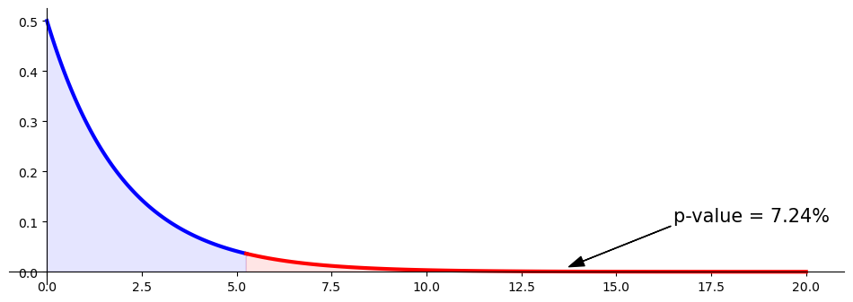
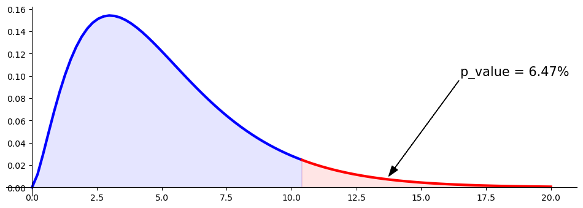

# 적합도 검정

## 개요

**적합도 검정**은 관측된 도수분포가 기대되는 분포와 얼마나 잘 맞는지를 평가하는 통계 절차로, 보통 이산형이나 범주형 자료에 쓴다. 이 검정은 여러 범주에 걸친 사건의 관측도수가 특정 이론 모형이나 가설이 예측하는 기대도수와 부합하는지를 살핀다. 관측도수와 기대도수를 비교하여 유의한 차이가 있는지 판정하며, 차이가 있다면 관측된 자료가 기대되는 패턴에 맞지 않음을 시사한다.

가장 널리 쓰이는 적합도 검정은 **카이제곱 적합도 검정**으로, 특히 범주형 자료에 효과적이다. 이 검정은 범주별 관측도수와 기대도수의 차이를 계산하고, 이를 이용해 관측된 변동이 기대 분포로부터의 이탈이라기보다 우연 때문일 가능성을 평가한다.

## 예시 상황

어떤 회사가 세 연령대(18–25세, 26–40세, 41세 이상)에 걸쳐 시장 점유율이 고르게 분포하여 고객의 3분의 1씩이 각 연령대에 속한다고 주장한다고 하자. 이 주장을 확인하기 위해 연구자가 고객 300명을 무작위로 조사하여 연령대를 기록한다. 적합도 검정으로 이 연령대별 고객 분포가 회사가 주장한 분포와 유의하게 다른지, 아니면 실제 고객 연령 분포가 회사가 말한 비율에 잘 맞는지를 판정할 수 있다.

## 가설

- **귀무가설 ($H_0$)**: 관측된 자료가 기대되는 분포를 따른다.
- **대립가설 ($H_A$)**: 관측된 자료가 기대되는 분포를 따르지 않는다.

## 도수표

적합도 검정에서는 다음을 보여주는 **도수표**를 쓴다:

1. **범주 또는 집단**: 하나의 변수에 대한 여러 범주(예: 연령대, 제품 선호 등).
2. **관측도수**: 표본자료에서 각 범주에 실제로 관측된 도수.
3. **기대도수**: 가설의 분포에 근거하여 각 범주에서 기대되는 도수(보통 범주별 비율이나 백분율로 주어진다).

예를 들어 고객이 세 연령대(18–25세, 26–40세, 41세 이상)에 고르게 분포한다는 회사의 주장에 자료가 맞는지 검정한다면 도수표는 다음과 같을 수 있다:

| 연령대 | 관측도수 | 기대도수 |
|-----------|--------------------|--------------------|
| 18–25     | 90                 | 100                |
| 26–40     | 120                | 100                |
| 41+       | 90                 | 100                |

적합도 검정은 관측도수를 기대도수와 비교하여 유의한 차이가 있는지, 즉 주장된 분포로부터의 이탈 가능성이 있는지를 본다.

## 기대도수

**기대도수**는 귀무가설이 참일 때 각 범주에서 기대되는 이론적 도수이다.

### 균등분포

모든 범주에 도수가 고르게 분포한다고 기대하면 각 범주의 기대도수는 단순히

$$
E_i = \frac{\text{Total Sample Size}}{\text{Number of Categories}}
$$

이며, 여기서 $E_i$는 각 범주의 기대도수이다.

예를 들어 고객 300명이 세 연령대에 고르게 분포한다면 각 연령대의 기대도수는

$$
E_i = \frac{300}{3} = 100
$$

이다.

### 비례분포

기대되는 분포가 균등하지 않고 특정 비율을 따르는 경우도 많다. 이때 각 범주의 기대도수는

$$
E_i = p_i \times \text{Total Sample Size}
$$

로 계산하며, $p_i$는 범주 $i$의 기대 비율이다.

예를 들어 회사가 고객의 40%는 18–25세, 30%는 26–40세, 30%는 41세 이상이라고 믿는다면, 고객 300명 표본의 기대도수는 다음과 같다:

- 18–25세: $E = 0.4 \times 300 = 120$
- 26–40세: $E = 0.3 \times 300 = 90$
- 41세 이상: $E = 0.3 \times 300 = 90$

## 검정통계량

카이제곱 적합도 검정의 검정통계량은 다음 공식으로 계산한다:

$$
\chi^2 = \sum_{i=1}^k \frac{(O_i - E_i)^2}{E_i}
$$

여기서

- $O_i$ = 범주 $i$의 관측도수
- $E_i$ = 범주 $i$의 기대도수

이다.

## 자유도

카이제곱 적합도 검정의 자유도($\text{df}$)는

$$
\text{df} = k - 1
$$

로 계산하며, $k$는 범주의 개수이다.

## 기각역

$$
\begin{array}{lll}
\text{귀무} & \text{관측된 자료가 기대되는 분포를 따른다} \\
& \text{관측도수가 기대도수에 가깝다} \\
& O_{i} \approx E_{i} \quad \Rightarrow \quad \text{통계량} \approx 0 \\
\\
\text{대립} & \text{관측된 자료가 기대되는 분포를 따르지 않는다} \\
& \text{관측도수가 기대도수와 꽤 다르다} \\
& O_{i} \not\approx E_{i} \quad \Rightarrow \quad \text{통계량} \approx \text{큰 양수}
\end{array}
$$

## 임계값과 p-값

- **임계값**: 자유도와 선택한 유의수준(예: 0.05)에 근거하여 카이제곱 분포표에서 얻는다.
- **p-값**: 검정통계량과 자유도를 써서 카이제곱 분포로부터 계산한다. 귀무가설 아래에서 계산된 값만큼 또는 그보다 극단적인 검정통계량을 관측할 확률을 나타낸다.

## 판정 규칙

- 검정통계량이 임계값을 넘거나 p-값이 유의수준보다 작으면 귀무가설을 기각한다. 관측도수가 기대도수와 유의하게 다르다는 뜻이다.
- 검정통계량이 임계값을 넘지 않거나 p-값이 유의수준보다 크면 귀무가설을 기각하지 못한다. 관측된 자료가 기대 분포에 잘 맞는다는 뜻이다.

## 가정과 한계

### 가정

1. **무작위 표집**: 표본이 대표성을 갖도록 관측값을 모집단에서 무작위로 추출해야 한다.
2. **기대도수 문턱**: 각 범주의 기대도수가 적어도 5 이상인 것이 이상적이다. 기대도수가 너무 낮으면 카이제곱 근사가 정확하지 않을 수 있다.
3. **상호배타적 범주**: 범주는 서로 배타적이어야 한다. 즉 각 관측값은 오직 한 범주에만 속해야 한다.
4. **관측의 독립성**: 각 관측값은 다른 관측값과 독립이어야 한다. 다시 말해 어떤 관측값이 한 범주에 들어간다고 해서 다른 관측값에 영향을 주어서는 안 된다.

### 한계

1. **작은 표본에 민감**: 카이제곱 적합도 검정은 대표본 근사에 의존한다. 일부 범주의 기대도수가 낮으면 검정이 타당하지 않을 수 있다. 표본이 작거나 기대도수가 낮은 경우에는 **정확검정** 같은 대안이 낫다.
2. **범주의 개수**: (특히 기대도수가 낮은 상태에서) 범주가 너무 많으면 카이제곱 근사의 정확도가 떨어져 결과를 믿기 어려울 수 있다.
3. **일차원 분석**: 적합도 검정은 하나의 변수를 가설의 분포와 비교하도록 설계되었다. 카이제곱 독립성 검정처럼 둘 이상의 변수 사이 관계를 평가하지는 못한다.
4. **근사의 한계**: 카이제곱 검정통계량은 근사이므로 기대도수가 매우 치우쳐 있거나 정규성에서 멀 때에는 정확도가 떨어질 수 있다.

이 가정들이 충족되면 적합도 검정은 타당하고 유용한 통찰을 준다. 그러나 가정이 어긋나면 결과를 신중하게 해석해야 하며 다른 방법이 더 적절할 수 있다.

---

<div class="codebox" markdown>

### 예제 1. 가위바위보 { .eg }

> **출처**: [Khan Academy — Goodness of Fit Example](https://www.khanacademy.org/math/ap-statistics/chi-square-tests/chi-square-goodness-fit/v/goodness-of-fit-example)

Kenny는 가위바위보를 자주 하는데 이기고 비기고 지는 빈도가 서로 같으리라 기대한다. 그런데 자신의 경기가 이 기대 패턴을 따르지 않는다는 의심이 들기 시작했다. 이를 조사하려고 Kenny는 24판을 무작위로 뽑아 결과를 기록했다:

|                 | 승 | 패 | 무 |
|:---------------:|:---:|:----:|:---:|
| 판 수 | 4   | 13   | 7   |

Kenny는 이 기록으로 $\chi^2$ 적합도 검정을 수행하여 자신의 결과 분포가 균등분포에서 벗어나는지 알아보려 한다. 검정통계량과 p-값은 얼마인가?

#### 풀이

**1단계: 가설 설정**

- **귀무가설** $H_0$: 결과(승, 패, 무)가 똑같이 그럴듯하다. 즉 균등분포를 따른다.
- **대립가설** $H_1$: 결과가 균등분포를 따르지 않는다.

**2단계: 관측도수와 기대도수**

| 결과  | 관측 | 기대 | $(O_i - E_i)^2 / E_i$       |
|:--------:|:--------:|:--------:|:----------------------------:|
| 승      | 4        | 8        | $(4 - 8)^2 / 8 = 2$         |
| 패     | 13       | 8        | $(13 - 8)^2 / 8 = 3.125$    |
| 무      | 7        | 8        | $(7 - 8)^2 / 8 = 0.125$     |
| $\chi^2$ |          |          | 5.25                         |

전체 판 수: 24. 결과가 고르게 분포한다면 각 결과의 기대도수는 $24 / 3 = 8$이다.

**3단계: $\chi^2$ 검정통계량 계산**

$$
\chi^2 = \frac{(4 - 8)^2}{8} + \frac{(13 - 8)^2}{8} + \frac{(7 - 8)^2}{8} = 5.25
$$

**4단계: 자유도**

$$
\text{df} = k - 1 = 3 - 1 = 2
$$

**5단계: p-값 구하기**

자유도 2인 카이제곱 분포에서 $\chi^2 = 5.25$의 p-값은 근사적으로

$$
p \approx 0.0725
$$

이다.

**결론**: p-값이 약 0.0725이므로 Kenny가 유의수준 0.05에서 검정한다면 귀무가설을 기각하지 못한다. 결과의 분포가 균등분포에서 유의하게 벗어난다는 강한 증거는 없다는 뜻이다.

#### Python 구현 (`scipy.stats.chisquare` 없이)

```python
import matplotlib.pyplot as plt
import numpy as np
import scipy.stats as stats

# 관측도수와, 고르게 나온다고 볼 때의 기대도수
observed_counts = np.array([4, 13, 7])
expected_counts = np.ones(3) * observed_counts.mean()
degrees_of_freedom = observed_counts.shape[0] - 1

# 검정통계량과 p-값 계산
chi_square_statistic = np.sum((observed_counts - expected_counts) ** 2 / expected_counts)
p_value = stats.chi2(degrees_of_freedom).sf(chi_square_statistic)

# 결과 출력
print(f"Chi-square Statistic = {chi_square_statistic:.4f}")
print(f"p-value = {p_value:.4f}\n")

# 그림 준비
fig, ax = plt.subplots(figsize=(12, 4))

# 통계량까지의 왼쪽 구간
x_left = np.linspace(0, chi_square_statistic, 100)
y_left = stats.chi2(degrees_of_freedom).pdf(x_left)
ax.plot(x_left, y_left, color='b', linewidth=3)

# 왼쪽을 칠한다. 기각하지 않는 쪽이다.
x_fill_left = np.concatenate([[0], x_left, [chi_square_statistic], [0]])
y_fill_left = np.concatenate([[0], y_left, [0], [0]])
ax.fill(x_fill_left, y_fill_left, color='b', alpha=0.1)

# 통계량 오른쪽 꼬리
x_right = np.linspace(chi_square_statistic, 20, 100)
y_right = stats.chi2(degrees_of_freedom).pdf(x_right)
ax.plot(x_right, y_right, color='r', linewidth=3)

# 오른쪽을 칠한다. 이 넓이가 곧 p-값이다.
x_fill_right = np.concatenate([[chi_square_statistic], x_right, [20], [chi_square_statistic]])
y_fill_right = np.concatenate([[0], y_right, [0], [0]])
ax.fill(x_fill_right, y_fill_right, color='r', alpha=0.1)

# 화살표로 p-값을 가리킨다
annotation_xy = ((12.5 + 15.0) / 2, 0.01)
annotation_xytext = (16.5, 0.10)
arrow_properties = dict(color='k', width=0.2, headwidth=8)
ax.annotate(f'p-value = {p_value:.02%}', annotation_xy, xytext=annotation_xytext,
            fontsize=15, arrowprops=arrow_properties)

# 축과 테두리를 다듬는다
ax.spines['right'].set_visible(False)
ax.spines['top'].set_visible(False)
ax.spines['bottom'].set_position("zero")
ax.spines['left'].set_position("zero")

plt.show()
```

출력:

```
Chi-square Statistic = 5.2500
p-value = 0.0724
```



#### Python 구현 (`scipy.stats.chisquare` 사용)

```python
from scipy import stats

# 결과별 관측도수: 승, 패, 무
observed_frequencies = [4, 13, 7]

# 세 결과가 고르게 나온다고 볼 때의 기대도수
total_games = sum(observed_frequencies)
expected_frequencies = [total_games / 3] * 3

# 카이제곱 적합도 검정
chi_square_statistic, p_value = stats.chisquare(f_obs=observed_frequencies, f_exp=expected_frequencies)

# 결과 출력
print(f"{chi_square_statistic = }")
print(f"{p_value = }")
```

출력:

```
chi_square_statistic = 5.25
p_value = 0.07243975703425146
```

수동 계산과 정확히 같다.

</div>

## 문제 B: 조작된 주사위?

<div class="probox" markdown>

**문제 1.** <span class="diff easy" title="쉬움"></span>

주사위가 하나 있다. 조작되었는지 검정하려고 60번 굴렸더니 다음 결과를 얻었다. 이 주사위가 조작되었는지 판정하라.

</div>

??? success "풀이"
    $$
    \begin{array}{crr}
     & \text{관측} & \text{기대} \\
    \text{눈} & \text{도수} & \text{도수} \\ \hline
    1 & 5 & 10 \\
    2 & 7 & 10 \\
    3 & 17 & 10 \\
    4 & 14 & 10 \\
    5 & 8 & 10 \\
    6 & 9 & 10 \\ \hline
    \text{합} & 60 & 60
    \end{array}
    $$

### 범주별로 따로 검정하면 안 되는 이유

눈 3이 60번 중 17번 나온 것을 보고 일표본 비율 z-검정을 시도할 수도 있다:

<div class="codebox" markdown>

#### 예제 2. 범주별로 따로 검정하면 안 되는 이유 { .eg }

```python
import numpy as np
import scipy.stats as stats

def main():
    p_0 = 1/6
    p_hat = 17 / 60
    n = 60

    # 눈 3 하나만 놓고 보는 일표본 비율 z-검정
    statistic = (p_hat - p_0) / np.sqrt(p_0 * (1 - p_0) / n)
    p_value = stats.norm().sf(abs(statistic)) * 2

    print(f"{statistic = :.02f}")
    print(f"{p_value   = :.02%}")

if __name__ == "__main__":
    main()
```

출력:

```
statistic = 2.42
p_value   = 1.53%
```

이것이 주사위가 조작되었다는 충분한 증거일까?

성급하다. 각 행에 대해 비슷한 검정을 할 수 있고, 행이 많으면 언젠가는 아주 작은 p-값을 보게 된다. 러시안 룰렛과 같아서, 계속하다 보면 주사위가 공정하더라도 조만간 아주 작은 p-값을 만나게 된다. 따라서 한 범주만 보는 검정으로 주사위가 조작되었다고 결론지을 수 없다. **모든 범주를 동시에** 고려하는 검정이 필요하다.

</div>

### 가설

$$
\begin{array}{lll}
\text{귀무} & \text{주사위는 조작되지 않았다} \\
\\
\text{대립} & \text{주사위는 조작되었다}
\end{array}
$$

### 검정통계량

<div class="codebox" markdown>

#### 예제 3. 적합도 검정통계량 { .eg }

```python
import numpy as np

def main():
    observed = np.array([5, 7, 17, 14, 8, 9])
    expected = np.array([10] * 6)
    # 여섯 눈의 어긋남을 **한 숫자로 모은다**.
    # 눈 하나만 보던 앞의 검정과 여기서 갈린다.
    statistic = np.sum((observed - expected)**2 / expected)
    print(f'{statistic = }')

if __name__ == "__main__":
    main()
```

출력:

```
statistic = 10.4
```

</div>

### 기각역

$$
\begin{array}{lll}
\text{귀무} & \text{주사위는 조작되지 않았다} \\
& \text{관측도수가 기대도수에 가깝다} \\
& O_i \approx E_i \quad \Rightarrow \quad \text{통계량} \approx 0 \\
\\
\text{대립} & \text{주사위는 조작되었다} \\
& \text{관측도수가 기대도수와 꽤 다르다} \\
& O_i \not\approx E_i \quad \Rightarrow \quad \text{통계량} \approx \text{큰 양수}
\end{array}
$$

### 표본분포

$$
\sum_{i=1}^k \frac{(O_i - E_i)^2}{E_i}
= \sum_{i=1}^k \left(\frac{\left(\sum_{j=1}^{n} X_j\right) - np_i}{\sqrt{np_i}}\right)^2
\approx \sum_{i=1}^k Z_i^2
= \chi^2_{k-1}
$$

이 주사위 예에서는

$$
\sum_{i=1}^6 \frac{(O_i - E_i)^2}{E_i} \approx \chi^2_5
$$

이다.

### 검정 조건 (경험 법칙)

$\chi^2$ 근사는 모든 기대도수가 5 이상일 때 좋다. 이 주사위 예에서는 기대도수가 모두 10이므로 조건을 만족한다. 따라서 $\chi^2$ 근사가 합당하다.

### p-값

$$
\text{p-value} = P\left(\sum_{i=1}^k \frac{(O_i - E_i)^2}{E_i} \ge \text{statistic} \;\middle|\; H_0\right)
$$

### 결론

$$\text{주사위는 조작되지 않았다.}$$

### Python 구현 (`scipy.stats.chisquare` 없이)

<div class="codebox" markdown>

#### 예제 4. 정의대로 계산한 적합도 검정 { .eg }

```python
import matplotlib.pyplot as plt
import numpy as np
import scipy.stats as stats

def main():
    """적합도 검정통계량을 정의대로 구하고 p-값을 그림으로 보인다."""
    # 주사위를 60번 굴린 결과라고 하자. 고른 주사위라면 눈마다 10번씩 나온다.
    observed = np.array([5, 7, 17, 14, 8, 9])
    expected = np.array([10] * 6)

    # 자유도는 범주 수에서 1을 뺀다. 도수의 합이 60으로 묶여 있어
    # 다섯 칸을 알면 나머지 한 칸이 자동으로 정해지기 때문이다.
    df = observed.shape[0] - 1

    statistic = np.sum((observed - expected)**2 / expected)
    p_value = stats.chi2(df).sf(statistic)
    print(f"{statistic = :.02f}")
    print(f"{p_value    = :.02%}")

    # 파랑은 통계량보다 작은 쪽, 빨강은 그보다 큰 쪽이다.
    # 적합도 검정은 언제나 우측검정이므로 빨간 넓이가 곧 p-값이다.
    _, ax = plt.subplots(figsize=(12, 4))

    x = np.linspace(0, statistic)
    y = stats.chi2(df).pdf(x)
    ax.plot(x, y, color='b', linewidth=3)

    x = np.concatenate([[0], x, [statistic], [0]])
    y = np.concatenate([[0], y, [0], [0]])
    ax.fill(x, y, color='b', alpha=0.1)

    x = np.linspace(statistic, 20, 100)
    y = stats.chi2(df).pdf(x)
    ax.plot(x, y, color='r', linewidth=3)

    x = np.concatenate([[statistic], x, [20], [statistic]])
    y = np.concatenate([[0], y, [0], [0]])
    ax.fill(x, y, color='r', alpha=0.1)

    xy = ((12.5 + 15.0) / 2, 0.01)
    xytext = (16.5, 0.10)
    arrowprops = dict(color='k', width=0.2, headwidth=8)
    ax.annotate(f'{p_value = :.02%}', xy, xytext=xytext, fontsize=15, arrowprops=arrowprops)

    ax.spines['right'].set_visible(False)
    ax.spines['top'].set_visible(False)
    ax.spines['bottom'].set_position("zero")
    ax.spines['left'].set_position("zero")

    plt.show()

if __name__ == "__main__":
    main()
```

출력:

```
statistic = 10.40
p_value    = 6.47%
```



$p = 0.0647$로 5% 수준에서 기각하지 못한다. 눈 3만 따로 보았을 때의 $p = 0.0153$과 대조된다. 눈 하나를 골라 검정하면 유의하고, 여섯 눈을 함께 보면 유의하지 않다.

어느 쪽이 옳은가? 여섯 눈을 함께 보는 쪽이다. "눈 3이 많이 나왔다"는 것은 자료를 보고 고른 사실이며, 그 고르는 행위가 이미 여섯 번의 검정을 한 것과 같기 때문이다. 앞 장의 p-해킹과 같은 문제다.

</div>

### Python 구현 (`scipy.stats.chisquare` 사용)

<div class="codebox" markdown>

#### 예제 5. scipy로 계산한 적합도 검정 { .eg }

```python
import matplotlib.pyplot as plt
import numpy as np
import scipy.stats as stats

def main():
    """앞의 손계산을 scipy 한 줄로 대신한다. 값이 같아야 한다."""
    observed = np.array([5, 7, 17, 14, 8, 9])
    expected = np.array([10] * 6)
    df = observed.shape[0] - 1

    # chisquare 는 통계량과 p-값을 한꺼번에 돌려준다. 자유도는 알아서 정한다.
    statistic, p_value = stats.chisquare(observed, f_exp=expected)
    print(f"{statistic = :.02f}")
    print(f"{p_value    = :.02%}")

    _, ax = plt.subplots(figsize=(12, 4))

    x = np.linspace(0, statistic)
    y = stats.chi2(df).pdf(x)
    ax.plot(x, y, color='b', linewidth=3)

    x = np.concatenate([[0], x, [statistic], [0]])
    y = np.concatenate([[0], y, [0], [0]])
    ax.fill(x, y, color='b', alpha=0.1)

    x = np.linspace(statistic, 20, 100)
    y = stats.chi2(df).pdf(x)
    ax.plot(x, y, color='r', linewidth=3)

    x = np.concatenate([[statistic], x, [20], [statistic]])
    y = np.concatenate([[0], y, [0], [0]])
    ax.fill(x, y, color='r', alpha=0.1)

    xy = ((12.5 + 15.0) / 2, 0.01)
    xytext = (16.5, 0.10)
    arrowprops = dict(color='k', width=0.2, headwidth=8)
    ax.annotate(f'{p_value = :.02%}', xy, xytext=xytext, fontsize=15, arrowprops=arrowprops)

    ax.spines['right'].set_visible(False)
    ax.spines['top'].set_visible(False)
    ax.spines['bottom'].set_position("zero")
    ax.spines['left'].set_position("zero")

    plt.show()

if __name__ == "__main__":
    main()
```

출력:

```
statistic = 10.40
p_value    = 6.47%
```


`chisquare`가 수동 계산과 같은 값을 준다.

</div>

## 연습문제

<div class="drillbox" markdown>

**연습문제 1.** <span class="diff easy" title="쉬움"></span>
정규성에 대한 적합도 검정, 구간 4개. 관측 $[10, 30, 50, 10]$, 기대 $[20, 25, 40, 15]$. $\alpha = 0.05$에서 검정하라.

</div>

??? success "풀이"
    조건: 독립성 ✓, 모든 $E_i \ge 5$ ✓.

    $H_0$: 정규분포를 따른다. $H_1$: 따르지 않는다.

    $\chi^2 = (10-20)^2/20 + (30-25)^2/25 + (50-40)^2/40 + (10-15)^2/15$
    $= 5.0 + 1.0 + 2.5 + 1.67 = 10.17$.

    df $= 4 - 1 = 3$ ($\mu, \sigma$가 주어졌다고 가정. 자료에서 추정했다면 그만큼 더 뺀다).

    임계값 $\chi^2_{3, 0.05} = 7.815$. $10.17 > 7.815$이므로 **기각한다**. 자료가 정규 모형에 잘 맞지 않는다.

<div class="drillbox" markdown>

**연습문제 2.** <span class="diff med" title="중간"></span>
**추정한 모수에 대한 자유도 조정.** 모수를 자료에서 추정하면 왜 자유도가 줄어드는가?

</div>

??? success "풀이"
    귀무분포를 완전히 지정하면(예: "$\{1, \ldots, 6\}$ 위의 균등분포") df = (칸 수) − 1이다.

    자료에서 모수 $k$개를 추정하면(예: $\mu, \sigma$를 추정하여 정규분포를 적합하면) df = (칸 수) − 1 − $k$이다.

    연습문제 1에서 $\mu, \sigma$를 자료로부터 추정했다면 df $= 4 - 1 - 2 = 1$이고 임계값도 달라진다.

    **이유:** 모수를 추정하면 정보를 "써버린다". 적합된 분포는 참 분포보다 자료에 더 가까워지므로 검정이 이를 보정해야 한다.

<div class="drillbox" markdown>

**연습문제 3.** <span class="diff easy" title="쉬움"></span>
**공정한 주사위 검정.** 60번 굴려 $(8, 12, 9, 11, 10, 10)$을 얻었다. 공정한지 검정하라.

</div>

??? success "풀이"
    $H_0$: 각 눈에 대해 $p_i = 1/6$. 기대도수는 각각 10.

    $\chi^2 = (8-10)^2/10 + (12-10)^2/10 + (9-10)^2/10 + (11-10)^2/10 + (10-10)^2/10 + (10-10)^2/10$
    $= 0.4 + 0.4 + 0.1 + 0.1 + 0 + 0 = 1.0$.

    df $= 5$. 임계값 $\chi^2_{5, 0.05} = 11.07$. $1.0 \ll 11.07$이므로 **기각하지 못한다**. 불공정하다는 증거가 없다.

<div class="drillbox" markdown>

**연습문제 4.** <span class="diff med" title="중간"></span>
**표본크기의 효과.** 연습문제 3을 $n = 6000$, 관측 $(800, 1200, 900, 1100, 1000, 1000)$으로 반복하라. 모양은 같고 규모만 100배이다.

</div>

??? success "풀이"
    기대도수는 각각 1000이다.

    $\chi^2 = 200^2/1000 + 200^2/1000 + 100^2/1000 + 100^2/1000 + 0 + 0$
    $= 40 + 40 + 10 + 10 = 100$.

    $\chi^2 = 100 \gg 11.07$이므로 **압도적으로 기각한다**.

    이탈의 모양은 같지만 표본크기가 100배가 되면서 편차가 명확히 유의해졌다. p-값은 극도로 작다.

    **교훈:** 통계적 유의성은 $n$과 함께 커진다. 같은 효과크기라도 $n$이 크면 더 잘 탐지된다. p-값만이 아니라 효과크기를 항상 함께 확인하라.

<div class="drillbox" markdown>

**연습문제 5.** <span class="diff med" title="중간"></span>
카이제곱 적합도 검정의 대안으로서 **Kolmogorov-Smirnov 검정**. 언제 쓰는가?

</div>

??? success "풀이"
    K-S 검정은 경험적 누적분포함수 $\hat F_n$을 이론적 누적분포함수 $F_0$와 $D_n = \sup_x |\hat F_n(x) - F_0(x)|$로 비교한다.

    **장점:**

    - 구간화가 필요 없다(원자료 그대로 연속형에 적용).
    - 표본크기가 중간 정도일 때 $\chi^2$보다 모양의 차이에 민감하다.

    **단점:**

    - $F_0$가 완전히 지정되어야 한다(모수를 추정하면 안 된다). Lilliefors 변형이 모수를 추정한 정규성 검정에 맞게 조정해 준다.
    - 이산분포에는 제한적이다.

    귀무분포가 완전히 지정된 연속형 자료에는 K-S를, 범주형/구간화된 자료이거나 모수를 추정한 경우에는 $\chi^2$를 쓴다.

<div class="drillbox" markdown>

**연습문제 6.** <span class="diff med" title="중간"></span>
정규성 검정을 위한 **Shapiro-Wilk 검정**. 정규성 검정에서 카이제곱보다 선호되는 이유는?

</div>

??? success "풀이"
    Shapiro-Wilk는 정규성을 검정하도록 특별히 설계되었고 대부분의 대립가설에 대해 카이제곱이나 K-S보다 검정력이 높다.

    검정통계량: $W = (\sum a_i x_{(i)})^2/\sum (x_i - \bar x)^2$, 여기서 $a_i$는 $n$에 의존하는 상수이다.

    정규성 아래에서 $W$는 1에 가깝고, 이탈이 있으면 $W$가 작아진다.

    **정규성에 대한 카이제곱 적합도 검정 대비 장점:**

    - 구간화가 없다(원자료를 쓴다).
    - 정규성으로부터의 이탈을 탐지하도록 맞춤 설계되었다.
    - 작은 표본(10–50)에서도 작동한다.

    **주의:**

    - 표본이 아주 크면(> 5000) Shapiro-Wilk가 지나치게 민감해져 사소한 이탈까지 탐지한다.
    - 표본이 아주 작으면(< 10) 검정력이 낮다.

    `scipy.stats.shapiro`로 쓸 수 있다. 많은 소프트웨어에서 기본 정규성 검정으로 쓰인다.

<div class="drillbox" markdown>

**연습문제 7.** <span class="diff med" title="중간"></span>
실제 자료에 **포아송 모형의 적합도**를 검정하는 전체 흐름을 수행하라. 보르트키에비치의 프로이센 기병 낙마 사망 자료를 쓴다.

</div>

??? success "풀이"
    **자료.** 프로이센 군단 20개를 10년간 관찰해 얻은 연간 낙마 사망자 수 200건이다.

    | 사망자 수 | 0 | 1 | 2 | 3 | 4 |
    |---|---|---|---|---|---|
    | 군단·연도 수 | 109 | 65 | 22 | 3 | 1 |

    ```python
    import numpy as np
    from scipy import stats

    obs = np.array([109, 65, 22, 3, 1])
    k = np.arange(5)
    n = obs.sum()
    lam = (obs * k).sum() / n                 # ① 모수를 자료에서 추정
    print(f"n = {n},  λ̂ = {lam:.4f}\n")

    p = stats.poisson.pmf(np.arange(4), lam)  # ② 기대도수 (마지막은 4 이상)
    p = np.r_[p, 1 - p.sum()]
    exp = n * p
    print("범주        0       1       2       3      4+")
    print(f"관측  {obs[0]:7d} {obs[1]:7d} {obs[2]:7d} {obs[3]:7d} {obs[4]:7d}")
    print("기대  " + " ".join(f"{v:7.3f}" for v in exp))

    chi2 = ((obs - exp)**2 / exp).sum()
    print(f"\n병합 전:  χ² = {chi2:.4f},  E_min = {exp.min():.3f}  ← 5 미만")
    for df in [len(obs) - 1, len(obs) - 2]:
        print(f"   df={df} 이면 p = {stats.chi2.sf(chi2, df):.4f}")

    # ③ 기대도수가 작은 꼬리를 병합한다
    obs2 = np.r_[obs[:3], obs[3:].sum()]
    p2 = stats.poisson.pmf(np.arange(3), lam)
    p2 = np.r_[p2, 1 - p2.sum()]
    exp2 = n * p2
    chi2b = ((obs2 - exp2)**2 / exp2).sum()
    df2 = len(obs2) - 1 - 1                   # 범주 4개, λ 하나 추정
    print(f"\n병합 후 (0, 1, 2, 3+)")
    print(f"  관측 {obs2.tolist()},  기대 {np.round(exp2, 3).tolist()}")
    print(f"  χ² = {chi2b:.4f},  E_min = {exp2.min():.3f},  df = {df2},  "
          f"p = {stats.chi2.sf(chi2b, df2):.4f}")
    print(f"  표준화 잔차 {np.round((obs2 - exp2) / np.sqrt(exp2), 3).tolist()}")
    ```

    ```text
    n = 200,  λ̂ = 0.6100

    범주        0       1       2       3      4+
    관측      109      65      22       3       1
    기대  108.670  66.289  20.218   4.111   0.712

    병합 전:  χ² = 0.5999,  E_min = 0.712  ← 5 미만
       df=4 이면 p = 0.9631
       df=3 이면 p = 0.8964

    병합 후 (0, 1, 2, 3+)
      관측 [109, 65, 22, 4],  기대 [108.67, 66.289, 20.218, 4.823]
      χ² = 0.3235,  E_min = 4.823,  df = 2,  p = 0.8506
      표준화 잔차 [0.032, -0.158, 0.396, -0.375]
    ```

    **네 단계가 모두 필요하다.**

    | 단계 | 내용 | 빠뜨리면 |
    |---|---|---|
    | ① $\lambda$ 추정 | $\hat\lambda=\bar x=0.61$ | 모형을 적합할 수 없다 |
    | ② 기대도수 | 마지막 범주는 "이상" | 확률의 합이 1이 안 된다 |
    | ③ **꼬리 병합** | $E_{\min}=0.71\to4.82$ | 근사가 불안정 |
    | ④ **자유도 조정** | $k-1-1=2$ | $p$ 값이 부풀려진다 |

    **적합이 매우 좋다**($p=0.85$). 표준화 잔차가 모두 $|0.4|$ 이하로, 어느 범주도 튀지 않는다.

    **이것이 이 자료가 유명한 이유**다. "기병이 말에 차여 죽는" 것처럼 드물고 독립적인 사건이 포아송 분포를 훌륭하게 따른다는 고전적 예시다.

    **그러나 결론을 정확히 말해야 한다.** $p=0.85$는 **"포아송 모형이 맞다"의 증거가 아니다.** 자료가 포아송과 **모순되지 않는다**는 뜻일 뿐이다. $n=200$, df=2로는 검정력이 높지 않다.

    **주의 셋.**

    1. **병합 방식을 자료를 보고 정하지 않는다.** "기대도수가 5 미만이면 위쪽과 합친다"를 **미리** 정해 두어야 한다.
    2. **자유도를 빠뜨리는 실수가 흔하다.** 위에서 $\lambda$를 추정했으므로 df는 3이 아니라 2다.
    3. **$E_{\min}=4.82$는 여전히 5에 못 미친다.** 하나만 살짝 낮으므로 실무적으로 받아들이지만, 엄밀하려면 다음 문제의 정확검정을 쓴다.

<div class="drillbox" markdown>

**연습문제 8.** <span class="diff hard" title="어려움"></span>
범주가 적고 표본이 작을 때 쓸 수 있는 **다항 정확검정**을 구현하고, 카이제곱 근사와 비교하라.

</div>

??? success "풀이"
    **원리.** 가능한 모든 도수 벡터를 열거하고, $H_0$ 아래의 다항 확률로 "관측만큼 또는 그보다 극단적인" 표의 확률을 더한다.

    $$
    p=\sum_{\mathbf{c}\,:\,X^2(\mathbf c)\ge X^2_{\text{obs}}}
    \frac{n!}{c_1!\cdots c_k!}\,p_1^{c_1}\cdots p_k^{c_k}
    $$

    ```python
    import numpy as np
    from math import lgamma
    from scipy import stats

    def multinomial_exact(obs, p):
        """모든 도수 벡터를 열거하는 다항 정확검정. k 와 n 이 작을 때만 쓴다."""
        obs = np.asarray(obs, float)
        p = np.asarray(p, float)
        n, k = int(obs.sum()), len(p)
        exp = n * p
        t_obs = ((obs - exp)**2 / exp).sum()
        log_n_fact = lgamma(n + 1)
        total = 0.0

        def walk(i, left, counts, log_p):
            nonlocal total
            if i == k - 1:
                c = np.array(counts + [left], float)
                lp = log_p + left * np.log(p[i]) - lgamma(left + 1)
                if ((c - exp)**2 / exp).sum() >= t_obs - 1e-9:
                    total += np.exp(log_n_fact + lp)
                return
            for x in range(left + 1):
                walk(i + 1, left - x, counts + [x],
                     log_p + x * np.log(p[i]) - lgamma(x + 1))

        walk(0, n, [], 0.0)
        return t_obs, total

    cases = [(np.array([2, 3, 7]), [1 / 3] * 3),
             (np.array([0, 4, 8]), [1 / 3] * 3),
             (np.array([5, 5, 2, 0]), [0.25] * 4),
             (np.array([9, 6, 3, 2]), [0.4, 0.3, 0.2, 0.1])]
    for obs, p in cases:
        t, p_exact = multinomial_exact(obs, p)
        p_approx = stats.chi2.sf(t, len(p) - 1)
        print(f"관측 {str(obs.tolist()):>14s}  χ² = {t:6.4f}   "
              f"정확 p = {p_exact:.4f}   근사 p = {p_approx:.4f}")
    ```

    ```text
    관측      [2, 3, 7]  χ² = 3.5000   정확 p = 0.2672   근사 p = 0.1738
    관측      [0, 4, 8]  χ² = 8.0000   정확 p = 0.0172   근사 p = 0.0183
    관측   [5, 5, 2, 0]  χ² = 6.0000   정확 p = 0.1300   근사 p = 0.1116
    관측   [9, 6, 3, 2]  χ² = 0.3750   정확 p = 0.9634   근사 p = 0.9454
    ```

    **근사가 정확값보다 작게 나오는 경향이 있다.** 네 경우 중 셋에서 근사 $p$가 더 작다. 즉 **카이제곱 근사가 약간 과대기각하는 쪽**이다.

    **차이가 가장 큰 첫 경우.** $n=12$, 3범주에서 정확 0.267 대 근사 0.174다. **$p$가 50% 넘게 차이난다.** 다만 이 경우 어느 쪽으로도 기각하지 않으므로 결론은 같다.

    **둘째 경우는 근사가 훌륭하다**(0.0172 대 0.0183). $\chi^2$이 클 때는 근사가 잘 맞는다.

    **왜 $\chi^2$이 작을 때 근사가 나쁜가.** 다항분포가 이산이므로 $X^2$이 취할 수 있는 값이 **띄엄띄엄**한데, 작은 값 근처에 그 점들이 몰려 있다. 연속분포로 근사하면 이 덩어리를 매끄럽게 펴 버린다.

    **계산 비용.** 가능한 도수 벡터가 $\binom{n+k-1}{k-1}$개다.

    | $n$ | $k$ | 벡터 수 |
    |---|---|---|
    | 12 | 3 | 91 |
    | 20 | 4 | 1,771 |
    | 50 | 5 | 316,251 |
    | 100 | 6 | 96,560,646 |

    **$n$이나 $k$가 조금만 커져도 폭발한다.** 그래서 실무에서는

    1. **몬테카를로**로 근사한다. $H_0$에서 다항 표본을 많이 뽑아 비율을 센다.
    2. **$n$이 크면 카이제곱 근사**로 충분하다.

    **이 구현이 유용한 지점.** $n\le30$, $k\le4$ 정도의 작은 문제에서 **카이제곱 근사가 얼마나 믿을 만한지 확인**하는 용도다. 교육적으로도 "정확검정이란 무엇인가"를 가장 직접적으로 보여 준다.

<div class="drillbox" markdown>

**연습문제 9.** <span class="diff hard" title="어려움"></span>
적합도 검정은 대개 **"모형이 맞다"를 보이려는** 목적으로 쓰인다. 이 구조의 논리적 문제를 지적하고, 대안을 제시하라.

</div>

??? success "풀이"
    **문제의 구조.** 보통의 가설검정은 $H_1$을 주장하려고 $H_0$를 기각한다. 그런데 적합도 검정에서는

    $$
    H_0:\ \text{모형이 맞다}
    $$

    를 **기각하지 못하는 것**을 근거로 모형을 받아들인다. **증명하고 싶은 것을 $H_0$에 둔 셈**이다.

    **결과적으로 두 가지 역설이 생긴다.**

    | 표본 | 결과 |
    |---|---|
    | 작으면 | 검정력이 낮아 **무엇이든 통과**한다 |
    | 크면 | 사소한 이탈도 잡아 **무엇이든 기각**된다 |

    ```python
    import numpy as np
    from scipy import stats
    from scipy.optimize import brentq

    def w_upper(chi2, df, n, alpha=0.05):
        """효과크기 w 의 단측 95% 상한 (비중심 카이제곱 반전)."""
        if stats.ncx2.cdf(chi2, df, 0.0) <= alpha:
            return 0.0
        lam = brentq(lambda l: stats.ncx2.cdf(chi2, df, l) - alpha, 0.0, 1e7)
        return np.sqrt(lam / n)

    shape = np.array([8, 12, 9, 11, 10, 10]) / 60     # 이탈의 모양을 고정
    p0, df = np.ones(6) / 6, 5
    print(f"{'n':>7s} {'χ²':>10s} {'p':>9s} {'ŵ':>8s} {'w 의 95% 상한':>15s}")
    for n in [60, 600, 6_000, 60_000]:
        obs = n * shape
        exp = n * p0
        chi2 = ((obs - exp)**2 / exp).sum()
        print(f"{n:7d} {chi2:10.4f} {stats.chi2.sf(chi2, df):9.4f} "
              f"{np.sqrt(chi2 / n):8.4f} {w_upper(chi2, df, n):15.4f}")
    ```

    ```text
          n         χ²         p        ŵ      w 의 95% 상한
         60     1.0000    0.9626   0.1291          0.0000
        600    10.0000    0.0752   0.1291          0.1738
       6000   100.0000    0.0000   0.1291          0.1479
      60000  1000.0000    0.0000   0.1291          0.1356
    ```

    **이탈의 모양은 네 줄 모두 똑같다**($\hat w=0.1291$). 그런데 $p$ 값은 0.96에서 $10^{-200}$까지 움직인다.

    **$p$ 값은 "모형이 맞는가"가 아니라 "그것을 판단할 자료가 얼마나 많은가"를 반영한다.**

    **대안 ① — 효과크기의 상한을 본다.** 마지막 열이 답이다. $n=600$에서 상한이 0.174라 "이탈이 0.17보다 크지는 않다"고 말할 수 있고, $n=60000$에서는 0.136으로 더 조인다. **$p$와 달리 $n$이 커질수록 유용해진다.**

    **대안 ② — 동등성 검정.** "실질적으로 무시할 만한 이탈"의 문턱 $w_0$를 미리 정하고

    $$
    H_0:\ w\ge w_0 \quad\text{대}\quad H_1:\ w<w_0
    $$

    을 검정한다. 기각하면 **"모형이 실용적으로 충분하다"를 적극적으로 주장**할 수 있다. 위 표에서 $w_0=0.20$이면 $n=600$부터 상한 0.174가 이미 0.20 아래이므로 동등성이 인정된다.

    **$n=60$의 상한이 0.0000인 것**은 경계 사례다. $\chi^2=1.0$이 자유도 5의 **아래쪽 꼬리 3.7%**에 들어가, 적합이 오히려 "너무 좋은" 영역이다. 이럴 때 단측 상한은 0으로 붕괴한다.

    **대안 ③ — 모형 선택으로 바꾼다.** "맞다/틀리다"가 아니라 **"어느 모형이 더 나은가"**를 묻는다. AIC, BIC, 교차검증이 이 틀이다. 여러 후보를 견주는 것이 하나를 검정하는 것보다 대개 유익하다.

    **대안 ④ — 그림을 본다.** 분위수-분위수 그림, 잔차 그림, 관측과 기대를 겹친 막대그림이 $p$ 값 하나보다 훨씬 많은 것을 알려준다.

    **권고 요약.**

    | 목적 | 방법 |
    |---|---|
    | "모형과 모순되지 않음"을 확인 | 적합도 검정(약한 근거) |
    | **"모형이 실용적으로 충분함"을 주장** | **동등성 검정 / $w$의 상한** |
    | 여러 모형 중 고르기 | 정보기준, 교차검증 |
    | 어디가 안 맞는지 찾기 | **잔차와 그림** |

    **한 문장.** 적합도 검정에서 $p>0.05$는 **모형을 지지하는 증거가 아니라, 반증에 실패했다는 기록**일 뿐이다.

<div class="drillbox" markdown>

**연습문제 10.** <span class="diff easy" title="쉬움"></span>
적합도 검정의 **전체 절차와 대안 선택**을 한 장으로 정리하라.

</div>

??? success "풀이"

    **절차.**

    ```text
    ① 자료의 형태를 본다
        ├─ 범주형 (도수) ──────────→ 카이제곱 적합도
        └─ 연속형 ────────────────→ 구간화하지 말고 전용 검정
                                     (KS, 앤더슨·달링, 샤피로·윌크)
              ↓
    ② 귀무분포를 정한다
        ├─ 모수가 완전히 주어짐 ──→ df = k - 1
        └─ 모수를 추정 ──────────→ df = k - 1 - r
                                     ※ 원자료 추정이면 근사일 뿐
              ↓
    ③ 기대도수를 계산하고 확인한다
        └─ 작은 칸은 사전에 정한 규칙대로 병합
              ↓
    ④ 검정 + 잔차 + 효과크기
              ↓
    ⑤ 해석: "기각 못 함"은 "맞음"이 아니다
    ```

    **연속형 자료의 정규성 검정 비교.**

    | 검정 | 민감한 곳 | 비고 |
    |---|---|---|
    | 카이제곱 | 전반 | **구간화 때문에 정보 손실. 권하지 않음** |
    | 콜모고로프·스미르노프 | 분포의 중앙 | 모수를 추정하면 릴리포스 보정 필요 |
    | **앤더슨·달링** | **꼬리** | 정규성 검정으로 강력 |
    | **샤피로·윌크** | 전반 | $n<50$에서 특히 강력 |
    | 자르크·베라 | 왜도·첨도 | 대표본에 적합 |

    **범주형 자료의 적합도 검정 선택.**

    | 조건 | 방법 |
    |---|---|
    | 기대도수 충분 | 피어슨 $X^2$ |
    | 소표본, $k$ 작음 | **다항 정확검정**(연습문제 8) |
    | 소표본, $k$ 큼 | 몬테카를로 |
    | 모형 비교가 목적 | $G^2$, AIC |
    | "충분히 맞음"을 주장 | **동등성 검정**(연습문제 9) |

    **점검 목록.**

    - [ ] 관측이 **독립**인가
    - [ ] **도수**를 넣었는가(백분율이 아니라)
    - [ ] 범주가 상호배타적이고 빠짐없는가
    - [ ] 모수를 추정했다면 **자유도를 줄였는가**
    - [ ] 병합 규칙을 **자료를 보기 전에** 정했는가
    - [ ] 기대도수의 최솟값을 보고했는가
    - [ ] **잔차**를 확인했는가
    - [ ] "기각 못 함"을 "모형이 맞음"으로 쓰지 않았는가

    **가장 흔한 세 가지 실수.**

    1. **연속형 자료를 구간화해 카이제곱을 쓴다.** 구간 경계를 어떻게 잡느냐에 결과가 좌우되고, 전용 검정보다 훨씬 약하다.
    2. **모수를 추정하고도 $k-1$을 쓴다.** $p$ 값이 체계적으로 커져 모형을 통과시킨다.
    3. **$p>0.05$를 모형의 근거로 삼는다.** 표본이 작았을 뿐일 수 있다.

    **마지막으로.** 적합도 검정의 가장 큰 가치는 $p$ 값이 아니라 **관측과 기대를 나란히 놓고 보는 표**에 있다. 어느 범주가 왜 어긋났는지를 묻는 순간, 검정은 판정 도구에서 **탐색 도구**로 바뀐다.

---

## 정리하며

적합도 검정은 **하나의 범주형 변수**가 기대 분포에 맞는지 본다.

$$
X^2=\sum_j\frac{(O_j-E_j)^2}{E_j}\;\sim\;\chi^2_{k-1}\quad(H_0\text{ 아래})
$$

- **$H_0$ 이 분포 전체를 지정한다.** "고르게 3분의 1씩"처럼 각 범주의 확률을 모두 적어야 기대도수를 만들 수 있다.
- **$E_j=np_j$ 로 기대도수를 만든다.** 관측도수와 같은 척도가 되며, 합은 언제나 $n$ 이다.
- **어느 방향으로 어긋나든 통계량이 커진다.** 그래서 오른쪽 꼬리만 보며, "어느 범주가 문제인가"는 검정이 답하지 않는다. **잔차를 따로 살펴야 한다.**
- **기각은 "맞지 않는다"까지만 말한다.** 어떻게 다른지는 칸별 기여도 $(O_j-E_j)^2/E_j$ 를 비교해 읽는다.
- **$n$ 이 크면 사소한 이탈도 기각된다.** 실질적 차이를 보려면 다음의 효과크기가 필요하다.

다음 절 **독립성 검정**으로 넘어간다. 변수가 둘이 되면 기대도수를 만드는 방식이 달라진다.
