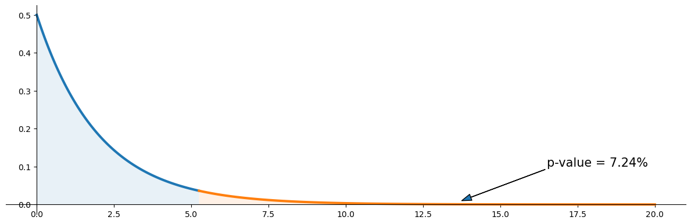

# 카이제곱 적합도 검정 (수동)

## 개요

이 페이지에서는 편의 함수 `scipy.stats.chisquare`에 의존하지 않고 NumPy와 SciPy로 카이제곱 적합도 검정통계량과 p-값을 **직접** 계산하는 방법을 보인다. 예제는 세 결과가 똑같이 그럴듯한 가위바위보 자료를 쓴다. p-값에 해당하는 꼬리 확률을 강조한 카이제곱 분포 시각화도 포함한다.

## 가설

- **귀무가설** ($H_0$): 결과가 모든 범주에 걸쳐 균등(같은) 분포를 따른다.
- **대립가설** ($H_A$): 결과가 균등분포를 따르지 않는다.

## 검정통계량

범주가 $k$개이고 관측도수가 $O_i$, 기대도수가 $E_i$일 때 카이제곱 통계량은

$$
\chi^2 = \sum_{i=1}^{k} \frac{(O_i - E_i)^2}{E_i}
$$

이다. 모든 기대도수가 적어도 5 이상이면 $H_0$ 아래에서 이 통계량은 근사적으로 자유도

$$
\text{df} = k - 1
$$

인 $\chi^2$ 분포를 따른다.

## 코드

아래 스크립트는 통계량을 처음부터 계산하고 기각역을 색칠한 $\chi^2$ 밀도를 그린다.

```python
import matplotlib.pyplot as plt
import numpy as np
import scipy.stats as stats

observed_counts = np.array([4, 13, 7])
# H0가 균등분포이므로 기대도수는 모두 n/k, 즉 관측도수의 평균과 같다.
expected_counts = np.ones(3) * observed_counts.mean()
degrees_of_freedom = observed_counts.shape[0] - 1   # 총합이 고정이라 하나를 잃는다

# 분모가 관측도수가 아니라 **기대도수**인 것에 주의하라.
# H0 아래에서 각 칸 도수의 분산이 근사적으로 E_i이기 때문이다(연습문제 4).
chi_square_statistic = np.sum(
    (observed_counts - expected_counts) ** 2 / expected_counts
)
# 카이제곱 적합도 검정은 언제나 우측검정이므로 sf(위쪽 꼬리)를 쓴다.
p_value = stats.chi2(degrees_of_freedom).sf(chi_square_statistic)

print(f"Chi-square Statistic = {chi_square_statistic:.4f}")
print(f"p-value = {p_value:.4f}")
```

출력:

```
Chi-square Statistic = 5.2500
p-value = 0.0724
```

기대도수가 모두 8로 5를 넘으므로 카이제곱 근사를 써도 되는 상황이다.

**단계별 설명:**

1. **관측도수**를 NumPy 배열 $[4,\;13,\;7]$로 저장한다.
2. $H_0$ 아래의 **기대도수**는 각각 $24 / 3 = 8$이다.
3. **검정통계량**을 성분별로 계산한다:

$$
\chi^2 = \frac{(4-8)^2}{8} + \frac{(13-8)^2}{8} + \frac{(7-8)^2}{8} = 2 + 3.125 + 0.125 = 5.25
$$

4. **p-값**은 $\chi^2(2)$ 분포의 생존함수(위쪽 꼬리 확률)를 $5.25$에서 평가한 값이다.

### 시각화

```python
fig, ax = plt.subplots(figsize=(12, 4))

# Left portion of the chi-square pdf (non-rejection region)
x_left = np.linspace(0, chi_square_statistic, 100)
y_left = stats.chi2(degrees_of_freedom).pdf(x_left)
ax.plot(x_left, y_left, linewidth=3)
x_fill_left = np.concatenate([[0], x_left, [chi_square_statistic], [0]])
y_fill_left = np.concatenate([[0], y_left, [0], [0]])
ax.fill(x_fill_left, y_fill_left, alpha=0.1)

# Right tail (rejection region)
x_right = np.linspace(chi_square_statistic, 20, 100)
y_right = stats.chi2(degrees_of_freedom).pdf(x_right)
ax.plot(x_right, y_right, linewidth=3)
x_fill_right = np.concatenate(
    [[chi_square_statistic], x_right, [20], [chi_square_statistic]]
)
y_fill_right = np.concatenate([[0], y_right, [0], [0]])
ax.fill(x_fill_right, y_fill_right, alpha=0.1)

# Annotate p-value
ax.annotate(
    f"p-value = {p_value:.02%}",
    xy=((12.5 + 15.0) / 2, 0.01),
    xytext=(16.5, 0.10),
    fontsize=15,
    arrowprops=dict(width=0.2, headwidth=8),
)

ax.spines["right"].set_visible(False)
ax.spines["top"].set_visible(False)
ax.spines["bottom"].set_position("zero")
ax.spines["left"].set_position("zero")
plt.tight_layout()
plt.show()
```



색칠된 오른쪽 꼬리는 $H_0$ 아래에서 $5.25$만큼 또는 그보다 극단적인 $\chi^2$ 값을 관측할 확률을 나타낸다.

## 해석

$\chi^2 = 5.25$, $\text{df} = 2$이므로 p-값은 약 $0.0724$이다. 통상적인 유의수준 $\alpha = 0.05$에서 $H_0$을 **기각하지 못한다**. 결과가 균등분포에서 벗어난다고 결론지을 만한 증거가 충분하지 않다.

기억할 점:

- 수동 계산은 `scipy.stats.chisquare`가 내부에서 무엇을 하는지 드러낸다.
- 시각화는 검정통계량, $\chi^2$ 분포, p-값 사이의 연결을 분명히 해 준다.
- 카이제곱 근사를 믿기 전에 기대도수 조건($E_i \ge 5$)을 반드시 확인하라.

## 연습문제

**1.** 육면체 주사위를 120번 굴렸다. 눈 1부터 6까지의 관측도수가 $[15, 22, 18, 25, 20, 20]$이다. 카이제곱 통계량을 손으로 계산하고 자유도를 구하라.

??? success "풀이"

    $H_0$ 아래에서 각 눈의 기대도수는 $E_i = 120/6 = 20$이다. 통계량은

    $$
    \chi^2 = \frac{(15-20)^2}{20} + \frac{(22-20)^2}{20} + \frac{(18-20)^2}{20} + \frac{(25-20)^2}{20} + \frac{(20-20)^2}{20} + \frac{(20-20)^2}{20}
    $$

    $$
    = \frac{25}{20} + \frac{4}{20} + \frac{4}{20} + \frac{25}{20} + 0 + 0 = 1.25 + 0.20 + 0.20 + 1.25 + 0 + 0 = 2.90
    $$

    자유도: $\text{df} = 6 - 1 = 5$. $\square$

---

**2.** p-값을 계산할 때 `stats.chi2(df).cdf(statistic)`이 아니라 `stats.chi2(df).sf(statistic)`을 쓰는 이유를 설명하라.

??? success "풀이"

    카이제곱 적합도 검정은 언제나 **우측**검정이다. 통계량이 크면 $H_0$으로부터의 이탈을 뜻한다. 따라서 p-값은 위쪽 꼬리 확률인 $P(\chi^2 \ge \text{관측 통계량})$이다. 생존함수 `sf`는 $F$가 누적분포함수일 때 $1 - F(x)$를 계산하므로 정확히 이 위쪽 꼬리 넓이를 준다. `cdf`를 그대로 쓰면 우리가 필요한 것의 여집합인 왼쪽 꼬리 확률을 얻게 된다. $\square$

---

**3.** 기대 비율이 균등하지 않고 $(p_1, p_2, p_3) = (0.5, 0.3, 0.2)$이며 관측값이 총 24개라고 하자. 같은 관측도수 $[4, 13, 7]$에 대해 기대도수와 카이제곱 통계량을 다시 계산하라.

??? success "풀이"

    기대도수: $E_1 = 0.5 \times 24 = 12$, $E_2 = 0.3 \times 24 = 7.2$, $E_3 = 0.2 \times 24 = 4.8$.

    $$
    \chi^2 = \frac{(4-12)^2}{12} + \frac{(13-7.2)^2}{7.2} + \frac{(7-4.8)^2}{4.8}
    $$

    $$
    = \frac{64}{12} + \frac{33.64}{7.2} + \frac{4.84}{4.8} = 5.333 + 4.672 + 1.008 = 11.014
    $$

    $\text{df} = 2$에서 p-값은 약 $0.0041$이다. $\alpha = 0.05$에서 $H_0$을 기각한다. $\square$

---

**4.** 카이제곱 통계량의 각 항 분모에 (관측도수가 아니라) 기대도수가 와야 하는 이유는 무엇인가? 관측도수를 쓰면 무엇이 잘못되는가?

??? success "풀이"

    카이제곱 통계량은 각 제곱편차 $(O_i - E_i)^2$을 **기대**도수 $E_i$로 표준화한다. $H_0$ 아래에서 범주 $i$의 도수의 분산이 근사적으로 $E_i$이기 때문이다(다항분포에서 각 칸의 도수는 평균 $E_i$인 Poisson으로 근사되고, Poisson 확률변수의 분산은 평균과 같다). 따라서 $E_i$로 나누면 표본분포가 근사적으로 $\chi^2$인 양이 만들어진다.

    관측도수를 쓰면, 우연히 관측도수가 아주 작은 범주에서 (0에 가까운 수로 나누기 때문에) 기여가 인위적으로 부풀려질 수 있고, 결과 통계량은 더 이상 $\chi^2$ 분포를 따르지 않는다. 이론적 정당화는 특정하게 $H_0$ 아래의 기대도수에 의존한다. $\square$

---

**5.** 범주가 $k = 2$개일 때 카이제곱 적합도 통계량이 일표본 비율 z-검정통계량의 제곱으로 환원됨을 증명하라.

??? success "풀이"

    두 범주의 관측도수를 $O_1$과 $O_2 = n - O_1$, 기대도수를 $E_1 = np_0$과 $E_2 = n(1 - p_0)$이라 하자. 그러면

    $$
    \chi^2 = \frac{(O_1 - np_0)^2}{np_0} + \frac{(O_2 - n(1-p_0))^2}{n(1-p_0)}
    $$

    이다. $O_2 = n - O_1$이므로 두 번째 분자는 $(n - O_1 - n + np_0)^2 = (np_0 - O_1)^2 = (O_1 - np_0)^2$이다. $(O_1 - np_0)^2$을 묶어내면

    $$
    \chi^2 = (O_1 - np_0)^2 \left[\frac{1}{np_0} + \frac{1}{n(1-p_0)}\right] = (O_1 - np_0)^2 \cdot \frac{1}{np_0(1-p_0)}
    $$

    이다. $\hat{p} = O_1/n$이라 쓰면 $O_1 - np_0 = n(\hat{p} - p_0)$이므로

    $$
    \chi^2 = \frac{n^2(\hat{p} - p_0)^2}{np_0(1-p_0)} = \left(\frac{\hat{p} - p_0}{\sqrt{p_0(1-p_0)/n}}\right)^2 = z^2
    $$

    이 되어 표준적인 일표본 비율 z-검정통계량의 제곱과 정확히 같다. $\square$

---

## 정리하며

적합도 검정을 **손으로 계산**해 보며 내부를 확인했다.

- **세 단계뿐이다.** 기대도수 $E_i=np_i$ 를 만들고, $\sum(O_i-E_i)^2/E_i$ 를 더하고, $\chi^2_{k-1}$ 의 오른쪽 꼬리 확률을 구한다.
- **$p$ 값은 생존함수로 계산한다.** `chi2.sf(stat, df)` 이며, `1 - cdf` 는 꼬리에서 정밀도를 잃는다(4장).
- **그림이 이해를 돕는다.** 밀도곡선에 통계량 위치를 표시하고 오른쪽 꼬리를 칠하면 $p$ 값이 무엇인지 한눈에 보인다.
- **칸별 기여도를 함께 보는 습관.** $(O_i-E_i)^2/E_i$ 를 범주별로 나열하면 어느 범주가 기각을 이끌었는지 드러난다. **통계량 하나만으로는 알 수 없다.**
- **직접 구현의 가치는 검산이다.** 다음 절의 라이브러리 결과와 맞춰 보면 자유도나 기대도수 설정의 실수를 잡아낼 수 있다.

다음 절 **카이제곱 적합도 검정 (scipy)** 로 넘어간다.
