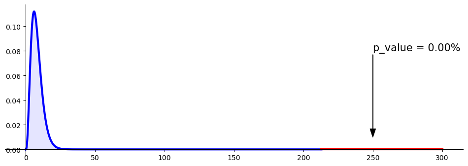
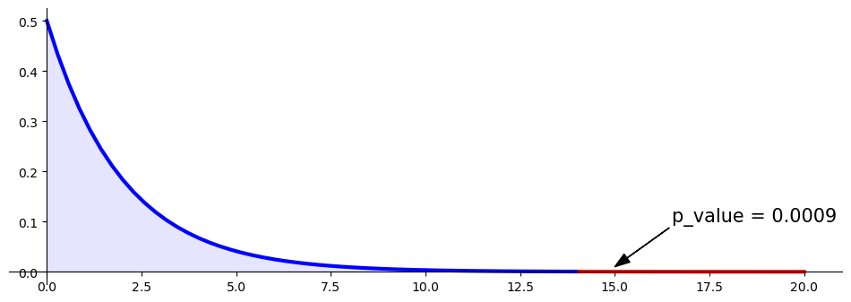

# 동질성 검정

## 동질성 검정과 독립성 검정

**카이제곱 독립성 검정**과 **카이제곱 동질성 검정**은 **계산 절차가 완전히 같다**. 그러나 **목적, 실험 설계, 해석이 다르다**.

### 공통점의 핵심

두 검정 모두 같은 **χ² 검정통계량**

$$
\chi^2 = \sum \frac{(O_{ij} - E_{ij})^2}{E_{ij}}
$$

과 같은 **표본분포**(자유도 $(r-1)(c-1)$인 χ²)를 쓴다.

**기대도수**도 같은 방식으로 계산한다:

$$
E_{ij} = \frac{(\text{row total})(\text{column total})}{\text{grand total}}
$$

따라서 계산만 보아서는 어느 검정을 하고 있는지 구분할 수 없다. 차이는 **자료를 어떻게 수집했는가**와 **어떤 질문에 답하는가**에 있다.

### 개념적 차이

| 항목               | **독립성 검정**                                                | **동질성 검정**                                                                                |
|-----------------------|-------------------------------------------------------------------------|----------------------------------------------------------------------------------------------------------|
| **연구 질문** | 두 범주형 변수가 **연관**되어 있는가(통계적으로 종속인가)? | **둘 이상의 모집단**이 어떤 범주형 변수의 분포에서 서로 비슷한가(동질적인가)? |
| **자료의 출처**       | 하나의 무작위 표본을 **두 변수**로 분류한다.              | 각 모집단에서 하나씩, 여러 개의 독립인 무작위 표본.                                         |
| **예시 질문**  | 어떤 모집단에서 **흡연 여부**가 **성별**과 관련이 있는가?            | **남성, 여성, 청소년**의 흡연 습관 **분포가 같은가**?                     |
| **표집 설계**   | 표본 하나 → 두 변수로 교차 분류.                          | 각 집단(또는 처치)에서 별도의 표본.                                                         |
| **해석**    | 두 변수 사이의 **연관** 또는 **독립**을 검정한다.    | 모집단들에 걸친 분포의 **유사성(동질성)**을 검정한다.                            |

### 예를 통한 비교

#### 독립성 검정의 예

보건 연구자가 **300명**을 조사하여 다음을 기록한다:

- 변수 1: 흡연 여부(흡연자/비흡연자)
- 변수 2: 성별(남성/여성)

→ 표본 하나, 변수 둘. 검정하는 것: "흡연과 성별은 독립인가?"

#### 동질성 검정의 예

다른 연구자가 **남성 100명**, **여성 100명**, **청소년 100명**을 조사하여 각각 흡연 여부를 묻는다.

→ 각 집단에서 별도의 표본. 검정하는 것: "세 집단의 흡연자 비율이 같은가?"

### 미묘한 연결

수학적으로 두 검정 모두 관측도수의 **분할표**를 분석하고 $H_0$ 아래의 기대도수와 비교하며 같은 χ² 통계량을 쓴다.

- **독립성 검정**에서 "행"과 "열"은 *하나의* 모집단에서 나온 두 변수를 나타낸다.
- **동질성 검정**에서 "행"은 서로 다른 *모집단* 또는 *처치*를, 열은 한 변수의 범주를 나타낸다.

귀무가설 아래에서는:

- **독립성 검정:** 두 변수가 독립이다.
- **동질성 검정:** 모든 모집단이 같은 분포를 공유한다.

확률적으로 표현하면 두 진술은 동치이다.

### 요약

| 측면                 | **독립성 검정**                  | **동질성 검정**                           |
|------------------------|----------------------------------------|------------------------------------------------|
| 자료 수집        | 표본 하나 → 범주형 변수 둘 | 표본 둘 이상 → 범주형 변수 하나 |
| 귀무가설        | 두 변수가 독립이다      | 모든 모집단의 분포가 같다     |
| 대립가설 | 두 변수가 연관되어 있다           | 적어도 한 모집단이 다르다     |
| 검정통계량과 자유도    | 동일                              | 동일                                      |
| 해석         | 하나의 모집단 안에서의 연관 | 모집단들 사이의 일관성                 |

> **요컨대:** **절차**는 같지만 **맥락**이 다르다.
> 독립성 → 하나의 표본 *안에서*의 관계.
> 동질성 → 여러 표본 *사이의* 일관성.

---

## 예제 A: 병원의 질

### 문제

각 나라에서 사람들이 병원의 질을 별 다섯에서 별 하나까지 어떻게 평가하는지 물었다. 자료는 다음과 같다.

**관측:**

$$
\begin{array}{cccc}
\text{병원의 질} & \text{US} & \text{Canada} & \text{Mexico} \\ \hline
\text{별 5개} & 541 & 75 & 231 \\
\text{별 4개} & 498 & 71 & 213 \\
\text{별 3개} & 779 & 96 & 321 \\
\text{별 2개} & 282 & 50 & 345 \\
\text{별 1개} & 65 & 19 & 120
\end{array}
$$

병원 만족도 분포가 나라들 사이에서 동질적인가, 아니면 다른 나라가 있는가?

### Python 구현 (`scipy.stats.chi2_contingency` 없이)

```python
import matplotlib.pyplot as plt
import numpy as np
import scipy.stats as stats

def compute_expected(observed):
    row_sum = observed.sum(axis=1)
    row_pmf = row_sum.reshape((-1, 1)) / row_sum.sum()

    column_sum = observed.sum(axis=0)
    column_pmf = column_sum.reshape((1, -1)) / column_sum.sum()

    joint_pmf = row_pmf * column_pmf
    expected = joint_pmf * row_sum.sum()
    return expected

def main():
    observed = np.array([[541, 75, 231], [498, 71, 213],
                         [779, 96, 321], [282, 50, 345], [65, 19, 120]])
    expected = compute_expected(observed)
    df = (observed.shape[0] - 1) * (observed.shape[1] - 1)

    statistic = np.sum((observed - expected)**2 / expected)
    p_value = stats.chi2(df).sf(statistic)
    print(f"{statistic = :.02f}")
    print(f"{p_value   = :.02%}")

    _, ax = plt.subplots(figsize=(12, 4))

    x = np.linspace(0, statistic, 1000)
    y = stats.chi2(df).pdf(x)
    ax.plot(x, y, color='b', linewidth=3)

    x = np.concatenate([[0], x, [statistic], [0]])
    y = np.concatenate([[0], y, [0], [0]])
    ax.fill(x, y, color='b', alpha=0.1)

    x = np.linspace(statistic, 300, 100)
    y = stats.chi2(df).pdf(x)
    ax.plot(x, y, color='r', linewidth=3)

    x = np.concatenate([[statistic], x, [20], [statistic]])
    y = np.concatenate([[0], y, [0], [0]])
    ax.fill(x, y, color='r', alpha=0.1)

    xy = (250, 0.01)
    xytext = (250, 0.08)
    arrowprops = dict(color='k', width=0.2, headwidth=8)
    ax.annotate(f'{p_value = :.02%}', xy, xytext=xytext, fontsize=15, arrowprops=arrowprops)

    ax.spines['right'].set_visible(False)
    ax.spines['top'].set_visible(False)
    ax.spines['bottom'].set_position("zero")
    ax.spines['left'].set_position("zero")

    plt.show()

if __name__ == "__main__":
    main()
```

출력:

```
statistic = 212.94
p_value   = 0.00%
```


$\chi^2 = 212.94$는 자유도 8인 카이제곱분포에서 사실상 불가능한 값이다. 세 나라의 만족도 분포가 같지 않다는 결론을 강하게 지지한다.

관측값이 3,500개가 넘어 검정력이 아주 높다는 점도 함께 보아야 한다. 어느 나라가 어떻게 다른지는 이 검정이 알려주지 않으므로, 표준화 잔차를 따로 살펴야 한다.

### Python 구현 (`scipy.stats.chi2_contingency` 사용)

```python
import matplotlib.pyplot as plt
import numpy as np
import scipy.stats as stats

def main():
    observed = np.array([[541, 75, 231], [498, 71, 213],
                         [779, 96, 321], [282, 50, 345], [65, 19, 120]])

    statistic, p_value, df, expected = stats.chi2_contingency(observed)
    print(f"{statistic = :.02f}")
    print(f"{p_value   = :.02%}")

    _, ax = plt.subplots(figsize=(12, 4))

    x = np.linspace(0, statistic, 1000)
    y = stats.chi2(df).pdf(x)
    ax.plot(x, y, color='b', linewidth=3)

    x = np.concatenate([[0], x, [statistic], [0]])
    y = np.concatenate([[0], y, [0], [0]])
    ax.fill(x, y, color='b', alpha=0.1)

    x = np.linspace(statistic, 300, 100)
    y = stats.chi2(df).pdf(x)
    ax.plot(x, y, color='r', linewidth=3)

    x = np.concatenate([[statistic], x, [20], [statistic]])
    y = np.concatenate([[0], y, [0], [0]])
    ax.fill(x, y, color='r', alpha=0.1)

    xy = (250, 0.01)
    xytext = (250, 0.08)
    arrowprops = dict(color='k', width=0.2, headwidth=8)
    ax.annotate(f'{p_value = :.02%}', xy, xytext=xytext, fontsize=15, arrowprops=arrowprops)

    ax.spines['right'].set_visible(False)
    ax.spines['top'].set_visible(False)
    ax.spines['bottom'].set_position("zero")
    ax.spines['left'].set_position("zero")

    plt.show()

if __name__ == "__main__":
    main()
```

출력:

```
statistic = 212.94
p_value   = 0.00%
```



`chi2_contingency`가 수동 계산과 같은 값을 준다.

### 동질적인 경우와의 비교

동질적인 분포가 어떻게 보이는지 보이기 위해, 원자료를 나라들 사이에 분포가 비슷한 경우와 비교해 보자:

```python
import matplotlib.pyplot as plt
import numpy as np
import scipy.stats as stats

def compute_expected(observed):
    row_sum = observed.sum(axis=1)
    row_pmf = row_sum.reshape((-1, 1)) / row_sum.sum()
    column_sum = observed.sum(axis=0)
    column_pmf = column_sum.reshape((1, -1)) / column_sum.sum()
    joint_pmf = row_pmf * column_pmf
    expected = joint_pmf * row_sum.sum()
    return expected

def main():
    # Homogeneous case — distributions are similar across countries
    observed = np.array([[541, 530, 550], [498, 490, 503],
                         [779, 750, 760], [282, 270, 265], [65, 60, 58]])
    expected = compute_expected(observed)
    df = (observed.shape[0] - 1) * (observed.shape[1] - 1)

    statistic = np.sum((observed - expected)**2 / expected)
    p_value = stats.chi2(df).sf(statistic)
    print(f"{statistic = :.02f}")
    print(f"{p_value   = :.02%}")

if __name__ == "__main__":
    main()
```

출력:

```
statistic = 1.10
p_value   = 99.75%
```

앞의 자료와 대비된다. 나라별 분포가 거의 같으면 통계량이 1.10까지 떨어지고 p-값은 99.75%가 된다. 자유도 8인 카이제곱분포의 평균이 8이므로, 1.10은 오히려 "지나치게 잘 맞는" 축에 든다.

### 두 나라 비교 (US 대 Canada)

```python
import matplotlib.pyplot as plt
import numpy as np
import scipy.stats as stats

def main():
    observed = np.array([[541, 75], [498, 71], [779, 96], [282, 50], [65, 19]])

    statistic, p_value, df, expected = stats.chi2_contingency(observed)
    print(f"{statistic = :.02f}")
    print(f"{p_value   = :.02%}")
    print("expected")
    print(expected)

if __name__ == "__main__":
    main()
```

출력:

```
statistic = 11.73
p_value   = 1.95%
expected
[[538.62681745  77.37318255]
 [497.53029079  71.46970921]
 [765.09491115 109.90508885]
 [290.29886914  41.70113086]
 [ 73.44911147  10.55088853]]
```

세 나라 중 둘만 놓고 비교하면 $\chi^2$이 212.94에서 11.73으로 뚝 떨어진다. 앞의 큰 통계량은 대부분 세 번째 나라 때문이었다는 뜻이다.

$p = 0.0195$로 여전히 5% 수준에서는 기각하지만, 1% 수준에서는 기각하지 못한다. 기대도수 중 가장 작은 값이 10.55로 경험칙을 만족한다.

---

## 예제 B: 좋아하는 과목과 주로 쓰는 손

> **출처**: [Khan Academy — Chi-Square Test Homogeneity](https://www.khanacademy.org/math/ap-statistics/chi-square-tests/chi-square-tests-two-way-tables/v/chi-square-test-homogeneity)

왼손잡이와 오른손잡이가 과학·기술·공학·수학, 인문학, 또는 그 어느 쪽도 아닌 것에 대해 비슷한 성향을 보이는지 판정하고자 한다.

- **귀무가설**: 왼손잡이와 오른손잡이 사이에 과목 선호 분포의 차이가 없다.
- **대립가설**: 왼손잡이와 오른손잡이 사이에 과목 선호 분포의 차이가 있다.

오른손잡이 60명과 왼손잡이 40명을 각각 무작위로 뽑았다:

|            | 오른손 | 왼손 | 합계   |
|:----------:|:-----:|:----:|:-------:|
| STEM       | 30    | 10   | **40**  |
| 인문학 | 15    | 25   | **40**  |
| 같음      | 15    | 5    | **20**  |
| 합계      | **60**| **40** | **100** |

### Python 구현

```python
import matplotlib.pyplot as plt
import numpy as np
import scipy.stats as stats

def main():
    observed = np.array([[30, 10], [15, 25], [15, 5]])

    statistic, p_value, df, expected = stats.chi2_contingency(observed)
    print(f"{statistic = :.02f}")
    print(f"{p_value   = :.04f}")
    print(f"\nExpected frequencies:")
    print(expected)

    _, ax = plt.subplots(figsize=(12, 4))

    x = np.linspace(0, statistic)
    y = stats.chi2(df).pdf(x)
    ax.plot(x, y, color='b', linewidth=3)

    x = np.concatenate([[0], x, [statistic], [0]])
    y = np.concatenate([[0], y, [0], [0]])
    ax.fill(x, y, color='b', alpha=0.1)

    x = np.linspace(statistic, 20, 100)
    y = stats.chi2(df).pdf(x)
    ax.plot(x, y, color='r', linewidth=3)

    x = np.concatenate([[statistic], x, [20], [statistic]])
    y = np.concatenate([[0], y, [0], [0]])
    ax.fill(x, y, color='r', alpha=0.1)

    xy = (15.0, 0.01)
    xytext = (16.5, 0.10)
    arrowprops = dict(color='k', width=0.2, headwidth=8)
    ax.annotate(f'{p_value = :.04f}', xy, xytext=xytext, fontsize=15, arrowprops=arrowprops)

    ax.spines['right'].set_visible(False)
    ax.spines['top'].set_visible(False)
    ax.spines['bottom'].set_position("zero")
    ax.spines['left'].set_position("zero")

    plt.show()

if __name__ == "__main__":
    main()
```

출력:

```
statistic = 14.06
p_value   = 0.0009

Expected frequencies:
[[24. 16.]
 [24. 16.]
 [12.  8.]]
```



관측값이 100개뿐인데도 강하게 기각된다. STEM에서 오른손잡이가 기대 24에 대해 30, 인문학에서 왼손잡이가 기대 16에 대해 25로 어긋남이 크기 때문이다.

기대도수가 모두 정수로 딱 떨어진 것은 우연이 아니다. 행 합계가 40, 40, 20이고 열 합계가 60, 40이며 총합이 100이라 $R_i C_j / n$이 언제나 정수가 된다.

## 연습문제

<div class="drillbox" markdown>

**연습문제 1.**
약 A: 100명 중 60명 성공. B: 100명 중 55명 성공. (a) 교란변수를 어떻게 통제하는가? (b) $z$-검정. (c) $\chi^2$ 검정. 두 검정이 동치임을 보여라.

</div>

??? success "풀이"
    (a) 참가자를 A 또는 B에 **무작위 배정**한다. 무작위 배정은 교란변수(나이, 성별, 중증도)를 기댓값 수준에서 두 집단에 균형 있게 배분한다.

    (b) 합동 $\hat p = 115/200 = 0.575$. $\mathrm{SE} = \sqrt{0.575 \cdot 0.425 \cdot (1/100 + 1/100)} \approx 0.0699$.

    $z = (0.60 - 0.55)/0.0699 \approx 0.715$. $|z| < 1.96$이므로 기각하지 못한다.

    (c) 기대도수: 성공 칸은 모두 57.5, 실패 칸은 모두 42.5. $\chi^2 = 2 \cdot (2.5)^2/57.5 + 2 \cdot (2.5)^2/42.5 \approx 0.512$. $0.512 < 3.84$이므로 기각하지 못한다.

    동치성: $z^2 = 0.715^2 = 0.511 \approx \chi^2$. $2 \times 2$ 표에서 $\chi^2$ 검정은 비율에 대한 양측 $z$-검정과 동치이다.

<div class="drillbox" markdown>

**연습문제 2.**
**동질성 검정**과 독립성 검정. 차이는 무엇인가?

</div>

??? success "풀이"
    둘 다 같은 통계량과 같은 자유도의 카이제곱을 쓴다. 차이는 **표집 설계**에 있다:

    **동질성:** 한 변수의 주변합이 고정된다(예: $n_A = n_B = 100$을 미리 정한다). 다른 변수의 분포가 행들 사이에서 같은지 검정한다.

    **독립성:** 전체 $n$만 고정되고 칸 도수는 무작위로 배분된다. 두 변수가 독립인지 검정한다.

    **수식은 같고 해석이 다르다.** 표본크기를 미리 정한 약물시험은 동질성이고, 고객 선호에 대한 관찰연구는 독립성이다.

    실무적으로 계산상 구분되지 않지만, 설계 가정 때문에 개념적으로는 구별된다.

<div class="drillbox" markdown>

**연습문제 3.**
**여러 모집단의 동질성.** 세 약을 비교한다: A (60/100), B (55/100), C (45/100). 세 약의 성공률이 모두 같은지 검정하라.

</div>

??? success "풀이"
    표: 성공 행 = (60, 55, 45), 실패 행 = (40, 45, 55). 총합 = 300, 성공 합계 = 160.

    합동 $\hat p_{\text{success}} = 160/300 \approx 0.533$.

    집단별 기대도수: 성공 53.33, 실패 46.67.

    $\chi^2 = \sum (O - E)^2/E$:

    - A: $(60-53.33)^2/53.33 + (40-46.67)^2/46.67 \approx 0.834 + 0.953 = 1.787$.
    - B: $(55-53.33)^2/53.33 + (45-46.67)^2/46.67 \approx 0.052 + 0.060 = 0.112$.
    - C: $(45-53.33)^2/53.33 + (55-46.67)^2/46.67 \approx 1.302 + 1.488 = 2.790$.

    전체 $\chi^2 \approx 4.69$. df $= (3-1)(2-1) = 2$. 임계값 $\chi^2_{2, 0.05} = 5.99$. 5% 수준에서 **기각하지 못한다**.

    약 C의 성공률이 눈에 띄게 낮지만(45% 대 60%) 검정은 유의성에 이르지 못한다.

<div class="drillbox" markdown>

**연습문제 4.**
동질성을 기각한 뒤의 **사후분석**. 무엇이 권장되는가?

</div>

??? success "풀이"
    전체 카이제곱이 $H_0$을 기각한 뒤에는 어느 집단이 다른지 찾는다.

    **선택지:**

    - Bonferroni 보정을 적용한 **쌍별 카이제곱**: 집단이 3개면 쌍별 검정 3개를 $\alpha/3$에서 수행한다.
    - **조정 잔차:** $r_{ij} = (O - E)/\sqrt{E \cdot (1 - p_i)(1 - p_j)}$. $|r| > 2$이면 그 칸이 유의하다.
    - 관심 있는 특정 집단 사이의 **두 비율 z-검정**.

    중요: 여러 비교를 할 때에는 가족단위 오류율이나 거짓발견율을 통제해야 한다.

<div class="drillbox" markdown>

**연습문제 5.**
대응/짝지은 이진 자료에 대한 **McNemar 검정**. 정의하고 카이제곱과 대비하라.

</div>

??? success "풀이"
    상황: 같은 대상을 두 번 측정한다(전/후, 평가자 두 명). 결과는 이진이다.

    짝지은 표:

    | | 이후 + | 이후 − |
    |---|---|---|
    | 이전 + | $a$ | $b$ |
    | 이전 − | $c$ | $d$ |

    **McNemar 통계량:** $\chi^2 = (b - c)^2/(b + c)$, df = 1.

    주변 비율이 변했는지를 검정한다(예: "처치가 성공률을 옮겼는가?").

    **카이제곱과의 대비:** 독립성 카이제곱은 관측값이 독립이라고 가정한다. McNemar는 짝지음을 반영하여 불일치 쌍($b$, $c$)만 사용한다.

    예: 설문에서 동의–비동의로 바뀐 쌍, 처치 전후의 개선.

<div class="drillbox" markdown>

**연습문제 6.**
카이제곱 동질성 검정의 **검정력 분석**.

</div>

??? success "풀이"
    효과크기: $w = \sqrt{\sum (p_{ij} - p_{ij,0})^2/p_{ij,0}}$, 여기서 $p_{ij,0}$은 $H_0$ 아래의 기대 확률이다.

    Cohen의 관례: $w = 0.1$(작음), 0.3(중간), 0.5(큼).

    검정력 80%, $\alpha = 0.05$, df = 2에 필요한 $n$: $\lambda \approx 9.63$, $n = \lambda/w^2$.

    작은 효과: $n \approx 963$. 중간: $n \approx 107$. 큰 효과: $n \approx 39$.

    `statsmodels.stats.power.GofChisquarePower`를 쓰거나 직접 계산한다. 표본크기 계획은 필수적이다. 응용 연구에서 검정력이 부족한 카이제곱 검정이 흔하다.
