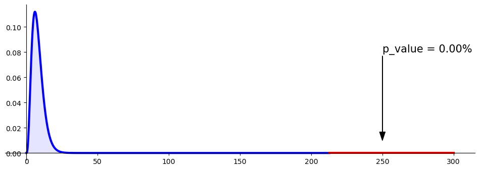
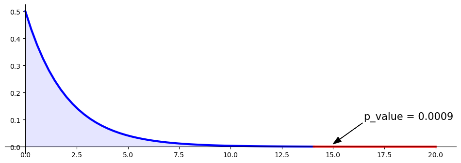

# 동질성 검정

## 동질성 검정과 독립성 검정

**카이제곱 독립성 검정**과 **카이제곱 동질성 검정**은 **계산 절차가 완전히 같다**. 그러나 **목적, 실험 설계, 해석이 다르다**.

### 공통점의 핵심

두 검정 모두 같은 **χ² 검정통계량**

$$
\chi^2 = \sum \frac{(O_{ij} - E_{ij})^2}{E_{ij}}
$$

과 같은 **표본분포**(자유도 $(r-1)(c-1)$인 χ²)를 쓴다.

**기대도수**도 같은 방식으로 계산한다:

$$
E_{ij} = \frac{(\text{row total})(\text{column total})}{\text{grand total}}
$$

따라서 계산만 보아서는 어느 검정을 하고 있는지 구분할 수 없다. 차이는 **자료를 어떻게 수집했는가**와 **어떤 질문에 답하는가**에 있다.

### 개념적 차이

| 항목               | **독립성 검정**                                                | **동질성 검정**                                                                                |
|-----------------------|-------------------------------------------------------------------------|----------------------------------------------------------------------------------------------------------|
| **연구 질문** | 두 범주형 변수가 **연관**되어 있는가(통계적으로 종속인가)? | **둘 이상의 모집단**이 어떤 범주형 변수의 분포에서 서로 비슷한가(동질적인가)? |
| **자료의 출처**       | 하나의 무작위 표본을 **두 변수**로 분류한다.              | 각 모집단에서 하나씩, 여러 개의 독립인 무작위 표본.                                         |
| **예시 질문**  | 어떤 모집단에서 **흡연 여부**가 **성별**과 관련이 있는가?            | **남성, 여성, 청소년**의 흡연 습관 **분포가 같은가**?                     |
| **표집 설계**   | 표본 하나 → 두 변수로 교차 분류.                          | 각 집단(또는 처치)에서 별도의 표본.                                                         |
| **해석**    | 두 변수 사이의 **연관** 또는 **독립**을 검정한다.    | 모집단들에 걸친 분포의 **유사성(동질성)**을 검정한다.                            |

### 예를 통한 비교

#### 독립성 검정의 예

보건 연구자가 **300명**을 조사하여 다음을 기록한다:

- 변수 1: 흡연 여부(흡연자/비흡연자)
- 변수 2: 성별(남성/여성)

→ 표본 하나, 변수 둘. 검정하는 것: "흡연과 성별은 독립인가?"

#### 동질성 검정의 예

다른 연구자가 **남성 100명**, **여성 100명**, **청소년 100명**을 조사하여 각각 흡연 여부를 묻는다.

→ 각 집단에서 별도의 표본. 검정하는 것: "세 집단의 흡연자 비율이 같은가?"

### 미묘한 연결

수학적으로 두 검정 모두 관측도수의 **분할표**를 분석하고 $H_0$ 아래의 기대도수와 비교하며 같은 χ² 통계량을 쓴다.

- **독립성 검정**에서 "행"과 "열"은 *하나의* 모집단에서 나온 두 변수를 나타낸다.
- **동질성 검정**에서 "행"은 서로 다른 *모집단* 또는 *처치*를, 열은 한 변수의 범주를 나타낸다.

귀무가설 아래에서는:

- **독립성 검정:** 두 변수가 독립이다.
- **동질성 검정:** 모든 모집단이 같은 분포를 공유한다.

확률적으로 표현하면 두 진술은 동치이다.

### 요약

| 측면                 | **독립성 검정**                  | **동질성 검정**                           |
|------------------------|----------------------------------------|------------------------------------------------|
| 자료 수집        | 표본 하나 → 범주형 변수 둘 | 표본 둘 이상 → 범주형 변수 하나 |
| 귀무가설        | 두 변수가 독립이다      | 모든 모집단의 분포가 같다     |
| 대립가설 | 두 변수가 연관되어 있다           | 적어도 한 모집단이 다르다     |
| 검정통계량과 자유도    | 동일                              | 동일                                      |
| 해석         | 하나의 모집단 안에서의 연관 | 모집단들 사이의 일관성                 |

> **요컨대:** **절차**는 같지만 **맥락**이 다르다.
> 독립성 → 하나의 표본 *안에서*의 관계.
> 동질성 → 여러 표본 *사이의* 일관성.

---

## 문제 A: 병원의 질

<div class="probox" markdown>

**문제 1.** <span class="diff easy" title="쉬움"></span>

각 나라에서 사람들이 병원의 질을 별 다섯에서 별 하나까지 어떻게 평가하는지 물었다. 자료는 다음과 같다.

**관측:**

</div>

??? success "풀이"
    $$
    \begin{array}{cccc}
    \text{병원의 질} & \text{US} & \text{Canada} & \text{Mexico} \\ \hline
    \text{별 5개} & 541 & 75 & 231 \\
    \text{별 4개} & 498 & 71 & 213 \\
    \text{별 3개} & 779 & 96 & 321 \\
    \text{별 2개} & 282 & 50 & 345 \\
    \text{별 1개} & 65 & 19 & 120
    \end{array}
    $$

    병원 만족도 분포가 나라들 사이에서 동질적인가, 아니면 다른 나라가 있는가?

### Python 구현 (`scipy.stats.chi2_contingency` 없이)

<div class="exbox" markdown>

**보기 1.** <span class="diff easy" title="쉬움"></span> 정의대로 계산한 동질성 검정. 위의 병원 만족도 표를 쓴다. 행이 응답 범주(별 5개 … 별 1개), 열이 나라다. 행 합은 $847,\ 782,\ 1196,\ 677,\ 204$, 열 합은 $2165,\ 311,\ 1230$, 총합은 $n = 3706$ 이다.

**(1)** 동질성의 귀무가설을 **열별 조건부분포**로 적고, 그로부터 기대도수가 $E_{ij} = R_i C_j / n$ 이 됨을 보이시오. 이 식이 "각 나라에 **통합 분포**를 씌운 것" 이라는 뜻임을 설명하시오.

**(2)** 코드로 $\chi^2$ 과 자유도, p-값을 구해 판정하시오.

**(3)** 칸별 기여를 모두 구해 **어느 나라의 어느 범주**가 통계량을 끌고 가는지 찾고, 크래머 $V$ 로 효과크기를 재시오. $\chi^2$ 이 212.94 라는 것과 $V$ 가 말하는 것이 어떻게 다른가.

</div>

??? success "풀이"

    **(1) 동질성의 $H_0$ 는 열별 조건부분포가 같다는 것.** 나라 $j$ 에서 응답이 범주 $i$ 일 조건부확률을 $\pi_{i\mid j}$ 라 하면

    $$
    H_0:\ \pi_{i\mid 1} = \pi_{i\mid 2} = \pi_{i\mid 3} = \pi_i
    \qquad (i = 1,\ldots,5)
    $$

    이다. 공통값 $\pi_i$ 는 모르는 값이므로 자료에서 추정해야 하는데, 세 나라를 통틀어 범주 $i$ 에 든 사람이 $R_i$ 명이므로 가장 자연스러운 추정값은 **통합 비율**

    $$
    \hat\pi_i = \frac{R_i}{n}
    $$

    이다. 나라 $j$ 의 응답자가 $C_j$ 명이니 그 나라에서 범주 $i$ 의 기대도수는

    $$
    E_{ij} = C_j \cdot \hat\pi_i = \frac{R_i C_j}{n}
    $$

    가 되고, 이것이 독립성 검정에서 쓰는 식과 **글자 하나까지 같다.** 다만 읽는 법이 다르다. 독립성에서는 "주변확률의 곱" 이었고, 동질성에서는 **"각 나라에 통합 분포를 그대로 씌운 것"** 이다.

    통합 분포는

    $$
    \left(\frac{847}{3706},\ \frac{782}{3706},\ \frac{1196}{3706},\ \frac{677}{3706},\ \frac{204}{3706}\right)
    = (0.2285,\ 0.2110,\ 0.3227,\ 0.1827,\ 0.0550)
    $$

    이고, 나라별 실제 분포는

    $$
    \begin{array}{c|ccc}
     & \text{US} & \text{Canada} & \text{Mexico} \\ \hline
    \text{별 5개} & 0.2499 & 0.2412 & 0.1878 \\
    \text{별 4개} & 0.2300 & 0.2283 & 0.1732 \\
    \text{별 3개} & 0.3598 & 0.3087 & 0.2610 \\
    \text{별 2개} & 0.1303 & 0.1608 & 0.2805 \\
    \text{별 1개} & 0.0300 & 0.0611 & 0.0976
    \end{array}
    $$

    다. **별 2개와 별 1개 줄을 보라.** US 의 $0.1303$ 과 $0.0300$ 이 Mexico 에서는 $0.2805$ 와 $0.0976$ 으로 두 배에서 세 배가 된다. 통계량이 어디서 나올지가 이미 보인다.

    자유도는 $(r-1)(c-1) = 4 \times 2 = 8$ 이다. 통합 분포를 추정하느라 $r-1 = 4$ 개의 모수를 썼고, 나라마다 $r-1=4$ 개의 자유로운 비율이 있어 모두 $3 \times 4 = 12$ 개였으므로 $12 - 4 = 8$ 이 남는다.

    **(2) 수치적으로.**

    ```python
    import matplotlib.pyplot as plt
    import numpy as np
    import scipy.stats as stats

    def compute_expected(observed):
        """행과 열이 무관하다는 가정 아래 기대도수를 구한다.

        무관하다면 결합확률이 주변확률의 곱이 된다. 그 곱에 전체 도수를 곱한
        것이 각 칸의 기대도수다.
        """
        row_sum = observed.sum(axis=1)
        row_pmf = row_sum.reshape((-1, 1)) / row_sum.sum()

        column_sum = observed.sum(axis=0)
        column_pmf = column_sum.reshape((1, -1)) / column_sum.sum()

        joint_pmf = row_pmf * column_pmf
        expected = joint_pmf * row_sum.sum()
        return expected

    def main():
        """동질성 검정을 정의대로 계산하고 p-값을 그림으로 보인다."""
        # 행이 나라, 열이 응답 범주다. 나라마다 응답 분포가 같은지를 묻는다.
        observed = np.array([[541, 75, 231], [498, 71, 213],
                             [779, 96, 321], [282, 50, 345], [65, 19, 120]])
        expected = compute_expected(observed)

        # 자유도는 (행-1)(열-1). 행합과 열합이 묶여 있어 자유롭게 움직일 수 있는
        # 칸이 그만큼뿐이다.
        df = (observed.shape[0] - 1) * (observed.shape[1] - 1)

        statistic = np.sum((observed - expected)**2 / expected)
        p_value = stats.chi2(df).sf(statistic)
        print(f"{statistic = :.02f}")
        print(f"{p_value   = :.02%}")

        _, ax = plt.subplots(figsize=(12, 4))

        x = np.linspace(0, statistic, 1000)
        y = stats.chi2(df).pdf(x)
        ax.plot(x, y, color='b', linewidth=3)

        x = np.concatenate([[0], x, [statistic], [0]])
        y = np.concatenate([[0], y, [0], [0]])
        ax.fill(x, y, color='b', alpha=0.1)

        x = np.linspace(statistic, 300, 100)
        y = stats.chi2(df).pdf(x)
        ax.plot(x, y, color='r', linewidth=3)

        x = np.concatenate([[statistic], x, [20], [statistic]])
        y = np.concatenate([[0], y, [0], [0]])
        ax.fill(x, y, color='r', alpha=0.1)

        xy = (250, 0.01)
        xytext = (250, 0.08)
        arrowprops = dict(color='k', width=0.2, headwidth=8)
        ax.annotate(f'{p_value = :.02%}', xy, xytext=xytext, fontsize=15, arrowprops=arrowprops)

        ax.spines['right'].set_visible(False)
        ax.spines['top'].set_visible(False)
        ax.spines['bottom'].set_position("zero")
        ax.spines['left'].set_position("zero")

        plt.show()

    if __name__ == "__main__":
        main()
    ```

    출력:

    ```
    statistic = 212.94
    p_value   = 0.00%
    ```

    

    $\chi^2 = 212.94$는 자유도 8인 카이제곱분포에서 사실상 불가능한 값이다. 세 나라의 만족도 분포가 같지 않다는 결론을 강하게 지지한다.

    **(3) 어디서 나온 통계량인가.** 칸별 기여를 모두 인쇄한다.

    ```python
    import numpy as np

    O = np.array([[541, 75, 231], [498, 71, 213],
                  [779, 96, 321], [282, 50, 345], [65, 19, 120]])
    R, C, N = O.sum(1), O.sum(0), O.sum()
    E = np.outer(R, C) / N
    contrib = (O - E) ** 2 / E

    print("칸별 기여  (O-E)^2/E")
    print(f"{'':8s}{'US':>9s}{'Canada':>9s}{'Mexico':>9s}{'행 합':>9s}")
    for lab, row in zip(["별 5개", "별 4개", "별 3개", "별 2개", "별 1개"], contrib):
        print(f"{lab:8s}" + "".join(f"{v:9.2f}" for v in row) + f"{row.sum():9.2f}")
    print(f"{'열 합':8s}" + "".join(f"{v:9.2f}" for v in contrib.sum(0))
          + f"{contrib.sum():9.2f}")
    print(f"\n최소 기대도수 {E.min():.2f}")
    print(f"크래머 V = sqrt(chi2 / (n min(r-1,c-1))) "
          f"= sqrt({contrib.sum():.2f} / (3706 x 2)) = {np.sqrt(contrib.sum() / (N * 2)):.4f}")
    ```

    출력:

    ```
    칸별 기여  (O-E)^2/E
                   US   Canada   Mexico      행 합
    별 5개         4.31     0.22     8.93    13.46
    별 4개         3.71     0.44     8.35    12.50
    별 3개         9.23     0.19    14.53    23.95
    별 2개        32.57     0.82    64.42    97.80
    별 1개        24.63     0.21    40.39    65.22
    열 합         74.45     1.87   136.62   212.94

    최소 기대도수 17.12
    크래머 V = sqrt(chi2 / (n min(r-1,c-1))) = sqrt(212.94 / (3706 x 2)) = 0.1695
    ```

    **두 줄이 전부다.** 별 2개 줄이 $97.80$, 별 1개 줄이 $65.22$ 로 둘을 합치면 $163.0$, 곧 전체 $212.94$ 의 $77\%$ 다. 나라로 보면 Mexico 가 $136.62$ ($64\%$), US 가 $74.45$ ($35\%$), Canada 는 $1.87$ ($0.9\%$) 다. **Canada 는 통합 분포에 거의 그대로 맞는다.** 가장 큰 칸 하나는 Mexico 의 별 2개로 $64.42$, 전체의 $30\%$ 다.

    최소 기대도수가 $17.12$ 라 모든 칸이 5 를 넘고, 타당성 조건이 넉넉하게 충족된다.

    **$\chi^2$ 과 $V$ 가 서로 다른 말을 한다.** $\chi^2 = 212.94$ 는 "우연으로 보기 어렵다" 를 압도적으로 말하지만 크래머 $V = 0.1695$ 는 **약한 연관**이다($V \le 0.1$ 약함, $0.3$ 중간, $0.5$ 이상 강함이라는 흔한 눈금에서 약함과 중간 사이다). 까닭은 $\chi^2 = n V^2 \min(r-1,c-1)$ 이라서 $n = 3706$ 이 통계량을 끌어올리기 때문이다. 관측값이 3,500 개가 넘어 검정력이 아주 높다는 점을 함께 보아야 한다. **"분포가 같지 않다" 는 확실하지만 "많이 다르다" 는 아니다.**

### Python 구현 (`scipy.stats.chi2_contingency` 사용)

<div class="exbox" markdown>

**보기 2.** <span class="diff easy" title="쉬움"></span> scipy로 계산한 동질성 검정.

**(1)** `scipy.stats.chi2_contingency` 가 보기 1 의 손계산과 같은 값을 주는지 확인하시오. 이 함수는 독립성인지 동질성인지 알 수 있는가.

**(2)** 출력이 `p_value = 0.00%` 다. 실제 p-값은 얼마인가. 임계값 방식으로도 판정하시오.

</div>

??? success "풀이"

    **(1) 같은 계산이다.** 보기 1 (1)에서 본 대로 동질성의 기대도수와 독립성의 기대도수가 같은 식 $R_iC_j/n$ 이므로 `chi2_contingency` 는 둘을 구분할 필요가 없다. **구분은 표집 설계에 있고 그것은 함수가 알 수 없다.** 여기서 나라별 표본 크기 $2165,\ 311,\ 1230$ 이 연구자가 정한 값인지 결과인지는 코드에 적혀 있지 않다. 설계를 아는 사람이 결론 문장을 "세 나라의 만족도 분포가 같지 않다" 로 쓰느냐 "나라와 만족도가 독립이 아니다" 로 쓰느냐만 달라진다.

    `chi2_contingency` 는 $2\times2$ 표에만 예이츠 보정을 걸고 여기는 $5\times3$ 이라 보정이 없다. 그러므로 보기 1 과 **같은 수**가 나와야 한다.

    **(2) 수치적으로.**

    ```python
    import matplotlib.pyplot as plt
    import numpy as np
    import scipy.stats as stats

    def main():
        """같은 계산을 scipy 의 chi2_contingency 로 대신한다."""
        observed = np.array([[541, 75, 231], [498, 71, 213],
                             [779, 96, 321], [282, 50, 345], [65, 19, 120]])

        # 기대도수와 자유도까지 함께 돌려준다. 앞의 손계산과 값이 맞아야 한다.
        statistic, p_value, df, expected = stats.chi2_contingency(observed)
        print(f"{statistic = :.02f}")
        print(f"{p_value   = :.02%}")

        _, ax = plt.subplots(figsize=(12, 4))

        x = np.linspace(0, statistic, 1000)
        y = stats.chi2(df).pdf(x)
        ax.plot(x, y, color='b', linewidth=3)

        x = np.concatenate([[0], x, [statistic], [0]])
        y = np.concatenate([[0], y, [0], [0]])
        ax.fill(x, y, color='b', alpha=0.1)

        x = np.linspace(statistic, 300, 100)
        y = stats.chi2(df).pdf(x)
        ax.plot(x, y, color='r', linewidth=3)

        x = np.concatenate([[statistic], x, [20], [statistic]])
        y = np.concatenate([[0], y, [0], [0]])
        ax.fill(x, y, color='r', alpha=0.1)

        xy = (250, 0.01)
        xytext = (250, 0.08)
        arrowprops = dict(color='k', width=0.2, headwidth=8)
        ax.annotate(f'{p_value = :.02%}', xy, xytext=xytext, fontsize=15, arrowprops=arrowprops)

        ax.spines['right'].set_visible(False)
        ax.spines['top'].set_visible(False)
        ax.spines['bottom'].set_position("zero")
        ax.spines['left'].set_position("zero")

        plt.show()

    if __name__ == "__main__":
        main()
    ```

    출력:

    ```
    statistic = 212.94
    p_value   = 0.00%
    ```

    

    `chi2_contingency`가 수동 계산과 같은 값을 준다.

    인쇄된 `0.00%` 는 소수 둘째 자리에서 끊은 것이다. 실제 값을 자리수까지 본다.

    ```python
    from scipy.stats import chi2

    chi2_obs = 212.93563265
    print(f"정확한 p-값          {chi2.sf(chi2_obs, 8):.4e}")
    print(f"임계값 chi2_0.05(8)  {chi2.ppf(0.95, 8):.4f}")
    print(f"관측값은 임계값의    {chi2_obs / chi2.ppf(0.95, 8):.1f} 배")
    ```

    출력:

    ```
    정확한 p-값          1.1951e-41
    임계값 chi2_0.05(8)  15.5073
    관측값은 임계값의    13.7 배
    ```

    $p = 1.2 \times 10^{-41}$ 이다. 임계값 $15.5073$ 의 $13.7$ 배이므로 어떤 통상적 유의수준에서도 기각한다. 다만 보기 1 (3)에서 본 대로 효과크기는 $V = 0.17$ 로 크지 않다. **p-값의 자릿수는 표본 크기의 이야기이고 효과의 크기가 아니다.**

### 동질적인 경우와의 비교

동질적인 분포가 어떻게 보이는지 보이기 위해, 원자료를 나라들 사이에 분포가 비슷한 경우와 비교해 보자:

<div class="exbox" markdown>

**보기 3.** <span class="diff easy" title="쉬움"></span> 동질적인 자료와 견주기. 같은 절차를 **나라별 분포가 거의 같은** 자료에 적용한다.

$$
O = \begin{pmatrix}
541 & 530 & 550 \\
498 & 490 & 503 \\
779 & 750 & 760 \\
282 & 270 & 265 \\
65 & 60 & 58
\end{pmatrix}
$$

**(1)** $\chi^2$ 과 p-값을 구하시오.

**(2)** 귀무가설 아래에서 $E[\chi^2] = \text{df}$ 가 **정확히** 성립한다. 그러면 이 자료의 $1.10$ 은 자유도 8 인 카이제곱분포의 어디에 놓이는가. **아래쪽** 꼬리의 백분위로 답하시오.

**(3)** (2)의 답이 뜻하는 것은 무엇인가. "적합이 너무 좋다" 가 왜 문제가 될 수 있는가.

</div>

??? success "풀이"

    **(1) 수치적으로.** 절차는 보기 1 과 똑같다. 도수만 바꾼다.

    ```python
    import matplotlib.pyplot as plt
    import numpy as np
    import scipy.stats as stats

    def compute_expected(observed):
        row_sum = observed.sum(axis=1)
        row_pmf = row_sum.reshape((-1, 1)) / row_sum.sum()
        column_sum = observed.sum(axis=0)
        column_pmf = column_sum.reshape((1, -1)) / column_sum.sum()
        joint_pmf = row_pmf * column_pmf
        expected = joint_pmf * row_sum.sum()
        return expected

    def main():
        # 이번에는 세 나라의 분포를 비슷하게 맞춘 자료다. 앞과 같은 절차인데
        # p-값이 크게 나온다. 검정이 무엇에 반응하는지가 이 대비에서 드러난다.
        observed = np.array([[541, 530, 550], [498, 490, 503],
                             [779, 750, 760], [282, 270, 265], [65, 60, 58]])
        expected = compute_expected(observed)
        df = (observed.shape[0] - 1) * (observed.shape[1] - 1)

        statistic = np.sum((observed - expected)**2 / expected)
        p_value = stats.chi2(df).sf(statistic)
        print(f"{statistic = :.02f}")
        print(f"{p_value   = :.02%}")

    if __name__ == "__main__":
        main()
    ```

    출력:

    ```
    statistic = 1.10
    p_value   = 99.75%
    ```

    앞의 자료와 대비된다. 나라별 분포가 거의 같으면 통계량이 1.10까지 떨어지고 p-값은 99.75%가 된다.

    **(2) 기준선은 자유도다.** 귀무가설 아래에서 각 칸의 어긋남이 평균 0, 분산이 대략 $E_{ij}$ 이므로 $(O-E)^2/E$ 의 기댓값이 칸마다 1 근처이고, 제약을 빼고 세면 정확히 자유도만큼 남는다. 적합도 검정에서는 이것이

    $$
    E[\chi^2] = \sum_i \frac{\operatorname{Var}(O_i)}{np_i} = \sum_i (1-p_i) = k-1
    $$

    로 **근사 없이** 나온다(연습문제 9 에서 과대산포를 진단할 때 쓰는 바로 그 사실이다). 분할표에서도 $E[\chi^2] \approx (r-1)(c-1) = 8$ 이다.

    그러므로 $\chi^2 = 1.10$ 은 **기준선 8 의 7 분의 1** 이다. 위쪽 꼬리 확률이 $0.9975$ 라는 말은 아래쪽 꼬리 확률이 $0.0025$ 라는 말이다.

    $$
    P(\chi^2_8 \le 1.0988) = 0.00246
    $$

    곧 **하위 $0.25\%$** 다. 자유도 8 의 $1\%$ 분위가 $1.6465$ 인데 $1.0988$ 은 그보다도 작다.

    **(3) 너무 잘 맞는 것도 신호다.** 자료가 참으로 귀무가설에서 나왔다면 $\chi^2$ 이 하위 $0.25\%$ 에 떨어질 확률은 400 분의 1 이다. 그런 일이 눈앞에 있다면 둘 중 하나다.

    - **우연히 아주 잘 맞았다.** 400 번에 한 번은 일어난다.
    - **자료가 "맞도록" 만들어졌다.** 여기서는 후자다. 세 열을 손으로 비슷하게 적어 넣었으니 무작위 흔들림이 있어야 할 만큼 들어 있지 않다.

    이 "너무 좋은 적합" 검사는 실제 자료 조작을 찾아내는 데 쓰인다. 멘델의 완두콩 자료가 그 유명한 예다. 적합도 검정은 보통 위쪽 꼬리만 보지만, **아래쪽 꼬리도 뜻이 있다.**

### 두 나라 비교 (US 대 Canada)

<div class="exbox" markdown>

**보기 4.** <span class="diff easy" title="쉬움"></span> 두 나라만 비교하기. 전체 검정은 "세 나라가 모두 같은가" 에만 답한다. 어느 쌍이 다른지는 쌍마다 따로 보아야 한다.

**(1)** US 와 Canada 만 남기면 열이 둘인 $5\times2$ 표가 된다. [독립성 검정](independence.md) 보기 1 에서 얻은 $r\times2$ 닫힌 꼴

$$
\chi^2 = \frac{n^2}{C_1C_2}\sum_{i=1}^r \frac{d_i^2}{R_i},
\qquad d_i = O_{i1} - \frac{R_iC_1}{n}
$$

으로 통계량을 구하고 코드와 맞추시오.

**(2)** 세 쌍을 모두 계산하시오. 세 쌍의 $\chi^2$ 을 더하면 전체 검정의 $212.94$ 가 되는가. 왜 그런가.

**(3)** 세 쌍을 모두 검정했으므로 다중비교 보정이 필요하다. 본페로니로 보정하면 US–Canada 의 결론이 어떻게 바뀌는가.

</div>

??? success "풀이"

    **(1) 열이 둘이면 닫힌 꼴이 쓰인다.** US 와 Canada 만 남긴 표의 주변합은 행 합 $616,\ 569,\ 875,\ 332,\ 84$, 열 합 $C_1 = 2165$(US), $C_2 = 311$(Canada), 총합 $n = 2476$ 이다. 각 행의 어긋남은

    $$
    d_i = O_{i1} - \frac{R_i C_1}{n}
    $$

    하나로 묶이고(열이 둘이므로 둘째 칸은 $-d_i$), 그 값은 차례로

    $$
    d_1 = +2.3732,\quad d_2 = +0.4697,\quad d_3 = +13.9051,\quad d_4 = -8.2989,\quad d_5 = -8.4491
    $$

    이다. $\sum_i d_i = 0$ 이어야 하고 실제로 그렇다. 그러면

    $$
    \sum_i \frac{d_i^2}{R_i}
    = \frac{2.3732^2}{616} + \frac{0.4697^2}{569} + \frac{13.9051^2}{875} + \frac{8.2989^2}{332} + \frac{8.4491^2}{84}
    $$

    $$
    = 0.00914 + 0.00039 + 0.22097 + 0.20744 + 0.84985 = 1.28780
    $$

    $$
    \chi^2 = \frac{2476^2}{2165 \times 311} \times 1.28780
    = 9.10506 \times 1.28780 = 11.7255
    $$

    자유도는 $(5-1)(2-1) = 4$ 다. 다섯 항 가운데 마지막(별 1개)이 $0.84985$ 로 전체의 $66\%$ 다. Canada 의 별 1개가 기대 $10.55$ 명에 대해 19 명이었던 것이 US–Canada 차이의 거의 전부다. **행 합 84 로 나누기 때문에 작은 행의 어긋남이 크게 친다.**

    **(2)·(3) 수치적으로.**

    ```python
    import matplotlib.pyplot as plt
    import numpy as np
    import scipy.stats as stats

    def main():
        """열을 둘로 줄여 두 나라만 견준다."""
        observed = np.array([[541, 75], [498, 71], [779, 96], [282, 50], [65, 19]])

        statistic, p_value, df, expected = stats.chi2_contingency(observed)
        print(f"{statistic = :.02f}")
        print(f"{p_value   = :.02%}")
        print("expected")
        print(expected)

    if __name__ == "__main__":
        main()
    ```

    출력:

    ```
    statistic = 11.73
    p_value   = 1.95%
    expected
    [[538.62681745  77.37318255]
     [497.53029079  71.46970921]
     [765.09491115 109.90508885]
     [290.29886914  41.70113086]
     [ 73.44911147  10.55088853]]
    ```

    세 나라 중 둘만 놓고 비교하면 $\chi^2$이 212.94에서 11.73으로 뚝 떨어진다. (1)에서 손으로 얻은 $11.7255$ 와 코드의 `11.73` 이 맞고, 기대도수의 최소 $10.55$ 도 경험칙을 만족한다.

    앞의 큰 통계량이 어디서 왔는지 세 쌍을 모두 보면 분명해진다.

    ```python
    import itertools
    import numpy as np
    from scipy import stats

    O = np.array([[541, 75, 231], [498, 71, 213],
                  [779, 96, 321], [282, 50, 345], [65, 19, 120]])
    names = ["US", "Canada", "Mexico"]

    print("쌍마다 열 둘만 남겨 다시 검정한다 (df = 4)")
    total = 0.0
    for i, j in itertools.combinations(range(3), 2):
        res = stats.chi2_contingency(O[:, [i, j]])
        total += res.statistic
        print(f"  {names[i]:>6s} - {names[j]:<6s}  chi2 = {res.statistic:8.4f}   "
              f"p = {res.pvalue:9.3g}   최소기대 {res.expected_freq.min():6.2f}")
    print(f"\n세 쌍의 합 {total:.4f}   전체 검정 212.9356")
    print(f"본페로니 임계 p = 0.05/3 = {0.05 / 3:.4f}")
    ```

    출력:

    ```
    쌍마다 열 둘만 남겨 다시 검정한다 (df = 4)
          US - Canada  chi2 =  11.7255   p =    0.0195   최소기대  10.55
          US - Mexico  chi2 = 210.5657   p =  2.01e-44   최소기대  67.03
      Canada - Mexico  chi2 =  27.2786   p =  1.75e-05   최소기대  28.05

    세 쌍의 합 249.5698   전체 검정 212.9356
    본페로니 임계 p = 0.05/3 = 0.0167
    ```

    **Mexico 가 범인이다.** US–Mexico 만으로 $210.57$ 이고, 전체 $212.94$ 의 거의 전부다. 보기 1 (3)에서 Mexico 열의 기여가 $136.62$ 로 가장 컸던 것과 같은 이야기다.

    **세 쌍의 합 $249.57$ 은 전체 $212.94$ 와 같지 않다.** 같을 이유가 없다. 쌍마다 **총합과 통합 분포가 달라진다.** US–Canada 쌍에서는 $n = 2476$, Mexico 가 들어간 쌍에서는 $n$ 이 각각 $3395$, $1541$ 이다. 기준선이 쌍마다 다르므로 세 수는 서로 다른 표에 대한 통계량이고, 더해서 전체가 되는 분해가 아니다. 진짜 분해를 원하면 자유도를 쪼개는 직교 대비를 써야 하고, 그러면 세 쌍이 아니라 **두 개의 독립 대비**만 잡을 수 있다($\text{df} = 8 = 4 + 4$).

    **(3) 본페로니.** 세 쌍을 모두 검정했으므로 쌍별 유의수준을 $0.05/3 = 0.0167$ 로 내린다. US–Mexico 와 Canada–Mexico 는 $p$ 가 $10^{-5}$ 보다 작아 그대로 유의하지만, **US–Canada 는 $p = 0.0195 > 0.0167$ 이 되어 유의성을 잃는다.** 보정 전에는 "5% 수준에서 기각" 이던 것이 보정 후에는 기각되지 않는다. 사후비교의 보정 방법과 그 함정은 연습문제 7 이 자세히 다룬다.

---

> **출처**: [Khan Academy — Chi-Square Test Homogeneity](https://www.khanacademy.org/math/ap-statistics/chi-square-tests/chi-square-tests-two-way-tables/v/chi-square-test-homogeneity)

<div class="exbox" markdown>

**보기 5.** <span class="diff easy" title="쉬움"></span> 좋아하는 과목과 주로 쓰는 손. 오른손잡이 60명과 왼손잡이 40명을 **각각** 무작위로 뽑아 선호 과목을 물었다. 두 집단의 표본 크기를 미리 정했으므로 전형적인 동질성 설계다.

|            | 오른손 | 왼손 | 합계   |
|:----------:|:-----:|:----:|:-------:|
| STEM       | 30    | 10   | **40**  |
| 인문학 | 15    | 25   | **40**  |
| 같음      | 15    | 5    | **20**  |
| 합계      | **60**| **40** | **100** |

**(1)** 기대도수가 모두 정수로 딱 떨어진다. 왜 그런가.

**(2)** $r\times2$ 닫힌 꼴로 $\chi^2$ 을 **유리수로** 구하시오. 자유도 2 에서는 p-값에도 닫힌 꼴이 있다.

**(3)** 크래머 $V$ 로 효과크기를 재고, 보기 1 의 $V = 0.17$ 과 견주시오. 관측값이 100 개뿐인데도 강하게 기각되는 까닭이 거기 있다.

</div>

??? success "풀이"

    **가설.** $H_0$ 은 오른손잡이와 왼손잡이의 과목 선호 분포가 같다는 것, $H_1$ 은 다르다는 것이다.

    **(1) 주변합이 100 을 깔끔하게 나눈다.** $E_{ij} = R_i C_j / n$ 에서 $n = 100$ 이고 행 합이 $40, 40, 20$, 열 합이 $60, 40$ 이다. 분자 $R_i C_j$ 가 언제나 $100$ 의 배수이므로

    $$
    E = \frac{1}{100}
    \begin{pmatrix} 40 \\ 40 \\ 20 \end{pmatrix}
    \begin{pmatrix} 60 & 40 \end{pmatrix}
    = \begin{pmatrix} 24 & 16 \\ 24 & 16 \\ 12 & 8 \end{pmatrix}
    $$

    가 정수 행렬이 된다. 1 행과 2 행의 행 합이 둘 다 40 이라 기대도수도 같은 것 역시 눈여겨볼 만하다. 기대표는 **주변합만 보기 때문**이다.

    **(2) 유리수로.** 열이 둘이므로 행마다 어긋남이 하나다.

    $$
    d_1 = 30 - 24 = 6,
    \qquad d_2 = 15 - 24 = -9,
    \qquad d_3 = 15 - 12 = 3
    $$

    $d_1 + d_2 + d_3 = 0$ 으로 열 합이 보존된다. 닫힌 꼴에 넣는다.

    $$
    \sum_i \frac{d_i^2}{R_i} = \frac{36}{40} + \frac{81}{40} + \frac{9}{20} = \frac{27}{8},
    \qquad
    \frac{n^2}{C_1C_2} = \frac{10000}{60 \times 40} = \frac{25}{6}
    $$

    $$
    \chi^2 = \frac{25}{6}\times\frac{27}{8} = \frac{675}{48} = \frac{225}{16} = 14.0625
    $$

    정의대로 더해도 같다. $1.5 + 2.25 + 3.375 + 5.0625 + 0.75 + 1.125 = 14.0625$ 다.

    자유도는 $(3-1)(2-1) = 2$ 이고, 자유도 2 의 꼬리확률은 $P(\chi^2_2 \ge t) = e^{-t/2}$ 이므로

    $$
    p = e^{-14.0625/2} = e^{-7.03125} = 0.00088383
    $$

    이다. $p < 0.001$ 이므로 강하게 기각한다.

    **(3) 효과크기.** $\min(r-1, c-1) = 1$ 이므로

    $$
    V = \sqrt{\frac{\chi^2}{n\min(r-1,c-1)}} = \sqrt{\frac{225/16}{100}} = \sqrt{\frac{9}{64}} = \frac38 = 0.375
    $$

    **정확히 $0.375$** 다. 보기 1 의 병원 자료는 $n = 3706$ 이나 되는데 $V = 0.17$ 이었다. 여기는 $n = 100$ 뿐인데 $V = 0.375$ 로 두 배 넘게 강하다. $\chi^2 = nV^2\min(r-1,c-1)$ 이므로 **작은 표본으로도 강하게 기각되는 것은 효과가 그만큼 크기 때문**이다.

    **수치적으로.**

    ```python
    import matplotlib.pyplot as plt
    import numpy as np
    import scipy.stats as stats

    def main():
        observed = np.array([[30, 10], [15, 25], [15, 5]])

        statistic, p_value, df, expected = stats.chi2_contingency(observed)
        print(f"{statistic = :.02f}")
        print(f"{p_value   = :.04f}")
        print(f"\nExpected frequencies:")
        print(expected)

        _, ax = plt.subplots(figsize=(12, 4))

        x = np.linspace(0, statistic)
        y = stats.chi2(df).pdf(x)
        ax.plot(x, y, color='b', linewidth=3)

        x = np.concatenate([[0], x, [statistic], [0]])
        y = np.concatenate([[0], y, [0], [0]])
        ax.fill(x, y, color='b', alpha=0.1)

        x = np.linspace(statistic, 20, 100)
        y = stats.chi2(df).pdf(x)
        ax.plot(x, y, color='r', linewidth=3)

        x = np.concatenate([[statistic], x, [20], [statistic]])
        y = np.concatenate([[0], y, [0], [0]])
        ax.fill(x, y, color='r', alpha=0.1)

        xy = (15.0, 0.01)
        xytext = (16.5, 0.10)
        arrowprops = dict(color='k', width=0.2, headwidth=8)
        ax.annotate(f'{p_value = :.04f}', xy, xytext=xytext, fontsize=15, arrowprops=arrowprops)

        ax.spines['right'].set_visible(False)
        ax.spines['top'].set_visible(False)
        ax.spines['bottom'].set_position("zero")
        ax.spines['left'].set_position("zero")

        plt.show()

    if __name__ == "__main__":
        main()
    ```

    출력:

    ```
    statistic = 14.06
    p_value   = 0.0009

    Expected frequencies:
    [[24. 16.]
     [24. 16.]
     [12.  8.]]
    ```

    

    `statistic = 14.06` 과 `p_value = 0.0009` 가 (2)의 $225/16 = 14.0625$ 와 $e^{-7.03125} = 0.00088383$ 과 맞고, 기대도수 행렬도 (1)에서 손으로 적은 정수 행렬과 글자 하나까지 같다.

    관측값이 100개뿐인데도 강하게 기각된다. STEM에서 오른손잡이가 기대 24에 대해 30, 인문학에서 왼손잡이가 기대 16에 대해 25로 어긋남이 크기 때문이다. 칸별 기여를 보면 인문학·왼손 칸이 $81/16 = 5.0625$ 로 가장 크고 전체 $14.0625$ 의 $36\%$ 다.

    기대도수가 모두 정수로 딱 떨어진 것은 우연이 아니다. 행 합계가 40, 40, 20이고 열 합계가 60, 40이며 총합이 100이라 $R_i C_j / n$이 언제나 정수가 된다.

## 연습문제

<div class="drillbox" markdown>

**연습문제 1.** <span class="diff med" title="중간"></span>
약 A: 100명 중 60명 성공. B: 100명 중 55명 성공. (a) 교란변수를 어떻게 통제하는가? (b) $z$-검정. (c) $\chi^2$ 검정. 두 검정이 동치임을 보여라.

</div>

??? success "풀이"
    (a) 참가자를 A 또는 B에 **무작위 배정**한다. 무작위 배정은 교란변수(나이, 성별, 중증도)를 기댓값 수준에서 두 집단에 균형 있게 배분한다.

    (b) 합동 $\hat p = 115/200 = 0.575$. $\mathrm{SE} = \sqrt{0.575 \cdot 0.425 \cdot (1/100 + 1/100)} \approx 0.0699$.

    $z = (0.60 - 0.55)/0.0699 \approx 0.715$. $|z| < 1.96$이므로 기각하지 못한다.

    (c) 기대도수: 성공 칸은 모두 57.5, 실패 칸은 모두 42.5. $\chi^2 = 2 \cdot (2.5)^2/57.5 + 2 \cdot (2.5)^2/42.5 \approx 0.512$. $0.512 < 3.84$이므로 기각하지 못한다.

    동치성: $z^2 = 0.715^2 = 0.511 \approx \chi^2$. $2 \times 2$ 표에서 $\chi^2$ 검정은 비율에 대한 양측 $z$-검정과 동치이다.

<div class="drillbox" markdown>

**연습문제 2.** <span class="diff med" title="중간"></span>
**동질성 검정**과 독립성 검정. 차이는 무엇인가?

</div>

??? success "풀이"
    둘 다 같은 통계량과 같은 자유도의 카이제곱을 쓴다. 차이는 **표집 설계**에 있다:

    **동질성:** 한 변수의 주변합이 고정된다(예: $n_A = n_B = 100$을 미리 정한다). 다른 변수의 분포가 행들 사이에서 같은지 검정한다.

    **독립성:** 전체 $n$만 고정되고 칸 도수는 무작위로 배분된다. 두 변수가 독립인지 검정한다.

    **수식은 같고 해석이 다르다.** 표본크기를 미리 정한 약물시험은 동질성이고, 고객 선호에 대한 관찰연구는 독립성이다.

    실무적으로 계산상 구분되지 않지만, 설계 가정 때문에 개념적으로는 구별된다.

<div class="drillbox" markdown>

**연습문제 3.** <span class="diff easy" title="쉬움"></span>
**여러 모집단의 동질성.** 세 약을 비교한다: A (60/100), B (55/100), C (45/100). 세 약의 성공률이 모두 같은지 검정하라.

</div>

??? success "풀이"
    표: 성공 행 = (60, 55, 45), 실패 행 = (40, 45, 55). 총합 = 300, 성공 합계 = 160.

    합동 $\hat p_{\text{success}} = 160/300 \approx 0.533$.

    집단별 기대도수: 성공 53.33, 실패 46.67.

    $\chi^2 = \sum (O - E)^2/E$:

    - A: $(60-53.33)^2/53.33 + (40-46.67)^2/46.67 \approx 0.834 + 0.953 = 1.787$.
    - B: $(55-53.33)^2/53.33 + (45-46.67)^2/46.67 \approx 0.052 + 0.060 = 0.112$.
    - C: $(45-53.33)^2/53.33 + (55-46.67)^2/46.67 \approx 1.302 + 1.488 = 2.790$.

    전체 $\chi^2 \approx 4.69$. df $= (3-1)(2-1) = 2$. 임계값 $\chi^2_{2, 0.05} = 5.99$. 5% 수준에서 **기각하지 못한다**.

    약 C의 성공률이 눈에 띄게 낮지만(45% 대 60%) 검정은 유의성에 이르지 못한다.

<div class="drillbox" markdown>

**연습문제 4.** <span class="diff med" title="중간"></span>
동질성을 기각한 뒤의 **사후분석**. 무엇이 권장되는가?

</div>

??? success "풀이"
    전체 카이제곱이 $H_0$을 기각한 뒤에는 어느 집단이 다른지 찾는다.

    **선택지:**

    - Bonferroni 보정을 적용한 **쌍별 카이제곱**: 집단이 3개면 쌍별 검정 3개를 $\alpha/3$에서 수행한다.
    - **조정 잔차:** $r_{ij} = (O - E)/\sqrt{E \cdot (1 - p_i)(1 - p_j)}$. $|r| > 2$이면 그 칸이 유의하다.
    - 관심 있는 특정 집단 사이의 **두 비율 z-검정**.

    중요: 여러 비교를 할 때에는 가족단위 오류율이나 거짓발견율을 통제해야 한다.

<div class="drillbox" markdown>

**연습문제 5.** <span class="diff med" title="중간"></span>
대응/짝지은 이진 자료에 대한 **McNemar 검정**. 정의하고 카이제곱과 대비하라.

</div>

??? success "풀이"
    상황: 같은 대상을 두 번 측정한다(전/후, 평가자 두 명). 결과는 이진이다.

    짝지은 표:

    | | 이후 + | 이후 − |
    |---|---|---|
    | 이전 + | $a$ | $b$ |
    | 이전 − | $c$ | $d$ |

    **McNemar 통계량:** $\chi^2 = (b - c)^2/(b + c)$, df = 1.

    주변 비율이 변했는지를 검정한다(예: "처치가 성공률을 옮겼는가?").

    **카이제곱과의 대비:** 독립성 카이제곱은 관측값이 독립이라고 가정한다. McNemar는 짝지음을 반영하여 불일치 쌍($b$, $c$)만 사용한다.

    예: 설문에서 동의–비동의로 바뀐 쌍, 처치 전후의 개선.

<div class="drillbox" markdown>

**연습문제 6.** <span class="diff med" title="중간"></span>
카이제곱 동질성 검정의 **검정력 분석**.

</div>

??? success "풀이"
    효과크기: $w = \sqrt{\sum (p_{ij} - p_{ij,0})^2/p_{ij,0}}$, 여기서 $p_{ij,0}$은 $H_0$ 아래의 기대 확률이다.

    Cohen의 관례: $w = 0.1$(작음), 0.3(중간), 0.5(큼).

    검정력 80%, $\alpha = 0.05$, df = 2에 필요한 $n$: $\lambda \approx 9.63$, $n = \lambda/w^2$.

    작은 효과: $n \approx 963$. 중간: $n \approx 107$. 큰 효과: $n \approx 39$.

    `statsmodels.stats.power.GofChisquarePower`를 쓰거나 직접 계산한다. 표본크기 계획은 필수적이다. 응용 연구에서 검정력이 부족한 카이제곱 검정이 흔하다.

<div class="drillbox" markdown>

**연습문제 7.** <span class="diff med" title="중간"></span>
연습문제 3의 세 약(A 60/100, B 55/100, C 45/100)에 대해 연습문제 4가 말한 **사후 쌍별 비교**를 실제로 수행하라.

</div>

??? success "풀이"
    ```python
    import numpy as np
    from scipy import stats
    from itertools import combinations
    from statsmodels.stats.multitest import multipletests

    table = np.array([[60, 40], [55, 45], [45, 55]], float)
    labels = ["A", "B", "C"]

    chi2, p, df, exp = stats.chi2_contingency(table, correction=False)
    print(f"전체 동질성:  χ² = {chi2:.4f},  df = {df},  p = {p:.4f}\n")

    print("쌍별 비교 (보정 전)")
    pvals, pairs = [], []
    for i, j in combinations(range(3), 2):
        c, pp, _, _ = stats.chi2_contingency(table[[i, j]], correction=False)
        pvals.append(pp)
        pairs.append(f"{labels[i]}-{labels[j]}")
        print(f"  {labels[i]}-{labels[j]}:  χ² = {c:.4f},  p = {pp:.4f}")

    pvals = np.array(pvals)
    print()
    for method, name in [("bonferroni", "본페로니"), ("holm", "홀름  "),
                         ("fdr_bh", "BH    ")]:
        rej, adj, _, _ = multipletests(pvals, alpha=0.05, method=method)
        detail = "  ".join(f"{pairs[k]} {adj[k]:.4f}{'*' if rej[k] else ' '}"
                           for k in range(3))
        print(f"  {name}: {detail}")
    ```

    ```text
    전체 동질성:  χ² = 4.6875,  df = 2,  p = 0.0960

    쌍별 비교 (보정 전)
      A-B:  χ² = 0.5115,  p = 0.4745
      A-C:  χ² = 4.5113,  p = 0.0337
      B-C:  χ² = 2.0000,  p = 0.1573

      본페로니: A-B 1.0000   A-C 0.1010   B-C 0.4719
      홀름  : A-B 0.4745   A-C 0.1010   B-C 0.3146
      BH    : A-B 0.4745   A-C 0.1010   B-C 0.2359
    ```

    **전체 검정이 $p=0.096$으로 기각되지 않는다.** 따라서 **사후분석으로 넘어가면 안 된다.**

    **그런데 보정 전 A-C가 $p=0.0337$로 유의해 보인다.** 이것이 사후분석의 함정이다.

    | 단계 | 결과 |
    |---|---|
    | 옴니버스 | $p=0.096$ — 기각 못 함 |
    | A-C 보정 전 | $p=0.034$ — "유의" |
    | A-C 보정 후 | $p=0.101$ — 기각 못 함 |

    **보정이 일관성을 되돌려 준다.** 세 보정 모두 A-C를 0.101로 보내 옴니버스와 같은 결론에 이른다.

    **보호된 절차(protected procedure).** "옴니버스가 기각했을 때만 사후비교를 한다"는 규칙이다. 이유는

    1. **전체 FWER을 대략 $\alpha$로 유지**한다.
    2. **논리적 일관성**을 지킨다. 전체적으로 차이가 없다고 했는데 특정 쌍에서 차이가 있다고 말하면 모순처럼 들린다.

    **보정 방법의 차이가 여기서 드러난다.**

    - **본페로니**: A-B의 조정 $p$가 **1.0000**으로 잘려 나간다. $3\times0.4745=1.42>1$이기 때문이다.
    - **홀름·BH**: A-B를 0.4745로 남긴다. 가장 큰 $p$는 보정하지 않는 것이 두 방법의 구조다.
    - **가장 작은 $p$(A-C)는 세 방법이 모두 0.1010**으로 같다. 최솟값에 대해서는 세 방법이 일치한다.

    **표본이 얼마나 더 필요했을까.**

    ```python
    def n_per_group_for(p1, p2, power=0.80, alpha=0.05):
        za, zb = stats.norm.ppf(1 - alpha / 2), stats.norm.ppf(power)
        pbar = (p1 + p2) / 2
        num = (za * np.sqrt(2 * pbar * (1 - pbar))
               + zb * np.sqrt(p1 * (1 - p1) + p2 * (1 - p2)))**2
        return int(np.ceil(num / (p1 - p2)**2))

    print(f"A 대 C (0.60 대 0.45) 를 80% 로 탐지: 군당 "
          f"{n_per_group_for(0.60, 0.45)}명")
    print(f"A 대 B (0.60 대 0.55) 를 80% 로 탐지: 군당 "
          f"{n_per_group_for(0.60, 0.55)}명")
    ```

    ```text
    A 대 C (0.60 대 0.45) 를 80% 로 탐지: 군당 173명
    A 대 B (0.60 대 0.55) 를 80% 로 탐지: 군당 1534명
    ```

    **군당 100명은 부족했다.** A와 C의 15%p 차이를 안정적으로 잡으려면 173명이 필요하다. **다중비교까지 고려하면 더 필요하다.**

<div class="drillbox" markdown>

**연습문제 8.** <span class="diff hard" title="어려움"></span>
집단에 **순서**가 있을 때(예: 용량 수준) 일반적인 동질성 검정 대신 쓸 수 있는 **추세검정**을 구현하고 비교하라.

</div>

??? success "풀이"
    **코크런·아미티지 추세검정.** 집단에 점수 $x_i$를 부여하고, 성공률이 그 점수에 따라 **선형으로 변하는지**를 자유도 1로 검정한다.

    $$
    T=\sum_i\Bigl(X_i-\bar p\,n_i\Bigr)x_i,
    \qquad
    Z=\frac{T}{\sqrt{\bar p(1-\bar p)\bigl[\sum_i n_ix_i^2-(\sum_i n_ix_i)^2/N\bigr]}}
    $$

    ```python
    import numpy as np
    from scipy import stats

    def cochran_armitage(success, total, scores=None):
        """순서형 집단에 대한 선형 추세 검정. (z, 양측 p) 를 돌려준다."""
        success = np.asarray(success, float)
        total = np.asarray(total, float)
        x = (np.arange(len(success), dtype=float) if scores is None
             else np.asarray(scores, float))
        N, S = total.sum(), success.sum()
        p_bar = S / N
        t = (success * x).sum() - p_bar * (total * x).sum()
        var = p_bar * (1 - p_bar) * ((total * x**2).sum()
                                     - (total * x).sum()**2 / N)
        z = t / np.sqrt(var)
        return z, 2 * stats.norm.sf(abs(z))

    tot = [50, 50, 50, 50]
    for label, succ in [("단조 증가", [10, 14, 18, 24]),
                        ("비단조(뒤섞음)", [10, 24, 14, 18])]:
        table = np.array([[s, t - s] for s, t in zip(succ, tot)], float)
        c, p, df, _ = stats.chi2_contingency(table, correction=False)
        z, pz = cochran_armitage(succ, tot)
        print(f"{label}  성공 {succ} / 각 50")
        print(f"  일반 동질성   χ² = {c:.4f}, df = {df}, p = {p:.4f}")
        print(f"  추세검정      z = {z:.4f}, df = 1, p = {pz:.4f}\n")
    ```

    ```text
    단조 증가  성공 [10, 14, 18, 24] / 각 50
      일반 동질성   χ² = 9.6789, df = 3, p = 0.0215
      추세검정      z = 3.0936, df = 1, p = 0.0020

    비단조(뒤섞음)  성공 [10, 24, 14, 18] / 각 50
      일반 동질성   χ² = 9.6789, df = 3, p = 0.0215
      추세검정      z = 0.9415, df = 1, p = 0.3464
    ```

    **두 자료의 일반 동질성 $\chi^2$이 정확히 같다**(9.6789). 도수만 순서를 바꿨으므로 당연하다. **일반 검정은 집단의 순서를 전혀 모른다.**

    **추세검정은 둘을 완전히 구분한다.** 단조 자료에서 $p=0.002$, 뒤섞은 자료에서 $p=0.346$이다.

    **검정력 비교.**

    ```python
    rng = np.random.default_rng(1357)
    M = 5_000
    for label, ps in [("단조 증가 (0.20→0.44)", [0.20, 0.28, 0.36, 0.44]),
                      ("V자 (0.35,0.20,0.20,0.35)", [0.35, 0.20, 0.20, 0.35])]:
        a = b = 0
        for _ in range(M):
            s = [rng.binomial(50, q) for q in ps]
            table = np.array([[x, 50 - x] for x in s], float)
            if table.sum(0).min() > 0:
                a += stats.chi2_contingency(table, correction=False)[1] < 0.05
            b += cochran_armitage(s, [50] * 4)[1] < 0.05
        print(f"{label:>26s}:  일반 χ² {a / M:.4f}   추세검정 {b / M:.4f}")
    ```

    ```text
             단조 증가 (0.20→0.44):  일반 χ² 0.6220   추세검정 0.7768
      V자 (0.35,0.20,0.20,0.35):  일반 χ² 0.4856   추세검정 0.0592
    ```

    **추세가 있으면 추세검정이 압도적**이다(0.777 대 0.622).

    **추세가 없으면 완전히 실패한다.** V자 패턴에서 추세검정의 검정력이 **0.059로 유의수준과 다를 바 없다.** 올라갔다 내려오는 효과가 서로 상쇄되어 $T$가 0에 가까워지기 때문이다.

    **선택 기준.**

    | 상황 | 검정 |
    |---|---|
    | 집단에 **순서가 있고** 단조 관계를 예상 | **추세검정** |
    | 순서가 있지만 모양을 모름 | 둘 다 보고(사전 지정) |
    | 순서가 없음(명목형) | 일반 동질성 |
    | 비단조 관계 예상(U자 등) | 일반 동질성 또는 이차항 포함 모형 |

    **주의 셋.**

    1. **점수를 사전에 정한다.** 용량이 0, 10, 50, 200 mg이면 $\log$ 점수가 나을 수 있는데, **자료를 보고 고르면 안 된다.**
    2. **자료를 보고 추세검정으로 갈아타지 않는다.** 그림에서 단조로워 보인다고 바꾸면 수준이 부풀어 오른다.
    3. **추세가 없다고 "차이가 없다"는 아니다.** V자 자료가 그 예다. 옴니버스 검정을 함께 보고한다.

<div class="drillbox" markdown>

**연습문제 9.** <span class="diff hard" title="어려움"></span>
동질성 검정에서 **과대산포**가 있으면 어떻게 되는지 확인하고, 진단과 보정 방법을 제시하라.

</div>

??? success "풀이"
    **과대산포.** 각 집단의 관측이 서로 독립인 베르누이가 아니라 **군집을 이루면**, 도수의 분산이 이항분포가 예측하는 것보다 크다.

    ```python
    import numpy as np
    from scipy import stats

    rng = np.random.default_rng(2468)
    M, m, n_cluster = 5_000, 10, 10      # 군당 군집 10개 × 크기 10 = 100명

    print(f"{'ICC':>5s} {'DEFF':>6s} {'보정 없음':>10s} {'DEFF 로 나눔':>13s} "
          f"{'χ²/df 평균':>11s}")
    for icc in [0.0, 0.05, 0.10, 0.20]:
        deff = 1 + (m - 1) * icc
        a = b = 0.5 * (1 / icc - 1) if icc > 0 else None
        raw = adj = 0
        phis = []
        for _ in range(M):
            table = np.zeros((3, 2))
            for g in range(3):
                for _ in range(n_cluster):
                    p_c = rng.beta(a, b) if icc > 0 else 0.5
                    k = rng.binomial(m, p_c)
                    table[g, 0] += k
                    table[g, 1] += m - k
            if table.sum(0).min() > 0:
                chi2, p, df, _ = stats.chi2_contingency(table, correction=False)
                raw += p < 0.05
                adj += stats.chi2.sf(chi2 / deff, df) < 0.05
                phis.append(chi2 / df)
        print(f"{icc:5.2f} {deff:6.2f} {raw / M:10.4f} {adj / M:13.4f} "
              f"{np.mean(phis):11.4f}")
    ```

    ```text
      ICC   DEFF      보정 없음     DEFF 로 나눔    χ²/df 평균
     0.00   1.00     0.0524        0.0524      1.0084
     0.05   1.45     0.1208        0.0466      1.4339
     0.10   1.90     0.2092        0.0516      1.9139
     0.20   2.80     0.3520        0.0510      2.8554
    ```

    **ICC가 0.2면 수준이 0.352**다. 세 집단의 비율이 모두 같은데도 35%가 "차이가 있다"고 결론짓는다.

    **진단은 $\chi^2/\text{df}$로 한다.** 마지막 열을 보면

    | ICC | DEFF | $\chi^2/\text{df}$ 평균 |
    |---|---|---|
    | 0.00 | 1.00 | **1.008** |
    | 0.05 | 1.45 | **1.434** |
    | 0.10 | 1.90 | **1.914** |
    | 0.20 | 2.80 | **2.855** |

    **$\chi^2/\text{df}$의 평균이 DEFF와 거의 정확히 일치한다.** $H_0$ 아래에서 $E[\chi^2]=\text{df}$여야 하므로, **1보다 크면 과대산포의 신호**다.

    **보정은 그 값으로 나누는 것이다.**

    $$
    \chi^2_{\text{보정}}=\frac{\chi^2}{\hat\phi},\qquad \hat\phi=\frac{\chi^2}{\text{df}}\ \text{또는 DEFF}
    $$

    위에서 DEFF로 나누면 수준이 0.047~0.052로 완벽히 회복된다.

    **그런데 진단이 실무에서 어려운 이유.** 표 하나에서 $\chi^2/\text{df}$를 재면 **자유도가 작아 추정이 아주 불안정**하다. 여기서는 df=2이므로 $\hat\phi$의 상대표준오차가 $\sqrt{2/2}=100\%$다. **평균은 맞지만 개별 값은 믿을 수 없다.**

    **그래서 실제로는 이렇게 한다.**

    | 방법 | 내용 |
    |---|---|
    | **군집을 분석단위로** | 각 군집의 비율을 관측 하나로 보고 ANOVA·$t$ 검정 |
    | **ICC를 따로 추정** | 반복 자료나 문헌값에서 얻어 DEFF 계산 |
    | **일반화추정방정식** | 군집 로버스트 표준오차 |
    | **혼합효과 로지스틱** | 군집을 확률효과로 |
    | **붓스트랩** | 군집 단위로 재추출 |

    **첫 방법이 가장 단순하고 확실하다.** 정보를 조금 잃지만 가정이 거의 필요 없다.

    **어떻게 알아채는가.** 과대산포는 **자료만 보고는 잘 드러나지 않는다.** 다음을 확인한다.

    - 자료가 **군집·다단계 표집**으로 모였는가
    - 같은 개체를 **여러 번** 세지 않았는가
    - **시간·공간적으로 인접**한 관측이 있는가
    - 여러 표에서 $\chi^2/\text{df}$가 **일관되게 1보다 큰가**

    **마지막 항목이 실용적인 진단**이다. 비슷한 표가 여럿 있으면 $\chi^2/\text{df}$를 모아 평균 내 본다.

<div class="drillbox" markdown>

**연습문제 10.** <span class="diff easy" title="쉬움"></span>
동질성 검정의 **전체 분석 흐름**을 정리하라.

</div>

??? success "풀이"

    **흐름.**

    ```text
    여러 집단의 분포가 같은지 묻는다
        │
        ├─ ① 표집 설계 확인
        │     ├─ 집단별로 따로 표집 → 동질성 검정
        │     ├─ 한 표본을 두 변수로 분류 → 독립성 검정 (계산은 같다)
        │     └─ 같은 개체를 반복 측정 → McNemar / 코크런 Q
        │
        ├─ ② 독립성 확인
        │     └─ 군집 구조가 있으면 DEFF 보정 (연습문제 9)
        │
        ├─ ③ 집단에 순서가 있는가
        │     ├─ 예, 단조 관계 예상 → 추세검정 (연습문제 8)
        │     └─ 아니오 → 일반 동질성 검정
        │
        ├─ ④ 기대도수 확인 → 필요하면 병합·정확검정
        │
        ├─ ⑤ 옴니버스 검정
        │     └─ 기각 못 하면 여기서 멈춘다
        │
        ├─ ⑥ 사후분석 (연습문제 7)
        │     ├─ 쌍별 비교 + 다중비교 보정
        │     └─ 또는 조정 표준화 잔차
        │
        └─ ⑦ 효과크기 + 신뢰구간 + 원 도수표
    ```

    **동질성과 독립성의 차이 — 한 번 더.**

    | | 동질성 | 독립성 |
    |---|---|---|
    | 표집 | 집단마다 따로, **행 합이 고정** | 한 표본, **총합만 고정** |
    | 귀무가설 | 집단별 **조건부 분포**가 같다 | 두 변수가 **독립** |
    | 계산 | **완전히 같다** | 완전히 같다 |
    | 해석 | "집단이 결과에 영향을 주는가" | "두 특성이 연관되는가" |

    **계산이 같으므로 소프트웨어도 같은 함수를 쓴다.** 다른 것은 **연구 설계와 결론의 서술**뿐이다.

    **보고 점검 목록.**

    - [ ] 표집 설계를 명시했는가(집단별 표집인지)
    - [ ] **원 도수표**를 실었는가
    - [ ] 행 백분율을 함께 보였는가
    - [ ] 기대도수의 최솟값을 보고했는가
    - [ ] $\chi^2$, df, $p$
    - [ ] **효과크기**(크라메르 $V$)와 신뢰구간
    - [ ] 사후분석을 했다면 **보정 방법**을 밝혔는가
    - [ ] 군집 구조가 없음을 확인했는가

    **자주 하는 실수 다섯.**

    | 실수 | 대가 |
    |---|---|
    | 옴니버스 기각 전에 사후비교 | 일관성 없는 결론(연습문제 7) |
    | 사후비교에 보정 없음 | FWER 부풀림 |
    | 순서형 집단에 일반 검정 | 검정력 손실(연습문제 8) |
    | 군집 자료를 개인 단위로 | 수준이 0.35까지(연습문제 9) |
    | $p$만 보고, 효과크기 누락 | $n$이 크면 언제나 유의 |

    **한 문장.** 동질성 검정은 **"어느 집단이 어떻게 다른가"로 가는 관문**일 뿐이다. 옴니버스 $p$ 값 하나로 끝내면 자료가 가진 정보의 대부분을 버리는 셈이다.

---

## 정리하며

동질성 검정과 독립성 검정은 **계산이 완전히 같고 설계와 해석이 다르다.**

| | 독립성 | 동질성 |
|---|---|---|
| 표본 | **하나**의 표본에서 두 변수 측정 | **여러** 모집단에서 각각 표집 |
| 고정된 것 | 총 $n$ 만 | **각 집단의 크기**를 연구자가 정함 |
| 묻는 것 | 두 변수가 연관되는가 | 집단들의 분포가 같은가 |

- **같은 $\chi^2$ 통계량, 같은 자유도 $(r-1)(c-1)$ 을 쓴다.** 계산만 보면 구별할 수 없다.
- **구별은 자료를 어떻게 모았는지에서 온다.** 고객 300명을 뽑아 성별과 선호를 함께 기록했으면 독립성, 남성 150명과 여성 150명을 따로 뽑았으면 동질성이다.
- **결론의 문장이 다르다.** 독립성은 "성별과 선호가 연관되어 있다", 동질성은 "남성과 여성의 선호 분포가 다르다"이다.
- **실무에서 혼동해도 수치는 같다.** 다만 **무엇을 일반화할 수 있는지가 달라지므로** 보고할 때는 설계를 밝혀야 한다.

다음 절부터 **구현**으로 넘어간다. 수동 계산에서 시작해 라이브러리 함수까지 본다.
