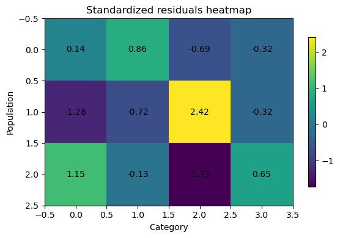

# 동질성 잔차 열지도

## 개요

카이제곱 동질성 검정이 귀무가설을 기각한 뒤에 자연스럽게 따라오는 질문은 **어느 칸이 동질성 이탈의 원인인가?**이다. 이 페이지에서는 표준화(Pearson) 잔차, Bonferroni 보정을 적용한 칸별 유의성 검정, 그리고 열지도 시각화를 이용한 사후 진단을 보인다. 이 접근은 어떤 모집단–범주 조합이 기대 분포에서 가장 많이 벗어나는지 짚어내도록 돕는다.

## 표준화 잔차

칸 $(i, j)$의 **Pearson 표준화 잔차**는

$$
R_{ij} = \frac{O_{ij} - E_{ij}}{\sqrt{E_{ij}}}
$$

이다. $H_0$ 아래에서 표본이 크면 각 $R_{ij}$는 근사적으로 표준정규를 따른다. $|R_{ij}| > 2$인 잔차는 그 칸이 전체 카이제곱 통계량에 뚜렷하게 기여함을 시사한다.

전체 카이제곱 통계량이 잔차 제곱의 합이라는 점에 유의하라:

$$
\chi^2 = \sum_{i,j} R_{ij}^2
$$

## Bonferroni 보정을 적용한 칸별 유의성

각 표준화 잔차를 근사적인 $z$-점수로 볼 수 있다. 칸 $(i,j)$의 양측 p-값은

$$
p_{ij} = 2\bigl[1 - \mathcal{N}(|R_{ij}|)\bigr]
$$

이며 $\mathcal{N}$은 표준정규 누적분포함수이다. $r \times c$개의 칸을 동시에 검정하므로 가족단위 오류율을 통제하기 위해 **Bonferroni 보정**을 적용한다:

$$
p_{ij}^{\text{Bonf}} = \min\bigl(r \cdot c \cdot p_{ij},\; 1\bigr)
$$

$p_{ij}^{\text{Bonf}} < \alpha$이면 그 칸을 유의하다고 표시한다.

## 코드

### 잔차와 조정 p-값 계산

```python
import numpy as np
from scipy import stats
from statsmodels.stats.multitest import multipletests

observed = np.array([
    [25, 30, 20, 25],
    [18, 22, 35, 25],
    [30, 25, 15, 30],
], dtype=float)

row_tot = observed.sum(axis=1, keepdims=True)
col_tot = observed.sum(axis=0, keepdims=True)
tot = observed.sum()
expected = (row_tot @ col_tot) / tot

# Pearson 표준화 잔차. 제곱해서 모두 더하면 카이제곱 통계량이 된다.
# 분모가 sqrt(E)인 것은 H0 아래에서 각 칸 도수의 분산이 근사적으로 E이기 때문이다.
resid = (observed - expected) / np.sqrt(expected)

# 칸마다 z-검정을 하는 셈이라 다중검정 문제가 생긴다. 그래서 아래에서 보정한다.
z = resid.ravel()
pvals = 2 * (1 - stats.norm.cdf(np.abs(z)))
reject, pvals_bonf, _, _ = multipletests(pvals, method="bonferroni")
pvals_bonf = pvals_bonf.reshape(observed.shape)
reject = reject.reshape(observed.shape)

print("Standardized residuals:")
print(resid)
print()
print("Bonferroni-adjusted per-cell p-values:")
print(pvals_bonf)
```

출력:

```
Standardized residuals:
[[ 0.13514748  0.8553372  -0.69006556 -0.32274861]
 [-1.28390102 -0.72374686  2.41522946 -0.32274861]
 [ 1.14875354 -0.13159034 -1.7251639   0.64549722]]

Bonferroni-adjusted per-cell p-values:
[[1.        1.        1.        1.       ]
 [1.        1.        0.1887036 1.       ]
 [1.        1.        1.        1.       ]]
```

전체 검정은 $p = 0.028$로 기각했는데(앞 페이지) 칸별로 보면 Bonferroni 보정 후 유의한 칸이 하나도 없다. 가장 큰 잔차인 2.415(모집단 2, 범주 3)조차 보정 후 $p = 0.189$다.

이런 어긋남은 흔하다. 전체 검정은 12개 칸의 어긋남을 **모아서** 보고, 칸별 검정은 12번의 검정에 대한 대가를 각각 치른다. 전체 검정이 유의한데 어느 칸도 유의하지 않은 것은 모순이 아니라, 증거가 한 칸에 몰려 있지 않고 흩어져 있다는 뜻이다.

여기서 Bonferroni는 상당히 보수적이기도 하다. 잔차들은 서로 독립이 아니라 주변 합계 제약으로 묶여 있으므로(제곱합이 카이제곱 통계량으로 고정된다) 12로 곱하는 것은 필요 이상이다.

### 열지도 시각화

```python
import matplotlib.pyplot as plt

fig, ax = plt.subplots(figsize=(6, 4))
im = ax.imshow(resid, aspect="auto")
ax.set_title("Standardized residuals heatmap")
ax.set_xlabel("Category")
ax.set_ylabel("Population")
plt.colorbar(im, ax=ax, shrink=0.8)

# Annotate significant cells after Bonferroni
for i in range(observed.shape[0]):
    for j in range(observed.shape[1]):
        # 보정 후 유의한 칸에만 별표를 붙인다. 이 예제에서는 하나도 없다.
        mark = "*" if reject[i, j] else ""
        ax.text(j, i, f"{resid[i, j]:.2f}{mark}",
                ha="center", va="center", fontsize=10)

plt.tight_layout()
plt.show()
```



색으로 어느 칸이 기대보다 많고 적은지 한눈에 보인다. 모집단 2의 범주 3이 가장 밝고(+2.42), 모집단 3의 범주 3이 가장 어둡다(−1.73). 즉 범주 3의 선호가 모집단에 따라 갈리는 것이 이 표의 주된 구조다.

`*`로 표시된 칸은 Bonferroni 보정 후에도 통계적으로 유의한 칸이다. 색의 변화 덕분에 어느 칸의 잔차가 가장 크게 양(과다 대표)이거나 음(과소 대표)인지 쉽게 알아볼 수 있다.

## 해석

열지도는 동질성 아래의 기대 패턴에서 관측 자료가 어디에서 갈라지는지를 한눈에 요약해 준다. 핵심은 다음과 같다:

- **양의 잔차**(따뜻한 색)는 그 모집단이 해당 범주에서 기대보다 관측값이 많음을 뜻한다.
- **음의 잔차**(차가운 색)는 기대보다 적음을 뜻한다.
- 별표(`*`)는 다중비교 보정 후에도 이탈이 통계적으로 유의한 칸을 표시한다.

전체 카이제곱 검정은 모집단들이 다르다는 사실*만* 알려줄 뿐 *어떻게* 다른지는 알려주지 않으므로, 이런 사후분석이 꼭 필요하다.

## 연습문제

**1.** 관측도수 $O = 40$, 기대도수 $E = 25$일 때 표준화 잔차와 보정하지 않은 양측 p-값을 계산하라.

??? success "풀이"

    $$
    R = \frac{O - E}{\sqrt{E}} = \frac{40 - 25}{\sqrt{25}} = \frac{15}{5} = 3.0
    $$

    양측 p-값은

    $$
    p = 2[1 - \mathcal{N}(3.0)] = 2 \times 0.00135 = 0.0027
    $$

    이다. 이 칸은 다중비교 보정 이전부터 매우 유의한 과다 대표를 보인다. $\square$

---

**2.** $4 \times 3$ 표에는 칸이 12개 있다. 칸별 p-값을 계산했더니 가장 작은 보정 전 p-값이 $0.006$이었다. Bonferroni 보정 후 이 칸은 $\alpha = 0.05$에서 유의한가?

??? success "풀이"

    Bonferroni 보정 p-값은

    $$
    p^{\text{Bonf}} = 12 \times 0.006 = 0.072
    $$

    이다. $0.072 > 0.05$이므로 보정 전 p-값이 작았음에도 이 칸은 Bonferroni 보정 후 유의하지 **않다**. 비교 횟수가 많을 때 Bonferroni가 얼마나 보수적일 수 있는지 보여준다. $\square$

---

**3.** **표준화 잔차** $R_{ij} = (O_{ij} - E_{ij})/\sqrt{E_{ij}}$와 **조정 표준화 잔차** $R_{ij}^{\text{adj}} = (O_{ij} - E_{ij})/\sqrt{E_{ij}(1 - R_i/n)(1 - C_j/n)}$의 차이를 설명하라. $H_0$ 아래에서 어느 쪽이 $N(0,1)$에 더 가까운 분포를 갖는가?

??? success "풀이"

    Pearson 표준화 잔차는 $\sqrt{E_{ij}}$로 나누는데, 이는 $H_0$ 아래에서 $O_{ij} - E_{ij}$의 표준편차에 대한 근사일 뿐이다. 잔차의 참 분산은 인자 $(1 - R_i/n)(1 - C_j/n)$을 통해 주변 합계에도 의존한다.

    **조정 표준화 잔차**는 이 보정을 반영한다:

    $$
    R_{ij}^{\text{adj}} = \frac{O_{ij} - E_{ij}}{\sqrt{E_{ij}(1 - R_i/n)(1 - C_j/n)}}
    $$

    $H_0$ 아래에서 $R_{ij}^{\text{adj}}$의 분포가 보정하지 않은 잔차보다 $N(0,1)$에 더 가깝다. 따라서 칸별 가설검정에는 조정 잔차가 선호된다. 다만 탐색적인 열지도에는 보정하지 않은 형태도 여전히 흔히 쓰인다. $\square$

---

**4.** Bonferroni 보정을 왜 "보수적"이라고 하는가? 다중비교의 대안을 하나 들고 어떻게 다른지 설명하라.

??? success "풀이"

    Bonferroni 보정은 유의수준 $\alpha$를 모든 비교에 똑같이 나누어 $m$개 검정 각각의 문턱으로 $\alpha / m$을 쓰는 방식으로 **가족단위 오류율**(FWER)을 통제한다. 검정이 많아지면 이 문턱이 아주 작아져, 참 효과가 있어도 개별 가설을 기각하기 어려워진다(검정력이 낮다).

    대안으로 **Benjamini-Hochberg(BH) 절차**가 있다. FWER 대신 **거짓발견율**(FDR)을 통제한다. FDR은 기각된 가설 중 거짓 양성의 기대 비율이다. BH는 p-값을 정렬한 뒤 적절한 절단 지표 $i$에 대해 $p_{(i)} \le (i/m)\alpha$인 가설을 모두 기각한다. Bonferroni보다 덜 보수적이어서, 통제된 비율의 거짓 발견을 감수하는 대신 검정력을 더 얻는다. `statsmodels`에서는 `multipletests(pvals, method="fdr_bh")`로 쓸 수 있다. $\square$

---

**5.** $\sum_{i,j} R_{ij}^2 = \chi^2$, 즉 카이제곱 통계량이 표준화 잔차 제곱의 합과 같음을 증명하라.

??? success "풀이"

    정의에 의해 표준화 잔차는 $R_{ij} = (O_{ij} - E_{ij}) / \sqrt{E_{ij}}$이다. 제곱하면

    $$
    R_{ij}^2 = \frac{(O_{ij} - E_{ij})^2}{E_{ij}}
    $$

    이다. 모든 칸에 대해 합하면

    $$
    \sum_{i=1}^{r}\sum_{j=1}^{c} R_{ij}^2 = \sum_{i=1}^{r}\sum_{j=1}^{c} \frac{(O_{ij} - E_{ij})^2}{E_{ij}} = \chi^2
    $$

    이 되는데, 이것이 바로 Pearson 카이제곱 통계량의 정의이다. 이 분해는 $\chi^2$가 모든 칸의 기여를 모은 값임을 보여주며, $R_{ij}$(또는 $R_{ij}^2$)의 열지도는 그 총합이 표 전체에 어떻게 흩어져 있는지 드러낸다. $\square$

---

## 정리하며

기각한 뒤에 **어느 칸이 원인인지**를 찾는 절차다.

$$
R_{ij}=\frac{O_{ij}-E_{ij}}{\sqrt{E_{ij}}}
$$

- **표준화 잔차가 칸별 기여도를 말해 준다.** $\sum_{ij}R_{ij}^2$ 이 곧 $\chi^2$ 통계량이므로, 절댓값이 큰 칸이 기각을 이끈 칸이다.
- **대략 $|R|>2$ 를 주목한다.** 근사적으로 표준정규를 따르므로 $2$ 를 넘으면 눈여겨볼 만하다. **다만 칸이 많으면 우연히 넘는 칸이 생긴다.**
- **그래서 본페로니 보정을 함께 쓴다.** 칸 수만큼 검정하는 셈이므로 문턱을 조정해야 하며, 9장의 다중검정 논의가 그대로 적용된다.
- **열지도가 읽기 쉽다.** 잔차의 부호와 크기를 색으로 보이면 어느 집단이 어느 범주에서 기대보다 많고 적은지가 한눈에 들어온다.
- **사후 분석은 탐색이다.** 자료를 보고 고른 칸이므로, 확증하려면 새 자료가 필요하다.

다음 절 **McNemar 검정**으로 넘어간다. 지금까지는 독립표본이었지만 이제 **대응된 이진 자료**를 다룬다.
