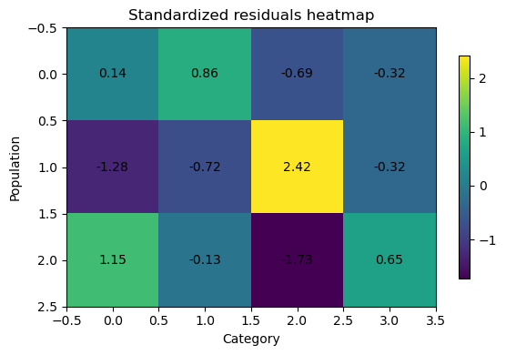

# 동질성 잔차 열지도

## 개요

카이제곱 동질성 검정이 귀무가설을 기각한 뒤에 자연스럽게 따라오는 질문은 **어느 칸이 동질성 이탈의 원인인가?**이다. 이 페이지에서는 표준화(Pearson) 잔차, Bonferroni 보정을 적용한 칸별 유의성 검정, 그리고 열지도 시각화를 이용한 사후 진단을 보인다. 이 접근은 어떤 모집단–범주 조합이 기대 분포에서 가장 많이 벗어나는지 짚어내도록 돕는다.

## 표준화 잔차

칸 $(i, j)$의 **Pearson 표준화 잔차**는

$$
R_{ij} = \frac{O_{ij} - E_{ij}}{\sqrt{E_{ij}}}
$$

이다. $H_0$ 아래에서 표본이 크면 각 $R_{ij}$는 근사적으로 표준정규를 따른다. $|R_{ij}| > 2$인 잔차는 그 칸이 전체 카이제곱 통계량에 뚜렷하게 기여함을 시사한다.

전체 카이제곱 통계량이 잔차 제곱의 합이라는 점에 유의하라:

$$
\chi^2 = \sum_{i,j} R_{ij}^2
$$

## Bonferroni 보정을 적용한 칸별 유의성

각 표준화 잔차를 근사적인 $z$-점수로 볼 수 있다. 칸 $(i,j)$의 양측 p-값은

$$
p_{ij} = 2\bigl[1 - \mathcal{N}(|R_{ij}|)\bigr]
$$

이며 $\mathcal{N}$은 표준정규 누적분포함수이다. $r \times c$개의 칸을 동시에 검정하므로 가족단위 오류율을 통제하기 위해 **Bonferroni 보정**을 적용한다:

$$
p_{ij}^{\text{Bonf}} = \min\bigl(r \cdot c \cdot p_{ij},\; 1\bigr)
$$

$p_{ij}^{\text{Bonf}} < \alpha$이면 그 칸을 유의하다고 표시한다.

### 잔차와 조정 p-값 계산

<div class="exbox" markdown>

**보기 1.** <span class="diff easy" title="쉬움"></span> 잔차로 어느 칸이 어긋났는지 찾기. 모집단 셋에서 **각각 100명씩** 뽑아 네 범주 가운데 하나를 고르게 했다.

$$
\begin{array}{c|cccc|r}
 & \text{범주 1} & \text{범주 2} & \text{범주 3} & \text{범주 4} & \text{행 합} \\ \hline
\text{모집단 1} & 25 & 30 & 20 & 25 & 100 \\
\text{모집단 2} & 18 & 22 & 35 & 25 & 100 \\
\text{모집단 3} & 30 & 25 & 15 & 30 & 100 \\ \hline
\text{열 합} & 73 & 77 & 70 & 80 & 300
\end{array}
$$

**(1)** 기대도수가 **열에만 의존**함을 보이고 유리수로 구하시오. 표준화 잔차 $R_{ij}$ 가운데 절댓값이 가장 큰 칸을 찾으시오.

**(2)** $\chi^2 = \sum_{ij} R_{ij}^2$ 로 전체 통계량과 p-값을 구해 $\alpha = 0.05$ 에서 판정하시오.

**(3)** $R_{ij}$ 를 표준정규로 보고 칸별 z-검정을 하는 것은 **보수적**이다. 행 합이 $n_i$ 로 고정된 설계에서

$$
\operatorname{Var}(O_{ij} - E_{ij}) = n_i\left(1 - \frac{n_i}{n}\right)p_j(1-p_j),
\qquad\text{곧}\qquad
\operatorname{Var}(R_{ij}) = \left(1 - \frac{R_i}{n}\right)\!\left(1 - \frac{C_j}{n}\right)
$$

임을 보이고, 이 표에서 그 값이 얼마인지 구하시오. 또 $\sum_{ij}\operatorname{Var}(R_{ij}) = (r-1)(c-1)$ 임을 보이시오.

**(4)** 그러면 **조정 잔차** $\tilde R_{ij} = R_{ij}\big/\sqrt{(1-R_i/n)(1-C_j/n)}$ 로 다시 판정할 때 결론이 달라지는가. 코드로 확인하시오.

</div>

??? success "풀이"

    **(1) 기대도수와 잔차.** 행 합이 셋 다 $100$ 이므로

    $$
    E_{ij} = \frac{R_i C_j}{n} = \frac{100 \cdot C_j}{300} = \frac{C_j}{3}
    $$

    이고 **$i$ 가 식에서 사라진다.** 세 행의 기대도수가 똑같다. 균형설계라 그렇다.

    $$
    E_{\cdot 1} = \frac{73}{3} = 24.3\overline{3}, \quad
    E_{\cdot 2} = \frac{77}{3} = 25.6\overline{6}, \quad
    E_{\cdot 3} = \frac{70}{3} = 23.3\overline{3}, \quad
    E_{\cdot 4} = \frac{80}{3} = 26.6\overline{6}
    $$

    잔차 $R_{ij} = (O_{ij}-E_{ij})/\sqrt{E_{ij}}$ 를 칸마다 적는다.

    $$
    \begin{array}{c|rrrr}
     & \text{범주 1} & \text{범주 2} & \text{범주 3} & \text{범주 4} \\ \hline
    \text{모집단 1} & +0.1351 & +0.8553 & -0.6901 & -0.3227 \\
    \text{모집단 2} & -1.2839 & -0.7237 & \mathbf{+2.4152} & -0.3227 \\
    \text{모집단 3} & +1.1488 & -0.1316 & -1.7252 & +0.6455
    \end{array}
    $$

    **가장 큰 칸은 (모집단 2, 범주 3)의 $+2.4152$ 다.** 손으로 확인해 보면

    $$
    R_{23} = \frac{35 - 70/3}{\sqrt{70/3}} = \frac{35/3}{\sqrt{70/3}} = 2.41523
    $$

    이다. 두 번째로 큰 것은 같은 열의 $-1.7252$(모집단 3, 범주 3)이다. **범주 3 이 모집단 2 에 몰리고 모집단 3 에서 빠진 것**이 이 표의 주된 구조다.

    **열 방향의 검산이 공짜로 따라온다.** 이 표에서는 $E$ 가 열마다 상수이므로

    $$
    \sum_{i} R_{ij} = \frac{1}{\sqrt{E_{\cdot j}}}\sum_i (O_{ij} - E_{ij}) = 0
    $$

    이다. 실제로 범주 3 열은 $-0.6901 + 2.4152 - 1.7252 = 0$ 이다. 반면 **행 방향으로는 0 이 아니다.** 행 안에서는 $E$ 가 칸마다 달라 $\sqrt{E}$ 가 무게를 바꾸기 때문이다(모집단 1 의 행 합은 $-0.0223$).

    **(2) 전체 검정.** 잔차를 제곱해 모두 더한다.

    $$
    \chi^2 = \sum_{ij} R_{ij}^2 = 14.1697,
    \qquad
    \text{df} = (3-1)(4-1) = 6,
    \qquad
    p = P(\chi^2_6 \ge 14.1697) = 0.02780
    $$

    $p = 0.0278 < 0.05$ 이므로 $H_0$ 을 **기각한다.** 세 모집단의 범주 분포가 같지는 않다.

    **(3) 표준화 잔차는 분산이 1 이 아니다.** 여기가 핵심이다. 행 합 $n_i$ 가 설계로 고정되어 있으므로 행마다 독립인 다항표본이고 $O_{ij} \sim \text{Bin}(n_i, p_j)$ 다. 그런데 $E_{ij} = n_i C_j/n$ 의 $C_j = \sum_k O_{kj}$ 는 **자료에서 온 양**이다. 그러므로 $O_{ij}$ 를 따로 떼어 분산을 재면 안 되고, $E_{ij}$ 가 함께 흔들리는 것을 같이 세어야 한다. $a = n_i/n$ 이라 두면

    $$
    O_{ij} - E_{ij} = O_{ij} - a\sum_k O_{kj} = (1-a)\,O_{ij} - a\sum_{k \ne i} O_{kj}
    $$

    이고 행이 서로 독립이므로

    $$
    \operatorname{Var}(O_{ij}-E_{ij})
    = (1-a)^2 n_i p_j q_j + a^2 \sum_{k\ne i} n_k p_j q_j
    = p_j q_j\Bigl[(1-a)^2 n a + a^2 n(1-a)\Bigr]
    $$

    $$
    = n\,p_j q_j\, a(1-a)\bigl[(1-a) + a\bigr]
    = n_i\left(1 - \frac{n_i}{n}\right) p_j (1-p_j)
    $$

    다($q_j = 1 - p_j$, $\sum_{k \ne i} n_k = n - n_i$ 를 썼다). **근사가 전혀 쓰이지 않았다.** $E_{ij} = n_i p_j$ 로 나누면

    $$
    \operatorname{Var}(R_{ij}) = \frac{n_i(1-n_i/n)p_j(1-p_j)}{n_i p_j} = \left(1-\frac{n_i}{n}\right)(1-p_j)
    = \left(1-\frac{R_i}{n}\right)\!\left(1-\frac{C_j}{n}\right)
    $$

    이다. 이 표에서 $R_i/n = 100/300 = 1/3$ 이므로 첫 인수는 모든 행에서 $2/3$ 이고, $C_j/n$ 이 $0.2433 \sim 0.2667$ 이므로 둘째 인수는 $0.7333 \sim 0.7567$ 이다. 곱하면

    $$
    \operatorname{Var}(R_{ij}) = 0.4889 \sim 0.5111
    $$

    **약 $1/2$ 다.** $R_{ij}$ 의 표준편차가 $1$ 이 아니라 $0.70$ 쯤이라는 뜻이다. 그런데도 $R_{ij}$ 를 표준정규 $z$ 로 읽으면 분포를 실제보다 **넓게** 잡는 것이 되어 p-값이 커진다. **잔차가 작아 보이는 것이 아니라 자가 늘어나 있는 것이다.**

    합도 깔끔하다. 곱의 합이 합의 곱으로 갈라지므로

    $$
    \sum_{i,j}\operatorname{Var}(R_{ij})
    = \left(\sum_{i=1}^r \Bigl(1-\frac{R_i}{n}\Bigr)\right)\!\left(\sum_{j=1}^c \Bigl(1-\frac{C_j}{n}\Bigr)\right)
    = (r-1)(c-1)
    $$

    이다. 괄호 안이 각각 $r - \sum_i R_i/n = r-1$, $c - 1$ 이기 때문이다. 여기서는 $2 \times 3 = 6$ 으로 **자유도와 정확히 같다.** 앞 장에서 본 $E[\chi^2] = \text{df}$ 가 이 식의 다른 얼굴이다. 칸마다 분산이 1 이라면 $E[\chi^2]$ 가 $rc = 12$ 가 되어야 하는데 실제로는 6 이다. **칸별로 "분산 1 인 $z$" 가 12 개 있는 것이 아니라, 반쪽짜리가 12 개 있는 것이다.**

    **(4) 조정 잔차로 다시 보면 결론이 뒤집힌다.** $\tilde R_{ij} = R_{ij}/\sqrt{(1-R_i/n)(1-C_j/n)}$ 은 정의상 분산이 1 이다. 가장 큰 칸에서

    $$
    \tilde R_{23} = \frac{2.41523}{\sqrt{(2/3)(1 - 70/300)}} = \frac{2.41523}{\sqrt{0.51111}} = 3.3783
    $$

    이다. 칸이 12 개이므로 본페로니 임계값은 $z_{1-0.025/12} = 2.8653$ 인데 $3.3783$ 이 이를 넘는다. **표준화 잔차로는 하나도 유의하지 않았지만 조정 잔차로는 (모집단 2, 범주 3)이 유의하다.** 보정 p-값으로 적으면 $0.1887$ 에서 $0.0088$ 로 **21 배** 줄어든다.

    분모에 $\sqrt{(1-R_i/n)(1-C_j/n)}$ 한 줄을 넣고 말고가 결론을 가른다.

    **수치적으로.**

    ```python
    import numpy as np
    from scipy import stats
    from statsmodels.stats.multitest import multipletests

    observed = np.array([
        [25, 30, 20, 25],
        [18, 22, 35, 25],
        [30, 25, 15, 30],
    ], dtype=float)

    row_tot = observed.sum(axis=1, keepdims=True)
    col_tot = observed.sum(axis=0, keepdims=True)
    tot = observed.sum()
    expected = (row_tot @ col_tot) / tot

    # Pearson 표준화 잔차. 제곱해서 모두 더하면 카이제곱 통계량이 된다.
    # 분모가 sqrt(E)인 것은 H0 아래에서 각 칸 도수의 분산이 근사적으로 E이기 때문이다.
    resid = (observed - expected) / np.sqrt(expected)

    # 칸마다 z-검정을 하는 셈이라 다중검정 문제가 생긴다. 그래서 아래에서 보정한다.
    z = resid.ravel()
    pvals = 2 * (1 - stats.norm.cdf(np.abs(z)))
    reject, pvals_bonf, _, _ = multipletests(pvals, method="bonferroni")
    pvals_bonf = pvals_bonf.reshape(observed.shape)
    reject = reject.reshape(observed.shape)

    print("Standardized residuals:")
    print(resid)
    print()
    print("Bonferroni-adjusted per-cell p-values:")
    print(pvals_bonf)

    # (2) 전체 검정
    chi2 = (resid ** 2).sum()
    df = (observed.shape[0] - 1) * (observed.shape[1] - 1)
    print(f"\nchi2 = {chi2:.4f}, df = {df}, p = {stats.chi2(df).sf(chi2):.5f}")

    # (3) 표준화 잔차의 분산은 1 이 아니다
    var_factor = (1 - row_tot / tot) * (1 - col_tot / tot)
    print(f"Var(R_ij) 범위  {var_factor.min():.4f} ~ {var_factor.max():.4f}")
    print(f"Var(R_ij) 의 합 {var_factor.sum():.4f}   (r-1)(c-1) = {df}")

    # (4) 조정 잔차
    adj = resid / np.sqrt(var_factor)
    adj_bonf = np.minimum(1.0, 12 * 2 * stats.norm.sf(np.abs(adj)))
    print(f"\n조정 잔차\n{np.round(adj, 4)}")
    print(f"최대 |조정 잔차| {np.abs(adj).max():.4f}  "
          f"본페로니 임계값 {stats.norm.ppf(1 - 0.025 / 12):.4f}")
    print(f"그 칸의 보정 p-값  표준화 {pvals_bonf.min():.4f}  ->  조정 {adj_bonf.min():.4f}")
    ```

    출력:

    ```
    Standardized residuals:
    [[ 0.13514748  0.8553372  -0.69006556 -0.32274861]
     [-1.28390102 -0.72374686  2.41522946 -0.32274861]
     [ 1.14875354 -0.13159034 -1.7251639   0.64549722]]

    Bonferroni-adjusted per-cell p-values:
    [[1.        1.        1.        1.       ]
     [1.        1.        0.1887036 1.       ]
     [1.        1.        1.        1.       ]]

    chi2 = 14.1697, df = 6, p = 0.02780
    Var(R_ij) 범위  0.4889 ~ 0.5111
    Var(R_ij) 의 합 6.0000   (r-1)(c-1) = 6

    조정 잔차
    [[ 0.1903  1.215  -0.9652 -0.4616]
     [-1.8077 -1.0281  3.3783 -0.4616]
     [ 1.6174 -0.1869 -2.4131  0.9232]]
    최대 |조정 잔차| 3.3783  본페로니 임계값 2.8653
    그 칸의 보정 p-값  표준화 0.1887  ->  조정 0.0088
    ```

    표준화 잔차 열두 개가 (1)의 표와 네 자리까지 같고, `chi2 = 14.1697`, `p = 0.02780` 이 (2)와 맞는다. `Var(R_ij) 의 합 6.0000` 이 $(r-1)(c-1) = 6$ 과 **정확히** 같은 것이 (3)에서 유도한 식이다. 조정 잔차의 최댓값 `3.3783` 과 임계값 `2.8653` 도 (4)의 손계산 그대로다.

    **두 결론이 갈린다.** 표준화 잔차로 보면 보정 뒤 유의한 칸이 하나도 없고(가장 작은 보정 p-값이 $0.1887$), 조정 잔차로 보면 (모집단 2, 범주 3)이 $0.0088$ 로 유의하다.

    표준화 잔차 쪽만 보고 "전체 검정은 유의한데 어느 칸도 유의하지 않다" 고 적으면, 그것은 증거가 흩어져 있다는 말처럼 들린다. 그러나 여기서는 그렇지 않았다. **증거는 한 칸에 몰려 있었고, 자가 틀려서 보이지 않았을 뿐이다.**

    본페로니가 보수적인 것도 사실이다. 열두 잔차는 서로 독립이 아니라 주변합 제약으로 묶여 있으므로(제곱합이 $\chi^2$ 으로 고정된다) 12 를 곱하는 것은 필요 이상이다. 다만 그 보수성만으로는 $0.1887$ 과 $0.0088$ 사이의 21 배를 설명하지 못한다. **둘 다 똑같이 12 를 곱한 값**이기 때문이다.

### 열지도 시각화

<div class="exbox" markdown>

**보기 2.** <span class="diff easy" title="쉬움"></span> 잔차를 열지도로 보기. 보기 1 의 잔차 행렬을 `imshow` 로 칠하고 칸마다 값을 적는다.

**(1)** 그려 보고 **표에서는 잘 안 보이던 것**이 무엇인지 말하시오. 수치와 함께 적으시오.

**(2)** 이 그림이 **잘못 읽히기 쉬운 점** 셋을 짚으시오. 색지도의 선택, 별표의 뜻, 칸들 사이의 제약을 보시오.

</div>

??? success "풀이"

    **(1) 그림에서 읽히는 것 — 세 번째 열이 전부다.**

    가장 밝은 칸이 (모집단 2, 범주 3)의 $+2.42$, 가장 어두운 칸이 **바로 아래** (모집단 3, 범주 3)의 $-1.73$ 이다. **표에서 가장 큰 두 수가 같은 열에 위아래로 붙어 있다**는 것이 색으로 보면 즉시 눈에 들어온다. 나머지 아홉 칸은 $\lvert R \rvert \le 1.29$ 로 모두 중간색 언저리에 뭉쳐 있다.

    범주 3 열만 떼어 보면 $(-0.69,\ +2.42,\ -1.73)$ 이고, 제곱해 더하면 $0.476 + 5.833 + 2.976 = 9.286$ 이다. 전체 $\chi^2 = 14.1697$ 의 **$66\%$** 다. 칸이 12 개인데 **한 열 세 칸이 통계량의 3분의 2를 만든다.**

    원자료로 되돌리면 범주 3 을 고른 사람이 모집단별로 $20, 35, 15$ 명이다. 셋 다 기대 $23.3$ 명인데 모집단 2 에서 $1.5$ 배, 모집단 3 에서 $0.64$ 배다. **"세 모집단이 다르다" 가 아니라 "모집단 2 가 범주 3 을 유난히 좋아한다" 가 이 자료의 내용**이다.

    **(2) 잘못 읽히기 쉬운 점 셋.**

    **첫째, 색지도가 0 을 중심으로 대칭이 아니다.** `imshow` 의 기본 색지도는 어두운 보라에서 밝은 노랑으로 **한 방향으로** 가는 연속 색지도이고, 범위는 자료의 최솟값 $-1.73$ 에서 최댓값 $+2.42$ 로 잡힌다. 그러면 **$0$ 이 색 띠의 가운데에 놓이지 않는다.**

    $$
    \frac{0 - (-1.7252)}{2.4152 - (-1.7252)} = \frac{1.7252}{4.1404} = 0.417
    $$

    곧 $0$ 이 색 띠의 $41.7\%$ 지점에 있다. 그래서 $+0.14$ 와 $-0.13$ 처럼 **크기가 거의 같고 부호만 다른 두 칸이 같은 색으로 보인다.** 잔차처럼 부호에 뜻이 있는 양에는 $0$ 을 가운데에 고정한 **발산형 색지도**(예: `cmap="coolwarm", vmin=-2.5, vmax=2.5`)를 써야 한다. 그래야 "기대보다 많다 / 적다" 가 색으로 갈린다.

    **둘째, 별표가 없다는 것이 "유의한 칸이 없다"는 뜻이 아니다.** 코드의 `reject` 는 **표준화** 잔차로 계산한 것이다. 보기 1 (4)에서 보았듯 그 잣대는 분산이 $0.5$ 인 양을 분산 $1$ 로 재는 잘못된 자이고, 조정 잔차로 바꾸면 $+2.42$ 칸은 보정 p-값 $0.0088$ 로 **유의하다.** 그림에 별표가 하나도 없는 것은 자료의 성질이 아니라 **코드가 고른 잔차의 성질**이다.

    **셋째, 칸들이 서로 묶여 있다.** 보기 1 (1)에서 보았듯 이 표에서는 열마다 $\sum_i R_{ij} = 0$ 이다. 그래서 **범주 3 열에서 모집단 2 가 밝으면 다른 두 모집단은 반드시 어두워야 한다.** 밝은 칸 하나와 어두운 칸 하나를 "두 개의 발견" 으로 세면 안 된다. 독립인 발견은 하나뿐이고, 자유도가 $12$ 가 아니라 $6$ 인 것이 그 사정이다.

    덧붙여 축 눈금이 $-0.5, 0.0, 0.5, \ldots$ 로 **칸 경계에 걸쳐** 찍혀 있다. `set_xticks([0,1,2,3])` 로 범주 이름을 직접 달아 주는 편이 낫다.

    **정리.** 이 열지도는 **"어디를 볼 것인가" 를 찾는 데는 좋고 "유의한가" 를 판정하는 데는 쓸 수 없다.** 전자는 범주 3 열이라고 즉시 답해 주고, 후자는 보기 1 의 조정 잔차와 본페로니 문턱이 있어야 답할 수 있다.

    **수치적으로.**

    ```python
    import matplotlib.pyplot as plt

    fig, ax = plt.subplots(figsize=(6, 4))
    im = ax.imshow(resid, aspect="auto")
    ax.set_title("Standardized residuals heatmap")
    ax.set_xlabel("Category")
    ax.set_ylabel("Population")
    plt.colorbar(im, ax=ax, shrink=0.8)

    # 본페로니 보정 뒤에도 유의한 칸에 표시를 남긴다
    for i in range(observed.shape[0]):
        for j in range(observed.shape[1]):
            # 보정 후 유의한 칸에만 별표를 붙인다. 이 보기에서는 하나도 없다.
            mark = "*" if reject[i, j] else ""
            ax.text(j, i, f"{resid[i, j]:.2f}{mark}",
                    ha="center", va="center", fontsize=10)

    plt.tight_layout()
    plt.show()
    ```

    

    모집단 2 의 범주 3 이 가장 밝고($+2.42$), 모집단 3 의 범주 3 이 가장 어둡다($-1.73$). (1)에서 말한 대로 **가장 밝은 칸과 가장 어두운 칸이 같은 열에 위아래로 붙어 있다.** 나머지 아홉 칸은 색이 서로 비슷해 중간에 뭉쳐 있다.

    `*` 는 보정 뒤에도 유의한 칸에 붙는 표시인데 **이 그림에는 하나도 없다.** (2)에서 본 대로 `reject` 를 표준화 잔차로 계산했기 때문이고, 조정 잔차로 바꾸면 $+2.42$ 칸에 별표가 붙는다. 색 띠의 가운데가 $0$ 이 아니라 $-0.13$ 쯤에 놓여 있다는 것도 눈금을 따라가 보면 확인된다.

## 해석

열지도는 동질성 아래의 기대 패턴에서 관측 자료가 어디에서 갈라지는지를 한눈에 요약해 준다. 핵심은 다음과 같다:

- **양의 잔차**(따뜻한 색)는 그 모집단이 해당 범주에서 기대보다 관측값이 많음을 뜻한다.
- **음의 잔차**(차가운 색)는 기대보다 적음을 뜻한다.
- 별표(`*`)는 다중비교 보정 후에도 이탈이 통계적으로 유의한 칸을 표시한다.

전체 카이제곱 검정은 모집단들이 다르다는 사실*만* 알려줄 뿐 *어떻게* 다른지는 알려주지 않으므로, 이런 사후분석이 꼭 필요하다.

## 연습문제

<div class="drillbox" markdown>

**연습문제 1.** <span class="diff easy" title="쉬움"></span>
관측도수 $O = 40$, 기대도수 $E = 25$일 때 표준화 잔차와 보정하지 않은 양측 p-값을 계산하라.

</div>

??? success "풀이"

    $$
    R = \frac{O - E}{\sqrt{E}} = \frac{40 - 25}{\sqrt{25}} = \frac{15}{5} = 3.0
    $$

    양측 p-값은

    $$
    p = 2[1 - \mathcal{N}(3.0)] = 2 \times 0.00135 = 0.0027
    $$

    이다. 이 칸은 다중비교 보정 이전부터 매우 유의한 과다 대표를 보인다. $\square$

<div class="drillbox" markdown>

**연습문제 2.** <span class="diff med" title="중간"></span>
$4 \times 3$ 표에는 칸이 12개 있다. 칸별 p-값을 계산했더니 가장 작은 보정 전 p-값이 $0.006$이었다. Bonferroni 보정 후 이 칸은 $\alpha = 0.05$에서 유의한가?

</div>

??? success "풀이"

    Bonferroni 보정 p-값은

    $$
    p^{\text{Bonf}} = 12 \times 0.006 = 0.072
    $$

    이다. $0.072 > 0.05$이므로 보정 전 p-값이 작았음에도 이 칸은 Bonferroni 보정 후 유의하지 **않다**. 비교 횟수가 많을 때 Bonferroni가 얼마나 보수적일 수 있는지 보여준다. $\square$

<div class="drillbox" markdown>

**연습문제 3.** <span class="diff med" title="중간"></span>
**표준화 잔차** $R_{ij} = (O_{ij} - E_{ij})/\sqrt{E_{ij}}$와 **조정 표준화 잔차** $R_{ij}^{\text{adj}} = (O_{ij} - E_{ij})/\sqrt{E_{ij}(1 - R_i/n)(1 - C_j/n)}$의 차이를 설명하라. $H_0$ 아래에서 어느 쪽이 $N(0,1)$에 더 가까운 분포를 갖는가?

</div>

??? success "풀이"

    Pearson 표준화 잔차는 $\sqrt{E_{ij}}$로 나누는데, 이는 $H_0$ 아래에서 $O_{ij} - E_{ij}$의 표준편차에 대한 근사일 뿐이다. 잔차의 참 분산은 인자 $(1 - R_i/n)(1 - C_j/n)$을 통해 주변 합계에도 의존한다.

    **조정 표준화 잔차**는 이 보정을 반영한다:

    $$
    R_{ij}^{\text{adj}} = \frac{O_{ij} - E_{ij}}{\sqrt{E_{ij}(1 - R_i/n)(1 - C_j/n)}}
    $$

    $H_0$ 아래에서 $R_{ij}^{\text{adj}}$의 분포가 보정하지 않은 잔차보다 $N(0,1)$에 더 가깝다. 따라서 칸별 가설검정에는 조정 잔차가 선호된다. 다만 탐색적인 열지도에는 보정하지 않은 형태도 여전히 흔히 쓰인다. $\square$

<div class="drillbox" markdown>

**연습문제 4.** <span class="diff med" title="중간"></span>
Bonferroni 보정을 왜 "보수적"이라고 하는가? 다중비교의 대안을 하나 들고 어떻게 다른지 설명하라.

</div>

??? success "풀이"

    Bonferroni 보정은 유의수준 $\alpha$를 모든 비교에 똑같이 나누어 $m$개 검정 각각의 문턱으로 $\alpha / m$을 쓰는 방식으로 **가족단위 오류율**(FWER)을 통제한다. 검정이 많아지면 이 문턱이 아주 작아져, 참 효과가 있어도 개별 가설을 기각하기 어려워진다(검정력이 낮다).

    대안으로 **Benjamini-Hochberg(BH) 절차**가 있다. FWER 대신 **거짓발견율**(FDR)을 통제한다. FDR은 기각된 가설 중 거짓 양성의 기대 비율이다. BH는 p-값을 정렬한 뒤 적절한 절단 지표 $i$에 대해 $p_{(i)} \le (i/m)\alpha$인 가설을 모두 기각한다. Bonferroni보다 덜 보수적이어서, 통제된 비율의 거짓 발견을 감수하는 대신 검정력을 더 얻는다. `statsmodels`에서는 `multipletests(pvals, method="fdr_bh")`로 쓸 수 있다. $\square$

<div class="drillbox" markdown>

**연습문제 5.** <span class="diff med" title="중간"></span>
$\sum_{i,j} R_{ij}^2 = \chi^2$, 즉 카이제곱 통계량이 표준화 잔차 제곱의 합과 같음을 증명하라.

</div>

??? success "풀이"

    정의에 의해 표준화 잔차는 $R_{ij} = (O_{ij} - E_{ij}) / \sqrt{E_{ij}}$이다. 제곱하면

    $$
    R_{ij}^2 = \frac{(O_{ij} - E_{ij})^2}{E_{ij}}
    $$

    이다. 모든 칸에 대해 합하면

    $$
    \sum_{i=1}^{r}\sum_{j=1}^{c} R_{ij}^2 = \sum_{i=1}^{r}\sum_{j=1}^{c} \frac{(O_{ij} - E_{ij})^2}{E_{ij}} = \chi^2
    $$

    이 되는데, 이것이 바로 Pearson 카이제곱 통계량의 정의이다. 이 분해는 $\chi^2$가 모든 칸의 기여를 모은 값임을 보여주며, $R_{ij}$(또는 $R_{ij}^2$)의 열지도는 그 총합이 표 전체에 어떻게 흩어져 있는지 드러낸다. $\square$

<div class="drillbox" markdown>

**연습문제 6.** <span class="diff hard" title="어려움"></span>
연습문제 3이 개념으로 설명한 두 잔차의 차이를 **모의실험으로 확인**하라. 어느 쪽이 정말 $N(0,1)$인가?

</div>

??? success "풀이"
    ```python
    import numpy as np
    from scipy import stats

    rng = np.random.default_rng(3690)
    M, n = 20_000, 300
    p_row = np.array([1 / 3, 1 / 3, 1 / 3])
    p_col = np.array([0.25, 0.26, 0.23, 0.26])
    P = np.outer(p_row, p_col)                   # H0: 독립이 참

    std_r, adj_r = [], []
    for _ in range(M):
        obs = rng.multinomial(n, P.ravel()).reshape(3, 4).astype(float)
        if (obs.sum(0) == 0).any() or (obs.sum(1) == 0).any():
            continue
        exp = np.outer(obs.sum(1), obs.sum(0)) / n
        rp, cp = obs.sum(1) / n, obs.sum(0) / n
        std_r.append(((obs - exp) / np.sqrt(exp))[1, 2])
        adj_r.append(((obs - exp)
                      / np.sqrt(exp * np.outer(1 - rp, 1 - cp)))[1, 2])

    std_r, adj_r = np.array(std_r), np.array(adj_r)
    print(f"표준화 잔차 R    평균 {std_r.mean():+.4f}  표준편차 "
          f"{std_r.std(ddof=1):.4f}  |·|>1.96 비율 {np.mean(np.abs(std_r) > 1.96):.4f}")
    print(f"조정 잔차   R^adj 평균 {adj_r.mean():+.4f}  표준편차 "
          f"{adj_r.std(ddof=1):.4f}  |·|>1.96 비율 {np.mean(np.abs(adj_r) > 1.96):.4f}")
    print(f"\n이론값: R 의 표준편차 = √((1-R_i/n)(1-C_j/n)) = "
          f"√((1-1/3)(1-0.23)) = {np.sqrt((1 - 1 / 3) * (1 - 0.23)):.4f}")
    ```

    ```text
    표준화 잔차 R    평균 +0.0033  표준편차 0.7161  |·|>1.96 비율 0.0062
    조정 잔차   R^adj 평균 +0.0047  표준편차 0.9991  |·|>1.96 비율 0.0494

    이론값: R 의 표준편차 = √((1-R_i/n)(1-C_j/n)) = √((1-1/3)(1-0.23)) = 0.7165
    ```

    **답이 분명하다. 조정 잔차만 $N(0,1)$이다.**

    | | 표준편차 | $\lvert \cdot\rvert>1.96$ 비율 |
    |---|---|---|
    | 표준화 잔차 $R$ | **0.716** | 0.0062 |
    | 조정 잔차 $R^{\text{adj}}$ | **0.999** | **0.0494** |

    **표준화 잔차의 표준편차가 이론값 0.7165와 정확히 일치**한다. 우연이 아니라 다음 결과 때문이다.

    $$
    \operatorname{Var}(R_{ij})=\Bigl(1-\frac{R_i}{n}\Bigr)\Bigl(1-\frac{C_j}{n}\Bigr)<1
    $$

    **주변합이 추정되었기 때문**이다. 기대도수를 관측된 주변합에서 계산하므로 잔차가 덜 자유롭게 움직인다.

    **실무적 대가가 크다.** 표준화 잔차에 $\pm1.96$ 기준을 적용하면 **실제로는 $\alpha=0.006$인 검정**을 하는 셈이다. 명목의 1/8이라 **이탈을 놓친다.**

    **그런데 $\sum R_{ij}^2=\chi^2$은 여전히 성립**한다(연습문제 5). 분산이 1이 아닌데 제곱합이 카이제곱이 되는 것은 모순이 아니다. **자유도가 $rc$가 아니라 $(r-1)(c-1)$이기 때문**이다. 실제로

    $$
    \sum_{i,j}\operatorname{Var}(R_{ij})
    =\sum_{i,j}\Bigl(1-\frac{R_i}{n}\Bigr)\Bigl(1-\frac{C_j}{n}\Bigr)
    =(r-1)(c-1)
    $$

    이다. 위 설정에서 $12\times0.716^2\approx6.15$이고 $(3-1)(4-1)=6$으로 맞는다.

    **결론.**

    | 목적 | 쓸 잔차 |
    |---|---|
    | $\chi^2$을 칸별로 분해 | **표준화 잔차** $R$ (제곱합이 $\chi^2$) |
    | 칸별로 유의성 판정 | **조정 잔차** $R^{\text{adj}}$ |

    **둘을 혼동하는 것이 분할표 분석에서 가장 흔한 기술적 실수**다.

<div class="drillbox" markdown>

**연습문제 7.** <span class="diff hard" title="어려움"></span>
보기 1은 표준화 잔차에 본페로니 보정을 적용해 **유의한 칸이 없다**는 결론을 얻었다. 조정 잔차로 다시 하면 결론이 달라지는지 확인하라.

</div>

??? success "풀이"
    ```python
    import numpy as np
    from scipy import stats
    from statsmodels.stats.multitest import multipletests

    obs = np.array([[25, 30, 20, 25],
                    [18, 22, 35, 25],
                    [30, 25, 15, 30]], dtype=float)
    chi2, p, df, exp = stats.chi2_contingency(obs, correction=False)
    n = obs.sum()
    rp, cp = obs.sum(1) / n, obs.sum(0) / n

    std_r = (obs - exp) / np.sqrt(exp)
    adj_r = (obs - exp) / np.sqrt(exp * np.outer(1 - rp, 1 - cp))

    print(f"전체 검정:  χ² = {chi2:.4f},  df = {df},  p = {p:.6f}")
    print(f"검산  ΣR² = {np.sum(std_r**2):.4f}\n")
    print("표준화 잔차 R\n", np.round(std_r, 4))
    print("\n조정 잔차 R^adj\n", np.round(adj_r, 4))
    print(f"\n|R| 최대 {np.abs(std_r).max():.4f},  "
          f"|R^adj| 최대 {np.abs(adj_r).max():.4f}\n")

    for arr, name in [(std_r, "표준화"), (adj_r, "조정  ")]:
        pv = 2 * stats.norm.sf(np.abs(arr)).ravel()
        for method, label in [("bonferroni", "본페로니"),
                              ("holm", "홀름   "),
                              ("fdr_bh", "BH     ")]:
            rej, adj_p, _, _ = multipletests(pv, alpha=0.05, method=method)
            print(f"  {name} 잔차 + {label}: 최소 조정 p = {adj_p.min():.4f}, "
                  f"유의한 칸 {int(rej.sum())}개")
    ```

    ```text
    전체 검정:  χ² = 14.1697,  df = 6,  p = 0.027796
    검산  ΣR² = 14.1697

    표준화 잔차 R
     [[ 0.1351  0.8553 -0.6901 -0.3227]
     [-1.2839 -0.7237  2.4152 -0.3227]
     [ 1.1488 -0.1316 -1.7252  0.6455]]

    조정 잔차 R^adj
     [[ 0.1903  1.215  -0.9652 -0.4616]
     [-1.8077 -1.0281  3.3783 -0.4616]
     [ 1.6174 -0.1869 -2.4131  0.9232]]

    |R| 최대 2.4152,  |R^adj| 최대 3.3783

      표준화 잔차 + 본페로니: 최소 조정 p = 0.1887, 유의한 칸 0개
      표준화 잔차 + 홀름   : 최소 조정 p = 0.1887, 유의한 칸 0개
      표준화 잔차 + BH     : 최소 조정 p = 0.1887, 유의한 칸 0개
      조정   잔차 + 본페로니: 최소 조정 p = 0.0088, 유의한 칸 1개
      조정   잔차 + 홀름   : 최소 조정 p = 0.0088, 유의한 칸 1개
      조정   잔차 + BH     : 최소 조정 p = 0.0088, 유의한 칸 1개
    ```

    **결론이 뒤집힌다.** 표준화 잔차로는 유의한 칸이 없지만(최소 조정 $p=0.189$), **조정 잔차로는 칸 (2,3)이 유의하다**(조정 $p=0.0088$).

    **어느 쪽이 옳은가 — 조정 잔차다.** 앞 문제에서 확인한 대로 $N(0,1)$인 것은 조정 잔차뿐이다. 표준화 잔차에 정규 임계값을 쓰면 **지나치게 보수적**이어서 실제 이탈을 놓친다.

    **전체 검정과의 일관성도 조정 잔차 쪽이 낫다.** 옴니버스 검정이 $p=0.028$로 기각했는데 사후분석에서 아무것도 못 찾으면 이상하다. 조정 잔차는 "모집단 2의 범주 3이 많다"는 구체적 답을 준다.

    | 칸 | 관측 | 기대 | $R$ | $R^{\text{adj}}$ |
    |---|---|---|---|---|
    | (2, 3) | 35 | 23.33 | 2.415 | **3.378** |
    | (3, 3) | 15 | 23.33 | $-1.725$ | $-2.413$ |

    **보정 방법 셋은 여기서 같은 결론**을 준다. 가장 작은 $p$가 다른 것들과 크게 떨어져 있어 어느 방법을 써도 하나만 살아남는다. **보정 방법의 선택은 여러 칸이 경계 근처에 몰려 있을 때 문제가 된다.**

    **권장 절차 넷.**

    1. **옴니버스 검정**으로 전체 이탈을 확인한다.
    2. 기각했으면 **조정 잔차**를 계산한다.
    3. **다중비교 보정**을 적용한다(칸이 $rc$개).
    4. 살아남은 칸을 **원 도수와 함께** 보고한다.

    **2번을 빠뜨리는 것이 이 페이지 보기의 문제**였다. 코드가 짧아 보이지만 분모에 $(1-R_i/n)(1-C_j/n)$을 넣는 한 줄이 결론을 바꾼다.

<div class="drillbox" markdown>

**연습문제 8.** <span class="diff med" title="중간"></span>
연습문제 4가 언급한 다중비교 대안들이 **잔차 분석에서 어떻게 다른지** 모의실험으로 비교하라.

</div>

??? success "풀이"
    ```python
    import numpy as np
    from scipy import stats
    from statsmodels.stats.multitest import multipletests

    rng = np.random.default_rng(1470)
    M, n = 3_000, 400

    def cell_pvalues(obs):
        """조정 잔차에서 칸별 양측 p 값을 만든다."""
        total = obs.sum()
        exp = np.outer(obs.sum(1), obs.sum(0)) / total
        rp, cp = obs.sum(1) / total, obs.sum(0) / total
        adj = (obs - exp) / np.sqrt(exp * np.outer(1 - rp, 1 - cp))
        return 2 * stats.norm.sf(np.abs(adj)).ravel()

    scenarios = {
        "H0 (독립)": np.outer([1 / 3] * 3, [0.25] * 4),
        "한 칸만 이탈": None,       # 아래에서 만든다
        "여러 칸 이탈": None,
    }
    base = np.outer([1 / 3] * 3, [0.25] * 4)
    p1 = base.copy(); p1[1, 2] += 0.04; p1[1, 0] -= 0.04
    p2 = base.copy()
    p2[0, 0] += 0.02; p2[0, 1] -= 0.02
    p2[1, 2] += 0.02; p2[1, 3] -= 0.02
    p2[2, 1] += 0.02; p2[2, 0] -= 0.02
    scenarios["한 칸만 이탈"] = p1
    scenarios["여러 칸 이탈"] = p2

    print(f"{'상황':>14s} {'보정':>8s} {'적어도 하나 기각':>16s} {'평균 기각 칸':>13s}")
    for label, P in scenarios.items():
        for method, name in [("bonferroni", "본페로니"), ("holm", "홀름"),
                             ("fdr_bh", "BH"), (None, "보정 없음")]:
            any_rej = tot_rej = 0
            for _ in range(M):
                obs = rng.multinomial(n, P.ravel()).reshape(3, 4).astype(float)
                if (obs.sum(0) == 0).any() or (obs.sum(1) == 0).any():
                    continue
                pv = cell_pvalues(obs)
                rej = pv < 0.05 if method is None else \
                    multipletests(pv, alpha=0.05, method=method)[0]
                any_rej += rej.any()
                tot_rej += rej.sum()
            print(f"{label:>14s} {name:>8s} {any_rej / M:16.4f} {tot_rej / M:13.4f}")
    ```

    ```text
                상황       보정        적어도 하나 기각       평균 기각 칸
           H0 (독립)     본페로니           0.0453        0.0500
           H0 (독립)       홀름           0.0453        0.0537
           H0 (독립)       BH           0.0510        0.0723
           H0 (독립)    보정 없음           0.3620        0.5923
           한 칸만 이탈     본페로니           0.6363        1.0953
           한 칸만 이탈       홀름           0.6517        1.1263
           한 칸만 이탈       BH           0.6613        1.4780
           한 칸만 이탈    보정 없음           0.9533        2.8807
           여러 칸 이탈     본페로니           0.5123        0.8883
           여러 칸 이탈       홀름           0.5193        0.9187
           여러 칸 이탈       BH           0.5447        1.4087
           여러 칸 이탈    보정 없음           0.9250        3.0647
    ```

    **보정 없이 하면 $H_0$에서 36%가 뭔가를 "발견"한다.** 칸이 12개이므로 당연하다. **잔차를 보정 없이 해석하는 것은 12번 검정하는 것과 같다.**

    **세 보정 모두 FWER을 지킨다**(0.045, 0.045, 0.051). BH는 FDR을 통제하는 방법이라 FWER 보장이 없지만, **참 이탈이 하나도 없는 상황에서는 FDR 통제가 곧 FWER 통제**이므로 여기서도 0.051로 안전하다.

    **차이는 검정력에서 드러난다.**

    | 상황 | 본페로니 | 홀름 | BH |
    |---|---|---|---|
    | 한 칸만 이탈 (적어도 하나) | 0.636 | 0.652 | **0.661** |
    | 한 칸만 이탈 (평균 기각 칸) | 1.095 | 1.126 | **1.478** |
    | 여러 칸 이탈 (적어도 하나) | 0.512 | 0.519 | **0.545** |
    | 여러 칸 이탈 (평균 기각 칸) | 0.888 | 0.919 | **1.409** |

    **BH가 찾아내는 칸이 훨씬 많다**(1.41 대 0.89). 참 이탈이 여럿일 때 그 이득이 커진다는 이론과 맞는다.

    **홀름은 본페로니를 항상 조금 앞선다**(0.652 대 0.636). 같은 FWER 보장을 주면서 더 강력하므로 **본페로니를 쓸 이유가 없다.**

    **"평균 기각 칸"이 1을 넘는 것에 주의한다.** "한 칸만 이탈" 설정에서도 평균 1.1~1.5개가 기각되는데, 이는 **주변합 제약 때문에 한 칸이 이탈하면 다른 칸도 함께 움직이기** 때문이다. 잔차들이 독립이 아니라는 사실이 여기서 드러난다.

    | 방법 | 통제 대상 | 언제 유리한가 |
    |---|---|---|
    | 본페로니 | FWER | 쓸 이유가 없다 |
    | **홀름** | FWER | 확증적 분석 |
    | **BH** | FDR | **탐색적 분석, 참 이탈이 여럿** |

    **실무 권고.**

    1. **홀름을 기본으로 쓴다.** 본페로니를 지배하므로 쓰지 않을 이유가 없다.
    2. **탐색적 분석이면 BH.** "유의한 칸 목록"을 후속 연구의 후보로 삼을 때 적절하다.
    3. **보정 없는 잔차는 그림 용도로만.** 모자이크 그림의 색칠 기준 정도로 쓰고, 판정에는 쓰지 않는다.
    4. **이탈이 분산돼 있으면 칸별 분석을 포기**하고 옴니버스 결과와 전체 패턴을 서술한다.

<div class="drillbox" markdown>

**연습문제 9.** <span class="diff med" title="중간"></span>
잔차 분석이 **오도할 수 있는 상황**을 찾아라. 주변합이 극단적으로 치우치면 어떤 일이 생기는가?

</div>

??? success "풀이"
    ```python
    import numpy as np
    from scipy import stats

    def show(obs, label):
        obs = np.asarray(obs, float)
        chi2, p, df, exp = stats.chi2_contingency(obs, correction=False)
        n = obs.sum()
        rp, cp = obs.sum(1) / n, obs.sum(0) / n
        adj = (obs - exp) / np.sqrt(exp * np.outer(1 - rp, 1 - cp))
        contrib = (obs - exp)**2 / exp
        print(f"{label}   n={n:.0f}  χ²={chi2:.4f}  df={df}  p={p:.4f}")
        print(f"  관측\n{obs.astype(int)}")
        print(f"  기대\n{np.round(exp, 2)}")
        print(f"  조정 잔차\n{np.round(adj, 3)}")
        print(f"  χ² 기여율(%)\n{np.round(contrib / chi2 * 100, 1)}\n")

    show([[980, 20], [960, 40]], "① 주변합이 한쪽에 쏠림")
    show([[500, 500], [400, 600]], "② 주변합이 균형")
    ```

    ```text
    ① 주변합이 한쪽에 쏠림   n=2000  χ²=6.8729  df=1  p=0.0088
      관측
    [[980  20]
     [960  40]]
      기대
    [[970.  30.]
     [970.  30.]]
      조정 잔차
    [[ 2.622 -2.622]
     [-2.622  2.622]]
      χ² 기여율(%)
    [[ 1.5 48.5]
     [ 1.5 48.5]]

    ② 주변합이 균형   n=2000  χ²=20.2020  df=1  p=0.0000
      관측
    [[500 500]
     [400 600]]
      기대
    [[450. 550.]
     [450. 550.]]
      조정 잔차
    [[ 4.495 -4.495]
     [-4.495  4.495]]
      χ² 기여율(%)
    [[27.5 22.5]
     [27.5 22.5]]
    ```

    **①에서 기여율이 극단적으로 쏠린다.** 둘째 열이 전체 $\chi^2$의 **97%**를 만든다. 관측과 기대의 차이는 네 칸 모두 10으로 **똑같은데도** 그렇다.

    **이유.** $\chi^2$의 각 항이 $(O-E)^2/E$이므로, **$E$가 작은 칸이 같은 차이에 대해 훨씬 큰 기여**를 한다.

    $$
    \frac{10^2}{30}=3.33 \quad\text{대}\quad \frac{10^2}{970}=0.103
    $$

    **32배 차이**다.

    **이것이 오도하는 지점 셋.**

    **1 — "둘째 열이 문제다"라고 읽기 쉽다.** 그러나 도수의 차이는 네 칸이 모두 10으로 같다. 다른 것은 **기저 크기**뿐이다.

    **2 — $2\times2$에서 조정 잔차는 네 칸이 크기가 같다**($|2.622|$). 자유도가 1이므로 독립적인 정보가 하나뿐이기 때문이다. **칸별 분석이 아무 의미가 없다.** $2\times2$에서 잔차를 보는 것은 헛수고다.

    **3 — 기여율과 잔차가 다른 이야기를 한다.** 기여율은 1.5%와 48.5%로 갈리는데 조정 잔차는 모두 같다. **어느 쪽을 볼지 정해야 한다.**

    | 지표 | 답하는 질문 |
    |---|---|
    | $\chi^2$ 기여율 | 통계량을 **누가 만들었나** |
    | 조정 잔차 | 그 칸이 **통계적으로 유의한가** |

    **실무에서는 절대 차이도 함께 본다.**

    ```python
    obs = np.array([[980, 20], [960, 40]], float)
    p1, p2 = obs[0, 1] / obs[0].sum(), obs[1, 1] / obs[1].sum()
    print(f"둘째 열 비율: {p1:.4f} 대 {p2:.4f}")
    print(f"  위험차 {p2 - p1:+.4f}   위험비 {p2 / p1:.4f}")
    ```

    ```text
    둘째 열 비율: 0.0200 대 0.0400
      위험차 +0.0200   위험비 2.0000
    ```

    **"위험이 2배"이지만 절대 차이는 2%p**다. 앞 장에서 본 상대·절대 지표의 문제가 여기서도 그대로다.

    **잔차 분석의 한계 요약.**

    1. **$2\times2$에서는 쓰지 않는다.** 자유도가 1이라 정보가 하나뿐이다.
    2. **기대도수가 작은 칸의 잔차는 불안정**하다. $E<5$면 정규근사가 나쁘다.
    3. **잔차는 크기를 재지 않는다.** 원 도수와 비율을 함께 본다.
    4. **잔차끼리 독립이 아니다.** 주변합 제약 때문에 음의 상관이 있다.

<div class="drillbox" markdown>

**연습문제 10.** <span class="diff easy" title="쉬움"></span>
분할표의 **사후 잔차 분석 절차**를 정리하라.

</div>

??? success "풀이"

    **절차.**

    ```text
    ① 옴니버스 검정
        χ² 이 유의하지 않으면 → 여기서 멈춘다
              ↓ 유의함
    ② 표의 크기를 본다
        2×2  → 잔차 분석 불필요 (자유도 1)
        그 외 → 계속
              ↓
    ③ 조정 표준화 잔차를 계산한다
        R^adj = (O-E) / √[E(1-R_i/n)(1-C_j/n)]
        ※ 단순 표준화 잔차를 쓰면 이탈을 놓친다
              ↓
    ④ 다중비교 보정 (칸이 r×c 개)
        홀름을 기본, 탐색이면 BH
              ↓
    ⑤ 살아남은 칸을 원 도수·비율과 함께 보고
              ↓
    ⑥ 그림으로 전체 패턴 확인 (모자이크 등)
    ```

    **핵심 공식 셋.**

    | 양 | 식 | 용도 |
    |---|---|---|
    | 표준화 잔차 | $\dfrac{O-E}{\sqrt E}$ | $\sum R^2=\chi^2$ 분해 |
    | **조정 잔차** | $\dfrac{O-E}{\sqrt{E(1-\frac{R_i}{n})(1-\frac{C_j}{n})}}$ | **유의성 판정** |
    | 기여율 | $\dfrac{(O-E)^2/E}{\chi^2}$ | 누가 통계량을 만들었나 |

    **점검 목록.**

    - [ ] 옴니버스 검정이 유의했는가
    - [ ] $2\times2$가 아닌가
    - [ ] **조정** 잔차를 썼는가
    - [ ] 다중비교 보정을 했는가
    - [ ] 기대도수가 작은 칸의 잔차를 조심했는가
    - [ ] 원 도수와 비율을 함께 보고했는가
    - [ ] 자료를 보고 세운 가설임을 밝혔는가

    **자주 하는 실수 다섯.**

    | 실수 | 결과 |
    |---|---|
    | 단순 표준화 잔차에 $\pm1.96$ | 실제 수준 0.006 — **이탈을 놓침** |
    | 보정 없이 여러 칸 해석 | $H_0$에서 23%가 오탐(연습문제 8) |
    | $2\times2$에서 잔차 분석 | 무의미 |
    | 옴니버스가 유의하지 않은데 잔차로 진행 | 일관되지 않음 |
    | 잔차 크기를 효과 크기로 읽기 | 잔차는 $n$에 따라 커진다 |

    **마지막 항목이 미묘하다.** 잔차는 $\sqrt n$에 비례해 커지므로, **큰 표본에서는 사소한 이탈도 큰 잔차**를 낸다. 효과의 크기는 비율의 차이나 크라메르 $V$로 따로 재야 한다.

    **한 문장.** 잔차 분석은 **"어디가"를 답하는 도구**이고, "얼마나"는 효과크기가, "정말인가"는 다중비교 보정이 답한다. 셋을 함께 보아야 이야기가 완성된다.

---

## 정리하며

기각한 뒤에 **어느 칸이 원인인지**를 찾는 절차다.

$$
R_{ij}=\frac{O_{ij}-E_{ij}}{\sqrt{E_{ij}}}
$$

- **표준화 잔차가 칸별 기여도를 말해 준다.** $\sum_{ij}R_{ij}^2$ 이 곧 $\chi^2$ 통계량이므로, 절댓값이 큰 칸이 기각을 이끈 칸이다.
- **대략 $|R|>2$ 를 주목한다.** 근사적으로 표준정규를 따르므로 $2$ 를 넘으면 눈여겨볼 만하다. **다만 칸이 많으면 우연히 넘는 칸이 생긴다.**
- **그래서 본페로니 보정을 함께 쓴다.** 칸 수만큼 검정하는 셈이므로 문턱을 조정해야 하며, 9장의 다중검정 논의가 그대로 적용된다.
- **열지도가 읽기 쉽다.** 잔차의 부호와 크기를 색으로 보이면 어느 집단이 어느 범주에서 기대보다 많고 적은지가 한눈에 들어온다.
- **사후 분석은 탐색이다.** 자료를 보고 고른 칸이므로, 확증하려면 새 자료가 필요하다.

다음 절 **McNemar 검정**으로 넘어간다. 지금까지는 독립표본이었지만 이제 **대응된 이진 자료**를 다룬다.
