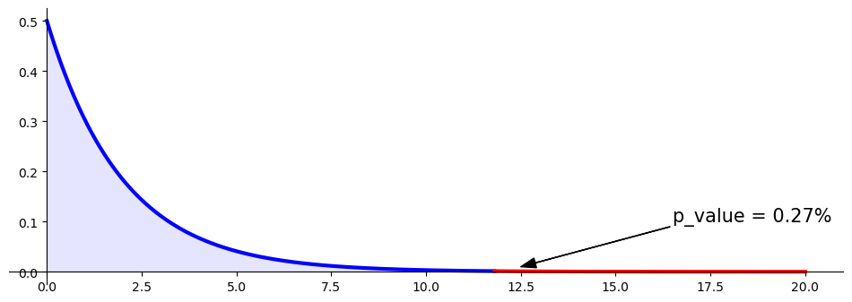
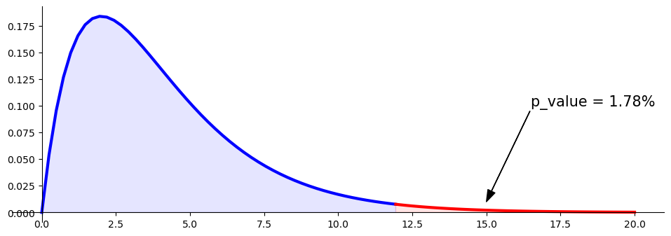
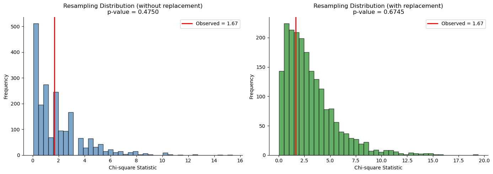

# 독립성 검정

## 개요

**독립성 검정**은 두 범주형 변수 사이에 유의한 관계가 있는지 판정하는 통계 기법이다. 본질적으로 "한 변수의 발생이 다른 변수의 발생에 영향을 주는가?"라는 질문에 답하도록 돕는다. 두 변수가 독립이면 한 변수의 변화가 다른 변수의 분포에 아무런 영향을 주지 않아야 한다.

## 예시 상황

예를 들어 성별(남성, 여성)과 특정 음료 종류(커피, 차, 주스)에 대한 선호 사이에 연관이 있는지 살펴본다고 하자. 독립성 검정은 성별이 음료 선호에 영향을 주는지, 아니면 선호가 성별과 독립인지를 평가하도록 돕는다.

## 가설

- **귀무가설 ($H_0$)**: 두 변수가 독립이다(즉 변수 사이에 연관이 없다).
- **대립가설 ($H_A$)**: 두 변수가 독립이 아니다(즉 변수 사이에 연관이 있다).

## 분할표

분할표는 변수들의 도수분포를 보여주는 행렬 형태의 표이다. 예를 들어 성별(남성, 여성)과 어떤 제품에 대한 선호(좋아함, 싫어함) 사이에 연관이 있는지 확인하려면 표는 다음과 같을 수 있다:

|           | 좋아함 | 싫어함 | 합계 |
|-----------|------|---------|-------|
| 남성      | 30   | 20      | 50    |
| 여성    | 25   | 25      | 50    |
| **합계** | 55   | 45      | 100   |

## 기대도수

독립 가정 아래에서 각 칸의 기대도수는 다음으로 계산한다:

$$
E_{ij} = \frac{\text{(Row Total for Row } i\text{)} \times \text{(Column Total for Column } j\text{)}}{\text{Grand Total}}
$$

## 검정통계량

카이제곱 독립성 검정의 검정통계량은 다음 공식으로 계산한다:

$$
\chi^2 = \sum_{i=1}^r \sum_{j=1}^c \frac{(O_{ij} - E_{ij})^2}{E_{ij}}
$$

여기서

- $O_{ij}$ = 칸 $ij$의 관측도수
- $E_{ij}$ = 칸 $ij$의 기대도수

이다.

## 자유도

이 검정의 자유도($\text{df}$)는

$$
\text{df} = (r - 1) \times (c - 1)
$$

로 계산하며, $r$은 행의 수, $c$는 열의 수이다.

## 기각역

$$
\begin{array}{lll}
\text{귀무} & \text{두 변수는 독립이다} \\
& \text{관측도수가 기대도수에 가깝다} \\
& O_{ij} \approx E_{ij} \quad \Rightarrow \quad \text{통계량} \approx 0 \\
\\
\text{대립} & \text{두 변수는 독립이 아니다} \\
& \text{관측도수가 기대도수와 꽤 다르다} \\
& O_{ij} \not\approx E_{ij} \quad \Rightarrow \quad \text{통계량} \approx \text{큰 양수}
\end{array}
$$

## 임계값과 p-값

- **임계값**: 자유도와 선택한 유의수준(예: 0.05)에 근거하여 카이제곱 분포표에서 결정한다.
- **p-값**: 검정통계량과 자유도를 써서 카이제곱 분포로부터 계산한다. 귀무가설 아래에서 계산된 값만큼 또는 그보다 극단적인 검정통계량을 관측할 확률을 나타낸다.

## 판정 규칙

- 검정통계량이 임계값을 넘거나 p-값이 유의수준보다 작으면 귀무가설을 기각한다. 두 변수가 독립이 아니며 서로 연관이 있음을 시사한다.
- 검정통계량이 임계값을 넘지 않거나 p-값이 유의수준보다 크면 귀무가설을 기각하지 못한다. 두 변수가 독립임을 나타낸다.

## 가정과 한계

카이제곱 독립성 검정은 관측값이 무작위로 추출되었고, 각 칸의 기대도수가 적어도 5 이상이며, 범주가 서로 배타적이라고 가정한다. 이 가정들이 어긋나면 결과가 오도할 수 있다.

표본이 작으면 **Fisher의 정확검정** 같은 다른 독립성 검정이 나을 수 있다. 카이제곱 검정이 쓰는 대표본 근사에 의존하지 않기 때문이다.

---

## 문제 A: 성별과 주로 쓰는 손

<div class="probox" markdown>

**문제 1.** <span class="diff easy" title="쉬움"></span>

여러 사람을 무작위로 뽑아 성별과 주로 쓰는 손을 기록했다. 자료는 다음과 같다.

**관측:**

</div>

??? success "풀이"
    $$
    \begin{array}{crr|r}
     & \text{남성} & \text{여성} & \text{행 합} \\ \hline
    \text{오른손잡이} & 934 & 1{,}070 & 2{,}004 \\
    \text{왼손잡이} & 113 & 92 & 205 \\
    \text{양손잡이} & 20 & 8 & 28 \\ \hline
    \text{열 합} & 1{,}067 & 1{,}170 & 2{,}237
    \end{array}
    $$

    성별과 주로 쓰는 손 사이에 관계가 있는가, 아니면 두 변수는 독립인가?

### 가설

$$
\begin{array}{lll}
\text{귀무} & \text{두 변수는 독립이다} \\
\\
\text{대립} & \text{두 변수는 독립이 아니다}
\end{array}
$$

### 기대도수

**기대:**

$$
\begin{array}{ccc|r}
 & \text{남성} & \text{여성} & \text{행 합} \\ \hline
\text{오른손잡이} & 956 & 1{,}048 & 2{,}004 \\
\text{왼손잡이} & 98 & 107 & 205 \\
\text{양손잡이} & 13 & 15 & 28 \\ \hline
\text{열 합} & 1{,}067 & 1{,}170 & 2{,}237
\end{array}
$$

**기대도수를 계산하는 방법**: 두 변수가 독립이라면

$$
P(\text{men}) = \frac{1067}{2237}, \quad P(\text{right-handed}) = \frac{2004}{2237}
$$

$$
\Rightarrow P(\text{men}, \text{right-handed}) = \frac{1067}{2237} \times \frac{2004}{2237}
$$

$$
\Rightarrow \text{expected frequency}(\text{men}, \text{right-handed}) = \frac{1067}{2237} \times \frac{2004}{2237} \times 2237 \approx 956
$$

### p-값

$$
\text{p-value} = P\left(\sum_{i=1}^{r}\sum_{j=1}^{c}\frac{(O_{ij}-E_{ij})^2}{E_{ij}} \ge \text{statistic} \;\middle|\; H_0\right)
$$

### 결론

$$\text{두 변수는 독립이 아니다.}$$

### Python 구현 (`scipy.stats.chi2_contingency` 없이)

<div class="codebox" markdown>

**예제 1.** 정의대로 계산한 독립성 검정

```python
import matplotlib.pyplot as plt
import numpy as np
from scipy import stats

def compute_expected(observed_counts):
    """관측도수로부터 독립 아래의 기대도수를 계산한다.

    독립의 정의 P(A and B) = P(A)P(B)를 그대로 옮긴 것이다.
    주변 확률의 곱으로 결합 확률을 만들고 전체 개수를 곱한다.
    """
    row_totals = observed_counts.sum(axis=1)
    col_totals = observed_counts.sum(axis=0)

    # reshape로 (r,1)과 (1,c)를 만들면 브로드캐스팅으로 (r,c) 곱이 나온다.
    row_pmf = row_totals.reshape((-1, 1)) / row_totals.sum()
    col_pmf = col_totals.reshape((1, -1)) / col_totals.sum()

    joint_pmf = row_pmf * col_pmf
    expected_counts = joint_pmf * row_totals.sum()

    return expected_counts

# 분할표 형태의 관측도수
observed_counts = np.array([[934, 1070], [113, 92], [20, 8]])
expected_counts = compute_expected(observed_counts)

# 자유도 = (행-1)(열-1)
degrees_of_freedom = (observed_counts.shape[0] - 1) * (observed_counts.shape[1] - 1)

# 검정통계량 계산
chi_squared_statistic = np.sum((observed_counts - expected_counts) ** 2 / expected_counts)
p_value = stats.chi2(degrees_of_freedom).sf(chi_squared_statistic)

# 통계량과 p-값 출력
print(f"chi_squared_statistic = {chi_squared_statistic:.02f}")
print(f"p_value = {p_value:.02%}")

# 카이제곱 분포를 그리고 관측된 통계량 자리를 표시한다
fig, ax = plt.subplots(figsize=(12, 4))

x_values = np.linspace(0, chi_squared_statistic, 100)
y_values = stats.chi2(degrees_of_freedom).pdf(x_values)
ax.plot(x_values, y_values, color='b', linewidth=3)

x_fill_left = np.concatenate([[0], x_values, [chi_squared_statistic], [0]])
y_fill_left = np.concatenate([[0], y_values, [0], [0]])
ax.fill(x_fill_left, y_fill_left, color='b', alpha=0.1)

x_values_right = np.linspace(chi_squared_statistic, 20, 100)
y_values_right = stats.chi2(degrees_of_freedom).pdf(x_values_right)
ax.plot(x_values_right, y_values_right, color='r', linewidth=3)

x_fill_right = np.concatenate([[chi_squared_statistic], x_values_right, [20], [chi_squared_statistic]])
y_fill_right = np.concatenate([[0], y_values_right, [0], [0]])
ax.fill(x_fill_right, y_fill_right, color='r', alpha=0.1)

ax.annotate(f'p_value = {p_value:.02%}', xy=(12.5, 0.01), xytext=(16.5, 0.10),
            fontsize=15, arrowprops=dict(color='k', width=0.2, headwidth=8))

ax.spines['right'].set_visible(False)
ax.spines['top'].set_visible(False)
ax.spines['bottom'].set_position("zero")
ax.spines['left'].set_position("zero")

plt.show()
```

출력:

```
chi_squared_statistic = 11.81
p_value = 0.27%
```



</div>

### Python 구현 (`scipy.stats.chi2_contingency` 사용)

<div class="codebox" markdown>

**예제 2.** scipy로 계산한 독립성 검정

```python
import matplotlib.pyplot as plt
import numpy as np
from scipy import stats

# 분할표 형태의 관측도수
observed_counts = np.array([[934, 1070], [113, 92], [20, 8]])

# chi2_contingency는 2x2 표에 한해 Yates 연속성 보정을 **기본으로 적용한다**.
# 여기는 3x2라 보정이 없으므로 위의 수동 계산과 정확히 같은 값이 나온다.
chi_squared_statistic, p_value, degrees_of_freedom, expected_counts = stats.chi2_contingency(observed_counts)

# 통계량과 p-값 출력
print(f"chi_squared_statistic = {chi_squared_statistic:.02f}")
print(f"p_value = {p_value:.02%}", end="\n\n")

print("expected_counts")
print(expected_counts, end="\n\n")

# 그림으로 확인한다
fig, ax = plt.subplots(figsize=(12, 4))

x_values = np.linspace(0, chi_squared_statistic, 100)
y_values = stats.chi2(degrees_of_freedom).pdf(x_values)
ax.plot(x_values, y_values, color='b', linewidth=3)

x_fill_left = np.concatenate([[0], x_values, [chi_squared_statistic], [0]])
y_fill_left = np.concatenate([[0], y_values, [0], [0]])
ax.fill(x_fill_left, y_fill_left, color='b', alpha=0.1)

x_values_right = np.linspace(chi_squared_statistic, 20, 100)
y_values_right = stats.chi2(degrees_of_freedom).pdf(x_values_right)
ax.plot(x_values_right, y_values_right, color='r', linewidth=3)

x_fill_right = np.concatenate([[chi_squared_statistic], x_values_right, [20], [chi_squared_statistic]])
y_fill_right = np.concatenate([[0], y_values_right, [0], [0]])
ax.fill(x_fill_right, y_fill_right, color='r', alpha=0.1)

ax.annotate(f'p_value = {p_value:.02%}', xy=(12.5, 0.01), xytext=(16.5, 0.10),
            fontsize=15, arrowprops=dict(color='k', width=0.2, headwidth=8))

ax.spines['right'].set_visible(False)
ax.spines['top'].set_visible(False)
ax.spines['bottom'].set_position("zero")
ax.spines['left'].set_position("zero")

plt.show()
```

출력:

```
chi_squared_statistic = 11.81
p_value = 0.27%

expected_counts
[[ 955.86410371 1048.13589629]
 [  97.78050961  107.21949039]
 [  13.35538668   14.64461332]]
```


수동 계산과 통계량이 소수점 둘째 자리까지 같다. `chi2_contingency`는 같은 식을 감싼 것이며, 덤으로 기대도수까지 돌려준다.

기대도수의 마지막 행이 13.4와 14.6으로 5는 넘지만 넉넉하지는 않다. 카이제곱 근사가 아슬아슬하게 통하는 경계다.

</div>

---

<div class="codebox" markdown>

### 예제 3. 더 긴 손과 더 긴 발 { .eg }

> **출처**: [Khan Academy — Chi-Square Test Association Independence](https://www.khanacademy.org/math/ap-statistics/chi-square-tests/chi-square-tests-two-way-tables/v/chi-square-test-association-independence)

발 길이와 손 길이 사이에 관계가 있으리라 의심한다. 귀무가설은 두 변수 사이에 연관이 없다고, 즉 독립이라고 가정한다. 대립가설은 발 길이와 손 길이 사이에 실제로 연관이 있어 독립이 아니라는 우리의 의심을 표현한다.

100명을 무작위로 뽑는다. 각 사람에 대해 오른손이 더 긴지, 왼손이 더 긴지, 양손이 같은지를 판정한다. 발 길이에 대해서도 같은 과정을 반복한다.

|                   | 오른발이 더 김 | 왼발이 더 김 | 양발이 같음 |
|:-----------------:|:-----------------:|:----------------:|:--------------:|
| 오른손이 더 김 | 11                | 3                | 8              |
| 왼손이 더 김  | 2                 | 9                | 14             |
| 양손이 같음   | 12                | 13               | 28             |

#### 풀이

**1단계: 가설**

- $H_0$: 발 길이와 손 길이는 독립이다.
- $H_1$: 발 길이와 손 길이는 독립이 아니다.

**2단계: 합계를 포함한 관측도수**

$$
\begin{array}{c|c|c|c|c}
 & \text{오른발} & \text{왼발} & \text{양발 같음} & \text{행 합} \\
\hline
\text{오른손} & 11 & 3 & 8 & 22 \\
\text{왼손} & 2 & 9 & 14 & 25 \\
\text{양손 같음} & 12 & 13 & 28 & 53 \\
\hline
\text{열 합} & 25 & 25 & 50 & 100
\end{array}
$$

**3단계: 기대도수**

$$
E_{ij} = \frac{\text{(Row Total for Row } i\text{)} \times \text{(Column Total for Column } j\text{)}}{\text{Grand Total}}
$$

$$
\begin{array}{c|c|c|c}
 & \text{오른발} & \text{왼발} & \text{양발 같음} \\
\hline
\text{오른손} & 5.5 & 5.5 & 11 \\
\text{왼손} & 6.25 & 6.25 & 12.5 \\
\text{양손 같음} & 13.25 & 13.25 & 26.5
\end{array}
$$

**4단계: 검정통계량**

각 항 $(O_{ij} - E_{ij})^2 / E_{ij}$을 계산해 더하면

$$
\chi^2 \approx 5.5 + 1.136 + 0.818 + 2.89 + 1.21 + 0.18 + 0.118 + 0.005 + 0.085 \approx 11.94
$$

**5단계: 자유도**

$$
\text{df} = (3 - 1)(3 - 1) = 4
$$

**6단계: p-값**

$\text{df} = 4$에서 $\chi^2 = 11.94$의 p-값은 약 **0.018**이다.

**결론**: p-값(0.018)이 통상적인 유의수준 0.05보다 작으므로 귀무가설을 기각한다. 발 길이와 손 길이 사이에 연관이 있다는 증거가 있음을 시사한다.

```python
import matplotlib.pyplot as plt
import numpy as np
import scipy.stats as stats

def main():
    observed = np.array([[11, 3, 8], [2, 9, 14], [12, 13, 28]])

    statistic, p_value, df, expected = stats.chi2_contingency(observed)
    print(f"{statistic = :.02f}")
    print(f"{p_value   = :.02%}")

    _, ax = plt.subplots(figsize=(12, 4))

    x = np.linspace(0, statistic)
    y = stats.chi2(df).pdf(x)
    ax.plot(x, y, color='b', linewidth=3)

    x = np.concatenate([[0], x, [statistic], [0]])
    y = np.concatenate([[0], y, [0], [0]])
    ax.fill(x, y, color='b', alpha=0.1)

    x = np.linspace(statistic, 20, 100)
    y = stats.chi2(df).pdf(x)
    ax.plot(x, y, color='r', linewidth=3)

    x = np.concatenate([[statistic], x, [20], [statistic]])
    y = np.concatenate([[0], y, [0], [0]])
    ax.fill(x, y, color='r', alpha=0.1)

    xy = (15.0, 0.01)
    xytext = (16.5, 0.10)
    arrowprops = dict(color='k', width=0.2, headwidth=8)
    ax.annotate(f'{p_value = :.02%}', xy, xytext=xytext, fontsize=15, arrowprops=arrowprops)

    ax.spines['right'].set_visible(False)
    ax.spines['top'].set_visible(False)
    ax.spines['bottom'].set_position("zero")
    ax.spines['left'].set_position("zero")

    plt.show()

if __name__ == "__main__":
    main()
```

출력:

```
statistic = 11.94
p_value   = 1.78%
```



손으로 계산한 $\chi^2 = 11.94$와 정확히 같고, p-값도 앞에서 어림한 0.018과 맞는다.

기대도수 중 가장 작은 값이 5.5로 경험칙 $E_{ij} \ge 5$를 겨우 만족한다는 점은 짚어 두어야 한다. 관측값이 100개뿐이고 칸이 9개라 칸당 평균 11개에 불과하다. 이보다 표가 크거나 자료가 적으면 카이제곱 근사 대신 Fisher의 정확검정이나 몬테카를로 방법을 고려해야 한다.

</div>

<div class="codebox" markdown>

### 예제 4. 기대도수 계산의 상세 { .eg }

이 예제는 더 큰 분할표에 대해 기대도수 계산을 처음부터 끝까지 단계별로 보여준다.

```python
"""
Expected Frequency Calculator for Contingency Table
Computes expected frequencies under independence assumption
"""

import numpy as np
import pandas as pd
from scipy import stats

# 관측도수
observed = np.array([
    [10, 20, 30, 40, 20],
    [5, 15, 40, 50, 10],
    [10, 10, 20, 30, 19]
])

alpha = 0.05

# 행합과 열합, 곧 주변도수
row_totals = observed.sum(axis=1)
col_totals = observed.sum(axis=0)
grand_total = observed.sum()

print("=" * 70)
print("OBSERVED FREQUENCIES")
print("=" * 70)
obs_df = pd.DataFrame(observed,
                      index=['Row 1 (20)', 'Row 2 (30)', 'Row 3 (40)'],
                      columns=['Col 1', 'Col 2', 'Col 3', 'Col 4', 'Col 5'])
obs_df['Row Total'] = row_totals
print(obs_df)
print(f"\nColumn Totals: {col_totals}")
print(f"Grand Total: {grand_total}")

print("\n" + "=" * 70)
print("EXPECTED FREQUENCIES")
print("=" * 70)
print("Formula: E_ij = (Row_i_total × Column_j_total) / Grand_total\n")

# 주변도수의 곱으로 기대도수를 만든다
expected = np.zeros_like(observed, dtype=float)
for i in range(observed.shape[0]):
    for j in range(observed.shape[1]):
        expected[i, j] = (row_totals[i] * col_totals[j]) / grand_total

# 기대도수 출력
exp_df = pd.DataFrame(expected,
                      index=['Row 1 (20)', 'Row 2 (30)', 'Row 3 (40)'],
                      columns=['Col 1', 'Col 2', 'Col 3', 'Col 4', 'Col 5'])
exp_df['Row Total'] = exp_df.sum(axis=1)
print(exp_df)
print(f"\nColumn Totals: {expected.sum(axis=0)}")
print(f"Grand Total: {expected.sum()}")

print("\n" + "=" * 70)
print("DETAILED EXPECTED FREQUENCY CALCULATIONS")
print("=" * 70)
for i in range(observed.shape[0]):
    print(f"\nRow {i+1} (Row Total = {row_totals[i]}):")
    for j in range(observed.shape[1]):
        calculation = f"E[{i+1},{j+1}] = ({row_totals[i]} × {col_totals[j]}) / {grand_total}"
        result = f"= {row_totals[i] * col_totals[j]} / {grand_total} = {expected[i,j]:.4f}"
        print(f"  {calculation} {result}")

print("\n" + "=" * 70)
print("CHI-SQUARE CONTRIBUTIONS")
print("=" * 70)
print("Formula: (Observed - Expected)² / Expected\n")

chi_sq_contrib = (observed - expected)**2 / expected
chi_sq_df = pd.DataFrame(chi_sq_contrib,
                         index=['Row 1 (20)', 'Row 2 (30)', 'Row 3 (40)'],
                         columns=['Col 1', 'Col 2', 'Col 3', 'Col 4', 'Col 5'])
print(chi_sq_df)
print(f"\nChi-square statistic: {chi_sq_contrib.sum():.4f}")
print(f"Degrees of freedom: {(observed.shape[0]-1) * (observed.shape[1]-1)}")

p_value = stats.chi2(df=(observed.shape[0]-1) * (observed.shape[1]-1)).sf(chi_sq_contrib.sum())
print(f"{p_value = :.4f}")
if p_value < alpha:
    print("We have enough evidence to reject the null hypothesis that X and Y are independent.")
else:
    print("We do not have enough evidence to reject the null hypothesis that X and Y are independent.")
```

출력:

```
======================================================================
OBSERVED FREQUENCIES
======================================================================
            Col 1  Col 2  Col 3  Col 4  Col 5  Row Total
Row 1 (20)     10     20     30     40     20        120
Row 2 (30)      5     15     40     50     10        120
Row 3 (40)     10     10     20     30     19         89

Column Totals: [ 25  45  90 120  49]
Grand Total: 329

======================================================================
EXPECTED FREQUENCIES
======================================================================
Formula: E_ij = (Row_i_total × Column_j_total) / Grand_total

               Col 1      Col 2      Col 3      Col 4      Col 5  Row Total
Row 1 (20)  9.118541  16.413374  32.826748  43.768997  17.872340      120.0
Row 2 (30)  9.118541  16.413374  32.826748  43.768997  17.872340      120.0
Row 3 (40)  6.762918  12.173252  24.346505  32.462006  13.255319       89.0

Column Totals: [ 25.  45.  90. 120.  49.]
Grand Total: 328.99999999999994

======================================================================
DETAILED EXPECTED FREQUENCY CALCULATIONS
======================================================================

Row 1 (Row Total = 120):
  E[1,1] = (120 × 25) / 329 = 3000 / 329 = 9.1185
  E[1,2] = (120 × 45) / 329 = 5400 / 329 = 16.4134
  E[1,3] = (120 × 90) / 329 = 10800 / 329 = 32.8267
  E[1,4] = (120 × 120) / 329 = 14400 / 329 = 43.7690
  E[1,5] = (120 × 49) / 329 = 5880 / 329 = 17.8723

Row 2 (Row Total = 120):
  E[2,1] = (120 × 25) / 329 = 3000 / 329 = 9.1185
  E[2,2] = (120 × 45) / 329 = 5400 / 329 = 16.4134
  E[2,3] = (120 × 90) / 329 = 10800 / 329 = 32.8267
  E[2,4] = (120 × 120) / 329 = 14400 / 329 = 43.7690
  E[2,5] = (120 × 49) / 329 = 5880 / 329 = 17.8723

Row 3 (Row Total = 89):
  E[3,1] = (89 × 25) / 329 = 2225 / 329 = 6.7629
  E[3,2] = (89 × 45) / 329 = 4005 / 329 = 12.1733
  E[3,3] = (89 × 90) / 329 = 8010 / 329 = 24.3465
  E[3,4] = (89 × 120) / 329 = 10680 / 329 = 32.4620
  E[3,5] = (89 × 49) / 329 = 4361 / 329 = 13.2553

======================================================================
CHI-SQUARE CONTRIBUTIONS
======================================================================
Formula: (Observed - Expected)² / Expected

               Col 1     Col 2     Col 3     Col 4     Col 5
Row 1 (20)  0.085208  0.783744  0.243414  0.324553  0.253293
Row 2 (30)  1.860208  0.121707  1.567488  0.887053  3.467579
Row 3 (40)  1.549435  0.387984  0.775968  0.186725  2.489669

Chi-square statistic: 14.9840
Degrees of freedom: 8
p_value = 0.0595
We do not have enough evidence to reject the null hypothesis that X and Y are independent.
```

칸별 기여를 인쇄하면 통계량이 어디서 나왔는지 보인다. 전체 14.98 중 3.47이 (행 2, 열 5) 한 칸에서, 2.49가 (행 3, 열 5)에서 나온다. 두 칸을 합치면 전체의 40%다.

$p = 0.0595$로 5% 기준을 아슬아슬하게 넘어 기각하지 못한다. 자유도가 8이라 통계량 14.98이 그리 크지 않은 것으로 취급된다는 점도 눈여겨보라. 자유도가 2였다면 같은 통계량의 p-값이 0.0006이었을 것이다. **칸이 많은 표는 그만큼 우연한 어긋남도 많아진다.**

</div>

## 4. 재표본추출 기반 카이제곱 검정

표본이 작거나 기대 칸 도수가 낮은 상황, 또는 분포에 의존하지 않는 접근을 원할 때, 순열/재표본추출 기반 카이제곱 검정은 점근적 카이제곱 분포의 대안이 된다.

### 알고리즘

재표본추출 접근은 다음과 같이 독립성을 검정한다:

1. 실제 분할표로부터 **관측된 카이제곱 통계량을 계산**한다.
2. 독립 아래의 **기대 칸 확률을 구한다**.
3. 독립 가정에 따라 관측값을 무작위로 배정하여 **분할표 B개를 모의생성**한다.
4. **모의생성된 각 표에 대해 카이제곱을 계산**한다.
5. **p-값을 계산**한다: 모의 카이제곱 중 관측값만큼 또는 그보다 극단적인 것의 비율.

<div class="exbox" markdown>

**보기 1.** <span class="diff easy" title="쉬움"></span> 헤드라인 클릭률 (A/B 검정). 헤드라인 세 개를 사용자에게 보여주고 클릭 여부를 측정한다. 디지털 마케팅의 A/B 검정에서 흔한 상황이다.

**관측 자료:**

</div>

??? success "풀이"
    ```python
    import numpy as np
    import pandas as pd
    import random
    from scipy import stats

    # 제목 세 가지의 클릭 수
    headlines = pd.DataFrame({
        'Click': [14, 8, 12],
        'No-click': [986, 992, 988],
        'Headline': ['Headline A', 'Headline B', 'Headline C']
    })

    # 결과를 행, 헤드라인을 열로 놓은 분할표를 만든다.
    click_rate = headlines.copy()
    clicks = click_rate.set_index('Headline')[['Click', 'No-click']].T

    print("Observed Contingency Table:")
    print(clicks)
    print(f"\nTotal: {clicks.values.sum()}")
    ```

    출력:

    ```
    Observed Contingency Table:
    Headline  Headline A  Headline B  Headline C
    Click             14           8          12
    No-click         986         992         988

    Total: 3000
    ```

클릭률이 1.4%, 0.8%, 1.2%다. 헤드라인마다 1,000명씩 보았으므로 집단 크기는 같다. 클릭 수가 한 자릿수에 가까워 이런 상황에서 카이제곱 근사가 잘 통하는지 자체가 물음이 된다. 재표본추출로 확인하려는 이유다.

### 재표본추출 접근 (비복원)

<div class="codebox" markdown>

**예제 5.** 재표본추출로 하는 검정 — 비복원

```python
def chi2_stat(observed, expected):
    """카이제곱 통계량을 구한다. 칸마다 (관측-기대)^2/기대 를 더한 값이다."""
    pearson_residuals = []
    for row, expect in zip(observed, expected):
        pearson_residuals.append([(observe - expect) ** 2 / expect
                                  for observe in row])
    return np.sum(pearson_residuals)

# 관측된 카이제곱 통계량
row_average = clicks.mean(axis=1)
expected = np.array([[row_average['Click'], row_average['Click'], row_average['Click']],
                     [row_average['No-click'], row_average['No-click'], row_average['No-click']]])

chi2_obs = chi2_stat(clicks.values, row_average.values)
print(f"Observed chi-square: {chi2_obs:.4f}")

# 재표본추출 방법 — 분포를 가정하지 않는다
def perm_fun_chisq(box):
    """
    Generate permuted contingency table by random allocation.

    Parameters:
    -----------
    box : list
        Binary response (1 = click, 0 = no-click) for all users

    Returns:
    --------
    float : Chi-square statistic for permuted table
    """
    random.shuffle(box)
    # 앞 1000개를 A, 다음 1000개를 B, 마지막 1000개를 C에 배정한다
    sample_clicks = [sum(box[0:1000]),
                     sum(box[1000:2000]),
                     sum(box[2000:3000])]
    sample_noclicks = [1000 - n for n in sample_clicks]
    return chi2_stat([sample_clicks, sample_noclicks], row_average.values)

# 상자를 만든다. 클릭은 1, 비클릭은 0 이다.
box = [1] * 34 + [0] * 2966

# 순열검정 실행
random.seed(42)
perm_chi2 = [perm_fun_chisq(box) for _ in range(2000)]

p_value_resamp = sum(np.array(perm_chi2) >= chi2_obs) / len(perm_chi2)
print(f"Resampling p-value: {p_value_resamp:.4f}")
```

출력:

```
Observed chi-square: 1.6659
Resampling p-value: 0.4750
```

상자에 클릭 34개와 비클릭 2,966개를 넣고 뒤섞은 뒤 1,000명씩 세 묶음으로 나눈다. 이것이 "헤드라인이 아무 영향도 주지 않는" 세상이며, 그 세상에서 카이제곱이 관측값 1.67 이상으로 나오는 비율이 곧 p-값이다.

</div>

### 재표본추출 접근 (복원)

대신 상자에서 복원추출할 수도 있다:

<div class="codebox" markdown>

**예제 6.** 재표본추출로 하는 검정 — 복원

```python
def sample_with_replacement(box):
    """
    Generate contingency table by sampling with replacement.
    """
    sample_clicks = [sum(random.choices(box, k=1000)),
                     sum(random.choices(box, k=1000)),
                     sum(random.choices(box, k=1000))]
    sample_noclicks = [1000 - n for n in sample_clicks]
    return chi2_stat([sample_clicks, sample_noclicks], row_average.values)

# 복원추출 방식으로 실행
random.seed(42)
perm_chi2_wr = [sample_with_replacement(box) for _ in range(2000)]

p_value_wr = sum(np.array(perm_chi2_wr) >= chi2_obs) / len(perm_chi2_wr)
print(f"Resampling (with replacement) p-value: {p_value_wr:.4f}")
```

출력:

```
Resampling (with replacement) p-value: 0.6745
```

비복원의 0.475보다 눈에 띄게 크다. 복원추출에서는 전체 클릭 수가 34로 고정되지 않고 그 자체로 흔들리기 때문에 귀무분포가 더 퍼지고, 같은 관측값이 덜 극단적으로 보인다. 어느 쪽이 맞는가는 무엇을 고정된 것으로 볼지에 달려 있다. 전체 클릭 수를 주어진 것으로 본다면 비복원이 맞다.

</div>

### 비교: 재표본추출 대 모수적 방법

<div class="codebox" markdown>

**예제 7.** 재표본추출과 모수적 방법의 비교

```python
# 모수적 카이제곱 검정
chi2_param, p_param, df, expected_param = stats.chi2_contingency(clicks.values)

print(f"\nComparison:")
print(f"Parametric chi-square: {chi2_param:.4f}, p-value: {p_param:.4f}")
print(f"Resampling (without repl): p-value: {p_value_resamp:.4f}")
print(f"Resampling (with repl): p-value: {p_value_wr:.4f}")
```

출력:

```

Comparison:
Parametric chi-square: 1.6659, p-value: 0.4348
Resampling (without repl): p-value: 0.4750
Resampling (with repl): p-value: 0.6745
```

세 방법 모두 기각하지 못한다는 결론은 같지만 p-값은 0.43에서 0.67까지 벌어진다. 클릭 수가 10 안팎으로 작아 카이제곱 근사가 낙관적인 쪽으로 기울고, 비복원 재표본추출이 그보다 조금 보수적인 값을 준다.

세 헤드라인의 클릭률 차이(1.4% 대 0.8%)를 이 표본으로는 가려낼 수 없다는 것이 결론이다. 이런 크기의 차이를 잡으려면 앞 장의 검정력 계산이 말해 주듯 집단당 수천 명이 필요하다.

</div>

### 시각화

<div class="codebox" markdown>

**예제 8.** 두 재표본 분포 그리기

```python
import matplotlib.pyplot as plt

fig, (ax1, ax2) = plt.subplots(1, 2, figsize=(14, 5))

# 비복원 재표본 분포 — 순열검정에 해당한다
ax1.hist(perm_chi2, bins=40, alpha=0.7, color='steelblue', edgecolor='black')
ax1.axvline(chi2_obs, color='red', linewidth=2, label=f'Observed = {chi2_obs:.2f}')
ax1.set_xlabel('Chi-square Statistic')
ax1.set_ylabel('Frequency')
ax1.set_title(f'Resampling Distribution (without replacement)\np-value = {p_value_resamp:.4f}')
ax1.legend()
ax1.spines['top'].set_visible(False)
ax1.spines['right'].set_visible(False)

# 복원 재표본 분포 — 붓스트랩에 해당한다
ax2.hist(perm_chi2_wr, bins=40, alpha=0.7, color='forestgreen', edgecolor='black')
ax2.axvline(chi2_obs, color='red', linewidth=2, label=f'Observed = {chi2_obs:.2f}')
ax2.set_xlabel('Chi-square Statistic')
ax2.set_ylabel('Frequency')
ax2.set_title(f'Resampling Distribution (with replacement)\np-value = {p_value_wr:.4f}')
ax2.legend()
ax2.spines['top'].set_visible(False)
ax2.spines['right'].set_visible(False)

plt.tight_layout()
plt.show()
```



두 히스토그램 모두 오른쪽으로 길게 늘어진 모양이고 빨간 선(관측값 1.67)이 분포의 한가운데쯤에 있다. 관측된 표가 "우연히 나올 법한" 범위 안에 있다는 뜻이다.

왼쪽(비복원)이 오른쪽(복원)보다 좁다는 것도 보인다. 전체 클릭 수를 34로 고정하면 그만큼 변동이 줄기 때문이며, 이것이 두 p-값 차이의 이유다.

</div>

### 재표본추출 카이제곱의 장점

1. **분포 가정이 없다**: 카이제곱 근사에 의존하지 않는다.
2. **작은 칸 도수**: 기대 칸 도수가 5 미만이어도 작동한다.
3. **정확하다**: p-값이 (근사가 아니라) 정확하다.
4. **유연하다**: 어떤 크기의 분할표에도 적용할 수 있다.

### 재표본추출을 쓸 때

- **작은 기대도수**: 기대 칸 도수가 하나라도 5 미만일 때.
- **작은 표본**: $n < 20$–30일 때.
- **로버스트성 확인**: 모수적 카이제곱과 비교할 때.
- **교육적 가치**: 무작위화를 통해 귀무가설을 직접 검정한다.

### 계산상의 고려사항

- 대부분의 응용에서 순열 2,000–5,000회를 쓴다.
- 비복원 방식이 더 보수적이고 복원 방식이 더 관대하다.
- 표본크기가 어느 정도 되면 두 접근이 대체로 비슷한 p-값을 준다.

## 연습문제

<div class="drillbox" markdown>

**연습문제 1.** <span class="diff easy" title="쉬움"></span>
결제수단(현금/카드/모바일) × 요일(주말/평일)을 검정하라. 자료: 주말 (30, 50, 20), 평일 (40, 60, 30). $\alpha = 0.01$에서 검정하라.

</div>

??? success "풀이"
    $H_0$: 독립이다. 행 합계: 100, 130. 열 합계: 70, 110, 50. 총합: 230.

    기대도수: $E_{ij} = $ 행합 $\times$ 열합 / 230. 예를 들어 $E_{11} = 100 \cdot 70/230 \approx 30.43$.

    $\chi^2 = \sum (O - E)^2/E \approx 0.43$. df $= (2-1)(3-1) = 2$.

    임계값 $\chi^2_{2, 0.01} = 9.21$. $0.43 < 9.21$이므로 **기각하지 못한다**. 연관의 증거가 없다.

<div class="drillbox" markdown>

**연습문제 2.** <span class="diff easy" title="쉬움"></span>
**Cramér의 V** 효과크기: $V = \sqrt{\chi^2/(N \cdot \min(r-1, c-1))}$. 연습문제 1에 대해 계산하라.

</div>

??? success "풀이"
    $V = \sqrt{0.43/(230 \cdot 1)} \approx \sqrt{0.00187} \approx 0.04$.

    해석:

    - $V \le 0.1$: 약함.
    - $V \approx 0.3$: 중간.
    - $V \ge 0.5$: 강함.

    $V = 0.04$이므로 연관이 약하다(사실상 없다). 기각하지 못한 결과와 합쳐서 결제수단과 요일이 사실상 독립이라고 결론짓는다.

    맥락상 유용한 점: $N$이 크면 $V$가 아주 작아도(효과가 사소해도) 카이제곱이 "유의"해질 수 있다.

<div class="drillbox" markdown>

**연습문제 3.** <span class="diff easy" title="쉬움"></span>
$2 \times 2$ 표에 대한 **오즈비**. 흡연 × 암 = (50, 30) 대 (10, 100)에 대해 정의하고 계산하라.

</div>

??? success "풀이"
    표(흡연 여부 × 암 여부): $(50, 30) / (10, 100)$.

    OR $= (50 \cdot 100)/(30 \cdot 10) = 5000/300 \approx 16.7$.

    해석: 암에 걸릴 오즈가 비흡연자에 비해 흡연자에서 16.7배 높다.

    $\ln(\mathrm{OR}) = 2.81$. $\ln(\mathrm{OR})$의 표준오차는 $\sqrt{1/50 + 1/30 + 1/10 + 1/100} \approx \sqrt{0.1633} \approx 0.404$.

    $\ln(\mathrm{OR})$의 95% 신뢰구간: $2.81 \pm 1.96 \cdot 0.404 = (2.02, 3.61)$. 지수를 취하면 OR의 신뢰구간 $= (7.55, 36.8)$.

    강한 연관이다. 1을 포함하지 않으므로 유의하다.

<div class="drillbox" markdown>

**연습문제 4.** <span class="diff med" title="중간"></span>
**고차원에서의 독립성.** 카이제곱이 $r \times c \times s$ 분할표를 다룰 수 있는가?

</div>

??? success "풀이"
    그렇다. 다원표(변수 3개 이상)를 다룰 수 있다. df $= (r-1)(c-1)(s-1) \cdots$이다.

    가설이 더 복잡해진다:

    - **완전 독립**: 모든 변수가 서로 독립.
    - **결합 독립**: 한 변수가 나머지의 결합분포와 독립.
    - **조건부 독립**: 세 번째 변수를 주었을 때 두 변수가 독립.

    표준 카이제곱은 결합 독립을 검정한다. **로그선형 모형**은 이 모든 패턴으로 일반화하며 통일된 틀을 제공한다. 범주형 변수가 많은 사회과학 연구에서 쓰인다.

<div class="drillbox" markdown>

**연습문제 5.** <span class="diff med" title="중간"></span>
분할표에서의 **Simpson의 역설**.

</div>

??? success "풀이"
    이진 처치–결과 사이의 연관이 세 번째 변수로 조건화하면 뒤집히는 현상이다.

    **버클리 입학 예:** 전체로 보면 여성의 합격률이 남성보다 낮았다. 그러나 학과로 조건화하면 각 학과 안에서는 여성의 합격률이 같거나 더 높았다. 학과를 고려하면 집계 수준에서 보이던 차별이 사라진다.

    이유: 여성이 경쟁이 심한(합격률이 낮은) 학과에 불균형하게 많이 지원했다. 주변 수준의 연관은 학과 선택과 학과별 합격률을 반영한 것이지 학과 내 차별을 반영한 것이 아니다.

    **교훈:** 주변 분할표는 오도할 수 있다. 관련 공변량을 통제해야 하는지 항상 고려하라. 집계된 자료는 집단 내부의 패턴을 감춘다.

<div class="drillbox" markdown>

**연습문제 6.** <span class="diff med" title="중간"></span>
**Fisher의 정확검정** 대 카이제곱. Fisher를 언제 쓰는가?

</div>

??? success "풀이"
    Fisher의 정확검정은 $2 \times 2$ 분할표에 대해 (점근 근사 없이) 정확한 p-값을 계산한다.

    카이제곱의 근사 분포와 대비된다.

    **Fisher를 쓸 때:**

    - 표본이 작을 때(기대도수 < 5).
    - 표가 희소할 때.
    - 정확한 p-값이 필요할 때.

    **카이제곱을 쓸 때:**

    - $n$이 클 때(Cochran의 규칙을 만족할 때).
    - 다원표일 때.
    - 계산이 간단하기를 원할 때.

    scipy에서는 `scipy.stats.fisher_exact`, R에서는 `fisher.test`로 쓸 수 있다. 둘 다 기본이 양측검정이다.

---

## 정리하며

독립성 검정은 **한 표본에서 두 변수를 함께 측정**해 연관을 본다.

$$
E_{ij}=\frac{(\text{행 합})_i\times(\text{열 합})_j}{n},
\qquad \text{df}=(r-1)(c-1)
$$

- **기대도수가 주변합에서 나온다.** 독립이면 $P(A\cap B)=P(A)P(B)$ 이므로, 행 비율과 열 비율을 곱해 $n$ 을 곱한 것이 기대도수다. **3장의 독립 정의를 도수로 옮긴 것뿐이다.**
- **적합도와 다른 점은 기대도수의 출처다.** 적합도에서는 가설이 확률을 직접 주지만, 여기서는 **자료의 주변합에서 추정한다.** 그래서 자유도가 더 줄어든다.
- **기각은 "연관이 있다"까지다.** 인과도, 방향도, 강도도 말하지 않는다. 1장의 교란 논의가 그대로 적용된다.
- **표가 크면 어느 칸이 원인인지 보이지 않는다.** 표준화 잔차를 보아야 하며, 이 장 뒤에서 열지도로 다룬다.
- **$2\times2$ 에서 기대도수가 작으면** 피셔의 정확검정으로 간다.

다음 절 **동질성 검정**으로 넘어간다. 계산은 같은데 **설계와 해석이 다르다.**
