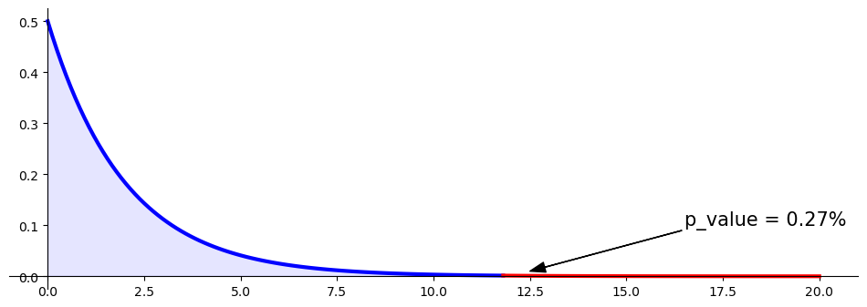
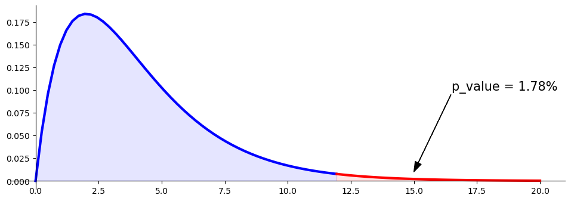
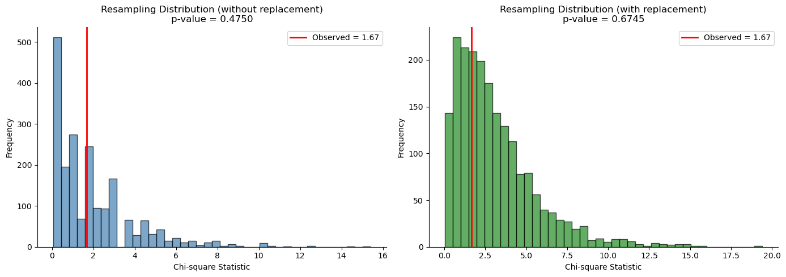

# 독립성 검정

## 개요

**독립성 검정**은 두 범주형 변수 사이에 유의한 관계가 있는지 판정하는 통계 기법이다. 본질적으로 "한 변수의 발생이 다른 변수의 발생에 영향을 주는가?"라는 질문에 답하도록 돕는다. 두 변수가 독립이면 한 변수의 변화가 다른 변수의 분포에 아무런 영향을 주지 않아야 한다.

---

## 1. 예시 상황

예를 들어 성별(남성, 여성)과 특정 음료 종류(커피, 차, 주스)에 대한 선호 사이에 연관이 있는지 살펴본다고 하자. 독립성 검정은 성별이 음료 선호에 영향을 주는지, 아니면 선호가 성별과 독립인지를 평가하도록 돕는다.

---

## 2. 가설

- **귀무가설 ($H_0$)**: 두 변수가 독립이다(즉 변수 사이에 연관이 없다).
- **대립가설 ($H_A$)**: 두 변수가 독립이 아니다(즉 변수 사이에 연관이 있다).

---

## 3. 분할표

분할표는 변수들의 도수분포를 보여주는 행렬 형태의 표이다. 예를 들어 성별(남성, 여성)과 어떤 제품에 대한 선호(좋아함, 싫어함) 사이에 연관이 있는지 확인하려면 표는 다음과 같을 수 있다:

|           | 좋아함 | 싫어함 | 합계 |
|-----------|------|---------|-------|
| 남성      | 30   | 20      | 50    |
| 여성    | 25   | 25      | 50    |
| **합계** | 55   | 45      | 100   |

---

## 4. 기대도수

독립 가정 아래에서 각 칸의 기대도수는 다음으로 계산한다:

$$
E_{ij} = \frac{\text{(Row Total for Row } i\text{)} \times \text{(Column Total for Column } j\text{)}}{\text{Grand Total}}
$$

---

## 5. 검정통계량

카이제곱 독립성 검정의 검정통계량은 다음 공식으로 계산한다:

$$
\chi^2 = \sum_{i=1}^r \sum_{j=1}^c \frac{(O_{ij} - E_{ij})^2}{E_{ij}}
$$

여기서

- $O_{ij}$ = 칸 $ij$의 관측도수
- $E_{ij}$ = 칸 $ij$의 기대도수

이다.

---

## 6. 자유도

이 검정의 자유도($\text{df}$)는

$$
\text{df} = (r - 1) \times (c - 1)
$$

로 계산하며, $r$은 행의 수, $c$는 열의 수이다.

---

## 7. 기각역

$$
\begin{array}{lll}
\text{귀무} & \text{두 변수는 독립이다} \\
& \text{관측도수가 기대도수에 가깝다} \\
& O_{ij} \approx E_{ij} \quad \Rightarrow \quad \text{통계량} \approx 0 \\
\\
\text{대립} & \text{두 변수는 독립이 아니다} \\
& \text{관측도수가 기대도수와 꽤 다르다} \\
& O_{ij} \not\approx E_{ij} \quad \Rightarrow \quad \text{통계량} \approx \text{큰 양수}
\end{array}
$$

---

## 8. 임계값과 p-값

- **임계값**: 자유도와 선택한 유의수준(예: 0.05)에 근거하여 카이제곱 분포표에서 결정한다.
- **p-값**: 검정통계량과 자유도를 써서 카이제곱 분포로부터 계산한다. 귀무가설 아래에서 계산된 값만큼 또는 그보다 극단적인 검정통계량을 관측할 확률을 나타낸다.

---

## 9. 판정 규칙

- 검정통계량이 임계값을 넘거나 p-값이 유의수준보다 작으면 귀무가설을 기각한다. 두 변수가 독립이 아니며 서로 연관이 있음을 시사한다.
- 검정통계량이 임계값을 넘지 않거나 p-값이 유의수준보다 크면 귀무가설을 기각하지 못한다. 두 변수가 독립임을 나타낸다.

---

## 10. 가정과 한계

카이제곱 독립성 검정은 관측값이 무작위로 추출되었고, 각 칸의 기대도수가 적어도 5 이상이며, 범주가 서로 배타적이라고 가정한다. 이 가정들이 어긋나면 결과가 오도할 수 있다.

표본이 작으면 **Fisher의 정확검정** 같은 다른 독립성 검정이 나을 수 있다. 카이제곱 검정이 쓰는 대표본 근사에 의존하지 않기 때문이다.

---

## 11. 문제 A: 성별과 주로 쓰는 손

<div class="probox" markdown>

**문제 1.** <span class="diff easy" title="쉬움"></span>

여러 사람을 무작위로 뽑아 성별과 주로 쓰는 손을 기록했다. 자료는 다음과 같다.

**관측:**

</div>

??? success "풀이"
    $$
    \begin{array}{crr|r}
     & \text{남성} & \text{여성} & \text{행 합} \\ \hline
    \text{오른손잡이} & 934 & 1{,}070 & 2{,}004 \\
    \text{왼손잡이} & 113 & 92 & 205 \\
    \text{양손잡이} & 20 & 8 & 28 \\ \hline
    \text{열 합} & 1{,}067 & 1{,}170 & 2{,}237
    \end{array}
    $$

    성별과 주로 쓰는 손 사이에 관계가 있는가, 아니면 두 변수는 독립인가?

### 가설

$$
\begin{array}{lll}
\text{귀무} & \text{두 변수는 독립이다} \\
\\
\text{대립} & \text{두 변수는 독립이 아니다}
\end{array}
$$

### 기대도수

**기대:**

$$
\begin{array}{ccc|r}
 & \text{남성} & \text{여성} & \text{행 합} \\ \hline
\text{오른손잡이} & 956 & 1{,}048 & 2{,}004 \\
\text{왼손잡이} & 98 & 107 & 205 \\
\text{양손잡이} & 13 & 15 & 28 \\ \hline
\text{열 합} & 1{,}067 & 1{,}170 & 2{,}237
\end{array}
$$

**기대도수를 계산하는 방법**: 두 변수가 독립이라면

$$
P(\text{men}) = \frac{1067}{2237}, \quad P(\text{right-handed}) = \frac{2004}{2237}
$$

$$
\Rightarrow P(\text{men}, \text{right-handed}) = \frac{1067}{2237} \times \frac{2004}{2237}
$$

$$
\Rightarrow \text{expected frequency}(\text{men}, \text{right-handed}) = \frac{1067}{2237} \times \frac{2004}{2237} \times 2237 \approx 956
$$

### p-값

$$
\text{p-value} = P\left(\sum_{i=1}^{r}\sum_{j=1}^{c}\frac{(O_{ij}-E_{ij})^2}{E_{ij}} \ge \text{statistic} \;\middle|\; H_0\right)
$$

### 결론

$$\text{두 변수는 독립이 아니다.}$$

### Python 구현 (`scipy.stats.chi2_contingency` 없이)

<div class="exbox" markdown>

**보기 1.** <span class="diff easy" title="쉬움"></span> 정의대로 계산한 독립성 검정. 위의 성별 × 주로 쓰는 손 표를 쓴다. 행 합은 $R_1 = 2{,}004$, $R_2 = 205$, $R_3 = 28$, 열 합은 $C_1 = 1{,}067$, $C_2 = 1{,}170$, 총합은 $n = 2{,}237$ 이다.

**(1)** 독립 아래의 기대도수가 $E_{ij} = R_i C_j / n$ 임을 보이고, 이 기대표가 관측표의 행 합과 열 합을 그대로 보존함을 확인하시오. 자유도가 $(r-1)(c-1)$ 인 까닭이 여기에 있다.

**(2)** 열이 둘뿐인 $r \times 2$ 표에서는 검정통계량이

$$
\chi^2 = \frac{n^2}{C_1 C_2} \sum_{i=1}^r \frac{d_i^2}{R_i},
\qquad
d_i = O_{i1} - \frac{R_i C_1}{n}
$$

으로 줄어듦을 보이고 이 표의 $\chi^2$ 을 구하시오.

**(3)** `scipy.stats.chi2_contingency` 를 쓰지 않고 정의대로 계산하는 코드를 돌려 (2)의 답과 맞는지 확인하고 p-값을 구하시오.

</div>

??? success "풀이"

    **(1) 기대도수와 자유도.** 두 변수가 독립이면 결합확률이 주변확률의 곱이다. 주변확률을 표본에서 읽으면 $\hat P(i\text{행}) = R_i/n$, $\hat P(j\text{열}) = C_j/n$ 이므로

    $$
    E_{ij} = n \cdot \frac{R_i}{n} \cdot \frac{C_j}{n} = \frac{R_i C_j}{n}
    $$

    이다. 이 기대표는 주변합을 보존한다.

    $$
    \sum_{j=1}^c E_{ij} = \frac{R_i}{n}\sum_{j=1}^c C_j = \frac{R_i}{n} \cdot n = R_i,
    \qquad
    \sum_{i=1}^r E_{ij} = C_j
    $$

    **보존이 곧 자유도의 정체다.** 칸별 어긋남 $O_{ij} - E_{ij}$ 는 $rc$ 개이지만 자유롭게 움직이지 못한다. 행마다 합이 $0$ 이라는 제약이 $r$ 개, 열마다 합이 $0$ 이라는 제약이 $c$ 개 붙고, 그중 하나는 나머지로부터 따라 나오므로(전체 합이 $0$) 겹친다. 독립인 제약이 $r + c - 1$ 개이니 남는 자유도는

    $$
    rc - (r + c - 1) = (r-1)(c-1)
    $$

    이다. 여기서는 $(3-1)(2-1) = 2$ 다.

    **(2) $r \times 2$ 의 닫힌 꼴.** 열이 둘뿐이면 "행 합이 보존된다"는 제약이 한 행의 두 칸을 한 수로 묶어 준다. $i$ 행에서

    $$
    (O_{i1} - E_{i1}) + (O_{i2} - E_{i2}) = R_i - R_i = 0
    \quad \Longrightarrow \quad
    O_{i1} - E_{i1} = d_i, \quad O_{i2} - E_{i2} = -d_i
    $$

    이므로 $i$ 행의 기여는 $d_i$ 하나로 적힌다.

    $$
    \frac{d_i^2}{E_{i1}} + \frac{d_i^2}{E_{i2}}
    = d_i^2\left(\frac{n}{R_i C_1} + \frac{n}{R_i C_2}\right)
    = \frac{d_i^2\, n}{R_i} \cdot \frac{C_1 + C_2}{C_1 C_2}
    = \frac{n^2}{C_1 C_2} \cdot \frac{d_i^2}{R_i}
    $$

    마지막 등식은 $C_1 + C_2 = n$ 을 썼다. 행에 대해 더하면 주장한 식이다.

    수를 넣는다.

    $$
    d_1 = 934 - \frac{2004 \cdot 1067}{2237} = -21.8641,
    \qquad
    d_2 = 113 - \frac{205 \cdot 1067}{2237} = 15.2195,
    \qquad
    d_3 = 20 - \frac{28 \cdot 1067}{2237} = 6.6446
    $$

    열 합도 보존되므로 $d_1 + d_2 + d_3 = 0$ 이어야 하고 실제로 그렇다. 그러면

    $$
    \sum_{i=1}^3 \frac{d_i^2}{R_i}
    = \frac{21.8641^2}{2004} + \frac{15.2195^2}{205} + \frac{6.6446^2}{28}
    = 0.23849 + 1.12992 + 1.57681 = 2.94528
    $$

    $$
    \chi^2 = \frac{2237^2}{1067 \cdot 1170} \times 2.94528
    = 4.008498 \times 2.94528 = 11.8061
    $$

    세 항의 크기를 보라. 오른손잡이 행은 어긋남이 가장 큰데도($d_1 = -21.9$) 기여가 가장 작다. $R_i$ 로 나누기 때문이다. **어긋남은 그 행이 얼마나 큰지에 비추어 재야 한다.** 양손잡이 28 명에서 6.6 명이 어긋난 것이 오른손잡이 2,004 명에서 21.9 명이 어긋난 것보다 훨씬 심각하다.

    **(3) 수치적으로.**

    ```python
    import matplotlib.pyplot as plt
    import numpy as np
    from scipy import stats

    plt.rcParams["font.sans-serif"] = ["NanumGothic", "Apple SD Gothic Neo", "Malgun Gothic"]
    plt.rcParams["font.family"] = "sans-serif"
    plt.rcParams["axes.unicode_minus"] = False

    def compute_expected(observed_counts):
        """관측도수로부터 독립 아래의 기대도수를 계산한다.

        독립의 정의 P(A and B) = P(A)P(B)를 그대로 옮긴 것이다.
        주변 확률의 곱으로 결합 확률을 만들고 전체 개수를 곱한다.
        """
        row_totals = observed_counts.sum(axis=1)
        col_totals = observed_counts.sum(axis=0)

        # reshape로 (r,1)과 (1,c)를 만들면 브로드캐스팅으로 (r,c) 곱이 나온다.
        row_pmf = row_totals.reshape((-1, 1)) / row_totals.sum()
        col_pmf = col_totals.reshape((1, -1)) / col_totals.sum()

        joint_pmf = row_pmf * col_pmf
        expected_counts = joint_pmf * row_totals.sum()

        return expected_counts

    # 분할표 형태의 관측도수
    observed_counts = np.array([[934, 1070], [113, 92], [20, 8]])
    expected_counts = compute_expected(observed_counts)

    # 자유도 = (행-1)(열-1)
    degrees_of_freedom = (observed_counts.shape[0] - 1) * (observed_counts.shape[1] - 1)

    # 검정통계량 계산
    chi_squared_statistic = np.sum((observed_counts - expected_counts) ** 2 / expected_counts)
    p_value = stats.chi2(degrees_of_freedom).sf(chi_squared_statistic)

    # 통계량과 p-값 출력
    print(f"chi_squared_statistic = {chi_squared_statistic:.02f}")
    print(f"p_value = {p_value:.02%}")

    # 카이제곱 분포를 그리고 관측된 통계량 자리를 표시한다
    fig, ax = plt.subplots(figsize=(12, 4))

    x_values = np.linspace(0, chi_squared_statistic, 100)
    y_values = stats.chi2(degrees_of_freedom).pdf(x_values)
    ax.plot(x_values, y_values, color='b', linewidth=3)

    x_fill_left = np.concatenate([[0], x_values, [chi_squared_statistic], [0]])
    y_fill_left = np.concatenate([[0], y_values, [0], [0]])
    ax.fill(x_fill_left, y_fill_left, color='b', alpha=0.1)

    x_values_right = np.linspace(chi_squared_statistic, 20, 100)
    y_values_right = stats.chi2(degrees_of_freedom).pdf(x_values_right)
    ax.plot(x_values_right, y_values_right, color='r', linewidth=3)

    x_fill_right = np.concatenate([[chi_squared_statistic], x_values_right, [20], [chi_squared_statistic]])
    y_fill_right = np.concatenate([[0], y_values_right, [0], [0]])
    ax.fill(x_fill_right, y_fill_right, color='r', alpha=0.1)

    ax.annotate(f'p_value = {p_value:.02%}', xy=(12.5, 0.01), xytext=(16.5, 0.10),
                fontsize=15, arrowprops=dict(color='k', width=0.2, headwidth=8))

    ax.spines['right'].set_visible(False)
    ax.spines['top'].set_visible(False)
    ax.spines['bottom'].set_position("zero")
    ax.spines['left'].set_position("zero")

    plt.show()
    ```

    출력:

    ```
    chi_squared_statistic = 11.81
    p_value = 0.27%
    ```

    

    손으로 얻은 $\chi^2 = 11.8061$ 과 코드의 $11.81$ 이 맞는다. 자유도 2 에서 p-값이 $0.27\%$ 이므로 $\alpha = 0.05$ 에서 귀무가설을 기각한다. **성별과 주로 쓰는 손은 독립이 아니다.**

    (2)의 닫힌 꼴이 정말 정의와 같은 식인지 유리수로 확인해 둔다. 기대도수가 유리수이므로 $\chi^2$ 도 유리수이고, 두 경로가 **같은 유리수**를 주어야 한다.

    ```python
    from fractions import Fraction as F

    O = [[934, 1070], [113, 92], [20, 8]]
    R = [sum(row) for row in O]
    C = [sum(O[i][j] for i in range(3)) for j in range(2)]
    n = sum(R)

    # 정의대로 — 기대도수를 유리수로 두면 chi^2 도 유리수가 된다.
    chi2_def = sum((O[i][j] - F(R[i] * C[j], n)) ** 2 / F(R[i] * C[j], n)
                   for i in range(3) for j in range(2))

    # (2) 에서 유도한 r x 2 닫힌 꼴
    d = [O[i][0] - F(R[i] * C[0], n) for i in range(3)]
    chi2_closed = F(n * n, C[0] * C[1]) * sum(di ** 2 / R[i] for i, di in enumerate(d))

    print(f"정의대로 = {float(chi2_def):.10f}")
    print(f"닫힌 꼴  = {float(chi2_closed):.10f}")
    print(f"유리수로 똑같은가: {chi2_def == chi2_closed}")
    print(f"d 의 합 = {sum(d)}  (열 합 보존)")
    ```

    출력:

    ```
    정의대로 = 11.8061346670
    닫힌 꼴  = 11.8061346670
    유리수로 똑같은가: True
    d 의 합 = 0  (열 합 보존)
    ```

    부동소수점이 아니라 **유리수로 정확히 같다.** 유도가 한 글자라도 틀렸다면 여기서 드러난다.

### Python 구현 (`scipy.stats.chi2_contingency` 사용)

<div class="exbox" markdown>

**보기 2.** <span class="diff easy" title="쉬움"></span> scipy로 계산한 독립성 검정. 같은 표를 `scipy.stats.chi2_contingency` 에 넘긴다.

**(1)** 이 함수가 돌려주는 기대도수표는 어떤 꼴의 행렬인가. 그 행 합과 열 합을 관측표와 맞춰 보시오.

**(2)** `chi2_contingency` 의 인자 `correction` 은 기본값이 `True` 이고 예이츠 연속성 보정을 켠다. 그런데도 이 표에서는 보기 1 의 손계산과 소수점 아래 끝까지 같은 값이 나온다. 왜 그런가.

**(3)** 이 표에 카이제곱 근사를 써도 되는가. 기대도수를 보고 판정하시오.

</div>

??? success "풀이"

    **(1) 기대표는 랭크 1 이다.** $E_{ij} = R_i C_j / n$ 에서 $i$ 가 들어가는 자리는 $R_i$ 뿐이고 $j$ 가 들어가는 자리는 $C_j$ 뿐이다. 곧 기대표는 두 주변합 벡터의 **외적**을 $n$ 으로 나눈 것이다.

    $$
    E = \frac{1}{n}
    \begin{pmatrix} R_1 \\ R_2 \\ R_3 \end{pmatrix}
    \begin{pmatrix} C_1 & C_2 \end{pmatrix}
    = \frac{1}{2237}
    \begin{pmatrix} 2004 \\ 205 \\ 28 \end{pmatrix}
    \begin{pmatrix} 1067 & 1170 \end{pmatrix}
    $$

    랭크가 1 인 행렬이므로 **기대표를 정하는 자유로운 수는 주변합뿐**이다. 주변합이 가진 정보는 $r + c - 1 = 4$ 개이고 칸은 $6$ 개이니 남는 $2$ 가 자유도다. 보기 1 (1)의 셈과 같은 이야기를 행렬의 말로 적은 것이다.

    행 합을 맞춰 본다. 첫 행은 $955.86410 + 1048.13590 = 2004$, 셋째 행은 $13.35539 + 14.64461 = 28$ 이다. 열 합도 $955.86410 + 97.78051 + 13.35539 = 1067$ 이다. **기대표가 관측표와 주변합을 공유한다.**

    **(2) 예이츠 보정은 자유도 1 에서만 켜진다.** `scipy` 의 조건은 "`correction=True` **이고** 자유도가 1 일 때"다. 보정은 $\lvert O_{ij} - E_{ij} \rvert$ 에서 $0.5$ 를 깎는 것인데, 어긋남이 네 칸에서 한 수로 묶이는 $2 \times 2$ 표에만 뜻이 있도록 만들어졌다. 이 표는 $3 \times 2$ 라 자유도가 $2$ 이므로 `correction` 을 켜 두어도 아무 일이 일어나지 않고, 정의대로의 값이 그대로 나온다.

    **(3) 쓸 수 있다, 다만 마지막 행이 얇다.** 기대도수는 $955.9,\ 1048.1,\ 97.8,\ 107.2,\ 13.4,\ 14.6$ 으로 여섯 칸 모두 $5$ 를 넘는다. 경험칙(기대도수 $5$ 미만 칸이 $20\%$ 를 넘지 않을 것)을 충족하므로 근사를 써도 된다. 다만 양손잡이 행의 기대도수가 $13$–$15$ 로 다른 행보다 두 자릿수 작고, 보기 1 에서 본 대로 카이제곱 기여가 가장 큰 행이 바로 그 가장 얇은 행이다. 결론이 이 한 행에 많이 기대고 있다는 뜻이다.

    **수치적으로.**

    ```python
    import matplotlib.pyplot as plt
    import numpy as np
    from scipy import stats

    # 분할표 형태의 관측도수
    observed_counts = np.array([[934, 1070], [113, 92], [20, 8]])

    # chi2_contingency는 2x2 표에 한해 Yates 연속성 보정을 **기본으로 적용한다**.
    # 여기는 3x2라 보정이 없으므로 위의 수동 계산과 정확히 같은 값이 나온다.
    chi_squared_statistic, p_value, degrees_of_freedom, expected_counts = stats.chi2_contingency(observed_counts)

    # 통계량과 p-값 출력
    print(f"chi_squared_statistic = {chi_squared_statistic:.02f}")
    print(f"p_value = {p_value:.02%}", end="\n\n")

    print("expected_counts")
    print(expected_counts, end="\n\n")

    # 그림으로 확인한다
    fig, ax = plt.subplots(figsize=(12, 4))

    x_values = np.linspace(0, chi_squared_statistic, 100)
    y_values = stats.chi2(degrees_of_freedom).pdf(x_values)
    ax.plot(x_values, y_values, color='b', linewidth=3)

    x_fill_left = np.concatenate([[0], x_values, [chi_squared_statistic], [0]])
    y_fill_left = np.concatenate([[0], y_values, [0], [0]])
    ax.fill(x_fill_left, y_fill_left, color='b', alpha=0.1)

    x_values_right = np.linspace(chi_squared_statistic, 20, 100)
    y_values_right = stats.chi2(degrees_of_freedom).pdf(x_values_right)
    ax.plot(x_values_right, y_values_right, color='r', linewidth=3)

    x_fill_right = np.concatenate([[chi_squared_statistic], x_values_right, [20], [chi_squared_statistic]])
    y_fill_right = np.concatenate([[0], y_values_right, [0], [0]])
    ax.fill(x_fill_right, y_fill_right, color='r', alpha=0.1)

    ax.annotate(f'p_value = {p_value:.02%}', xy=(12.5, 0.01), xytext=(16.5, 0.10),
                fontsize=15, arrowprops=dict(color='k', width=0.2, headwidth=8))

    ax.spines['right'].set_visible(False)
    ax.spines['top'].set_visible(False)
    ax.spines['bottom'].set_position("zero")
    ax.spines['left'].set_position("zero")

    plt.show()
    ```

    출력:

    ```
    chi_squared_statistic = 11.81
    p_value = 0.27%

    expected_counts
    [[ 955.86410371 1048.13589629]
     [  97.78050961  107.21949039]
     [  13.35538668   14.64461332]]
    ```

    

    수동 계산과 통계량이 소수점 둘째 자리까지 같다. `chi2_contingency` 는 같은 식을 감싼 것이며 덤으로 기대도수까지 돌려준다.

    인쇄된 기대도수표가 (1)의 외적을 그대로 보여 준다. 두 열의 비가 어느 행에서나 $955.864 : 1048.136 = 97.781 : 107.219 = 1067 : 1170$ 이고, 세 행의 비가 어느 열에서나 $2004 : 205 : 28$ 이다. **행 비와 열 비가 칸과 무관하게 일정하다는 것이 바로 독립의 꼴이다.**

    기대도수의 마지막 행이 13.4 와 14.6 으로 5 는 넘지만 넉넉하지는 않다. 카이제곱 근사가 아슬아슬하게 통하는 경계다.

---

> **출처**: [Khan Academy — Chi-Square Test Association Independence](https://www.khanacademy.org/math/ap-statistics/chi-square-tests/chi-square-tests-two-way-tables/v/chi-square-test-association-independence)

<div class="exbox" markdown>

**보기 3.** <span class="diff easy" title="쉬움"></span> 더 긴 손과 더 긴 발. 100명을 무작위로 뽑아 각 사람에 대해 오른손이 더 긴지·왼손이 더 긴지·양손이 같은지를 판정하고, 발 길이에 대해서도 같은 과정을 반복했다.

|                   | 오른발이 더 김 | 왼발이 더 김 | 양발이 같음 |
|:-----------------:|:-----------------:|:----------------:|:--------------:|
| 오른손이 더 김 | 11                | 3                | 8              |
| 왼손이 더 김  | 2                 | 9                | 14             |
| 양손이 같음   | 12                | 13               | 28             |

**(1)** 이 표에서는 기대도수가 모두 **딱 떨어지는 유한소수**로 나온다. 왜 그런지 설명하고 기대표를 구하시오.

**(2)** $\chi^2$ 을 칸별 기여의 **유리수 합**으로 정확히 구하시오. 어느 칸 하나가 통계량의 절반 가까이를 만드는가.

**(3)** 자유도와 p-값을 구해 $\alpha = 0.05$ 에서 판정하고, 이 표에 카이제곱 근사를 써도 되는지 따지시오.

</div>

??? success "풀이"

    **가설.** $H_0$ 은 발 길이와 손 길이가 독립이라는 것, $H_1$ 은 독립이 아니라는 것이다.

    **(1) 열 합이 총합을 나누어떨어뜨린다.** 합계를 붙인 표는 이렇다.

    $$
    \begin{array}{c|ccc|c}
     & \text{오른발} & \text{왼발} & \text{양발 같음} & \text{행 합} \\
    \hline
    \text{오른손} & 11 & 3 & 8 & 22 \\
    \text{왼손} & 2 & 9 & 14 & 25 \\
    \text{양손 같음} & 12 & 13 & 28 & 53 \\
    \hline
    \text{열 합} & 25 & 25 & 50 & 100
    \end{array}
    $$

    $E_{ij} = R_i C_j / n$ 에서 $C_j / n$ 이 각각 $25/100 = \tfrac14$, $\tfrac14$, $50/100 = \tfrac12$ 다. 곧

    $$
    E_{ij} = R_i \times \left(\tfrac14, \ \tfrac14, \ \tfrac12\right)_j
    $$

    이므로 기대도수는 행 합을 넷으로 또는 둘로 나눈 값일 뿐이다. 분모가 $4$ 와 $2$ 밖에 없으니 소수점이 깔끔하게 끝난다.

    $$
    \begin{array}{c|ccc}
     & \text{오른발} & \text{왼발} & \text{양발 같음} \\
    \hline
    \text{오른손} & 22/4 = 5.5 & 5.5 & 22/2 = 11 \\
    \text{왼손} & 25/4 = 6.25 & 6.25 & 12.5 \\
    \text{양손 같음} & 53/4 = 13.25 & 13.25 & 26.5
    \end{array}
    $$

    **(2) 칸별 기여를 유리수로 더한다.** $(O_{ij} - E_{ij})^2 / E_{ij}$ 를 약분하면

    $$
    \begin{array}{c|ccc}
     & \text{오른발} & \text{왼발} & \text{양발 같음} \\
    \hline
    \text{오른손} & \dfrac{(11 - 5.5)^2}{5.5} = \dfrac{11}{2} & \dfrac{25}{22} & \dfrac{9}{11} \\
    \text{왼손} & \dfrac{289}{100} & \dfrac{121}{100} & \dfrac{9}{50} \\
    \text{양손 같음} & \dfrac{25}{212} & \dfrac{1}{212} & \dfrac{9}{106}
    \end{array}
    $$

    이고 모두 더하면

    $$
    \chi^2 = \frac{174056}{14575} = 11.942093
    $$

    이다. 소수로는 $5.5 + 1.1364 + 0.8182 + 2.89 + 1.21 + 0.18 + 0.1179 + 0.0047 + 0.0849$ 다. **첫 칸 하나가 $5.5$, 곧 전체의 $46\%$** 를 만든다. 오른손이 더 긴 22 명 가운데 오른발도 더 긴 사람이 기대값 $5.5$ 명의 두 배인 11 명이었다는 것, 그것이 이 검정이 잡아낸 전부다.

    **(3) 자유도와 p-값.** 행과 열이 각각 3 이므로

    $$
    \text{df} = (3-1)(3-1) = 4,
    \qquad
    p = P(\chi^2_4 \ge 11.942093) = 0.01779
    $$

    이다. $p < 0.05$ 이므로 귀무가설을 기각한다. **발 길이와 손 길이는 독립이 아니다.**

    타당성은 통과하지만 간신히다. 기대도수의 최소가 $5.5$ 로 경험칙 $E \ge 5$ 를 겨우 넘는다. 관측값이 100 개뿐이고 칸이 9 개라 칸당 평균 11 개에 불과하다.

    **수치적으로.**

    ```python
    import matplotlib.pyplot as plt
    import numpy as np
    import scipy.stats as stats

    def main():
        observed = np.array([[11, 3, 8], [2, 9, 14], [12, 13, 28]])

        statistic, p_value, df, expected = stats.chi2_contingency(observed)
        print(f"{statistic = :.02f}")
        print(f"{p_value   = :.02%}")

        _, ax = plt.subplots(figsize=(12, 4))

        x = np.linspace(0, statistic)
        y = stats.chi2(df).pdf(x)
        ax.plot(x, y, color='b', linewidth=3)

        x = np.concatenate([[0], x, [statistic], [0]])
        y = np.concatenate([[0], y, [0], [0]])
        ax.fill(x, y, color='b', alpha=0.1)

        x = np.linspace(statistic, 20, 100)
        y = stats.chi2(df).pdf(x)
        ax.plot(x, y, color='r', linewidth=3)

        x = np.concatenate([[statistic], x, [20], [statistic]])
        y = np.concatenate([[0], y, [0], [0]])
        ax.fill(x, y, color='r', alpha=0.1)

        xy = (15.0, 0.01)
        xytext = (16.5, 0.10)
        arrowprops = dict(color='k', width=0.2, headwidth=8)
        ax.annotate(f'{p_value = :.02%}', xy, xytext=xytext, fontsize=15, arrowprops=arrowprops)

        ax.spines['right'].set_visible(False)
        ax.spines['top'].set_visible(False)
        ax.spines['bottom'].set_position("zero")
        ax.spines['left'].set_position("zero")

        plt.show()

    if __name__ == "__main__":
        main()
    ```

    출력:

    ```
    statistic = 11.94
    p_value   = 1.78%
    ```

    

    손으로 계산한 $\chi^2 = 11.942093$ 과 코드의 $11.94$ 가 맞고, p-값도 $1.78\%$ 로 (3)의 $0.01779$ 와 맞는다.

    이보다 표가 크거나 자료가 적으면 카이제곱 근사 대신 피셔의 정확검정이나 몬테카를로 방법을 고려해야 한다. 이 장의 마지막 절이 그 이야기다.

<div class="exbox" markdown>

**보기 4.** <span class="diff easy" title="쉬움"></span> 기대도수 계산의 상세. $3 \times 5$ 분할표

$$
O = \begin{pmatrix}
10 & 20 & 30 & 40 & 20 \\
5 & 15 & 40 & 50 & 10 \\
10 & 10 & 20 & 30 & 19
\end{pmatrix}
$$

를 본다. 행 합은 $120,\ 120,\ 89$, 열 합은 $25,\ 45,\ 90,\ 120,\ 49$, 총합은 $n = 329$ 다.

**(1)** 1 행과 2 행의 **관측도수는 전혀 다른데 기대도수는 글자 하나까지 같다.** 왜 그런가. 또 $E_{35}$ 를 약분한 유리수로 구하시오.

**(2)** 칸별 기여를 모두 인쇄해 $\chi^2$ 과 자유도, p-값을 구하시오. 어느 칸들이 통계량을 끌고 가는가.

**(3)** 같은 통계량 값에 자유도가 2 였다면 p-값이 얼마였겠는가. 자유도 2 에서는 닫힌 꼴이 있다. 이 비교가 **칸이 많은 표**에 대해 무엇을 말해 주는가.

</div>

??? success "풀이"

    **(1) 기대표는 주변합만 본다.** $E_{ij} = R_i C_j / n$ 에서 $i$ 가 들어가는 자리는 $R_i$ 뿐이다. 그러므로 **행 합이 같은 두 행은 기대도수가 완전히 같다.** 여기서는 $R_1 = R_2 = 120$ 이므로 1 행과 2 행의 기대도수가 $9.1185,\ 16.4134,\ 32.8267,\ 43.7690,\ 17.8723$ 으로 똑같이 나온다. 관측도수가 $(10, 20, 30, 40, 20)$ 과 $(5, 15, 40, 50, 10)$ 으로 다르다는 것을 기대표는 알지 못한다. **기대표는 주변합만 보고 만들어지며 표 안쪽이 어떻게 생겼는지는 보지 않는다.** 그것이 이 검정의 기준선이고, 관측표가 그 기준선에서 얼마나 벗어났는지가 통계량이다.

    $E_{35}$ 를 약분한다. $n = 329 = 7 \times 47$ 이고 $C_5 = 49 = 7^2$ 이므로 $7$ 이 하나 약분된다.

    $$
    E_{35} = \frac{89 \times 49}{329} = \frac{89 \times 49}{7 \times 47} = \frac{89 \times 7}{47} = \frac{623}{47} = 13.255319\ldots
    $$

    **(2) 칸별 기여.** 코드가 $(O-E)^2 / E$ 를 칸마다 인쇄한다. 열다섯 칸을 모두 더하면

    $$
    \chi^2 = \frac{1344247}{89712} = 14.984027,
    \qquad
    \text{df} = (3-1)(5-1) = 8
    $$

    이고 $p = P(\chi^2_8 \ge 14.984027) = 0.059457$ 이다. $\alpha = 0.05$ 를 아슬아슬하게 넘어 **기각하지 못한다.**

    **(3) 자유도 2 라면.** $\chi^2_d$ 의 밀도는 $f_d(x) = x^{d/2-1}e^{-x/2} \big/ \left(2^{d/2}\Gamma(d/2)\right)$ 다. $d = 2$ 를 넣으면 $\Gamma(1) = 1$ 이고 $x^0 = 1$ 이므로

    $$
    f_2(x) = \tfrac12 e^{-x/2}
    $$

    곧 평균 2 인 지수분포다. 그래서 꼬리확률이 바로 적분된다.

    $$
    P(\chi^2_2 \ge t) = \int_t^\infty \tfrac12 e^{-x/2}\,dx = \left[-e^{-x/2}\right]_t^\infty = e^{-t/2}
    $$

    $t = 14.984027$ 을 넣으면

    $$
    p = e^{-7.492013} = 0.00055752
    $$

    로 $0.059457$ 의 **100 분의 1** 이다. 같은 통계량인데 자유도가 8 이냐 2 냐에 따라 "기각 못 함" 과 "강하게 기각" 이 갈린다. $\chi^2_d$ 의 평균이 $d$ 이기 때문이다. 자유도 8 인 분포에서 $14.98$ 은 평균의 두 배에 못 미치는 흔한 값이지만, 자유도 2 인 분포에서는 평균의 일곱 배가 넘는 극단값이다. **칸이 많은 표는 우연히 어긋날 자리도 많으므로 같은 어긋남 총량을 덜 놀랍게 취급한다.**

    **수치적으로.**

    ```python
    """
    Expected Frequency Calculator for Contingency Table
    Computes expected frequencies under independence assumption
    """

    import numpy as np
    import pandas as pd
    from scipy import stats

    # 관측도수
    observed = np.array([
        [10, 20, 30, 40, 20],
        [5, 15, 40, 50, 10],
        [10, 10, 20, 30, 19]
    ])

    alpha = 0.05

    # 행합과 열합, 곧 주변도수
    row_totals = observed.sum(axis=1)
    col_totals = observed.sum(axis=0)
    grand_total = observed.sum()

    print("=" * 70)
    print("OBSERVED FREQUENCIES")
    print("=" * 70)
    obs_df = pd.DataFrame(observed,
                          index=['Row 1 (20)', 'Row 2 (30)', 'Row 3 (40)'],
                          columns=['Col 1', 'Col 2', 'Col 3', 'Col 4', 'Col 5'])
    obs_df['Row Total'] = row_totals
    print(obs_df)
    print(f"\nColumn Totals: {col_totals}")
    print(f"Grand Total: {grand_total}")

    print("\n" + "=" * 70)
    print("EXPECTED FREQUENCIES")
    print("=" * 70)
    print("Formula: E_ij = (Row_i_total × Column_j_total) / Grand_total\n")

    # 주변도수의 곱으로 기대도수를 만든다
    expected = np.zeros_like(observed, dtype=float)
    for i in range(observed.shape[0]):
        for j in range(observed.shape[1]):
            expected[i, j] = (row_totals[i] * col_totals[j]) / grand_total

    # 기대도수 출력
    exp_df = pd.DataFrame(expected,
                          index=['Row 1 (20)', 'Row 2 (30)', 'Row 3 (40)'],
                          columns=['Col 1', 'Col 2', 'Col 3', 'Col 4', 'Col 5'])
    exp_df['Row Total'] = exp_df.sum(axis=1)
    print(exp_df)
    print(f"\nColumn Totals: {expected.sum(axis=0)}")
    print(f"Grand Total: {expected.sum()}")

    print("\n" + "=" * 70)
    print("DETAILED EXPECTED FREQUENCY CALCULATIONS")
    print("=" * 70)
    for i in range(observed.shape[0]):
        print(f"\nRow {i+1} (Row Total = {row_totals[i]}):")
        for j in range(observed.shape[1]):
            calculation = f"E[{i+1},{j+1}] = ({row_totals[i]} × {col_totals[j]}) / {grand_total}"
            result = f"= {row_totals[i] * col_totals[j]} / {grand_total} = {expected[i,j]:.4f}"
            print(f"  {calculation} {result}")

    print("\n" + "=" * 70)
    print("CHI-SQUARE CONTRIBUTIONS")
    print("=" * 70)
    print("Formula: (Observed - Expected)² / Expected\n")

    chi_sq_contrib = (observed - expected)**2 / expected
    chi_sq_df = pd.DataFrame(chi_sq_contrib,
                             index=['Row 1 (20)', 'Row 2 (30)', 'Row 3 (40)'],
                             columns=['Col 1', 'Col 2', 'Col 3', 'Col 4', 'Col 5'])
    print(chi_sq_df)
    print(f"\nChi-square statistic: {chi_sq_contrib.sum():.4f}")
    print(f"Degrees of freedom: {(observed.shape[0]-1) * (observed.shape[1]-1)}")

    p_value = stats.chi2(df=(observed.shape[0]-1) * (observed.shape[1]-1)).sf(chi_sq_contrib.sum())
    print(f"{p_value = :.4f}")
    if p_value < alpha:
        print("We have enough evidence to reject the null hypothesis that X and Y are independent.")
    else:
        print("We do not have enough evidence to reject the null hypothesis that X and Y are independent.")
    ```

    출력:

    ```
    ======================================================================
    OBSERVED FREQUENCIES
    ======================================================================
                Col 1  Col 2  Col 3  Col 4  Col 5  Row Total
    Row 1 (20)     10     20     30     40     20        120
    Row 2 (30)      5     15     40     50     10        120
    Row 3 (40)     10     10     20     30     19         89

    Column Totals: [ 25  45  90 120  49]
    Grand Total: 329

    ======================================================================
    EXPECTED FREQUENCIES
    ======================================================================
    Formula: E_ij = (Row_i_total × Column_j_total) / Grand_total

                   Col 1      Col 2      Col 3      Col 4      Col 5  Row Total
    Row 1 (20)  9.118541  16.413374  32.826748  43.768997  17.872340      120.0
    Row 2 (30)  9.118541  16.413374  32.826748  43.768997  17.872340      120.0
    Row 3 (40)  6.762918  12.173252  24.346505  32.462006  13.255319       89.0

    Column Totals: [ 25.  45.  90. 120.  49.]
    Grand Total: 328.99999999999994

    ======================================================================
    DETAILED EXPECTED FREQUENCY CALCULATIONS
    ======================================================================

    Row 1 (Row Total = 120):
      E[1,1] = (120 × 25) / 329 = 3000 / 329 = 9.1185
      E[1,2] = (120 × 45) / 329 = 5400 / 329 = 16.4134
      E[1,3] = (120 × 90) / 329 = 10800 / 329 = 32.8267
      E[1,4] = (120 × 120) / 329 = 14400 / 329 = 43.7690
      E[1,5] = (120 × 49) / 329 = 5880 / 329 = 17.8723

    Row 2 (Row Total = 120):
      E[2,1] = (120 × 25) / 329 = 3000 / 329 = 9.1185
      E[2,2] = (120 × 45) / 329 = 5400 / 329 = 16.4134
      E[2,3] = (120 × 90) / 329 = 10800 / 329 = 32.8267
      E[2,4] = (120 × 120) / 329 = 14400 / 329 = 43.7690
      E[2,5] = (120 × 49) / 329 = 5880 / 329 = 17.8723

    Row 3 (Row Total = 89):
      E[3,1] = (89 × 25) / 329 = 2225 / 329 = 6.7629
      E[3,2] = (89 × 45) / 329 = 4005 / 329 = 12.1733
      E[3,3] = (89 × 90) / 329 = 8010 / 329 = 24.3465
      E[3,4] = (89 × 120) / 329 = 10680 / 329 = 32.4620
      E[3,5] = (89 × 49) / 329 = 4361 / 329 = 13.2553

    ======================================================================
    CHI-SQUARE CONTRIBUTIONS
    ======================================================================
    Formula: (Observed - Expected)² / Expected

                   Col 1     Col 2     Col 3     Col 4     Col 5
    Row 1 (20)  0.085208  0.783744  0.243414  0.324553  0.253293
    Row 2 (30)  1.860208  0.121707  1.567488  0.887053  3.467579
    Row 3 (40)  1.549435  0.387984  0.775968  0.186725  2.489669

    Chi-square statistic: 14.9840
    Degrees of freedom: 8
    p_value = 0.0595
    We do not have enough evidence to reject the null hypothesis that X and Y are independent.
    ```

    칸별 기여를 인쇄하면 통계량이 어디서 나왔는지 보인다. 가장 큰 넷은 $(2,5)$ 의 $3.4676$, $(3,5)$ 의 $2.4897$, $(2,1)$ 의 $1.8602$, $(3,1)$ 의 $1.5494$ 이고, 넷을 합치면 $9.367$ 이라 전체 $14.984$ 의 $63\%$ 다. 넷 모두 **첫째 열과 마지막 열**, 곧 도수가 작은 양쪽 끝의 열이다.

    $E_{35}$ 가 코드의 `= 4361 / 329 = 13.2553` 으로 나와 (1)에서 약분한 $623/47$ 과 맞는다. $\chi^2 = 14.9840$, $\text{df} = 8$, $p = 0.0595$ 도 모두 (2)의 값과 같다.

    기대도수의 최소는 $E_{31} = 6.7629$ 로 $5$ 를 넘으므로 근사는 쓸 수 있다. 그래도 $p = 0.0595$ 처럼 경계에 걸린 결과는 근사의 오차 범위 안에 있다고 보아야 한다. 기각이냐 아니냐를 이 한 번의 계산으로 단정하지 말고 효과크기와 칸별 잔차를 함께 보는 것이 옳다.

---

## 12. 재표본추출 기반 카이제곱 검정

표본이 작거나 기대 칸 도수가 낮은 상황, 또는 분포에 의존하지 않는 접근을 원할 때, 순열/재표본추출 기반 카이제곱 검정은 점근적 카이제곱 분포의 대안이 된다.

### 알고리즘

재표본추출 접근은 다음과 같이 독립성을 검정한다:

1. 실제 분할표로부터 **관측된 카이제곱 통계량을 계산**한다.
2. 독립 아래의 **기대 칸 확률을 구한다**.
3. 독립 가정에 따라 관측값을 무작위로 배정하여 **분할표 B개를 모의생성**한다.
4. **모의생성된 각 표에 대해 카이제곱을 계산**한다.
5. **p-값을 계산**한다: 모의 카이제곱 중 관측값만큼 또는 그보다 극단적인 것의 비율.

<div class="exbox" markdown>

**보기 5.** <span class="diff easy" title="쉬움"></span> 헤드라인 클릭률 (A/B 검정). 헤드라인 세 개를 사용자에게 보여주고 클릭 여부를 측정한다. 디지털 마케팅의 A/B 검정에서 흔한 상황이다.

**관측 자료:**

</div>

??? success "풀이"
    ```python
    import numpy as np
    import pandas as pd
    import random
    from scipy import stats

    # 제목 세 가지의 클릭 수
    headlines = pd.DataFrame({
        'Click': [14, 8, 12],
        'No-click': [986, 992, 988],
        'Headline': ['Headline A', 'Headline B', 'Headline C']
    })

    # 결과를 행, 헤드라인을 열로 놓은 분할표를 만든다.
    click_rate = headlines.copy()
    clicks = click_rate.set_index('Headline')[['Click', 'No-click']].T

    print("Observed Contingency Table:")
    print(clicks)
    print(f"\nTotal: {clicks.values.sum()}")
    ```

    출력:

    ```
    Observed Contingency Table:
    Headline  Headline A  Headline B  Headline C
    Click             14           8          12
    No-click         986         992         988

    Total: 3000
    ```

클릭률이 1.4%, 0.8%, 1.2%다. 헤드라인마다 1,000명씩 보았으므로 집단 크기는 같다. 클릭 수가 한 자릿수에 가까워 이런 상황에서 카이제곱 근사가 잘 통하는지 자체가 물음이 된다. 재표본추출로 확인하려는 이유다.

### 재표본추출 접근 (비복원)

<div class="exbox" markdown>

**보기 6.** <span class="diff easy" title="쉬움"></span> 재표본추출로 하는 검정 — 비복원. 보기 5 의 헤드라인 표를 이어 쓴다. 헤드라인마다 정확히 $m = 1{,}000$ 명이 보았고 클릭은 $14 + 8 + 12 = 34$ 회, 전체는 $n = 3{,}000$ 이다.

**(1)** 세 집단의 크기가 모두 같을 때 기대도수가 그 행의 **평균**과 같아짐을 보이고, 그 덕분에 통계량이

$$
\chi^2 = \frac{cn}{k(n-k)} \sum_{j=1}^c \left(a_j - \frac{k}{c}\right)^{\!2}
$$

로 줄어듦을 보이시오. 여기서 $c = 3$ 은 집단 수, $k = 34$ 는 전체 클릭 수, $a_j$ 는 집단 $j$ 의 클릭 수다. 이 표의 $\chi^2$ 을 유리수로 구하시오.

**(2)** 클릭 34 개와 비클릭 2,966 개를 상자에 넣고 뒤섞어 1,000 명씩 세 묶음으로 나누는 순열검정을 2,000 번 돌려 p-값을 구하시오.

**(3)** 이 순열 귀무분포의 **평균**을 이론적으로 구하고 모의값과 맞춰 보시오. 그 값이 자유도와 어떤 관계인가.

</div>

??? success "풀이"

    **(1) 기대도수가 행 평균이 된다.** 열 합이 모두 같아 $C_j = m = n/c$ 이므로

    $$
    E_{ij} = \frac{R_i C_j}{n} = \frac{R_i m}{n} = \frac{R_i}{c}
    $$

    이고, 이것은 $i$ 행 $c$ 개 칸의 **평균**이다. 코드가 기대도수 대신 `row_average` 를 넘기는 것이 바로 이 때문이다. 클릭 행은 $34/3 = 11.3333$, 비클릭 행은 $2966/3 = 988.6667$ 이다.

    이제 **행**이 둘뿐이므로 보기 1 의 논법을 행과 열을 바꿔 쓴다. 집단 $j$ 에서 $d_j = a_j - k/c$ 라 하면 열 합이 $m$ 으로 묶여 있어 비클릭 칸의 어긋남은 $-d_j$ 이고, 그 집단의 기여는

    $$
    \frac{d_j^2}{k/c} + \frac{d_j^2}{(n-k)/c}
    = c\,d_j^2 \left( \frac{1}{k} + \frac{1}{n-k} \right)
    = \frac{cn}{k(n-k)}\, d_j^2
    $$

    이다. 집단에 대해 더하면 주장한 식이다. 수를 넣는다.

    $$
    \sum_{j=1}^3 d_j^2
    = \left(\tfrac{8}{3}\right)^2 + \left(-\tfrac{10}{3}\right)^2 + \left(\tfrac{2}{3}\right)^2
    = \frac{64 + 100 + 4}{9} = \frac{168}{9} = \frac{56}{3}
    $$

    $$
    \frac{cn}{k(n-k)} = \frac{3 \times 3000}{34 \times 2966} = \frac{9000}{100844} = \frac{2250}{25211}
    $$

    $$
    \chi^2 = \frac{56}{3} \times \frac{2250}{25211} = \frac{42000}{25211} = 1.6659395
    $$

    **(3) 순열 귀무분포의 평균.** 상자를 뒤섞어 1,000 명씩 가르면 집단 $j$ 의 클릭 수 $K_j$ 는 초기하분포를 따른다. $\text{HG}(m, n, k)$ 의 꼴로 적으면 전체 $n = 3{,}000$ 개 중 표시된 것이 $k = 34$ 개인 상자에서 $m = 1{,}000$ 개를 비복원으로 뽑는 것이므로

    $$
    E[K_j] = m\frac{k}{n} = \frac{k}{c},
    \qquad
    \operatorname{Var}(K_j) = m \frac{k}{n}\left(1 - \frac{k}{n}\right) \frac{n-m}{n-1}
    $$

    이다. 평균이 정확히 $k/c$ 이므로 $E[d_j^2] = \operatorname{Var}(K_j)$ 이고, $cm = n$ 을 쓰면

    $$
    \sum_{j=1}^c \operatorname{Var}(K_j) = c\,m \frac{k}{n}\left(1-\frac{k}{n}\right)\frac{n-m}{n-1}
    = \frac{k(n-k)}{n} \cdot \frac{n-m}{n-1}
    $$

    이다. (1)의 상수를 곱하면 $k$ 와 $n$ 이 모두 약분되어

    $$
    E[\chi^2] = \frac{cn}{k(n-k)} \cdot \frac{k(n-k)}{n} \cdot \frac{n-m}{n-1}
    = c\,\frac{n-m}{n-1}
    = \frac{n(c-1)}{n-1}
    $$

    만 남는다. 마지막 등식은 $m = n/c$ 를 넣은 것이다. 수로는

    $$
    E[\chi^2] = \frac{3000 \times 2}{2999} = 2.0006669
    $$

    다. **자유도 $c - 1 = 2$ 와 거의 같다.** $\chi^2_2$ 의 평균이 2 이므로 순열분포는 적어도 평균에서 카이제곱 근사와 맞아떨어진다. $2.0006669$ 와 $2$ 의 차이는 유한모집단 수정 $(n-m)/(n-1)$ 이 남긴 자취이고 $n$ 이 커지면 사라진다.

    **(2) 수치적으로.**

    ```python
    def chi2_stat(observed, expected):
        """카이제곱 통계량을 구한다. 칸마다 (관측-기대)^2/기대 를 더한 값이다."""
        pearson_residuals = []
        for row, expect in zip(observed, expected):
            pearson_residuals.append([(observe - expect) ** 2 / expect
                                      for observe in row])
        return np.sum(pearson_residuals)

    # 관측된 카이제곱 통계량
    row_average = clicks.mean(axis=1)
    expected = np.array([[row_average['Click'], row_average['Click'], row_average['Click']],
                         [row_average['No-click'], row_average['No-click'], row_average['No-click']]])

    chi2_obs = chi2_stat(clicks.values, row_average.values)
    print(f"Observed chi-square: {chi2_obs:.4f}")

    # 재표본추출 방법 — 분포를 가정하지 않는다
    def perm_fun_chisq(box):
        """
        Generate permuted contingency table by random allocation.

        Parameters:
        -----------
        box : list
            Binary response (1 = click, 0 = no-click) for all users

        Returns:
        --------
        float : Chi-square statistic for permuted table
        """
        random.shuffle(box)
        # 앞 1000개를 A, 다음 1000개를 B, 마지막 1000개를 C에 배정한다
        sample_clicks = [sum(box[0:1000]),
                         sum(box[1000:2000]),
                         sum(box[2000:3000])]
        sample_noclicks = [1000 - n for n in sample_clicks]
        return chi2_stat([sample_clicks, sample_noclicks], row_average.values)

    # 상자를 만든다. 클릭은 1, 비클릭은 0 이다.
    box = [1] * 34 + [0] * 2966

    # 순열검정 실행
    random.seed(42)
    perm_chi2 = [perm_fun_chisq(box) for _ in range(2000)]

    p_value_resamp = sum(np.array(perm_chi2) >= chi2_obs) / len(perm_chi2)
    print(f"Resampling p-value: {p_value_resamp:.4f}")
    ```

    출력:

    ```
    Observed chi-square: 1.6659
    Resampling p-value: 0.4750
    ```

    p-값이 $0.4750$ 이다. 상자에 클릭 34 개와 비클릭 2,966 개를 넣고 뒤섞어 1,000 명씩 세 묶음으로 나눈 것이 "헤드라인이 아무 영향도 주지 않는" 세상이며, 그 세상에서 카이제곱이 관측값 이상으로 나오는 비율이 곧 p-값이다.

    관측 통계량 `1.6659` 가 (1)에서 손으로 얻은 $42000/25211 = 1.6659395$ 와 맞는다. 이제 (3)의 이론 평균을 확인한다.

    ```python
    import numpy as np

    n, c, m = 3000, 3, 1000
    print(f"순열 귀무분포  평균 = {np.mean(perm_chi2):.4f},  표준편차 = {np.std(perm_chi2):.4f}")
    print(f"이론  n(c-1)/(n-1) = {n * (c - 1) / (n - 1):.4f},  chi2_2 의 평균 = 2")
    print(f"몬테카를로 오차 = {np.std(perm_chi2) / np.sqrt(len(perm_chi2)):.4f}")
    ```

    출력:

    ```
    순열 귀무분포  평균 = 1.9789,  표준편차 = 1.9640
    이론  n(c-1)/(n-1) = 2.0007,  chi2_2 의 평균 = 2
    몬테카를로 오차 = 0.0439
    ```

    모의 평균 $1.9789$ 와 이론 $2.0007$ 의 차이는 $0.0218$ 이고 몬테카를로 오차 한 단위가 $0.0439$ 다. **차이가 오차의 절반 크기이므로 어긋난 것이 아니다.** 순열 2,000 번으로는 평균조차 소수 둘째 자리까지 맞추기 어렵다는 것을 보여 줄 뿐이다.

### 재표본추출 접근 (복원)

대신 상자에서 복원추출할 수도 있다:

<div class="exbox" markdown>

**보기 7.** <span class="diff easy" title="쉬움"></span> 재표본추출로 하는 검정 — 복원. 이번에는 같은 상자에서 1,000 개씩 **복원**추출해 세 집단을 만든다.

**(1)** 이 귀무분포의 평균을 이론적으로 구하시오. 보기 6 의 $n(c-1)/(n-1)$ 과 견주면 무엇이 달라지는가.

**(2)** 2,000 번 돌려 p-값과 분포의 평균을 구하고 (1)과 맞춰 보시오. p-값이 비복원보다 커지는 까닭을 말하시오.

</div>

??? success "풀이"

    **(1) 복원이면 평균이 $c$ 다.** 복원추출에서는 집단 $j$ 의 클릭 수가 서로 **독립**인 이항분포

    $$
    K_j \sim \text{Bin}\!\left(m, \frac{k}{n}\right), \qquad j = 1, \ldots, c
    $$

    를 따른다. 평균은 비복원과 똑같은 $mk/n = k/c$ 이지만 분산에서 유한모집단 수정 $(n-m)/(n-1)$ 이 **빠진다.**

    $$
    \sum_{j=1}^c \operatorname{Var}(K_j) = c\,m\frac{k}{n}\left(1-\frac{k}{n}\right) = \frac{k(n-k)}{n}
    $$

    보기 6 (1)의 상수를 곱하면 모든 것이 약분되어

    $$
    E[\chi^2] = \frac{cn}{k(n-k)} \cdot \frac{k(n-k)}{n} = c = 3
    $$

    이다. **복원은 평균 $c$, 비복원은 평균 $n(c-1)/(n-1) \approx c - 1$.** 정확히 자유도 하나만큼 차이가 나는데, 그 하나가 바로 "전체 클릭 수를 34 로 고정한다"는 제약이다. 제약이 풀리면 귀무분포가 그만큼 퍼지고, 같은 관측값이 덜 극단적으로 보인다.

    **(2) 수치적으로.**

    ```python
    def sample_with_replacement(box):
        """
        Generate contingency table by sampling with replacement.
        """
        sample_clicks = [sum(random.choices(box, k=1000)),
                         sum(random.choices(box, k=1000)),
                         sum(random.choices(box, k=1000))]
        sample_noclicks = [1000 - n for n in sample_clicks]
        return chi2_stat([sample_clicks, sample_noclicks], row_average.values)

    # 복원추출 방식으로 실행
    random.seed(42)
    perm_chi2_wr = [sample_with_replacement(box) for _ in range(2000)]

    p_value_wr = sum(np.array(perm_chi2_wr) >= chi2_obs) / len(perm_chi2_wr)
    print(f"Resampling (with replacement) p-value: {p_value_wr:.4f}")
    ```

    출력:

    ```
    Resampling (with replacement) p-value: 0.6745
    ```

    비복원의 $0.4750$ 보다 눈에 띄게 크다. (1)이 예측한 평균을 확인한다.

    ```python
    print(f"복원 귀무분포  평균 = {np.mean(perm_chi2_wr):.4f},  표준편차 = {np.std(perm_chi2_wr):.4f}")
    print("이론  E[chi2] = c = 3")
    print(f"몬테카를로 오차 = {np.std(perm_chi2_wr) / np.sqrt(len(perm_chi2_wr)):.4f}")
    ```

    출력:

    ```
    복원 귀무분포  평균 = 3.0976,  표준편차 = 2.4859
    이론  E[chi2] = c = 3
    몬테카를로 오차 = 0.0556
    ```

    모의 평균 $3.0976$ 이 이론 $3$ 에서 몬테카를로 오차 $0.0556$ 의 $1.8$ 배 떨어져 있다. 2,000 번치고는 큰 편이지만 오른쪽 꼬리가 두꺼운 분포의 표본평균은 수렴이 느리므로 어긋났다고 볼 정도는 아니다. 중요한 것은 **평균이 2 가 아니라 3 근처**라는 사실이고, 그것이 (1)의 예측과 맞는다.

    어느 쪽이 맞는가는 무엇을 고정된 것으로 볼지에 달려 있다. 전체 클릭 수 34 를 주어진 것으로 본다면 비복원이 맞고, 그것이 피셔의 정확검정과 같은 조건부 관점이다.

### 비교: 재표본추출 대 모수적 방법

<div class="exbox" markdown>

**보기 8.** <span class="diff easy" title="쉬움"></span> 재표본추출과 모수적 방법의 비교.

**(1)** 자유도 2 인 카이제곱의 꼬리확률에는 닫힌 꼴 $P(\chi^2_2 \ge t) = e^{-t/2}$ 가 있다. 이를 보이고 모수적 p-값을 손으로 구하시오.

**(2)** 순열분포는 유한하므로 p-값을 **전수 열거로 정확히** 구할 수 있다. 클릭 34 개를 세 집단에 나누는 모든 방법에 다변량 초기하확률을 매겨 정확한 p-값을 구하고, 모의값 $0.4750$ 이 그것과 맞는지 몬테카를로 오차로 판정하시오.

**(3)** 세 p-값을 작은 것부터 늘어놓고 그 순서가 왜 그렇게 나오는지 말하시오.

</div>

??? success "풀이"

    **(1) 자유도 2 의 닫힌 꼴.** 보기 4 (3)에서 본 대로 $\chi^2_2$ 의 밀도는 $f_2(x) = \tfrac12 e^{-x/2}$, 곧 평균 2 인 지수분포다. 꼬리확률이 바로 적분된다.

    $$
    P(\chi^2_2 \ge t) = \int_t^\infty \tfrac12 e^{-x/2}\,dx = \left[-e^{-x/2}\right]_t^\infty = e^{-t/2}
    $$

    보기 6 의 $t = 42000/25211 = 1.6659395$ 를 넣으면

    $$
    p = e^{-0.8329697} = 0.4347563
    $$

    이다. 모수적 카이제곱 검정의 p-값에는 표도 함수도 필요 없다.

    **수치적으로.**

    ```python
    # 모수적 카이제곱 검정
    chi2_param, p_param, df, expected_param = stats.chi2_contingency(clicks.values)

    print(f"\nComparison:")
    print(f"Parametric chi-square: {chi2_param:.4f}, p-value: {p_param:.4f}")
    print(f"Resampling (without repl): p-value: {p_value_resamp:.4f}")
    print(f"Resampling (with repl): p-value: {p_value_wr:.4f}")
    ```

    출력:

    ```

    Comparison:
    Parametric chi-square: 1.6659, p-value: 0.4348
    Resampling (without repl): p-value: 0.4750
    Resampling (with repl): p-value: 0.6745
    ```

    모수적 p-값 `0.4348` 이 (1)에서 손으로 얻은 $0.4347563$ 과 맞고, 통계량 `1.6659` 도 보기 6 의 유리수 $42000/25211$ 과 같다.

    **(2) 순열 p-값을 정확히.** 클릭 34 개를 세 집단에 $(k_1, k_2, k_3)$ 으로 나누는 방법은 $\binom{36}{2} = 630$ 가지뿐이고, 각각의 확률은 다변량 초기하분포

    $$
    P(k_1, k_2, k_3) = \frac{\binom{1000}{k_1}\binom{1000}{k_2}\binom{1000}{k_3}}{\binom{3000}{34}}
    $$

    로 정해진다. 630 가지를 모두 세면 순열 p-값을 **모의 없이 정확히** 얻는다.

    ```python
    from fractions import Fraction as F
    from math import comb

    n, m, c, k = 3000, 1000, 3, 34
    const = F(c * n, k * (n - k))      # 보기 6 (1) 의 상수 2250/25211
    obs = F(42000, 25211)              # 관측 통계량, 유리수로
    denom = comb(n, k)

    total = F(0)   # 확률의 총합 — 1 이어야 한다
    tail = F(0)    # p-값
    mean = F(0)    # 분포의 평균
    for k1 in range(k + 1):
        for k2 in range(k + 1 - k1):
            k3 = k - k1 - k2
            prob = F(comb(m, k1) * comb(m, k2) * comb(m, k3), denom)
            stat = const * sum((F(a) - F(k, c)) ** 2 for a in (k1, k2, k3))
            total += prob
            mean += prob * stat
            if stat >= obs:
                tail += prob

    se = (p_value_resamp * (1 - p_value_resamp) / 2000) ** 0.5
    print(f"확률의 총합      = {total}   (유리수로 정확히)")
    print(f"정확한 순열 p-값 = {float(tail):.7f}")
    print(f"모의 순열 p-값   = {p_value_resamp:.7f}   (2,000 회)")
    print(f"몬테카를로 오차  = {se:.4f}")
    print(f"차이 / 오차      = {abs(float(tail) - p_value_resamp) / se:.2f}")
    print(f"정확한 순열 평균 = {float(mean):.7f}   이론 n(c-1)/(n-1) = {n * (c - 1) / (n - 1):.7f}")
    ```

    출력:

    ```
    확률의 총합      = 1   (유리수로 정확히)
    정확한 순열 p-값 = 0.4824141
    모의 순열 p-값   = 0.4750000   (2,000 회)
    몬테카를로 오차  = 0.0112
    차이 / 오차      = 0.66
    정확한 순열 평균 = 2.0006669   이론 n(c-1)/(n-1) = 2.0006669
    ```

    확률의 합이 유리수로 정확히 1 이므로 630 가지에서 빠뜨린 것이 없다. 정확한 p-값은 $0.4824141$ 이고 모의값 $0.4750$ 은 오차 $0.0112$ 의 $0.66$ 배 떨어져 있으니 맞는다. 보기 6 (3)에서 유도한 평균 $n(c-1)/(n-1)$ 도 전수 열거가 **소수 일곱째 자리까지** 되살린다.

    **(3) 순서와 그 까닭.**

    | 방법 | p-값 | 귀무분포 |
    |---|---|---|
    | 모수적 $\chi^2_2$ | $0.4348$ | 연속, 평균 $2$ |
    | 순열(비복원, 전수 열거) | $0.4824$ | 이산 630 점, 평균 $2.0007$ |
    | 순열(비복원, 모의 2,000 회) | $0.4750$ | 위의 몬테카를로 추정 |
    | 재표본(복원, 모의 2,000 회) | $0.6745$ | 이산, 평균 $3$ |

    모수적 값이 가장 작고 복원 재표본이 가장 크다. 까닭이 두 가지 겹쳐 있다.

    첫째, **이산성.** 관측 통계량 $1.6659$ 는 순열분포가 실제로 취하는 630 개 값 중 하나이고 그 한 점만으로 확률 $0.0632$ 를 가진다. 꼬리를 "관측값 이상" 으로 잡으면 이 덩어리가 통째로 들어가므로 매끄러운 연속분포로 근사할 때보다 p-값이 커진다. 칸 도수가 한 자릿수일 때 이 덩어리는 무시할 수 없다.

    둘째, **고정의 정도.** 복원 재표본은 전체 클릭 수를 고정하지 않아 보기 7 에서 본 대로 귀무분포의 평균이 $2$ 가 아니라 $3$ 이다. 더 퍼진 분포에서 같은 관측값을 재면 당연히 덜 극단적으로 보인다.

    세 방법 모두 기각하지 못한다는 결론은 같다. 세 헤드라인의 클릭률 차이($1.4\%$ 대 $0.8\%$)를 이 표본으로는 가려낼 수 없다는 것이 결론이며, 이런 크기의 차이를 잡으려면 앞 장의 검정력 계산이 말해 주듯 집단당 수천 명이 필요하다.

### 시각화

<div class="exbox" markdown>

**보기 9.** <span class="diff easy" title="쉬움"></span> 두 재표본 분포 그리기. 보기 6·7 이 만든 두 귀무분포를 나란히 그린다.

**(1)** 두 히스토그램을 그리고 관측값 $1.6659$ 의 자리를 표시하시오.

**(2)** 그림에서 읽히는 것을 **수치와 함께** 적으시오. 두 분포의 중심과 퍼짐은 어떻게 다르며 그것이 p-값 차이와 어떻게 이어지는가.

**(3)** 이 그림이 **가리는 것**은 무엇인가.

</div>

??? success "풀이"

    **유도할 답은 없다.** 중심과 퍼짐의 이론값은 보기 6·7 에서 이미 얻었다(비복원 평균 $n(c-1)/(n-1) = 2.0007$, 복원 평균 $c = 3$). 그림의 몫은 그 두 수가 분포의 모양으로 어떻게 나타나는지를 보여 주는 것이다.

    **(1) 그린다.**

    ```python
    import matplotlib.pyplot as plt

    fig, (ax1, ax2) = plt.subplots(1, 2, figsize=(14, 5))

    # 비복원 재표본 분포 — 순열검정에 해당한다
    ax1.hist(perm_chi2, bins=40, alpha=0.7, color='steelblue', edgecolor='black')
    ax1.axvline(chi2_obs, color='red', linewidth=2, label=f'Observed = {chi2_obs:.2f}')
    ax1.set_xlabel('Chi-square Statistic')
    ax1.set_ylabel('Frequency')
    ax1.set_title(f'Resampling Distribution (without replacement)\np-value = {p_value_resamp:.4f}')
    ax1.legend()
    ax1.spines['top'].set_visible(False)
    ax1.spines['right'].set_visible(False)

    # 복원 재표본 분포 — 붓스트랩에 해당한다
    ax2.hist(perm_chi2_wr, bins=40, alpha=0.7, color='forestgreen', edgecolor='black')
    ax2.axvline(chi2_obs, color='red', linewidth=2, label=f'Observed = {chi2_obs:.2f}')
    ax2.set_xlabel('Chi-square Statistic')
    ax2.set_ylabel('Frequency')
    ax2.set_title(f'Resampling Distribution (with replacement)\np-value = {p_value_wr:.4f}')
    ax2.legend()
    ax2.spines['top'].set_visible(False)
    ax2.spines['right'].set_visible(False)

    plt.tight_layout()
    plt.show()
    ```

    

    **(2) 읽히는 것.** 눈으로 읽은 것을 수로 적어 둔다.

    ```python
    import numpy as np

    for name, d, theory in [("비복원", perm_chi2, 3000 * 2 / 2999),
                            ("복원", perm_chi2_wr, 3.0)]:
        a = np.array(d)
        print(f"{name:>4}  평균 {a.mean():.4f} (이론 {theory:.4f})  "
              f"표준편차 {a.std():.4f}  중앙값 {np.median(a):.4f}  "
              f"p-값 {(a >= chi2_obs).mean():.4f}")
    ```

    출력:

    ```
     비복원  평균 1.9789 (이론 2.0007)  표준편차 1.9640  중앙값 1.4874  p-값 0.4750
      복원  평균 3.0976 (이론 3.0000)  표준편차 2.4859  중앙값 2.4692  p-값 0.6745
    ```

    | | 비복원(왼쪽) | 복원(오른쪽) |
    |---|---|---|
    | 모의 평균 | $1.9789$ | $3.0976$ |
    | 이론 평균 | $2.0007$ | $3$ |
    | 모의 표준편차 | $1.9640$ | $2.4859$ |
    | 모의 중앙값 | $1.4874$ | $2.4692$ |
    | p-값 | $0.4750$ | $0.6745$ |

    - **둘 다 오른쪽으로 길게 늘어졌다.** 평균이 중앙값보다 크다($1.98$ 대 $1.49$, $3.10$ 대 $2.47$). 카이제곱류 통계량은 음수가 될 수 없고 위로는 열려 있으니 당연한 모양이다.
    - **빨간 선(관측값 $1.6659$)이 두 분포의 중심 근처에 있다.** 왼쪽에서는 중앙값 $1.4874$ 보다 약간 오른쪽, 오른쪽에서는 중앙값 $2.4692$ 보다 왼쪽이다. 관측된 표가 "우연히 나올 법한" 범위 안에 있다는 뜻이고, 그래서 두 p-값이 모두 $0.5$ 근처다.
    - **왼쪽이 오른쪽보다 좁고 왼쪽으로 쏠려 있다.** 표준편차가 $1.96$ 대 $2.49$ 다. 전체 클릭 수를 34 로 고정하면 그만큼 변동이 줄기 때문이며, 이것이 두 p-값 차이의 이유다.

    **(3) 가리는 것.**

    - **통계량은 실은 이산이다.** 보기 8 에서 본 대로 순열분포는 630 개의 점에만 확률을 둔다. 관측값 $1.6659$ 한 점만 해도 확률 $0.0632$ 를 가진다. `bins=40` 으로 묶으면 그 계단이 뭉개져 연속분포처럼 보인다. 막대 높이가 들쭉날쭉한 것이 계단이 남긴 흔적이다.
    - **꼬리의 면적은 눈으로 읽히지 않는다.** p-값을 결정하는 것은 $1.67$ 오른쪽의 면적인데, 히스토그램을 보고 그 면적이 $0.475$ 라고 읽어 낼 수는 없다. 그림은 "중심 근처다" 까지만 말해 주고 p-값은 세어야 나온다.
    - **두 축의 범위가 서로 다르다.** 두 분포를 겹쳐 그리지 않고 따로 자동 축척했으므로 퍼짐의 차이가 눈에 그대로 들어오지 않는다. 표준편차 $1.96$ 과 $2.49$ 는 수로 적어야 보인다.

### 재표본추출 카이제곱의 장점

1. **분포 가정이 없다**: 카이제곱 근사에 의존하지 않는다.
2. **작은 칸 도수**: 기대 칸 도수가 5 미만이어도 작동한다.
3. **정확하다**: p-값이 (근사가 아니라) 정확하다.
4. **유연하다**: 어떤 크기의 분할표에도 적용할 수 있다.

### 재표본추출을 쓸 때

- **작은 기대도수**: 기대 칸 도수가 하나라도 5 미만일 때.
- **작은 표본**: $n < 20$–30일 때.
- **로버스트성 확인**: 모수적 카이제곱과 비교할 때.
- **교육적 가치**: 무작위화를 통해 귀무가설을 직접 검정한다.

### 계산상의 고려사항

- 대부분의 응용에서 순열 2,000–5,000회를 쓴다.
- 비복원 방식이 더 보수적이고 복원 방식이 더 관대하다.
- 표본크기가 어느 정도 되면 두 접근이 대체로 비슷한 p-값을 준다.

---

## 연습문제

<div class="drillbox" markdown>

**연습문제 1.** <span class="diff easy" title="쉬움"></span>
결제수단(현금/카드/모바일) × 요일(주말/평일)을 검정하라. 자료: 주말 (30, 50, 20), 평일 (40, 60, 30). $\alpha = 0.01$에서 검정하라.

</div>

??? success "풀이"
    $H_0$: 독립이다. 행 합계: 100, 130. 열 합계: 70, 110, 50. 총합: 230.

    기대도수: $E_{ij} = $ 행합 $\times$ 열합 / 230. 예를 들어 $E_{11} = 100 \cdot 70/230 \approx 30.43$.

    $\chi^2 = \sum (O - E)^2/E \approx 0.43$. df $= (2-1)(3-1) = 2$.

    임계값 $\chi^2_{2, 0.01} = 9.21$. $0.43 < 9.21$이므로 **기각하지 못한다**. 연관의 증거가 없다.

---

<div class="drillbox" markdown>

**연습문제 2.** <span class="diff easy" title="쉬움"></span>
**Cramér의 V** 효과크기: $V = \sqrt{\chi^2/(N \cdot \min(r-1, c-1))}$. 연습문제 1에 대해 계산하라.

</div>

??? success "풀이"
    $V = \sqrt{0.43/(230 \cdot 1)} \approx \sqrt{0.00187} \approx 0.04$.

    해석:

    - $V \le 0.1$: 약함.
    - $V \approx 0.3$: 중간.
    - $V \ge 0.5$: 강함.

    $V = 0.04$이므로 연관이 약하다(사실상 없다). 기각하지 못한 결과와 합쳐서 결제수단과 요일이 사실상 독립이라고 결론짓는다.

    맥락상 유용한 점: $N$이 크면 $V$가 아주 작아도(효과가 사소해도) 카이제곱이 "유의"해질 수 있다.

---

<div class="drillbox" markdown>

**연습문제 3.** <span class="diff easy" title="쉬움"></span>
$2 \times 2$ 표에 대한 **오즈비**. 흡연 × 암 = (50, 30) 대 (10, 100)에 대해 정의하고 계산하라.

</div>

??? success "풀이"
    표(흡연 여부 × 암 여부): $(50, 30) / (10, 100)$.

    OR $= (50 \cdot 100)/(30 \cdot 10) = 5000/300 \approx 16.7$.

    해석: 암에 걸릴 오즈가 비흡연자에 비해 흡연자에서 16.7배 높다.

    $\ln(\mathrm{OR}) = 2.81$. $\ln(\mathrm{OR})$의 표준오차는 $\sqrt{1/50 + 1/30 + 1/10 + 1/100} \approx \sqrt{0.1633} \approx 0.404$.

    $\ln(\mathrm{OR})$의 95% 신뢰구간: $2.81 \pm 1.96 \cdot 0.404 = (2.02, 3.61)$. 지수를 취하면 OR의 신뢰구간 $= (7.55, 36.8)$.

    강한 연관이다. 1을 포함하지 않으므로 유의하다.

---

<div class="drillbox" markdown>

**연습문제 4.** <span class="diff easy" title="쉬움"></span>
독립성 검정의 **전체 분석 지도**를 정리하라.

</div>

??? success "풀이"

    **선택 흐름.**

    ```text
    두 범주형 변수의 연관을 본다
        │
        ├─ 관측이 독립인가 (군집·반복측정 아님)
        │      └─ 아니오 → McNemar / 코크런 Q / 혼합모형
        │
        ├─ 변수의 척도는
        │      ├─ 둘 다 명목형 ──────→ 일반 χ² 독립성 검정
        │      ├─ 한쪽만 순서형 ─────→ 코크런·아미티지 추세검정
        │      └─ 둘 다 순서형 ──────→ 선형-선형 연관 검정 (연습문제 10)
        │
        ├─ 기대도수를 확인
        │      └─ 작으면 → 피셔 / 바너드 / 몬테카를로
        │
        ├─ 셋째 변수가 있는가
        │      ├─ 교란변수 → 층화 (맨텔·헨젤) / 로그선형모형
        │      └─ 충돌자  → 층화하면 안 됨 (연습문제 9)
        │
        └─ 언제나: 효과크기 + 잔차 + 원 도수표
    ```

    **한 자료에 대해 보고할 것.**

    | 항목 | 예 |
    |---|---|
    | 원 도수표 | 필수 |
    | 행·열 백분율 | 해석의 편의 |
    | $\chi^2$, df, $p$ | 관행 |
    | **효과크기** | 크라메르 $V$, 오즈비, 상호정보량 |
    | 효과크기의 **신뢰구간** | 정밀도 |
    | **조정 표준화 잔차** | 어디가 다른가 |
    | 기대도수 최솟값 | 근사의 타당성 |

    **연관의 강도를 재는 세 가지 척도.**

    | 척도 | 범위 | 성격 |
    |---|---|---|
    | 크라메르 $V$ | $[0,1]$ | $\chi^2$ 기반, 가장 흔함 |
    | 오즈비 | $(0,\infty)$ | $2\times2$, 회귀와 연결 |
    | 상호정보량 | $[0,\min(H_X,H_Y)]$ | 정보이론, 예측 관점 |

    **셋이 답하는 질문이 미묘하게 다르다.** $V$는 "독립에서 얼마나 멀리 있는가", 오즈비는 "한 수준에서 다른 수준으로 갈 때 오즈가 몇 배인가", 상호정보량은 "한 변수를 알면 다른 변수의 불확실성이 얼마나 줄어드는가"다.

    **가장 흔한 오해 다섯.**

    | 오해 | 사실 |
    |---|---|
    | "연관이 있으니 인과다" | 교란·역인과·선택편향이 모두 가능 |
    | "$p$가 작으니 효과가 크다" | $\chi^2=nw^2$ — $n$이 크면 작은 효과도 유의 |
    | "$p>0.05$이니 독립이다" | 검정력이 낮아서일 수 있다 |
    | "층화하면 언제나 낫다" | 충돌자를 층화하면 가짜 연관이 생긴다 |
    | "순서형도 일반 검정으로 충분" | 검정력을 크게 잃는다 |

    **네 번째가 통계학에서 비교적 최근에 정리된 문제**다. 교란을 제거하려고 무턱대고 변수를 넣으면, **그 변수가 충돌자일 때 없던 연관을 만들어 낸다.** 어느 변수를 보정할지는 통계가 아니라 **인과 도식**이 정한다.

    **마지막으로 — 분할표 하나에서 얻을 수 있는 것과 없는 것.**

    | 얻을 수 있는 것 | 얻을 수 없는 것 |
    |---|---|
    | 두 변수의 연관 여부와 강도 | 인과의 방향 |
    | 어느 칸이 이탈했는가 | 교란되지 않았다는 보장 |
    | 그 이탈의 통계적 유의성 | 실질적 중요성(분야가 판단) |

    **한 문장.** 독립성 검정은 **"우연으로 보기 어려운가"**에만 답한다. 그다음의 모든 질문 — 왜, 얼마나, 무엇을 해야 하는가 — 은 자료 바깥의 지식을 요구한다.

---

<div class="drillbox" markdown>

**연습문제 5.** <span class="diff med" title="중간"></span>
**고차원에서의 독립성.** 카이제곱이 $r \times c \times s$ 분할표를 다룰 수 있는가?

</div>

??? success "풀이"
    그렇다. 다원표(변수 3개 이상)를 다룰 수 있다. df $= (r-1)(c-1)(s-1) \cdots$이다.

    가설이 더 복잡해진다:

    - **완전 독립**: 모든 변수가 서로 독립.
    - **결합 독립**: 한 변수가 나머지의 결합분포와 독립.
    - **조건부 독립**: 세 번째 변수를 주었을 때 두 변수가 독립.

    표준 카이제곱은 결합 독립을 검정한다. **로그선형 모형**은 이 모든 패턴으로 일반화하며 통일된 틀을 제공한다. 범주형 변수가 많은 사회과학 연구에서 쓰인다.

---

<div class="drillbox" markdown>

**연습문제 6.** <span class="diff med" title="중간"></span>
분할표에서의 **Simpson의 역설**.

</div>

??? success "풀이"
    이진 처치–결과 사이의 연관이 세 번째 변수로 조건화하면 뒤집히는 현상이다.

    **버클리 입학 예:** 전체로 보면 여성의 합격률이 남성보다 낮았다. 그러나 학과로 조건화하면 각 학과 안에서는 여성의 합격률이 같거나 더 높았다. 학과를 고려하면 집계 수준에서 보이던 차별이 사라진다.

    이유: 여성이 경쟁이 심한(합격률이 낮은) 학과에 불균형하게 많이 지원했다. 주변 수준의 연관은 학과 선택과 학과별 합격률을 반영한 것이지 학과 내 차별을 반영한 것이 아니다.

    **교훈:** 주변 분할표는 오도할 수 있다. 관련 공변량을 통제해야 하는지 항상 고려하라. 집계된 자료는 집단 내부의 패턴을 감춘다.

---

<div class="drillbox" markdown>

**연습문제 7.** <span class="diff med" title="중간"></span>
**Fisher의 정확검정** 대 카이제곱. Fisher를 언제 쓰는가?

</div>

??? success "풀이"
    Fisher의 정확검정은 $2 \times 2$ 분할표에 대해 (점근 근사 없이) 정확한 p-값을 계산한다.

    카이제곱의 근사 분포와 대비된다.

    **Fisher를 쓸 때:**

    - 표본이 작을 때(기대도수 < 5).
    - 표가 희소할 때.
    - 정확한 p-값이 필요할 때.

    **카이제곱을 쓸 때:**

    - $n$이 클 때(Cochran의 규칙을 만족할 때).
    - 다원표일 때.
    - 계산이 간단하기를 원할 때.

    scipy에서는 `scipy.stats.fisher_exact`, R에서는 `fisher.test`로 쓸 수 있다. 둘 다 기본이 양측검정이다.

---

<div class="drillbox" markdown>

**연습문제 8.** <span class="diff med" title="중간"></span>
우도비 통계량 $G^2$이 **상호정보량**과 정확히 어떤 관계인지 확인하라.

</div>

??? success "풀이"
    **상호정보량.** 두 변수의 결합분포와 주변분포의 곱 사이의 쿨백·라이블러 발산이다.

    $$
    I(X;Y)=\sum_{i,j}p_{ij}\log\frac{p_{ij}}{p_{i\cdot}p_{\cdot j}}
    $$

    **$G^2$을 $\hat p$로 다시 쓰면** 관계가 드러난다.

    $$
    G^2=2\sum_{i,j}O_{ij}\log\frac{O_{ij}}{E_{ij}}
    =2n\sum_{i,j}\hat p_{ij}\log\frac{\hat p_{ij}}{\hat p_{i\cdot}\hat p_{\cdot j}}
    =2n\,\hat I(X;Y)
    $$

    ```python
    import numpy as np
    from scipy import stats

    def g2_and_mi(T):
        T = np.asarray(T, float)
        n = T.sum()
        P = T / n
        exp = np.outer(T.sum(1), T.sum(0)) / n
        mask = T > 0
        g2 = 2 * np.sum(T[mask] * np.log(T[mask] / exp[mask]))
        indep = np.outer(P.sum(1), P.sum(0))
        mi = np.sum(P[mask] * np.log(P[mask] / indep[mask]))
        return g2, mi

    tables = {
        "결제수단 × 요일": np.array([[30, 50, 20], [40, 60, 30]], float),
        "강한 연관 2×2": np.array([[40, 10], [10, 40]], float),
        "성별 × 손잡이": np.array([[934, 1070], [113, 92], [20, 8]], float),
    }
    for name, T in tables.items():
        g2, mi = g2_and_mi(T)
        chi2, p, df, _ = stats.chi2_contingency(T, correction=False)
        n = T.sum()
        print(f"[{name}]  n = {n:.0f},  df = {df}")
        print(f"  χ² = {chi2:8.4f}   G² = {g2:8.4f}   2n·MI = {2 * n * mi:8.4f}")
        print(f"  MI = {mi:.6f} nat = {mi / np.log(2):.6f} bit"
              f"    G² 의 p = {stats.chi2.sf(g2, df):.4f}")
    ```

    ```text
    [결제수단 × 요일]  n = 230,  df = 2
      χ² =   0.4320   G² =   0.4332   2n·MI =   0.4332
      MI = 0.000942 nat = 0.001358 bit    G² 의 p = 0.8053
    [강한 연관 2×2]  n = 100,  df = 1
      χ² =  36.0000   G² =  38.5490   2n·MI =  38.5490
      MI = 0.192745 nat = 0.278072 bit    G² 의 p = 0.0000
    [성별 × 손잡이]  n = 2237,  df = 2
      χ² =  11.8061   G² =  11.9606   2n·MI =  11.9606
      MI = 0.002673 nat = 0.003857 bit    G² 의 p = 0.0025
    ```

    **$G^2=2n\hat I$가 세 경우 모두에서 정확히 성립**한다. 소수점 넷째 자리까지 일치한다.

    **이 관계가 주는 세 가지 통찰.**

    **1 — 독립성 검정은 정보량의 검정이다.** "$X$를 알면 $Y$에 대한 불확실성이 얼마나 줄어드는가"를 재는 것이다. 독립이면 $I=0$이고, $G^2$도 0이다.

    **2 — 효과크기가 자연스럽게 나온다.** $\hat I=G^2/(2n)$이므로 **표본크기로 정규화된 양**이다. 크라메르 $V$와 같은 역할이다.

    | 자료 | $G^2$ | $\hat I$ (bit) |
    |---|---|---|
    | 강한 2×2 | 38.55 | **0.278** |
    | 성별×손잡이 | 11.96 | **0.0039** |

    **$G^2$은 12과 39로 3배 차이지만, 상호정보량은 71배 차이**다. $n$이 100과 2237로 다르기 때문이다. **정보량 쪽이 연관의 강도를 훨씬 정직하게 보여 준다.**

    **3 — 해석이 구체적이다.** 0.278 bit는 "$X$를 알면 $Y$의 엔트로피가 0.278비트 줄어든다"는 뜻이다. $2\times2$에서 $Y$의 최대 엔트로피가 1비트이므로 **약 28%의 불확실성이 설명된다.**

    **정규화된 상호정보량.**

    $$
    U=\frac{2I(X;Y)}{H(X)+H(Y)}\in[0,1]
    $$

    가 앞 절의 **불확실성 계수**다. 엔트로피로 나누어 $[0,1]$로 만든 것이다.

    **$\chi^2$과 $G^2$의 관계.** 둘 다 같은 극한분포를 갖고, $O_{ij}\approx E_{ij}$일 때

    $$
    G^2\approx\chi^2
    $$

    이다. 위 표에서 연관이 약하면 거의 같고(0.432 대 0.432), 강하면 벌어진다(36.0 대 38.5).

    **어느 것을 쓸까.** 앞 절에서 본 대로 유한표본 성질은 **$\chi^2$이 낫다.** 다만 $G^2$은 **로그선형모형에서 분해 가능**하고 **정보이론과 연결**된다는 장점이 있다.

---

<div class="drillbox" markdown>

**연습문제 9.** <span class="diff hard" title="어려움"></span>
연습문제 5·5가 다룬 3원 분할표와 심슨의 역설을 **구체적인 수치로** 보여라. 주변 독립과 조건부 독립이 서로 함의하지 않음을 확인하라.

</div>

??? success "풀이"
    ```python
    import numpy as np
    from scipy import stats

    def report(T, title):
        print(f"[{title}]")
        marginal = T.sum(2)                      # Z 를 무시한 X×Y 표
        c, p, df, _ = stats.chi2_contingency(marginal, correction=False)
        print(f"  주변표 (Z 무시)\n{marginal.astype(int)}")
        print(f"    χ² = {c:.4f},  df = {df},  p = {p:.4g}")
        for z in range(T.shape[2]):
            sub = T[:, :, z]
            if sub.sum(0).min() > 0 and sub.sum(1).min() > 0:
                c2, p2, _, _ = stats.chi2_contingency(sub, correction=False)
                print(f"  Z={z} 층\n{sub.astype(int)}    "
                      f"χ² = {c2:.4f},  p = {p2:.4g}")
            else:
                print(f"  Z={z} 층\n{sub.astype(int)}    (한 칸이 0: 완전 종속)")
        print()

    n = 800

    # ① X 와 Y 는 주변적으로 독립이지만 Z 를 고정하면 완전히 종속
    P1 = np.zeros((2, 2, 2))
    P1[0, 0, 0] = P1[0, 1, 1] = P1[1, 0, 1] = P1[1, 1, 0] = 0.25
    report(np.round(P1 * n), "① 주변 독립, 조건부 종속")

    # ② Z 가 X 와 Y 의 공통 원인 — 주변적으로 종속, 조건부로 독립
    P2 = np.zeros((2, 2, 2))
    for z, (px, py) in enumerate([(0.2, 0.2), (0.8, 0.8)]):
        for x in range(2):
            for y in range(2):
                P2[x, y, z] = 0.5 * (px if x else 1 - px) * (py if y else 1 - py)
    report(np.round(P2 * n), "② 주변 종속, 조건부 독립")
    ```

    ```text
    [① 주변 독립, 조건부 종속]
      주변표 (Z 무시)
    [[200 200]
     [200 200]]
        χ² = 0.0000,  df = 1,  p = 1
      Z=0 층
    [[200   0]
     [  0 200]]    χ² = 400.0000,  p = 5.507e-89
      Z=1 층
    [[  0 200]
     [200   0]]    χ² = 400.0000,  p = 5.507e-89

    [② 주변 종속, 조건부 독립]
      주변표 (Z 무시)
    [[272 128]
     [128 272]]
        χ² = 103.6800,  df = 1,  p = 2.378e-24
      Z=0 층
    [[256  64]
     [ 64  16]]    χ² = 0.0000,  p = 1
      Z=1 층
    [[ 16  64]
     [ 64 256]]    χ² = 0.0000,  p = 1
    ```

    **두 개념이 어느 방향으로도 함의하지 않는다.**

    | | 주변 독립 | 조건부 독립 |
    |---|---|---|
    | ① | **예**($\chi^2=0$) | 아니오(완전 종속) |
    | ② | 아니오($\chi^2=103.7$) | **예**($\chi^2=0$) |

    **①의 구조.** $Z=0$이면 $X=Y$, $Z=1$이면 $X\ne Y$다. 즉 $Z$가 "$X$와 $Y$가 같은가"를 결정한다. $Z$를 무시하면 두 경우가 상쇄되어 **완벽한 독립처럼 보인다.**

    **②의 구조.** $Z$가 $X$와 $Y$ 각각에 영향을 주는 **공통 원인**이다. $Z$를 고정하면 $X$와 $Y$가 독립인데, $Z$를 무시하면 **$Z$를 통한 가짜 연관**이 나타난다.

    **인과 구조가 결정한다.**

    ```text
    ① 충돌자 구조             ② 공통 원인 구조
       X → Z ← Y                  X ← Z → Y

    Z 를 무시: X ⊥ Y            Z 를 무시: X 와 Y 가 연관
    Z 로 층화: X 와 Y 가 연관    Z 로 층화: X ⊥ Y
                (선택 편향!)                (교란 제거)
    ```

    **"층화하는 것이 언제나 옳다"는 규칙은 없다.**

    | $Z$의 역할 | 층화해야 하는가 |
    |---|---|
    | **교란변수**(공통 원인) | **예** — 층화가 교란을 제거 |
    | **충돌자**(공통 결과) | **아니오** — 층화가 가짜 연관을 만듦 |
    | **매개변수**(중간 단계) | 질문에 따라 다름 |

    **통계만으로는 구분할 수 없다.** 위 두 표는 자료만 보고는 어느 쪽인지 알 수 없다. **$Z$가 $X$·$Y$보다 먼저 일어났는가, 나중에 일어났는가**라는 **분야 지식**이 필요하다.

    **심슨의 역설은 ②의 극단적 형태**다. 층화 전후로 연관의 **부호가 뒤집히는** 경우다. 12장에서 인과추론의 틀로 다시 다룬다.

---

<div class="drillbox" markdown>

**연습문제 10.** <span class="diff hard" title="어려움"></span>
두 변수가 모두 **순서형**일 때 일반적인 독립성 검정 대신 쓸 수 있는 **선형-선형 연관 검정**을 구현하고 비교하라.

</div>

??? success "풀이"
    **아이디어.** 행과 열에 점수 $u_i$, $v_j$를 주고 **피어슨 상관**을 계산한 뒤

    $$
    M^2=(n-1)r^2\ \dot\sim\ \chi^2_1
    $$

    로 검정한다. 자유도가 $(r-1)(c-1)$에서 **1로 줄어** 훨씬 강력해진다.

    ```python
    import numpy as np
    from scipy import stats

    def linear_by_linear(T, u=None, v=None):
        """순서형 × 순서형 표의 선형-선형 연관 검정."""
        T = np.asarray(T, float)
        r, c = T.shape
        n = T.sum()
        u = np.arange(r, dtype=float) if u is None else np.asarray(u, float)
        v = np.arange(c, dtype=float) if v is None else np.asarray(v, float)
        ru, rv, w = np.repeat(u, c), np.tile(v, r), T.ravel()
        mu, mv = (w * ru).sum() / n, (w * rv).sum() / n
        su = np.sqrt((w * (ru - mu)**2).sum() / n)
        sv = np.sqrt((w * (rv - mv)**2).sum() / n)
        rho = (w * (ru - mu) * (rv - mv)).sum() / n / (su * sv)
        m2 = (n - 1) * rho**2
        return rho, m2, stats.chi2.sf(m2, 1)

    tables = {
        "단조 연관": np.array([[30, 20, 10,  5],
                              [20, 30, 20, 10],
                              [10, 20, 30, 20],
                              [ 5, 10, 20, 30]], float),
        "대칭 U자": np.array([[40, 10, 10, 40],
                             [10, 40, 40, 10],
                             [10, 40, 40, 10],
                             [40, 10, 10, 40]], float),
    }
    for name, T in tables.items():
        c, p, df, _ = stats.chi2_contingency(T, correction=False)
        rho, m2, pm = linear_by_linear(T)
        print(f"[{name}]  n = {T.sum():.0f}")
        print(f"  일반 독립성   χ² = {c:8.4f},  df = {df},  p = {p:.4g}")
        print(f"  선형-선형     r = {rho:+.6f},  M² = {m2:8.4f},  df = 1,  "
              f"p = {pm:.4g}")
    ```

    ```text
    [단조 연관]  n = 290
      일반 독립성   χ² =  66.3332,  df = 9,  p = 7.935e-11
      선형-선형     r = +0.443609,  M² =  56.8720,  df = 1,  p = 4.651e-14
    [대칭 U자]  n = 400
      일반 독립성   χ² = 144.0000,  df = 9,  p = 1.539e-26
      선형-선형     r = +0.000000,  M² =   0.0000,  df = 1,  p = 1
    ```

    **단조 자료에서는 선형-선형 검정이 훨씬 강력하다.** $p$가 $8\times10^{-11}$에서 $5\times10^{-14}$로 세 자릿수 작아진다. 자유도를 9에서 1로 줄이면서 신호는 그대로 담았기 때문이다.

    **대칭 U자 자료에서는 완전히 실패한다.** 일반 검정은 $\chi^2=144$로 압도적인데 선형-선형 검정은 $r$이 **정확히 0**이라 $p=1$이다.

    **U자 표를 보면 이유가 분명하다.**

    ```text
    [[40 10 10 40]
     [10 40 40 10]
     [10 40 40 10]
     [40 10 10 40]]
    ```

    **강한 구조가 있지만 선형이 아니다.** 바깥 행은 바깥 열에, 가운데 행은 가운데 열에 몰린다. 상관계수는 이런 대칭 패턴을 전혀 포착하지 못한다.

    **점수를 어떻게 줄 것인가.**

    | 방법 | 설명 |
    |---|---|
    | **정수 점수** $0,1,2,\dots$ | 기본. 등간격을 가정 |
    | **중앙값 점수** | 구간형 변수(소득구간 등)에서 각 구간의 중앙값 |
    | **순위 점수** | 주변분포를 반영. 만·휘트니와 연결 |
    | 자료 기반 점수 | **금지** — 수준이 무너진다 |

    **점수 선택이 결과를 바꾼다.** 소득구간이 "100만 미만 / 100~200 / 200~500 / 500 이상"이면 정수 $0,1,2,3$보다 중앙값이나 로그 점수가 나을 수 있다. **반드시 사전에 정한다.**

    **실무 지침 넷.**

    1. **양쪽 모두 순서형이고 단조 관계를 예상**하면 선형-선형 검정.
    2. **한쪽만 순서형**이면 코크런·아미티지 추세검정(앞 절).
    3. **모양을 모르면 둘 다 계산하되, 어느 것을 주 결과로 삼을지 사전에 정한다.**
    4. **일반 검정이 유의한데 선형-선형이 아니면** 비단조 구조를 의심하고 **잔차를 본다.**

---

## 정리하며

독립성 검정은 **한 표본에서 두 변수를 함께 측정**해 연관을 본다.

$$
E_{ij}=\frac{(\text{행 합})_i\times(\text{열 합})_j}{n},
\qquad \text{df}=(r-1)(c-1)
$$

- **기대도수가 주변합에서 나온다.** 독립이면 $P(A\cap B)=P(A)P(B)$ 이므로, 행 비율과 열 비율을 곱해 $n$ 을 곱한 것이 기대도수다. **3장의 독립 정의를 도수로 옮긴 것뿐이다.**
- **적합도와 다른 점은 기대도수의 출처다.** 적합도에서는 가설이 확률을 직접 주지만, 여기서는 **자료의 주변합에서 추정한다.** 그래서 자유도가 더 줄어든다.
- **기각은 "연관이 있다"까지다.** 인과도, 방향도, 강도도 말하지 않는다. 1장의 교란 논의가 그대로 적용된다.
- **표가 크면 어느 칸이 원인인지 보이지 않는다.** 표준화 잔차를 보아야 하며, 이 장 뒤에서 열지도로 다룬다.
- **$2\times2$ 에서 기대도수가 작으면** 피셔의 정확검정으로 간다.

다음 절에서는 이 절차를 **타이타닉 승객 891명의 자료**에 끝까지 적용해 본다. 기대도수부터 효과크기와 신뢰구간까지 한 번에 따라가는 사례다. 그다음이 **동질성 검정**인데, 계산은 같은데 **설계와 해석이 다르다.**
