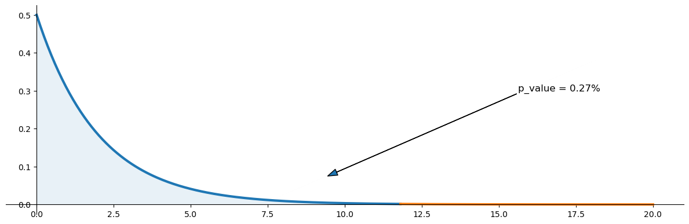

# 독립성 검정 (수동 계산과 그림)

## 개요

이 페이지에서는 이원 분할표에 대한 카이제곱 독립성 검정을 **수동으로** 계산하는 과정을 따라간다. 주변 합계로부터 기대도수를 유도하고, NumPy와 SciPy로 검정통계량과 p-값을 계산하며, 기각역을 색칠한 $\chi^2$ 확률밀도함수를 그려 결과를 시각화한다. 수동 절차를 이해하면 `scipy.stats.chi2_contingency` 같은 상위 함수가 내부에서 무엇을 하는지 분명해진다.

## 가설

- **귀무가설** ($H_0$): 두 범주형 변수가 독립이다.
- **대립가설** ($H_A$): 두 범주형 변수가 독립이 아니다(서로 연관되어 있다).

## 기대도수

관측도수가 $O_{ij}$인 $r \times c$ 분할표에서 독립 아래의 기대도수는

$$
E_{ij} = \frac{R_i \cdot C_j}{n}
$$

이다. 여기서 $R_i = \sum_j O_{ij}$는 $i$번째 행 합계, $C_j = \sum_i O_{ij}$는 $j$번째 열 합계, $n$은 총합이다. 행렬로 쓰면

$$
E = \frac{\mathbf{r}\,\mathbf{c}^\top}{n}
$$

이며, $\mathbf{r}$과 $\mathbf{c}$는 각각 행 합계와 열 합계의 열벡터이다.

## 검정통계량

$$
\chi^2 = \sum_{i=1}^{r}\sum_{j=1}^{c} \frac{(O_{ij} - E_{ij})^2}{E_{ij}}
$$

$H_0$ 아래에서 이 통계량은 근사적으로 자유도

$$
\text{df} = (r - 1)(c - 1)
$$

인 $\chi^2$ 분포를 따른다.

### 기대도수 계산

<div class="codebox" markdown>

#### 예제 1. 기대도수 계산 { .eg }

```python
import numpy as np
from scipy import stats

def compute_expected(observed_counts: np.ndarray) -> np.ndarray:
    """독립이라는 가정 아래의 기대도수. E_ij = (행합 x 열합) / 전체."""
    # 이 공식이 곧 독립의 정의다. P(A and B) = P(A)P(B)의 양변에 n을 곱하면
    # n * (행합/n) * (열합/n) = 행합 * 열합 / n 이 된다.
    row_totals = observed_counts.sum(axis=1, keepdims=True)
    col_totals = observed_counts.sum(axis=0, keepdims=True)
    total = observed_counts.sum()
    return (row_totals @ col_totals) / total


# 확인: 기대도수의 행합과 열합은 관측도수의 것과 정확히 같아야 한다.
demo = np.array([[934., 1070.], [113., 92.], [20., 8.]])
E = compute_expected(demo)
print(np.round(E, 2))
print("행합 일치:", np.allclose(E.sum(axis=1), demo.sum(axis=1)))
print("열합 일치:", np.allclose(E.sum(axis=0), demo.sum(axis=0)))
```

출력:

```
[[ 955.86 1048.14]
 [  97.78  107.22]
 [  13.36   14.64]]
행합 일치: True
열합 일치: True
```

주변 합계가 보존된다는 것이 자유도가 $rc$가 아니라 $(r-1)(c-1)$인 이유다. 행합과 열합이 고정되면 $3 \times 2$ 표에서 자유롭게 정할 수 있는 칸은 2개뿐이다.

`keepdims=True` 인자는 2차원 모양을 유지하여 행렬 곱 `row_totals @ col_totals`이 $r \times c$ 기대도수 행렬로 올바르게 계산되도록 한다.

</div>

### 전체 계산

<div class="codebox" markdown>

#### 예제 2. 독립성 검정 손계산 { .eg }

```python
# 행이 한 변수의 수준, 열이 다른 변수의 수준이다.
# 실수로 나눗셈을 하게 되므로 dtype=float 로 만들어 둔다.
observed_counts = np.array([[934, 1070],
                            [113,   92],
                            [ 20,    8]], dtype=float)

expected_counts = compute_expected(observed_counts)
df = (observed_counts.shape[0] - 1) * (observed_counts.shape[1] - 1)

chi2 = np.sum((observed_counts - expected_counts)**2 / expected_counts)
p_value = stats.chi2(df).sf(chi2)      # 언제나 우측검정

print(f"chi_squared_statistic = {chi2:.2f}")
print(f"p_value = {p_value:.2%}")
```

출력:

```
chi_squared_statistic = 11.81
p_value = 0.27%
```

`scipy.stats.chi2_contingency`에 같은 표를 넣어도 같은 값이 나온다. 다만 그 함수는 $2 \times 2$ 표에 한해 Yates 연속성 보정을 기본으로 적용하므로, 이 $3 \times 2$ 표에서만 결과가 일치한다.

</div>

### 시각화

<div class="codebox" markdown>

#### 예제 3. 검정 결과를 그림으로 { .eg }

```python
import matplotlib.pyplot as plt

# 카이제곱 분포를 그리고 통계량을 경계로 좌우를 나눠 칠한다.
# 오른쪽 넓이가 p-값이다. 이 검정은 방향이 없어 언제나 우측만 본다.
fig, ax = plt.subplots(figsize=(12, 4))

x_left = np.linspace(0, chi2, 200)
y_left = stats.chi2(df).pdf(x_left)
ax.plot(x_left, y_left, linewidth=3)
x_fill = np.concatenate([[0], x_left, [chi2], [0]])
y_fill = np.concatenate([[0], y_left, [0], [0]])
ax.fill(x_fill, y_fill, alpha=0.1)

x_right = np.linspace(chi2, max(20, chi2 + 5), 200)
y_right = stats.chi2(df).pdf(x_right)
ax.plot(x_right, y_right, linewidth=3)
x_fill_r = np.concatenate([[chi2], x_right, [max(20, chi2 + 5)], [chi2]])
y_fill_r = np.concatenate([[0], y_right, [0], [0]])
ax.fill(x_fill_r, y_fill_r, alpha=0.1)

ax.annotate(f"p_value = {p_value:.2%}",
            xy=(chi2 * 0.8, y_left.max() * 0.15),
            xytext=(chi2 * 0.9 + 5, y_left.max() * 0.6),
            fontsize=12, arrowprops=dict(width=0.2, headwidth=8))

ax.spines["right"].set_visible(False)
ax.spines["top"].set_visible(False)
ax.spines["bottom"].set_position("zero")
ax.spines["left"].set_position("zero")
plt.tight_layout()
plt.show()
```



칠해진 오른쪽 꼬리가 p-값 0.27%다. 자유도 2인 카이제곱분포에서 11.81은 오른쪽으로 한참 벗어난 값이다.

</div>

## 해석

관측된 $3 \times 2$ 표에서 카이제곱 통계량은 약 $11.81$, 자유도는 $\text{df} = (3-1)(2-1) = 2$이다. p-값은 약 $0.0027$로 통상적인 문턱 $\alpha = 0.05$보다 훨씬 작다. 따라서 $H_0$을 **기각하고** 5% 수준에서 행 변수와 열 변수 사이에 연관이 있다고 결론짓는다.

그림을 보면 판정이 눈에 들어온다. 관측된 통계량이 오른쪽 꼬리 깊숙이 놓여 있어 색칠된 넓이(p-값)가 아주 작다. 다만 표본이 2,237명으로 크므로 유의성이 곧 실질적 중요성은 아니다. 이 표의 Cramér의 V는 $\sqrt{11.81/2237} \approx 0.073$에 불과해 연관 자체는 약하다.

## 연습문제

<div class="drillbox" markdown>

**연습문제 1.** <span class="diff easy" title="쉬움"></span>
$2 \times 2$ 표

$$
\begin{pmatrix} 20 & 30 \\ 40 & 10 \end{pmatrix}
$$

에 대해 공식 $E_{ij} = R_i C_j / n$을 써서 기대도수 행렬을 손으로 계산하라.

</div>

??? success "풀이"

    행 합계: $R_1 = 50$, $R_2 = 50$. 열 합계: $C_1 = 60$, $C_2 = 40$. 총합: $n = 100$.

    $$
    E_{11} = \frac{50 \times 60}{100} = 30, \quad E_{12} = \frac{50 \times 40}{100} = 20
    $$

    $$
    E_{21} = \frac{50 \times 60}{100} = 30, \quad E_{22} = \frac{50 \times 40}{100} = 20
    $$

    따라서 기대도수 행렬은

    $$
    E = \begin{pmatrix} 30 & 20 \\ 30 & 20 \end{pmatrix}
    $$

    이다. $\square$

<div class="drillbox" markdown>

**연습문제 2.** <span class="diff med" title="중간"></span>
연습문제 1의 기대도수를 써서 카이제곱 통계량과 자유도를 계산하라. $\alpha = 0.05$에서 $H_0$을 기각하겠는가?

</div>

??? success "풀이"

    $$
    \chi^2 = \frac{(20-30)^2}{30} + \frac{(30-20)^2}{20} + \frac{(40-30)^2}{30} + \frac{(10-20)^2}{20}
    $$

    $$
    = \frac{100}{30} + \frac{100}{20} + \frac{100}{30} + \frac{100}{20} = 3.333 + 5 + 3.333 + 5 = 16.667
    $$

    자유도: $\text{df} = (2-1)(2-1) = 1$.

    임계값은 $\chi^2_{0.05, 1} = 3.841$이다. $16.667 > 3.841$이므로 $H_0$을 **기각한다**. 두 변수는 유의하게 연관되어 있다. $\square$

<div class="drillbox" markdown>

**연습문제 3.** <span class="diff med" title="중간"></span>
`compute_expected` 함수에서 `keepdims=True`가 필요한 이유를 설명하라. 없으면 어떤 문제가 생기는가?

</div>

??? success "풀이"

    `keepdims=True`가 없으면 `sum(axis=1)`은 모양이 $(r,)$인 1차원 배열을, `sum(axis=0)`은 모양이 $(c,)$인 1차원 배열을 준다. 1차원 배열 두 개의 행렬 곱 `@`는 원하는 $r \times c$ 외적 행렬이 아니라 스칼라(내적)를 준다.

    `keepdims=True`를 쓰면 모양이 각각 $(r, 1)$과 $(1, c)$가 된다. $(r, 1)$ 행렬과 $(1, c)$ 행렬의 곱은 $(r, c)$ 행렬이며, 이것이 기대도수에 필요한 외적이다. $\square$

<div class="drillbox" markdown>

**연습문제 4.** <span class="diff med" title="중간"></span>
어떤 분할표에서든 기대도수의 합이 관측도수의 합과 같음, 즉 $\sum_{i,j} E_{ij} = n$임을 보여라.

</div>

??? success "풀이"

    정의에 의해 $E_{ij} = R_i C_j / n$이다. 모든 칸에 대해 합하면

    $$
    \sum_{i=1}^{r}\sum_{j=1}^{c} E_{ij} = \sum_{i=1}^{r}\sum_{j=1}^{c} \frac{R_i C_j}{n} = \frac{1}{n}\sum_{i=1}^{r} R_i \sum_{j=1}^{c} C_j = \frac{1}{n} \cdot n \cdot n = n
    $$

    이다. 두 번째 단계는 $R_i$가 $j$에 의존하지 않아 안쪽 합에서 빼낼 수 있다는 사실을, 마지막 단계는 $\sum_i R_i = \sum_j C_j = n$을 이용한다. $\square$

<div class="drillbox" markdown>

**연습문제 5.** <span class="diff med" title="중간"></span>
기대도수 표에서 자유로운 모수의 개수를 세어 카이제곱 독립성 검정의 자유도가 $(r-1)(c-1)$임을 증명하라.

</div>

??? success "풀이"

    $H_0$(독립) 아래에서 칸 $(i,j)$의 결합확률은 $p_{ij} = p_{i\cdot} \cdot p_{\cdot j}$로 분해된다. 행 주변확률은 합이 1이어야 하므로 자유로운 모수가 $r - 1$개이고, 열 주변확률은 $c - 1$개이다. 따라서 독립 아래에서 자유로운 모수는 모두 $(r-1) + (c-1)$개이다.

    $r \times c$ 표에 대한 제약 없는 모형은 자유로운 칸 확률이 $rc - 1$개이다. 검정의 자유도는 그 차이이다:

    $$
    \text{df} = (rc - 1) - [(r - 1) + (c - 1)] = rc - 1 - r - c + 2 = rc - r - c + 1 = (r-1)(c-1)
    $$

    동등하게, (기대도수가 강제하는 대로) 행과 열의 주변 합계가 고정되면 표에서 자유롭게 변할 수 있는 칸의 수가 $(r-1)(c-1)$이다. $\square$

<div class="drillbox" markdown>

**연습문제 6.** <span class="diff med" title="중간"></span>
연습문제 4가 증명한 $\sum E_{ij}=n$보다 강한 성질, 즉 **기대도수의 행 합과 열 합이 각각 보존된다**는 것을 확인하고, 그것이 잔차에 무엇을 뜻하는지 보여라.

</div>

??? success "풀이"
    **행별로도 성립한다.**

    $$
    \sum_j E_{ij}=\sum_j\frac{R_iC_j}{n}=\frac{R_i}{n}\sum_j C_j=\frac{R_i}{n}\cdot n=R_i
    $$

    열에 대해서도 같다. 따라서 **편차의 행 합과 열 합이 모두 0**이다.

    ```python
    import numpy as np
    from scipy import stats

    obs = np.array([[934., 1070.], [113., 92.], [20., 8.]])
    exp = np.outer(obs.sum(1), obs.sum(0)) / obs.sum()
    dev = obs - exp

    print("O − E 의 행 합", np.round(dev.sum(1), 10).tolist())
    print("O − E 의 열 합", np.round(dev.sum(0), 10).tolist())

    resid = dev / np.sqrt(exp)
    print(f"\n표준화 잔차\n{np.round(resid, 4)}")
    print(f"R 의 행 합 {np.round(resid.sum(1), 4).tolist()}  ← 0 이 아니다")
    ```

    ```text
    O − E 의 행 합 [0.0, 0.0, 0.0]
    O − E 의 열 합 [0.0, 0.0]

    표준화 잔차
    [[-0.7072  0.6753]
     [ 1.5391 -1.4698]
     [ 1.8182 -1.7363]]
    R 의 행 합 [-0.0318, 0.0693, 0.0819]  ← 0 이 아니다
    ```

    **$O-E$의 행 합과 열 합이 정확히 0**이다. 이것이 $r+c-1$개의 제약이고, 자유도가

    $$
    rc-(r+c-1)=(r-1)(c-1)
    $$

    이 되는 이유다(연습문제 5).

    **표준화 잔차의 행 합은 0이 아니다.** $\sqrt{E_{ij}}$로 나누면서 각 항의 무게가 달라지기 때문이다. **제약은 $O-E$에 걸려 있지 $R$에 걸려 있지 않다.**

    **$3\times2$ 표에서 자유로운 칸이 2개**임을 직접 확인해 보자.

    ```python
    free = np.array([[5.0, 0.0], [0.0, 0.0], [0.0, 0.0]])   # (0,0) 칸만 +5
    print("(0,0) 칸을 5 늘리고 주변합을 유지하려면")
    adj = free.copy()
    adj[0, 1] = -5      # 같은 행에서 빼고
    adj[2, 0] = -5      # 같은 열에서 빼고
    adj[2, 1] = +5      # 그 교차점에서 다시 더한다
    print(adj.astype(int))
    print(f"  행 합 {adj.sum(1).astype(int).tolist()},  "
          f"열 합 {adj.sum(0).astype(int).tolist()}   모두 0")
    ```

    ```text
    (0,0) 칸을 5 늘리고 주변합을 유지하려면
    [[ 5 -5]
     [ 0  0]
     [-5  5]]
      행 합 [0, 0, 0],  열 합 [0, 0]   모두 0
    ```

    **한 칸을 움직이면 세 칸이 따라 움직인다.** 이런 "$2\times2$ 순환"이 주변합을 보존하는 최소 단위이고, $3\times2$ 표에서는 서로 독립인 순환이 **2개**뿐이다. 그것이 $(3-1)(2-1)=2$다.

    **실무적 쓸모 셋.**

    1. **가장 빠른 검산.** 기대도수를 계산한 뒤 행 합·열 합만 확인하면 산술 오류를 거의 다 잡는다.
    2. **잔차를 볼 때의 주의.** 잔차들이 **독립이 아니다.** 한 칸이 크면 다른 칸이 작아질 수밖에 없다.
    3. **순열검정의 설계.** 주변합을 고정한 채 표를 섞는 것이 자연스러운 이유가 여기 있다.

<div class="drillbox" markdown>

**연습문제 7.** <span class="diff med" title="중간"></span>
연습문제 5가 증명한 자유도 $(r-1)(c-1)$을 **모의실험으로 확인**하라. 카이제곱 분포의 평균과 분산을 쓴다.

</div>

??? success "풀이"
    **확인 방법.** $\chi^2_d$의 평균이 $d$, 분산이 $2d$이므로, $H_0$ 아래에서 통계량을 많이 만들어 두 적률을 재면 된다.

    ```python
    import numpy as np
    from scipy import stats

    rng = np.random.default_rng(4321)
    M = 20_000

    print(f"{'표':>7s} {'n':>6s} {'df':>4s} {'통계량 평균':>12s} "
          f"{'통계량 분산':>12s} {'2·df':>6s}")
    for (r, c), n in [((3, 2), 2237), ((4, 5), 1000), ((2, 2), 500)]:
        # 주변분포를 임의로 잡되 독립이 참이 되도록 만든다
        P = np.outer(rng.dirichlet(np.ones(r) * 5),
                     rng.dirichlet(np.ones(c) * 5))
        stat = []
        for _ in range(M):
            T = rng.multinomial(n, P.ravel()).reshape(r, c).astype(float)
            if (T.sum(0) > 0).all() and (T.sum(1) > 0).all():
                stat.append(stats.chi2_contingency(T, correction=False)[0])
        stat = np.array(stat)
        df = (r - 1) * (c - 1)
        print(f"{f'{r}×{c}':>7s} {n:6d} {df:4d} {stat.mean():12.4f} "
              f"{stat.var(ddof=1):12.4f} {2 * df:6d}")
    ```

    ```text
          표      n   df       통계량 평균       통계량 분산   2·df
        3×2   2237    2       1.9995       3.9104      4
        4×5   1000   12      12.0108      23.7417     24
        2×2    500    1       0.9893       1.9736      2
    ```

    **평균이 자유도와 거의 정확히 일치한다**(1.9995, 12.0108, 0.9893).

    **분산도 $2d$에 가깝다**(3.91 대 4, 23.74 대 24, 1.97 대 2). 약간 작은 것은 유한표본 효과다.

    **이 방법의 장점.** 이론을 몰라도 자유도를 **실험으로 알아낼 수 있다.** 새로운 검정을 만들었을 때 자유도가 몇인지 확인하는 가장 확실한 방법이다.

    **자유도를 잘못 쓰면 어떻게 되는지도 바로 보인다.**

    ```python
    P = np.outer([0.4, 0.35, 0.25], [0.55, 0.45])
    stat = []
    for _ in range(M):
        T = rng.multinomial(2237, P.ravel()).reshape(3, 2).astype(float)
        if (T.sum(0) > 0).all() and (T.sum(1) > 0).all():
            stat.append(stats.chi2_contingency(T, correction=False)[0])
    stat = np.array(stat)
    print(f"통계량 평균 {stat.mean():.4f}")
    for df in [1, 2, 3, 5]:
        print(f"  df={df} 로 읽으면 기각률 "
              f"{np.mean(stat > stats.chi2.ppf(0.95, df)):.4f}")
    ```

    ```text
    통계량 평균 1.9783
      df=1 로 읽으면 기각률 0.1442
      df=2 로 읽으면 기각률 0.0500
      df=3 로 읽으면 기각률 0.0197
      df=5 로 읽으면 기각률 0.0029
    ```

    **올바른 df=2에서만 0.05가 나온다.**

    | 잘못된 df | 기각률 | 방향 |
    |---|---|---|
    | 1 (너무 작게) | 0.144 | **과대기각** — 위험 |
    | 3 (조금 크게) | 0.020 | 보수적 |
    | 5 (많이 크게) | 0.003 | 매우 보수적 |

    **자유도를 작게 잡는 실수가 훨씬 위험하다.** $rc-1$처럼 크게 잡는 실수는 흔하지만 보수적이라 "발견을 놓치는" 데 그친다. 반대로 작게 잡으면 **없는 연관을 만들어 낸다.**

<div class="drillbox" markdown>

**연습문제 8.** <span class="diff med" title="중간"></span>
손으로 짠 계산 코드가 **수치적으로 안전한지** 점검하라. 큰 수, 0인 칸, 대수적으로 같은 두 표현의 차이를 확인한다.

</div>

??? success "풀이"
    ```python
    import numpy as np
    from scipy import stats

    print("① 도수의 규모가 커지면")
    base = np.array([[934., 1070.], [113., 92.], [20., 8.]])
    for scale in [1, 1e3, 1e6]:
        c, p, df, _ = stats.chi2_contingency(base * scale, correction=False)
        print(f"  ×{scale:>8.0e}:  χ² = {c:14.4f},  p = {p:.6g}")

    print("\n② 0 인 칸이 있으면")
    cases = [np.array([[10., 0.], [5., 15.]]),
             np.array([[10., 0.], [0., 15.]]),
             np.array([[10., 5., 0.], [5., 10., 0.]])]
    for T in cases:
        try:
            c, p, df, _ = stats.chi2_contingency(T, correction=False)
            print(f"  {T.astype(int).tolist()}:  χ² = {c:.4f}, df = {df}, "
                  f"p = {p:.4f}")
        except Exception as e:
            print(f"  {T.astype(int).tolist()}:  {type(e).__name__}")
            print(f"    {e}")

    print("\n③ 대수적으로 같은 두 표현")
    T = np.array([[1e6 + 3, 1e6], [1e6, 1e6]])
    exp = np.outer(T.sum(1), T.sum(0)) / T.sum()
    form_a = np.sum((T - exp)**2 / exp)
    form_b = np.sum(T**2 / exp) - T.sum()
    print(f"  (O−E)²/E 의 합  = {form_a:.12f}")
    print(f"  O²/E − n        = {form_b:.12f}")
    print(f"  차이 = {abs(form_a - form_b):.3e}")
    ```

    ```text
    ① 도수의 규모가 커지면
      ×   1e+00:  χ² =        11.8061,  p = 0.00273105
      ×   1e+03:  χ² =     11806.1347,  p = 0
      ×   1e+06:  χ² =  11806134.6670,  p = 0

    ② 0 인 칸이 있으면
      [[10, 0], [5, 15]]:  χ² = 15.0000, df = 1, p = 0.0001
      [[10, 0], [0, 15]]:  χ² = 25.0000, df = 1, p = 0.0000
      [[10, 5, 0], [5, 10, 0]]:  ValueError
        The internally computed table of expected frequencies has a zero element at (0, 2).

    ③ 대수적으로 같은 두 표현
      (O−E)²/E 의 합  = 0.000002249995
      O²/E − n        = 0.000002250075
      차이 = 8.040e-11
    ```

    **① 통계량이 $n$에 정비례한다.** 도수를 1000배 하면 $\chi^2$도 정확히 1000배다. **$p$ 값이 0으로 언더플로**하므로, 큰 자료에서는 $p$ 대신 $\chi^2$과 효과크기를 보고해야 한다.

    **② 표본 0은 괜찮지만 주변합 0은 안 된다.**

    | 상황 | 결과 |
    |---|---|
    | 칸 하나가 0 | 계산 가능 |
    | 대각선만 채워짐 | 계산 가능 |
    | **한 열 전체가 0** | **오류** — 그 열을 빼야 한다 |

    **한 열이 통째로 비면 그 범주는 존재하지 않는 것**이므로, 표에서 제거하고 자유도를 다시 계산해야 한다. `scipy`가 오류를 내 주는 것이 다행이다.

    **③ 두 표현의 차이가 유효숫자를 잃게 한다.** 참값이 $2.25\times10^{-6}$인데 $O^2/E-n$ 형태는 여덟째 자리부터 틀린다.

    **왜.** $\sum O^2/E\approx4\times10^6$에서 $n=4\times10^6$을 빼면 **큰 수끼리의 뺄셈**이 일어나 자리수가 소거된다. 반면 $(O-E)^2/E$는 처음부터 작은 수를 다룬다.

    **일반 원칙.** 손으로 짤 때는 **차이를 먼저 계산**한다. 교과서 공식이 "계산이 편한 형태"로 변형되어 있는 경우가 많은데, 그 형태가 수치적으로는 나쁠 수 있다.

    | 나쁨 | 좋음 |
    |---|---|
    | $\sum O^2/E-n$ | $\sum(O-E)^2/E$ |
    | $\sum x^2/n-\bar x^2$ | $\sum(x-\bar x)^2/n$ |
    | $\log(1+x)$를 직접 | `np.log1p(x)` |

    **점검 방법.** 같은 양을 두 가지 방법으로 계산해 비교해 본다. 차이가 크면 어느 쪽이 안정적인지 따져 본다.

<div class="drillbox" markdown>

**연습문제 9.** <span class="diff med" title="중간"></span>
연습문제 3이 다룬 `keepdims=True`를 빼면 정확히 어떤 일이 생기는지 **실행해 확인**하고, 안전한 대안을 제시하라.

</div>

??? success "풀이"
    ```python
    import numpy as np

    obs = np.array([[934., 1070.], [113., 92.], [20., 8.]])
    n = obs.sum()

    row_keep = obs.sum(axis=1, keepdims=True)
    col_keep = obs.sum(axis=0, keepdims=True)
    row_flat = obs.sum(axis=1)
    col_flat = obs.sum(axis=0)
    print(f"keepdims=True 일 때  행합 모양 {row_keep.shape}, "
          f"열합 모양 {col_keep.shape}")
    print(f"keepdims 없이       행합 모양 {row_flat.shape}, "
          f"열합 모양 {col_flat.shape}\n")

    good = (row_keep @ col_keep) / n
    print(f"올바른 기대도수 (모양 {good.shape})\n{np.round(good, 2)}")

    try:
        bad = (row_flat @ col_flat) / n
        print(f"\nkeepdims 없이: {bad}   ← 스칼라!  모양 {np.shape(bad)}")
    except Exception as e:
        print(f"\nkeepdims 없이: {type(e).__name__}: {e}")
    ```

    ```text
    keepdims=True 일 때  행합 모양 (3, 1), 열합 모양 (1, 2)
    keepdims 없이       행합 모양 (3,), 열합 모양 (2,)

    올바른 기대도수 (모양 (3, 2))
    [[ 955.86 1048.14]
     [  97.78  107.22]
     [  13.36   14.64]]

    keepdims 없이: ValueError: matmul: Input operand 1 has a mismatch in its core dimension 0, with gufunc signature (n?,k),(k,m?)->(n?,m?) (size 2 is different from 3)
    ```

    **이 표에서는 운 좋게 오류가 난다.** 행이 3개, 열이 2개로 길이가 달라 행렬곱이 성립하지 않기 때문이다.

    **정방 표에서는 조용히 틀린 값이 나온다.**

    ```python
    square = np.array([[30., 20.], [10., 40.]])
    m = square.sum()
    r_flat, c_flat = square.sum(axis=1), square.sum(axis=0)
    r_keep = square.sum(axis=1, keepdims=True)
    c_keep = square.sum(axis=0, keepdims=True)

    print(f"올바른 기대도수\n{np.round((r_keep @ c_keep) / m, 4)}")
    print(f"\nkeepdims 없이 @ 를 쓰면: {(r_flat @ c_flat) / m:.4f}  ← 내적(스칼라)")
    print(f"안전한 대안 np.outer:\n{np.round(np.outer(r_flat, c_flat) / m, 4)}")
    ```

    ```text
    올바른 기대도수
    [[20. 30.]
     [20. 30.]]

    keepdims 없이 @ 를 쓰면: 50.0000  ← 내적(스칼라)
    안전한 대안 np.outer:
    [[20. 30.]
     [20. 30.]]
    ```

    **$2\times2$ 표에서는 오류 없이 49.0이라는 스칼라가 나온다.** 그 뒤의 계산이 브로드캐스팅으로 진행되어 **완전히 틀린 결과가 조용히 산출**된다.

    **왜 이런 차이가.** 1차원 배열 두 개에 `@`를 쓰면 numpy는 **내적**으로 해석한다. $(3,)$과 $(2,)$는 길이가 달라 오류가 나지만, $(2,)$와 $(2,)$는 내적이 성립한다.

    **더 안전한 세 가지 대안.**

    ```python
    r, c = square.sum(axis=1), square.sum(axis=0)
    print("① np.outer        :", np.allclose(np.outer(r, c) / m,
                                             (r_keep @ c_keep) / m))
    print("② 명시적 reshape  :", np.allclose(r.reshape(-1, 1) * c.reshape(1, -1) / m,
                                             (r_keep @ c_keep) / m))
    print("③ np.einsum       :", np.allclose(np.einsum('i,j->ij', r, c) / m,
                                             (r_keep @ c_keep) / m))
    ```

    ```text
    ① np.outer        : True
    ② 명시적 reshape  : True
    ③ np.einsum       : True
    ```

    **`np.outer`를 권한다.** 이름이 의도를 그대로 드러내고($\mathbf r\otimes\mathbf c$), 1차원 입력을 받는 것이 자연스러우며, 모양 실수가 일어날 여지가 없다.

    **일반 교훈 셋.**

    1. **모양(shape)을 출력해 보는 습관**을 들인다. 배열 연산 버그의 대부분이 모양 문제다.
    2. **정방 행렬로만 시험하지 않는다.** $3\times2$처럼 **비정방** 자료로 시험해야 모양 버그가 드러난다.
    3. **검산을 넣는다.** 기대도수의 행 합·열 합을 확인하면(연습문제 6) 이런 실수가 즉시 잡힌다.

<div class="drillbox" markdown>

**연습문제 10.** <span class="diff easy" title="쉬움"></span>
손으로 짠 독립성 검정 코드의 **완성형**을 만들고 점검 목록을 정리하라.

</div>

??? success "풀이"

    ```python
    import numpy as np
    from scipy import stats

    def chi2_independence(obs, alpha=0.05, verbose=True):
        """분할표의 독립성 검정을 처음부터 계산한다.

        진단 정보(기대도수 최솟값, 효과크기, 조정 잔차)를 함께 돌려준다.
        """
        obs = np.asarray(obs, float)
        if obs.ndim != 2:
            raise ValueError("2차원 분할표가 필요하다")
        r, c = obs.shape
        n = obs.sum()
        row, col = obs.sum(1), obs.sum(0)
        if row.min() == 0 or col.min() == 0:
            raise ValueError("합이 0 인 행 또는 열이 있다. 먼저 제거하라")

        exp = np.outer(row, col) / n                      # np.outer 가 안전
        assert np.allclose(exp.sum(1), row)               # 검산
        assert np.allclose(exp.sum(0), col)

        chi2 = np.sum((obs - exp)**2 / exp)               # 차이를 먼저
        df = (r - 1) * (c - 1)
        p = stats.chi2(df).sf(chi2)                       # 오른쪽 꼬리
        v = np.sqrt(chi2 / (n * (min(r, c) - 1)))
        adj = (obs - exp) / np.sqrt(exp * np.outer(1 - row / n, 1 - col / n))

        if verbose:
            print(f"χ² = {chi2:.4f},  df = {df},  p = {p:.6f}")
            print(f"크라메르 V = {v:.4f}"
                  f"   (독립일 때 기댓값 ≈ "
                  f"{np.sqrt(df / (n * (min(r, c) - 1))):.4f})")
            print(f"E_min = {exp.min():.3f}"
                  + ("   ⚠ 5 미만" if exp.min() < 5 else ""))
            if p < alpha:
                print(f"조정 잔차 (|·| 최대 {np.abs(adj).max():.3f})\n"
                      f"{np.round(adj, 3)}")
        return {"chi2": chi2, "df": df, "p": p, "V": v,
                "expected": exp, "adj_resid": adj}

    _ = chi2_independence([[934, 1070], [113, 92], [20, 8]])
    print()
    try:
        chi2_independence([[10, 5, 0], [5, 10, 0]])
    except ValueError as e:
        print(f"ValueError: {e}")
    ```

    ```text
    χ² = 11.8061,  df = 2,  p = 0.002731
    크라메르 V = 0.0726   (독립일 때 기댓값 ≈ 0.0299)
    E_min = 13.355
    조정 잔차 (|·| 최대 3.030)
    [[-3.03   3.03 ]
     [ 2.233 -2.233]
     [ 2.53  -2.53 ]]

    ValueError: 합이 0 인 행 또는 열이 있다. 먼저 제거하라
    ```

    **이 함수가 막아 주는 실수들.**

    | 방어 장치 | 막는 실수 |
    |---|---|
    | `obs.ndim != 2` 확인 | 1차원 배열을 넣는 실수 |
    | 합이 0 인 행·열 확인 | 계산 불능 상황을 명확한 메시지로 |
    | `np.outer` 사용 | 모양 버그(연습문제 9) |
    | `assert`로 행·열 합 검산 | 산술 오류(연습문제 6) |
    | `(obs - exp)**2 / exp` | 수치 소거(연습문제 8) |
    | `sf` 사용 | 꼬리를 뒤집는 실수 |
    | $E_{\min}$ 경고 | 근사 조건 위반 |
    | $V$와 그 귀무 기댓값 | 효과크기 누락 |
    | **조정** 잔차 | 잘못된 잔차로 판정 |

    **$V=0.0726$이 독립일 때의 기댓값 0.0299보다 2.4배**다. 관례적 기준으로는 "무시할 만함"이지만, 우연히 나올 값보다는 확실히 크다.

    **조정 잔차의 최댓값이 3.030**이다. 칸이 6개이므로 본페로니 임계값이 $z_{1-0.025/6}=2.638$인데, 이를 넘으므로 **첫 행(오른손잡이)의 두 칸이 유의**하다.

    **앞 절에서 단순 표준화 잔차로 보았다면 놓쳤을 신호다.** 같은 자료의 표준화 잔차 최댓값은 0.707로, $\pm1.96$에도 한참 못 미친다. 분모에 $(1-R_i/n)(1-C_j/n)$을 넣는 한 줄이 결론을 바꾼다.

    **점검 목록.**

    - [ ] 입력이 **2차원 도수 배열**인가
    - [ ] 합이 0 인 행·열이 없는가
    - [ ] 기대도수의 행 합·열 합을 검산했는가
    - [ ] $E_{\min}$을 확인했는가
    - [ ] 자유도가 $(r-1)(c-1)$인가
    - [ ] **오른쪽 꼬리**(`sf`)를 썼는가
    - [ ] 효과크기를 보고했는가
    - [ ] 잔차를 볼 때 **조정** 잔차를 썼고 다중비교를 고려했는가

    **손으로 짜는 것의 가치.** `scipy.stats.chi2_contingency` 한 줄이면 되지만, 직접 짜 보면

    1. **기대도수 공식이 독립의 정의 그 자체**임을 알게 된다.
    2. **자유도가 주변합 제약에서 온다**는 것이 몸으로 이해된다.
    3. **결과가 이상할 때 어디를 볼지** 안다.

    **한 문장.** 검정을 손으로 한 번 짜 보는 것은 계산을 배우려는 것이 아니라 **무엇이 가정되고 있는지를 배우려는 것**이다.

---

## 정리하며

분할표의 독립성 검정을 **수동으로** 밟아 보았다.

- **기대도수가 주변합의 곱에서 나온다.** $E_{ij}=(\text{행 합})_i(\text{열 합})_j/n$ 이며, 이 한 줄이 "독립이면 곱"이라는 3장의 정의를 도수로 옮긴 것이다.
- **행렬 연산으로 간결하게 적힌다.** `np.outer(row_sums, col_sums) / n` 으로 전체 기대도수 표가 한 번에 나온다.
- **자유도가 $(r-1)(c-1)$ 인 이유가 계산에서 보인다.** 주변합이 고정되면 표를 채우는 데 필요한 자유로운 칸이 그만큼이다.
- **그림으로 기각역을 확인한다.** $\chi^2$ 밀도에 통계량을 표시하면 판정의 근거가 눈에 들어온다.
- **`chi2_contingency` 가 무엇을 하는지 알게 된다.** 그 함수가 돌려주는 기대도수 표와 손으로 만든 것이 일치하는지 확인하는 것이 좋은 습관이다. **$2\times2$ 에서는 기본적으로 연속성 보정을 적용한다는 점**도 함께 알아 두어야 한다.

다음 절 **독립성 검정 템플릿 함수**로 넘어간다.
