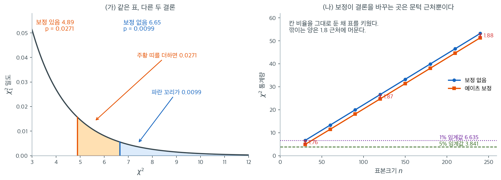

# 독립성 검정 템플릿 함수

## 개요

이 페이지에서는 `scipy.stats.chi2_contingency` 위에 세운, 재사용 가능한 카이제곱 독립성 검정 템플릿 함수를 제시한다. SciPy 호출을 문서화된 함수로 감싸 두면 어떤 이원 분할표에도 손쉽게 검정을 적용할 수 있다. 이 함수는 $2 \times 2$ 표를 위한 Yates 연속성 보정도 선택적으로 제공한다.

## 가설

- **귀무가설** ($H_0$): 행 변수와 열 변수가 독립이다.
- **대립가설** ($H_A$): 행 변수와 열 변수 사이에 연관이 있다.

## 검정통계량

$$
\chi^2 = \sum_{i=1}^{r}\sum_{j=1}^{c} \frac{(O_{ij} - E_{ij})^2}{E_{ij}}
$$

자유도는 $\text{df} = (r-1)(c-1)$이고, $E_{ij} = R_i C_j / n$은 독립 아래의 기대도수이다.

### Yates 연속성 보정

$2 \times 2$ 표에서는 선택적인 **Yates 보정**이 각 항을 다음과 같이 수정한다:

$$
\chi^2_{\text{Yates}} = \sum_{i=1}^{2}\sum_{j=1}^{2} \frac{(|O_{ij} - E_{ij}| - 0.5)^2}{E_{ij}}
$$

이 보정은 검정통계량을 조금 줄여, 칸 도수가 작을 때 검정을 더 보수적으로 만든다.

### 템플릿 함수

<div class="exbox" markdown>

**보기 1.** <span class="diff easy" title="쉬움"></span> 독립성 검정 템플릿 함수. `scipy.stats.chi2_contingency` 는 $2\times2$ 표에서 **기본으로 예이츠 보정을 건다.** 그 기본값이 무엇을 바꾸는지 손으로 재어 본다. 표는

$$
\begin{pmatrix} a & b \\ c & d \end{pmatrix} = \begin{pmatrix} 10 & 5 \\ 3 & 12 \end{pmatrix},
\qquad n = 30
$$

이다.

**(1)** $2\times2$ 표에서 네 칸의 어긋남이 모두 $\pm(ad-bc)/n$ 임을 보이고, 이로부터 **닫힌 꼴**

$$
\chi^2 = \frac{n(ad-bc)^2}{(a+b)(c+d)(a+c)(b+d)}
$$

을 유도하여 이 표의 값을 **유리수로** 구하시오.

**(2)** 예이츠 보정판도 닫힌 꼴로 적히는지 보이고, 두 통계량의 차가

$$
\chi^2 - \chi^2_{\text{Yates}} = \frac{n^2}{D}\left(\lvert ad-bc \rvert - \frac n4\right),
\qquad D = (a+b)(c+d)(a+c)(b+d)
$$

임을 보이시오.

**(3)** 자유도 1 에서는 p-값이 **표준정규로** 적힌다. 두 p-값을 구해 $\alpha = 0.05$ 와 $\alpha = 0.01$ 에서 각각 판정하시오.

**(4)** 기본값을 `False` 로 못 박은 템플릿 함수를 짜고 두 값을 비교하시오.

</div>

??? success "풀이"

    **(1) 네 칸이 한 수로 묶인다.** 행 합은 $R_1 = a+b$, $R_2 = c+d$, 열 합은 $C_1 = a+c$, $C_2 = b+d$, 총합은 $n$ 이다. 첫 칸의 어긋남을 계산한다.

    $$
    O_{11} - E_{11} = a - \frac{(a+b)(a+c)}{n} = \frac{an - (a+b)(a+c)}{n}
    $$

    분자를 $n = a+b+c+d$ 로 풀면

    $$
    a(a+b+c+d) - (a^2+ac+ab+bc) = a^2+ab+ac+ad - a^2-ac-ab-bc = ad - bc
    $$

    이므로 $O_{11} - E_{11} = (ad-bc)/n$ 이다. 행 합과 열 합이 보존되므로 나머지 셋은 부호만 뒤집힌다.

    $$
    O - E = \frac{ad-bc}{n}\begin{pmatrix} +1 & -1 \\ -1 & +1 \end{pmatrix}
    $$

    **$2\times2$ 표의 자유도가 1 이라는 말이 바로 이것이다.** 네 칸의 어긋남이 수 하나로 결정된다. 그러면

    $$
    \chi^2 = \frac{(ad-bc)^2}{n^2}\sum_{i,j}\frac{1}{E_{ij}}
    = \frac{(ad-bc)^2}{n^2}\sum_{i,j}\frac{n}{R_i C_j}
    = \frac{(ad-bc)^2}{n}\left(\frac1{R_1}+\frac1{R_2}\right)\!\left(\frac1{C_1}+\frac1{C_2}\right)
    $$

    인데 $R_1 + R_2 = C_1 + C_2 = n$ 이므로 두 괄호가 각각 $n/(R_1R_2)$, $n/(C_1C_2)$ 다. 따라서

    $$
    \chi^2 = \frac{(ad-bc)^2}{n}\cdot\frac{n^2}{R_1R_2C_1C_2} = \frac{n(ad-bc)^2}{(a+b)(c+d)(a+c)(b+d)}
    $$

    이다. $\square$ 수를 넣으면 $ad - bc = 120 - 15 = 105$ 이고 $D = 15 \cdot 15 \cdot 13 \cdot 17 = 49725$ 이므로

    $$
    \chi^2 = \frac{30 \times 105^2}{49725} = \frac{330750}{49725} = \frac{1470}{221} = 6.651584
    $$

    이다. 덧붙여 $\chi^2 = n\phi^2$ 이고 $\phi = (ad-bc)/\sqrt D = 105/\sqrt{49725} = 0.47087$ 이다. **$\chi^2$ 은 $n$ 에 비례하지만 $\phi$ 는 그렇지 않다.**

    **(2) 예이츠판도 같은 꼴이다.** 보정은 각 칸에서 $\lvert O - E\rvert$ 를 $0.5$ 만큼 줄인다. (1)에서 네 칸의 $\lvert O-E\rvert$ 가 모두 $\Delta/n$ 으로 **같았으므로**($\Delta = \lvert ad-bc\rvert$) 줄인 뒤에도 네 칸이 모두 같다.

    $$
    \lvert O_{ij} - E_{ij}\rvert - \tfrac12 = \frac{\Delta}{n} - \frac12 = \frac{\Delta - n/2}{n}
    $$

    (1)의 계산에서 $\Delta$ 를 $\Delta - n/2$ 로 바꾸기만 하면 되므로

    $$
    \chi^2_{\text{Yates}} = \frac{n\left(\Delta - n/2\right)^2}{D}
    $$

    다. 단 $\Delta/n \ge 1/2$ 일 때의 이야기다(그렇지 않으면 보정 뒤 $0$ 으로 자른다). 여기서는 $\Delta/n = 3.5$ 이므로 괜찮다.

    $$
    \chi^2_{\text{Yates}} = \frac{30(105-15)^2}{49725} = \frac{243000}{49725} = \frac{1080}{221} = 4.886878
    $$

    차를 구하면 $x^2 - (x-h)^2 = h(2x-h)$ 를 $x = \Delta$, $h = n/2$ 에 쓴 것이다.

    $$
    \chi^2 - \chi^2_{\text{Yates}} = \frac nD\left[\Delta^2 - \left(\Delta-\frac n2\right)^{\!2}\right]
    = \frac nD \cdot \frac n2\left(2\Delta - \frac n2\right)
    = \frac{n^2}{D}\left(\Delta - \frac n4\right)
    $$

    $\square$ 수로는 $\dfrac{900}{49725}(105 - 7.5) = 0.0181 \times 97.5 = 1.764706 = \dfrac{390}{221}$ 이고, 실제로 $\dfrac{1470}{221} - \dfrac{1080}{221} = \dfrac{390}{221}$ 이다.

    **(3) 자유도 1 의 p-값.** $\chi^2_1$ 은 표준정규의 제곱이므로 꼬리확률이 정규분포로 바로 적힌다.

    $$
    p = P(\chi^2_1 \ge x) = P(\lvert Z\rvert \ge \sqrt x) = 2\Phi(-\sqrt x)
    $$

    따라서

    $$
    p = 2\Phi(-\sqrt{6.651584}) = 2\Phi(-2.57907) = 0.0099068,
    \qquad
    p_{\text{Yates}} = 2\Phi(-\sqrt{4.886878}) = 2\Phi(-2.21063) = 0.0270616
    $$

    이다.

    | | $\chi^2$ | $p$ | $\alpha = 0.05$ | $\alpha = 0.01$ |
    |---|---:|---:|:---:|:---:|
    | 보정 없음 | $6.6516$ | $0.00991$ | 기각 | **기각** |
    | 예이츠 | $4.8869$ | $0.02706$ | 기각 | **기각 못 함** |

    **$5\%$ 에서는 결론이 같고 $1\%$ 에서는 갈린다.** 1% 임계값이 $\chi^2_{1,\,0.01} = 6.6349$ 인데 보정 없는 $6.6516$ 이 그 선을 **$0.017$ 차이로** 간신히 넘고 보정판 $4.8869$ 는 한참 못 미친다. 통계량은 $1.76$ 줄었을 뿐인데 p-값은 $2.7$ 배가 되었다. 꼬리가 가파르게 얇아지는 구간이라 작은 이동이 크게 증폭된다.

    **그러므로 `correction` 의 기본값을 모른 채 "1% 에서 기각" 이라고 적으면 그 문장의 진위가 기본값 하나에 달린다.** 템플릿에서 `False` 로 못 박아 두는 까닭이다.

    **(4) 코드로.**

    ```python
    import numpy as np
    from scipy import stats

    def chi2_independence(observed: np.ndarray, correction: bool = False):
        """카이제곱 독립성 검정.

        correction의 기본값을 **False**로 두었다는 점에 주의하라.
        scipy의 기본값은 True이며, 2x2 표에 Yates 연속성 보정을 자동으로 적용한다.
        모르고 쓰면 작은 2x2 표에서 통계량이 조용히 줄어들어 결론이 달라질 수 있다.
        돌려주는 값은 (통계량, p-값, 자유도, 기대도수).
        """
        return stats.chi2_contingency(observed, correction=correction)


    # 기본값의 차이를 눈으로 확인한다.
    tab = np.array([[10, 5], [3, 12]], dtype=float)
    print("correction=False:", round(chi2_independence(tab, False)[0], 4))
    print("correction=True :", round(chi2_independence(tab, True)[0], 4))

    # (1)(2) 닫힌 꼴과 맞는지
    (a, b), (c, d) = tab
    n = tab.sum()
    D = (a + b) * (c + d) * (a + c) * (b + d)
    delta = abs(a * d - b * c)
    print(f"\n닫힌 꼴  n(ad-bc)^2/D          = {n * delta**2 / D:.6f}")
    print(f"예이츠   n(|ad-bc|-n/2)^2/D    = {n * (delta - n / 2)**2 / D:.6f}")
    print(f"차       (n^2/D)(|ad-bc|-n/4)  = {n**2 / D * (delta - n / 4):.6f}")
    phi = (a * d - b * c) / np.sqrt(D)
    print(f"phi = (ad-bc)/sqrt(D) = {phi:.6f}   n*phi^2 = {n * phi**2:.6f}")

    # (3) 자유도 1 의 p-값은 표준정규로 적힌다
    for name, x in [("보정 없음", chi2_independence(tab, False)[0]),
                    ("예이츠   ", chi2_independence(tab, True)[0])]:
        print(f"{name}  chi2 = {x:.6f}  p(chi2) = {stats.chi2(1).sf(x):.7f}"
              f"  2*Phi(-sqrt) = {2 * stats.norm.sf(np.sqrt(x)):.7f}")
    print(f"1% 임계값 chi2_(1, 0.01) = {stats.chi2.ppf(0.99, 1):.6f}")
    ```

    출력:

    ```
    correction=False: 6.6516
    correction=True : 4.8869

    닫힌 꼴  n(ad-bc)^2/D          = 6.651584
    예이츠   n(|ad-bc|-n/2)^2/D    = 4.886878
    차       (n^2/D)(|ad-bc|-n/4)  = 1.764706
    phi = (ad-bc)/sqrt(D) = 0.470871   n*phi^2 = 6.651584
    보정 없음  chi2 = 6.651584  p(chi2) = 0.0099068  2*Phi(-sqrt) = 0.0099068
    예이츠     chi2 = 4.886878  p(chi2) = 0.0270616  2*Phi(-sqrt) = 0.0270616
    1% 임계값 chi2_(1, 0.01) = 6.634897
    ```

    닫힌 꼴 `6.651584` 와 `4.886878` 이 `scipy` 가 준 `6.6516`·`4.8869` 와 맞고, (1)·(2)의 유리수 $1470/221$·$1080/221$ 과도 소수 여섯째 자리까지 같다. 차 `1.764706` 이 $390/221$ 이다. $n\phi^2$ 도 $\chi^2$ 과 같은 값을 준다.

    (3)의 요점도 그대로다. `p(chi2)` 와 `2*Phi(-sqrt)` 가 일곱 자리까지 **똑같다.** 자유도 1 에서 카이제곱 꼬리는 정규 꼬리를 두 배 한 것이다. 그리고 1% 임계값 `6.634897` 을 보정 없는 `6.651584` 가 $0.0167$ 차이로 넘고 예이츠판은 못 넘는다.

#### 보정이 깎아 가는 양



왼쪽 (가)는 $\chi^2_1$ 밀도의 오른쪽 꼬리를 확대한 것이다. 보정을 걸지 않은 6.65에서 오른쪽으로 뻗은 파란 꼬리의 넓이가 0.0099이고, 보정을 건 4.89까지 왼쪽으로 넓힌 주황 띠를 더하면 0.0271이 된다. 통계량이 1.76 줄었을 뿐인데 p-값은 2.7배가 되었다. 꼬리가 가파르게 얇아지는 구간이라 통계량의 작은 이동이 p-값에서는 크게 증폭되는 것이다.

이 구간에는 1% 임계값 6.635가 들어 있다. 보정 없이는 6.65로 간신히 그 선을 넘고, 보정하면 4.89로 한참 미치지 못한다. `correction` 인자를 어떻게 두었는지 모른 채 "$\alpha = 0.01$에서 기각"이라고 적으면 그 문장의 진위가 기본값 하나에 달리게 된다. 템플릿 함수에서 기본값을 명시적으로 `False`로 못 박아 둔 이유가 여기에 있다.

오른쪽 (나)는 이 걱정이 언제 필요한지를 알려 준다. 칸 비율을 그대로 둔 채 표를 $n = 30$에서 240까지 키우면 두 통계량 모두 $n$에 비례해 커지지만 **둘의 간격은 1.76에서 1.88로 거의 변하지 않는다.** 보정이 각 칸의 이탈에서 0.5씩만 덜어 내기 때문이다. 깎이는 양이 상수에 가깝다는 것은 곧, 통계량이 50이나 되는 큰 표에서는 1.88이 아무것도 아니고 통계량이 5 근처인 작은 표에서는 결정적이라는 뜻이다.

정리하면 예이츠 보정은 "작은 표에서만 중요한" 것이 아니라 "통계량이 임계값 근처일 때만 중요한" 것이다. 두 조건은 보통 같이 오지만 항상 그렇지는 않다. 그리고 그 근처에 있다면, 애초에 결론을 한 번의 카이제곱 검정에 걸지 말고 [Fisher의 정확검정](../practice/fisher_exact.md)까지 함께 보는 편이 낫다.

### 사용 예

<div class="exbox" markdown>

**보기 2.** <span class="diff easy" title="쉬움"></span> 템플릿 사용 예. 이번에는 $2 \times 3$ 표다.

$$
\begin{array}{c|ccc|r}
 & \text{열 1} & \text{열 2} & \text{열 3} & \text{행 합} \\ \hline
\text{행 1} & 30 & 20 & 10 & 60 \\
\text{행 2} & 12 & 25 & 18 & 55 \\ \hline
\text{열 합} & 42 & 45 & 28 & 115
\end{array}
$$

**(1)** 이 표에 `correction=True` 를 주면 어떻게 되는가. 왜 그런가.

**(2)** 행이 둘뿐인 $2 \times c$ 표에서는 통계량이

$$
\chi^2 = \frac{n^2}{R_1 R_2}\sum_{j=1}^{c} \frac{e_j^2}{C_j},
\qquad
e_j = O_{1j} - \frac{R_1 C_j}{n}
$$

으로 줄어듦을 보이고 이 표의 $\chi^2$ 을 구하시오. 자유도 2 이므로 p-값은 **닫힌 꼴**이다.

**(3)** 어느 칸이 통계량을 끌고 가는가. 조정 잔차로 보고 본페로니로 판정하시오.

**(4)** 코드로 확인하시오.

</div>

??? success "풀이"

    **(1) 보정은 걸리지 않는다.** 예이츠 보정은 $2\times2$ 표에서만 뜻이 있다. 보기 1 (2)에서 보았듯 그 보정이 성립한 것은 **네 칸의 $\lvert O-E \rvert$ 가 모두 같았기** 때문인데, $2\times3$ 표에서는 칸마다 어긋남이 달라 "0.5 를 뺀다" 는 조작이 근거를 잃는다. `scipy.stats.chi2_contingency` 도 표가 $2\times2$ 가 아니면 `correction` 인자를 **조용히 무시한다.** 그러니 이 표에서는 `True` 를 주든 `False` 를 주든 같은 값이 나온다.

    **(2) $2 \times c$ 의 닫힌 꼴.** 행이 둘뿐이면 "열 합이 보존된다" 는 제약이 한 열의 두 칸을 한 수로 묶는다. $j$ 열에서

    $$
    (O_{1j}-E_{1j}) + (O_{2j}-E_{2j}) = C_j - C_j = 0
    \quad\Longrightarrow\quad
    O_{1j}-E_{1j} = e_j,\quad O_{2j}-E_{2j} = -e_j
    $$

    이므로 $j$ 열의 기여는

    $$
    \frac{e_j^2}{E_{1j}} + \frac{e_j^2}{E_{2j}}
    = e_j^2\left(\frac{n}{R_1 C_j} + \frac{n}{R_2 C_j}\right)
    = \frac{e_j^2\,n}{C_j}\cdot\frac{R_1+R_2}{R_1R_2}
    = \frac{n^2}{R_1R_2}\cdot\frac{e_j^2}{C_j}
    $$

    다($R_1 + R_2 = n$ 을 썼다). 열에 대해 더하면 주장한 식이다. $\square$

    수를 넣는다. $R_1 = 60$, $R_2 = 55$, $n = 115$ 이므로

    $$
    e_1 = 30 - \frac{60 \cdot 42}{115} = 8.08696,
    \qquad
    e_2 = 20 - \frac{60 \cdot 45}{115} = -3.47826,
    \qquad
    e_3 = 10 - \frac{60 \cdot 28}{115} = -4.60870
    $$

    다. 행 합도 보존되므로 $e_1+e_2+e_3 = 0$ 이어야 하고 실제로 그렇다. 그러면

    $$
    \sum_{j} \frac{e_j^2}{C_j} = \frac{8.08696^2}{42} + \frac{3.47826^2}{45} + \frac{4.60870^2}{28}
    = 1.55709 + 0.26880 + 0.75862 = 2.58451
    $$

    $$
    \chi^2 = \frac{115^2}{60 \cdot 55}\times 2.58451 = 4.00758 \times 2.58451 = 10.35774
    $$

    이다. 자유도는 $(2-1)(3-1) = 2$ 이고, 자유도 2 의 밀도는 $\tfrac12 e^{-x/2}$ 이므로

    $$
    p = e^{-10.35774/2} = e^{-5.17887} = 0.0056344
    $$

    다. $p = 0.0056 < 0.05$ 이므로 $H_0$ 을 **기각한다.**

    **(3) 첫 열이 끌고 간다.** 조정 잔차는 $\tilde R_{ij} = (O_{ij}-E_{ij})\big/\sqrt{E_{ij}(1-R_i/n)(1-C_j/n)}$ 이다. $2 \times c$ 표에서는 (2)에서 본 대로 $O_{2j}-E_{2j} = -(O_{1j}-E_{1j})$ 이므로 **두 행의 조정 잔차가 정확히 부호만 다르다.**

    $$
    \begin{array}{c|rrr}
     & \text{열 1} & \text{열 2} & \text{열 3} \\ \hline
    \text{행 1} & \mathbf{+3.1354} & -1.3304 & -2.0046 \\
    \text{행 2} & -3.1354 & +1.3304 & +2.0046
    \end{array}
    $$

    칸이 6 개이므로 본페로니 임계값은 $z_{1-0.025/6} = 2.6383$ 이다. **$\lvert 3.1354 \rvert$ 만 이를 넘는다.** 열 1 에서 행 1 이 기대 $21.91$ 에 대해 $30$ 으로 많고 행 2 가 기대 $20.09$ 에 대해 $12$ 로 적은 것, 그것이 이 표가 기각된 이유다.

    칸별 기여로 보아도 같다. 열 1 의 두 칸이 전체 $10.358$ 의 $28.8\% + 31.4\% = 60.2\%$ 를 만든다.

    **(4) 수치적으로.**

    ```python
    observed = np.array([[30, 20, 10],
                         [12, 25, 18]], dtype=float)

    # 2x2 표가 아니면 연속성 보정은 뜻이 없다. 그래서 correction=False 로 둔다.
    chi2, p, df, exp = chi2_independence(observed, correction=False)
    print(f"chi2 = {chi2:.3f}, p = {p:.4f}, df = {df}")
    print("expected:\n", exp)

    # (1) 2x3 에서는 correction 인자가 무시된다
    print(f"\ncorrection=True 로 주면 {chi2_independence(observed, True)[0]:.6f}"
          f"   (False 와 같다)")

    # (2) 2 x c 의 닫힌 꼴
    n = observed.sum()
    R, C = observed.sum(1), observed.sum(0)
    e = observed[0] - R[0] * C / n
    closed = n**2 / (R[0] * R[1]) * np.sum(e**2 / C)
    print(f"e_j = {np.round(e, 5)}   합 {e.sum():.1e}")
    print(f"닫힌 꼴 {closed:.5f}   정의대로 {chi2:.5f}")
    print(f"p = exp(-chi2/2) = {np.exp(-chi2 / 2):.7f}   sf = {p:.7f}")

    # (3) 조정 잔차
    adj = (observed - exp) / np.sqrt(exp * np.outer(1 - R / n, 1 - C / n))
    print(f"\n조정 잔차\n{np.round(adj, 4)}")
    print(f"본페로니 임계값 {stats.norm.ppf(1 - 0.025 / 6):.4f}")
    print(f"칸별 기여 (%)\n{np.round((observed - exp)**2 / exp / chi2 * 100, 1)}")
    ```

    출력:

    ```
    chi2 = 10.358, p = 0.0056, df = 2
    expected:
     [[21.91304348 23.47826087 14.60869565]
     [20.08695652 21.52173913 13.39130435]]

    correction=True 로 주면 10.357744   (False 와 같다)
    e_j = [ 8.08696 -3.47826 -4.6087 ]   합 -1.8e-15
    닫힌 꼴 10.35774   정의대로 10.35774
    p = exp(-chi2/2) = 0.0056344   sf = 0.0056344

    조정 잔차
    [[ 3.1354 -1.3304 -2.0046]
     [-3.1354  1.3304  2.0046]]
    본페로니 임계값 2.6383
    칸별 기여 (%)
    [[28.8  5.  14. ]
     [31.4  5.4 15.3]]
    ```

    `correction=True` 를 주어도 `10.357744` 로 똑같다. (1)에서 말한 대로 $2\times2$ 가 아니면 인자가 무시된다.

    닫힌 꼴 `10.35774` 가 정의대로 계산한 값과 다섯째 자리까지 같고, $e_j$ 세 수가 (2)의 손계산과 맞으며 합이 $-1.8\times10^{-15}$ 로 사실상 $0$ 이다. `exp(-chi2/2)` 와 `sf` 가 `0.0056344` 로 같은 것은 자유도 2 의 닫힌 꼴이다.

    조정 잔차도 (3)의 표와 같고 **두 행이 정확히 부호만 다르다.** 열 1 의 두 칸이 기여의 $28.8 + 31.4 = 60.2\%$ 를 만든다.

    자유도가 $(2-1)(3-1) = 2$ 이고, 기대도수는 주변 합계로부터 자동으로 계산된다.

## 템플릿을 언제 어떻게 쓰는가

| 상황 | `correction` |
|----------|:------------:|
| $2 \times 2$보다 큰 표 | `False` (보정은 $2 \times 2$ 전용) |
| 모든 $E_{ij} \ge 5$인 $2 \times 2$ 표 | `False` (표준 검정으로 충분) |
| 일부 $E_{ij}$가 5에 가까운 $2 \times 2$ 표 | `True` (보수적 조정) |
| $E_{ij} < 5$인 칸이 있는 $2 \times 2$ 표 | Fisher의 정확검정을 고려 |

## 해석

보기 표에서 검정은 $\chi^2 = 10.358$, $\text{df} = 2$, $p = 0.0056$을 준다. $\alpha = 0.05$에서 $H_0$을 **기각하고** 행 변수와 열 변수가 독립이 아니라고 결론짓는다. 연관은 통계적으로 유의하다.

*어느* 칸이 유의성을 이끄는지 알아보려면 표준화 잔차 $(O_{ij} - E_{ij}) / \sqrt{E_{ij}}$를 살펴본다. 절댓값이 큰 잔차를 가진 칸이 검정통계량에 가장 많이 기여한다.

## 연습문제

<div class="drillbox" markdown>

**연습문제 1.** <span class="diff med" title="중간"></span>
템플릿 함수를 표

$$
\begin{pmatrix} 50 & 50 \\ 50 & 50 \end{pmatrix}
$$

에 적용하라. 코드를 돌리기 전에 어떤 결과를 예상하는가? 확인해 보라.

</div>

??? success "풀이"

    주변 합계가 모두 같으므로 관측도수가 기대도수와 일치한다. 모든 칸에서 $O_{ij} = E_{ij}$이므로 $\chi^2 = 0$, $p = 1.0$이다. 이 표본에서 두 변수는 완전히 독립으로 보인다.

    ```python
    chi2, p, df, exp = chi2_independence(
        np.array([[50, 50], [50, 50]], dtype=float)
    )
    print(f"chi2 = {chi2}, p = {p}, df = {df}")
    ```

    출력:

    ```
    chi2 = 0.0, p = 1.0, df = 1
    ```

    $\square$

<div class="drillbox" markdown>

**연습문제 2.** <span class="diff med" title="중간"></span>
$2 \times 2$ 표 $\begin{pmatrix} 10 & 5 \\ 3 & 12 \end{pmatrix}$에 대해 Yates 보정을 적용한 경우와 하지 않은 경우로 템플릿을 실행하라. 두 $\chi^2$ 값을 비교하고 차이를 설명하라.

</div>

??? success "풀이"

    행 합계: $R_1 = 15$, $R_2 = 15$. 열 합계: $C_1 = 13$, $C_2 = 17$. 총합: $n = 30$.

    $$
    E_{11} = \frac{15 \times 13}{30} = 6.5, \quad E_{12} = \frac{15 \times 17}{30} = 8.5
    $$

    $$
    E_{21} = 6.5, \quad E_{22} = 8.5
    $$

    Yates 보정 없이:

    $$
    \chi^2 = \frac{(10-6.5)^2}{6.5} + \frac{(5-8.5)^2}{8.5} + \frac{(3-6.5)^2}{6.5} + \frac{(12-8.5)^2}{8.5} = 1.885 + 1.441 + 1.885 + 1.441 = 6.652
    $$

    Yates 보정을 적용하면 각 분자가 $(|O_{ij} - E_{ij}| - 0.5)^2 = (3.5 - 0.5)^2 = 9$가 되어

    $$
    \chi^2_{\text{Yates}} = \frac{9}{6.5} + \frac{9}{8.5} + \frac{9}{6.5} + \frac{9}{8.5} = 1.385 + 1.059 + 1.385 + 1.059 = 4.887
    $$

    이다. Yates 보정 통계량이 더 작아 p-값이 더 커진다. 이 보정은 이산인 검정통계량에 연속인 $\chi^2$ 분포를 쓰는 데서 오는 근사를 보완한다. $\square$

<div class="drillbox" markdown>

**연습문제 3.** <span class="diff med" title="중간"></span>
이 함수는 값 네 개를 돌려준다. 기대도수 출력만 써서 보기 표의 표준화 잔차를 계산하는 코드를 작성하라. 어느 칸이 카이제곱 통계량에 가장 많이 기여하는가?

</div>

??? success "풀이"

    ```python
    observed = np.array([[30, 20, 10],
                         [12, 25, 18]], dtype=float)
    _, _, _, expected = chi2_independence(observed)
    # 표준화 잔차. 제곱해서 모두 더하면 카이제곱 통계량이 된다.
    residuals = (observed - expected) / np.sqrt(expected)
    print(residuals)
    print("제곱합 =", round((residuals**2).sum(), 3))
    ```

    출력:

    ```
    [[ 1.72756246 -0.71784254 -1.20579175]
     [-1.80438014  0.74976208  1.25940841]]
    제곱합 = 10.358
    ```

    제곱합이 앞에서 얻은 카이제곱 통계량 10.358과 정확히 같다. 잔차는 통계량을 칸별로 쪼갠 것이다.

    표준화 잔차는

    $$
    \begin{pmatrix} 1.73 & -0.72 & -1.21 \\ -1.80 & 0.75 & 1.26 \end{pmatrix}
    $$

    이다. 절댓값이 가장 큰 칸은 첫 번째 열의 두 칸(1.73과 −1.80)이며, 그다음이 세 번째 열(−1.21과 1.26)이다. 즉 첫 번째 집단은 범주 1에 과다 대표되고 두 번째 집단은 범주 3에 과다 대표된다. $\square$

<div class="drillbox" markdown>

**연습문제 4.** <span class="diff med" title="중간"></span>
Yates 보정 통계량이 언제나 보정하지 않은 통계량보다 작거나 같음을 증명하라.

</div>

??? success "풀이"

    임의의 칸 $(i,j)$에 대해 $d_{ij} = |O_{ij} - E_{ij}|$라 하자. 보정하지 않은 기여는 $d_{ij}^2 / E_{ij}$이고, Yates 보정 기여는 $(\max(d_{ij} - 0.5, 0))^2 / E_{ij}$이다.

    모든 $d_{ij} \ge 0$에 대해 $\max(d_{ij} - 0.5, 0) \le d_{ij}$이므로

    $$
    \frac{(\max(d_{ij} - 0.5, 0))^2}{E_{ij}} \le \frac{d_{ij}^2}{E_{ij}}
    $$

    이다. 모든 칸에 대해 합하면

    $$
    \chi^2_{\text{Yates}} = \sum_{i,j} \frac{(\max(|O_{ij} - E_{ij}| - 0.5, 0))^2}{E_{ij}} \le \sum_{i,j} \frac{(O_{ij} - E_{ij})^2}{E_{ij}} = \chi^2
    $$

    이 되어, 보정 통계량은 언제나 보정하지 않은 것보다 작거나 같고 따라서 검정이 더 보수적이 된다(p-값이 커진다). $\square$

<div class="drillbox" markdown>

**연습문제 5.** <span class="diff med" title="중간"></span>
어떤 임상시험이 두 처치와 세 중증도 수준에 걸쳐 결과를 기록했다. 분할표는

$$
\begin{pmatrix} 45 & 30 & 25 \\ 35 & 40 & 25 \end{pmatrix}
$$

이다. 템플릿 함수로 $\alpha = 0.05$에서 독립성을 검정하라. 통계량, p-값, 결론을 보고하라.

</div>

??? success "풀이"

    ```python
    table = np.array([[45, 30, 25],
                      [35, 40, 25]], dtype=float)
    chi2, p, df, exp = chi2_independence(table, correction=False)
    print(f"chi2 = {chi2:.4f}, p = {p:.4f}, df = {df}")
    ```

    출력:

    ```
    chi2 = 2.6786, p = 0.2620, df = 2
    ```

    행 합계: $R_1 = 100$, $R_2 = 100$. 열 합계: $C_1 = 80$, $C_2 = 70$, $C_3 = 50$. 총합: $n = 200$.

    기대도수:

    $$
    E = \begin{pmatrix} 40 & 35 & 25 \\ 40 & 35 & 25 \end{pmatrix}
    $$

    $$
    \chi^2 = \frac{(45-40)^2}{40} + \frac{(30-35)^2}{35} + \frac{(25-25)^2}{25} + \frac{(35-40)^2}{40} + \frac{(40-35)^2}{35} + \frac{(25-25)^2}{25}
    $$

    $$
    = 0.625 + 0.714 + 0 + 0.625 + 0.714 + 0 = 2.679
    $$

    $\text{df} = (2-1)(3-1) = 2$에서 p-값은 약 $0.262$이다. $p > 0.05$이므로 $H_0$을 **기각하지 못한다**. 처치와 중증도 수준 사이에 유의한 연관이 없다. $\square$

<div class="drillbox" markdown>

**연습문제 6.** <span class="diff med" title="중간"></span>
연습문제 3이 요구한 잔차 계산을 **실제로 수행**하고, 어느 칸이 통계량을 만드는지 밝혀라.

</div>

??? success "풀이"
    ```python
    import numpy as np
    from scipy import stats

    tab = np.array([[10, 5], [3, 12]], float)
    chi2, p, df, exp = stats.chi2_contingency(tab, correction=False)
    n = tab.sum()
    rp, cp = tab.sum(1) / n, tab.sum(0) / n

    resid = (tab - exp) / np.sqrt(exp)
    adj = (tab - exp) / np.sqrt(exp * np.outer(1 - rp, 1 - cp))
    contrib = (tab - exp)**2 / exp

    print(f"χ² = {chi2:.4f},  df = {df},  p = {p:.4f}")
    print(f"기대도수\n{np.round(exp, 4)}")
    print(f"\n표준화 잔차\n{np.round(resid, 4)}")
    print(f"조정 잔차\n{np.round(adj, 4)}")
    print(f"χ² 기여율(%)\n{np.round(contrib / chi2 * 100, 2)}")
    print(f"\n검산  ΣR² = {np.sum(resid**2):.4f}   (= χ²)")
    ```

    ```text
    χ² = 6.6516,  df = 1,  p = 0.0099
    기대도수
    [[6.5 8.5]
     [6.5 8.5]]

    표준화 잔차
    [[ 1.3728 -1.2005]
     [-1.3728  1.2005]]
    조정 잔차
    [[ 2.5791 -2.5791]
     [-2.5791  2.5791]]
    χ² 기여율(%)
    [[28.33 21.67]
     [28.33 21.67]]

    검산  ΣR² = 6.6516   (= χ²)
    ```

    **$2\times2$ 표의 특징 셋이 한눈에 보인다.**

    **1 — 조정 잔차가 네 칸 모두 크기가 같다**($|2.5791|$). 자유도가 1이므로 **독립적인 정보가 하나뿐**이다. $\chi^2=2.5791^2=6.6516$으로, 조정 잔차 하나가 통계량 전체를 결정한다.

    **2 — 기여율은 균등하지 않다**(28.3% 대 21.7%). 기대도수가 6.5와 8.5로 다르기 때문이다. $(O-E)$는 네 칸 모두 $\pm3.5$로 같은데 $E$가 다르다.

    **3 — 따라서 $2\times2$에서 "어느 칸이 문제인가"는 의미 없는 질문**이다. 한 칸이 크면 대각선 방향의 칸도 크고 나머지 둘은 작다. **표 전체가 하나의 이야기**다.

    **$2\times2$에서는 무엇을 보고할까.**

    ```python
    a, b, c, d = tab.ravel()
    p1, p2 = a / (a + b), c / (c + d)
    print(f"행별 비율: {p1:.4f} 대 {p2:.4f}   차이 {p1 - p2:+.4f}")
    print(f"오즈비 {(a * d) / (b * c):.4f}")
    odds, p_f = stats.fisher_exact(tab)
    print(f"피셔 정확검정 p = {p_f:.4f}   (카이제곱 p = {p:.4f})")
    ```

    ```text
    행별 비율: 0.6667 대 0.2000   차이 +0.4667
    오즈비 8.0000
    피셔 정확검정 p = 0.0253   (카이제곱 p = 0.0099)
    ```

    **오즈비 8.0과 비율 차이 0.467이 잔차보다 훨씬 유익하다.**

    **피셔 정확검정의 $p$가 2.6배 크다**(0.0253 대 0.0099). $n=30$으로 작고 기대도수가 6.5까지 내려가므로, **정확검정 쪽을 믿는 것이 안전**하다.

    **결론.** 잔차 분석은 $3\times3$ 이상에서 쓰는 도구다. $2\times2$에서는 **오즈비와 비율 차이, 그리고 정확검정**이 답이다.

<div class="drillbox" markdown>

**연습문제 7.** <span class="diff med" title="중간"></span>
템플릿 함수를 확장해 **효과크기·잔차·경고를 한 번에** 내놓도록 만들어라.

</div>

??? success "풀이"
    ```python
    import numpy as np
    from scipy import stats

    def chi2_report(observed, alpha=0.05, correction=False, labels=None):
        """독립성 검정과 진단 정보를 한 번에 제시한다.

        correction 의 기본값은 False 다 (scipy 와 반대).
        """
        obs = np.asarray(observed, float)
        if obs.ndim != 2:
            raise ValueError("2차원 분할표가 필요하다")
        if obs.sum(0).min() == 0 or obs.sum(1).min() == 0:
            raise ValueError("합이 0 인 행 또는 열이 있다")

        r, c = obs.shape
        n = obs.sum()
        chi2, p, df, exp = stats.chi2_contingency(obs, correction=correction)
        v = np.sqrt(chi2 / (n * (min(r, c) - 1)))
        v_null = np.sqrt(df / (n * (min(r, c) - 1)))
        rp, cp = obs.sum(1) / n, obs.sum(0) / n
        adj = (obs - exp) / np.sqrt(exp * np.outer(1 - rp, 1 - cp))
        z_bonf = stats.norm.ppf(1 - alpha / 2 / (r * c))

        print(f"{r}×{c} 표,  n = {n:.0f}")
        print(f"  χ² = {chi2:.4f},  df = {df},  p = {p:.6f}"
              f"   → {'기각' if p < alpha else '기각 못 함'}")
        print(f"  크라메르 V = {v:.4f}   (독립일 때 기댓값 {v_null:.4f}, "
              f"비 {v / v_null:.2f}배)")
        print(f"  E_min = {exp.min():.3f}"
              + ("   ⚠ 5 미만 — 정확검정을 고려하라" if exp.min() < 5 else ""))
        if r == 2 and c == 2:
            a, b, cc, d = obs.ravel()
            if b * cc > 0:
                print(f"  오즈비 = {(a * d) / (b * cc):.4f}"
                      f"   (2×2 이므로 잔차 분석은 생략)")
        elif p < alpha:
            flagged = np.abs(adj) > z_bonf
            print(f"  조정 잔차 (본페로니 임계값 {z_bonf:.3f}, "
                  f"유의한 칸 {int(flagged.sum())}개)")
            print(np.round(adj, 3))
        return {"chi2": chi2, "df": df, "p": p, "V": v,
                "expected": exp, "adj_resid": adj}

    cases = {
        "처치 × 중증도": [[20, 15, 5], [10, 20, 10]],
        "성별 × 손잡이": [[934, 1070], [113, 92], [20, 8]],
        "작은 2×2": [[10, 5], [3, 12]],
    }
    for name, T in cases.items():
        print(f"[{name}]")
        chi2_report(T)
        print()
    ```

    ```text
    [처치 × 중증도]
    2×3 표,  n = 80
      χ² = 5.7143,  df = 2,  p = 0.057433   → 기각 못 함
      크라메르 V = 0.2673   (독립일 때 기댓값 0.1581, 비 1.69배)
      E_min = 7.500

    [성별 × 손잡이]
    3×2 표,  n = 2237
      χ² = 11.8061,  df = 2,  p = 0.002731   → 기각
      크라메르 V = 0.0726   (독립일 때 기댓값 0.0299, 비 2.43배)
      E_min = 13.355
      조정 잔차 (본페로니 임계값 2.638, 유의한 칸 2개)
    [[-3.03   3.03 ]
     [ 2.233 -2.233]
     [ 2.53  -2.53 ]]

    [작은 2×2]
    2×2 표,  n = 30
      χ² = 6.6516,  df = 1,  p = 0.009907   → 기각
      크라메르 V = 0.4709   (독립일 때 기댓값 0.1826, 비 2.58배)
      E_min = 6.500
      오즈비 = 8.0000   (2×2 이므로 잔차 분석은 생략)
    ```

    **함수가 상황에 맞게 다르게 반응한다.**

    | 표 | 함수의 판단 |
    |---|---|
    | 처치×중증도 | 기각 못 함 → 잔차 생략 |
    | 성별×손잡이 | 기각 → 잔차 출력, 유의한 칸 2개 표시 |
    | 작은 $2\times2$ | 잔차 대신 **오즈비** 출력 |

    **"$V$가 귀무 기댓값의 몇 배인가"가 유용한 눈금**이다.

    | 표 | $V$ | 귀무 기댓값 | 비 |
    |---|---|---|---|
    | 처치×중증도 | 0.267 | 0.158 | 1.69배 |
    | 성별×손잡이 | 0.073 | 0.030 | 2.43배 |
    | 작은 2×2 | 0.471 | 0.183 | **2.58배** |

    **$V$의 절댓값만 보면 오해한다.** 처치×중증도의 $V=0.267$이 성별×손잡이의 0.073보다 3.7배 크지만, **귀무 기댓값 대비로는 1.69배 대 2.43배로 오히려 작다.** $n$이 80과 2237로 다르기 때문이다.

    **설계 원칙 넷.**

    1. **기본값을 안전한 쪽으로.** `correction=False`가 기본이다.
    2. **입력을 검증**한다. 차원, 0인 주변합.
    3. **상황에 맞는 출력.** $2\times2$면 오즈비, 아니면 잔차.
    4. **경고를 자동으로.** $E_{\min}<5$이면 눈에 띄게 알린다.

<div class="drillbox" markdown>

**연습문제 8.** <span class="diff med" title="중간"></span>
여러 분할표를 **한꺼번에 검정**할 때 필요한 것을 정리하고, 일괄 처리 함수를 작성하라.

</div>

??? success "풀이"
    **핵심 문제.** 표가 $m$개면 검정도 $m$번이므로 **다중검정 보정**이 필요하다.

    ```python
    import numpy as np
    from scipy import stats
    from statsmodels.stats.multitest import multipletests

    def batch_chi2(tables, alpha=0.05, method="holm"):
        """여러 분할표를 한 번에 검정하고 다중비교를 보정한다."""
        rows = []
        for name, T in tables.items():
            T = np.asarray(T, float)
            chi2, p, df, exp = stats.chi2_contingency(T, correction=False)
            n = T.sum()
            v = np.sqrt(chi2 / (n * (min(T.shape) - 1)))
            rows.append([name, n, chi2, df, p, v, exp.min()])

        pvals = np.array([r[4] for r in rows])
        rej, adj, _, _ = multipletests(pvals, alpha=alpha, method=method)

        print(f"{'표':>14s} {'n':>6s} {'χ²':>9s} {'df':>3s} {'p':>10s} "
              f"{'보정 p':>10s} {'V':>7s} {'E_min':>7s}")
        for row, a, r in zip(rows, adj, rej):
            name, n, chi2, df, p, v, emin = row
            flag = "*" if r else " "
            warn = " ⚠" if emin < 5 else ""
            print(f"{name:>14s} {n:6.0f} {chi2:9.4f} {df:3d} {p:10.6f} "
                  f"{a:10.6f}{flag} {v:7.4f} {emin:7.2f}{warn}")
        return rows, adj, rej

    tables = {
        "결제 × 요일": [[30, 50, 20], [40, 60, 30]],
        "성별 × 손잡이": [[934, 1070], [113, 92], [20, 8]],
        "처치 × 중증도": [[20, 15, 5], [10, 20, 10]],
        "지역 × 선호": [[30, 20], [25, 25], [20, 30], [35, 15], [15, 35]],
    }
    _ = batch_chi2(tables)
    ```

    ```text
                 표      n        χ²  df          p       보정 p       V   E_min
           결제 × 요일    230    0.4320   2   0.805748   0.805748   0.0433   21.74
          성별 × 손잡이   2237   11.8061   2   0.002731   0.008193*  0.0726   13.36
          처치 × 중증도     80    5.7143   2   0.057433   0.114865   0.2673    7.50
           지역 × 선호    250   20.0000   4   0.000499   0.001998*  0.2828   25.00
    ```

    **보정 전후로 결론이 바뀌지 않았다.** 유의한 두 표는 보정 후에도 유의하고, 나머지 둘은 여전히 아니다.

    **다만 "처치 × 중증도"가 경계에 있다.** 보정 전 $p=0.057$, 보정 후 0.115다. **$V=0.267$로 넷 중 두 번째로 큰 효과인데 $n=80$이라 검정력이 부족**하다.

    **표 크기가 결론을 좌우하는 것이 보인다.**

    | 표 | $V$ | $n$ | 보정 $p$ |
    |---|---|---|---|
    | 지역 × 선호 | **0.283** | 250 | **0.002** |
    | 처치 × 중증도 | 0.267 | 80 | 0.115 |
    | 성별 × 손잡이 | 0.073 | 2237 | **0.008** |
    | 결제 × 요일 | 0.043 | 230 | 0.806 |

    **효과크기 순서와 $p$ 값 순서가 다르다.** 성별×손잡이는 $V$가 가장 작은 축인데 $n$이 커서 유의하다. **$V$를 함께 보지 않으면 "성별과 손잡이의 연관이 처치와 중증도의 연관보다 강하다"고 오해**한다.

    **일괄 처리에서 추가로 고려할 것 넷.**

    1. **보정 대상의 범위.** 네 표가 **하나의 연구 질문**을 이루면 보정하고, 서로 독립적인 질문이면 보정하지 않을 수 있다.
    2. **탐색적이면 BH.** "어느 표를 더 조사할까"를 고르는 것이면 FDR 통제가 적절하다.
    3. **$E_{\min}$ 경고를 놓치지 않는다.** 위 코드는 5 미만이면 ⚠를 붙인다.
    4. **표마다 $n$이 크게 다르면** $p$ 값 비교가 무의미하다. **$V$로 견준다.**

    **한 가지 더 — 같은 자료에서 나온 여러 표라면.** 예컨대 한 설문에서 성별×A, 성별×B, 성별×C를 검정하면 **검정들이 독립이 아니다.** 본페로니·홀름은 독립을 요구하지 않으므로 여전히 타당하지만, 보수적이 된다. 이럴 때는 **로그선형모형**으로 한 번에 다루는 것이 낫다.

<div class="drillbox" markdown>

**연습문제 9.** <span class="diff med" title="중간"></span>
검정 결과를 **텍스트 그림**으로 요약하는 함수를 작성하라. 모자이크 그림의 간단한 대용이다.

</div>

??? success "풀이"
    ```python
    import numpy as np
    from scipy import stats

    def text_mosaic(observed, row_labels=None, col_labels=None, width=40):
        """행별 비율을 막대로 그리고 조정 잔차를 기호로 표시한다."""
        obs = np.asarray(observed, float)
        r, c = obs.shape
        n = obs.sum()
        chi2, p, df, exp = stats.chi2_contingency(obs, correction=False)
        rp, cp = obs.sum(1) / n, obs.sum(0) / n
        adj = (obs - exp) / np.sqrt(exp * np.outer(1 - rp, 1 - cp))
        z_bonf = stats.norm.ppf(1 - 0.025 / (r * c))

        row_labels = row_labels or [f"행{i + 1}" for i in range(r)]
        col_labels = col_labels or [f"열{j + 1}" for j in range(c)]
        marks = "".join(f"{lab:>10s}" for lab in col_labels)
        print(f"{'':>8s}{marks}{'  n':>6s}")

        blocks = "░▒▓█"
        for i in range(r):
            props = obs[i] / obs[i].sum()
            cells = ""
            for j in range(c):
                if abs(adj[i, j]) > z_bonf:
                    sym = "+" if adj[i, j] > 0 else "-"
                elif abs(adj[i, j]) > 1.96:
                    sym = "." 
                else:
                    sym = " "
                bar = blocks[min(3, int(props[j] * 4))]
                cells += f"{bar * 3}{props[j] * 100:4.0f}%{sym:>2s}"
            print(f"{row_labels[i]:>8s}{cells}{obs[i].sum():6.0f}")

        print(f"\nχ² = {chi2:.4f},  df = {df},  p = {p:.4f},  "
              f"V = {np.sqrt(chi2 / (n * (min(r, c) - 1))):.4f}")
        print(f"기호:  + 유의하게 많음   - 유의하게 적음   "
              f". |조정잔차|>1.96 (보정 전)")

    text_mosaic([[934, 1070], [113, 92], [20, 8]],
                ["오른손", "왼손", "양손"], ["남", "여"])
    ```

    ```text
                     남         여     n
         오른손▒▒▒  47% -▓▓▓  53% +  2004
          왼손▓▓▓  55% .▒▒▒  45% .   205
          양손▓▓▓  71% .▒▒▒  29% .    28

    χ² = 11.8061,  df = 2,  p = 0.0027,  V = 0.0726
    기호:  + 유의하게 많음   - 유의하게 적음   . |조정잔차|>1.96 (보정 전)
    ```

    **표보다 패턴이 잘 보인다.** 오른손잡이는 여성이 많고(53%), 왼손·양손잡이는 남성이 많다(55%, 71%).

    **보정 후 유의한 칸은 첫 행뿐이다**(`+`, `-`). 왼손·양손 행은 `.`로 표시되어 **보정 전에는 유의하지만 보정 후에는 아니다**라는 뜻이다.

    **양손잡이 행이 흥미롭다.** 남성 비율이 71%로 가장 치우쳤지만 $n=28$로 작아 유의하지 않다. **비율만 보면 가장 극적이지만 증거는 가장 약하다.**

    **이런 요약이 유용한 이유 셋.**

    1. **비율과 유의성을 한 화면에** 보여 준다. 표는 도수만, $p$ 값은 유의성만 준다.
    2. **표본크기가 함께 보인다.** 오른쪽 `n` 열이 "왜 유의하지 않은가"를 설명한다.
    3. **터미널·로그에서 바로 읽힌다.** 그림 파일을 만들 필요가 없다.

    **제대로 된 모자이크 그림은 칸의 넓이를 도수에 비례**시킨다. `statsmodels.graphics.mosaicplot.mosaic`가 그것을 그려 준다. 위 함수는 **행별 비율만** 보이므로 행의 크기 차이가 드러나지 않는다는 한계가 있다.

    **개선 방향 셋.** 행 높이를 $n$에 비례시키기, 색으로 잔차의 크기를 표현하기, 열 순서를 잔차 크기로 정렬하기.

<div class="drillbox" markdown>

**연습문제 10.** <span class="diff easy" title="쉬움"></span>
분석 함수를 **재사용 가능하게 만드는 원칙**을 정리하라.

</div>

??? success "풀이"

    **좋은 템플릿 함수의 조건 여덟.**

    | 원칙 | 이 장의 예 |
    |---|---|
    | **안전한 기본값** | `correction=False` |
    | **입력 검증** | 2차원인가, 주변합이 0인가 |
    | **내부 검산** | 기대도수의 행·열 합 |
    | **진단 정보 반환** | $E_{\min}$, 자유도, 기대도수 |
    | **자동 경고** | $E_{\min}<5$ |
    | **상황별 출력** | $2\times2$면 오즈비, 아니면 잔차 |
    | **효과크기 강제** | $V$를 언제나 계산 |
    | **의도를 드러내는 이름** | `chi2_report`, `batch_chi2` |

    **`scipy` 기본값과 다르게 두는 것이 왜 옳은가.** `chi2_contingency`의 `correction=True`는 $2\times2$에서 **말없이 야츠 보정**을 적용한다. 앞 절들에서 본 대로 그 보정은 지나치게 보수적이다. **감싸는 함수에서 기본값을 바꿔 두면** 팀 전체가 같은 실수를 반복하지 않는다.

    **반환값의 설계.**

    ```python
    def bad_style(obs):
        chi2, p, df, exp = stats.chi2_contingency(obs, correction=False)
        return chi2, p, df, exp                    # 위치로만 구분되는 튜플

    def good_style(obs):
        chi2, p, df, exp = stats.chi2_contingency(obs, correction=False)
        n, q = obs.sum(), min(obs.shape) - 1
        return {"chi2": chi2, "df": df, "p": p,
                "V": np.sqrt(chi2 / (n * q)),
                "expected": exp, "E_min": exp.min()}

    import numpy as np
    from scipy import stats
    out = good_style(np.array([[10, 5], [3, 12]], float))
    print({k: (round(v, 4) if np.isscalar(v) else "…") for k, v in out.items()})
    ```

    ```text
    {'chi2': 6.6516, 'df': 1, 'p': 0.0099, 'V': 0.4709, 'expected': '…', 'E_min': 6.5}
    ```

    **튜플은 순서를 외워야 하고, 항목을 추가하면 기존 코드가 깨진다.** 사전이나 `dataclass`를 쓰면 안전하다.

    **출력과 반환의 분리.**

    | 방식 | 장단 |
    |---|---|
    | `print`만 | 탐색에는 편하지만 재사용 불가 |
    | 반환만 | 재사용 가능하지만 매번 출력 코드 필요 |
    | **둘 다 + `verbose` 인자** | **권장** |

    **점검 목록.**

    - [ ] 기본값이 안전한 쪽인가
    - [ ] 잘못된 입력에 **명확한 메시지**로 실패하는가
    - [ ] 조용히 틀린 답을 줄 여지가 없는가
    - [ ] 진단 정보를 함께 돌려주는가
    - [ ] 문서화 문자열에 **가정과 한계**가 적혀 있는가
    - [ ] 비정방 입력으로 시험했는가
    - [ ] 경계 사례(0인 칸, $n$이 작음)를 시험했는가

    **마지막 항목이 자주 빠진다.** $3\times3$ 표로만 시험하면 모양 버그를 놓치고, 큰 표만 시험하면 소표본 경고를 확인하지 못한다.

    **가장 중요한 원칙 하나.** **함수는 사용자가 실수하기 어렵게 만들어야 한다.** 카이제곱 검정에서 가장 흔한 실수들 — 야츠 보정, 기대도수 미확인, 효과크기 누락, 잘못된 잔차 — 은 모두 **함수 설계로 막을 수 있다.**

    **한 문장.** 좋은 템플릿은 계산을 대신해 주는 것이 아니라 **판단해야 할 지점을 눈앞에 가져다 놓는다.**

---

## 정리하며

반복해서 쓸 절차는 **함수로 감싸 둔다.**

- **`chi2_contingency` 가 네 가지를 돌려준다.** 통계량, $p$ 값, 자유도, 기대도수 표. **기대도수를 반드시 확인하는 습관**을 함수 안에 넣어 두면 타당성 위반을 놓치지 않는다.
- **$2\times2$ 에서 예이츠 보정이 기본값이다.** `correction=True` 가 기본이라 모르는 사이에 적용되며, 손으로 계산한 값과 다른 이유가 대개 이것이다. 보수적이라 $p$ 값이 커진다.
- **예이츠 보정은 논쟁적이다.** 지나치게 보수적이라는 비판이 있으며, 표본이 작으면 차라리 피셔의 정확검정을 쓰는 편이 낫다.
- **함수에 담을 것.** 입력 검증, 기대도수 경고, 효과크기, 잔차까지 함께 돌려주면 결과를 해석하는 데 필요한 것이 한 번에 나온다.
- **재현성을 위해서도 함수가 낫다.** 같은 절차를 여러 표에 적용할 때 실수가 줄어든다.

다음 절 **동질성 검정 (scipy)** 로 넘어간다.
