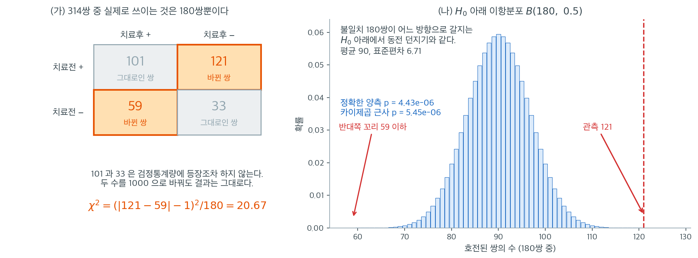

# McNemar 검정 (대응된 이진 자료)

## 개요

**McNemar 검정**은 대응된 이진 자료를 분석하는 데 쓰인다. 같은 대상을 두 조건에서 측정하는 전후 연구에서 흔히 나온다. 이 검정은 두 조건 사이에서 결과가 바뀐 대상인 **불일치 쌍**에 주목하여, 변화가 대칭인지 아니면 한쪽 방향의 변화가 유의하게 더 흔한지를 판정한다.

## 연구 설계

McNemar 검정은 다음일 때 적용한다:

- 각 대상을 **두 조건**에서 관측한다(예: 처치 전후, 두 진단검사).
- 각 조건에서의 결과가 **이진**이다(예: 양성/음성, 성공/실패).
- 관측이 **대응**되어 있다(같은 대상이 두 측정값을 모두 제공한다).

자료는 대응 도수의 $2 \times 2$ 표로 정리한다:

$$
\begin{array}{c|cc}
 & \text{After +} & \text{After -} \\
\hline
\text{Before +} & a & b \\
\text{Before -} & c & d
\end{array}
$$

- $a$: 두 시점 모두 양성(일치)
- $d$: 두 시점 모두 음성(일치)
- $b$: 이전 양성, 이후 음성(불일치)
- $c$: 이전 음성, 이후 양성(불일치)

## 가설

- **귀무가설** ($H_0$): 한 방향으로 바뀔 확률과 다른 방향으로 바뀔 확률이 같다. 즉 $P(b) = P(c)$.
- **대립가설** ($H_A$): 두 방향의 변화 확률이 다르다. 즉 $P(b) \ne P(c)$.

## 검정통계량

**연속성 보정**을 적용한 McNemar 통계량은

$$
\chi^2 = \frac{(|b - c| - 1)^2}{b + c}
$$

이고, **연속성 보정을 하지 않은** 형태는

$$
\chi^2 = \frac{(b - c)^2}{b + c}
$$

이다. $b + c$가 충분히 크면(보통 $b + c \ge 25$) $H_0$ 아래에서 이 통계량은 근사적으로 $\chi^2(1)$ 분포를 따른다.

### 직접 구현

<div class="exbox" markdown>

**보기 1.** <span class="diff easy" title="쉬움"></span> McNemar 검정 직접 구현. 공식 $(|b-c|-1)^2/(b+c)$ 에는 대각선 $a, d$ 가 아예 없다. 왜 그런지, 그리고 $-1$ 이 어디서 오는지 밝힌 뒤 코드로 옮긴다.

**(1)** 불일치 쌍의 수 $m = b+c$ 를 **고정하고 보면** $H_0$ 아래에서 $b \sim \text{Bin}(m, 1/2)$ 임을 설명하시오. $a$ 와 $d$ 가 식에 들어올 자리가 없는 까닭이 여기에 있다.

**(2)** (1)의 이항분포를 정규로 근사하면 **보정 없는** McNemar 통계량

$$
\chi^2 = \frac{(b-c)^2}{b+c}
$$

가 그대로 $z^2$ 임을 보이시오.

**(3)** 연속성 보정 $\dfrac{(\lvert b-c\rvert - 1)^2}{b+c}$ 의 $-1$ 이 어디서 오는지 보이시오. 왜 $-0.5$ 가 아니라 $-1$ 인가.

**(4)** 공식을 그대로 옮긴 함수를 짜시오.

</div>

??? success "풀이"

    **(1) 불일치 쌍만 남는다.** 대상 한 사람이 네 패턴 가운데 하나에 들어간다. 확률을 $p_a, p_b, p_c, p_d$ 라 하면 귀무가설은 **$p_b = p_c$** 다. 양쪽으로 바뀔 확률이 같다는 것일 뿐 $p_a$ 나 $p_d$ 에 대해서는 아무 말도 하지 않는다.

    그러므로 $a$ 와 $d$ 는 $H_0$ 을 판정하는 데 **쓸 수가 없다.** 상태가 바뀌지 않은 사람은 "어느 방향으로 더 잘 바뀌는가" 라는 물음에 할 말이 없기 때문이다.

    불일치 쌍의 수 $m = b + c$ 를 조건으로 걸면, 그 $m$ 명 각각이 $b$ 쪽일 조건부 확률은

    $$
    \frac{p_b}{p_b + p_c} \;\overset{H_0}{=}\; \frac12
    $$

    이고 사람끼리 독립이므로

    $$
    b \mid m \;\sim\; \text{Bin}\!\left(m, \tfrac12\right)
    $$

    이다. **McNemar 검정은 결국 동전 $m$ 번 던지기다.** 그래서 이것을 *부호검정* 이라고 불러도 된다.

    **(2) 정규근사가 바로 그 공식을 준다.** $b \sim \text{Bin}(m, 1/2)$ 이면 평균이 $m/2$, 분산이 $m/4$ 다. 표준화하면

    $$
    z = \frac{b - m/2}{\sqrt{m}/2} = \frac{2b - m}{\sqrt m} = \frac{2b - (b+c)}{\sqrt{b+c}} = \frac{b-c}{\sqrt{b+c}}
    $$

    이고, 제곱하면

    $$
    z^2 = \frac{(b-c)^2}{b+c}
    $$

    다. $\square$ **보정 없는 McNemar 통계량은 "동전이 공정한가" 를 묻는 $z$ 의 제곱**이다. 자유도가 1 인 것도 당연하다. $z$ 가 하나뿐이기 때문이다.

    **(3) $-1$ 의 정체.** 이항분포는 정수 위에 있고 정규분포는 연속이다. $P(b \ge b_0)$ 를 정규로 잴 때 경계를 $b_0$ 가 아니라 $b_0 - \tfrac12$ 로 잡는 것이 연속성 보정이고, 이는 **분자에서 $\tfrac12$ 을 덜어 내는** 것이다.

    $$
    z_{\text{corr}} = \frac{\lvert b - m/2\rvert - \tfrac12}{\sqrt m/2}
    = \frac{2\left(\lvert b - m/2\rvert - \tfrac12\right)}{\sqrt m}
    = \frac{\lvert 2b - m\rvert - 1}{\sqrt m}
    = \frac{\lvert b-c\rvert - 1}{\sqrt m}
    $$

    제곱하면 $(\lvert b-c\rvert-1)^2/(b+c)$ 다. $\square$

    **$-0.5$ 가 $-1$ 이 된 것은 $2$ 가 곱해졌기 때문이다.** 보정은 $b$ 의 눈금에서 $\tfrac12$ 을 덜어 내는데, 식을 $b-c = 2b - m$ 으로 바꾸어 적으면서 눈금이 두 배로 늘어났다. **$b$ 가 1 늘면 $b-c$ 는 2 늘기** 때문이다. 공식만 외우면 $-1$ 이 뜬금없어 보이지만 유도해 보면 자리가 분명하다.

    **(4) 코드로.**

    ```python
    import numpy as np
    from scipy import stats

    def mcnemar_test(table):
        """
        Perform McNemar's test on a 2x2 table of paired counts.

        Parameters
        ----------
        table : array-like, shape (2, 2)
            Contingency table where off-diagonal cells (b, c)
            represent discordant pairs:
                [[a, b],
                 [c, d]]

        Returns
        -------
        statistic : float   McNemar chi-square statistic (continuity-corrected)
        p_value   : float   Two-sided p-value from chi-square(1)
        """
        table = np.asarray(table)
        # 대각선의 a와 d는 아예 쓰이지 않는다.
        # 두 시점에서 상태가 **바뀐** 쌍만이 변화의 증거이기 때문이다.
        # 그래서 표본이 500쌍이어도 실제 정보량은 b + c에 달려 있다.
        b = table[0, 1]
        c = table[1, 0]
        # 연속성 보정: |b - c|에서 1을 뺀다.
        # 이산인 이항분포를 연속인 카이제곱으로 근사하는 데서 오는 편향을 줄인다.
        chi2 = (abs(b - c) - 1) ** 2 / (b + c)
        p_value = stats.chi2(1).sf(chi2)
        return chi2, p_value
    ```

    대각선을 읽지도 않는다는 것이 코드에서 그대로 보인다. `table[0, 1]` 과 `table[1, 0]` 만 꺼내 쓴다. **표본이 몇 쌍이든 이 검정이 실제로 쓰는 정보는 $b+c$ 에 들어 있다.**

    보정판을 기본으로 두었지만, 보기 2 에서 보듯 보정은 **지나치게** 보수적일 수 있다. 불일치 쌍이 적을 때에는 아예 정확 이항검정 `stats.binomtest(b, b + c, 0.5)` 을 쓰는 편이 낫다.

### 검정 실행

<div class="exbox" markdown>

**보기 2.** <span class="diff easy" title="쉬움"></span> 치료 전후 자료로 검정하기. 같은 사람 314명의 질병 상태를 치료 전후에 기록했다.

$$
\begin{array}{c|cc|r}
 & \text{치료후 +} & \text{치료후 -} & \text{행 합} \\ \hline
\text{치료전 +} & 101 & 121 & 222 \\
\text{치료전 -} & 59 & 33 & 92 \\ \hline
\text{열 합} & 160 & 154 & 314
\end{array}
$$

**(1)** 보정판과 비보정판 통계량을 **유리수로** 구하고 p-값을 적으시오.

**(2)** 보기 1 (1)에 따르면 정확한 p-값은 $\text{Bin}(180, 1/2)$ 에서 바로 나온다. 세 p-값을 견주시오. 연속성 보정은 어느 쪽으로 치우치는가.

**(3)** 효과크기를 적으시오. 양성 비율의 변화량과 그 신뢰구간을 구하고, **대응을 무시했다면** 표준오차를 얼마로 잡게 되었을지 견주시오.

**(4)** 코드로 확인하시오.

</div>

??? success "풀이"

    **(1) 통계량.** 불일치 쌍은 $b = 121$(호전), $c = 59$(악화)이고 $m = b+c = 180$ 이다.

    $$
    \chi^2_{\text{corr}} = \frac{(\lvert 121-59\rvert - 1)^2}{180} = \frac{61^2}{180} = \frac{3721}{180} = 20.67222
    $$

    $$
    \chi^2_{\text{raw}} = \frac{(121-59)^2}{180} = \frac{62^2}{180} = \frac{3844}{180} = \frac{961}{45} = 21.35556
    $$

    보기 1 (2)의 $z$ 로는 $z = 62/\sqrt{180} = 4.62121$ 이고 $z^2 = 21.35556$ 으로 맞는다. 자유도 1 이므로 p-값은 $2\Phi(-\sqrt{\chi^2})$ 다.

    $$
    p_{\text{corr}} = 5.4501 \times 10^{-6},
    \qquad
    p_{\text{raw}} = 3.8151 \times 10^{-6}
    $$

    어느 쪽이든 $0.05$ 보다 압도적으로 작아 $H_0$ 을 **기각한다.** 호전이 악화보다 유의하게 흔하다.

    **(2) 정확값은 두 근사 사이에 있다.** 보기 1 (1)에서 $b \mid m \sim \text{Bin}(180, 1/2)$ 였으므로 양측 정확 p-값은

    $$
    p_{\text{exact}} = 2\,P\bigl(\text{Bin}(180, \tfrac12) \le 59\bigr) = 4.4344\times10^{-6}
    $$

    다. 세 값을 늘어놓는다.

    | 방법 | p-값 | 정확값 대비 |
    |---|---:|:---|
    | 비보정 $\chi^2$ | $3.8151\times10^{-6}$ | $0.86$ 배 — **너무 작다** |
    | **정확 이항** | $4.4344\times10^{-6}$ | 기준 |
    | 연속성 보정 $\chi^2$ | $5.4501\times10^{-6}$ | $1.23$ 배 — **너무 크다** |

    **정확값이 두 근사 사이에 놓인다.** 비보정판은 이산인 분포를 연속으로 재면서 꼬리를 과소평가해 **기각하는 쪽으로** 기울고, 연속성 보정은 그것을 바로잡으려다 **지나치게 되돌려** 보수적으로 간다. 흔히 하는 말과 달리 보정이 "정확해지는" 조작은 아니다. **더 보수적이 되는** 조작이다.

    여기서는 세 값 모두 $10^{-6}$ 자리라 결론이 같다. $m = 180$ 으로 커서 상대오차가 그 정도에 그친 것이고, 권장 기준 $b+c \ge 25$ 가 뜻하는 바가 이것이다. 불일치 쌍이 적다면 근사 둘 다 버리고 `stats.binomtest(b, b + c, 0.5)` 을 쓰면 된다.

    **(3) 효과크기와 신뢰구간.** 검정은 "다르다" 만 말한다. 얼마나 다른지는 양성 비율의 변화로 적는다.

    $$
    \hat p_{\text{전}} = \frac{222}{314} = 0.70701,
    \qquad
    \hat p_{\text{후}} = \frac{160}{314} = 0.50955
    $$

    $$
    \hat d = \hat p_{\text{전}} - \hat p_{\text{후}} = \frac{b-c}{n} = \frac{62}{314} = 0.19745
    $$

    **차이가 $(b-c)/n$ 으로 깔끔하게 적힌다.** 대각선이 양쪽 비율에 똑같이 들어 있어 빼면 사라지기 때문이다. 대응자료에서 이 차이의 분산은

    $$
    \widehat{\operatorname{Var}}(\hat d) = \frac{1}{n^2}\left(b + c - \frac{(b-c)^2}{n}\right)
    = \frac{180 - 3844/314}{314^2} = 0.00170147
    $$

    이므로 $\operatorname{SE} = 0.041249$ 이고 $95\%$ 구간은

    $$
    0.19745 \pm 1.96 \times 0.041249 = [0.1166,\ 0.2783]
    $$

    다. **치료 뒤 양성 비율이 12\~28\%p 줄었다.** 구간이 0 에서 한참 떨어져 있어 (1)의 판정과 일관된다.

    **대응을 무시했다면.** 두 비율을 서로 **독립인** 표본에서 나온 것처럼 다루면

    $$
    \operatorname{SE}_{\text{독립}} = \sqrt{\frac{\hat p_{\text{전}}(1-\hat p_{\text{전}})}{n} + \frac{\hat p_{\text{후}}(1-\hat p_{\text{후}})}{n}} = 0.038152
    $$

    로 잡게 된다. 참값 $0.041249$ 보다 **작다.** 둘의 관계는 공분산 한 항이다.

    $$
    \operatorname{Var}(\hat p_{\text{전}} - \hat p_{\text{후}})
    = \operatorname{Var}_{\text{전}} + \operatorname{Var}_{\text{후}} - 2\operatorname{Cov},
    \qquad
    \widehat{\operatorname{Cov}} = \frac{1}{n}\left(\frac an - \hat p_{\text{전}}\hat p_{\text{후}}\right) = -0.00012294
    $$

    **공분산이 음수다.** 치료 전 상태와 후 상태의 파이계수가 $\phi = (ad-bc)/\sqrt{R_1R_2C_1C_2} = -0.1697$ 로 음이기 때문이다. 그래서 $-2\operatorname{Cov}$ 가 양수로 더해져 대응 분산이 **더 커진다.**

    **대응설계가 언제나 이득은 아니다.** 같은 사람을 두 번 재면 보통 두 측정이 양의 상관을 가지고, 그때 공분산이 양수라 분산이 줄어든다. 이 자료는 반대다. 치료 전에 양성이던 사람이 치료 후에는 오히려 음성이 되기 쉬웠으므로(그것이 치료 효과다) 전후 상태가 음으로 얽혔다. **이득이 되느냐는 자료가 결정하지 설계 이름이 결정하지 않는다.**

    **(4) 수치적으로.**

    ```python
    # 치료 전후의 질병 상태. 같은 사람을 두 번 관찰한 대응자료다.
    #                  치료후+  치료후-
    # 치료전+            101      121
    # 치료전-             59       33
    table = np.array([[101, 121],
                      [ 59,  33]])

    chi2, p = mcnemar_test(table)

    print(f"McNemar chi2 = {chi2:.4f}")
    print(f"p-value      = {p:.4e}")

    if p < 0.05:
        print("Reject H0: significant change after treatment (alpha = 0.05).")
    else:
        print("Fail to reject H0: no significant change (alpha = 0.05).")

    # (1) 비보정판과 z
    (a, b), (c, d) = table
    m, n = b + c, table.sum()
    raw = (b - c) ** 2 / m
    print(f"\n비보정 chi2 = {raw:.5f}   z = {(b - c) / np.sqrt(m):.5f}"
          f"   p = {stats.chi2(1).sf(raw):.4e}")

    # (2) 정확 이항검정
    exact = stats.binomtest(int(b), int(m), 0.5).pvalue
    print(f"정확 이항 p = {exact:.4e}")
    print(f"  비보정/정확 = {stats.chi2(1).sf(raw) / exact:.2f} 배")
    print(f"  보정  /정확 = {p / exact:.2f} 배")

    # (3) 효과크기와 신뢰구간
    p_before, p_after = (a + b) / n, (a + c) / n
    d_hat = (b - c) / n
    var_paired = (m - (b - c) ** 2 / n) / n ** 2
    se_paired = np.sqrt(var_paired)
    se_indep = np.sqrt(p_before * (1 - p_before) / n + p_after * (1 - p_after) / n)
    cov = (a / n - p_before * p_after) / n
    phi = (a * d - b * c) / np.sqrt((a + b) * (c + d) * (a + c) * (b + d))
    print(f"\n전 {p_before:.5f}  후 {p_after:.5f}  차 {d_hat:.5f}")
    print(f"대응 SE {se_paired:.6f}   독립이라 보면 {se_indep:.6f}")
    print(f"cov {cov:.8f}   Var_독립 - 2cov = {se_indep**2 - 2 * cov:.8f}"
          f"   Var_대응 = {var_paired:.8f}")
    print(f"phi = {phi:.4f}")
    print(f"95% 구간 [{d_hat - 1.96 * se_paired:.4f}, {d_hat + 1.96 * se_paired:.4f}]")
    ```

    출력:

    ```
    McNemar chi2 = 20.6722
    p-value      = 5.4501e-06
    Reject H0: significant change after treatment (alpha = 0.05).

    비보정 chi2 = 21.35556   z = 4.62121   p = 3.8151e-06
    정확 이항 p = 4.4344e-06
      비보정/정확 = 0.86 배
      보정  /정확 = 1.23 배

    전 0.70701  후 0.50955  차 0.19745
    대응 SE 0.041249   독립이라 보면 0.038152
    cov -0.00012294   Var_독립 - 2cov = 0.00170147   Var_대응 = 0.00170147
    phi = -0.1697
    95% 구간 [0.1166, 0.2783]
    ```

    `McNemar chi2 = 20.6722` 가 (1)의 $3721/180$ 과, `비보정 chi2 = 21.35556` 이 $961/45$ 와 맞는다. $z = 4.62121$ 을 제곱하면 비보정 통계량이다.

    (2)의 세 p-값도 그대로다. 비보정이 정확값의 $0.86$ 배, 보정이 $1.23$ 배다. **정확값이 가운데 있다.**

    (3)에서 가장 중요한 줄은 `Var_독립 - 2cov = 0.00170147   Var_대응 = 0.00170147` 이다. **여덟 자리까지 같다.** 두 분산이 공분산 한 항만큼 차이 난다는 항등식이 수로 확인된 것이고, 그 공분산이 음수($-0.00012294$, $\phi = -0.1697$)라서 대응 쪽 표준오차가 $0.041249$ 로 더 크다.

    **대응을 무시했다면 신뢰구간을 실제보다 $7.5\%$ 좁게 그렸을 것이다.**

## 해석

McNemar 검정에서는 불일치 쌍만이 의미를 갖는다. 일치 쌍($a$와 $d$)은 변화의 차이에 대해 아무 정보도 주지 않는다.

질병 보기에서:

- $b = 121$명이 호전되었다(양성 → 음성).
- $c = 59$명이 악화되었다(음성 → 양성).
- 비대칭이 상당하다. 악화된 사람보다 호전된 사람이 훨씬 많다.
- p-값이 $0.05$보다 훨씬 작으므로 처치가 질병 상태에 통계적으로 유의한 변화를 만들었다고 결론짓는다.

### 왜 대각선을 버리는가



왼쪽 (가)에 표를 그대로 옮겼다. 자료는 314명인데 통계량 $(|b-c|-1)^2/(b+c)$에 들어가는 수는 121과 59뿐이다. 두 시점 모두 양성이었던 101명과 두 시점 모두 음성이었던 33명은 식 어디에도 등장하지 않는다. 시험 삼아 이 두 칸을 1000으로 바꿔 보아도 $\chi^2 = 20.67$은 꿈쩍하지 않는다. "일치 쌍은 정보를 주지 않는다"는 말은 비유가 아니라 계산의 사실이다.

왜 그런가. 상태가 바뀌지 않은 사람은 어느 방향으로 바뀌는 것이 더 흔한지에 대해 아무 말도 하지 않는다. 우리가 묻는 것은 "바뀐 사람 중에서 호전 쪽이 더 많은가"이지 "얼마나 많은 사람이 바뀌었는가"가 아니다. 그래서 $H_0$는 $b + c = 180$을 조건으로 놓았을 때 각 쌍이 호전 쪽으로 갈 확률이 $1/2$라는 말과 정확히 같아진다.

오른쪽 (나)가 그 이항분포 $B(180,\ 0.5)$이다. 평균 90, 표준편차 6.71이고, 실제 관측은 121이다. 평균에서 $(121-90)/6.71 = 4.62$ 표준편차 떨어져 있어서 그림에서는 분포의 몸통에서 완전히 벗어나 있다. 꼬리를 정확히 더하면 양측 p-값이 $4.43 \times 10^{-6}$이고, 연속성 보정을 건 카이제곱 근사는 $5.45 \times 10^{-6}$을 준다. $b + c = 180$은 충분히 크므로 두 값이 자릿수까지 잘 맞는다. 권장 기준 $b + c \ge 25$가 뜻하는 바가 이것이다.

마지막으로 흔한 실수 하나. 이 표를 그대로 `chi2_contingency`에 넣으면 $\chi^2 = 8.31$, $p = 0.0039$가 나온다. 숫자가 나오기는 하지만 완전히 다른 질문에 대한 답이다. 독립성 검정은 서로 다른 314명을 가정하는데 여기서는 같은 사람을 두 번 본 것이다. 대응자료에서 대각선을 버릴지 말지는 취향의 문제가 아니라 검정을 고르는 문제다.

## 연습문제

<div class="drillbox" markdown>

**연습문제 1.** <span class="diff easy" title="쉬움"></span>
어떤 진단 연구가 환자 200명에게 두 검사를 비교했다. 대응된 결과는 다음과 같다:

$$
\begin{pmatrix} 80 & 15 \\ 25 & 80 \end{pmatrix}
$$

(연속성 보정을 적용한) McNemar 통계량을 계산하고 $\alpha = 0.05$에서 두 검사가 유의하게 다른지 판정하라.

</div>

??? success "풀이"

    불일치 도수는 $b = 15$, $c = 25$이다.

    $$
    \chi^2 = \frac{(|15 - 25| - 1)^2}{15 + 25} = \frac{(10 - 1)^2}{40} = \frac{81}{40} = 2.025
    $$

    $\text{df} = 1$에서 $\alpha = 0.05$의 임계값은 $3.841$이다. $2.025 < 3.841$이므로 $H_0$을 **기각하지 못한다**. 두 진단검사 사이에 유의한 차이가 없다. $\square$

<div class="drillbox" markdown>

**연습문제 2.** <span class="diff med" title="중간"></span>
일치 쌍($a$와 $d$)이 McNemar 검정통계량에 기여하지 않는 이유를 설명하라.

</div>

??? success "풀이"

    일치 쌍은 두 조건 사이에서 결과가 바뀌지 않은 대상(양성–양성 또는 음성–음성)이다. 이들은 어느 조건에서든 결과가 같으므로 두 조건이 다른지에 대한 증거를 주지 않는다. 관심 있는 질문은 *변화*가 대칭인가, 즉 실제로 바뀐 대상들 중에서 양방향으로 똑같이 바뀌었는가이다. 이 비대칭에 대한 정보는 불일치 쌍($b$와 $c$)만이 담고 있다. 일치 쌍을 넣으면 무관한 정보로 검정이 희석되어 검정력이 떨어진다. $\square$

<div class="drillbox" markdown>

**연습문제 3.** <span class="diff med" title="중간"></span>
$b = 30$, $c = 10$에 대해 연속성 보정을 한 경우와 하지 않은 경우의 McNemar 통계량을 계산하라. 두 값은 얼마나 차이 나는가?

</div>

??? success "풀이"

    연속성 보정 없이:

    $$
    \chi^2 = \frac{(30 - 10)^2}{30 + 10} = \frac{400}{40} = 10.0
    $$

    연속성 보정을 적용하면:

    $$
    \chi^2 = \frac{(|30 - 10| - 1)^2}{30 + 10} = \frac{(19)^2}{40} = \frac{361}{40} = 9.025
    $$

    보정한 값이 $0.975$만큼 작다. 둘 다 매우 유의한 p-값을 주므로($\chi^2(1)$에서 $0.001$을 훨씬 밑돈다) 이 경우 보정이 결론을 바꾸지 않는다. 보정은 $b + c$가 작고 통계량이 임계값 근처일 때 더 중요해진다. $\square$

<div class="drillbox" markdown>

**연습문제 4.** <span class="diff med" title="중간"></span>
$b + c$가 작을 때(가령 25 미만) McNemar 검정의 카이제곱 근사가 좋지 않을 수 있다. 이항분포에 기반한 정확한 대안을 기술하라.

</div>

??? success "풀이"

    $H_0$ 아래에서 각 불일치 쌍이 $b$형일 확률과 $c$형일 확률이 같으므로 $b \sim \text{Binomial}(b + c, 0.5)$이다. 양측검정의 정확한 p-값은

    $$
    p = 2 \cdot \min\bigl[P(X \le b),\; P(X \ge b)\bigr]
    $$

    이며 $X \sim \text{Binomial}(b + c, 0.5)$이다. Python에서는:

    ```python
    from scipy import stats

    b, c = 121, 59            # 위 보기의 불일치 쌍
    n_discordant = b + c
    p_exact = stats.binomtest(b, n_discordant, 0.5).pvalue
    print(f"exact p = {p_exact:.4e}")
    ```

    출력:

    ```
    exact p = 4.4344e-06
    ```

    (예전 이름인 `stats.binom_test`는 최신 SciPy에서 제거되었다.)

    연속성 보정을 적용한 근사가 준 $5.45 \times 10^{-6}$과 정확검정의 $4.43 \times 10^{-6}$이 같은 자릿수다. 불일치 쌍이 180개나 되어 근사가 잘 통하는 상황이다.

    이 정확 이항검정은 분포에 대한 근사를 전혀 쓰지 않아 어떤 표본크기에서도 타당하다. 불일치 쌍의 수가 적을 때 권장되는 접근이다. $\square$

<div class="drillbox" markdown>

**연습문제 5.** <span class="diff med" title="중간"></span>
$H_0$(불일치 쌍 중 $P(b) = P(c) = 0.5$) 아래에서 보정하지 않은 McNemar 통계량이 $b + c \to \infty$일 때 $\chi^2(1)$로 분포수렴함을 증명하라.

</div>

??? success "풀이"

    불일치 쌍의 총수를 $n = b + c$라 하자. $H_0$ 아래에서 $b \sim \text{Binomial}(n, 0.5)$이므로 $E[b] = n/2$, $\text{Var}(b) = n/4$이다.

    보정하지 않은 McNemar 통계량은

    $$
    \chi^2 = \frac{(b - c)^2}{b + c} = \frac{(b - (n - b))^2}{n} = \frac{(2b - n)^2}{n}
    $$

    으로 쓸 수 있다.

    이제 $Z = (b - n/2) / \sqrt{n/4} = (2b - n) / \sqrt{n}$이라 두면, 중심극한정리에 의해 $n \to \infty$일 때 $Z \xrightarrow{d} N(0, 1)$이다.

    통계량은

    $$
    \chi^2 = \frac{(2b - n)^2}{n} = \left(\frac{2b - n}{\sqrt{n}}\right)^2 = Z^2
    $$

    이다. $Z \xrightarrow{d} N(0,1)$이면 $Z^2 \xrightarrow{d} \chi^2(1)$이므로 McNemar 통계량은 $\chi^2(1)$로 분포수렴한다. $\square$

<div class="drillbox" markdown>

**연습문제 6.** <span class="diff hard" title="어려움"></span>
연습문제 3·4가 다룬 네 가지 형태(보정 $\chi^2$, 무보정 $\chi^2$, 정확 이항, 중간 $p$)의 **실제 수준과 검정력**을 모의실험으로 비교하라.

</div>

??? success "풀이"
    ```python
    import numpy as np
    from scipy import stats

    rng = np.random.default_rng(864)
    M = 20_000

    def four_tests(b, c, alpha=0.05):
        """불일치 도수 b, c 에 대해 네 가지 검정의 기각 여부."""
        n_disc = b + c
        if n_disc == 0:
            return (False, False, False, False)
        chi_corr = (abs(b - c) - 1)**2 / n_disc if abs(b - c) >= 1 else 0.0
        chi_raw = (b - c)**2 / n_disc
        k = min(b, c)
        p_exact = min(1.0, 2 * stats.binom.cdf(k, n_disc, 0.5))
        p_mid = p_exact - stats.binom.pmf(k, n_disc, 0.5)
        return (stats.chi2.sf(chi_corr, 1) < alpha,
                stats.chi2.sf(chi_raw, 1) < alpha,
                p_exact < alpha, p_mid < alpha)

    for title, split in [("① 수준 (두 방향이 같음)", (0.5, 0.5)),
                         ("② 검정력 (한 방향이 70%)", (0.7, 0.3))]:
        print(title)
        print(f"{'n':>5s} {'불일치율':>9s} {'보정 χ²':>9s} {'무보정 χ²':>10s} "
              f"{'정확':>8s} {'중간 p':>8s}")
        for n, p_disc in [(50, 0.20), (100, 0.20), (50, 0.40), (200, 0.10)]:
            cnt = np.zeros(4)
            for _ in range(M):
                m = rng.multinomial(n, [1 - p_disc,
                                        p_disc * split[0], p_disc * split[1]])
                cnt += np.array(four_tests(m[1], m[2]), float)
            print(f"{n:5d} {p_disc:9.2f} " + " ".join(f"{v / M:9.4f}" for v in cnt))
        print()
    ```

    ```text
    ① 수준 (두 방향이 같음)
        n      불일치율     보정 χ²     무보정 χ²       정확     중간 p
       50      0.20    0.0217    0.0417    0.0220    0.0405
      100      0.20    0.0275    0.0530    0.0305    0.0469
       50      0.40    0.0267    0.0513    0.0296    0.0453
      200      0.10    0.0284    0.0544    0.0315    0.0487

    ② 검정력 (한 방향이 70%)
        n      불일치율     보정 χ²     무보정 χ²       정확     중간 p
       50      0.20    0.1461    0.2184    0.1475    0.2152
      100      0.20    0.3407    0.4531    0.3567    0.4295
       50      0.40    0.3405    0.4502    0.3549    0.4258
      200      0.10    0.3398    0.4484    0.3535    0.4253
    ```

    **네 방법의 성격이 뚜렷이 갈린다.**

    | 방법 | 수준 | 검정력 | 판정 |
    |---|---|---|---|
    | 보정 $\chi^2$ | 0.022~0.028 | 낮음 | **지나치게 보수적** |
    | 무보정 $\chi^2$ | 0.042~0.054 | **최고** | 살짝 초과 |
    | 정확 이항 | 0.022~0.032 | 낮음 | 보수적 |
    | **중간 $p$** | **0.041~0.049** | 높음 | **가장 균형** |

    **연속성 보정과 정확검정이 거의 같다**(0.0275 대 0.0305). 보정이 정확검정을 흉내 내려는 장치이니 자연스러운 결과다. **둘 다 명목의 절반 수준**이다.

    **검정력의 대가가 크다.** $n=100$·불일치율 0.20에서 보정 $\chi^2$이 0.341, 중간 $p$가 0.430으로 **9%포인트** 차이난다.

    **중간 $p$가 가장 나은 절충**이다. 수준이 0.041~0.049로 명목을 넘지 않으면서 검정력은 무보정 $\chi^2$에 거의 근접한다.

    **불일치 쌍의 수가 같으면 결과도 같다.** 마지막 세 줄을 보면 $n\times p_{\text{disc}}=20$으로 같고, 검정력도 0.34/0.45/0.35/0.43으로 거의 같다. **McNemar 검정은 불일치 쌍의 수에만 의존**한다 — 일치 쌍은 아무 정보도 주지 않는다(연습문제 2).

    **권고.**

    | 상황 | 방법 |
    |---|---|
    | 기본 | **중간 $p$** 또는 무보정 $\chi^2$ |
    | 규제 제출 등 보수성이 필수 | 정확 이항 |
    | 불일치 쌍 $<10$ | 정확 이항(근사가 무의미) |
    | 쓰지 말 것 | **연속성 보정** |

    `statsmodels.stats.contingency_tables.mcnemar(table, exact=..., correction=...)`가 이들을 지원한다.

<div class="drillbox" markdown>

**연습문제 7.** <span class="diff hard" title="어려움"></span>
대응된 자료를 **독립 두 표본으로 잘못 분석**하면 어떻게 되는지 확인하라.

</div>

??? success "풀이"
    **흔한 실수.** 전후 자료를 "전 양성 수 대 후 양성 수"의 $2\times2$ 표로 만들어 보통의 카이제곱 검정을 하는 것이다. 대응 구조를 통째로 버린다.

    ```python
    import numpy as np
    from scipy import stats

    rng = np.random.default_rng(975)
    M, n = 20_000, 200

    print(f"{'일치 비율':>10s} {'McNemar':>9s} {'독립 χ²(잘못)':>14s}")
    for pa, pb, pc, pd in [(0.40, 0.10, 0.10, 0.40),
                           (0.25, 0.25, 0.25, 0.25),
                           (0.45, 0.05, 0.05, 0.45)]:
        mc = ind = 0
        for _ in range(M):
            a, b, c, d = rng.multinomial(n, [pa, pb, pc, pd])
            if b + c > 0:
                mc += 2 * min(1.0, stats.binom.cdf(min(b, c),
                                                   b + c, 0.5)) < 0.05
            # 잘못된 분석: 전/후를 독립인 두 표본으로 본다
            wrong = np.array([[a + b, c + d], [a + c, b + d]], float)
            if wrong.sum(0).min() > 0 and wrong.sum(1).min() > 0:
                ind += stats.chi2_contingency(wrong,
                                              correction=False)[1] < 0.05
        print(f"{pa + pd:10.2f} {mc / M:9.4f} {ind / M:14.4f}")
    ```

    ```text
         일치 비율   McNemar      독립 χ²(잘못)
          0.80    0.0357         0.0022
          0.50    0.0423         0.0534
          0.90    0.0294         0.0001
    ```

    **일치 비율이 높을수록 잘못된 분석이 극단적으로 보수적**이 된다. 일치율 0.90에서 수준이 **0.0001**이다.

    **왜 그런가.** 전후의 양성 비율이 강하게 상관되어 있는데 독립이라고 가정하면, **차이의 표준오차를 크게 과대추정**한다. 앞 장의 대응 $t$ 검정과 같은 구조다.

    $$
    \operatorname{Var}(\hat p_{\text{후}}-\hat p_{\text{전}})
    =\frac{p_{\text{후}}(1-p_{\text{후}})+p_{\text{전}}(1-p_{\text{전}})-2\operatorname{Cov}}{n}
    $$

    독립 가정은 $\operatorname{Cov}=0$으로 두어 분산을 부풀린다.

    **일치 비율이 0.5(즉 전후가 사실상 무관)이면 두 분석이 비슷**하다(0.042 대 0.053). 대응 구조가 실제로 없는 경우다.

    **방향이 앞 장과 반대인 점에 주의.** 9장에서는 대응 자료를 독립으로 분석하면 **보수적**이라고 했는데 여기서도 같다. 다만 **정도가 훨씬 심하다** — 이진 자료에서 전후 상관이 대개 매우 높기 때문이다.

    **검정력으로 환산하면.**

    ```python
    print(f"{'일치 비율':>10s} {'McNemar':>9s} {'독립 χ²(잘못)':>14s}")
    for pa, pb, pc, pd in [(0.40, 0.14, 0.06, 0.40),
                           (0.45, 0.08, 0.02, 0.45)]:
        mc = ind = 0
        for _ in range(M):
            a, b, c, d = rng.multinomial(n, [pa, pb, pc, pd])
            if b + c > 0:
                mc += 2 * min(1.0, stats.binom.cdf(min(b, c),
                                                   b + c, 0.5)) < 0.05
            wrong = np.array([[a + b, c + d], [a + c, b + d]], float)
            if wrong.sum(0).min() > 0 and wrong.sum(1).min() > 0:
                ind += stats.chi2_contingency(wrong,
                                              correction=False)[1] < 0.05
        print(f"{pa + pd:10.2f} {mc / M:9.4f} {ind / M:14.4f}")
    ```

    ```text
         일치 비율   McNemar      독립 χ²(잘못)
          0.80    0.6770         0.2837
          0.90    0.7362         0.0444
    ```

    **일치율 0.80에서 검정력이 0.677에서 0.284로 떨어진다.** 일치율 0.90에서는 0.736에서 **0.044**로, 사실상 아무것도 못 찾는다.

    **일치율이 높을수록 손해가 커진다**는 점에 주목한다. 전후가 비슷할수록 대응 설계의 이득이 큰데, 그것을 버리는 대가도 그만큼 크다.

    **알아채는 법.** 분할표의 모양이 아니라 **자료가 어떻게 수집됐는지**를 본다.

    | 신호 | 예 |
    |---|---|
    | 같은 대상의 두 측정 | 처치 전후, 두 진단검사 |
    | 짝지어 배정 | 쌍둥이, 매칭된 환자대조군 |
    | 두 평가자가 같은 대상 평가 | 일치도 연구 |

    **표의 겉모양이 같아 구분이 안 된다.** $2\times2$ 표 하나만 보고는 대응인지 독립인지 알 수 없으므로, **원자료의 구조를 확인해야** 한다.

<div class="drillbox" markdown>

**연습문제 8.** <span class="diff med" title="중간"></span>
McNemar 검정의 **표본크기**를 설계하라. 무엇을 미리 알아야 하는가?

</div>

??? success "풀이"
    **핵심.** McNemar 검정은 **불일치 쌍에만 의존**하므로, 필요한 것이 둘이다.

    1. **불일치 비율** $p_{\text{disc}}=P(b)+P(c)$ — 전체 중 몇 %가 바뀌는가
    2. **방향의 치우침** $\pi=P(b)/p_{\text{disc}}$ — 바뀐 것 중 몇 %가 한 방향인가

    ```python
    import numpy as np
    from scipy import stats

    def n_mcnemar(p_disc, pi, power=0.80, alpha=0.05):
        """필요한 (전체 쌍 수, 불일치 쌍 수)."""
        za, zb = stats.norm.ppf(1 - alpha / 2), stats.norm.ppf(power)
        n_disc = ((za + zb * 2 * np.sqrt(pi * (1 - pi))) / (2 * pi - 1))**2
        return int(np.ceil(n_disc / p_disc)), int(np.ceil(n_disc))

    print(f"{'불일치율':>9s} {'한 방향 비율 π':>14s} {'필요 쌍':>9s} "
          f"{'필요 불일치 쌍':>14s}")
    for p_disc in [0.10, 0.20, 0.30]:
        for pi in [0.65, 0.70, 0.80]:
            n_total, n_disc = n_mcnemar(p_disc, pi)
            print(f"{p_disc:9.2f} {pi:14.2f} {n_total:9d} {n_disc:14d}")
    ```

    ```text
         불일치율      한 방향 비율 π      필요 쌍       필요 불일치 쌍
         0.10           0.65       849             85
         0.10           0.70       467             47
         0.10           0.80       193             20
         0.20           0.65       425             85
         0.20           0.70       234             47
         0.20           0.80        97             20
         0.30           0.65       283             85
         0.30           0.70       156             47
         0.30           0.80        65             20
    ```

    **필요한 불일치 쌍의 수는 $\pi$에만 의존한다.** 마지막 열이 85, 47, 20으로 세 블록에서 똑같다.

    **전체 쌍 수는 $p_{\text{disc}}$에 반비례**한다. 불일치율이 0.10에서 0.30으로 세 배가 되면 필요한 쌍이 849에서 283으로 1/3이 된다.

    **이것이 설계의 핵심 통찰이다.** 불일치가 드문 상황(전후 변화가 거의 없는 경우)에서는 **엄청나게 많은 쌍**이 필요하다.

    | 상황 | 불일치율 | $\pi=0.70$일 때 필요 쌍 |
    |---|---|---|
    | 변화가 흔함 | 0.30 | 156 |
    | 보통 | 0.20 | 234 |
    | 변화가 드묾 | 0.10 | **467** |
    | 아주 드묾 | 0.02 | **2,335** |

    **$\pi$에 대한 민감도도 크다.** $\pi=0.80$과 $0.65$ 사이에서 필요한 수가 4배 넘게 차이난다($20$ 대 $85$).

    **$\pi=0.5$면 표본크기가 무한대**다. 분모의 $(2\pi-1)$이 0이 되기 때문이다. 당연하게도 "차이가 없는 것"은 탐지할 수 없다.

    **설계 단계에서 $p_{\text{disc}}$를 어떻게 아는가.**

    1. **예비연구.** 가장 확실하지만 비용이 든다.
    2. **문헌.** 비슷한 척도·집단의 이전 연구.
    3. **보수적 추정.** 불일치율을 낮게 잡으면 표본이 커져 안전하다.
    4. **내부 예비연구.** 진행 중 불일치 쌍의 수를 세어 조정한다(눈가림 유지).

    **4번이 실무적으로 유용하다.** 불일치 쌍의 **수**만 세는 것은 방향 정보를 보지 않으므로, 제1종 오류를 거의 부풀리지 않는다.

    **효과크기의 표현.** 대응 자료의 오즈비는

    $$
    \widehat{OR}=\frac{b}{c}
    $$

    로, **불일치 쌍의 비**다. 신뢰구간은 $b\sim\text{Binomial}(b+c,\pi)$에서 $\pi$의 구간을 구해 $\pi/(1-\pi)$로 변환한다.

    ```python
    b, c = 30, 10
    n_disc = b + c
    lo, hi = stats.beta.ppf([0.025, 0.975],
                            [b, b + 1], [n_disc - b + 1, n_disc - b])
    print(f"b={b}, c={c}:  OR = b/c = {b / c:.4f}")
    print(f"  π 의 정확 95% CI ({lo:.4f}, {hi:.4f})")
    print(f"  OR 의 95% CI ({lo / (1 - lo):.4f}, {hi / (1 - hi):.4f})")
    ```

    ```text
    b=30, c=10:  OR = b/c = 3.0000
      π 의 정확 95% CI (0.5880, 0.8731)
      OR 의 95% CI (1.4274, 6.8793)
    ```

    **오즈비 3.0의 구간이 $(1.43,\ 6.88)$**이다. 1을 포함하지 않아 유의하지만, **7배 가까이까지 가능**하다는 점도 함께 보고해야 한다. 불일치 쌍이 40개뿐이라 정밀도가 낮다.

<div class="drillbox" markdown>

**연습문제 9.** <span class="diff med" title="중간"></span>
McNemar 검정을 **$2\times2$보다 큰 대응 표**로 확장하려면 어떻게 하는가?

</div>

??? success "풀이"
    **상황.** 같은 대상을 두 시점에서 **$k$개 범주**로 분류한 $k\times k$ 표다. 예: 치료 전후의 중증도 등급(경/중/중증).

    **두 가지 질문이 가능하다.**

    | 가설 | 이름 | 자유도 |
    |---|---|---|
    | 표가 대각선에 대해 대칭인가 | **보커의 대칭성 검정** | $k(k-1)/2$ |
    | 두 시점의 주변분포가 같은가 | **주변 동질성 검정** | $k-1$ |

    **대칭성이 주변 동질성보다 강한 조건**이다. 대칭이면 주변분포도 같지만, 역은 성립하지 않는다.

    ```python
    import numpy as np
    from scipy import stats

    def bowker(table):
        """보커의 대칭성 검정 (k×k 대응 표)."""
        table = np.asarray(table, float)
        k = table.shape[0]
        stat = 0.0
        for i in range(k):
            for j in range(i + 1, k):
                s = table[i, j] + table[j, i]
                if s > 0:
                    stat += (table[i, j] - table[j, i])**2 / s
        df = k * (k - 1) // 2
        return stat, df, stats.chi2.sf(stat, df)

    # 치료 전(행) × 치료 후(열): 경·중·중증
    tbl = np.array([[40, 12,  3],
                    [ 6, 30,  8],
                    [ 2,  5, 24]], float)
    stat, df, p = bowker(tbl)
    print(f"보커 대칭성:  χ² = {stat:.4f},  df = {df},  p = {p:.4f}")
    print(f"  전 주변분포 {np.round(tbl.sum(1) / tbl.sum(), 4).tolist()}")
    print(f"  후 주변분포 {np.round(tbl.sum(0) / tbl.sum(), 4).tolist()}")

    # 주변분포가 같지만 대칭이 아닌 표
    tbl2 = np.array([[40, 15,  5],
                     [ 5, 40, 15],
                     [15,  5, 40]], float)
    stat2, df2, p2 = bowker(tbl2)
    print(f"\n순환 구조 표")
    print(f"  보커 대칭성:  χ² = {stat2:.4f},  df = {df2},  p = {p2:.4f}")
    print(f"  전 주변분포 {np.round(tbl2.sum(1) / tbl2.sum(), 4).tolist()}")
    print(f"  후 주변분포 {np.round(tbl2.sum(0) / tbl2.sum(), 4).tolist()}")
    print("  → 주변분포는 같은데 대칭성은 기각된다")
    ```

    ```text
    보커 대칭성:  χ² = 2.8923,  df = 3,  p = 0.4085
      전 주변분포 [0.4231, 0.3385, 0.2385]
      후 주변분포 [0.3692, 0.3615, 0.2692]

    순환 구조 표
      보커 대칭성:  χ² = 15.0000,  df = 3,  p = 0.0018
      전 주변분포 [0.3333, 0.3333, 0.3333]
      후 주변분포 [0.3333, 0.3333, 0.3333]
      → 주변분포는 같은데 대칭성은 기각된다
    ```

    **둘째 표가 핵심이다.** 전후의 주변분포가 $(1/3,1/3,1/3)$으로 **완전히 같은데도** 대칭성은 기각된다($p=0.0018$).

    **첫째 표는 대칭성을 기각하지 못한다**($p=0.409$). 주변분포가 약간 움직였지만($0.423\to0.369$) 개인의 이동 방향에 뚜렷한 비대칭이 없다는 뜻이다.

    **무슨 일이 일어난 것인가.** 표를 보면 경→중, 중→중증, 중증→경으로 **순환하는 흐름**이 있다. 전체 비율은 그대로지만 **개인은 활발히 이동**한다.

    **두 검정이 답하는 질문이 다르다.**

    | 질문 | 검정 |
    |---|---|
    | "전체적으로 좋아졌는가" | 주변 동질성(스튜어트·맥스웰) |
    | "개인의 이동에 방향성이 있는가" | **보커 대칭성** |

    **$k=2$에서는 둘이 같아진다.** $2\times2$에서 대칭성과 주변 동질성이 동치이고, 둘 다 McNemar 검정이 된다. $k\ge3$에서 비로소 갈린다.

    **실무 권고 넷.**

    1. **연구 질문을 먼저 정한다.** "평균적으로 개선되었는가"인지 "안정적인가"인지.
    2. **순서형 범주면 순서를 쓴다.** 중증도처럼 순서가 있으면 대응 순위 검정이나 순서형 모형이 훨씬 강력하다.
    3. **이동 행렬을 그림으로 본다.** 표만 봐서는 순환 구조가 잘 안 보인다.
    4. **불일치 쌍이 적으면 정확검정**을 쓴다. $k\times k$에서는 칸이 많아 더 쉽게 희소해진다.

    **`statsmodels`가 지원한다.** `contingency_tables.SquareTable(tbl).symmetry()`가 보커 검정을, `.homogeneity()`가 주변 동질성 검정을 준다.

<div class="drillbox" markdown>

**연습문제 10.** <span class="diff easy" title="쉬움"></span>
대응된 이진 자료 분석의 **점검 목록**을 정리하라.

</div>

??? success "풀이"

    **자료 구조를 먼저 확인한다.**

    ```text
    이진 결과를 비교한다
        │
        ├─ 같은 대상을 두 번 측정했는가
        │      ├─ 예 ──→ McNemar (대응)
        │      └─ 아니오 ──→ 보통의 χ² / 피셔 (독립)
        │
        ├─ 조건이 셋 이상인가
        │      └─ 예 ──→ 코크런 Q (다음 절)
        │
        └─ 범주가 셋 이상인가
               └─ 예 ──→ 보커 대칭성 / 주변 동질성 (연습문제 9)
    ```

    **표를 만드는 방법이 다르다는 점이 결정적이다.**

    | | 대응 표 | 독립 표 |
    |---|---|---|
    | 칸의 의미 | **쌍**의 개수 | **개체**의 개수 |
    | 총합 | 쌍의 수 $n$ | 개체의 수 $n$ |
    | 예 | (전 양성, 후 음성)인 사람 수 | 처치군의 성공 수 |

    **같은 200명 자료가 두 가지 표를 만든다.** 어느 표를 만들었는지가 어느 검정을 써야 하는지를 결정한다.

    **점검 목록.**

    - [ ] 표의 칸이 **쌍**의 개수인가
    - [ ] 총합이 **대상의 수**와 같은가(측정의 수가 아니라)
    - [ ] 불일치 쌍 $b+c$는 몇 개인가
    - [ ] $b+c<25$이면 정확검정을 쓸 준비가 되었는가
    - [ ] **연속성 보정을 끄거나 중간 $p$를 쓸** 계획인가
    - [ ] 오즈비 $b/c$와 신뢰구간을 보고할 것인가
    - [ ] 결측(한쪽만 측정된 대상)을 어떻게 처리했는가

    **마지막 항목이 자주 빠진다.** 한 시점만 측정된 대상은 **불일치 쌍을 만들 수 없어** 분석에서 빠진다. 그 수와 이유를 보고해야 한다.

    **자주 하는 실수 다섯.**

    | 실수 | 대가 |
    |---|---|
    | 대응 자료를 독립으로 | 검정력이 0.68→0.12(연습문제 7) |
    | 연속성 보정 사용 | 수준 0.027, 검정력 손실(연습문제 6) |
    | 일치 쌍을 통계량에 포함 | McNemar가 아닌 다른 검정이 됨 |
    | 불일치 쌍이 적은데 $\chi^2$ | 근사가 무의미 |
    | $p$만 보고, 오즈비 누락 | 크기를 알 수 없음 |

    **셋째가 개념적으로 중요하다.** 일치 쌍 $a$와 $d$는 **"변화가 있었는가"에 대해 아무 정보도 주지 않는다.** 다만 그 수가 많다는 것 자체는 **불일치율이 낮다**는 정보이므로, 표본크기 설계(연습문제 8)에는 쓰인다.

    **보고 예시.**

    > 환자 200명에게 두 검사를 시행했다. 두 검사가 일치한 경우가 160쌍(80.0%), 검사 A만 양성인 경우가 30쌍, 검사 B만 양성인 경우가 10쌍이었다. McNemar 검정 결과 두 방향의 불일치 빈도가 유의하게 달랐다(정확 $p=0.0022$, 중간 $p=0.0015$). 대응 오즈비는 3.00(95% CI 1.43~6.88)으로, 검사 A가 검사 B보다 양성으로 판정할 오즈가 약 3배였다. 다만 구간의 상한이 6.88로 넓어 정밀도에 한계가 있다.

    **한 문장.** McNemar 검정은 **$2\times2$ 표를 두 개의 숫자로 줄이는 검정**이다. 그 두 숫자가 몇 개인지가 검정력의 전부이므로, 설계 단계에서 **불일치율을 추정하는 것**이 가장 중요하다.

---

## 정리하며

대응된 이진 자료에서는 **불일치 쌍만이 정보를 담는다.**

$$
\chi^2=\frac{(b-c)^2}{b+c}\;\sim\;\chi^2_1
$$

- **일치 쌍 $a$ 와 $d$ 는 통계량에 들어오지 않는다.** 두 조건에서 결과가 같았던 대상은 변화에 대해 아무 말도 하지 않기 때문이며, 8장의 대응 비율 구간과 같은 논리다.
- **대칭성을 검정한다.** $H_0$ 은 "$b$ 방향 변화와 $c$ 방향 변화가 똑같이 흔하다"이며, 주변비율이 같다는 것과 동치다.
- **일반 카이제곱 검정을 쓰면 안 된다.** 같은 대상의 두 측정은 독립이 아니므로 독립성 검정은 타당하지 않다.
- **$b+c$ 가 작으면 정확 이항검정으로 간다.** 불일치 쌍이 $25$ 개 미만이면 근사가 불안하며, 연속성 보정을 쓰거나 $\text{Binomial}(b+c,\,0.5)$ 로 직접 계산한다.
- **진단검사 비교, 처치 전후의 이진 반응**이 전형적인 응용이다.

다음 절 **Cochran의 Q 검정**으로 넘어간다. 조건이 셋 이상이면 McNemar 를 일반화해야 한다.
