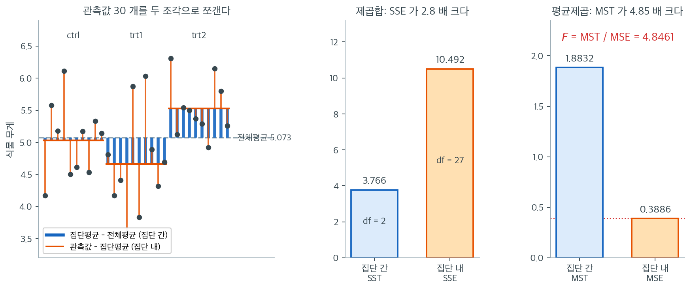

# Fisher 방법을 이용한 분산분석 수동 계산

## 개요

분산분석을 깊이 이해하려면 적어도 한 번은 모든 양을 손으로 계산해 보아야 한다. 이 페이지에서는 일원배치 분산분석의 분해를 처음부터 유도하고, 모의생성한 키 자료에 대해 SST, SSE, MST, MSE와 F-통계량을 수동으로 계산하며, 결과를 `scipy.stats.f_oneway`와 대조해 확인한 뒤, Fisher의 최소유의차(LSD) 사후 절차로 어느 집단 쌍이 다른지 찾는다.

## 일원배치 분산분석의 분해

표본크기가 $n_1, \dots, n_k$이고 전체 표본크기가 $N = \sum_{i=1}^{k} n_i$인 $k$개 집단을 관측한다고 하자. $\bar{y}$를 전체 평균, $\bar{y}_i$를 집단 $i$의 평균이라 하면 전체 변동은 다음과 같이 분해된다:

$$
\underbrace{\sum_{i=1}^{k}\sum_{j=1}^{n_i}(y_{ij} - \bar{y})^2}_{\text{SS}_{\text{total}}} = \underbrace{\sum_{i=1}^{k} n_i (\bar{y}_i - \bar{y})^2}_{\text{SST (between)}} + \underbrace{\sum_{i=1}^{k}\sum_{j=1}^{n_i}(y_{ij} - \bar{y}_i)^2}_{\text{SSE (within)}}
$$

평균제곱과 F-통계량은

$$
\text{MST} = \frac{\text{SST}}{k - 1}, \qquad \text{MSE} = \frac{\text{SSE}}{N - k}, \qquad F = \frac{\text{MST}}{\text{MSE}}
$$

이다. $H_0: \mu_1 = \mu_2 = \cdots = \mu_k$ 아래에서 $F \sim F(k-1,\, N-k)$이다.

## Python으로 수동 계산

다음 함수는 분산분석의 모든 양을 처음부터 계산한다:

<div class="exbox" markdown>

**보기 1.** <span class="diff easy" title="쉬움"></span> 계산용 공식과 결정계수. 손으로 계산하던 시절에는 편차를 일일이 구하지 않고 "계산용 공식"을 썼다.

**(1)** 다음 두 식을 유도하시오.

$$
SS_{\text{total}} = \sum_{i,j} y_{ij}^2 - N\bar y^2,
\qquad
SST = \sum_{i} n_i \bar y_i^2 - N\bar y^2
$$

또 $R^2 = SST / SS_{\text{total}}$ 이라 둘 때

$$
F = \frac{R^2/(k-1)}{(1-R^2)/(N-k)}
$$

임을 보이시오.

**(2)** PlantGrowth 자료로 세 식을 확인하고, **계산용 공식이 부동소수점에서 손해**임을 수치로 보이시오.

</div>

??? success "풀이"

    **(1) 해석적으로.** 제곱을 풀어 쓰면 된다.

    $$
    \sum_{i,j}(y_{ij} - \bar y)^2
    = \sum_{i,j} y_{ij}^2 - 2\bar y \sum_{i,j} y_{ij} + N\bar y^2
    $$

    인데 $\sum_{i,j} y_{ij} = N\bar y$ 이므로 가운데 항이 $-2N\bar y^2$ 가 되어

    $$
    SS_{\text{total}} = \sum_{i,j} y_{ij}^2 - N\bar y^2
    $$

    이다. 집단 간도 똑같다. $\sum_i n_i \bar y_i = N \bar y$ 이므로

    $$
    SST = \sum_i n_i (\bar y_i - \bar y)^2 = \sum_i n_i \bar y_i^2 - 2\bar y \cdot N\bar y + N\bar y^2 = \sum_i n_i \bar y_i^2 - N\bar y^2
    $$

    이다. **원자료의 제곱합과 집단합계만 있으면 분산분석표가 나온다.** 자료를 두 번 훑지 않아도 되므로 계산기로 손계산하던 때에는 큰 이점이었다.

    둘째 식. $SS_{\text{total}} = SST + SSE$ 이므로 $SST = R^2 \cdot SS_{\text{total}}$, $SSE = (1-R^2)\cdot SS_{\text{total}}$ 이고

    $$
    F = \frac{SST/(k-1)}{SSE/(N-k)}
    = \frac{R^2 \cdot SS_{\text{total}}/(k-1)}{(1-R^2)\cdot SS_{\text{total}}/(N-k)}
    = \frac{R^2/(k-1)}{(1-R^2)/(N-k)}
    $$

    이다. $SS_{\text{total}}$ 이 약분되어 사라진다. **$F$ 는 제곱합의 크기가 아니라 비율만 본다.** 자료의 단위를 바꾸거나 전체를 상수배해도 $F$ 가 그대로인 이유가 이것이다. 또 $R^2$ 과 $F$ 가 일대일로 대응하므로, 둘 중 하나를 알면 다른 하나가 정해진다.

    **(2) 수치적으로.**

    ```python
    import numpy as np
    from scipy import stats

    def manual_anova(groups):
        all_data = np.concatenate(list(groups.values()))
        grand_mean = all_data.mean()
        N = len(all_data)
        k = len(groups)

        # SST: 집단평균이 전체평균에서 얼마나 떨어져 있는가. n_i로 가중한다.
        # 큰 집단의 평균이 어긋나는 것이 더 무겁게 세어져야 하기 때문이다.
        SST = sum(len(g) * (g.mean() - grand_mean) ** 2
                  for g in groups.values())
        # SSE: 각 관측값이 **자기 집단의** 평균에서 얼마나 떨어져 있는가.
        SSE = sum(np.sum((g - g.mean()) ** 2)
                  for g in groups.values())

        MST = SST / (k - 1)
        MSE = SSE / (N - k)
        F = MST / MSE                    # 신호 대 잡음
        p_value = 1 - stats.f.cdf(F, k - 1, N - k)
        return SST, SSE, MST, MSE, F, p_value


    # R의 PlantGrowth 자료 (대조군과 두 처리, 각 10개)
    groups = {
        "ctrl": np.array([4.17, 5.58, 5.18, 6.11, 4.50, 4.61, 5.17, 4.53, 5.33, 5.14]),
        "trt1": np.array([4.81, 4.17, 4.41, 3.59, 5.87, 3.83, 6.03, 4.89, 4.32, 4.69]),
        "trt2": np.array([6.31, 5.12, 5.54, 5.50, 5.37, 5.29, 4.92, 6.15, 5.80, 5.26]),
    }

    SST, SSE, MST, MSE, F, p = manual_anova(groups)
    print(f"SST = {SST:.4f}, SSE = {SSE:.4f}")
    print(f"MST = {MST:.4f}, MSE = {MSE:.4f}")
    print(f"F   = {F:.4f}, p = {p:.4f}")
    ```

    출력:

    ```
    SST = 3.7663, SSE = 10.4921
    MST = 1.8832, MSE = 0.3886
    F   = 4.8461, p = 0.0159
    ```

    SSE가 SST의 세 배 가까이 크지만 자유도로 나누고 나면(2 대 27) MST가 MSE의 다섯 배가 된다. 분산분석에서 제곱합 자체가 아니라 **자유도로 나눈 평균제곱**을 비교하는 이유다.

    이제 (1)의 세 식을 확인한다.

    ```python
    y = np.concatenate(list(groups.values()))
    N, k = len(y), len(groups)
    gbar = y.mean()
    n_i = np.array([len(g) for g in groups.values()])
    ybar_i = np.array([g.mean() for g in groups.values()])

    # 정의대로 잰 것과 계산용 공식으로 잰 것을 나란히 둔다.
    tot_def = ((y - gbar) ** 2).sum()
    tot_mac = (y ** 2).sum() - N * gbar ** 2
    sst_def = (n_i * (ybar_i - gbar) ** 2).sum()
    sst_mac = (n_i * ybar_i ** 2).sum() - N * gbar ** 2
    print(f"SS_total  정의 {tot_def!r}")
    print(f"          계산용 {tot_mac!r}   차이 {abs(tot_def - tot_mac):.2e}")
    print(f"SST       정의 {sst_def!r}")
    print(f"          계산용 {sst_mac!r}   차이 {abs(sst_def - sst_mac):.2e}")

    # R^2 과 F 의 일대일 관계
    R2 = sst_def / tot_def
    print(f"\nR^2 = SST / SS_total = {R2:.7f}")
    print(f"F from R^2 = {(R2 / (k - 1)) / ((1 - R2) / (N - k)):.10f}")
    print(f"F from SS  = {(sst_def / (k - 1)) / ((tot_def - sst_def) / (N - k)):.10f}")

    # 자료를 통째로 1000 만큼 옮기면 제곱합은 그대로여야 한다.
    z = y + 1000.0
    tot_def2 = ((z - z.mean()) ** 2).sum()
    tot_mac2 = (z ** 2).sum() - N * z.mean() ** 2
    print(f"\ny + 1000 으로 옮긴 뒤")
    print(f"  정의    {tot_def2:.9f}   (상대오차 {abs(tot_def2 / tot_def - 1):.1e})")
    print(f"  계산용  {tot_mac2:.9f}   (상대오차 {abs(tot_mac2 / tot_def - 1):.1e})")
    ```

    출력:

    ```
    SS_total  정의 14.258429999999999
              계산용 14.258430000000203   차이 2.04e-13
    SST       정의 3.766340000000002
              계산용 3.7663399999997864   차이 2.15e-13

    R^2 = SST / SS_total = 0.2641483
    F from R^2 = 4.8460878624
    F from SS  = 4.8460878624

    y + 1000 으로 옮긴 뒤
      정의    14.258430000   (상대오차 2.4e-14)
      계산용  14.258430004   (상대오차 2.9e-10)
    ```

    **세 식이 모두 맞는다.** 계산용 공식이 정의와 소수 열한째 자리까지 같고, $R^2 = 0.2641483$ 에서 되살린 $F$ 가 제곱합에서 바로 구한 $F$ 와 열 자리까지 일치한다. 집단이 설명하는 몫이 전체 변동의 $26.4\%$ 라는 뜻이다.

    **그러나 계산용 공식은 쓰지 않는 것이 좋다.** $\sum y^2$ 와 $N\bar y^2$ 는 둘 다 $763$ 쯤 되는 큰 수인데 그 차이가 $14.26$ 이다. 가까운 두 큰 수를 빼면 **앞자리가 통째로 상쇄되어 유효숫자가 날아간다.** 자료를 $1000$ 만큼 옮기기만 해도 차이가 드러난다. 제곱합은 평행이동에 불변이어야 하는데, 정의대로 잰 값은 상대오차 $2.4\times10^{-14}$ 로 끄떡없고 계산용 공식은 $2.9\times10^{-10}$ 로 네 자리를 잃는다. 자료가 $10^6$ 근처의 값이면 유효숫자가 더 날아가고, 극단적인 경우 **음수인 제곱합**이 나오기도 한다.

    요약하면 (1)의 공식은 **대수 항등식으로는 옳고 수치 알고리즘으로는 나쁘다.** 손계산 시대의 유물이며, 오늘날 `numpy` 로는 정의대로 쓰는 것이 더 빠르지도 느리지도 않으면서 더 안전하다.

scipy로 확인하는 것은 한 줄이면 된다:

<div class="exbox" markdown>

**보기 2.** <span class="diff easy" title="쉬움"></span> `1 - cdf` 와 `sf` 는 같지 않다. 보기 1의 `manual_anova` 는 $p$-값을 `1 - stats.f.cdf(F, k-1, N-k)` 로 구했다. 수학적으로는 생존함수 `stats.f(k-1, N-k).sf(F)` 와 똑같은 식이다.

**(1)** 배정밀도 부동소수점에서 `1 - cdf` 가 낼 수 있는 **가장 작은 양수**가 얼마인지 적고, 왜 꼬리가 얇아질수록 이 방식이 무너지는지 설명하시오.

**(2)** 두 방식이 PlantGrowth 의 $F = 4.8461$ 에서는 같은 답을 주지만 $F$ 를 키우면 갈라짐을 보이시오. 참값은 11.2절에서 얻은 $d_1 = 2$ 의 닫힌 꼴 $(1 + 2f/m)^{-m/2}$ 로 삼는다.

</div>

??? success "풀이"

    **(1) 해석적으로.** `cdf` 가 돌려주는 것은 $[0,1]$ 안의 배정밀도 수다. $1$ 바로 아래의 배정밀도 수는

    $$
    1 - 2^{-53} = 1 - 1.1102230246\times10^{-16}
    $$

    이므로, `cdf` 가 $1$ 과 구별되는 한 `1 - cdf` 가 낼 수 있는 가장 작은 양수는 $2^{-53} \approx 1.11\times10^{-16}$ 이고 그보다 작아지면 **정확히 $0.0$ 이 된다.** 중간 단계도 좋지 않다. $p$ 가 $10^{-13}$ 쯤이면 `cdf` 는 $0.9999999999999$ 를 돌려주는데 이 수가 담고 있는 유효숫자는 $16$ 자리이므로 $1$ 을 뺀 뒤 남는 유효숫자는 $3$ 자리뿐이다. **큰 수에서 큰 수를 빼면 유효숫자가 상쇄된다**는 보기 1의 교훈이 그대로 되풀이된다.

    `sf` 는 꼬리확률을 **직접** 계산하므로 이 상쇄가 일어나지 않는다. 배정밀도의 지수 범위가 허락하는 $10^{-308}$ 까지 상대정확도를 유지한다.

    **(2) 수치적으로.** 먼저 손계산과 `f_oneway` 를 맞춘다.

    ```python
    # 손으로 구한 값과 맞는지 확인한다. 한 줄이면 되는 계산을 굳이 풀어 쓴 까닭은
    # 제곱합이 어떻게 갈라지는지를 보이기 위해서다.
    F_scipy, p_scipy = stats.f_oneway(*groups.values())
    print(f"scipy: F = {F_scipy:.4f}, p = {p_scipy:.4f}")
    ```

    출력:

    ```
    scipy: F = 4.8461, p = 0.0159
    ```

    두 방식이 동일한 $F$와 $p$-값을 주어 수동 계산이 맞음을 확인해 준다. 그런데 $p$-값을 꺼내는 **방법**은 둘이 다르다.

    ```python
    m = 27
    print(f"1 바로 아래의 배정밀도 수 = 1 - {1 - np.nextafter(1.0, 0.0):.6e}")
    print(f"{'F':>9}{'1 - cdf':>15}{'sf':>15}{'closed':>15}{'relerr':>10}")
    for f in [4.8461, 20, 100, 200, 500, 1000]:
        a = 1 - stats.f.cdf(f, 2, m)
        b = stats.f(2, m).sf(f)
        c = (1 + 2 * f / m) ** (-m / 2)   # d1=2 의 닫힌 꼴. 이것을 참값으로 삼는다.
        print(f"{f:>9.4f}{a:>15.6e}{b:>15.6e}{c:>15.6e}{abs(a - c) / c:>10.1e}")
    ```

    출력:

    ```
    1 바로 아래의 배정밀도 수 = 1 - 1.110223e-16
            F        1 - cdf             sf         closed    relerr
       4.8461   1.590982e-02   1.590982e-02   1.590982e-02   2.4e-15
      20.0000   4.692464e-06   4.692464e-06   4.692464e-06   1.7e-12
     100.0000   3.288481e-13   3.288984e-13   3.288984e-13   1.5e-04
     200.0000   1.110223e-16   6.495828e-17   6.495828e-17   7.1e-01
     500.0000   1.110223e-16   4.647398e-22   4.647398e-22   2.4e+05
    1000.0000   1.110223e-16   4.796067e-26   4.796067e-26   2.3e+09
    ```

    **(1)에서 적은 $2^{-53} = 1.110223\times10^{-16}$ 이 그대로 나타난다.** $F \ge 200$ 에서 `1 - cdf` 열이 이 값에 **딱 붙어 더 내려가지 못한다.** 그 아래로는 분해능이 없기 때문이다.

    - $F = 4.8461$ 과 $F = 20$ 에서는 세 열이 모두 같다. **이 페이지의 계산에는 아무 문제가 없다.**
    - $F = 100$ 부터 `1 - cdf` 가 $3.288481\times10^{-13}$ 로 참값 $3.288984\times10^{-13}$ 에서 넷째 유효숫자부터 어긋난다(상대오차 $1.5\times10^{-4}$).
    - $F = 1000$ 에서 참값은 $4.8\times10^{-26}$ 인데 `1 - cdf` 는 $1.1\times10^{-16}$ 을 돌려준다. **$10$ 자릿수가 틀렸다.**

    `sf` 열은 닫힌 꼴과 모든 $F$ 에서 여섯 자리까지 일치한다.

    **결론.** $p$-값은 늘 `sf`(또는 왼쪽 꼬리면 `cdf`)로 직접 구하라. 분산분석처럼 $p$ 가 $0.01$ 근처인 상황에서는 차이가 없지만, 유전체 분석이나 다중검정처럼 $10^{-20}$ 급의 $p$-값을 보고해야 하는 자리에서는 `1 - cdf` 가 **모든 유의한 결과를 똑같은 수 하나로 뭉개 버린다.** 같은 이유로 $\log p$ 가 필요하면 `logsf` 를 쓴다.

손으로 계산한 네 숫자가 실제로 무엇을 재고 있는지 그림으로 확인해 두자. 왼쪽은 관측값 30개 각각을 **전체평균에서 집단평균까지**(파랑)와 **집단평균에서 관측값까지**(주황) 두 토막으로 쪼갠 것이다.



파랑 토막은 한 집단 안에서 길이가 모두 같다. 집단 평균 하나로 정해지는 값이기 때문이다. `ctrl`의 파랑이 거의 보이지 않는 것은 그 집단 평균 $5.032$가 전체평균 $5.073$과 거의 겹치기 때문이고, `trt1`은 아래로 `trt2`는 위로 뚜렷하게 벌어진다. 주황 토막은 관측값마다 제각각이며, 길이가 파랑보다 훨씬 긴 것이 대부분이다. 이 두 토막을 각각 제곱해 모두 더한 것이 $\text{SST} = 3.766$과 $\text{SSE} = 10.492$이고, 교차항이 0이므로 둘을 더하면 전체 제곱합 $14.258$이 정확히 나온다.

가운데 막대가 보여 주듯 **제곱합만 보면 집단 내 변동이 2.79배 크다.** 여기서 멈추면 "집단 차이는 자잘하고 개체차가 압도적"이라는 잘못된 결론에 이른다. 빠뜨린 것이 자유도다. $\text{SST}$는 집단 평균 3개가 전체평균 하나에 묶여 있어 자유도가 $k - 1 = 2$뿐이고, $\text{SSE}$는 관측값 30개에서 집단 평균 3개를 뺀 $N - k = 27$이다. **$\text{SSE}$는 13.5배 많은 자유도에 흩어져 있는 값인데 제곱합끼리 직접 견주는 것은 반칙이다.**

오른쪽 막대가 나눗셈 뒤의 모습이다. $\text{MST} = 3.766/2 = 1.8832$, $\text{MSE} = 10.492/27 = 0.3886$으로 **크기 관계가 뒤집혀 MST가 4.85배 커진다.** 이 4.8461이 곧 $F$이다. 두 평균제곱은 모두 "자유도 하나당 제곱합"이라는 같은 단위를 갖고, $H_0$이 참이면 둘 다 같은 $\sigma^2$을 추정한다. 그래서 비가 1 근처여야 하는데 4.85가 나왔으니 $H_0$을 의심하는 것이다. 제곱합 대신 평균제곱을 비교하는 이유가 이 한 장에 들어 있다.

## Fisher LSD 사후비교

전역 귀무가설을 기각한 뒤 Fisher의 최소유의차로 어느 평균 쌍이 다른지 찾는다. 집단 $i$와 $j$에 대한 LSD 문턱은

$$
\text{LSD} = t_{\alpha/2,\, N-k} \sqrt{\text{MSE}\!\left(\frac{1}{n_i} + \frac{1}{n_j}\right)}
$$

이다. $|\bar{y}_i - \bar{y}_j| > \text{LSD}$이면 그 쌍을 수준 $\alpha$에서 유의하게 다르다고 선언한다.

<div class="exbox" markdown>

**보기 3.** <span class="diff easy" title="쉬움"></span> Fisher LSD 는 언제 안전한가. 전역 $F$-검정이 기각했을 때만 LSD 쌍별 비교로 넘어가는 절차를 **보호된(protected) LSD** 라 한다.

**(1)** LSD 문턱이 "합동 $MSE$ 를 쓴 이표본 $t$-검정"의 문턱과 같음을 보이고, 같은 자료의 Tukey HSD 문턱과의 비가

$$
\frac{\text{HSD}}{\text{LSD}} = \frac{q_{\alpha,\,k,\,\nu}}{\sqrt2\, t_{\alpha/2,\,\nu}}
$$

임을 보이시오. $k = 3$, $\nu = 27$, $\alpha = 0.05$ 에서 이 값을 구하시오.

**(2)** 보호된 LSD 의 **집단별 오류율**(FWER)을 모의실험으로 재시오. 평균 하나만 크게 떨어뜨려 전역 검정이 거의 언제나 기각하도록 만들고, **나머지 같은 평균들 사이**에서 거짓 유의가 하나라도 나올 확률을 $k = 3, 5, 7$ 에 대해 비교하시오.

</div>

??? success "풀이"

    **(1) 해석적으로.** 합동분산을 쓴 이표본 $t$-검정은

    $$
    t = \frac{\bar y_i - \bar y_j}{\sqrt{s_p^2\left(\frac{1}{n_i}+\frac{1}{n_j}\right)}}
    $$

    를 $|t| > t_{\alpha/2,\nu}$ 와 견준다. 양변에 분모를 곱하면 기각 조건이

    $$
    |\bar y_i - \bar y_j| > t_{\alpha/2,\nu}\sqrt{s_p^2\left(\tfrac{1}{n_i}+\tfrac{1}{n_j}\right)}
    $$

    이 되는데, LSD 가 쓰는 $MSE$ 는 **$k$ 개 집단 전부를 합동한 분산추정량**이므로 두 집단만으로 만든 $s_p^2$ 대신 그것을 넣고 자유도를 $n_i+n_j-2$ 대신 $\nu = N-k$ 로 바꾼 것이 정확히 LSD 문턱이다. 그러므로 **LSD 는 분모를 더 많은 자료로 만든 쌍별 $t$-검정**이다. $k=2$ 이면 $MSE = s_p^2$, $\nu = N-2$ 라 둘이 완전히 같아진다.

    Tukey HSD 는 같은 자리에 스튜던트화 범위 분포를 쓴다. 균형 설계에서

    $$
    \text{HSD} = q_{\alpha,k,\nu}\sqrt{\frac{MSE}{n}},
    \qquad
    \text{LSD} = t_{\alpha/2,\nu}\sqrt{\frac{2\,MSE}{n}}
    $$

    이므로 $\sqrt{MSE/n}$ 이 약분되어

    $$
    \frac{\text{HSD}}{\text{LSD}} = \frac{q_{\alpha,k,\nu}}{\sqrt2\,t_{\alpha/2,\nu}}
    $$

    이다. **$MSE$ 와 $n$ 에 전혀 의존하지 않는다.** $k=2$ 이면 $q_{\alpha,2,\nu} = \sqrt2\,t_{\alpha/2,\nu}$ 라 비가 정확히 $1$ 이고, $k$ 가 커지면 $q$ 가 커지므로 비도 커진다. 곧 **집단이 많아질수록 Tukey 의 문턱이 LSD 보다 빠르게 높아진다.** 아래에서 $k=3$, $\nu=27$ 의 값을 잰다.

    **(2) 수치적으로.** 먼저 LSD 를 돌린다.

    ```python
    from itertools import combinations

    def fisher_lsd(groups, MSE, alpha=0.05):
        """Fisher 의 최소유의차로 쌍별 비교를 한다.

        쌍마다 t-검정을 하되 표준오차를 그 두 집단이 아니라 전체 MSE 로 만든다.
        모든 집단의 정보를 쓰므로 자유도가 커지는 것이 이점이다.
        다만 다중비교를 보정하지 않으므로, 분산분석이 유의할 때만 쓴다.
        """
        names = list(groups.keys())
        N_total = sum(len(g) for g in groups.values())
        k = len(groups)
        df_within = N_total - k
        results = []
        for (n1, g1), (n2, g2) in combinations(groups.items(), 2):
            t_crit = stats.t.ppf(1 - alpha / 2, df_within)
            lsd_val = t_crit * np.sqrt(MSE * (1/len(groups[n1]) + 1/len(groups[n2])))
            diff = abs(groups[n1].mean() - groups[n2].mean())
            results.append({"pair": f"{n1} vs {n2}",
                            "diff": diff, "LSD": lsd_val,
                            "significant": diff > lsd_val})
        return results


    for r in fisher_lsd(groups, MSE):
        print(f"{r['pair']:<14} diff = {r['diff']:.4f}  LSD = {r['LSD']:.4f}  {r['significant']}")
    ```

    출력:

    ```
    ctrl vs trt1   diff = 0.3710  LSD = 0.5720  False
    ctrl vs trt2   diff = 0.4940  LSD = 0.5720  False
    trt1 vs trt2   diff = 0.8650  LSD = 0.5720  True
    ```

    전역 검정은 $p = 0.0159$로 기각했는데 쌍별로 보면 trt1 대 trt2 하나만 유의하다. 대조군은 두 처리 어느 쪽과도 유의하게 다르지 않다. 두 처리가 대조군을 사이에 두고 반대 방향으로 벌어져 있어, 서로 간의 차이가 각각과 대조군의 차이보다 큰 것이다.

    집단 크기가 모두 10으로 같아 LSD 문턱도 0.5720 하나로 같다. 크기가 다르면 쌍마다 문턱이 달라진다.

    이제 (1)의 비를 재고 (2)의 모의실험을 돌린다.

    ```python
    t_crit = stats.t.ppf(0.975, 27)
    q_crit = stats.studentized_range.ppf(0.95, 3, 27)
    LSD = t_crit * np.sqrt(2 * MSE / 10)
    HSD = q_crit * np.sqrt(MSE / 10)
    print(f"t(0.975, 27) = {t_crit:.4f}   LSD = {LSD:.4f}")
    print(f"q(0.05, 3, 27) = {q_crit:.4f}   HSD = {HSD:.4f}")
    print(f"HSD / LSD = {HSD / LSD:.4f}   q/(sqrt(2) t) = {q_crit / (np.sqrt(2) * t_crit):.4f}")


    def protected_lsd_fwer(mu, B=40000, n=10, alpha=0.05, seed=0):
        """평균이 mu 인 k 개 집단에서, 전역 F 가 기각한 뒤 LSD 를 돌렸을 때
        '참으로 같은 쌍' 가운데 하나라도 유의하다고 선언될 확률을 센다."""
        mu = np.asarray(mu, float)
        k = len(mu)
        N = n * k
        rng = np.random.default_rng(seed)
        Y = rng.normal(mu[None, :, None], 1.0, size=(B, k, n))
        gmean = Y.mean(axis=2)
        grand = Y.mean(axis=(1, 2))
        SSB = n * ((gmean - grand[:, None]) ** 2).sum(axis=1)
        SSE_ = ((Y - gmean[:, :, None]) ** 2).sum(axis=(1, 2))
        Fsim = (SSB / (k - 1)) / (SSE_ / (N - k))
        gate = Fsim > stats.f(k - 1, N - k).ppf(1 - alpha)
        thr = stats.t.ppf(1 - alpha / 2, N - k) * np.sqrt((SSE_ / (N - k)) * 2 / n)
        null_pairs = [(i, j) for i, j in combinations(range(k), 2) if mu[i] == mu[j]]
        any_false = np.zeros(B, bool)
        for i, j in null_pairs:
            any_false |= np.abs(gmean[:, i] - gmean[:, j]) > thr
        return np.mean(gate & any_false), gate.mean(), len(null_pairs)


    print(f"\n{'design':>22}{'nullpairs':>11}{'global.rej':>12}{'FWER':>9}")
    for mu, label in [((0, 0, 3), "k=3, mu=(0,0,3)"),
                      ((0, 0, 0, 0, 5), "k=5, mu=(0,0,0,0,5)"),
                      ((0, 0, 0, 0, 0, 0, 8), "k=7, mu=(0,...,0,8)")]:
        rate, gate, npair = protected_lsd_fwer(mu)
        print(f"{label:>22}{npair:>11}{gate:>12.4f}{rate:>9.4f}")
    print(f"\nB=40000 에서 FWER 추정의 MC 표준오차 ~ {np.sqrt(0.05 * 0.95 / 40000):.4f}")
    ```

    출력:

    ```
    t(0.975, 27) = 2.0518   LSD = 0.5720
    q(0.05, 3, 27) = 3.5064   HSD = 0.6912
    HSD / LSD = 1.2084   q/(sqrt(2) t) = 1.2084

                    design  nullpairs  global.rej     FWER
           k=3, mu=(0,0,3)          1      1.0000   0.0493
       k=5, mu=(0,0,0,0,5)          6      1.0000   0.1974
       k=7, mu=(0,...,0,8)         15      1.0000   0.3545

    B=40000 에서 FWER 추정의 MC 표준오차 ~ 0.0011
    ```

    **(1)의 비가 맞는다.** $\text{HSD}/\text{LSD} = 1.2084$ 가 $q/(\sqrt2\,t) = 1.2084$ 와 네 자리까지 같다. Tukey 문턱 $0.6912$ 가 LSD 문턱 $0.5720$ 보다 $21\%$ 높다. 그런데 이 자료에서 유일하게 유의했던 trt1–trt2 의 차이가 $0.8650$ 이라 **두 문턱 모두를 넘는다.** 그래서 Tukey 로 바꾸어도 결론이 같고, 다만 $p_{\text{adj}}$ 가 $0.012$ 로 커질 뿐이다.

    **(2)가 보호된 LSD 의 한계를 보여 준다.** 세 설계 모두 전역 $F$-검정이 $100\%$ 기각하므로 관문은 아무 일도 하지 않는다. 그 뒤에 남는 것은 **같은 평균들끼리의 쌍별 $t$-검정**이고, 그 수가 늘면 거짓 유의가 하나라도 나올 확률이 따라 오른다.

    | $k$ | 참으로 같은 쌍 | FWER |
    |---|---|---|
    | $3$ | $1$ | $0.0493$ |
    | $5$ | $6$ | $0.1974$ |
    | $7$ | $15$ | $0.3545$ |

    $k = 3$ 에서는 $0.0493$ 으로 명목수준 $0.05$ 를 지킨다(몬테카를로 표준오차가 $0.0011$ 이므로 $0.05$ 와 다르다고 할 수 없다). **비교할 쌍이 하나뿐이면 다중성이 없기 때문**이다. 그런데 $k=5$ 에서 $0.1974$, $k=7$ 에서 $0.3545$ 로 치솟는다. 일곱 집단 중 하나만 진짜로 다른 상황에서 **세 번에 한 번꼴로 가짜 쌍을 발표하게 된다.**

    **그러므로 "분산분석이 유의했으니 LSD 를 써도 된다"는 말은 $k = 3$ 에서만 통한다.** 집단이 넷 이상이면 전역 검정이라는 관문은 보호막 구실을 하지 못하고, Tukey HSD 처럼 쌍의 개수를 직접 셈에 넣는 방법으로 가야 한다.

## 해석

위 PlantGrowth 자료에서 전역 F-검정은 $F = 4.85$, $p = 0.0159$로 $\alpha = 0.05$에서 $H_0$을 기각한다. 세 집단의 평균이 모두 같지는 않다는 뜻이다.

이어지는 Fisher LSD는 다음을 찾아낸다:

- **ctrl 대 trt1:** 유의하지 않음(차이 0.371 < LSD 0.572).
- **ctrl 대 trt2:** 유의하지 않음(차이 0.494 < LSD 0.572).
- **trt1 대 trt2:** 유의함(차이 0.865 > LSD 0.572).

흔한 패턴을 잘 보여준다. 전역 분산분석은 기각하지만 모든 쌍별 비교가 유의하지는 않다. 어느 집단이 전체 효과를 이끄는지 알려면 사후 방법이 꼭 필요하다.

한 가지 덧붙이면, Fisher LSD는 보정을 하지 않으므로 여기서 유의하다고 나온 trt1 대 trt2도 Tukey HSD로 다시 보면 $p_{\text{adj}} = 0.012$로 유의성이 약해진다(같은 자료를 다룬 [분산분석 파이프라인](oneway_pipeline.md) 참조). 집단이 셋일 때는 차이가 크지 않지만 집단이 많아지면 벌어진다(연습문제 2).

## 연습문제

<div class="drillbox" markdown>

**연습문제 1.** <span class="diff easy" title="쉬움"></span>
평균이 $\bar{y}_1 = 10$, $\bar{y}_2 = 14$, $\bar{y}_3 = 12$이고 각 크기가 $n = 20$이며 전체 평균이 $\bar{y} = 12$인 세 집단에서 SST를 계산하라.

</div>

??? success "풀이"
    $\text{SST} = \sum_{i=1}^{k} n_i (\bar{y}_i - \bar{y})^2$을 쓰면

    $$
    \text{SST} = 20(10 - 12)^2 + 20(14 - 12)^2 + 20(12 - 12)^2 = 20(4) + 20(4) + 20(0) = 160
    $$

<div class="drillbox" markdown>

**연습문제 2.** <span class="diff med" title="중간"></span>
집단 수 $k$가 클 때 Fisher LSD 절차가 가족단위 오류율을 통제하지 못하는 이유를 설명하라. 어떤 대안을 권하겠는가?

</div>

??? success "풀이"
    Fisher LSD는 각 쌍별 비교를 조정 없이 수준 $\alpha$에서 수행한다. 비교가 $\binom{k}{2}$개면 거짓 기각이 적어도 하나 나올 확률이 빠르게 커진다. $k = 5$이면 쌍별 검정이 10개이고, 전역 귀무가설 아래에서 가족단위 오류율이 $1 - (1 - \alpha)^{10} \approx 0.40$에 이를 수 있다.

    표준적인 대안은 Tukey의 정직유의차(HSD) 방법이다. $t$-분포 대신 스튜던트화 범위 분포를 써서 모든 쌍별 비교에 대해 가족단위 오류율을 $\alpha$로 동시에 통제한다.

<div class="drillbox" markdown>

**연습문제 3.** <span class="diff med" title="중간"></span>
항등식 $y_{ij} - \bar{y} = (\bar{y}_i - \bar{y}) + (y_{ij} - \bar{y}_i)$을 전개하여 $\text{SS}_{\text{total}} = \text{SST} + \text{SSE}$임을 보여라.

</div>

??? success "풀이"
    양변을 제곱하여 합하면

    $$
    \sum_{i}\sum_{j}(y_{ij} - \bar{y})^2 = \sum_{i}\sum_{j}(\bar{y}_i - \bar{y})^2 + 2\sum_{i}\sum_{j}(\bar{y}_i - \bar{y})(y_{ij} - \bar{y}_i) + \sum_{i}\sum_{j}(y_{ij} - \bar{y}_i)^2
    $$

    이다. 각 집단 $i$에서

    $$
    \sum_{j=1}^{n_i}(y_{ij} - \bar{y}_i) = 0
    $$

    이므로 교차항이 사라진다. 따라서 모든 $i$에서 $(\bar{y}_i - \bar{y})\sum_j (y_{ij} - \bar{y}_i) = 0$이다. 남은 두 항은 각각 정확히 $\text{SST}$($\sum_j (\bar{y}_i - \bar{y})^2 = n_i(\bar{y}_i - \bar{y})^2$임에 유의)와 $\text{SSE}$이다. $\square$

<div class="drillbox" markdown>

**연습문제 4.** <span class="diff med" title="중간"></span>
키 보기에서 덴마크 집단의 크기가 $n = 30$이 아니라 $n = 5$라고 하자. 균형인 경우와 비교해 네덜란드 대 덴마크의 LSD 문턱은 어떻게 달라지는가?

</div>

??? success "풀이"
    LSD 문턱은

    $$
    \text{LSD} = t_{\alpha/2,\, N-k}\sqrt{\text{MSE}\!\left(\frac{1}{n_i} + \frac{1}{n_j}\right)}
    $$

    이다. $n_{\text{덴마크}}$가 30에서 5가 되면 $1/n_j$가 $1/30 \approx 0.033$에서 $1/5 = 0.2$로 커진다. 합 $1/n_i + 1/n_j$는 약 $0.067$에서 $0.233$으로 늘어 제곱근 안의 값이 거의 네 배가 된다. 그 결과 LSD 문턱이 크게 커져 네덜란드–덴마크 차이를 유의하다고 선언하기 어려워진다. 또한 전체 $N$이 줄고 $\text{MSE}$도 달라질 수 있어 문턱이 더 넓어질 수 있다.

<div class="drillbox" markdown>

**연습문제 5.** <span class="diff med" title="중간"></span>
$\text{MST}$가 $\sigma^2$의 불편추정값이 되는 조건은 무엇인가? $H_0$이 거짓일 때 $\text{MST}$는 무엇을 추정하는가?

</div>

??? success "풀이"
    $H_0: \mu_1 = \cdots = \mu_k$ 아래에서 각 집단 평균 $\bar{Y}_i$가 공통 평균 $\mu$를 추정하며

    $$
    E[\text{MST}] = \sigma^2
    $$

    이므로 MST는 공통 분산의 불편추정량이다. $H_0$이 거짓이면

    $$
    E[\text{MST}] = \sigma^2 + \frac{\sum_{i=1}^{k} n_i (\mu_i - \bar{\mu})^2}{k - 1}
    $$

    이며 $\bar{\mu} = \sum n_i \mu_i / N$이다. 집단 평균이 모두 같지 않으면 둘째 항이 양수이므로 $E[\text{MST}] > \sigma^2$이다. $H_0$과 무관하게 $E[\text{MSE}] = \sigma^2$이므로 대립가설 아래에서 비 $F = \text{MST}/\text{MSE}$가 1보다 커지는 경향이 있고, 이것이 F-검정이 차이를 탐지할 검정력을 갖는 이유이다.

<div class="drillbox" markdown>

**연습문제 6.** <span class="diff med" title="중간"></span>
보기의 PlantGrowth 자료에 **피셔 LSD**를 실제로 적용하고, 다중비교 보정을 한 결과와 비교하라.

</div>

??? success "풀이"
    **LSD의 정의.** 합동 $\text{MSE}$를 쓴 $t$ 검정이다.

    $$
    \text{LSD}_{ij}=t_{\alpha/2,\,N-k}\sqrt{\text{MSE}\Bigl(\frac1{n_i}+\frac1{n_j}\Bigr)}
    $$

    ```python
    import numpy as np
    from scipy import stats
    from itertools import combinations
    from statsmodels.stats.multitest import multipletests
    from statsmodels.stats.multicomp import pairwise_tukeyhsd

    groups = {
        "ctrl": np.array([4.17, 5.58, 5.18, 6.11, 4.50, 4.61, 5.17, 4.53, 5.33, 5.14]),
        "trt1": np.array([4.81, 4.17, 4.41, 3.59, 5.87, 3.83, 6.03, 4.89, 4.32, 4.69]),
        "trt2": np.array([6.31, 5.12, 5.54, 5.50, 5.37, 5.29, 4.92, 6.15, 5.80, 5.26]),
    }
    names = list(groups)
    values = np.concatenate([groups[n] for n in names])
    N, k = len(values), len(names)
    SSE = sum(((g - g.mean())**2).sum() for g in groups.values())
    MSE = SSE / (N - k)
    t_crit = stats.t.ppf(0.975, N - k)
    print(f"MSE = {MSE:.4f},  df = {N - k},  t_crit = {t_crit:.4f}\n")

    print("피셔 LSD")
    pvals, labels = [], []
    for a, b in combinations(range(k), 2):
        ga, gb = groups[names[a]], groups[names[b]]
        diff = ga.mean() - gb.mean()
        se = np.sqrt(MSE * (1 / len(ga) + 1 / len(gb)))
        t = diff / se
        p = 2 * stats.t.sf(abs(t), N - k)
        pvals.append(p)
        labels.append(f"{names[a]}-{names[b]}")
        print(f"  {names[a]}-{names[b]}:  차이 {diff:+.4f},  LSD {t_crit * se:.4f},"
              f"  t = {t:+.4f},  p = {p:.4f}"
              f"   {'유의' if abs(diff) > t_crit * se else ''}")

    for method, name in [("bonferroni", "본페로니"), ("holm", "홀름  ")]:
        adj = multipletests(pvals, method=method)[1]
        print(f"  {name}: " + "   ".join(f"{labels[i]} {adj[i]:.4f}"
                                         for i in range(3)))

    lab = np.repeat(names, [len(groups[n]) for n in names])
    print("\n투키 HSD")
    print(pairwise_tukeyhsd(values, lab, alpha=0.05))
    ```

    ```text
    MSE = 0.3886,  df = 27,  t_crit = 2.0518

    피셔 LSD
      ctrl-trt1:  차이 +0.3710,  LSD 0.5720,  t = +1.3308,  p = 0.1944
      ctrl-trt2:  차이 -0.4940,  LSD 0.5720,  t = -1.7720,  p = 0.0877
      trt1-trt2:  차이 -0.8650,  LSD 0.5720,  t = -3.1028,  p = 0.0045   유의
      본페로니: ctrl-trt1 0.5832   ctrl-trt2 0.2630   trt1-trt2 0.0134
      홀름  : ctrl-trt1 0.1944   ctrl-trt2 0.1754   trt1-trt2 0.0134

    투키 HSD
    Multiple Comparison of Means - Tukey HSD, FWER=0.05
    ===================================================
    group1 group2 meandiff p-adj   lower  upper  reject
    ---------------------------------------------------
      ctrl   trt1   -0.371 0.3909 -1.0622 0.3202  False
      ctrl   trt2    0.494  0.198 -0.1972 1.1852  False
      trt1   trt2    0.865  0.012  0.1738 1.5562   True
    ---------------------------------------------------
    ```

    **네 방법이 같은 결론에 이른다.** trt1과 trt2만 유의하다.

    **LSD가 세 쌍에 대해 같은 문턱(0.5720)을 쓴다.** 표본크기가 모두 10으로 같기 때문이다. **불균형이면 쌍마다 문턱이 달라진다**(연습문제 4).

    **보정 후 $p$ 값의 차이가 보인다.**

    | 쌍 | LSD $p$ | 본페로니 | 홀름 | 투키 |
    |---|---|---|---|---|
    | ctrl-trt1 | 0.194 | 0.583 | 0.194 | 0.391 |
    | ctrl-trt2 | 0.088 | 0.263 | 0.175 | 0.198 |
    | **trt1-trt2** | **0.0045** | **0.0134** | **0.0134** | **0.012** |

    **투키가 본페로니보다 덜 보수적**이다(0.198 대 0.263). 스튜던트화 범위분포를 쓰므로 **쌍별 비교에 특화**되어 있기 때문이다.

    **홀름은 가장 큰 $p$를 보정하지 않는다**(0.194 그대로). 세 방법 중 구조가 다르다.

    **ctrl-trt2가 경계에 있다.** LSD로 0.088, 투키로 0.198이다. **보정 여부가 결론을 바꿀 수 있는 자리**인데, 여기서는 어느 쪽으로도 유의하지 않다.

    **옴니버스 $F$ 검정이 $p=0.0159$로 유의했으므로** 사후비교로 넘어가는 것이 정당하다(보호된 절차).

<div class="drillbox" markdown>

**연습문제 7.** <span class="diff hard" title="어려움"></span>
연습문제 2가 지적한 LSD의 문제를 **모의실험으로 정량화**하라. "보호된" LSD는 정말 안전한가?

</div>

??? success "풀이"
    **두 가지 LSD를 구분해야 한다.**

    | 방식 | 절차 |
    |---|---|
    | 무보호 LSD | 옴니버스 $F$ 없이 바로 쌍별 $t$ 검정 |
    | **보호된 LSD** | $F$가 유의할 때만 쌍별 비교 |

    ```python
    import numpy as np
    from scipy import stats
    from itertools import combinations
    from statsmodels.stats.libqsturng import qsturng

    rng = np.random.default_rng(1212)
    M, n = 5_000, 10

    print("① 완전 귀무: 모든 평균이 같다")
    print(f"{'k':>3s} {'쌍':>4s} {'보호 LSD':>10s} {'무보호 LSD':>11s} "
          f"{'본페로니':>10s} {'투키':>8s}")
    for k in [3, 4, 6, 10]:
        n_pair = k * (k - 1) // 2
        a = b = c = d = 0
        for _ in range(M):
            g = [rng.standard_normal(n) for _ in range(k)]
            N = k * n
            MSE = sum(((x - x.mean())**2).sum() for x in g) / (N - k)
            se = np.sqrt(MSE * 2 / n)
            diffs = [abs(g[i].mean() - g[j].mean())
                     for i, j in combinations(range(k), 2)]
            lsd_hit = any(dd > stats.t.ppf(0.975, N - k) * se for dd in diffs)
            b += lsd_hit
            a += (stats.f_oneway(*g).pvalue < 0.05) and lsd_hit
            c += any(dd > stats.t.ppf(1 - 0.025 / n_pair, N - k) * se
                     for dd in diffs)
            d += any(dd > qsturng(0.95, k, N - k) * np.sqrt(MSE / n)
                     for dd in diffs)
        print(f"{k:3d} {n_pair:4d} {a / M:10.4f} {b / M:11.4f} "
              f"{c / M:10.4f} {d / M:8.4f}")
    ```

    ```text
    ① 완전 귀무: 모든 평균이 같다
      k    쌍     보호 LSD     무보호 LSD       본페로니       투키
      3    3     0.0520      0.1224     0.0442   0.0516
      4    6     0.0470      0.1954     0.0384   0.0476
      6   15     0.0468      0.3550     0.0362   0.0524
     10   45     0.0498      0.6098     0.0362   0.0536
    ```

    **무보호 LSD는 재앙이다.** $k=10$이면 모든 평균이 같은데도 **61%**가 뭔가를 발견한다.

    **보호된 LSD는 완전 귀무에서 잘 작동한다**(0.047~0.052). 옴니버스 $F$가 문지기 역할을 제대로 한다.

    **그런데 이것이 전부가 아니다.** 실제 상황에서는 **일부 평균만 다른** 경우가 흔하다.

    ```python
    rng = np.random.default_rng(3434)
    print("② 부분 귀무: 한 집단만 멀리 떨어지고 나머지는 모두 같다")
    print(f"{'k':>3s} {'F 기각률':>10s} {'보호 LSD':>10s} {'본페로니':>10s} "
          f"{'투키':>8s}")
    for k in [3, 4, 6, 10]:
        mu = np.zeros(k)
        mu[0] = 4.0
        n_pair = k * (k - 1) // 2
        f_rej = a = c = d = 0
        for _ in range(M):
            g = [rng.normal(m, 1, n) for m in mu]
            N = k * n
            MSE = sum(((x - x.mean())**2).sum() for x in g) / (N - k)
            se = np.sqrt(MSE * 2 / n)
            p_f = stats.f_oneway(*g).pvalue
            f_rej += p_f < 0.05
            # 참으로 같은 집단들(1..k-1) 사이에서 거짓 발견이 있는가
            idx = list(range(1, k))
            eq = [abs(g[i].mean() - g[j].mean())
                  for i, j in combinations(idx, 2)]
            if p_f < 0.05:
                a += any(dd > stats.t.ppf(0.975, N - k) * se for dd in eq)
            c += any(dd > stats.t.ppf(1 - 0.025 / n_pair, N - k) * se
                     for dd in eq)
            d += any(dd > qsturng(0.95, k, N - k) * np.sqrt(MSE / n)
                     for dd in eq)
        print(f"{k:3d} {f_rej / M:10.4f} {a / M:10.4f} {c / M:10.4f} "
              f"{d / M:8.4f}")
    ```

    ```text
    ② 부분 귀무: 한 집단만 멀리 떨어지고 나머지는 모두 같다
      k      F 기각률     보호 LSD       본페로니       투키
      3     1.0000     0.0540     0.0192   0.0222
      4     1.0000     0.1204     0.0246   0.0290
      6     1.0000     0.2864     0.0272   0.0352
     10     1.0000     0.5598     0.0280   0.0406
    ```

    **보호가 무너진다.** $k=10$에서 **참으로 같은 45쌍 중 적어도 하나를 거짓 발견할 확률이 0.560**이다.

    **왜 그런가.** 집단 1이 멀리 떨어져 있으므로 $F$ 검정이 **언제나 기각**한다(기각률 1.0000). 문지기가 문을 항상 열어 주므로 **보호가 사라진다.** 그 뒤의 쌍별 비교는 사실상 무보호 LSD다.

    **$k=3$에서만 보호가 유효하다**(0.054). 집단이 셋이면 "한 쌍만 다르다"는 상황에서 남는 비교가 하나뿐이라, $F$가 기각한 조건 아래에서도 그 하나의 수준이 $\alpha$를 넘지 않는다. 이것이 **피셔 LSD가 $k=3$에서만 권장되는 이유**다.

    **본페로니와 투키는 어느 경우에도 안전하다**(0.019~0.041). 오히려 보수적이다.

    **결론.**

    | $k$ | 권장 |
    |---|---|
    | 3 | 보호된 LSD도 무방 |
    | **4 이상** | **투키(모든 쌍) 또는 더넷(대조군 대비)** |
    | 어느 경우든 | 무보호 LSD는 쓰지 않는다 |

<div class="drillbox" markdown>

**연습문제 8.** <span class="diff med" title="중간"></span>
일원배치 분산분석이 **더미변수 회귀와 같다**는 것을 보기 자료로 확인하라.

</div>

??? success "풀이"
    ```python
    import numpy as np
    from scipy import stats

    groups = {
        "ctrl": np.array([4.17, 5.58, 5.18, 6.11, 4.50, 4.61, 5.17, 4.53, 5.33, 5.14]),
        "trt1": np.array([4.81, 4.17, 4.41, 3.59, 5.87, 3.83, 6.03, 4.89, 4.32, 4.69]),
        "trt2": np.array([6.31, 5.12, 5.54, 5.50, 5.37, 5.29, 4.92, 6.15, 5.80, 5.26]),
    }
    names = list(groups)
    y = np.concatenate([groups[n] for n in names])
    N, k = len(y), len(names)

    # 처리(treatment) 코딩: 절편 + 두 더미
    X = np.zeros((N, k))
    X[:, 0] = 1
    for i in range(1, k):
        X[i * 10:(i + 1) * 10, i] = 1

    beta, *_ = np.linalg.lstsq(X, y, rcond=None)
    resid = y - X @ beta
    SSE = resid @ resid
    SS_total = ((y - y.mean())**2).sum()
    SSR = SS_total - SSE
    F = (SSR / (k - 1)) / (SSE / (N - k))
    MSE = SSE / (N - k)
    se = np.sqrt(np.diag(MSE * np.linalg.inv(X.T @ X)))

    print(f"회귀계수 {np.round(beta, 4).tolist()}")
    print(f"  절편   = ctrl 평균        {groups['ctrl'].mean():.4f}")
    print(f"  β1     = trt1 − ctrl     "
          f"{groups['trt1'].mean() - groups['ctrl'].mean():+.4f}")
    print(f"  β2     = trt2 − ctrl     "
          f"{groups['trt2'].mean() - groups['ctrl'].mean():+.4f}")
    print(f"\nSSR = {SSR:.4f}  (= SST),  SSE = {SSE:.4f}")
    print(f"F = {F:.4f},  p = {stats.f.sf(F, k - 1, N - k):.4f}")
    print(f"scipy F = {stats.f_oneway(*groups.values()).statistic:.4f}")
    print(f"\nR² = η² = {SSR / SS_total:.4f}")
    omega2 = (SSR - (k - 1) * MSE) / (SS_total + MSE)
    print(f"ω²      = {omega2:.4f}   (편향 보정한 효과크기)")

    print(f"\n계수별 검정 (= ctrl 대비 비교)")
    for i, label in enumerate(["절편(ctrl)", "trt1−ctrl ", "trt2−ctrl "]):
        t = beta[i] / se[i]
        print(f"  {label}  β = {beta[i]:+.4f},  SE = {se[i]:.4f},  "
              f"t = {t:+.4f},  p = {2 * stats.t.sf(abs(t), N - k):.4f}")
    ```

    ```text
    회귀계수 [5.032, -0.371, 0.494]
      절편   = ctrl 평균        5.0320
      β1     = trt1 − ctrl     -0.3710
      β2     = trt2 − ctrl     +0.4940

    SSR = 3.7663  (= SST),  SSE = 10.4921
    F = 4.8461,  p = 0.0159
    scipy F = 4.8461

    R² = η² = 0.2641
    ω²      = 0.2041   (편향 보정한 효과크기)

    계수별 검정 (= ctrl 대비 비교)
      절편(ctrl)  β = +5.0320,  SE = 0.1971,  t = +25.5265,  p = 0.0000
      trt1−ctrl   β = -0.3710,  SE = 0.2788,  t = -1.3308,  p = 0.1944
      trt2−ctrl   β = +0.4940,  SE = 0.2788,  t = +1.7720,  p = 0.0877
    ```

    **완전히 일치한다.** $F=4.8461$, $SSR=SST=3.7663$이다.

    **계수의 해석이 직관적이다.**

    | 계수 | 뜻 |
    |---|---|
    | 절편 | **기준 집단(ctrl)의 평균** |
    | $\beta_1$ | trt1이 ctrl보다 얼마나 높은가 |
    | $\beta_2$ | trt2가 ctrl보다 얼마나 높은가 |

    **계수별 $t$ 검정이 곧 LSD**다. $p=0.1944$와 $0.0877$이 연습문제 6의 LSD $p$ 값과 정확히 같다. **보정이 전혀 없다**는 뜻이기도 하다.

    **$R^2=\eta^2=0.2641$.** 분산분석에서 $\eta^2$(에타제곱)이라 부르는 효과크기가 회귀의 결정계수와 같은 양이다.

    **$\omega^2=0.2041$이 더 작다.** $\eta^2$은 위로 편향되어 있고, $\omega^2$은 그것을 보정한다.

    $$
    \omega^2=\frac{\text{SST}-(k-1)\text{MSE}}{\text{SS}_{\text{total}}+\text{MSE}}
    $$

    **$H_0$가 참이어도 $\eta^2$의 기댓값이 $(k-1)/(N-1)=2/29=0.069$**이므로, $\eta^2$을 액면대로 읽으면 없는 효과를 만들어 낸다. 10장의 크라메르 $V$와 같은 문제다.

    **이 관점이 열어 주는 것 넷.**

    1. **공변량을 넣을 수 있다** — 공분산분석(ANCOVA).
    2. **요인을 여러 개** 넣으면 이원배치 분산분석이다.
    3. **코딩 방식을 바꾸면** 다른 대비를 검정한다(효과 코딩, 다항 대비 등).
    4. **이분산 로버스트 표준오차**를 쓰면 웰치 분산분석에 가까워진다.

<div class="drillbox" markdown>

**연습문제 9.** <span class="diff med" title="중간"></span>
연습문제 5가 묻는 $E[\text{MST}]$를 **모의실험으로 확인**하고, 연습문제 4가 다룬 불균형 설계의 대가를 재어라.

</div>

??? success "풀이"
    **이론.**

    $$
    E[\text{MSE}]=\sigma^2,\qquad
    E[\text{MST}]=\sigma^2+\frac{\sum_i n_i(\mu_i-\bar\mu)^2}{k-1}
    $$

    $H_0$가 참이면 둘 다 $\sigma^2$이라 $F$의 기댓값이 1 근처가 된다. $H_0$가 거짓이면 분자만 커진다.

    ```python
    import numpy as np
    from scipy import stats

    rng = np.random.default_rng(5656)
    M, sigma2 = 20_000, 4.0

    print(f"{'μ':>18s} {'n':>4s} {'E[MSE]':>9s} {'σ²':>6s} "
          f"{'E[MST]':>10s} {'이론':>10s}")
    for mu, n in [([0, 0, 0], 10), ([0, 1, 2], 10),
                  ([0, 3, 6], 10), ([0, 1, 2], 30)]:
        mu = np.array(mu, float)
        k, N = len(mu), len(mu) * n
        mst, mse = [], []
        for _ in range(M):
            g = [rng.normal(m, np.sqrt(sigma2), n) for m in mu]
            allv = np.concatenate(g)
            gm = allv.mean()
            mst.append(sum(len(x) * (x.mean() - gm)**2 for x in g) / (k - 1))
            mse.append(sum(((x - x.mean())**2).sum() for x in g) / (N - k))
        theory = sigma2 + n * ((mu - mu.mean())**2).sum() / (k - 1)
        print(f"{str(mu.tolist()):>18s} {n:4d} {np.mean(mse):9.4f} "
              f"{sigma2:6.1f} {np.mean(mst):10.4f} {theory:10.4f}")
    ```

    ```text
                     μ    n    E[MSE]     σ²     E[MST]         이론
       [0.0, 0.0, 0.0]   10    4.0092    4.0     3.9900     4.0000
       [0.0, 1.0, 2.0]   10    3.9855    4.0    13.9298    14.0000
       [0.0, 3.0, 6.0]   10    4.0061    4.0    94.0162    94.0000
       [0.0, 1.0, 2.0]   30    4.0061    4.0    34.0595    34.0000
    ```

    **$E[\text{MSE}]=\sigma^2$가 네 경우 모두에서 성립**한다(3.99~4.01). 평균이 다르든 말든 **MSE는 언제나 $\sigma^2$의 불편추정값**이다.

    **$E[\text{MST}]$는 이론값과 정확히 일치**한다(13.93 대 14, 94.02 대 94).

    **연습문제 5의 답이 여기서 확인된다.**

    - $\text{MST}$가 $\sigma^2$의 불편추정값인 것은 **$H_0$가 참일 때뿐**이다.
    - $H_0$가 거짓이면 $\sigma^2+\sum n_i(\mu_i-\bar\mu)^2/(k-1)$을 추정한다.

    **불균형 설계의 대가.**

    ```python
    import warnings
    warnings.filterwarnings("ignore", category=RuntimeWarning)

    sigma, k = 1.0, 3
    mu = np.array([0, 0.5, 1.0])
    print(f"\n총 N = 60 고정,  μ = {mu.tolist()},  σ = {sigma}")
    print(f"{'배분':>16s} {'λ':>8s} {'검정력':>8s} {'1-3 쌍의 LSD 문턱':>18s}")
    for ns in [(20, 20, 20), (30, 25, 5), (10, 20, 30), (40, 15, 5), (26, 26, 8)]:
        ns = np.array(ns)
        N = ns.sum()
        m_bar = (ns * mu).sum() / N
        lam = (ns * (mu - m_bar)**2).sum() / sigma**2
        crit = stats.f.ppf(0.95, k - 1, N - k)
        power = stats.ncf.sf(crit, k - 1, N - k, lam)
        lsd = stats.t.ppf(0.975, N - k) * sigma * np.sqrt(1 / ns[0] + 1 / ns[2])
        print(f"{str(ns.tolist()):>16s} {lam:8.4f} {power:8.4f} {lsd:18.4f}")
    ```

    ```text

    총 N = 60 고정,  μ = [0.0, 0.5, 1.0],  σ = 1.0
                  배분        λ      검정력      1-3 쌍의 LSD 문턱
        [20, 20, 20]  10.0000   0.7933             0.6332
         [30, 25, 5]   6.1458   0.5710             0.9673
        [10, 20, 30]   8.3333   0.7120             0.7312
         [40, 15, 5]   6.1458   0.5710             0.9499
         [26, 26, 8]   7.1500   0.6407             0.8096
    ```

    **균형 설계가 가장 강력하다**(검정력 0.793).

    **한 집단만 작으면 두 배로 손해다.**

    | | 균형 (20,20,20) | 불균형 (30,25,5) |
    |---|---|---|
    | $\lambda$ | 10.00 | 6.15 |
    | 검정력 | **0.793** | 0.571 |
    | LSD 문턱 | **0.633** | 0.967 |

    **옴니버스 검정력이 22%포인트 떨어지고, 사후비교의 문턱이 53% 높아진다.** 연습문제 4의 직관이 수치로 확인된다.

    **왜 균형이 유리한가.** $\lambda=\sum n_i(\mu_i-\bar\mu)^2/\sigma^2$에서 **$\bar\mu$가 가중평균**이라, 한쪽에 표본이 몰리면 그 집단 쪽으로 중심이 끌려가 편차제곱합이 줄어든다.

    **다만 예외가 있다.** 분산이 다르면 균형이 최적이 아니다. 9장에서 본 네이만 배분처럼 **표준편차에 비례**해 배분하는 것이 낫다. 여기서는 등분산을 가정했다.

    **실무 권고 셋.**

    1. **등분산이 예상되면 균형 설계**로 간다.
    2. **탈락을 예상해 조금 여유 있게** 모집한다. 한 집단만 작아지는 것이 가장 나쁘다.
    3. **대조군 대비 비교가 주 관심**이면 대조군을 $\sqrt{k-1}$배로 키우는 배분이 유리하다(더넷 설계).

<div class="drillbox" markdown>

**연습문제 10.** <span class="diff easy" title="쉬움"></span>
일원배치 분산분석의 **손계산 절차와 점검 목록**을 정리하라.

</div>

??? success "풀이"

    **계산 순서.**

    ```text
    ① 전체 평균 ȳ 와 집단 평균 ȳ_i 를 구한다
              ↓
    ② SST = Σ n_i (ȳ_i − ȳ)²        ← 집단 간
       SSE = Σ Σ (y_ij − ȳ_i)²       ← 집단 내
              ↓ 검산
       SS_total = Σ (y_ij − ȳ)²  =  SST + SSE
              ↓
    ③ MST = SST/(k−1),  MSE = SSE/(N−k)
              ↓
    ④ F = MST / MSE,  p = P(F_{k−1,N−k} > F)   ← 오른쪽 꼬리
              ↓
    ⑤ 효과크기 η² = SST/SS_total,  ω² (편향 보정)
              ↓
    ⑥ 유의하면 사후비교 (k≥4 이면 투키)
    ```

    **분산분석표의 형태.**

    | 요인 | SS | df | MS | F |
    |---|---|---|---|---|
    | 집단 간 | SST | $k-1$ | MST | MST/MSE |
    | 집단 내 | SSE | $N-k$ | MSE | |
    | 전체 | SS$_{\text{total}}$ | $N-1$ | | |

    **자유도의 합이 맞는지 확인**한다. $(k-1)+(N-k)=N-1$이다.

    **검산 셋.**

    1. **$\text{SST}+\text{SSE}=\text{SS}_{\text{total}}$** — 가장 중요
    2. **자유도의 합** — $(k-1)+(N-k)=N-1$
    3. **$F$가 음수가 아닌가** — 제곱합은 모두 0 이상

    **점검 목록.**

    - [ ] 관측이 **독립**인가(반복측정이면 다른 방법)
    - [ ] 각 집단이 근사적으로 **정규**인가(또는 $n$이 충분한가)
    - [ ] **분산이 비슷**한가 — 아니면 웰치 분산분석
    - [ ] 표본크기가 **균형**인가
    - [ ] **효과크기**($\eta^2$ 또는 $\omega^2$)를 보고했는가
    - [ ] 사후비교에 **보정**을 했는가
    - [ ] $k\ge4$인데 LSD를 쓰지 않았는가

    **자주 하는 실수 다섯.**

    | 실수 | 대가 |
    |---|---|
    | SST에 $n_i$ 가중치를 빠뜨림 | 불균형 설계에서 틀린 값 |
    | 자유도를 $k$와 $N$으로 잘못 씀 | $p$ 값이 틀림 |
    | 왼쪽 꼬리를 봄 | $p$ 값이 $1-p$ |
    | $k\ge4$에서 보호된 LSD 사용 | FWER이 0.56까지(연습문제 7) |
    | $\eta^2$을 액면대로 해석 | 위로 편향 |

    **첫째가 손계산에서 가장 흔하다.** $\text{SST}=\sum_i n_i(\bar y_i-\bar y)^2$에서 $n_i$를 빠뜨리면, 표본크기가 큰 집단의 이탈이 과소평가된다. 균형 설계에서는 전체가 상수배로 어긋나 $F$가 크게 달라진다.

    **왜 손으로 해 보는가.** `scipy.stats.f_oneway`가 한 줄이지만, 손으로 분해해 보면

    1. **$F$가 "신호 대 잡음"**임이 눈에 들어온다.
    2. **자유도가 어디서 오는지** 이해된다.
    3. **불균형이 왜 손해인지**(연습문제 9) 식으로 보인다.
    4. **회귀와 같은 것**임을 알아볼 수 있다(연습문제 8).

    **한 문장.** 분산분석표는 **전체 변동을 두 조각으로 나눈 회계장부**이고, $F$는 그 두 조각의 크기를 자유도로 정규화해 비교한 값이다.

---

## 정리하며

분산분석의 모든 양을 **손으로 계산**해 보았다.

$$
\underbrace{\sum_{ij}(y_{ij}-\bar y)^2}_{\text{SS}_{\text{total}}}
=\underbrace{\sum_i n_i(\bar y_i-\bar y)^2}_{\text{SST}}
+\underbrace{\sum_{ij}(y_{ij}-\bar y_i)^2}_{\text{SSE}}
$$

- **분해가 정확한 항등식이다.** 교차항이 $\sum_j(y_{ij}-\bar y_i)=0$ 때문에 사라지며, 0장의 직교사영과 같은 구조다. **근사가 아니다.**
- **자유도도 함께 분해된다.** $(N-1)=(k-1)+(N-k)$ 이며, 제곱합과 자유도가 나란히 쪼개지는 것이 분산분석표의 뼈대다.
- **`f_oneway` 와 대조해 검산한다.** 손 계산이 라이브러리와 맞으면 이해가 확인되고, 틀리면 대개 평균을 잘못 잡았거나 자유도를 착각한 것이다.
- **피셔의 LSD 는 보정이 없다.** 전체 $F$ 가 유의할 때만 쓰는 것이 원칙이며, 그 조건 아래에서도 $k$ 가 크면 FWER 이 통제되지 않는다. **보수적인 대안이 다음 절들의 주제다.**
- **한 번은 손으로 해 보는 것이 값어치가 있다.** 뒤에 나올 이원배치와 사후검정이 모두 이 분해의 확장이다.

다음 절부터 **이원배치 분산분석**으로 넘어간다. 요인이 둘이 되면 교호작용이 등장한다.
