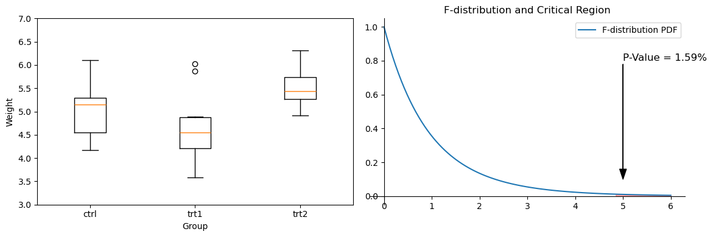
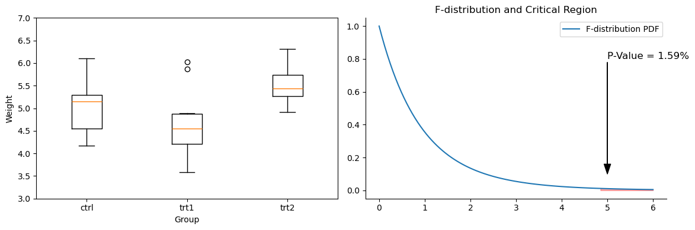
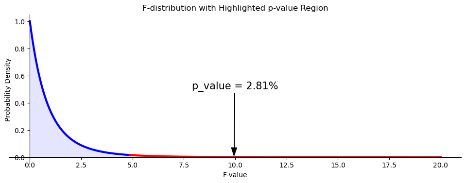
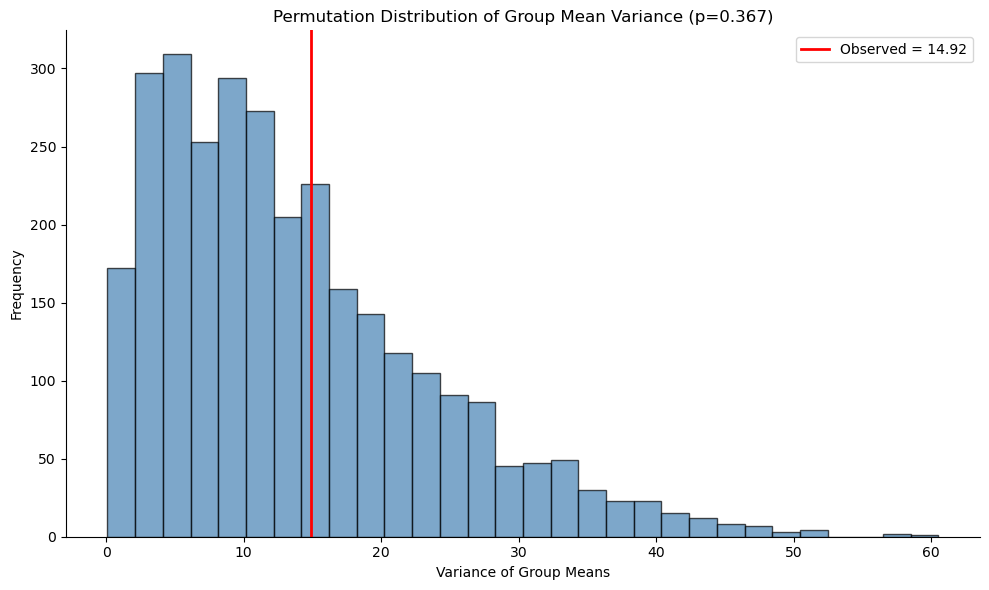

# 일원배치 분산분석: F-검정 절차

## 1. 일원배치 분산분석의 수행 절차

[eng|](https://www.youtube.com/watch?v=Lp2aV_4LF48&t=146s)

### 1단계: 가설 세우기

- **귀무가설** ($H_0$): 모든 집단의 평균이 같다.

$$
H_0: \mu_1 = \mu_2 = \mu_3 = \dots = \mu_k
$$

여기서 $\mu_1, \mu_2, \dots, \mu_k$는 $k$개 집단 각각의 모평균이다.

- **대립가설** ($H_A$): 적어도 한 집단의 평균이 다르다.

### 2단계: 전체 평균과 집단 평균 계산

종속변수 전체의 평균을 계산한다:

$$
\bar{y}_{\cdot\cdot} = \frac{1}{\sum_{i=1}^kn_i}\sum_{i=1}^k \sum_{j=1}^{n_i} y_{ij}
$$

각 집단에 대해 종속변수의 평균을 계산한다:

$$
\bar{y}_{i\cdot} = \frac{1}{n_i} \sum_{j=1}^{n_i} y_{ij}
$$

### 3단계: 전체 변동(총제곱합) SST 계산

전체 변동 $SST$를 다음으로 계산한다:

$$
SST
=\displaystyle
\sum_{i=1}^{k}\sum_{j=1}^{n_i} \left( y_{ij} - \bar{y}_{\cdot\cdot} \right)^2
$$

### 4단계: 집단 내 변동 SSW 계산

집단 내 변동 $SSW$를 다음으로 계산한다:

$$
SSW = \sum_{i=1}^{k} \sum_{j=1}^{n_i} \left( y_{ij} - \bar{y}_{i\cdot} \right)^2
$$

### 5단계: 집단 간 변동 SSB 계산

집단 간 변동 $SSB$를 다음으로 계산한다:

$$
SSB
= \sum_{i=1}^{k} \sum_{j=1}^{n_i} \left( \bar{y}_{i\cdot} - \bar{y}_{\cdot\cdot} \right)^2
= \sum_{i=1}^{k} n_i \left( \bar{y}_{i\cdot} - \bar{y}_{\cdot\cdot} \right)^2
$$

### 6단계: 전체 변동의 분해 확인

총제곱합은 다음과 같이 쓸 수 있다:

$$
\begin{array}{lllllll}
SST
&=&\displaystyle
\sum_{i=1}^{k}\sum_{j=1}^{n_i} \left( y_{ij} - \bar{y}_{\cdot\cdot} \right)^2\\
&=&\displaystyle
\sum_{i=1}^{k} \sum_{j=1}^{n_i} \left[ \left( y_{ij} - \bar{y}_{i\cdot} \right) + \left( \bar{y}_{i\cdot} - \bar{y}_{\cdot\cdot} \right) \right]^2\\
&=&\displaystyle
\sum_{i=1}^{k}\sum_{j=1}^{n_i} \left( y_{ij} - \bar{y}_{i\cdot} \right)^2 + \sum_{i=1}^{k} n_i \left( \bar{y}_{i\cdot} - \bar{y}_{\cdot\cdot} \right)^2
&=&
SSW + SSB
\end{array}
$$

### 7단계: F-통계량 계산

$$
\begin{array}{cccccccccc}
\text{요인}&\text{df}&SS&MS&F&H_0&H_0\text{ 아래 }F\text{의 표본분포}\\
\hline
\text{처리}&k-1&SSB&\displaystyle MSB=\frac{SSB}{k-1}&\displaystyle F=\frac{MSB}{MSW}&\text{모든 }\beta_{i}=0&F\sim F_{k-1,N-k}\\
\text{오차}&N-k&SSW&\displaystyle MSW=\frac{SSW}{N-k}&\\
\hline
\text{전체}&N-1&SST&&\\
\end{array}
$$

분산분석의 검정통계량은 F-통계량이며, 집단 간 평균제곱(MSB)과 집단 내 평균제곱(MSW)의 비로 계산한다:

$$
F = \frac{\text{MSB}}{\text{MSW}} = \frac{\text{SSB}/(k-1)}{\text{SSW}/(N-k)}
$$

여기서

- $k$는 집단의 개수
- $N$은 모든 집단을 합친 전체 관측 수
- $\text{MSB} = \frac{\text{SSB}}{k - 1}$은 **집단 간 평균제곱**
- $\text{MSW} = \frac{\text{SSW}}{N - k}$은 **집단 내 평균제곱**

이다.

### 8단계: 임계값 또는 p-값 구하기

$H_0$ 아래에서 $F$의 표본분포는

$$
F\sim F_{k-1,N-k}
$$

이다.

- 계산한 F-통계량을 ($k-1$과 $N-k$ 자유도의) F-분포표 임계값과 비교하거나,
- p-값 접근을 쓴다. p-값이 유의수준(예: $\alpha = 0.05$)보다 작으면 귀무가설을 기각한다.

### 9단계: 판정

$$
\text{statistic} > F_{\text{critical}} \quad\Rightarrow\quad H_1\text{을 택한다}
$$

## 2. 일원배치 분산분석 패키지

### A. Scipy.Stats

#### scipy.stats.f_oneway

<div class="codebox" markdown>

##### 예제 1. scipy로 하는 일원배치 분산분석 { .eg }

```python
import matplotlib.pyplot as plt
import numpy as np
import pandas as pd
from scipy import stats
def load_data():
    """
    Load and preprocess plant growth data from the given URL.
    Returns:
        df (pd.DataFrame): The full DataFrame of plant growth data.
        data (tuple): A tuple containing weights for each group ('ctrl', 'trt1', 'trt2').
        df1 (int): Degrees of freedom between groups.
        df2 (int): Degrees of freedom within groups.
    """
    url = 'https://raw.githubusercontent.com/vincentarelbundock/Rdatasets/master/csv/datasets/PlantGrowth.csv'
    df = pd.read_csv(url, usecols=[1, 2])
    group_data = df.groupby('group')
    data_ctrl = group_data.get_group('ctrl').weight
    data_trt1 = group_data.get_group('trt1').weight
    data_trt2 = group_data.get_group('trt2').weight
    data = (data_ctrl, data_trt1, data_trt2)
    total_samples = data_ctrl.shape[0] + data_trt1.shape[0] + data_trt2.shape[0]
    num_groups = len(data)
    df1 = num_groups - 1
    df2 = total_samples - num_groups
    return df, data, df1, df2
def perform_anova(data_ctrl, data_trt1, data_trt2):
    """
    Perform one-way ANOVA on the given data.
    Returns:
        statistic (float): F-statistic of the ANOVA test.
        p_value (float): P-value of the ANOVA test.
    """
    statistic, p_value = stats.f_oneway(data_ctrl, data_trt1, data_trt2)
    print(f"\nANOVA Results:\nF-Statistic = {statistic:.4f}\nP-Value = {p_value:.4f}")
    return statistic, p_value
def plot_data(data_ctrl, data_trt1, data_trt2, df1, df2, statistic, p_value):
    """
    Plot boxplot of weights for each group and F-distribution with critical region.
    """
    fig, (ax_box, ax_pdf) = plt.subplots(1, 2, figsize=(12, 4))
    ax_box.boxplot([data_ctrl, data_trt1, data_trt2], labels=['ctrl', 'trt1', 'trt2'])
    ax_box.set_ylim(3, 7)
    ax_box.set_xlabel('Group')
    ax_box.set_ylabel('Weight')
    x_vals = np.linspace(0, 6, 100)
    pdf_vals = stats.f(df1, df2).pdf(x_vals)
    ax_pdf.plot(x_vals, pdf_vals, label='F-distribution PDF')
    ax_pdf.fill_between(x_vals[x_vals >= statistic], pdf_vals[x_vals >= statistic], color='red', alpha=0.3)
    ax_pdf.spines[['top','right']].set_visible(False)
    ax_pdf.spines[['bottom','left']].set_position("zero")
    ax_pdf.set_title("F-distribution and Critical Region")
    ax_pdf.legend()
    ax_pdf.annotate(f'P-Value = {p_value:.2%}', xy=(5.0, 0.1), xytext=(5.0, 0.8),
                    arrowprops=dict(color='k', width=0.2, headwidth=8), fontsize=12)
    plt.tight_layout()
    plt.show()
# 자료 읽기 → 분산분석 → 그림 순으로 돌린다
_, (data_ctrl, data_trt1, data_trt2), df1, df2 = load_data()
statistic, p_value = perform_anova(data_ctrl, data_trt1, data_trt2)
plot_data(data_ctrl, data_trt1, data_trt2, df1, df2, statistic, p_value)
```

출력:

```

ANOVA Results:
F-Statistic = 4.8461
P-Value = 0.0159
```



왼쪽 상자그림에서 세 집단이 서로 겹치고, 오른쪽 F-분포에서 관측값 4.85 오른쪽의 붉은 넓이가 p-값 1.59%다.

</div>

### B. Statsmodels

#### statsmodels.formula.api.ols와 statsmodels.stats.anova.anova_lm

<div class="codebox" markdown>

##### 예제 2. statsmodels로 하는 일원배치 분산분석 { .eg }

```python
import matplotlib.pyplot as plt
import numpy as np
import pandas as pd
from scipy import stats
from statsmodels.formula.api import ols
from statsmodels.stats.anova import anova_lm
def load_data():
    """
    Load and preprocess plant growth data for ANOVA.
    """
    url = 'https://raw.githubusercontent.com/vincentarelbundock/Rdatasets/master/csv/datasets/PlantGrowth.csv'
    df = pd.read_csv(url, usecols=[1, 2])
    group_data = df.groupby('group')
    data_ctrl = group_data.get_group('ctrl').weight
    data_trt1 = group_data.get_group('trt1').weight
    data_trt2 = group_data.get_group('trt2').weight
    data = (data_ctrl, data_trt1, data_trt2)
    total_samples = data_ctrl.shape[0] + data_trt1.shape[0] + data_trt2.shape[0]
    num_groups = len(data)
    df1 = num_groups - 1
    df2 = total_samples - num_groups
    return df, data, df1, df2
def perform_anova(df):
    """
    Perform one-way ANOVA using statsmodels.
    """
    model = ols('weight ~ C(group)', data=df).fit()
    anova_results = anova_lm(model)
    statistic = anova_results['F'].iloc[0]
    p_value = anova_results['PR(>F)'].iloc[0]
    print("\nANOVA Results:\n", anova_results)
    return statistic, p_value
def plot_data(data_ctrl, data_trt1, data_trt2, df1, df2, statistic, p_value):
    """
    Plot boxplot of weights for each group and F-distribution with critical region.
    """
    fig, (ax_box, ax_pdf) = plt.subplots(1, 2, figsize=(12, 4))
    ax_box.boxplot([data_ctrl, data_trt1, data_trt2], labels=['ctrl', 'trt1', 'trt2'])
    ax_box.set_ylim(3, 7)
    ax_box.set_xlabel('Group')
    ax_box.set_ylabel('Weight')
    x_vals = np.linspace(0, 6, 100)
    pdf_vals = stats.f(df1, df2).pdf(x_vals)
    ax_pdf.plot(x_vals, pdf_vals, label='F-distribution PDF')
    ax_pdf.fill_between(x_vals[x_vals >= statistic], pdf_vals[x_vals >= statistic], color='red', alpha=0.3)
    ax_pdf.spines['top'].set_visible(False)
    ax_pdf.spines['right'].set_visible(False)
    ax_pdf.set_title("F-distribution and Critical Region")
    ax_pdf.legend()
    ax_pdf.annotate(f'P-Value = {p_value:.2%}', xy=(5.0, 0.1), xytext=(5.0, 0.8),
                    arrowprops=dict(color='k', width=0.2, headwidth=8), fontsize=12)
    plt.tight_layout()
    plt.show()
# 자료 읽기 → 분산분석 → 그림 순으로 돌린다
df, (data_ctrl, data_trt1, data_trt2), df1, df2 = load_data()
statistic, p_value = perform_anova(df)
plot_data(data_ctrl, data_trt1, data_trt2, df1, df2, statistic, p_value)
```

출력:

```

ANOVA Results:
             df    sum_sq   mean_sq         F   PR(>F)
C(group)   2.0   3.76634  1.883170  4.846088  0.01591
Residual  27.0  10.49209  0.388596       NaN      NaN
```



`f_oneway`가 F와 p 두 값만 주는 데 비해 `anova_lm`은 제곱합과 자유도까지 담은 분산분석표를 준다. F와 p는 앞과 정확히 같다.

</div>

## 3. 예제: 음료 종류에 따른 반응시간

<div class="probox" markdown>

**문제 1.** <span class="diff easy" title="쉬움"></span>

서로 다른 음료를 마신 뒤의 반응시간(밀리초)을 측정한 세 집단이 있다고 하자: **물**, **에너지 드링크**, **커피**. 이 집단들 사이에 반응시간의 통계적으로 유의한 차이가 있는지 판정하려 한다.

각 집단의 자료는 다음과 같다:

- **물 집단**: [19, 18, 17, 18, 20]
- **에너지 드링크 집단**: [20, 22, 19, 21, 20]
- **커피 집단**: [18, 17, 16, 19, 20]

집단 사이의 평균 반응시간에 차이가 있는지 판정하기 위해 일원배치 분산분석을 수행한다.

</div>

??? success "풀이"
    #### 1단계: 가설 세우기

    **귀무가설 ($H_0$)**: 세 집단의 평균 반응시간이 같다.

    **대립가설 ($H_a$)**: 적어도 한 집단의 평균 반응시간이 다르다.

    #### 2단계: 전체 평균과 집단 평균 계산

    1. **전체 평균 ($\bar{X}$)**:

    $$
    \bar{X} = \frac{19 + 18 + 17 + 18 + 20 + 20 + 22 + 19 + 21 + 20 + 18 + 17 + 16 + 19 + 20}{15} = 19.0
    $$

    2. **집단 평균**:
       - **물 집단**: $(19 + 18 + 17 + 18 + 20) / 5 = 18.4$
       - **에너지 드링크 집단**: $(20 + 22 + 19 + 21 + 20) / 5 = 20.4$
       - **커피 집단**: $(18 + 17 + 16 + 19 + 20) / 5 = 18.0$

    #### 3단계: 전체 변동(총제곱합) SST 계산

    총제곱합(SST)은 전체 평균에 대한 자료의 전체 변동을 잰다.

    $$
    SST = \sum_{i=1}^{k}\sum_{j=1}^{n_i} (X_{ij} - \bar{X}_{\cdot\cdot})^2
    $$

    자료의 각 값에 대해:

    **물 집단**: $(19 - 19)^2 = 0$, $(18 - 19)^2 = 1$, $(17 - 19)^2 = 4$, $(18 - 19)^2 = 1$, $(20 - 19)^2 = 1$

    **에너지 드링크 집단**: $(20 - 19)^2 = 1$, $(22 - 19)^2 = 9$, $(19 - 19)^2 = 0$, $(21 - 19)^2 = 4$, $(20 - 19)^2 = 1$

    **커피 집단**: $(18 - 19)^2 = 1$, $(17 - 19)^2 = 4$, $(16 - 19)^2 = 9$, $(19 - 19)^2 = 0$, $(20 - 19)^2 = 1$

    **모두 더하면**:

    $$
    SST = 0 + 1 + 4 + 1 + 1 + 1 + 9 + 0 + 4 + 1 + 1 + 4 + 9 + 0 + 1 = 37
    $$

    #### 4단계: 집단 내 변동 SSW 계산

    집단 내 제곱합(SSW)은 각 집단 안의 변동을 잰다.

    $$
    SSW = \sum_{i=1}^{k} \sum_{j=1}^{n_i} (X_{ij} - \bar{X}_{i\cdot})^2
    $$

    **물 집단**:

    $$
    SSW_{\text{Water}} = 0.36 + 0.16 + 1.96 + 0.16 + 2.56 = 5.20
    $$

    **에너지 드링크 집단**:

    $$
    SSW_{\text{Energy Drink}} = 0.16 + 2.56 + 1.96 + 0.36 + 0.16 = 5.20
    $$

    **커피 집단**:

    $$
    SSW_{\text{Coffee}} = 0 + 1 + 4 + 1 + 4 = 10.00
    $$

    **이들을 더하면**:

    $$
    SSW = 5.20 + 5.20 + 10.00 = 20.40
    $$

    #### 5단계: 집단 간 변동 SSB 계산

    집단 간 제곱합(SSB)은 집단 평균과 전체 평균 사이의 변동을 잰다.

    $$
    SSB = \sum_{i=1}^{k} n_i (\bar{X}_{i\cdot} - \bar{X}_{\cdot\cdot})^2
    $$

    **물 집단**: $SSB_{\text{Water}} = 5 \times (18.4 - 19)^2 = 5 \times 0.36 = 1.8$

    **에너지 드링크 집단**: $SSB_{\text{Energy Drink}} = 5 \times (20.4 - 19)^2 = 5 \times 1.96 = 9.8$

    **커피 집단**: $SSB_{\text{Coffee}} = 5 \times (18.0 - 19)^2 = 5 \times 1.0 = 5.0$

    **이들을 더하면**:

    $$
    SSB = 1.8 + 9.8 + 5.0 = 16.6
    $$

    #### 6단계: 전체 변동의 분해 확인

    이제 다음이 성립하는지 확인하자:

    $$
    SST = SSB + SSW
    $$

    - **SST** = 37
    - **SSB + SSW** = 16.6 + 20.40 = 37

    값이 일치하므로 계산이 일관됨을 확인할 수 있다.

    #### 7단계: F-통계량 계산

    **F-통계량**은 다음으로 계산한다:

    $$
    F = \frac{MSB}{MSW}
    $$

    여기서

    - **집단 간 평균제곱(MSB)**: $MSB = \frac{SSB}{k - 1} = \frac{16.6}{3 - 1} = 8.3$
    - **집단 내 평균제곱(MSW)**: $MSW = \frac{SSW}{N - k} = \frac{20.40}{15 - 3} = 1.70$

    따라서

    $$
    F = \frac{8.3}{1.70} = 4.88
    $$

    #### 8단계: 임계값 또는 p-값 구하기

    p-값을 구하기 위해 F-통계량을 $df_1 = 2$(집단 간), $df_2 = 12$(집단 내)인 F-분포의 임계값과 비교한다.

    이 자유도에서 **$F = 4.88$의 p-값**은 약 **0.03**이다.

    #### 9단계: 판정

    p-값이 **0.03**으로 **통상적인 유의수준 $\alpha = 0.05$보다 작으므로** **귀무가설을 기각한다**. 세 집단의 평균 사이에 유의한 차이가 있다는 뜻이다.

    #### 10단계: 사후검정

    결과가 유의성 경계에 가까웠다면 표본크기를 늘리거나 다른 유의수준을 써서 가설을 더 검토할 수 있다. 아니면 **사후**검정을 수행하여 집단 사이의 좀 더 미세한 차이를 이해할 수 있다.

    ```python
    import scipy.stats as stats
    # 세 집단의 자료
    water_group = [19, 18, 17, 18, 20]
    energy_drink_group = [20, 22, 19, 21, 20]
    coffee_group = [18, 17, 16, 19, 20]
    # 일원배치 분산분석
    f_statistic, p_value = stats.f_oneway(water_group, energy_drink_group, coffee_group)
    # 결과 출력
    print(f"F-statistic: {f_statistic:.2f}")
    print(f"P-value: {p_value:.4f}")
    ```

    출력:

    ```
    F-statistic: 4.86
    P-value: 0.0284
    ```

    손계산의 4.88과 미세하게 다른 것은 위에서 중간값을 반올림했기 때문이다. 정확한 값은 4.86이다.

    ```python
    import numpy as np
    import matplotlib.pyplot as plt
    import scipy.stats as stats
    # 주어진 F 값과 자유도
    df_between = 3 - 1
    df_within = 15 - 3
    f_statistic = 4.88
    # p-값은 F 분포의 오른쪽 꼬리 넓이다
    p_value = stats.f.sf(f_statistic, df_between, df_within)
    print(f"{f_statistic = :.04f}")
    print(f"{p_value = :.04f}")
    # 그림과 축을 만든다
    fig, ax = plt.subplots(figsize=(12, 4))
    # 통계량 왼쪽 구간
    x = np.linspace(0, f_statistic, 500)
    y = stats.f.pdf(x, df_between, df_within)
    ax.plot(x, y, color='blue', linewidth=3)
    # 왼쪽을 칠한다 — 기각하지 않는 쪽
    x = np.concatenate([[0], x, [f_statistic], [0]])
    y = np.concatenate([[0], y, [0], [0]])
    ax.fill(x, y, color='blue', alpha=0.1)
    # 통계량 오른쪽 꼬리
    x = np.linspace(f_statistic, 20, 500)
    y = stats.f.pdf(x, df_between, df_within)
    ax.plot(x, y, color='red', linewidth=3)
    # 오른쪽을 칠한다 — 이 넓이가 p-값이다
    x = np.concatenate([[f_statistic], x, [20], [f_statistic]])
    y = np.concatenate([[0], y, [0], [0]])
    ax.fill(x, y, color='red', alpha=0.1)
    # p-값을 화살표로 가리킨다
    xy = ((f_statistic + 15.0) / 2, 0.01)
    xytext = (f_statistic + 3, 0.5)
    arrowprops = dict(color='black', width=0.2, headwidth=8)
    ax.annotate(f'{p_value = :.02%}', xy, xytext=xytext, fontsize=15, arrowprops=arrowprops)
    # 축과 테두리를 다듬는다
    ax.spines['right'].set_visible(False)
    ax.spines['top'].set_visible(False)
    ax.spines['bottom'].set_position('zero')
    ax.spines['left'].set_position('zero')
    ax.set_xlabel('F-value')
    ax.set_ylabel('Probability Density')
    ax.set_title('F-distribution with Highlighted p-value Region')
    plt.show()
    ```

    출력:

    ```
    f_statistic = 4.8800
    p_value = 0.0281
    ```

    

    붉게 칠한 오른쪽 꼬리가 p-값 2.81%다. 반올림한 4.88을 넣었으므로 앞의 정확한 계산이 준 0.0284와 미세하게 다르다.

    ---

## 4. 순열 기반 일원배치 분산분석

분산분석의 순열검정은 분포 가정을 전혀 요구하지 않는 비모수적 대안이다. 흔히 쓰이는 두 접근은 집단 평균의 분산을 검정하거나 F-통계량을 직접 계산하는 것이다.

### 접근 1: 집단 평균의 분산을 이용한 순열검정

이 접근은 귀무가설 아래에서 집단 평균들의 분산이 유별나게 큰지를 검정한다.

#### 알고리즘

1. **집단 평균의 관측 분산 계산**:

$$
\text{Var}(\bar{y}_{1\cdot}, \bar{y}_{2\cdot}, \ldots, \bar{y}_{k\cdot})
$$

2. **자료를 B번 순열**:
   - 모든 관측값을 합친다
   - (집단 크기를 유지하며) 관측값을 무작위로 집단에 다시 배정한다
   - 순열마다 집단 평균의 분산을 계산한다

3. **p-값 계산**:

$$
p\text{-value} = \frac{\#\{\text{Perm Var} \geq \text{Obs Var}\}}{B}
$$

네 웹페이지의 체류시간을 검정한다고 하자:

<div class="codebox" markdown>

#### 예제 3. 네 웹페이지의 체류시간 { .eg }

```python
import numpy as np
import pandas as pd
import matplotlib.pyplot as plt
# 웹페이지 네 개의 체류시간 자료
four_sessions = pd.DataFrame({
    'Time': [164, 178, 175, 155, 172, 182, 180, 179, 165, 166,
             172, 161, 171, 173, 158, 161, 179, 159, 167, 162],
    'Page': ['Page 1']*5 + ['Page 2']*5 + ['Page 3']*5 + ['Page 4']*5
})
# 관측된 집단평균들의 분산. 이 값이 클수록 집단 차이가 크다는 뜻이다.
obs_variance = four_sessions.groupby('Page')['Time'].mean().var()
print(f"Observed variance of means: {obs_variance:.2f}")
# 순열검정: 집단 이름표를 뒤섞어 귀무분포를 만든다
def perm_test_anova(df, group_col='Page', value_col='Time', n_perms=3000):
    """
    Permutation test for ANOVA using variance of group means.
    Parameters:
    -----------
    df : DataFrame
        Data with groups and values
    group_col : str
        Name of column with group labels
    value_col : str
        Name of column with values
    n_perms : int
        Number of permutations
    Returns:
    --------
    p_value : float
        Permutation test p-value
    perm_vars : array
        Permuted variances
    """
    groups = df[group_col].unique()
    group_sizes = {g: (df[group_col] == g).sum() for g in groups}
    obs_var = df.groupby(group_col)[value_col].mean().var()
    perm_vars = np.zeros(n_perms)
    for i in range(n_perms):
        # 값을 뒤섞어 같은 크기의 집단으로 다시 나눈다
        shuffled_values = np.random.permutation(df[value_col].values)
        perm_df = df.copy()
        perm_df[value_col] = shuffled_values
        # 뒤섞은 자료에서 집단평균들의 분산을 구한다
        perm_vars[i] = perm_df.groupby(group_col)[value_col].mean().var()
    p_value = np.mean(perm_vars >= obs_var)
    return p_value, perm_vars, obs_var
# 순열검정 실행
np.random.seed(42)
p_val, perm_vars, obs_var = perm_test_anova(four_sessions)
print(f"Permutation test p-value: {p_val:.4f}")
print(f"Conclusion: {'Reject H0' if p_val < 0.05 else 'Fail to reject H0'}")
# 귀무분포에 관측값을 얹어 본다
fig, ax = plt.subplots(figsize=(10, 6))
ax.hist(perm_vars, bins=30, alpha=0.7, color='steelblue', edgecolor='black')
ax.axvline(obs_var, color='red', linewidth=2, label=f'Observed = {obs_var:.2f}')
ax.set_xlabel('Variance of Group Means')
ax.set_ylabel('Frequency')
ax.set_title(f'Permutation Distribution of Group Mean Variance (p={p_val:.3f})')
ax.legend()
ax.spines['top'].set_visible(False)
ax.spines['right'].set_visible(False)
plt.tight_layout()
plt.show()
```

출력:

```
Observed variance of means: 14.92
Permutation test p-value: 0.3673
Conclusion: Fail to reject H0
```



빨간 선(관측 분산 14.92)이 순열분포의 한가운데쯤에 있다. 네 페이지의 체류시간 평균이 서로 다르다는 증거가 없다.

여기서 순열이 하는 일을 다시 새겨 두자. 페이지 표시를 무작위로 뒤섞는 것은 "페이지가 아무 영향도 주지 않는" 세상을 만드는 일이고, 그 세상에서 평균들이 이만큼 흩어지는 일이 얼마나 흔한지를 세는 것이 p-값이다. $F$-분포도 정규성도 쓰지 않는다.

</div>

### 접근 2: F-통계량을 이용한 순열검정

분산 기반 접근이 직관적이기는 하지만, 모수적 분산분석과 더 직접 비교하려면 F-통계량을 검정통계량으로 쓸 수도 있다.

#### 알고리즘

1. **관측 F-통계량 계산**:

$$
F_{\text{obs}} = \frac{\text{MSB}}{\text{MSW}}
$$

2. **자료를 B번 순열**:
   - 모든 관측값을 합친다
   - 무작위로 집단에 다시 배정한다
   - 순열마다 F-통계량을 계산한다

3. **p-값 계산**:

$$
p\text{-value} = \frac{\#\{F_b \geq F_{\text{obs}}\}}{B}
$$

<div class="codebox" markdown>

#### 예제 4. 집단평균 분산을 통계량으로 쓴 순열검정 { .eg }

```python
from scipy import stats
def perm_test_anova_f(df, group_col='Page', value_col='Time', n_perms=3000):
    """
    Permutation test for ANOVA using F-statistic.
    """
    groups = df[group_col].unique()
    group_sizes = {g: (df[group_col] == g).sum() for g in groups}
    # 관측된 F 값
    model = smf.ols(f'{value_col} ~ C({group_col})', data=df).fit()
    anova_table = sm.stats.anova_lm(model)
    f_obs = anova_table['F'].iloc[0]
    perm_f_stats = np.zeros(n_perms)
    for i in range(n_perms):
        # 값을 뒤섞는다
        shuffled_values = np.random.permutation(df[value_col].values)
        perm_df = df.copy()
        perm_df[value_col] = shuffled_values
        # 뒤섞은 자료의 F 값
        perm_model = smf.ols(f'{value_col} ~ C({group_col})', data=perm_df).fit()
        perm_anova = sm.stats.anova_lm(perm_model)
        perm_f_stats[i] = perm_anova['F'].iloc[0]
    p_value = np.mean(perm_f_stats >= f_obs)
    return p_value, perm_f_stats, f_obs
# F 를 통계량으로 쓴 순열검정
import statsmodels.formula.api as smf
import statsmodels.api as sm
p_val_f, perm_f, obs_f = perm_test_anova_f(four_sessions)
print(f"\nF-statistic based permutation test:")
print(f"Observed F: {obs_f:.4f}")
print(f"p-value: {p_val_f:.4f}")
```

출력:

```

F-statistic based permutation test:
Observed F: 1.1161
p-value: 0.3550
```

앞의 분산 기반 순열검정이 준 0.3673과 가깝다. 두 검정통계량이 다르지만 같은 정보를 다르게 요약할 뿐이기 때문이다. 실제로 집단 크기가 모두 같으면 집단평균의 분산과 $F$는 단조 관계라 순위가 같고, 순열 p-값도 모의실험 오차 범위에서 일치한다.

</div>

### 비교: 순열검정 대 모수적 분산분석

모수적 가정이 성립하면 두 접근이 비슷한 결과를 준다:

<div class="codebox" markdown>

#### 예제 5. 순열검정과 모수적 분산분석의 비교 { .eg }

```python
# 모수적 분산분석. 순열검정 결과와 견준다.
f_stat, p_param = stats.f_oneway(
    four_sessions[four_sessions.Page == 'Page 1']['Time'],
    four_sessions[four_sessions.Page == 'Page 2']['Time'],
    four_sessions[four_sessions.Page == 'Page 3']['Time'],
    four_sessions[four_sessions.Page == 'Page 4']['Time']
)
print(f"\nParametric ANOVA:")
print(f"F-statistic: {f_stat:.4f}")
print(f"p-value: {p_param:.4f}")
print(f"\nPermutation ANOVA (variance-based):")
print(f"p-value: {p_val:.4f}")
```

출력:

```

Parametric ANOVA:
F-statistic: 1.1161
p-value: 0.3718

Permutation ANOVA (variance-based):
p-value: 0.3673
```

모수적 분산분석의 0.3718과 순열검정의 0.3673이 거의 같다. 자료가 정규성에서 크게 벗어나지 않으면 두 방법이 같은 답을 준다는 뜻이다.

순열검정의 값어치는 이렇게 가정이 성립할 때가 아니라 깨질 때 드러난다. 그리고 여기처럼 두 방법이 일치하는 것을 확인하는 일 자체가 모수적 가정에 대한 하나의 점검이 된다.

</div>

### 순열 분산분석의 장점

1. **분포 가정이 없다**: 어떤 분포의 자료에도 작동한다.
2. **이분산을 자연스럽게 다룬다**: Levene 검정이 필요 없다.
3. **제1종 오류를 정확히 통제한다**: p-값이 (근사가 아니라) 정확하다.
4. **직관적인 해석**: 결과가 실제 무작위화를 반영한다.

### 순열 분산분석을 쓸 때

- **작은 표본**: 집단당 n < 30.
- **정규성에서 벗어난 자료**: Q-Q 그림이나 Shapiro-Wilk 검정으로 확인된 경우.
- **분산이 다를 때**: Levene 검정이 동질성을 기각할 때.
- **로버스트성 확인**: 모수적 분산분석과 결과를 비교할 때.

## 연습문제

<div class="drillbox" markdown>

**연습문제 1.** <span class="diff easy" title="쉬움"></span>
세 집단의 시험 점수: 오전 $\bar Y = 88.6$, 오후 $79.4$, 저녁 $94.2$ (각 5명). 전체 평균 87.4. (a)–(e): $\alpha = 0.05$에서 분산분석을 수행하라.

</div>

??? success "풀이"
    (a) $H_0: \mu_1 = \mu_2 = \mu_3$. $H_a$: 적어도 하나가 다르다.

    (b) 평균: $\bar Y_1 = 88.6, \bar Y_2 = 79.4, \bar Y_3 = 94.2$. 전체: 87.4.

    (c) $\mathrm{SSB} = 5 \cdot [(88.6-87.4)^2 + (79.4-87.4)^2 + (94.2-87.4)^2] = 5 \cdot 111.68 = 558.4$.

    $\mathrm{SSW} = 29.2 + 23.2 + 14.8 = 67.2$.

    $\mathrm{SST} = 625.6 = \mathrm{SSB} + \mathrm{SSW}$. ✓

    (d) MSB $= 558.4/2 = 279.2$. MSW $= 67.2/12 = 5.6$. $F = 279.2/5.6 = 49.86$.

    (e) 임계값 $F_{2, 12, 0.05} = 3.89$. $49.86 \gg 3.89$이므로 **$H_0$을 기각한다.** 시간대가 시험 점수에 유의하게 영향을 준다.

<div class="drillbox" markdown>

**연습문제 2.** <span class="diff med" title="중간"></span>
**왜 쌍별 $t$-검정이 아니라 분산분석인가?**

</div>

??? success "풀이"
    집단이 $k = 3$개면 쌍별 검정이 $\binom{3}{2} = 3$개이다. 각각 $\alpha = 0.05$이면 가족단위 오류가 $\approx 1 - 0.95^3 \approx 0.143$으로 명목 $\alpha$의 거의 세 배가 된다.

    분산분석의 전체검정은 $k$와 무관하게 제1종 오류가 $\alpha$이다.

    **작업 흐름:**

    1. 분산분석 전체검정: 통제된 $\alpha$에서 어떤 차이든 있는지 탐지한다.
    2. 기각하면: 사후 쌍별 비교(Tukey의 HSD, Bonferroni 조정 t-검정)로 어느 쌍이 다른지 찾는다.

    모든 쌍별 비교만 원한다면 Tukey를 바로 써도 된다. 분산분석은 사후검정으로 가는 관문이다.

<div class="drillbox" markdown>

**연습문제 3.** <span class="diff med" title="중간"></span>
**분산분석의 가정.** 나열하고 로버스트성을 논하라.

</div>

??? success "풀이"
    1. 관측값 사이의 **독립성**. 결정적이다. 위반(군집 자료)은 제1종 오류를 심각하게 부풀린다.
    2. 각 집단 안의 **정규성**. 특히 $n$이 같고 표본이 크면 분산분석은 약한 이탈에 로버스트하다.
    3. **등분산성**(분산이 같음). 균형 설계에서는 로버스트하지만 $n$이 다르면 문제가 된다.

    **로버스트성 순위:**

    - 독립성: 전혀 로버스트하지 않다.
    - 정규성: 꽤 로버스트하다(중심극한정리).
    - 등분산: 균형 설계에서는 어느 정도 로버스트하다.

    **위반 시:** 변환, Welch 분산분석(이분산), Kruskal-Wallis(비정규성), 혼합모형(군집 자료).

<div class="drillbox" markdown>

**연습문제 4.** <span class="diff easy" title="쉬움"></span>
**분산분석의 효과크기.** 연습문제 1에 대해 $\eta^2$과 $\omega^2$을 계산하라.

</div>

??? success "풀이"
    **에타제곱:** $\eta^2 = \mathrm{SSB}/\mathrm{SST} = 558.4/625.6 \approx 0.89$.

    해석: 시험 점수 분산의 89%가 시간대로 설명된다. 아주 큰 효과이다.

    **오메가제곱**(편향이 덜함): $\omega^2 = (\mathrm{SSB} - (k-1) \mathrm{MSW})/(\mathrm{SST} + \mathrm{MSW}) = (558.4 - 2 \cdot 5.6)/(625.6 + 5.6) \approx 0.87$.

    Cohen의 관례:

    - 0.01: 작음
    - 0.06: 중간
    - 0.14: 큼

    여기서 0.89는 대단히 크다. p-값과 함께 효과크기를 항상 보고하라.

<div class="drillbox" markdown>

**연습문제 5.** <span class="diff med" title="중간"></span>
**일원배치와 이원배치 분산분석**의 직관.

</div>

??? success "풀이"
    **일원배치:** 수준이 $k$개인 요인 하나. $H_0: \mu_1 = \mu_2 = \cdots = \mu_k$을 검정한다.

    **이원배치:** 각각 여러 수준을 갖는 요인 둘. 검정이 셋이다:

    1. 요인 A의 주효과.
    2. 요인 B의 주효과.
    3. 교호작용: A의 효과가 B의 수준에 따라 달라지는가?

    교호작용 항이 이원배치 분산분석만의 고유한 기여이다. 과학적으로 가장 흥미로운 결과인 경우도 많다.

    삼원 이상의 분산분석은 다루기 번거로워진다. 요인이 셋 이상이면 교호작용 항을 넣은 회귀를 택하는 편이 낫다.

<div class="drillbox" markdown>

**연습문제 6.** <span class="diff med" title="중간"></span>
일원배치 분산분석의 **검정력 분석**.

</div>

??? success "풀이"
    $\alpha = 0.05$에서 검정력 80%를 얻으려면:

    | 효과크기 $f$ | 집단당 $n$ ($k = 3$) |
    |---|---|
    | 작음 (0.10) | 약 324 |
    | 중간 (0.25) | 약 52 |
    | 큼 (0.40) | 약 21 |

    Cohen의 $f = \sqrt{\eta^2/(1 - \eta^2)}$.

    정확한 계산에는 `statsmodels.stats.power.FTestAnovaPower`를 쓴다. 사회과학에서는 검정력이 부족한 분산분석이 흔하다. 집단당 $n = 5$에서 유의하지 않다고 보고하는 것은 정보가 거의 없다.

<div class="drillbox" markdown>

**연습문제 7.** <span class="diff hard" title="어려움"></span>
본문의 **순열 분산분석**이 어떤 가정을 없애 주고 어떤 가정은 없애 주지 못하는지 모의실험으로 확인하라.

</div>

??? success "풀이"
    **순열의 전제는 교환가능성**이다. $H_0$ 아래에서 관측값이 어느 집단에 속하든 **분포가 완전히 같아야** 이름표를 섞을 수 있다. 이는 "평균이 같다"보다 강한 조건이다.

    ```python
    import numpy as np
    from scipy import stats

    rng = np.random.default_rng(9090)

    def welch_anova(*groups):
        k = len(groups)
        n = np.array([len(g) for g in groups], float)
        m = np.array([g.mean() for g in groups])
        v = np.array([g.var(ddof=1) for g in groups])
        w = n / v
        W = w.sum()
        m_tilde = (w * m).sum() / W
        tmp = np.sum((1 - w / W)**2 / (n - 1))
        F = ((w * (m - m_tilde)**2).sum() / (k - 1)) \
            / (1 + 2 * (k - 2) / (k * k - 1) * tmp)
        return F, stats.f.sf(F, k - 1, (k * k - 1) / (3 * tmp))

    def perm_f(groups, B, rng):
        """F 통계량을 쓰는 순열검정."""
        obs = stats.f_oneway(*groups).statistic
        sizes = [len(g) for g in groups]
        pooled = np.concatenate(groups)
        cnt = 1
        for _ in range(B):
            rng.shuffle(pooled)
            parts = np.split(pooled, np.cumsum(sizes)[:-1])
            cnt += stats.f_oneway(*parts).statistic >= obs - 1e-12
        return cnt / (B + 1)

    M = 2_000
    print(f"{'상황':>20s} {'고전 F':>8s} {'순열 F':>8s} {'Welch':>8s} {'K-W':>8s}")
    cases = [("정규 등분산 H0", (0, 0, 0), (1, 1, 1), (10, 10, 10)),
             ("정규 이분산 H0", (0, 0, 0), (1, 1, 4), (10, 10, 10)),
             ("이분산·불균형 H0", (0, 0, 0), (1, 1, 4), (20, 20, 5)),
             ("지수분포 H0", None, None, (10, 10, 10)),
             ("로그정규 H0", "ln", None, (15, 15, 15)),
             ("정규 등분산 H1", (0, 1, 2), (1, 1, 1), (10, 10, 10))]
    for label, mu, sig, ns in cases:
        a = b = c = d = 0
        for _ in range(M):
            if mu is None:
                g = [rng.exponential(1, n) for n in ns]
            elif mu == "ln":
                g = [rng.lognormal(0, 1, n) for n in ns]
            else:
                g = [rng.normal(m, s, n) for m, s, n in zip(mu, sig, ns)]
            a += stats.f_oneway(*g).pvalue < 0.05
            b += perm_f(g, 299, rng) < 0.05
            c += welch_anova(*g)[1] < 0.05
            d += stats.kruskal(*g).pvalue < 0.05
        print(f"{label:>20s} {a / M:8.4f} {b / M:8.4f} {c / M:8.4f} {d / M:8.4f}")
    ```

    ```text
                      상황     고전 F     순열 F    Welch      K-W
               정규 등분산 H0   0.0530   0.0480   0.0530   0.0410
               정규 이분산 H0   0.0895   0.0915   0.0455   0.0720
              이분산·불균형 H0   0.3405   0.3280   0.0625   0.1210
                 지수분포 H0   0.0520   0.0520   0.0530   0.0475
                 로그정규 H0   0.0315   0.0465   0.0375   0.0425
               정규 등분산 H1   0.9740   0.9675   0.9630   0.9590
    ```

    **순열검정이 고치는 것 — 비정규성.** 지수·로그정규 자료에서 0.052와 0.047로 안정적이다. 로그정규에서 고전 $F$가 0.0315로 보수적인 것과 대비된다.

    **순열검정이 고치지 못하는 것 — 이분산.** 세 번째 줄에서 **고전 $F$가 0.341, 순열도 0.328**이다. 거의 차이가 없다.

    | 상황 | 고전 $F$ | 순열 $F$ | Welch |
    |---|---|---|---|
    | 이분산·불균형 | 0.341 | **0.328** | **0.063** |

    **왜 순열이 실패하는가.** $H_0$가 "평균이 같다"일 뿐 분포가 다르면(분산이 다르면) **이름표를 섞는 것이 정당하지 않다.** 섞은 자료는 원래 자료와 다른 확률구조를 갖는다.

    **순열검정은 "분포가 완전히 같다"를 귀무가설로 삼는 검정**이다. 그것을 "평균이 같다"의 검정으로 쓰려면 **다른 조건이 같아야** 한다.

    **크러스컬·월리스도 마찬가지다**(0.121). 순위로 바꾸어도 이분산 문제가 해결되지 않는다. 오히려 이 검정의 귀무가설도 "분포가 같다"이다.

    **웰치만 제대로 작동한다**(0.046~0.063).

    **정리하면.**

    | 위반 | 고전 $F$ | 순열 | K-W | Welch |
    |---|---|---|---|---|
    | 비정규 | 대체로 견딤 | **해결** | **해결** | 대체로 견딤 |
    | **이분산** | 무너짐 | **무너짐** | 무너짐 | **해결** |

    **순열검정을 쓸 때의 지침 셋.**

    1. **비정규성만 걱정된다면** 순열이 좋은 선택이다.
    2. **이분산이 의심되면 순열로는 부족**하다. 웰치나 이분산을 허용하는 순열 방식(예: 스튜던트화 통계량 + 부트스트랩)을 쓴다.
    3. **등분산이면 순열과 고전 $F$가 거의 같다**(0.048 대 0.053, 검정력 0.968 대 0.974). 계산 비용만 더 든다.

<div class="drillbox" markdown>

**연습문제 8.** <span class="diff hard" title="어려움"></span>
$F$ 검정의 $\text{SST}$를 **직교대비**로 분해하라. 이것이 왜 유용한가?

</div>

??? success "풀이"
    **대비.** 계수의 합이 0인 집단평균의 선형결합이다.

    $$
    L=\sum_i c_i\bar y_i,\qquad \sum_i c_i=0
    $$

    그 제곱합과 $F$ 통계량은

    $$
    \text{SS}_L=\frac{L^2}{\sum_i c_i^2/n_i},\qquad F=\frac{\text{SS}_L}{\text{MSE}}\sim F_{1,\,N-k}
    $$

    **두 대비가 직교**($\sum_i c_{1i}c_{2i}/n_i=0$)하면 제곱합이 더해진다.

    ```python
    import numpy as np
    from scipy import stats

    groups = {
        "A": np.array([4.17, 5.58, 5.18, 6.11, 4.50, 4.61, 5.17, 4.53, 5.33, 5.14]),
        "B": np.array([4.81, 4.17, 4.41, 3.59, 5.87, 3.83, 6.03, 4.89, 4.32, 4.69]),
        "C": np.array([6.31, 5.12, 5.54, 5.50, 5.37, 5.29, 4.92, 6.15, 5.80, 5.26]),
    }
    names = list(groups)
    k, n = len(names), 10
    N = k * n
    m = np.array([groups[x].mean() for x in names])
    grand = np.concatenate(list(groups.values())).mean()
    SSE = sum(((g - g.mean())**2).sum() for g in groups.values())
    MSE = SSE / (N - k)
    SST = n * ((m - grand)**2).sum()
    print(f"SST = {SST:.4f},  MSE = {MSE:.4f},  "
          f"옴니버스 F = {SST / (k - 1) / MSE:.4f}\n")

    contrasts = {"A 대 (B,C) 평균": np.array([2., -1, -1]),
                 "B 대 C        ": np.array([0., 1, -1])}
    total = 0.0
    for label, c in contrasts.items():
        L = (c * m).sum()
        ss = L**2 / ((c**2).sum() / n)
        total += ss
        print(f"  {label}: L = {L:+.4f},  SS = {ss:.4f},  "
              f"F = {ss / MSE:.4f},  p = {stats.f.sf(ss / MSE, 1, N - k):.4f}")
    print(f"\n  대비 SS 의 합 = {total:.4f}   (SST = {SST:.4f})")
    c1, c2 = list(contrasts.values())
    print(f"  직교성 확인: Σ c1·c2 / n = {(c1 * c2).sum() / n:.1f}")
    ```

    ```text
    SST = 3.7663,  MSE = 0.3886,  옴니버스 F = 4.8461

      A 대 (B,C) 평균: L = -0.1230,  SS = 0.0252,  F = 0.0649,  p = 0.8009
      B 대 C        : L = -0.8650,  SS = 3.7411,  F = 9.6273,  p = 0.0045

      대비 SS 의 합 = 3.7663   (SST = 3.7663)
      직교성 확인: Σ c1·c2 / n = 0.0
    ```

    **$\text{SST}$가 정확히 두 조각으로 나뉜다**(0.0252 + 3.7411 = 3.7663).

    **어디서 신호가 오는지 분명해진다.**

    | 대비 | SS | SST 중 비중 | $p$ |
    |---|---|---|---|
    | A 대 (B,C) | 0.025 | 0.7% | 0.801 |
    | **B 대 C** | **3.741** | **99.3%** | **0.0045** |

    **옴니버스 $F$가 유의한 것은 거의 전적으로 B와 C의 차이 때문**이다. A는 두 처리의 중간쯤에 있다.

    **대비의 이점 넷.**

    **1 — 자유도가 1이라 강력하다.** 옴니버스 $F$는 $\text{df}=2$로 "어느 방향이든" 보지만, 대비는 **한 방향에 모든 검정력을 집중**한다.

    ```python
    import warnings
    warnings.filterwarnings("ignore", category=RuntimeWarning)

    rng = np.random.default_rng(2323)
    M, n, sigma, k = 5_000, 15, 1.0, 4
    c_linear = np.array([-3., -1, 1, 3])      # 선형 추세
    c_last = np.array([-1., -1, -1, 3])       # 마지막 대 나머지

    for label, mu in [("선형 추세 (0,0.4,0.8,1.2)", np.arange(4) * 0.4),
                      ("하나만 다름 (0,0,0,1.2)", np.array([0., 0, 0, 1.2]))]:
        a = b = c = 0
        for _ in range(M):
            g = [rng.normal(mm, sigma, n) for mm in mu]
            m_hat = np.array([x.mean() for x in g])
            MSE = sum(((x - x.mean())**2).sum() for x in g) / (k * n - k)
            a += stats.f_oneway(*g).pvalue < 0.05
            for cc, which in [(c_linear, 0), (c_last, 1)]:
                ss = (cc * m_hat).sum()**2 / ((cc**2).sum() / n)
                hit = stats.f.sf(ss / MSE, 1, k * n - k) < 0.05
                if which == 0:
                    b += hit
                else:
                    c += hit
        print(f"{label:>26s}:  옴니버스 {a / M:.4f}   "
              f"선형대비 {b / M:.4f}   마지막대비 {c / M:.4f}")
    ```

    ```text
         선형 추세 (0,0.4,0.8,1.2):  옴니버스 0.8108   선형대비 0.9274   마지막대비 0.7538
            하나만 다름 (0,0,0,1.2):  옴니버스 0.9198   선형대비 0.8632   마지막대비 0.9756
    ```

    **맞는 대비를 쓰면 옴니버스보다 강력하다.** 선형 추세 자료에서 선형대비가 0.927 대 0.811이다.

    **틀린 대비를 쓰면 손해다.** 같은 자료에서 "마지막 대 나머지" 대비는 0.754로 옴니버스보다 낮다.

    **2 — 해석이 구체적이다.** "어딘가 다르다"가 아니라 "B가 C보다 낮다"를 직접 검정한다.

    **3 — 사전에 정한 대비는 보정이 덜 필요하다.** 직교대비 $k-1$개는 서로 독립이므로, 모든 쌍을 보는 것보다 다중검정 부담이 작다.

    **4 — 설계의 논리가 드러난다.** "대조군 대 처리군 평균", "저용량 대 고용량" 같은 대비는 **연구 질문 그 자체**다.

    **주의 둘.**

    1. **자료를 보고 대비를 고르면 안 된다.** 그 순간 사후비교가 되고, 셰페 방법 같은 보수적 보정이 필요하다.
    2. **직교대비는 최대 $k-1$개**다. 그 이상을 쓰면 중복된 정보를 세는 것이다.

<div class="drillbox" markdown>

**연습문제 9.** <span class="diff med" title="중간"></span>
연습문제 6의 검정력 분석을 **표본크기 설계표**로 완성하라. 집단 수 $k$가 늘어나면 어떻게 되는가?

</div>

??? success "풀이"
    **효과크기의 정의.** 코헨은 분산분석의 효과크기를

    $$
    f=\frac{\sqrt{\sum_i(\mu_i-\bar\mu)^2/k}}{\sigma}
    $$

    로 정의했다. 관례는 0.10(작음), 0.25(중간), 0.40(큼)이다. 비중심모수는 $\lambda=f^2\,N$이다.

    ```python
    import warnings
    warnings.filterwarnings("ignore", category=RuntimeWarning)

    import numpy as np
    from scipy import stats

    def n_per_group(f, k, power=0.80, alpha=0.05):
        for n in range(3, 100_000):
            N = k * n
            lam = f**2 * N
            crit = stats.f.ppf(1 - alpha, k - 1, N - k)
            if stats.ncf.sf(crit, k - 1, N - k, lam) >= power:
                return n

    print(f"{'k':>4s} " + " ".join(f"{'f=' + str(f):>9s}"
                                   for f in [0.10, 0.25, 0.40]))
    for k in [2, 3, 4, 5, 6, 8, 10]:
        row = " ".join(f"{n_per_group(f, k):9d}" for f in [0.10, 0.25, 0.40])
        print(f"{k:4d} {row}")

    print(f"\n{'k':>4s} {'총 N (f=0.25)':>14s}")
    for k in [2, 3, 4, 5, 6, 8, 10]:
        print(f"{k:4d} {k * n_per_group(0.25, k):14d}")
    ```

    ```text
       k     f=0.1    f=0.25     f=0.4
       2       394        64        26
       3       323        53        22
       4       274        45        19
       5       240        40        16
       6       215        36        15
       8       181        30        13
      10       158        26        11

       k   총 N (f=0.25)
       2            128
       3            159
       4            180
       5            200
       6            216
       8            240
      10            260
    ```

    **집단이 늘면 군당 필요한 수는 줄지만 총 $N$은 는다.**

    | $k$ | 군당 $n$ | 총 $N$ |
    |---|---|---|
    | 2 | 64 | 128 |
    | 5 | 40 | 200 |
    | 10 | 26 | **260** |

    **왜 군당은 줄어드는가.** $\lambda=f^2N$이므로, $f$를 고정하면 **총 $N$만 중요**하다. 집단이 많으면 같은 $N$을 더 잘게 나누어도 $\lambda$가 유지된다.

    **왜 총 $N$은 늘어나는가.** 자유도 $k-1$이 커져 **임계값이 올라가기** 때문이다. $k=2$에서 $F_{0.95,1,126}=3.92$이지만 $k=10$에서 $F_{0.95,9,250}=1.91$로 작아 보이는데, **비중심 $F$의 퍼짐이 커져** 결국 더 많은 표본이 필요하다.

    **$f$의 해석에 주의한다.** $f$는 $\mu$의 **표준편차**를 $\sigma$로 나눈 값이라, **집단 수에 따라 같은 $f$가 다른 상황을 뜻한다.**

    ```python
    print(f"{'k':>4s} {'μ 배치':>28s} {'f':>8s}")
    for k, mu in [(3, [0, 0.5, 1.0]), (3, [0, 0, 1.0]),
                  (5, [0, 0.25, 0.5, 0.75, 1.0]), (5, [0, 0, 0, 0, 1.0])]:
        mu = np.array(mu, float)
        f = np.sqrt(((mu - mu.mean())**2).sum() / k)
        print(f"{k:4d} {str(mu.tolist()):>28s} {f:8.4f}")
    ```

    ```text
       k                         μ 배치        f
       3              [0.0, 0.5, 1.0]   0.4082
       3              [0.0, 0.0, 1.0]   0.4714
       5  [0.0, 0.25, 0.5, 0.75, 1.0]   0.3536
       5    [0.0, 0.0, 0.0, 0.0, 1.0]   0.4000
    ```

    **범위가 모두 1.0인데 $f$가 0.354에서 0.471까지 달라진다.** 앞 절에서 본 배치 효과가 $f$에 그대로 들어 있다.

    **설계 절차 넷.**

    1. **$\sigma$를 예비연구나 문헌에서 추정**한다.
    2. **탐지하고 싶은 $\mu$ 배치를 구체적으로 적는다.** "가장 큰 차이"만으로는 부족하다.
    3. **$f$를 계산**하고 위 표나 함수로 $n$을 구한다.
    4. **탈락을 반영**해 여유 있게 모집한다.

    **관례값($f=0.25$)에 기대지 않는 것이 좋다.** 분야마다 무엇이 "중간"인지 다르다. **실제 $\mu$ 값을 적어 $f$를 계산**하는 편이 훨씬 정직하다.

<div class="drillbox" markdown>

**연습문제 10.** <span class="diff easy" title="쉬움"></span>
일원배치 분산분석의 **전체 분석 흐름**을 정리하라.

</div>

??? success "풀이"

    **흐름.**

    ```text
    세 집단 이상의 평균을 비교한다
        │
        ├─ ① 자료 구조 확인
        │     ├─ 반복측정인가 → 반복측정 분산분석 / 혼합모형
        │     ├─ 군집 구조가 있는가 → 혼합모형
        │     └─ 독립 표본 → 계속
        │
        ├─ ② 그림을 그린다
        │     상자그림, 집단별 정규분위수그림, 잔차 그림
        │
        ├─ ③ 검정을 고른다 (사전에)
        │     ├─ 등분산이 합당 ────→ 고전 F
        │     ├─ 이분산이 의심 ────→ Welch 분산분석  ← 기본 권장
        │     ├─ 비정규 + 등분산 ──→ 순열 F
        │     └─ 순위가 관심 ──────→ 크러스컬·월리스
        │
        ├─ ④ 사전에 정한 대비가 있으면 그것을 먼저 본다
        │
        ├─ ⑤ 옴니버스 검정 + 효과크기 (η², ω², f)
        │
        └─ ⑥ 유의하면 사후비교
              ├─ 모든 쌍 ──────→ 투키 (등분산) / 게임스·하월 (이분산)
              ├─ 대조군 대비 ──→ 더넷
              └─ 자료를 보고 만든 대비 → 셰페
    ```

    **검정 선택 요약.**

    | 상황 | 검정 | 근거 |
    |---|---|---|
    | 기본 | **Welch 분산분석** | 이분산에서만 안전 |
    | 등분산 확실 | 고전 $F$ | 약간 더 강력 |
    | 비정규·등분산 | 순열 $F$ | 정확한 수준 |
    | 이분산 + 비정규 | Welch + 절사평균, 또는 붓스트랩 | |
    | 순서형 결과 | 크러스컬·월리스, 조나크헤어·터프스트라 | |

    **반드시 보고할 것.**

    - [ ] 집단별 $n$, 평균, 표준편차
    - [ ] 어떤 검정을 **왜** 썼는지
    - [ ] $F$, 자유도(웰치면 소수), $p$
    - [ ] **효과크기** $\eta^2$ 또는 $\omega^2$
    - [ ] 사후비교 방법과 **보정**
    - [ ] 가정 점검의 결과(그림 또는 서술)

    **자주 하는 실수 여섯.**

    | 실수 | 대가 |
    |---|---|
    | 등분산 사전검정으로 검정 선택 | 9장의 2단계 절차 문제 |
    | 이분산·불균형에서 고전 $F$ | 수준이 0.60까지 |
    | 순열이 이분산도 고쳐 준다고 생각 | 0.33으로 여전히 무너짐(연습문제 7) |
    | $k\ge4$에서 보호된 LSD | FWER 0.56 |
    | $\eta^2$을 액면대로 | 위로 편향 |
    | 자료를 보고 대비를 고름 | 수준이 무너짐 |

    **세 번째가 이 페이지에서 새로 확인한 것**이다. 순열검정은 **비정규성만** 해결한다.

    **마지막으로 — $F$ 검정이 답하는 것과 답하지 않는 것.**

    | 답하는 것 | 답하지 않는 것 |
    |---|---|
    | 적어도 한 평균이 다른가 | **어느 평균이** 다른가 |
    | 그 증거가 얼마나 강한가 | 차이가 **얼마나 큰가** |
    | | 왜 다른가(인과) |

    **셋 모두 다른 도구가 필요하다.** 어느 것인지는 사후비교, 효과크기와 신뢰구간, 그리고 설계가 답한다.

    **한 문장.** 옴니버스 $F$는 **문을 여는 열쇠**일 뿐이고, 방 안에서 무엇을 볼지는 대비와 사후비교가 정한다.

---

## 정리하며

$F$-검정의 절차를 **단계별로** 정리했다.

$$
F=\frac{\text{MST}}{\text{MSE}}=\frac{\text{SST}/(k-1)}{\text{SSE}/(N-k)}\;\sim\;F_{k-1,\,N-k}
$$

- **$H_0$ 은 모든 평균이 같다는 것이다.** 대립가설은 "적어도 하나가 다르다"이며, **어느 것이 다른지는 말하지 않는다.**
- **자유도 둘이 각각 의미를 갖는다.** 분자의 $k-1$ 은 집단 수에서 하나를 뺀 것이고, 분모의 $N-k$ 는 집단마다 평균을 하나씩 추정하느라 잃은 것이다.
- **MSE 는 언제나 $\sigma^2$ 의 불편추정량이다.** $H_0$ 이 참이든 아니든 그렇다. 반면 **MST 는 $H_0$ 이 참일 때만** $\sigma^2$ 을 추정하며, 거짓이면 집단 차이만큼 부풀어 오른다. 그래서 비가 1 보다 커진다.
- **오른쪽 꼬리만 본다.** 평균이 어느 방향으로 흩어지든 $F$ 가 커지므로 단측이다.
- **MSE 가 합동분산이다.** 등분산 가정이 여기서 쓰이며, 그 가정이 깨지면 웰치 판본으로 가야 한다.

다음 절 **일원배치 분산분석 파이프라인**에서 실제 자료로 전 과정을 돌린다.
