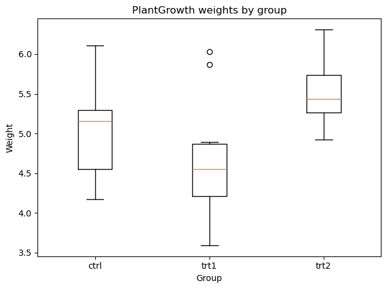

# 일원배치 분산분석 파이프라인

## 개요

이 페이지는 모형 적합부터 사후검정과 시각화까지 이어지는 완전한 일원배치 분산분석 파이프라인을 보여준다. statsmodels로 분산분석 모형을 적합하고, 쌍별 비교를 위해 Tukey의 HSD를 수행하고, Bonferroni 보정을 적용한 쌍별 Welch $t$-검정을 수행하며, 상자그림으로 요약한다. 전체에 걸쳐 PlantGrowth 자료를 예제로 쓴다.

## 1단계: 일원배치 분산분석 모형 적합

일원배치 분산분석은

$$
H_0: \mu_1 = \mu_2 = \cdots = \mu_k
$$

을 $H_A$(적어도 하나의 $\mu_i$가 다르다)에 대해 검정한다. statsmodels의 수식 인터페이스에서는 요인을 `C()`로 감싸 범주형 변수임을 나타낸다.

<div class="codebox" markdown>

### 예제 1. 1단계 — 모형 적합 { .eg }

```python
import pandas as pd
from statsmodels.formula.api import ols
from statsmodels.stats.anova import anova_lm

url = ('https://raw.githubusercontent.com/vincentarelbundock/'
       'Rdatasets/master/csv/datasets/PlantGrowth.csv')
df = pd.read_csv(url, usecols=[1, 2])

# C()로 감싸지 않으면 group을 숫자처럼 취급해 회귀직선을 적합해 버린다.
# 문자열 열이면 statsmodels가 알아서 범주형으로 보지만, 수준이 0/1/2 같은
# 숫자로 코딩되어 있으면 조용히 틀린 모형이 된다. 습관적으로 감싸는 편이 안전하다.
model = ols('weight ~ C(group)', data=df).fit()
aov = anova_lm(model)
print(aov)
```

출력:

```
            df    sum_sq   mean_sq         F   PR(>F)
C(group)   2.0   3.76634  1.883170  4.846088  0.01591
Residual  27.0  10.49209  0.388596       NaN      NaN
```

분산분석표는 집단 간 제곱합($SSB$), 집단 내 제곱합($SSW$), $F$-통계량, $p$-값을 보고한다. $p < \alpha$이면 $H_0$을 기각한다.

</div>

## 2단계: Tukey HSD 사후검정

분산분석이 기각되면 Tukey의 정직유의차가 가족단위 오류율을 통제하면서 어느 쌍이 다른지 찾아낸다. 집단당 관측값이 $n$개인 균형 설계에서는

$$
\text{HSD} = q_{\alpha,\, k,\, N-k}\; \sqrt{\frac{MSW}{n}}
$$

이다.

<div class="codebox" markdown>

### 예제 2. 2단계 — Tukey HSD { .eg }

```python
from statsmodels.stats.multicomp import pairwise_tukeyhsd

# 분산분석이 유의했으니 이제 어느 쌍이 다른지를 본다. reject 열이 True 인
# 쌍이 유의한 쌍이고, 신뢰구간이 0 을 품지 않는 쌍과 정확히 일치한다.
tukey = pairwise_tukeyhsd(endog=df['weight'], groups=df['group'], alpha=0.05)
print(tukey)
```

출력:

```
Multiple Comparison of Means - Tukey HSD, FWER=0.05
===================================================
group1 group2 meandiff p-adj   lower  upper  reject
---------------------------------------------------
  ctrl   trt1   -0.371 0.3909 -1.0622 0.3202  False
  ctrl   trt2    0.494  0.198 -0.1972 1.1852  False
  trt1   trt2    0.865  0.012  0.1738 1.5562   True
---------------------------------------------------
```

세 비교 중 trt1 대 trt2 하나만 유의하다. 대조군은 두 처리 어느 쪽과도 유의하게 다르지 않다. 두 처리가 대조군을 사이에 두고 반대 방향으로 벌어져 있어서, 서로 간의 차이(0.865)가 각각과 대조군의 차이(0.371, 0.494)보다 크기 때문이다.

`reject` 열은 신뢰구간이 0을 담는지와 정확히 맞물린다. trt1 대 trt2의 구간 $(0.174, 1.556)$만 0을 담지 않는다.

</div>

## 3단계: Bonferroni 보정을 적용한 쌍별 Welch t-검정

집단 사이의 분산이 다를 수 있으면 등분산을 가정하지 않는 Welch $t$-검정을 쓴다. Bonferroni 보정은 각 보정 전 $p$-값에 $m = \binom{k}{2}$를 곱한다:

$$
p_{\text{adj}} = \min\!\bigl(m \cdot p_{\text{raw}},\; 1\bigr)
$$

<div class="codebox" markdown>

### 예제 3. 3단계 — 본페로니 보정 쌍별 비교 { .eg }

```python
from itertools import combinations
from scipy.stats import ttest_ind
from statsmodels.stats.multitest import multipletests

groups = df['group'].unique()
p_raw, labels = [], []
for g1, g2 in combinations(groups, 2):
    x = df.loc[df['group'] == g1, 'weight'].values
    y = df.loc[df['group'] == g2, 'weight'].values
    stat, p = ttest_ind(x, y, equal_var=False)
    p_raw.append(p)
    labels.append(f"{g1} vs {g2}")

# Bonferroni는 문턱을 낮추는 대신 p-값에 m을 곱해 돌려준다.
# 그래서 보정 후에도 비교 대상은 여전히 alpha다.
_, p_bonf, _, _ = multipletests(p_raw, alpha=0.05, method='bonferroni')
for lbl, p, pb in zip(labels, p_raw, p_bonf):
    print(f"{lbl:<12}  p = {p:.4f}   p_bonf = {pb:.4f}")
```

출력:

```
ctrl vs trt1  p = 0.2504   p_bonf = 0.7511
ctrl vs trt2  p = 0.0479   p_bonf = 0.1437
trt1 vs trt2  p = 0.0093   p_bonf = 0.0279
```

Tukey와 결론은 같지만(trt1 대 trt2만 유의) 보정 p-값은 0.0279로 Tukey의 0.012보다 크다. Bonferroni가 더 보수적이기 때문이다.

ctrl 대 trt2를 보라. 보정 전 $p = 0.0479$로 유의했던 것이 보정 후 0.1437이 된다. 비교를 세 번 한다는 사실이 이만큼의 대가를 요구한다.

</div>

## 4단계: 시각화

상자그림은 집단 분포를 빠르게 시각적으로 비교하게 해 준다.

<div class="codebox" markdown>

### 예제 4. 4단계 — 상자그림 { .eg }

```python
import matplotlib.pyplot as plt

# 상자그림으로 마무리한다. 검정 결과와 그림이 같은 이야기를 하는지 확인하는
# 것이 마지막 단계다. 순서를 못박아 두어야 그림이 자료 순서에 휘둘리지 않는다.
order = ['ctrl', 'trt1', 'trt2']
data = [df.loc[df['group'] == g, 'weight'].values for g in order]
plt.boxplot(data, labels=order)
plt.xlabel('Group')
plt.ylabel('Weight')
plt.title('PlantGrowth weights by group')
plt.tight_layout()
plt.show()
```



trt1의 상자가 가장 낮고 넓으며, trt2가 가장 높고 좁다. 두 상자가 겹치는 부분이 거의 없다는 것이 Tukey 검정이 이 쌍만 잡아낸 이유다. ctrl의 상자는 두 처리 사이에 걸쳐 있어 어느 쪽과도 뚜렷이 갈리지 않는다.

</div>

## 해석

- **분산분석 $F$-검정:** $p$-값이 유의하면 적어도 한 처치군이 대조군이나 다른 처치군과 다름을 나타낸다.
- **Tukey HSD:** 동시 신뢰구간을 제공한다. 구간이 0을 포함하지 않는 쌍이 유의하게 다르다.
- **Bonferroni 보정 Welch 검정:** 같은 수의 비교에서 Tukey보다 보수적이지만 등분산을 요구하지 않는다.
- **상자그림:** 각 집단의 중앙값, 사분위범위, 잠재적 이상점을 시각화하여 수치 결과를 뒷받침한다.

## 연습문제

<div class="drillbox" markdown>

**연습문제 1.** <span class="diff easy" title="쉬움"></span>
PlantGrowth 자료에는 ctrl, trt1, trt2 세 집단이 있고 각각 관측값이 10개이다. 분산분석에서 $F = 4.85$, $p = 0.016$을 얻었다. 쌍별 비교는 몇 개가 필요하며 각 검정의 Bonferroni 조정 유의수준은 얼마인가?

</div>

??? success "풀이"
    집단이 $k = 3$개이므로 쌍별 비교는 $\binom{3}{2} = 3$개이다. 개별 검정의 Bonferroni 조정 유의수준은

    $$
    \alpha_{\text{adj}} = \frac{\alpha}{m} = \frac{0.05}{3} \approx 0.0167
    $$

    이다. 각 쌍별 검정은 보정 전 $p$-값이 $0.0167$보다 작아야 유의하다고 선언된다.

<div class="drillbox" markdown>

**연습문제 2.** <span class="diff med" title="중간"></span>
집단 분산이 다를 수 있을 때 분산분석 뒤의 쌍별 비교에서 합동(Student) $t$-검정보다 Welch $t$-검정이 선호되는 이유를 설명하라. 분산이 실제로 같으면 Welch 검정은 어떻게 되는가?

</div>

??? success "풀이"
    합동 $t$-검정은 $\sigma_1^2 = \sigma_2^2$을 가정하고 두 표본을 합동하여 공통 분산을 추정한다. 이 가정이 무너지면 (작은 집단의 분산이 크면) 제1종 오류가 부풀려지거나 (큰 집단의 분산이 크면) 검정력이 떨어질 수 있다.

    Welch $t$-검정은 분산을 따로 추정하고 Satterthwaite 근사로 자유도를 조정한다:

    $$
    \nu = \frac{\left(\frac{s_1^2}{n_1} + \frac{s_2^2}{n_2}\right)^2}{\frac{(s_1^2/n_1)^2}{n_1-1} + \frac{(s_2^2/n_2)^2}{n_2-1}}
    $$

    분산이 실제로 같으면($s_1^2 \approx s_2^2$) Welch 자유도가 $n_1 + n_2 - 2$에 가까워져 Welch 검정이 합동 검정과 거의 같아진다. 유효 자유도가 조금 줄어드는 만큼 검정력을 약간 잃지만, 표본크기가 어느 정도 되면 이 손실은 무시할 만하다.

<div class="drillbox" markdown>

**연습문제 3.** <span class="diff easy" title="쉬움"></span>
집단이 넷인 일원배치 분산분석에서 자유도 $N - k = 76$의 $MSW = 8.5$를 얻었다. Tukey 임계값은 $q_{0.05,4,76} = 3.70$이고 모든 집단의 $n = 20$이다. 유의해지는 데 필요한 최소 평균 차이를 계산하라.

</div>

??? success "풀이"
    Tukey HSD 문턱은

    $$
    \text{HSD} = q_{\alpha,k,N-k} \sqrt{\frac{MSW}{n}} = 3.70 \sqrt{\frac{8.5}{20}} = 3.70 \sqrt{0.425} = 3.70 \times 0.6519 \approx 2.41
    $$

    이다. $|\bar{y}_i - \bar{y}_j| > 2.41$인 집단 평균 쌍은 $\alpha = 0.05$ 수준에서 유의하게 다르다.

<div class="drillbox" markdown>

**연습문제 4.** <span class="diff med" title="중간"></span>
위 파이프라인에서 Tukey HSD와 Bonferroni 보정 Welch $t$-검정이 같은 집단 쌍에 대해 다른 결론을 줄 수 있다. 어떤 조건에서 어느 쪽을 더 신뢰하겠는가? 가정과 검정력의 관점에서 논하라.

</div>

??? success "풀이"
    **Tukey HSD를 신뢰할 때:** (1) 등분산 가정이 성립하고(Levene 검정이 유의하지 않고), (2) 집단 크기가 같거나 거의 같으며, (3) 모든 쌍별 비교가 관심사일 때. Tukey는 전체 쌍 문제를 위해 설계되었으므로 이 상황에서 Bonferroni보다 검정력이 높다.

    **Bonferroni 보정 Welch 검정을 신뢰할 때:** (1) 집단 분산이 다르거나, (2) 표본크기가 불균형하거나, (3) 비교의 일부만 계획했을 때. Welch 검정은 등분산을 가정하지 않으므로 등분산성이 어긋날 때 더 믿을 만하다.

    일반적으로 두 방법이 일치하면 결론이 로버스트하다. 불일치할 때에는 대개 경계선에 있는 비교가 문제이다. 이런 경우 진단 그림(상자그림, 분산비)을 확인하여 어느 쪽 가정이 더 옹호 가능한지 판단하면 도움이 된다.

<div class="drillbox" markdown>

**연습문제 5.** <span class="diff med" title="중간"></span>
균형 잡힌 일원배치 분산분석($n_1 = n_2 = \cdots = n_k = n$)에서 $F$-통계량이

$$
F = \frac{n \sum_{i=1}^{k}(\bar{y}_{i\cdot} - \bar{y}_{\cdot\cdot})^2 / (k-1)}{\sum_{i=1}^{k}\sum_{j=1}^{n}(y_{ij} - \bar{y}_{i\cdot})^2 / (kn - k)}
$$

로 쓰일 수 있음을 증명하고, 집단 평균이 변하지 않아도 $n$이 커지면 검정력이 커지는 이유를 설명하라.

</div>

??? success "풀이"
    **유도.** 집단당 관측값이 $n$개인 균형 설계에서 $N = kn$이다. 집단 간 제곱합은

    $$
    SSB = \sum_{i=1}^{k} n(\bar{y}_{i\cdot} - \bar{y}_{\cdot\cdot})^2 = n \sum_{i=1}^{k}(\bar{y}_{i\cdot} - \bar{y}_{\cdot\cdot})^2
    $$

    이다. 집단 내 제곱합은 $SSW = \sum_{i=1}^{k}\sum_{j=1}^{n}(y_{ij} - \bar{y}_{i\cdot})^2$이다. 평균제곱은 $MSB = SSB/(k-1)$, $MSW = SSW/(kn - k)$이고 $F$-통계량은 $F = MSB/MSW$이므로 주어진 식이 나온다.

    **$n$이 커지면 검정력이 커지는 이유:** $n$이 커지면 큰 수의 법칙에 의해 각 집단 평균 $\bar{y}_{i\cdot}$가 모평균 $\mu_i$로 수렴하므로 $\sum(\bar{y}_{i\cdot} - \bar{y}_{\cdot\cdot})^2$이 $\sum(\mu_i - \bar{\mu})^2$ 근처에서 안정된다. 따라서 분자 $MSB$는 $n$에 비례해 커진다. 한편 $MSW$는 $n$과 무관하게 $\sigma^2$으로 수렴한다. 그러므로 $F \approx n \sum(\mu_i - \bar{\mu})^2 / [(k-1)\sigma^2]$이 $n$과 함께 커지고, 대립가설이 참일 때 $H_0$을 기각할 가능성이 점점 높아진다. $\square$

---

## 정리하며

적합부터 사후검정, 시각화까지 **한 흐름**으로 이었다.

- **네 단계다.** 모형 적합 → $F$-검정 → 사후 쌍별 비교 → 그림. **$F$ 검정만으로 끝나는 분석은 거의 없다.**
- **`statsmodels` 의 수식 인터페이스에서 `C()` 를 빠뜨리면 안 된다.** 집단 이름이 숫자면 연속변수로 읽혀 전혀 다른 모형이 적합된다. **조용히 잘못된 결과가 나오는 대표적인 실수다.**
- **투키 HSD 와 본페로니 보정 웰치 $t$ 는 다른 도구다.** 앞의 것은 등분산을 가정하고 모든 쌍을 한꺼번에 다루며, 뒤의 것은 등분산을 가정하지 않는 대신 보수적이다.
- **상자그림이 결론을 눈으로 확인해 준다.** 유의한 차이가 나왔는데 그림에서 상자들이 크게 겹친다면 효과가 작다는 뜻이며, 그때는 효과크기를 함께 보아야 한다.
- **PlantGrowth 처럼 익숙한 자료로 파이프라인을 익혀 두면** 자신의 자료에 옮기기 쉽다.

다음 절 **scipy를 이용한 일원배치 분산분석과 그림**으로 넘어간다.
