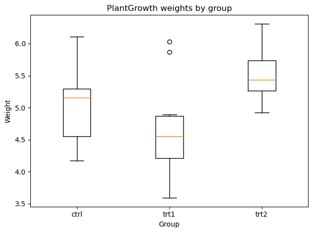

# 일원배치 분산분석 파이프라인

## 개요

이 페이지는 모형 적합부터 사후검정과 시각화까지 이어지는 완전한 일원배치 분산분석 파이프라인을 보여준다. statsmodels로 분산분석 모형을 적합하고, 쌍별 비교를 위해 Tukey의 HSD를 수행하고, Bonferroni 보정을 적용한 쌍별 Welch $t$-검정을 수행하며, 상자그림으로 요약한다. 전체에 걸쳐 PlantGrowth 자료를 보기로 쓴다.

## 1단계: 일원배치 분산분석 모형 적합

일원배치 분산분석은

$$
H_0: \mu_1 = \mu_2 = \cdots = \mu_k
$$

을 $H_A$(적어도 하나의 $\mu_i$가 다르다)에 대해 검정한다. statsmodels의 수식 인터페이스에서는 요인을 `C()`로 감싸 범주형 변수임을 나타낸다.

<div class="exbox" markdown>

**보기 1.** <span class="diff easy" title="쉬움"></span> 1단계 — 분산분석은 회귀다. `ols('weight ~ C(group)')` 는 회귀모형을 적합하는데 그 결과가 분산분석표로 나온다.

**(1)** 처리코딩(`C()` 의 기본값)에서 적합된 계수가

$$
\hat\beta_0 = \bar y_{\text{ctrl}},
\qquad
\hat\beta_1 = \bar y_{\text{trt1}} - \bar y_{\text{ctrl}},
\qquad
\hat\beta_2 = \bar y_{\text{trt2}} - \bar y_{\text{ctrl}}
$$

임을 보이고, 설계행렬의 계수(rank)가 $k = 3$ 이므로 잔차 자유도가 $N - k = 27$ 임을 설명하시오. 또 $R^2 = SSB/SST$ 임을 밝히시오.

**(2)** 계수와 자유도를 수치로 확인하고, **`C()` 를 빠뜨려 수준이 $0,1,2$ 로 코딩된 열을 그대로 넣으면** 무엇이 달라지는지 보이시오.

</div>

??? success "풀이"

    **(1) 해석적으로.** 처리코딩의 설계행렬은 열이 셋이다. 모두 $1$ 인 열, trt1 이면 $1$ 인 지시열, trt2 이면 $1$ 인 지시열. 그러면 적합값이

    $$
    \hat y_{ij} = \beta_0 + \beta_1 \mathbf 1\{i = \text{trt1}\} + \beta_2 \mathbf 1\{i = \text{trt2}\}
    $$

    인데, 이 모형은 **집단마다 자유로운 상수 하나**를 주는 것과 같다. 집단 $i$ 의 적합값은 $\mu_i$ 라는 하나의 수이고, 제곱오차

    $$
    \sum_{i}\sum_j (y_{ij} - \mu_i)^2
    $$

    를 $\mu_i$ 에 대해 따로따로 최소화하면 $\hat\mu_i = \bar y_{i\cdot}$ 이다(제곱합의 최소점은 평균이다). 이제 모수로 되돌리면

    $$
    \hat\beta_0 = \hat\mu_{\text{ctrl}} = \bar y_{\text{ctrl}},
    \qquad
    \hat\beta_1 = \hat\mu_{\text{trt1}} - \hat\mu_{\text{ctrl}},
    \qquad
    \hat\beta_2 = \hat\mu_{\text{trt2}} - \hat\mu_{\text{ctrl}}
    $$

    이다. **절편은 기준집단의 평균이고 나머지는 기준집단과의 차이다.** 기준집단은 알파벳 순 첫 수준인 ctrl 이 자동으로 맡는다.

    설계행렬의 세 열은 선형독립이므로 계수가 $3$ 이고, 사영공간의 차원이 $3$ 이라 잔차공간의 차원은 $N - 3 = 27$ 이다. 이것이 $MSW$ 의 자유도이고 앞 절의 $N-k$ 와 같은 수다.

    $R^2$ 은 정의가 $1 - SSE/SST_{\text{total}}$ 인데 적합값이 집단평균이므로 $SSE = SSW$ 이고 $SST_{\text{total}} - SSW = SSB$ 다. 따라서

    $$
    R^2 = \frac{SSB}{SST_{\text{total}}}
    $$

    로 **분산분석표의 `sum_sq` 두 칸의 비**다.

    **(2) 수치적으로.**

    ```python
    import pandas as pd
    from statsmodels.formula.api import ols
    from statsmodels.stats.anova import anova_lm

    url = ('https://raw.githubusercontent.com/vincentarelbundock/'
           'Rdatasets/master/csv/datasets/PlantGrowth.csv')
    df = pd.read_csv(url, usecols=[1, 2])

    # C()로 감싸지 않으면 group을 숫자처럼 취급해 회귀직선을 적합해 버린다.
    # 문자열 열이면 statsmodels가 알아서 범주형으로 보지만, 수준이 0/1/2 같은
    # 숫자로 코딩되어 있으면 조용히 틀린 모형이 된다. 습관적으로 감싸는 편이 안전하다.
    model = ols('weight ~ C(group)', data=df).fit()
    aov = anova_lm(model)
    print(aov)
    ```

    출력:

    ```
                df    sum_sq   mean_sq         F   PR(>F)
    C(group)   2.0   3.76634  1.883170  4.846088  0.01591
    Residual  27.0  10.49209  0.388596       NaN      NaN
    ```

    분산분석표는 집단 간 제곱합($SSB$), 집단 내 제곱합($SSW$), $F$-통계량, $p$-값을 보고한다. $p < \alpha$이면 $H_0$을 기각한다.

    계수가 정말 집단평균의 차인지, 그리고 `C()` 가 왜 필요한지를 확인한다.

    ```python
    means = df.groupby('group')['weight'].mean()
    print(model.params)
    print(f"\n절편             = ctrl 평균     = {means['ctrl']:.3f}")
    print(f"C(group)[T.trt1] = trt1 - ctrl  = {means['trt1'] - means['ctrl']:.3f}")
    print(f"C(group)[T.trt2] = trt2 - ctrl  = {means['trt2'] - means['ctrl']:.3f}")
    print(f"\nR^2 = SSB/SST = {model.rsquared:.7f}"
          f"   (표에서 {3.76634 / (3.76634 + 10.49209):.7f})")
    print(f"모형 자유도 {model.df_model:.0f},  잔차 자유도 {model.df_resid:.0f}")

    # C() 를 빠뜨리면 어떻게 되는가. 수준을 0/1/2 로 코딩한 열을 만들어 넣어 본다.
    df_num = df.assign(gcode=df['group'].map({'ctrl': 0, 'trt1': 1, 'trt2': 2}))
    bad = ols('weight ~ gcode', data=df_num).fit()
    print("\nC() 없이 숫자 코드를 그대로 넣으면")
    print(anova_lm(bad))
    print(f"기울기 = {bad.params['gcode']:.3f}  (집단당 '한 칸'씩 올라가는 직선)")
    ```

    출력:

    ```
    Intercept           5.032
    C(group)[T.trt1]   -0.371
    C(group)[T.trt2]    0.494
    dtype: float64

    절편             = ctrl 평균     = 5.032
    C(group)[T.trt1] = trt1 - ctrl  = -0.371
    C(group)[T.trt2] = trt2 - ctrl  = 0.494

    R^2 = SSB/SST = 0.2641483   (표에서 0.2641483)
    모형 자유도 2,  잔차 자유도 27

    C() 없이 숫자 코드를 그대로 넣으면
                df    sum_sq   mean_sq        F    PR(>F)
    gcode      1.0   1.22018  1.220180  2.62037  0.116711
    Residual  28.0  13.03825  0.465652      NaN       NaN
    기울기 = 0.247  (집단당 '한 칸'씩 올라가는 직선)
    ```

    **(1)이 그대로 확인된다.** 절편 $5.032$ 가 ctrl 의 평균이고, 두 계수 $-0.371$ 과 $0.494$ 가 각각 trt1, trt2 와 ctrl 의 차다. $R^2 = 0.2641483$ 이 분산분석표의 $3.76634/(3.76634+10.49209)$ 와 일곱 자리까지 같다. 자유도도 $2$ 와 $27$ 로 맞는다.

    **`C()` 를 빠뜨리면 결론이 뒤집힌다.** 숫자 코드를 그대로 넣으면 statsmodels 는 그것을 **연속변수**로 보고 기울기 하나짜리 직선을 적합한다. 자유도가 $2$ 에서 $1$ 로 줄고, 집단 간 제곱합이 $3.76634$ 에서 $1.22018$ 로 쪼그라들며(직선 위에 놓인 몫만 세기 때문이다), $p$-값이 $0.0159$ 에서 $0.1167$ 로 올라가 **$\alpha = 0.05$ 에서 기각하지 못하게 된다.**

    왜 작아지는지 보면 이 모형이 무엇을 가정했는지 알 수 있다. 기울기 $0.247$ 짜리 직선은 집단평균이 $5.032 \to 5.279 \to 5.526$ 으로 **일정하게 올라간다**고 말하는데 실제 평균은 $5.032 \to 4.661 \to 5.526$ 으로 내려갔다 올라간다. 가운데 집단의 어긋남이 통째로 잔차로 밀려나 $SSE$ 가 $10.49$ 에서 $13.04$ 로 커졌다. **오류 메시지는 없다.** 조용히 다른 모형이 적합될 뿐이므로, 범주형 요인은 습관적으로 `C()` 로 감싸는 편이 안전하다.

## 2단계: Tukey HSD 사후검정

분산분석이 기각되면 Tukey의 정직유의차가 가족단위 오류율을 통제하면서 어느 쌍이 다른지 찾아낸다. 집단당 관측값이 $n$개인 균형 설계에서는

$$
\text{HSD} = q_{\alpha,\, k,\, N-k}\; \sqrt{\frac{MSW}{n}}
$$

이다.

<div class="exbox" markdown>

**보기 2.** <span class="diff easy" title="쉬움"></span> 2단계 — Tukey 표의 네 열은 모두 한 수에서 나온다. 출력의 `lower`, `upper`, `p-adj`, `reject` 가 서로 어떻게 묶여 있는지 확인한다.

**(1)** 균형 설계에서 Tukey 동시신뢰구간이

$$
(\bar y_i - \bar y_j) \pm \text{HSD},
\qquad
\text{HSD} = q_{\alpha,\,k,\,N-k}\sqrt{\frac{MSW}{n}}
$$

이고 **구간의 반폭이 세 쌍 모두에서 같은 수**임을 지적하시오. 또 `reject` 가 참인 것과 구간이 $0$ 을 품지 않는 것이 **동치**임을 보이고, `p-adj` 가 스튜던트화 범위 분포의 꼬리확률

$$
p_{\text{adj}} = P\!\left(Q_{k,\,N-k} \ge \frac{|\bar y_i - \bar y_j|}{\sqrt{MSW/n}}\right)
$$

임을 적으시오.

**(2)** $\text{HSD}$ 를 계산해 출력의 여섯 경계값을 모두 되살리고, 세 `p-adj` 를 직접 재현하시오.

</div>

??? success "풀이"

    **(1) 해석적으로.** 스튜던트화 범위 $Q_{k,\nu}$ 는 "같은 분포에서 뽑은 $k$ 개 평균의 최대–최소를, 자유도 $\nu$ 의 표준오차추정량으로 나눈 것"이다. 균형 설계에서 각 집단평균의 표준오차가 $\sqrt{MSW/n}$ 으로 **모두 같으므로**

    $$
    P\!\left(\max_{i,j}\frac{|\bar y_i - \bar y_j|}{\sqrt{MSW/n}} \le q_{\alpha,k,\nu}\right) = 1-\alpha
    $$

    이고, 괄호 안의 사건은 **모든 쌍에 대해 동시에**

    $$
    |(\bar y_i - \bar y_j) - (\mu_i - \mu_j)| \le q_{\alpha,k,\nu}\sqrt{\frac{MSW}{n}} = \text{HSD}
    $$

    가 성립한다는 말과 같다(귀무가설 아래). 그러므로 $(\bar y_i - \bar y_j) \pm \text{HSD}$ 가 신뢰수준 $1-\alpha$ 의 **동시**신뢰구간이다. $q$, $MSW$, $n$ 이 모두 쌍에 의존하지 않으므로 **반폭이 세 쌍에서 같은 수**이고, 그래서 Tukey 표의 세 구간은 길이가 같고 중심만 다르다.

    `reject` 와의 동치는 곧바로 따라온다.

    $$
    0 \notin (\bar y_i - \bar y_j \pm \text{HSD})
    \iff |\bar y_i - \bar y_j| > \text{HSD}
    \iff \frac{|\bar y_i - \bar y_j|}{\sqrt{MSW/n}} > q_{\alpha,k,\nu}
    $$

    이고 마지막 식은 관측된 스튜던트화 범위통계량이 임계값을 넘는다는 뜻이다. 그 통계량의 꼬리확률이 바로 `p-adj` 이므로 "`p-adj` $< \alpha$", "구간이 $0$ 을 품지 않음", "`reject = True`" 세 가지가 **같은 하나의 부등식**이다.

    **(2) 수치적으로.**

    ```python
    from statsmodels.stats.multicomp import pairwise_tukeyhsd

    # 분산분석이 유의했으니 이제 어느 쌍이 다른지를 본다. reject 열이 True 인
    # 쌍이 유의한 쌍이고, 신뢰구간이 0 을 품지 않는 쌍과 정확히 일치한다.
    tukey = pairwise_tukeyhsd(endog=df['weight'], groups=df['group'], alpha=0.05)
    print(tukey)
    ```

    출력:

    ```
    Multiple Comparison of Means - Tukey HSD, FWER=0.05
    ===================================================
    group1 group2 meandiff p-adj   lower  upper  reject
    ---------------------------------------------------
      ctrl   trt1   -0.371 0.3909 -1.0622 0.3202  False
      ctrl   trt2    0.494  0.198 -0.1972 1.1852  False
      trt1   trt2    0.865  0.012  0.1738 1.5562   True
    ---------------------------------------------------
    ```

    세 비교 중 trt1 대 trt2 하나만 유의하다. 대조군은 두 처리 어느 쪽과도 유의하게 다르지 않다. 두 처리가 대조군을 사이에 두고 반대 방향으로 벌어져 있어서, 서로 간의 차이(0.865)가 각각과 대조군의 차이(0.371, 0.494)보다 크기 때문이다.

    `reject` 열은 신뢰구간이 0을 담는지와 정확히 맞물린다. trt1 대 trt2의 구간 $(0.174, 1.556)$만 0을 담지 않는다. 이 표를 통째로 손으로 되살려 본다.

    ```python
    import numpy as np
    from scipy import stats

    MSW, n, k, nu = 0.388596, 10, 3, 27
    q_crit = stats.studentized_range.ppf(0.95, k, nu)
    HSD = q_crit * np.sqrt(MSW / n)
    print(f"q(0.05, 3, 27) = {q_crit:.4f}")
    print(f"HSD = q * sqrt(MSW/n) = {HSD:.4f}   (세 쌍 공통)")

    means = df.groupby('group')['weight'].mean()
    print(f"\n{'pair':<12}{'diff':>8}{'lower':>9}{'upper':>8}{'q_obs':>8}{'p-adj':>8}{'reject':>8}")
    for g1, g2 in [('ctrl', 'trt1'), ('ctrl', 'trt2'), ('trt1', 'trt2')]:
        d = means[g2] - means[g1]
        q_obs = abs(d) / np.sqrt(MSW / n)
        p_adj = stats.studentized_range.sf(q_obs, k, nu)
        print(f"{g1 + ' vs ' + g2:<12}{d:>8.3f}{d - HSD:>9.4f}{d + HSD:>8.4f}"
              f"{q_obs:>8.4f}{p_adj:>8.4f}{str(abs(d) > HSD):>8}")
    ```

    출력:

    ```
    q(0.05, 3, 27) = 3.5064
    HSD = q * sqrt(MSW/n) = 0.6912   (세 쌍 공통)

    pair            diff    lower   upper   q_obs   p-adj  reject
    ctrl vs trt1  -0.371  -1.0622  0.3202  1.8820  0.3909   False
    ctrl vs trt2   0.494  -0.1972  1.1852  2.5060  0.1980   False
    trt1 vs trt2   0.865   0.1738  1.5562  4.3880  0.0120    True
    ```

    **표가 통째로 되살아난다.** 여섯 경계값이 `pairwise_tukeyhsd` 의 출력과 소수 넷째 자리까지 같고, 세 `p-adj` 도 $0.3909$, $0.1980$, $0.0120$ 으로 같다. 쓰인 것은 $q_{0.05,3,27} = 3.5064$ 와 $MSW = 0.388596$ 둘뿐이다.

    **반폭이 하나의 수다.** $\text{HSD} = 0.6912$ 가 세 쌍 모두에 쓰였고, 실제로 출력의 `upper - lower` 가 세 줄 모두 $1.3824 = 2\times0.6912$ 다. 그러므로 **Tukey 의 판정은 "차이의 절댓값이 $0.6912$ 를 넘는가" 하나로 끝난다.** $|{-0.371}| < 0.6912$, $|0.494| < 0.6912$, $|0.865| > 0.6912$ 로 셋째 쌍만 넘는다.

    주의할 것은 이 단순함이 **균형 설계에서만** 성립한다는 점이다. $n_i$ 가 다르면 표준오차 $\sqrt{\frac{MSW}{2}\left(\frac{1}{n_i}+\frac{1}{n_j}\right)}$ 가 쌍마다 달라져 구간 길이도 달라지고, statsmodels 는 그때 Tukey–Kramer 변형을 쓴다.

## 3단계: Bonferroni 보정을 적용한 쌍별 Welch t-검정

집단 사이의 분산이 다를 수 있으면 등분산을 가정하지 않는 Welch $t$-검정을 쓴다. Bonferroni 보정은 각 보정 전 $p$-값에 $m = \binom{k}{2}$를 곱한다:

$$
p_{\text{adj}} = \min\!\bigl(m \cdot p_{\text{raw}},\; 1\bigr)
$$

<div class="exbox" markdown>

**보기 3.** <span class="diff easy" title="쉬움"></span> 3단계 — 본페로니가 Tukey 보다 보수적인가. 이 단계는 Tukey 와 **두 가지**가 다르다. 다중성 보정 방법도 다르고(본페로니 대 스튜던트화 범위), 분산을 다루는 방법도 다르다(쌍별 Welch 대 합동 $MSW$).

**(1)** 본페로니 보정이 FWER 을 $\alpha$ 이하로 지킴을 **합집합 상계**로 보이시오. 또 합동분산을 쓰는 두 방법의 문턱을 같은 자에 올리면 그 비가

$$
\frac{\text{Bonferroni 문턱}}{\text{Tukey 문턱}}
= \frac{\sqrt2\, t_{1-\alpha/(2m),\,\nu}}{q_{\alpha,\,k,\,\nu}}
$$

임을 보이고, $k = 3$, $m = 3$, $\nu = 27$ 에서 이 값을 구하시오.

**(2)** 두 차이를 **하나씩** 떼어 내시오. 곧 합동분산 $t$-검정에 본페로니를 걸어 Tukey 와 견주고, 다시 Welch 와 견주시오. 어느 쌍에서 Welch 가 오히려 더 작은 $p$-값을 주는가. 그 까닭은 무엇인가.

</div>

??? success "풀이"

    **(1) 해석적으로.** 비교가 $m$ 개이고 각각의 귀무가설을 $H_{0}^{(1)},\dots,H_{0}^{(m)}$ 이라 하자. 모두 참일 때 $i$ 번째를 수준 $\alpha/m$ 에서 기각할 확률은 $\alpha/m$ 이하다. 합집합 상계로

    $$
    \text{FWER} = P\!\left(\bigcup_{i=1}^{m}\{\text{$i$ 번째를 기각}\}\right)
    \le \sum_{i=1}^{m} P(\text{$i$ 번째를 기각})
    \le m \cdot \frac{\alpha}{m} = \alpha
    $$

    이다. 검정통계량들이 **서로 어떻게 얽혀 있든** 성립한다는 것이 이 상계의 장점이자 보수성의 출처다. 실제로 쌍별 비교는 같은 집단평균을 공유하므로 강하게 상관되어 있고, 그만큼 합집합 상계가 느슨해진다. 수준 $\alpha/m$ 으로 검정하는 것과 $p$-값에 $m$ 을 곱해 $\alpha$ 와 견주는 것은 같은 일이다.

    **문턱의 비.** 합동분산을 쓰면 본페로니는

    $$
    |\bar y_i - \bar y_j| > t_{1-\alpha/(2m),\,\nu}\sqrt{MSW\left(\tfrac1n+\tfrac1n\right)}
    = t_{1-\alpha/(2m),\,\nu}\,\sqrt2\,\sqrt{\frac{MSW}{n}}
    $$

    일 때 기각하고, Tukey 는 $q_{\alpha,k,\nu}\sqrt{MSW/n}$ 을 넘을 때 기각한다. $\sqrt{MSW/n}$ 이 약분되어

    $$
    \frac{\text{Bonferroni}}{\text{Tukey}} = \frac{\sqrt2\,t_{1-\alpha/(2m),\nu}}{q_{\alpha,k,\nu}}
    $$

    가 남는다. **$MSW$ 와 $n$ 에 의존하지 않는 순수한 분위수의 비**다. $k=3$ 이면 $m=3$ 이고, 아래에서 재 보면 $1.029$ 로 본페로니 쪽이 $3\%$ 높다. 집단이 많아질수록 $m = \binom k2$ 가 제곱으로 늘어 이 비가 커진다.

    **(2) 수치적으로.**

    ```python
    from itertools import combinations
    from scipy.stats import ttest_ind
    from statsmodels.stats.multitest import multipletests

    groups = df['group'].unique()
    p_raw, labels = [], []
    for g1, g2 in combinations(groups, 2):
        x = df.loc[df['group'] == g1, 'weight'].values
        y = df.loc[df['group'] == g2, 'weight'].values
        stat, p = ttest_ind(x, y, equal_var=False)
        p_raw.append(p)
        labels.append(f"{g1} vs {g2}")

    # Bonferroni는 문턱을 낮추는 대신 p-값에 m을 곱해 돌려준다.
    # 그래서 보정 후에도 비교 대상은 여전히 alpha다.
    _, p_bonf, _, _ = multipletests(p_raw, alpha=0.05, method='bonferroni')
    for lbl, p, pb in zip(labels, p_raw, p_bonf):
        print(f"{lbl:<12}  p = {p:.4f}   p_bonf = {pb:.4f}")
    ```

    출력:

    ```
    ctrl vs trt1  p = 0.2504   p_bonf = 0.7511
    ctrl vs trt2  p = 0.0479   p_bonf = 0.1437
    trt1 vs trt2  p = 0.0093   p_bonf = 0.0279
    ```

    Tukey와 결론은 같지만(trt1 대 trt2만 유의) 보정 p-값은 0.0279로 Tukey의 0.012보다 크다. Bonferroni가 더 보수적이기 때문이다.

    ctrl 대 trt2를 보라. 보정 전 $p = 0.0479$로 유의했던 것이 보정 후 0.1437이 된다. 비교를 세 번 한다는 사실이 이만큼의 대가를 요구한다.

    이제 두 차이를 하나씩 떼어 본다.

    ```python
    MSW, n, k, nu, m = 0.388596, 10, 3, 27, 3

    # 본페로니와 Tukey 의 문턱을 같은 자에 올려 견준다 (둘 다 합동분산 기준).
    t_b = stats.t.ppf(1 - 0.05 / (2 * m), nu)
    thr_bonf = t_b * np.sqrt(2 * MSW / n)
    q_crit = stats.studentized_range.ppf(0.95, k, nu)
    thr_tukey = q_crit * np.sqrt(MSW / n)
    print(f"본페로니 문턱 = {t_b:.4f} * {np.sqrt(2 * MSW / n):.4f} = {thr_bonf:.4f}")
    print(f"Tukey  문턱   = {q_crit:.4f} * {np.sqrt(MSW / n):.4f} = {thr_tukey:.4f}")
    print(f"비 = {thr_bonf / thr_tukey:.5f}   (= sqrt(2) t / q = {np.sqrt(2) * t_b / q_crit:.5f})")

    # 합동분산 t 로 본페로니를 다시 하면 Welch 와 얼마나 다른가.
    print(f"\n{'pair':<14}{'Welch p':>10}{'Welch bonf':>12}"
          f"{'pooled p':>10}{'pooled bonf':>13}{'Tukey adj':>11}")
    means = df.groupby('group')['weight'].mean()
    for g1, g2 in combinations(['ctrl', 'trt1', 'trt2'], 2):
        x = df.loc[df['group'] == g1, 'weight'].values
        y = df.loc[df['group'] == g2, 'weight'].values
        p_w = stats.ttest_ind(x, y, equal_var=False).pvalue
        d = means[g2] - means[g1]
        t_pool = d / np.sqrt(2 * MSW / n)
        p_pool = 2 * stats.t.sf(abs(t_pool), nu)
        p_tuk = stats.studentized_range.sf(abs(d) / np.sqrt(MSW / n), k, nu)
        print(f"{g1 + ' vs ' + g2:<14}{p_w:>10.4f}{min(m * p_w, 1):>12.4f}"
              f"{p_pool:>10.4f}{min(m * p_pool, 1):>13.4f}{p_tuk:>11.4f}")
    ```

    출력:

    ```
    본페로니 문턱 = 2.5525 * 0.2788 = 0.7116
    Tukey  문턱   = 3.5064 * 0.1971 = 0.6912
    비 = 1.02946   (= sqrt(2) t / q = 1.02946)

    pair             Welch p  Welch bonf  pooled p  pooled bonf  Tukey adj
    ctrl vs trt1      0.2504      0.7511    0.1944       0.5832     0.3909
    ctrl vs trt2      0.0479      0.1437    0.0877       0.2630     0.1980
    trt1 vs trt2      0.0093      0.0279    0.0045       0.0134     0.0120
    ```

    **(1)의 비가 맞는다.** 두 문턱의 비 $1.02946$ 이 $\sqrt2\,t/q$ 와 다섯 자리까지 같다. 분산을 같은 방식으로 다루면 **본페로니가 Tukey 보다 정확히 $2.9\%$ 보수적**이고, `pooled bonf` 열의 $0.0134$ 가 `Tukey adj` 의 $0.0120$ 보다 큰 것이 그 결과다. 세 집단에서는 차이가 이 정도로 작다.

    **그런데 표의 `Welch bonf` 는 더 큰 $0.0279$ 다.** 다중성 보정 탓이 아니다. 같은 본페로니인데도 Welch 가 $0.0279$, 합동이 $0.0134$ 이므로, 차이는 **분산을 다루는 방식**에서 왔다. Welch 는 두 집단의 자료만으로 표준오차를 만들어 자유도가 $14$ 언저리로 줄고 임계값이 높아진다. 셋째 집단이 주는 정보를 버린 값이다.

    **그러나 ctrl 대 trt2 에서는 방향이 뒤집힌다.** Welch 가 $p = 0.0479$ 로 합동의 $0.0877$ 보다 **작다.** 까닭은 집단별 표준편차에 있다. ctrl 과 trt2 는 $0.583$ 과 $0.443$ 으로 작은데, 합동 $MSW$ 에는 표준편차 $0.794$ 인 trt1 이 함께 들어가 있어 $\sqrt{MSW} = 0.623$ 으로 부풀려진다. **비교에 끼지도 않은 집단이 표준오차를 키운 것이다.** 자유도를 벌어 오는 대가가 이것이고, 등분산이 깨지면 손해가 이득을 넘어설 수 있다.

    정리하면 이 자료에서 세 절차의 결론은 모두 같다(trt1 대 trt2 만 유의). 다만 이유가 겹겹이다. **방법을 바꿀 때는 무엇이 바뀌는지를 하나씩 떼어 보아야 한다.** 등분산이 미덥지 않다면 보정은 본페로니로 두더라도 쌍별 검정을 Welch 로 바꾸는 쪽이 옳고, 등분산이 믿을 만하다면 Tukey 가 가장 날카롭다.

## 4단계: 시각화

상자그림은 집단 분포를 빠르게 시각적으로 비교하게 해 준다.

<div class="exbox" markdown>

**보기 4.** <span class="diff easy" title="쉬움"></span> 4단계 — "상자가 안 겹치면 유의하다"는 눈대중은 믿을 만한가. 마지막으로 상자그림을 그려 앞의 검정 결과와 같은 이야기를 하는지 확인한다.

**(1)** 세 쌍의 상자가 **겹치는 길이**를 재고 Tukey 의 판정과 나란히 놓으시오. 순서가 맞는가.

**(2)** 그래도 겹침을 판정의 근거로 쓸 수 없는 까닭을 밝히시오. Tukey 가 실제로 보는 것은 무엇인가.

</div>

??? success "풀이"

    유도할 답이 있는 문제가 아니다. **그림이 가리키는 방향과 검정이 쓰는 양이 어떻게 다른지**를 수치로 읽는 것이 이 보기의 전부다.

    ```python
    import matplotlib.pyplot as plt

    # 상자그림으로 마무리한다. 검정 결과와 그림이 같은 이야기를 하는지 확인하는
    # 것이 마지막 단계다. 순서를 못박아 두어야 그림이 자료 순서에 휘둘리지 않는다.
    order = ['ctrl', 'trt1', 'trt2']
    data = [df.loc[df['group'] == g, 'weight'].values for g in order]
    plt.boxplot(data, labels=order)
    plt.xlabel('Group')
    plt.ylabel('Weight')
    plt.title('PlantGrowth weights by group')
    plt.tight_layout()
    plt.show()
    ```

    

    trt1의 상자가 가장 낮고 넓으며, trt2가 가장 높고 좁다. ctrl의 상자는 두 처리 사이에 걸쳐 있어 어느 쪽과도 뚜렷이 갈리지 않는다. 겹침을 실제로 재어 Tukey 와 견준다.

    ```python
    HSD = 0.6912
    box = {g: np.percentile(df.loc[df['group'] == g, 'weight'], [25, 50, 75])
           for g in order}
    means = df.groupby('group')['weight'].mean()
    print(f"{'pair':<14}{'box overlap':>12}{'|diff|':>9}{'HSD':>8}{'Tukey':>8}")
    for g1, g2 in [('ctrl', 'trt1'), ('ctrl', 'trt2'), ('trt1', 'trt2')]:
        lo = max(box[g1][0], box[g2][0])     # 두 상자 아랫변 중 높은 쪽
        hi = min(box[g1][2], box[g2][2])     # 두 상자 윗변 중 낮은 쪽
        overlap = max(hi - lo, 0.0)
        d = abs(means[g2] - means[g1])
        print(f"{g1 + ' vs ' + g2:<14}{overlap:>12.3f}{d:>9.3f}{HSD:>8.4f}"
              f"{str(d > HSD):>8}")
    ```

    출력:

    ```
    pair           box overlap   |diff|     HSD   Tukey
    ctrl vs trt1         0.320    0.371  0.6912   False
    ctrl vs trt2         0.025    0.494  0.6912   False
    trt1 vs trt2         0.000    0.865  0.6912    True
    ```

    **(1) 순서는 맞는다.** 겹침이 $0.320 \to 0.025 \to 0.000$ 으로 줄어드는 순서가 차이 $0.371 \to 0.494 \to 0.865$ 가 커지는 순서와 일치하고, 유일하게 겹침이 **정확히 $0$** 인 trt1–trt2 가 Tukey 가 잡은 쌍이다. 그림과 검정이 같은 이야기를 한다.

    **(2) 그래도 겹침을 근거로 쓸 수는 없다.** ctrl 과 trt2 는 겹침이 $0.025$ 로 **거의 $0$ 인데도 유의하지 않다.** 겹침이 $0$ 이 되는 자리와 $\text{HSD}$ 를 넘는 자리가 서로 다르기 때문이다.

    - 상자의 경계는 **사분위수**이고 겹침은 $Q_3^{(i)} - Q_1^{(j)}$ 같은 양이다. 표본크기와 무관하다.
    - Tukey 가 보는 것은 **평균의 차** $|\bar y_i - \bar y_j|$ 와 $\text{HSD} = q\sqrt{MSW/n}$ 의 비교다. $\text{HSD}$ 에는 $n$ 이 분모로, 집단 수 $k$ 가 $q$ 를 통해 들어 있다.

    그래서 $n$ 을 네 배로 늘리면 $\text{HSD}$ 가 절반이 되어 같은 그림에서도 판정이 바뀐다. **상자그림은 $n$ 을 전혀 보여 주지 않으므로, 겹침만 보고 유의성을 말하면 표본크기를 통째로 무시하는 셈이다.** 반대 방향의 실수도 흔하다. $n$ 이 아주 크면 상자가 많이 겹쳐도 평균 차가 유의해진다.

    겹침을 보고 싶다면 상자가 아니라 **평균의 신뢰구간**을 그려야 하고, 그마저도 두 구간의 겹침과 차의 유의성은 다른 물음이다. 이 쪽에서는 보기 2의 Tukey 동시신뢰구간이 바로 그 올바른 그림이다. 상자그림의 몫은 판정이 아니라 **분포의 모양과 이상점을 눈으로 훑는 것**이다(같은 자료를 상자그림으로 읽는 다른 각도는 [scipy를 이용한 일원배치 분산분석](oneway_scipy.md)의 보기 3에 있다).

## 해석

- **분산분석 $F$-검정:** $p$-값이 유의하면 적어도 한 처치군이 대조군이나 다른 처치군과 다름을 나타낸다.
- **Tukey HSD:** 동시 신뢰구간을 제공한다. 구간이 0을 포함하지 않는 쌍이 유의하게 다르다.
- **Bonferroni 보정 Welch 검정:** 같은 수의 비교에서 Tukey보다 보수적이지만 등분산을 요구하지 않는다.
- **상자그림:** 각 집단의 중앙값, 사분위범위, 잠재적 이상점을 시각화하여 수치 결과를 뒷받침한다.

## 연습문제

<div class="drillbox" markdown>

**연습문제 1.** <span class="diff easy" title="쉬움"></span>
PlantGrowth 자료에는 ctrl, trt1, trt2 세 집단이 있고 각각 관측값이 10개이다. 분산분석에서 $F = 4.85$, $p = 0.016$을 얻었다. 쌍별 비교는 몇 개가 필요하며 각 검정의 Bonferroni 조정 유의수준은 얼마인가?

</div>

??? success "풀이"
    집단이 $k = 3$개이므로 쌍별 비교는 $\binom{3}{2} = 3$개이다. 개별 검정의 Bonferroni 조정 유의수준은

    $$
    \alpha_{\text{adj}} = \frac{\alpha}{m} = \frac{0.05}{3} \approx 0.0167
    $$

    이다. 각 쌍별 검정은 보정 전 $p$-값이 $0.0167$보다 작아야 유의하다고 선언된다.

<div class="drillbox" markdown>

**연습문제 2.** <span class="diff med" title="중간"></span>
집단 분산이 다를 수 있을 때 분산분석 뒤의 쌍별 비교에서 합동(스튜던트) $t$-검정보다 Welch $t$-검정이 선호되는 이유를 설명하라. 분산이 실제로 같으면 Welch 검정은 어떻게 되는가?

</div>

??? success "풀이"
    합동 $t$-검정은 $\sigma_1^2 = \sigma_2^2$을 가정하고 두 표본을 합동하여 공통 분산을 추정한다. 이 가정이 무너지면 (작은 집단의 분산이 크면) 제1종 오류가 부풀려지거나 (큰 집단의 분산이 크면) 검정력이 떨어질 수 있다.

    Welch $t$-검정은 분산을 따로 추정하고 Satterthwaite 근사로 자유도를 조정한다:

    $$
    \nu = \frac{\left(\frac{s_1^2}{n_1} + \frac{s_2^2}{n_2}\right)^2}{\frac{(s_1^2/n_1)^2}{n_1-1} + \frac{(s_2^2/n_2)^2}{n_2-1}}
    $$

    분산이 실제로 같으면($s_1^2 \approx s_2^2$) Welch 자유도가 $n_1 + n_2 - 2$에 가까워져 Welch 검정이 합동 검정과 거의 같아진다. 유효 자유도가 조금 줄어드는 만큼 검정력을 약간 잃지만, 표본크기가 어느 정도 되면 이 손실은 무시할 만하다.

<div class="drillbox" markdown>

**연습문제 3.** <span class="diff easy" title="쉬움"></span>
집단이 넷인 일원배치 분산분석에서 자유도 $N - k = 76$의 $MSW = 8.5$를 얻었다. Tukey 임계값은 $q_{0.05,4,76} = 3.70$이고 모든 집단의 $n = 20$이다. 유의해지는 데 필요한 최소 평균 차이를 계산하라.

</div>

??? success "풀이"
    Tukey HSD 문턱은

    $$
    \text{HSD} = q_{\alpha,k,N-k} \sqrt{\frac{MSW}{n}} = 3.70 \sqrt{\frac{8.5}{20}} = 3.70 \sqrt{0.425} = 3.70 \times 0.6519 \approx 2.41
    $$

    이다. $|\bar{y}_i - \bar{y}_j| > 2.41$인 집단 평균 쌍은 $\alpha = 0.05$ 수준에서 유의하게 다르다.

<div class="drillbox" markdown>

**연습문제 4.** <span class="diff med" title="중간"></span>
위 파이프라인에서 Tukey HSD와 Bonferroni 보정 Welch $t$-검정이 같은 집단 쌍에 대해 다른 결론을 줄 수 있다. 어떤 조건에서 어느 쪽을 더 신뢰하겠는가? 가정과 검정력의 관점에서 논하라.

</div>

??? success "풀이"
    **Tukey HSD를 신뢰할 때:** (1) 등분산 가정이 성립하고(Levene 검정이 유의하지 않고), (2) 집단 크기가 같거나 거의 같으며, (3) 모든 쌍별 비교가 관심사일 때. Tukey는 전체 쌍 문제를 위해 설계되었으므로 이 상황에서 Bonferroni보다 검정력이 높다.

    **Bonferroni 보정 Welch 검정을 신뢰할 때:** (1) 집단 분산이 다르거나, (2) 표본크기가 불균형하거나, (3) 비교의 일부만 계획했을 때. Welch 검정은 등분산을 가정하지 않으므로 등분산성이 어긋날 때 더 믿을 만하다.

    일반적으로 두 방법이 일치하면 결론이 로버스트하다. 불일치할 때에는 대개 경계선에 있는 비교가 문제이다. 이런 경우 진단 그림(상자그림, 분산비)을 확인하여 어느 쪽 가정이 더 옹호 가능한지 판단하면 도움이 된다.

<div class="drillbox" markdown>

**연습문제 5.** <span class="diff med" title="중간"></span>
균형 잡힌 일원배치 분산분석($n_1 = n_2 = \cdots = n_k = n$)에서 $F$-통계량이

$$
F = \frac{n \sum_{i=1}^{k}(\bar{y}_{i\cdot} - \bar{y}_{\cdot\cdot})^2 / (k-1)}{\sum_{i=1}^{k}\sum_{j=1}^{n}(y_{ij} - \bar{y}_{i\cdot})^2 / (kn - k)}
$$

로 쓰일 수 있음을 증명하고, 집단 평균이 변하지 않아도 $n$이 커지면 검정력이 커지는 이유를 설명하라.

</div>

??? success "풀이"
    **유도.** 집단당 관측값이 $n$개인 균형 설계에서 $N = kn$이다. 집단 간 제곱합은

    $$
    SSB = \sum_{i=1}^{k} n(\bar{y}_{i\cdot} - \bar{y}_{\cdot\cdot})^2 = n \sum_{i=1}^{k}(\bar{y}_{i\cdot} - \bar{y}_{\cdot\cdot})^2
    $$

    이다. 집단 내 제곱합은 $SSW = \sum_{i=1}^{k}\sum_{j=1}^{n}(y_{ij} - \bar{y}_{i\cdot})^2$이다. 평균제곱은 $MSB = SSB/(k-1)$, $MSW = SSW/(kn - k)$이고 $F$-통계량은 $F = MSB/MSW$이므로 주어진 식이 나온다.

    **$n$이 커지면 검정력이 커지는 이유:** $n$이 커지면 큰 수의 법칙에 의해 각 집단 평균 $\bar{y}_{i\cdot}$가 모평균 $\mu_i$로 수렴하므로 $\sum(\bar{y}_{i\cdot} - \bar{y}_{\cdot\cdot})^2$이 $\sum(\mu_i - \bar{\mu})^2$ 근처에서 안정된다. 따라서 분자 $MSB$는 $n$에 비례해 커진다. 한편 $MSW$는 $n$과 무관하게 $\sigma^2$으로 수렴한다. 그러므로 $F \approx n \sum(\mu_i - \bar{\mu})^2 / [(k-1)\sigma^2]$이 $n$과 함께 커지고, 대립가설이 참일 때 $H_0$을 기각할 가능성이 점점 높아진다. $\square$

<div class="drillbox" markdown>

**연습문제 6.** <span class="diff med" title="중간"></span>
연습문제 4가 묻는 "투키와 본페로니 보정 웰치가 다른 결론을 줄 수 있다"를 **PlantGrowth 자료에서 확인**하라.

</div>

??? success "풀이"
    ```python
    import numpy as np
    from scipy import stats
    from itertools import combinations
    from statsmodels.stats.multitest import multipletests
    from statsmodels.stats.multicomp import pairwise_tukeyhsd

    groups = {
        "ctrl": np.array([4.17, 5.58, 5.18, 6.11, 4.50, 4.61, 5.17, 4.53, 5.33, 5.14]),
        "trt1": np.array([4.81, 4.17, 4.41, 3.59, 5.87, 3.83, 6.03, 4.89, 4.32, 4.69]),
        "trt2": np.array([6.31, 5.12, 5.54, 5.50, 5.37, 5.29, 4.92, 6.15, 5.80, 5.26]),
    }
    names = list(groups)

    print("집단별 요약")
    for nm in names:
        g = groups[nm]
        print(f"  {nm}: n={len(g)}  평균={g.mean():.4f}  "
              f"표준편차={g.std(ddof=1):.4f}  분산={g.var(ddof=1):.4f}")
    v = [groups[nm].var(ddof=1) for nm in names]
    print(f"  분산비 최대/최소 = {max(v) / min(v):.4f}\n")

    print("본페로니 보정 Welch t")
    pvals, labels = [], []
    for a, b in combinations(range(3), 2):
        r = stats.ttest_ind(groups[names[a]], groups[names[b]], equal_var=False)
        pvals.append(r.pvalue)
        labels.append(f"{names[a]}-{names[b]}")
        print(f"  {names[a]}-{names[b]}:  t = {r.statistic:+.4f},  "
              f"df = {r.df:.2f},  p = {r.pvalue:.4f}")
    adj = multipletests(pvals, method="bonferroni")[1]
    print("  본페로니 조정 p: "
          + "   ".join(f"{labels[i]} {adj[i]:.4f}" for i in range(3)))

    lab = np.repeat(names, [len(groups[nm]) for nm in names])
    values = np.concatenate([groups[nm] for nm in names])
    print("\n투키 HSD")
    print(pairwise_tukeyhsd(values, lab, alpha=0.05))
    ```

    ```text
    집단별 요약
      ctrl: n=10  평균=5.0320  표준편차=0.5831  분산=0.3400
      trt1: n=10  평균=4.6610  표준편차=0.7937  분산=0.6299
      trt2: n=10  평균=5.5260  표준편차=0.4426  분산=0.1959
      분산비 최대/최소 = 3.2160

    본페로니 보정 Welch t
      ctrl-trt1:  t = +1.1913,  df = 16.52,  p = 0.2504
      ctrl-trt2:  t = -2.1340,  df = 16.79,  p = 0.0479
      trt1-trt2:  t = -3.0101,  df = 14.10,  p = 0.0093
      본페로니 조정 p: ctrl-trt1 0.7511   ctrl-trt2 0.1437   trt1-trt2 0.0279

    투키 HSD
    Multiple Comparison of Means - Tukey HSD, FWER=0.05
    ===================================================
    group1 group2 meandiff p-adj   lower  upper  reject
    ---------------------------------------------------
      ctrl   trt1   -0.371 0.3909 -1.0622 0.3202  False
      ctrl   trt2    0.494  0.198 -0.1972 1.1852  False
      trt1   trt2    0.865  0.012  0.1738 1.5562   True
    ---------------------------------------------------
    ```

    **두 방법이 같은 결론에 이른다.** trt1-trt2만 유의하다.

    **그러나 $p$ 값이 꽤 다르다.**

    | 쌍 | 투키 | 본페로니 Welch |
    |---|---|---|
    | ctrl-trt1 | 0.391 | **0.751** |
    | ctrl-trt2 | 0.198 | 0.144 |
    | trt1-trt2 | 0.012 | 0.028 |

    **어느 쪽이 큰지가 쌍마다 다르다.** ctrl-trt1에서는 투키가 작고, ctrl-trt2에서는 본페로니 웰치가 작다.

    **왜 그런가 — 두 요인이 반대로 작용한다.**

    | 요인 | 효과 |
    |---|---|
    | 투키는 **합동 $\text{MSE}$**를 씀 | 자유도 27로 크다 → 유리 |
    | 본페로니 웰치는 **쌍별 분산** | 자유도 14~17 → 불리 |
    | 투키는 스튜던트화 범위 | 쌍별 비교에 최적화 → 유리 |
    | 본페로니는 $m$배 곱셈 | 보수적 → 불리 |

    **분산이 다르면 쌍별 분산 쪽이 옳다.** ctrl-trt2 비교에서 두 집단의 분산이 0.340과 0.196으로 작은데, 합동 $\text{MSE}=0.389$는 trt1의 큰 분산(0.630)에 끌려 **과대추정**된다. 그래서 투키가 더 보수적이 된다.

    **여기서 분산비가 3.22**다. 4를 넘지 않으므로 투키를 써도 큰 문제는 없지만, **경계에 있다.**

    **연습문제 4의 답.**

    | 조건 | 권장 |
    |---|---|
    | 분산이 비슷하고 $n$이 균형 | **투키**(검정력이 높다) |
    | 분산이 다름 | **게임스·하월**(다음 문제) 또는 본페로니 웰치 |
    | 비교 수가 적음(2~3개) | 본페로니 웰치도 무방 |
    | 비교 수가 많음 | 투키 계열이 훨씬 유리 |

<div class="drillbox" markdown>

**연습문제 7.** <span class="diff hard" title="어려움"></span>
분산이 다를 때의 사후비교로 **게임스·하월 검정**을 구현하고, 투키·본페로니 웰치와 비교하라.

</div>

??? success "풀이"
    **게임스·하월.** 투키의 스튜던트화 범위분포를 쓰되, **쌍별 분산과 새터스웨이트 자유도**를 쓴다. 투키와 웰치의 결합이다.

    $$
    q_{ij}=\frac{|\bar y_i-\bar y_j|}{\sqrt{\tfrac12(s_i^2/n_i+s_j^2/n_j)}},
    \qquad
    \nu_{ij}=\frac{(s_i^2/n_i+s_j^2/n_j)^2}
    {\tfrac{(s_i^2/n_i)^2}{n_i-1}+\tfrac{(s_j^2/n_j)^2}{n_j-1}}
    $$

    ```python
    import numpy as np
    from scipy import stats
    from itertools import combinations
    from statsmodels.stats.libqsturng import psturng, qsturng

    groups = {
        "ctrl": np.array([4.17, 5.58, 5.18, 6.11, 4.50, 4.61, 5.17, 4.53, 5.33, 5.14]),
        "trt1": np.array([4.81, 4.17, 4.41, 3.59, 5.87, 3.83, 6.03, 4.89, 4.32, 4.69]),
        "trt2": np.array([6.31, 5.12, 5.54, 5.50, 5.37, 5.29, 4.92, 6.15, 5.80, 5.26]),
    }
    names = list(groups)
    k = len(names)

    print("게임스·하월")
    for a, b in combinations(range(k), 2):
        x, y = groups[names[a]], groups[names[b]]
        n1, n2 = len(x), len(y)
        v1, v2 = x.var(ddof=1), y.var(ddof=1)
        se = np.sqrt((v1 / n1 + v2 / n2) / 2)
        df = ((v1 / n1 + v2 / n2)**2
              / ((v1 / n1)**2 / (n1 - 1) + (v2 / n2)**2 / (n2 - 1)))
        q = abs(x.mean() - y.mean()) / se
        p = float(np.atleast_1d(psturng(q, k, df))[0])
        half = qsturng(0.95, k, df) * se
        diff = x.mean() - y.mean()
        print(f"  {names[a]}-{names[b]}: 차이 {diff:+.4f}  q = {q:.4f}  "
              f"df = {df:.2f}  p = {p:.4f}")
        print(f"              95% CI ({diff - half:+.4f}, {diff + half:+.4f})")
    ```

    ```text
    게임스·하월
      ctrl-trt1: 차이 +0.3710  q = 1.6847  df = 16.52  p = 0.4761
                  95% CI (-0.4299, +1.1719)
      ctrl-trt2: 차이 -0.4940  q = 3.0180  df = 16.79  p = 0.1128
                  95% CI (-1.0884, +0.1004)
      trt1-trt2: 차이 -0.8650  q = 4.2569  df = 14.10  p = 0.0236
                  95% CI (-1.6162, -0.1138)
    ```

    **세 방법의 $p$ 값을 나란히 놓으면.**

    | 쌍 | 투키 | 게임스·하월 | 본페로니 Welch |
    |---|---|---|---|
    | ctrl-trt1 | 0.391 | 0.476 | 0.751 |
    | ctrl-trt2 | 0.198 | 0.113 | 0.144 |
    | trt1-trt2 | **0.012** | **0.024** | **0.028** |

    **게임스·하월이 대체로 중간**이다. 쌍별 분산을 쓰면서도 스튜던트화 범위를 쓰므로, 본페로니의 보수성은 피하고 투키의 등분산 가정은 버린다.

    **ctrl-trt2에서 게임스·하월이 가장 작다**(0.113). 두 집단의 분산이 모두 작아 쌍별 표준오차가 합동값보다 작기 때문이다.

    **세 방법의 FWER을 비교해 보자.**

    ```python
    rng = np.random.default_rng(1357)

    def tukey_any(g, alpha=0.05):
        k = len(g)
        n = np.array([len(x) for x in g])
        N = n.sum()
        MSE = sum(((x - x.mean())**2).sum() for x in g) / (N - k)
        for i, j in combinations(range(k), 2):
            se = np.sqrt(MSE / 2 * (1 / n[i] + 1 / n[j]))
            if abs(g[i].mean() - g[j].mean()) / se > qsturng(1 - alpha, k, N - k):
                return True
        return False

    def games_howell_any(g, alpha=0.05):
        k = len(g)
        for i, j in combinations(range(k), 2):
            x, y = g[i], g[j]
            n1, n2 = len(x), len(y)
            v1, v2 = x.var(ddof=1), y.var(ddof=1)
            se = np.sqrt((v1 / n1 + v2 / n2) / 2)
            df = ((v1 / n1 + v2 / n2)**2
                  / ((v1 / n1)**2 / (n1 - 1) + (v2 / n2)**2 / (n2 - 1)))
            if abs(x.mean() - y.mean()) / se > qsturng(1 - alpha, k, df):
                return True
        return False

    def bonf_welch_any(g, alpha=0.05):
        k = len(g)
        m = k * (k - 1) // 2
        return any(stats.ttest_ind(g[i], g[j], equal_var=False).pvalue < alpha / m
                   for i, j in combinations(range(k), 2))

    M = 5_000
    print(f"{'상황':>24s} {'투키':>8s} {'게임스·하월':>12s} {'본페로니 Welch':>15s}")
    for label, sig, ns in [("등분산 등n", (1, 1, 1), (10, 10, 10)),
                           ("이분산 등n", (1, 1, 3), (10, 10, 10)),
                           ("이분산 불균형(큰σ↔작은n)", (1, 1, 3), (15, 15, 5)),
                           ("이분산 불균형(큰σ↔큰n)", (1, 1, 3), (5, 15, 15))]:
        a = b = c = 0
        for _ in range(M):
            g = [rng.normal(0, s, n) for s, n in zip(sig, ns)]
            a += tukey_any(g)
            b += games_howell_any(g)
            c += bonf_welch_any(g)
        print(f"{label:>24s} {a / M:8.4f} {b / M:12.4f} {c / M:15.4f}")
    ```

    ```text
                          상황       투키       게임스·하월      본페로니 Welch
                      등분산 등n   0.0464       0.0470          0.0400
                      이분산 등n   0.0702       0.0492          0.0414
             이분산 불균형(큰σ↔작은n)   0.2538       0.0506          0.0392
              이분산 불균형(큰σ↔큰n)   0.0326       0.0506          0.0436
    ```

    **투키가 이분산에서 무너진다.** 불균형과 결합하면 **0.254**다.

    **게임스·하월이 네 상황 모두에서 0.047~0.051**로 안정적이다.

    **본페로니 웰치는 안전하지만 보수적**이다(0.039~0.044). $k=3$이라 차이가 작지만, $k$가 커지면 벌어진다.

    **권고.**

    | 상황 | 방법 |
    |---|---|
    | 등분산·등$n$이 확실 | 투키(가장 강력) |
    | **그 밖 모든 경우** | **게임스·하월** |
    | 비교가 소수이고 단순함을 원함 | 본페로니 웰치 |

    **게임스·하월을 기본으로 삼아도 손해가 거의 없다.** 등분산일 때 투키와의 차이가 0.046 대 0.047로 미미하다.

<div class="drillbox" markdown>

**연습문제 8.** <span class="diff med" title="중간"></span>
파이프라인에 **효과크기와 신뢰구간**을 추가하라. $p$ 값만으로는 무엇이 빠지는가?

</div>

??? success "풀이"
    ```python
    import warnings
    warnings.filterwarnings("ignore", category=RuntimeWarning)

    import numpy as np
    from scipy import stats
    from scipy.optimize import brentq
    from itertools import combinations
    from statsmodels.stats.libqsturng import qsturng

    groups = {
        "ctrl": np.array([4.17, 5.58, 5.18, 6.11, 4.50, 4.61, 5.17, 4.53, 5.33, 5.14]),
        "trt1": np.array([4.81, 4.17, 4.41, 3.59, 5.87, 3.83, 6.03, 4.89, 4.32, 4.69]),
        "trt2": np.array([6.31, 5.12, 5.54, 5.50, 5.37, 5.29, 4.92, 6.15, 5.80, 5.26]),
    }
    names = list(groups)
    k, n = len(names), 10
    N = k * n
    values = np.concatenate([groups[x] for x in names])
    grand = values.mean()
    m = np.array([groups[x].mean() for x in names])
    SST = n * ((m - grand)**2).sum()
    SSE = sum(((x - x.mean())**2).sum() for x in groups.values())
    SS_total = ((values - grand)**2).sum()
    MSE = SSE / (N - k)
    F = (SST / (k - 1)) / MSE

    eta2 = SST / SS_total
    omega2 = (SST - (k - 1) * MSE) / (SS_total + MSE)
    print(f"F = {F:.4f},  p = {stats.f.sf(F, k - 1, N - k):.4f}")
    print(f"η² = {eta2:.4f}   ω² = {omega2:.4f}   "
          f"Cohen f = {np.sqrt(eta2 / (1 - eta2)):.4f}")

    def ncp_ci(F_obs, df1, df2, alpha=0.05, big=1e5):
        lo = (brentq(lambda l: stats.ncf.sf(F_obs, df1, df2, l) - alpha / 2, 0, big)
              if stats.ncf.sf(F_obs, df1, df2, 0) < alpha / 2 else 0.0)
        hi = (brentq(lambda l: stats.ncf.cdf(F_obs, df1, df2, l) - alpha / 2, 0, big)
              if stats.ncf.cdf(F_obs, df1, df2, 0) > alpha / 2 else 0.0)
        return lo, hi

    lo, hi = ncp_ci(F, k - 1, N - k)
    print(f"λ 의 95% CI ({lo:.4f}, {hi:.4f})")
    print(f"η² 의 95% CI ({lo / (lo + N):.4f}, {hi / (hi + N):.4f})")

    q = qsturng(0.95, k, N - k)
    print(f"\n투키 신뢰구간 (q = {q:.4f})")
    for a, b in combinations(range(k), 2):
        diff = m[a] - m[b]
        half = q * np.sqrt(MSE / n)
        print(f"  {names[a]}-{names[b]}: {diff:+.4f}  "
              f"95% CI ({diff - half:+.4f}, {diff + half:+.4f})")
    ```

    ```text
    F = 4.8461,  p = 0.0159
    η² = 0.2641   ω² = 0.2041   Cohen f = 0.5991
    λ 의 95% CI (0.3001, 25.9593)
    η² 의 95% CI (0.0099, 0.4639)

    투키 신뢰구간 (q = 3.5058)
      ctrl-trt1: +0.3710  95% CI (-0.3201, +1.0621)
      ctrl-trt2: -0.4940  95% CI (-1.1851, +0.1971)
      trt1-trt2: -0.8650  95% CI (-1.5561, -0.1739)
    ```

    **$p=0.016$이 말하지 않는 것 넷.**

    **1 — 효과의 크기.** $\eta^2=0.264$로 집단이 전체 변동의 26%를 설명한다. 코헨 $f=0.599$는 "큼"의 기준(0.40)을 훌쩍 넘는다.

    **2 — 그 추정의 불확실성.** $\eta^2$의 95% 구간이 $(0.010,\ 0.464)$다. **거의 0일 수도, 절반일 수도** 있다. $n=30$으로는 효과크기를 정밀하게 추정할 수 없다.

    **3 — 편향.** $\eta^2=0.264$와 $\omega^2=0.204$가 6%포인트 차이난다. $H_0$가 참이어도 $\eta^2$의 기댓값이 $(k-1)/(N-1)=2/29=0.069$이므로, **$\eta^2$을 액면대로 읽으면 과장**된다.

    **4 — 어느 쌍이 얼마나 다른가.** 투키 구간이 답한다.

    | 쌍 | 차이 | 95% CI | 판정 |
    |---|---|---|---|
    | ctrl-trt1 | $+0.371$ | $(-0.320,\ +1.062)$ | 0 포함 |
    | ctrl-trt2 | $-0.494$ | $(-1.185,\ +0.197)$ | 0 포함 |
    | **trt1-trt2** | $-0.865$ | $(-1.556,\ -0.174)$ | **0 미포함** |

    **유의한 trt1-trt2조차 구간이 넓다.** 차이가 0.17에서 1.56까지로, **9배 범위**다.

    **보고문 예시.**

    > 세 처리군의 수확량을 비교했다(군당 $n=10$). 일원배치 분산분석 결과 집단 사이에 유의한 차이가 있었다($F(2,27)=4.85$, $p=0.016$, $\eta^2=0.264$, 95% CI 0.010~0.464). 투키 HSD 사후비교에서 trt1과 trt2만 유의했다(차이 $-0.865$, 95% CI $-1.556$~$-0.174$, 조정 $p=0.012$). 집단 분산비가 3.2로 다소 컸으므로 게임스·하월 검정도 함께 수행했고 같은 결론을 얻었다($p=0.024$).

    **이 문장이 담은 것.** 검정통계량과 자유도, $p$, 효과크기와 그 구간, 사후비교의 방법과 구간, 그리고 **가정 점검과 민감도 분석**이다.

<div class="drillbox" markdown>

**연습문제 9.** <span class="diff med" title="중간"></span>
연습문제 5의 균형 설계 $F$ 공식을 이용해, **집단 평균과 표준편차만 주어졌을 때** 분산분석을 수행하는 함수를 작성하라.

</div>

??? success "풀이"
    **균형 설계($n_i=n$)에서의 단순화.**

    $$
    \text{MST}=\frac{n\sum_i(\bar y_i-\bar y)^2}{k-1}=n\cdot s_{\bar y}^2,
    \qquad
    \text{MSE}=\frac{1}{k}\sum_i s_i^2
    $$

    여기서 $s_{\bar y}^2$은 **집단평균들의 표본분산**이다. 따라서

    $$
    F=\frac{n\,s_{\bar y}^2}{\overline{s^2}}
    $$

    ```python
    import numpy as np
    from scipy import stats

    def anova_from_summary(means, sds, ns):
        """집단 평균·표준편차·크기만으로 분산분석표를 만든다."""
        means = np.asarray(means, float)
        sds = np.asarray(sds, float)
        ns = np.asarray(ns, float)
        k = len(means)
        N = ns.sum()
        grand = (ns * means).sum() / N
        SST = (ns * (means - grand)**2).sum()
        SSE = ((ns - 1) * sds**2).sum()
        MST, MSE = SST / (k - 1), SSE / (N - k)
        F = MST / MSE
        return {"SST": SST, "SSE": SSE, "MST": MST, "MSE": MSE, "F": F,
                "df1": k - 1, "df2": int(N - k),
                "p": stats.f.sf(F, k - 1, N - k),
                "eta2": SST / (SST + SSE)}

    out = anova_from_summary([5.0320, 4.6610, 5.5260],
                             [0.5831, 0.7937, 0.4426],
                             [10, 10, 10])
    for key in ["SST", "SSE", "MST", "MSE", "F", "df1", "df2", "p", "eta2"]:
        val = out[key]
        print(f"  {key:5s} = {val:.4f}" if isinstance(val, float)
              else f"  {key:5s} = {val}")

    # 균형 설계의 축약 공식으로도 같은 F 가 나오는지 확인
    means = np.array([5.0320, 4.6610, 5.5260])
    sds = np.array([0.5831, 0.7937, 0.4426])
    n = 10
    F_short = n * means.var(ddof=1) / (sds**2).mean()
    print(f"\n축약 공식  F = n·s²(평균) / 평균(s²) = {F_short:.4f}")
    ```

    ```text
      SST   = 3.7663
      SSE   = 10.4927
      MST   = 1.8832
      MSE   = 0.3886
      F     = 4.8458
      df1   = 2
      df2   = 27
      p     = 0.0159
      eta2  = 0.2641

    축약 공식  F = n·s²(평균) / 평균(s²) = 4.8458
    ```

    **원자료로 계산한 $F=4.8461$과 사실상 같다**(4.8458). 소수점 넷째 자리의 차이는 요약값을 반올림해 입력했기 때문이다.

    **이 함수가 유용한 세 경우.**

    1. **논문의 표만 있을 때.** 평균·표준편차·$n$은 거의 언제나 보고되므로, 원자료 없이 재분석할 수 있다.
    2. **메타분석.** 여러 연구의 요약값을 모아 다시 계산한다.
    3. **설계 검토.** 예상 평균과 분산을 넣어 $F$와 검정력을 가늠한다.

    **한계 셋.**

    | 못 하는 것 | 이유 |
    |---|---|
    | 정규성·이상점 확인 | 원자료가 필요 |
    | 웰치 분산분석 | 가능하다(다음 코드) |
    | 잔차 진단 | 원자료가 필요 |

    **웰치 분산분석도 요약값만으로 된다.**

    ```python
    def welch_from_summary(means, sds, ns):
        means = np.asarray(means, float)
        v = np.asarray(sds, float)**2
        n = np.asarray(ns, float)
        k = len(means)
        w = n / v
        W = w.sum()
        m_tilde = (w * means).sum() / W
        tmp = np.sum((1 - w / W)**2 / (n - 1))
        F = ((w * (means - m_tilde)**2).sum() / (k - 1)) \
            / (1 + 2 * (k - 2) / (k * k - 1) * tmp)
        df2 = (k * k - 1) / (3 * tmp)
        return F, df2, stats.f.sf(F, k - 1, df2)

    F_w, df2_w, p_w = welch_from_summary([5.0320, 4.6610, 5.5260],
                                          [0.5831, 0.7937, 0.4426],
                                          [10, 10, 10])
    print(f"Welch:  F = {F_w:.4f},  df2 = {df2_w:.2f},  p = {p_w:.4f}")
    print(f"고전 F: F = {out['F']:.4f},  df2 = {out['df2']},  p = {out['p']:.4f}")
    ```

    ```text
    Welch:  F = 5.1805,  df2 = 17.13,  p = 0.0174
    고전 F: F = 4.8458,  df2 = 27,  p = 0.0159
    ```

    **두 결과가 비슷하다**(0.0174 대 0.0159). 분산비 3.2가 결론을 바꿀 만큼 크지는 않았다.

    **웰치의 자유도가 27에서 17.1로 줄었다.** 그 대가로 $F$가 4.85에서 5.18로 올라 $p$가 거의 같아졌다. **두 효과가 서로 상쇄**된 셈이다.

<div class="drillbox" markdown>

**연습문제 10.** <span class="diff easy" title="쉬움"></span>
분산분석 파이프라인의 **완성형 점검 목록**을 만들어라.

</div>

??? success "풀이"

    **파이프라인의 단계.**

    ```text
    ① 자료 탐색
        집단별 n·평균·표준편차 표, 상자그림, 정규분위수그림
              ↓
    ② 가정 점검 (우선순위 순)
        독립성 → 등분산(분산비) → 정규성
              ↓
    ③ 검정 선택 (사전에 정한다)
        등분산·등n → 고전 F   /   그 밖 → Welch
              ↓
    ④ 옴니버스 검정
              ↓
    ⑤ 효과크기 + 신뢰구간
        η², ω², Cohen f, 그리고 η² 의 구간
              ↓
    ⑥ 사후비교 (유의할 때만)
        등분산 → 투키   /   이분산 → 게임스·하월
        대조군 대비 → 더넷
              ↓
    ⑦ 시각화
        집단별 상자그림 + 사후비교 신뢰구간 그림
    ```

    **각 단계에서 보고할 것.**

    | 단계 | 보고 항목 |
    |---|---|
    | ① | 집단별 $n$, 평균, 표준편차 |
    | ② | 분산비, 가정 점검 방식 |
    | ③ | 어떤 검정을 **왜** 골랐는지 |
    | ④ | $F$, 자유도, $p$ |
    | ⑤ | $\eta^2$ 또는 $\omega^2$와 **구간** |
    | ⑥ | 사후비교 방법, 조정 $p$, **차이의 구간** |

    **파이프라인을 코드로 고정할 때의 원칙 넷.**

    1. **검정 선택을 자료에 맡기지 않는다.** 함수 인자로 받되 기본값을 웰치로 둔다.
    2. **가정 진단을 자동 출력**한다. 분산비, $E$가 아니라 표준편차 표.
    3. **효과크기를 빠뜨릴 수 없게** 만든다. 반환값에 항상 포함.
    4. **사후비교는 옴니버스가 유의할 때만** 실행한다.

    **자주 하는 실수 여섯.**

    | 실수 | 대가 |
    |---|---|
    | `C()` 없이 수식 작성 | 범주를 숫자로 취급해 회귀직선 적합 |
    | 등분산 사전검정으로 선택 | 2단계 절차 문제 |
    | 이분산인데 투키 | FWER 0.25(연습문제 7) |
    | 사후비교에 보정 없음 | FWER 부풀림 |
    | $p$만 보고 | 효과크기와 정밀도를 놓침 |
    | 옴니버스 없이 사후비교 | 논리적 비일관 |

    **첫째가 `statsmodels` 특유의 함정**이다. `weight ~ group`에서 `group`이 0/1/2로 코딩되어 있으면 **조용히 선형회귀**가 되어 자유도가 1이 된다. `C(group)`으로 감싸는 습관이 필요하다.

    **파이프라인의 가치.** 같은 순서를 코드로 굳혀 두면

    1. **빠뜨리는 단계가 없다.**
    2. **분석의 재현이 쉽다.**
    3. **가정 위반이 자동으로 눈에 띈다.**
    4. **여러 자료에 같은 기준을 적용**할 수 있다.

    **한 문장.** 좋은 파이프라인은 계산을 자동화하는 것이 아니라, **판단이 필요한 지점을 매번 같은 자리에 드러내는** 장치다.

---

## 정리하며

적합부터 사후검정, 시각화까지 **한 흐름**으로 이었다.

- **네 단계다.** 모형 적합 → $F$-검정 → 사후 쌍별 비교 → 그림. **$F$ 검정만으로 끝나는 분석은 거의 없다.**
- **`statsmodels` 의 수식 인터페이스에서 `C()` 를 빠뜨리면 안 된다.** 집단 이름이 숫자면 연속변수로 읽혀 전혀 다른 모형이 적합된다. **조용히 잘못된 결과가 나오는 대표적인 실수다.**
- **투키 HSD 와 본페로니 보정 웰치 $t$ 는 다른 도구다.** 앞의 것은 등분산을 가정하고 모든 쌍을 한꺼번에 다루며, 뒤의 것은 등분산을 가정하지 않는 대신 보수적이다.
- **상자그림이 결론을 눈으로 확인해 준다.** 유의한 차이가 나왔는데 그림에서 상자들이 크게 겹친다면 효과가 작다는 뜻이며, 그때는 효과크기를 함께 보아야 한다.
- **PlantGrowth 처럼 익숙한 자료로 파이프라인을 익혀 두면** 자신의 자료에 옮기기 쉽다.

다음 절 **scipy를 이용한 일원배치 분산분석과 그림**으로 넘어간다.
