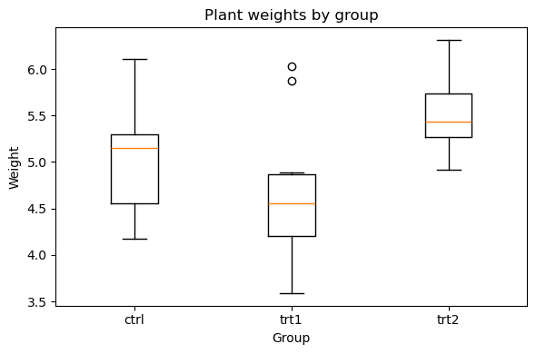
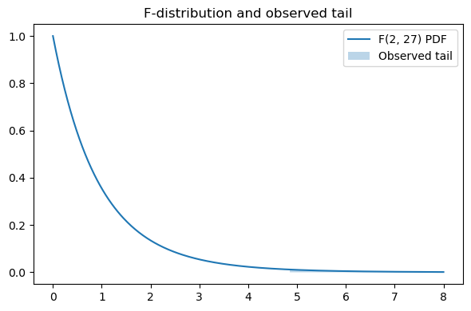

# scipy를 이용한 일원배치 분산분석과 그림

## 개요

이 페이지에서는 SciPy의 `f_oneway` 함수로 일원배치 분산분석을 수행하고, 자료의 분포와 얻어진 $F$-통계량을 기준분포 위에 시각화하는 방법을 보인다. PlantGrowth 자료로 대조군과 두 처치군의 식물 수확량을 비교한다. 집단 분포의 상자그림과, 관측된 꼬리를 색칠한 $F$-분포 밀도함수 그림이 검정을 서로 보완하는 시각으로 보여준다.

## 자료와 자유도

PlantGrowth 자료에는 $k = 3$개 집단(ctrl, trt1, trt2)에서 측정한 반응변수(weight)가 들어 있다. 전체 관측이 $N = 30$개이므로 $F$-검정의 자유도는

$$
df_1 = k - 1 = 2, \qquad df_2 = N - k = 27
$$

이다.

<div class="codebox" markdown>

**예제 1.** 자료와 자유도

```python
import pandas as pd
from scipy import stats

url = ('https://raw.githubusercontent.com/vincentarelbundock/'
       'Rdatasets/master/csv/datasets/PlantGrowth.csv')
df = pd.read_csv(url, usecols=[1, 2])
g = df.groupby('group')
# f_oneway는 집단을 **별도의 배열**로 받는다. 긴 형식 데이터프레임을 그대로
# 넘길 수 없어서 이렇게 쪼개야 한다. statsmodels의 ols 방식은 그 반대다.
ctrl = g.get_group('ctrl').weight.values
trt1 = g.get_group('trt1').weight.values
trt2 = g.get_group('trt2').weight.values

print(df.groupby('group').weight.agg(['count', 'mean', 'std']).round(4))
```

출력:

```
       count   mean     std
group                      
ctrl      10  5.032  0.5831
trt1      10  4.661  0.7937
trt2      10  5.526  0.4426
```

</div>

집단당 10개씩 균형 설계다. 표본표준편차가 0.44에서 0.79까지 1.8배 차이 나는데, 이 정도는 등분산 가정을 크게 흔들지 않는다(자세한 확인은 Levene 검정 페이지 참조).

## 분산분석 수행

SciPy의 `f_oneway`는 각 집단을 별도의 배열로 받아 $F$-통계량과 $p$-값을 돌려준다:

$$
F = \frac{MSB}{MSW} = \frac{SSB / (k-1)}{SSW / (N-k)}
$$

<div class="codebox" markdown>

**예제 2.** 분산분석 수행

```python
# F 는 집단 사이의 분산을 집단 안의 분산으로 나눈 값이다. 1 에 가까우면
# 집단을 나눈 것이 아무 설명도 하지 못한다는 뜻이다.
F, p = stats.f_oneway(ctrl, trt1, trt2)
print(f"F = {F:.4f}, p = {p:.4f}")
```

출력:

```
F = 4.8461, p = 0.0159
```

</div>

$H_0: \mu_{\text{ctrl}} = \mu_{\text{trt1}} = \mu_{\text{trt2}}$ 아래에서 통계량은 $F \sim F_{2,27}$이다.

## 시각화: 상자그림

상자그림은 각 집단의 중앙값, 사분위범위, 이상점을 보여주어 집단의 중심과 흩어짐이 다른지 즉시 감을 준다.

<div class="codebox" markdown>

**예제 3.** 상자그림으로 보기

```python
import matplotlib.pyplot as plt

# 검정을 하기 전이든 뒤든 그림을 본다. 상자가 겹치는 정도가 F 값과
# 어떻게 맞물리는지 눈에 익혀 두면 좋다.
fig, ax = plt.subplots(figsize=(6, 4))
ax.boxplot([ctrl, trt1, trt2], labels=['ctrl', 'trt1', 'trt2'])
ax.set_xlabel('Group')
ax.set_ylabel('Weight')
ax.set_title('Plant weights by group')
plt.tight_layout()
plt.show()
```

</div>



세 상자가 서로 겹친다. trt2가 가장 높고 trt1이 가장 낮지만 상자들이 나란히 놓일 만큼 가깝다. $p = 0.016$이 "압도적"이 아니라 "그럭저럭 유의한" 정도인 이유가 그림에 그대로 나타난다.

## 시각화: 관측된 꼬리를 표시한 F-분포

$F_{2,27}$의 밀도함수를 그리고 관측된 $F$-통계량 너머의 넓이를 색칠하면 $p$-값을 기하적으로 해석할 수 있다. 그 넓이는 $H_0$ 아래에서 그만큼 또는 그보다 극단적인 $F$ 값을 관측할 확률이다.

<div class="codebox" markdown>

**예제 4.** F 분포와 관측된 꼬리

```python
import numpy as np

# 자유도는 (집단 수 - 1, 전체 수 - 집단 수) = (2, 27) 이다.
# 칠해진 오른쪽 꼬리의 넓이가 곧 p-값이다.
x = np.linspace(0, 8, 400)
pdf = stats.f(2, 27).pdf(x)

fig, ax = plt.subplots(figsize=(6, 4))
ax.plot(x, pdf, label='F(2, 27) PDF')
mask = x >= F
ax.fill_between(x[mask], pdf[mask], alpha=0.3, label='Observed tail')
ax.set_title('F-distribution and observed tail')
ax.legend()
plt.tight_layout()
plt.show()
```

</div>



칠해진 꼬리의 넓이가 p-값 0.0159다. $F_{2,27}$ 분포가 1 근처에 몰려 있으므로($H_0$ 아래에서 $F$의 기댓값은 $df_2/(df_2-2) = 1.08$) 관측값 4.85는 오른쪽으로 꽤 나간 값이다.

색칠된 넓이는

$$
p = P(F_{2,27} \ge F_{\text{obs}})
$$

에 해당한다.

## 해석

- **상자그림:** 상자들이 위아래로 떨어져 겹침이 적으면 집단 평균이 다를 가능성이 크다. 상자가 겹치면 $H_0$에 반하는 증거가 약함을 시사한다.
- **F-분포 그림:** 관측된 $F$가 크면 검정통계량이 오른쪽 꼬리 깊숙이 놓여 $p$-값이 작아진다. $F_{\text{obs}}$가 커질수록 색칠된 영역이 줄어든다.
- **판정:** $p < \alpha$(보통 0.05)이면 $H_0$을 기각하고 어느 쌍이 다른지 알아보기 위해 사후비교(예: Tukey HSD)로 넘어간다.

## 연습문제

<div class="drillbox" markdown>

**연습문제 1.** <span class="diff easy" title="쉬움"></span>
PlantGrowth 자료($k = 3$, $N = 30$)에서 임계값 $F_{0.05,\, 2,\, 27}$을 계산하고 $F_{\text{obs}} = 4.85$가 $H_0$의 기각으로 이어지는지 판정하라.

</div>

??? success "풀이"
    $df_1 = 2$, $df_2 = 27$인 $F$-분포에서

    $$
    F_{0.05,\, 2,\, 27} \approx 3.35
    $$

    이다. $F_{\text{obs}} = 4.85 > 3.35$이므로 $\alpha = 0.05$ 유의수준에서 $H_0$을 기각한다. 적어도 한 집단의 평균이 다르다는 유의한 증거가 있다.

<div class="drillbox" markdown>

**연습문제 2.** <span class="diff med" title="중간"></span>
$F$-분포가 오른쪽으로 치우쳐 있고 아래로 0에서 막혀 있는 이유를 기하적으로 설명하라. 자유도 $df_1$과 $df_2$는 모양에 어떤 영향을 주는가?

</div>

??? success "풀이"
    $F$-통계량은 각각 자유도로 나눈 독립인 두 카이제곱 확률변수의 비이다:

    $$
    F = \frac{\chi^2_{df_1} / df_1}{\chi^2_{df_2} / df_2}
    $$

    카이제곱 확률변수는 음이 아니므로 $F \ge 0$이고 분포가 아래로 0에서 막힌다. 두 양수의 비는 ($H_0$ 아래에서) 1 근처에 몰리는 경향이 있지만 분자가 크면 얼마든지 큰 값을 가질 수 있어 오른쪽으로 치우친다.

    $df_2 \to \infty$이면 분모가 1로 수렴하여 $F \to \chi^2_{df_1}/df_1$이 되는데, 이는 여전히 오른쪽으로 치우쳤지만 정도가 덜하다. $df_1$과 $df_2$가 모두 커지면 분포가 더 대칭적이 되고 1 근처에 집중된다. $df_1$이 작으면(특히 $df_1 = 1$이나 $2$이면) 0 근처에서 더 뾰족한 분포가 되고, $df_1$이 크면 최빈값이 오른쪽으로 이동한다.

<div class="drillbox" markdown>

**연습문제 3.** <span class="diff med" title="중간"></span>
SciPy의 `f_oneway`는 등분산을 가정한다. 집단 분산이 $s_{\text{ctrl}}^2 = 0.25$, $s_{\text{trt1}}^2 = 0.64$, $s_{\text{trt2}}^2 = 0.20$이라면 등분산 가정이 합당한가? 어떤 대안을 쓰겠는가?

</div>

??? success "풀이"
    가장 큰 표본분산과 가장 작은 표본분산의 비는 $0.64 / 0.20 = 3.2$이다. 흔한 경험 법칙은 집단 크기가 같다면 가장 큰 분산이 가장 작은 분산의 3–4배 이내일 때 분산분석 $F$-검정이 로버스트하다는 것이다.

    여기서는 비가 경계선에 있다. 형식적인 Levene 검정을 수행해야 한다. 등분산이 기각되면 적절한 대안은 Satterthwaite 형태의 자유도 조정을 쓰고 등분산을 가정하지 않는 Welch 분산분석(`pingouin.welch_anova`)이다. SciPy에는 이분산 상황을 위한 관련 검정으로 `scipy.stats.alexandergovern`(Alexander-Govern 검정)이 있다.

<div class="drillbox" markdown>

**연습문제 4.** <span class="diff med" title="중간"></span>
`f_oneway`의 $p$-값은 $p = 1 - F_{df_1, df_2}.\text{cdf}(F_{\text{obs}})$로 계산된다. 단측(우측) 검정의 $p$-값 정의에서 이를 유도하고, 분산분석이 왜 $F$-분포의 오른쪽 꼬리만 쓰는지 설명하라.

</div>

??? success "풀이"
    $p$-값은 $H_0$ 아래에서 $F_{\text{obs}}$만큼 또는 그보다 극단적인 검정통계량을 관측할 확률로 정의된다:

    $$
    p = P(F \ge F_{\text{obs}} \mid H_0) = 1 - P(F < F_{\text{obs}} \mid H_0) = 1 - F_{df_1, df_2}(F_{\text{obs}})
    $$

    여기서 $F_{df_1, df_2}(\cdot)$는 $F$-분포의 누적분포함수이다.

    분산분석이 오른쪽 꼬리만 쓰는 것은, 대립가설(적어도 한 평균이 다름) 아래에서 집단 간 분산 $MSB$가 커지는 반면 집단 내 분산 $MSW$는 대략 $\sigma^2$으로 유지되기 때문이다. 즉 $F = MSB/MSW$는 귀무분포에 비해 커질 수만 있고 작아지지 않는다. 유별나게 작은 $F$는 $H_0$에 반하는 증거가 아니라 단지 집단 평균들이 비슷하다는 뜻이다. 따라서 큰 $F$ 값만이 귀무가설에 반하는 증거가 되고 검정은 본질적으로 단측(우측)이다.

<div class="drillbox" markdown>

**연습문제 5.** <span class="diff med" title="중간"></span>
$k = 2$일 때 `stats.f_oneway(x, y)`가 등분산 가정의 양측 이표본 $t$-검정과 같은 $p$-값을 줌을 보여라. 힌트: 항등식 $t^2_{N-2} = F_{1, N-2}$을 쓰라.

</div>

??? success "풀이"
    크기가 $n_1$, $n_2$인 $k = 2$개 집단에서 분산분석 $F$-통계량의 자유도는 $df_1 = 1$, $df_2 = n_1 + n_2 - 2$이다. 집단 간 평균제곱은

    $$
    MSB = \frac{n_1 n_2}{n_1 + n_2}(\bar{x} - \bar{y})^2
    $$

    이고 집단 내 평균제곱은 합동분산 $s_p^2$이다. 따라서

    $$
    F = \frac{MSB}{MSW} = \frac{n_1 n_2(\bar{x} - \bar{y})^2}{(n_1 + n_2)\, s_p^2}
    $$

    이다. 합동 이표본 $t$-통계량은

    $$
    t = \frac{\bar{x} - \bar{y}}{s_p \sqrt{1/n_1 + 1/n_2}}
    $$

    이며, 제곱하면

    $$
    t^2 = \frac{(\bar{x} - \bar{y})^2}{s_p^2 (1/n_1 + 1/n_2)} = \frac{n_1 n_2 (\bar{x} - \bar{y})^2}{(n_1 + n_2)\, s_p^2} = F
    $$

    이다. $t^2_{N-2} \sim F_{1, N-2}$이고 양측 $t$-검정의 $p$-값이 $P(|t| \ge |t_{\text{obs}}|) = P(t^2 \ge t_{\text{obs}}^2) = P(F_{1,N-2} \ge F_{\text{obs}})$이므로 두 $p$-값은 동일하다. $\square$

---

## 정리하며

`scipy.stats.f_oneway` 는 **가장 간단한 입구**다.

- **집단별 배열을 넘기면 $F$ 와 $p$ 가 나온다.** `f_oneway(g1, g2, g3)` 한 줄이며, 자료가 이미 집단별로 나뉘어 있을 때 편하다.
- **자유도를 직접 계산해 확인한다.** PlantGrowth 는 $k=3$, $N=30$ 이므로 $F_{2,27}$ 이다. 함수는 자유도를 돌려주지 않으므로 그림을 그리려면 손으로 구해야 한다.
- **두 그림이 서로 보완한다.** 상자그림은 **자료가 어떻게 생겼는지**를, $F$ 분포 위의 꼬리 그림은 **판정의 근거**를 보여 준다.
- **`statsmodels` 와의 차이.** `f_oneway` 는 검정만 하고, `statsmodels` 는 모형 객체를 주어 사후검정·잔차 진단으로 이어갈 수 있다. **탐색에는 전자, 본격 분석에는 후자다.**
- **등분산을 가정한다는 점은 같다.** 의심스러우면 `alternative` 가 아니라 웰치 분산분석으로 가야 한다.

다음 절 **분산분석 F-통계량 모의실험**으로 넘어간다. 검정력이 무엇에 달려 있는지를 직접 재어 본다.
