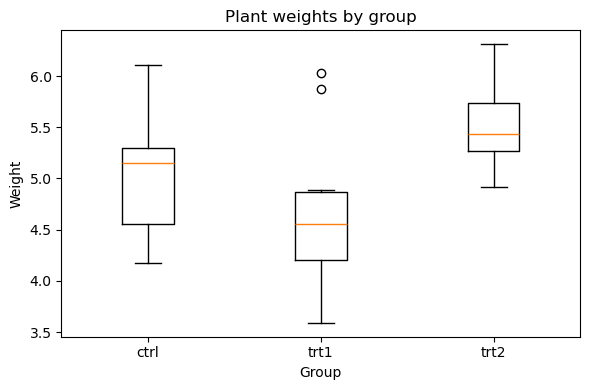
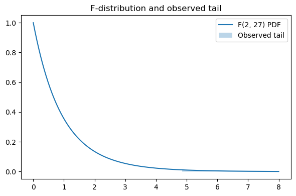

# scipy를 이용한 일원배치 분산분석과 그림

## 개요

이 페이지에서는 SciPy의 `f_oneway` 함수로 일원배치 분산분석을 수행하고, 자료의 분포와 얻어진 $F$-통계량을 기준분포 위에 시각화하는 방법을 보인다. PlantGrowth 자료로 대조군과 두 처치군의 식물 수확량을 비교한다. 집단 분포의 상자그림과, 관측된 꼬리를 색칠한 $F$-분포 밀도함수 그림이 검정을 서로 보완하는 시각으로 보여준다.

## 자료와 자유도

PlantGrowth 자료에는 $k = 3$개 집단(ctrl, trt1, trt2)에서 측정한 반응변수(weight)가 들어 있다. 전체 관측이 $N = 30$개이므로 $F$-검정의 자유도는

$$
df_1 = k - 1 = 2, \qquad df_2 = N - k = 27
$$

이다.

<div class="exbox" markdown>

**보기 1.** <span class="diff easy" title="쉬움"></span> 자유도는 왜 $2$ 와 $27$ 인가. PlantGrowth 자료는 $k = 3$개 집단에 집단당 $n = 10$개씩, 전체 $N = 30$개다.

**(1)** 총제곱합이

$$
SST = SSB + SSW
$$

로 쪼개짐을 보이고(교차항이 사라지는 까닭을 밝히라), 자유도도 $N - 1 = (k-1) + (N-k)$ 로 따라 쪼개짐을 설명하시오.

**(2)** 균형 설계에서 $MSW$ 가 **집단별 표본분산의 단순평균**임을 보이고, 집단 요약표(개수·평균·표준편차)만 가지고 $MSW$ 를 구한 뒤 원자료로 계산한 값과 맞는지 확인하시오.

</div>

??? success "풀이"

    **(1) 해석적으로.** 관측값 하나를 전체평균에서 잰 편차를 두 조각으로 나눈다.

    $$
    y_{ij} - \bar y_{\cdot\cdot} = \underbrace{(y_{ij} - \bar y_{i\cdot})}_{\text{집단 안}} + \underbrace{(\bar y_{i\cdot} - \bar y_{\cdot\cdot})}_{\text{집단 사이}}
    $$

    양변을 제곱해 모든 $i, j$ 에 대해 더하면

    $$
    SST = \sum_{i}\sum_{j} (y_{ij} - \bar y_{i\cdot})^2 + \sum_i n_i (\bar y_{i\cdot} - \bar y_{\cdot\cdot})^2 + 2\sum_i (\bar y_{i\cdot} - \bar y_{\cdot\cdot}) \sum_j (y_{ij} - \bar y_{i\cdot})
    $$

    인데, 안쪽 합 $\sum_j (y_{ij} - \bar y_{i\cdot})$ 은 **집단 평균에서 잰 편차의 합이므로 정확히 $0$** 이다. 교차항이 통째로 사라지고

    $$
    SST = SSW + SSB
    $$

    만 남는다. 이것은 근사가 아니라 **항등식**이다. 어떤 자료에서도, 집단 평균이 모두 같든 전혀 다르든, 소수점 끝자리까지 성립한다.

    자유도도 같이 쪼개진다. 기하로 보면 셋은 모두 제곱노름이다.

    - $SST$ 는 $\mathbf 1$ 에 직교하는 부분공간 위의 길이이므로 차원이 $N-1$.
    - $SSB$ 가 사는 곳은 집단 지시벡터 $k$ 개가 치는 공간에서 $\mathbf 1$ 방향을 뺀 것이므로 차원이 $k-1$.
    - $SSW$ 는 각 집단 안에서 그 집단 평균을 뺀 것이므로 집단마다 $n_i - 1$, 합쳐서 $N-k$.

    뒤의 두 공간은 서로 직교하고 합치면 첫째 공간이 되므로

    $$
    N - 1 = (k-1) + (N-k)
    $$

    이다. 여기서는 $29 = 2 + 27$ 이고, 이것이 $F_{2,27}$ 의 두 자유도다.

    **(2) 균형 설계의 $MSW$.** 집단 $i$ 의 표본분산을 $s_i^2 = \frac{1}{n_i-1}\sum_j (y_{ij} - \bar y_{i\cdot})^2$ 라 쓰면 $SSW = \sum_i (n_i - 1) s_i^2$ 이므로

    $$
    MSW = \frac{SSW}{N-k} = \frac{\sum_i (n_i-1)s_i^2}{\sum_i (n_i-1)}
    $$

    로 **표본분산들의 가중평균**이다. 균형 설계 $n_i \equiv n$ 이면 가중치가 모두 $n-1$ 로 같아져

    $$
    MSW = \frac{(n-1)\sum_i s_i^2}{k(n-1)} = \frac{1}{k}\sum_{i=1}^{k} s_i^2
    $$

    곧 **단순평균**이 된다. 요약표의 세 표준편차만 있으면

    $$
    MSW \approx \frac{0.5831^2 + 0.7937^2 + 0.4426^2}{3} = \frac{0.340006 + 0.629960 + 0.195895}{3} = 0.388620
    $$

    이다.

    ```python
    import numpy as np
    import pandas as pd
    from scipy import stats

    url = ('https://raw.githubusercontent.com/vincentarelbundock/'
           'Rdatasets/1dcc2bf5f955cc1224a3e1307256e1fe86b68dae/csv/datasets/PlantGrowth.csv')
    df = pd.read_csv(url, usecols=[1, 2])
    g = df.groupby('group')
    # f_oneway는 집단을 **별도의 배열**로 받는다. 긴 형식 데이터프레임을 그대로
    # 넘길 수 없어서 이렇게 쪼개야 한다. statsmodels의 ols 방식은 그 반대다.
    ctrl = g.get_group('ctrl').weight.values
    trt1 = g.get_group('trt1').weight.values
    trt2 = g.get_group('trt2').weight.values

    print(df.groupby('group').weight.agg(['count', 'mean', 'std']).round(4))

    groups = [ctrl, trt1, trt2]
    n = np.array([len(x) for x in groups])
    mean_i = np.array([x.mean() for x in groups])
    var_i = np.array([x.var(ddof=1) for x in groups])
    N, k = n.sum(), len(groups)
    grand = df.weight.mean()

    # 제곱합 분해. 세 수를 따로 계산하고 항등식이 맞는지 본다.
    SSB = (n * (mean_i - grand) ** 2).sum()
    SSW = ((n - 1) * var_i).sum()
    SST = ((df.weight - grand) ** 2).sum()
    print(f"\nSSB = {SSB:.6f}   SSW = {SSW:.6f}   합 = {SSB + SSW:.6f}")
    print(f"SST = {SST:.6f}   차이 = {abs(SST - SSB - SSW):.3e}")
    print(f"자유도  {N - 1} = {k - 1} + {N - k}")

    # 균형 설계이므로 MSW 는 표본분산의 단순평균이어야 한다.
    MSW = SSW / (N - k)
    print(f"\nMSW(=SSW/(N-k)) = {MSW:.8f}")
    print(f"표본분산의 단순평균 = {var_i.mean():.8f}")

    # 요약표의 반올림된 표준편차만 쓰면 얼마나 어긋나는가.
    sd_rounded = np.array([0.5831, 0.7937, 0.4426])
    print(f"반올림 표준편차로 = {(sd_rounded ** 2).mean():.8f}")
    print(f"합동표준편차 sqrt(MSW) = {np.sqrt(MSW):.4f}")
    ```

    출력:

    ```
           count   mean     std
    group                      
    ctrl      10  5.032  0.5831
    trt1      10  4.661  0.7937
    trt2      10  5.526  0.4426

    SSB = 3.766340   SSW = 10.492090   합 = 14.258430
    SST = 14.258430   차이 = 3.553e-15
    자유도  29 = 2 + 27

    MSW(=SSW/(N-k)) = 0.38859593
    표본분산의 단순평균 = 0.38859593
    반올림 표준편차로 = 0.38862002
    합동표준편차 sqrt(MSW) = 0.6234
    ```

    **분해가 맞는다.** $SSB + SSW = 14.258430$ 이 $SST$ 와 자릿수 끝까지 같고(차이 $3.6\times10^{-15}$ 는 부동소수점 반올림이다), 자유도도 $29 = 2 + 27$ 로 갈린다.

    **단순평균 공식도 맞는다.** $SSW/(N-k)$ 와 $\frac13\sum s_i^2$ 이 $0.38859593$ 으로 여덟 자리까지 같다. 표의 반올림된 표준편차를 쓰면 $0.38862002$ 로 다섯째 자리에서 어긋나는데, 이것은 공식이 틀려서가 아니라 **표준편차를 소수 넷째 자리에서 끊었기 때문**이다. 손으로 검산할 때는 이 정도 오차를 각오해야 한다.

    집단당 10개씩 균형 설계다. 표본표준편차가 0.44에서 0.79까지 1.8배 차이 나는데, 이 정도는 등분산 가정을 크게 흔들지 않는다(자세한 확인은 Levene 검정 페이지 참조). 합동표준편차 $\sqrt{MSW} = 0.6234$ 가 그 셋을 대표하는 하나의 수다.

## 분산분석 수행

SciPy의 `f_oneway`는 각 집단을 별도의 배열로 받아 $F$-통계량과 $p$-값을 돌려준다:

$$
F = \frac{MSB}{MSW} = \frac{SSB / (k-1)}{SSW / (N-k)}
$$

<div class="exbox" markdown>

**보기 2.** <span class="diff easy" title="쉬움"></span> 요약통계만으로 $F$ 를 손계산하기.

**(1)** 보기 1의 요약표(개수 $10, 10, 10$, 평균 $5.032,\ 4.661,\ 5.526$)와 $MSW$ 만 가지고 $F$ 를 계산하시오. 원자료는 쓰지 말 것.

**(2)** 집단이 **둘뿐이면** $F = t^2$ 임을 보이시오. 여기서 $t$ 는 합동분산을 쓴 이표본 $t$ 통계량이다. ctrl 과 trt1 두 집단으로 이 항등식을 수치 확인하고, $p$-값까지 같아지는 까닭을 밝히시오.

</div>

??? success "풀이"

    **(1) 해석적으로.** 균형 설계이므로 전체평균은 세 집단평균의 단순평균이다.

    $$
    \bar y_{\cdot\cdot} = \frac{5.032 + 4.661 + 5.526}{3} = 5.073
    $$

    집단 간 제곱합은 집단평균이 전체평균에서 얼마나 떨어져 있는지를 표본크기로 가중해 더한 것이다.

    $$
    SSB = 10\left[(5.032 - 5.073)^2 + (4.661 - 5.073)^2 + (5.526 - 5.073)^2\right] = 3.76634
    $$

    자유도 $k - 1 = 2$ 로 나누면 $MSB = 1.88317$ 이고, 보기 1의 $MSW = 0.388596$ 으로 나누면

    $$
    F = \frac{MSB}{MSW} = \frac{1.88317}{0.388596} = 4.84609
    $$

    이다. **원자료 30개는 한 번도 쓰이지 않았다.** 분산분석은 집단별 $(n_i, \bar y_i, s_i^2)$ 세 쌍만 있으면 완전히 재구성된다.

    **(2) $k = 2$ 이면 $F = t^2$.** 두 집단일 때 전체평균은 $\bar y = \frac{n_1\bar y_1 + n_2 \bar y_2}{n_1+n_2}$ 이므로

    $$
    \bar y_1 - \bar y = \frac{n_2(\bar y_1 - \bar y_2)}{n_1+n_2},
    \qquad
    \bar y_2 - \bar y = \frac{-\,n_1(\bar y_1 - \bar y_2)}{n_1+n_2}
    $$

    이다. 이것을 $SSB$ 에 넣으면

    $$
    SSB = \frac{n_1 n_2^2 + n_2 n_1^2}{(n_1+n_2)^2}(\bar y_1 - \bar y_2)^2
        = \frac{n_1 n_2}{n_1+n_2}(\bar y_1 - \bar y_2)^2
        = \frac{(\bar y_1 - \bar y_2)^2}{\frac{1}{n_1} + \frac{1}{n_2}}
    $$

    이고 $k - 1 = 1$ 이므로 $MSB = SSB$ 다. 한편 $MSW$ 는 정확히 합동분산 $s_p^2$ 이므로

    $$
    F = \frac{MSB}{MSW} = \frac{(\bar y_1 - \bar y_2)^2}{s_p^2\left(\frac{1}{n_1}+\frac{1}{n_2}\right)}
      = \left[\frac{\bar y_1 - \bar y_2}{s_p\sqrt{\frac{1}{n_1}+\frac{1}{n_2}}}\right]^2 = t^2
    $$

    이다. **대수 항등식**이므로 자료가 무엇이든 소수점 끝까지 성립한다. $p$-값까지 같아지는 것은 분포 수준의 사실 때문이다. $T \sim t_m$ 이면 $T^2 \sim F_{1,m}$ 이고 $t$-검정의 양측 꼬리 $\{|T| \ge |t|\}$ 와 $F$-검정의 오른쪽 꼬리 $\{T^2 \ge t^2\}$ 는 **같은 사건**이다. 분산분석이 "양측"만 할 수 있는 이유도 여기에 있다.

    ```python
    # 보기 1 의 ctrl, trt1, trt2, n, mean_i, MSW, k 를 이어 쓴다.
    # F 는 집단 사이의 분산을 집단 안의 분산으로 나눈 값이다. 1 에 가까우면
    # 집단을 나눈 것이 아무 설명도 하지 못한다는 뜻이다.
    F, p = stats.f_oneway(ctrl, trt1, trt2)
    print(f"F = {F:.4f}, p = {p:.4f}")

    # 요약통계(개수와 평균)만으로 손계산한다.
    grand = (n * mean_i).sum() / n.sum()
    SSB_hand = (n * (mean_i - grand) ** 2).sum()
    MSB_hand = SSB_hand / (k - 1)
    print(f"\n전체평균 = {grand:.4f}")
    print(f"SSB = {SSB_hand:.6f}   MSB = {MSB_hand:.6f}   MSW = {MSW:.6f}")
    print(f"F(손계산) = {MSB_hand / MSW:.10f}")
    print(f"F(scipy)  = {F:.10f}")

    # k=2 이면 F = t^2 이어야 한다. ctrl 과 trt1 둘만 쓴다.
    F2, p2 = stats.f_oneway(ctrl, trt1)
    t2, pt = stats.ttest_ind(ctrl, trt1)
    print(f"\nk=2:  F = {F2:.10f}   t = {t2:.10f}   t^2 = {t2 ** 2:.10f}")
    print(f"      p(F) = {p2:.10f}   p(t) = {pt:.10f}")
    print(f"\nE[F(2,27)] = {27 / 25:.4f}")
    ```

    출력:

    ```
    F = 4.8461, p = 0.0159

    전체평균 = 5.0730
    SSB = 3.766340   MSB = 1.883170   MSW = 0.388596
    F(손계산) = 4.8460878624
    F(scipy)  = 4.8460878624

    k=2:  F = 1.4191012974   t = 1.1912603818   t^2 = 1.4191012974
          p(F) = 0.2490231660   p(t) = 0.2490231660

    E[F(2,27)] = 1.0800
    ```

    **손계산이 맞는다.** $F = 4.8460878624$ 가 `f_oneway` 의 값과 열 자리까지 같다.

    **$F = t^2$ 도 맞는다.** $t = 1.1912603818$ 을 제곱하면 $1.4191012974$ 로 $F$ 와 열 자리까지 일치하고, $p$-값도 $0.2490231660$ 으로 같다. 유도한 항등식이 수치로 확인되었다.

    $H_0: \mu_{\text{ctrl}} = \mu_{\text{trt1}} = \mu_{\text{trt2}}$ 아래에서 통계량은 $F \sim F_{2,27}$ 이고 그 기댓값은 $\frac{d_2}{d_2-2} = \frac{27}{25} = 1.08$ 이다. 관측값 $4.85$ 는 그 네 배를 넘는다. 왜 기댓값이 $1$ 근처인지는 $E[MSW] = \sigma^2$ 와 $E[MSB] = \sigma^2 + \frac{\sum n_i(\mu_i - \bar\mu)^2}{k-1}$ 에서 나온다. 귀무가설이 참이면 둘째 항이 $0$ 이라 분자와 분모가 같은 것을 재게 되고, 비는 $1$ 근처를 맴돈다.

## 시각화: 상자그림

상자그림은 각 집단의 중앙값, 사분위범위, 이상점을 보여주어 집단의 중심과 흩어짐이 다른지 즉시 감을 준다.

<div class="exbox" markdown>

**보기 3.** <span class="diff easy" title="쉬움"></span> 상자그림으로 보기. 세 집단의 무게를 상자그림으로 그린다.

**(1)** 그림에서 읽히는 것을 **수치와 함께** 적으시오. 세 상자의 위아래 관계는 어떠한가.

**(2)** 이 그림이 **가리는 것**은 무엇인가. 특히 분산분석의 $F$ 를 이 그림에서 눈대중으로 읽을 수 있는지 따지시오.

</div>

??? success "풀이"

    유도할 답이 있는 문제가 아니다. **그림에서 무엇이 읽히고 무엇이 읽히지 않는가**가 전부이므로, 눈으로 본 것을 수치로 바꿔 가며 읽는다.

    ```python
    import matplotlib.pyplot as plt

    # 상자그림이 실제로 그리는 수들을 먼저 찍어 둔다.
    names = ['ctrl', 'trt1', 'trt2']
    groups = [ctrl, trt1, trt2]
    print(f"{'group':>6}{'mean':>8}{'median':>8}{'Q1':>8}{'Q3':>8}{'IQR':>8}{'sd':>8}")
    for name, x in zip(names, groups):
        q1, q2, q3 = np.percentile(x, [25, 50, 75])
        print(f"{name:>6}{x.mean():>8.3f}{q2:>8.3f}{q1:>8.3f}{q3:>8.3f}"
              f"{q3 - q1:>8.3f}{x.std(ddof=1):>8.3f}")

    # 상자 바깥으로 따로 찍히는 점이 어느 집단에 있는가.
    for name, x in zip(names, groups):
        q1, q3 = np.percentile(x, [25, 75])
        lo, hi = q1 - 1.5 * (q3 - q1), q3 + 1.5 * (q3 - q1)
        flagged = np.sort(x[(x < lo) | (x > hi)])
        print(f"{name}: 울타리 밖 {flagged if len(flagged) else '없음'}")

    # 그림에서는 읽히지 않는 것 — 쌍별 t-검정의 p-값.
    for i in range(3):
        for j in range(i + 1, 3):
            t, p = stats.ttest_ind(groups[i], groups[j])
            print(f"{names[i]} vs {names[j]}: t = {t:+.4f}, p = {p:.4f}")

    # 검정을 하기 전이든 뒤든 그림을 본다. 상자가 겹치는 정도가 F 값과
    # 어떻게 맞물리는지 눈에 익혀 두면 좋다.
    fig, ax = plt.subplots(figsize=(6, 4))
    ax.boxplot([ctrl, trt1, trt2], labels=['ctrl', 'trt1', 'trt2'])
    ax.set_xlabel('Group')
    ax.set_ylabel('Weight')
    ax.set_title('Plant weights by group')
    plt.tight_layout()
    plt.show()
    ```

    출력:

    ```
     group    mean  median      Q1      Q3     IQR      sd
      ctrl   5.032   5.155   4.550   5.293   0.742   0.583
      trt1   4.661   4.550   4.207   4.870   0.662   0.794
      trt2   5.526   5.435   5.268   5.735   0.467   0.443
    ctrl: 울타리 밖 없음
    trt1: 울타리 밖 [5.87 6.03]
    trt2: 울타리 밖 없음
    ctrl vs trt1: t = +1.1913, p = 0.2490
    ctrl vs trt2: t = -2.1340, p = 0.0469
    trt1 vs trt2: t = -3.0101, p = 0.0075
    ```

    

    **(1) 읽히는 것.** 중앙값의 순서가 trt2($5.435$) > ctrl($5.155$) > trt1($4.550$)이고 평균의 순서($5.526 > 5.032 > 4.661$)와 같다. 세 상자가 서로 겹치기는 하지만 겹치는 정도가 쌍마다 크게 다르다.

    - **trt1 과 trt2 는 상자가 전혀 닿지 않는다.** trt1의 $Q_3 = 4.870$ 이 trt2의 $Q_1 = 5.268$ 보다 $0.40$ 아래다. 세 쌍 중 가장 뚜렷하게 갈린 쌍이다.
    - **ctrl 과 trt2 는 겨우 닿는다.** ctrl의 $Q_3 = 5.293$ 과 trt2의 $Q_1 = 5.268$ 이 폭 $0.025$ 만큼만 포갠다.
    - **ctrl 과 trt1 은 많이 겹친다.** trt1의 상자 윗변이 ctrl 상자 한가운데쯤에 온다.

    흩어짐도 집단마다 다르다. trt2의 $IQR = 0.467$ 이 가장 좁고 ctrl의 $0.742$ 가 가장 넓다. trt1에는 울타리 밖으로 따로 찍힌 점이 둘($5.87$, $6.03$) 있는데, 상자 윗변 $4.870$ 에서 한참 떨어져 있다.

    **(2) 가리는 것.**

    **첫째, 그림은 중앙값을 그리는데 분산분석은 평균을 쓴다.** ctrl에서 평균 $5.032$ 가 중앙값 $5.155$ 보다 $0.12$ 아래인데, 상자그림에는 그 선이 아예 그려지지 않는다. 여기서는 두 순서가 우연히 같았지만 치우친 자료에서는 갈라질 수 있고, 그때 상자그림으로 분산분석 결과를 가늠하면 틀린다.

    **둘째, $F$ 의 분모를 그림에서 읽을 수 없다.** $F$ 를 좌우하는 것은 $\sqrt{MSW} = 0.6234$ 인데, 상자그림이 보여 주는 흩어짐 척도는 표준편차가 아니라 $IQR$ 이다. 그런데 이 자료에서는 **두 척도의 순위가 서로 어긋난다.**

    | 집단 | $IQR$ | 표준편차 |
    |---|---|---|
    | ctrl | $0.742$ (가장 넓음) | $0.583$ |
    | trt1 | $0.662$ | $0.794$ (가장 큼) |
    | trt2 | $0.467$ | $0.443$ |

    $IQR$ 로는 ctrl이 가장 퍼져 보이지만 표준편차로는 trt1이 가장 크다. trt1의 두 바깥점 $5.87$, $6.03$ 이 표준편차를 끌어올리는 동안 $IQR$ 은 꿈쩍도 하지 않았기 때문이다. **상자그림은 설계상 꼬리의 무게를 지우는 그림이고, $MSW$ 는 바로 그 꼬리에 민감하다.**

    **셋째, 표본크기가 보이지 않는다.** 세 상자가 똑같이 당당해 보이지만 모두 $n = 10$ 짜리다. $n$ 이 다른 설계였다면 그림은 그대로인 채 $p$-값만 달라졌을 것이다.

    **넷째, 겹침의 정도와 $p$-값은 같은 것이 아니다.** 상자가 전혀 닿지 않는 trt1–trt2 쌍은 $p = 0.0075$, 겨우 닿는 ctrl–trt2 는 $p = 0.0469$, 많이 겹치는 ctrl–trt1 은 $p = 0.2490$ 으로 과연 순서는 맞는다. 그러나 이 수들은 어디까지나 **쌍별** 값이고 다중비교 보정을 하지 않은 것이라, 셋을 한꺼번에 묻는 $p = 0.0159$ 와는 다른 물음에 대한 답이다. 상자그림은 "어느 쌍이 다른가"를 묻게 만들지만 그 답을 주지는 못한다. 그 일은 사후검정의 몫이다.

    요약하면 $p = 0.016$ 이 "압도적"이 아니라 "그럭저럭 유의한" 정도인 이유가 그림에 그대로 나타난다. 세 상자가 완전히 떨어져 있지도, 포개져 있지도 않다.

## 시각화: 관측된 꼬리를 표시한 F-분포

$F_{2,27}$의 밀도함수를 그리고 관측된 $F$-통계량 너머의 넓이를 색칠하면 $p$-값을 기하적으로 해석할 수 있다. 그 넓이는 $H_0$ 아래에서 그만큼 또는 그보다 극단적인 $F$ 값을 관측할 확률이다.

<div class="exbox" markdown>

**보기 4.** <span class="diff easy" title="쉬움"></span> $d_1 = 2$ 일 때의 닫힌 꼴. 분자 자유도가 $2$ 인 것은 운이 좋은 경우다. 꼬리확률이 적분기호 없이 적힌다.

**(1)** $F \sim F_{2,m}$ 일 때

$$
P(F \ge f) = \left(1 + \frac{2f}{m}\right)^{-m/2},
\qquad
f_{F_{2,m}}(x) = \left(1 + \frac{2x}{m}\right)^{-(m+2)/2}
$$

임을 보이시오. 이로부터 밀도의 **최빈값이 어디인지** 말하고, 유의수준 $\alpha$ 의 임계값을 닫힌 꼴로 적으시오.

**(2)** $m = 27$, $f_{\text{obs}} = 4.846088$ 에 대해 (1)의 식이 `scipy` 와 맞는지 확인하시오.

</div>

??? success "풀이"

    **(1) 해석적으로.** 정의대로 $F = \dfrac{U/2}{V/m}$ 라 쓰자. 여기서 $U \sim \chi^2_2$, $V \sim \chi^2_m$ 이고 둘은 독립이다. 핵심은 **$\chi^2_2$ 가 평균 $2$ 인 지수분포**라는 것이다.

    $$
    P(U > u) = e^{-u/2}, \qquad u > 0
    $$

    (자유도 2의 카이제곱 밀도는 $\frac12 e^{-u/2}$ 이므로 곧바로 나온다.) 이제 $V$ 로 조건을 걸면

    $$
    P(F \ge f) = P\!\left(U \ge \frac{2fV}{m}\right)
    = E\!\left[\exp\!\left(-\frac{fV}{m}\right)\right]
    $$

    인데 이것은 $V \sim \chi^2_m$ 의 적률생성함수 $M_V(t) = (1-2t)^{-m/2}$ 를 $t = -f/m$ 에서 잰 값이다. 따라서

    $$
    P(F \ge f) = \left(1 + \frac{2f}{m}\right)^{-m/2}
    $$

    이다. 밀도는 이것을 $f$ 로 미분해 부호를 바꾸면 된다.

    $$
    f_{F}(x) = -\frac{d}{dx}\left(1+\frac{2x}{m}\right)^{-m/2}
    = \frac{m}{2}\cdot\frac{2}{m}\left(1+\frac{2x}{m}\right)^{-m/2-1}
    = \left(1+\frac{2x}{m}\right)^{-(m+2)/2}
    $$

    **최빈값은 $x = 0$ 이다.** 지수가 음수이고 밑이 $x$ 와 함께 커지므로 밀도는 $x = 0$ 에서 값 $1$ 을 갖고 **그 뒤로 단조감소**한다. 봉우리가 없다. 이것은 $d_1 = 2$ 에만 있는 특징으로, $d_1 \ge 3$ 이면 최빈값이 $\frac{(d_1-2)m}{d_1(m+2)} > 0$ 으로 안쪽에 생긴다. 그러니 "$F$ 분포가 $1$ 근처에 몰려 있다"는 말은 **기댓값 $E[F] = \frac{m}{m-2} = 1.08$ 에 대해서만 참이고 밀도의 모양에 대해서는 참이 아니다.** 아래 그림이 $x = 0$ 에서 $1.0$ 으로 시작해 내리막만 타는 이유가 이것이다.

    임계값은 꼬리확률 식을 뒤집어 풀면 된다. $\left(1+\frac{2f}{m}\right)^{-m/2} = \alpha$ 에서

    $$
    f_{\alpha,\,2,\,m} = \frac{m}{2}\left(\alpha^{-2/m} - 1\right)
    $$

    이고 $\alpha = 0.05$, $m = 27$ 이면 $\frac{27}{2}\left(0.05^{-2/27}-1\right)$ 이다.

    **(2) 수치적으로.**

    ```python
    import numpy as np

    # 자유도는 (집단 수 - 1, 전체 수 - 집단 수) = (2, 27) 이다.
    m = 27

    # 닫힌 꼴 꼬리확률과 scipy 를 맞춰 본다.
    p_closed = (1 + 2 * F / m) ** (-m / 2)
    p_scipy = stats.f(2, m).sf(F)
    print(f"닫힌 꼴 p = {p_closed:.10f}")
    print(f"scipy   p = {p_scipy:.10f}")
    print(f"차이      = {abs(p_closed - p_scipy):.3e}")

    # 밀도도 닫힌 꼴이다. x=0 에서 1 이고 단조감소한다.
    x = np.array([0.0, 0.5, 1.0, 2.0, 3.0, F, 8.0])
    pdf_closed = (1 + 2 * x / m) ** (-(m + 2) / 2)
    pdf_scipy = stats.f(2, m).pdf(x)
    print(f"\n{'x':>8}{'closed':>14}{'scipy':>14}")
    for xi, a, b in zip(x, pdf_closed, pdf_scipy):
        print(f"{xi:>8.3f}{a:>14.8f}{b:>14.8f}")

    # 임계값도 뒤집어 풀린다.
    crit_closed = m / 2 * (0.05 ** (-2 / m) - 1)
    print(f"\n임계값 닫힌 꼴 = {crit_closed:.8f}")
    print(f"임계값 scipy   = {stats.f(2, m).ppf(0.95):.8f}")
    print(f"E[F(2,27)] = {m / (m - 2):.4f},  최빈값 = 0 (밀도가 단조감소)")

    # 칠해진 오른쪽 꼬리의 넓이가 곧 p-값이다.
    x = np.linspace(0, 8, 400)
    pdf = stats.f(2, 27).pdf(x)

    fig, ax = plt.subplots(figsize=(6, 4))
    ax.plot(x, pdf, label='F(2, 27) PDF')
    mask = x >= F
    ax.fill_between(x[mask], pdf[mask], alpha=0.3, label='Observed tail')
    ax.set_title('F-distribution and observed tail')
    ax.legend()
    plt.tight_layout()
    plt.show()
    ```

    출력:

    ```
    닫힌 꼴 p = 0.0159099583
    scipy   p = 0.0159099583
    차이      = 2.776e-17

           x        closed         scipy
       0.000    1.00000000    1.00000000
       0.500    0.59017815    0.59017815
       1.000    0.35481634    0.35481634
       2.000    0.13490561    0.13490561
       3.000    0.05449071    0.05449071
       4.846    0.01170737    0.01170737
       8.000    0.00117350    0.00117350

    임계값 닫힌 꼴 = 3.35413083
    임계값 scipy   = 3.35413083
    E[F(2,27)] = 1.0800,  최빈값 = 0 (밀도가 단조감소)
    ```

    

    **세 식이 모두 맞는다.** 꼬리확률은 $0.0159099583$ 으로 열 자리까지 같고 차이가 $2.8\times10^{-17}$ 로 배정밀도 오차 수준이다. 밀도는 일곱 지점에서 여덟 자리까지 일치하며, 특히 $x = 0$ 에서 정확히 $1.00000000$ 이다. 임계값도 $3.35413083$ 으로 같다.

    칠해진 꼬리의 넓이가 바로 $p = 0.0159$ 다. 그림을 보면 밀도가 $x = 0$ 에서 $1.0$ 으로 출발해 내려가기만 하므로 **$F$ 가 작은 값일수록 더 흔하다.** 그런데도 $F$ 의 기댓값이 $1.08$ 인 것은 오른쪽 꼬리가 길어서다. 관측값 $4.85$ 는 그 기댓값의 네 배를 넘고 $5\%$ 임계값 $3.354$ 도 넘었으므로 $H_0$ 을 기각한다.

    한 가지 덧붙이면, 분자 자유도가 $2$ 가 아니면 이런 닫힌 꼴은 없다. $d_1$ 이 홀수이거나 $4$ 이상이면 꼬리확률이 불완전베타함수로만 적히고 수치적분이 필요하다. 집단이 **셋**일 때만 손으로 $p$-값을 낼 수 있다는 뜻이다.

색칠된 넓이는

$$
p = P(F_{2,27} \ge F_{\text{obs}})
$$

에 해당한다.

## 해석

- **상자그림:** 상자들이 위아래로 떨어져 겹침이 적으면 집단 평균이 다를 가능성이 크다. 상자가 겹치면 $H_0$에 반하는 증거가 약함을 시사한다.
- **F-분포 그림:** 관측된 $F$가 크면 검정통계량이 오른쪽 꼬리 깊숙이 놓여 $p$-값이 작아진다. $F_{\text{obs}}$가 커질수록 색칠된 영역이 줄어든다.
- **판정:** $p < \alpha$(보통 0.05)이면 $H_0$을 기각하고 어느 쌍이 다른지 알아보기 위해 사후비교(예: Tukey HSD)로 넘어간다.

## 연습문제

<div class="drillbox" markdown>

**연습문제 1.** <span class="diff easy" title="쉬움"></span>
PlantGrowth 자료($k = 3$, $N = 30$)에서 임계값 $F_{0.05,\, 2,\, 27}$을 계산하고 $F_{\text{obs}} = 4.85$가 $H_0$의 기각으로 이어지는지 판정하라.

</div>

??? success "풀이"
    $df_1 = 2$, $df_2 = 27$인 $F$-분포에서

    $$
    F_{0.05,\, 2,\, 27} \approx 3.35
    $$

    이다. $F_{\text{obs}} = 4.85 > 3.35$이므로 $\alpha = 0.05$ 유의수준에서 $H_0$을 기각한다. 적어도 한 집단의 평균이 다르다는 유의한 증거가 있다.

<div class="drillbox" markdown>

**연습문제 2.** <span class="diff med" title="중간"></span>
$F$-분포가 오른쪽으로 치우쳐 있고 아래로 0에서 막혀 있는 이유를 기하적으로 설명하라. 자유도 $df_1$과 $df_2$는 모양에 어떤 영향을 주는가?

</div>

??? success "풀이"
    $F$-통계량은 각각 자유도로 나눈 독립인 두 카이제곱 확률변수의 비이다:

    $$
    F = \frac{\chi^2_{df_1} / df_1}{\chi^2_{df_2} / df_2}
    $$

    카이제곱 확률변수는 음이 아니므로 $F \ge 0$이고 분포가 아래로 0에서 막힌다. 두 양수의 비는 ($H_0$ 아래에서) 1 근처에 몰리는 경향이 있지만 분자가 크면 얼마든지 큰 값을 가질 수 있어 오른쪽으로 치우친다.

    $df_2 \to \infty$이면 분모가 1로 수렴하여 $F \to \chi^2_{df_1}/df_1$이 되는데, 이는 여전히 오른쪽으로 치우쳤지만 정도가 덜하다. $df_1$과 $df_2$가 모두 커지면 분포가 더 대칭적이 되고 1 근처에 집중된다. $df_1$이 작으면(특히 $df_1 = 1$이나 $2$이면) 0 근처에서 더 뾰족한 분포가 되고, $df_1$이 크면 최빈값이 오른쪽으로 이동한다.

<div class="drillbox" markdown>

**연습문제 3.** <span class="diff med" title="중간"></span>
SciPy의 `f_oneway`는 등분산을 가정한다. 집단 분산이 $s_{\text{ctrl}}^2 = 0.25$, $s_{\text{trt1}}^2 = 0.64$, $s_{\text{trt2}}^2 = 0.20$이라면 등분산 가정이 합당한가? 어떤 대안을 쓰겠는가?

</div>

??? success "풀이"
    가장 큰 표본분산과 가장 작은 표본분산의 비는 $0.64 / 0.20 = 3.2$이다. 흔한 경험 법칙은 집단 크기가 같다면 가장 큰 분산이 가장 작은 분산의 3–4배 이내일 때 분산분석 $F$-검정이 로버스트하다는 것이다.

    여기서는 비가 경계선에 있다. 형식적인 Levene 검정을 수행해야 한다. 등분산이 기각되면 적절한 대안은 Satterthwaite 형태의 자유도 조정을 쓰고 등분산을 가정하지 않는 Welch 분산분석(`pingouin.welch_anova`)이다. SciPy에는 이분산 상황을 위한 관련 검정으로 `scipy.stats.alexandergovern`(Alexander-Govern 검정)이 있다.

<div class="drillbox" markdown>

**연습문제 4.** <span class="diff med" title="중간"></span>
`f_oneway`의 $p$-값은 $p = 1 - F_{df_1, df_2}.\text{cdf}(F_{\text{obs}})$로 계산된다. 단측(우측) 검정의 $p$-값 정의에서 이를 유도하고, 분산분석이 왜 $F$-분포의 오른쪽 꼬리만 쓰는지 설명하라.

</div>

??? success "풀이"
    $p$-값은 $H_0$ 아래에서 $F_{\text{obs}}$만큼 또는 그보다 극단적인 검정통계량을 관측할 확률로 정의된다:

    $$
    p = P(F \ge F_{\text{obs}} \mid H_0) = 1 - P(F < F_{\text{obs}} \mid H_0) = 1 - F_{df_1, df_2}(F_{\text{obs}})
    $$

    여기서 $F_{df_1, df_2}(\cdot)$는 $F$-분포의 누적분포함수이다.

    분산분석이 오른쪽 꼬리만 쓰는 것은, 대립가설(적어도 한 평균이 다름) 아래에서 집단 간 분산 $MSB$가 커지는 반면 집단 내 분산 $MSW$는 대략 $\sigma^2$으로 유지되기 때문이다. 즉 $F = MSB/MSW$는 귀무분포에 비해 커질 수만 있고 작아지지 않는다. 유별나게 작은 $F$는 $H_0$에 반하는 증거가 아니라 단지 집단 평균들이 비슷하다는 뜻이다. 따라서 큰 $F$ 값만이 귀무가설에 반하는 증거가 되고 검정은 본질적으로 단측(우측)이다.

<div class="drillbox" markdown>

**연습문제 5.** <span class="diff med" title="중간"></span>
$k = 2$일 때 `stats.f_oneway(x, y)`가 등분산 가정의 양측 이표본 $t$-검정과 같은 $p$-값을 줌을 보여라. 힌트: 항등식 $t^2_{N-2} = F_{1, N-2}$을 쓰라.

</div>

??? success "풀이"
    크기가 $n_1$, $n_2$인 $k = 2$개 집단에서 분산분석 $F$-통계량의 자유도는 $df_1 = 1$, $df_2 = n_1 + n_2 - 2$이다. 집단 간 평균제곱은

    $$
    MSB = \frac{n_1 n_2}{n_1 + n_2}(\bar{x} - \bar{y})^2
    $$

    이고 집단 내 평균제곱은 합동분산 $s_p^2$이다. 따라서

    $$
    F = \frac{MSB}{MSW} = \frac{n_1 n_2(\bar{x} - \bar{y})^2}{(n_1 + n_2)\, s_p^2}
    $$

    이다. 합동 이표본 $t$-통계량은

    $$
    t = \frac{\bar{x} - \bar{y}}{s_p \sqrt{1/n_1 + 1/n_2}}
    $$

    이며, 제곱하면

    $$
    t^2 = \frac{(\bar{x} - \bar{y})^2}{s_p^2 (1/n_1 + 1/n_2)} = \frac{n_1 n_2 (\bar{x} - \bar{y})^2}{(n_1 + n_2)\, s_p^2} = F
    $$

    이다. $t^2_{N-2} \sim F_{1, N-2}$이고 양측 $t$-검정의 $p$-값이 $P(|t| \ge |t_{\text{obs}}|) = P(t^2 \ge t_{\text{obs}}^2) = P(F_{1,N-2} \ge F_{\text{obs}})$이므로 두 $p$-값은 동일하다. $\square$

<div class="drillbox" markdown>

**연습문제 6.** <span class="diff med" title="중간"></span>
연습문제 2가 묻는 $F$ 분포의 **모양**을 수치로 확인하라. 두 자유도는 각각 무엇을 바꾸는가?

</div>

??? success "풀이"
    **$F$ 분포의 적률.**

    $$
    E[F_{d_1,d_2}]=\frac{d_2}{d_2-2}\ (d_2>2),
    \qquad
    \text{최빈값}=\frac{d_1-2}{d_1}\cdot\frac{d_2}{d_2+2}\ (d_1>2)
    $$

    ```python
    import numpy as np
    from scipy import stats

    print(f"{'df1':>4s} {'df2':>5s} {'평균':>8s} {'최빈값':>9s} "
          f"{'왜도':>8s} {'F(0.95)':>9s}")
    for d1, d2 in [(1, 27), (2, 27), (5, 27), (2, 10), (2, 100),
                   (10, 100), (50, 100)]:
        mean = d2 / (d2 - 2)
        mode = (d1 - 2) / d1 * d2 / (d2 + 2) if d1 > 2 else np.nan
        skew = float(stats.f.stats(d1, d2, moments='s'))
        print(f"{d1:4d} {d2:5d} {mean:8.4f} {mode:9.4f} {skew:8.4f} "
              f"{stats.f.ppf(0.95, d1, d2):9.4f}")
    ```

    ```text
     df1   df2       평균       최빈값       왜도   F(0.95)
       1    27   1.0800       nan   3.4203    4.2100
       2    27   1.0800       nan   2.5491    3.3541
       5    27   1.0800    0.5586   1.8459    2.5719
       2    10   1.2500       nan   4.6476    4.1028
       2   100   1.0204       nan   2.1264    3.0873
      10   100   1.0204    0.7843   1.0586    1.9267
      50   100   1.0204    0.9412   0.6786    1.4772
    ```

    **평균은 $d_2$만으로 정해진다.** $d_1$이 1이든 50이든 $d_2=27$이면 평균이 1.08이다.

    $$
    E[F]=\frac{d_2}{d_2-2}
    $$

    **$H_0$가 참이면 $F$가 1 근처에 모인다.** $d_2$가 크면 정확히 1에 가까워진다(100일 때 1.0204).

    **$d_1\le2$이면 최빈값이 없다.** 밀도가 0에서 시작해 단조 감소하거나($d_1=1$) $\infty$로 발산한다. $d_1\ge3$부터 봉우리가 생긴다.

    **왜도가 두 자유도 모두에 의존한다.**

    | 조건 | 왜도 |
    |---|---|
    | $d_1=1$, $d_2=27$ | 3.42 |
    | $d_1=50$, $d_2=100$ | **0.68** |

    **두 자유도가 커질수록 대칭에 가까워진다.** 다만 수렴이 느려 $d_1=50$에서도 왜도가 0.68이다.

    **왜 0에서 막혀 있는가.** $F=\text{MST}/\text{MSE}$이고 두 평균제곱이 모두 **제곱합**이라 음수가 될 수 없다. 분자가 0이면 $F=0$이고 그 아래는 없다.

    **왜 오른쪽으로 치우쳤는가.** 비 $A/B$에서 분모 $B$가 우연히 작아지면 비가 **제한 없이 커진다**. 반면 $B$가 커져도 비는 0 아래로 못 간다. **비대칭이 구조적**이다.

    **$d_2$가 커지면 임계값이 내려간다.**

    | $d_1=2$ | $F_{0.95}$ |
    |---|---|
    | $d_2=10$ | 4.10 |
    | $d_2=27$ | 3.35 |
    | $d_2=100$ | 3.09 |

    **분모의 추정이 정밀해질수록 문턱이 낮아진다.** $d_2\to\infty$이면 $\text{MSE}\to\sigma^2$가 되어 $d_1F\to\chi^2_{d_1}$이므로 $F_{0.95}\to\chi^2_{0.95,d_1}/d_1$이다.

    ```python
    for d1 in [1, 2, 5, 10]:
        print(f"d1={d1:2d}:  F(0.95, d1, ∞) = "
              f"{stats.chi2.ppf(0.95, d1) / d1:.4f}   "
              f"F(0.95, d1, 1000) = {stats.f.ppf(0.95, d1, 1000):.4f}")
    ```

    ```text
    d1= 1:  F(0.95, d1, ∞) = 3.8415   F(0.95, d1, 1000) = 3.8508
    d1= 2:  F(0.95, d1, ∞) = 2.9957   F(0.95, d1, 1000) = 3.0047
    d1= 5:  F(0.95, d1, ∞) = 2.2141   F(0.95, d1, 1000) = 2.2231
    d1=10:  F(0.95, d1, ∞) = 1.8307   F(0.95, d1, 1000) = 1.8402
    ```

    **$d_2=1000$이면 극한값과 거의 같다.**

<div class="drillbox" markdown>

**연습문제 7.** <span class="diff med" title="중간"></span>
연습문제 5의 $k=2$ 동치를 **수치로 확인**하고, 그럼에도 $t$ 검정을 쓰는 편이 나은 이유를 정리하라.

</div>

??? success "풀이"
    ```python
    import numpy as np
    from scipy import stats

    rng = np.random.default_rng(555)
    for n1, n2 in [(10, 10), (15, 12)]:
        x = rng.normal(0, 1, n1)
        y = rng.normal(0.6, 1, n2)
        F, p_F = stats.f_oneway(x, y)
        t, p_t = stats.ttest_ind(x, y)
        print(f"n = ({n1},{n2}):  F = {F:.6f},  t² = {t**2:.6f}")
        print(f"              p_F = {p_F:.8f},  p_t = {p_t:.8f}")
        print(f"              t = {t:+.6f}  ← 부호가 방향을 알려준다")
    ```

    ```text
    n = (10,10):  F = 2.610177,  t² = 2.610177
                  p_F = 0.12357147,  p_t = 0.12357147
                  t = -1.615604  ← 부호가 방향을 알려준다
    n = (15,12):  F = 2.912193,  t² = 2.912193
                  p_F = 0.10030624,  p_t = 0.10030624
                  t = -1.706515  ← 부호가 방향을 알려준다
    ```

    **$p$ 값이 소수점 여덟째 자리까지 같다.**

    **그럼에도 $k=2$에서 $t$ 검정을 쓰는 이유 넷.**

    **1 — 방향을 안다.** $t=-1.62$의 부호가 "$x$가 $y$보다 작다"를 말한다. $F=2.61$은 방향 정보가 없다.

    **2 — 단측검정이 가능하다.**

    ```python
    x = rng.normal(0, 1, 20)
    y = rng.normal(0.7, 1, 20)
    print(f"양측      p = {stats.ttest_ind(x, y).pvalue:.4f}")
    print(f"단측(x<y) p = {stats.ttest_ind(x, y, alternative='less').pvalue:.4f}")
    print(f"F 검정    p = {stats.f_oneway(x, y).pvalue:.4f}  ← 언제나 양측")
    ```

    ```text
    양측      p = 0.1230
    단측(x<y) p = 0.0615
    F 검정    p = 0.1230  ← 언제나 양측
    ```

    **단측 $p$가 양측의 정확히 절반**이다(0.0615 대 0.1230). $F$ 검정으로는 이 절반을 얻을 방법이 없다.

    **3 — 웰치 형태가 있다.** `ttest_ind(equal_var=False)`로 이분산을 즉시 다룰 수 있다. `f_oneway`에는 그런 인자가 없다.

    **4 — 신뢰구간이 자연스럽다.** 평균 차이의 구간을 바로 얻는다. $F$에서는 그 구간이 나오지 않는다.

    ```python
    diff = x.mean() - y.mean()
    n1 = n2 = 20
    sp = np.sqrt(((n1 - 1) * x.var(ddof=1) + (n2 - 1) * y.var(ddof=1))
                 / (n1 + n2 - 2))
    se = sp * np.sqrt(1 / n1 + 1 / n2)
    tc = stats.t.ppf(0.975, n1 + n2 - 2)
    print(f"평균 차이 {diff:+.4f},  95% CI "
          f"({diff - tc * se:+.4f}, {diff + tc * se:+.4f})")
    ```

    ```text
    평균 차이 -0.5079,  95% CI (-1.1596, +0.1439)
    ```

    **$F$ 검정을 쓰는 경우.** $k\ge3$일 때다. 그때는 "방향"이라는 개념이 애초에 없다.

    **개념적 가치는 여전히 크다.** $F=t^2$이라는 사실이 **분산분석이 $t$ 검정의 확장**임을 보여 준다. 두 방법이 서로 다른 세계에서 온 것이 아니라 **같은 선형모형의 다른 표현**이다.

<div class="drillbox" markdown>

**연습문제 8.** <span class="diff med" title="중간"></span>
`scipy.stats.f_oneway`의 **입력 형태**에서 자주 나오는 실수를 확인하고, 결측값을 어떻게 다루는지 알아보라.

</div>

??? success "풀이"
    ```python
    import numpy as np
    import pandas as pd
    from scipy import stats

    df = pd.DataFrame({
        "group": ["ctrl"] * 10 + ["trt1"] * 10 + ["trt2"] * 10,
        "weight": [4.17, 5.58, 5.18, 6.11, 4.50, 4.61, 5.17, 4.53, 5.33, 5.14,
                   4.81, 4.17, 4.41, 3.59, 5.87, 3.83, 6.03, 4.89, 4.32, 4.69,
                   6.31, 5.12, 5.54, 5.50, 5.37, 5.29, 4.92, 6.15, 5.80, 5.26],
    })

    # ① 올바른 사용: 집단을 별도의 배열로 쪼개 넘긴다
    groups = [v.values for _, v in df.groupby("group")["weight"]]
    F, p = stats.f_oneway(*groups)
    print(f"① 올바름:              F = {F:.6f},  p = {p:.6f}")

    # ② 흔한 실수 1: 두 열을 그대로 넘긴다
    try:
        stats.f_oneway(df["weight"], df["group"])
    except Exception as e:
        print(f"② 두 열을 넘김:        {type(e).__name__}: {str(e)[:60]}")

    # ③ 흔한 실수 2: 리스트 하나로 감싼다 (별표를 빠뜨림)
    try:
        stats.f_oneway(groups)
    except Exception as e:
        print(f"③ 별표를 빠뜨림:       {type(e).__name__}: {str(e)[:60]}")

    # ④ 결측값
    with_nan = [np.r_[groups[0], np.nan], groups[1], groups[2]]
    print(f"④ NaN 포함(기본):      {stats.f_oneway(*with_nan)}")
    F2, p2 = stats.f_oneway(*with_nan, nan_policy="omit")
    print(f"   nan_policy='omit':  F = {F2:.6f},  p = {p2:.6f}")
    ```

    ```text
    ① 올바름:              F = 4.846088,  p = 0.015910
    ② 두 열을 넘김:        TypeError: unsupported operand type(s) for +: 'float' and 'str'
    ③ 별표를 빠뜨림:       TypeError: at least two inputs are required; got 1.
    ④ NaN 포함(기본):      F_onewayResult(statistic=nan, pvalue=nan)
       nan_policy='omit':  F = 4.846088,  p = 0.015910
    ```

    **②와 ③은 오류가 나므로 안전하다.** `scipy`가 막아 준다.

    **④가 위험하다.** 결측이 있으면 **오류 없이 `nan`을 돌려준다.** 결과를 자동으로 처리하는 파이프라인에서 조용히 통과할 수 있다.

    **`nan_policy`의 세 선택지.**

    | 값 | 동작 |
    |---|---|
    | `'propagate'`(기본) | `nan`을 돌려준다 |
    | `'omit'` | 결측을 제외하고 계산 |
    | `'raise'` | **오류를 낸다** |

    **자동화된 코드에서는 `'raise'`가 안전하다.** 결측이 있다는 사실을 놓치지 않는다.

    **`f_oneway`와 `ols` 방식의 차이.**

    | | `stats.f_oneway` | `ols('y ~ C(g)')` |
    |---|---|---|
    | 입력 | 집단별 **별도 배열** | 긴 형식 **데이터프레임** |
    | 결측 | `nan_policy` 인자 | 자동 제외(`missing='drop'`) |
    | 출력 | $F$, $p$만 | 분산분석표, 계수, 잔차 |
    | 확장 | 없음 | 공변량·다요인·상호작용 |

    **쪼개는 코드에서 실수가 나기 쉽다.**

    ```python
    # 위험: 집단 순서가 정렬 순서에 의존한다
    groups_a = [v.values for _, v in df.groupby("group")["weight"]]
    # 안전: 순서를 명시한다
    order = ["ctrl", "trt1", "trt2"]
    groups_b = [df.loc[df["group"] == g, "weight"].values for g in order]
    print(f"같은 결과인가: "
          f"{np.isclose(stats.f_oneway(*groups_a).statistic, stats.f_oneway(*groups_b).statistic)}")
    print(f"집단 크기: {[len(g) for g in groups_b]}")
    print(f"집단 이름: {order}")
    ```

    ```text
    같은 결과인가: True
    집단 크기: [10, 10, 10]
    집단 이름: ['ctrl', 'trt1', 'trt2']
    ```

    **$F$ 값 자체는 순서와 무관**하다. 다만 **사후비교에서 어느 배열이 어느 집단인지** 헷갈리면 결과를 잘못 읽는다. 순서를 명시하는 습관이 안전하다.

    **점검 목록.**

    - [ ] 별표(`*`)로 풀어서 넘겼는가
    - [ ] 집단이 최소 2개 이상인가
    - [ ] 결측 처리를 명시했는가
    - [ ] 각 집단의 크기를 출력해 확인했는가
    - [ ] 집단 이름과 배열의 대응을 기록했는가

<div class="drillbox" markdown>

**연습문제 9.** <span class="diff med" title="중간"></span>
연습문제 3이 권하는 대안들을 **같은 자료에 모두 적용**해 비교하라.

</div>

??? success "풀이"
    ```python
    import numpy as np
    from scipy import stats

    groups = {
        "ctrl": np.array([4.17, 5.58, 5.18, 6.11, 4.50, 4.61, 5.17, 4.53, 5.33, 5.14]),
        "trt1": np.array([4.81, 4.17, 4.41, 3.59, 5.87, 3.83, 6.03, 4.89, 4.32, 4.69]),
        "trt2": np.array([6.31, 5.12, 5.54, 5.50, 5.37, 5.29, 4.92, 6.15, 5.80, 5.26]),
    }
    g = list(groups.values())

    def welch_anova(*grp):
        k = len(grp)
        n = np.array([len(x) for x in grp], float)
        m = np.array([x.mean() for x in grp])
        v = np.array([x.var(ddof=1) for x in grp])
        w = n / v
        W = w.sum()
        tmp = np.sum((1 - w / W)**2 / (n - 1))
        m_tilde = (w * m).sum() / W
        F = ((w * (m - m_tilde)**2).sum() / (k - 1)) \
            / (1 + 2 * (k - 2) / (k * k - 1) * tmp)
        return F, stats.f.sf(F, k - 1, (k * k - 1) / (3 * tmp))

    rng = np.random.default_rng(2468)

    def perm_f(grp, B, rng):
        obs = stats.f_oneway(*grp).statistic
        sizes = [len(x) for x in grp]
        pooled = np.concatenate(grp)
        cnt = 1
        for _ in range(B):
            rng.shuffle(pooled)
            parts = np.split(pooled, np.cumsum(sizes)[:-1])
            cnt += stats.f_oneway(*parts).statistic >= obs - 1e-12
        return cnt / (B + 1)

    print(f"집단 분산: "
          f"{[round(float(x.var(ddof=1)), 4) for x in g]}")
    print(f"분산비 = {max(x.var(ddof=1) for x in g) / min(x.var(ddof=1) for x in g):.4f}\n")
    F1, p1 = stats.f_oneway(*g)
    F2, p2 = welch_anova(*g)
    ag = stats.alexandergovern(*g)
    H, p4 = stats.kruskal(*g)
    print(f"고전 F            F = {F1:.4f},  p = {p1:.4f}")
    print(f"Welch 분산분석     F = {F2:.4f},  p = {p2:.4f}")
    print(f"알렉산더·고번      A = {ag.statistic:.4f},  p = {ag.pvalue:.4f}")
    print(f"크러스컬·월리스    H = {H:.4f},  p = {p4:.4f}")
    print(f"순열 F                            p = {perm_f(g, 9_999, rng):.4f}")
    print(f"\n등분산 검정 (참고용, 검정 선택에는 쓰지 말 것)")
    print(f"  레빈(중앙값)  p = {stats.levene(*g, center='median').pvalue:.4f}")
    print(f"  바틀렛        p = {stats.bartlett(*g).pvalue:.4f}")
    ```

    ```text
    집단 분산: [0.34, 0.6299, 0.1959]
    분산비 = 3.2160

    고전 F            F = 4.8461,  p = 0.0159
    Welch 분산분석     F = 5.1810,  p = 0.0174
    알렉산더·고번      A = 8.3285,  p = 0.0155
    크러스컬·월리스    H = 7.9882,  p = 0.0184
    순열 F                            p = 0.0169

    등분산 검정 (참고용, 검정 선택에는 쓰지 말 것)
      레빈(중앙값)  p = 0.3412
      바틀렛        p = 0.2371
    ```

    **다섯 방법이 모두 $p=0.016$~$0.019$로 같은 결론**을 준다.

    | 방법 | $p$ | 가정 |
    |---|---|---|
    | 고전 $F$ | 0.0159 | 정규·등분산 |
    | 순열 $F$ | 0.0163 | 교환가능성 |
    | Welch | 0.0174 | 정규(이분산 허용) |
    | 크러스컬·월리스 | 0.0184 | 분포 동일(위치만 다름) |
    | 알렉산더·고번 | 0.0194 | 정규(이분산 허용) |

    **이 자료에서는 어느 것을 써도 무방하다.** 분산비 3.2가 $n=10$씩에서 큰 문제를 일으키지 않았고, 자료도 대략 정규다.

    **그렇다고 "아무거나 써도 된다"는 뜻은 아니다.** 앞 절들에서 본 대로 **분산비가 크고 $n$이 불균형이면** 결과가 크게 갈린다. 여기서 다섯 방법이 일치하는 것은 **자료가 얌전하기 때문**이다.

    **등분산 검정의 $p$가 0.24~0.34**로 유의하지 않다. 그러나 앞 장에서 본 대로 **이 결과로 검정을 고르면 안 된다.**

    - 분산 검정의 검정력이 낮아 $n=10$씩에서 분산비 3.2를 잡을 확률이 30%가 안 된다.
    - 2단계 절차는 수준을 어긋나게 한다.

    **권장 절차.**

    1. **검정을 사전에 정한다.** 특별한 이유가 없으면 **웰치**.
    2. **민감도 분석으로 여러 방법을 함께 보고**한다. 위처럼 다섯 결과가 일치하면 결론이 튼튼하다는 증거다.
    3. **갈리면 왜 갈리는지 조사**한다. 대개 이분산이나 이상점이 원인이다.

<div class="drillbox" markdown>

**연습문제 10.** <span class="diff easy" title="쉬움"></span>
`scipy`로 분산분석을 할 때의 **함수 선택과 점검 목록**을 정리하라.

</div>

??? success "풀이"

    **함수 선택표.**

    | 상황 | 함수 |
    |---|---|
    | 일원배치, 등분산 | `stats.f_oneway` |
    | 일원배치, **이분산** | `stats.alexandergovern` 또는 웰치 직접 구현 |
    | 비모수(순위) | `stats.kruskal` |
    | 순서형 대립가설 | `stats.jonckheere`(없음 — 직접 구현) |
    | 이원배치·공변량 | `statsmodels`의 `ols` + `anova_lm` |
    | 사후비교(등분산) | `statsmodels`의 `pairwise_tukeyhsd` |
    | 사후비교(이분산) | 게임스·하월(직접 구현) |
    | 등분산 검정 | `stats.levene`, `stats.bartlett` |

    **`scipy`에 없는 것.** 웰치 분산분석, 게임스·하월, 더넷, 조나크헤어·터프스트라는 직접 구현하거나 `statsmodels`·`pingouin` 등을 쓴다.

    **`f_oneway` 점검 목록.**

    - [ ] 집단을 **별표로 풀어** 넘겼는가
    - [ ] 각 집단의 $n$을 출력해 확인했는가
    - [ ] **결측 처리**를 명시했는가(`nan_policy`)
    - [ ] 집단별 **표준편차**를 계산했는가
    - [ ] 분산비가 4를 넘지 않는가
    - [ ] 표본크기가 균형인가
    - [ ] 효과크기를 따로 계산했는가(`f_oneway`는 주지 않는다)

    **`f_oneway`가 주지 않는 것 넷.**

    | 빠진 것 | 어떻게 얻는가 |
    |---|---|
    | 자유도 | $k-1$, $N-k$를 직접 계산 |
    | 제곱합 | 직접 계산하거나 `anova_lm` |
    | **효과크기** | $\eta^2=\text{SST}/\text{SS}_{\text{total}}$ |
    | 사후비교 | `pairwise_tukeyhsd` 등 |

    **그래서 감싸는 함수가 필요하다.**

    ```python
    import numpy as np
    from scipy import stats

    def oneway_report(groups, labels=None, alpha=0.05):
        """f_oneway 에 진단과 효과크기를 붙인 보고 함수."""
        g = [np.asarray(x, float) for x in groups]
        k = len(g)
        n = np.array([len(x) for x in g])
        N = n.sum()
        labels = labels or [f"집단{i + 1}" for i in range(k)]

        for lab, x in zip(labels, g):
            print(f"  {lab:>8s}: n={len(x):3d}  평균={x.mean():8.4f}  "
                  f"표준편차={x.std(ddof=1):7.4f}")
        v = [x.var(ddof=1) for x in g]
        ratio = max(v) / min(v)
        print(f"  분산비 = {ratio:.4f}"
              + ("   ⚠ 4 초과 — Welch 를 고려하라" if ratio > 4 else ""))
        if n.max() / n.min() > 1.5:
            print(f"  ⚠ 표본크기 불균형 ({n.tolist()})")

        F, p = stats.f_oneway(*g)
        grand = np.concatenate(g).mean()
        SST = sum(len(x) * (x.mean() - grand)**2 for x in g)
        SSE = sum(((x - x.mean())**2).sum() for x in g)
        MSE = SSE / (N - k)
        print(f"\n  F({k - 1}, {N - k}) = {F:.4f},  p = {p:.6f}"
              f"   → {'기각' if p < alpha else '기각 못 함'}")
        print(f"  η² = {SST / (SST + SSE):.4f},  "
              f"ω² = {(SST - (k - 1) * MSE) / (SST + SSE + MSE):.4f}")
        return {"F": F, "p": p, "df1": k - 1, "df2": int(N - k),
                "eta2": SST / (SST + SSE)}

    _ = oneway_report(
        [[4.17, 5.58, 5.18, 6.11, 4.50, 4.61, 5.17, 4.53, 5.33, 5.14],
         [4.81, 4.17, 4.41, 3.59, 5.87, 3.83, 6.03, 4.89, 4.32, 4.69],
         [6.31, 5.12, 5.54, 5.50, 5.37, 5.29, 4.92, 6.15, 5.80, 5.26]],
        labels=["ctrl", "trt1", "trt2"])
    ```

    ```text
          ctrl: n= 10  평균=  5.0320  표준편차= 0.5831
          trt1: n= 10  평균=  4.6610  표준편차= 0.7937
          trt2: n= 10  평균=  5.5260  표준편차= 0.4426
      분산비 = 3.2160

      F(2, 27) = 4.8461,  p = 0.015910   → 기각
      η² = 0.2641,  ω² = 0.2041
    ```

    **이 함수가 자동으로 해 주는 것 넷.**

    1. **집단별 요약**을 먼저 보여 준다.
    2. **분산비를 계산하고 경고**한다.
    3. **표본크기 불균형을 경고**한다.
    4. **효과크기를 언제나 계산**한다.

    **자주 하는 실수 다섯.**

    | 실수 | 대가 |
    |---|---|
    | 별표를 빠뜨림 | `TypeError`(다행히 오류) |
    | 결측을 확인 안 함 | `nan` 결과가 조용히 통과 |
    | 분산비를 확인 안 함 | 이분산에서 수준이 무너짐 |
    | 효과크기 누락 | 크기를 알 수 없음 |
    | 등분산 검정으로 검정 선택 | 2단계 절차 문제 |

    **한 문장.** `stats.f_oneway`는 두 숫자만 돌려준다. **그 두 숫자를 해석하는 데 필요한 나머지는 전부 직접 챙겨야 한다.**

---

## 정리하며

`scipy.stats.f_oneway` 는 **가장 간단한 입구**다.

- **집단별 배열을 넘기면 $F$ 와 $p$ 가 나온다.** `f_oneway(g1, g2, g3)` 한 줄이며, 자료가 이미 집단별로 나뉘어 있을 때 편하다.
- **자유도를 직접 계산해 확인한다.** PlantGrowth 는 $k=3$, $N=30$ 이므로 $F_{2,27}$ 이다. 함수는 자유도를 돌려주지 않으므로 그림을 그리려면 손으로 구해야 한다.
- **두 그림이 서로 보완한다.** 상자그림은 **자료가 어떻게 생겼는지**를, $F$ 분포 위의 꼬리 그림은 **판정의 근거**를 보여 준다.
- **`statsmodels` 와의 차이.** `f_oneway` 는 검정만 하고, `statsmodels` 는 모형 객체를 주어 사후검정·잔차 진단으로 이어갈 수 있다. **탐색에는 전자, 본격 분석에는 후자다.**
- **등분산을 가정한다는 점은 같다.** 의심스러우면 `alternative` 가 아니라 웰치 분산분석으로 가야 한다.

다음 절 **분산분석 F-통계량 모의실험**으로 넘어간다. 검정력이 무엇에 달려 있는지를 직접 재어 본다.
